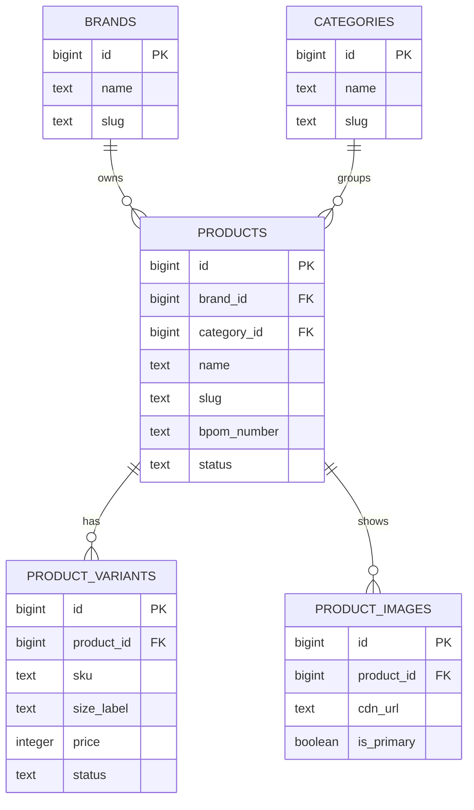
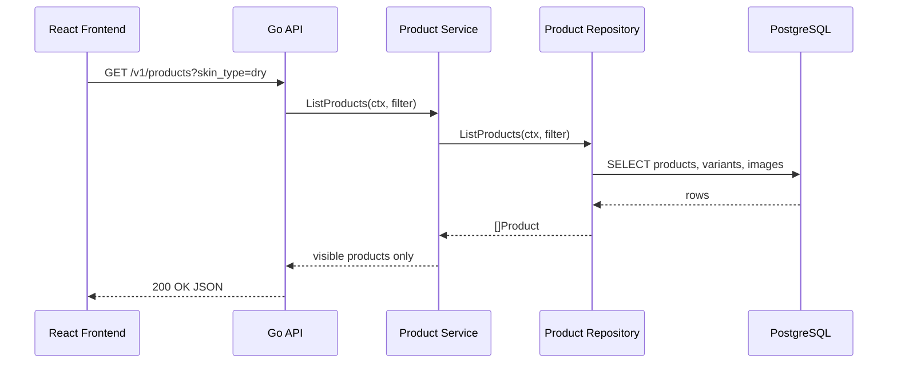

import { Section, Box, Steps, Step, Recap, CardGrid, Card, Chip, Hero, Compare, FileTree, Endpoint, Def } from "@components";

<Hero eyebrow="Roadmap 5 &middot; Domain Mastery" title="Domain Katalog Produk <em>Skincare</em><br />yang Siap Dijual">
  <p>Kita mulai Roadmap 5 dengan model katalog yang paham dunia skincare, bukan sekadar tabel produk generik.</p>
  <Fragment slot="meta">
    <Chip icon="code">Bahasa: <b>Go 1.26</b></Chip>
    <Chip icon="clock">~60 menit baca</Chip>
  </Fragment>
</Hero>

<Section num="01" id="intro" title="Katalog Skincare Bukan Produk Generik">

<p class="lead">Di React atau Laravel, katalog sering tampak seperti daftar kartu produk. Di backend, katalog adalah pusat data yang dipakai cart, inventory, checkout, SEO, admin, dan pencarian.</p>

<p>Produk skincare punya konteks yang lebih kaya daripada produk generik. Toner, serum, sunscreen, dan moisturizer perlu menyimpan tipe kulit, concern kulit, bahan aktif, instruksi penggunaan, nomor BPOM, ukuran variant, dan status kelayakan tampil.</p>

<Box variant="bridge" icon="🌉" label="Jembatan: dari product card ke domain model"><p>Di React, satu kartu produk bisa cukup punya `name`, `price`, dan `image`. Di Go backend, satu `Product` harus cukup stabil untuk menjadi sumber kebenaran bagi listing, detail, cart item, order item snapshot, dan admin workflow.</p></Box>

<p>Dalam modul ini, kita tidak mulai dari handler HTTP. Kita mulai dari domain: apa saja entitasnya, data apa yang wajib, mana yang milik produk, mana yang milik variant, dan batasan apa yang harus dijaga sebelum data tampil ke pelanggan.</p>

<CardGrid cols={3}>
  <Card><h4>Listing pelanggan</h4><p>Produk harus punya nama, slug, brand, category, gambar utama, status aktif, dan variant yang bisa dibeli.</p></Card>
  <Card><h4>Admin katalog</h4><p>Tim admin perlu mengatur BPOM, ingredient, instruksi pakai, status publish, dan variant SKU tanpa menyentuh kode.</p></Card>
  <Card><h4>Checkout nanti</h4><p>Cart dan order tidak membeli product langsung, tetapi membeli variant tertentu yang punya SKU dan harga sendiri.</p></Card>
</CardGrid>

</Section>

<Section num="02" id="entitas-inti" title="Entitas Inti Katalog">

<p class="lead">Katalog skincare kita dimulai dari empat entitas inti: `Product`, `Brand`, `Category`, dan `ProductVariant`.</p>

<p>`Product` adalah konsep barang yang dilihat pelanggan, misalnya Wardah Hydrating Toner. `ProductVariant` adalah pilihan yang benar-benar dibeli, misalnya 100ml atau 200ml. `Brand` memisahkan pemilik produk. `Category` membantu navigasi, filter, dan SEO.</p>



<p class="fig-cap"><b>Gambar 1.</b> ERD katalog produk skincare, produk menjadi induk informasi domain, variant menjadi unit jual.</p>

<Compare aLabel="Laravel / Eloquent" bLabel="Go domain model" aTone="muted" bTone="violet">
  <Fragment slot="a"><ul><li>Relasi sering dimulai dari model Active Record seperti `Product::with('variants')`.</li><li>Business rule mudah terselip di model, controller, request class, atau observer.</li></ul></Fragment>
  <Fragment slot="b"><ul><li>Struct domain dibuat sederhana, lalu repository hanya bertugas mengambil data.</li><li>Aturan seperti status publish dan variant aktif ditempatkan eksplisit di service atau method domain kecil.</li></ul></Fragment>
</Compare>

<FileTree title="Folder awal domain katalog" tree={`internal/
  product/                 # domain katalog produk skincare
    model.go               # Product, Brand, Category, ProductVariant
    repository.go          # kontrak akses data katalog
    service.go             # use case listing dan detail produk
    handler.go             # HTTP boundary untuk Roadmap 2 dan 4
  shared/
    errors.go              # domain error lintas modul
cmd/
  api/
    main.go                # wiring router, service, repository
db/
  migrations/
    501_create_catalog.up.sql
    501_create_catalog.down.sql
`} />

</Section>

<Section num="03" id="variant-sku-bpom" title="Variant, SKU, dan BPOM">

<p class="lead">Satu produk bisa punya banyak variant. Yang masuk cart adalah variant, bukan produk induk.</p>

<Def term="SKU"><p>SKU atau Stock Keeping Unit adalah kode unik internal untuk satu unit jual. Dalam proyek ini, Wardah Hydrating Toner 100ml dan 200ml punya SKU berbeda walau keduanya berasal dari produk yang sama.</p></Def>

<Def term="BPOM"><p>BPOM adalah Badan Pengawas Obat dan Makanan. Untuk katalog skincare Indonesia, `bpom_number` menyimpan nomor notifikasi atau izin edar yang bisa ditampilkan dan diverifikasi oleh tim operasional.</p></Def>

<p>Contoh domain yang kita pakai sepanjang roadmap:</p>

```text title="Contoh katalog"
Product:
  name: Wardah Hydrating Toner
  brand: Wardah
  category: Toner
  slug: wardah-hydrating-toner
  bpom_number: NA18231234567

Variants:
  SKU: WRD-TON-HYDR-100ML, size: 100ml, price: 35000
  SKU: WRD-TON-HYDR-200ML, size: 200ml, price: 59000
```

<Box variant="tip" icon="💡" label="Prinsip penting"><p>Harga dan stok biasanya melekat ke variant, bukan ke product. Ukuran 100ml dan 200ml hampir selalu berbeda harga, berat kirim, dan stok.</p></Box>

<p>Kita sengaja tidak membuat SKU otomatis dari nama produk saja. SKU sebaiknya stabil, unik, dan bisa tetap sama walau nama marketing berubah. Slug boleh berubah untuk SEO, SKU jangan sering berubah karena dipakai inventory, order, dan laporan.</p>

</Section>

<Section num="04" id="atribut-skincare" title="Atribut Skincare yang Bernilai Bisnis">

<p class="lead">Atribut skincare bukan pemanis UI. Ia menentukan filter katalog, rekomendasi, edukasi pelanggan, dan kepercayaan pembeli.</p>

<CardGrid cols={2}>
  <Card><h4>`skin_type`</h4><p>Nilai seperti `oily`, `dry`, `combination`, dan `sensitive`. Satu produk bisa cocok untuk lebih dari satu tipe kulit.</p></Card>
  <Card><h4>`skin_concern`</h4><p>Concern seperti acne, dullness, dehydration, redness, atau dark spot. Ini akan menjadi filter penting di product listing.</p></Card>
  <Card><h4>`ingredients`</h4><p>Daftar bahan atau bahan aktif. Untuk fase awal cukup `text[]`, lalu bisa dinormalisasi saat search dan edukasi ingredient makin penting.</p></Card>
  <Card><h4>`usage_instruction`</h4><p>Instruksi pemakaian yang tampil di halaman detail, misalnya gunakan setelah cleansing dan sebelum moisturizer.</p></Card>
</CardGrid>

<Box variant="bridge" icon="🌉" label="Jembatan: dari TypeScript union ke Go custom type"><p>Di TypeScript kamu mungkin menulis `type SkinType = 'oily' | 'dry'`. Di Go, kita pakai `type SkinType string` plus konstanta agar nilai domain tetap eksplisit, mudah dites, dan tetap ringan.</p></Box>

<p>Jangan campur atribut domain dengan copywriting promosi. `skin_type`, `skin_concern`, dan `ingredients` adalah data terstruktur. Kalimat seperti “kulit terasa segar dalam 7 hari” lebih cocok masuk `description` atau konten marketing, bukan aturan domain.</p>

</Section>

<Section num="05" id="status-slug-image" title="Status, Slug, dan Product Image">

<p class="lead">Produk tidak hanya ada atau tidak ada. Produk bisa aktif, tidak aktif, atau diarsipkan.</p>

<CardGrid cols={3}>
  <Card><h4>`active`</h4><p>Produk boleh tampil di katalog publik dan variant aktifnya boleh masuk cart.</p></Card>
  <Card><h4>`inactive`</h4><p>Produk disiapkan atau ditahan sementara. Admin bisa melihat, pelanggan tidak.</p></Card>
  <Card><h4>`archived`</h4><p>Produk lama disimpan untuk riwayat, audit, dan referensi order lama, tetapi tidak dipakai untuk penjualan baru.</p></Card>
</CardGrid>

<p>Slug adalah URL SEO-friendly, misalnya `/products/wardah-hydrating-toner`. Slug harus unik, stabil, dan tidak menjadi primary key. Primary key tetap `id`, karena slug bisa berubah saat tim marketing mengubah nama produk.</p>

<p>Product image di database sebaiknya URL CDN, bukan binary file. File gambar akan hidup di storage seperti S3 dan disajikan lewat CDN seperti CloudFront pada Roadmap 8. Database cukup menyimpan URL, alt text, urutan, dan penanda gambar utama.</p>

<Box variant="warn" icon="⚠️" label="Jangan simpan binary gambar di tabel produk"><p>Binary gambar membuat backup database membengkak, query katalog makin berat, dan scaling CDN jadi sulit. Simpan file di object storage, simpan referensinya di PostgreSQL.</p></Box>

</Section>

<Section num="06" id="schema-postgresql" title="Skema PostgreSQL untuk Katalog">

<p class="lead">Skema awal harus cukup ketat untuk menjaga integritas, tetapi tetap fleksibel untuk bertumbuh saat fitur search, promo, dan rekomendasi masuk.</p>

```sql title="db/migrations/501_create_catalog.up.sql"
CREATE TABLE brands (
  id BIGINT GENERATED ALWAYS AS IDENTITY PRIMARY KEY,
  name TEXT NOT NULL,
  slug TEXT NOT NULL UNIQUE,
  created_at TIMESTAMPTZ NOT NULL DEFAULT NOW(),
  updated_at TIMESTAMPTZ NOT NULL DEFAULT NOW()
);

CREATE TABLE categories (
  id BIGINT GENERATED ALWAYS AS IDENTITY PRIMARY KEY,
  name TEXT NOT NULL,
  slug TEXT NOT NULL UNIQUE,
  created_at TIMESTAMPTZ NOT NULL DEFAULT NOW(),
  updated_at TIMESTAMPTZ NOT NULL DEFAULT NOW()
);

CREATE TABLE products (
  id BIGINT GENERATED ALWAYS AS IDENTITY PRIMARY KEY,
  brand_id BIGINT NOT NULL REFERENCES brands(id),
  category_id BIGINT NOT NULL REFERENCES categories(id),
  name TEXT NOT NULL,
  slug TEXT NOT NULL UNIQUE,
  description TEXT NOT NULL DEFAULT '',
  bpom_number TEXT NOT NULL,
  skin_types TEXT[] NOT NULL DEFAULT '{}',
  skin_concerns TEXT[] NOT NULL DEFAULT '{}',
  ingredients TEXT[] NOT NULL DEFAULT '{}',
  usage_instruction TEXT NOT NULL DEFAULT '',
  status TEXT NOT NULL DEFAULT 'inactive',
  created_at TIMESTAMPTZ NOT NULL DEFAULT NOW(),
  updated_at TIMESTAMPTZ NOT NULL DEFAULT NOW(),
  CONSTRAINT products_status_check CHECK (status IN ('active', 'inactive', 'archived')),
  CONSTRAINT products_skin_types_check CHECK (skin_types <@ ARRAY['oily', 'dry', 'combination', 'sensitive']::TEXT[]),
  CONSTRAINT products_bpom_number_check CHECK (length(trim(bpom_number)) >= 6)
);

CREATE TABLE product_variants (
  id BIGINT GENERATED ALWAYS AS IDENTITY PRIMARY KEY,
  product_id BIGINT NOT NULL REFERENCES products(id),
  sku TEXT NOT NULL UNIQUE,
  name TEXT NOT NULL DEFAULT '',
  size_label TEXT NOT NULL,
  volume_ml INTEGER,
  price INTEGER NOT NULL,
  weight_grams INTEGER NOT NULL DEFAULT 0,
  status TEXT NOT NULL DEFAULT 'active',
  created_at TIMESTAMPTZ NOT NULL DEFAULT NOW(),
  updated_at TIMESTAMPTZ NOT NULL DEFAULT NOW(),
  CONSTRAINT product_variants_status_check CHECK (status IN ('active', 'inactive', 'archived')),
  CONSTRAINT product_variants_price_check CHECK (price > 0),
  CONSTRAINT product_variants_volume_check CHECK (volume_ml IS NULL OR volume_ml > 0),
  CONSTRAINT product_variants_weight_check CHECK (weight_grams >= 0)
);

CREATE TABLE product_images (
  id BIGINT GENERATED ALWAYS AS IDENTITY PRIMARY KEY,
  product_id BIGINT NOT NULL REFERENCES products(id),
  cdn_url TEXT NOT NULL,
  alt_text TEXT NOT NULL DEFAULT '',
  sort_order INTEGER NOT NULL DEFAULT 0,
  is_primary BOOLEAN NOT NULL DEFAULT FALSE,
  created_at TIMESTAMPTZ NOT NULL DEFAULT NOW(),
  CONSTRAINT product_images_url_check CHECK (cdn_url LIKE 'https://%')
);

CREATE INDEX idx_products_brand_id ON products(brand_id);
CREATE INDEX idx_products_category_id ON products(category_id);
CREATE INDEX idx_products_status ON products(status);
CREATE INDEX idx_product_variants_product_id ON product_variants(product_id);
CREATE INDEX idx_product_images_product_id ON product_images(product_id);
```

<Box variant="note" icon="🧭" label="Kenapa `TEXT[]` untuk fase awal"><p>Untuk Roadmap 5 awal, array PostgreSQL cukup praktis untuk filter tipe kulit dan concern. Saat kebutuhan search ingredient makin kompleks, kita bisa memecahnya menjadi tabel relasi seperti `product_ingredients`.</p></Box>

<p>Data contoh untuk seed lokal:</p>

```sql title="db/seeds/catalog.sql"
INSERT INTO brands (name, slug)
VALUES ('Wardah', 'wardah');

INSERT INTO categories (name, slug)
VALUES ('Toner', 'toner');

INSERT INTO products (
  brand_id,
  category_id,
  name,
  slug,
  description,
  bpom_number,
  skin_types,
  skin_concerns,
  ingredients,
  usage_instruction,
  status
)
VALUES (
  1,
  1,
  'Wardah Hydrating Toner',
  'wardah-hydrating-toner',
  'Hydrating toner untuk membantu menjaga kelembapan kulit setelah cleansing.',
  'NA18231234567',
  ARRAY['dry', 'combination', 'sensitive'],
  ARRAY['dehydration', 'redness'],
  ARRAY['Aqua', 'Glycerin', 'Aloe Vera Extract'],
  'Tuang ke kapas atau telapak tangan, lalu aplikasikan ke wajah setelah cleansing.',
  'active'
);

INSERT INTO product_variants (product_id, sku, name, size_label, volume_ml, price, weight_grams)
VALUES
  (1, 'WRD-TON-HYDR-100ML', '100ml', '100ml', 100, 35000, 140),
  (1, 'WRD-TON-HYDR-200ML', '200ml', '200ml', 200, 59000, 260);

INSERT INTO product_images (product_id, cdn_url, alt_text, sort_order, is_primary)
VALUES (1, 'https://cdn.example.com/products/wardah-hydrating-toner/main.webp', 'Wardah Hydrating Toner bottle', 1, TRUE);
```

</Section>

<Section num="07" id="model-go" title="Model Go dan Boundary Domain">

<p class="lead">Model Go dibuat jelas, kecil, dan tidak bergantung ke HTTP maupun PostgreSQL driver.</p>

```go title="internal/product/model.go"
package product

import "time"

type ProductID int64
type BrandID int64
type CategoryID int64
type ProductVariantID int64

type ProductStatus string

const (
	ProductStatusActive   ProductStatus = "active"
	ProductStatusInactive ProductStatus = "inactive"
	ProductStatusArchived ProductStatus = "archived"
)

type SkinType string

const (
	SkinTypeOily        SkinType = "oily"
	SkinTypeDry         SkinType = "dry"
	SkinTypeCombination SkinType = "combination"
	SkinTypeSensitive   SkinType = "sensitive"
)

type Brand struct {
	ID        BrandID
	Name      string
	Slug      string
	CreatedAt time.Time
	UpdatedAt time.Time
}

type Category struct {
	ID        CategoryID
	Name      string
	Slug      string
	CreatedAt time.Time
	UpdatedAt time.Time
}

type Product struct {
	ID               ProductID
	BrandID          BrandID
	CategoryID       CategoryID
	Name             string
	Slug             string
	Description      string
	BPOMNumber       string
	SkinTypes        []SkinType
	SkinConcerns     []string
	Ingredients      []string
	UsageInstruction string
	Status           ProductStatus
	Images           []ProductImage
	Variants         []ProductVariant
	CreatedAt        time.Time
	UpdatedAt        time.Time
}

type ProductVariant struct {
	ID          ProductVariantID
	ProductID   ProductID
	SKU         string
	Name        string
	SizeLabel   string
	VolumeML    *int
	Price       int
	WeightGrams int
	Status      ProductStatus
	CreatedAt   time.Time
	UpdatedAt   time.Time
}

type ProductImage struct {
	ID        int64
	ProductID ProductID
	CDNURL    string
	AltText   string
	SortOrder int
	IsPrimary bool
	CreatedAt time.Time
}

func (p Product) IsVisibleToCustomer() bool {
	if p.Status != ProductStatusActive {
		return false
	}

	for _, variant := range p.Variants {
		if variant.Status == ProductStatusActive {
			return true
		}
	}

	return false
}
```

<Box variant="tip" icon="💡" label="Idiomatic Go"><p>Repository boleh tahu SQL, handler boleh tahu HTTP, tetapi `model.go` sebaiknya tetap domain murni. Ini membuat service mudah dites tanpa database dan tanpa `httptest`.</p></Box>

<p>Kontrak repository menerima `context.Context` sebagai parameter pertama. Ini mengikuti pola Go backend yang memungkinkan timeout, cancelation, dan tracing masuk dari HTTP request sampai query database.</p>

```go title="internal/product/repository.go"
package product

import "context"

type ListProductsFilter struct {
	CategorySlug string
	BrandSlug    string
	SkinType     SkinType
	Concern      string
	Limit        int
	Offset       int
}

type Repository interface {
	ListProducts(ctx context.Context, filter ListProductsFilter) ([]Product, error)
	GetProductBySlug(ctx context.Context, slug string) (Product, error)
	GetVariantBySKU(ctx context.Context, sku string) (ProductVariant, error)
}
```

<p>Service memegang use case. Handler nanti hanya parse query, memanggil service, lalu menulis JSON.</p>

```go title="internal/product/service.go"
package product

import (
	"context"
	"errors"
	"strings"
)

var ErrProductNotFound = errors.New("product not found")

type Service struct {
	repo Repository
}

func NewService(repo Repository) Service {
	return Service{repo: repo}
}

func (s Service) ListProducts(ctx context.Context, filter ListProductsFilter) ([]Product, error) {
	if filter.Limit <= 0 || filter.Limit > 50 {
		filter.Limit = 20
	}

	if filter.Offset < 0 {
		filter.Offset = 0
	}

	products, err := s.repo.ListProducts(ctx, filter)
	if err != nil {
		return nil, err
	}

	visible := make([]Product, 0, len(products))
	for _, item := range products {
		if item.IsVisibleToCustomer() {
			visible = append(visible, item)
		}
	}

	return visible, nil
}

func (s Service) GetProductDetail(ctx context.Context, slug string) (Product, error) {
	slug = strings.TrimSpace(slug)
	if slug == "" {
		return Product{}, ErrProductNotFound
	}

	product, err := s.repo.GetProductBySlug(ctx, slug)
	if err != nil {
		return Product{}, err
	}

	if !product.IsVisibleToCustomer() {
		return Product{}, ErrProductNotFound
	}

	return product, nil
}
```

</Section>

<Section num="08" id="api-hands-on" title="API dan Hands-on Ringan">

<p class="lead">Untuk pelanggan, katalog minimal butuh endpoint listing dan detail. Untuk admin, katalog akan bertambah ke create, update, dan archive pada modul berikutnya.</p>

<Endpoint method="GET" path="/v1/products" desc="Daftar produk aktif dengan filter category, brand, skin_type, concern, limit, dan offset" />
<Endpoint method="GET" path="/v1/products/{slug}" desc="Detail produk aktif beserta brand, category, gambar, dan variant aktif" />
<Endpoint method="GET" path="/v1/admin/products" desc="Daftar produk untuk admin, termasuk inactive dan archived" />

<p>Alur request katalog publik:</p>



<p class="fig-cap"><b>Gambar 2.</b> Handler tidak memutuskan produk aktif atau tidak, keputusan visibility hidup di service dan domain.</p>

<Steps>
  <Step><b>Buat migration katalog</b><p>Simpan DDL dari section skema ke `db/migrations/501_create_catalog.up.sql`.</p></Step>
  <Step><b>Jalankan migration lokal</b><p>Pakai tool migration yang sudah dipelajari di Roadmap 3, lalu verifikasi tabel `products` dan `product_variants` muncul.</p></Step>
  <Step><b>Masukkan seed</b><p>Jalankan contoh seed Wardah Hydrating Toner agar endpoint listing punya data nyata.</p></Step>
  <Step><b>Buat repository bertahap</b><p>Mulai dari `GetProductBySlug`, lalu lanjut `ListProducts` dengan filter sederhana.</p></Step>
</Steps>

```bash title="Terminal"
psql "$DB_URL" -f db/migrations/501_create_catalog.up.sql
psql "$DB_URL" -f db/seeds/catalog.sql
psql "$DB_URL" -c "SELECT slug, status FROM products;"
```

<Box variant="note" icon="📝" label="Checkpoint praktik"><p>Setelah modul ini, kamu belum perlu membangun search canggih. Targetnya adalah model katalog yang benar, seed lokal yang masuk akal, dan service yang hanya menampilkan produk aktif.</p></Box>

</Section>

<Section num="09" id="jebakan-umum" title="Jebakan Umum Developer JS dan PHP">

<p class="lead">Kesalahan katalog biasanya bukan karena sintaks Go, tetapi karena batas domain yang kabur.</p>

<CardGrid cols={2}>
  <Card><h4>Harga di `Product` saja</h4><p>Ini rusak saat ukuran 100ml dan 200ml punya harga berbeda. Taruh harga jual di `ProductVariant`.</p></Card>
  <Card><h4>Cart menyimpan product ID</h4><p>Cart harus menyimpan variant ID atau SKU, karena pembeli memilih unit jual tertentu.</p></Card>
  <Card><h4>Slug dijadikan identitas internal</h4><p>Slug boleh berubah untuk SEO. Pakai ID internal untuk relasi database, pakai slug untuk URL publik.</p></Card>
  <Card><h4>Gambar masuk database sebagai binary</h4><p>Database menjadi berat dan CDN sulit dipakai. Simpan URL CDN dan metadata gambar.</p></Card>
  <Card><h4>Status hanya boolean</h4><p>`is_active` tidak membedakan draft, sementara, dan arsip. Gunakan status domain yang eksplisit.</p></Card>
  <Card><h4>BPOM dianggap opsional</h4><p>Untuk pasar Indonesia, nomor BPOM penting untuk trust, operasional, dan moderasi katalog skincare.</p></Card>
</CardGrid>

<Box variant="warn" icon="⚠️" label="Jebakan validasi"><p>`price > 0` bisa dijaga di database dan input validation admin. Tetapi “produk boleh dibeli” adalah business rule karena bergantung pada status produk, status variant, dan nanti stok inventory.</p></Box>

</Section>

<Section num="10" id="ringkasan" title="Ringkasan & Poin Penting">

<p class="lead">Katalog adalah fondasi domain online shop skincare. Desain yang benar di sini membuat cart, inventory, checkout, payment, dan search jauh lebih bersih.</p>

<Recap title="Yang Wajib Menempel">
  <ul><li>`Product` adalah konsep produk yang dilihat pelanggan, sedangkan `ProductVariant` adalah unit jual yang masuk cart.</li><li>SKU harus unik dan stabil karena dipakai inventory, order, laporan, dan operasional gudang.</li><li>`bpom_number` penting untuk katalog skincare Indonesia, terutama untuk trust dan proses review internal.</li><li>Atribut skincare seperti `skin_types`, `skin_concerns`, `ingredients`, dan `usage_instruction` adalah data domain, bukan sekadar teks UI.</li><li>Status `active`, `inactive`, dan `archived` lebih jelas daripada boolean tunggal.</li><li>Slug dipakai untuk URL publik, tetapi relasi database tetap memakai ID.</li><li>Gambar produk disimpan sebagai URL CDN dan metadata, bukan binary di PostgreSQL.</li><li>Langkah berikutnya adalah menghubungkan katalog ke inventory, cart, dan aturan produk yang boleh dibeli.</li></ul>
</Recap>

</Section>
