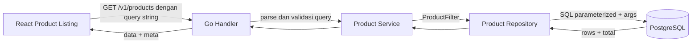

import { Section, Box, Steps, Step, Recap, CardGrid, Card, Chip, Hero, Compare, Endpoint, Def } from "@components";

<Hero eyebrow="Roadmap 5 &middot; Domain Online Shop" title="Pencarian dan Filter <em>Produk</em><br />untuk Discovery Skincare">
  <p>Modul ini mengubah katalog produk dari daftar statis menjadi pengalaman belanja yang bisa dicari, disaring, diurutkan, dan dipaginasi.</p>
  <Fragment slot="meta">
    <Chip icon="code">Bahasa: <b>Go 1.26</b></Chip>
    <Chip icon="clock">~60 menit baca</Chip>
  </Fragment>
</Hero>

<Section num="01" id="intro" title="Discovery Produk sebagai Fitur Bisnis" sub="Pencarian produk bukan sekadar SELECT, tetapi cara customer menemukan produk yang cocok untuk kulitnya.">

<p class="lead">Di React, halaman katalog biasanya punya search box, filter sidebar, sort dropdown, dan pagination. Di backend Go, semua itu harus menjadi kontrak query yang jelas dan SQL yang aman.</p>

Pada online shop skincare, discovery produk punya bobot bisnis besar. Customer tidak selalu tahu nama produk. Mereka bisa mencari "toner", memilih brand tertentu, menyaring produk untuk `oily skin`, memilih concern `acne`, lalu mengurutkan dari harga termurah. API harus mendukung perilaku itu tanpa membuat query rentan SQL injection atau lambat saat data mulai banyak.

<Box variant="bridge" icon="🌉" label="Jembatan: dari filter state React ke struct Go"><p>Di React, filter sering hidup sebagai state seperti `search`, `brandId`, `sort`, dan `page`. Di Go, bentuk yang sama lebih aman dimodelkan sebagai `ProductFilter` agar parsing HTTP, validasi, dan query database tidak bercampur.</p></Box>

<Def term="product discovery"><p>Proses customer menemukan produk yang relevan lewat pencarian, filter, sorting, dan pagination. Ini berbeda dari sekadar detail produk berbasis slug.</p></Def>

Rujukan resmi yang relevan untuk modul ini adalah dokumentasi PostgreSQL tentang [pattern matching](https://www.postgresql.org/docs/current/functions-matching.html), [array operators](https://www.postgresql.org/docs/current/functions-array.html), [GIN index](https://www.postgresql.org/docs/current/gin.html), [pg_trgm](https://www.postgresql.org/docs/current/pgtrgm.html), dokumentasi Go untuk [strings.Builder](https://pkg.go.dev/strings#Builder), dan dokumentasi [pgxpool](https://pkg.go.dev/github.com/jackc/pgx/v5/pgxpool).



<p class="fig-cap"><b>Gambar 1.</b> Alur discovery produk dari UI sampai response paginasi.</p>

</Section>

<Section num="02" id="kontrak-api" title="Kontrak API Search dan Filter" sub="Mulai dari URL yang enak dipakai frontend, baru turunkan ke struct dan SQL.">

<p class="lead">Endpoint utama katalog harus stabil, mudah di-cache, dan mudah dibaca dari log.</p>

<Endpoint method="GET" path="/v1/products?category_id=1&amp;skin_type=oily&amp;sort=price_asc&amp;page=1" desc="Discovery produk aktif dengan filter kategori, tipe kulit, sorting harga, dan paginasi" />

Parameter yang kita dukung pada modul ini:

<CardGrid cols={3}>
  <Card><h4>`q`</h4><p>Keyword nama produk, misalnya `toner`, `serum`, atau `wardah`.</p></Card>
  <Card><h4>`brand_id` dan `category_id`</h4><p>Filter relasional berbasis ID agar stabil walau nama brand atau kategori berubah.</p></Card>
  <Card><h4>`skin_type` dan `skin_concern`</h4><p>Filter khas skincare, cocok untuk array PostgreSQL atau tabel relasi terpisah.</p></Card>
  <Card><h4>`harga_min` dan `harga_max`</h4><p>Rentang harga variant, bukan harga produk utama, karena satu produk bisa punya banyak ukuran.</p></Card>
  <Card><h4>`sort`</h4><p>Whitelist nilai seperti `newest`, `price_asc`, `price_desc`, dan `popular`.</p></Card>
  <Card><h4>`page` dan `per_page`</h4><p>Paginasi eksplisit dengan response meta agar frontend tahu total data dan total halaman.</p></Card>
</CardGrid>

<Box variant="warn" icon="⚠️" label="Jangan kirim filter sebagai JSON body untuk listing"><p>Untuk listing produk, query string lebih cocok karena URL bisa dibagikan, di-bookmark, dilacak di analytics, dan lebih mudah di-cache dibanding body pada request GET.</p></Box>

Contoh response yang diharapkan:

```json title="GET /v1/products response"
{
  "data": [
    {
      "id": 101,
      "name": "Wardah Hydrating Toner",
      "slug": "wardah-hydrating-toner",
      "brand_name": "Wardah",
      "category_name": "Toner",
      "price_min": 29000,
      "order_count": 184
    }
  ],
  "meta": {
    "page": 1,
    "per_page": 20,
    "total": 87,
    "total_pages": 5
  }
}
```

</Section>

<Section num="03" id="model-query-response" title="Model Query dan Response" sub="Pisahkan input filter, item listing, dan metadata pagination.">

<p class="lead">Di Laravel, kamu mungkin menulis query langsung dari `request()->query()`. Di Go, lebih rapi jika query string dipetakan dulu ke struct kecil.</p>

```go title="internal/product/search_model.go"
package product

type Sort string

const (
	SortNewest    Sort = "newest"
	SortPriceAsc  Sort = "price_asc"
	SortPriceDesc Sort = "price_desc"
	SortPopular   Sort = "popular"
)

type ProductFilter struct {
	Search       string
	BrandID      int64
	CategoryID   int64
	SkinTypes    []string
	SkinConcerns []string
	PriceMin     *int64
	PriceMax     *int64
	Sort         Sort
	Page         int
	PerPage      int
}

type ProductListItem struct {
	ID           int64
	Name         string
	Slug         string
	BrandName    string
	CategoryName string
	PriceMin     int64
	OrderCount   int64
}

type PageMeta struct {
	Page       int
	PerPage    int
	Total      int
	TotalPages int
}

type ProductSearchResult struct {
	Items []ProductListItem
	Meta  PageMeta
}
```

<Compare aLabel="JS / PHP: nilai kosong sering longgar" bLabel="Go: bedakan kosong dan tidak dikirim" aTone="muted" bTone="violet">
  <Fragment slot="a"><ul><li>`harga_min=0` bisa terlihat sama dengan parameter yang tidak ada jika parsing tidak hati-hati.</li><li>Nilai dari query string biasanya string dulu, lalu dikonversi belakangan.</li></ul></Fragment>
  <Fragment slot="b"><ul><li>`*int64` membantu membedakan harga nol yang valid dari parameter yang tidak dikirim.</li><li>Struct filter membuat default, validasi, dan query builder lebih mudah dites.</li></ul></Fragment>
</Compare>

<Box variant="tip" icon="💡" label="Default yang sehat"><p>Gunakan `page=1`, `per_page=20`, sort default `newest`, dan batas maksimum `per_page` seperti 100 agar satu request tidak mengambil terlalu banyak row.</p></Box>

</Section>

<Section num="04" id="filter-postgresql" title="Search dan Filter di PostgreSQL" sub="Pilih operator berdasarkan jenis filter, bukan berdasarkan kebiasaan ORM.">

<p class="lead">PostgreSQL memberi beberapa cara berbeda untuk search dan filter. Yang penting adalah memilih operator yang sesuai dengan bentuk datanya.</p>

Untuk search nama, kebutuhan awal bisa memakai `ILIKE '%keyword%'`. Operator ini case-insensitive, sehingga customer yang mengetik `wardah`, `Wardah`, atau `WARDAH` tetap mendapat hasil yang sama. Namun, wildcard di depan seperti `%toner%` perlu perhatian performa saat data besar.

```sql title="search-by-name.sql"
SELECT p.id, p.name, p.slug
FROM products p
WHERE p.status = 'active'
  AND p.name ILIKE '%toner%';
```

Untuk brand dan category, gunakan ID karena relasinya stabil dan mudah di-index.

```sql title="filter-brand-category.sql"
SELECT p.id, p.name, p.slug
FROM products p
WHERE p.status = 'active'
  AND p.brand_id = 3
  AND p.category_id = 1;
```

Untuk atribut skincare seperti tipe kulit dan concern, ada dua desain umum:

<Compare aLabel="Array di kolom products" bLabel="Join table terpisah" aTone="teal" bTone="blue">
  <Fragment slot="a"><ul><li>Cepat untuk awal proyek, misalnya `skin_types text[]` dan `skin_concerns text[]`.</li><li>Operator overlap `&&` cocok untuk mencari produk yang punya minimal satu nilai yang sama.</li></ul></Fragment>
  <Fragment slot="b"><ul><li>Lebih normalisasi, cocok jika butuh metadata tiap concern, slug, urutan, atau admin CRUD.</li><li>Query lebih eksplisit lewat `product_skin_types` dan `product_skin_concerns`.</li></ul></Fragment>
</Compare>

```sql title="filter-skin-attributes-array.sql"
SELECT p.id, p.name, p.slug
FROM products p
WHERE p.status = 'active'
  AND p.skin_types && ARRAY['oily']::text[]
  AND p.skin_concerns && ARRAY['acne', 'large_pores']::text[];
```

Untuk harga, filter harus membaca `product_variants`, bukan hanya `products`. Satu produk bisa punya variant 100ml dan 200ml dengan harga berbeda, jadi discovery biasanya menampilkan `price_min` dari variant aktif.

```sql title="filter-price-range.sql"
SELECT p.id, p.name, MIN(pv.price) AS price_min
FROM products p
JOIN product_variants pv ON pv.product_id = p.id AND pv.status = 'active'
WHERE p.status = 'active'
  AND pv.price >= 25000
  AND pv.price <= 100000
GROUP BY p.id, p.name;
```

<Box variant="note" icon="🧴" label="Konteks skincare"><p>Produk seperti Wardah Hydrating Toner 100ml dan 200ml tetap satu produk, tetapi punya dua variant. Filter harga harus menjawab apakah ada variant yang masuk rentang, bukan apakah produk punya satu harga tunggal.</p></Box>

</Section>

<Section num="05" id="query-builder-go" title="Query Builder Pattern di Go" sub="SQL boleh dinamis, tetapi nilai user tetap harus masuk sebagai parameter.">

<p class="lead">Query builder di sini bukan ORM. Ia hanya pola kecil untuk menyusun potongan SQL dan daftar argumen secara aman.</p>

<Def term="query builder pattern"><p>Pola untuk membangun SQL dari bagian kecil seperti `JOIN`, `WHERE`, `ORDER BY`, `LIMIT`, dan `args`, dengan tetap memakai parameterized query.</p></Def>

<Box variant="warn" icon="⚠️" label="Aturan utama"><p>Nilai dari user tidak boleh disisipkan langsung ke string SQL. Masukkan nilai ke `args`, lalu pakai placeholder `$1`, `$2`, dan seterusnya.</p></Box>

```go title="internal/product/repository_search.go"
package product

import (
	"context"
	"errors"
	"fmt"
	"strings"

	"github.com/jackc/pgx/v5/pgxpool"
)

var ErrInvalidSort = errors.New("invalid product sort")

type Repository struct {
	pool *pgxpool.Pool
}

func NewRepository(pool *pgxpool.Pool) *Repository {
	return &Repository{pool: pool}
}

type productQueryParts struct {
	joins []string
	where []string
	args  []any
}

func (p *productQueryParts) addArg(value any) string {
	p.args = append(p.args, value)
	return fmt.Sprintf("$%d", len(p.args))
}

func (r *Repository) ListProducts(ctx context.Context, filter ProductFilter) (ProductSearchResult, error) {
	filter = normalizeFilter(filter)

	orderBy, err := orderByClause(filter.Sort)
	if err != nil {
		return ProductSearchResult{}, err
	}

	parts := buildProductQueryParts(filter)
	whereSQL := strings.Join(parts.where, " AND ")
	joinSQL := strings.Join(parts.joins, "\n")

	countSQL := fmt.Sprintf(`
SELECT COUNT(DISTINCT p.id)
FROM products p
%s
WHERE %s`, joinSQL, whereSQL)

	var total int
	if err := r.pool.QueryRow(ctx, countSQL, parts.args...).Scan(&total); err != nil {
		return ProductSearchResult{}, fmt.Errorf("count products: %w", err)
	}

	limitPlaceholder := parts.addArg(filter.PerPage)
	offsetPlaceholder := parts.addArg((filter.Page - 1) * filter.PerPage)

	var listSQL strings.Builder
	fmt.Fprintf(&listSQL, `
SELECT
  p.id,
  p.name,
  p.slug,
  b.name AS brand_name,
  c.name AS category_name,
  MIN(pv.price) AS price_min,
  COALESCE(ps.order_count, 0) AS order_count
FROM products p
%s
WHERE %s
GROUP BY p.id, p.name, p.slug, b.name, c.name, ps.order_count, p.created_at
ORDER BY %s
LIMIT %s OFFSET %s`, joinSQL, whereSQL, orderBy, limitPlaceholder, offsetPlaceholder)

	rows, err := r.pool.Query(ctx, listSQL.String(), parts.args...)
	if err != nil {
		return ProductSearchResult{}, fmt.Errorf("list products: %w", err)
	}
	defer rows.Close()

	items := make([]ProductListItem, 0, filter.PerPage)
	for rows.Next() {
		var item ProductListItem
		if err := rows.Scan(
			&item.ID,
			&item.Name,
			&item.Slug,
			&item.BrandName,
			&item.CategoryName,
			&item.PriceMin,
			&item.OrderCount,
		); err != nil {
			return ProductSearchResult{}, fmt.Errorf("scan product: %w", err)
		}
		items = append(items, item)
	}

	if err := rows.Err(); err != nil {
		return ProductSearchResult{}, fmt.Errorf("iterate products: %w", err)
	}

	return ProductSearchResult{
		Items: items,
		Meta: PageMeta{
			Page:       filter.Page,
			PerPage:    filter.PerPage,
			Total:      total,
			TotalPages: totalPages(total, filter.PerPage),
		},
	}, nil
}

func buildProductQueryParts(filter ProductFilter) productQueryParts {
	parts := productQueryParts{
		joins: []string{
			"JOIN brands b ON b.id = p.brand_id",
			"JOIN categories c ON c.id = p.category_id",
			"JOIN product_variants pv ON pv.product_id = p.id AND pv.status = 'active'",
			"LEFT JOIN product_stats ps ON ps.product_id = p.id",
		},
		where: []string{"p.status = 'active'"},
	}

	if filter.Search != "" {
		pattern := "%" + escapeLike(filter.Search) + "%"
		parts.where = append(parts.where, "p.name ILIKE "+parts.addArg(pattern)+" ESCAPE '\\'")
	}

	if filter.BrandID > 0 {
		parts.where = append(parts.where, "p.brand_id = "+parts.addArg(filter.BrandID))
	}

	if filter.CategoryID > 0 {
		parts.where = append(parts.where, "p.category_id = "+parts.addArg(filter.CategoryID))
	}

	if len(filter.SkinTypes) > 0 {
		parts.where = append(parts.where, "p.skin_types && "+parts.addArg(filter.SkinTypes)+"::text[]")
	}

	if len(filter.SkinConcerns) > 0 {
		parts.where = append(parts.where, "p.skin_concerns && "+parts.addArg(filter.SkinConcerns)+"::text[]")
	}

	if filter.PriceMin != nil {
		parts.where = append(parts.where, "pv.price >= "+parts.addArg(*filter.PriceMin))
	}

	if filter.PriceMax != nil {
		parts.where = append(parts.where, "pv.price <= "+parts.addArg(*filter.PriceMax))
	}

	return parts
}

func normalizeFilter(filter ProductFilter) ProductFilter {
	filter.Search = strings.TrimSpace(filter.Search)

	if filter.Page < 1 {
		filter.Page = 1
	}

	if filter.PerPage < 1 {
		filter.PerPage = 20
	}

	if filter.PerPage > 100 {
		filter.PerPage = 100
	}

	if filter.Sort == "" {
		filter.Sort = SortNewest
	}

	return filter
}

func orderByClause(sort Sort) (string, error) {
	switch sort {
	case SortNewest:
		return "p.created_at DESC, p.id DESC", nil
	case SortPriceAsc:
		return "price_min ASC, p.id ASC", nil
	case SortPriceDesc:
		return "price_min DESC, p.id DESC", nil
	case SortPopular:
		return "order_count DESC, p.created_at DESC, p.id DESC", nil
	default:
		return "", ErrInvalidSort
	}
}

func totalPages(total int, perPage int) int {
	if total == 0 {
		return 0
	}
	return (total + perPage - 1) / perPage
}

func escapeLike(value string) string {
	replacer := strings.NewReplacer(`\`, `\\`, `%`, `\%`, `_`, `\_`)
	return replacer.Replace(value)
}
```

<Box variant="tip" icon="💡" label="Kenapa sort pakai whitelist"><p>Placeholder hanya bisa menggantikan nilai, bukan nama kolom atau arah sorting. Karena itu `ORDER BY` harus dipilih dari daftar yang kita kontrol sendiri.</p></Box>

</Section>

<Section num="06" id="sort-pagination" title="Sorting dan Pagination" sub="Sorting adalah kontrak bisnis, pagination adalah kontrak operasional.">

<p class="lead">Frontend butuh pilihan sorting yang terasa natural. Backend butuh sorting yang deterministik agar hasil tidak lompat antar halaman.</p>

Sort yang dipakai modul ini:

<CardGrid cols={2}>
  <Card><h4>`newest`</h4><p>`created_at DESC, id DESC`, cocok untuk katalog yang sering mendapat produk baru.</p></Card>
  <Card><h4>`price_asc`</h4><p>`price_min ASC, id ASC`, cocok untuk customer yang sensitif harga.</p></Card>
  <Card><h4>`price_desc`</h4><p>`price_min DESC, id DESC`, cocok untuk customer yang mencari produk premium.</p></Card>
  <Card><h4>`popular`</h4><p>`order_count DESC, created_at DESC`, cocok untuk highlight produk yang sering dibeli.</p></Card>
</CardGrid>

Pagination awal memakai `page` dan `per_page` karena mudah dipahami frontend. Rumus offset sederhana: `offset = (page - 1) * per_page`. Response meta mengembalikan `total` dan `total_pages` supaya React bisa menampilkan nomor halaman.

```sql title="pagination-shape.sql"
SELECT p.id, p.name
FROM products p
WHERE p.status = 'active'
ORDER BY p.created_at DESC, p.id DESC
LIMIT 20 OFFSET 0;
```

<Box variant="warn" icon="⚠️" label="OFFSET besar bisa lambat"><p>Untuk katalog kecil sampai menengah, `page` dan `per_page` cukup. Saat data dan traffic besar, pertimbangkan keyset pagination di Roadmap 9 agar halaman dalam tetap cepat.</p></Box>

Popular sorting butuh `order_count`. Untuk modul ini kita anggap ada tabel ringkas `product_stats` yang diperbarui saat order selesai. Menghitung `COUNT(order_items)` langsung di setiap request katalog bisa mahal saat traffic meningkat.

```sql title="product-stats.sql"
CREATE TABLE product_stats (
  product_id BIGINT PRIMARY KEY REFERENCES products(id),
  order_count BIGINT NOT NULL DEFAULT 0,
  updated_at TIMESTAMPTZ NOT NULL DEFAULT NOW()
);
```

</Section>

<Section num="07" id="index-performa" title="Index untuk Performa Filter" sub="Index harus mengikuti pola query yang benar-benar dipakai, bukan sekadar semua kolom diberi index.">

<p class="lead">Filter katalog akan sering dipanggil. Tanpa index yang tepat, endpoint ini bisa menjadi bottleneck utama sebelum checkout sekalipun.</p>

PostgreSQL memakai B-tree sebagai index default dan cocok untuk equality filter seperti `brand_id`, `category_id`, serta sorting `created_at`. Untuk array overlap seperti `skin_types && ARRAY[...]`, GIN index lebih cocok. Untuk `ILIKE '%keyword%'`, pertimbangkan extension `pg_trgm` dengan GIN index karena wildcard di depan tidak cocok untuk B-tree biasa.

```sql title="db/migrations/052_product_search_indexes.up.sql"
CREATE EXTENSION IF NOT EXISTS pg_trgm;

CREATE INDEX CONCURRENTLY IF NOT EXISTS idx_products_name_trgm
ON products USING GIN (name gin_trgm_ops);

CREATE INDEX CONCURRENTLY IF NOT EXISTS idx_products_active_brand
ON products (brand_id)
WHERE status = 'active';

CREATE INDEX CONCURRENTLY IF NOT EXISTS idx_products_active_category
ON products (category_id)
WHERE status = 'active';

CREATE INDEX CONCURRENTLY IF NOT EXISTS idx_products_active_created_at
ON products (created_at DESC, id DESC)
WHERE status = 'active';

CREATE INDEX CONCURRENTLY IF NOT EXISTS idx_products_skin_types_gin
ON products USING GIN (skin_types);

CREATE INDEX CONCURRENTLY IF NOT EXISTS idx_products_skin_concerns_gin
ON products USING GIN (skin_concerns);

CREATE INDEX CONCURRENTLY IF NOT EXISTS idx_product_variants_active_product_price
ON product_variants (product_id, price)
WHERE status = 'active';

CREATE INDEX CONCURRENTLY IF NOT EXISTS idx_product_stats_order_count
ON product_stats (order_count DESC, product_id);
```

<Box variant="note" icon="📝" label="Catatan migration"><p>`CREATE INDEX CONCURRENTLY` berguna untuk mengurangi blocking pada tabel besar, tetapi tidak boleh dijalankan di dalam transaction block. Sesuaikan dengan tool migration yang kamu pakai.</p></Box>

Gunakan `EXPLAIN ANALYZE` untuk membuktikan index dipakai, bukan sekadar merasa query sudah cepat.

```sql title="explain-product-search.sql"
EXPLAIN ANALYZE
SELECT p.id, p.name
FROM products p
JOIN product_variants pv ON pv.product_id = p.id AND pv.status = 'active'
WHERE p.status = 'active'
  AND p.name ILIKE '%toner%'
  AND p.skin_types && ARRAY['oily']::text[]
ORDER BY p.created_at DESC, p.id DESC
LIMIT 20 OFFSET 0;
```

</Section>

<Section num="08" id="hands-on" title="Hands-on Ringan" sub="Bangun endpoint discovery minimal yang bisa langsung disambungkan ke halaman katalog React.">

<p class="lead">Target hands-on ini adalah membuat satu endpoint listing yang menerima query string dan memanggil repository search.</p>

<Steps>
  <Step><b>Buat model filter dan response</b><p>Tambahkan `internal/product/search_model.go` seperti contoh di section sebelumnya.</p></Step>
  <Step><b>Buat repository method</b><p>Tambahkan `ListProducts(ctx, filter)` dengan SQL dinamis yang tetap memakai placeholder `$1`, `$2`, dan seterusnya.</p></Step>
  <Step><b>Parse query di handler</b><p>Handler cukup mengubah query string menjadi `ProductFilter`, lalu memanggil service atau repository sesuai arsitektur Roadmap 4.</p></Step>
  <Step><b>Tambahkan index migration</b><p>Jalankan migration index di database lokal, lalu bandingkan `EXPLAIN ANALYZE` sebelum dan sesudah index.</p></Step>
  <Step><b>Uji dari terminal</b><p>Pakai `curl` dengan kombinasi filter yang realistis seperti kategori toner, tipe kulit oily, dan sort harga termurah.</p></Step>
</Steps>

```bash title="Terminal"
curl "http://localhost:8080/v1/products?category_id=1&skin_type=oily&sort=price_asc&page=1&per_page=20"
```

Contoh handler parsing yang ringkas:

```go title="internal/product/handler_search.go"
package product

import (
	"net/http"
	"strconv"
)

func parseProductFilter(r *http.Request) (ProductFilter, error) {
	q := r.URL.Query()

	brandID, err := parseInt64(q.Get("brand_id"))
	if err != nil {
		return ProductFilter{}, err
	}

	categoryID, err := parseInt64(q.Get("category_id"))
	if err != nil {
		return ProductFilter{}, err
	}

	priceMin, err := parseOptionalMoney(q.Get("harga_min"))
	if err != nil {
		return ProductFilter{}, err
	}

	priceMax, err := parseOptionalMoney(q.Get("harga_max"))
	if err != nil {
		return ProductFilter{}, err
	}

	page, err := parseIntDefault(q.Get("page"), 1)
	if err != nil {
		return ProductFilter{}, err
	}

	perPage, err := parseIntDefault(q.Get("per_page"), 20)
	if err != nil {
		return ProductFilter{}, err
	}

	return ProductFilter{
		Search:       q.Get("q"),
		BrandID:      brandID,
		CategoryID:   categoryID,
		SkinTypes:    q["skin_type"],
		SkinConcerns: q["skin_concern"],
		PriceMin:     priceMin,
		PriceMax:     priceMax,
		Sort:         Sort(q.Get("sort")),
		Page:         page,
		PerPage:      perPage,
	}, nil
}

func parseInt64(value string) (int64, error) {
	if value == "" {
		return 0, nil
	}
	return strconv.ParseInt(value, 10, 64)
}

func parseIntDefault(value string, fallback int) (int, error) {
	if value == "" {
		return fallback, nil
	}
	parsed, err := strconv.Atoi(value)
	if err != nil {
		return 0, err
	}
	return parsed, nil
}

func parseOptionalMoney(value string) (*int64, error) {
	if value == "" {
		return nil, nil
	}
	parsed, err := strconv.ParseInt(value, 10, 64)
	if err != nil {
		return nil, err
	}
	return &parsed, nil
}
```

<Box variant="bridge" icon="🌉" label="Jembatan: mirip request validation Laravel"><p>Di Laravel, validasi query sering dikerjakan oleh Form Request. Di Go, fungsi parsing kecil seperti ini membuat handler tetap eksplisit dan mudah dites tanpa framework magic.</p></Box>

</Section>

<Section num="09" id="jebakan-umum" title="Jebakan Umum" sub="Mayoritas bug search bukan di SQL rumit, tetapi di detail kecil yang sering diremehkan.">

<p class="lead">Developer yang datang dari JS, PHP, atau ORM biasanya tersandung di dynamic SQL, pagination, dan asumsi performa.</p>

<CardGrid cols={2}>
  <Card><h4>String interpolation untuk SQL</h4><p>Jangan buat `WHERE name ILIKE '%` + keyword + `%'`. Ini membuka SQL injection dan bug escaping.</p></Card>
  <Card><h4>`sort` langsung masuk ORDER BY</h4><p>`ORDER BY ` + query string user adalah celah injection. Gunakan whitelist seperti `newest` dan `price_asc`.</p></Card>
  <Card><h4>Duplikasi produk karena join variant</h4><p>Join ke `product_variants` bisa menggandakan row produk. Gunakan `GROUP BY`, `DISTINCT`, atau query dua tahap.</p></Card>
  <Card><h4>Total dihitung setelah limit</h4><p>`total` harus menghitung seluruh hasil yang cocok filter, bukan hanya jumlah item pada halaman saat ini.</p></Card>
  <Card><h4>Harga produk disimpan tunggal</h4><p>Di domain skincare, harga harus berasal dari variant aktif karena ukuran 100ml dan 200ml berbeda.</p></Card>
  <Card><h4>Index asal banyak</h4><p>Index mempercepat read tertentu, tetapi memperlambat write dan menambah storage. Buat index berdasarkan query nyata.</p></Card>
</CardGrid>

<Box variant="warn" icon="⚠️" label="Jangan mengejar search engine terlalu cepat"><p>PostgreSQL cukup untuk discovery awal. Elasticsearch atau OpenSearch baru masuk akal saat kebutuhan ranking, typo tolerance, sinonim, dan traffic sudah jelas, bukan sejak hari pertama.</p></Box>

</Section>

<Section num="10" id="ringkasan" title="Ringkasan & Poin Penting" sub="Search dan filter adalah fondasi pengalaman belanja sebelum cart dan checkout.">

<p class="lead">Katalog skincare yang baik harus memahami nama produk, brand, kategori, tipe kulit, concern, harga variant, popularitas, dan pagination.</p>

<Recap title="Yang Wajib Menempel"><ul><li>Endpoint discovery utama adalah `GET /v1/products` dengan query string, bukan request body.</li><li>`ILIKE '%keyword%'` cocok untuk search awal, tetapi butuh strategi index seperti `pg_trgm` saat data membesar.</li><li>Filter brand dan category memakai ID, sementara filter `skin_type` dan `skin_concern` bisa memakai array overlap `&&` atau join table.</li><li>Filter harga harus melihat `product_variants` karena satu produk skincare bisa punya beberapa ukuran dan harga.</li><li>Dynamic SQL tetap aman jika nilai user masuk ke `args` dan sort dipilih dari whitelist.</li><li>Pagination harus mengembalikan `meta.total` dan `meta.total_pages` agar frontend bisa membangun UI yang konsisten.</li><li>Index harus mengikuti pola query nyata, seperti brand, category, created_at, array GIN, trigram name, dan statistik popularitas.</li></ul></Recap>

Setelah modul ini, proyek online shop skincare sudah punya API discovery produk yang realistis untuk halaman katalog. Modul berikutnya di Roadmap 5 akan memakai produk yang ditemukan customer sebagai input ke cart, inventory, dan checkout, sehingga kualitas search dan filter langsung memengaruhi kualitas funnel belanja.

</Section>
