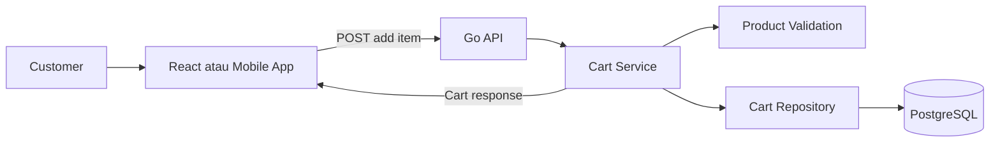
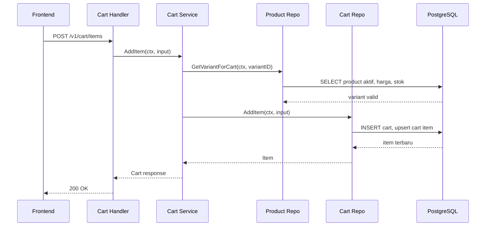
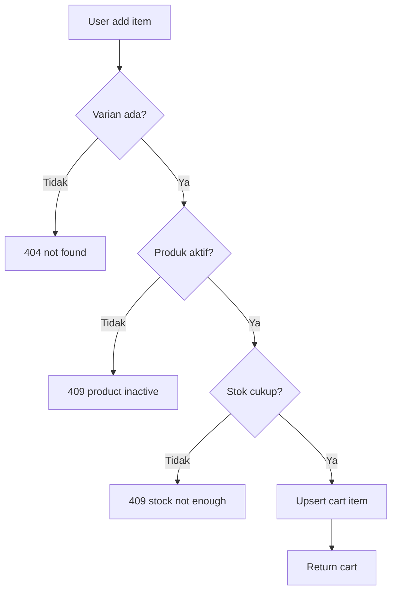
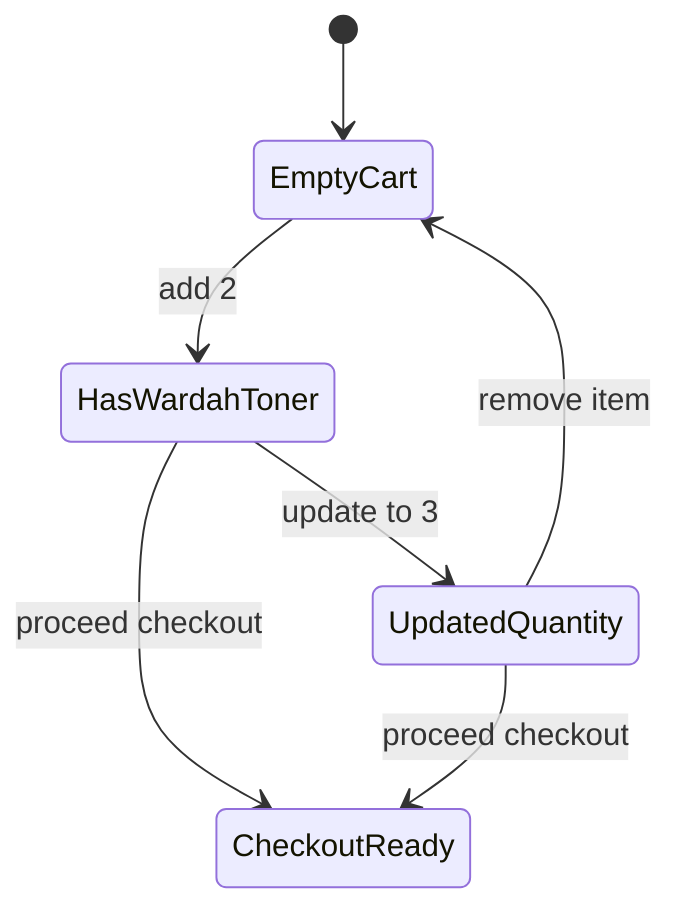

import { Section, Box, Steps, Step, Recap, CardGrid, Card, Chip, Hero, Compare, FileTree, Endpoint, Def } from "@components";

<Hero eyebrow="Roadmap 5 &middot; Online Shop Skincare Domain" title="Domain Cart:<br /><em>Mengelola Niat Beli</em>">
  <p>Cart adalah tempat user menyusun niat beli sebelum checkout, bukan sumber kebenaran harga, stok, atau order.</p>
  <Fragment slot="meta">
    <Chip icon="code">Bahasa: <b>Go 1.26</b></Chip>
    <Chip icon="clock">~60 menit baca</Chip>
  </Fragment>
</Hero>

<Section num="01" id="intro" title="Cart adalah Niat Beli" sub="Bedakan cart, order, dan inventory sejak awal">

<p class="lead">Di aplikasi belanja, cart terlihat sederhana, tetapi sering menjadi sumber bug karena ia berada di tengah frontend state, stok, harga, dan checkout.</p>

Di React, kamu mungkin menyimpan cart di local state, Redux, Zustand, atau server state seperti TanStack Query. Di backend Go, cart harus diperlakukan sebagai **state sementara milik user** yang bisa berubah berkali-kali sebelum checkout. Ia berbeda dari order karena cart belum menjadi transaksi bisnis final.

<Box variant="bridge" icon="🌉" label="Jembatan: dari React state ke server-side cart"><p>Cart mirip state `items` di React, tetapi versi backend harus tahan refresh browser, login ulang, multi-device, dan race condition antar request.</p></Box>

Di Laravel, kamu mungkin pernah melihat cart disimpan di session. Untuk REST API yang melayani mobile app dan web, kita lebih sering menyimpan cart di PostgreSQL agar state user konsisten di semua device dan bisa dihitung ulang saat checkout.

<Def term="cart"><p>Cart adalah kumpulan item sementara yang menunjukkan produk varian apa yang ingin dibeli user dan berapa quantity yang diinginkan.</p></Def>

<Def term="cart item"><p>Cart item adalah satu baris relasi antara cart dan product variant, berisi `cart_id`, `product_variant_id`, dan `quantity`.</p></Def>

<CardGrid cols={3}>
  <Card><h4>Cart</h4><p>State sementara, bisa berubah, belum mengunci harga dan stok.</p></Card>
  <Card><h4>Order</h4><p>Transaksi final setelah checkout, menyimpan snapshot harga dan alamat.</p></Card>
  <Card><h4>Inventory</h4><p>Sumber kebenaran stok, divalidasi saat add item dan wajib divalidasi ulang saat checkout.</p></Card>
</CardGrid>



<p class="fig-cap"><b>Gambar 1.</b> Cart berada di lapisan domain, bukan sekadar detail UI atau sekadar tabel database.</p>

</Section>

<Section num="02" id="model-data-cart" title="Model Data Cart" sub="Skema kecil, konsekuensi besar">

<p class="lead">Model cart yang baik sengaja minimal, karena data yang berubah cepat seperti harga dan stok tidak boleh digandakan ke cart.</p>

Untuk proyek online shop skincare, kita butuh dua tabel utama: `carts` dan `cart_items`. Tabel `carts` mewakili cart aktif milik user. Tabel `cart_items` menyimpan varian produk yang dipilih dan quantity.

<FileTree title="Bagian domain cart dalam modular monolith" tree={`
internal/
  cart/
    model.go       # entity dan DTO domain cart
    repository.go  # kontrak akses data
    service.go     # business rule cart
    handler.go     # HTTP handler cart
    routes.go      # registrasi route chi
  product/
    repository.go  # validasi produk dan varian
  shared/
    errors.go      # error domain bersama
db/
  migrations/
    020_create_carts.up.sql
`} />

```sql title="db/migrations/020_create_carts.up.sql"
CREATE TABLE carts (
  id BIGSERIAL PRIMARY KEY,
  user_id BIGINT NOT NULL REFERENCES users(id),
  status TEXT NOT NULL DEFAULT 'active' CHECK (status IN ('active', 'converted', 'abandoned')),
  created_at TIMESTAMPTZ NOT NULL DEFAULT NOW(),
  updated_at TIMESTAMPTZ NOT NULL DEFAULT NOW()
);

CREATE UNIQUE INDEX carts_one_active_per_user_idx
  ON carts (user_id)
  WHERE status = 'active';

CREATE TABLE cart_items (
  cart_id BIGINT NOT NULL REFERENCES carts(id) ON DELETE CASCADE,
  product_variant_id BIGINT NOT NULL REFERENCES product_variants(id),
  quantity INT NOT NULL CHECK (quantity > 0),
  created_at TIMESTAMPTZ NOT NULL DEFAULT NOW(),
  updated_at TIMESTAMPTZ NOT NULL DEFAULT NOW(),
  PRIMARY KEY (cart_id, product_variant_id)
);

CREATE INDEX cart_items_variant_id_idx
  ON cart_items (product_variant_id);
```

<Box variant="note" icon="🧾" label="Catatan desain"><p>`cart_items` tidak punya kolom `price_cents`. Harga cart dihitung dari `product_variants.price_cents` saat cart dibaca, lalu harga final baru disalin ke `order_items` saat checkout.</p></Box>

```go title="internal/cart/model.go"
package cart

import "time"

type Cart struct {
	ID        int64
	UserID    int64
	Status    string
	Items     []Item
	Subtotal  int64
	CreatedAt time.Time
	UpdatedAt time.Time
}

type Item struct {
	ProductVariantID int64
	ProductID        int64
	ProductName      string
	VariantName      string
	BrandName        string
	ImageURL         string
	Quantity         int32
	PriceCents       int64
	LineSubtotal     int64
}

type AddItemInput struct {
	UserID           int64
	ProductVariantID int64
	Quantity         int32
}

type UpdateQuantityInput struct {
	UserID           int64
	ProductVariantID int64
	Quantity         int32
}
```

<Compare aLabel="Frontend cart object" bLabel="Backend cart table" aTone="muted" bTone="violet">
  <Fragment slot="a"><ul><li>Boleh menyimpan display name, image URL, dan subtotal sementara untuk UX.</li><li>Nilainya mudah stale karena harga dan stok bisa berubah di server.</li></ul></Fragment>
  <Fragment slot="b"><ul><li>Menyimpan identitas varian dan quantity yang diinginkan user.</li><li>Harga, status produk, dan stok dibaca dari sumber kebenaran saat dibutuhkan.</li></ul></Fragment>
</Compare>

</Section>

<Section num="03" id="satu-user-satu-cart" title="Satu User, Satu Cart Aktif" sub="Gunakan partial unique index untuk mencegah cart ganda">

<p class="lead">Aturan domain paling penting: satu user hanya boleh punya satu cart dengan status active.</p>

Tanpa aturan ini, dua request paralel bisa membuat dua cart aktif untuk user yang sama. Bug ini sering muncul saat user login di dua tab, mobile app melakukan retry, atau frontend mengirim request saat hydration.

PostgreSQL memberi kita alat yang tepat: **partial unique index**. Index `carts_one_active_per_user_idx` memastikan hanya ada satu baris `carts` dengan status `active` untuk satu user. Ini lebih kuat daripada hanya mengecek dari kode Go, karena database tetap menjadi penjaga konsistensi.

```sql title="query upsert active cart"
INSERT INTO carts (user_id, status)
VALUES ($1, 'active')
ON CONFLICT (user_id) WHERE status = 'active'
DO UPDATE SET updated_at = NOW()
RETURNING id;
```

<Box variant="bridge" icon="🌉" label="Jembatan: Laravel firstOrCreate"><p>Konsepnya mirip `firstOrCreate`, tetapi di Go dan PostgreSQL kita ingin constraint database tetap menjadi pagar utama agar aman saat request paralel.</p></Box>

```go title="internal/cart/repository.go"
package cart

import "context"

type Repository interface {
	GetActiveCartID(ctx context.Context, userID int64) (int64, error)
	GetItemQuantity(ctx context.Context, userID int64, productVariantID int64) (int32, error)
	AddItem(ctx context.Context, input AddItemInput) (Item, error)
	UpdateQuantity(ctx context.Context, input UpdateQuantityInput) (Item, error)
	RemoveItem(ctx context.Context, userID int64, productVariantID int64) error
	GetCart(ctx context.Context, userID int64) (Cart, error)
}
```

</Section>

<Section num="04" id="add-item-upsert" title="Add Item dengan Upsert" sub="Insert kalau belum ada, tambah quantity kalau sudah ada">

<p class="lead">Add item bukan sekadar insert, karena user bisa menekan tombol tambah untuk varian yang sama berkali-kali.</p>

Untuk endpoint add item, perilaku domainnya: kalau `product_variant_id` belum ada di cart, insert baris baru. Kalau sudah ada, tambah `quantity` lama dengan quantity request. PostgreSQL menyebut pola ini `INSERT ... ON CONFLICT DO UPDATE`, sering disebut upsert.

<Def term="upsert"><p>Upsert adalah operasi insert-or-update: buat baris baru saat belum ada, atau update baris lama saat melanggar constraint unik.</p></Def>

```go title="internal/cart/pg_repository.go"
package cart

import (
	"context"

	"github.com/jackc/pgx/v5/pgxpool"
)

type pgRepository struct {
	pool *pgxpool.Pool
}

func NewRepository(pool *pgxpool.Pool) Repository {
	return &pgRepository{pool: pool}
}

func (r *pgRepository) GetActiveCartID(ctx context.Context, userID int64) (int64, error) {
	const q = `
INSERT INTO carts (user_id, status)
VALUES ($1, 'active')
ON CONFLICT (user_id) WHERE status = 'active'
DO UPDATE SET updated_at = NOW()
RETURNING id`

	var cartID int64
	if err := r.pool.QueryRow(ctx, q, userID).Scan(&cartID); err != nil {
		return 0, err
	}

	return cartID, nil
}

func (r *pgRepository) GetItemQuantity(ctx context.Context, userID int64, productVariantID int64) (int32, error) {
	const q = `
SELECT COALESCE((
  SELECT ci.quantity
  FROM carts c
  JOIN cart_items ci ON ci.cart_id = c.id
  WHERE c.user_id = $1
    AND c.status = 'active'
    AND ci.product_variant_id = $2
), 0)`

	var quantity int32
	if err := r.pool.QueryRow(ctx, q, userID, productVariantID).Scan(&quantity); err != nil {
		return 0, err
	}

	return quantity, nil
}

func (r *pgRepository) AddItem(ctx context.Context, input AddItemInput) (Item, error) {
	const q = `
WITH active_cart AS (
  INSERT INTO carts (user_id, status)
  VALUES ($1, 'active')
  ON CONFLICT (user_id) WHERE status = 'active'
  DO UPDATE SET updated_at = NOW()
  RETURNING id
), upserted AS (
  INSERT INTO cart_items (cart_id, product_variant_id, quantity)
  SELECT id, $2, $3 FROM active_cart
  ON CONFLICT (cart_id, product_variant_id)
  DO UPDATE SET
    quantity = cart_items.quantity + EXCLUDED.quantity,
    updated_at = NOW()
  RETURNING cart_id, product_variant_id, quantity
)
SELECT
  upserted.product_variant_id,
  pv.product_id,
  p.name AS product_name,
  pv.name AS variant_name,
  b.name AS brand_name,
  COALESCE(p.image_url, '') AS image_url,
  upserted.quantity,
  pv.price_cents,
  (upserted.quantity * pv.price_cents)::BIGINT AS line_subtotal
FROM upserted
JOIN product_variants pv ON pv.id = upserted.product_variant_id
JOIN products p ON p.id = pv.product_id
JOIN brands b ON b.id = p.brand_id`

	var item Item
	err := r.pool.QueryRow(ctx, q, input.UserID, input.ProductVariantID, input.Quantity).Scan(
		&item.ProductVariantID,
		&item.ProductID,
		&item.ProductName,
		&item.VariantName,
		&item.BrandName,
		&item.ImageURL,
		&item.Quantity,
		&item.PriceCents,
		&item.LineSubtotal,
	)
	if err != nil {
		return Item{}, err
	}

	return item, nil
}
```

<Box variant="tip" icon="💡" label="Kenapa query dibuat atomic"><p>Dengan satu statement SQL, database bisa menangani dua request add item paralel tanpa membuat duplikasi baris `cart_items`.</p></Box>



<p class="fig-cap"><b>Gambar 2.</b> Add item menggabungkan validasi domain dan upsert cart item.</p>

</Section>

<Section num="05" id="update-remove-item" title="Update dan Remove Item" sub="Update quantity memakai set, bukan increment">

<p class="lead">Update quantity berbeda dari add item, karena user sedang menetapkan angka final yang ingin dilihat di cart.</p>

Saat user mengubah quantity dari 2 menjadi 3, endpoint update harus menyimpan 3, bukan menambah 3. Ini penting untuk frontend yang mengirim nilai dari input stepper. Kalau backend menganggap update sebagai increment, request retry bisa membuat quantity melonjak.

<Compare aLabel="Add item" bLabel="Update quantity" aTone="teal" bTone="violet">
  <Fragment slot="a"><ul><li>Makna bisnisnya menambah niat beli.</li><li>`quantity` request dipakai sebagai increment.</li></ul></Fragment>
  <Fragment slot="b"><ul><li>Makna bisnisnya mengganti angka yang terlihat di UI.</li><li>`quantity` request dipakai sebagai nilai final.</li></ul></Fragment>
</Compare>

```go title="internal/cart/pg_repository_update.go"
package cart

import (
	"context"

	"github.com/jackc/pgx/v5"
)

var ErrCartItemNotFound = pgx.ErrNoRows

func (r *pgRepository) UpdateQuantity(ctx context.Context, input UpdateQuantityInput) (Item, error) {
	const q = `
WITH active_cart AS (
  SELECT id FROM carts
  WHERE user_id = $1 AND status = 'active'
), updated AS (
  UPDATE cart_items ci
  SET quantity = $3, updated_at = NOW()
  FROM active_cart ac
  WHERE ci.cart_id = ac.id
    AND ci.product_variant_id = $2
  RETURNING ci.product_variant_id, ci.quantity
)
SELECT
  updated.product_variant_id,
  pv.product_id,
  p.name AS product_name,
  pv.name AS variant_name,
  b.name AS brand_name,
  COALESCE(p.image_url, '') AS image_url,
  updated.quantity,
  pv.price_cents,
  (updated.quantity * pv.price_cents)::BIGINT AS line_subtotal
FROM updated
JOIN product_variants pv ON pv.id = updated.product_variant_id
JOIN products p ON p.id = pv.product_id
JOIN brands b ON b.id = p.brand_id`

	var item Item
	err := r.pool.QueryRow(ctx, q, input.UserID, input.ProductVariantID, input.Quantity).Scan(
		&item.ProductVariantID,
		&item.ProductID,
		&item.ProductName,
		&item.VariantName,
		&item.BrandName,
		&item.ImageURL,
		&item.Quantity,
		&item.PriceCents,
		&item.LineSubtotal,
	)
	if err != nil {
		return Item{}, err
	}

	return item, nil
}

func (r *pgRepository) RemoveItem(ctx context.Context, userID int64, productVariantID int64) error {
	const q = `
DELETE FROM cart_items ci
USING carts c
WHERE c.id = ci.cart_id
  AND c.user_id = $1
  AND c.status = 'active'
  AND ci.product_variant_id = $2`

	_, err := r.pool.Exec(ctx, q, userID, productVariantID)
	return err
}
```

<Box variant="warn" icon="⚠️" label="Jebakan retry"><p>`PATCH /v1/cart/items/10` dengan body quantity 3 harus idempotent secara praktis, artinya request yang sama diulang tetap menghasilkan quantity 3.</p></Box>

</Section>

<Section num="06" id="validasi-sebelum-add" title="Validasi sebelum Add" sub="Produk aktif dan stok tersedia, tetapi checkout tetap validasi ulang">

<p class="lead">Cart boleh longgar, tetapi tidak boleh menerima item yang jelas tidak bisa dibeli.</p>

Sebelum add item, service harus memastikan varian produk ada, produk masih `active`, varian masih aktif, dan stok saat ini cukup untuk total quantity setelah item ditambahkan. Ini membuat UX lebih baik karena user mendapat error cepat, bukan baru gagal jauh di checkout.

```go title="internal/product/cart_query.go"
package product

import "context"

type VariantForCart struct {
	ID         int64
	ProductID  int64
	Active     bool
	Stock      int32
	PriceCents int64
}

type CartProductRepository interface {
	GetVariantForCart(ctx context.Context, variantID int64) (VariantForCart, error)
}
```

```go title="internal/cart/service.go"
package cart

import (
	"context"
	"errors"

	"github.com/kamu/skincare-backend/internal/product"
)

var (
	ErrInvalidQuantity = errors.New("quantity must be greater than zero")
	ErrProductInactive = errors.New("product is inactive")
	ErrStockNotEnough  = errors.New("stock is not enough")
)

type Service struct {
	carts    Repository
	products product.CartProductRepository
}

func NewService(carts Repository, products product.CartProductRepository) *Service {
	return &Service{carts: carts, products: products}
}

func (s *Service) AddItem(ctx context.Context, input AddItemInput) (Item, error) {
	if input.Quantity <= 0 {
		return Item{}, ErrInvalidQuantity
	}

	variant, err := s.products.GetVariantForCart(ctx, input.ProductVariantID)
	if err != nil {
		return Item{}, err
	}
	if !variant.Active {
		return Item{}, ErrProductInactive
	}
	currentQuantity, err := s.carts.GetItemQuantity(ctx, input.UserID, input.ProductVariantID)
	if err != nil {
		return Item{}, err
	}
	desiredQuantity := currentQuantity + input.Quantity
	if variant.Stock < desiredQuantity {
		return Item{}, ErrStockNotEnough
	}

	return s.carts.AddItem(ctx, input)
}

func (s *Service) UpdateQuantity(ctx context.Context, input UpdateQuantityInput) (Item, error) {
	if input.Quantity <= 0 {
		return Item{}, ErrInvalidQuantity
	}

	variant, err := s.products.GetVariantForCart(ctx, input.ProductVariantID)
	if err != nil {
		return Item{}, err
	}
	if !variant.Active {
		return Item{}, ErrProductInactive
	}
	if variant.Stock < input.Quantity {
		return Item{}, ErrStockNotEnough
	}

	return s.carts.UpdateQuantity(ctx, input)
}

func (s *Service) RemoveItem(ctx context.Context, userID int64, productVariantID int64) error {
	return s.carts.RemoveItem(ctx, userID, productVariantID)
}

func (s *Service) GetCart(ctx context.Context, userID int64) (Cart, error) {
	return s.carts.GetCart(ctx, userID)
}
```

<Box variant="note" icon="🧠" label="Kenapa checkout tetap harus validasi ulang"><p>Cart bisa dibuat hari ini, tetapi checkout terjadi besok. Harga, status produk, promo, dan stok bisa berubah di antara dua waktu itu.</p></Box>



<p class="fig-cap"><b>Gambar 3.</b> Validasi add item menjaga cart tetap masuk akal, sementara transaksi checkout tetap menjadi penjaga final.</p>

</Section>

<Section num="07" id="subtotal-real-time" title="Subtotal Real-Time" sub="Cart tidak menyimpan harga">

<p class="lead">Subtotal cart dihitung dari harga saat ini, bukan dari harga yang pernah dilihat user di masa lalu.</p>

Di domain cart, harga adalah data presentasi dan kalkulasi sementara. Karena itu query cart harus join ke `product_variants` untuk mengambil `price_cents` terbaru. Saat user melakukan checkout, barulah `order_items.unit_price_cents` diisi sebagai snapshot agar invoice tidak berubah walaupun harga produk berubah besok.

```go title="internal/cart/pg_repository_get.go"
package cart

import "context"

func (r *pgRepository) GetCart(ctx context.Context, userID int64) (Cart, error) {
	const q = `
SELECT
  c.id,
  c.user_id,
  c.status,
  ci.product_variant_id,
  pv.product_id,
  p.name AS product_name,
  pv.name AS variant_name,
  b.name AS brand_name,
  COALESCE(p.image_url, '') AS image_url,
  ci.quantity,
  pv.price_cents,
  (ci.quantity * pv.price_cents)::BIGINT AS line_subtotal,
  c.created_at,
  c.updated_at
FROM carts c
LEFT JOIN cart_items ci ON ci.cart_id = c.id
LEFT JOIN product_variants pv ON pv.id = ci.product_variant_id
LEFT JOIN products p ON p.id = pv.product_id
LEFT JOIN brands b ON b.id = p.brand_id
WHERE c.user_id = $1
  AND c.status = 'active'
ORDER BY ci.created_at ASC`

	rows, err := r.pool.Query(ctx, q, userID)
	if err != nil {
		return Cart{}, err
	}
	defer rows.Close()

	var result Cart
	for rows.Next() {
		var item Item
		var productVariantID *int64
		var productID *int64
		var productName *string
		var variantName *string
		var brandName *string
		var imageURL *string
		var quantity *int32
		var priceCents *int64
		var lineSubtotal *int64

		err := rows.Scan(
			&result.ID,
			&result.UserID,
			&result.Status,
			&productVariantID,
			&productID,
			&productName,
			&variantName,
			&brandName,
			&imageURL,
			&quantity,
			&priceCents,
			&lineSubtotal,
			&result.CreatedAt,
			&result.UpdatedAt,
		)
		if err != nil {
			return Cart{}, err
		}

		if productVariantID == nil {
			continue
		}

		item.ProductVariantID = *productVariantID
		item.ProductID = *productID
		item.ProductName = *productName
		item.VariantName = *variantName
		item.BrandName = *brandName
		item.ImageURL = *imageURL
		item.Quantity = *quantity
		item.PriceCents = *priceCents
		item.LineSubtotal = *lineSubtotal
		result.Subtotal += item.LineSubtotal
		result.Items = append(result.Items, item)
	}
	if err := rows.Err(); err != nil {
		return Cart{}, err
	}

	if result.ID == 0 {
		cartID, err := r.GetActiveCartID(ctx, userID)
		if err != nil {
			return Cart{}, err
		}
		result = Cart{ID: cartID, UserID: userID, Status: "active"}
	}

	return result, nil
}
```

<Box variant="bridge" icon="🌉" label="Jembatan: computed selector di frontend"><p>Subtotal cart mirip selector di Redux atau computed value di Vue, ia dihitung dari state lain dan tidak perlu disimpan sebagai sumber kebenaran.</p></Box>

```sql title="subtotal cart"
SELECT COALESCE(SUM(ci.quantity * pv.price_cents), 0)::BIGINT AS subtotal
FROM carts c
JOIN cart_items ci ON ci.cart_id = c.id
JOIN product_variants pv ON pv.id = ci.product_variant_id
WHERE c.user_id = $1
  AND c.status = 'active';
```

</Section>

<Section num="08" id="api-cart-crud" title="Endpoint Cart CRUD" sub="Route kecil, kontrak jelas">

<p class="lead">Endpoint cart sebaiknya sederhana dan eksplisit, karena frontend akan memanggilnya sering.</p>

<Endpoint method="GET" path="/v1/cart" desc="Ambil cart aktif user beserta item dan subtotal real-time" />
<Endpoint method="POST" path="/v1/cart/items" desc="Tambah item ke cart, insert atau increment quantity jika item sudah ada" />
<Endpoint method="PATCH" path="/v1/cart/items/{product_variant_id}" desc="Set quantity final untuk satu item cart" />
<Endpoint method="DELETE" path="/v1/cart/items/{product_variant_id}" desc="Hapus item dari cart aktif" />

<Box variant="warn" icon="⚠️" label="MDX path vs HTTP path"><p>Di teks biasa, kurawal perlu di-escape. Di prop komponen seperti `path`, kurawal aman karena nilainya string.</p></Box>

```go title="internal/cart/handler.go"
package cart

import (
	"encoding/json"
	"net/http"
	"strconv"

	"github.com/go-chi/chi/v5"
)

type Handler struct {
	service *Service
}

func NewHandler(service *Service) *Handler {
	return &Handler{service: service}
}

type addItemRequest struct {
	ProductVariantID int64 `json:"product_variant_id"`
	Quantity         int32 `json:"quantity"`
}

type updateQuantityRequest struct {
	Quantity int32 `json:"quantity"`
}

func (h *Handler) GetCart(w http.ResponseWriter, r *http.Request) {
	userID := currentUserID(r)

	cart, err := h.service.GetCart(r.Context(), userID)
	if err != nil {
		writeError(w, err)
		return
	}

	writeJSON(w, http.StatusOK, cart)
}

func (h *Handler) AddItem(w http.ResponseWriter, r *http.Request) {
	userID := currentUserID(r)

	var req addItemRequest
	if err := json.NewDecoder(r.Body).Decode(&req); err != nil {
		writeError(w, err)
		return
	}

	item, err := h.service.AddItem(r.Context(), AddItemInput{
		UserID:           userID,
		ProductVariantID: req.ProductVariantID,
		Quantity:         req.Quantity,
	})
	if err != nil {
		writeError(w, err)
		return
	}

	writeJSON(w, http.StatusOK, item)
}

func (h *Handler) UpdateQuantity(w http.ResponseWriter, r *http.Request) {
	userID := currentUserID(r)
	variantID, err := strconv.ParseInt(chi.URLParam(r, "product_variant_id"), 10, 64)
	if err != nil {
		writeError(w, err)
		return
	}

	var req updateQuantityRequest
	if err := json.NewDecoder(r.Body).Decode(&req); err != nil {
		writeError(w, err)
		return
	}

	item, err := h.service.UpdateQuantity(r.Context(), UpdateQuantityInput{
		UserID:           userID,
		ProductVariantID: variantID,
		Quantity:         req.Quantity,
	})
	if err != nil {
		writeError(w, err)
		return
	}

	writeJSON(w, http.StatusOK, item)
}

func (h *Handler) RemoveItem(w http.ResponseWriter, r *http.Request) {
	userID := currentUserID(r)
	variantID, err := strconv.ParseInt(chi.URLParam(r, "product_variant_id"), 10, 64)
	if err != nil {
		writeError(w, err)
		return
	}

	if err := h.service.RemoveItem(r.Context(), userID, variantID); err != nil {
		writeError(w, err)
		return
	}

	w.WriteHeader(http.StatusNoContent)
}
```

```go title="internal/cart/routes.go"
package cart

import "github.com/go-chi/chi/v5"

func RegisterRoutes(r chi.Router, h *Handler) {
	r.Route("/v1/cart", func(r chi.Router) {
		r.Get("/", h.GetCart)
		r.Post("/items", h.AddItem)
		r.Patch("/items/{product_variant_id}", h.UpdateQuantity)
		r.Delete("/items/{product_variant_id}", h.RemoveItem)
	})
}
```

```json title="POST /v1/cart/items"
{
  "product_variant_id": 101,
  "quantity": 2
}
```

```json title="200 OK"
{
  "product_variant_id": 101,
  "product_id": 20,
  "product_name": "Wardah Hydrating Toner",
  "variant_name": "100ml",
  "brand_name": "Wardah",
  "image_url": "https://cdn.example.com/products/wardah-toner.jpg",
  "quantity": 2,
  "price_cents": 3200000,
  "line_subtotal": 6400000
}
```

</Section>

<Section num="09" id="hands-on" title="Hands-on: Wardah Toner" sub="Simulasikan add, update, remove">

<p class="lead">Latihan ini membuat perilaku cart terasa konkret sebelum kita masuk ke checkout di chapter berikutnya.</p>

<Steps>
  <Step><b>Add 2 Wardah Toner</b><p>Frontend mengirim `POST /v1/cart/items` dengan `product_variant_id` Wardah Toner 100ml dan quantity 2.</p></Step>
  <Step><b>Update jadi 3</b><p>User mengubah stepper ke angka 3, lalu frontend mengirim `PATCH /v1/cart/items/101` dengan quantity 3.</p></Step>
  <Step><b>Remove dari cart</b><p>User membatalkan niat beli, lalu frontend mengirim `DELETE /v1/cart/items/101`.</p></Step>
</Steps>

```bash title="Terminal"
curl -X POST http://localhost:8080/v1/cart/items \
  -H "Authorization: Bearer $TOKEN" \
  -H "Content-Type: application/json" \
  -d '{"product_variant_id":101,"quantity":2}'

curl -X PATCH http://localhost:8080/v1/cart/items/101 \
  -H "Authorization: Bearer $TOKEN" \
  -H "Content-Type: application/json" \
  -d '{"quantity":3}'

curl -X DELETE http://localhost:8080/v1/cart/items/101 \
  -H "Authorization: Bearer $TOKEN"
```



<p class="fig-cap"><b>Gambar 4.</b> Cart berubah mengikuti niat beli user, sedangkan order baru muncul setelah checkout.</p>

<Box variant="tip" icon="💡" label="Latihan tambahan"><p>Tambahkan test service untuk memastikan `UpdateQuantity` memakai set. Input quantity 3 harus menghasilkan quantity 3, bukan quantity lama ditambah 3.</p></Box>

</Section>

<Section num="10" id="jebakan-umum" title="Jebakan Umum" sub="Kesalahan kecil yang dampaknya terasa saat production">

<p class="lead">Cart domain terlihat CRUD biasa, tetapi bug-nya sering muncul dari makna bisnis yang tidak tegas.</p>

<CardGrid cols={2}>
  <Card><h4>Menyimpan harga di cart</h4><p>Ini membuat harga stale dan membingungkan saat admin mengubah harga produk. Simpan harga final di order item, bukan cart item.</p></Card>
  <Card><h4>Tidak punya satu cart aktif</h4><p>Tanpa partial unique index, user bisa punya dua cart aktif karena retry atau request paralel.</p></Card>
  <Card><h4>Update dianggap increment</h4><p>Request PATCH yang diulang akan menaikkan quantity berkali-kali. PATCH quantity harus set nilai final.</p></Card>
  <Card><h4>Validasi stok hanya saat add</h4><p>Stok bisa berubah sebelum checkout. Validasi saat add untuk UX, validasi ulang saat checkout untuk konsistensi.</p></Card>
</CardGrid>

<Box variant="bridge" icon="🌉" label="Jembatan: dari session cart ke database cart"><p>Session cart terasa mudah seperti Laravel klasik, tetapi untuk API multi-device, database cart lebih mudah diaudit, diuji, dan dihubungkan ke checkout.</p></Box>

<Box variant="warn" icon="⚠️" label="Jangan ubah cart menjadi order diam-diam"><p>Cart harus tetap cart sampai user menjalankan checkout. Konversi cart ke order perlu transaksi eksplisit, snapshot harga, pengurangan stok, dan payment record.</p></Box>

</Section>

<Section num="11" id="ringkasan" title="Ringkasan & Poin Penting">

<p class="lead">Cart adalah domain niat beli: sementara, sering berubah, tetapi tetap harus dirancang dengan constraint dan validasi yang serius.</p>

<Recap title="Yang Wajib Menempel">
  <ul>
    <li>Satu user hanya boleh punya satu cart aktif, jaga dengan partial unique index di PostgreSQL.</li>
    <li>`CartItem` cukup menyimpan `cart_id`, `product_variant_id`, dan `quantity`.</li>
    <li>Add item memakai upsert, insert jika belum ada dan increment jika item sudah ada.</li>
    <li>Update quantity memakai set nilai final, bukan increment.</li>
    <li>Remove item cukup menghapus baris cart item dari cart aktif user.</li>
    <li>Validasi produk aktif dan stok tersedia dilakukan sebelum add atau update, tetapi checkout tetap harus validasi ulang.</li>
    <li>Cart tidak menyimpan harga. Subtotal dihitung real-time dari `product_variants.price_cents`.</li>
  </ul>
</Recap>

Di proyek online shop skincare, modul ini menjadi penghubung antara katalog produk dan checkout. Setelah user menemukan produk lewat filter Roadmap 5 Chapter 2, ia memasukkan varian ke cart. Langkah berikutnya adalah **checkout**, yaitu mengubah niat beli menjadi order dengan transaksi database, snapshot harga, reservasi stok, dan payment flow.

<Box variant="note" icon="🧭" label="Langkah berikutnya"><p>Di modul berikutnya, cart akan dikonversi menjadi order. Di sana kita mulai memakai transaksi database lebih serius agar stok, order item, dan payment record konsisten.</p></Box>

</Section>
