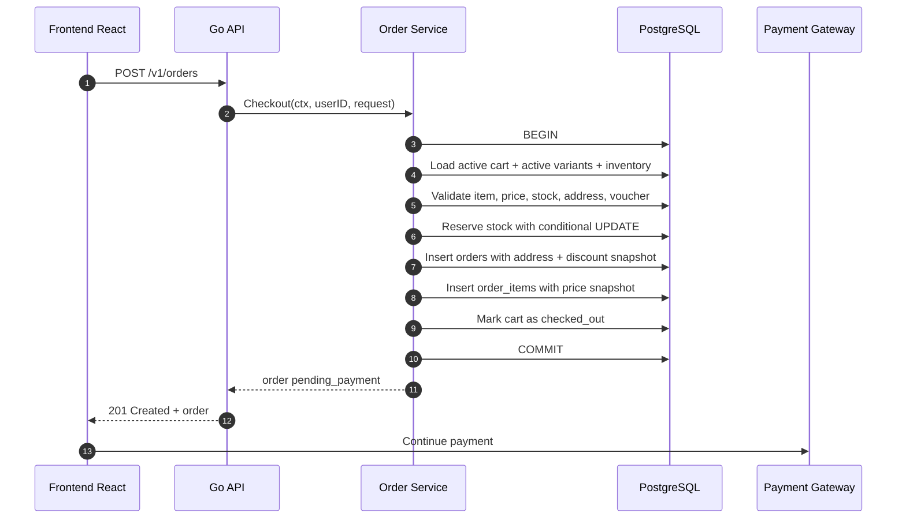
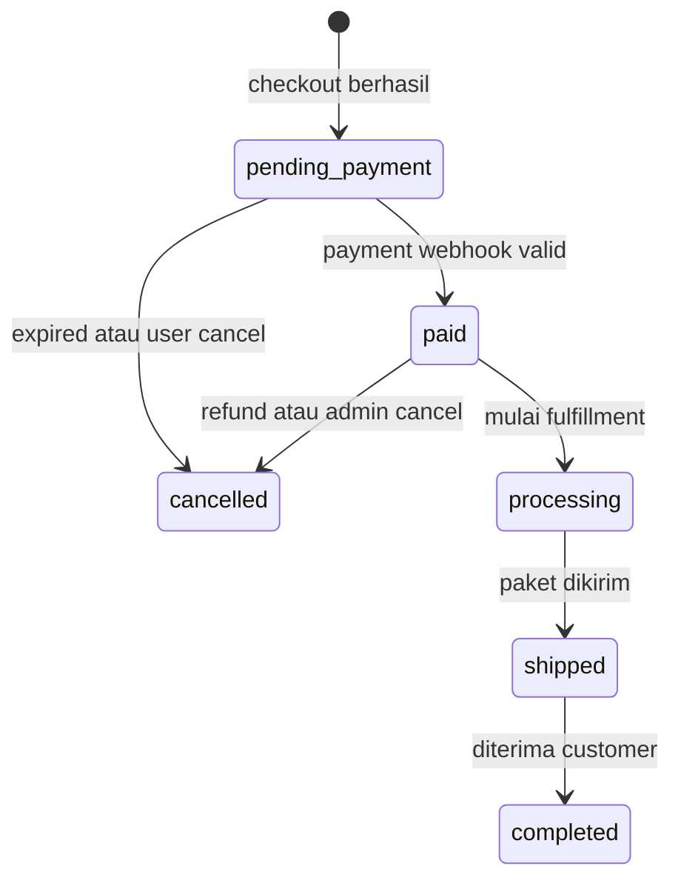
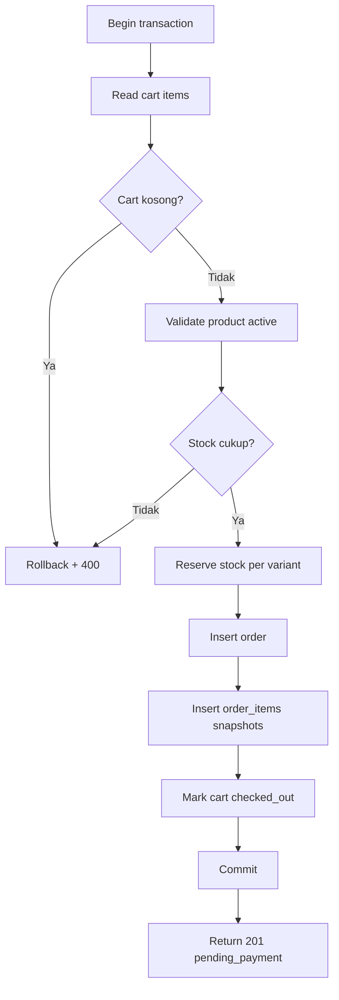

import { Section, Box, Steps, Step, Recap, CardGrid, Card, Chip, Hero, Compare, FileTree, Endpoint, Def } from "@components";

<Hero eyebrow="Roadmap 5 &middot; Online Shop Skincare Domain" title="Dari Cart ke <em>Order</em><br />Checkout yang Konsisten">
  <p>Checkout adalah titik ketika niat beli yang masih sementara berubah menjadi komitmen bisnis yang harus konsisten.</p>
  <Fragment slot="meta">
    <Chip icon="code">Bahasa: <b>Go 1.26</b></Chip>
    <Chip icon="clock">~60 menit baca</Chip>
  </Fragment>
</Hero>

<Section num="01" id="intro" title="Checkout Adalah Titik Perubahan State" sub="Cart boleh berubah, order tidak boleh ikut berubah sembarangan.">

<p class="lead">Di React, cart mirip client state yang bisa berubah kapan saja, sedangkan order mirip event final yang harus bisa diaudit.</p>

Dalam modul cart sebelumnya, cart dirancang sebagai **state sementara**. User bisa menambah item, mengubah quantity, menghapus item, lalu pergi tanpa membayar. Checkout berbeda. Begitu user menekan tombol bayar, sistem harus membuat record order yang stabil, menghitung total, menyimpan snapshot, dan mereservasi stok.

<Box variant="bridge" icon="🌉" label="Jembatan: dari checkout frontend ke transaksi backend"><p>Di React, checkout sering terlihat seperti submit form. Di backend Go, checkout adalah workflow transaksional: baca cart, validasi item, snapshot harga, snapshot alamat, reserve stok, buat order, lalu commit.</p></Box>

<Def term="checkout"><p>Checkout adalah proses mengubah cart aktif milik user menjadi order baru dengan total final, alamat pengiriman, diskon, biaya kirim, dan status awal.</p></Def>

<Def term="snapshot"><p>Snapshot adalah salinan data penting pada saat checkout, supaya order tetap benar walau data sumber berubah setelahnya.</p></Def>

Checkout adalah salah satu titik paling kritis dalam bisnis online shop skincare karena ia menghubungkan katalog, cart, inventory, voucher, order, dan payment. Satu bug kecil bisa menyebabkan harga salah, stok negatif, order ganda, atau alamat pengiriman berubah tanpa sengaja.



<p class="fig-cap"><b>Gambar 1.</b> Alur checkout lengkap dari `POST /v1/orders`, sebelum pembayaran diproses.</p>

<FileTree title="Folder domain checkout dalam modular monolith" tree={`
internal/
  order/
    handler.go        # endpoint POST /v1/orders
    service.go        # workflow checkout transaksional
    repository.go     # interface akses order
    pgx_repository.go # implementasi PostgreSQL dengan pgx
    model.go          # entity dan snapshot order
  cart/
    repository.go     # baca cart aktif saat checkout
  inventory/
    repository.go     # reserve stok varian produk
  promotion/
    service.go        # validasi voucher dan diskon
`} />

</Section>

<Section num="02" id="snapshot-order" title="Snapshot Harga, Alamat, dan Diskon" sub="Order harus menceritakan apa yang benar pada saat checkout.">

<p class="lead">Data yang sering berubah tidak boleh dibaca ulang secara mentah ketika kita menampilkan order lama.</p>

Cart tidak menyimpan harga karena cart mengikuti katalog terbaru. Order justru harus menyimpan harga, karena order adalah bukti transaksi. Jika harga Wardah Hydrating Toner naik dari Rp 35.000 menjadi Rp 39.000 setelah checkout, order lama tetap harus menampilkan Rp 35.000.

<Compare aLabel="Cart: state sementara" bLabel="Order: catatan transaksi" aTone="muted" bTone="violet">
  <Fragment slot="a"><ul><li>Harga diambil real-time dari `product_variants.price`.</li><li>Alamat belum final, user masih bisa memilih alamat lain.</li><li>Diskon belum menjadi komitmen bisnis.</li></ul></Fragment>
  <Fragment slot="b"><ul><li>`order_items.unit_price` menyimpan harga saat checkout.</li><li>`orders.shipping_*` menyimpan alamat saat checkout.</li><li>`orders.voucher_code` dan `discount_amount` menyimpan diskon yang dipakai.</li></ul></Fragment>
</Compare>

<CardGrid cols={3}>
  <Card><h4>Harga</h4><p>Snapshot di `order_items.unit_price`, bukan join ke harga produk saat ini.</p></Card>
  <Card><h4>Alamat</h4><p>Snapshot di `orders.shipping_*`, bukan selalu baca `addresses` terbaru.</p></Card>
  <Card><h4>Diskon</h4><p>Snapshot `voucher_code`, `discount_amount`, dan aturan yang lolos saat checkout.</p></Card>
</CardGrid>

```sql title="db/migrations/014_create_orders.up.sql"
CREATE SEQUENCE IF NOT EXISTS order_number_seq;

CREATE TABLE orders (
  id BIGSERIAL PRIMARY KEY,
  order_number TEXT NOT NULL UNIQUE,
  user_id BIGINT NOT NULL REFERENCES users(id),
  cart_id BIGINT NOT NULL REFERENCES carts(id),
  status TEXT NOT NULL CHECK (status IN ('pending_payment', 'paid', 'processing', 'shipped', 'completed', 'cancelled')),
  subtotal_amount BIGINT NOT NULL CHECK (subtotal_amount >= 0),
  discount_amount BIGINT NOT NULL DEFAULT 0 CHECK (discount_amount >= 0),
  shipping_cost BIGINT NOT NULL DEFAULT 0 CHECK (shipping_cost >= 0),
  total_amount BIGINT NOT NULL CHECK (total_amount >= 0),
  voucher_id BIGINT REFERENCES vouchers(id),
  voucher_code TEXT,
  shipping_name TEXT NOT NULL,
  shipping_phone TEXT NOT NULL,
  shipping_address_line TEXT NOT NULL,
  shipping_city TEXT NOT NULL,
  shipping_province TEXT NOT NULL,
  shipping_postal_code TEXT NOT NULL,
  shipping_courier TEXT NOT NULL,
  created_at TIMESTAMPTZ NOT NULL DEFAULT NOW(),
  updated_at TIMESTAMPTZ NOT NULL DEFAULT NOW()
);

CREATE TABLE order_items (
  id BIGSERIAL PRIMARY KEY,
  order_id BIGINT NOT NULL REFERENCES orders(id) ON DELETE CASCADE,
  product_variant_id BIGINT NOT NULL REFERENCES product_variants(id),
  sku TEXT NOT NULL,
  product_name TEXT NOT NULL,
  variant_name TEXT NOT NULL,
  unit_price BIGINT NOT NULL CHECK (unit_price >= 0),
  quantity INTEGER NOT NULL CHECK (quantity > 0),
  line_total BIGINT NOT NULL CHECK (line_total >= 0),
  created_at TIMESTAMPTZ NOT NULL DEFAULT NOW()
);

CREATE INDEX idx_orders_user_created_at ON orders(user_id, created_at DESC);
CREATE INDEX idx_order_items_order_id ON order_items(order_id);
```

<Box variant="warn" icon="⚠️" label="Jangan join harga produk untuk order lama"><p>Order detail boleh join ke produk untuk gambar terbaru, tetapi harga transaksi harus berasal dari `order_items.unit_price`.</p></Box>

</Section>

<Section num="03" id="validasi-checkout" title="Validasi Sebelum Order Dibuat" sub="Validasi checkout bukan sekadar validasi request body.">

<p class="lead">Checkout menggabungkan input validation dan business rule validation dalam satu workflow.</p>

Input dari user biasanya hanya `address_id`, `voucher_code`, `shipping_courier`, dan `shipping_cost` jika kalkulasi ongkir belum dikerjakan server. Data yang lebih penting justru harus dihitung ulang oleh server: cart aktif, item masih tersedia, produk masih aktif, harga varian saat ini, stok cukup, voucher valid, dan total final.

<Steps>
  <Step><b>Validasi request</b><p>Pastikan `address_id` ada, `shipping_courier` tidak kosong, dan `shipping_cost` tidak negatif.</p></Step>
  <Step><b>Validasi cart</b><p>Cart aktif harus ada dan minimal punya satu item.</p></Step>
  <Step><b>Validasi produk</b><p>Setiap item harus mengarah ke varian aktif dari produk aktif.</p></Step>
  <Step><b>Validasi stok</b><p>`available_stock` harus lebih besar atau sama dengan quantity yang akan dibeli.</p></Step>
  <Step><b>Validasi voucher</b><p>Voucher harus aktif, belum expired, kuota cukup, dan memenuhi minimum pembelian.</p></Step>
</Steps>

```go title="internal/order/model.go"
package order

type CheckoutInput struct {
	AddressID       int64
	VoucherCode     string
	ShippingCourier string
	ShippingCost    int64
}

type CartItemForCheckout struct {
	CartItemID       int64
	ProductVariantID int64
	SKU              string
	ProductName      string
	VariantName      string
	ProductActive    bool
	VariantActive    bool
	UnitPrice        int64
	Quantity         int
	AvailableStock   int
}

type AddressSnapshot struct {
	Name        string
	Phone       string
	AddressLine string
	City        string
	Province    string
	PostalCode  string
}

type DiscountSnapshot struct {
	VoucherID      *int64
	VoucherCode    string
	DiscountAmount int64
}

type Order struct {
	ID             int64
	OrderNumber    string
	UserID         int64
	CartID         int64
	Status         string
	SubtotalAmount int64
	DiscountAmount int64
	ShippingCost   int64
	TotalAmount    int64
}
```

<Box variant="bridge" icon="🌉" label="Jembatan: Laravel FormRequest vs service rule"><p>FormRequest di Laravel cocok untuk format input, tetapi stok cukup, voucher valid, dan produk aktif adalah business rule. Di Go, pisahkan di service agar handler tetap tipis.</p></Box>

</Section>

<Section num="04" id="nomor-status" title="Nomor Order dan Status Awal" sub="Order number harus unik, mudah dibaca, dan aman untuk ditampilkan ke customer.">

<p class="lead">ID database cocok untuk relasi internal, nomor order cocok untuk komunikasi manusia.</p>

Format `INV-20260101-XXXX` mudah dibaca customer support, mudah dicari di dashboard admin, dan tidak membocorkan terlalu banyak struktur database. Pada sistem produksi, tetap pasang `UNIQUE` constraint karena generator aplikasi saja tidak cukup untuk menjamin unik di kondisi paralel.

```go title="internal/order/number.go"
package order

import (
	"fmt"
	"time"
)

func BuildOrderNumber(now time.Time, sequence int64) string {
	return fmt.Sprintf("INV-%s-%04d", now.Format("20060102"), sequence)
}
```

Status awal order pada checkout adalah `pending_payment`, bukan `paid`. Checkout baru membuktikan bahwa user ingin membeli, stok sudah direserve, dan order dibuat. Status menjadi `paid` hanya setelah payment gateway memberi konfirmasi yang valid.



<p class="fig-cap"><b>Gambar 2.</b> Checkout membuat order dengan status awal `pending_payment`.</p>

<Box variant="tip" icon="💡" label="Pola aman nomor order"><p>Ambil angka sequence dari database, bangun nomor order di aplikasi, lalu tetap simpan dengan `UNIQUE` constraint.</p></Box>

</Section>

<Section num="05" id="transaksi-stok-order" title="Reservasi Stok dalam Transaksi" sub="Stok dan order harus berubah bersama, atau tidak berubah sama sekali.">

<p class="lead">Checkout tidak boleh membuat order tanpa stok, dan tidak boleh mengurangi stok tanpa order.</p>

Reservasi stok berarti `available_stock` dikurangi saat checkout, biasanya `reserved_stock` ditambah sampai payment selesai atau order dibatalkan. Untuk online shop skincare, ini mencegah dua user membeli stok terakhir serum yang sama secara bersamaan.

<Def term="stock reservation"><p>Stock reservation adalah penahanan stok untuk order tertentu sebelum pembayaran final, sehingga stok tidak dijual ulang ke user lain.</p></Def>

```sql title="db/migrations/015_inventory_reservation.sql"
ALTER TABLE inventories
  ADD COLUMN IF NOT EXISTS reserved_stock INTEGER NOT NULL DEFAULT 0 CHECK (reserved_stock >= 0);

ALTER TABLE inventories
  ADD CONSTRAINT inventories_stock_non_negative CHECK (available_stock >= 0);
```

Kunci utamanya adalah conditional update. Query di bawah hanya berhasil jika stok masih cukup pada saat database mengeksekusi update. Ini lebih aman daripada membaca stok dulu di aplikasi, lalu update beberapa baris kemudian tanpa kondisi.

```sql title="reserve-stock.sql"
UPDATE inventories
SET
  available_stock = available_stock - $2,
  reserved_stock = reserved_stock + $2,
  updated_at = NOW()
WHERE product_variant_id = $1
  AND available_stock >= $2
RETURNING available_stock;
```



<p class="fig-cap"><b>Gambar 3.</b> Semua perubahan checkout berada dalam satu transaksi database.</p>

<Box variant="warn" icon="⚠️" label="Jangan reserve stok di luar transaksi order"><p>Jika stok dikurangi sebelum order dibuat lalu insert order gagal, inventory akan bocor dan harus diperbaiki manual.</p></Box>

</Section>

<Section num="06" id="implementasi-service" title="Implementasi Service Checkout" sub="Handler hanya menerima HTTP, service menjalankan workflow bisnis.">

<p class="lead">Service checkout harus eksplisit, transaksional, dan mudah diuji dengan fake store.</p>

Struktur ini mengikuti pola Roadmap 4: handler memanggil service, service memegang business rule, repository memegang SQL dan pgx. `context.Context` selalu menjadi parameter pertama agar request cancellation dan timeout bisa diteruskan sampai database.

```go title="internal/order/service.go"
package order

import (
	"context"
	"errors"
	"fmt"
	"time"

	"github.com/jackc/pgx/v5"
	"github.com/jackc/pgx/v5/pgxpool"
)

var (
	ErrEmptyCart          = errors.New("cart is empty")
	ErrProductInactive    = errors.New("product is inactive")
	ErrInsufficientStock  = errors.New("insufficient stock")
	ErrInvalidShippingFee = errors.New("invalid shipping fee")
)

type Store interface {
	NextOrderSequence(ctx context.Context, tx pgx.Tx) (int64, error)
	GetCartItemsForCheckout(ctx context.Context, tx pgx.Tx, userID int64) (cartID int64, items []CartItemForCheckout, err error)
	GetAddressSnapshot(ctx context.Context, tx pgx.Tx, userID int64, addressID int64) (AddressSnapshot, error)
	ValidateVoucher(ctx context.Context, tx pgx.Tx, userID int64, code string, subtotal int64) (DiscountSnapshot, error)
	ReserveStock(ctx context.Context, tx pgx.Tx, productVariantID int64, quantity int) error
	CreateOrder(ctx context.Context, tx pgx.Tx, params CreateOrderParams) (Order, error)
	CreateOrderItem(ctx context.Context, tx pgx.Tx, params CreateOrderItemParams) error
	MarkCartCheckedOut(ctx context.Context, tx pgx.Tx, cartID int64, orderID int64) error
}

type Service struct {
	pool  *pgxpool.Pool
	store Store
	clock func() time.Time
}

func NewService(pool *pgxpool.Pool, store Store) *Service {
	return &Service{
		pool:  pool,
		store: store,
		clock: time.Now,
	}
}

func (s *Service) Checkout(ctx context.Context, userID int64, in CheckoutInput) (Order, error) {
	if in.ShippingCost < 0 {
		return Order{}, ErrInvalidShippingFee
	}

	tx, err := s.pool.Begin(ctx)
	if err != nil {
		return Order{}, fmt.Errorf("begin checkout tx: %w", err)
	}
	defer func() { _ = tx.Rollback(ctx) }()

	cartID, items, err := s.store.GetCartItemsForCheckout(ctx, tx, userID)
	if err != nil {
		return Order{}, fmt.Errorf("get cart items for checkout: %w", err)
	}
	if len(items) == 0 {
		return Order{}, ErrEmptyCart
	}

	subtotal, err := calculateSubtotal(items)
	if err != nil {
		return Order{}, err
	}

	address, err := s.store.GetAddressSnapshot(ctx, tx, userID, in.AddressID)
	if err != nil {
		return Order{}, fmt.Errorf("get address snapshot: %w", err)
	}

	discount := DiscountSnapshot{}
	if in.VoucherCode != "" {
		discount, err = s.store.ValidateVoucher(ctx, tx, userID, in.VoucherCode, subtotal)
		if err != nil {
			return Order{}, fmt.Errorf("validate voucher: %w", err)
		}
	}

	for _, item := range items {
		if err := validateCartItem(item); err != nil {
			return Order{}, err
		}
		if err := s.store.ReserveStock(ctx, tx, item.ProductVariantID, item.Quantity); err != nil {
			return Order{}, fmt.Errorf("reserve stock for variant %d: %w", item.ProductVariantID, err)
		}
	}

	sequence, err := s.store.NextOrderSequence(ctx, tx)
	if err != nil {
		return Order{}, fmt.Errorf("next order sequence: %w", err)
	}

	total := subtotal - discount.DiscountAmount + in.ShippingCost
	params := CreateOrderParams{
		OrderNumber:    BuildOrderNumber(s.clock(), sequence),
		UserID:         userID,
		CartID:         cartID,
		Status:         "pending_payment",
		SubtotalAmount: subtotal,
		DiscountAmount: discount.DiscountAmount,
		ShippingCost:   in.ShippingCost,
		TotalAmount:    total,
		VoucherID:      discount.VoucherID,
		VoucherCode:    discount.VoucherCode,
		Address:        address,
		Courier:        in.ShippingCourier,
	}

	created, err := s.store.CreateOrder(ctx, tx, params)
	if err != nil {
		return Order{}, fmt.Errorf("create order: %w", err)
	}

	for _, item := range items {
		err := s.store.CreateOrderItem(ctx, tx, CreateOrderItemParams{
			OrderID:          created.ID,
			ProductVariantID: item.ProductVariantID,
			SKU:              item.SKU,
			ProductName:      item.ProductName,
			VariantName:      item.VariantName,
			UnitPrice:        item.UnitPrice,
			Quantity:         item.Quantity,
			LineTotal:        item.UnitPrice * int64(item.Quantity),
		})
		if err != nil {
			return Order{}, fmt.Errorf("create order item: %w", err)
		}
	}

	if err := s.store.MarkCartCheckedOut(ctx, tx, cartID, created.ID); err != nil {
		return Order{}, fmt.Errorf("mark cart checked out: %w", err)
	}

	if err := tx.Commit(ctx); err != nil {
		return Order{}, fmt.Errorf("commit checkout tx: %w", err)
	}

	return created, nil
}

func calculateSubtotal(items []CartItemForCheckout) (int64, error) {
	var subtotal int64
	for _, item := range items {
		if err := validateCartItem(item); err != nil {
			return 0, err
		}
		subtotal += item.UnitPrice * int64(item.Quantity)
	}
	return subtotal, nil
}

func validateCartItem(item CartItemForCheckout) error {
	if !item.ProductActive || !item.VariantActive {
		return ErrProductInactive
	}
	if item.AvailableStock < item.Quantity {
		return ErrInsufficientStock
	}
	return nil
}
```

```go title="internal/order/params.go"
package order

type CreateOrderParams struct {
	OrderNumber    string
	UserID         int64
	CartID         int64
	Status         string
	SubtotalAmount int64
	DiscountAmount int64
	ShippingCost   int64
	TotalAmount    int64
	VoucherID      *int64
	VoucherCode    string
	Address        AddressSnapshot
	Courier        string
}

type CreateOrderItemParams struct {
	OrderID          int64
	ProductVariantID int64
	SKU              string
	ProductName      string
	VariantName      string
	UnitPrice        int64
	Quantity         int
	LineTotal        int64
}
```

<Box variant="tip" icon="💡" label="Kenapa service menerima interface"><p>Service menerima `Store` agar unit test bisa memakai fake store tanpa PostgreSQL, sedangkan production memakai pgx repository.</p></Box>

</Section>

<Section num="07" id="endpoint-rest" title="Endpoint REST untuk Checkout" sub="Checkout lebih cocok sebagai pembuatan order daripada update cart.">

<p class="lead">Client mengirim `POST /v1/orders` karena hasil checkout adalah resource baru bernama order.</p>

<Endpoint method="POST" path="/v1/orders" desc="Checkout cart aktif user menjadi order baru dengan status pending_payment" />
<Endpoint method="GET" path="/v1/orders" desc="Daftar order milik user, biasanya dipakai untuk order history" />
<Endpoint method="GET" path="/v1/orders/:order_number" desc="Detail order dengan snapshot harga, alamat, item, dan status" />

```json title="request.json"
{
  "address_id": 12,
  "voucher_code": "GLOW10",
  "shipping_courier": "jne_regular",
  "shipping_cost": 18000
}
```

```json title="response.json"
{
  "order_number": "INV-20260101-0042",
  "status": "pending_payment",
  "subtotal_amount": 105000,
  "discount_amount": 10000,
  "shipping_cost": 18000,
  "total_amount": 113000
}
```

```go title="internal/order/handler.go"
package order

import (
	"encoding/json"
	"errors"
	"net/http"
)

type Handler struct {
	service *Service
}

func NewHandler(service *Service) *Handler {
	return &Handler{service: service}
}

type checkoutRequest struct {
	AddressID       int64  `json:"address_id"`
	VoucherCode     string `json:"voucher_code"`
	ShippingCourier string `json:"shipping_courier"`
	ShippingCost    int64  `json:"shipping_cost"`
}

type checkoutResponse struct {
	OrderNumber    string `json:"order_number"`
	Status         string `json:"status"`
	SubtotalAmount int64  `json:"subtotal_amount"`
	DiscountAmount int64  `json:"discount_amount"`
	ShippingCost   int64  `json:"shipping_cost"`
	TotalAmount    int64  `json:"total_amount"`
}

func (h *Handler) Checkout(w http.ResponseWriter, r *http.Request) {
	userID := currentUserID(r)

	var req checkoutRequest
	if err := json.NewDecoder(r.Body).Decode(&req); err != nil {
		writeError(w, http.StatusBadRequest, "invalid JSON body")
		return
	}

	created, err := h.service.Checkout(r.Context(), userID, CheckoutInput{
		AddressID:       req.AddressID,
		VoucherCode:     req.VoucherCode,
		ShippingCourier: req.ShippingCourier,
		ShippingCost:    req.ShippingCost,
	})
	if err != nil {
		writeCheckoutError(w, err)
		return
	}

	writeJSON(w, http.StatusCreated, checkoutResponse{
		OrderNumber:    created.OrderNumber,
		Status:         created.Status,
		SubtotalAmount: created.SubtotalAmount,
		DiscountAmount: created.DiscountAmount,
		ShippingCost:   created.ShippingCost,
		TotalAmount:    created.TotalAmount,
	})
}

func writeCheckoutError(w http.ResponseWriter, err error) {
	switch {
	case errors.Is(err, ErrEmptyCart):
		writeError(w, http.StatusBadRequest, "cart is empty")
	case errors.Is(err, ErrProductInactive):
		writeError(w, http.StatusConflict, "product is no longer available")
	case errors.Is(err, ErrInsufficientStock):
		writeError(w, http.StatusConflict, "insufficient stock")
	case errors.Is(err, ErrInvalidShippingFee):
		writeError(w, http.StatusBadRequest, "invalid shipping fee")
	default:
		writeError(w, http.StatusInternalServerError, "checkout failed")
	}
}
```

<Box variant="note" icon="📝" label="Catatan helper handler"><p>`currentUserID`, `writeJSON`, dan `writeError` biasanya berasal dari shared middleware dan shared response di Roadmap 4.</p></Box>

```go title="internal/order/routes.go"
package order

import "github.com/go-chi/chi/v5"

func RegisterRoutes(r chi.Router, h *Handler) {
	r.Post("/v1/orders", h.Checkout)
	r.Get("/v1/orders", h.ListOrders)
	r.Get("/v1/orders/{orderNumber}", h.GetOrder)
}
```

</Section>

<Section num="08" id="hands-on" title="Hands-on: Wardah Toner dari Cart ke Order" sub="Latihan ringan untuk membuktikan snapshot dan reservasi stok bekerja.">

<p class="lead">Kita simulasikan cart berisi Wardah Hydrating Toner 100ml quantity 3, lalu checkout menjadi order pending payment.</p>

<Steps>
  <Step><b>Siapkan cart</b><p>User sudah punya cart aktif dengan `product_variant_id = 7` dan `quantity = 3`.</p></Step>
  <Step><b>Pastikan stok</b><p>Inventory varian 7 punya `available_stock = 10`, sehingga checkout quantity 3 boleh berjalan.</p></Step>
  <Step><b>Checkout</b><p>Client mengirim alamat, courier, ongkir, dan voucher opsional ke `POST /v1/orders`.</p></Step>
  <Step><b>Cek snapshot</b><p>`order_items.unit_price` menyimpan harga saat checkout, bukan harga katalog setelahnya.</p></Step>
  <Step><b>Cek reservasi</b><p>`available_stock` turun dari 10 ke 7, dan `reserved_stock` naik dari 0 ke 3 dalam transaksi yang sama.</p></Step>
</Steps>

```sql title="seed-checkout-demo.sql"
INSERT INTO carts (id, user_id, status, created_at, updated_at)
VALUES (101, 1, 'active', NOW(), NOW());

INSERT INTO cart_items (cart_id, product_variant_id, quantity, created_at, updated_at)
VALUES (101, 7, 3, NOW(), NOW());

UPDATE product_variants
SET price = 35000, is_active = TRUE
WHERE id = 7;

UPDATE inventories
SET available_stock = 10, reserved_stock = 0
WHERE product_variant_id = 7;
```

```bash title="Terminal"
curl -X POST http://localhost:8080/v1/orders \
  -H "Authorization: Bearer <access-token>" \
  -H "Content-Type: application/json" \
  -d '{"address_id":12,"voucher_code":"GLOW10","shipping_courier":"jne_regular","shipping_cost":18000}'
```

```sql title="verify-checkout.sql"
SELECT
  o.order_number,
  o.status,
  o.subtotal_amount,
  o.discount_amount,
  o.shipping_cost,
  o.total_amount,
  oi.product_name,
  oi.variant_name,
  oi.unit_price,
  oi.quantity,
  oi.line_total
FROM orders o
JOIN order_items oi ON oi.order_id = o.id
WHERE o.user_id = 1
ORDER BY o.created_at DESC
LIMIT 1;

SELECT product_variant_id, available_stock, reserved_stock
FROM inventories
WHERE product_variant_id = 7;
```

<Box variant="analogy" icon="🧾" label="Analogi kasir"><p>Cart seperti keranjang belanja di tangan customer. Checkout seperti kasir mencetak struk, harga dan alamat di struk tidak ikut berubah walau label rak diganti besok.</p></Box>

</Section>

<Section num="09" id="jebakan-umum" title="Jebakan Umum Checkout" sub="Bug checkout sering baru terlihat saat traffic naik atau ada promo besar.">

<p class="lead">Pendatang dari JS dan PHP biasanya paham alur checkout, tetapi sering belum terbiasa dengan race condition di database.</p>

<CardGrid cols={2}>
  <Card><h4>Menyimpan harga di cart</h4><p>Cart boleh stale. Harga final harus dihitung ulang dari produk aktif saat checkout, lalu disnapshot ke order item.</p></Card>
  <Card><h4>Membaca alamat user setiap tampil order</h4><p>Alamat lama bisa berubah. Order harus menyimpan snapshot alamat pengiriman saat checkout.</p></Card>
  <Card><h4>Cek stok lalu update tanpa kondisi</h4><p>Dua request paralel bisa sama-sama lolos. Pakai conditional update `available_stock >= quantity`.</p></Card>
  <Card><h4>Commit sebelum semua item dibuat</h4><p>Jangan commit sebagian. Order, item, cart status, dan reservasi stok harus atomic.</p></Card>
  <Card><h4>Status langsung paid</h4><p>Checkout bukan pembayaran. Status awal tetap `pending_payment` sampai webhook payment valid.</p></Card>
  <Card><h4>Mengandalkan format nomor order saja</h4><p>Nomor order tetap butuh `UNIQUE` constraint dan strategi retry jika terjadi conflict.</p></Card>
</CardGrid>

<Box variant="warn" icon="⚠️" label="Jebakan double click"><p>Double click tombol checkout bisa mengirim dua request. Di Roadmap 4, kita cegah dengan idempotency key, dan pola itu wajib dipakai untuk endpoint checkout production.</p></Box>

</Section>

<Section num="10" id="ringkasan" title="Ringkasan & Poin Penting" sub="Checkout adalah jembatan utama dari domain cart menuju payment dan fulfillment.">

<p class="lead">Setelah modul ini, proyek skincare punya aturan jelas untuk mengubah cart menjadi order yang konsisten.</p>

<Recap title="Yang Wajib Menempel"><ul><li>Cart adalah state sementara, order adalah catatan transaksi yang harus stabil.</li><li>Harga disnapshot di `order_items.unit_price`, bukan dibaca ulang dari produk saat melihat order lama.</li><li>Alamat disnapshot di `orders.shipping_*`, supaya perubahan address book tidak mengubah order historis.</li><li>Diskon disnapshot lewat `voucher_code` dan `discount_amount`, bukan dihitung ulang setelah promo berakhir.</li><li>Nomor order memakai format manusiawi seperti `INV-20260101-0042`, tetapi tetap dijaga dengan `UNIQUE` constraint.</li><li>Checkout membuat status awal `pending_payment`, lalu payment webhook yang mengubahnya menjadi `paid`.</li><li>Reservasi stok harus berada dalam transaksi yang sama dengan insert order dan insert order items.</li><li>Validasi checkout mencakup produk aktif, varian aktif, stok cukup, cart tidak kosong, voucher valid, dan ongkir valid.</li></ul></Recap>

Modul ini memetakan domain cart ke domain order. Pada langkah berikutnya, kita bisa memperdalam inventory dan payment: bagaimana stok reserved dilepas saat order expired, bagaimana webhook payment dibuat idempotent, dan bagaimana fulfillment mengubah order dari `paid` menjadi `processing`.

</Section>
