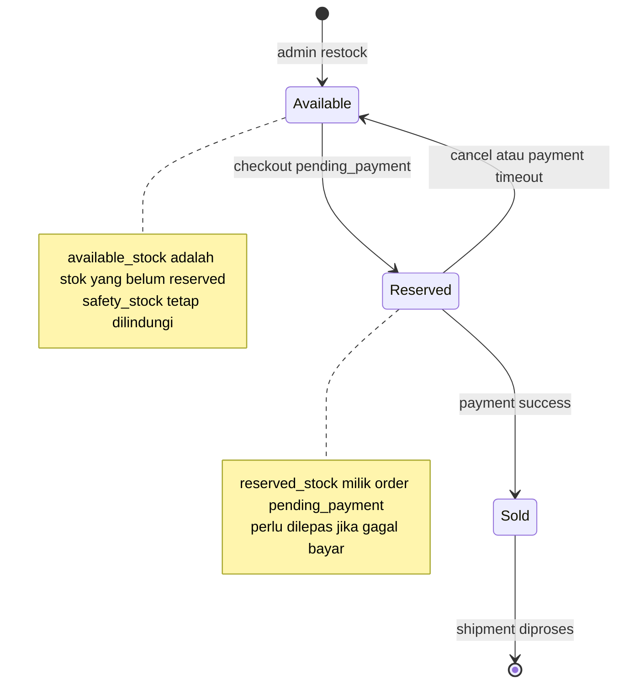
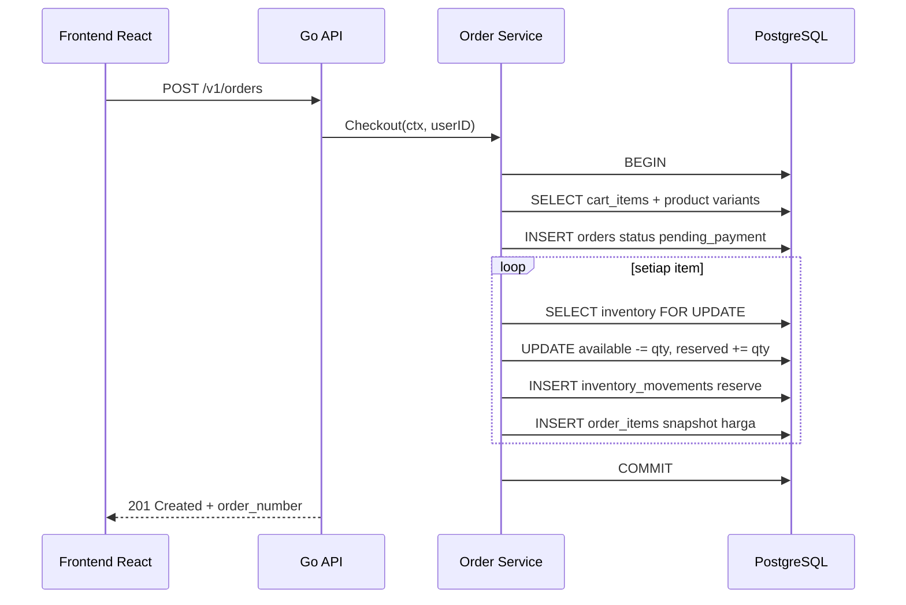
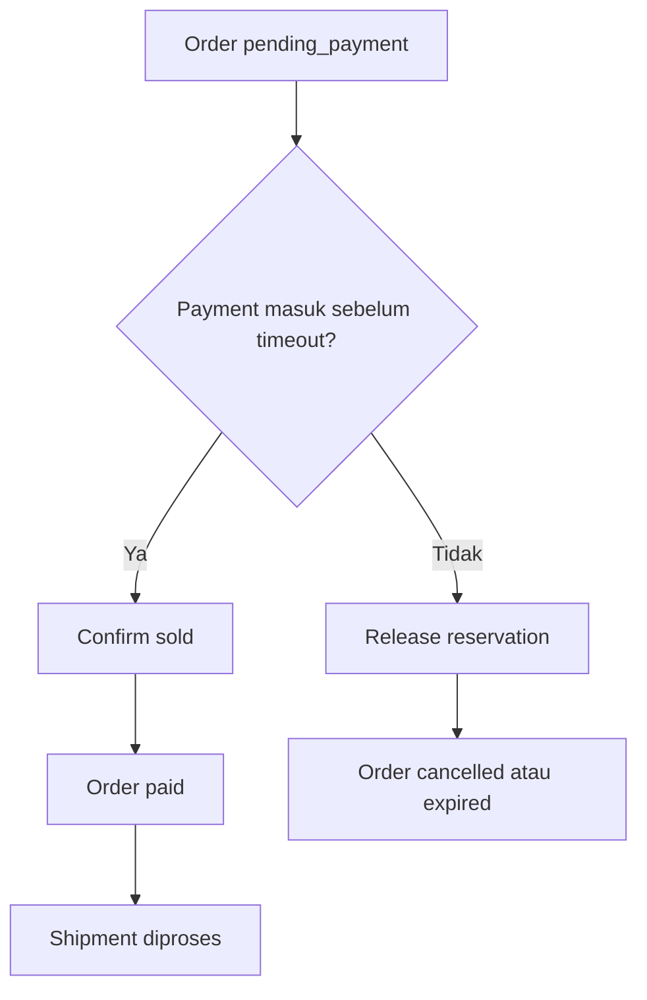

import { Section, Box, Steps, Step, Recap, CardGrid, Card, Chip, Hero, Compare, FileTree, Endpoint, Def } from "@components";

<Hero eyebrow="Roadmap 5 &middot; Online Shop Domain" title="Domain <em>Inventory</em><br />Cegah Overselling">
  <p>Inventory adalah pagar terakhir yang memastikan order sah, stok konsisten, dan bisnis tidak menjual barang yang tidak ada.</p>
  <Fragment slot="meta">
    <Chip icon="code">Bahasa: <b>Go 1.26</b></Chip>
    <Chip icon="clock">~60 menit baca</Chip>
  </Fragment>
</Hero>

<Section num="01" id="intro" title="Kenapa Inventory Mudah Salah?" sub="Masalahnya bukan sekadar angka stok, melainkan konsistensi di bawah beban checkout bersamaan.">

<p class="lead">Di React, cart adalah state UI. Di backend, inventory adalah state bisnis yang harus benar walau banyak request masuk pada waktu yang sama.</p>

Pada modul cart, kita sengaja tidak menyimpan harga di cart karena cart hanya niat beli. Pada modul checkout, kita membuat order dan snapshot harga. Pada modul inventory, kita menjawab pertanyaan paling mahal: bagaimana kalau dua customer membeli varian terakhir serum yang sama dalam detik yang sama?

<Box variant="bridge" icon="🌉" label="Jembatan: dari state UI ke state transaksi"><p>Di React, konflik state biasanya selesai dengan render ulang. Di inventory, konflik state harus selesai di database karena efeknya nyata: stok bisa minus, order harus dibatalkan manual, dan customer kehilangan trust.</p></Box>

<Compare aLabel="Laravel / PHP" bLabel="Go + PostgreSQL" aTone="muted" bTone="violet">
  <Fragment slot="a"><ul><li>`DB::transaction()` sering menyembunyikan detail lock, query, dan error mapping.</li><li>ORM bisa membuat update stok terlihat sederhana, tapi concurrency tetap perlu desain eksplisit.</li></ul></Fragment>
  <Fragment slot="b"><ul><li>Service menerima `context.Context`, memulai transaksi, lalu repository menjalankan SQL yang jelas.</li><li>Row locking dengan `SELECT ... FOR UPDATE` membuat satu baris inventory diproses bergiliran.</li></ul></Fragment>
</Compare>

Inventory yang sehat tidak hanya punya kolom stok. Ia punya **riwayat alasan perubahan**, **aturan reservasi**, **aturan release**, dan **mekanisme lock** saat checkout. PostgreSQL mendokumentasikan bahwa `SELECT ... FOR UPDATE` mengunci baris terpilih terhadap update concurrent, dan dokumentasi explicit locking menjelaskan row-level lock dilepas saat transaksi selesai. Lihat [PostgreSQL SELECT](https://www.postgresql.org/docs/current/sql-select.html) dan [PostgreSQL Explicit Locking](https://www.postgresql.org/docs/current/explicit-locking.html).

</Section>

<Section num="02" id="model-stok" title="Model Stok: Available, Reserved, Sold" sub="Pisahkan stok berdasarkan status bisnisnya, bukan hanya jumlah total.">

<p class="lead">Tiga angka ini membuat inventory bisa diaudit: stok yang siap dialokasikan, stok yang sedang menunggu pembayaran, dan stok yang sudah terjual.</p>

<Def term="available_stock"><p>Jumlah stok yang belum reserved dan belum sold. Pada modul ini, jumlah yang benar-benar boleh dijual adalah `available_stock - safety_stock`.</p></Def>

<Def term="reserved_stock"><p>Jumlah stok yang sudah dipesan oleh order pending payment, tetapi belum menjadi penjualan final.</p></Def>

<Def term="sold_stock"><p>Jumlah stok yang sudah dibayar dan diproses sebagai penjualan, biasanya setelah payment success.</p></Def>

<CardGrid cols={3}>
  <Card><h4>Checkout</h4><p>`available_stock` turun, `reserved_stock` naik. Customer belum membayar, jadi belum boleh masuk `sold_stock`.</p></Card>
  <Card><h4>Payment success</h4><p>`reserved_stock` turun, `sold_stock` naik. Ini menandai stok benar-benar terjual.</p></Card>
  <Card><h4>Cancel atau timeout</h4><p>`reserved_stock` turun, `available_stock` naik kembali. Stok dilepas untuk customer lain.</p></Card>
</CardGrid>



<p class="fig-cap"><b>Gambar 1.</b> Perubahan state stok dari checkout, pembayaran, sampai pengiriman.</p>

<Box variant="note" icon="🧾" label="Istilah domain"><p>`available_stock + reserved_stock + sold_stock` bukan selalu sama dengan stok fisik gudang sepanjang waktu karena refund, retur, damage, dan adjustment akan masuk di modul lanjutan.</p></Box>

</Section>

<Section num="03" id="movement-log" title="Stock Movement Log" sub="Setiap perubahan stok harus meninggalkan jejak: siapa, kapan, untuk order apa, dan kenapa.">

<p class="lead">Tanpa movement log, bug inventory sulit dibuktikan. Dengan movement log, setiap mutasi stok punya audit trail.</p>

Di dunia Laravel, ini mirip membuat tabel `stock_movements` daripada hanya mengubah kolom `stock` di model `ProductVariant`. Bedanya, di Go kita biasanya membuat repository method yang eksplisit untuk setiap transisi stok agar business rule tidak tersebar.

```sql title="db/migrations/021_create_inventories.up.sql"
CREATE TABLE inventories (
    product_variant_id BIGINT PRIMARY KEY REFERENCES product_variants(id),
    available_stock INTEGER NOT NULL DEFAULT 0,
    reserved_stock INTEGER NOT NULL DEFAULT 0,
    sold_stock INTEGER NOT NULL DEFAULT 0,
    safety_stock INTEGER NOT NULL DEFAULT 0,
    version BIGINT NOT NULL DEFAULT 1,
    updated_at TIMESTAMPTZ NOT NULL DEFAULT NOW(),
    CHECK (available_stock >= 0),
    CHECK (reserved_stock >= 0),
    CHECK (sold_stock >= 0),
    CHECK (safety_stock >= 0)
);

CREATE TABLE inventory_movements (
    id BIGSERIAL PRIMARY KEY,
    product_variant_id BIGINT NOT NULL REFERENCES product_variants(id),
    order_id BIGINT REFERENCES orders(id),
    movement_type TEXT NOT NULL CHECK (movement_type IN (
        'reserve',
        'confirm_sold',
        'release_reservation',
        'manual_adjustment',
        'restock'
    )),
    quantity INTEGER NOT NULL CHECK (quantity > 0),
    from_available INTEGER NOT NULL,
    to_available INTEGER NOT NULL,
    from_reserved INTEGER NOT NULL,
    to_reserved INTEGER NOT NULL,
    from_sold INTEGER NOT NULL,
    to_sold INTEGER NOT NULL,
    reason TEXT NOT NULL,
    metadata JSONB NOT NULL DEFAULT '{}'::jsonb,
    created_at TIMESTAMPTZ NOT NULL DEFAULT NOW()
);

CREATE INDEX idx_inventory_movements_variant_created_at
    ON inventory_movements(product_variant_id, created_at DESC);

CREATE INDEX idx_inventory_movements_order_id
    ON inventory_movements(order_id);
```

<Box variant="tip" icon="💡" label="Best practice"><p>Simpan movement log dalam transaksi yang sama dengan perubahan inventory. Kalau stok berubah tetapi log gagal dibuat, transaksi harus rollback.</p></Box>

```go title="internal/inventory/model.go"
package inventory

import "time"

type Inventory struct {
	ProductVariantID int64
	AvailableStock   int32
	ReservedStock    int32
	SoldStock        int32
	SafetyStock      int32
	Version          int64
	UpdatedAt        time.Time
}

type MovementType string

const (
	MovementReserve            MovementType = "reserve"
	MovementConfirmSold        MovementType = "confirm_sold"
	MovementReleaseReservation MovementType = "release_reservation"
	MovementManualAdjustment   MovementType = "manual_adjustment"
	MovementRestock            MovementType = "restock"
)

type Movement struct {
	ProductVariantID int64
	OrderID          *int64
	Type             MovementType
	Quantity         int32
	FromAvailable    int32
	ToAvailable      int32
	FromReserved     int32
	ToReserved       int32
	FromSold         int32
	ToSold           int32
	Reason           string
}
```

</Section>

<Section num="04" id="reservasi-checkout" title="Reservasi Saat Checkout" sub="Checkout tidak langsung membuat stok sold. Checkout membuat reservasi untuk order pending_payment.">

<p class="lead">Reservasi adalah janji sementara: stok ditahan untuk order tertentu sampai customer membayar atau waktu pembayaran habis.</p>

Saat `POST /v1/orders`, service checkout harus membaca cart, validasi produk aktif, validasi stok, membuat order, membuat order items, lalu reserve stok. Semua langkah ini harus berjalan dalam satu transaksi database. Di pgxpool, `BeginTx` memulai transaksi, dan dokumentasi pgx menekankan bahwa `Commit` atau `Rollback` harus dipanggil untuk menutup transaksi. Lihat [pgxpool BeginTx](https://pkg.go.dev/github.com/jackc/pgx/v5/pgxpool#Pool.BeginTx).



<p class="fig-cap"><b>Gambar 2.</b> Alur checkout lengkap dari `POST /v1/orders` sampai reservasi stok.</p>

```go title="internal/order/checkout.go"
package order

import (
	"context"
	"fmt"

	"github.com/jackc/pgx/v5"
	"github.com/jackc/pgx/v5/pgxpool"
)

type CheckoutService struct {
	pool          *pgxpool.Pool
	cartRepo      CartRepository
	orderRepo     OrderRepository
	inventoryRepo InventoryRepository
}

func (s *CheckoutService) Checkout(ctx context.Context, userID int64) (*Order, error) {
	tx, err := s.pool.BeginTx(ctx, pgx.TxOptions{})
	if err != nil {
		return nil, fmt.Errorf("begin checkout tx: %w", err)
	}
	defer func() { _ = tx.Rollback(ctx) }()

	items, err := s.cartRepo.ListItemsForCheckout(ctx, tx, userID)
	if err != nil {
		return nil, fmt.Errorf("list checkout items: %w", err)
	}
	if len(items) == 0 {
		return nil, ErrEmptyCart
	}

	order, err := s.orderRepo.CreatePendingPayment(ctx, tx, userID)
	if err != nil {
		return nil, fmt.Errorf("create pending order: %w", err)
	}

	for _, item := range items {
		if err := s.inventoryRepo.ReserveStock(ctx, tx, ReserveStockParams{
			ProductVariantID: item.ProductVariantID,
			OrderID:          order.ID,
			Quantity:         item.Quantity,
			Reason:           "checkout",
		}); err != nil {
			return nil, fmt.Errorf("reserve stock for variant %d: %w", item.ProductVariantID, err)
		}

		if err := s.orderRepo.CreateItemSnapshot(ctx, tx, order.ID, item); err != nil {
			return nil, fmt.Errorf("create order item snapshot: %w", err)
		}
	}

	if err := s.cartRepo.ClearCart(ctx, tx, userID); err != nil {
		return nil, fmt.Errorf("clear cart: %w", err)
	}

	if err := tx.Commit(ctx); err != nil {
		return nil, fmt.Errorf("commit checkout tx: %w", err)
	}

	return order, nil
}
```

<Box variant="warn" icon="⚠️" label="Jangan commit setengah jalan"><p>Jangan commit setelah order dibuat lalu reserve stok di transaksi berikutnya. Kalau reserve gagal, order sudah telanjur ada tanpa stok yang valid.</p></Box>

</Section>

<Section num="05" id="row-locking" title="Row Locking untuk Concurrent Checkout" sub="Kunci baris inventory yang sama agar dua transaksi tidak menghitung stok dari angka lama.">

<p class="lead">Overselling sering terjadi ketika dua transaksi membaca stok yang sama sebelum salah satunya sempat menulis update.</p>

Bayangkan `available_stock = 1`, dua customer membeli 1 item yang sama. Tanpa lock, keduanya bisa membaca angka 1, keduanya lolos validasi, lalu keduanya update. Dengan `SELECT ... FOR UPDATE`, transaksi kedua menunggu transaksi pertama commit atau rollback sebelum membaca baris yang sama.

<Box variant="bridge" icon="🌉" label="Jembatan: dari race condition JS ke database race"><p>Di JavaScript, race condition sering muncul saat dua promise menulis state yang sama. Di inventory, race terjadi antar transaksi database, jadi mutex di memori Go tidak cukup untuk banyak instance API.</p></Box>

```go title="internal/inventory/repository.go"
package inventory

import (
	"context"
	"errors"
	"fmt"

	"github.com/jackc/pgx/v5"
)

var (
	ErrInventoryNotFound = errors.New("inventory not found")
	ErrInsufficientStock = errors.New("insufficient stock")
	ErrInvalidQuantity   = errors.New("invalid quantity")
)

type ReserveStockParams struct {
	ProductVariantID int64
	OrderID          int64
	Quantity         int32
	Reason           string
}

type Repository struct{}

func (r *Repository) ReserveStock(ctx context.Context, tx pgx.Tx, params ReserveStockParams) error {
	if params.Quantity <= 0 {
		return ErrInvalidQuantity
	}

	inv, err := r.lockInventory(ctx, tx, params.ProductVariantID)
	if err != nil {
		return err
	}

	sellableStock := inv.AvailableStock - inv.SafetyStock
	if sellableStock < params.Quantity {
		return fmt.Errorf("%w: need %d, sellable %d", ErrInsufficientStock, params.Quantity, sellableStock)
	}

	nextAvailable := inv.AvailableStock - params.Quantity
	nextReserved := inv.ReservedStock + params.Quantity

	_, err = tx.Exec(ctx, `
		UPDATE inventories
		SET available_stock = $2,
		    reserved_stock = $3,
		    version = version + 1,
		    updated_at = NOW()
		WHERE product_variant_id = $1
	`, params.ProductVariantID, nextAvailable, nextReserved)
	if err != nil {
		return fmt.Errorf("update inventory reservation: %w", err)
	}

	_, err = tx.Exec(ctx, `
		INSERT INTO inventory_movements (
		    product_variant_id,
		    order_id,
		    movement_type,
		    quantity,
		    from_available,
		    to_available,
		    from_reserved,
		    to_reserved,
		    from_sold,
		    to_sold,
		    reason
		) VALUES ($1, $2, 'reserve', $3, $4, $5, $6, $7, $8, $9, $10)
	`, params.ProductVariantID, params.OrderID, params.Quantity, inv.AvailableStock, nextAvailable, inv.ReservedStock, nextReserved, inv.SoldStock, inv.SoldStock, params.Reason)
	if err != nil {
		return fmt.Errorf("insert reserve movement: %w", err)
	}

	return nil
}

func (r *Repository) lockInventory(ctx context.Context, tx pgx.Tx, productVariantID int64) (*Inventory, error) {
	var inv Inventory
	err := tx.QueryRow(ctx, `
		SELECT product_variant_id,
		       available_stock,
		       reserved_stock,
		       sold_stock,
		       safety_stock,
		       version,
		       updated_at
		FROM inventories
		WHERE product_variant_id = $1
		FOR UPDATE
	`, productVariantID).Scan(
		&inv.ProductVariantID,
		&inv.AvailableStock,
		&inv.ReservedStock,
		&inv.SoldStock,
		&inv.SafetyStock,
		&inv.Version,
		&inv.UpdatedAt,
	)
	if errors.Is(err, pgx.ErrNoRows) {
		return nil, ErrInventoryNotFound
	}
	if err != nil {
		return nil, fmt.Errorf("lock inventory: %w", err)
	}
	return &inv, nil
}
```

<Compare aLabel="Update polos" bLabel="SELECT FOR UPDATE" aTone="red" bTone="teal">
  <Fragment slot="a"><ul><li>Membaca stok dan update bisa disisip transaksi lain.</li><li>Validasi stok bisa memakai angka yang sudah basi.</li></ul></Fragment>
  <Fragment slot="b"><ul><li>Baris inventory dikunci sampai commit atau rollback.</li><li>Transaksi kedua membaca angka terbaru setelah transaksi pertama selesai.</li></ul></Fragment>
</Compare>

<Box variant="tip" icon="💡" label="Alternatif aman"><p>Untuk operasi sangat sederhana, atomic `UPDATE ... WHERE available_stock - safety_stock >= qty` juga bisa aman. Modul ini memilih `SELECT ... FOR UPDATE` karena kita perlu snapshot sebelum dan sesudah untuk movement log.</p></Box>

</Section>

<Section num="06" id="payment-success" title="Payment Success: Reserved Menjadi Sold" sub="Stok yang sudah dibayar pindah dari reserved ke sold, bukan dari available ke sold.">

<p class="lead">Payment success tidak boleh mengurangi `available_stock` lagi karena stok sudah ditahan sejak checkout.</p>

Ketika payment gateway mengirim webhook success, service payment harus idempotent, membaca order pending payment, lalu mengonfirmasi stok untuk setiap order item. Konfirmasi stok ini biasanya dilakukan dalam transaksi yang sama dengan update status order menjadi paid.

```go title="internal/inventory/confirm_sold.go"
package inventory

import (
	"context"
	"fmt"

	"github.com/jackc/pgx/v5"
)

type ConfirmSoldParams struct {
	ProductVariantID int64
	OrderID          int64
	Quantity         int32
	Reason           string
}

func (r *Repository) ConfirmSold(ctx context.Context, tx pgx.Tx, params ConfirmSoldParams) error {
	if params.Quantity <= 0 {
		return ErrInvalidQuantity
	}

	inv, err := r.lockInventory(ctx, tx, params.ProductVariantID)
	if err != nil {
		return err
	}
	if inv.ReservedStock < params.Quantity {
		return fmt.Errorf("%w: reserved %d, need %d", ErrInsufficientStock, inv.ReservedStock, params.Quantity)
	}

	nextReserved := inv.ReservedStock - params.Quantity
	nextSold := inv.SoldStock + params.Quantity

	_, err = tx.Exec(ctx, `
		UPDATE inventories
		SET reserved_stock = $2,
		    sold_stock = $3,
		    version = version + 1,
		    updated_at = NOW()
		WHERE product_variant_id = $1
	`, params.ProductVariantID, nextReserved, nextSold)
	if err != nil {
		return fmt.Errorf("update inventory sold stock: %w", err)
	}

	_, err = tx.Exec(ctx, `
		INSERT INTO inventory_movements (
		    product_variant_id,
		    order_id,
		    movement_type,
		    quantity,
		    from_available,
		    to_available,
		    from_reserved,
		    to_reserved,
		    from_sold,
		    to_sold,
		    reason
		) VALUES ($1, $2, 'confirm_sold', $3, $4, $5, $6, $7, $8, $9, $10)
	`, params.ProductVariantID, params.OrderID, params.Quantity, inv.AvailableStock, inv.AvailableStock, inv.ReservedStock, nextReserved, inv.SoldStock, nextSold, params.Reason)
	if err != nil {
		return fmt.Errorf("insert confirm sold movement: %w", err)
	}

	return nil
}
```

<Box variant="warn" icon="⚠️" label="Webhook bisa datang lebih dari sekali"><p>Payment success harus idempotent. Jika webhook yang sama diproses dua kali, `reserved_stock` bisa berkurang dua kali kecuali payment ID atau event ID dilindungi unique constraint.</p></Box>

</Section>

<Section num="07" id="release-reservasi" title="Release Reservasi" sub="Order yang batal atau timeout harus mengembalikan stok ke available.">

<p class="lead">Reserved stock adalah janji sementara. Janji itu harus punya batas waktu dan aturan pembatalan.</p>

Release terjadi saat customer membatalkan order, payment expired, fraud check gagal, atau admin membatalkan order. Domain order harus memastikan status transition valid: `pending_payment` bisa dibatalkan, tetapi `paid` tidak boleh direlease dengan jalur yang sama.

```go title="internal/inventory/release_reservation.go"
package inventory

import (
	"context"
	"fmt"

	"github.com/jackc/pgx/v5"
)

type ReleaseReservationParams struct {
	ProductVariantID int64
	OrderID          int64
	Quantity         int32
	Reason           string
}

func (r *Repository) ReleaseReservation(ctx context.Context, tx pgx.Tx, params ReleaseReservationParams) error {
	if params.Quantity <= 0 {
		return ErrInvalidQuantity
	}

	inv, err := r.lockInventory(ctx, tx, params.ProductVariantID)
	if err != nil {
		return err
	}
	if inv.ReservedStock < params.Quantity {
		return fmt.Errorf("%w: reserved %d, need %d", ErrInsufficientStock, inv.ReservedStock, params.Quantity)
	}

	nextAvailable := inv.AvailableStock + params.Quantity
	nextReserved := inv.ReservedStock - params.Quantity

	_, err = tx.Exec(ctx, `
		UPDATE inventories
		SET available_stock = $2,
		    reserved_stock = $3,
		    version = version + 1,
		    updated_at = NOW()
		WHERE product_variant_id = $1
	`, params.ProductVariantID, nextAvailable, nextReserved)
	if err != nil {
		return fmt.Errorf("update inventory release: %w", err)
	}

	_, err = tx.Exec(ctx, `
		INSERT INTO inventory_movements (
		    product_variant_id,
		    order_id,
		    movement_type,
		    quantity,
		    from_available,
		    to_available,
		    from_reserved,
		    to_reserved,
		    from_sold,
		    to_sold,
		    reason
		) VALUES ($1, $2, 'release_reservation', $3, $4, $5, $6, $7, $8, $9, $10)
	`, params.ProductVariantID, params.OrderID, params.Quantity, inv.AvailableStock, nextAvailable, inv.ReservedStock, nextReserved, inv.SoldStock, inv.SoldStock, params.Reason)
	if err != nil {
		return fmt.Errorf("insert release movement: %w", err)
	}

	return nil
}
```



<p class="fig-cap"><b>Gambar 3.</b> Reserved stock hanya punya dua jalan normal: menjadi sold atau kembali ke available.</p>

<Box variant="note" icon="🧾" label="Worker timeout"><p>Payment timeout biasanya diproses worker terjadwal atau queue delayed. Detail worker sudah dibahas di Roadmap 4 dan akan diperkuat lagi saat masuk AWS SQS.</p></Box>

</Section>

<Section num="08" id="safety-stock" title="Safety Stock" sub="Buffer operasional agar stok terakhir tidak selalu dijual ke customer.">

<p class="lead">Safety stock adalah stok minimum yang sengaja ditahan untuk risiko operasional seperti selisih gudang, produk rusak, atau kebutuhan marketplace lain.</p>

Jika `available_stock = 10` dan `safety_stock = 2`, API hanya boleh menjual 8 unit. Di UI, kamu bisa menampilkan stok terbatas, tetapi service tetap menjadi sumber kebenaran.

```go title="internal/inventory/sellable.go"
package inventory

func (i Inventory) SellableStock() int32 {
	sellable := i.AvailableStock - i.SafetyStock
	if sellable < 0 {
		return 0
	}
	return sellable
}

func (i Inventory) CanReserve(qty int32) bool {
	return qty > 0 && i.SellableStock() >= qty
}
```

<Box variant="bridge" icon="🌉" label="Jembatan: dari computed value di React"><p>`SellableStock()` mirip computed value dari state, tetapi dihitung di backend agar semua client memakai aturan yang sama.</p></Box>

<Compare aLabel="Tanpa safety stock" bLabel="Dengan safety stock" aTone="muted" bTone="blue">
  <Fragment slot="a"><ul><li>Semua stok yang terlihat available langsung bisa dijual.</li><li>Risiko oversell meningkat saat stok fisik tidak sinkron.</li></ul></Fragment>
  <Fragment slot="b"><ul><li>Backend menahan buffer minimum per variant.</li><li>Admin bisa menjaga stok untuk selisih gudang dan kanal lain.</li></ul></Fragment>
</Compare>

</Section>

<Section num="09" id="api-struktur" title="API dan Struktur Domain" sub="Inventory punya endpoint admin, tetapi mutasi stok kritis tetap dipanggil oleh service domain lain dalam transaksi.">

<p class="lead">Customer tidak memanggil inventory langsung. Customer checkout melalui order, lalu order service memanggil inventory repository dalam transaksi.</p>

<Endpoint method="GET" path="/v1/admin/inventories" desc="Admin melihat stok per variant dan movement summary" />
<Endpoint method="POST" path="/v1/admin/inventories/adjustments" desc="Admin melakukan adjustment stok dengan alasan wajib" />
<Endpoint method="GET" path="/v1/admin/inventories/:variant_id/movements" desc="Admin melihat audit trail perubahan stok" />
<Endpoint method="POST" path="/v1/orders" desc="Customer checkout, order service melakukan reserve stok" />
<Endpoint method="POST" path="/v1/payments/webhook" desc="Payment service mengonfirmasi reserved menjadi sold" />
<Endpoint method="POST" path="/v1/orders/:order_id/cancel" desc="Order service melepas reserved stock jika status masih pending_payment" />

<FileTree title="Struktur domain inventory" tree={`
internal/
  inventory/
    model.go              # Inventory, Movement, MovementType
    repository.go         # ReserveStock dan lockInventory
    confirm_sold.go       # reserved menjadi sold
    release_reservation.go # reserved kembali ke available
    service.go            # orchestration untuk admin adjustment
    handler.go            # endpoint admin inventory
  order/
    checkout.go           # memanggil inventory dalam transaksi checkout
  payment/
    webhook.go            # memanggil ConfirmSold secara idempotent
db/
  migrations/
    021_create_inventories.up.sql
    021_create_inventories.down.sql
`} />

<Box variant="tip" icon="💡" label="Batas domain"><p>`inventory` tidak perlu tahu detail cart, voucher, atau alamat. Ia cukup tahu variant, order, quantity, dan alasan perubahan stok.</p></Box>

</Section>

<Section num="10" id="hands-on" title="Hands-on Ringan" sub="Simulasikan dua checkout yang berebut stok terakhir.">

<p class="lead">Latihan ini tidak memakai HTTP dulu. Tujuannya membuat kamu melihat efek transaksi dan row lock secara langsung.</p>

<Steps>
  <Step><b>Buat seed inventory</b><p>Masukkan satu row inventory untuk satu variant dengan `available_stock = 1`, `reserved_stock = 0`, `sold_stock = 0`, dan `safety_stock = 0`.</p></Step>
  <Step><b>Jalankan dua goroutine checkout</b><p>Keduanya memanggil `ReserveStock` untuk variant yang sama dengan quantity 1.</p></Step>
  <Step><b>Pastikan hanya satu sukses</b><p>Checkout pertama berhasil reserve, checkout kedua menerima `ErrInsufficientStock` setelah lock dilepas dan stok terbaru dibaca.</p></Step>
  <Step><b>Cek movement log</b><p>Harus hanya ada satu movement `reserve` untuk variant tersebut.</p></Step>
</Steps>

```go title="internal/inventory/reserve_stock_test.go"
package inventory_test

import (
	"context"
	"errors"
	"sync"
	"testing"

	"github.com/jackc/pgx/v5"
	"github.com/jackc/pgx/v5/pgxpool"
	"github.com/kamu/skincare-backend/internal/inventory"
)

func TestReserveStockConcurrentCheckout(t *testing.T) {
	ctx := context.Background()
	pool := newTestPool(t)
	repo := &inventory.Repository{}

	seedInventory(t, pool, 101, 1, 0, 0, 0)

	var wg sync.WaitGroup
	errs := make(chan error, 2)

	for orderID := int64(9001); orderID <= 9002; orderID++ {
		wg.Add(1)
		go func(orderID int64) {
			defer wg.Done()
			errs <- reserveOne(ctx, pool, repo, orderID)
		}(orderID)
	}

	wg.Wait()
	close(errs)

	successCount := 0
	stockErrorCount := 0
	for err := range errs {
		if err == nil {
			successCount++
			continue
		}
		if errors.Is(err, inventory.ErrInsufficientStock) {
			stockErrorCount++
			continue
		}
		t.Fatalf("unexpected error: %v", err)
	}

	if successCount != 1 {
		t.Fatalf("success count = %d, want 1", successCount)
	}
	if stockErrorCount != 1 {
		t.Fatalf("stock error count = %d, want 1", stockErrorCount)
	}
}

func reserveOne(ctx context.Context, pool *pgxpool.Pool, repo *inventory.Repository, orderID int64) error {
	tx, err := pool.BeginTx(ctx, pgx.TxOptions{})
	if err != nil {
		return err
	}
	defer func() { _ = tx.Rollback(ctx) }()

	err = repo.ReserveStock(ctx, tx, inventory.ReserveStockParams{
		ProductVariantID: 101,
		OrderID:          orderID,
		Quantity:         1,
		Reason:           "concurrent checkout test",
	})
	if err != nil {
		return err
	}

	return tx.Commit(ctx)
}
```

<Box variant="note" icon="🧪" label="Catatan test"><p>Contoh di atas membutuhkan test database PostgreSQL sungguhan karena row locking adalah perilaku database, bukan sesuatu yang akurat jika hanya diuji dengan fake repository.</p></Box>

</Section>

<Section num="11" id="jebakan" title="Jebakan Umum" sub="Kesalahan inventory biasanya tidak terlihat di local, tetapi muncul saat traffic naik.">

<p class="lead">Kalau modul checkout adalah tempat uang masuk, modul inventory adalah tempat janji bisnis diuji.</p>

<CardGrid cols={2}>
  <Card><h4>Mengurangi stok setelah payment</h4><p>Ini membuat stok tetap terlihat tersedia selama customer belum membayar. Di flash sale, banyak order bisa dibuat tanpa reservasi.</p></Card>
  <Card><h4>Tidak memakai transaksi yang sama</h4><p>Order, order items, inventory update, dan movement log harus atomic. Satu gagal berarti semua rollback.</p></Card>
  <Card><h4>Tidak punya movement log</h4><p>Tanpa log, admin hanya melihat stok salah tanpa tahu kapan dan kenapa berubah.</p></Card>
  <Card><h4>Mengunci di memori Go</h4><p>`sync.Mutex` hanya melindungi satu proses. Di production, API bisa berjalan di banyak container, jadi lock harus ada di database atau sistem koordinasi lain.</p></Card>
  <Card><h4>Release tanpa cek status order</h4><p>Release hanya boleh untuk order yang belum paid. Jangan mengembalikan stok dari order paid dengan jalur cancel biasa.</p></Card>
  <Card><h4>Menampilkan stok tanpa safety stock</h4><p>UI boleh informatif, tetapi keputusan akhir tetap di service inventory dengan aturan `SellableStock()`.</p></Card>
</CardGrid>

<Box variant="warn" icon="⚠️" label="Jebakan audit"><p>Manual adjustment tanpa alasan wajib akan menjadi sumber konflik operasional. Kolom `reason` bukan kosmetik, tetapi alat investigasi.</p></Box>

</Section>

<Section num="12" id="ringkasan" title="Ringkasan & Poin Penting">

<p class="lead">Inventory yang benar membuat checkout aman, payment konsisten, dan admin punya jejak audit saat stok berubah.</p>

<Recap title="Yang Wajib Menempel"><ul><li>`available_stock` turun dan `reserved_stock` naik saat checkout berhasil membuat order pending_payment.</li><li>`reserved_stock` turun dan `sold_stock` naik saat payment success tervalidasi.</li><li>Reserved stock harus dilepas saat order dibatalkan atau payment timeout.</li><li>Semua perubahan stok harus dicatat di `inventory_movements` dalam transaksi yang sama.</li><li>`SELECT ... FOR UPDATE` membuat checkout concurrent pada variant yang sama diproses bergiliran.</li><li>`safety_stock` melindungi buffer minimum agar semua stok available tidak selalu dijual.</li></ul></Recap>

Di proyek online shop skincare, modul ini menjadi fondasi untuk flash sale, payment webhook, shipment, refund, dan admin stock adjustment. Setelah ini, domain payment akan menghubungkan status pembayaran dengan transisi order dan inventory secara idempotent.

</Section>
