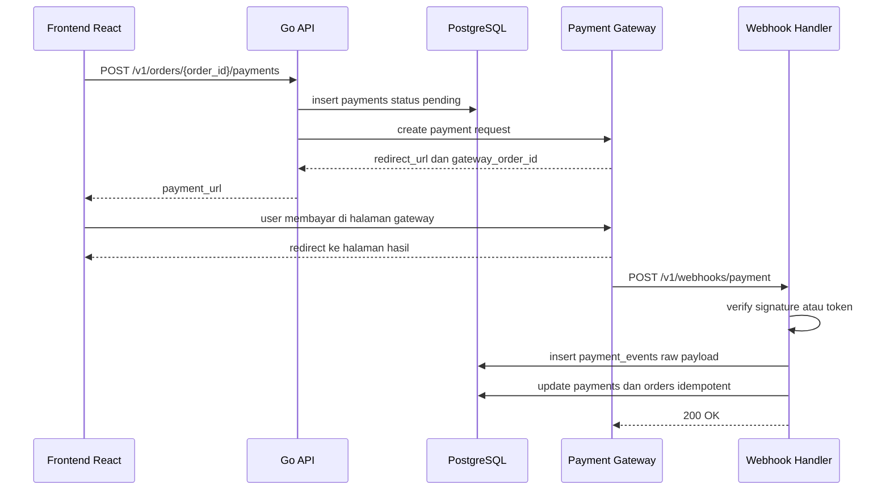
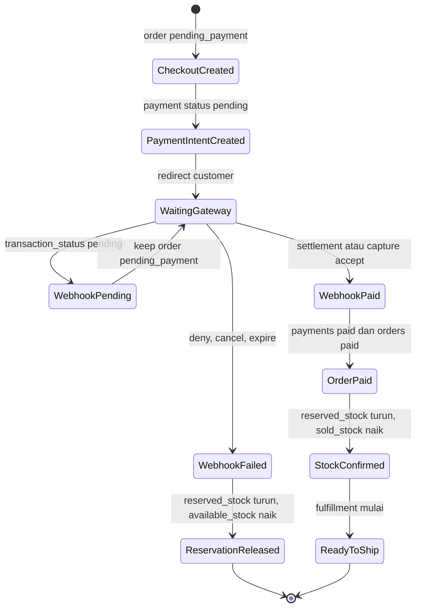

import { Section, Box, Steps, Step, Recap, CardGrid, Card, Chip, Hero, Compare, FileTree, Endpoint, Def } from "@components";

<Hero eyebrow="Roadmap 5 &middot; Domain Online Shop" title="Domain Payment:<br /><em>Webhook</em> yang Aman">
  <p>Payment bukan sekadar redirect ke gateway, tetapi kontrak backend yang harus aman, idempotent, dan bisa diaudit.</p>
  <Fragment slot="meta">
    <Chip icon="code">Bahasa: <b>Go 1.26</b></Chip>
    <Chip icon="clock">~60 menit baca</Chip>
  </Fragment>
</Hero>

<Section num="01" id="intro" title="Masalah Payment di Backend Nyata" sub="Redirect berhasil belum tentu uang benar-benar masuk">

<p class="lead">Di frontend React, checkout terlihat selesai saat user kembali dari halaman payment gateway, tetapi backend tidak boleh percaya redirect itu sebagai bukti pembayaran.</p>

Dalam online shop skincare, user bisa memilih serum, toner, atau sunscreen, lalu diarahkan ke Midtrans, Xendit, Nicepay, atau gateway lain. Setelah itu ada dua jalur informasi yang sering tertukar: **redirect/callback browser** dan **webhook server-to-server**. Redirect berguna untuk pengalaman user. Webhook adalah sumber kebenaran untuk mengubah order menjadi paid.

<Box variant="bridge" icon="🌉" label="Jembatan: dari callback frontend ke webhook backend"><p>Di React, callback sering berarti fungsi yang dipanggil setelah aksi selesai. Di payment gateway, webhook adalah HTTP request dari server gateway ke server kita. Ia harus diverifikasi, dicatat, dan diproses idempotent.</p></Box>

<Compare aLabel="Frontend redirect" bLabel="Backend webhook" aTone="muted" bTone="violet">
  <Fragment slot="a"><ul><li>User bisa menutup browser, refresh, atau memalsukan parameter URL.</li><li>Cocok untuk menampilkan halaman sukses, gagal, atau pending.</li></ul></Fragment>
  <Fragment slot="b"><ul><li>Dikirim dari gateway ke API kita setelah status transaksi berubah.</li><li>Dipakai untuk update `payments`, `orders`, dan inventory reservation.</li></ul></Fragment>
</Compare>

Endpoint minimal pada modul ini:

<Endpoint method="POST" path="/v1/orders/:order_id/payments" desc="Buat payment intent sebelum user diarahkan ke payment gateway" />
<Endpoint method="POST" path="/v1/webhooks/payment" desc="Terima webhook payment gateway secara server-to-server" />
<Endpoint method="GET" path="/v1/payments/:payment_id" desc="Lihat status payment internal untuk halaman order detail" />

<Box variant="warn" icon="⚠️" label="Aturan produksi"><p>Jangan pernah mengubah order menjadi paid hanya karena user diarahkan ke halaman sukses. Ubah status hanya setelah webhook valid atau setelah rekonsiliasi server-to-server memastikan pembayaran memang sukses.</p></Box>

Alur besarnya seperti ini:



<p class="fig-cap"><b>Gambar 1.</b> Redirect membantu UX, webhook menentukan perubahan state backend.</p>

</Section>

<Section num="02" id="model-payment" title="Model Payment Intent dan Status" sub="Catatan internal harus dibuat sebelum redirect ke gateway">

<p class="lead">Payment intent adalah catatan niat membayar untuk satu order, dibuat sebelum customer keluar dari aplikasi kita.</p>

<Def term="payment intent"><p>Payment intent adalah record internal yang mengikat `order_id`, jumlah yang harus dibayar, provider gateway, status awal `pending`, dan identifier yang dikirim ke payment gateway.</p></Def>

<Def term="payment status"><p>Payment status adalah state internal pembayaran. Pada modul ini, state minimum adalah `pending`, `paid`, `failed`, dan `refunded`.</p></Def>

Di Laravel, kamu mungkin terbiasa membuat order lalu langsung memanggil SDK gateway di controller. Di Go, kita pisahkan: handler hanya menerima HTTP, service membuat payment intent, repository menyimpan data, lalu client diarahkan ke URL gateway.

<CardGrid cols={3}>
  <Card><h4>pending</h4><p>Payment intent dibuat, tetapi gateway belum mengonfirmasi uang masuk.</p></Card>
  <Card><h4>paid</h4><p>Webhook valid menyatakan pembayaran sukses dan order boleh diproses.</p></Card>
  <Card><h4>failed</h4><p>Gateway menyatakan deny, cancel, expire, atau failure lain yang tidak bisa diproses sebagai paid.</p></Card>
  <Card><h4>refunded</h4><p>Dana dikembalikan, biasanya memicu proses operasional terpisah dari fulfillment.</p></Card>
  <Card><h4>event log</h4><p>Semua webhook disimpan agar audit dan debugging tidak bergantung pada log aplikasi saja.</p></Card>
  <Card><h4>reconciliation</h4><p>Status internal dibandingkan dengan laporan gateway agar mismatch cepat ditemukan.</p></Card>
</CardGrid>

Struktur domain payment di modular monolith:

<FileTree title="Struktur domain payment" tree={`cmd/
  api/
    main.go                         # mount route webhook dan payment intent
internal/
  payment/
    handler.go                      # HTTP endpoint payment dan webhook
    service.go                      # business flow payment intent dan webhook
    repository.go                   # interface repository
    pg_repository.go                # implementasi PostgreSQL dengan pgx
    model.go                        # Payment, PaymentEvent, status
    signature.go                    # verifikasi signature gateway
  order/
    service.go                      # update status order
  inventory/
    service.go                      # confirm atau release reservation
db/
  migrations/
    018_create_payments.up.sql
`} />

Skema PostgreSQL minimum:

```sql title="db/migrations/018_create_payments.up.sql"
CREATE TABLE payments (
  id BIGSERIAL PRIMARY KEY,
  order_id BIGINT NOT NULL UNIQUE REFERENCES orders(id),
  provider TEXT NOT NULL,
  gateway_order_id TEXT NOT NULL,
  gateway_transaction_id TEXT,
  amount_cents BIGINT NOT NULL CHECK (amount_cents > 0),
  currency CHAR(3) NOT NULL DEFAULT 'IDR',
  status TEXT NOT NULL CHECK (status IN ('pending', 'paid', 'failed', 'refunded')),
  redirect_url TEXT NOT NULL DEFAULT '',
  paid_at TIMESTAMPTZ,
  failed_at TIMESTAMPTZ,
  refunded_at TIMESTAMPTZ,
  created_at TIMESTAMPTZ NOT NULL DEFAULT NOW(),
  updated_at TIMESTAMPTZ NOT NULL DEFAULT NOW(),
  UNIQUE (provider, gateway_order_id)
);

CREATE UNIQUE INDEX uq_payments_gateway_transaction_id
  ON payments (provider, gateway_transaction_id)
  WHERE gateway_transaction_id IS NOT NULL;

CREATE TABLE payment_events (
  id BIGSERIAL PRIMARY KEY,
  payment_id BIGINT REFERENCES payments(id),
  provider TEXT NOT NULL,
  event_key TEXT NOT NULL,
  gateway_order_id TEXT,
  gateway_transaction_id TEXT,
  event_type TEXT NOT NULL,
  event_status TEXT NOT NULL,
  signature_valid BOOLEAN NOT NULL DEFAULT FALSE,
  raw_payload JSONB NOT NULL,
  received_at TIMESTAMPTZ NOT NULL DEFAULT NOW(),
  processed_at TIMESTAMPTZ,
  process_error TEXT,
  UNIQUE (provider, event_key)
);

CREATE INDEX idx_payment_events_payment_id_received_at
  ON payment_events(payment_id, received_at DESC);

CREATE INDEX idx_payments_status_created_at
  ON payments(status, created_at DESC);
```

<Box variant="note" icon="🧾" label="Kenapa raw payload disimpan"><p>Ketika customer service bertanya kenapa order INV-20260101-0031 belum paid, kita bisa membuka `payment_events` dan melihat payload asli dari gateway, bukan hanya menebak dari log aplikasi.</p></Box>

Model Go yang dipakai service:

```go title="internal/payment/model.go"
package payment

import "time"

type Status string

const (
	StatusPending  Status = "pending"
	StatusPaid     Status = "paid"
	StatusFailed   Status = "failed"
	StatusRefunded Status = "refunded"
)

type Payment struct {
	ID                   int64
	OrderID              int64
	Provider             string
	GatewayOrderID       string
	GatewayTransactionID string
	AmountCents          int64
	Currency             string
	Status               Status
	RedirectURL          string
	PaidAt               *time.Time
	CreatedAt            time.Time
	UpdatedAt            time.Time
}

type PaymentEvent struct {
	ID                   int64
	PaymentID            int64
	Provider             string
	EventKey             string
	GatewayOrderID       string
	GatewayTransactionID string
	EventType            string
	EventStatus          string
	SignatureValid       bool
	RawPayload           []byte
	ReceivedAt           time.Time
	ProcessedAt          *time.Time
	ProcessError         string
}
```

</Section>

<Section num="03" id="webhook-aman" title="Webhook yang Aman dan Terverifikasi" sub="Signature dulu, business logic belakangan">

<p class="lead">Webhook harus dianggap input publik, walaupun datang dari payment gateway yang kita percaya.</p>

Provider berbeda punya mekanisme verifikasi berbeda. Midtrans mengirim `signature_key` pada body notification. Nilai itu dihitung dari `order_id`, `status_code`, `gross_amount`, dan Server Key. Xendit umumnya memakai header seperti `x-callback-token` untuk memverifikasi asal webhook, dan beberapa API callback memakai signature HMAC. Nicepay punya konsep `dbprocessurl` untuk menerima push notification dan skema signature bergantung produk integrasi yang dipakai.

<Box variant="tip" icon="💡" label="Prinsip universal"><p>Jangan copy paste rumus signature antar provider. Buat adapter per provider karena nama field, algoritma hash, header, dan status code bisa berbeda.</p></Box>

Di contoh ini, istilah notification key pada konteks Midtrans kita map ke field resmi yang umum dipakai di payload, yaitu `signature_key`.

```json title="contoh-midtrans-notification.json"
{
  "order_id": "INV-20260101-0031",
  "transaction_id": "513f1f01-c9da-474c-9fc9-d5c64364b709",
  "transaction_status": "settlement",
  "status_code": "200",
  "gross_amount": "249000.00",
  "signature_key": "2496c78cac93a70ca08014bdaaff08eb7119ef79ef69c4833d4399cada077147febc1a231992eb8665a7e26d89b1dc323c13f721d21c7485f70bff06cca6eed3",
  "payment_type": "bank_transfer",
  "fraud_status": "accept",
  "currency": "IDR"
}
```

Helper verifikasi signature:

```go title="internal/payment/signature.go"
package payment

import (
	"crypto/hmac"
	"crypto/sha256"
	"crypto/sha512"
	"crypto/subtle"
	"encoding/hex"
	"strings"
)

type MidtransNotification struct {
	OrderID             string `json:"order_id"`
	TransactionID       string `json:"transaction_id"`
	TransactionStatus   string `json:"transaction_status"`
	StatusCode          string `json:"status_code"`
	GrossAmount         string `json:"gross_amount"`
	SignatureKey        string `json:"signature_key"`
	PaymentType         string `json:"payment_type"`
	FraudStatus         string `json:"fraud_status"`
	Currency            string `json:"currency"`
}

func VerifyMidtransSignature(n MidtransNotification, serverKey string) bool {
	message := n.OrderID + n.StatusCode + n.GrossAmount + serverKey
	sum := sha512.Sum512([]byte(message))
	expected := hex.EncodeToString(sum[:])
	return subtle.ConstantTimeCompare([]byte(expected), []byte(n.SignatureKey)) == 1
}

func VerifyHMACSHA256Hex(body []byte, headerSignature string, secret []byte) bool {
	provided := strings.TrimPrefix(headerSignature, "sha256=")
	providedMAC, err := hex.DecodeString(provided)
	if err != nil {
		return false
	}

	mac := hmac.New(sha256.New, secret)
	_, _ = mac.Write(body)
	expectedMAC := mac.Sum(nil)

	return hmac.Equal(providedMAC, expectedMAC)
}

func VerifyStaticToken(provided string, expected string) bool {
	if provided == "" || expected == "" {
		return false
	}
	return subtle.ConstantTimeCompare([]byte(provided), []byte(expected)) == 1
}
```

<Box variant="warn" icon="⚠️" label="Jangan pakai perbandingan string biasa"><p>Untuk signature dan token, gunakan comparison yang menghindari timing side-channel seperti `hmac.Equal` atau `subtle.ConstantTimeCompare`, bukan `a == b`.</p></Box>

Handler webhook sebaiknya kecil dan eksplisit:

```go title="internal/payment/handler.go"
package payment

import (
	"context"
	"encoding/json"
	"errors"
	"io"
	"log/slog"
	"net/http"
)

type WebhookService interface {
	HandleMidtransWebhook(ctx context.Context, raw []byte, notification MidtransNotification) error
	RecordRejectedWebhook(ctx context.Context, provider string, raw []byte, reason string) error
}

type Handler struct {
	service            WebhookService
	logger             *slog.Logger
	midtransServerKey  string
}

func NewHandler(service WebhookService, logger *slog.Logger, midtransServerKey string) *Handler {
	return &Handler{
		service:           service,
		logger:            logger,
		midtransServerKey: midtransServerKey,
	}
}

func (h *Handler) PaymentWebhook(w http.ResponseWriter, r *http.Request) {
	ctx := r.Context()
	r.Body = http.MaxBytesReader(w, r.Body, 1<<20)

	raw, err := io.ReadAll(r.Body)
	if err != nil {
		http.Error(w, "payload too large", http.StatusRequestEntityTooLarge)
		return
	}

	provider := r.URL.Query().Get("provider")
	if provider != "midtrans" {
		http.Error(w, "unsupported provider", http.StatusBadRequest)
		return
	}

	var notification MidtransNotification
	if err := json.Unmarshal(raw, &notification); err != nil {
		http.Error(w, "invalid json", http.StatusBadRequest)
		return
	}

	if !VerifyMidtransSignature(notification, h.midtransServerKey) {
		_ = h.service.RecordRejectedWebhook(ctx, "midtrans", raw, "invalid signature")
		h.logger.WarnContext(ctx, "payment webhook rejected", slog.String("provider", "midtrans"), slog.String("order_id", notification.OrderID))
		http.Error(w, "invalid signature", http.StatusUnauthorized)
		return
	}

	if err := h.service.HandleMidtransWebhook(ctx, raw, notification); err != nil {
		if errors.Is(err, ErrDuplicateWebhook) {
			w.WriteHeader(http.StatusOK)
			return
		}
		h.logger.ErrorContext(ctx, "payment webhook failed", slog.String("provider", "midtrans"), slog.String("order_id", notification.OrderID), slog.Any("error", err))
		http.Error(w, "webhook failed", http.StatusInternalServerError)
		return
	}

	w.WriteHeader(http.StatusOK)
}
```

<Box variant="note" icon="🧠" label="Respon cepat"><p>Gateway biasanya akan retry kalau endpoint tidak membalas 2xx. Untuk operasi berat seperti email invoice, enqueue job worker setelah status tersimpan, bukan dikerjakan langsung di handler.</p></Box>

</Section>

<Section num="04" id="idempotency-event-log" title="Idempotency dan Payment Event Log" sub="Webhook bisa datang lebih dari sekali">

<p class="lead">Idempotency di webhook berarti payload yang sama boleh datang berkali-kali tanpa membuat order dobel paid, stok dobel sold, atau email dobel terkirim.</p>

Gateway bisa mengirim webhook ulang karena timeout, response kita bukan 2xx, retry jaringan, atau perbedaan status dari channel pembayaran. Karena itu, idempotency webhook tidak cukup hanya cek order sudah paid. Kita juga butuh event log agar duplicate dan status transition bisa diaudit.

<Def term="payment event log"><p>Payment event log adalah tabel append-only yang menyimpan setiap webhook yang diterima, termasuk raw payload, signature_valid, provider, transaction_id, status event, dan hasil proses.</p></Def>

Pola yang aman:

<Steps>
  <Step><b>Baca raw body</b><p>Raw body dibutuhkan untuk audit dan beberapa skema signature HMAC.</p></Step>
  <Step><b>Verifikasi signature</b><p>Webhook invalid dicatat sebagai rejected dan tidak menyentuh order.</p></Step>
  <Step><b>Buat event_key</b><p>Untuk Midtrans, event key praktis adalah gabungan `transaction_id`, `transaction_status`, dan `fraud_status`.</p></Step>
  <Step><b>Insert event dengan UNIQUE constraint</b><p>Jika insert conflict, balas 200 agar gateway berhenti retry dan jangan proses ulang.</p></Step>
  <Step><b>Lock payment intent</b><p>Ambil payment dengan `FOR UPDATE` supaya dua webhook concurrent tidak update order bersamaan.</p></Step>
  <Step><b>Apply transition</b><p>Update payment, order, dan inventory hanya jika status transition valid.</p></Step>
</Steps>

Repository untuk insert event idempotent:

```go title="internal/payment/pg_repository.go"
package payment

import (
	"context"

	"github.com/jackc/pgx/v5"
)

type Repository struct{}

func (r *Repository) InsertEvent(ctx context.Context, tx pgx.Tx, e PaymentEvent) (bool, error) {
	const q = `
INSERT INTO payment_events (
  payment_id,
  provider,
  event_key,
  gateway_order_id,
  gateway_transaction_id,
  event_type,
  event_status,
  signature_valid,
  raw_payload
) VALUES ($1,$2,$3,$4,$5,$6,$7,$8,$9::jsonb)
ON CONFLICT (provider, event_key) DO NOTHING
`

	tag, err := tx.Exec(ctx, q,
		nil,
		e.Provider,
		e.EventKey,
		e.GatewayOrderID,
		e.GatewayTransactionID,
		e.EventType,
		e.EventStatus,
		e.SignatureValid,
		e.RawPayload,
	)
	if err != nil {
		return false, err
	}

	return tag.RowsAffected() == 1, nil
}

func (r *Repository) FindByGatewayOrderIDForUpdate(ctx context.Context, tx pgx.Tx, provider string, gatewayOrderID string) (Payment, error) {
	const q = `
SELECT id, order_id, provider, gateway_order_id, gateway_transaction_id, amount_cents, currency, status, redirect_url, paid_at, created_at, updated_at
FROM payments
WHERE provider = $1 AND gateway_order_id = $2
FOR UPDATE
`

	var p Payment
	err := tx.QueryRow(ctx, q, provider, gatewayOrderID).Scan(
		&p.ID,
		&p.OrderID,
		&p.Provider,
		&p.GatewayOrderID,
		&p.GatewayTransactionID,
		&p.AmountCents,
		&p.Currency,
		&p.Status,
		&p.RedirectURL,
		&p.PaidAt,
		&p.CreatedAt,
		&p.UpdatedAt,
	)
	if err != nil {
		return Payment{}, err
	}

	return p, nil
}
```

Service mapping status Midtrans:

```go title="internal/payment/service.go"
package payment

import (
	"context"
	"errors"
	"strings"
	"time"

	"github.com/jackc/pgx/v5"
	"github.com/jackc/pgx/v5/pgxpool"
)

var ErrDuplicateWebhook = errors.New("duplicate payment webhook")

type EventRepository interface {
	InsertEvent(ctx context.Context, tx pgx.Tx, e PaymentEvent) (bool, error)
	FindByGatewayOrderIDForUpdate(ctx context.Context, tx pgx.Tx, provider string, gatewayOrderID string) (Payment, error)
	MarkPaid(ctx context.Context, tx pgx.Tx, paymentID int64, gatewayTransactionID string, paidAt time.Time) error
	MarkFailed(ctx context.Context, tx pgx.Tx, paymentID int64, gatewayTransactionID string, failedAt time.Time) error
	MarkEventProcessed(ctx context.Context, tx pgx.Tx, provider string, eventKey string) error
}

type OrderService interface {
	MarkPaid(ctx context.Context, tx pgx.Tx, orderID int64) error
	MarkPaymentFailed(ctx context.Context, tx pgx.Tx, orderID int64) error
}

type InventoryService interface {
	ConfirmReservation(ctx context.Context, tx pgx.Tx, orderID int64) error
	ReleaseReservation(ctx context.Context, tx pgx.Tx, orderID int64) error
}

type Service struct {
	pool      *pgxpool.Pool
	repo      EventRepository
	orders    OrderService
	inventory InventoryService
}

func (s *Service) HandleMidtransWebhook(ctx context.Context, raw []byte, n MidtransNotification) error {
	tx, err := s.pool.Begin(ctx)
	if err != nil {
		return err
	}
	defer tx.Rollback(ctx)

	eventKey := strings.Join([]string{n.TransactionID, n.TransactionStatus, n.FraudStatus}, ":")
	inserted, err := s.repo.InsertEvent(ctx, tx, PaymentEvent{
		Provider:             "midtrans",
		EventKey:             eventKey,
		GatewayOrderID:       n.OrderID,
		GatewayTransactionID: n.TransactionID,
		EventType:            "payment.notification",
		EventStatus:          n.TransactionStatus,
		SignatureValid:       true,
		RawPayload:           raw,
	})
	if err != nil {
		return err
	}
	if !inserted {
		return ErrDuplicateWebhook
	}

	p, err := s.repo.FindByGatewayOrderIDForUpdate(ctx, tx, "midtrans", n.OrderID)
	if err != nil {
		return err
	}

	now := time.Now().UTC()
	nextStatus := MapMidtransStatus(n)

	switch nextStatus {
	case StatusPaid:
		if p.Status != StatusPaid {
			if err := s.repo.MarkPaid(ctx, tx, p.ID, n.TransactionID, now); err != nil {
				return err
			}
			if err := s.orders.MarkPaid(ctx, tx, p.OrderID); err != nil {
				return err
			}
			if err := s.inventory.ConfirmReservation(ctx, tx, p.OrderID); err != nil {
				return err
			}
		}
	case StatusFailed:
		if p.Status == StatusPending {
			if err := s.repo.MarkFailed(ctx, tx, p.ID, n.TransactionID, now); err != nil {
				return err
			}
			if err := s.orders.MarkPaymentFailed(ctx, tx, p.OrderID); err != nil {
				return err
			}
			if err := s.inventory.ReleaseReservation(ctx, tx, p.OrderID); err != nil {
				return err
			}
		}
	}

	if err := s.repo.MarkEventProcessed(ctx, tx, "midtrans", eventKey); err != nil {
		return err
	}

	return tx.Commit(ctx)
}

func MapMidtransStatus(n MidtransNotification) Status {
	switch n.TransactionStatus {
	case "capture":
		if n.FraudStatus == "accept" {
			return StatusPaid
		}
		return StatusPending
	case "settlement":
		return StatusPaid
	case "deny", "cancel", "expire", "failure":
		return StatusFailed
	case "refund", "partial_refund":
		return StatusRefunded
	default:
		return StatusPending
	}
}
```

<Box variant="tip" icon="✅" label="Kenapa duplicate tetap 200"><p>Kalau webhook duplikat sudah pernah diproses, balas 200. Kalau kita balas 409 atau 500, gateway bisa menganggap pengiriman gagal dan retry lagi.</p></Box>

</Section>

<Section num="05" id="update-order" title="Update Order Setelah Payment Success" sub="Payment success memicu order paid dan stok sold">

<p class="lead">Webhook paid bukan hanya mengubah tabel `payments`, tetapi juga memindahkan order dan inventory ke state berikutnya.</p>

Pada Roadmap 5 Chapter 4, checkout membuat order dengan status awal `pending_payment`. Pada Roadmap 5 Chapter 5, inventory melakukan reservasi stok: `available_stock` berkurang dan `reserved_stock` bertambah. Di modul ini, webhook payment success mengonfirmasi reservasi itu menjadi sold.



<p class="fig-cap"><b>Gambar 2.</b> State payment menghubungkan checkout, inventory reservation, dan fulfillment.</p>

Contoh SQL update idempotent untuk paid:

```sql title="internal/payment/sql/payment_paid.sql"
UPDATE payments
SET
  status = 'paid',
  gateway_transaction_id = $2,
  paid_at = $3,
  updated_at = NOW()
WHERE id = $1
  AND status IN ('pending', 'paid');

UPDATE orders
SET
  status = 'paid',
  paid_at = $2,
  updated_at = NOW()
WHERE id = $1
  AND status = 'pending_payment';

UPDATE inventories i
SET
  reserved_stock = i.reserved_stock - oi.quantity,
  sold_stock = i.sold_stock + oi.quantity,
  updated_at = NOW()
FROM order_items oi
WHERE oi.order_id = $1
  AND oi.product_variant_id = i.product_variant_id;
```

<Box variant="warn" icon="⚠️" label="Hati-hati partial update"><p>Jangan update payment menjadi paid lalu gagal update inventory di transaksi berbeda. Payment, order, dan inventory confirmation harus berada dalam satu transaksi database.</p></Box>

Untuk payment intent, service membuat record pending sebelum gateway request:

```go title="internal/payment/create_intent.go"
package payment

import (
	"context"
	"fmt"
)

type GatewayClient interface {
	CreatePaymentRequest(ctx context.Context, req GatewayPaymentRequest) (GatewayPaymentResponse, error)
}

type GatewayPaymentRequest struct {
	OrderNumber string
	AmountCents int64
	Currency    string
	CustomerID  int64
}

type GatewayPaymentResponse struct {
	GatewayOrderID string
	RedirectURL    string
}

type IntentRepository interface {
	CreatePending(ctx context.Context, orderID int64, provider string, gatewayOrderID string, amountCents int64, currency string) (Payment, error)
	AttachRedirectURL(ctx context.Context, paymentID int64, redirectURL string) error
}

type IntentService struct {
	repo    IntentRepository
	gateway GatewayClient
}

func NewIntentService(repo IntentRepository, gateway GatewayClient) *IntentService {
	return &IntentService{repo: repo, gateway: gateway}
}

func (s *IntentService) CreateIntent(ctx context.Context, orderID int64, orderNumber string, amountCents int64, customerID int64) (Payment, error) {
	gatewayOrderID := orderNumber

	p, err := s.repo.CreatePending(ctx, orderID, "midtrans", gatewayOrderID, amountCents, "IDR")
	if err != nil {
		return Payment{}, fmt.Errorf("create pending payment: %w", err)
	}

	res, err := s.gateway.CreatePaymentRequest(ctx, GatewayPaymentRequest{
		OrderNumber: gatewayOrderID,
		AmountCents: amountCents,
		Currency:    "IDR",
		CustomerID:  customerID,
	})
	if err != nil {
		return Payment{}, fmt.Errorf("create gateway payment request: %w", err)
	}

	if err := s.repo.AttachRedirectURL(ctx, p.ID, res.RedirectURL); err != nil {
		return Payment{}, fmt.Errorf("attach redirect url: %w", err)
	}

	p.RedirectURL = res.RedirectURL
	return p, nil
}
```

<Box variant="note" icon="🧩" label="Catatan desain"><p>Contoh di atas sengaja menampilkan konsep intent. Di implementasi production, hindari type assertion pada repository dengan memecah interface service secara eksplisit agar dependency lebih bersih.</p></Box>

</Section>

<Section num="06" id="rekonsiliasi" title="Rekonsiliasi Payment" sub="Webhook cepat, laporan gateway tetap perlu dibandingkan">

<p class="lead">Rekonsiliasi memastikan status internal kita cocok dengan status di payment gateway dan laporan settlement.</p>

Webhook bisa terlambat, endpoint bisa down, atau ada status yang berubah setelah event awal. Karena itu, sistem pembayaran yang sehat punya proses rekonsiliasi. Minimal, command harian membaca payment pending lama dan membandingkan ke status inquiry gateway.

<CardGrid cols={3}>
  <Card><h4>Status mismatch</h4><p>Gateway sudah settlement, tetapi database internal masih pending.</p></Card>
  <Card><h4>Amount mismatch</h4><p>Nominal gateway tidak sama dengan `payments.amount_cents` atau `orders.grand_total_cents`.</p></Card>
  <Card><h4>Missing event</h4><p>Payment paid ada di report gateway, tetapi tidak ada raw webhook di `payment_events`.</p></Card>
</CardGrid>

Query kandidat rekonsiliasi:

```sql title="internal/payment/sql/reconcile_candidates.sql"
SELECT
  p.id,
  p.order_id,
  p.provider,
  p.gateway_order_id,
  p.gateway_transaction_id,
  p.amount_cents,
  p.currency,
  p.status,
  p.created_at
FROM payments p
WHERE p.status = 'pending'
  AND p.created_at < NOW() - INTERVAL '30 minutes'
ORDER BY p.created_at ASC
LIMIT 100;
```

Command sederhana:

```go title="cmd/reconcile-payments/main.go"
package main

import (
	"context"
	"log/slog"
	"os"
	"time"
)

func main() {
	ctx, cancel := context.WithTimeout(context.Background(), 2*time.Minute)
	defer cancel()

	logger := slog.New(slog.NewJSONHandler(os.Stdout, nil))

	if err := run(ctx, logger); err != nil {
		logger.ErrorContext(ctx, "payment reconciliation failed", slog.Any("error", err))
		os.Exit(1)
	}
}

func run(ctx context.Context, logger *slog.Logger) error {
	logger.InfoContext(ctx, "payment reconciliation started")
	logger.InfoContext(ctx, "fetch pending payments older than threshold")
	logger.InfoContext(ctx, "call gateway status inquiry per provider")
	logger.InfoContext(ctx, "compare status, amount, currency, and order_id")
	logger.InfoContext(ctx, "write reconciliation report and fix safe mismatch")
	return nil
}
```

<Box variant="bridge" icon="🌉" label="Jembatan: mirip settlement report di finance"><p>Di Laravel atau PHP monolith, tim sering mengecek report manual dari dashboard gateway. Di backend Go, kita tetap butuh proses itu, tetapi dibuat repeatable sebagai command atau worker.</p></Box>

</Section>

<Section num="07" id="hands-on" title="Hands-on Ringan" sub="Bangun versi kecil sebelum integrasi SDK sungguhan">

<p class="lead">Hands-on ini membuat fondasi payment tanpa perlu akun gateway dulu.</p>

<Steps>
  <Step><b>Buat migration payment</b><p>Tambahkan tabel `payments` dan `payment_events` seperti skema di atas.</p></Step>
  <Step><b>Buat endpoint create intent</b><p>Endpoint cukup membuat payment pending dan mengembalikan `redirect_url` dummy.</p></Step>
  <Step><b>Buat endpoint webhook Midtrans dummy</b><p>Terima payload JSON, verifikasi `signature_key`, lalu insert event.</p></Step>
  <Step><b>Simulasikan duplicate webhook</b><p>Kirim payload yang sama dua kali dan pastikan order tidak berubah dua kali.</p></Step>
  <Step><b>Simulasikan status settlement</b><p>Ubah payment menjadi paid, order menjadi paid, dan inventory reservation menjadi sold dalam transaksi yang sama.</p></Step>
</Steps>

Payload simulasi:

```json title="tmp/midtrans-settlement.json"
{
  "order_id": "INV-20260101-0031",
  "transaction_id": "tx-skincare-001",
  "transaction_status": "settlement",
  "status_code": "200",
  "gross_amount": "249000.00",
  "signature_key": "isi_dengan_hash_sha512_yang_valid",
  "payment_type": "bank_transfer",
  "fraud_status": "accept",
  "currency": "IDR"
}
```

Contoh curl:

```bash title="Terminal"
curl -X POST 'http://localhost:8080/v1/webhooks/payment?provider=midtrans' \
  -H 'Content-Type: application/json' \
  --data @tmp/midtrans-settlement.json

curl -X POST 'http://localhost:8080/v1/webhooks/payment?provider=midtrans' \
  -H 'Content-Type: application/json' \
  --data @tmp/midtrans-settlement.json
```

Ekspektasi setelah request kedua:

```sql title="cek-hasil.sql"
SELECT status, gateway_transaction_id, paid_at
FROM payments
WHERE gateway_order_id = 'INV-20260101-0031';

SELECT provider, event_key, event_status, signature_valid, processed_at
FROM payment_events
WHERE gateway_order_id = 'INV-20260101-0031'
ORDER BY received_at DESC;
```

<Box variant="tip" icon="💡" label="Target hands-on"><p>Request pertama memproses event. Request kedua harus mendapat 200, tetapi tidak menambah efek bisnis baru karena terkena UNIQUE constraint pada `payment_events`.</p></Box>

</Section>

<Section num="08" id="jebakan" title="Jebakan Umum" sub="Bug payment biasanya mahal karena efeknya uang dan stok">

<p class="lead">Pendatang dari JS/PHP biasanya cepat membuat endpoint payment, tetapi mudah melewatkan detail operasional yang membuat sistem aman.</p>

<Compare aLabel="Kebiasaan berisiko" bLabel="Pola Go yang lebih aman" aTone="red" bTone="teal">
  <Fragment slot="a"><ul><li>Update order paid dari halaman redirect sukses.</li><li>Parse JSON lalu membuang raw payload.</li><li>Menganggap webhook hanya datang sekali.</li><li>Menyimpan log payment hanya di stdout.</li></ul></Fragment>
  <Fragment slot="b"><ul><li>Update paid hanya dari webhook valid atau rekonsiliasi.</li><li>Simpan raw payload di `payment_events`.</li><li>Gunakan UNIQUE constraint untuk event idempotency.</li><li>Gunakan `log/slog` untuk structured log dan database event log untuk audit.</li></ul></Fragment>
</Compare>

Daftar jebakan yang wajib dihindari:

<ul>
  <li><strong>Tidak verifikasi signature.</strong> Endpoint webhook adalah endpoint publik, jadi payload palsu harus ditolak sebelum menyentuh business state.</li>
  <li><strong>Idempotency hanya di memori.</strong> Map global di Go hilang saat proses restart dan tidak aman saat API punya beberapa instance.</li>
  <li><strong>UNIQUE salah desain.</strong> Unique hanya pada `transaction_id` bisa menolak status update valid seperti pending lalu settlement. Gunakan event key yang mewakili event unik.</li>
  <li><strong>Order paid tanpa amount check.</strong> Cocokkan `gross_amount`, currency, dan order id agar payload untuk nominal lain tidak mengubah order.</li>
  <li><strong>Webhook melakukan kerja lambat.</strong> Generate invoice PDF, email, dan push notification sebaiknya masuk background worker.</li>
  <li><strong>Secret masuk log.</strong> Jangan log Server Key, callback token, Authorization header, atau raw signature secret.</li>
  <li><strong>Tidak punya rekonsiliasi.</strong> Webhook bagus, tetapi finance tetap membutuhkan pembanding terhadap report gateway.</li>
</ul>

<Box variant="warn" icon="⚠️" label="Jangan percaya status string mentah"><p>Map status gateway ke status internal yang kecil dan stabil. Jangan menyebarkan string seperti `settlement`, `capture`, `deny`, atau `expire` ke seluruh domain order.</p></Box>

</Section>

<Section num="09" id="ringkasan" title="Ringkasan & Poin Penting">

<p class="lead">Domain payment adalah penjaga batas antara checkout internal dan realitas uang di gateway eksternal.</p>

<Recap title="Yang Wajib Menempel"><ul><li>Payment intent dibuat sebelum redirect agar setiap pembayaran punya catatan internal yang bisa dilacak.</li><li>Status minimum payment adalah `pending`, `paid`, `failed`, dan `refunded`.</li><li>Webhook payment masuk ke `/v1/webhooks/payment`, diverifikasi signature atau token, lalu diproses di service.</li><li>Midtrans memakai `signature_key` yang dihitung dari `order_id`, `status_code`, `gross_amount`, dan Server Key. Provider lain punya aturan berbeda, jadi buat adapter per provider.</li><li>Webhook harus idempotent karena duplicate delivery normal terjadi di sistem pembayaran.</li><li>`payment_events` menyimpan raw payload agar audit, debugging, dan rekonsiliasi tidak bergantung pada log aplikasi saja.</li><li>Payment success harus mengubah payment, order, dan inventory reservation dalam satu transaksi database.</li><li>Rekonsiliasi membandingkan database internal dengan status inquiry atau report gateway untuk menangkap mismatch.</li></ul></Recap>

Dalam proyek online shop skincare, modul ini menyambungkan Chapter 4 checkout dan Chapter 5 inventory. Checkout membuat order `pending_payment` dan reservasi stok. Inventory menahan stok agar tidak overselling. Payment webhook yang valid mengubah order menjadi paid dan mengonfirmasi stok menjadi sold. Modul berikutnya di Roadmap 5 bisa masuk ke fulfillment, shipment, review, atau integrasi domain lanjutan setelah order benar-benar dibayar.

</Section>
