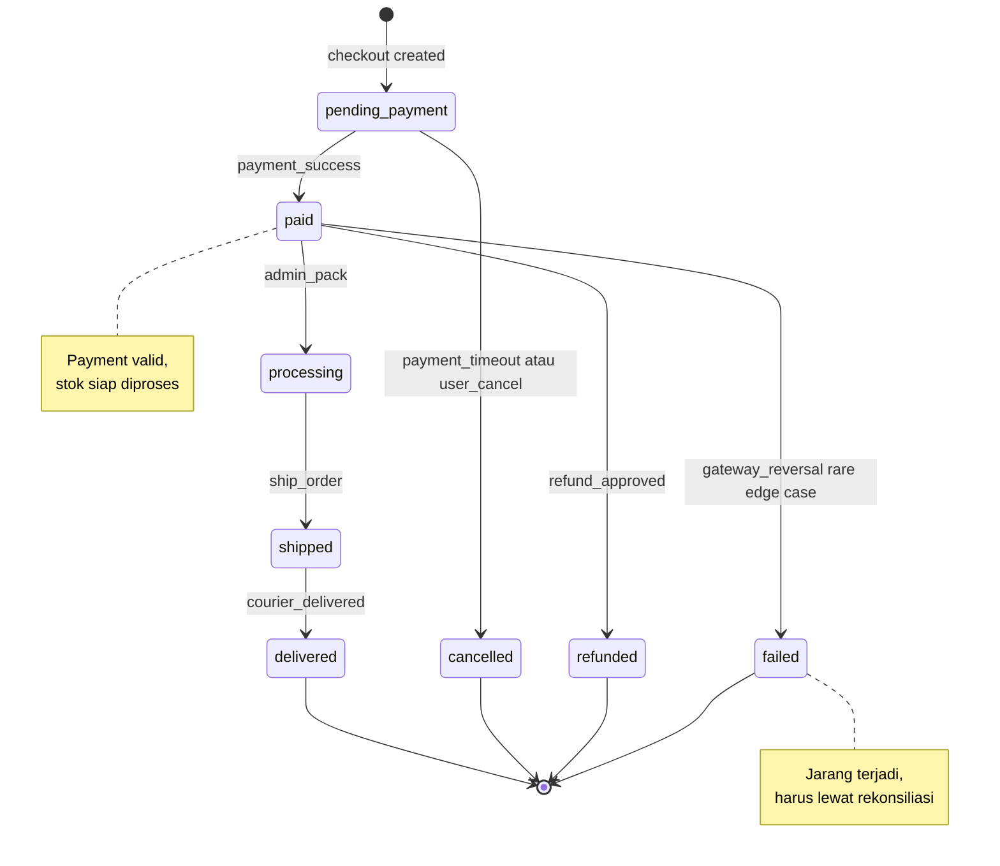
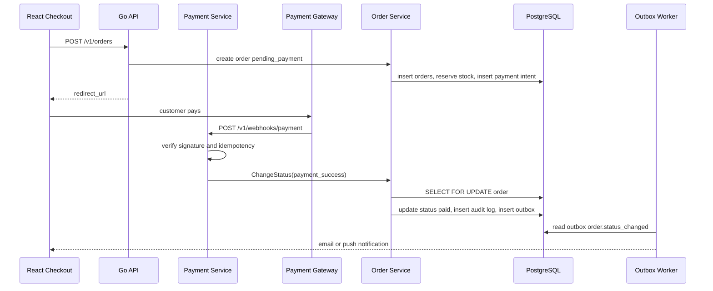

import { Section, Box, Steps, Step, Recap, CardGrid, Card, Chip, Hero, Compare, FileTree, Endpoint, Def } from "@components";

<Hero eyebrow="Roadmap 5 &middot; Domain Mastery" title="Order Lifecycle<br /><em>Status yang Aman</em>">
  <p>Order bukan sekadar row di database, order adalah perjalanan bisnis yang harus punya aturan transisi jelas.</p>
  <Fragment slot="meta">
    <Chip icon="code">Bahasa: <b>Go 1.26</b></Chip>
    <Chip icon="clock">~60 menit baca</Chip>
  </Fragment>
</Hero>

<Section num="01" id="intro" title="Kenapa Order Lifecycle Penting?">

<p class="lead">Di frontend React, status order sering terlihat seperti label di UI, tetapi di backend status adalah kontrak bisnis.</p>

Pada online shop skincare, order melewati banyak aktor: customer, payment gateway, admin warehouse, kurir, dan support. Tanpa aturan transisi, bug kecil bisa membuat order yang sudah `shipped` kembali ke `pending_payment`, stok terkunci selamanya, atau customer menerima notifikasi refund yang tidak pernah terjadi.

<Box variant="bridge" icon="🌉" label="Jembatan: dari React state ke domain state"><p>Di React, state berubah lewat event handler. Di backend Go, status order juga berubah karena event, tetapi efeknya permanen: update database, audit log, notifikasi, dan integrasi lain.</p></Box>

Di Laravel, kamu mungkin pernah membuat kolom `status` lalu mengecek `if ($order->status === 'paid')`. Itu boleh untuk awal, tetapi semakin banyak status dan trigger, logika `if` akan tersebar ke controller, job, dan listener. Modul ini membuat aturan transisi terpusat dalam state machine kecil yang eksplisit.

<Endpoint method="PATCH" path="/v1/orders/{orderID}/status" desc="Ubah status order secara eksplisit oleh admin atau sistem internal" />
<Endpoint method="POST" path="/v1/webhooks/payment" desc="Webhook payment success memicu order menjadi paid melalui service yang sama" />
<Endpoint method="POST" path="/v1/orders/{orderID}/ship" desc="Konfirmasi pengiriman dan ubah order menjadi shipped" />

Rujukan teknis yang relevan: [Go 1.26 Release Notes](https://go.dev/doc/go1.26), [package context](https://pkg.go.dev/context), [package errors](https://pkg.go.dev/errors), [pgxpool](https://pkg.go.dev/github.com/jackc/pgx/v5/pgxpool), dan [PostgreSQL constraints](https://www.postgresql.org/docs/current/ddl-constraints.html).

</Section>

<Section num="02" id="definisi-order-lifecycle" title="Definisi Order Lifecycle">

<p class="lead">Order lifecycle adalah daftar status, aturan transisi, dan efek samping yang terjadi saat status berubah.</p>

<Def term="order lifecycle"><p>Perjalanan order dari dibuat sampai selesai, dibatalkan, gagal, atau direfund. Lifecycle menjawab pertanyaan: status apa yang valid, status mana yang boleh menjadi status berikutnya, siapa yang memicu, dan apa efeknya.</p></Def>

<Def term="state machine"><p>Pola desain yang memodelkan objek sebagai kumpulan state terbatas dan aturan perpindahan antar state. Dalam modul ini, state machine mencegah transisi order yang tidak sah.</p></Def>

<Def term="transition trigger"><p>Penyebab perubahan status, misalnya `payment_success`, `payment_timeout`, `admin_pack`, `ship_order`, `courier_delivered`, atau `refund_approved`.</p></Def>

<Compare aLabel="JS / Laravel: status sebagai string bebas" bLabel="Go: status sebagai tipe domain" aTone="muted" bTone="violet">
  <Fragment slot="a"><ul><li>String status mudah ditulis dari mana saja.</li><li>Typo seperti `payd` sering baru ketahuan saat runtime.</li><li>Aturan transisi sering tersebar di controller, observer, dan job.</li></ul></Fragment>
  <Fragment slot="b"><ul><li>`OrderStatus` menjadi tipe khusus, bukan string acak.</li><li>Transisi divalidasi oleh fungsi domain, bukan oleh handler.</li><li>Service yang sama dipakai oleh webhook, admin action, dan worker.</li></ul></Fragment>
</Compare>

<Box variant="note" icon="🧭" label="Batas modul"><p>Order lifecycle bukan pengganti payment lifecycle. Payment punya status sendiri seperti pending, settlement, expired, failed, dan refund. Order hanya menyimpan status bisnis yang perlu dilihat customer dan operasional.</p></Box>

</Section>

<Section num="03" id="status-domain" title="Status Domain yang Kita Pakai">

<p class="lead">Status order harus cukup ekspresif untuk bisnis, tetapi tidak terlalu mengikuti detail internal payment gateway.</p>

Untuk proyek skincare ini, kita pakai status berikut.

<CardGrid cols={3}>
  <Card><h4>pending_payment</h4><p>Order sudah dibuat dari checkout, stok sudah direserve, customer belum membayar.</p></Card>
  <Card><h4>paid</h4><p>Payment gateway mengonfirmasi pembayaran valid dan order siap masuk proses fulfillment.</p></Card>
  <Card><h4>processing</h4><p>Warehouse sedang menyiapkan produk skincare, mengecek item, dan menyiapkan paket.</p></Card>
  <Card><h4>shipped</h4><p>Paket sudah diserahkan ke kurir dan punya nomor resi atau tracking reference.</p></Card>
  <Card><h4>delivered</h4><p>Kurir atau sistem tracking mengonfirmasi pesanan sudah sampai ke customer.</p></Card>
  <Card><h4>cancelled</h4><p>Order dibatalkan saat masih pending payment, biasanya karena timeout atau customer cancel.</p></Card>
  <Card><h4>refunded</h4><p>Payment yang sudah paid dikembalikan karena complaint, stok rusak, atau keputusan support.</p></Card>
  <Card><h4>failed</h4><p>Edge case setelah paid, misalnya koreksi gateway atau rekonsiliasi menemukan settlement tidak valid.</p></Card>
  <Card><h4>terminal</h4><p>`delivered`, `cancelled`, `refunded`, dan `failed` biasanya dianggap akhir dari lifecycle utama.</p></Card>
</CardGrid>



<p class="fig-cap"><b>Gambar 1.</b> State diagram order lifecycle untuk proyek online shop skincare.</p>

<Box variant="warn" icon="⚠️" label="Jangan gabungkan semua status"><p>Jangan menjadikan `payment_failed`, `stock_reserved`, `invoice_sent`, dan `shipped` sebagai satu enum besar tanpa batas. Pisahkan lifecycle payment, inventory, notification, dan order agar state machine tidak jadi monster.</p></Box>

</Section>

<Section num="04" id="state-machine-pattern" title="State Machine Pattern di Go">

<p class="lead">Di Go, state machine sederhana sering cukup dibuat dengan tipe domain, konstanta, map aturan, dan fungsi validasi.</p>

Kita tidak perlu langsung memakai library state machine. Untuk domain order yang relatif jelas, kode eksplisit lebih mudah dibaca, dites, dan diaudit. Pendekatannya: definisikan status sebagai custom type, definisikan trigger sebagai custom type, lalu buat tabel transisi yang menjadi satu sumber kebenaran.

```go title="internal/order/status.go"
package order

import (
	"errors"
	"fmt"
)

type OrderStatus string

const (
	StatusPendingPayment OrderStatus = "pending_payment"
	StatusPaid           OrderStatus = "paid"
	StatusProcessing     OrderStatus = "processing"
	StatusShipped        OrderStatus = "shipped"
	StatusDelivered      OrderStatus = "delivered"
	StatusCancelled      OrderStatus = "cancelled"
	StatusRefunded       OrderStatus = "refunded"
	StatusFailed         OrderStatus = "failed"
)

type TransitionTrigger string

const (
	TriggerPaymentSuccess   TransitionTrigger = "payment_success"
	TriggerPaymentTimeout   TransitionTrigger = "payment_timeout"
	TriggerUserCancel       TransitionTrigger = "user_cancel"
	TriggerAdminPack        TransitionTrigger = "admin_pack"
	TriggerShipOrder        TransitionTrigger = "ship_order"
	TriggerCourierDelivered TransitionTrigger = "courier_delivered"
	TriggerRefundApproved   TransitionTrigger = "refund_approved"
	TriggerGatewayReversal  TransitionTrigger = "gateway_reversal"
)

var (
	ErrInvalidOrderStatus = errors.New("invalid order status")
	ErrInvalidTransition = errors.New("invalid order status transition")
)

type transitionRule struct {
	triggers map[TransitionTrigger]struct{}
	reason   string
}

var transitionRules = map[OrderStatus]map[OrderStatus]transitionRule{
	StatusPendingPayment: {
		StatusPaid:      allow("payment accepted", TriggerPaymentSuccess),
		StatusCancelled: allow("payment expired or user cancelled", TriggerPaymentTimeout, TriggerUserCancel),
	},
	StatusPaid: {
		StatusProcessing: allow("warehouse starts packing", TriggerAdminPack),
		StatusRefunded:   allow("refund approved by support", TriggerRefundApproved),
		StatusFailed:     allow("gateway reversal after reconciliation", TriggerGatewayReversal),
	},
	StatusProcessing: {
		StatusShipped: allow("order handed to courier", TriggerShipOrder),
	},
	StatusShipped: {
		StatusDelivered: allow("courier confirms delivery", TriggerCourierDelivered),
	},
}

func allow(reason string, triggers ...TransitionTrigger) transitionRule {
	allowed := make(map[TransitionTrigger]struct{}, len(triggers))
	for _, trigger := range triggers {
		allowed[trigger] = struct{}{}
	}
	return transitionRule{triggers: allowed, reason: reason}
}

func ParseOrderStatus(value string) (OrderStatus, error) {
	status := OrderStatus(value)
	if !status.IsKnown() {
		return "", fmt.Errorf("%w: %q", ErrInvalidOrderStatus, value)
	}
	return status, nil
}

func (s OrderStatus) IsKnown() bool {
	switch s {
	case StatusPendingPayment, StatusPaid, StatusProcessing, StatusShipped, StatusDelivered, StatusCancelled, StatusRefunded, StatusFailed:
		return true
	default:
		return false
	}
}

func (s OrderStatus) IsTerminal() bool {
	switch s {
	case StatusDelivered, StatusCancelled, StatusRefunded, StatusFailed:
		return true
	default:
		return false
	}
}

func ValidateTransition(from OrderStatus, to OrderStatus, trigger TransitionTrigger) error {
	if !from.IsKnown() || !to.IsKnown() {
		return ErrInvalidOrderStatus
	}

	toRules, ok := transitionRules[from]
	if !ok {
		return fmt.Errorf("%w: %s is terminal", ErrInvalidTransition, from)
	}

	rule, ok := toRules[to]
	if !ok {
		return fmt.Errorf("%w: %s to %s", ErrInvalidTransition, from, to)
	}

	if _, ok := rule.triggers[trigger]; !ok {
		return fmt.Errorf("%w: %s to %s by %s", ErrInvalidTransition, from, to, trigger)
	}

	return nil
}
```

<Box variant="tip" icon="💡" label="Kenapa map, bukan if bertingkat?"><p>Map transisi membuat aturan domain terlihat seperti tabel. Saat status bertambah, perubahan tetap terlokalisasi di satu file dan mudah dibuat unit test.</p></Box>

Kode di atas memakai `errors.New` dan wrapping dengan `fmt.Errorf`. Pola ini membuat handler bisa mengecek error dengan `errors.Is`, tetapi detail konteks tetap ada untuk log internal.

</Section>

<Section num="05" id="validasi-transisi" title="Validasi Transisi Status">

<p class="lead">Validasi transisi harus berada di service/domain layer, bukan hanya di handler HTTP.</p>

Handler bisa menolak body JSON yang formatnya salah, tetapi aturan seperti tidak boleh dari `shipped` ke `pending_payment` adalah business rule. Aturan ini harus berlaku sama untuk admin dashboard, webhook payment, worker rekonsiliasi, dan command internal.

<Compare aLabel="Handler-only validation" bLabel="Service/domain validation" aTone="red" bTone="teal">
  <Fragment slot="a"><ul><li>Webhook bisa melewati aturan yang hanya ada di endpoint admin.</li><li>Worker bisa update status langsung tanpa audit log.</li><li>Test harus meniru banyak jalur HTTP.</li></ul></Fragment>
  <Fragment slot="b"><ul><li>Semua jalur masuk memanggil `ChangeStatus` yang sama.</li><li>Audit log dan outbox notification selalu dibuat bersama update status.</li><li>Unit test cukup fokus ke domain dan service.</li></ul></Fragment>
</Compare>

```go title="internal/order/model.go"
package order

import "time"

type ActorType string

const (
	ActorCustomer ActorType = "customer"
	ActorAdmin    ActorType = "admin"
	ActorSystem   ActorType = "system"
	ActorGateway  ActorType = "gateway"
)

type Order struct {
	ID        int64
	Number    string
	UserID    int64
	Status    OrderStatus
	UpdatedAt time.Time
}

type ChangeStatusCommand struct {
	OrderID int64
	To      OrderStatus
	Trigger TransitionTrigger
	Actor   Actor
	Reason  string
}

type Actor struct {
	Type ActorType
	ID   string
}

type OrderStatusLog struct {
	OrderID    int64
	From       OrderStatus
	To         OrderStatus
	Trigger    TransitionTrigger
	ActorType  ActorType
	ActorID    string
	Reason     string
	OccurredAt time.Time
}

type OutboxMessage struct {
	Topic     string
	Key       string
	Payload   []byte
	CreatedAt time.Time
}
```

```go title="internal/order/service.go"
package order

import (
	"context"
	"encoding/json"
	"fmt"
	"time"
)

type Store interface {
	WithinTx(ctx context.Context, fn func(ctx context.Context, q Queries) error) error
}

type Queries interface {
	GetOrderForUpdate(ctx context.Context, orderID int64) (Order, error)
	UpdateOrderStatus(ctx context.Context, orderID int64, from OrderStatus, to OrderStatus, changedAt time.Time) (Order, error)
	InsertOrderStatusLog(ctx context.Context, entry OrderStatusLog) error
	InsertOutboxMessage(ctx context.Context, message OutboxMessage) error
}

type Service struct {
	store Store
	clock func() time.Time
}

func NewService(store Store) Service {
	return Service{
		store: store,
		clock: time.Now,
	}
}

func (s Service) ChangeStatus(ctx context.Context, cmd ChangeStatusCommand) (Order, error) {
	now := s.clock().UTC()
	var updated Order

	err := s.store.WithinTx(ctx, func(ctx context.Context, q Queries) error {
		current, err := q.GetOrderForUpdate(ctx, cmd.OrderID)
		if err != nil {
			return fmt.Errorf("get order for status change: %w", err)
		}

		if err := ValidateTransition(current.Status, cmd.To, cmd.Trigger); err != nil {
			return err
		}

		updated, err = q.UpdateOrderStatus(ctx, current.ID, current.Status, cmd.To, now)
		if err != nil {
			return fmt.Errorf("update order status: %w", err)
		}

		entry := OrderStatusLog{
			OrderID:    current.ID,
			From:       current.Status,
			To:         cmd.To,
			Trigger:    cmd.Trigger,
			ActorType:  cmd.Actor.Type,
			ActorID:    cmd.Actor.ID,
			Reason:     cmd.Reason,
			OccurredAt: now,
		}
		if err := q.InsertOrderStatusLog(ctx, entry); err != nil {
			return fmt.Errorf("insert order status log: %w", err)
		}

		message, err := notificationMessage(updated, entry)
		if err != nil {
			return fmt.Errorf("build notification message: %w", err)
		}
		if err := q.InsertOutboxMessage(ctx, message); err != nil {
			return fmt.Errorf("insert notification outbox: %w", err)
		}

		return nil
	})
	if err != nil {
		return Order{}, err
	}

	return updated, nil
}

func notificationMessage(order Order, entry OrderStatusLog) (OutboxMessage, error) {
	payload, err := json.Marshal(map[string]any{
		"order_id": order.ID,
		"number":   order.Number,
		"from":     entry.From,
		"to":       entry.To,
		"trigger":  entry.Trigger,
	})
	if err != nil {
		return OutboxMessage{}, err
	}

	return OutboxMessage{
		Topic:     "order.status_changed",
		Key:       order.Number,
		Payload:   payload,
		CreatedAt: entry.OccurredAt,
	}, nil
}
```

<Box variant="note" icon="📝" label="Kenapa pakai transaksi?"><p>Status order, audit log, dan outbox notification harus commit bersama. Kalau status berubah tetapi audit log gagal, tim support kehilangan jejak. Kalau notification dibuat tanpa status berubah, customer menerima pesan palsu.</p></Box>

</Section>

<Section num="06" id="trigger-otomatis" title="Trigger Otomatis dari Payment dan Fulfillment">

<p class="lead">Sebagian transisi order tidak diklik manusia, tetapi dipicu oleh event dari sistem lain.</p>

Contoh penting: webhook payment sukses tidak boleh langsung menjalankan SQL `UPDATE orders SET status = 'paid'`. Ia harus memanggil service `ChangeStatus` dengan trigger `payment_success`. Dengan begitu, validasi transisi, audit log, dan notifikasi tetap konsisten.

<Steps>
  <Step><b>Checkout membuat order</b><p>Status awal `pending_payment`, stok sudah direserve, payment intent dibuat di modul payment.</p></Step>
  <Step><b>Gateway mengirim webhook</b><p>Webhook diverifikasi, idempotent, lalu payment service menandai payment sebagai paid.</p></Step>
  <Step><b>Order service dipanggil</b><p>Payment service memanggil `ChangeStatus` dari `pending_payment` ke `paid` dengan actor `gateway`.</p></Step>
  <Step><b>Warehouse mulai packing</b><p>Admin atau worker mengubah `paid` ke `processing`, lalu notifikasi internal bisa dikirim.</p></Step>
  <Step><b>Kurir menerima paket</b><p>Fulfillment mengubah `processing` ke `shipped`, lalu tracking number disimpan di tabel shipment.</p></Step>
</Steps>



<p class="fig-cap"><b>Gambar 2.</b> Alur checkout, gateway, webhook, order update, dan notifikasi.</p>

```go title="internal/payment/order_transition.go"
package payment

import (
	"context"
	"fmt"

	"github.com/kamu/skincare-backend/internal/order"
)

type OrderStatusChanger interface {
	ChangeStatus(ctx context.Context, cmd order.ChangeStatusCommand) (order.Order, error)
}

type Service struct {
	orders OrderStatusChanger
}

func (s Service) MarkPaymentPaid(ctx context.Context, payment Payment) error {
	_, err := s.orders.ChangeStatus(ctx, order.ChangeStatusCommand{
		OrderID: payment.OrderID,
		To:      order.StatusPaid,
		Trigger: order.TriggerPaymentSuccess,
		Actor: order.Actor{
			Type: order.ActorGateway,
			ID:   payment.GatewayName,
		},
		Reason: "payment gateway confirmed settlement",
	})
	if err != nil {
		return fmt.Errorf("mark order paid from payment: %w", err)
	}
	return nil
}
```

<Box variant="warn" icon="⚠️" label="paid ke failed adalah jalur khusus"><p>Transisi `paid` ke `failed` jangan dipakai untuk payment gagal biasa. Payment yang gagal sebelum settlement sebaiknya tetap `pending_payment` sampai timeout lalu menjadi `cancelled`.</p></Box>

</Section>

<Section num="07" id="notifikasi-audit-log" title="Notifikasi dan Audit Log">

<p class="lead">Setiap transisi status harus meninggalkan jejak dan bisa memicu notifikasi yang tepat.</p>

Audit log menjawab pertanyaan support: siapa yang mengubah status, kapan, dari mana, dan kenapa. Notifikasi menjawab pertanyaan customer: apa yang terjadi dengan order saya sekarang. Keduanya harus dipisahkan dari perubahan status, tetapi dibuat dari transaksi yang sama.

<CardGrid cols={2}>
  <Card><h4>Audit log</h4><p>Disimpan permanen di `order_status_logs`, berguna untuk support, compliance, debugging, dan rekonsiliasi operasional.</p></Card>
  <Card><h4>Notification outbox</h4><p>Disimpan sebagai pesan `order.status_changed`, lalu worker mengirim email atau push setelah transaksi commit.</p></Card>
</CardGrid>

<Compare aLabel="Kirim email langsung di service" bLabel="Outbox worker" aTone="red" bTone="teal">
  <Fragment slot="a"><ul><li>Transaksi database tertahan oleh API email yang lambat.</li><li>Kalau email terkirim tetapi commit gagal, customer mendapat status palsu.</li><li>Retry email bisa menggandakan efek samping.</li></ul></Fragment>
  <Fragment slot="b"><ul><li>Status, audit log, dan pesan outbox commit bersama.</li><li>Worker bisa retry tanpa mengulang update order.</li><li>Roadmap 8 bisa mengarahkan outbox ke SQS atau layanan event.</li></ul></Fragment>
</Compare>

```go title="internal/order/notification_policy.go"
package order

func NotificationTemplateForStatus(status OrderStatus) string {
	switch status {
	case StatusPaid:
		return "order_paid"
	case StatusProcessing:
		return "order_processing"
	case StatusShipped:
		return "order_shipped"
	case StatusDelivered:
		return "order_delivered"
	case StatusCancelled:
		return "order_cancelled"
	case StatusRefunded:
		return "order_refunded"
	case StatusFailed:
		return "order_failed_support_review"
	default:
		return "order_status_changed"
	}
}
```

<Box variant="tip" icon="💡" label="Audit log bukan request log"><p>Request log mencatat HTTP request. Audit log mencatat perubahan bisnis. Saat admin mengubah order ke `shipped`, audit log harus tetap ada walaupun request log production sudah diputar atau dihapus.</p></Box>

</Section>

<Section num="08" id="desain-database" title="Desain Database untuk Lifecycle">

<p class="lead">Database tetap menjadi garis pertahanan terakhir agar status tidak berubah sembarangan.</p>

Domain Go melakukan validasi transisi, tetapi database tetap harus menjaga bentuk data. Kita pakai enum PostgreSQL untuk daftar status, foreign key untuk audit log, dan transaksi dengan row lock saat mengubah status.

```sql title="db/migrations/021_add_order_lifecycle.up.sql"
CREATE TYPE order_status AS ENUM (
  'pending_payment',
  'paid',
  'processing',
  'shipped',
  'delivered',
  'cancelled',
  'refunded',
  'failed'
);

CREATE TYPE order_actor_type AS ENUM (
  'customer',
  'admin',
  'system',
  'gateway'
);

ALTER TABLE orders
  ADD COLUMN status order_status NOT NULL DEFAULT 'pending_payment',
  ADD COLUMN status_updated_at timestamptz NOT NULL DEFAULT now();

CREATE TABLE order_status_logs (
  id bigserial PRIMARY KEY,
  order_id bigint NOT NULL REFERENCES orders(id),
  from_status order_status,
  to_status order_status NOT NULL,
  trigger text NOT NULL,
  actor_type order_actor_type NOT NULL,
  actor_id text,
  reason text,
  metadata jsonb NOT NULL DEFAULT '{}'::jsonb,
  created_at timestamptz NOT NULL DEFAULT now(),
  CHECK (from_status IS NULL OR from_status <> to_status)
);

CREATE INDEX idx_order_status_logs_order_created
  ON order_status_logs(order_id, created_at DESC);

CREATE TABLE outbox_messages (
  id bigserial PRIMARY KEY,
  topic text NOT NULL,
  message_key text NOT NULL,
  payload jsonb NOT NULL,
  status text NOT NULL DEFAULT 'pending',
  attempts integer NOT NULL DEFAULT 0,
  created_at timestamptz NOT NULL DEFAULT now(),
  processed_at timestamptz
);

CREATE INDEX idx_outbox_messages_pending
  ON outbox_messages(created_at)
  WHERE status = 'pending';
```

```sql title="db/migrations/021_add_order_lifecycle.down.sql"
DROP TABLE IF EXISTS outbox_messages;
DROP INDEX IF EXISTS idx_order_status_logs_order_created;
DROP TABLE IF EXISTS order_status_logs;
ALTER TABLE orders
  DROP COLUMN IF EXISTS status_updated_at,
  DROP COLUMN IF EXISTS status;
DROP TYPE IF EXISTS order_actor_type;
DROP TYPE IF EXISTS order_status;
```

<Box variant="note" icon="🧱" label="Enum database tetap punya konsekuensi"><p>PostgreSQL enum enak untuk menjaga daftar nilai, tetapi perubahan nilai enum perlu migration. Kalau status sering berubah karena eksperimen bisnis, tabel lookup bisa lebih fleksibel.</p></Box>

SQL untuk update status harus memakai status lama di klausa `WHERE`. Ini membuat operasi lebih aman bila dua proses mencoba mengubah order yang sama.

```sql title="internal/order/sql/status_queries.sql"
-- Ambil order sambil mengunci row di transaksi yang sama.
SELECT id, number, user_id, status, updated_at
FROM orders
WHERE id = $1
FOR UPDATE;

-- Update hanya bila status lama masih sama seperti yang dibaca service.
UPDATE orders
SET status = $2,
    status_updated_at = $3,
    updated_at = $3
WHERE id = $1
  AND status = $4
RETURNING id, number, user_id, status, updated_at;

INSERT INTO order_status_logs (
  order_id,
  from_status,
  to_status,
  trigger,
  actor_type,
  actor_id,
  reason,
  created_at
) VALUES ($1, $2, $3, $4, $5, $6, $7, $8);
```

</Section>

<Section num="09" id="implementasi-api" title="Implementasi API dan Repository">

<p class="lead">API hanya menerjemahkan HTTP menjadi command, lalu service yang memutuskan transisi valid atau tidak.</p>

<FileTree title="Potongan struktur domain order" tree={`
internal/
  order/
    status.go              # tipe status dan tabel transisi
    model.go               # Order, Actor, command, log
    service.go             # ChangeStatus dan transaksi domain
    repository_pgx.go      # implementasi PostgreSQL dengan pgx
    handler.go             # HTTP handler admin/fulfillment
  payment/
    order_transition.go    # webhook payment memicu order paid
`} />

```go title="internal/order/repository_pgx.go"
package order

import (
	"context"
	"encoding/json"
	"errors"
	"fmt"
	"time"

	"github.com/jackc/pgx/v5"
	"github.com/jackc/pgx/v5/pgxpool"
)

var ErrOrderNotFound = errors.New("order not found")

type PgxStore struct {
	pool *pgxpool.Pool
}

func NewPgxStore(pool *pgxpool.Pool) PgxStore {
	return PgxStore{pool: pool}
}

func (s PgxStore) WithinTx(ctx context.Context, fn func(ctx context.Context, q Queries) error) error {
	tx, err := s.pool.Begin(ctx)
	if err != nil {
		return fmt.Errorf("begin order tx: %w", err)
	}
	defer tx.Rollback(ctx)

	if err := fn(ctx, pgxQueries{tx: tx}); err != nil {
		return err
	}

	if err := tx.Commit(ctx); err != nil {
		return fmt.Errorf("commit order tx: %w", err)
	}

	return nil
}

type pgxQueries struct {
	tx pgx.Tx
}

func (q pgxQueries) GetOrderForUpdate(ctx context.Context, orderID int64) (Order, error) {
	const query = `
SELECT id, number, user_id, status, updated_at
FROM orders
WHERE id = $1
FOR UPDATE`

	var order Order
	err := q.tx.QueryRow(ctx, query, orderID).Scan(
		&order.ID,
		&order.Number,
		&order.UserID,
		&order.Status,
		&order.UpdatedAt,
	)
	if errors.Is(err, pgx.ErrNoRows) {
		return Order{}, ErrOrderNotFound
	}
	if err != nil {
		return Order{}, fmt.Errorf("scan order: %w", err)
	}
	return order, nil
}

func (q pgxQueries) UpdateOrderStatus(ctx context.Context, orderID int64, from OrderStatus, to OrderStatus, changedAt time.Time) (Order, error) {
	const query = `
UPDATE orders
SET status = $2,
    status_updated_at = $3,
    updated_at = $3
WHERE id = $1
  AND status = $4
RETURNING id, number, user_id, status, updated_at`

	var order Order
	err := q.tx.QueryRow(ctx, query, orderID, to, changedAt, from).Scan(
		&order.ID,
		&order.Number,
		&order.UserID,
		&order.Status,
		&order.UpdatedAt,
	)
	if errors.Is(err, pgx.ErrNoRows) {
		return Order{}, ErrInvalidTransition
	}
	if err != nil {
		return Order{}, fmt.Errorf("scan updated order: %w", err)
	}
	return order, nil
}

func (q pgxQueries) InsertOrderStatusLog(ctx context.Context, entry OrderStatusLog) error {
	const query = `
INSERT INTO order_status_logs (
  order_id,
  from_status,
  to_status,
  trigger,
  actor_type,
  actor_id,
  reason,
  created_at
) VALUES ($1, $2, $3, $4, $5, $6, $7, $8)`

	_, err := q.tx.Exec(ctx, query,
		entry.OrderID,
		entry.From,
		entry.To,
		entry.Trigger,
		entry.ActorType,
		entry.ActorID,
		entry.Reason,
		entry.OccurredAt,
	)
	if err != nil {
		return fmt.Errorf("insert order status log: %w", err)
	}
	return nil
}

func (q pgxQueries) InsertOutboxMessage(ctx context.Context, message OutboxMessage) error {
	const query = `
INSERT INTO outbox_messages (topic, message_key, payload, created_at)
VALUES ($1, $2, $3, $4)`

	var payload map[string]any
	if err := json.Unmarshal(message.Payload, &payload); err != nil {
		return fmt.Errorf("decode outbox payload: %w", err)
	}

	_, err := q.tx.Exec(ctx, query, message.Topic, message.Key, payload, message.CreatedAt)
	if err != nil {
		return fmt.Errorf("insert outbox message: %w", err)
	}
	return nil
}
```

```go title="internal/order/handler.go"
package order

import (
	"encoding/json"
	"errors"
	"net/http"
	"strconv"

	"github.com/go-chi/chi/v5"
)

type Handler struct {
	service Service
}

func NewHandler(service Service) Handler {
	return Handler{service: service}
}

func (h Handler) Routes(r chi.Router) {
	r.Patch("/v1/orders/{orderID}/status", h.changeStatus)
}

type changeStatusRequest struct {
	Status string `json:"status"`
	Reason string `json:"reason"`
}

func (h Handler) changeStatus(w http.ResponseWriter, r *http.Request) {
	orderID, err := strconv.ParseInt(chi.URLParam(r, "orderID"), 10, 64)
	if err != nil {
		http.Error(w, "invalid order id", http.StatusBadRequest)
		return
	}

	var req changeStatusRequest
	if err := json.NewDecoder(r.Body).Decode(&req); err != nil {
		http.Error(w, "invalid json body", http.StatusBadRequest)
		return
	}

	to, err := ParseOrderStatus(req.Status)
	if err != nil {
		http.Error(w, "invalid order status", http.StatusBadRequest)
		return
	}

	updated, err := h.service.ChangeStatus(r.Context(), ChangeStatusCommand{
		OrderID: orderID,
		To:      to,
		Trigger: triggerFromTargetStatus(to),
		Actor: Actor{
			Type: ActorAdmin,
			ID:   "admin-from-auth-context",
		},
		Reason: req.Reason,
	})
	if err != nil {
		switch {
		case errors.Is(err, ErrOrderNotFound):
			http.Error(w, "order not found", http.StatusNotFound)
		case errors.Is(err, ErrInvalidTransition):
			http.Error(w, "invalid order status transition", http.StatusConflict)
		default:
			http.Error(w, "internal server error", http.StatusInternalServerError)
		}
		return
	}

	w.Header().Set("Content-Type", "application/json")
	w.WriteHeader(http.StatusOK)
	_ = json.NewEncoder(w).Encode(updated)
}

func triggerFromTargetStatus(status OrderStatus) TransitionTrigger {
	switch status {
	case StatusProcessing:
		return TriggerAdminPack
	case StatusShipped:
		return TriggerShipOrder
	case StatusDelivered:
		return TriggerCourierDelivered
	case StatusRefunded:
		return TriggerRefundApproved
	case StatusFailed:
		return TriggerGatewayReversal
	case StatusCancelled:
		return TriggerUserCancel
	default:
		return "manual"
	}
}
```

<Box variant="warn" icon="⚠️" label="Contoh handler ini sengaja ringkas"><p>Di production, actor admin harus diambil dari auth context, bukan string tetap. Endpoint `ship` juga biasanya menerima tracking number dan menyimpan data shipment dalam transaksi yang sama.</p></Box>

</Section>

<Section num="10" id="hands-on" title="Hands-on Ringan">

<p class="lead">Latihan kecil ini memastikan transisi domain bekerja sebelum kamu menghubungkannya ke API dan database.</p>

<Steps>
  <Step><b>Buat file status</b><p>Tambahkan `internal/order/status.go` dari contoh di atas.</p></Step>
  <Step><b>Buat test tabel</b><p>Uji transisi valid dan invalid agar aturan lifecycle tidak berubah diam-diam.</p></Step>
  <Step><b>Jalankan test</b><p>Gunakan `go test ./internal/order` dan pastikan invalid transition mengembalikan `ErrInvalidTransition`.</p></Step>
</Steps>

```go title="internal/order/status_test.go"
package order

import (
	"errors"
	"testing"
)

func TestValidateTransition(t *testing.T) {
	tests := []struct {
		name    string
		from    OrderStatus
		to      OrderStatus
		trigger TransitionTrigger
		wantErr error
	}{
		{
			name:    "pending payment to paid by payment success",
			from:    StatusPendingPayment,
			to:      StatusPaid,
			trigger: TriggerPaymentSuccess,
		},
		{
			name:    "shipped cannot go back to pending payment",
			from:    StatusShipped,
			to:      StatusPendingPayment,
			trigger: TriggerUserCancel,
			wantErr: ErrInvalidTransition,
		},
		{
			name:    "paid cannot become processing by payment success",
			from:    StatusPaid,
			to:      StatusProcessing,
			trigger: TriggerPaymentSuccess,
			wantErr: ErrInvalidTransition,
		},
		{
			name:    "paid can become failed only by gateway reversal",
			from:    StatusPaid,
			to:      StatusFailed,
			trigger: TriggerGatewayReversal,
		},
	}

	for _, tt := range tests {
		t.Run(tt.name, func(t *testing.T) {
			err := ValidateTransition(tt.from, tt.to, tt.trigger)
			if !errors.Is(err, tt.wantErr) {
				t.Fatalf("expected %v, got %v", tt.wantErr, err)
			}
		})
	}
}
```

```bash title="Terminal"
go test ./internal/order
```

<Box variant="tip" icon="✅" label="Test yang wajib ada"><p>Minimal uji semua jalur valid, semua status terminal tidak bisa berubah, dan trigger salah ditolak walaupun pasangan `from` dan `to` terlihat valid.</p></Box>

</Section>

<Section num="11" id="jebakan-umum" title="Jebakan Umum">

<p class="lead">Sebagian besar bug lifecycle muncul bukan karena syntax Go, tetapi karena aturan bisnis tersebar dan efek samping tidak atomik.</p>

<CardGrid cols={2}>
  <Card><h4>String status bebas</h4><p>Memakai string langsung dari request membuat typo dan status asing masuk database. Gunakan `ParseOrderStatus`.</p></Card>
  <Card><h4>Update langsung dari webhook</h4><p>Webhook payment harus memanggil service yang sama, bukan bypass ke repository.</p></Card>
  <Card><h4>Audit log di luar transaksi</h4><p>Audit log bisa hilang kalau insert log dilakukan setelah commit status dan terjadi error.</p></Card>
  <Card><h4>Email di dalam transaksi</h4><p>HTTP call ke email provider bisa lambat dan membuat lock order terlalu lama. Gunakan outbox.</p></Card>
  <Card><h4>Tidak membedakan failed dan cancelled</h4><p>`cancelled` cocok untuk pending payment timeout. `failed` setelah paid harus jarang dan butuh alasan rekonsiliasi.</p></Card>
  <Card><h4>Tidak pakai row lock</h4><p>Dua event bersamaan bisa saling menimpa jika order tidak diambil dengan `FOR UPDATE` di transaksi.</p></Card>
</CardGrid>

<Box variant="bridge" icon="🌉" label="Jembatan: mirip Laravel Policy, tapi untuk transisi"><p>Kalau Policy di Laravel menjawab bolehkah user melakukan aksi, state machine menjawab bolehkah order berpindah state. Keduanya harus terpusat, eksplisit, dan mudah dites.</p></Box>

</Section>

<Section num="12" id="ringkasan" title="Ringkasan & Poin Penting">

<p class="lead">Order lifecycle membuat order bisa dipercaya oleh customer, payment, warehouse, support, dan sistem notifikasi.</p>

<Recap title="Yang Wajib Menempel">
  <ul><li>Order status adalah kontrak bisnis, bukan label UI.</li><li>State machine membatasi transisi, misalnya `shipped` tidak boleh kembali ke `pending_payment`.</li><li>Trigger harus ikut divalidasi, karena `paid` ke `processing` hanya boleh terjadi dari aksi packing, bukan webhook payment.</li><li>Payment success memicu `pending_payment` menjadi `paid`, lalu warehouse memicu `paid` menjadi `processing`.</li><li>Audit log mencatat siapa, kapan, dari status apa, ke status apa, dan alasan perubahan.</li><li>Notification outbox mencegah email atau push terkirim tidak sinkron dengan commit database.</li><li>Transaksi dan `SELECT ... FOR UPDATE` melindungi update status dari race condition.</li></ul>
</Recap>

Di proyek online shop skincare, modul ini mengikat hasil dari checkout, inventory, dan payment. Checkout membuat order `pending_payment`, payment mengubahnya ke `paid`, inventory bergerak dari reserved ke sold, lalu fulfillment menjalankan `processing`, `shipped`, dan `delivered`.

Langkah berikutnya di Roadmap 5 adalah menguatkan domain setelah order dibuat: shipment, refund policy, dan integrasi customer support. Di Roadmap 6, state machine ini juga menjadi kandidat bagus untuk unit test, integration test, dan skenario concurrency.

</Section>
