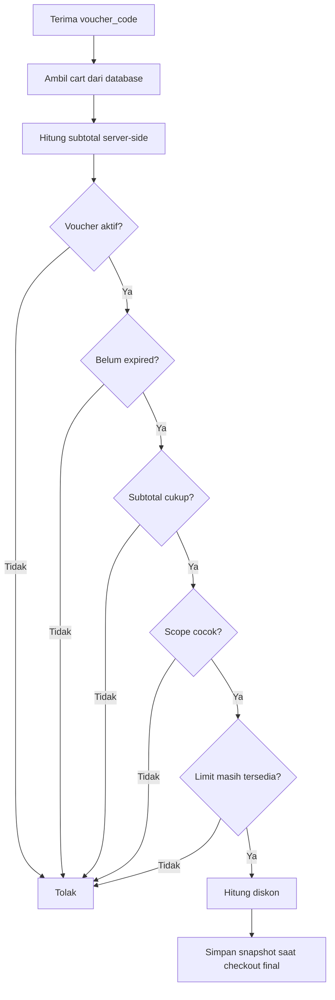
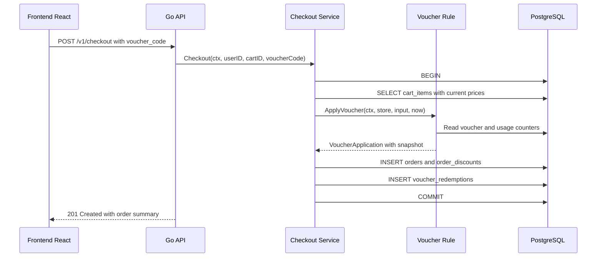

import { Section, Box, Steps, Step, Recap, CardGrid, Card, Chip, Hero, Compare, FileTree, Endpoint, Def } from "@components";

<Hero eyebrow="Roadmap 5 &middot; Online Shop Skincare Domain" title="Promosi dan Voucher<br /><em>yang Sulit Dieksploitasi</em>">
  <p>Voucher terlihat sederhana, tetapi di checkout ia menyentuh uang, stok, user limit, waktu, dan audit diskon.</p>
  <Fragment slot="meta">
    <Chip icon="code">Bahasa: <b>Go 1.26</b></Chip>
    <Chip icon="clock">~60 menit baca</Chip>
  </Fragment>
</Hero>

<Section num="01" id="intro" title="Kenapa Voucher Perlu Dirancang Serius?">

<p class="lead">Di frontend, voucher sering terasa seperti satu input kode promo. Di backend, voucher adalah aturan bisnis yang mengubah nilai transaksi.</p>

Di React atau Next.js, kita bisa menghitung preview diskon supaya UI terasa responsif. Di Laravel, kita mungkin menaruh rule di service lalu memanggilnya dari controller. Di Go, pola yang kita pakai lebih eksplisit: checkout service mengambil data cart dari server, memanggil fungsi domain `ApplyVoucher`, lalu menyimpan snapshot diskon ke order dalam transaksi database.

<Box variant="bridge" icon="🌉" label="Jembatan: dari UI discount preview ke domain rule"><p>Preview di frontend boleh membantu user, tetapi keputusan final harus selalu dari backend karena user bisa mengubah request JSON, harga, quantity, atau voucher_code.</p></Box>

Voucher yang salah desain bisa menyebabkan beberapa bug mahal: diskon dipakai setelah expired, voucher dipakai berkali-kali oleh user yang sama, diskon berlaku ke produk yang tidak termasuk promo, atau total order menjadi negatif. Modul ini memakai baseline [Go 1.26](https://go.dev/doc/go1.26) dan membuat batas domain voucher dengan jelas.

<Endpoint method="POST" path="/v1/vouchers/apply" desc="Preview voucher untuk cart aktif, tidak membuat redemption final" />
<Endpoint method="POST" path="/v1/checkout" desc="Checkout final dengan voucher_code opsional dan snapshot diskon" />

</Section>

<Section num="02" id="model-promo-voucher" title="Model Promo dan Voucher">

<p class="lead">Voucher bukan sekadar `code`, tetapi kumpulan aturan yang harus dievaluasi konsisten.</p>

Dalam proyek online shop skincare, kita pisahkan domain promosi dari checkout, tetapi checkout tetap menjadi tempat finalisasi. Promotion domain tahu aturan voucher. Checkout domain tahu cart, order, payment intent, dan snapshot.

<FileTree title="File domain promosi dan checkout" tree={`
internal/
  checkout/
    service.go            # orchestration checkout
    voucher.go            # ApplyVoucher dan rule domain
    model.go              # Order, OrderItem, DiscountSnapshot
  promotion/
    repository.go         # query voucher dan usage count
    pgx_repository.go     # implementasi PostgreSQL
  shared/
    money.go              # tipe Money berbasis int64 rupiah
db/
  migrations/
    058_create_vouchers.up.sql
`} />

<Def term="Voucher"><p>Entitas aturan diskon yang punya code, tipe diskon, minimum purchase, limit penggunaan, expiry date, scope, dan status aktif.</p></Def>

<Def term="Redemption"><p>Catatan bahwa voucher benar-benar dipakai pada order tertentu. Preview voucher bukan redemption.</p></Def>

Skema minimalnya bisa seperti ini. Kita menyimpan uang sebagai integer rupiah, bukan float, agar operasi diskon deterministik.

```sql title="db/migrations/058_create_vouchers.up.sql"
CREATE TABLE vouchers (
    id BIGSERIAL PRIMARY KEY,
    code TEXT NOT NULL UNIQUE,
    name TEXT NOT NULL,
    active BOOLEAN NOT NULL DEFAULT TRUE,
    type TEXT NOT NULL CHECK (type IN ('fixed_amount', 'percentage')),
    discount_amount BIGINT NOT NULL DEFAULT 0 CHECK (discount_amount >= 0),
    percent_bps INTEGER NOT NULL DEFAULT 0 CHECK (percent_bps BETWEEN 0 AND 10000),
    max_discount BIGINT NOT NULL DEFAULT 0 CHECK (max_discount >= 0),
    minimum_purchase BIGINT NOT NULL DEFAULT 0 CHECK (minimum_purchase >= 0),
    usage_limit INTEGER NOT NULL DEFAULT 0 CHECK (usage_limit >= 0),
    per_user_limit INTEGER NOT NULL DEFAULT 0 CHECK (per_user_limit >= 0),
    scope TEXT NOT NULL DEFAULT 'all' CHECK (scope IN ('all', 'products', 'categories')),
    starts_at TIMESTAMPTZ NOT NULL DEFAULT CURRENT_TIMESTAMP,
    expires_at TIMESTAMPTZ,
    created_at TIMESTAMPTZ NOT NULL DEFAULT CURRENT_TIMESTAMP,
    updated_at TIMESTAMPTZ NOT NULL DEFAULT CURRENT_TIMESTAMP
);

CREATE TABLE voucher_products (
    voucher_id BIGINT NOT NULL REFERENCES vouchers(id) ON DELETE CASCADE,
    product_id BIGINT NOT NULL REFERENCES products(id) ON DELETE CASCADE,
    PRIMARY KEY (voucher_id, product_id)
);

CREATE TABLE voucher_categories (
    voucher_id BIGINT NOT NULL REFERENCES vouchers(id) ON DELETE CASCADE,
    category_id BIGINT NOT NULL REFERENCES categories(id) ON DELETE CASCADE,
    PRIMARY KEY (voucher_id, category_id)
);

CREATE TABLE voucher_redemptions (
    id BIGSERIAL PRIMARY KEY,
    voucher_id BIGINT NOT NULL REFERENCES vouchers(id),
    user_id BIGINT NOT NULL REFERENCES users(id),
    order_id BIGINT NOT NULL UNIQUE REFERENCES orders(id),
    discount_amount BIGINT NOT NULL CHECK (discount_amount >= 0),
    redeemed_at TIMESTAMPTZ NOT NULL DEFAULT CURRENT_TIMESTAMP
);

CREATE INDEX idx_voucher_redemptions_voucher_user ON voucher_redemptions(voucher_id, user_id);
```

PostgreSQL punya tipe waktu [`timestamp with time zone`](https://www.postgresql.org/docs/current/datatype-datetime.html) yang cocok untuk expiry lintas zona waktu, dan default timestamp bisa memakai [`CURRENT_TIMESTAMP`](https://www.postgresql.org/docs/current/ddl-default.html) seperti di dokumentasi resmi PostgreSQL.

</Section>

<Section num="03" id="tipe-diskon" title="Tipe Diskon: Fixed Amount dan Percentage">

<p class="lead">Dua tipe diskon yang paling umum punya risiko berbeda.</p>

<Compare aLabel="JS/PHP yang sering terjadi" bLabel="Go yang kita inginkan" aTone="muted" bTone="violet">
  <Fragment slot="a"><ul><li>Diskon percentage sering dihitung dengan float, lalu hasil rounding beda antara frontend dan backend.</li><li>Fixed discount kadang membuat total negatif kalau subtotal lebih kecil dari diskon.</li></ul></Fragment>
  <Fragment slot="b"><ul><li>Nominal uang pakai `int64` rupiah, percentage pakai basis point, misalnya 1500 untuk 15 persen.</li><li>Diskon selalu dibatasi oleh subtotal yang eligible, sehingga total tidak pernah negatif.</li></ul></Fragment>
</Compare>

<CardGrid cols={2}>
  <Card><h4>Fixed amount</h4><p>Contoh: `SKIN50K` memberi potongan Rp50.000. Aman bila hasil akhirnya di-clamp ke subtotal eligible.</p></Card>
  <Card><h4>Percentage</h4><p>Contoh: `GLOW15` memberi potongan 15 persen. Simpan sebagai `percent_bps = 1500`, bukan `0.15`.</p></Card>
</CardGrid>

<Def term="basis point"><p>Satuan 1 per 10.000. Nilai 10000 berarti 100 persen, 1500 berarti 15 persen, dan 250 berarti 2,5 persen.</p></Def>

<Box variant="tip" icon="💡" label="Best practice uang"><p>Gunakan integer untuk uang, simpan rupiah terkecil yang dipakai aplikasi, lalu format ke mata uang hanya di boundary response.</p></Box>

</Section>

<Section num="04" id="aturan-validasi" title="Aturan Validasi Voucher">

<p class="lead">Validasi voucher harus berlapis, karena tiap aturan menutup jalur eksploitasi yang berbeda.</p>

<CardGrid cols={3}>
  <Card><h4>Minimum purchase</h4><p>Voucher ditolak bila subtotal server-side lebih kecil dari `minimum_purchase`.</p></Card>
  <Card><h4>Usage limit</h4><p>Voucher ditolak bila total redemption sudah mencapai limit global.</p></Card>
  <Card><h4>Per-user limit</h4><p>Voucher ditolak bila user yang sama sudah mencapai limit miliknya.</p></Card>
  <Card><h4>Expiry date</h4><p>Voucher ditolak bila waktu sekarang sudah melewati atau tepat pada `expires_at`.</p></Card>
  <Card><h4>Scope</h4><p>Voucher hanya menghitung item yang masuk product atau category target.</p></Card>
  <Card><h4>Active flag</h4><p>Voucher bisa dinonaktifkan tanpa menghapus data historis order.</p></Card>
</CardGrid>

<Box variant="warn" icon="⚠️" label="Jangan percaya subtotal dari request"><p>Subtotal harus dihitung ulang dari cart dan harga database. Client hanya boleh mengirim `voucher_code`, bukan nilai diskon final.</p></Box>



<p class="fig-cap"><b>Gambar 1.</b> Validasi voucher berjalan dari data server, bukan dari angka yang dikirim frontend.</p>

</Section>

<Section num="05" id="scope-produk-kategori" title="Scope: Specific Product dan Category">

<p class="lead">Scope membuat voucher lebih realistis, misalnya hanya untuk sunscreen atau hanya untuk brand campaign tertentu.</p>

Dalam skincare, promo sering menargetkan produk atau kategori tertentu: sunscreen SPF, toner, serum vitamin C, atau paket acne care. Karena cart bisa berisi banyak item, diskon tidak boleh dihitung dari seluruh subtotal bila voucher hanya berlaku untuk sebagian item.

<Compare aLabel="Tanpa scope" bLabel="Dengan scope" aTone="red" bTone="teal">
  <Fragment slot="a"><ul><li>`GLOW15` dipakai untuk semua item, termasuk produk yang margin-nya terlalu kecil.</li><li>Campaign marketing sulit dikontrol karena backend tidak tahu produk target.</li></ul></Fragment>
  <Fragment slot="b"><ul><li>`GLOW15` hanya menghitung eligible subtotal dari product atau category yang cocok.</li><li>Produk lain tetap masuk order, tetapi tidak ikut basis perhitungan diskon.</li></ul></Fragment>
</Compare>

Contoh cart: user membeli sunscreen Rp120.000 dan kapas wajah Rp25.000. Voucher `SUN15` scoped ke category sunscreen. Minimum purchase bisa dihitung dari subtotal cart Rp145.000, tetapi diskon percentage hanya dihitung dari Rp120.000 yang eligible. Ini keputusan bisnis yang harus ditulis eksplisit agar tim product, frontend, dan backend punya aturan yang sama.

<Box variant="note" icon="📝" label="Keputusan bisnis yang perlu ditulis"><p>Di modul ini, minimum purchase memakai subtotal cart, sedangkan nominal diskon memakai eligible subtotal. Kalau bisnis ingin minimum purchase juga scoped, ubah rule dengan sadar dan test case yang jelas.</p></Box>

</Section>

<Section num="06" id="apply-voucher" title="Apply Voucher di Checkout">

<p class="lead">Fungsi domain harus menerima data yang sudah dipercaya dari server, lalu mengembalikan hasil yang bisa disimpan sebagai snapshot.</p>

Pola Go yang kita pakai: [`context.Context`](https://pkg.go.dev/context) menjadi parameter pertama untuk membawa cancellation dan deadline antar boundary, sesuai praktik standard library Go. Fungsi mengembalikan `(*VoucherApplication, error)`, bukan melempar exception seperti `throw` di JavaScript.

```go title="internal/checkout/voucher.go"
package checkout

import (
	"context"
	"errors"
	"fmt"
	"time"
)

type Money int64

type DiscountType string

const (
	DiscountFixedAmount DiscountType = "fixed_amount"
	DiscountPercentage  DiscountType = "percentage"
)

type VoucherScope string

const (
	ScopeAll        VoucherScope = "all"
	ScopeProducts   VoucherScope = "products"
	ScopeCategories VoucherScope = "categories"
)

var (
	ErrVoucherNotFound      = errors.New("voucher not found")
	ErrVoucherInactive      = errors.New("voucher inactive")
	ErrVoucherNotStarted    = errors.New("voucher not started")
	ErrVoucherExpired       = errors.New("voucher expired")
	ErrMinimumPurchase      = errors.New("minimum purchase not reached")
	ErrVoucherScopeMismatch = errors.New("voucher scope does not match cart")
	ErrUsageLimitReached    = errors.New("voucher usage limit reached")
	ErrPerUserLimitReached  = errors.New("voucher per-user limit reached")
	ErrVoucherMisconfigured = errors.New("voucher misconfigured")
)

type VoucherStore interface {
	FindVoucherByCode(ctx context.Context, code string) (Voucher, error)
	CountVoucherUsage(ctx context.Context, voucherID int64) (int64, error)
	CountVoucherUsageByUser(ctx context.Context, voucherID int64, userID int64) (int64, error)
}

type Voucher struct {
	ID              int64
	Code            string
	Active          bool
	Type            DiscountType
	Amount          Money
	PercentBps      int64
	MaxDiscount     Money
	MinimumPurchase Money
	UsageLimit      int64
	PerUserLimit    int64
	StartsAt        time.Time
	ExpiresAt       time.Time
	Scope           VoucherScope
	ProductIDs      map[int64]struct{}
	CategoryIDs     map[int64]struct{}
}

type CheckoutItem struct {
	ProductID  int64
	CategoryID int64
	Quantity   int
	UnitPrice  Money
}

type ApplyVoucherInput struct {
	UserID int64
	Code   string
	Items  []CheckoutItem
}

type VoucherApplication struct {
	VoucherID        int64
	Code             string
	Type             DiscountType
	EligibleSubtotal Money
	DiscountAmount   Money
	Snapshot         DiscountSnapshot
}

type DiscountSnapshot struct {
	VoucherID        int64
	Code             string
	Type             DiscountType
	Scope            VoucherScope
	MinimumPurchase  Money
	EligibleSubtotal Money
	DiscountAmount   Money
	AppliedAt        time.Time
}

func ApplyVoucher(ctx context.Context, store VoucherStore, input ApplyVoucherInput, now time.Time) (*VoucherApplication, error) {
	if input.UserID <= 0 {
		return nil, fmt.Errorf("apply voucher: user is required")
	}
	if len(input.Items) == 0 {
		return nil, fmt.Errorf("apply voucher: cart is empty")
	}

	voucher, err := store.FindVoucherByCode(ctx, input.Code)
	if err != nil {
		if errors.Is(err, ErrVoucherNotFound) {
			return nil, ErrVoucherNotFound
		}
		return nil, fmt.Errorf("find voucher by code: %w", err)
	}

	if !voucher.Active {
		return nil, ErrVoucherInactive
	}
	if !voucher.StartsAt.IsZero() && now.Before(voucher.StartsAt) {
		return nil, ErrVoucherNotStarted
	}
	if !voucher.ExpiresAt.IsZero() && !now.Before(voucher.ExpiresAt) {
		return nil, ErrVoucherExpired
	}

	subtotal := calculateSubtotal(input.Items)
	if subtotal < voucher.MinimumPurchase {
		return nil, ErrMinimumPurchase
	}

	eligibleSubtotal := calculateEligibleSubtotal(voucher, input.Items)
	if eligibleSubtotal <= 0 {
		return nil, ErrVoucherScopeMismatch
	}

	used, err := store.CountVoucherUsage(ctx, voucher.ID)
	if err != nil {
		return nil, fmt.Errorf("count voucher usage: %w", err)
	}
	if voucher.UsageLimit > 0 && used >= voucher.UsageLimit {
		return nil, ErrUsageLimitReached
	}

	usedByUser, err := store.CountVoucherUsageByUser(ctx, voucher.ID, input.UserID)
	if err != nil {
		return nil, fmt.Errorf("count voucher usage by user: %w", err)
	}
	if voucher.PerUserLimit > 0 && usedByUser >= voucher.PerUserLimit {
		return nil, ErrPerUserLimitReached
	}

	discountAmount, err := calculateDiscount(voucher, eligibleSubtotal)
	if err != nil {
		return nil, err
	}

	return &VoucherApplication{
		VoucherID:        voucher.ID,
		Code:             voucher.Code,
		Type:             voucher.Type,
		EligibleSubtotal: eligibleSubtotal,
		DiscountAmount:   discountAmount,
		Snapshot: DiscountSnapshot{
			VoucherID:        voucher.ID,
			Code:             voucher.Code,
			Type:             voucher.Type,
			Scope:            voucher.Scope,
			MinimumPurchase:  voucher.MinimumPurchase,
			EligibleSubtotal: eligibleSubtotal,
			DiscountAmount:   discountAmount,
			AppliedAt:        now,
		},
	}, nil
}

func calculateSubtotal(items []CheckoutItem) Money {
	var subtotal Money
	for _, item := range items {
		subtotal += item.UnitPrice * Money(item.Quantity)
	}
	return subtotal
}

func calculateEligibleSubtotal(voucher Voucher, items []CheckoutItem) Money {
	var subtotal Money
	for _, item := range items {
		if !itemEligible(voucher, item) {
			continue
		}
		subtotal += item.UnitPrice * Money(item.Quantity)
	}
	return subtotal
}

func itemEligible(voucher Voucher, item CheckoutItem) bool {
	switch voucher.Scope {
	case ScopeAll:
		return true
	case ScopeProducts:
		_, ok := voucher.ProductIDs[item.ProductID]
		return ok
	case ScopeCategories:
		_, ok := voucher.CategoryIDs[item.CategoryID]
		return ok
	default:
		return false
	}
}

func calculateDiscount(voucher Voucher, eligibleSubtotal Money) (Money, error) {
	switch voucher.Type {
	case DiscountFixedAmount:
		if voucher.Amount <= 0 {
			return 0, ErrVoucherMisconfigured
		}
		return minMoney(voucher.Amount, eligibleSubtotal), nil
	case DiscountPercentage:
		if voucher.PercentBps <= 0 || voucher.PercentBps > 10000 {
			return 0, ErrVoucherMisconfigured
		}
		discount := Money(int64(eligibleSubtotal) * voucher.PercentBps / 10000)
		if voucher.MaxDiscount > 0 {
			discount = minMoney(discount, voucher.MaxDiscount)
		}
		return minMoney(discount, eligibleSubtotal), nil
	default:
		return 0, ErrVoucherMisconfigured
	}
}

func minMoney(a Money, b Money) Money {
	if a < b {
		return a
	}
	return b
}
```

<Box variant="tip" icon="💡" label="Idiom Go"><p>`ApplyVoucher` tidak menerima subtotal dari request. Ia menerima item yang sudah diambil dari database, lalu menghitung subtotal sendiri.</p></Box>

</Section>

<Section num="07" id="snapshot-diskon" title="Snapshot Diskon di Order">

<p class="lead">Order harus menyimpan diskon yang terjadi saat checkout, bukan membaca ulang voucher saat invoice dibuka.</p>

Tanpa snapshot, invoice lama bisa berubah ketika admin mengedit voucher. Misalnya voucher `GLOW15` hari ini maksimal Rp30.000, lalu minggu depan diubah menjadi maksimal Rp20.000. Order lama tetap harus menampilkan diskon yang benar pada saat checkout.

```sql title="db/migrations/059_create_order_discounts.up.sql"
CREATE TABLE order_discounts (
    id BIGSERIAL PRIMARY KEY,
    order_id BIGINT NOT NULL REFERENCES orders(id) ON DELETE CASCADE,
    voucher_id BIGINT REFERENCES vouchers(id),
    voucher_code TEXT NOT NULL,
    discount_type TEXT NOT NULL,
    scope TEXT NOT NULL,
    minimum_purchase BIGINT NOT NULL,
    eligible_subtotal BIGINT NOT NULL,
    discount_amount BIGINT NOT NULL CHECK (discount_amount >= 0),
    applied_at TIMESTAMPTZ NOT NULL,
    created_at TIMESTAMPTZ NOT NULL DEFAULT CURRENT_TIMESTAMP
);
```

Snapshot minimal yang disimpan: `voucher_code`, `discount_type`, `scope`, `minimum_purchase`, `eligible_subtotal`, `discount_amount`, dan `applied_at`. `voucher_id` boleh nullable untuk menjaga invoice tetap valid jika voucher historis kelak dihapus secara soft delete.



<p class="fig-cap"><b>Gambar 2.</b> Snapshot diskon dibuat di transaksi checkout final, bukan saat preview voucher.</p>

</Section>

<Section num="08" id="anti-eksploitasi" title="Race Condition dan Anti Eksploitasi">

<p class="lead">Validasi yang benar masih bisa bocor bila dua request checkout berjalan bersamaan.</p>

Kasus klasik: voucher punya `usage_limit = 100`, saat ini sudah dipakai 99 kali, lalu dua user checkout bersamaan. Kalau backend hanya melakukan `COUNT(*)` tanpa kontrol concurrency, dua request bisa sama-sama melihat angka 99 dan dua-duanya lolos.

<Box variant="warn" icon="⚠️" label="Limit harus aman secara transaksi"><p>Untuk checkout final, baca row voucher dengan lock, hitung penggunaan, insert redemption, dan commit dalam transaksi yang sama.</p></Box>

```sql title="internal/promotion/query.sql"
SELECT id, code, usage_limit, per_user_limit
FROM vouchers
WHERE code = $1
FOR UPDATE;

SELECT COUNT(*)
FROM voucher_redemptions
WHERE voucher_id = $1;

SELECT COUNT(*)
FROM voucher_redemptions
WHERE voucher_id = $1 AND user_id = $2;
```

PostgreSQL `FOR UPDATE` membuat request checkout lain menunggu lock pada row voucher yang sama. Ini bukan pengganti unique constraint, melainkan pasangan yang saling melengkapi. Tetap gunakan constraint seperti `order_id UNIQUE` di `voucher_redemptions` untuk mencegah redemption ganda pada order yang sama.

<CardGrid cols={2}>
  <Card><h4>Preview voucher</h4><p>Boleh tanpa lock berat karena tidak mengurangi quota. Hasil preview hanya informasi sementara.</p></Card>
  <Card><h4>Checkout final</h4><p>Wajib dalam transaksi, memakai lock, dan menyimpan redemption setelah order dibuat.</p></Card>
</CardGrid>

<Box variant="note" icon="📝" label="Waktu dan zona"><p>Simpan `starts_at`, `expires_at`, dan `redeemed_at` sebagai `TIMESTAMPTZ`. Di Go, bandingkan dengan `time.Time` dari server, bukan dari client.</p></Box>

</Section>

<Section num="09" id="hands-on" title="Hands-on Ringan">

<p class="lead">Latihan ini menutup celah yang biasanya tidak terlihat dari happy path checkout.</p>

<Steps>
  <Step><b>Buat tabel voucher</b><p>Tambahkan migration `vouchers`, join table scope, dan `voucher_redemptions` seperti contoh skema.</p></Step>
  <Step><b>Implementasikan repository</b><p>Buat `FindVoucherByCode`, `CountVoucherUsage`, dan `CountVoucherUsageByUser` dengan pgx.</p></Step>
  <Step><b>Pasang di checkout</b><p>Panggil `ApplyVoucher` setelah cart item diambil dari database dan sebelum order total dihitung.</p></Step>
  <Step><b>Tambah unit test</b><p>Uji fixed amount, percentage, minimum purchase, expiry, per-user limit, dan scope mismatch.</p></Step>
</Steps>

Contoh unit test kecil berikut menunjukkan nilai bisnis yang ingin kita kunci. Test ini tidak butuh database karena `VoucherStore` bisa dipalsukan.

```go title="internal/checkout/voucher_test.go"
package checkout

import (
	"context"
	"testing"
	"time"
)

type fakeVoucherStore struct {
	voucher    Voucher
	used       int64
	usedByUser int64
}

func (f fakeVoucherStore) FindVoucherByCode(ctx context.Context, code string) (Voucher, error) {
	if f.voucher.Code != code {
		return Voucher{}, ErrVoucherNotFound
	}
	return f.voucher, nil
}

func (f fakeVoucherStore) CountVoucherUsage(ctx context.Context, voucherID int64) (int64, error) {
	return f.used, nil
}

func (f fakeVoucherStore) CountVoucherUsageByUser(ctx context.Context, voucherID int64, userID int64) (int64, error) {
	return f.usedByUser, nil
}

func TestApplyVoucherPercentageScopedToCategory(t *testing.T) {
	now := time.Date(2026, 6, 6, 10, 0, 0, 0, time.UTC)
	store := fakeVoucherStore{
		voucher: Voucher{
			ID:              1,
			Code:            "SUN15",
			Active:          true,
			Type:            DiscountPercentage,
			PercentBps:      1500,
			MinimumPurchase: 100_000,
			UsageLimit:      100,
			PerUserLimit:    1,
			StartsAt:        now.Add(-24 * time.Hour),
			ExpiresAt:       now.Add(24 * time.Hour),
			Scope:           ScopeCategories,
			CategoryIDs:     map[int64]struct{}{7: {}},
		},
	}
	input := ApplyVoucherInput{
		UserID: 99,
		Code:   "SUN15",
		Items: []CheckoutItem{
			{ProductID: 10, CategoryID: 7, Quantity: 1, UnitPrice: 120_000},
			{ProductID: 11, CategoryID: 8, Quantity: 1, UnitPrice: 25_000},
		},
	}

	got, err := ApplyVoucher(context.Background(), store, input, now)
	if err != nil {
		t.Fatalf("ApplyVoucher returned error: %v", err)
	}
	if got.EligibleSubtotal != 120_000 {
		t.Fatalf("eligible subtotal = %d, want 120000", got.EligibleSubtotal)
	}
	if got.DiscountAmount != 18_000 {
		t.Fatalf("discount amount = %d, want 18000", got.DiscountAmount)
	}
}
```

</Section>

<Section num="10" id="jebakan-umum" title="Jebakan Umum dari JS/PHP">

<p class="lead">Pendatang dari JavaScript atau PHP biasanya bukan salah konsep, tetapi terbiasa menaruh rule di tempat yang terlalu dekat dengan UI atau controller.</p>

<CardGrid cols={2}>
  <Card><h4>Diskon dihitung di frontend</h4><p>Frontend boleh preview, tetapi backend harus hitung ulang semua angka dari database.</p></Card>
  <Card><h4>Float untuk uang</h4><p>`float64` bisa menimbulkan hasil pecahan yang tidak diinginkan. Pakai integer rupiah.</p></Card>
  <Card><h4>Limit dicek di luar transaksi</h4><p>Dua request bersamaan bisa meloloskan limit yang sama. Gunakan lock saat checkout final.</p></Card>
  <Card><h4>Snapshot tidak disimpan</h4><p>Invoice lama bisa berubah ketika aturan voucher diedit. Simpan snapshot ke `order_discounts`.</p></Card>
  <Card><h4>Per-user limit lupa dihitung</h4><p>Global limit saja tidak cukup. User yang sama bisa menyedot semua quota.</p></Card>
  <Card><h4>Scope berlaku ke semua item</h4><p>Voucher category tertentu harus menghitung eligible subtotal, bukan subtotal cart penuh.</p></Card>
</CardGrid>

<Box variant="bridge" icon="🌉" label="Jembatan: Laravel validation vs domain rule"><p>Laravel request validation cocok untuk format, misalnya `voucher_code` wajib string. Rule seperti expired, scope, usage limit, dan snapshot adalah business rule di service domain.</p></Box>

</Section>

<Section num="11" id="ringkasan" title="Ringkasan & Poin Penting">

<p class="lead">Voucher yang aman bukan tentang kode promo yang terlihat cantik, tetapi tentang aturan diskon yang konsisten, transactional, dan tercatat.</p>

<Recap title="Yang Wajib Menempel">
  <ul>
    <li>Voucher punya tipe `fixed_amount` dan `percentage`, dengan uang disimpan sebagai integer rupiah.</li>
    <li>Minimum purchase, usage limit, per-user limit, expiry date, active flag, dan scope harus divalidasi server-side.</li>
    <li>Scope product atau category menentukan eligible subtotal, sehingga diskon tidak bocor ke item yang tidak ikut campaign.</li>
    <li>`ApplyVoucher` sebaiknya murni rule domain, menerima item dari database, menghitung diskon, lalu mengembalikan snapshot.</li>
    <li>Checkout final harus menyimpan `order_discounts` dan `voucher_redemptions` dalam transaksi yang sama.</li>
    <li>Preview voucher tidak mengurangi quota. Quota baru terpakai saat order final berhasil dibuat.</li>
  </ul>
</Recap>

Di proyek online shop skincare, modul ini melengkapi checkout, inventory, payment, dan order lifecycle. Setelah ini, kita bisa masuk ke Roadmap 5 berikutnya dengan fondasi domain yang lebih lengkap: katalog menentukan item, cart menyimpan niat beli, checkout membuat order, inventory menjaga stok, payment mengonfirmasi pembayaran, order lifecycle menjaga status, dan voucher mengatur diskon secara aman.

</Section>
