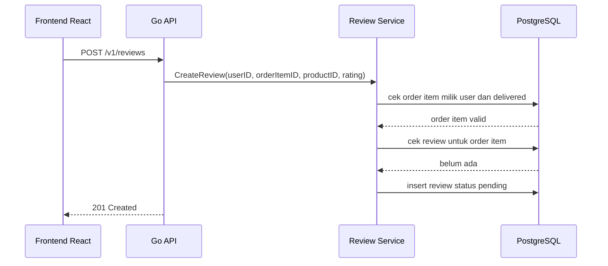
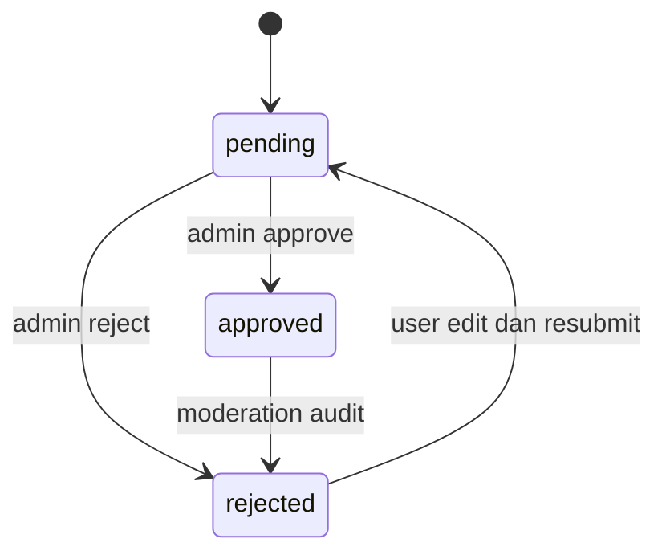

import { Section, Box, Steps, Step, Recap, CardGrid, Card, Chip, Hero, Compare, FileTree, Endpoint, Def } from "@components";

<Hero eyebrow="Roadmap 5 &middot; Domain Online Shop" title="Review dan Rating Produk<br /><em>yang Terpercaya</em>">
  <p>Review bukan sekadar komentar, tetapi sinyal trust yang memengaruhi keputusan beli di online shop skincare.</p>
  <Fragment slot="meta">
    <Chip icon="code">Bahasa: <b>Go 1.26</b></Chip>
    <Chip icon="clock">~60 menit baca</Chip>
  </Fragment>
</Hero>

<Section num="01" id="intro" title="Review adalah Trust Layer">

<p class="lead">Di toko skincare, review membantu pembeli menilai cocok atau tidaknya produk sebelum mencoba langsung.</p>

Di React atau Laravel, review sering terlihat seperti fitur CRUD biasa: user mengirim rating, komentar, lalu data tampil di halaman produk. Dalam domain e-commerce nyata, review adalah **trust layer**. Kalau siapa pun bisa memberi rating tanpa membeli, rata-rata rating mudah dimanipulasi.

<Box variant="bridge" icon="🌉" label="Jembatan: mirip review di Tokopedia/Shopee"><p>Seperti marketplace besar, review yang bernilai adalah review dari pembeli valid. Backend perlu membuktikan user pernah membeli item tersebut, bukan hanya percaya pada tombol frontend.</p></Box>

Di Go, kita akan menaruh aturan ini di **service layer**. Handler hanya membaca JSON dan menulis response. Repository hanya menjalankan query. Service memutuskan apakah review boleh dibuat, apakah rating valid, apakah order item benar milik user, dan apakah review sudah pernah dibuat.

<Def term="verified purchase review"><p>Review yang hanya boleh dibuat jika user memiliki order item untuk produk tersebut, biasanya setelah order delivered atau selesai.</p></Def>

<Def term="aggregate rating"><p>Nilai ringkasan seperti rata-rata rating dan jumlah review, dihitung dari review approved saja agar review pending atau rejected tidak memengaruhi halaman produk.</p></Def>

</Section>

<Section num="02" id="aturan-domain" title="Aturan Domain Review">

<p class="lead">Domain review harus ketat karena output-nya dipakai pembeli lain untuk mengambil keputusan.</p>

Aturan utamanya sederhana, tetapi harus dijaga di backend. Frontend boleh menyembunyikan tombol review, namun backend tetap menjadi sumber kebenaran.

<CardGrid cols={3}>
  <Card><h4>Verified purchase</h4><p>User hanya bisa review jika punya order item untuk produk itu.</p></Card>
  <Card><h4>Rating 1-5</h4><p>Rating di luar rentang ini ditolak sebelum masuk database.</p></Card>
  <Card><h4>One review per order item</h4><p>Satu order item hanya boleh menghasilkan satu review agar spam terkontrol.</p></Card>
  <Card><h4>Moderasi</h4><p>Review baru masuk status pending, lalu admin approve atau reject.</p></Card>
  <Card><h4>Images sebagai URL</h4><p>Review menyimpan array URL gambar, bukan binary file.</p></Card>
  <Card><h4>Aggregate approved</h4><p>Rata-rata rating hanya dihitung dari review approved.</p></Card>
</CardGrid>

<Box variant="warn" icon="⚠️" label="Jangan percaya product_id dari frontend saja"><p>User bisa mengirim `product_id` apa pun. Backend harus mengecek relasi `order_items`, `orders`, dan `users` di database.</p></Box>

Dalam proyek skincare, review bisa memuat pengalaman seperti tekstur, efek di kulit berminyak, apakah cocok untuk kulit sensitif, dan foto hasil pemakaian. Namun aturan trust tetap sama: pembeli valid lebih penting daripada komentar panjang.

</Section>

<Section num="03" id="model-data" title="Model Data dan Constraint">

<p class="lead">Database harus ikut menjaga aturan domain, bukan hanya mengandalkan kode Go.</p>

Struktur minimal domain review berada di modul `internal/review/`. Kita juga menambahkan tabel `reviews` yang menghubungkan user, produk, dan order item.

<FileTree title="Struktur modul review" tree={`
internal/
  review/
    model.go          # tipe domain review dan status
    service.go        # business rules verified purchase dan anti spam
    repository.go     # interface repository
    postgres.go       # implementasi pgx
    handler.go        # endpoint HTTP review
`} />

Skema SQL berikut fokus pada constraint penting: rating wajib 1 sampai 5, status terbatas, dan satu `order_item_id` hanya boleh punya satu review.

```sql title="db/migrations/059_create_reviews.up.sql"
CREATE TABLE reviews (
    id BIGSERIAL PRIMARY KEY,
    user_id BIGINT NOT NULL REFERENCES users(id),
    product_id BIGINT NOT NULL REFERENCES products(id),
    order_item_id BIGINT NOT NULL REFERENCES order_items(id),
    rating SMALLINT NOT NULL CHECK (rating BETWEEN 1 AND 5),
    body TEXT NOT NULL DEFAULT '',
    image_urls TEXT[] NOT NULL DEFAULT '{}',
    status TEXT NOT NULL DEFAULT 'pending' CHECK (status IN ('pending', 'approved', 'rejected')),
    rejection_reason TEXT NOT NULL DEFAULT '',
    created_at TIMESTAMPTZ NOT NULL DEFAULT NOW(),
    updated_at TIMESTAMPTZ NOT NULL DEFAULT NOW(),
    moderated_at TIMESTAMPTZ,
    moderated_by BIGINT REFERENCES users(id)
);

CREATE UNIQUE INDEX uniq_reviews_order_item_id ON reviews(order_item_id);
CREATE INDEX idx_reviews_product_status_created ON reviews(product_id, status, created_at DESC);
CREATE INDEX idx_reviews_product_status_rating ON reviews(product_id, status, rating);
```

<Box variant="tip" icon="💡" label="Kenapa `order_item_id` unik"><p>Jika user membeli produk yang sama pada dua order berbeda, ia boleh punya dua review karena pengalaman belinya berbeda. Namun satu baris order item tetap hanya boleh menghasilkan satu review.</p></Box>

Review images disimpan sebagai `TEXT[]` karena file gambar idealnya di-upload ke object storage seperti S3, lalu review hanya menyimpan URL final. Validasi jumlah gambar, format URL, dan ukuran file tetap dilakukan di service upload atau media module.

```go title="internal/review/model.go"
package review

import "time"

type ReviewStatus string

const (
	ReviewStatusPending  ReviewStatus = "pending"
	ReviewStatusApproved ReviewStatus = "approved"
	ReviewStatusRejected ReviewStatus = "rejected"
)

type Review struct {
	ID              int64
	UserID          int64
	ProductID       int64
	OrderItemID     int64
	Rating          int
	Body            string
	ImageURLs       []string
	Status          ReviewStatus
	RejectionReason string
	CreatedAt       time.Time
	UpdatedAt       time.Time
	ModeratedAt     *time.Time
	ModeratedBy     *int64
}

type RatingSummary struct {
	AverageRating float64
	ReviewCount   int64
}
```

</Section>

<Section num="04" id="verified-purchase" title="Verified Purchase Review">

<p class="lead">Verified purchase adalah pagar utama agar review tidak mudah dimanipulasi.</p>

Aturan yang kita pakai: user boleh membuat review jika ada `order_items.id` yang sesuai, order milik user tersebut, item mengarah ke produk yang direview, dan order sudah `delivered`. Status `paid` atau `shipped` belum cukup karena produk belum diterima.



<p class="fig-cap"><b>Gambar 1.</b> Review hanya dibuat setelah service membuktikan pembelian valid dan belum pernah direview.</p>

<Box variant="bridge" icon="🌉" label="Jembatan: Laravel policy vs service rule Go"><p>Di Laravel, kamu mungkin menaruh ini di Policy atau Form Request plus service. Di Go, aturan ini lebih eksplisit di service method agar handler, repository, dan test tetap bersih.</p></Box>

Query validasi verified purchase harus memakai `order_item_id`, bukan hanya `product_id`. Jika user pernah membeli produk yang sama beberapa kali, `order_item_id` memberi identitas pengalaman beli yang spesifik.

```sql title="queries/reviewable_order_item.sql"
SELECT oi.id, oi.product_id
FROM order_items oi
JOIN orders o ON o.id = oi.order_id
WHERE oi.id = $1
  AND oi.product_id = $2
  AND o.user_id = $3
  AND o.status = 'delivered';
```

</Section>

<Section num="05" id="moderasi" title="Moderasi Pending, Approved, Rejected">

<p class="lead">Moderasi memisahkan input user dari data yang dipercaya publik.</p>

Review baru tidak langsung tampil di halaman produk. Status awalnya `pending`. Admin atau sistem moderasi mengubahnya menjadi `approved` jika layak tampil, atau `rejected` jika mengandung spam, data sensitif, klaim medis berlebihan, ujaran kebencian, atau gambar tidak relevan.



<p class="fig-cap"><b>Gambar 2.</b> Moderasi review menjaga halaman produk tetap bersih dan rating tetap kredibel.</p>

<Compare aLabel="Frontend mindset" bLabel="Backend domain mindset" aTone="muted" bTone="violet">
  <Fragment slot="a"><ul><li>Tombol review muncul jika order selesai.</li><li>Review baru langsung terasa seperti data final di UI.</li></ul></Fragment>
  <Fragment slot="b"><ul><li>Hak review tetap dicek ulang di service.</li><li>Review pending belum masuk listing publik dan aggregate rating.</li></ul></Fragment>
</Compare>

Moderasi juga membuat audit lebih mudah. Saat status berubah, simpan `moderated_by`, `moderated_at`, dan `rejection_reason` agar tim support bisa menjawab pertanyaan user dengan jelas.

</Section>

<Section num="06" id="rating-average" title="Rata-rata Rating yang Akurat">

<p class="lead">Rata-rata rating harus dihitung dari data yang layak tampil, bukan semua review mentah.</p>

Rumus dasar rating produk adalah `AVG(rating)` dan `COUNT(*)` dari review `approved`. Review `pending` belum diverifikasi, sedangkan `rejected` tidak boleh memengaruhi keputusan pembeli.

```sql title="queries/product_rating_summary.sql"
SELECT
    COALESCE(ROUND(AVG(rating)::numeric, 1), 0) AS average_rating,
    COUNT(*) AS review_count
FROM reviews
WHERE product_id = $1
  AND status = 'approved';
```

<Box variant="note" icon="📝" label="Kenapa rounding di query"><p>Untuk halaman produk, rating seperti `4.6` lebih stabil daripada mengirim banyak digit desimal. Untuk analitik internal, simpan atau hitung versi presisi lebih tinggi.</p></Box>

Ada dua strategi umum. Pertama, hitung langsung dengan aggregate query setiap kali halaman produk dibuka. Ini sederhana dan cukup untuk awal. Kedua, simpan denormalized summary di tabel `product_rating_summaries` lalu update saat review approved atau rejected. Strategi kedua lebih cepat untuk traffic besar, tetapi butuh konsistensi tambahan.

```sql title="queries/list_product_reviews.sql"
SELECT id, user_id, product_id, order_item_id, rating, body, image_urls, status, created_at
FROM reviews
WHERE product_id = $1
  AND status = 'approved'
  AND ($2::int IS NULL OR rating = $2)
ORDER BY created_at DESC
LIMIT $3 OFFSET $4;
```

Filter by rating berguna untuk UX seperti “lihat semua review bintang 5” atau “lihat review bintang 1”. Pagination wajib karena review bisa tumbuh jauh lebih cepat daripada katalog produk.

</Section>

<Section num="07" id="endpoint" title="Endpoint Review dan Rating">

<p class="lead">Endpoint review dipisahkan antara listing publik dan aksi user yang butuh autentikasi.</p>

<Endpoint method="GET" path="/v1/products/{id}/reviews" desc="Menampilkan review approved untuk produk, paginated, opsional filter by rating" />
<Endpoint method="POST" path="/v1/reviews" desc="Membuat review dari order item yang sudah delivered dan belum pernah direview" />

Request listing review memakai query param standar. `rating` opsional, `page` dan `per_page` untuk pagination.

```text title="HTTP"
GET /v1/products/120/reviews?rating=5&page=1&per_page=20
```

Request membuat review sebaiknya membawa `order_item_id` agar backend bisa membuktikan review berasal dari pembelian spesifik.

```json title="POST /v1/reviews"
{
  "product_id": 120,
  "order_item_id": 9912,
  "rating": 5,
  "body": "Teksturnya ringan dan cocok untuk kulit berminyak saya.",
  "image_urls": [
    "https://cdn.example.com/reviews/9912-before.jpg",
    "https://cdn.example.com/reviews/9912-after.jpg"
  ]
}
```

Response berhasil tidak perlu langsung tampil publik karena status masih `pending`.

```json title="201 Created"
{
  "data": {
    "id": 7001,
    "product_id": 120,
    "order_item_id": 9912,
    "rating": 5,
    "status": "pending",
    "message": "Review kamu sedang menunggu moderasi."
  }
}
```

<Box variant="warn" icon="⚠️" label="Jangan expose review pending di endpoint publik"><p>Endpoint `/v1/products/&#123;id&#125;/reviews` hanya untuk review approved. Review pending bisa ditampilkan di halaman akun user, bukan halaman produk publik.</p></Box>

</Section>

<Section num="08" id="service-go" title="Implementasi Service di Go">

<p class="lead">Service adalah tempat aturan verified purchase, rating, image URL, dan anti spam bertemu.</p>

Kode berikut menunjukkan pola service yang menerima interface repository. Ini membuat aturan domain mudah dites tanpa database asli.

```go title="internal/review/service.go"
package review

import (
	"context"
	"errors"
	"net/url"
	"strings"
)

var (
	ErrInvalidRating       = errors.New("rating must be between 1 and 5")
	ErrInvalidImageURL     = errors.New("review image URL is invalid")
	ErrTooManyImages       = errors.New("review images exceed limit")
	ErrNotVerifiedPurchase = errors.New("review requires verified purchase")
	ErrReviewAlreadyExists = errors.New("review for order item already exists")
)

type Repository interface {
	FindReviewableOrderItem(ctx context.Context, userID int64, productID int64, orderItemID int64) (OrderItemRef, error)
	HasReviewForOrderItem(ctx context.Context, orderItemID int64) (bool, error)
	CreateReview(ctx context.Context, input CreateReviewInput) (Review, error)
}

type Service struct {
	repo Repository
}

func NewService(repo Repository) *Service {
	return &Service{repo: repo}
}

type OrderItemRef struct {
	ID        int64
	ProductID int64
}

type CreateReviewInput struct {
	UserID      int64
	ProductID   int64
	OrderItemID int64
	Rating      int
	Body        string
	ImageURLs   []string
	Status      ReviewStatus
}

func (s *Service) CreateReview(ctx context.Context, input CreateReviewInput) (Review, error) {
	if input.Rating < 1 || input.Rating > 5 {
		return Review{}, ErrInvalidRating
	}

	if len(input.ImageURLs) > 5 {
		return Review{}, ErrTooManyImages
	}

	for _, rawURL := range input.ImageURLs {
		if !isValidHTTPURL(rawURL) {
			return Review{}, ErrInvalidImageURL
		}
	}

	_, err := s.repo.FindReviewableOrderItem(ctx, input.UserID, input.ProductID, input.OrderItemID)
	if err != nil {
		return Review{}, ErrNotVerifiedPurchase
	}

	exists, err := s.repo.HasReviewForOrderItem(ctx, input.OrderItemID)
	if err != nil {
		return Review{}, err
	}
	if exists {
		return Review{}, ErrReviewAlreadyExists
	}

	input.Body = strings.TrimSpace(input.Body)
	input.Status = ReviewStatusPending

	return s.repo.CreateReview(ctx, input)
}

func isValidHTTPURL(rawURL string) bool {
	parsed, err := url.ParseRequestURI(rawURL)
	if err != nil {
		return false
	}
	return parsed.Scheme == "http" || parsed.Scheme == "https"
}
```

<Box variant="tip" icon="💡" label="Context sebagai parameter pertama"><p>Semua operasi yang bisa menyentuh I/O menerima `context.Context` sebagai parameter pertama agar request cancellation dan timeout bisa diteruskan sampai query database.</p></Box>

Handler tetap tipis. Ia membaca `product_id`, `order_item_id`, `rating`, `body`, dan `image_urls`, lalu memanggil service. Detail autentikasi diasumsikan sudah memberi `userID` dari middleware auth di roadmap security.

```go title="internal/review/handler.go"
package review

import (
	"encoding/json"
	"net/http"
	"strconv"

	"github.com/go-chi/chi/v5"
)

type Handler struct {
	service *Service
}

func NewHandler(service *Service) *Handler {
	return &Handler{service: service}
}

func (h *Handler) RegisterRoutes(r chi.Router) {
	r.Get("/v1/products/{id}/reviews", h.ListProductReviews)
	r.Post("/v1/reviews", h.CreateReview)
}

type createReviewRequest struct {
	ProductID   int64    `json:"product_id"`
	OrderItemID int64    `json:"order_item_id"`
	Rating      int      `json:"rating"`
	Body        string   `json:"body"`
	ImageURLs   []string `json:"image_urls"`
}

func (h *Handler) CreateReview(w http.ResponseWriter, r *http.Request) {
	var req createReviewRequest
	if err := json.NewDecoder(r.Body).Decode(&req); err != nil {
		http.Error(w, "invalid JSON body", http.StatusBadRequest)
		return
	}

	userID := mustUserIDFromContext(r)
	review, err := h.service.CreateReview(r.Context(), CreateReviewInput{
		UserID:      userID,
		ProductID:   req.ProductID,
		OrderItemID: req.OrderItemID,
		Rating:      req.Rating,
		Body:        req.Body,
		ImageURLs:   req.ImageURLs,
	})
	if err != nil {
		writeReviewError(w, err)
		return
	}

	w.Header().Set("Content-Type", "application/json")
	w.WriteHeader(http.StatusCreated)
	_ = json.NewEncoder(w).Encode(map[string]any{
		"data": map[string]any{
			"id":            review.ID,
			"product_id":    review.ProductID,
			"order_item_id": review.OrderItemID,
			"rating":        review.Rating,
			"status":        review.Status,
			"message":       "Review kamu sedang menunggu moderasi.",
		},
	})
}

func (h *Handler) ListProductReviews(w http.ResponseWriter, r *http.Request) {
	productID, err := strconv.ParseInt(chi.URLParam(r, "id"), 10, 64)
	if err != nil || productID <= 0 {
		http.Error(w, "invalid product id", http.StatusBadRequest)
		return
	}

	_ = productID
	w.WriteHeader(http.StatusNotImplemented)
}
```

</Section>

<Section num="09" id="repository-pgx" title="Query Repository dengan pgx">

<p class="lead">Repository mengubah aturan service menjadi query PostgreSQL yang aman dan parameterized.</p>

Implementasi berikut menggunakan `pgxpool.Pool`, query parameter `$1`, `$2`, `$3`, dan scanning `TEXT[]` ke `[]string`. Error mapping seperti `pgx.ErrNoRows` bisa diterjemahkan ke error domain bersama dari `internal/shared` pada modul arsitektur sebelumnya.

```go title="internal/review/postgres.go"
package review

import (
	"context"
	"errors"

	"github.com/jackc/pgx/v5"
	"github.com/jackc/pgx/v5/pgxpool"
)

type PostgresRepository struct {
	pool *pgxpool.Pool
}

func NewPostgresRepository(pool *pgxpool.Pool) *PostgresRepository {
	return &PostgresRepository{pool: pool}
}

func (r *PostgresRepository) FindReviewableOrderItem(ctx context.Context, userID int64, productID int64, orderItemID int64) (OrderItemRef, error) {
	const query = `
SELECT oi.id, oi.product_id
FROM order_items oi
JOIN orders o ON o.id = oi.order_id
WHERE oi.id = $1
  AND oi.product_id = $2
  AND o.user_id = $3
  AND o.status = 'delivered'
`

	var ref OrderItemRef
	err := r.pool.QueryRow(ctx, query, orderItemID, productID, userID).Scan(&ref.ID, &ref.ProductID)
	if errors.Is(err, pgx.ErrNoRows) {
		return OrderItemRef{}, ErrNotVerifiedPurchase
	}
	if err != nil {
		return OrderItemRef{}, err
	}
	return ref, nil
}

func (r *PostgresRepository) HasReviewForOrderItem(ctx context.Context, orderItemID int64) (bool, error) {
	const query = `SELECT EXISTS (SELECT 1 FROM reviews WHERE order_item_id = $1)`

	var exists bool
	if err := r.pool.QueryRow(ctx, query, orderItemID).Scan(&exists); err != nil {
		return false, err
	}
	return exists, nil
}

func (r *PostgresRepository) CreateReview(ctx context.Context, input CreateReviewInput) (Review, error) {
	const query = `
INSERT INTO reviews (user_id, product_id, order_item_id, rating, body, image_urls, status)
VALUES ($1, $2, $3, $4, $5, $6, $7)
RETURNING id, user_id, product_id, order_item_id, rating, body, image_urls, status, created_at, updated_at
`

	var review Review
	err := r.pool.QueryRow(
		ctx,
		query,
		input.UserID,
		input.ProductID,
		input.OrderItemID,
		input.Rating,
		input.Body,
		input.ImageURLs,
		input.Status,
	).Scan(
		&review.ID,
		&review.UserID,
		&review.ProductID,
		&review.OrderItemID,
		&review.Rating,
		&review.Body,
		&review.ImageURLs,
		&review.Status,
		&review.CreatedAt,
		&review.UpdatedAt,
	)
	if err != nil {
		return Review{}, err
	}
	return review, nil
}

func (r *PostgresRepository) GetRatingSummary(ctx context.Context, productID int64) (RatingSummary, error) {
	const query = `
SELECT
    COALESCE(ROUND(AVG(rating)::numeric, 1), 0) AS average_rating,
    COUNT(*) AS review_count
FROM reviews
WHERE product_id = $1
  AND status = 'approved'
`

	var summary RatingSummary
	if err := r.pool.QueryRow(ctx, query, productID).Scan(&summary.AverageRating, &summary.ReviewCount); err != nil {
		return RatingSummary{}, err
	}
	return summary, nil
}
```

<Box variant="warn" icon="⚠️" label="Tetap pakai UNIQUE constraint"><p>Pengecekan `HasReviewForOrderItem` bagus untuk error yang ramah, tetapi race condition tetap mungkin. `UNIQUE` index adalah pagar terakhir di database.</p></Box>

Untuk listing review, repository bisa menerima `rating *int`, `limit`, dan `offset`. Filter opsional di SQL aman selama tetap parameterized.

```go title="internal/review/query.go"
package review

type ListReviewsFilter struct {
	ProductID int64
	Rating    *int
	Limit     int
	Offset    int
}
```

```sql title="queries/list_reviews.sql"
SELECT id, user_id, product_id, order_item_id, rating, body, image_urls, status, created_at, updated_at
FROM reviews
WHERE product_id = $1
  AND status = 'approved'
  AND ($2::int IS NULL OR rating = $2)
ORDER BY created_at DESC
LIMIT $3 OFFSET $4;
```

</Section>

<Section num="10" id="hands-on" title="Hands-on Ringan">

<p class="lead">Latihan ini menghubungkan review ke checkout, order lifecycle, dan katalog produk dari chapter sebelumnya.</p>

<Steps>
  <Step><b>Tambahkan migration reviews</b><p>Buat tabel `reviews`, `UNIQUE` index untuk `order_item_id`, dan index listing produk.</p></Step>
  <Step><b>Seed order delivered</b><p>Siapkan satu user, satu produk sunscreen, satu order `delivered`, dan satu order item.</p></Step>
  <Step><b>Kirim review valid</b><p>Panggil `POST /v1/reviews` dengan `order_item_id` valid dan rating 5.</p></Step>
  <Step><b>Coba spam</b><p>Kirim request yang sama dua kali, request kedua harus gagal karena order item sudah direview.</p></Step>
  <Step><b>Coba review palsu</b><p>Ganti `order_item_id` milik user lain, service harus menolak sebagai bukan verified purchase.</p></Step>
  <Step><b>Approve review</b><p>Ubah status menjadi `approved`, lalu panggil `GET /v1/products/&#123;id&#125;/reviews` dan cek aggregate rating.</p></Step>
</Steps>

Contoh data sederhana untuk simulasi bisa dimulai dari produk skincare berikut.

```sql title="db/seeds/review_demo.sql"
INSERT INTO brands (id, name) VALUES (1, 'Wardah') ON CONFLICT DO NOTHING;
INSERT INTO categories (id, name) VALUES (1, 'Toner') ON CONFLICT DO NOTHING;

INSERT INTO products (id, brand_id, category_id, name, slug, status)
VALUES (120, 1, 1, 'Wardah Hydrating Toner', 'wardah-hydrating-toner', 'active')
ON CONFLICT DO NOTHING;

INSERT INTO product_variants (id, product_id, sku, name, price, status)
VALUES (301, 120, 'WRD-TONER-100ML', '100ml', 42000, 'active')
ON CONFLICT DO NOTHING;
```

<Box variant="note" icon="📝" label="Latihan realistis"><p>Di aplikasi nyata, order dan order item dibuat dari checkout. Seed hanya dipakai agar latihan review bisa fokus pada domain review.</p></Box>

</Section>

<Section num="11" id="jebakan" title="Jebakan Umum dari JS dan PHP">

<p class="lead">Kesalahan review biasanya bukan karena query sulit, melainkan karena batas trust yang kabur.</p>

<Compare aLabel="Kebiasaan JS/PHP" bLabel="Arah Go yang lebih aman" aTone="muted" bTone="violet">
  <Fragment slot="a"><ul><li>Mengandalkan tombol UI untuk mencegah user yang belum membeli.</li><li>Menghitung rata-rata dari semua row review.</li><li>Menganggap validasi Form Request cukup untuk business rule.</li></ul></Fragment>
  <Fragment slot="b"><ul><li>Service tetap memvalidasi order item, user, product, dan status order.</li><li>Aggregate hanya dari review `approved`.</li><li>Input validation dan business rule dipisahkan agar test lebih tajam.</li></ul></Fragment>
</Compare>

<CardGrid cols={2}>
  <Card><h4>Review tanpa order item</h4><p>Ini membuat siapa pun bisa membuat rating palsu. Selalu validasi `order_item_id` terhadap order milik user.</p></Card>
  <Card><h4>Spam karena unik per user saja</h4><p>`UNIQUE(user_id, product_id)` terlalu ketat untuk pembelian ulang, tetapi tidak menjelaskan pengalaman beli spesifik. Gunakan `order_item_id`.</p></Card>
  <Card><h4>Pending ikut aggregate</h4><p>Review pending belum layak tampil, jadi jangan ikut `AVG(rating)` untuk halaman produk.</p></Card>
  <Card><h4>Gambar sebagai binary di database</h4><p>Simpan file di object storage, database cukup menyimpan URL dan metadata yang dibutuhkan.</p></Card>
</CardGrid>

<Box variant="warn" icon="⚠️" label="Jebakan race condition"><p>Dua request paralel bisa sama-sama lolos `HasReviewForOrderItem`. Karena itu, `UNIQUE` index tetap wajib dan error duplicate key harus dipetakan menjadi `ErrReviewAlreadyExists`.</p></Box>

</Section>

<Section num="12" id="ringkasan" title="Ringkasan & Poin Penting">

<p class="lead">Review dan rating memperkuat trust katalog, tetapi hanya jika domain rule-nya dijaga ketat.</p>

<Recap title="Yang Wajib Menempel">
  <ul>
    <li>Verified purchase review berarti user harus punya order item untuk produk itu, idealnya dari order `delivered`.</li>
    <li>Rating wajib 1 sampai 5 dan dijaga di dua lapis: validasi service dan `CHECK` constraint database.</li>
    <li>Review baru masuk `pending`, lalu hanya review `approved` yang tampil publik dan ikut rata-rata rating.</li>
    <li>Review images disimpan sebagai array URL, sedangkan file fisik berada di object storage.</li>
    <li>One review per order item mencegah spam tanpa melarang user memberi review lagi pada pembelian berikutnya.</li>
    <li>Aggregate rating memakai `AVG`, `COUNT`, dan rounding, tetapi hanya dari review approved.</li>
  </ul>
</Recap>

Di proyek online shop skincare, modul ini melengkapi katalog produk, checkout, inventory, payment, dan order lifecycle. Setelah order delivered, user bisa memberi review yang masuk moderasi. Setelah approved, review tampil di halaman produk dan rating summary membantu pembeli memilih produk.

Langkah berikutnya adalah masuk ke Roadmap 6, yaitu testing. Domain review sangat cocok untuk unit test service: rating invalid, order item bukan milik user, review duplikat, review valid masuk pending, dan aggregate hanya menghitung review approved.

</Section>
