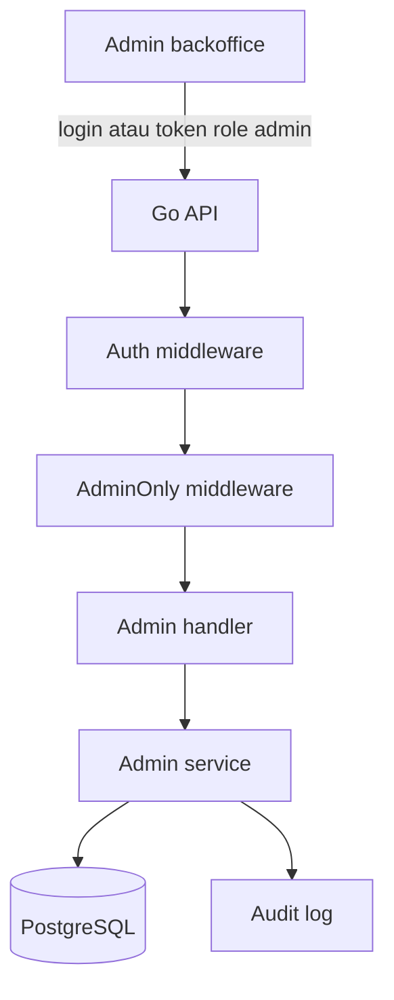

import { Section, Box, Steps, Step, Recap, CardGrid, Card, Chip, Hero, Compare, FileTree, Endpoint, Def } from "@components";

<Hero eyebrow="Roadmap 5 &middot; Domain Mastery" title="Domain Admin dan <em>Backoffice</em><br />Operasi Internal yang Aman">
  <p>Backoffice bukan sekadar halaman dashboard, tetapi jalur operasi internal yang harus aman, terlacak, dan tidak merusak data bisnis.</p>
  <Fragment slot="meta">
    <Chip icon="shield">Bahasa: <b>Go 1.26</b></Chip>
    <Chip icon="clock">~60 menit baca</Chip>
  </Fragment>
</Hero>

<Section num="01" id="intro" title="Kenapa Backoffice Itu Domain Penting?">

<p class="lead">Di online shop skincare, admin bisa mengubah produk, stok, order, dan refund, jadi bug kecil di route admin bisa berdampak langsung ke uang dan kepercayaan pelanggan.</p>

Di frontend React, backoffice sering terasa seperti halaman khusus di `/admin`. Di backend Go, backoffice lebih tepat diperlakukan sebagai **domain operasi internal** dengan route, service, permission, dan audit log sendiri. Mirip Laravel Nova atau Filament, tetapi kita tidak otomatis mendapat policy, guard, dan activity log. Semua keputusan harus eksplisit.

<Box variant="bridge" icon="🌉" label="Jembatan: dari Laravel admin panel ke Go service"><p>Laravel bisa memberi scaffolding admin panel dengan guard dan middleware bawaan. Di Go, kita menulis route admin sebagai HTTP handler biasa, lalu membuat batas akses dengan middleware seperti `AdminOnly` dan mencatat efeknya lewat audit log.</p></Box>

Admin bukan pengguna biasa dengan UI berbeda. Admin adalah aktor internal yang punya izin lebih besar dan risiko lebih besar. Karena itu, desainnya perlu menjawab empat pertanyaan: siapa yang boleh masuk, aksi apa yang boleh dilakukan, data apa yang berubah, dan bukti apa yang tersimpan jika terjadi masalah.



<p class="fig-cap"><b>Gambar 1.</b> Route admin tetap lewat HTTP biasa, tetapi ada guard role dan audit log sebelum menyentuh operasi bisnis.</p>

Pada modul ini kita akan membangun desain admin untuk proyek skincare: login admin, manajemen produk, stok adjustment, order management, payment inspection, customer support view, dan audit log.

</Section>

<Section num="02" id="ruang-lingkup-admin" title="Ruang Lingkup Admin">

<p class="lead">Backoffice yang sehat tidak mencoba menjadi jalur pintas untuk semua hal, melainkan membungkus operasi internal dengan aturan domain yang jelas.</p>

Kita akan memakai konsep **admin boundary**. Handler di `internal/admin/` boleh mengorkestrasi fitur product, order, payment, dan support, tetapi tidak boleh membuat aturan bisnis liar yang berbeda dari domain utama. Misalnya, update status order manual tetap harus melewati state machine order yang sudah dibahas di modul Order Lifecycle.

<CardGrid cols={2}>
  <Card><h4>Product management</h4><p>CRUD produk, CRUD variant, upload URL gambar CDN, update status active/inactive/archived, dan stok adjustment yang tercatat.</p></Card>
  <Card><h4>Order management</h4><p>Admin bisa melihat semua order, filter status, dan melakukan update manual untuk kasus operasional seperti pesanan salah status.</p></Card>
  <Card><h4>Payment inspection</h4><p>Admin bisa melihat payment intent, webhook log, status payment gateway, dan memicu refund melalui flow yang terkontrol.</p></Card>
  <Card><h4>Customer support view</h4><p>Support bisa mencari order berdasarkan user, email, atau nomor order tanpa perlu membuka database langsung.</p></Card>
</CardGrid>

<Def term="backoffice domain"><p>Bagian backend untuk operasi internal bisnis, seperti mengelola produk, order, payment, dan customer support, biasanya hanya bisa diakses oleh user dengan role internal.</p></Def>

<Def term="audit log"><p>Catatan append-only tentang tindakan penting admin: siapa melakukan apa, ke entitas apa, kapan, dari IP mana, dan perubahan sebelum serta sesudahnya.</p></Def>

<Box variant="warn" icon="⚠️" label="Jangan jadikan admin route sebagai bypass"><p>Route admin boleh punya izin lebih luas, tetapi tidak boleh melewati validasi domain. Admin tetap tidak boleh mengubah order dari `delivered` ke `pending_payment` jika state machine melarangnya.</p></Box>

</Section>

<Section num="03" id="admin-login-dan-role" title="Admin Login dan Role Check">

<p class="lead">Admin login bisa dibuat sebagai endpoint terpisah atau memakai endpoint login yang sama dengan pengecekan role, tetapi hasil akhirnya harus sama: token berisi identitas dan role yang bisa diverifikasi server.</p>

Ada dua pola umum. Pertama, endpoint `POST /v1/admin/login` terpisah. Ini enak untuk backoffice karena bisa diberi rate limit dan audit login yang berbeda. Kedua, `POST /v1/auth/login` dipakai bersama, lalu backend menolak akses admin jika user tidak memiliki role `admin` atau `support`. Untuk proyek ini, kita akan memilih **login terpisah di route admin**, tetapi tetap memakai tabel user dan mekanisme auth yang sama.

<Compare aLabel="JS / Laravel: guard admin" bLabel="Go: middleware eksplisit" aTone="muted" bTone="violet">
  <Fragment slot="a"><ul><li>Laravel biasa memakai guard, middleware `auth:admin`, atau policy untuk membatasi halaman admin.</li><li>Frontend React sering hanya menyembunyikan menu admin berdasarkan role di state.</li></ul></Fragment>
  <Fragment slot="b"><ul><li>Go API tetap harus memverifikasi token dan role di server untuk setiap request admin.</li><li>Menyembunyikan tombol di UI membantu UX, tetapi tidak pernah cukup untuk security.</li></ul></Fragment>
</Compare>

Endpoint awal yang kita butuhkan:

<Endpoint method="POST" path="/v1/admin/login" desc="Login admin, menghasilkan access token dengan role internal" />
<Endpoint method="GET" path="/v1/admin/me" desc="Cek identitas admin yang sedang login" />

Payload login tidak perlu berbeda dari login customer. Yang berbeda adalah **aturan penerimaan**. User dengan email dan password valid tetap ditolak jika tidak punya role internal.

```json title="request.json"
{
  "email": "admin@skincare.test",
  "password": "secret-admin-password"
}
```

```json title="response.json"
{
  "access_token": "eyJhbGciOi...",
  "token_type": "Bearer",
  "expires_in": 900,
  "admin": {
    "id": 7,
    "email": "admin@skincare.test",
    "roles": ["admin"]
  }
}
```

<Box variant="tip" icon="💡" label="Best practice"><p>Token boleh menyimpan role sebagai claim, tetapi server tetap harus punya cara mencabut akses, misalnya disable user, token version, atau session revocation untuk operasi admin yang sensitif.</p></Box>

</Section>

<Section num="04" id="route-protection" title="Route Protection dengan AdminOnly">

<p class="lead">Middleware admin harus kecil, mudah dites, dan hanya melakukan satu tugas: memastikan request sudah terautentikasi dan principal punya role admin.</p>

Di chi, route admin bisa dikelompokkan di bawah `/v1/admin`, lalu dipasang middleware auth dan `AdminOnly`. Polanya mirip middleware di Express atau Laravel, tetapi di Go middleware adalah fungsi yang menerima `http.Handler` dan mengembalikan `http.Handler` baru.

```go title="internal/admin/model.go"
package admin

import "context"

type Role string

const (
	RoleAdmin   Role = "admin"
	RoleSupport Role = "support"
)

type Principal struct {
	UserID int64
	Email  string
	Roles  []Role
}

func (p Principal) HasRole(role Role) bool {
	for _, item := range p.Roles {
		if item == role {
			return true
		}
	}
	return false
}

type principalKey struct{}

func WithPrincipal(ctx context.Context, principal Principal) context.Context {
	return context.WithValue(ctx, principalKey{}, principal)
}

func PrincipalFromContext(ctx context.Context) (Principal, bool) {
	principal, ok := ctx.Value(principalKey{}).(Principal)
	return principal, ok
}
```

```go title="internal/admin/middleware.go"
package admin

import "net/http"

func AdminOnly(next http.Handler) http.Handler {
	return http.HandlerFunc(func(w http.ResponseWriter, r *http.Request) {
		principal, ok := PrincipalFromContext(r.Context())
		if !ok {
			http.Error(w, "unauthorized", http.StatusUnauthorized)
			return
		}

		if !principal.HasRole(RoleAdmin) {
			http.Error(w, "admin role required", http.StatusForbidden)
			return
		}

		next.ServeHTTP(w, r)
	})
}
```

<Box variant="warn" icon="⚠️" label="Jebakan keamanan"><p>Jangan percaya role dari request body, query string, atau header bebas seperti `X-Role`. Role harus berasal dari token yang sudah diverifikasi atau session server-side.</p></Box>

Route admin akan terlihat seperti ini:

```go title="internal/admin/route.go"
package admin

import (
	"net/http"

	"github.com/go-chi/chi/v5"
)

type AuthMiddleware func(http.Handler) http.Handler

func MountRoutes(r chi.Router, h *Handler, auth AuthMiddleware) {
	r.Route("/v1/admin", func(r chi.Router) {
		r.Post("/login", h.Login)

		r.Group(func(r chi.Router) {
			r.Use(auth)
			r.Use(AdminOnly)

			r.Get("/me", h.Me)
			r.Get("/products", h.ListProducts)
			r.Post("/products", h.CreateProduct)
			r.Patch("/products/{productID}", h.UpdateProduct)
			r.Post("/product-variants/{variantID}/stock-adjustments", h.AdjustStock)
			r.Get("/orders", h.ListOrders)
			r.Patch("/orders/{orderID}/status", h.UpdateOrderStatus)
			r.Get("/payments/{paymentID}/logs", h.PaymentLogs)
			r.Post("/payments/{paymentID}/refund", h.TriggerRefund)
			r.Get("/support/orders", h.SearchSupportOrders)
			r.Get("/audit-logs", h.ListAuditLogs)
		})
	})
}
```

</Section>

<Section num="05" id="struktur-internal-admin" title="Struktur internal/admin">

<p class="lead">Folder admin sebaiknya menjadi boundary orchestration, bukan tempat menaruh semua logic produk, order, dan payment secara acak.</p>

<FileTree title="Struktur domain admin" tree={`
internal/
  admin/
    route.go          # semua route /v1/admin
    middleware.go     # AdminOnly dan guard internal
    handler.go        # parse request, panggil service, tulis response
    service.go        # orkestrasi operasi admin dan audit
    repository.go     # query khusus backoffice
    model.go          # Principal, Role, command, result
    audit.go          # model dan helper audit log
    dto.go            # request dan response khusus admin
  product/
    service.go        # aturan katalog tetap tinggal di domain product
  order/
    service.go        # state machine order tetap tinggal di domain order
  payment/
    service.go        # refund dan payment log tetap terkontrol
cmd/
  api/
    main.go           # mount route publik dan route admin
`} />

Desain ini menjaga agar `internal/admin` tidak menjadi "god domain". Admin boleh mengorkestrasi beberapa domain, tetapi business rule tetap tinggal di domain asalnya. Contoh, stok adjustment admin harus lewat operasi inventory yang mencatat stock movement, bukan update kolom stok langsung tanpa riwayat.

<Box variant="bridge" icon="🌉" label="Jembatan: dari React Admin ke backend boundary"><p>React Admin atau dashboard custom biasanya mengumpulkan banyak halaman di satu aplikasi. Backend Go tetap perlu memisahkan boundary agar halaman admin tidak berubah menjadi kumpulan endpoint bebas yang melewati aturan domain.</p></Box>

</Section>

<Section num="06" id="product-management" title="Product Management">

<p class="lead">Admin product management harus memudahkan operasi katalog tanpa mengorbankan konsistensi data produk, variant, dan stok.</p>

Route produk admin berbeda dari route katalog publik. Route publik fokus menampilkan produk aktif untuk customer. Route admin perlu melihat produk inactive dan archived, mengubah draft produk, memperbaiki variant, serta melakukan stok adjustment.

<Endpoint method="GET" path="/v1/admin/products" desc="List semua produk, termasuk inactive dan archived, dengan filter backoffice" />
<Endpoint method="POST" path="/v1/admin/products" desc="Membuat produk baru beserta atribut skincare dasar" />
<Endpoint method="PATCH" path="/v1/admin/products/:productID" desc="Mengubah nama, status, slug, BPOM, gambar, dan atribut skincare" />
<Endpoint method="POST" path="/v1/admin/product-variants/:variantID/stock-adjustments" desc="Menambah atau mengurangi stok melalui stock movement yang tercatat" />

Untuk stok, jangan beri admin endpoint seperti `PATCH stock = 999` tanpa alasan. Pakai **stock adjustment** dengan delta dan reason. Ini membuat audit lebih jelas: stok naik 12 karena restock, stok turun 2 karena koreksi barang rusak.

```json title="request.json"
{
  "delta": 12,
  "reason": "Restock dari supplier batch Juni",
  "reference_no": "PO-20260606-001"
}
```

```go title="internal/admin/service.go"
package admin

import (
	"context"
	"errors"
	"strings"
)

var (
	ErrInvalidStockDelta = errors.New("stock delta must not be zero")
	ErrReasonRequired    = errors.New("reason is required")
)

type AdjustStockCommand struct {
	Admin        Principal
	VariantID    int64
	Delta        int
	Reason       string
	ReferenceNo  string
	IPAddress    string
	UserAgent    string
}

type AdminStore interface {
	InTx(ctx context.Context, fn func(ctx context.Context, tx AdminTx) error) error
}

type AdminTx interface {
	AdjustVariantStock(ctx context.Context, variantID int64, delta int, reason string, referenceNo string) error
	InsertAuditLog(ctx context.Context, entry AuditEntry) error
}

type Service struct {
	store AdminStore
}

func NewService(store AdminStore) *Service {
	return &Service{store: store}
}

func (s *Service) AdjustStock(ctx context.Context, cmd AdjustStockCommand) error {
	if cmd.Delta == 0 {
		return ErrInvalidStockDelta
	}
	if strings.TrimSpace(cmd.Reason) == "" {
		return ErrReasonRequired
	}

	return s.store.InTx(ctx, func(ctx context.Context, tx AdminTx) error {
		if err := tx.AdjustVariantStock(ctx, cmd.VariantID, cmd.Delta, cmd.Reason, cmd.ReferenceNo); err != nil {
			return err
		}

		return tx.InsertAuditLog(ctx, AuditEntry{
			AdminUserID: cmd.Admin.UserID,
			Action:      "stock.adjusted",
			EntityType:  "product_variant",
			EntityID:    cmd.VariantID,
			IPAddress:   cmd.IPAddress,
			UserAgent:   cmd.UserAgent,
		})
	})
}
```

<Box variant="tip" icon="💡" label="Kenapa delta lebih aman"><p>Delta membuat perubahan stok bisa dilacak sebagai movement. Nilai stok akhir adalah hasil dari operasi bisnis, bukan angka yang ditempel manual oleh admin tanpa konteks.</p></Box>

</Section>

<Section num="07" id="order-management" title="Order Management">

<p class="lead">Order management membantu tim operasional memperbaiki kasus nyata, tetapi update status manual tetap harus lewat state machine.</p>

Admin perlu melihat semua order, bukan hanya order miliknya sendiri. Endpoint list order harus punya filter yang berguna: status, nomor order, email customer, tanggal, payment status, dan fulfillment status.

<Endpoint method="GET" path="/v1/admin/orders" desc="List order lintas user dengan filter status, email, nomor order, dan tanggal" />
<Endpoint method="GET" path="/v1/admin/orders/:orderID" desc="Detail order lengkap untuk operasional internal" />
<Endpoint method="PATCH" path="/v1/admin/orders/:orderID/status" desc="Update status manual dengan reason dan audit log" />

```json title="request.json"
{
  "status": "processing",
  "reason": "Payment sudah valid, order perlu diproses manual karena webhook tertunda"
}
```

Di service, jangan tulis `UPDATE orders SET status = $1` langsung dari handler. Panggil aturan transisi yang sama dengan domain order.

```go title="internal/admin/order_service.go"
package admin

import (
	"context"
	"errors"
	"strings"
)

var ErrStatusReasonRequired = errors.New("status change reason is required")

type UpdateOrderStatusCommand struct {
	Admin     Principal
	OrderID   int64
	Status    string
	Reason    string
	IPAddress string
	UserAgent string
}

type OrderTransitioner interface {
	CanTransition(from string, to string) bool
}

type OrderAdminTx interface {
	GetOrderStatusForUpdate(ctx context.Context, orderID int64) (string, error)
	UpdateOrderStatus(ctx context.Context, orderID int64, status string, reason string) error
	InsertAuditLog(ctx context.Context, entry AuditEntry) error
}

func (s *Service) UpdateOrderStatus(ctx context.Context, cmd UpdateOrderStatusCommand, transitions OrderTransitioner) error {
	if strings.TrimSpace(cmd.Reason) == "" {
		return ErrStatusReasonRequired
	}

	return s.store.InTx(ctx, func(ctx context.Context, tx AdminTx) error {
		orderTx, ok := tx.(OrderAdminTx)
		if !ok {
			return errors.New("admin tx does not support order operations")
		}

		currentStatus, err := orderTx.GetOrderStatusForUpdate(ctx, cmd.OrderID)
		if err != nil {
			return err
		}

		if !transitions.CanTransition(currentStatus, cmd.Status) {
			return errors.New("invalid order status transition")
		}

		if err := orderTx.UpdateOrderStatus(ctx, cmd.OrderID, cmd.Status, cmd.Reason); err != nil {
			return err
		}

		return orderTx.InsertAuditLog(ctx, AuditEntry{
			AdminUserID: cmd.Admin.UserID,
			Action:      "order.status_updated",
			EntityType:  "order",
			EntityID:    cmd.OrderID,
			IPAddress:   cmd.IPAddress,
			UserAgent:   cmd.UserAgent,
		})
	})
}
```

<Box variant="warn" icon="⚠️" label="Manual bukan berarti bebas"><p>Manual update harus lebih ketat daripada update otomatis, karena efeknya dilakukan oleh manusia dan sering terjadi saat situasi sedang kacau.</p></Box>

</Section>

<Section num="08" id="payment-dan-support" title="Payment Inspection dan Customer Support">

<p class="lead">Payment inspection dan support view membantu tim internal menjawab masalah customer tanpa membuka akses database mentah.</p>

Payment gateway seperti Midtrans, Xendit, atau Nicepay bisa mengirim webhook lebih dari sekali, terlambat, atau dengan status yang perlu rekonsiliasi. Admin butuh view untuk melihat payment intent, payment event log, dan raw status gateway yang sudah disimpan pada modul Payment.

<Endpoint method="GET" path="/v1/admin/payments/:paymentID/logs" desc="Lihat event log payment, termasuk webhook masuk dan hasil verifikasi" />
<Endpoint method="POST" path="/v1/admin/payments/:paymentID/refund" desc="Trigger refund melalui payment service dengan reason dan audit log" />
<Endpoint method="GET" path="/v1/admin/support/orders" desc="Cari order berdasarkan email, user ID, atau nomor order untuk kebutuhan support" />

Support view sebaiknya read-only untuk role `support`. Role `admin` boleh melakukan update terbatas. Jika nanti bisnis membesar, kita bisa memecah role menjadi `catalog_manager`, `ops_admin`, `finance_admin`, dan `support_agent`.

```go title="internal/admin/dto.go"
package admin

import "time"

type SupportOrderSearchQuery struct {
	Email       string
	UserID      int64
	OrderNumber string
	Limit       int
	Offset      int
}

type SupportOrderResult struct {
	OrderID       int64     `json:"order_id"`
	OrderNumber   string    `json:"order_number"`
	CustomerEmail string    `json:"customer_email"`
	Status        string    `json:"status"`
	PaymentStatus string    `json:"payment_status"`
	GrandTotal    int64     `json:"grand_total"`
	CreatedAt     time.Time `json:"created_at"`
}
```

```sql title="internal/admin/query.sql"
SELECT
  o.id,
  o.order_number,
  u.email AS customer_email,
  o.status,
  p.status AS payment_status,
  o.grand_total,
  o.created_at
FROM orders o
JOIN users u ON u.id = o.user_id
LEFT JOIN payments p ON p.order_id = o.id
WHERE
  ($1 = '' OR u.email ILIKE '%' || $1 || '%')
  AND ($2 = 0 OR u.id = $2)
  AND ($3 = '' OR o.order_number = $3)
ORDER BY o.created_at DESC
LIMIT $4 OFFSET $5;
```

<Box variant="note" icon="📝" label="Privacy"><p>Support view harus menampilkan data secukupnya. Hindari menampilkan token payment, raw credential, password hash, atau data sensitif lain yang tidak dibutuhkan untuk membantu customer.</p></Box>

</Section>

<Section num="09" id="audit-log" title="Audit Log untuk Semua Tindakan Admin">

<p class="lead">Audit log adalah sabuk pengaman backoffice, karena setiap operasi internal yang mengubah data harus bisa ditelusuri.</p>

Audit log sebaiknya **append-only**. Artinya, aplikasi hanya menambah catatan baru, bukan mengubah catatan lama. Untuk kebutuhan internal, audit log minimal berisi admin user ID, action, entity type, entity ID, before data, after data, IP address, user agent, dan timestamp.

```sql title="db/migrations/050_create_admin_audit_logs.up.sql"
CREATE TABLE admin_audit_logs (
  id BIGSERIAL PRIMARY KEY,
  admin_user_id BIGINT NOT NULL REFERENCES users(id),
  action TEXT NOT NULL,
  entity_type TEXT NOT NULL,
  entity_id BIGINT,
  before_data JSONB,
  after_data JSONB,
  ip_address INET,
  user_agent TEXT,
  created_at TIMESTAMPTZ NOT NULL DEFAULT now()
);

CREATE INDEX idx_admin_audit_logs_admin_created_at
  ON admin_audit_logs (admin_user_id, created_at DESC);

CREATE INDEX idx_admin_audit_logs_entity_created_at
  ON admin_audit_logs (entity_type, entity_id, created_at DESC);
```

```sql title="db/migrations/050_create_admin_audit_logs.down.sql"
DROP TABLE IF EXISTS admin_audit_logs;
```

```go title="internal/admin/audit.go"
package admin

import (
	"encoding/json"
	"time"
)

type AuditEntry struct {
	ID          int64
	AdminUserID int64
	Action      string
	EntityType  string
	EntityID    int64
	BeforeData  json.RawMessage
	AfterData   json.RawMessage
	IPAddress   string
	UserAgent   string
	CreatedAt   time.Time
}

func MustAuditJSON(value any) json.RawMessage {
	data, err := json.Marshal(value)
	if err != nil {
		return json.RawMessage(`null`)
	}
	return data
}
```

```go title="internal/admin/repository.go"
package admin

import (
	"context"
	"errors"

	"github.com/jackc/pgx/v5"
	"github.com/jackc/pgx/v5/pgxpool"
)

type Repository struct {
	pool *pgxpool.Pool
}

func NewRepository(pool *pgxpool.Pool) *Repository {
	return &Repository{pool: pool}
}

func (r *Repository) InTx(ctx context.Context, fn func(ctx context.Context, tx AdminTx) error) error {
	tx, err := r.pool.Begin(ctx)
	if err != nil {
		return err
	}
	defer tx.Rollback(ctx)

	adapter := txAdapter{tx: tx}
	if err := fn(ctx, adapter); err != nil {
		return err
	}

	return tx.Commit(ctx)
}

type txAdapter struct {
	tx pgx.Tx
}

func (t txAdapter) AdjustVariantStock(ctx context.Context, variantID int64, delta int, reason string, referenceNo string) error {
	tag, err := t.tx.Exec(ctx, `
		UPDATE product_variants
		SET available_stock = available_stock + $1, updated_at = now()
		WHERE id = $2 AND available_stock + $1 >= 0
	`, delta, variantID)
	if err != nil {
		return err
	}
	if tag.RowsAffected() != 1 {
		return errors.New("variant not found or insufficient stock")
	}

	_, err = t.tx.Exec(ctx, `
		INSERT INTO stock_movements (product_variant_id, delta, reason, reference_no, created_at)
		VALUES ($1, $2, $3, $4, now())
	`, variantID, delta, reason, referenceNo)
	return err
}

func (t txAdapter) InsertAuditLog(ctx context.Context, entry AuditEntry) error {
	_, err := t.tx.Exec(ctx, `
		INSERT INTO admin_audit_logs (
			admin_user_id, action, entity_type, entity_id,
			before_data, after_data, ip_address, user_agent
		)
		VALUES ($1, $2, $3, $4, $5, $6, NULLIF($7, '')::inet, $8)
	`, entry.AdminUserID, entry.Action, entry.EntityType, entry.EntityID, entry.BeforeData, entry.AfterData, entry.IPAddress, entry.UserAgent)
	return err
}
```

<Box variant="tip" icon="💡" label="Audit log bukan application log"><p>Application log membantu engineer debugging. Audit log membantu bisnis menjawab siapa mengubah data apa, kapan, dan kenapa.</p></Box>

</Section>

<Section num="10" id="hands-on" title="Hands-on: Route Admin End-to-End">

<p class="lead">Sekarang kita rangkai handler, middleware, dan service untuk satu flow nyata: admin melakukan stok adjustment variant produk.</p>

Langkah ini sengaja ringan. Fokusnya bukan membangun semua fitur admin sekaligus, tetapi menanam pola yang bisa diulang untuk order status, refund, dan support view.

<Steps>
  <Step><b>Buat command yang eksplisit</b><p>Jangan teruskan request body mentah ke service. Ubah menjadi command yang berisi admin principal, target entity, reason, dan metadata request.</p></Step>
  <Step><b>Validasi di service</b><p>Handler memvalidasi bentuk JSON, service memvalidasi rule bisnis seperti delta tidak boleh nol dan reason wajib ada.</p></Step>
  <Step><b>Jalankan dalam transaksi</b><p>Stok adjustment dan audit log harus commit bersama. Jika salah satu gagal, keduanya rollback.</p></Step>
  <Step><b>Balas response kecil</b><p>Admin UI biasanya hanya butuh status sukses dan ID referensi. Detail perubahan bisa dibaca lewat audit log atau stock movement.</p></Step>
</Steps>

```go title="internal/admin/handler.go"
package admin

import (
	"encoding/json"
	"net"
	"net/http"
	"strconv"

	"github.com/go-chi/chi/v5"
)

type Handler struct {
	service *Service
}

func NewHandler(service *Service) *Handler {
	return &Handler{service: service}
}

type adjustStockRequest struct {
	Delta       int    `json:"delta"`
	Reason      string `json:"reason"`
	ReferenceNo string `json:"reference_no"`
}

func (h *Handler) AdjustStock(w http.ResponseWriter, r *http.Request) {
	principal, ok := PrincipalFromContext(r.Context())
	if !ok {
		http.Error(w, "unauthorized", http.StatusUnauthorized)
		return
	}

	variantID, err := strconv.ParseInt(chi.URLParam(r, "variantID"), 10, 64)
	if err != nil || variantID <= 0 {
		http.Error(w, "invalid variant id", http.StatusBadRequest)
		return
	}

	var req adjustStockRequest
	if err := json.NewDecoder(r.Body).Decode(&req); err != nil {
		http.Error(w, "invalid json body", http.StatusBadRequest)
		return
	}

	cmd := AdjustStockCommand{
		Admin:       principal,
		VariantID:   variantID,
		Delta:       req.Delta,
		Reason:      req.Reason,
		ReferenceNo: req.ReferenceNo,
		IPAddress:   clientIP(r),
		UserAgent:   r.UserAgent(),
	}

	if err := h.service.AdjustStock(r.Context(), cmd); err != nil {
		http.Error(w, err.Error(), http.StatusUnprocessableEntity)
		return
	}

	writeJSON(w, http.StatusOK, map[string]any{"status": "ok"})
}

func clientIP(r *http.Request) string {
	ip, _, err := net.SplitHostPort(r.RemoteAddr)
	if err != nil {
		return ""
	}
	return ip
}

func writeJSON(w http.ResponseWriter, status int, payload any) {
	w.Header().Set("Content-Type", "application/json")
	w.WriteHeader(status)
	_ = json.NewEncoder(w).Encode(payload)
}
```

```go title="cmd/api/admin_routes.go"
package main

import (
	"net/http"

	"github.com/go-chi/chi/v5"
	"github.com/jackc/pgx/v5/pgxpool"
	"github.com/kamu/skincare-backend/internal/admin"
)

func mountAdminRoutes(r chi.Router, pool *pgxpool.Pool) {
	adminRepo := admin.NewRepository(pool)
	adminService := admin.NewService(adminRepo)
	adminHandler := admin.NewHandler(adminService)

	admin.MountRoutes(r, adminHandler, authMiddleware)
}

func authMiddleware(next http.Handler) http.Handler {
	return http.HandlerFunc(func(w http.ResponseWriter, r *http.Request) {
		principal := admin.Principal{
			UserID: 7,
			Email:  "admin@skincare.test",
			Roles:  []admin.Role{admin.RoleAdmin},
		}
		ctx := admin.WithPrincipal(r.Context(), principal)
		next.ServeHTTP(w, r.WithContext(ctx))
	})
}
```

<Box variant="note" icon="📝" label="Catatan contoh"><p>`authMiddleware` di atas adalah stub untuk hands-on. Di proyek nyata, middleware ini memverifikasi JWT atau session, lalu mengisi principal dari data user yang valid.</p></Box>

</Section>

<Section num="11" id="jebakan-umum" title="Jebakan Umum">

<p class="lead">Sebagian besar bug admin bukan karena routing sulit, tetapi karena backend terlalu percaya bahwa admin selalu melakukan hal benar.</p>

<CardGrid cols={2}>
  <Card><h4>Role hanya dicek di frontend</h4><p>Menu admin yang disembunyikan di React bukan security. Backend tetap wajib cek token dan role untuk setiap route.</p></Card>
  <Card><h4>Admin update langsung ke tabel</h4><p>Endpoint admin yang mengubah kolom langsung tanpa service domain akan memecahkan state machine, stok, dan audit.</p></Card>
  <Card><h4>Audit log tidak lengkap</h4><p>Audit yang hanya mencatat action tanpa admin ID, entity ID, dan reason sulit dipakai saat investigasi.</p></Card>
  <Card><h4>Support terlalu banyak akses</h4><p>Role support tidak selalu perlu akses refund, stok, atau data sensitif. Pisahkan permission sejak awal walau sederhana.</p></Card>
</CardGrid>

<Box variant="warn" icon="⚠️" label="Hati-hati dengan delete"><p>Untuk produk, order, dan payment, hindari hard delete dari admin UI. Gunakan status `archived`, `cancelled`, atau catatan koreksi agar riwayat bisnis tidak hilang.</p></Box>

Satu jebakan lain adalah tidak membedakan `401 Unauthorized` dan `403 Forbidden`. Request tanpa token sebaiknya mendapat 401. Request dengan token valid tetapi tanpa role admin sebaiknya mendapat 403. Perbedaan ini membantu debugging dan membuat policy lebih jelas.

</Section>

<Section num="12" id="ringkasan" title="Ringkasan & Poin Penting">

<p class="lead">Admin dan backoffice adalah lapisan operasi internal yang menghubungkan domain katalog, inventory, order, payment, dan support dengan kontrol akses yang ketat.</p>

<Recap title="Yang Wajib Menempel"><ul><li>Route admin harus berada di boundary jelas, misalnya `/v1/admin`, dengan auth middleware dan `AdminOnly`.</li><li>Admin login boleh endpoint terpisah atau login umum dengan role check, tetapi role selalu diverifikasi server-side.</li><li>Product management admin mencakup CRUD produk, variant, status, dan stok adjustment berbasis delta plus reason.</li><li>Order management manual tetap harus melewati state machine agar transisi status tidak merusak lifecycle order.</li><li>Payment inspection dan refund harus lewat service payment, bukan update database langsung.</li><li>Customer support view sebaiknya read-only dan hanya menampilkan data yang relevan.</li><li>Audit log wajib mencatat siapa, apa, entitas mana, kapan, IP, user agent, before data, dan after data untuk aksi penting.</li></ul></Recap>

Di proyek online shop skincare, modul ini menutup Roadmap 5 dengan jalur internal yang realistis. Setelah customer bisa melihat produk, checkout, membayar, menerima order, dan memberi review, bisnis juga butuh tim internal untuk mengoperasikan sistem tanpa akses database langsung.

Langkah berikutnya di Roadmap 6 adalah testing. Route admin sangat cocok untuk mulai menulis unit test service, test middleware `AdminOnly`, test handler dengan `httptest`, dan integration test untuk audit log di PostgreSQL.

</Section>
