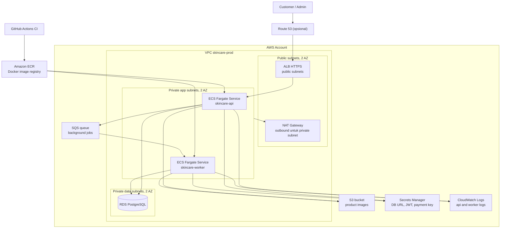

import { Section, Box, Steps, Step, Recap, CardGrid, Card, Chip, Hero, Compare, FileTree, Endpoint, Def } from "@components";

<Hero eyebrow="Roadmap 8 &middot; Docker, CI/CD, dan AWS" title="AWS Foundation<br /><em>layanan backend skincare</em>">
  <p>Peta layanan AWS agar backend Go skincare bisa dipindahkan dari laptop ke production tanpa kehilangan arah.</p>
  <Fragment slot="meta">
    <Chip icon="code">Bahasa: <b>Go 1.26</b></Chip>
    <Chip icon="clock">~60 menit baca</Chip>
  </Fragment>
</Hero>

<Section num="01" id="intro" title="Kenapa Backend Perlu Peta AWS?">

<p class="lead">Di Roadmap 8 kita tidak hanya membuat Docker image, kita menaruh image itu ke lingkungan cloud yang punya network, permission, database, object storage, logs, secret, dan queue.</p>

Kalau kamu datang dari React/Node.js, bayangkan ini seperti memindahkan aplikasi dari `npm run dev` ke platform yang punya reverse proxy, environment variables, database managed, dan log aggregation. Kalau kamu datang dari Laravel, ini mirip gabungan Laravel Forge, queue worker, disk S3, database managed, dan scheduler, tetapi komponennya eksplisit dan permission-nya harus dirancang.

<Box variant="bridge" icon="🌉" label="Jembatan: dari hosting panel ke arsitektur cloud"><p>Di shared hosting atau VPS, banyak keputusan disembunyikan oleh panel. Di AWS, keputusan itu terlihat sebagai layanan: VPC untuk jaringan, ECS untuk container, RDS untuk database, S3 untuk file, CloudWatch untuk observability, Secrets Manager untuk credential, dan SQS untuk antrian.</p></Box>

Modul ini bukan deep dive konfigurasi. Targetnya adalah kamu bisa membaca diagram, menyebut layanan yang benar, tahu data bergerak ke mana, dan bisa berdiskusi dengan DevOps, SRE, atau cloud engineer tanpa menebak.

<Def term="AWS Foundation"><p>Lapisan layanan minimum yang membuat backend Go siap production: jaringan privat, container runtime, registry image, load balancer, database managed, object storage, logging, secret management, permission, dan queue.</p></Def>

</Section>

<Section num="02" id="vpc-subnet-security" title="VPC, Subnet, dan Security Group">

<p class="lead">VPC adalah batas jaringan utama. Subnet membagi area di dalamnya, sedangkan security group mengontrol traffic antar layanan.</p>

[Amazon VPC](https://docs.aws.amazon.com/vpc/latest/userguide/what-is-amazon-vpc.html) adalah virtual network yang terisolasi secara logis di AWS. Di dalam VPC, kita menaruh resource backend skincare seperti ALB, ECS task, dan RDS. Pola production yang umum adalah dua Availability Zone atau lebih agar aplikasi tidak bergantung pada satu zona saja.

<Def term="VPC"><p>Jaringan privat milik akun AWS tempat resource saling berkomunikasi memakai IP privat, route table, subnet, gateway, dan security group.</p></Def>

<Compare aLabel="Public subnet" bLabel="Private subnet" aTone="blue" bTone="violet">
  <Fragment slot="a"><ul><li>Punya route langsung ke internet gateway.</li><li>Cocok untuk ALB karena client dari internet perlu masuk lewat HTTPS.</li><li>Jangan taruh database di sini untuk aplikasi skincare.</li></ul></Fragment>
  <Fragment slot="b"><ul><li>Tidak punya route langsung dari internet.</li><li>Cocok untuk ECS API, worker, dan RDS.</li><li>Outbound update atau pull dependency biasanya lewat NAT gateway atau VPC endpoint.</li></ul></Fragment>
</Compare>

<Def term="Security group"><p>Firewall virtual di level resource. Di ECS Fargate, aturan ini menempel ke elastic network interface milik task, bukan ke server yang kamu kelola sendiri.</p></Def>

Security group yang sehat selalu membaca sumber traffic, bukan hanya port. Untuk proyek skincare, ALB menerima `443` dari internet, API hanya menerima `8080` dari security group ALB, RDS hanya menerima `5432` dari security group API dan worker, lalu SQS, S3, dan Secrets Manager diakses lewat IAM permission, bukan dibuka dengan port publik.

<Box variant="warn" icon="⚠️" label="Jebakan: private subnet bukan berarti tanpa internet keluar"><p>Private subnet artinya tidak bisa diakses langsung dari internet. Task di private subnet masih bisa membutuhkan outbound untuk mengambil image, mengirim log, atau memanggil AWS API, biasanya lewat NAT gateway atau VPC endpoint.</p></Box>

</Section>

<Section num="03" id="container-layer" title="ECR, ECS Fargate, dan ALB">

<p class="lead">Setelah CI berhasil membangun Docker image, image disimpan di ECR, dijalankan oleh ECS Fargate, lalu diekspos ke user melalui ALB.</p>

[Amazon ECR](https://docs.aws.amazon.com/AmazonECR/latest/userguide/what-is-ecr.html) adalah registry Docker milik AWS. Pipeline dari Chapter 3 melakukan `docker build`, login ke ECR, lalu push image seperti `skincare-api:git-sha`. ECS nanti menarik image itu saat deployment.

[Amazon ECS](https://docs.aws.amazon.com/AmazonECS/latest/developerguide/Welcome.html) adalah orchestrator container. Dengan [AWS Fargate](https://docs.aws.amazon.com/AmazonECS/latest/developerguide/AWS_Fargate.html), kita menjalankan container tanpa mengelola EC2 instance, patch OS, atau kapasitas server manual. Kita tetap menentukan CPU, memory, environment variable, health check, IAM role, dan network placement.

[Application Load Balancer](https://docs.aws.amazon.com/elasticloadbalancing/latest/application/introduction.html) menjadi pintu masuk HTTP/HTTPS. Untuk API skincare, ALB menerima request dari frontend, melakukan health check, lalu meneruskan traffic hanya ke task yang sehat.

<Endpoint method="GET" path="/healthz" desc="Endpoint ringan yang dipanggil ALB untuk memastikan task API siap menerima traffic." />

<CardGrid cols={3}>
  <Card><h4>ECR</h4><p>Tempat image disimpan setelah pipeline berhasil.</p></Card>
  <Card><h4>ECS Fargate</h4><p>Tempat container Go API dan worker berjalan.</p></Card>
  <Card><h4>ALB</h4><p>Pintu masuk HTTPS dan health check untuk API.</p></Card>
</CardGrid>

<Box variant="bridge" icon="🌉" label="Jembatan: dari Node.js deploy ke container"><p>Di banyak proyek Node.js, kamu push code lalu platform menjalankan buildpack. Di pola Go ini, output deploy adalah Docker image immutable. Yang pindah ke AWS bukan source code, tetapi image yang sudah dibangun dan dites oleh CI.</p></Box>

</Section>

<Section num="04" id="data-storage" title="RDS PostgreSQL dan S3">

<p class="lead">Data transaksi dan file produk punya karakter berbeda, maka tempatnya juga berbeda.</p>

[RDS PostgreSQL](https://docs.aws.amazon.com/AmazonRDS/latest/UserGuide/CHAP_PostgreSQL.html) dipakai untuk data relasional: user, produk, variant, cart, order, payment, voucher, inventory movement, dan audit log. Kita memilih RDS karena operasi database seperti backup, patching, monitoring, dan high availability bisa dikelola sebagai layanan managed.

[S3](https://docs.aws.amazon.com/AmazonS3/latest/userguide/Welcome.html) dipakai untuk object storage: gambar produk, gambar review, invoice PDF, export laporan, atau file lain yang tidak cocok disimpan sebagai byte besar di PostgreSQL. Database cukup menyimpan URL, key, content type, ukuran, dan metadata bisnisnya.

<Compare aLabel="PostgreSQL / RDS" bLabel="S3" aTone="teal" bTone="blue">
  <Fragment slot="a"><ul><li>Query relasional, transaksi, constraint, row locking.</li><li>Cocok untuk order, payment, stock, voucher, user, dan audit log.</li><li>Diakses dari Go lewat pgx dan connection pool.</li></ul></Fragment>
  <Fragment slot="b"><ul><li>Object storage untuk file dan metadata object.</li><li>Cocok untuk gambar produk, foto review, invoice, dan export.</li><li>Diakses lewat AWS SDK atau signed URL.</li></ul></Fragment>
</Compare>

<Box variant="tip" icon="💡" label="Praktik proyek skincare"><p>Jangan simpan gambar produk langsung di kolom `bytea` kecuali ada alasan kuat. Simpan file di S3, lalu simpan `s3_key`, `public_url` atau `cdn_url`, `content_type`, dan `size_bytes` di PostgreSQL.</p></Box>

</Section>

<Section num="05" id="identity-secrets-observability" title="IAM Role, Secrets Manager, dan CloudWatch">

<p class="lead">Production bukan hanya bisa jalan, tetapi juga harus punya izin minimum, credential aman, dan jejak observability.</p>

IAM role adalah cara AWS memberi permission ke workload tanpa menanam access key statis di container. Untuk ECS, bedakan dua role: task execution role untuk hal yang dilakukan agen ECS seperti pull image dan mengirim log, serta task role untuk permission aplikasi seperti membaca secret, mengirim message ke SQS, atau upload object ke S3.

<Def term="Task role"><p>IAM role yang diasumsikan oleh aplikasi di dalam ECS task. Inilah role yang dipakai kode Go ketika memanggil S3, SQS, Secrets Manager, atau layanan AWS lain.</p></Def>

<Def term="Task execution role"><p>IAM role yang dipakai runtime ECS untuk menarik image dari ECR, mengambil secret yang direferensikan task definition, dan mengirim log container ke CloudWatch.</p></Def>

[Secrets Manager](https://docs.aws.amazon.com/secretsmanager/latest/userguide/intro.html) menyimpan credential production seperti `DATABASE_URL`, `JWT_SECRET`, `PAYMENT_SERVER_KEY`, dan secret webhook. [CloudWatch Logs](https://docs.aws.amazon.com/AmazonCloudWatch/latest/logs/WhatIsCloudWatchLogs.html) menyimpan log aplikasi agar error dari ECS task tidak hilang ketika container berhenti.

```json title="iam/ecs-task-policy.example.json"
{
  "Version": "2012-10-17",
  "Statement": [
    {
      "Sid": "ReadProductionSecrets",
      "Effect": "Allow",
      "Action": [
        "secretsmanager:GetSecretValue"
      ],
      "Resource": [
        "arn:aws:secretsmanager:ap-southeast-1:123456789012:secret:skincare/prod/*"
      ]
    },
    {
      "Sid": "WriteProductImages",
      "Effect": "Allow",
      "Action": [
        "s3:PutObject",
        "s3:GetObject",
        "s3:DeleteObject"
      ],
      "Resource": [
        "arn:aws:s3:::skincare-product-images/*"
      ]
    },
    {
      "Sid": "SendBackgroundJobs",
      "Effect": "Allow",
      "Action": [
        "sqs:SendMessage"
      ],
      "Resource": [
        "arn:aws:sqs:ap-southeast-1:123456789012:skincare-jobs"
      ]
    }
  ]
}
```

<Box variant="warn" icon="⚠️" label="Jebakan: access key di env container"><p>Jangan taruh `AWS_ACCESS_KEY_ID` dan `AWS_SECRET_ACCESS_KEY` di ECS task untuk akses AWS internal. Gunakan IAM role agar credential sementara diberikan otomatis oleh AWS.</p></Box>

</Section>

<Section num="06" id="background-job" title="SQS untuk Background Job">

<p class="lead">Tidak semua pekerjaan harus diselesaikan di dalam request HTTP user.</p>

[SQS](https://docs.aws.amazon.com/AWSSimpleQueueService/latest/SQSDeveloperGuide/welcome.html) adalah queue managed untuk memisahkan producer dan consumer. Di proyek skincare, API bisa menerima checkout lalu memasukkan job `send_invoice_email`, `sync_payment_status`, atau `resize_product_image` ke queue. Worker mengambil job dari SQS dan memprosesnya terpisah dari request user.

<Compare aLabel="Laravel queue" bLabel="Go + SQS" aTone="muted" bTone="violet">
  <Fragment slot="a"><ul><li>Job dispatch ke driver queue, worker membaca dan menjalankan handler.</li><li>Konfigurasi sering terasa terintegrasi dengan framework.</li></ul></Fragment>
  <Fragment slot="b"><ul><li>API mengirim message JSON ke SQS, worker Go melakukan polling dan menghapus message setelah sukses.</li><li>Retry, visibility timeout, dan dead-letter queue harus dipahami sejak awal.</li></ul></Fragment>
</Compare>

```json title="sqs/send-invoice-message.example.json"
{
  "type": "send_invoice_email",
  "order_id": "INV-20260606-8F3A",
  "user_id": "usr_01HYZ9G5M0",
  "attempt": 1,
  "trace_id": "req_01J0AWSFOUNDATION"
}
```

<Box variant="tip" icon="💡" label="Prinsip worker"><p>Anggap message SQS bisa diterima lebih dari sekali. Worker harus idempotent, misalnya cek `email_sent_at` sebelum mengirim invoice ulang.</p></Box>

</Section>

<Section num="07" id="arsitektur-skincare" title="Arsitektur AWS Proyek Skincare">

<p class="lead">Diagram ini adalah peta layanan minimum untuk backend skincare yang akan kita deploy di AWS.</p>



<p class="fig-cap"><b>Gambar 1.</b> Arsitektur ringkas backend skincare di AWS: ALB publik, API dan worker di private subnet, RDS privat, serta layanan managed untuk image, secret, log, dan queue.</p>

<FileTree title="Peta file deployment di repo" tree={`
.github/
  workflows/
    ci.yml                    # build, test, push image ke ECR
cmd/
  api/
    main.go                   # entrypoint HTTP API
  worker/
    main.go                   # entrypoint background worker
internal/
  platform/
    aws/
      s3.go                   # adapter upload object
      sqs.go                  # adapter enqueue job
      secrets.go              # adapter load secret runtime bila diperlukan
deploy/
  aws/
    ecs-task-definition.json  # preview Roadmap 8 berikutnya
    service.env.example       # daftar env non-secret
docker-compose.yml            # local stack, bukan production AWS
Dockerfile                    # image API dan worker
`} />

</Section>

<Section num="08" id="hands-on" title="Hands-on: Baca Peta Infrastruktur">

<p class="lead">Hands-on kali ini ringan: bukan membuat semua resource, tetapi melatih membaca resource AWS yang nanti dipakai saat deploy.</p>

<Steps>
  <Step><b>Cek identitas AWS aktif</b><p>Pastikan CLI menunjuk akun yang benar sebelum menyentuh resource production.</p></Step>
  <Step><b>Cek registry image</b><p>Pastikan repository ECR untuk `skincare-api` sudah ada atau akan dibuat oleh IaC.</p></Step>
  <Step><b>Cek service ECS</b><p>Lihat apakah service API dan worker berjalan di cluster yang sama.</p></Step>
  <Step><b>Baca log aplikasi</b><p>Gunakan CloudWatch Logs untuk melihat error startup, panic, koneksi database, dan health check.</p></Step>
</Steps>

```bash title="Terminal"
aws sts get-caller-identity

aws ecr describe-repositories \
  --repository-names skincare-api

aws ecs describe-services \
  --cluster skincare-prod \
  --services skincare-api skincare-worker

aws logs tail /ecs/skincare-api \
  --follow \
  --since 10m
```

<Box variant="note" icon="📝" label="Catatan"><p>Perintah di atas membaca resource. Untuk membuat atau mengubah resource production, kita akan pakai pendekatan yang lebih aman melalui IaC atau pipeline terkontrol, bukan klik manual berulang.</p></Box>

</Section>

<Section num="09" id="jebakan-umum" title="Jebakan Umum Pendatang JS/PHP">

<p class="lead">Kebanyakan masalah awal di AWS bukan karena Go, tetapi karena mental model hosting lama dibawa ke arsitektur cloud.</p>

<CardGrid cols={2}>
  <Card><h4>Menganggap private subnet sama dengan offline</h4><p>Private subnet tetap bisa melakukan outbound dengan NAT gateway atau VPC endpoint, tetapi tidak menerima inbound langsung dari internet.</p></Card>
  <Card><h4>Membuka RDS ke internet</h4><p>RDS untuk backend skincare cukup menerima koneksi dari security group API dan worker.</p></Card>
  <Card><h4>Memakai access key statis</h4><p>ECS task seharusnya memakai IAM role agar credential sementara dikelola AWS.</p></Card>
  <Card><h4>Menyimpan file besar di database</h4><p>Gambar produk lebih cocok di S3, database menyimpan metadata dan referensi object.</p></Card>
  <Card><h4>Menganggap log container permanen</h4><p>Container bisa mati dan diganti. Log harus keluar ke CloudWatch sejak awal.</p></Card>
  <Card><h4>Menganggap queue pasti sekali proses</h4><p>Worker harus idempotent karena retry dan delivery ulang adalah bagian normal dari sistem queue.</p></Card>
</CardGrid>

<Box variant="bridge" icon="🌉" label="Jembatan: dari Laravel `.env` ke secret production"><p>Di Laravel lokal, `.env` terasa cukup. Di AWS production, `.env` bukan tempat akhir credential sensitif. ECS mengambil secret dari Secrets Manager atau runtime Go mengambilnya lewat IAM role.</p></Box>

</Section>

<Section num="10" id="ringkasan" title="Ringkasan & Poin Penting">

<p class="lead">AWS Foundation memberi kosakata dan peta sebelum kita masuk ke deployment detail.</p>

<Recap title="Yang Wajib Menempel">
  <ul><li>VPC adalah batas jaringan, subnet menentukan area public atau private, security group mengontrol traffic antar resource.</li><li>ALB berada di public subnet, sedangkan ECS API, ECS worker, dan RDS idealnya berada di private subnet.</li><li>ECR menyimpan Docker image hasil CI, ECS Fargate menjalankan container tanpa mengelola server, dan ALB meneruskan request hanya ke task sehat.</li><li>RDS PostgreSQL menyimpan data transaksi dan relasional, sedangkan S3 menyimpan object seperti gambar produk dan file invoice.</li><li>IAM role menggantikan access key statis, Secrets Manager menyimpan credential production, CloudWatch menyimpan log dan membantu investigasi.</li><li>SQS memisahkan request HTTP dari pekerjaan background seperti invoice email, resize image, dan sinkronisasi payment.</li><li>Langkah berikutnya adalah mengubah peta ini menjadi deployment konkret: task definition, ECS service, environment production, migrasi database, dan observability dasar.</li></ul>
</Recap>

</Section>
