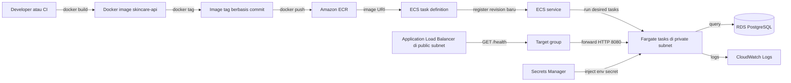
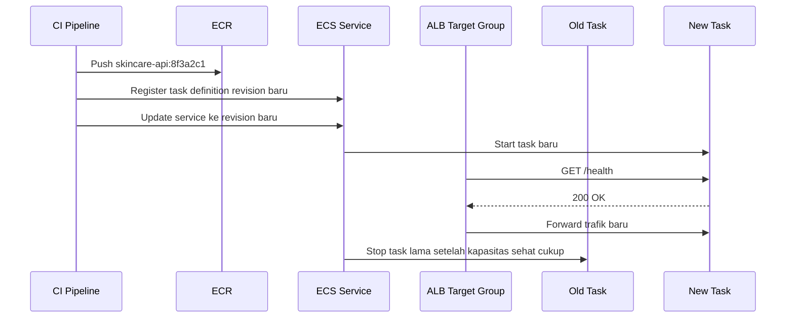

import { Section, Box, Steps, Step, Recap, CardGrid, Card, Chip, Hero, Compare, FileTree, Endpoint, Def } from "@components";

<Hero eyebrow="Roadmap 8 &middot; AWS Deployment" title="Deploy Go API ke <em>ECS Fargate</em><br />dari ECR sampai ALB">
  <p>Di modul ini, image Go API yang sudah kamu buat akan dipush ke ECR dan dijalankan sebagai service production di ECS Fargate.</p>
  <Fragment slot="meta">
    <Chip icon="code">Bahasa: <b>Go 1.26</b></Chip>
    <Chip icon="clock">~60 menit baca</Chip>
  </Fragment>
</Hero>

<Section num="01" id="intro" title="Dari Image Lokal ke Service Production" sub="ECS Fargate mengubah Docker image menjadi task yang berjalan di VPC AWS">

<p class="lead">Di Roadmap 8 sebelumnya, kamu sudah punya Docker image dan CI pipeline. Sekarang image itu harus hidup sebagai API production yang bisa menerima trafik.</p>

Kalau kamu terbiasa dengan React deploy ke Vercel atau Laravel deploy ke VPS, ECS terasa lebih banyak langkah karena ia memisahkan registry, runtime, network, load balancer, IAM, log, dan secret. Pemisahan ini terlihat lebih ramai, tetapi memberi kontrol yang penting untuk backend yang menyimpan data pelanggan, order, inventory, dan pembayaran.

<Box variant="bridge" icon="🌉" label="Jembatan: mirip GCP Cloud Run, tapi lebih eksplisit"><p>Cloud Run menyembunyikan banyak detail deploy container. ECS Fargate memberi kontrol lebih besar atas subnet, security group, target group, IAM role, jumlah task, dan strategi rolling update.</p></Box>

<Def term="ECS task"><p>Satu eksekusi dari task definition. Untuk API skincare, satu task biasanya berarti satu container Go API yang listen di port 8080.</p></Def>

<Def term="ECS service"><p>Controller yang menjaga jumlah task tetap berjalan, melakukan rolling deployment, dan menghubungkan task ke load balancer.</p></Def>

<Def term="Fargate"><p>Mode menjalankan container tanpa mengelola EC2 instance. Kamu memilih CPU, memory, network, dan image, lalu AWS menjalankan task.</p></Def>

Endpoint yang harus tersedia di aplikasi sebelum deploy adalah health check.

<Endpoint method="GET" path="/health" desc="Dipanggil ALB untuk menentukan apakah task Go API siap menerima trafik" />

```go title="internal/httpapi/health.go"
package httpapi

import (
	"encoding/json"
	"net/http"

	"github.com/go-chi/chi/v5"
)

type HealthResponse struct {
	Status string `json:"status"`
}

func RegisterHealthRoute(r chi.Router) {
	r.Get("/health", HealthHandler)
}

func HealthHandler(w http.ResponseWriter, r *http.Request) {
	w.Header().Set("Content-Type", "application/json")
	w.WriteHeader(http.StatusOK)

	_ = json.NewEncoder(w).Encode(HealthResponse{
		Status: "ok",
	})
}
```

<Box variant="tip" icon="💡" label="Kenapa health check harus ringan?"><p>Health check dipanggil berkala oleh ALB. Jangan jalankan query berat, jangan panggil payment gateway, dan jangan bergantung pada service eksternal yang tidak perlu untuk menerima trafik HTTP.</p></Box>

</Section>

<Section num="02" id="peta-deploy" title="Peta Deploy ECS Fargate" sub="Build di lokal atau CI, push ke ECR, register task definition, lalu update ECS service">

<p class="lead">ECS deployment bukan satu perintah ajaib. Ia adalah rangkaian perubahan kecil yang masing-masing bisa diaudit.</p>



<p class="fig-cap"><b>Gambar 1.</b> Jalur deploy Go API skincare dari image lokal atau CI sampai menerima trafik melalui ALB.</p>

<CardGrid cols={3}>
  <Card><h4>ECR</h4><p>Tempat menyimpan Docker image privat yang akan ditarik ECS saat task baru berjalan.</p></Card>
  <Card><h4>Task definition</h4><p>Blueprint JSON yang berisi image, port, CPU, memory, env, secrets, IAM role, dan log driver.</p></Card>
  <Card><h4>ECS service</h4><p>Menjaga jumlah task, mendaftarkan task ke target group, dan mengganti task lama saat deploy.</p></Card>
</CardGrid>

<FileTree title="File deployment yang relevan" tree={`
Dockerfile
task-definition.json   # blueprint ECS task
cmd/
  api/
    main.go            # entry point Go API
internal/
  httpapi/
    health.go          # handler GET /health
`} />

<Box variant="note" icon="📝" label="Rujukan resmi"><p>Dokumentasi Amazon ECS menyebut task definition sebagai blueprint aplikasi dalam format JSON, sedangkan dokumentasi ECR menjelaskan autentikasi Docker dengan `aws ecr get-login-password` sebelum push image ke private registry.</p></Box>

</Section>

<Section num="03" id="build-tag-push" title="Build, Tag, Login, dan Push ke ECR" sub="Image lokal belum bisa dipakai ECS sampai ia ada di registry yang bisa diakses task execution role">

<p class="lead">ECR adalah Docker registry privat milik AWS. ECS tidak menarik image dari laptop kamu, melainkan dari registry.</p>

<Compare aLabel="Node.js / Laravel deploy tradisional" bLabel="Go API di ECS Fargate" aTone="muted" bTone="violet">
  <Fragment slot="a"><ul><li>Kode sering dikirim ke server, lalu dependency di-install di server.</li><li>Runtime server ikut menjadi bagian dari proses deploy.</li></ul></Fragment>
  <Fragment slot="b"><ul><li>Artifact deploy adalah Docker image yang sudah berisi binary Go.</li><li>Server tidak dikelola langsung, ECS menjalankan task dari image yang sudah dipush.</li></ul></Fragment>
</Compare>

```bash title="Terminal"
export AWS_ACCOUNT_ID="123456789012"
export AWS_REGION="ap-southeast-1"
export ECR_REPO="skincare-api"
export IMAGE_TAG="$(git rev-parse --short HEAD)"
export ECR_REGISTRY="$AWS_ACCOUNT_ID.dkr.ecr.$AWS_REGION.amazonaws.com"
export ECR_URI="$ECR_REGISTRY/$ECR_REPO"

docker build -t skincare-api .
docker tag skincare-api:latest "$ECR_URI:$IMAGE_TAG"

aws ecr get-login-password --region "$AWS_REGION" \
  | docker login --username AWS --password-stdin "$ECR_REGISTRY"

docker push "$ECR_URI:$IMAGE_TAG"
```

<Box variant="tip" icon="💡" label="Tag image dengan commit, bukan latest"><p>`latest` mudah untuk demo, tetapi buruk untuk audit. Tag berbasis commit membuat kamu tahu persis kode mana yang sedang berjalan di ECS.</p></Box>

```bash title="Terminal"
aws ecr create-repository \
  --repository-name skincare-api \
  --image-scanning-configuration scanOnPush=true \
  --region "$AWS_REGION"
```

Docker memakai `-t` untuk memberi nama dan tag image saat build, lalu `docker push` mengunggah image ke registry setelah login. Di ECR private registry, login dilakukan dengan token dari AWS CLI dan username `AWS`.

</Section>

<Section num="04" id="task-definition" title="Task Definition sebagai Blueprint Container" sub="Di sinilah image, CPU, memory, port, env, secrets, IAM role, dan log dikunci menjadi satu revisi">

<p class="lead">Task definition adalah kontrak runtime. ECS service tidak menyimpan detail container langsung, ia menunjuk ke revisi task definition.</p>

<Def term="executionRoleArn"><p>Role yang dipakai ECS agent untuk menarik image dari ECR, membaca secrets yang diinjeksi ke container, dan mengirim log ke CloudWatch.</p></Def>

<Def term="taskRoleArn"><p>Role yang dipakai kode aplikasi di dalam container saat mengakses AWS service, misalnya S3 untuk gambar produk atau SQS untuk background job.</p></Def>

```json title="task-definition.json"
{
  "family": "skincare-api",
  "networkMode": "awsvpc",
  "requiresCompatibilities": ["FARGATE"],
  "cpu": "512",
  "memory": "1024",
  "executionRoleArn": "arn:aws:iam::123456789012:role/ecsTaskExecutionRole",
  "taskRoleArn": "arn:aws:iam::123456789012:role/skincareApiTaskRole",
  "runtimePlatform": {
    "operatingSystemFamily": "LINUX",
    "cpuArchitecture": "X86_64"
  },
  "containerDefinitions": [
    {
      "name": "skincare-api",
      "image": "123456789012.dkr.ecr.ap-southeast-1.amazonaws.com/skincare-api:8f3a2c1",
      "essential": true,
      "portMappings": [
        {
          "name": "http",
          "containerPort": 8080,
          "hostPort": 8080,
          "protocol": "tcp",
          "appProtocol": "http"
        }
      ],
      "environment": [
        {
          "name": "APP_ENV",
          "value": "production"
        },
        {
          "name": "HTTP_ADDR",
          "value": ":8080"
        },
        {
          "name": "AWS_REGION",
          "value": "ap-southeast-1"
        }
      ],
      "secrets": [
        {
          "name": "DATABASE_URL",
          "valueFrom": "arn:aws:secretsmanager:ap-southeast-1:123456789012:secret:skincare/prod/database-url-AbCdEf"
        },
        {
          "name": "JWT_SECRET",
          "valueFrom": "arn:aws:secretsmanager:ap-southeast-1:123456789012:secret:skincare/prod/jwt-secret-AbCdEf"
        },
        {
          "name": "PAYMENT_SERVER_KEY",
          "valueFrom": "arn:aws:secretsmanager:ap-southeast-1:123456789012:secret:skincare/prod/payment-server-key-AbCdEf"
        }
      ],
      "logConfiguration": {
        "logDriver": "awslogs",
        "options": {
          "awslogs-group": "/ecs/skincare-api",
          "awslogs-region": "ap-southeast-1",
          "awslogs-stream-prefix": "api"
        }
      },
      "readonlyRootFilesystem": true
    }
  ]
}
```

<Box variant="warn" icon="⚠️" label="Jangan simpan secret di environment biasa"><p>Nilai di `environment` terlihat di task definition. Untuk `DATABASE_URL`, `JWT_SECRET`, dan payment key, gunakan `secrets` dengan ARN dari Secrets Manager.</p></Box>

```bash title="Terminal"
aws ecs register-task-definition \
  --cli-input-json file://task-definition.json \
  --region "$AWS_REGION"
```

Task definition adalah revisi. Setiap kali image tag berubah, buat revisi baru, lalu arahkan ECS service ke revisi itu.

</Section>

<Section num="05" id="ecs-service-alb" title="ECS Service, ALB, dan Health Check" sub="Service menjaga task tetap hidup, ALB menyalurkan trafik hanya ke task sehat">

<p class="lead">Untuk API publik, ECS service biasanya berjalan di private subnet, sedangkan ALB berada di public subnet.</p>

Target group untuk Fargate dengan network mode `awsvpc` memakai target type `ip`, karena setiap task mendapat elastic network interface sendiri. ALB akan memanggil path health check, misalnya `GET /health`, lalu hanya mengirim trafik ke target yang sehat.

```bash title="Terminal"
aws elbv2 create-target-group \
  --name skincare-api-tg \
  --protocol HTTP \
  --port 8080 \
  --vpc-id vpc-0123456789abcdef0 \
  --target-type ip \
  --health-check-protocol HTTP \
  --health-check-path /health \
  --matcher HttpCode=200 \
  --region "$AWS_REGION"
```

```bash title="Terminal"
aws ecs create-service \
  --cluster skincare-prod \
  --service-name skincare-api \
  --task-definition skincare-api \
  --desired-count 2 \
  --launch-type FARGATE \
  --network-configuration "awsvpcConfiguration={subnets=[subnet-private-a,subnet-private-b],securityGroups=[sg-ecs-api],assignPublicIp=DISABLED}" \
  --load-balancers "targetGroupArn=arn:aws:elasticloadbalancing:ap-southeast-1:123456789012:targetgroup/skincare-api-tg/abc123,containerName=skincare-api,containerPort=8080" \
  --deployment-configuration "minimumHealthyPercent=100,maximumPercent=200" \
  --region "$AWS_REGION"
```

<CardGrid cols={2}>
  <Card><h4>desired-count</h4><p>Jumlah task yang harus dijaga ECS. Untuk production sederhana, mulai dari 2 agar rolling update punya ruang.</p></Card>
  <Card><h4>target group</h4><p>Daftar target sehat yang boleh menerima trafik dari listener ALB.</p></Card>
  <Card><h4>security group ALB</h4><p>Menerima HTTP atau HTTPS dari internet, lalu forward ke security group ECS.</p></Card>
  <Card><h4>security group ECS</h4><p>Hanya menerima port 8080 dari security group ALB, bukan dari seluruh internet.</p></Card>
</CardGrid>

<Box variant="tip" icon="💡" label="Private subnet untuk API"><p>Task API tidak perlu public IP. Internet masuk lewat ALB, lalu ALB meneruskan trafik ke private subnet.</p></Box>

</Section>

<Section num="06" id="secrets-env" title="Environment Variables dan Secrets Production" sub="Pisahkan konfigurasi biasa dari credential sensitif">

<p class="lead">Di Go, konfigurasi production biasanya dibaca dari environment variable. Bedanya, tidak semua environment variable boleh ditulis langsung di task definition.</p>

<Compare aLabel="Local development" bLabel="Production di ECS" aTone="muted" bTone="violet">
  <Fragment slot="a"><ul><li>`.env` nyaman untuk laptop dan docker compose.</li><li>Developer bisa melihat nilai env untuk debugging.</li></ul></Fragment>
  <Fragment slot="b"><ul><li>Secrets disimpan di Secrets Manager dan diinjeksi lewat `secrets`.</li><li>Task execution role harus punya permission membaca secret yang dipakai task.</li></ul></Fragment>
</Compare>

```json title="task-definition.json"
{
  "environment": [
    {
      "name": "APP_ENV",
      "value": "production"
    },
    {
      "name": "HTTP_ADDR",
      "value": ":8080"
    }
  ],
  "secrets": [
    {
      "name": "DATABASE_URL",
      "valueFrom": "arn:aws:secretsmanager:ap-southeast-1:123456789012:secret:skincare/prod/database-url-AbCdEf"
    }
  ]
}
```

<Box variant="warn" icon="⚠️" label="Secret bukan cuma password database"><p>JWT signing key, payment server key, API key email provider, dan credential integrasi juga masuk kategori secret.</p></Box>

```go title="internal/config/config.go"
package config

import (
	"errors"
	"os"
)

type Config struct {
	Env         string
	HTTPAddr    string
	DatabaseURL string
	JWTSecret   string
}

func Load() (Config, error) {
	cfg := Config{
		Env:         getenv("APP_ENV", "development"),
		HTTPAddr:    getenv("HTTP_ADDR", ":8080"),
		DatabaseURL: os.Getenv("DATABASE_URL"),
		JWTSecret:   os.Getenv("JWT_SECRET"),
	}

	if cfg.DatabaseURL == "" {
		return Config{}, errors.New("DATABASE_URL is required")
	}
	if cfg.JWTSecret == "" {
		return Config{}, errors.New("JWT_SECRET is required")
	}

	return cfg, nil
}

func getenv(key string, fallback string) string {
	value := os.Getenv(key)
	if value == "" {
		return fallback
	}
	return value
}
```

<Box variant="note" icon="📝" label="Kenapa tetap baca dari os.Getenv?"><p>Dari sisi aplikasi Go, env biasa dan secret yang diinjeksi ECS sama-sama muncul sebagai environment variable. Perbedaannya ada di cara nilai itu disimpan dan diberikan oleh AWS.</p></Box>

</Section>

<Section num="07" id="rolling-deployment" title="Rolling Deployment tanpa Downtime" sub="Register revisi baru, update service, lalu biarkan ECS mengganti task secara bertahap">

<p class="lead">Rolling deployment membuat task baru berjalan dulu, lulus health check, lalu task lama dihentikan.</p>



<p class="fig-cap"><b>Gambar 2.</b> Rolling deployment bergantung pada health check yang benar dan kapasitas minimal task yang sehat.</p>

```bash title="Terminal"
NEW_TASK_DEF_ARN=$(aws ecs register-task-definition \
  --cli-input-json file://task-definition.json \
  --query "taskDefinition.taskDefinitionArn" \
  --output text \
  --region "$AWS_REGION")

aws ecs update-service \
  --cluster skincare-prod \
  --service skincare-api \
  --task-definition "$NEW_TASK_DEF_ARN" \
  --region "$AWS_REGION"

aws ecs wait services-stable \
  --cluster skincare-prod \
  --services skincare-api \
  --region "$AWS_REGION"
```

`minimumHealthyPercent=100` berarti ECS menjaga minimal semua task lama tetap sehat selama deploy, berdasarkan desired count. `maximumPercent=200` memberi ruang agar ECS bisa menjalankan task baru di samping task lama saat rolling update.

<Box variant="warn" icon="⚠️" label="Hati-hati dengan tag mutable"><p>Kalau kamu tetap memakai tag `latest`, `update-service` belum tentu mengganti task sesuai image yang kamu kira. Lebih aman gunakan tag immutable berbasis commit dan register task definition baru.</p></Box>

```bash title="Terminal"
aws ecs update-service \
  --cluster skincare-prod \
  --service skincare-api \
  --force-new-deployment \
  --region "$AWS_REGION"
```

Perintah `--force-new-deployment` berguna saat kamu sengaja ingin ECS mengganti task dengan task definition yang sama, tetapi untuk audit production, revisi task definition baru tetap lebih jelas.

</Section>

<Section num="08" id="hands-on" title="Hands-on Deploy API Skincare" sub="Latihan minimal dari Docker image sampai service stabil">

<p class="lead">Latihan ini mengasumsikan VPC, private subnet, security group, ALB, target group, ECR repository, CloudWatch log group, dan Secrets Manager sudah dibuat dari modul sebelumnya.</p>

<Steps>
  <Step><b>Pastikan API punya health endpoint</b><p>Jalankan lokal, lalu cek `curl http://localhost:8080/health` dan pastikan mengembalikan HTTP 200.</p></Step>
  <Step><b>Build image dari root project</b><p>Gunakan `docker build -t skincare-api .` agar image memakai Dockerfile production dari Roadmap 8 Chapter 1.</p></Step>
  <Step><b>Tag image ke ECR URI</b><p>Gunakan tag commit seperti `8f3a2c1`, bukan hanya `latest`, agar deployment bisa dilacak.</p></Step>
  <Step><b>Login dan push ke ECR</b><p>Gunakan `aws ecr get-login-password` lalu `docker push` ke repository privat skincare-api.</p></Step>
  <Step><b>Update image di task-definition.json</b><p>Ganti field `image` dengan ECR URI dan tag commit terbaru.</p></Step>
  <Step><b>Register task definition baru</b><p>Jalankan `aws ecs register-task-definition` dan simpan ARN revisi baru.</p></Step>
  <Step><b>Update ECS service</b><p>Jalankan `aws ecs update-service` dengan task definition baru, lalu tunggu `services-stable`.</p></Step>
</Steps>

```bash title="Terminal"
curl -i http://localhost:8080/health

docker build -t skincare-api .
docker tag skincare-api:latest "$ECR_URI:$IMAGE_TAG"

aws ecr get-login-password --region "$AWS_REGION" \
  | docker login --username AWS --password-stdin "$ECR_REGISTRY"

docker push "$ECR_URI:$IMAGE_TAG"
```

```bash title="Terminal"
aws ecs describe-services \
  --cluster skincare-prod \
  --services skincare-api \
  --query "services[0].deployments" \
  --region "$AWS_REGION"
```

<Box variant="tip" icon="💡" label="Validasi setelah deploy"><p>Cek CloudWatch Logs, target group health, deployment status, dan response endpoint publik melalui ALB sebelum menganggap deploy sukses.</p></Box>

</Section>

<Section num="09" id="jebakan-umum" title="Jebakan Umum dari JS/PHP ke ECS" sub="Masalah deploy ECS biasanya bukan di Go, melainkan di network, IAM, image tag, dan health check">

<p class="lead">Go binary jarang menjadi sumber utama deploy gagal. Yang sering gagal adalah asumsi dari pola deploy lama yang tidak cocok dengan ECS.</p>

<CardGrid cols={2}>
  <Card><h4>Task tidak bisa pull image</h4><p>Periksa execution role, permission ECR, region image, dan URI repository. Satu typo region cukup membuat task stuck.</p></Card>
  <Card><h4>Health check gagal</h4><p>Pastikan `/health` mengembalikan 200 cepat, container listen di `0.0.0.0:8080`, dan target group mengarah ke port container yang benar.</p></Card>
  <Card><h4>Task di public subnet</h4><p>Untuk API production, pola yang lebih aman adalah ALB public, task private, database private.</p></Card>
  <Card><h4>Secret tertulis di JSON</h4><p>Jangan taruh password database atau JWT secret di `environment`. Pakai `secrets` dengan ARN Secrets Manager.</p></Card>
  <Card><h4>Tag latest membuat rollback kabur</h4><p>Tag immutable membuat revision dan rollback lebih jelas. `latest` mudah menipu saat debugging incident.</p></Card>
  <Card><h4>desired count cuma 1</h4><p>Rolling update lebih aman dengan minimal 2 task, karena satu task lama bisa tetap melayani saat task baru dipanaskan.</p></Card>
</CardGrid>

<Box variant="bridge" icon="🌉" label="Jembatan: dari Laravel queue worker ke ECS task"><p>Di Laravel, web dan queue worker sering hidup di proses berbeda. Di ECS, API dan worker skincare sebaiknya punya task definition dan service terpisah agar scaling dan permission lebih presisi.</p></Box>

<Box variant="warn" icon="⚠️" label="Jangan debug production dengan masuk ke server"><p>Fargate bukan VPS. Debug lewat logs, metrics, deployment events, task status, dan target health, bukan dengan SSH ke host.</p></Box>

</Section>

<Section num="10" id="ringkasan" title="Ringkasan & Poin Penting">

<p class="lead">Deploy ke ECS Fargate adalah proses mengubah Docker image menjadi service yang stabil, aman, terukur, dan bisa di-rollback.</p>

<Recap title="Yang Wajib Menempel">
  <ul>
    <li>`docker build -t skincare-api .` membuat image lokal, tetapi ECS baru bisa memakainya setelah image ditag dan dipush ke ECR.</li>
    <li>ECR login memakai `aws ecr get-login-password` lalu `docker login --username AWS --password-stdin` ke registry akun dan region yang benar.</li>
    <li>Task definition adalah blueprint revisi container. Untuk API skincare, ia berisi image, CPU, memory, port 8080, env, secrets, execution role, task role, dan log CloudWatch.</li>
    <li>ECS service menjaga desired count, menjalankan rolling update, dan mendaftarkan task ke ALB target group.</li>
    <li>ALB health check ke `GET /health` menentukan task mana yang boleh menerima trafik. Endpoint ini harus cepat, stabil, dan mengembalikan 200 saat aplikasi siap.</li>
    <li>Secrets production tidak ditulis di JSON sebagai plain env. Gunakan Secrets Manager lewat field `secrets` di container definition.</li>
    <li>Rolling deployment tanpa downtime butuh health check benar, desired count memadai, dan konfigurasi `minimumHealthyPercent` serta `maximumPercent` yang masuk akal.</li>
    <li>Untuk proyek online shop skincare, pola awal yang sehat adalah ALB public, ECS API private, RDS private, secret di Secrets Manager, logs di CloudWatch, dan image immutable di ECR.</li>
  </ul>
</Recap>

Langkah berikutnya di Roadmap 8 adalah menyambungkan deployment ini dengan resource production lain secara lebih lengkap, seperti RDS PostgreSQL, S3 untuk gambar produk, CloudWatch alarm, Secrets Manager rotation, dan deployment pipeline yang mempromosikan image dari staging ke production.

</Section>
