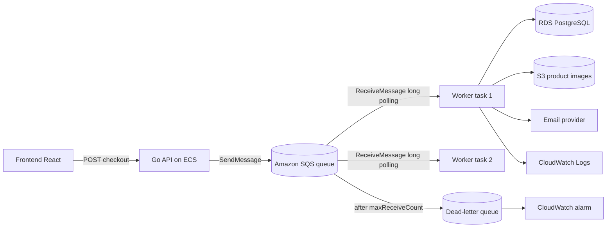
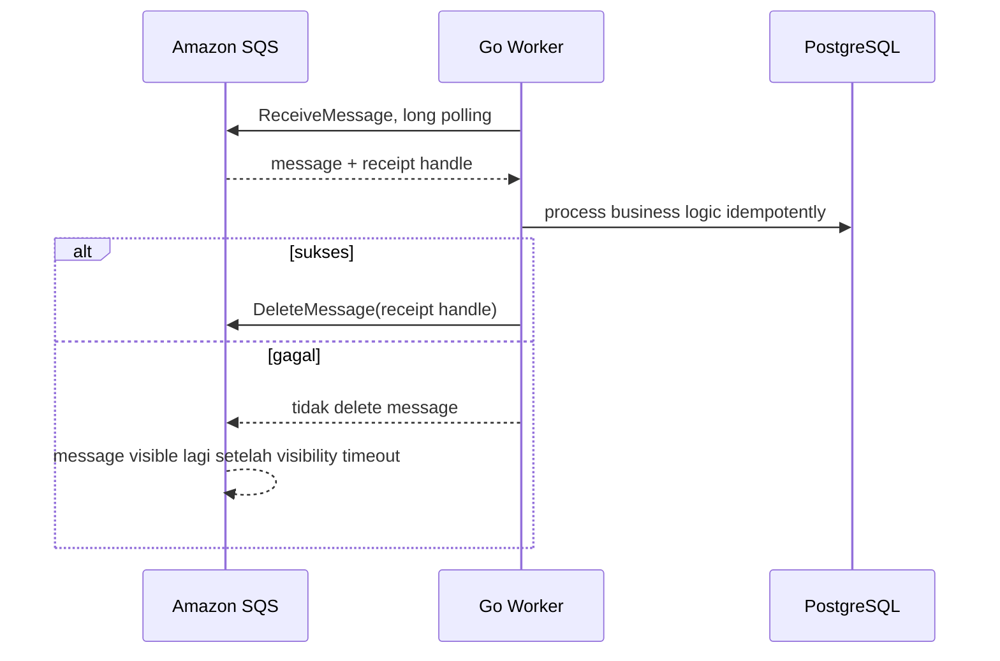

import { Section, Box, Steps, Step, Recap, CardGrid, Card, Chip, Hero, Compare, FileTree, Endpoint, Def } from "@components";

<Hero eyebrow="Roadmap 8 &middot; AWS Deployment" title="Deploy Worker <em>ECS</em><br />Consumer SQS yang Reliable">
  <p>Di modul ini kita memisahkan pekerjaan background dari API agar checkout, email, stok, dan integrasi downstream tidak memperlambat request user.</p>
  <Fragment slot="meta">
    <Chip icon="code">Bahasa: <b>Go 1.26</b></Chip>
    <Chip icon="clock">~60 menit baca</Chip>
  </Fragment>
</Hero>

<Section num="01" id="intro" title="Kenapa Worker Dipisah dari API?">

<p class="lead">Di aplikasi skincare, request checkout harus cepat, tetapi beberapa pekerjaan bisa jalan belakangan.</p>

Di React atau Laravel, kamu mungkin pernah melihat pola job queue: controller menerima request, menyimpan data utama, lalu melempar job ke queue untuk email, sinkronisasi inventory, atau integrasi payment. Di Go, konsepnya sama, tetapi proses worker biasanya berupa binary terpisah yang berjalan sendiri sebagai service.

<Def term="background worker"><p>Program yang membaca pekerjaan dari queue lalu menjalankan tugas tanpa menahan response HTTP user.</p></Def>

Worker dipisah dari API karena karakter bebannya berbeda. API butuh latency rendah dan port HTTP. Worker butuh retry, idempotency, throughput, dan observability. Menyatukannya dalam satu task ECS membuat scaling rancu: saat queue panjang, kamu terpaksa menaikkan jumlah API task padahal masalahnya ada di consumer queue.

<Compare aLabel="JS / Laravel" bLabel="Go di ECS" aTone="muted" bTone="violet">
  <Fragment slot="a"><ul><li>Laravel queue worker menjalankan job dari Redis, database, atau SQS.</li><li>Node.js worker sering berupa proses terpisah yang membaca queue.</li></ul></Fragment>
  <Fragment slot="b"><ul><li>Go worker adalah binary berbeda, misalnya `cmd/worker/main.go`.</li><li>ECS service worker punya task definition, autoscaling, log, dan alarm sendiri.</li></ul></Fragment>
</Compare>

<Box variant="bridge" icon="🌉" label="Jembatan: dari Laravel queue ke Go worker"><p>Laravel memberi banyak abstraksi job class, sedangkan Go biasanya lebih eksplisit: struct event, handler, loop SQS, delete message hanya setelah proses sukses.</p></Box>

</Section>

<Section num="02" id="arsitektur-worker" title="Arsitektur Worker di ECS">

<p class="lead">Worker berjalan sebagai ECS service terpisah, tanpa ALB, tanpa port publik, dan hanya butuh akses ke SQS serta downstream service.</p>

Pada modul sebelumnya API sudah berjalan di ECS Fargate. Sekarang kita tambahkan service baru bernama `skincare-worker`. Service ini memakai image yang sama atau image berbeda, tetapi command-nya menjalankan binary worker, bukan server HTTP.



<p class="fig-cap"><b>Gambar 1.</b> API hanya enqueue pekerjaan, worker mengambil pesan dari SQS lalu memanggil database dan layanan downstream.</p>

<CardGrid cols={3}>
  <Card><h4>API service</h4><p>Fokus pada HTTP request, validasi, transaksi utama, response cepat, dan health check ALB.</p></Card>
  <Card><h4>SQS queue</h4><p>Menjadi buffer agar spike checkout tidak langsung membanjiri worker atau layanan downstream.</p></Card>
  <Card><h4>Worker service</h4><p>Fokus pada proses async, retry, idempotency, log detail, dan scaling berdasarkan backlog.</p></Card>
</CardGrid>

<Box variant="note" icon="🧭" label="Catatan arsitektur"><p>Worker tidak membutuhkan target group ALB karena tidak menerima traffic HTTP dari internet.</p></Box>

</Section>

<Section num="03" id="kontrak-sqs" title="Kontrak SQS: Poll, Process, Delete">

<p class="lead">SQS consumer yang benar mengikuti kontrak sederhana: terima pesan, proses, hapus hanya setelah sukses.</p>

<Def term="visibility timeout"><p>Durasi saat pesan yang sudah diterima satu consumer disembunyikan dari consumer lain. Jika tidak dihapus sebelum timeout, pesan akan terlihat lagi dan bisa diproses ulang.</p></Def>

<Def term="dead-letter queue"><p>Queue khusus untuk pesan yang gagal diproses berkali-kali setelah melewati batas `maxReceiveCount`.</p></Def>

Alur minimal worker bukan `receive lalu delete lalu process`. Urutan itu berbahaya karena pesan hilang permanen jika proses gagal setelah delete. Urutan yang benar adalah `receive`, proses sampai selesai, baru `delete`.



<p class="fig-cap"><b>Gambar 2.</b> Delete message adalah commit acknowledgement dari worker ke SQS.</p>

<Box variant="warn" icon="⚠️" label="Jangan delete di awal"><p>Menghapus pesan sebelum proses sukses membuat data hilang tanpa jejak saat worker crash, database timeout, atau downstream service gagal.</p></Box>

</Section>

<Section num="04" id="enqueue-dari-api" title="API Mengirim Pekerjaan ke Queue">

<p class="lead">API tidak menjalankan pekerjaan berat, API hanya membuat event yang cukup kecil dan stabil untuk worker.</p>

Endpoint checkout tetap dimiliki API. Setelah order berhasil dibuat dalam transaksi database, API mengirim event ke SQS. Event tidak perlu berisi seluruh snapshot order, cukup ID dan metadata minimum. Worker akan membaca data terbaru dari database memakai `order_id`.

<Endpoint method="POST" path="/v1/checkout" desc="Buat order lalu enqueue pekerjaan async untuk email, inventory, dan downstream processing" />

```go title="internal/checkout/enqueue.go"
package checkout

import (
	"context"
	"encoding/json"
	"fmt"
	"time"

	"github.com/aws/aws-sdk-go-v2/aws"
	"github.com/aws/aws-sdk-go-v2/service/sqs"
)

type QueuePublisher interface {
	SendMessage(ctx context.Context, params *sqs.SendMessageInput, optFns ...func(*sqs.Options)) (*sqs.SendMessageOutput, error)
}

type OrderPlacedEvent struct {
	EventID   string    `json:"event_id"`
	EventType string    `json:"event_type"`
	OrderID   string    `json:"order_id"`
	UserID    string    `json:"user_id"`
	CreatedAt time.Time `json:"created_at"`
}

func EnqueueOrderPlaced(ctx context.Context, q QueuePublisher, queueURL string, event OrderPlacedEvent) error {
	body, err := json.Marshal(event)
	if err != nil {
		return fmt.Errorf("marshal order placed event: %w", err)
	}

	_, err = q.SendMessage(ctx, &sqs.SendMessageInput{
		QueueUrl:    aws.String(queueURL),
		MessageBody: aws.String(string(body)),
	})
	if err != nil {
		return fmt.Errorf("send order placed message: %w", err)
	}

	return nil
}
```

<Box variant="tip" icon="💡" label="Event kecil lebih tahan perubahan"><p>Simpan fakta penting di database, kirim referensi ke queue, lalu biarkan worker memuat ulang data saat memproses pesan.</p></Box>

</Section>

<Section num="05" id="consumer-loop-go" title="Consumer Loop di Go">

<p class="lead">Worker Go adalah loop panjang yang memakai context, long polling, dan error sebagai nilai.</p>

Struktur worker sebaiknya tetap testable. Jangan kunci kode langsung ke concrete AWS client. Terima interface kecil untuk operasi SQS yang dipakai, lalu inject handler domain. Ini mengikuti idiom Go: accept interface, return struct.

<FileTree title="Struktur worker" tree={`
cmd/
  worker/
    main.go                 # entry point worker ECS
internal/
  worker/
    sqs_worker.go           # receive, process, delete
  orders/
    async_handler.go        # proses event order placed
go.mod
`} />

```go title="internal/worker/sqs_worker.go"
package worker

import (
	"context"
	"encoding/json"
	"fmt"
	"log/slog"
	"time"

	"github.com/aws/aws-sdk-go-v2/aws"
	"github.com/aws/aws-sdk-go-v2/service/sqs"
	"github.com/aws/aws-sdk-go-v2/service/sqs/types"
)

type SQSClient interface {
	ReceiveMessage(ctx context.Context, params *sqs.ReceiveMessageInput, optFns ...func(*sqs.Options)) (*sqs.ReceiveMessageOutput, error)
	DeleteMessage(ctx context.Context, params *sqs.DeleteMessageInput, optFns ...func(*sqs.Options)) (*sqs.DeleteMessageOutput, error)
}

type Handler interface {
	Handle(ctx context.Context, msg Message) error
}

type Message struct {
	EventID   string          `json:"event_id"`
	EventType string          `json:"event_type"`
	OrderID   string          `json:"order_id"`
	UserID    string          `json:"user_id"`
	Raw       json.RawMessage `json:"-"`
}

type Worker struct {
	client            SQSClient
	queueURL          string
	handler           Handler
	logger            *slog.Logger
	maxMessages       int32
	waitTimeSeconds   int32
	visibilityTimeout int32
	processTimeout    time.Duration
	deleteTimeout     time.Duration
}

func New(client SQSClient, queueURL string, handler Handler, logger *slog.Logger) *Worker {
	return &Worker{
		client:            client,
		queueURL:          queueURL,
		handler:           handler,
		logger:            logger,
		maxMessages:       5,
		waitTimeSeconds:   20,
		visibilityTimeout: 120,
		processTimeout:    90 * time.Second,
		deleteTimeout:     10 * time.Second,
	}
}

func (w *Worker) Run(ctx context.Context) error {
	for {
		select {
		case <-ctx.Done():
			w.logger.Info("worker stopped accepting new messages")
			return nil
		default:
		}

		out, err := w.client.ReceiveMessage(ctx, &sqs.ReceiveMessageInput{
			QueueUrl:            aws.String(w.queueURL),
			MaxNumberOfMessages: w.maxMessages,
			WaitTimeSeconds:     w.waitTimeSeconds,
			VisibilityTimeout:   w.visibilityTimeout,
		})
		if err != nil {
			if ctx.Err() != nil {
				return nil
			}
			w.logger.Error("receive message failed", "error", err)
			continue
		}

		for _, sqsMsg := range out.Messages {
			w.handleOne(sqsMsg)
		}
	}
}

func (w *Worker) handleOne(sqsMsg types.Message) {
	msg, err := decodeMessage(aws.ToString(sqsMsg.Body))
	if err != nil {
		w.logger.Error("decode message failed", "error", err)
		return
	}

	processCtx, cancel := context.WithTimeout(context.Background(), w.processTimeout)
	defer cancel()

	if err := w.handler.Handle(processCtx, msg); err != nil {
		w.logger.Error("process message failed", "event_id", msg.EventID, "order_id", msg.OrderID, "error", err)
		return
	}

	deleteCtx, cancelDelete := context.WithTimeout(context.Background(), w.deleteTimeout)
	defer cancelDelete()

	_, err = w.client.DeleteMessage(deleteCtx, &sqs.DeleteMessageInput{
		QueueUrl:      aws.String(w.queueURL),
		ReceiptHandle: sqsMsg.ReceiptHandle,
	})
	if err != nil {
		w.logger.Error("delete message failed", "event_id", msg.EventID, "error", err)
		return
	}

	w.logger.Info("message processed", "event_id", msg.EventID, "order_id", msg.OrderID)
}

func decodeMessage(body string) (Message, error) {
	var msg Message
	if err := json.Unmarshal([]byte(body), &msg); err != nil {
		return Message{}, fmt.Errorf("decode worker message: %w", err)
	}
	msg.Raw = json.RawMessage([]byte(body))
	return msg, nil
}
```

```go title="cmd/worker/main.go"
package main

import (
	"context"
	"log/slog"
	"os"
	"os/signal"
	"syscall"

	"github.com/aws/aws-sdk-go-v2/config"
	"github.com/aws/aws-sdk-go-v2/service/sqs"

	"github.com/kamu/skincare-backend/internal/orders"
	"github.com/kamu/skincare-backend/internal/worker"
)

func main() {
	logger := slog.New(slog.NewJSONHandler(os.Stdout, nil))
	ctx, stop := signal.NotifyContext(context.Background(), syscall.SIGINT, syscall.SIGTERM)
	defer stop()

	queueURL := os.Getenv("ORDER_EVENTS_QUEUE_URL")
	if queueURL == "" {
		logger.Error("ORDER_EVENTS_QUEUE_URL is required")
		os.Exit(1)
	}

	cfg, err := config.LoadDefaultConfig(ctx)
	if err != nil {
		logger.Error("load aws config failed", "error", err)
		os.Exit(1)
	}

	sqsClient := sqs.NewFromConfig(cfg)
	handler := orders.NewAsyncHandler(logger)
	runner := worker.New(sqsClient, queueURL, handler, logger)

	if err := runner.Run(ctx); err != nil {
		logger.Error("worker stopped with error", "error", err)
		os.Exit(1)
	}

	logger.Info("worker shutdown complete")
}
```

<Box variant="note" icon="📌" label="Kenapa context.Background saat proses pesan?"><p>Saat SIGTERM datang, context utama dipakai untuk berhenti polling pesan baru, tetapi pesan yang sudah diambil tetap diberi kesempatan selesai dalam batas `processTimeout`.</p></Box>

</Section>

<Section num="06" id="retry-dlq" title="Retry dan Dead-Letter Queue">

<p class="lead">Retry di SQS terjadi otomatis ketika worker gagal menghapus pesan sebelum visibility timeout habis.</p>

Worker tidak perlu sleep dan mengirim ulang pesan sendiri untuk kasus gagal sementara. Jika handler mengembalikan error dan worker tidak memanggil `DeleteMessage`, SQS akan membuat pesan terlihat lagi setelah visibility timeout. Setelah gagal lebih dari `maxReceiveCount`, pesan dipindahkan ke DLQ oleh redrive policy.

```json title="infra/sqs-redrive-policy.json"
{
  "RedrivePolicy": "{\"deadLetterTargetArn\":\"arn:aws:sqs:ap-southeast-1:123456789012:skincare-order-events-dlq\",\"maxReceiveCount\":\"5\"}"
}
```

<CardGrid cols={3}>
  <Card><h4>Transient error</h4><p>Database timeout, rate limit email provider, atau network issue. Biarkan SQS retry.</p></Card>
  <Card><h4>Permanent error</h4><p>Payload tidak valid atau order tidak ada. Log detail, jangan infinite retry tanpa batas.</p></Card>
  <Card><h4>Poison message</h4><p>Pesan selalu gagal. DLQ membuatnya terisolasi agar queue utama tetap bergerak.</p></Card>
</CardGrid>

<Box variant="warn" icon="⚠️" label="Retry tidak menggantikan idempotency"><p>Karena SQS bisa mengirim pesan lebih dari sekali, handler wajib aman saat memproses event yang sama berulang.</p></Box>

```go title="internal/orders/async_handler.go"
package orders

import (
	"context"
	"errors"
	"fmt"
	"log/slog"

	"github.com/kamu/skincare-backend/internal/worker"
)

var ErrAlreadyProcessed = errors.New("event already processed")

type AsyncHandler struct {
	logger *slog.Logger
}

func NewAsyncHandler(logger *slog.Logger) *AsyncHandler {
	return &AsyncHandler{logger: logger}
}

func (h *AsyncHandler) Handle(ctx context.Context, msg worker.Message) error {
	if msg.EventType != "order.placed" {
		return fmt.Errorf("unsupported event type: %s", msg.EventType)
	}

	if err := h.markEventProcessing(ctx, msg.EventID); err != nil {
		if errors.Is(err, ErrAlreadyProcessed) {
			h.logger.Info("event already processed", "event_id", msg.EventID)
			return nil
		}
		return err
	}

	if err := h.sendOrderConfirmation(ctx, msg.OrderID, msg.UserID); err != nil {
		return fmt.Errorf("send order confirmation: %w", err)
	}

	return h.markEventProcessed(ctx, msg.EventID)
}

func (h *AsyncHandler) markEventProcessing(ctx context.Context, eventID string) error {
	return nil
}

func (h *AsyncHandler) sendOrderConfirmation(ctx context.Context, orderID string, userID string) error {
	return nil
}

func (h *AsyncHandler) markEventProcessed(ctx context.Context, eventID string) error {
	return nil
}
```

</Section>

<Section num="07" id="graceful-shutdown" title="Graceful Shutdown saat ECS Mengirim SIGTERM">

<p class="lead">ECS akan menghentikan container dengan sinyal terminasi, jadi worker harus berhenti mengambil pesan baru dan menyelesaikan pesan yang sedang diproses.</p>

Di API server, graceful shutdown biasanya berarti berhenti menerima HTTP request dan menunggu request aktif selesai. Di worker, artinya berhenti memanggil `ReceiveMessage`, lalu memberi waktu untuk pesan yang sudah diterima agar selesai dan dihapus dari SQS.

<Steps>
  <Step><b>Tangkap SIGTERM</b><p>`signal.NotifyContext` mengubah sinyal dari ECS menjadi pembatalan context utama.</p></Step>
  <Step><b>Stop polling</b><p>Loop worker keluar sebelum memanggil `ReceiveMessage` berikutnya.</p></Step>
  <Step><b>Selesaikan pesan aktif</b><p>Handler memakai context proses terpisah dengan timeout agar tidak langsung mati saat sinyal datang.</p></Step>
  <Step><b>Atur stop timeout ECS</b><p>`stopTimeout` di container perlu lebih besar dari durasi normal proses pesan.</p></Step>
</Steps>

<Box variant="tip" icon="💡" label="Patokan praktis"><p>Set `visibilityTimeout` lebih besar dari `processTimeout`, lalu set `stopTimeout` cukup untuk menyelesaikan pesan aktif sebelum Fargate membunuh container.</p></Box>

</Section>

<Section num="08" id="task-definition-service" title="Task Definition dan ECS Service Worker">

<p class="lead">Task definition worker mirip API, tetapi tanpa port mapping dan tanpa ALB.</p>

Satu image bisa memuat dua binary, `api` dan `worker`. Pada task definition worker, command diarahkan ke binary worker. Environment variable dan secret tetap diberikan lewat ECS task definition.

```json title="task-definition-worker.json"
{
  "family": "skincare-worker",
  "networkMode": "awsvpc",
  "requiresCompatibilities": ["FARGATE"],
  "cpu": "512",
  "memory": "1024",
  "executionRoleArn": "arn:aws:iam::123456789012:role/ecsTaskExecutionRole",
  "taskRoleArn": "arn:aws:iam::123456789012:role/skincare-worker-task-role",
  "containerDefinitions": [
    {
      "name": "worker",
      "image": "123456789012.dkr.ecr.ap-southeast-1.amazonaws.com/skincare-api:2026-06-06",
      "essential": true,
      "command": ["/app/worker"],
      "stopTimeout": 120,
      "environment": [
        { "name": "APP_ENV", "value": "production" },
        { "name": "AWS_REGION", "value": "ap-southeast-1" },
        { "name": "ORDER_EVENTS_QUEUE_URL", "value": "https://sqs.ap-southeast-1.amazonaws.com/123456789012/skincare-order-events" }
      ],
      "secrets": [
        {
          "name": "DB_URL",
          "valueFrom": "arn:aws:secretsmanager:ap-southeast-1:123456789012:secret:skincare/prod/db-url"
        }
      ],
      "logConfiguration": {
        "logDriver": "awslogs",
        "options": {
          "awslogs-group": "/ecs/skincare-worker",
          "awslogs-region": "ap-southeast-1",
          "awslogs-stream-prefix": "ecs"
        }
      }
    }
  ]
}
```

```bash title="Terminal"
aws ecs register-task-definition \
  --cli-input-json file://task-definition-worker.json

aws ecs create-service \
  --cluster skincare-prod \
  --service-name skincare-worker \
  --task-definition skincare-worker \
  --desired-count 1 \
  --launch-type FARGATE \
  --network-configuration "awsvpcConfiguration={subnets=[subnet-private-a,subnet-private-b],securityGroups=[sg-worker],assignPublicIp=DISABLED}"
```

<Box variant="warn" icon="⚠️" label="IAM task role harus sempit"><p>Worker hanya perlu permission seperti `sqs:ReceiveMessage`, `sqs:DeleteMessage`, `sqs:GetQueueAttributes`, dan akses secret yang benar-benar dipakai.</p></Box>

</Section>

<Section num="09" id="scaling-worker" title="Scaling Worker dari Panjang Queue">

<p class="lead">Worker diskalakan dari backlog, bukan dari CPU saja.</p>

Untuk worker SQS, CPU bisa rendah walau queue panjang karena bottleneck mungkin ada di database, email provider, atau rate limit downstream. Metrik yang lebih dekat ke masalah adalah jumlah pesan yang menunggu diproses. AWS menyebut `ApproximateNumberOfMessagesVisible` sebagai metrik penting untuk queue backlog, dan target tracking bisa memakai metric math untuk backlog per task.

```bash title="Terminal"
aws application-autoscaling register-scalable-target \
  --service-namespace ecs \
  --scalable-dimension ecs:service:DesiredCount \
  --resource-id service/skincare-prod/skincare-worker \
  --min-capacity 1 \
  --max-capacity 10
```

```json title="worker-scaling-policy.json"
{
  "TargetValue": 50,
  "ScaleOutCooldown": 60,
  "ScaleInCooldown": 300,
  "CustomizedMetricSpecification": {
    "Metrics": [
      {
        "Id": "m1",
        "MetricStat": {
          "Metric": {
            "Namespace": "AWS/SQS",
            "MetricName": "ApproximateNumberOfMessagesVisible",
            "Dimensions": [
              { "Name": "QueueName", "Value": "skincare-order-events" }
            ]
          },
          "Stat": "Sum"
        },
        "ReturnData": false
      },
      {
        "Id": "m2",
        "MetricStat": {
          "Metric": {
            "Namespace": "ECS/ContainerInsights",
            "MetricName": "RunningTaskCount",
            "Dimensions": [
              { "Name": "ClusterName", "Value": "skincare-prod" },
              { "Name": "ServiceName", "Value": "skincare-worker" }
            ]
          },
          "Stat": "Average"
        },
        "ReturnData": false
      },
      {
        "Id": "e1",
        "Expression": "m1 / MAX([m2, 1])",
        "Label": "backlog_per_task",
        "ReturnData": true
      }
    ]
  }
}
```

```bash title="Terminal"
aws application-autoscaling put-scaling-policy \
  --service-namespace ecs \
  --scalable-dimension ecs:service:DesiredCount \
  --resource-id service/skincare-prod/skincare-worker \
  --policy-name skincare-worker-backlog-per-task \
  --policy-type TargetTrackingScaling \
  --target-tracking-scaling-policy-configuration file://worker-scaling-policy.json
```

<Box variant="note" icon="📊" label="Container Insights"><p>Contoh metric math memakai `ECS/ContainerInsights` untuk `RunningTaskCount`. Jika belum aktif, gunakan custom metric sendiri atau aktifkan Container Insights pada cluster.</p></Box>

</Section>

<Section num="10" id="observability-alarm" title="Observability dan CloudWatch Alarm">

<p class="lead">Worker reliable bukan hanya bisa retry, tetapi juga memberi sinyal saat ada pesan gagal yang perlu tindakan manusia.</p>

Log worker harus JSON agar mudah dicari di CloudWatch Logs. Minimal sertakan `event_id`, `order_id`, `event_type`, dan error. Untuk alarm, DLQ tidak boleh diam-diam berisi pesan. Satu pesan di DLQ berarti ada data yang tidak selesai diproses.

```bash title="Terminal"
aws cloudwatch put-metric-alarm \
  --alarm-name skincare-worker-dlq-not-empty \
  --namespace AWS/SQS \
  --metric-name ApproximateNumberOfMessagesVisible \
  --dimensions Name=QueueName,Value=skincare-order-events-dlq \
  --statistic Sum \
  --period 60 \
  --evaluation-periods 1 \
  --threshold 0 \
  --comparison-operator GreaterThanThreshold \
  --alarm-description "DLQ worker skincare berisi pesan gagal" \
  --treat-missing-data notBreaching
```

<CardGrid cols={3}>
  <Card><h4>Logs</h4><p>Gunakan `slog` JSON dan korelasi `event_id` agar investigasi DLQ tidak menebak-nebak.</p></Card>
  <Card><h4>Metrics</h4><p>Pantau backlog queue, age of oldest message, jumlah task worker, dan error rate handler.</p></Card>
  <Card><h4>Alarm</h4><p>Alarm DLQ wajib karena pesan di DLQ biasanya berarti order, email, atau integrasi bisnis tidak selesai.</p></Card>
</CardGrid>

<Box variant="warn" icon="🚨" label="DLQ bukan tempat arsip"><p>DLQ adalah ruang isolasi kegagalan. Pesannya harus diinvestigasi, diperbaiki, lalu di-redrive atau diproses ulang dengan sengaja.</p></Box>

</Section>

<Section num="11" id="hands-on" title="Hands-on Deploy Worker">

<p class="lead">Kita deploy worker dengan alur yang sama seperti API, tetapi service ECS dan permission-nya dipisah.</p>

<Steps>
  <Step><b>Tambahkan dependency AWS SDK</b><p>Install package SQS dan config agar worker bisa memakai IAM role dari ECS task.</p></Step>
  <Step><b>Build image berisi dua binary</b><p>Docker image dapat membawa `/app/api` dan `/app/worker`, lalu task definition memilih command yang sesuai.</p></Step>
  <Step><b>Buat SQS dan DLQ</b><p>Atur redrive policy dengan `maxReceiveCount` realistis, misalnya 5 untuk pekerjaan yang aman diulang.</p></Step>
  <Step><b>Register task definition worker</b><p>Gunakan task role yang hanya boleh membaca queue utama, menghapus pesan, dan membaca secret yang diperlukan.</p></Step>
  <Step><b>Create ECS service worker</b><p>Jalankan di private subnet tanpa load balancer, mulai dari `desired-count` 1.</p></Step>
  <Step><b>Pasang autoscaling dan alarm</b><p>Scale dari backlog per task dan buat alarm saat DLQ memiliki pesan visible.</p></Step>
</Steps>

```bash title="Terminal"
go get github.com/aws/aws-sdk-go-v2/config github.com/aws/aws-sdk-go-v2/service/sqs
go test ./...

docker build -t skincare-api .
docker tag skincare-api:latest 123456789012.dkr.ecr.ap-southeast-1.amazonaws.com/skincare-api:2026-06-06
docker push 123456789012.dkr.ecr.ap-southeast-1.amazonaws.com/skincare-api:2026-06-06
```

<Box variant="tip" icon="✅" label="Validasi deploy"><p>Masukkan satu pesan test ke SQS, lihat log `message processed`, lalu pastikan pesan tidak muncul lagi di queue dan DLQ tetap kosong.</p></Box>

</Section>

<Section num="12" id="jebakan-umum" title="Jebakan Umum untuk Developer JS dan PHP">

<p class="lead">Sebagian bug worker bukan berasal dari Go, tetapi dari asumsi lama tentang queue dan proses background.</p>

<CardGrid cols={2}>
  <Card><h4>Menganggap SQS exactly once</h4><p>SQS standard queue bisa mengirim pesan lebih dari sekali. Buat handler idempotent memakai `event_id` atau natural key bisnis.</p></Card>
  <Card><h4>Delete message sebelum proses sukses</h4><p>Ini mirip menghapus job dari queue sebelum job selesai. Saat crash, pesan hilang dan order bisa menggantung.</p></Card>
  <Card><h4>Visibility timeout terlalu pendek</h4><p>Jika proses butuh 90 detik tetapi visibility timeout 30 detik, pesan bisa diproses paralel oleh task lain.</p></Card>
  <Card><h4>Worker digabung dengan API</h4><p>Satu container yang menjalankan server dan worker membuat scaling, shutdown, health check, dan incident response lebih rumit.</p></Card>
  <Card><h4>Tidak punya DLQ alarm</h4><p>DLQ tanpa alarm hanya memindahkan masalah ke tempat yang tidak terlihat.</p></Card>
  <Card><h4>Retry semua error selamanya</h4><p>Error permanen perlu ditandai dan diinvestigasi, bukan terus-menerus menghabiskan kapasitas worker.</p></Card>
</CardGrid>

<Box variant="bridge" icon="🌉" label="Jembatan: dari Horizon atau queue dashboard"><p>Jika di Laravel kamu biasa melihat failed jobs di dashboard, di AWS padanannya adalah DLQ, CloudWatch Logs, CloudWatch Metrics, dan alarm.</p></Box>

</Section>

<Section num="13" id="ringkasan" title="Ringkasan & Poin Penting">

<p class="lead">Worker ECS membuat backend skincare lebih tahan spike, lebih observable, dan lebih mudah diskalakan.</p>

<Recap title="Yang Wajib Menempel"><ul><li>Worker harus menjadi ECS service terpisah dari API, bukan proses tambahan di task API.</li><li>Pola SQS yang benar adalah `ReceiveMessage`, proses idempotent, lalu `DeleteMessage` hanya setelah sukses.</li><li>Retry otomatis terjadi ketika pesan tidak dihapus sebelum visibility timeout habis.</li><li>DLQ wajib dipasang dengan `maxReceiveCount`, lalu diberi CloudWatch alarm jika tidak kosong.</li><li>Graceful shutdown worker berarti berhenti polling pesan baru dan menyelesaikan pesan yang sudah terambil.</li><li>Scaling worker lebih masuk akal memakai backlog queue atau backlog per task, bukan CPU saja.</li><li>Task definition worker tidak butuh port mapping atau ALB, tetapi butuh IAM task role yang presisi.</li></ul></Recap>

Untuk proyek online shop skincare, pola ini dipakai untuk email order, sinkronisasi inventory, notifikasi pembayaran, indexing produk, dan integrasi downstream yang tidak boleh menahan response checkout. Setelah modul ini, kamu sudah punya pola deploy untuk proses async yang bisa berjalan stabil di ECS Fargate.

<Box variant="note" icon="🧭" label="Langkah berikutnya"><p>Di Roadmap 8 berikutnya, fondasi ini bisa diperluas ke migrasi database production, observability lebih dalam, dan strategi rollback saat deploy bermasalah.</p></Box>

</Section>
