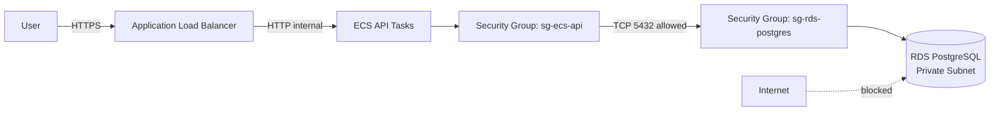
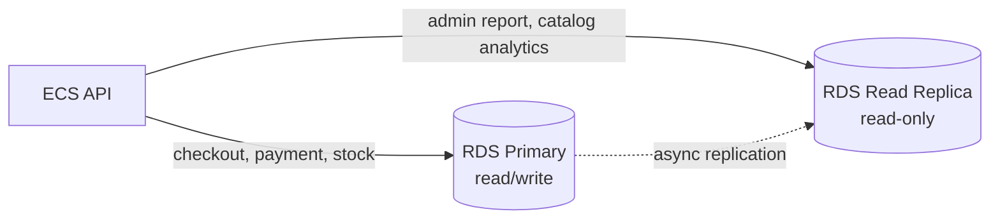

import { Section, Box, Steps, Step, Recap, CardGrid, Card, Chip, Hero, Compare, FileTree, Def } from "@components";

<Hero eyebrow="Roadmap 8 &middot; Docker, CI/CD, dan AWS" title="PostgreSQL di <em>AWS RDS</em><br />Database Production yang Aman">
  <p>Di modul ini kita memindahkan PostgreSQL skincare shop dari local Docker ke RDS yang private, dibackup, dan siap dipakai ECS.</p>
  <Fragment slot="meta">
    <Chip icon="database">Bahasa: <b>Go 1.26</b></Chip>
    <Chip icon="clock">~60 menit baca</Chip>
  </Fragment>
</Hero>

<Section num="01" id="intro" title="Kenapa Database Production Berbeda?">

<p class="lead">Di local development, database sering terasa seperti dependency biasa. Di production, database adalah state utama bisnis.</p>

Di React atau Node.js, kamu bisa mengganti container API berkali-kali karena stateless. Di Laravel, kamu mungkin terbiasa deploy app baru lalu menjalankan `php artisan migrate`. Untuk PostgreSQL production, pola pikirnya lebih hati-hati: data order, stok produk skincare, pembayaran, review, dan customer tidak boleh hilang hanya karena deploy gagal.

<Def term="Amazon RDS"><p>Amazon Relational Database Service adalah layanan database terkelola yang membantu provisioning, backup, patching, monitoring, dan operasi database relasional tanpa kamu mengurus server OS database secara langsung.</p></Def>

Modul ini tidak mengganti pemahaman SQL dari Roadmap 3. Modul ini membahas lapisan production: jaringan private, security group, backup, parameter, migration, connection pool, dan read replica.

<Box variant="bridge" icon="🌉" label="Jembatan: dari local docker compose ke RDS"><p>Di `docker compose`, API bisa konek ke service `postgres` lewat network lokal. Di AWS, koneksi itu dikontrol oleh VPC, subnet, route table, dan security group.</p></Box>

<CardGrid cols={3}>
  <Card><h4>State bisnis</h4><p>Order, payment, stok, dan customer disimpan di PostgreSQL. Kehilangan data lebih mahal daripada downtime API.</p></Card>
  <Card><h4>Permukaan serangan</h4><p>Database production tidak boleh terbuka ke internet. Hanya workload internal yang perlu koneksi.</p></Card>
  <Card><h4>Kapasitas koneksi</h4><p>Setiap ECS task membuka pool. Total pool yang tidak dihitung bisa membuat RDS kehabisan koneksi.</p></Card>
</CardGrid>

Diagram target kita sederhana: API di ECS dapat berbicara ke RDS, tetapi internet tidak bisa menyentuh RDS.



<p class="fig-cap"><b>Gambar 1.</b> RDS berada di private subnet, dan inbound port 5432 hanya menerima traffic dari security group ECS API.</p>

</Section>

<Section num="02" id="rds-managed" title="RDS PostgreSQL sebagai Managed Database">

<p class="lead">RDS PostgreSQL adalah PostgreSQL yang tetap terasa familiar, tetapi operasi infrastrukturnya dikelola AWS.</p>

RDS bukan ORM dan bukan database baru. Query `SELECT`, `INSERT`, transaksi, index, constraint, dan `pgx` tetap sama. Bedanya, kamu tidak SSH ke server untuk patch OS, mengatur disk manual, membuat snapshot cron sendiri, atau memasang service PostgreSQL dari paket Linux.

Menurut dokumentasi AWS, RDS mengotomasi tugas manajemen database seperti provisioning, konfigurasi, backup, dan patching. Baca rujukan resmi di [Amazon RDS](https://aws.amazon.com/rds/) dan [Amazon RDS for PostgreSQL](https://docs.aws.amazon.com/AmazonRDS/latest/UserGuide/CHAP_PostgreSQL.html).

<Compare aLabel="Laravel VPS / droplet" bLabel="Go API + RDS" aTone="muted" bTone="violet">
  <Fragment slot="a"><ul><li>PostgreSQL sering dipasang di server yang sama atau server VM terpisah.</li><li>Backup, patch OS, storage, dan monitoring sering perlu skrip sendiri.</li></ul></Fragment>
  <Fragment slot="b"><ul><li>PostgreSQL berjalan sebagai DB instance RDS di VPC.</li><li>API Go cukup konek lewat `DATABASE_URL`, lalu query dengan `pgxpool`.</li></ul></Fragment>
</Compare>

Untuk proyek skincare, RDS cocok karena beban utama kita adalah transaksi OLTP: customer checkout, stok dikurangi, payment event dicatat, order status berubah, dan admin melihat laporan operasional.

<Box variant="note" icon="📝" label="Catatan production"><p>Managed bukan berarti tanpa desain. Kamu tetap bertanggung jawab atas skema, index, query, transaction boundary, credential, akses jaringan, sizing koneksi, dan migration.</p></Box>

</Section>

<Section num="03" id="private-subnet" title="Private Subnet dan Security Group">

<p class="lead">Aturan dasar production: RDS PostgreSQL tidak punya public IP dan tidak menerima koneksi langsung dari laptop developer.</p>

AWS menjelaskan private DB instance sebagai DB yang hanya bisa diakses dari dalam VPC, tidak punya public IP, dan tidak bisa dijangkau dari internet. Public DB mungkin nyaman untuk demo, tetapi untuk backend skincare yang menyimpan data customer dan order, pilih private access.

Security group bekerja seperti firewall stateful. Untuk RDS, inbound rule idealnya bukan `0.0.0.0/0`, tetapi source security group dari ECS task.

<CardGrid cols={2}>
  <Card><h4>`sg-ecs-api`</h4><p>Dipasang ke ECS service API. Outbound boleh ke RDS pada port 5432.</p></Card>
  <Card><h4>`sg-rds-postgres`</h4><p>Dipasang ke RDS. Inbound TCP 5432 hanya dari `sg-ecs-api` dan opsional `sg-ecs-worker`.</p></Card>
</CardGrid>

```bash title="Terminal"
aws ec2 authorize-security-group-ingress \
  --group-id sg-rds-postgres \
  --protocol tcp \
  --port 5432 \
  --source-group sg-ecs-api
```

Kalau worker ECS juga perlu database untuk memproses order, tambahkan source security group worker. Jangan membuka CIDR internet hanya agar migration atau debugging mudah.

```bash title="Terminal"
aws ec2 authorize-security-group-ingress \
  --group-id sg-rds-postgres \
  --protocol tcp \
  --port 5432 \
  --source-group sg-ecs-worker
```

<Box variant="warn" icon="⚠️" label="Jebakan: RDS public untuk migration"><p>Jangan membuat RDS public hanya agar `migrate up` bisa dijalankan dari laptop. Jalankan migration dari CI runner yang punya akses VPC, ECS one-off task, bastion yang dikontrol, atau AWS Systems Manager.</p></Box>

</Section>

<Section num="04" id="backup-restore" title="Backup Otomatis dan Restore">

<p class="lead">Backup bukan dekorasi compliance. Backup adalah fitur bisnis ketika migration salah, admin salah update, atau aplikasi menulis data rusak.</p>

AWS mendukung automated backup retention untuk DB instance RDS. Untuk proyek ini, gunakan 7 sampai 30 hari sebagai baseline operasional. Secara layanan, RDS DB instance mendukung retention 0 sampai 35 hari, dan nilai 0 mematikan automated backup. Untuk Multi-AZ DB cluster, retention minimum 1 hari.

<Steps>
  <Step><b>Pilih retention</b><p>Mulai dari 7 hari untuk staging dan 14 sampai 30 hari untuk production, sesuai kebutuhan bisnis dan biaya.</p></Step>
  <Step><b>Latih restore</b><p>Backup yang belum pernah diuji restore adalah asumsi. Jadwalkan latihan restore ke environment isolasi.</p></Step>
  <Step><b>Catat RPO dan RTO</b><p>RPO menjawab berapa banyak data bisa hilang. RTO menjawab berapa lama sistem boleh tidak tersedia.</p></Step>
</Steps>

```bash title="Terminal"
aws rds modify-db-instance \
  --db-instance-identifier skincare-prod-postgres \
  --backup-retention-period 14 \
  --preferred-backup-window "18:00-19:00" \
  --apply-immediately
```

Untuk e-commerce kecil, snapshot manual tetap berguna sebelum perubahan besar, misalnya sebelum migration yang mengubah banyak data. Automated backup membantu point-in-time recovery, snapshot manual membantu checkpoint eksplisit.

```bash title="Terminal"
aws rds create-db-snapshot \
  --db-instance-identifier skincare-prod-postgres \
  --db-snapshot-identifier skincare-prod-before-voucher-migration-2026-06-06
```

<Box variant="tip" icon="💡" label="Praktik aman sebelum migration besar"><p>Buat snapshot manual, jalankan migration di staging dengan copy data yang representatif, lalu deploy migration production di window traffic rendah.</p></Box>

</Section>

<Section num="05" id="parameter-group" title="Parameter Group dan Batas Koneksi">

<p class="lead">Parameter group adalah tempat konfigurasi engine PostgreSQL di RDS, mirip `postgresql.conf` yang dikelola lewat AWS.</p>

RDS memakai default parameter group ketika kamu tidak membuat custom parameter group. Default cukup untuk mulai, tetapi production biasanya butuh custom parameter group agar perubahan eksplisit, bisa direview, dan bisa dilacak sebagai infrastruktur.

Dua parameter yang sering dibahas adalah `max_connections` dan `shared_buffers`. AWS memperingatkan agar berhati-hati saat mengubah dua parameter ini, karena nilai yang terlalu tinggi untuk workload dan memori instance bisa membuat DB instance gagal start.

<Def term="max_connections"><p>Jumlah maksimum koneksi simultan yang diterima PostgreSQL. Di RDS nilainya dipengaruhi instance class dan parameter group.</p></Def>

<Def term="shared_buffers"><p>Memori yang dialokasikan PostgreSQL untuk cache data. Nilai terlalu besar bisa mengurangi memori untuk proses lain.</p></Def>

```bash title="Terminal"
aws rds create-db-parameter-group \
  --db-parameter-group-name skincare-postgres-prod \
  --db-parameter-group-family postgres16 \
  --description "Custom PostgreSQL parameters for skincare production"
```

```bash title="Terminal"
aws rds modify-db-parameter-group \
  --db-parameter-group-name skincare-postgres-prod \
  --parameters "ParameterName=max_connections,ParameterValue=400,ApplyMethod=pending-reboot" \
               "ParameterName=shared_buffers,ParameterValue=256MB,ApplyMethod=pending-reboot"
```

Nilai di atas contoh, bukan resep universal. Untuk production, ukur beban, instance class, memory pressure, `DatabaseConnections`, `FreeableMemory`, dan latensi query sebelum menaikkan parameter.

```sql title="ops/check-rds-settings.sql"
SELECT name, setting, unit, boot_val, reset_val
FROM pg_settings
WHERE name IN ('max_connections', 'shared_buffers', 'work_mem', 'effective_cache_size')
ORDER BY name;
```

<Box variant="warn" icon="⚠️" label="Jebakan: menaikkan max_connections tanpa pool discipline"><p>`max_connections` yang besar bukan solusi performa otomatis. Terlalu banyak koneksi bisa membuat database lebih lambat karena context switching, memori, dan lock contention.</p></Box>

</Section>

<Section num="06" id="pool-sizing" title="Connection Pool Sizing untuk ECS">

<p class="lead">Di Go, `pgxpool` adalah pool per proses. Di ECS, setiap task punya pool sendiri.</p>

Kalau kamu menjalankan 6 task API dan setiap task punya pool 50 koneksi, API saja bisa membuka 300 koneksi. Tambahkan worker, migration, admin console, dan koneksi observability, lalu RDS bisa mencapai `too many connections`.

Rumus awal yang aman: `total ECS tasks × pool size + reserved connections` harus lebih kecil dari `max_connections` RDS. Sisakan cadangan untuk migration, psql darurat, monitoring, dan autovacuum.

<Compare aLabel="Node.js / Laravel" bLabel="Go + pgxpool" aTone="muted" bTone="violet">
  <Fragment slot="a"><ul><li>Pool sering disetel di ORM atau driver, misalnya Prisma, Knex, PDO, atau Laravel database config.</li><li>Developer kadang hanya melihat satu proses app di local.</li></ul></Fragment>
  <Fragment slot="b"><ul><li>`pgxpool` hidup di setiap proses ECS task.</li><li>Scaling horizontal API berarti jumlah pool ikut bertambah.</li></ul></Fragment>
</Compare>

Contoh sizing awal untuk skincare production kecil:

<table>
  <thead><tr><th>Komponen</th><th>Jumlah task</th><th>Pool per task</th><th>Total koneksi</th></tr></thead>
  <tbody><tr><td>API ECS</td><td>4</td><td>15</td><td>60</td></tr><tr><td>Worker ECS</td><td>2</td><td>10</td><td>20</td></tr><tr><td>Cadangan ops</td><td>1</td><td>20</td><td>20</td></tr><tr><td>Total awal</td><td></td><td></td><td>100</td></tr></tbody>
</table>

```go title="internal/platform/postgres/pool.go"
package postgres

import (
	"context"
	"fmt"
	"time"

	"github.com/jackc/pgx/v5/pgxpool"
)

type PoolConfig struct {
	DatabaseURL     string
	MaxConns        int32
	MinConns        int32
	MaxConnLifetime time.Duration
	MaxConnIdleTime time.Duration
}

func NewPool(ctx context.Context, cfg PoolConfig) (*pgxpool.Pool, error) {
	config, err := pgxpool.ParseConfig(cfg.DatabaseURL)
	if err != nil {
		return nil, fmt.Errorf("parse database url: %w", err)
	}

	config.MaxConns = cfg.MaxConns
	config.MinConns = cfg.MinConns
	config.MaxConnLifetime = cfg.MaxConnLifetime
	config.MaxConnIdleTime = cfg.MaxConnIdleTime

	pool, err := pgxpool.NewWithConfig(ctx, config)
	if err != nil {
		return nil, fmt.Errorf("create pgx pool: %w", err)
	}

	pingCtx, cancel := context.WithTimeout(ctx, 5*time.Second)
	defer cancel()

	if err := pool.Ping(pingCtx); err != nil {
		pool.Close()
		return nil, fmt.Errorf("ping postgres: %w", err)
	}

	return pool, nil
}
```

```go title="internal/config/config.go"
package config

import (
	"fmt"
	"os"
	"strconv"
	"time"
)

type Config struct {
	DatabaseURL          string
	DatabaseMaxConns     int32
	DatabaseMinConns     int32
	DatabaseMaxLifetime  time.Duration
	DatabaseMaxIdleTime  time.Duration
}

func Load() (Config, error) {
	maxConns, err := int32FromEnv("DATABASE_MAX_CONNS", 15)
	if err != nil {
		return Config{}, err
	}

	minConns, err := int32FromEnv("DATABASE_MIN_CONNS", 2)
	if err != nil {
		return Config{}, err
	}

	return Config{
		DatabaseURL:         os.Getenv("DATABASE_URL"),
		DatabaseMaxConns:    maxConns,
		DatabaseMinConns:    minConns,
		DatabaseMaxLifetime: 30 * time.Minute,
		DatabaseMaxIdleTime: 5 * time.Minute,
	}, nil
}

func int32FromEnv(key string, fallback int32) (int32, error) {
	value := os.Getenv(key)
	if value == "" {
		return fallback, nil
	}

	parsed, err := strconv.ParseInt(value, 10, 32)
	if err != nil {
		return 0, fmt.Errorf("parse %s: %w", key, err)
	}

	return int32(parsed), nil
}
```

<Box variant="tip" icon="💡" label="Best practice pool"><p>Mulai kecil, ukur, lalu naikkan. Untuk API CRUD biasa, pool 10 sampai 20 per task sering lebih sehat daripada pool besar tanpa batas.</p></Box>

</Section>

<Section num="07" id="migration-production" title="Migration Strategy di Production">

<p class="lead">Migration production harus berjalan satu kali, sebelum versi API yang membutuhkan skema baru menerima traffic.</p>

Di Laravel, `php artisan migrate` sering menjadi bagian deploy. Di Go, kita biasanya memakai tool eksplisit seperti `golang-migrate/migrate`, `tern`, atau migrator internal. Untuk jalur Go Artisan, contoh ini memakai `golang-migrate` karena sederhana, bisa CLI, dan mendukung PostgreSQL.

<FileTree title="Struktur migration proyek skincare" tree={`
db/
  migrations/
    202606060001_create_products.up.sql      # buat tabel product
    202606060001_create_products.down.sql    # rollback tabel product
    202606060002_create_orders.up.sql        # buat tabel order
    202606060002_create_orders.down.sql      # rollback tabel order
cmd/
  api/
    main.go                                  # entry point API
internal/
  platform/
    postgres/
      pool.go                                # pgxpool production
`} />

Migration production yang aman mengikuti urutan ini: build image, jalankan migration, baru update ECS service. Kalau migration gagal, service lama tetap berjalan dengan skema lama.

```bash title="scripts/deploy-api.sh"
set -euo pipefail

IMAGE_URI="${AWS_ACCOUNT_ID}.dkr.ecr.${AWS_REGION}.amazonaws.com/skincare-api:${GIT_SHA}"

aws ecr get-login-password --region "${AWS_REGION}" | \
  docker login --username AWS --password-stdin "${AWS_ACCOUNT_ID}.dkr.ecr.${AWS_REGION}.amazonaws.com"

docker build -t skincare-api .
docker tag skincare-api "${IMAGE_URI}"
docker push "${IMAGE_URI}"

migrate \
  -path db/migrations \
  -database "${DATABASE_URL}" \
  up

aws ecs update-service \
  --cluster skincare-prod \
  --service skincare-api \
  --force-new-deployment
```

Untuk RDS private, script di atas harus berjalan dari environment yang bisa mencapai VPC, bukan dari laptop publik. Pilihan yang umum: self-hosted GitHub Actions runner di VPC, CodeBuild di VPC, ECS one-off task, atau bastion administratif dengan akses ketat.

<Steps>
  <Step><b>Buat migration backward-compatible</b><p>Tambah kolom nullable dulu, deploy API yang menulis dua format bila perlu, baru buat constraint ketat di deploy berikutnya.</p></Step>
  <Step><b>Jalankan satu migrator</b><p>Jangan setiap API task menjalankan migration saat boot. Itu membuat startup lambat dan rawan race saat rolling deploy.</p></Step>
  <Step><b>Catat versi skema</b><p>Tool migration menyimpan versi skema di database. Jadikan output migration bagian dari log deploy.</p></Step>
</Steps>

```sql title="db/migrations/202606060003_add_products_slug.up.sql"
ALTER TABLE products
ADD COLUMN slug text;

CREATE UNIQUE INDEX CONCURRENTLY IF NOT EXISTS products_slug_unique_idx
ON products (slug)
WHERE slug IS NOT NULL;
```

```sql title="db/migrations/202606060003_add_products_slug.down.sql"
DROP INDEX CONCURRENTLY IF EXISTS products_slug_unique_idx;

ALTER TABLE products
DROP COLUMN IF EXISTS slug;
```

<Box variant="warn" icon="⚠️" label="Jebakan: migration destruktif langsung"><p>Jangan langsung `DROP COLUMN`, rename kolom besar, atau backfill jutaan row di jam ramai tanpa rencana lock, batch, dan rollback.</p></Box>

</Section>

<Section num="08" id="observability" title="Monitoring, Alarm, dan Operasional RDS">

<p class="lead">Database yang aman bukan hanya private dan punya backup. Kamu juga perlu tahu kapan ia mulai sakit.</p>

Untuk RDS PostgreSQL, monitor minimal `DatabaseConnections`, `CPUUtilization`, `FreeableMemory`, `FreeStorageSpace`, `ReadLatency`, `WriteLatency`, dan error aplikasi. Hubungkan alarm dengan Slack, email, PagerDuty, atau channel incident yang dipakai tim.

```bash title="Terminal"
aws cloudwatch put-metric-alarm \
  --alarm-name "skincare-prod-rds-high-connections" \
  --namespace AWS/RDS \
  --metric-name DatabaseConnections \
  --dimensions Name=DBInstanceIdentifier,Value=skincare-prod-postgres \
  --statistic Average \
  --period 60 \
  --evaluation-periods 5 \
  --threshold 320 \
  --comparison-operator GreaterThanThreshold \
  --alarm-actions "${SNS_TOPIC_ARN}"
```

```bash title="Terminal"
aws cloudwatch put-metric-alarm \
  --alarm-name "skincare-prod-rds-low-storage" \
  --namespace AWS/RDS \
  --metric-name FreeStorageSpace \
  --dimensions Name=DBInstanceIdentifier,Value=skincare-prod-postgres \
  --statistic Average \
  --period 300 \
  --evaluation-periods 2 \
  --threshold 10737418240 \
  --comparison-operator LessThanThreshold \
  --alarm-actions "${SNS_TOPIC_ARN}"
```

Di aplikasi Go, log error database harus cukup kontekstual tanpa membocorkan credential atau data sensitif. Jangan log `DATABASE_URL` penuh karena biasanya berisi username dan password.

```go title="internal/product/repository.go"
package product

import (
	"context"
	"errors"
	"fmt"

	"github.com/jackc/pgx/v5"
	"github.com/jackc/pgx/v5/pgxpool"
)

type Repository struct {
	pool *pgxpool.Pool
}

func NewRepository(pool *pgxpool.Pool) *Repository {
	return &Repository{pool: pool}
}

func (r *Repository) FindByID(ctx context.Context, id int64) (Product, error) {
	const query = `
		SELECT id, name, brand, price_cents
		FROM products
		WHERE id = $1 AND deleted_at IS NULL
	`

	var p Product
	err := r.pool.QueryRow(ctx, query, id).Scan(&p.ID, &p.Name, &p.Brand, &p.PriceCents)
	if errors.Is(err, pgx.ErrNoRows) {
		return Product{}, ErrProductNotFound
	}
	if err != nil {
		return Product{}, fmt.Errorf("find product by id: %w", err)
	}

	return p, nil
}
```

<Box variant="note" icon="📝" label="Operasional harian"><p>Alarm harus actionable. Alarm koneksi tinggi harus punya runbook: cek jumlah ECS task, cek pool size, cek slow query, cek worker stuck, lalu scale atau rollback.</p></Box>

</Section>

<Section num="09" id="read-replica" title="Read Replica untuk Query Berat">

<p class="lead">Read replica membantu memindahkan beban baca berat dari primary database, tetapi bukan pengganti index dan query yang benar.</p>

AWS mendefinisikan read replica sebagai salinan read-only dari DB instance. Aplikasi bisa mengarahkan query baca berat ke replica agar primary tetap fokus pada transaksi tulis. Replikasi read replica bersifat asynchronous, jadi data bisa tertinggal beberapa detik dari primary.

Untuk skincare shop, kandidat query ke read replica:

<ul><li>Dashboard admin yang menghitung penjualan harian.</li><li>Laporan produk terlaris per brand atau kategori.</li><li>Export order untuk finance.</li><li>Search analytics dan rekomendasi sederhana.</li></ul>

Jangan arahkan checkout, update stok, payment webhook, atau validasi voucher ke read replica. Semua operasi yang butuh konsistensi langsung harus membaca primary.



<p class="fig-cap"><b>Gambar 2.</b> Primary menerima transaksi penting, sedangkan read replica dipakai untuk query baca berat yang toleran terhadap replication lag.</p>

```go title="internal/platform/postgres/cluster.go"
package postgres

import "github.com/jackc/pgx/v5/pgxpool"

type Cluster struct {
	Primary *pgxpool.Pool
	Replica *pgxpool.Pool
}

func (c Cluster) Writer() *pgxpool.Pool {
	return c.Primary
}

func (c Cluster) Reader(preferReplica bool) *pgxpool.Pool {
	if preferReplica && c.Replica != nil {
		return c.Replica
	}
	return c.Primary
}
```

<Box variant="warn" icon="⚠️" label="Jebakan: stale read"><p>Setelah customer checkout, jangan membaca order terbaru dari replica untuk halaman sukses. Gunakan primary agar status dan order item langsung konsisten.</p></Box>

</Section>

<Section num="10" id="hands-on" title="Hands-on: Konfigurasi RDS untuk Skincare API">

<p class="lead">Bagian ini merangkai keputusan production menjadi konfigurasi minimal yang bisa kamu adaptasi ke staging dan production.</p>

Kita asumsikan VPC, private subnet, ECS service, dan Secrets Manager sudah disiapkan dari modul sebelumnya. Fokus kita adalah RDS, credential, security group, migration, dan koneksi Go.

<Steps>
  <Step><b>Buat subnet group</b><p>Subnet group memilih private subnet tempat RDS boleh membuat endpoint database.</p></Step>
  <Step><b>Buat security group RDS</b><p>Inbound 5432 hanya dari security group ECS API dan worker.</p></Step>
  <Step><b>Buat DB instance</b><p>Gunakan PostgreSQL, public access off, backup retention aktif, dan storage autoscaling sesuai kebutuhan.</p></Step>
  <Step><b>Simpan secret</b><p>Simpan `DATABASE_URL` atau komponen credential di Secrets Manager, lalu inject ke ECS task definition.</p></Step>
  <Step><b>Jalankan migration</b><p>Run migration dari environment yang punya akses VPC sebelum rolling deploy API baru.</p></Step>
</Steps>

```bash title="Terminal"
aws rds create-db-subnet-group \
  --db-subnet-group-name skincare-private-db-subnets \
  --db-subnet-group-description "Private subnets for skincare RDS" \
  --subnet-ids subnet-private-a subnet-private-b subnet-private-c
```

```bash title="Terminal"
aws rds create-db-instance \
  --db-instance-identifier skincare-prod-postgres \
  --engine postgres \
  --db-instance-class db.t4g.medium \
  --allocated-storage 50 \
  --max-allocated-storage 200 \
  --db-name skincare \
  --master-username skincare_admin \
  --manage-master-user-password \
  --db-subnet-group-name skincare-private-db-subnets \
  --vpc-security-group-ids sg-rds-postgres \
  --backup-retention-period 14 \
  --no-publicly-accessible
```

Contoh task definition API hanya perlu menerima secret, bukan menyimpan password di image Docker.

```json title="infra/ecs/task-definition-rds-env.json"
{
  "containerDefinitions": [
    {
      "name": "api",
      "image": "123456789012.dkr.ecr.ap-southeast-1.amazonaws.com/skincare-api:latest",
      "environment": [
        { "name": "DATABASE_MAX_CONNS", "value": "15" },
        { "name": "DATABASE_MIN_CONNS", "value": "2" }
      ],
      "secrets": [
        {
          "name": "DATABASE_URL",
          "valueFrom": "arn:aws:secretsmanager:ap-southeast-1:123456789012:secret:skincare/prod/database-url"
        }
      ]
    }
  ]
}
```

Setelah RDS aktif, tes koneksi dari dalam VPC. Jangan mengetes dari laptop jika RDS memang private.

```bash title="Terminal"
aws ecs run-task \
  --cluster skincare-prod \
  --launch-type FARGATE \
  --task-definition skincare-migrator \
  --network-configuration "awsvpcConfiguration={subnets=[subnet-private-a],securityGroups=[sg-ecs-migrator],assignPublicIp=DISABLED}"
```

<Box variant="tip" icon="💡" label="Checklist sebelum production"><p>Pastikan public access off, automated backup aktif, credential dari Secrets Manager, inbound RDS hanya dari security group aplikasi, migration sudah diuji di staging, dan alarm koneksi aktif.</p></Box>

</Section>

<Section num="11" id="jebakan" title="Jebakan Umum dari Local Postgres ke RDS">

<p class="lead">Sebagian besar masalah RDS bukan karena PostgreSQL berbeda, tetapi karena asumsi local terbawa ke production.</p>

<CardGrid cols={2}>
  <Card><h4>Membuka RDS ke internet</h4><p>Ini biasanya terjadi agar developer bisa pakai GUI dari laptop. Gunakan tunnel yang dikontrol, bastion, atau Systems Manager, bukan public DB.</p></Card>
  <Card><h4>Migration saat boot API</h4><p>Rolling deploy bisa menjalankan banyak task bersamaan. Migration harus satu kali, bukan side effect startup semua task.</p></Card>
  <Card><h4>Pool terlalu besar</h4><p>Pool yang aman di satu proses local bisa berbahaya saat ECS scale out ke banyak task.</p></Card>
  <Card><h4>Backup tidak pernah diuji</h4><p>Retention aktif belum cukup. Latihan restore membuktikan backup bisa dipakai ketika incident.</p></Card>
  <Card><h4>Read replica untuk transaksi</h4><p>Replica bisa lag. Jangan pakai untuk checkout, payment webhook, atau validasi stok.</p></Card>
  <Card><h4>Parameter asal naik</h4><p>`max_connections` dan `shared_buffers` harus disesuaikan dengan workload dan memori, bukan dinaikkan karena error koneksi muncul.</p></Card>
</CardGrid>

<Box variant="bridge" icon="🌉" label="Jembatan: dari Laravel env ke ECS secrets"><p>Di Laravel, `.env` production sering ada di server. Di ECS, image tidak membawa `.env`; secret diberikan saat task berjalan lewat Secrets Manager dan IAM role.</p></Box>

Untuk proyek skincare, keputusan aman lebih penting daripada konfigurasi mewah. Mulai dari RDS private, backup aktif, migration disiplin, pool kecil, dan alarm dasar. Setelah traffic tumbuh, baru tambah read replica, tuning parameter, dan query optimization lebih dalam.

</Section>

<Section num="12" id="ringkasan" title="Ringkasan & Poin Penting">

<p class="lead">RDS membuat PostgreSQL production lebih mudah dioperasikan, tetapi desain keamanan dan disiplin deploy tetap tanggung jawab tim backend.</p>

<Recap title="Yang Wajib Menempel">
  <ul><li>RDS PostgreSQL adalah managed database. AWS membantu provisioning, backup, patching, dan operasi infrastruktur, tetapi skema, query, credential, dan akses tetap tanggung jawab aplikasi.</li><li>RDS production untuk skincare shop harus berada di private subnet, tanpa public IP, dan inbound 5432 hanya dari security group ECS API, worker, atau migrator.</li><li>Gunakan automated backup dengan retention realistis, misalnya 14 hari untuk production awal, lalu uji restore secara berkala.</li><li>Parameter group memberi kontrol atas konfigurasi PostgreSQL. Ubah `max_connections` dan `shared_buffers` dengan hati-hati, ukur dampaknya, dan siapkan reboot bila parameter static berubah.</li><li>Connection pool dihitung lintas ECS task. Total task dikali pool per task harus menyisakan ruang untuk migration, admin, dan operasi darurat.</li><li>Migration production dijalankan satu kali sebelum deployment API baru, dari environment yang punya akses VPC. Jangan menjalankan migration otomatis dari setiap API task.</li><li>Read replica cocok untuk laporan dan query baca berat yang toleran terhadap lag, bukan untuk checkout, payment, stok, atau flow yang harus konsisten langsung.</li></ul>
</Recap>

Setelah modul ini, backend skincare sudah punya database production yang lebih aman dan reliable. Langkah berikutnya di Roadmap 8 adalah menyimpan gambar produk di S3 dan menghubungkannya dengan API upload yang aman.

</Section>
