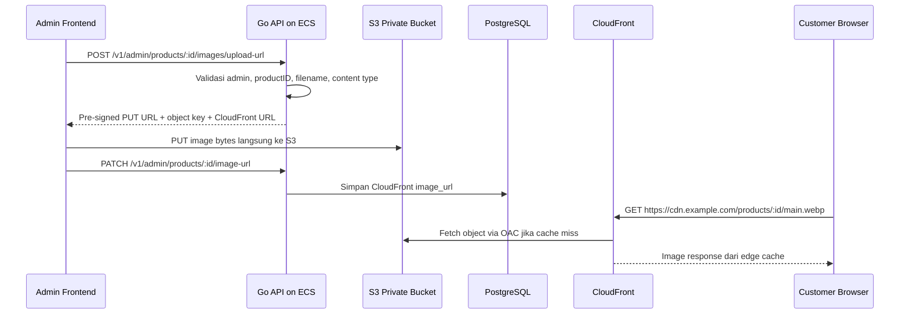

import { Section, Box, Steps, Step, Recap, CardGrid, Card, Chip, Hero, Compare, FileTree, Endpoint, Def } from "@components";

<Hero eyebrow="Roadmap 8 &middot; AWS Deployment" title="S3 dan CloudFront untuk<br /><em>Gambar Produk</em>">
  <p>Di modul ini kita memindahkan file gambar dari API dan database ke object storage yang lebih cocok untuk production.</p>
  <Fragment slot="meta">
    <Chip icon="code">Bahasa: <b>Go 1.26</b></Chip>
    <Chip icon="clock">~60 menit baca</Chip>
  </Fragment>
</Hero>

<Section num="01" id="intro" title="Kenapa Gambar Tidak Masuk Database?">

<p class="lead">Di React, upload gambar terasa seperti mengirim `File` dari form. Di backend production, keputusan pentingnya adalah ke mana byte gambar itu pergi.</p>

Pada aplikasi online shop skincare, gambar produk bisa jauh lebih besar daripada metadata produk. Database PostgreSQL bagus untuk data relasional seperti nama produk, harga, stok, dan status. File gambar lebih cocok disimpan di object storage seperti [Amazon S3](https://docs.aws.amazon.com/AmazonS3/latest/userguide/Welcome.html), lalu disajikan lewat CDN seperti [Amazon CloudFront](https://docs.aws.amazon.com/AmazonCloudFront/latest/DeveloperGuide/Introduction.html).

<Def term="object storage"><p>Object storage menyimpan file sebagai object di dalam bucket, dengan key unik seperti `products/123/main.webp`, metadata, dan permission terpisah dari database aplikasi.</p></Def>

<Compare aLabel="JS / Laravel: upload lewat server" bLabel="Go production: upload langsung ke S3" aTone="muted" bTone="violet">
  <Fragment slot="a"><ul><li>Frontend mengirim file ke API, API membaca file, lalu API menyimpan file.</li><li>Model ini sederhana, mirip form upload biasa di Laravel.</li></ul></Fragment>
  <Fragment slot="b"><ul><li>API hanya membuat pre-signed URL, lalu browser mengirim file langsung ke S3.</li><li>API tidak perlu buffer file besar dan tidak menjadi bottleneck bandwidth.</li></ul></Fragment>
</Compare>

<Box variant="bridge" icon="🌉" label="Jembatan: dari Laravel Storage ke S3 langsung"><p>Di Laravel kamu mungkin memanggil `Storage::put()` dari controller. Di desain ini, controller Go tidak menyimpan file, ia hanya memberi izin sementara agar client bisa upload ke S3.</p></Box>

Pola ini membuat API lebih ringan. Go API tetap bertanggung jawab atas validasi bisnis, siapa yang boleh upload gambar, product ID mana yang valid, dan object key apa yang boleh dipakai. S3 bertanggung jawab menyimpan byte file. CloudFront bertanggung jawab menyajikan gambar dengan latency rendah.

</Section>

<Section num="02" id="alur-upload-dan-serve" title="Alur Upload dan Serve Gambar">

<p class="lead">Ada dua alur berbeda, alur upload untuk admin, dan alur baca gambar untuk customer.</p>



<p class="fig-cap"><b>Gambar 1.</b> API hanya mengatur izin dan metadata, sedangkan byte gambar bergerak langsung dari browser ke S3.</p>

<CardGrid cols={3}>
  <Card><h4>API tetap kecil</h4><p>Request upload besar tidak melewati container API, jadi CPU dan memory ECS lebih stabil.</p></Card>
  <Card><h4>Bucket tetap private</h4><p>Object S3 tidak dibuka publik, customer membaca gambar lewat CloudFront.</p></Card>
  <Card><h4>URL stabil</h4><p>Database menyimpan URL CDN, bukan URL S3 internal yang bisa berubah pola aksesnya.</p></Card>
</CardGrid>

<Endpoint method="POST" path="/v1/admin/products/:productID/images/upload-url" desc="Generate pre-signed upload URL untuk admin" />
<Endpoint method="PATCH" path="/v1/admin/products/:productID/image-url" desc="Simpan URL CloudFront setelah upload sukses" />
<Endpoint method="GET" path="/v1/products" desc="Customer menerima `image_url` dari CDN di response produk" />

</Section>

<Section num="03" id="s3-private-bucket" title="S3 Private Bucket dan Object Key">

<p class="lead">Bucket produk harus private. Akses baca publik langsung ke S3 jangan dibuka hanya karena gambar perlu tampil di website.</p>

S3 memakai konsep bucket dan object key. Object key adalah identifier unik di dalam bucket. Untuk proyek skincare, convention yang mudah di-debug adalah `products/product-id/filename`, misalnya `products/2f2c7b2a/main.webp`.

<Box variant="tip" icon="💡" label="Convention object key"><p>Pakai prefix `products/`, product ID yang valid dari database, dan filename yang sudah dibersihkan. Jangan memakai nama file mentah dari user tanpa sanitasi.</p></Box>

```text title="Object key convention"
products/{productID}/main.webp
products/{productID}/gallery-01.webp
products/{productID}/gallery-02.webp
```

Kita tidak membuat bucket publik. S3 Block Public Access tetap aktif. CloudFront diberi izin membaca object lewat Origin Access Control, sehingga user hanya bisa mengakses gambar melalui domain CDN.

<table>
  <thead><tr><th>Keputusan</th><th>Alasan</th></tr></thead>
  <tbody><tr><td>Bucket private</td><td>Mencegah akses langsung ke origin dan menjaga kontrol di CloudFront.</td></tr><tr><td>Prefix `products/`</td><td>Mudah diberi IAM policy terbatas dan mudah dianalisis di S3 Inventory.</td></tr><tr><td>Filename disanitasi</td><td>Mencegah path traversal, karakter aneh, dan object key yang sulit dicache.</td></tr><tr><td>Ekstensi whitelist</td><td>Membatasi upload ke format gambar yang memang didukung frontend.</td></tr></tbody>
</table>

<Box variant="warn" icon="⚠️" label="Jangan percaya filename dari browser"><p>Nama file seperti `../../secret.png` harus berubah menjadi nama aman atau ditolak. Object key adalah bagian dari boundary keamanan.</p></Box>

</Section>

<Section num="04" id="presigned-upload-url" title="Pre-signed Upload URL dari Go API">

<p class="lead">Pre-signed URL adalah URL sementara yang membawa izin terbatas untuk melakukan operasi tertentu ke S3.</p>

API membuat URL untuk `PutObject` ke key tertentu, dengan masa berlaku pendek, misalnya 5 menit. Frontend kemudian melakukan `PUT` langsung ke URL itu dengan header `Content-Type` yang sama seperti saat URL dibuat.

<Box variant="note" icon="📝" label="Definisi singkat"><p>Pre-signed URL bukan public permission permanen. Ia adalah izin sementara yang ditandatangani oleh credential IAM milik API.</p></Box>

```go title="internal/productimage/signer.go"
package productimage

import (
	"context"
	"errors"
	"fmt"
	"mime"
	"path"
	"strings"
	"time"
	"unicode"

	"github.com/aws/aws-sdk-go-v2/aws"
	"github.com/aws/aws-sdk-go-v2/service/s3"
)

var ErrInvalidImage = errors.New("invalid product image")

type Signer struct {
	bucket            string
	cloudFrontBaseURL string
	presigner         *s3.PresignClient
}

func NewSigner(cfg aws.Config, bucket string, cloudFrontBaseURL string) *Signer {
	client := s3.NewFromConfig(cfg)

	return &Signer{
		bucket:            bucket,
		cloudFrontBaseURL: strings.TrimRight(cloudFrontBaseURL, "/"),
		presigner:         s3.NewPresignClient(client),
	}
}

type CreateUploadURLInput struct {
	ProductID   string
	Filename    string
	ContentType string
}

type UploadURL struct {
	Method    string            `json:"method"`
	UploadURL string            `json:"upload_url"`
	Headers   map[string]string `json:"headers"`
	ObjectKey string            `json:"object_key"`
	ImageURL  string            `json:"image_url"`
	ExpiresIn int               `json:"expires_in"`
}

func (s *Signer) CreateUploadURL(ctx context.Context, in CreateUploadURLInput) (UploadURL, error) {
	productID, err := safeSegment(in.ProductID)
	if err != nil {
		return UploadURL{}, err
	}

	filename, err := safeFilename(in.Filename)
	if err != nil {
		return UploadURL{}, err
	}

	if !allowedImageContentType(in.ContentType) {
		return UploadURL{}, ErrInvalidImage
	}

	objectKey := fmt.Sprintf("products/%s/%s", productID, filename)
	expires := 5 * time.Minute

	request, err := s.presigner.PresignPutObject(ctx, &s3.PutObjectInput{
		Bucket:      aws.String(s.bucket),
		Key:         aws.String(objectKey),
		ContentType: aws.String(in.ContentType),
	}, s3.WithPresignExpires(expires))
	if err != nil {
		return UploadURL{}, fmt.Errorf("presign put object: %w", err)
	}

	return UploadURL{
		Method:    "PUT",
		UploadURL: request.URL,
		Headers: map[string]string{
			"Content-Type": in.ContentType,
		},
		ObjectKey: objectKey,
		ImageURL:  s.cloudFrontBaseURL + "/" + objectKey,
		ExpiresIn: int(expires.Seconds()),
	}, nil
}

func safeSegment(value string) (string, error) {
	value = strings.TrimSpace(value)
	if value == "" || strings.ContainsAny(value, `/\`) {
		return "", ErrInvalidImage
	}
	return value, nil
}

func safeFilename(filename string) (string, error) {
	filename = strings.ReplaceAll(filename, `\`, "/")
	base := path.Base(filename)
	if base == "." || base == "/" || base == "" {
		return "", ErrInvalidImage
	}

	ext := strings.ToLower(path.Ext(base))
	if ext != ".jpg" && ext != ".jpeg" && ext != ".png" && ext != ".webp" {
		return "", ErrInvalidImage
	}

	stem := strings.TrimSuffix(base, path.Ext(base))
	var b strings.Builder
	for _, r := range stem {
		switch {
		case unicode.IsLetter(r) || unicode.IsDigit(r):
			b.WriteRune(unicode.ToLower(r))
		case r == '-' || r == '_':
			b.WriteRune(r)
		case unicode.IsSpace(r):
			b.WriteByte('-')
		}
	}

	if b.Len() == 0 {
		return "", ErrInvalidImage
	}

	return b.String() + ext, nil
}

func allowedImageContentType(contentType string) bool {
	mediaType, _, err := mime.ParseMediaType(contentType)
	if err != nil {
		return false
	}

	switch mediaType {
	case "image/jpeg", "image/png", "image/webp":
		return true
	default:
		return false
	}
}
```

Kode di atas menjaga tiga hal. Pertama, product ID tidak boleh menjadi path bebas. Kedua, filename dibersihkan agar object key konsisten. Ketiga, content type dibatasi agar endpoint ini tidak menjadi pintu upload file arbitrer.

<Box variant="warn" icon="⚠️" label="Pre-signed URL bisa overwrite object"><p>Kalau key yang sama dipakai lagi sebelum URL kedaluwarsa, upload baru dapat mengganti object lama. Gunakan filename unik bila overwrite tidak diinginkan.</p></Box>

```go title="internal/productimage/handler.go"
package productimage

import (
	"encoding/json"
	"errors"
	"net/http"

	"github.com/go-chi/chi/v5"
)

type PresignHandler struct {
	signer *Signer
}

func NewPresignHandler(signer *Signer) *PresignHandler {
	return &PresignHandler{signer: signer}
}

func (h *PresignHandler) Create(w http.ResponseWriter, r *http.Request) {
	var req struct {
		Filename    string `json:"filename"`
		ContentType string `json:"content_type"`
	}

	if err := json.NewDecoder(r.Body).Decode(&req); err != nil {
		http.Error(w, "invalid json body", http.StatusBadRequest)
		return
	}

	productID := chi.URLParam(r, "productID")
	result, err := h.signer.CreateUploadURL(r.Context(), CreateUploadURLInput{
		ProductID:   productID,
		Filename:    req.Filename,
		ContentType: req.ContentType,
	})
	if err != nil {
		status := http.StatusInternalServerError
		if errors.Is(err, ErrInvalidImage) {
			status = http.StatusBadRequest
		}
		http.Error(w, http.StatusText(status), status)
		return
	}

	w.Header().Set("Content-Type", "application/json")
	w.WriteHeader(http.StatusCreated)
	_ = json.NewEncoder(w).Encode(result)
}
```

```bash title="Terminal"
curl -X POST http://localhost:8080/v1/admin/products/2f2c7b2a/images/upload-url \
  -H 'Authorization: Bearer ADMIN_ACCESS_TOKEN' \
  -H 'Content-Type: application/json' \
  -d '{"filename":"Wardah Brightening Toner.webp","content_type":"image/webp"}'
```

```bash title="Terminal"
curl -X PUT 'https://bucket.s3.ap-southeast-1.amazonaws.com/products/2f2c7b2a/wardah-brightening-toner.webp?...' \
  -H 'Content-Type: image/webp' \
  --data-binary '@wardah-brightening-toner.webp'
```

<Box variant="tip" icon="💡" label="Kenapa API tidak menerima file?"><p>Karena tugas API adalah otorisasi dan metadata. Byte gambar bisa langsung ditangani oleh S3 yang memang dibuat untuk object besar.</p></Box>

</Section>

<Section num="05" id="cloudfront-di-depan-s3" title="CloudFront di Depan S3">

<p class="lead">S3 menyimpan object. CloudFront membuat object itu cepat diakses dari edge location yang dekat dengan user.</p>

CloudFront distribution menjadi domain publik untuk gambar, misalnya `https://cdn.skincare.example.com/products/2f2c7b2a/main.webp`. Origin-nya adalah S3 bucket private. Untuk akses origin, gunakan Origin Access Control agar bucket tidak perlu dibuka publik.

<Def term="Origin Access Control"><p>Origin Access Control atau OAC adalah mekanisme CloudFront untuk mengakses origin AWS seperti S3 secara terkontrol, sehingga viewer hanya membaca content melalui distribution yang kamu tentukan.</p></Def>

```text title="URL strategy"
S3 object key:
products/2f2c7b2a/main.webp

CloudFront URL yang disimpan di PostgreSQL:
https://cdn.skincare.example.com/products/2f2c7b2a/main.webp
```

<Steps>
  <Step><b>Buat bucket private</b><p>Aktifkan Block Public Access dan jangan pakai bucket policy publik.</p></Step>
  <Step><b>Buat CloudFront distribution</b><p>Gunakan S3 bucket sebagai origin dan domain CDN sebagai host gambar produk.</p></Step>
  <Step><b>Pasang OAC</b><p>Beri izin agar hanya CloudFront distribution tersebut yang boleh membaca object dari bucket.</p></Step>
  <Step><b>Simpan URL CDN</b><p>API menyimpan URL CloudFront di database, bukan URL S3 presigned dan bukan endpoint S3 langsung.</p></Step>
</Steps>

<Box variant="note" icon="📝" label="Resizing gambar"><p>Untuk resizing, mulai dari proses async yang membuat beberapa ukuran saat upload. Untuk kebutuhan lanjut, pertimbangkan Lambda@Edge atau S3 Batch Operations, tetapi jangan masukkan kompleksitas ini sebelum kebutuhan jelas.</p></Box>

</Section>

<Section num="06" id="simpan-url-di-postgresql" title="Simpan URL CloudFront di PostgreSQL">

<p class="lead">Database menyimpan referensi gambar, bukan byte gambar.</p>

Untuk katalog sederhana, satu kolom `image_url` di tabel `products` sudah cukup. Untuk galeri produk, buat tabel `product_images` agar satu produk bisa punya beberapa gambar dengan urutan display.

```sql title="db/migrations/000021_add_product_image_url.sql"
ALTER TABLE products
ADD COLUMN image_url TEXT NOT NULL DEFAULT '';

CREATE TABLE product_images (
    id BIGSERIAL PRIMARY KEY,
    product_id UUID NOT NULL REFERENCES products(id) ON DELETE CASCADE,
    object_key TEXT NOT NULL,
    image_url TEXT NOT NULL,
    alt_text TEXT NOT NULL DEFAULT '',
    sort_order INT NOT NULL DEFAULT 0,
    created_at TIMESTAMPTZ NOT NULL DEFAULT now(),
    updated_at TIMESTAMPTZ NOT NULL DEFAULT now(),
    UNIQUE (product_id, object_key)
);

CREATE INDEX idx_product_images_product_id_sort
ON product_images (product_id, sort_order, id);
```

<Box variant="tip" icon="💡" label="URL CDN sebagai contract frontend"><p>Frontend React tidak perlu tahu bucket name, region, atau detail AWS. Frontend hanya render `image_url` dari response API.</p></Box>

```go title="internal/productimage/repository.go"
package productimage

import (
	"context"
	"fmt"

	"github.com/jackc/pgx/v5/pgxpool"
)

type Repository struct {
	db *pgxpool.Pool
}

func NewRepository(db *pgxpool.Pool) *Repository {
	return &Repository{db: db}
}

func (r *Repository) SetPrimaryImage(ctx context.Context, productID string, imageURL string) error {
	const query = `
UPDATE products
SET image_url = $2, updated_at = now()
WHERE id = $1
`

	tag, err := r.db.Exec(ctx, query, productID, imageURL)
	if err != nil {
		return fmt.Errorf("set primary product image: %w", err)
	}
	if tag.RowsAffected() == 0 {
		return fmt.Errorf("product not found")
	}

	return nil
}

func (r *Repository) AddGalleryImage(ctx context.Context, productID string, objectKey string, imageURL string, altText string, sortOrder int) error {
	const query = `
INSERT INTO product_images (product_id, object_key, image_url, alt_text, sort_order)
VALUES ($1, $2, $3, $4, $5)
`

	_, err := r.db.Exec(ctx, query, productID, objectKey, imageURL, altText, sortOrder)
	if err != nil {
		return fmt.Errorf("add gallery image: %w", err)
	}

	return nil
}
```

Jangan menyimpan pre-signed URL ke database. Pre-signed URL punya masa berlaku pendek dan berisi signature. Yang disimpan adalah URL CloudFront permanen untuk membaca object yang sudah berhasil diupload.

</Section>

<Section num="07" id="iam-role-ecs-task" title="IAM Role ECS Task yang Minimum">

<p class="lead">Container API di ECS memakai task role untuk memanggil AWS API, bukan access key yang ditaruh di environment variable.</p>

ECS punya dua role yang sering tertukar. Task execution role dipakai agent ECS untuk menarik image dan mengirim log. Task role dipakai aplikasi di dalam container untuk akses layanan AWS seperti S3.

<Box variant="bridge" icon="🌉" label="Jembatan: dari .env AWS_ACCESS_KEY ke IAM role"><p>Di local kamu mungkin memakai credential profile AWS. Di ECS production, jangan inject access key manual. Beri task role dengan permission minimum.</p></Box>

```json title="infra/iam/product-images-task-role-policy.json"
{
  "Version": "2012-10-17",
  "Statement": [
    {
      "Sid": "AllowProductImageObjectAccess",
      "Effect": "Allow",
      "Action": [
        "s3:PutObject",
        "s3:GetObject"
      ],
      "Resource": "arn:aws:s3:::skincare-product-images-prod/products/*"
    }
  ]
}
```

Policy di atas sengaja tidak memberi `s3:DeleteObject`, `s3:ListBucket`, atau akses ke bucket lain. Untuk workflow produksi, deletion gambar bisa dijadikan operasi admin terpisah dengan policy yang lebih ketat dan audit log.

```json title="infra/s3/cloudfront-oac-bucket-policy.json"
{
  "Version": "2012-10-17",
  "Statement": [
    {
      "Sid": "AllowCloudFrontServicePrincipalReadOnly",
      "Effect": "Allow",
      "Principal": {
        "Service": "cloudfront.amazonaws.com"
      },
      "Action": "s3:GetObject",
      "Resource": "arn:aws:s3:::skincare-product-images-prod/products/*",
      "Condition": {
        "StringEquals": {
          "AWS:SourceArn": "arn:aws:cloudfront::123456789012:distribution/E123EXAMPLE"
        }
      }
    }
  ]
}
```

<Box variant="warn" icon="⚠️" label="Jangan campur task role dan execution role"><p>Kalau aplikasi Go gagal presign karena `AccessDenied`, cek task role. Kalau ECS gagal pull image atau kirim log, cek task execution role.</p></Box>

</Section>

<Section num="08" id="hands-on-integrasi" title="Hands-on Integrasi ke Proyek">

<p class="lead">Kita letakkan modul gambar sebagai package kecil di sekitar domain product, bukan sebagai util global tanpa batas.</p>

<FileTree title="Struktur file yang ditambahkan" tree={`
cmd/
  api/
    main.go                         # wiring route dan dependency AWS SDK
internal/
  productimage/
    signer.go                       # generate pre-signed PutObject URL
    handler.go                      # endpoint admin untuk meminta upload URL
    repository.go                   # simpan image_url ke PostgreSQL
  product/
    handler.go                      # response product membawa image_url
db/
  migrations/
    000021_add_product_image_url.sql
infra/
  iam/
    product-images-task-role-policy.json
  s3/
    cloudfront-oac-bucket-policy.json
`} />

```go title="cmd/api/main.go"
package main

import (
	"context"
	"log"
	"net/http"
	"os"

	"github.com/aws/aws-sdk-go-v2/config"
	"github.com/go-chi/chi/v5"

	"github.com/kamu/skincare-backend/internal/productimage"
)

func main() {
	ctx := context.Background()

	awsConfig, err := config.LoadDefaultConfig(ctx)
	if err != nil {
		log.Fatalf("load aws config: %v", err)
	}

	bucket := os.Getenv("PRODUCT_IMAGE_BUCKET")
	cdnBaseURL := os.Getenv("PRODUCT_IMAGE_CDN_BASE_URL")
	if bucket == "" || cdnBaseURL == "" {
		log.Fatal("PRODUCT_IMAGE_BUCKET and PRODUCT_IMAGE_CDN_BASE_URL are required")
	}

	signer := productimage.NewSigner(awsConfig, bucket, cdnBaseURL)
	presignHandler := productimage.NewPresignHandler(signer)

	r := chi.NewRouter()
	r.Route("/v1/admin", func(r chi.Router) {
		r.Post("/products/{productID}/images/upload-url", presignHandler.Create)
	})

	log.Println("api listening on :8080")
	if err := http.ListenAndServe(":8080", r); err != nil {
		log.Fatal(err)
	}
}
```

```bash title="Terminal"
export PRODUCT_IMAGE_BUCKET=skincare-product-images-dev
export PRODUCT_IMAGE_CDN_BASE_URL=https://d111111abcdef8.cloudfront.net
export AWS_REGION=ap-southeast-1

go run ./cmd/api
```

<Steps>
  <Step><b>Buat bucket private</b><p>Nama bucket harus unik global, misalnya `skincare-product-images-dev-accountid`.</p></Step>
  <Step><b>Deploy CloudFront</b><p>Pasang S3 private bucket sebagai origin dan aktifkan OAC.</p></Step>
  <Step><b>Pasang IAM policy</b><p>Attach policy S3 minimal ke ECS task role API, bukan ke user pribadi.</p></Step>
  <Step><b>Wire endpoint admin</b><p>Endpoint pre-sign harus berada di route admin dan dilindungi JWT role admin.</p></Step>
  <Step><b>Simpan `image_url`</b><p>Setelah upload sukses, frontend memanggil API untuk menyimpan URL CloudFront ke database.</p></Step>
</Steps>

<Box variant="analogy" icon="🧴" label="Analogi skincare shop"><p>API seperti kasir yang memberi nomor loker upload. S3 adalah gudang file. CloudFront adalah etalase cepat yang dilihat customer.</p></Box>

</Section>

<Section num="09" id="jebakan-umum" title="Jebakan Umum">

<p class="lead">Sebagian besar bug upload gambar bukan berasal dari AWS yang rumit, tetapi dari boundary yang terlalu longgar.</p>

<CardGrid cols={2}>
  <Card><h4>Menyimpan file di database</h4><p>PostgreSQL membengkak, backup makin berat, dan query katalog tidak perlu membawa byte gambar.</p></Card>
  <Card><h4>Bucket publik tanpa CDN</h4><p>Cepat untuk demo, buruk untuk production karena akses origin sulit dikontrol dan performa global kurang stabil.</p></Card>
  <Card><h4>Menyimpan pre-signed URL</h4><p>URL ini sementara dan mengandung signature, jadi jangan disimpan sebagai `image_url`.</p></Card>
  <Card><h4>Content-Type tidak konsisten</h4><p>Header saat upload harus sesuai dengan header yang ikut ditandatangani saat membuat URL.</p></Card>
  <Card><h4>Filename mentah dari user</h4><p>Nama file user bisa mengandung path, spasi aneh, unicode tak terduga, atau ekstensi palsu.</p></Card>
  <Card><h4>IAM terlalu luas</h4><p>Permission seperti `s3:*` di semua bucket memperbesar blast radius saat credential bocor.</p></Card>
</CardGrid>

<Box variant="warn" icon="⚠️" label="Upload sukses belum berarti gambar valid"><p>S3 menerima object sesuai request. Validasi dimensi, ukuran, dan transformasi gambar sebaiknya dilakukan di pipeline lanjutan jika bisnis mulai butuh kontrol kualitas gambar.</p></Box>

</Section>

<Section num="10" id="ringkasan" title="Ringkasan & Poin Penting">

<p class="lead">Sekarang backend skincare punya pola production untuk upload dan serve gambar produk tanpa membebani API dan database.</p>

<Recap title="Yang Wajib Menempel">
  <ul><li>Gambar produk disimpan sebagai object di S3, sedangkan PostgreSQL menyimpan metadata dan URL CloudFront.</li><li>Bucket S3 tetap private. Customer membaca gambar melalui CloudFront, idealnya dengan Origin Access Control.</li><li>Pre-signed upload URL membuat client upload langsung ke S3, sehingga API tidak perlu buffer file besar.</li><li>Object key harus mengikuti convention seperti `products/product-id/filename` dan filename wajib dibersihkan.</li><li>ECS task role API cukup diberi `s3:PutObject` dan `s3:GetObject` pada prefix gambar produk.</li><li>Langkah berikutnya adalah menghubungkan pola ini dengan deployment ECS dan observability CloudWatch untuk error upload, cache miss, dan akses CDN.</li></ul>
</Recap>

<Box variant="tip" icon="✅" label="Pemetaan ke proyek"><p>Modul ini melengkapi backend online shop skincare pada sisi media asset. Katalog produk sekarang bisa mengirim `image_url` yang cepat, aman, dan tidak bergantung pada filesystem container.</p></Box>

</Section>
