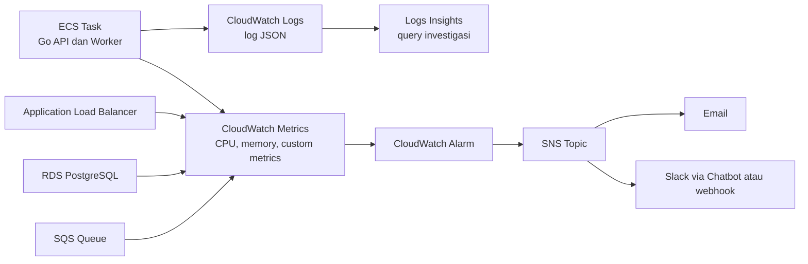
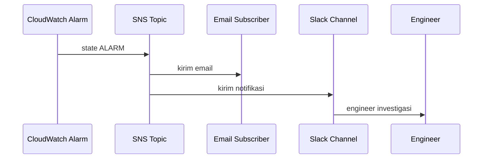

import { Section, Box, Steps, Step, Recap, CardGrid, Card, Chip, Hero, Compare, FileTree, Def } from "@components";

<Hero eyebrow="Roadmap 8 &middot; Docker, CI/CD, dan AWS Deployment" title="Observability:<br /><em>Monitor Backend</em> di Production">
  <p>Setelah backend skincare berjalan di ECS, kita butuh sinyal yang jelas dari log, metrik, alarm, dan notifikasi.</p>
  <Fragment slot="meta">
    <Chip icon="code">Bahasa: <b>Go 1.26</b></Chip>
    <Chip icon="clock">~60 menit baca</Chip>
  </Fragment>
</Hero>

<Section num="01" id="intro" title="Kenapa Observability?">

<p class="lead">Production bukan tempat untuk menebak, production harus memberi sinyal sebelum pelanggan melihat error.</p>

Di local development, kamu bisa menatap terminal, menaruh `fmt.Println`, lalu menjalankan ulang server. Di production, API berjalan di beberapa ECS task, worker berjalan terpisah, database ada di RDS, dan request datang dari banyak pelanggan sekaligus.

<Box variant="bridge" icon="🌉" label="Jembatan: dari console.log ke observability"><p>Di React atau Laravel, `console.log` dan log file lokal cukup untuk debugging awal. Di AWS, log harus terpusat, bisa dicari, punya metrik, dan bisa memicu alarm ketika pola buruk mulai muncul.</p></Box>

<Def term="observability"><p>Kemampuan sistem untuk menjelaskan apa yang sedang terjadi dari luar, lewat log, metrics, traces, alarm, dan dashboard, tanpa harus SSH ke server.</p></Def>

Fokus modul ini adalah observability minimal yang realistis untuk backend online shop skincare: log dari ECS masuk ke CloudWatch Logs, query investigasi memakai Logs Insights, metrik infrastruktur datang dari ECS, ALB, RDS, dan SQS, metrik bisnis datang dari aplikasi Go, lalu alarm dikirim ke SNS.

<Box variant="note" icon="📌" label="Sumber resmi yang perlu kamu buka saat implementasi"><p>Rujukan utama: <a href="https://docs.aws.amazon.com/AmazonECS/latest/developerguide/using_awslogs.html">ECS awslogs</a>, <a href="https://docs.aws.amazon.com/AmazonCloudWatch/latest/logs/CWL_QuerySyntax.html">CloudWatch Logs Insights</a>, <a href="https://docs.aws.amazon.com/AmazonECS/latest/developerguide/cloudwatch-metrics.html">ECS metrics</a>, dan <a href="https://docs.aws.amazon.com/AmazonCloudWatch/latest/monitoring/publishingMetrics.html">CloudWatch custom metrics</a>.</p></Box>

</Section>

<Section num="02" id="peta-observability" title="Peta Observability Production">

<p class="lead">Observability bukan satu fitur, melainkan alur sinyal dari aplikasi ke manusia yang perlu bertindak.</p>



<p class="fig-cap"><b>Gambar 1.</b> Alur observability minimal: ECS mengirim log dan metrik, CloudWatch menilai kondisi, alarm mengirim notifikasi lewat SNS.</p>

<Compare aLabel="Datadog / New Relic" bLabel="CloudWatch Native AWS" aTone="muted" bTone="violet">
  <Fragment slot="a"><ul><li>Pengalaman dashboard bagus dan lintas cloud lebih nyaman.</li><li>Biasanya butuh agent, integrasi, dan biaya tambahan per host atau usage.</li></ul></Fragment>
  <Fragment slot="b"><ul><li>Terintegrasi langsung dengan ECS, ALB, RDS, SQS, dan SNS.</li><li>Cocok untuk fase awal karena lebih dekat dengan infrastruktur AWS dan bisa dimulai tanpa platform observability eksternal.</li></ul></Fragment>
</Compare>

<Box variant="bridge" icon="🌉" label="Jembatan: mirip Datadog/New Relic, tapi native AWS"><p>CloudWatch bukan sekadar tempat log. Ia menjadi pusat metrik, log query, alarm, dashboard, dan notifikasi, dengan trade-off UI yang lebih AWS-centric.</p></Box>

<CardGrid cols={3}>
  <Card><h4>Log</h4><p>Jawaban untuk pertanyaan, request mana yang error dan konteksnya apa.</p></Card>
  <Card><h4>Metric</h4><p>Jawaban untuk pertanyaan, sistem sedang sehat atau mulai jenuh.</p></Card>
  <Card><h4>Alarm</h4><p>Jawaban untuk pertanyaan, kapan manusia atau autoscaling harus bereaksi.</p></Card>
</CardGrid>

</Section>

<Section num="03" id="cloudwatch-logs" title="CloudWatch Logs dari ECS">

<p class="lead">Untuk ECS Fargate, log container dikirim ke CloudWatch Logs lewat `awslogs` di task definition.</p>

ECS tidak otomatis tahu ke mana `stdout` dan `stderr` container harus dikirim. Pada Fargate, task definition perlu `logConfiguration` dengan driver `awslogs`. Artinya aplikasi Go cukup menulis log ke `stdout`, bukan ke file lokal di dalam container.

<Box variant="tip" icon="💡" label="Prinsip container logging"><p>Di container, tulis log ke `stdout` dan `stderr`. Jangan menulis file log lokal sebagai sumber utama, karena file itu hilang saat task diganti.</p></Box>

```json title="task-definition.json"
{
  "family": "skincare-api",
  "networkMode": "awsvpc",
  "requiresCompatibilities": ["FARGATE"],
  "cpu": "512",
  "memory": "1024",
  "executionRoleArn": "arn:aws:iam::123456789012:role/ecsTaskExecutionRole",
  "taskRoleArn": "arn:aws:iam::123456789012:role/skincare-api-task-role",
  "containerDefinitions": [
    {
      "name": "api",
      "image": "123456789012.dkr.ecr.ap-southeast-1.amazonaws.com/skincare-api:latest",
      "essential": true,
      "portMappings": [
        {
          "containerPort": 8080,
          "protocol": "tcp"
        }
      ],
      "logConfiguration": {
        "logDriver": "awslogs",
        "options": {
          "awslogs-group": "/ecs/skincare-api",
          "awslogs-region": "ap-southeast-1",
          "awslogs-stream-prefix": "api",
          "awslogs-create-group": "true"
        }
      }
    }
  ]
}
```

`awslogs-group` adalah tempat log dikumpulkan, misalnya `/ecs/skincare-api`. `awslogs-stream-prefix` membantu membedakan stream per container dan task. Untuk production yang lebih ketat, biasanya log group dibuat lewat IaC, lalu `awslogs-create-group` dimatikan agar permission task execution role tetap sempit.

<Box variant="warn" icon="⚠️" label="Jangan simpan log sensitif"><p>Log bisa lama tersimpan dan banyak orang operasional bisa mengaksesnya. Jangan log password, refresh token, JWT mentah, payment key, nomor kartu, atau payload pribadi pelanggan.</p></Box>

<FileTree title="Letak observability di proyek" tree={`
cmd/
  api/
    main.go                 # setup logger, router, server
internal/
  observability/
    logger.go               # konfigurasi slog JSON
    metrics.go              # publish custom metrics
  httpmw/
    request_logger.go       # middleware log request
infra/
  aws/
    task-definition.json    # awslogs driver untuk ECS
`} />

</Section>

<Section num="04" id="json-log-insights" title="Log JSON dan Logs Insights">

<p class="lead">Log production harus mudah dicari oleh mesin, bukan hanya nyaman dibaca manusia.</p>

Go modern punya `log/slog` di standard library. Untuk production, gunakan JSON handler agar CloudWatch Logs Insights bisa memfilter field seperti `level`, `path`, `status`, `latency_ms`, `order_id`, dan `request_id`.

```go title="internal/observability/logger.go"
package observability

import (
	"log/slog"
	"os"
)

func NewLogger(service string) *slog.Logger {
	handler := slog.NewJSONHandler(os.Stdout, &slog.HandlerOptions{
		Level: slog.LevelInfo,
	})

	return slog.New(handler).With(
		"service", service,
		"env", getenv("APP_ENV", "development"),
	)
}

func getenv(key string, fallback string) string {
	value := os.Getenv(key)
	if value == "" {
		return fallback
	}
	return value
}
```

```go title="internal/httpmw/request_logger.go"
package httpmw

import (
	"log/slog"
	"net/http"
	"time"
)

type statusRecorder struct {
	http.ResponseWriter
	status int
}

func (r *statusRecorder) WriteHeader(code int) {
	r.status = code
	r.ResponseWriter.WriteHeader(code)
}

func RequestLogger(log *slog.Logger) func(http.Handler) http.Handler {
	return func(next http.Handler) http.Handler {
		return http.HandlerFunc(func(w http.ResponseWriter, r *http.Request) {
			started := time.Now()
			rec := &statusRecorder{ResponseWriter: w, status: http.StatusOK}

			next.ServeHTTP(rec, r)

			log.InfoContext(r.Context(), "http_request",
				"method", r.Method,
				"path", r.URL.Path,
				"status", rec.status,
				"latency_ms", time.Since(started).Milliseconds(),
				"request_id", r.Header.Get("X-Request-Id"),
				"user_agent", r.UserAgent(),
			)
		})
	}
}
```

<Box variant="bridge" icon="🌉" label="Jembatan: dari Laravel log context ke slog attrs"><p>Di Laravel kamu biasa memberi context array ke logger. Di Go dengan `slog`, context itu menjadi pasangan key-value yang eksplisit dan bisa dicari di Logs Insights.</p></Box>

Contoh query investigasi di CloudWatch Logs Insights:

```text title="CloudWatch Logs Insights: error 5 menit terakhir"
fields @timestamp, level, msg, path, status, latency_ms, request_id
| filter level = "ERROR" or status >= 500
| sort @timestamp desc
| limit 50
```

```text title="CloudWatch Logs Insights: endpoint paling lambat"
fields path, latency_ms
| filter msg = "http_request"
| stats pct(latency_ms, 95) as p95_latency_ms, avg(latency_ms) as avg_latency_ms, count(*) as requests by path
| sort p95_latency_ms desc
| limit 20
```

```text title="CloudWatch Logs Insights: cari order bermasalah"
fields @timestamp, msg, order_id, payment_id, status, request_id
| filter order_id = "ord_01JZSKINCARE"
| sort @timestamp asc
```

<Box variant="tip" icon="💡" label="Pilih field yang stabil"><p>Gunakan nama field yang konsisten di seluruh service, misalnya `order_id`, `payment_id`, `user_id`, `request_id`, `latency_ms`, dan `status`.</p></Box>

</Section>

<Section num="05" id="cloudwatch-metrics" title="CloudWatch Metrics yang Wajib Dilihat">

<p class="lead">Metrik menjawab kesehatan sistem secara kuantitatif, log menjawab detail per kejadian.</p>

ECS, ALB, RDS, dan SQS sudah mengirim banyak metrik ke CloudWatch. Tugas kita bukan menyalakan semua grafik, melainkan memilih sinyal yang benar untuk backend skincare.

<CardGrid cols={2}>
  <Card><h4>ECS API dan worker</h4><p>Pantau `CPUUtilization`, `MemoryUtilization`, jumlah task running, dan restart. CPU tinggi bisa berarti traffic naik atau query berat.</p></Card>
  <Card><h4>ALB</h4><p>Pantau `RequestCount`, `TargetResponseTime`, `HTTPCode_Target_5XX_Count`, dan `HTTPCode_ELB_5XX_Count`. Ini melihat pengalaman request dari sisi pintu masuk.</p></Card>
  <Card><h4>RDS PostgreSQL</h4><p>Pantau `DatabaseConnections`, CPU, storage free, read latency, dan write latency. Koneksi penuh sering berasal dari pool terlalu besar.</p></Card>
  <Card><h4>SQS worker</h4><p>Pantau `ApproximateNumberOfMessagesVisible` dan age pesan tertua. Queue yang tumbuh berarti worker tertinggal dari produksi job.</p></Card>
</CardGrid>

<Def term="metric"><p>Seri data numerik berbasis waktu, misalnya CPU 72 persen pada pukul 10:15, request count 12.000 per 5 menit, atau queue depth 128.</p></Def>

<Box variant="warn" icon="⚠️" label="Jangan cuma lihat average"><p>Average bisa menutupi masalah tajam. Untuk latency endpoint, lihat percentile seperti p95 atau p99. Untuk CPU ECS, average berguna untuk scaling, tapi maximum membantu melihat task yang timpang.</p></Box>

Untuk fase awal, buat satu dashboard CloudWatch dengan panel berikut: request count ALB, 5xx rate ALB, p95 latency ALB, CPU ECS API, memory ECS API, CPU worker, queue depth SQS, RDS database connections, RDS CPU, dan custom metrics order serta payment.

</Section>

<Section num="06" id="custom-metrics" title="Custom Metrics dari Aplikasi Go">

<p class="lead">Metrik AWS memberi tahu infrastruktur sehat atau tidak, custom metric memberi tahu bisnis sehat atau tidak.</p>

CloudWatch tidak tahu bahwa `POST /v1/checkout` berarti order baru, atau bahwa payment success rate di bawah 95 persen bisa berdampak langsung ke revenue. Sinyal seperti itu harus dikirim dari aplikasi.

<CardGrid cols={3}>
  <Card><h4>Order count</h4><p>Jumlah order yang berhasil dibuat per periode. Berguna untuk melihat drop conversion.</p></Card>
  <Card><h4>Payment success rate</h4><p>Persentase payment sukses dibanding total payment attempt. Berguna untuk mendeteksi gangguan gateway.</p></Card>
  <Card><h4>Checkout failure</h4><p>Jumlah checkout gagal karena stok, validasi voucher, atau error database. Berguna untuk membedakan masalah bisnis dan teknis.</p></Card>
</CardGrid>

```go title="internal/observability/metrics.go"
package observability

import (
	"context"
	"time"

	"github.com/aws/aws-sdk-go-v2/aws"
	"github.com/aws/aws-sdk-go-v2/config"
	"github.com/aws/aws-sdk-go-v2/service/cloudwatch"
	"github.com/aws/aws-sdk-go-v2/service/cloudwatch/types"
)

type MetricPublisher struct {
	client    *cloudwatch.Client
	namespace string
	service   string
}

func NewMetricPublisher(ctx context.Context, namespace string, service string) (*MetricPublisher, error) {
	cfg, err := config.LoadDefaultConfig(ctx)
	if err != nil {
		return nil, err
	}

	return &MetricPublisher{
		client:    cloudwatch.NewFromConfig(cfg),
		namespace: namespace,
		service:   service,
	}, nil
}

func (p *MetricPublisher) PutCount(ctx context.Context, name string, value float64) error {
	_, err := p.client.PutMetricData(ctx, &cloudwatch.PutMetricDataInput{
		Namespace: aws.String(p.namespace),
		MetricData: []types.MetricDatum{
			{
				MetricName: aws.String(name),
				Timestamp:  aws.Time(time.Now()),
				Value:      aws.Float64(value),
				Unit:       types.StandardUnitCount,
				Dimensions: []types.Dimension{
					{
						Name:  aws.String("Service"),
						Value: aws.String(p.service),
					},
				},
			},
		},
	})
	return err
}

func (p *MetricPublisher) PutPercent(ctx context.Context, name string, value float64) error {
	_, err := p.client.PutMetricData(ctx, &cloudwatch.PutMetricDataInput{
		Namespace: aws.String(p.namespace),
		MetricData: []types.MetricDatum{
			{
				MetricName: aws.String(name),
				Timestamp:  aws.Time(time.Now()),
				Value:      aws.Float64(value),
				Unit:       types.StandardUnitPercent,
				Dimensions: []types.Dimension{
					{
						Name:  aws.String("Service"),
						Value: aws.String(p.service),
					},
				},
			},
		},
	})
	return err
}
```

```go title="internal/order/service.go"
package order

import "context"

type Metrics interface {
	PutCount(ctx context.Context, name string, value float64) error
}

type Service struct {
	repo    Repository
	metrics Metrics
}

func (s *Service) Checkout(ctx context.Context, input CheckoutInput) (*Order, error) {
	order, err := s.repo.CreateOrderFromCart(ctx, input.UserID, input.CartID)
	if err != nil {
		_ = s.metrics.PutCount(ctx, "CheckoutFailed", 1)
		return nil, err
	}

	_ = s.metrics.PutCount(ctx, "OrdersCreated", 1)
	return order, nil
}
```

<Box variant="tip" icon="💡" label="Metric publishing jangan merusak request utama"><p>Jika custom metric gagal dikirim, checkout tidak otomatis gagal. Log error-nya, lalu lanjutkan response. Untuk skala tinggi, kumpulkan metric secara batch atau lewat OpenTelemetry Collector.</p></Box>

<Box variant="note" icon="📌" label="Namespace custom metric"><p>Gunakan namespace milik aplikasi, misalnya `SkincareShop/Production`. Hindari namespace yang diawali `AWS/` agar tidak bentrok dengan namespace layanan AWS.</p></Box>

```bash title="Terminal"
go get github.com/aws/aws-sdk-go-v2/config \
  github.com/aws/aws-sdk-go-v2/service/cloudwatch
```

```json title="infra/aws/skincare-api-task-role-policy.json"
{
  "Version": "2012-10-17",
  "Statement": [
    {
      "Effect": "Allow",
      "Action": [
        "cloudwatch:PutMetricData"
      ],
      "Resource": "*",
      "Condition": {
        "StringEquals": {
          "cloudwatch:namespace": "SkincareShop/Production"
        }
      }
    }
  ]
}
```

<Box variant="warn" icon="⚠️" label="Task role perlu permission"><p>Custom metrics dikirim oleh aplikasi, jadi permission `cloudwatch:PutMetricData` harus ada di ECS task role, bukan hanya di task execution role.</p></Box>

</Section>

<Section num="07" id="alarms" title="Alarm yang Benar-benar Dipakai">

<p class="lead">Alarm yang baik tidak sekadar berisik, ia menunjuk kondisi yang perlu tindakan.</p>

Alarm production awal untuk backend skincare tidak perlu puluhan. Mulai dari empat sinyal yang jelas: API jenuh, error rate naik, koneksi database mendekati penuh, dan worker tertinggal.

<CardGrid cols={2}>
  <Card><h4>ECS CPU &gt; 80%</h4><p>Jika CPU API tinggi selama beberapa periode, lakukan scale out atau investigasi endpoint berat. Untuk worker, CPU tinggi bisa berarti job CPU-bound.</p></Card>
  <Card><h4>ALB 5xx &gt; 1%</h4><p>Gunakan metric math: total 5xx dibagi request count. Ini lebih adil daripada alarm jumlah absolut saat traffic berubah.</p></Card>
  <Card><h4>RDS connection &gt; 80%</h4><p>`DatabaseConnections` adalah jumlah koneksi. Hitung 80 persen dari `max_connections`, lalu jadikan threshold alarm.</p></Card>
  <Card><h4>SQS queue depth &gt; 100</h4><p>Jika `ApproximateNumberOfMessagesVisible` terus tinggi, worker tidak mengejar job. Scale worker atau cek downstream yang lambat.</p></Card>
</CardGrid>

```text title="observability/alarm-targets.txt"
ECS API CPU:
  Namespace: AWS/ECS
  Metric: CPUUtilization
  Dimension: ClusterName=skincare-prod, ServiceName=skincare-api
  Condition: Average > 80 for 5 minutes
  Action: alert and consider scale out

ALB 5xx rate:
  Namespace: AWS/ApplicationELB
  Metrics: HTTPCode_ELB_5XX_Count, HTTPCode_Target_5XX_Count, RequestCount
  Math: 100 * ((elb_5xx + target_5xx) / request_count)
  Condition: > 1 for 5 minutes
  Action: alert engineer

RDS connections:
  Namespace: AWS/RDS
  Metric: DatabaseConnections
  Dimension: DBInstanceIdentifier=skincare-prod
  Condition: Average > floor(max_connections * 0.8) for 5 minutes
  Action: alert and review pool sizing

SQS queue depth:
  Namespace: AWS/SQS
  Metric: ApproximateNumberOfMessagesVisible
  Dimension: QueueName=skincare-order-worker-prod
  Condition: Average > 100 for 10 minutes
  Action: alert and scale worker
```

<Box variant="warn" icon="⚠️" label="Threshold bukan hukum alam"><p>Angka 80 persen, 1 persen, dan 100 pesan adalah baseline awal. Setelah punya traffic nyata, revisi threshold berdasarkan pola normal aplikasi.</p></Box>

<Def term="alarm fatigue"><p>Kondisi ketika terlalu banyak alarm tidak penting membuat tim mengabaikan alarm penting. Alarm harus actionable, bukan sekadar informatif.</p></Def>

</Section>

<Section num="08" id="notification" title="Notification: SNS ke Email atau Slack">

<p class="lead">Alarm tanpa notifikasi hanya menjadi lampu merah yang tidak dilihat siapa pun.</p>

CloudWatch Alarm bisa mengirim action ketika state berubah. Action paling umum adalah publish ke SNS topic. Dari SNS, kamu bisa mengirim email langsung atau meneruskan ke Slack melalui integrasi resmi AWS untuk chat applications, Lambda kecil, atau webhook internal.



<p class="fig-cap"><b>Gambar 2.</b> Alur notifikasi sederhana dari CloudWatch Alarm ke SNS lalu ke channel yang dipantau manusia.</p>

```bash title="Terminal"
aws sns create-topic \
  --name skincare-prod-alerts \
  --region ap-southeast-1

aws sns subscribe \
  --topic-arn arn:aws:sns:ap-southeast-1:123456789012:skincare-prod-alerts \
  --protocol email \
  --notification-endpoint ops@example.com \
  --region ap-southeast-1
```

<Box variant="note" icon="📌" label="Email subscription perlu konfirmasi"><p>Setelah `sns subscribe`, AWS mengirim email konfirmasi. Notifikasi tidak berjalan sampai penerima menekan tautan konfirmasi.</p></Box>

Untuk Slack, jangan taruh webhook URL di task definition atau repository. Simpan secret di Secrets Manager atau gunakan integrasi chat resmi AWS bila cocok dengan cara kerja tim.

</Section>

<Section num="09" id="hands-on" title="Hands-on: Observability Minimal">

<p class="lead">Target hands-on ini adalah observability pertama yang berguna, bukan dashboard paling cantik.</p>

<Steps>
  <Step><b>Aktifkan awslogs di ECS task definition</b><p>Pastikan container `api` dan `worker` punya `logConfiguration` dengan log group yang berbeda atau stream prefix yang jelas.</p></Step>
  <Step><b>Gunakan logger JSON di aplikasi Go</b><p>Ganti log ad-hoc menjadi `slog` JSON dengan field stabil seperti `service`, `env`, `path`, `status`, `latency_ms`, dan `request_id`.</p></Step>
  <Step><b>Buat query Logs Insights</b><p>Simpan query untuk error 5xx, endpoint lambat, dan order tertentu agar investigasi incident tidak dimulai dari layar kosong.</p></Step>
  <Step><b>Buat dashboard CloudWatch minimal</b><p>Tambahkan panel ALB request count, ALB 5xx rate, ECS CPU, ECS memory, RDS connections, SQS depth, dan custom metric order.</p></Step>
  <Step><b>Buat SNS topic dan alarm pertama</b><p>Hubungkan alarm ECS CPU, ALB 5xx rate, RDS connections, dan SQS queue depth ke SNS topic yang dipantau tim.</p></Step>
</Steps>

```bash title="Terminal"
aws logs tail /ecs/skincare-api \
  --since 15m \
  --follow \
  --region ap-southeast-1
```

```bash title="Terminal"
aws cloudwatch put-metric-alarm \
  --alarm-name skincare-api-cpu-high \
  --namespace AWS/ECS \
  --metric-name CPUUtilization \
  --dimensions Name=ClusterName,Value=skincare-prod Name=ServiceName,Value=skincare-api \
  --statistic Average \
  --period 60 \
  --evaluation-periods 5 \
  --threshold 80 \
  --comparison-operator GreaterThanThreshold \
  --alarm-actions arn:aws:sns:ap-southeast-1:123456789012:skincare-prod-alerts \
  --region ap-southeast-1
```

<Box variant="tip" icon="💡" label="Uji alarm secara aman"><p>Untuk awal, uji notifikasi dengan alarm non-kritis atau threshold rendah di staging. Jangan sengaja membebani production hanya untuk membuktikan alarm berjalan.</p></Box>

</Section>

<Section num="10" id="jebakan-umum" title="Jebakan Umum">

<p class="lead">Banyak sistem punya CloudWatch, tapi tetap sulit di-debug karena sinyalnya tidak didesain.</p>

<CardGrid cols={2}>
  <Card><h4>Log berupa kalimat bebas</h4><p>Kalimat seperti `payment failed bro` sulit difilter. Pakai JSON dengan field `payment_id`, `order_id`, `reason`, dan `gateway_status`.</p></Card>
  <Card><h4>Semua alarm dikirim ke email yang jarang dibuka</h4><p>Alarm penting harus masuk channel yang benar-benar dipantau. Email cocok untuk laporan, Slack atau paging lebih cocok untuk incident.</p></Card>
  <Card><h4>RDS pool tidak dihitung</h4><p>Jika 6 ECS task masing-masing membuka pool 30 koneksi, total potensi koneksi 180. Ini bisa menyentuh limit RDS lebih cepat dari yang terlihat.</p></Card>
  <Card><h4>Custom metric terlalu granular</h4><p>Dimensi seperti `user_id` atau `order_id` membuat cardinality tinggi dan biaya naik. Gunakan dimensi rendah seperti service, env, atau gateway.</p></Card>
</CardGrid>

<Box variant="warn" icon="⚠️" label="Jangan log semua payload mentah"><p>Payment webhook, alamat pelanggan, dan token auth bisa mengandung data sensitif. Log metadata yang cukup untuk investigasi, simpan payload sensitif hanya bila memang perlu dan aksesnya dibatasi.</p></Box>

<Box variant="bridge" icon="🌉" label="Jembatan: observability bukan debugging manual"><p>Di local, kamu mencari bug dari satu request. Di production, kamu mencari pola dari ribuan request. Karena itu log harus terstruktur, metrik harus agregat, dan alarm harus punya tindakan jelas.</p></Box>

</Section>

<Section num="11" id="ringkasan" title="Ringkasan & Poin Penting">

<p class="lead">Observability membuat backend skincare lebih aman dioperasikan setelah masuk production.</p>

<Recap title="Yang Wajib Menempel">
  <ul>
    <li>CloudWatch Logs menerima log ECS lewat `awslogs`; aplikasi Go cukup menulis log JSON ke `stdout` dan `stderr`.</li>
    <li>Logs Insights berguna untuk investigasi cepat, terutama jika field log konsisten seperti `request_id`, `path`, `status`, `latency_ms`, `order_id`, dan `payment_id`.</li>
    <li>CloudWatch Metrics dari ECS, ALB, RDS, dan SQS memberi sinyal infrastruktur, sedangkan custom metrics memberi sinyal bisnis seperti order count dan payment success rate.</li>
    <li>Alarm awal yang praktis: ECS CPU &gt; 80 persen, ALB 5xx &gt; 1 persen, RDS connection &gt; 80 persen dari batas koneksi, dan SQS queue depth &gt; 100.</li>
    <li>SNS menghubungkan alarm ke email atau Slack, sehingga masalah tidak hanya tercatat tetapi benar-benar dilihat tim.</li>
  </ul>
</Recap>

Di proyek online shop skincare, modul ini menutup gap penting setelah deploy: API, worker, RDS, SQS, dan ALB tidak lagi menjadi kotak hitam. Saat checkout melambat, payment webhook gagal, atau worker tertinggal, kamu punya jalur investigasi yang jelas.

Langkah berikutnya di Roadmap 8 adalah menguatkan deployment production dari sisi biaya, reliability, dan praktik operasional. Setelah itu, Roadmap 9 akan masuk ke advanced scaling seperti caching, profiling, queue pattern, dan optimasi performa.

</Section>
