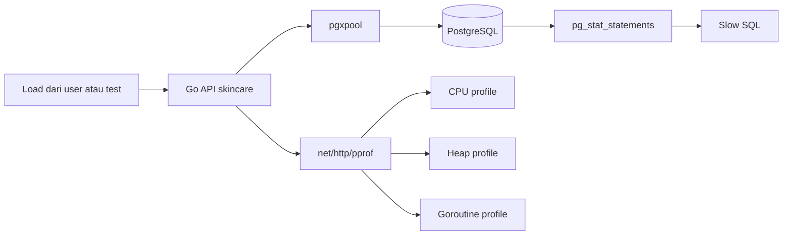
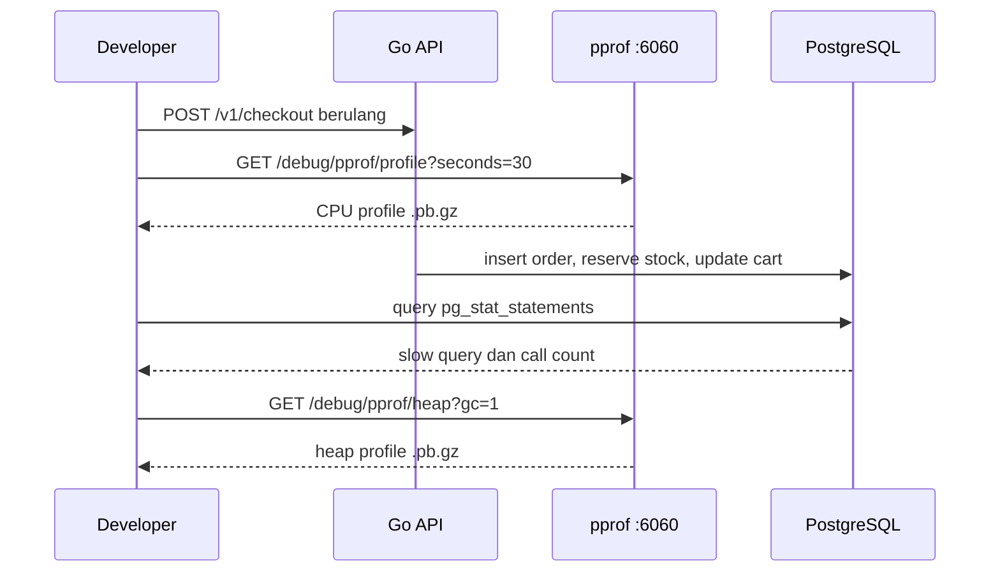

import { Section, Box, Steps, Step, Recap, CardGrid, Card, Chip, Hero, Compare, FileTree, Endpoint, Def } from "@components";

<Hero eyebrow="Roadmap 9 &middot; Advanced Scaling" title="Performance Profiling<br /><em>Go Backend</em>">
  <p>Temukan bottleneck backend skincare dengan data runtime, bukan firasat developer senior.</p>
  <Fragment slot="meta">
    <Chip icon="code">Bahasa: <b>Go 1.26</b></Chip>
    <Chip icon="clock">~60 menit baca</Chip>
  </Fragment>
</Hero>

<Section num="01" id="intro" title="Profiling Sebelum Optimasi">

<p class="lead">Di React, kamu mungkin membuka React DevTools Profiler sebelum memecah komponen. Di Laravel, kamu mungkin membuka Telescope, Debugbar, atau query log sebelum menambah cache.</p>

Di Go, kebiasaan yang sama harus dibawa ke backend. Jangan mulai dari mengganti loop, menambah goroutine, atau menambah cache Redis. Mulai dari mengukur bagian mana yang benar-benar mahal: CPU, alokasi heap, goroutine yang bocor, SQL lambat, jumlah query per request, atau koneksi PostgreSQL yang habis.

<Def term="profiling"><p>Profiling adalah proses mengambil sampel runtime aplikasi untuk melihat fungsi, alokasi, goroutine, atau operasi eksternal mana yang paling banyak memakai resource.</p></Def>

<Box variant="note" icon="📝" label="Prinsip"><p>Jangan optimasi sebelum profil, ini berlaku double di Go.</p></Box>

<Compare aLabel="JS/PHP: profiler sering di framework" bLabel="Go: profiler ada di runtime" aTone="muted" bTone="violet">
  <Fragment slot="a"><ul><li>React Profiler fokus ke render komponen, Laravel Debugbar sering fokus ke request dan query.</li><li>Kamu sering melihat data dari tool yang dipasang di level framework.</li></ul></Fragment>
  <Fragment slot="b"><ul><li>`net/http/pprof` dan `runtime/pprof` membaca data langsung dari runtime Go.</li><li>Profiling tidak peduli kamu pakai chi, net/http bawaan, atau framework lain.</li></ul></Fragment>
</Compare>



<p class="fig-cap"><b>Gambar 1.</b> Profiling Go API tidak berhenti di proses Go, karena bottleneck sering muncul di SQL dan pool koneksi.</p>

<CardGrid cols={3}>
  <Card><h4>CPU</h4><p>Cari fungsi yang paling sering muncul di sampel CPU ketika endpoint sedang diberi load.</p></Card>
  <Card><h4>Heap</h4><p>Cari alokasi yang tidak perlu, terutama response besar, mapping DTO, dan parsing JSON.</p></Card>
  <Card><h4>Database</h4><p>Cari query lambat, N+1 query, dan pool yang menunggu koneksi terlalu lama.</p></Card>
</CardGrid>

Sumber resmi yang dipakai untuk modul ini: [net/http/pprof](https://pkg.go.dev/net/http/pprof), [runtime/pprof](https://pkg.go.dev/runtime/pprof), [pg_stat_statements](https://www.postgresql.org/docs/current/pgstatstatements.html), dan [pgxpool](https://pkg.go.dev/github.com/jackc/pgx/v5/pgxpool).

</Section>

<Section num="02" id="pprof-server" title="Menambahkan net/http/pprof">

<p class="lead">`net/http/pprof` menambahkan endpoint debug yang bisa dibaca oleh `go tool pprof`.</p>

Pola paling aman untuk proyek skincare adalah menjalankan pprof di server terpisah dari API publik. API tetap berjalan di `:8080`, sementara pprof berjalan di address internal seperti `127.0.0.1:6060` untuk local process, atau address private yang tidak pernah masuk ke ALB production.

<Endpoint method="GET" path="/debug/pprof/" desc="Index profil yang tersedia" />
<Endpoint method="GET" path="/debug/pprof/profile" desc="CPU profile, biasanya diambil selama 30 detik" />
<Endpoint method="GET" path="/debug/pprof/heap" desc="Heap allocation dan in-use memory" />
<Endpoint method="GET" path="/debug/pprof/goroutine" desc="Snapshot goroutine yang sedang hidup" />

<Box variant="warn" icon="⚠️" label="Jangan expose pprof ke internet"><p>Endpoint pprof bisa membocorkan stack, nama fungsi, path file, dan pola traffic. Jangan mount ke router publik `/v1` dan jangan pasang di ALB tanpa proteksi jaringan.</p></Box>

<FileTree title="File yang disentuh untuk profiling" tree={`
cmd/
  api/
    main.go                         # panggil profiling server saat app start
internal/
  platform/
    profiling/
      pprof.go                      # pprof server terpisah
    perfstats/
      context.go                    # query count per request
      middleware.go                 # log statistik request
    db/
      pool_stats.go                 # snapshot pgxpool stats
ops/
  sql/
    pg-stat-statements.sql          # query slow SQL
`} />

```go title="internal/platform/profiling/pprof.go"
package profiling

import (
	"context"
	"errors"
	"log/slog"
	"net/http"
	_ "net/http/pprof"
	"time"
)

func StartPprofServer(ctx context.Context, logger *slog.Logger, addr string, enabled bool) *http.Server {
	if !enabled {
		return nil
	}

	if addr == "" {
		addr = "127.0.0.1:6060"
	}

	srv := &http.Server{
		Addr:              addr,
		Handler:           http.DefaultServeMux,
		ReadHeaderTimeout: 5 * time.Second,
	}

	go func() {
		logger.Info("pprof server listening", slog.String("addr", addr))
		if err := srv.ListenAndServe(); err != nil && !errors.Is(err, http.ErrServerClosed) {
			logger.Error("pprof server failed", slog.Any("error", err))
		}
	}()

	go func() {
		<-ctx.Done()

		shutdownCtx, cancel := context.WithTimeout(context.Background(), 5*time.Second)
		defer cancel()

		if err := srv.Shutdown(shutdownCtx); err != nil {
			logger.Error("pprof shutdown failed", slog.Any("error", err))
		}
	}()

	return srv
}
```

```go title="cmd/api/main.go"
package main

import (
	"context"
	"log/slog"
	"os"
	"os/signal"
	"syscall"

	"github.com/kamu/skincare-backend/internal/platform/profiling"
)

func main() {
	logger := slog.New(slog.NewJSONHandler(os.Stdout, nil))
	ctx, stop := signal.NotifyContext(context.Background(), os.Interrupt, syscall.SIGTERM)
	defer stop()

	profiling.StartPprofServer(
		ctx,
		logger,
		os.Getenv("PPROF_ADDR"),
		os.Getenv("ENABLE_PPROF") == "true",
	)

	// Start API server normal di :8080.
	// Shutdown API server juga memakai ctx yang sama.
}
```

<Box variant="bridge" icon="🌉" label="Jembatan: debug route bukan route user"><p>Anggap pprof seperti Laravel Telescope yang hanya boleh masuk lewat environment private. Bedanya, pprof membaca runtime Go langsung, jadi data yang bocor lebih rendah levelnya.</p></Box>

Untuk local process, cukup jalankan API dengan environment ini.

```bash title="Terminal"
ENABLE_PPROF=true PPROF_ADDR=127.0.0.1:6060 go run ./cmd/api
curl -s http://localhost:6060/debug/pprof/ | head
```

Kalau API berjalan di Docker lokal, bind service di container ke `:6060`, lalu batasi port mapping di host ke `127.0.0.1`.

```bash title="Terminal"
docker run --rm \
  -e ENABLE_PPROF=true \
  -e PPROF_ADDR=:6060 \
  -p 8080:8080 \
  -p 127.0.0.1:6060:6060 \
  skincare-api
```

</Section>

<Section num="03" id="cpu-profiling" title="CPU Profiling">

<p class="lead">CPU profiling menjawab pertanyaan: fungsi apa yang paling sering menghabiskan waktu CPU saat request berjalan?</p>

Di online shop skincare, CPU biasanya naik saat endpoint melakukan filtering produk yang terlalu berat, encode JSON response besar, validasi checkout yang berulang, hashing password dengan cost terlalu tinggi, atau rendering data rekomendasi produk tanpa batas jelas.

```bash title="Terminal"
# Jalankan API dan pprof.
ENABLE_PPROF=true PPROF_ADDR=127.0.0.1:6060 go run ./cmd/api

# Di terminal lain, beri traffic ke endpoint yang mau diuji.
for i in $(seq 1 200); do
  curl -s "http://localhost:8080/v1/products?skin_type=oily&sort=popular" > /dev/null &
done
wait

# Ambil CPU profile selama 30 detik.
go tool pprof http://localhost:6060/debug/pprof/profile?seconds=30
```

Di shell `pprof`, mulai dari `top`, lalu lanjut ke `list` untuk fungsi milik aplikasi.

```text title="pprof shell"
(pprof) top
(pprof) list SearchProducts
(pprof) list EncodeProductCards
(pprof) web
```

<Box variant="tip" icon="💡" label="Cara membaca top"><p>Lihat kolom flat untuk biaya fungsi itu sendiri, lalu cum untuk biaya fungsi tersebut plus fungsi yang dipanggilnya.</p></Box>

Contoh masalah yang sering muncul di service produk adalah sorting di Go setelah mengambil terlalu banyak row dari PostgreSQL. Untuk katalog skincare, filter dan sort yang bisa dikerjakan database sebaiknya dikerjakan di SQL dengan index yang tepat.

```go title="internal/product/service.go"
package product

import (
	"context"
	"sort"
)

type Service struct {
	repo Repository
}

func (s *Service) ListProducts(ctx context.Context, filter ListFilter) ([]ProductCard, error) {
	products, err := s.repo.ListProducts(ctx, filter)
	if err != nil {
		return nil, err
	}

	// Kandidat bottleneck kalau products berisi ribuan item.
	sort.Slice(products, func(i, j int) bool {
		return products[i].PopularityScore > products[j].PopularityScore
	})

	return products, nil
}
```

Versi yang lebih sehat adalah membatasi data di repository, lalu mengandalkan `ORDER BY`, `LIMIT`, dan index PostgreSQL. Ini bukan aturan absolut, tetapi pilihan default yang lebih mudah diprofilkan dan lebih hemat CPU API.

```sql title="internal/product/query.sql"
SELECT id, name, slug, price, image_url, popularity_score
FROM products
WHERE skin_type = $1
  AND is_active = true
ORDER BY popularity_score DESC, id DESC
LIMIT $2 OFFSET $3;
```

<Def term="hot path"><p>Hot path adalah jalur kode yang sering dilalui dan banyak mengonsumsi resource, misalnya list produk, add to cart, checkout, dan payment webhook.</p></Def>

</Section>

<Section num="04" id="memory-profiling" title="Memory Profiling">

<p class="lead">Memory profiling melihat alokasi heap, bukan sekadar total RAM proses di dashboard.</p>

Di Go, banyak alokasi kecil bisa membuat garbage collector bekerja lebih sering. Kamu tidak perlu takut alokasi, tetapi kamu perlu tahu kapan alokasi terjadi di hot path. Untuk API skincare, sumber alokasi umum adalah mapping entity ke DTO, membangun slice tanpa kapasitas awal, decode JSON body besar, dan membuat string sementara di loop.

```bash title="Terminal"
# Profil heap saat aplikasi sedang diberi traffic.
go tool pprof http://localhost:6060/debug/pprof/heap

# Buka UI lokal, pilih view top, graph, atau flame graph.
go tool pprof -http=:0 http://localhost:6060/debug/pprof/heap

# Fokus ke total alokasi sejak proses hidup.
go tool pprof -alloc_space http://localhost:6060/debug/pprof/heap

# Fokus ke memori yang masih hidup saat profil diambil.
go tool pprof -inuse_space http://localhost:6060/debug/pprof/heap
```

<Box variant="note" icon="📝" label="Heap profile bukan RSS"><p>Heap profile menunjukkan alokasi Go yang disampling. Angka ini tidak selalu sama dengan RSS container di CloudWatch atau `docker stats`.</p></Box>

Contoh sederhana: mapping response produk bisa membuat alokasi ekstra kalau slice tumbuh berulang kali. Ini bukan optimasi besar, tetapi di endpoint yang dipanggil ribuan kali per menit, kebiasaan ini membuat heap lebih tenang.

```go title="internal/product/response.go"
package product

type Product struct {
	ID          int64
	Name        string
	Slug        string
	Price       int64
	ImageURL    string
	Description string
}

type ProductCard struct {
	ID       int64  `json:"id"`
	Name     string `json:"name"`
	Slug     string `json:"slug"`
	Price    int64  `json:"price"`
	ImageURL string `json:"image_url"`
}

func ToProductCards(products []Product) []ProductCard {
	cards := make([]ProductCard, 0, len(products))
	for _, p := range products {
		cards = append(cards, ProductCard{
			ID:       p.ID,
			Name:     p.Name,
			Slug:     p.Slug,
			Price:    p.Price,
			ImageURL: p.ImageURL,
		})
	}
	return cards
}
```

<Compare aLabel="JS: GC terasa jauh" bLabel="Go: GC terlihat di profil" aTone="muted" bTone="blue">
  <Fragment slot="a"><ul><li>Di Node.js, kamu sering melihat heap snapshot dan event loop delay.</li><li>Bottleneck bisa terasa sebagai latency naik tanpa stack Go.</li></ul></Fragment>
  <Fragment slot="b"><ul><li>Di Go, heap profile bisa menunjukkan fungsi yang menghasilkan alokasi.</li><li>Optimasi kecil seperti preallocate slice hanya masuk akal setelah profil menunjukkan fungsi itu panas.</li></ul></Fragment>
</Compare>

Jebakan umum: memakai `sync.Pool` terlalu cepat. `sync.Pool` berguna di kasus tertentu, tetapi bisa membuat kode sulit dibaca dan tidak selalu mengurangi latency. Untuk aplikasi CRUD dan checkout, mulai dari query lebih kecil, response lebih kecil, dan alokasi yang jelas.

</Section>

<Section num="05" id="goroutine-profiling" title="Goroutine Profiling">

<p class="lead">Goroutine profiling membantu melihat apakah goroutine menumpuk, tertahan, atau bocor.</p>

Goroutine leak di backend sering muncul ketika ada worker internal, retry async, timeout yang tidak dihormati, atau channel yang tidak pernah dibaca. Di proyek skincare, contoh rawan adalah enrichment produk paralel, worker payment event, dan SQS consumer yang tidak berhenti bersih saat ECS mengirim SIGTERM.

```bash title="Terminal"
# Snapshot stack semua goroutine.
go tool pprof http://localhost:6060/debug/pprof/goroutine

# Format plaintext untuk inspeksi cepat.
curl "http://localhost:6060/debug/pprof/goroutine?debug=2" | less
```

<Box variant="tip" icon="💡" label="Indikasi leak"><p>Jumlah goroutine naik terus setelah traffic berhenti, lalu stack yang sama muncul berulang di channel send, channel receive, lock, atau network read.</p></Box>

Contoh kode berikut rawan bocor. Jika satu request enrichment gagal lebih awal, goroutine lain bisa tertahan saat mengirim ke channel yang tidak lagi dibaca.

```go title="internal/product/enrichment_bad.go"
package product

import "context"

type enrichmentResult struct {
	card ProductCard
	err  error
}

func (s *Service) EnrichCardsBad(ctx context.Context, ids []int64) ([]ProductCard, error) {
	ch := make(chan enrichmentResult)

	for _, id := range ids {
		id := id
		go func() {
			card, err := s.repo.GetProductCard(ctx, id)
			ch <- enrichmentResult{card: card, err: err}
		}()
	}

	cards := make([]ProductCard, 0, len(ids))
	for range ids {
		r := <-ch
		if r.err != nil {
			return nil, r.err
		}
		cards = append(cards, r.card)
	}

	return cards, nil
}
```

Versi yang lebih aman memakai context cancellation dan buffered channel sebesar jumlah pekerjaan. Ini bukan solusi terbaik untuk semua kasus, tetapi cukup untuk menunjukkan pola anti-leak tanpa library tambahan.

```go title="internal/product/enrichment.go"
package product

import "context"

func (s *Service) EnrichCards(ctx context.Context, ids []int64) ([]ProductCard, error) {
	ctx, cancel := context.WithCancel(ctx)
	defer cancel()

	ch := make(chan enrichmentResult, len(ids))

	for _, id := range ids {
		id := id
		go func() {
			card, err := s.repo.GetProductCard(ctx, id)
			select {
			case ch <- enrichmentResult{card: card, err: err}:
			case <-ctx.Done():
			}
		}()
	}

	cards := make([]ProductCard, 0, len(ids))
	for range ids {
		r := <-ch
		if r.err != nil {
			cancel()
			return nil, r.err
		}
		cards = append(cards, r.card)
	}

	return cards, nil
}
```

<Box variant="warn" icon="⚠️" label="Goroutine bukan obat semua latency"><p>Menambah goroutine untuk query database sering hanya memindahkan bottleneck ke PostgreSQL dan pgxpool. Ukur dulu pool, slow query, dan jumlah query.</p></Box>

Go 1.26 juga memperkenalkan profil eksperimental `goroutineleak` yang bisa diaktifkan dengan `GOEXPERIMENT=goroutineleakprofile`. Untuk modul ini, gunakan `goroutine` profile standar dulu karena tersedia tanpa flag eksperimen.

</Section>

<Section num="06" id="flame-graph" title="Membaca Flame Graph">

<p class="lead">Flame graph membantu melihat jalur call stack yang paling banyak mengonsumsi resource.</p>

Di UI pprof, flame graph biasanya dibaca dari bawah ke atas. Kotak bawah adalah caller, kotak di atasnya adalah fungsi yang dipanggil. Lebar kotak menunjukkan proporsi sampel. Warna bukan prioritas utama, lebar lebih penting.

```bash title="Terminal"
# Ambil CPU profile dan buka UI interaktif lokal.
go tool pprof -http=:0 http://localhost:6060/debug/pprof/profile?seconds=30

# Buka menu Flame Graph di browser yang muncul.
```

<CardGrid cols={2}>
  <Card><h4>Kotak lebar</h4><p>Fungsi atau jalur stack ini sering muncul di sampel. Mulai investigasi dari sini.</p></Card>
  <Card><h4>Kotak tinggi</h4><p>Call stack panjang. Ini bisa normal, tetapi kadang tanda abstraksi terlalu banyak di hot path.</p></Card>
  <Card><h4>runtime mendominasi</h4><p>Bisa berarti GC, map access, allocation, lock contention, atau scheduling goroutine sedang mahal.</p></Card>
  <Card><h4>fungsi aplikasi mendominasi</h4><p>Lebih mudah diperbaiki. Cari query berulang, loop besar, sorting di Go, atau transformasi response.</p></Card>
</CardGrid>

<Steps>
  <Step><b>Mulai dari top</b><p>Gunakan `top` untuk melihat fungsi panas sebelum masuk ke visual.</p></Step>
  <Step><b>Buka flame graph</b><p>Cari kotak paling lebar yang berasal dari package aplikasi, misalnya `internal/product` atau `internal/order`.</p></Step>
  <Step><b>Validasi dengan list</b><p>Gunakan `list NamaFungsi` untuk melihat baris kode yang muncul di sampel.</p></Step>
  <Step><b>Ubah satu hal</b><p>Perbaiki satu kandidat, lalu ambil profil ulang dengan traffic yang sama.</p></Step>
</Steps>

<Box variant="bridge" icon="🌉" label="Jembatan: seperti performance tab, tapi berbasis stack"><p>Kalau Chrome Performance menunjukkan main thread dan call stack JavaScript, flame graph pprof menunjukkan call stack Go yang disampling saat program berjalan.</p></Box>

Jangan menyimpulkan dari satu profil saat traffic tidak stabil. Ambil profil dengan durasi dan load yang mirip, simpan hasil sebelum dan sesudah, lalu bandingkan.

```bash title="Terminal"
mkdir -p profiles
curl -o profiles/products-before.pb.gz "http://localhost:6060/debug/pprof/profile?seconds=30"
# lakukan perubahan kode atau SQL
curl -o profiles/products-after.pb.gz "http://localhost:6060/debug/pprof/profile?seconds=30"
go tool pprof -http=:0 profiles/products-before.pb.gz
```

</Section>

<Section num="07" id="slow-sql" title="Slow SQL dengan pg_stat_statements">

<p class="lead">pprof melihat proses Go, sedangkan `pg_stat_statements` melihat query PostgreSQL yang paling mahal.</p>

Di production, endpoint lambat sering terlihat sebagai CPU Go rendah, tetapi latency request tinggi. Itu tanda API sedang menunggu I/O, biasanya database, network, atau service eksternal. Untuk PostgreSQL, `pg_stat_statements` memberi statistik eksekusi query yang sudah dinormalisasi.

<Box variant="note" icon="📝" label="RDS PostgreSQL"><p>Di RDS, `pg_stat_statements` biasanya perlu diaktifkan lewat parameter group karena membutuhkan `shared_preload_libraries`, lalu database instance perlu restart sesuai prosedur maintenance.</p></Box>

```sql title="ops/sql/pg-stat-statements.sql"
CREATE EXTENSION IF NOT EXISTS pg_stat_statements;

SELECT
  calls,
  round(total_exec_time::numeric, 2) AS total_exec_ms,
  round(mean_exec_time::numeric, 2) AS mean_exec_ms,
  rows,
  left(query, 240) AS query
FROM pg_stat_statements
WHERE query NOT ILIKE '%pg_stat_statements%'
ORDER BY mean_exec_time DESC
LIMIT 20;
```

Untuk checkout skincare, cari query yang muncul di payment flow dan inventory flow. Query dengan `mean_exec_ms` tinggi bisa membuat request lambat, sedangkan query dengan `calls` sangat tinggi bisa menunjukkan N+1 query atau polling yang terlalu sering.

```sql title="ops/sql/checkout-slow-query.sql"
SELECT
  calls,
  round(mean_exec_time::numeric, 2) AS mean_exec_ms,
  round(total_exec_time::numeric, 2) AS total_exec_ms,
  rows,
  left(query, 240) AS query
FROM pg_stat_statements
WHERE query ILIKE '%orders%'
   OR query ILIKE '%order_items%'
   OR query ILIKE '%inventory%'
ORDER BY total_exec_time DESC
LIMIT 20;
```

<CardGrid cols={2}>
  <Card><h4>mean_exec_ms tinggi</h4><p>Query per panggilan lambat. Periksa index, filter, join, dan jumlah row yang dibaca.</p></Card>
  <Card><h4>calls tinggi</h4><p>Query terlalu sering dipanggil. Periksa N+1, polling, atau loop repository.</p></Card>
  <Card><h4>rows tinggi</h4><p>API mengambil data terlalu banyak. Tambahkan pagination, limit, atau kolom response yang lebih kecil.</p></Card>
  <Card><h4>total_exec_ms tinggi</h4><p>Dampak total besar. Ini kandidat prioritas karena menghabiskan waktu database paling banyak.</p></Card>
</CardGrid>

Setelah menemukan query kandidat, lanjutkan dengan `EXPLAIN (ANALYZE, BUFFERS)` di database non-production atau window aman. Jangan menjalankan analisis berat sembarangan di jam traffic tinggi.

```sql title="ops/sql/explain-product-list.sql"
EXPLAIN (ANALYZE, BUFFERS)
SELECT id, name, slug, price, image_url
FROM products
WHERE skin_type = 'oily'
  AND is_active = true
ORDER BY popularity_score DESC, id DESC
LIMIT 24;
```

</Section>

<Section num="08" id="n-plus-one-query" title="Detect N+1 Query">

<p class="lead">N+1 query terjadi ketika satu request melakukan satu query utama, lalu satu query tambahan untuk setiap item hasil.</p>

Di React, pola mirip N+1 muncul saat komponen anak melakukan fetch sendiri-sendiri setelah list dirender. Di Laravel, ini sering terjadi saat relasi Eloquent tidak di-eager load. Di Go dengan pgx, masalahnya lebih eksplisit karena repository biasanya memanggil SQL manual di dalam loop.

```go title="internal/product/service_bad.go"
package product

import "context"

func (s *Service) ListProductCardsBad(ctx context.Context, filter ListFilter) ([]ProductCard, error) {
	products, err := s.repo.ListProducts(ctx, filter)
	if err != nil {
		return nil, err
	}

	cards := make([]ProductCard, 0, len(products))
	for _, p := range products {
		images, err := s.repo.ListProductImages(ctx, p.ID)
		if err != nil {
			return nil, err
		}
		cards = append(cards, NewProductCard(p, images))
	}

	return cards, nil
}
```

Solusi umumnya adalah mengambil data relasi dengan query batched, lalu group di Go berdasarkan `product_id`.

```go title="internal/product/service.go"
package product

import "context"

func (s *Service) ListProductCards(ctx context.Context, filter ListFilter) ([]ProductCard, error) {
	products, err := s.repo.ListProducts(ctx, filter)
	if err != nil {
		return nil, err
	}

	ids := make([]int64, 0, len(products))
	for _, p := range products {
		ids = append(ids, p.ID)
	}

	imagesByProductID, err := s.repo.ListImagesByProductIDs(ctx, ids)
	if err != nil {
		return nil, err
	}

	cards := make([]ProductCard, 0, len(products))
	for _, p := range products {
		cards = append(cards, NewProductCard(p, imagesByProductID[p.ID]))
	}

	return cards, nil
}
```

Untuk mendeteksi N+1 sejak development, tambahkan query counter di context request. Ini tidak menggantikan tracing production, tetapi sangat berguna untuk menemukan endpoint yang tiba-tiba melakukan ratusan query.

```go title="internal/platform/perfstats/context.go"
package perfstats

import (
	"context"
	"sync/atomic"
)

type contextKey struct{}

type RequestStats struct {
	queryCount atomic.Int64
}

func NewRequestStats() *RequestStats {
	return &RequestStats{}
}

func WithStats(ctx context.Context, stats *RequestStats) context.Context {
	return context.WithValue(ctx, contextKey{}, stats)
}

func FromContext(ctx context.Context) *RequestStats {
	stats, _ := ctx.Value(contextKey{}).(*RequestStats)
	return stats
}

func CountQuery(ctx context.Context) {
	stats := FromContext(ctx)
	if stats == nil {
		return
	}
	stats.queryCount.Add(1)
}

func (s *RequestStats) QueryCount() int64 {
	return s.queryCount.Load()
}
```

```go title="internal/platform/perfstats/middleware.go"
package perfstats

import (
	"log/slog"
	"net/http"
	"time"
)

func Middleware(logger *slog.Logger) func(http.Handler) http.Handler {
	return func(next http.Handler) http.Handler {
		return http.HandlerFunc(func(w http.ResponseWriter, r *http.Request) {
			stats := NewRequestStats()
			start := time.Now()

			next.ServeHTTP(w, r.WithContext(WithStats(r.Context(), stats)))

			logger.Info("request performance",
				slog.String("method", r.Method),
				slog.String("path", r.URL.Path),
				slog.Int64("query_count", stats.QueryCount()),
				slog.Duration("duration", time.Since(start)),
			)
		})
	}
}
```

```go title="internal/product/repository.go"
package product

import (
	"context"

	"github.com/kamu/skincare-backend/internal/platform/perfstats"
)

func (r *Repository) ListProducts(ctx context.Context, filter ListFilter) ([]Product, error) {
	perfstats.CountQuery(ctx)

	rows, err := r.db.Query(ctx, `
		SELECT id, name, slug, price, image_url
		FROM products
		WHERE skin_type = $1 AND is_active = true
		ORDER BY popularity_score DESC, id DESC
		LIMIT $2 OFFSET $3
	`, filter.SkinType, filter.Limit, filter.Offset)
	if err != nil {
		return nil, err
	}
	defer rows.Close()

	products := make([]Product, 0, filter.Limit)
	for rows.Next() {
		var p Product
		if err := rows.Scan(&p.ID, &p.Name, &p.Slug, &p.Price, &p.ImageURL); err != nil {
			return nil, err
		}
		products = append(products, p)
	}

	if err := rows.Err(); err != nil {
		return nil, err
	}

	return products, nil
}
```

<Box variant="warn" icon="⚠️" label="Jangan hitung query dengan global variable"><p>Query count harus menempel ke `context.Context` request. Global counter hanya memberi total aplikasi, bukan jumlah query per request.</p></Box>

</Section>

<Section num="09" id="connection-pool" title="Connection Pool Exhaustion">

<p class="lead">Connection pool exhaustion terjadi ketika goroutine menunggu koneksi database karena semua koneksi pgxpool sedang dipakai.</p>

Gejalanya sering membingungkan: CPU Go tidak tinggi, PostgreSQL mungkin belum penuh, tetapi latency API naik dan context deadline exceeded mulai muncul. Penyebabnya bisa query lambat, transaksi terlalu lama, pool terlalu kecil, atau jumlah task ECS dikali pool per task melebihi kapasitas RDS.

<Box variant="tip" icon="💡" label="Rumus awal production"><p>`jumlah ECS task` dikali `MaxConns per task` harus lebih kecil dari `max_connections` PostgreSQL, sisakan ruang untuk migration, admin session, worker, dan monitoring.</p></Box>

`pgxpool.Stat()` memberi snapshot pool. Mulai dari `AcquiredConns`, `IdleConns`, `TotalConns`, `MaxConns`, `EmptyAcquireCount`, `EmptyAcquireWaitTime`, dan `CanceledAcquireCount`.

```go title="internal/platform/db/pool_stats.go"
package db

import (
	"encoding/json"
	"net/http"
	"time"

	"github.com/jackc/pgx/v5/pgxpool"
)

type PoolSnapshot struct {
	AcquireCount          int64         `json:"acquire_count"`
	AcquireDuration       time.Duration `json:"acquire_duration"`
	AcquiredConns         int32         `json:"acquired_conns"`
	CanceledAcquireCount  int64         `json:"canceled_acquire_count"`
	ConstructingConns     int32         `json:"constructing_conns"`
	EmptyAcquireCount     int64         `json:"empty_acquire_count"`
	EmptyAcquireWaitTime  time.Duration `json:"empty_acquire_wait_time"`
	IdleConns             int32         `json:"idle_conns"`
	MaxConns              int32         `json:"max_conns"`
	TotalConns            int32         `json:"total_conns"`
	NewConnsCount         int64         `json:"new_conns_count"`
	MaxIdleDestroyCount   int64         `json:"max_idle_destroy_count"`
	MaxLifetimeDestroyCount int64       `json:"max_lifetime_destroy_count"`
}

func SnapshotPool(pool *pgxpool.Pool) PoolSnapshot {
	stat := pool.Stat()
	return PoolSnapshot{
		AcquireCount:            stat.AcquireCount(),
		AcquireDuration:         stat.AcquireDuration(),
		AcquiredConns:           stat.AcquiredConns(),
		CanceledAcquireCount:    stat.CanceledAcquireCount(),
		ConstructingConns:       stat.ConstructingConns(),
		EmptyAcquireCount:       stat.EmptyAcquireCount(),
		EmptyAcquireWaitTime:    stat.EmptyAcquireWaitTime(),
		IdleConns:               stat.IdleConns(),
		MaxConns:                stat.MaxConns(),
		TotalConns:              stat.TotalConns(),
		NewConnsCount:           stat.NewConnsCount(),
		MaxIdleDestroyCount:     stat.MaxIdleDestroyCount(),
		MaxLifetimeDestroyCount: stat.MaxLifetimeDestroyCount(),
	}
}

func PoolStatsHandler(pool *pgxpool.Pool) http.HandlerFunc {
	return func(w http.ResponseWriter, r *http.Request) {
		w.Header().Set("Content-Type", "application/json")
		_ = json.NewEncoder(w).Encode(SnapshotPool(pool))
	}
}
```

```go title="internal/platform/db/connect.go"
package db

import (
	"context"
	"time"

	"github.com/jackc/pgx/v5/pgxpool"
)

func OpenPool(ctx context.Context, databaseURL string, maxConns int32) (*pgxpool.Pool, error) {
	config, err := pgxpool.ParseConfig(databaseURL)
	if err != nil {
		return nil, err
	}

	config.MaxConns = maxConns
	config.MinConns = 2
	config.MaxConnLifetime = 30 * time.Minute
	config.MaxConnIdleTime = 5 * time.Minute
	config.HealthCheckPeriod = 1 * time.Minute

	pool, err := pgxpool.NewWithConfig(ctx, config)
	if err != nil {
		return nil, err
	}

	pingCtx, cancel := context.WithTimeout(ctx, 5*time.Second)
	defer cancel()

	if err := pool.Ping(pingCtx); err != nil {
		pool.Close()
		return nil, err
	}

	return pool, nil
}
```

<CardGrid cols={2}>
  <Card><h4>`AcquiredConns` dekat `MaxConns`</h4><p>Pool sedang penuh. Cari query lambat, transaksi lama, atau pool terlalu kecil.</p></Card>
  <Card><h4>`EmptyAcquireCount` naik</h4><p>Request pernah menunggu koneksi. Korelasikan dengan latency API.</p></Card>
  <Card><h4>`CanceledAcquireCount` naik</h4><p>Context timeout terjadi saat menunggu koneksi. Ini sinyal serius untuk checkout dan payment.</p></Card>
  <Card><h4>`IdleConns` selalu nol</h4><p>Pool tidak punya ruang napas. Bisa karena traffic tinggi atau query terlalu lama.</p></Card>
</CardGrid>

<Box variant="bridge" icon="🌉" label="Jembatan: mirip pool worker di Node"><p>Kalau di Node kamu membatasi concurrency worker atau pool database client, di Go kamu juga wajib menghitung pool per proses karena setiap ECS task punya pool sendiri.</p></Box>

</Section>

<Section num="10" id="hands-on-profiling" title="Hands-on Profiling Checkout">

<p class="lead">Latihan ini memakai flow checkout karena ia menyentuh CPU ringan, query inventory, transaksi, dan update order.</p>

Tujuan hands-on bukan membuat benchmark ilmiah. Tujuannya membangun kebiasaan: reproduksi, ambil profil, baca kandidat, perbaiki satu hal, ukur ulang.

<Steps>
  <Step><b>Aktifkan pprof</b><p>Jalankan API dengan `ENABLE_PPROF=true` dan pastikan `/debug/pprof/` hanya bisa diakses dari mesin developer.</p></Step>
  <Step><b>Siapkan data</b><p>Seed 100 produk skincare, beberapa variant stok, satu customer, dan satu cart berisi 5 item.</p></Step>
  <Step><b>Beri traffic</b><p>Panggil endpoint checkout beberapa kali dengan data test dan webhook payment palsu.</p></Step>
  <Step><b>Ambil CPU dan heap profile</b><p>Simpan file `.pb.gz` agar bisa dibandingkan setelah perubahan.</p></Step>
  <Step><b>Cek slow SQL</b><p>Jalankan query `pg_stat_statements` untuk melihat query order dan inventory yang paling mahal.</p></Step>
  <Step><b>Cek query count</b><p>Baca log `query_count` per request, lalu pastikan checkout tidak melakukan query per item secara tidak perlu.</p></Step>
</Steps>

```bash title="Terminal"
mkdir -p profiles

ENABLE_PPROF=true PPROF_ADDR=127.0.0.1:6060 go run ./cmd/api

curl -o profiles/checkout-cpu.pb.gz "http://localhost:6060/debug/pprof/profile?seconds=30"
curl -o profiles/checkout-heap.pb.gz "http://localhost:6060/debug/pprof/heap?gc=1"

go tool pprof -http=:0 profiles/checkout-cpu.pb.gz
go tool pprof -http=:0 profiles/checkout-heap.pb.gz
```

```bash title="Terminal"
# Contoh request checkout test. Sesuaikan token dan cart_id dengan data lokal.
curl -s -X POST "http://localhost:8080/v1/checkout" \
  -H "Authorization: Bearer $ACCESS_TOKEN" \
  -H "Content-Type: application/json" \
  -d '{"cart_id":"cart_test_001","shipping_method":"regular"}'
```



<p class="fig-cap"><b>Gambar 2.</b> Profiling checkout perlu melihat runtime Go dan statistik PostgreSQL sekaligus.</p>

<Box variant="warn" icon="⚠️" label="Satu perubahan sekali ukur"><p>Jangan mengubah SQL, pool size, JSON response, dan goroutine sekaligus. Kamu akan kehilangan bukti perubahan mana yang benar-benar membantu.</p></Box>

Checklist keputusan setelah hands-on:

<ul><li>Jika CPU panas di fungsi mapping response, perkecil payload atau optimalkan transformasi.</li><li>Jika heap panas di encode JSON, periksa ukuran response dan struktur DTO.</li><li>Jika goroutine naik terus, cari worker atau channel yang tidak berhenti saat context selesai.</li><li>Jika slow SQL dominan, optimalkan index, query, atau pola transaksi.</li><li>Jika pool penuh, cari query lambat dulu sebelum menaikkan `MaxConns`.</li></ul>

</Section>

<Section num="11" id="ringkasan" title="Ringkasan & Poin Penting">

<p class="lead">Profiling adalah disiplin membaca data sebelum mengubah arsitektur.</p>

<Recap title="Yang Wajib Menempel">
  <ul><li>`net/http/pprof` menyediakan endpoint `/debug/pprof/` untuk CPU, heap, goroutine, dan profil runtime lain.</li><li>Jalankan pprof di server terpisah dan jangan expose endpoint debug ke internet.</li><li>CPU profile menjawab fungsi mana yang paling mahal saat traffic berjalan.</li><li>Heap profile membantu menemukan alokasi yang membuat GC bekerja lebih keras.</li><li>Goroutine profile membantu mendeteksi goroutine leak, channel yang tertahan, dan worker yang tidak berhenti.</li><li>Flame graph dibaca dari lebar stack, bukan dari warna.</li><li>`pg_stat_statements` melengkapi pprof karena banyak latency backend berasal dari PostgreSQL.</li><li>N+1 query bisa dideteksi dengan query count per request dan diperbaiki dengan query batched.</li><li>`pgxpool.Stat()` membantu melihat pool penuh, acquire wait, dan acquire yang dibatalkan context.</li><li>Untuk proyek skincare, profiling pertama yang penting adalah list produk, checkout, payment webhook, dan worker order.</li></ul>
</Recap>

<Steps>
  <Step><b>Map ke proyek</b><p>Tambahkan pprof server internal, query count middleware, SQL `pg_stat_statements`, dan endpoint internal untuk pgxpool stats.</p></Step>
  <Step><b>Map ke operasi production</b><p>Di AWS, akses pprof hanya lewat jaringan private atau sesi debug terbatas, bukan lewat ALB publik.</p></Step>
  <Step><b>Langkah berikutnya</b><p>Setelah tahu bottleneck, modul berikutnya masuk ke strategi cache agar optimasi tidak sekadar menambah kompleksitas.</p></Step>
</Steps>

<Box variant="tip" icon="💡" label="Mental model"><p>Go cepat bukan karena semua kode Go otomatis cepat. Go cepat ketika kamu menulis kode sederhana, mengukur hot path, lalu memperbaiki bagian yang terbukti mahal.</p></Box>

</Section>
