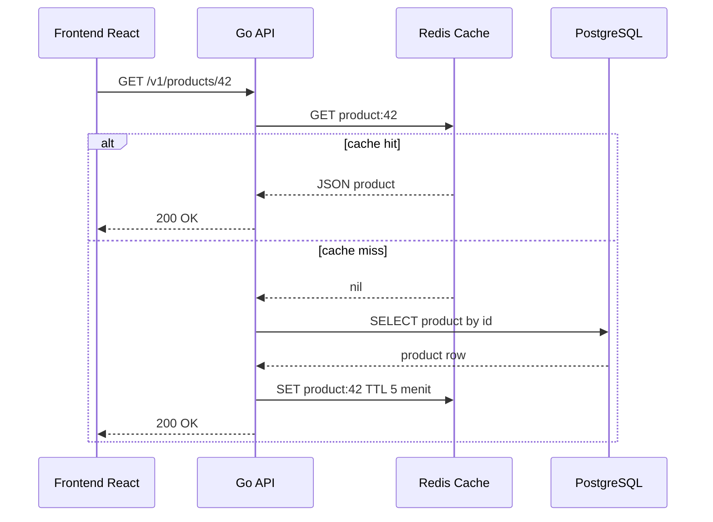
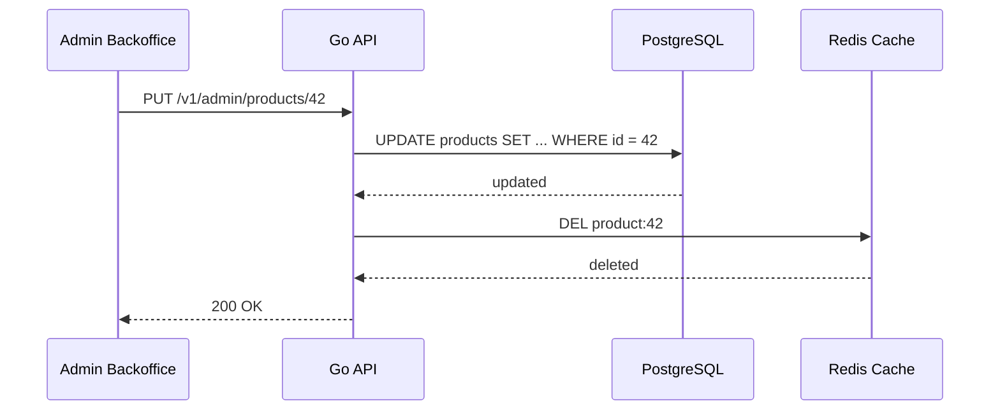

import { Section, Box, Steps, Step, Recap, CardGrid, Card, Chip, Hero, Compare, FileTree, Endpoint, Def } from "@components";

<Hero eyebrow="Roadmap 9 &middot; Advanced Scaling" title="Caching Strategy dengan <em>Redis</em><br />Bottleneck Dibantu, Konsistensi Dijaga">
  <p>Cache yang baik bukan cache sebanyak mungkin, tetapi cache yang mempercepat read path tanpa membuat data bisnis jadi menipu.</p>
  <Fragment slot="meta">
    <Chip icon="code">Bahasa: <b>Go 1.26</b></Chip>
    <Chip icon="clock">~60 menit baca</Chip>
  </Fragment>
</Hero>

<Section num="01" id="intro" title="Kenapa Caching Harus Selektif" sub="Tambah cache di tempat yang tepat, bukan semua query di-cache">

<p class="lead">Di React kamu mungkin mengenal cache lewat TanStack Query, SWR, atau CDN, sedangkan di Laravel ada Cache facade yang membuat operasi cache terasa sangat singkat.</p>

Di backend Go, caching biasanya dibuat lebih eksplisit. Kita memilih key, TTL, invalidation, dan fallback ketika Redis bermasalah. Itu sedikit lebih manual dibanding Laravel, tetapi hasilnya lebih mudah diaudit saat sistem skincare mulai ramai dan performa tidak boleh ditebak.

<Box variant="note" icon="🧭" label="Prinsip modul ini"><p>Jangan optimasi sebelum profil - ini berlaku double di Go.</p></Box>

<Def term="cache"><p>Cache adalah salinan data yang disimpan di media lebih cepat dari sumber utama, biasanya dengan batas waktu atau aturan invalidation agar staleness tetap terkendali.</p></Def>

Caching cocok untuk data yang sering dibaca, relatif jarang berubah, dan toleran terhadap stale singkat. Pada online shop skincare, contoh terbaiknya adalah detail produk dan daftar kategori. Contoh terburuknya adalah stok, isi cart, dan status order.

<Compare aLabel="Laravel Cache facade" bLabel="Go manual cache" aTone="muted" bTone="violet">
  <Fragment slot="a"><ul><li>`Cache::remember('key', 300, fn () =&gt; DB::...)` menyembunyikan banyak detail di balik facade.</li><li>Nyaman untuk produktivitas, tetapi invalidation sering tersebar di banyak tempat.</li></ul></Fragment>
  <Fragment slot="b"><ul><li>Kita membuat interface cache, key convention, TTL, dan invalidation secara eksplisit.</li><li>Lebih banyak kode, tetapi lebih jelas saat debugging latency, stale data, dan Redis outage.</li></ul></Fragment>
</Compare>

Endpoint yang akan kita pakai sebagai konteks:

<Endpoint method="GET" path="/v1/products/{id}" desc="Baca product detail, kandidat cache 5 menit" />
<Endpoint method="GET" path="/v1/categories" desc="Baca daftar kategori, kandidat cache 1 jam" />
<Endpoint method="PUT" path="/v1/admin/products/{id}" desc="Update produk, wajib invalidasi cache product detail" />

</Section>

<Section num="02" id="cache-aside" title="Cache-Aside Pattern" sub="Aplikasi cek cache dulu, database tetap sumber kebenaran">

<p class="lead">Cache-aside adalah pattern paling masuk akal untuk proyek ini karena aplikasi Go tetap mengontrol kapan membaca Redis, kapan fallback ke PostgreSQL, dan kapan menghapus cache.</p>

Menurut dokumentasi Redis, cache-aside dipakai untuk repeated reads dengan staleness yang dibatasi TTL, sedangkan AWS menyebutnya lazy loading karena cache diisi setelah request membutuhkannya. Intinya sederhana: cek Redis, kalau hit langsung return, kalau miss ambil dari PostgreSQL, lalu simpan hasilnya ke Redis.



<p class="fig-cap"><b>Gambar 1.</b> Alur cache-aside untuk product detail, Redis mempercepat request berikutnya tetapi PostgreSQL tetap sumber data utama.</p>

<CardGrid cols={3}>
  <Card><h4>Hit</h4><p>Redis punya data, API tidak perlu query PostgreSQL.</p></Card>
  <Card><h4>Miss</h4><p>Redis kosong atau expired, API query PostgreSQL lalu mengisi Redis.</p></Card>
  <Card><h4>Invalidate</h4><p>Data utama berubah, API menghapus key terkait agar request berikutnya mengambil data segar.</p></Card>
</CardGrid>

<Box variant="bridge" icon="🌉" label="Jembatan: dari TanStack Query ke Redis"><p>TanStack Query menyimpan cache di browser per user, sedangkan Redis menyimpan cache di server lintas instance API, sehingga semua task ECS bisa berbagi cache yang sama.</p></Box>

</Section>

<Section num="03" id="redis-client" title="Redis Client di Go" sub="Pakai github.com/redis/go-redis/v9 dengan wrapper kecil">

<p class="lead">Library yang kita pakai adalah `github.com/redis/go-redis/v9`, klien Go resmi dari Redis, dan tetap dipanggil dengan `context.Context` seperti operasi I/O Go lain.</p>

Dokumentasi go-redis memasang paket dengan `go get github.com/redis/go-redis/v9`. Untuk Go 1.26, modul tetap dideklarasikan di `go.mod`, dan dependency eksternal masuk lewat Go Modules.

```bash title="Terminal"
go get github.com/redis/go-redis/v9
go get golang.org/x/sync/singleflight
```

Struktur yang akan kita tambahkan:

<FileTree title="Struktur caching di modular monolith" tree={`
internal/
  cache/
    redis_client.go      # koneksi go-redis
    store.go             # wrapper JSON cache dengan ErrMiss
  product/
    model.go
    repository.go
    service.go           # cache-aside dan invalidation
cmd/
  api/
    main.go              # wiring Redis client ke service
`} />

Pertama, buat koneksi Redis sebagai dependency aplikasi. Jangan membuat client baru per request, karena client sudah mengelola koneksi di balik layar.

```go title="internal/cache/redis_client.go"
package cache

import (
	"context"
	"fmt"
	"time"

	redis "github.com/redis/go-redis/v9"
)

type RedisConfig struct {
	Addr     string
	Password string
	DB       int
}

func NewRedisClient(cfg RedisConfig) *redis.Client {
	return redis.NewClient(&redis.Options{
		Addr:     cfg.Addr,
		Password: cfg.Password,
		DB:       cfg.DB,
	})
}

func PingRedis(ctx context.Context, client *redis.Client) error {
	ctx, cancel := context.WithTimeout(ctx, 2*time.Second)
	defer cancel()

	if err := client.Ping(ctx).Err(); err != nil {
		return fmt.Errorf("ping redis: %w", err)
	}

	return nil
}
```

Lalu bungkus Redis dengan interface kecil agar service layer tidak penuh detail serialization.

```go title="internal/cache/store.go"
package cache

import (
	"context"
	"encoding/json"
	"errors"
	"fmt"
	"time"

	redis "github.com/redis/go-redis/v9"
)

var ErrMiss = errors.New("cache miss")

type Store interface {
	GetJSON(ctx context.Context, key string, dst any) error
	SetJSON(ctx context.Context, key string, value any, ttl time.Duration) error
	Delete(ctx context.Context, keys ...string) error
}

type RedisStore struct {
	client *redis.Client
}

func NewRedisStore(client *redis.Client) *RedisStore {
	return &RedisStore{client: client}
}

func (s *RedisStore) GetJSON(ctx context.Context, key string, dst any) error {
	raw, err := s.client.Get(ctx, key).Bytes()
	if errors.Is(err, redis.Nil) {
		return ErrMiss
	}
	if err != nil {
		return fmt.Errorf("get redis key %q: %w", key, err)
	}
	if err := json.Unmarshal(raw, dst); err != nil {
		return fmt.Errorf("decode redis key %q: %w", key, err)
	}

	return nil
}

func (s *RedisStore) SetJSON(ctx context.Context, key string, value any, ttl time.Duration) error {
	raw, err := json.Marshal(value)
	if err != nil {
		return fmt.Errorf("encode redis key %q: %w", key, err)
	}
	if err := s.client.Set(ctx, key, raw, ttl).Err(); err != nil {
		return fmt.Errorf("set redis key %q: %w", key, err)
	}

	return nil
}

func (s *RedisStore) Delete(ctx context.Context, keys ...string) error {
	if len(keys) == 0 {
		return nil
	}
	if err := s.client.Del(ctx, keys...).Err(); err != nil {
		return fmt.Errorf("delete redis keys: %w", err)
	}

	return nil
}
```

<Box variant="tip" icon="💡" label="Idiom Go"><p>Service menerima interface `cache.Store`, tetapi constructor mengembalikan struct konkret `*Service`. Ini menjaga dependency mudah dites tanpa membuat API internal terlalu abstrak.</p></Box>

</Section>

<Section num="04" id="cache-product-detail" title="Cache Product Detail" sub="Key product:&#123;id&#125;, TTL 5 menit">

<p class="lead">Product detail adalah kandidat cache yang bagus karena banyak user membaca produk yang sama, sementara perubahan nama, harga, deskripsi, dan gambar tidak terjadi setiap detik.</p>

Key convention yang dipakai adalah format `product:42` untuk produk ID 42. Di modul ini, format umumnya adalah product:&#123;id&#125;, dengan TTL 5 menit.

```go title="internal/product/model.go"
package product

import "time"

type Product struct {
	ID          int64     `json:"id"`
	Name        string    `json:"name"`
	Slug        string    `json:"slug"`
	CategoryID  int64     `json:"category_id"`
	PriceCents  int64     `json:"price_cents"`
	Description string    `json:"description"`
	ImageURL    string    `json:"image_url"`
	UpdatedAt   time.Time `json:"updated_at"`
}

type Category struct {
	ID   int64  `json:"id"`
	Name string `json:"name"`
	Slug string `json:"slug"`
}
```

```go title="internal/product/service.go"
package product

import (
	"context"
	"errors"
	"fmt"
	"time"

	"github.com/kamu/skincare-backend/internal/cache"
)

const productDetailTTL = 5 * time.Minute

type Repository interface {
	GetByID(ctx context.Context, id int64) (Product, error)
	ListCategories(ctx context.Context) ([]Category, error)
	Update(ctx context.Context, p Product) error
	RenameCategory(ctx context.Context, categoryID int64, name string) error
}

type Service struct {
	repo  Repository
	cache cache.Store
}

func NewService(repo Repository, cacheStore cache.Store) *Service {
	return &Service{
		repo:  repo,
		cache: cacheStore,
	}
}

func (s *Service) GetProduct(ctx context.Context, id int64) (Product, error) {
	key := productCacheKey(id)

	var cached Product
	if err := s.cache.GetJSON(ctx, key, &cached); err == nil {
		return cached, nil
	} else if !errors.Is(err, cache.ErrMiss) {
		// Cache harus mempercepat sistem, bukan membuat endpoint gagal saat Redis sedang bermasalah.
		// Di production, log error ini dengan request id dan key.
	}

	p, err := s.repo.GetByID(ctx, id)
	if err != nil {
		return Product{}, fmt.Errorf("get product from repository: %w", err)
	}

	if err := s.cache.SetJSON(ctx, key, p, productDetailTTL); err != nil {
		// Cache write failure tidak boleh menggagalkan read dari database.
		// Di production, kirim metric agar Redis issue terlihat.
	}

	return p, nil
}

func productCacheKey(id int64) string {
	return fmt.Sprintf("product:%d", id)
}
```

<Box variant="warn" icon="⚠️" label="Jebakan: cache error jangan selalu jadi HTTP 500"><p>Jika PostgreSQL berhasil mengembalikan product tetapi Redis gagal menyimpan cache, response ke user tetap harus sukses karena Redis bukan source of truth.</p></Box>

</Section>

<Section num="05" id="cache-category-list" title="Cache Category List" sub="Key categories, TTL 1 jam">

<p class="lead">Daftar kategori skincare jauh lebih statis daripada product detail, sehingga TTL bisa lebih panjang.</p>

Kategori seperti cleanser, toner, serum, sunscreen, dan moisturizer biasanya jarang berubah. Dengan cache key `categories` dan TTL 1 jam, halaman katalog tidak perlu terus membaca tabel kategori.

```go title="internal/product/category_service.go"
package product

import (
	"context"
	"errors"
	"fmt"
	"time"

	"github.com/kamu/skincare-backend/internal/cache"
)

const categoryListKey = "categories"
const categoryListTTL = time.Hour

func (s *Service) ListCategories(ctx context.Context) ([]Category, error) {
	var cached []Category
	if err := s.cache.GetJSON(ctx, categoryListKey, &cached); err == nil {
		return cached, nil
	} else if !errors.Is(err, cache.ErrMiss) {
		// Treat as miss, lalu observability mencatat Redis error.
	}

	categories, err := s.repo.ListCategories(ctx)
	if err != nil {
		return nil, fmt.Errorf("list categories from repository: %w", err)
	}

	if err := s.cache.SetJSON(ctx, categoryListKey, categories, categoryListTTL); err != nil {
		// Jangan gagal hanya karena cache write gagal.
	}

	return categories, nil
}
```

<Box variant="bridge" icon="🌉" label="Jembatan: dari cache helper ke domain rule"><p>Di Laravel kamu bisa memakai `Cache::remember`, tetapi di Go kita menaruh cache di service agar domain tahu data mana yang aman stale dan data mana yang harus selalu live.</p></Box>

</Section>

<Section num="06" id="cache-invalidation" title="Cache Invalidation Saat Update" sub="Update database dulu, lalu hapus cache">

<p class="lead">TTL membatasi umur cache, tetapi invalidation membuat perubahan penting terlihat lebih cepat.</p>

Untuk update produk, urutan aman adalah menulis ke PostgreSQL lebih dulu, lalu menghapus cache product detail. Jika delete cache gagal, data stale bisa bertahan sampai TTL habis. Karena itu, error invalidation perlu dicatat sebagai log atau metric, walaupun endpoint update bisa tetap berhasil sesuai kebijakan bisnis.



<p class="fig-cap"><b>Gambar 2.</b> Invalidation dilakukan setelah write sukses ke PostgreSQL agar cache tidak menyimpan versi lama terlalu lama.</p>

```go title="internal/product/update_service.go"
package product

import (
	"context"
	"fmt"
)

func (s *Service) UpdateProduct(ctx context.Context, p Product) error {
	if err := s.repo.Update(ctx, p); err != nil {
		return fmt.Errorf("update product: %w", err)
	}

	if err := s.cache.Delete(ctx, productCacheKey(p.ID)); err != nil {
		// Pilihan production: return error jika admin butuh konsistensi ketat, atau log dan lanjut jika TTL pendek.
		return fmt.Errorf("invalidate product cache: %w", err)
	}

	return nil
}
```

Jika update produk juga mengubah kategori, misalnya admin mengganti nama kategori atau memindahkan produk ke kategori baru yang memengaruhi daftar navigasi, hapus juga key `categories`.

```go title="internal/product/category_update_service.go"
package product

import (
	"context"
	"fmt"
)

func (s *Service) RenameCategory(ctx context.Context, categoryID int64, name string) error {
	if err := s.repo.RenameCategory(ctx, categoryID, name); err != nil {
		return fmt.Errorf("rename category: %w", err)
	}

	if err := s.cache.Delete(ctx, categoryListKey); err != nil {
		return fmt.Errorf("invalidate category cache: %w", err)
	}

	return nil
}
```

<Box variant="warn" icon="⚠️" label="Jebakan: delete sebelum update"><p>Jika cache dihapus sebelum database commit sukses, request lain bisa mengisi cache dengan data lama dari PostgreSQL, lalu stale bertahan sampai TTL selesai.</p></Box>

</Section>

<Section num="07" id="stampede-protection" title="Stampede Protection dengan singleflight" sub="Cegah banyak goroutine memukul database untuk key yang sama">

<p class="lead">Cache stampede terjadi ketika key populer expired, lalu banyak request bersamaan sama-sama miss dan semuanya query database.</p>

Paket `golang.org/x/sync/singleflight` menyediakan `Group.Do`, yang memastikan hanya satu eksekusi berjalan untuk key tertentu, sementara pemanggil duplikat menunggu hasil yang sama. Ini proteksi lokal di satu proses Go. Jika API berjalan di banyak task ECS, tiap task tetap punya group sendiri, sehingga Redis TTL jitter dan observability tetap dibutuhkan.

```go title="internal/product/service_singleflight.go"
package product

import (
	"context"
	"errors"
	"fmt"
	"time"

	"github.com/kamu/skincare-backend/internal/cache"
	"golang.org/x/sync/singleflight"
)

type CachedService struct {
	repo  Repository
	cache cache.Store
	group singleflight.Group
}

func NewCachedService(repo Repository, cacheStore cache.Store) *CachedService {
	return &CachedService{
		repo:  repo,
		cache: cacheStore,
	}
}

func (s *CachedService) GetProduct(ctx context.Context, id int64) (Product, error) {
	key := productCacheKey(id)

	var cached Product
	if err := s.cache.GetJSON(ctx, key, &cached); err == nil {
		return cached, nil
	} else if !errors.Is(err, cache.ErrMiss) {
		// Treat as miss, log Redis error di production.
	}

	value, err, _ := s.group.Do(key, func() (any, error) {
		p, err := s.repo.GetByID(ctx, id)
		if err != nil {
			return Product{}, fmt.Errorf("get product from repository: %w", err)
		}

		ttl := productTTLWithJitter(productDetailTTL)
		if err := s.cache.SetJSON(ctx, key, p, ttl); err != nil {
			// Cache write failure tidak menggagalkan response.
		}

		return p, nil
	})
	if err != nil {
		return Product{}, err
	}

	p, ok := value.(Product)
	if !ok {
		return Product{}, fmt.Errorf("unexpected singleflight value for key %s", key)
	}

	return p, nil
}

func productTTLWithJitter(base time.Duration) time.Duration {
	// Versi sederhana: beri variasi kecil agar banyak key tidak expired di detik yang sama.
	return base + 15*time.Second
}
```

<Box variant="tip" icon="💡" label="Kenapa jitter"><p>Jika semua product populer diberi TTL persis 5 menit sejak deploy atau warmup, banyak key bisa expired bersamaan dan membuat spike ke PostgreSQL.</p></Box>

<Box variant="note" icon="📌" label="Batas singleflight"><p>`singleflight` hanya mengurangi duplikasi dalam satu proses Go. Untuk koordinasi lintas instance, tetap andalkan TTL yang sehat, Redis yang stabil, dan kapasitas PostgreSQL yang realistis.</p></Box>

</Section>

<Section num="08" id="ttl-strategy" title="Memilih TTL yang Tepat" sub="Data statis boleh lama, data dinamis harus pendek atau tidak di-cache">

<p class="lead">TTL bukan angka magis. TTL adalah kontrak berapa lama sistem boleh menampilkan versi lama.</p>

<CardGrid cols={3}>
  <Card><h4>Product detail</h4><p>TTL 5 menit masuk akal untuk nama, deskripsi, gambar, dan harga jika admin update tidak terlalu sering.</p></Card>
  <Card><h4>Category list</h4><p>TTL 1 jam masuk akal karena kategori skincare biasanya sangat jarang berubah.</p></Card>
  <Card><h4>Campaign banner</h4><p>TTL pendek atau invalidation eksplisit karena jadwal promo bisa sensitif terhadap waktu.</p></Card>
</CardGrid>

Gunakan pertanyaan ini saat memilih TTL:

<Steps>
  <Step><b>Berapa mahal query-nya</b><p>Query murah yang jarang dipanggil tidak perlu cache hanya karena bisa di-cache.</p></Step>
  <Step><b>Berapa sering data berubah</b><p>Data yang berubah tiap detik biasanya bukan kandidat cache-aside sederhana.</p></Step>
  <Step><b>Apa risiko stale</b><p>Stale pada deskripsi produk mungkin diterima, stale pada stok bisa membuat overselling.</p></Step>
  <Step><b>Bagaimana invalidation dilakukan</b><p>Semakin sulit invalidation, semakin pendek TTL atau semakin kuat alasan untuk tidak cache.</p></Step>
</Steps>

<Box variant="analogy" icon="🧴" label="Analogi skincare"><p>Cache itu seperti tester produk di etalase. Bagus untuk melihat deskripsi dan contoh kemasan, tetapi jangan pakai tester untuk menghitung stok gudang.</p></Box>

</Section>

<Section num="09" id="jangan-cache" title="Data yang Tidak Boleh Di-cache" sub="Inventory, cart, dan order status punya risiko bisnis tinggi">

<p class="lead">Tidak semua read path harus dipercepat dengan Redis cache-aside.</p>

<CardGrid cols={3}>
  <Card><h4>Inventory</h4><p>Stok harus konsisten dengan transaksi checkout. Cache stale bisa menyebabkan overselling.</p></Card>
  <Card><h4>Cart</h4><p>Cart sangat personal dan sering berubah. Simpan di database atau Redis sebagai state eksplisit, bukan cache read-only yang mudah stale.</p></Card>
  <Card><h4>Order status</h4><p>Status order terkait pembayaran, pengiriman, refund, dan customer support. Stale bisa menyesatkan pelanggan.</p></Card>
</CardGrid>

Perhatikan bedanya Redis sebagai cache dan Redis sebagai storage state. Modul ini membahas Redis cache-aside untuk read optimization. Kalau nanti Redis dipakai untuk session, rate limit, lock, atau queue, aturan konsistensinya berbeda dan harus didesain sebagai fitur terpisah.

<Box variant="warn" icon="⚠️" label="Jebakan: cache order status"><p>Jika webhook payment sudah mengubah order menjadi paid tetapi cache masih menampilkan pending, pelanggan bisa membayar ulang atau menghubungi support karena informasi salah.</p></Box>

</Section>

<Section num="10" id="hands-on" title="Hands-on Ringan" sub="Jalankan Redis lokal, pasang wrapper, lalu ukur hit dan miss">

<p class="lead">Latihan ini menambahkan Redis lokal dan menguji cache-aside untuk product detail tanpa mengubah semua query repository.</p>

Tambahkan Redis ke local development stack. Jika modul Docker Compose sebelumnya sudah punya file lengkap, cukup tambahkan service Redis seperti ini.

```yaml title="docker-compose.redis.yml"
services:
  redis:
    image: redis:7-alpine
    ports:
      - "6379:6379"
    command: ["redis-server", "--appendonly", "no"]
```

Jalankan Redis dan API, lalu hit endpoint product yang sama dua kali.

```bash title="Terminal"
docker compose -f docker-compose.redis.yml up -d redis
export REDIS_ADDR=localhost:6379
go run ./cmd/api
curl -s http://localhost:8080/v1/products/42
curl -s http://localhost:8080/v1/products/42
```

Tambahkan wiring Redis di `main.go`.

```go title="cmd/api/main.go"
package main

import (
	"context"
	"log"
	"os"

	"github.com/kamu/skincare-backend/internal/cache"
	"github.com/kamu/skincare-backend/internal/product"
)

func main() {
	ctx := context.Background()

	redisClient := cache.NewRedisClient(cache.RedisConfig{
		Addr:     env("REDIS_ADDR", "localhost:6379"),
		Password: os.Getenv("REDIS_PASSWORD"),
		DB:       0,
	})
	defer redisClient.Close()

	if err := cache.PingRedis(ctx, redisClient); err != nil {
		log.Printf("redis unavailable, API will still start: %v", err)
	}

	cacheStore := cache.NewRedisStore(redisClient)
	productRepo := product.NewPostgresRepository(nil)
	productService := product.NewService(productRepo, cacheStore)

	_ = productService
	// Router chi dan HTTP server disambungkan seperti modul Roadmap 2 dan Roadmap 4.
}

func env(key string, fallback string) string {
	value := os.Getenv(key)
	if value == "" {
		return fallback
	}
	return value
}
```

Contoh repository constructor di atas memakai `nil` hanya sebagai placeholder agar fokus tetap di caching. Di repo asli, masukkan `*pgxpool.Pool` dari wiring aplikasi.

```go title="internal/product/repository.go"
package product

import (
	"context"

	"github.com/jackc/pgx/v5/pgxpool"
)

type PostgresRepository struct {
	pool *pgxpool.Pool
}

func NewPostgresRepository(pool *pgxpool.Pool) *PostgresRepository {
	return &PostgresRepository{pool: pool}
}

func (r *PostgresRepository) GetByID(ctx context.Context, id int64) (Product, error) {
	// Implementasi SQL asli mengikuti modul PostgreSQL dan pgx.
	panic("implement me")
}

func (r *PostgresRepository) ListCategories(ctx context.Context) ([]Category, error) {
	// Implementasi SQL asli mengikuti modul PostgreSQL dan pgx.
	panic("implement me")
}

func (r *PostgresRepository) Update(ctx context.Context, p Product) error {
	// Implementasi SQL asli mengikuti modul PostgreSQL dan pgx.
	panic("implement me")
}

func (r *PostgresRepository) RenameCategory(ctx context.Context, categoryID int64, name string) error {
	// Implementasi SQL asli mengikuti modul PostgreSQL dan pgx.
	panic("implement me")
}
```

Checklist observasi sederhana:

<Steps>
  <Step><b>Request pertama</b><p>Harus miss, query PostgreSQL, lalu mengisi Redis dengan key `product:42`.</p></Step>
  <Step><b>Request kedua</b><p>Harus hit, tidak memanggil repository untuk product yang sama selama TTL aktif.</p></Step>
  <Step><b>Update produk</b><p>Setelah `PUT /v1/admin/products/42`, key `product:42` harus hilang.</p></Step>
  <Step><b>Redis mati</b><p>Matikan Redis, endpoint product tetap membaca dari PostgreSQL dan error Redis tercatat sebagai log atau metric.</p></Step>
</Steps>

<Box variant="tip" icon="💡" label="Langkah lanjut observability"><p>Tambahkan metric `cache_hit_total`, `cache_miss_total`, dan `cache_error_total` agar dampak Redis terlihat di Roadmap 8 Observability.</p></Box>

</Section>

<Section num="11" id="ringkasan" title="Ringkasan & Poin Penting">

<p class="lead">Caching yang sehat mempercepat read path tanpa mengubah PostgreSQL sebagai sumber kebenaran.</p>

<Recap title="Yang Wajib Menempel">
  <ul><li>Cache-aside berarti API cek Redis dulu, fallback ke PostgreSQL saat miss, lalu menyimpan hasil ke Redis dengan TTL.</li><li>Product detail memakai key `product:42` dengan TTL 5 menit karena sering dibaca dan relatif aman stale singkat.</li><li>Category list memakai key `categories` dengan TTL 1 jam karena jarang berubah.</li><li>Invalidation dilakukan setelah update database sukses, bukan sebelum update.</li><li>`singleflight` menahan request duplikat dalam satu proses Go agar cache miss populer tidak langsung membanjiri PostgreSQL.</li><li>Inventory, cart, dan order status tidak boleh diperlakukan sebagai cache read-only karena risiko bisnisnya tinggi.</li></ul>
</Recap>

Di proyek online shop skincare, modul ini menambah lapisan performa untuk katalog. Setelah R9.C1 profiling menemukan bottleneck read path, R9.C2 memberi strategi untuk mengurangi beban PostgreSQL secara terukur. Langkah berikutnya di Roadmap 9 bisa masuk ke search, event-driven processing, dan scaling yang lebih sadar data.

Sumber resmi yang relevan untuk pendalaman: [Go 1.26 release notes](https://go.dev/doc/go1.26), [go-redis guide](https://redis.io/docs/latest/develop/clients/go/), [Redis cache-aside](https://redis.io/docs/latest/develop/use-cases/cache-aside/), [AWS database caching strategies](https://docs.aws.amazon.com/whitepapers/latest/database-caching-strategies-using-redis/caching-patterns.html), dan [singleflight package](https://pkg.go.dev/golang.org/x/sync/singleflight).

</Section>
