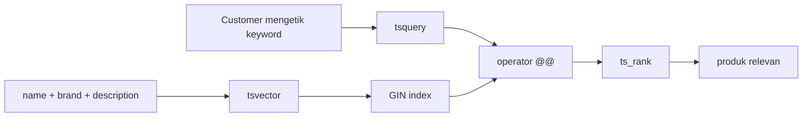
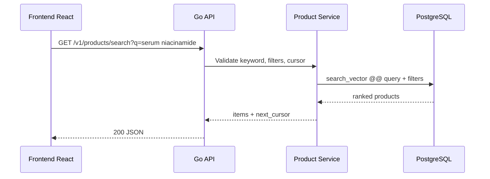

import { Section, Box, Steps, Step, Recap, CardGrid, Card, Chip, Hero, Compare, FileTree, Endpoint, Def } from "@components";

<Hero eyebrow="Roadmap 9 &middot; Advanced Backend Engineering" title="Optimasi Pencarian <em>Produk</em><br />dengan PostgreSQL">
  <p>Pencarian produk yang baik bukan hanya cepat, tetapi juga relevan saat customer mengetik nama bahan, brand, atau masalah kulit.</p>
  <Fragment slot="meta">
    <Chip icon="database">Bahasa: <b>Go 1.26</b></Chip>
    <Chip icon="clock">~60 menit baca</Chip>
  </Fragment>
</Hero>

<Section num="01" id="intro" title="Kenapa Search Perlu Dioptimasi?" sub="Dari LIKE sederhana menuju search yang bisa dipakai customer sungguhan">

<p class="lead">Di katalog skincare, customer jarang mencari dengan satu pola rapi seperti `name = 'Sunscreen SPF 50'`.</p>

Mereka bisa mengetik `sunscreen oily skin`, `niacinamide serum`, `wardah acne`, atau `moisturizer ceramide`. Kalau API hanya memakai `ILIKE '%keyword%'`, database harus banyak membaca teks mentah dan relevansi hasil sulit diurutkan.

<Box variant="bridge" icon="🌉" label="Jembatan: dari LIKE ke full-text search"><p>Di Laravel atau SQL biasa, `LIKE` mirip mencari substring. PostgreSQL full-text search memecah teks menjadi token yang dapat dicari, diindeks, dan diberi ranking.</p></Box>

<Compare aLabel="LIKE / ILIKE" bLabel="PostgreSQL full-text search" aTone="muted" bTone="violet">
  <Fragment slot="a"><ul><li>Cocok untuk pencarian substring sederhana.</li><li>Sulit memberi ranking berbasis relevansi.</li><li>`%keyword%` sering buruk untuk indeks B-tree biasa.</li></ul></Fragment>
  <Fragment slot="b"><ul><li>Cocok untuk dokumen teks seperti nama, brand, dan deskripsi produk.</li><li>Mendukung operator query, stemming sesuai konfigurasi bahasa, dan ranking.</li><li>Dapat dipercepat dengan GIN index pada `tsvector`.</li></ul></Fragment>
</Compare>

Di modul ini kita tetap memakai PostgreSQL, bukan langsung menambah layanan baru. Prinsip scaling yang sehat adalah mengoptimalkan tempat yang tepat lebih dulu, lalu baru menambah komponen seperti OpenSearch saat kebutuhan sudah jelas.

</Section>

<Section num="02" id="mental-model" title="Mental Model Full-Text Search" sub="Dokumen, query, match, ranking">

<p class="lead">PostgreSQL full-text search bekerja dengan dua tipe utama, `tsvector` untuk dokumen dan `tsquery` untuk pertanyaan pencarian.</p>

<Def term="tsvector"><p>Representasi dokumen yang sudah dinormalisasi menjadi lexeme. Untuk produk skincare, dokumennya bisa gabungan nama produk, brand, dan deskripsi.</p></Def>

<Def term="tsquery"><p>Representasi query pencarian. Contoh terkontrol: `sunscreen &amp; spf`, artinya hasil harus mengandung lexeme `sunscreen` dan `spf`.</p></Def>

<Def term="@@"><p>Operator match PostgreSQL yang membaca apakah `tsvector` memenuhi `tsquery`.</p></Def>

<Def term="ts_rank"><p>Fungsi ranking yang memberi skor relevansi berdasarkan seberapa cocok dokumen dengan query.</p></Def>

<Def term="GIN"><p>Generalized Inverted Index, tipe indeks PostgreSQL yang cocok untuk mencari elemen di dalam nilai komposit seperti daftar lexeme pada `tsvector`.</p></Def>



<p class="fig-cap"><b>Gambar 1.</b> Full-text search mengubah teks produk dan input pencarian menjadi bentuk yang bisa dicocokkan dan diurutkan.</p>

<Box variant="note" icon="📘" label="Rujukan resmi"><p>Konsep `tsvector`, `tsquery`, operator `@@`, ranking, dan indeks untuk full-text search dijelaskan di dokumentasi PostgreSQL Chapter 12: [Full Text Search](https://www.postgresql.org/docs/current/textsearch.html).</p></Box>

</Section>

<Section num="03" id="search-vector" title="Membangun tsvector dari Banyak Kolom" sub="Nama produk lebih penting dari deskripsi panjang">

<p class="lead">Untuk katalog skincare, pencarian biasanya harus membaca lebih dari satu kolom.</p>

Kita akan membuat kolom `search_vector` dari `name`, `brand`, dan `description`. Nama produk diberi bobot lebih tinggi karena customer yang mencari `sunscreen` biasanya ingin produk yang namanya mengandung sunscreen muncul di atas deskripsi yang hanya menyebut kata itu sekilas.

<Box variant="tip" icon="💡" label="Pilih konfigurasi bahasa dengan sadar"><p>Contoh ini memakai konfigurasi `simple` karena katalog skincare sering berisi brand, istilah Inggris, dan istilah bahan aktif. Untuk konten berbahasa Inggris penuh, `english` bisa memberi stemming yang lebih agresif.</p></Box>

```sql title="migrations/202606060903_add_product_search.sql"
ALTER TABLE products
ADD COLUMN search_vector tsvector
GENERATED ALWAYS AS (
  setweight(to_tsvector('simple', coalesce(name, '')), 'A') ||
  setweight(to_tsvector('simple', coalesce(brand, '')), 'B') ||
  setweight(to_tsvector('simple', coalesce(description, '')), 'C')
) STORED;

CREATE INDEX idx_products_search_vector
ON products
USING GIN (search_vector);
```

Kolom generated membuat aplikasi Go tidak perlu mengingat kapan harus mengisi ulang `search_vector`. Setiap kali `name`, `brand`, atau `description` berubah, PostgreSQL menghitung ulang nilai tersebut.

<Compare aLabel="Di aplikasi" bLabel="Di database" aTone="muted" bTone="blue">
  <Fragment slot="a"><ul><li>Go menghitung string search lalu update manual.</li><li>Mudah lupa saat ada route admin baru.</li><li>Butuh logic duplikat di beberapa tempat.</li></ul></Fragment>
  <Fragment slot="b"><ul><li>PostgreSQL menjaga `search_vector` konsisten.</li><li>Repository cukup update kolom asli.</li><li>Index memakai nilai yang selalu sinkron.</li></ul></Fragment>
</Compare>

<Box variant="warn" icon="⚠️" label="Production migration"><p>Untuk tabel besar, `CREATE INDEX CONCURRENTLY` lebih aman karena mengurangi blocking write, tetapi biasanya tidak boleh dijalankan di dalam transaction migration yang sama.</p></Box>

```sql title="migrations/202606060903_add_product_search_index_concurrent.sql"
CREATE INDEX CONCURRENTLY IF NOT EXISTS idx_products_search_vector
ON products
USING GIN (search_vector);
```

</Section>

<Section num="04" id="gin-index" title="GIN Index untuk Search Vector" sub="Agar search tidak scan seluruh katalog">

<p class="lead">GIN index membuat PostgreSQL bisa menemukan produk yang mengandung lexeme tertentu tanpa membaca semua baris satu per satu.</p>

GIN bekerja seperti inverted index: lexeme menunjuk ke daftar row yang memilikinya. Ini mirip struktur internal search engine, tetapi tetap berada di PostgreSQL.

```sql title="sql/explain-search.sql"
EXPLAIN (ANALYZE, BUFFERS)
SELECT id, name, brand
FROM products
WHERE search_vector @@ to_tsquery('simple', 'sunscreen & spf')
ORDER BY ts_rank(search_vector, to_tsquery('simple', 'sunscreen & spf')) DESC
LIMIT 20;
```

Saat indeks efektif, plan biasanya menunjukkan penggunaan Bitmap Index Scan pada indeks GIN, lalu Bitmap Heap Scan untuk mengambil row produk. Ranking masih perlu dihitung untuk kandidat hasil, jadi tetap batasi jumlah hasil dengan filter dan `LIMIT`.

<Box variant="note" icon="📘" label="GIN bukan obat semua query"><p>GIN mempercepat pencarian match `@@`, tetapi sorting ranking, filter harga, filter kategori, dan pagination tetap perlu didesain dengan benar.</p></Box>

<CardGrid cols={3}>
  <Card><h4>Search match</h4><p>`search_vector @@ query` cocok untuk GIN index.</p></Card>
  <Card><h4>Ranking</h4><p>`ts_rank` membantu urutan relevansi, tetapi bukan indeks urutan.</p></Card>
  <Card><h4>Filter domain</h4><p>Kategori, status aktif, dan rentang harga tetap butuh indeks biasa yang sesuai.</p></Card>
</CardGrid>

</Section>

<Section num="05" id="ranking-query" title="Query Search dan Ranking" sub="to_tsquery untuk query terkontrol, websearch_to_tsquery untuk input customer">

<p class="lead">`to_tsquery` powerful, tetapi input customer bebas lebih aman diproses dengan `websearch_to_tsquery` atau `plainto_tsquery`.</p>

`to_tsquery` menerima sintaks khusus seperti `&`, `|`, `!`, dan operator phrase. Ini bagus untuk query yang dibangun oleh aplikasi, tetapi dapat menghasilkan error jika string dari customer tidak valid. Untuk search box publik, `websearch_to_tsquery` biasanya lebih ramah karena menerima gaya pencarian web seperti kata biasa dan tanda kutip.

```sql title="sql/tsquery-examples.sql"
SELECT to_tsvector('simple', 'Azarine Hydrasoothe Sunscreen Gel SPF 45');

SELECT to_tsquery('simple', 'sunscreen & spf');

SELECT websearch_to_tsquery('simple', 'sunscreen spf');
```

Query utama untuk katalog bisa menggabungkan match, ranking, dan filter status aktif.

```sql title="sql/search-products-ranked.sql"
WITH q AS (
  SELECT websearch_to_tsquery('simple', $1) AS query
)
SELECT
  p.id,
  p.name,
  p.brand,
  p.slug,
  p.price,
  p.image_url,
  ts_rank(p.search_vector, q.query) AS rank
FROM products p
CROSS JOIN q
WHERE p.is_active = true
  AND p.deleted_at IS NULL
  AND p.search_vector @@ q.query
ORDER BY rank DESC, p.id DESC
LIMIT $2;
```

Jika admin panel punya mode query lanjutan, barulah `to_tsquery` masuk akal karena user internal bisa memahami sintaks `sunscreen & spf`.

```sql title="sql/search-products-admin-advanced.sql"
WITH q AS (
  SELECT to_tsquery('simple', $1) AS query
)
SELECT
  p.id,
  p.name,
  p.brand,
  ts_rank(p.search_vector, q.query) AS rank
FROM products p
CROSS JOIN q
WHERE p.search_vector @@ q.query
ORDER BY rank DESC, p.id DESC
LIMIT 50;
```

<Box variant="warn" icon="⚠️" label="Jangan concat SQL query"><p>Tetap kirim keyword sebagai parameter SQL. Parameter mencegah SQL injection, sedangkan fungsi seperti `websearch_to_tsquery` membantu mengubah input teks menjadi query full-text.</p></Box>

</Section>

<Section num="06" id="filter-pagination" title="Filter dan Keyset Pagination" sub="Search jarang berdiri sendiri">

<p class="lead">Di produk skincare, search biasanya digabung dengan kategori, brand, range harga, tipe kulit, dan status stok.</p>

Contoh API: customer mencari `serum niacinamide`, lalu filter kategori `serum`, brand tertentu, dan harga di bawah batas tertentu. SQL-nya tetap satu query, dengan `WHERE ... AND search_vector @@ query`.

```sql title="sql/search-products-filtered.sql"
WITH q AS (
  SELECT websearch_to_tsquery('simple', $1) AS query
)
SELECT
  p.id,
  p.name,
  p.brand,
  p.slug,
  p.price,
  ts_rank(p.search_vector, q.query) AS rank
FROM products p
CROSS JOIN q
WHERE p.is_active = true
  AND p.deleted_at IS NULL
  AND ($2::text IS NULL OR p.category_slug = $2)
  AND ($3::text IS NULL OR p.brand = $3)
  AND ($4::bigint IS NULL OR p.price <= $4)
  AND p.search_vector @@ q.query
ORDER BY rank DESC, p.id DESC
LIMIT $5;
```

`OFFSET` besar lambat karena PostgreSQL tetap harus melewati banyak row sebelum mengembalikan halaman berikutnya. Untuk search yang bisa di-scroll, gunakan keyset pagination berbasis pasangan `rank` dan `id` dari item terakhir.

```sql title="sql/search-products-keyset.sql"
WITH q AS (
  SELECT websearch_to_tsquery('simple', $1) AS query
), ranked AS (
  SELECT
    p.id,
    p.name,
    p.brand,
    p.slug,
    p.price,
    ts_rank(p.search_vector, q.query) AS rank
  FROM products p
  CROSS JOIN q
  WHERE p.is_active = true
    AND p.deleted_at IS NULL
    AND ($2::text IS NULL OR p.category_slug = $2)
    AND p.search_vector @@ q.query
)
SELECT id, name, brand, slug, price, rank
FROM ranked
WHERE $3::real IS NULL
   OR rank < $3
   OR (rank = $3 AND id < $4)
ORDER BY rank DESC, id DESC
LIMIT $5;
```

<Box variant="tip" icon="💡" label="Cursor search"><p>Response API cukup mengirim `next_cursor` yang berisi `rank` dan `id` terakhir. Request berikutnya mengirim cursor itu kembali.</p></Box>

<Box variant="warn" icon="⚠️" label="Inventory bukan filter search sembarangan"><p>Jangan jadikan full-text search sebagai sumber kebenaran stok. Stok harus tetap dihitung dari domain inventory karena nilainya sangat dinamis.</p></Box>

</Section>

<Section num="07" id="implementasi-go" title="Implementasi Repository dengan pgx" sub="Go menjaga SQL tetap eksplisit dan mudah diukur">

<p class="lead">Di Go, repository cukup menyimpan SQL yang jelas, menerima `context.Context`, lalu mengembalikan struct hasil pencarian.</p>

<FileTree title="Potongan struktur search produk" tree={`internal/
  product/
    search_repository.go  # query full-text search dengan pgxpool
    search_service.go     # validasi input dan cursor
    handler.go            # HTTP handler untuk /v1/products/search
migrations/
  202606060903_add_product_search.sql
go.mod
`} />

```go title="internal/product/search_repository.go"
package product

import (
	"context"
	"errors"
	"strings"

	"github.com/jackc/pgx/v5"
	"github.com/jackc/pgx/v5/pgxpool"
)

type SearchRepository struct {
	pool *pgxpool.Pool
}

func NewSearchRepository(pool *pgxpool.Pool) *SearchRepository {
	return &SearchRepository{pool: pool}
}

type SearchProductsParams struct {
	Keyword      string
	CategorySlug *string
	LastRank     *float32
	LastID       *int64
	Limit        int32
}

type SearchProductRow struct {
	ID    int64
	Name  string
	Brand string
	Slug  string
	Price int64
	Rank  float32
}

func (r *SearchRepository) SearchProducts(ctx context.Context, params SearchProductsParams) ([]SearchProductRow, error) {
	keyword := strings.TrimSpace(params.Keyword)
	if keyword == "" {
		return nil, errors.New("keyword is required")
	}

	limit := params.Limit
	if limit <= 0 || limit > 50 {
		limit = 20
	}

	const query = `
WITH q AS (
  SELECT websearch_to_tsquery('simple', $1) AS query
), ranked AS (
  SELECT
    p.id,
    p.name,
    p.brand,
    p.slug,
    p.price,
    ts_rank(p.search_vector, q.query) AS rank
  FROM products p
  CROSS JOIN q
  WHERE p.is_active = true
    AND p.deleted_at IS NULL
    AND ($2::text IS NULL OR p.category_slug = $2)
    AND p.search_vector @@ q.query
)
SELECT id, name, brand, slug, price, rank
FROM ranked
WHERE $3::real IS NULL
   OR rank < $3
   OR (rank = $3 AND id < $4)
ORDER BY rank DESC, id DESC
LIMIT $5`

	rows, err := r.pool.Query(ctx, query, keyword, params.CategorySlug, params.LastRank, params.LastID, limit)
	if err != nil {
		return nil, err
	}
	defer rows.Close()

	products, err := pgx.CollectRows(rows, pgx.RowToStructByName[SearchProductRow])
	if err != nil {
		return nil, err
	}

	return products, nil
}
```

<Box variant="bridge" icon="🌉" label="Jembatan: dari Eloquent ke pgx"><p>Di Laravel, builder sering menyembunyikan SQL. Di Go dengan pgx, SQL terlihat jelas sehingga lebih mudah di-`EXPLAIN`, dioptimasi, dan dibahas dengan DBA.</p></Box>

Kode di atas sengaja tidak membuat query builder dinamis. Untuk search produk yang kritikal, query eksplisit biasanya lebih mudah di-review daripada string SQL yang disusun dari banyak cabang.

</Section>

<Section num="08" id="api-domain" title="Skenario API Online Shop Skincare" sub="Search menjadi bagian dari customer journey, bukan fitur terpisah">

<p class="lead">Customer journey katalog dimulai dari browse, filter, search, lalu masuk ke product detail.</p>

<Endpoint method="GET" path="/v1/products/search?q=sunscreen&amp;category=suncare" desc="Cari produk aktif dengan full-text search dan filter kategori" />
<Endpoint method="GET" path="/v1/products?category=suncare" desc="Browse katalog tanpa keyword, tetap memakai filter dan keyset pagination" />
<Endpoint method="GET" path="/v1/products/{slug}" desc="Product detail, cocok digabung dengan cache dari modul sebelumnya" />



<p class="fig-cap"><b>Gambar 2.</b> Search tetap lewat service layer agar validasi domain dan aturan pagination tidak bocor ke handler.</p>

<CardGrid cols={3}>
  <Card><h4>Keyword</h4><p>Dipakai untuk full-text search pada nama, brand, dan deskripsi.</p></Card>
  <Card><h4>Filter</h4><p>Kategori, brand, harga, dan status aktif dipakai di `WHERE` yang sama.</p></Card>
  <Card><h4>Cursor</h4><p>Frontend menyimpan cursor halaman terakhir, bukan angka halaman besar.</p></Card>
</CardGrid>

<Box variant="note" icon="📌" label="Relasi dengan cache"><p>Search result sering lebih dinamis daripada product detail. Cache product detail boleh agresif, tetapi search result perlu hati-hati karena filter dan ranking membuat kombinasi key meledak.</p></Box>

</Section>

<Section num="09" id="opensearch" title="Kapan Perlu OpenSearch?" sub="Jangan menambah sistem baru hanya karena terdengar enterprise">

<p class="lead">PostgreSQL full-text search sudah cukup untuk banyak online shop kecil sampai menengah.</p>

OpenSearch mulai masuk akal ketika kebutuhan search melampaui kemampuan PostgreSQL sebagai database utama. Tandanya bukan sekadar ada fitur search, tetapi kebutuhan relevansi, bahasa, fuzzy matching, analytics, dan volume sudah menjadi masalah bisnis.

<CardGrid cols={2}>
  <Card><h4>Tetap PostgreSQL dulu</h4><p>Katalog masih ratusan ribu produk, bahasa terbatas, typo tolerance tidak wajib, dan query bisa dijaga dengan indeks.</p></Card>
  <Card><h4>Pertimbangkan OpenSearch</h4><p>Katalog lebih dari 1 juta produk, multi-language serius, fuzzy search wajib, autocomplete kompleks, dan tim siap mengelola sinkronisasi data.</p></Card>
</CardGrid>

<Box variant="warn" icon="⚠️" label="Biaya kompleksitas"><p>OpenSearch berarti ada pipeline sinkronisasi, reindex, monitoring cluster, mapping, dan failure mode baru. Jangan pindah sebelum bottleneck terbukti lewat data.</p></Box>

<Compare aLabel="PostgreSQL full-text search" bLabel="OpenSearch" aTone="blue" bTone="teal">
  <Fragment slot="a"><ul><li>Satu sumber data, transaksi tetap sederhana.</li><li>Bagus untuk search katalog yang masih dekat dengan SQL filter.</li><li>Lebih mudah dioperasikan bersama RDS PostgreSQL.</li></ul></Fragment>
  <Fragment slot="b"><ul><li>Lebih kuat untuk fuzzy search, autocomplete, multi-language, dan relevansi kompleks.</li><li>Butuh sinkronisasi dari database utama.</li><li>Menambah biaya infrastruktur dan observability.</li></ul></Fragment>
</Compare>

</Section>

<Section num="10" id="hands-on" title="Hands-on Ringan" sub="Tambahkan search ke katalog lokal dan ukur plan-nya">

<p class="lead">Hands-on ini fokus pada validasi search dengan SQL dan repository Go, bukan membuat UI.</p>

<Steps>
  <Step><b>Tambahkan kolom search vector</b><p>Jalankan migration `ADD COLUMN search_vector` dan GIN index pada tabel `products`.</p></Step>
  <Step><b>Seed produk skincare</b><p>Masukkan beberapa produk sunscreen, serum, moisturizer, dan cleanser dengan brand serta deskripsi yang realistis.</p></Step>
  <Step><b>Uji query ranking</b><p>Jalankan query `websearch_to_tsquery` untuk keyword `sunscreen spf` dan pastikan produk paling relevan muncul di atas.</p></Step>
  <Step><b>Bandingkan plan</b><p>Gunakan `EXPLAIN (ANALYZE, BUFFERS)` sebelum dan sesudah GIN index untuk melihat perbedaan.</p></Step>
  <Step><b>Hubungkan repository Go</b><p>Pakai `SearchRepository.SearchProducts` dari handler `GET /v1/products/search`.</p></Step>
</Steps>

```sql title="sql/seed-search-products.sql"
INSERT INTO products (name, brand, slug, description, price, category_slug, is_active)
VALUES
  ('Hydrating Sunscreen Gel SPF 50', 'Azarine', 'azarine-hydrating-sunscreen-gel-spf-50', 'Lightweight sunscreen gel for oily skin and daily outdoor use', 65000, 'suncare', true),
  ('Niacinamide Brightening Serum', 'Somethinc', 'somethinc-niacinamide-brightening-serum', 'Serum with niacinamide for uneven tone and dull skin', 89000, 'serum', true),
  ('Ceramide Barrier Moisturizer', 'Skintific', 'skintific-ceramide-barrier-moisturizer', 'Moisturizer with ceramide to support skin barrier', 125000, 'moisturizer', true),
  ('Gentle Low pH Cleanser', 'COSRX', 'cosrx-gentle-low-ph-cleanser', 'Daily cleanser for sensitive and acne prone skin', 99000, 'cleanser', true);
```

```bash title="Terminal"
psql "$DATABASE_URL" -f migrations/202606060903_add_product_search.sql
psql "$DATABASE_URL" -f sql/seed-search-products.sql
psql "$DATABASE_URL" -f sql/explain-search.sql
go test ./...
```

<Box variant="tip" icon="✅" label="Kriteria selesai"><p>Query search memakai GIN index, hasil punya ranking, filter kategori tetap bekerja, dan halaman berikutnya memakai cursor, bukan `OFFSET` besar.</p></Box>

</Section>

<Section num="11" id="ringkasan" title="Ringkasan &amp; Poin Penting">

<p class="lead">Search optimization di proyek skincare berarti membuat katalog mudah ditemukan tanpa buru-buru menambah search engine terpisah.</p>

<Recap title="Yang Wajib Menempel">
  <ul><li>`tsvector` menyimpan dokumen search dari banyak kolom seperti `name`, `brand`, dan `description`.</li><li>GIN index mempercepat operator `@@` pada `tsvector`, tetapi ranking dan filter tetap perlu query yang dirancang baik.</li><li>`ts_rank` membantu mengurutkan hasil berdasarkan relevansi, terutama ketika nama produk diberi bobot lebih tinggi daripada deskripsi.</li><li>Search dan filter harus digabung di `WHERE` yang sama agar customer bisa mencari produk skincare berdasarkan keyword, kategori, brand, dan harga.</li><li>`OFFSET` besar lambat untuk halaman jauh. Gunakan keyset pagination dengan cursor berbasis `rank` dan `id`.</li><li>`to_tsquery` cocok untuk query terkontrol, sedangkan `websearch_to_tsquery` lebih aman untuk input search box publik.</li><li>OpenSearch dipertimbangkan ketika volume, multi-language, fuzzy search, dan relevansi kompleks sudah menjadi kebutuhan nyata, bukan hanya karena ingin terlihat scalable.</li></ul>
</Recap>

Di proyek online shop skincare, modul ini memperkuat katalog produk. Setelah product detail bisa di-cache dan search bisa memakai indeks, langkah scaling berikutnya adalah memisahkan proses berat seperti notifikasi, email, dan integrasi payment ke arsitektur event-driven.

</Section>
