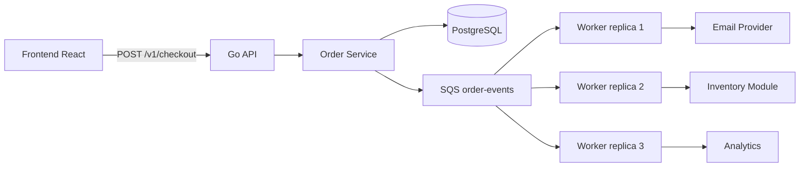
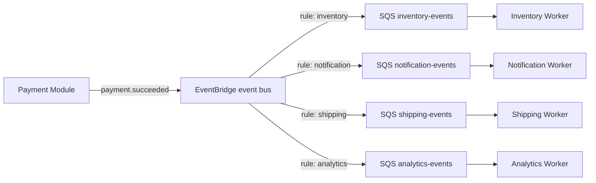
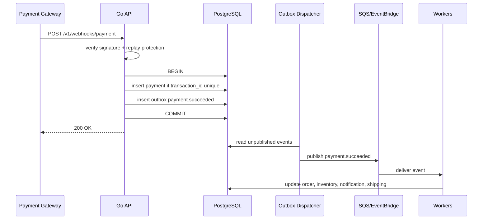

import { Section, Box, Steps, Step, Recap, CardGrid, Card, Chip, Hero, Compare, FileTree, Endpoint, Def } from "@components";

<Hero eyebrow="Roadmap 9 &middot; Advanced Scaling" title="Event-Driven Architecture<br /><em>dengan SQS</em>">
  <p>Di modul ini, checkout tetap cepat karena order disimpan dulu, sementara email, inventory, shipping, dan notifikasi diproses lewat event.</p>
  <Fragment slot="meta">
    <Chip icon="code">Bahasa: <b>Go 1.26</b></Chip>
    <Chip icon="clock">~60 menit baca</Chip>
  </Fragment>
</Hero>

<Section num="01" id="intro" title="Kenapa Event-Driven?">

<p class="lead">Di React, kita sering memisahkan state update dari side effect lewat event handler dan effect. Di backend, pola yang mirip dipakai untuk memisahkan transaksi inti dari pekerjaan sampingan.</p>

Pada checkout skincare shop, core flow yang wajib cepat dan konsisten adalah membuat order, menghitung total, mengunci harga, dan menyimpan status awal. Setelah itu ada banyak side effect: kirim email, kurangi stok fisik, request shipping, update analytics, dan trigger notifikasi. Bila semuanya dijalankan sinkron di request `POST /v1/checkout`, pelanggan menunggu lebih lama dan satu integrasi lambat bisa menggagalkan order yang sebenarnya valid.

<Def term="Event-driven architecture"><p>Pola arsitektur di mana perubahan penting dalam domain dinyatakan sebagai event, lalu komponen lain bereaksi terhadap event itu secara asynchronous.</p></Def>

<Def term="Domain event"><p>Fakta bisnis yang sudah terjadi, dinamai dengan bentuk lampau, misalnya `OrderCreated`, `PaymentSucceeded`, `StockReserved`, dan `NotificationRequested`.</p></Def>

<Box variant="bridge" icon="🌉" label="Jembatan: dari Laravel event ke Go event"><p>Di Laravel kamu mungkin memakai event dan listener. Di Go, kita biasanya membuat struct event eksplisit, interface publisher, dan worker consumer yang membaca queue.</p></Box>

<Compare aLabel="Flow sinkron" bLabel="Flow event-driven" aTone="red" bTone="violet">
  <Fragment slot="a"><ul><li>Request checkout menunggu payment hook, email, inventory, shipping, dan analytics.</li><li>Error email bisa ikut menggagalkan response walau order sudah valid.</li><li>Latency makin buruk ketika downstream bertambah.</li></ul></Fragment>
  <Fragment slot="b"><ul><li>Request checkout cukup menyimpan order dan event.</li><li>Worker memproses side effect di luar request utama.</li><li>Downstream gagal bisa retry tanpa membuat pelanggan menunggu.</li></ul></Fragment>
</Compare>

Di AWS, Amazon SQS adalah queue terkelola untuk memisahkan producer dan consumer. Producer mengirim message, consumer mengambil message, memprosesnya, lalu menghapus message setelah sukses. Untuk routing event ke banyak subscriber, Amazon EventBridge lebih cocok karena satu rule dapat mengirim event ke beberapa target.

</Section>

<Section num="02" id="domain-event" title="Domain Event di Go">

<p class="lead">Event di Go sebaiknya bukan `map[string]any` liar. Buat kontrak eksplisit agar payload mudah dites, divalidasi, dan diubah secara aman.</p>

Event harus menjawab empat hal: apa yang terjadi, kapan terjadi, entity mana yang berubah, dan data minimal apa yang dibutuhkan subscriber. Hindari memasukkan seluruh row database ke event, karena itu membuat event rapuh terhadap perubahan schema internal.

<Box variant="tip" icon="💡" label="Idiom Go"><p>Pakailah event envelope kecil dan payload typed. Envelope memudahkan metadata umum, payload typed menjaga business meaning tetap jelas.</p></Box>

```go title="internal/events/event.go"
package events

import (
	"encoding/json"
	"time"
)

type Type string

const (
	OrderCreated          Type = "order.created"
	PaymentSucceeded      Type = "payment.succeeded"
	StockReserved         Type = "stock.reserved"
	NotificationRequested Type = "notification.requested"
)

type Event struct {
	ID            string          `json:"id"`
	Type          Type            `json:"type"`
	AggregateType string          `json:"aggregate_type"`
	AggregateID   string          `json:"aggregate_id"`
	OccurredAt    time.Time       `json:"occurred_at"`
	Payload       json.RawMessage `json:"payload"`
}

type OrderCreatedPayload struct {
	OrderID    string `json:"order_id"`
	CustomerID string `json:"customer_id"`
	Total      int64  `json:"total"`
	Currency   string `json:"currency"`
}

type PaymentSucceededPayload struct {
	OrderID       string `json:"order_id"`
	PaymentID     string `json:"payment_id"`
	TransactionID string `json:"transaction_id"`
	PaidAmount    int64  `json:"paid_amount"`
	PaidAt        string `json:"paid_at"`
}
```

Nama event memakai dotted name seperti `payment.succeeded` untuk message body dan queue. Nama struct Go tetap `PaymentSucceededPayload` karena idiom Go lebih mudah dibaca dengan PascalCase untuk exported type.

<Def term="Event envelope"><p>Wrapper metadata umum event, misalnya `id`, `type`, `aggregate_id`, `occurred_at`, dan `payload`.</p></Def>

<Def term="Aggregate"><p>Entity domain utama yang menjadi pusat perubahan, misalnya order, payment, stock reservation, atau notification request.</p></Def>

<Box variant="warn" icon="⚠️" label="Jangan jadikan event sebagai database dump"><p>Event adalah kontrak antar bagian sistem. Bila payload berisi semua kolom internal, setiap perubahan schema bisa memecahkan consumer.</p></Box>

</Section>

<Section num="03" id="event-catalog" title="Katalog Event Skincare Shop">

<p class="lead">Event catalog adalah daftar event resmi yang boleh dipublish oleh domain. Ini mirip API contract, tetapi untuk komunikasi asynchronous.</p>

<CardGrid cols={2}>
  <Card><h4>OrderCreated</h4><p>Diterbitkan setelah order valid tersimpan. Dipakai untuk email konfirmasi awal, analytics, dan proses payment instruction.</p></Card>
  <Card><h4>PaymentSucceeded</h4><p>Diterbitkan setelah webhook payment valid dan idempotent. Dipakai untuk update order, inventory, email, dan shipping.</p></Card>
  <Card><h4>StockReserved</h4><p>Diterbitkan setelah stok berhasil direservasi untuk order. Dipakai untuk audit inventory dan notifikasi stok rendah.</p></Card>
  <Card><h4>NotificationRequested</h4><p>Diterbitkan ketika sistem ingin mengirim email, WhatsApp, atau push notification melalui worker terpisah.</p></Card>
</CardGrid>

Event tidak selalu berarti microservice. Di modular monolith Go, event tetap berguna untuk memisahkan module `order`, `payment`, `inventory`, dan `notification` tanpa memanggil semuanya secara langsung dari handler checkout.

<FileTree title="Struktur event-driven modular monolith" tree={`cmd/
  api/
    main.go                 # HTTP API
  worker/
    main.go                 # SQS consumer
internal/
  events/
    event.go                # envelope dan payload event
    publisher.go            # interface publisher
    sqs_publisher.go        # implementasi AWS SQS
  order/
    service.go              # create order + outbox event
  payment/
    webhook_handler.go      # validasi payment webhook
    event_handler.go        # handle payment.succeeded
  inventory/
    event_handler.go        # handle stock update
  notification/
    event_handler.go        # kirim email atau WhatsApp
  outbox/
    dispatcher.go           # publish event tersimpan ke SQS
`} />

<Endpoint method="POST" path="/v1/checkout" desc="Membuat order dan event `order.created`" />
<Endpoint method="POST" path="/v1/webhooks/payment" desc="Memvalidasi webhook dan membuat event `payment.succeeded`" />

<Box variant="note" icon="🧭" label="Event bukan command"><p>`OrderCreated` berarti order sudah terjadi. `CreateOrder` adalah perintah untuk melakukan sesuatu. Jangan campur keduanya.</p></Box>

</Section>

<Section num="04" id="publish-ke-sqs" title="Publish Event ke SQS">

<p class="lead">Publisher adalah boundary. Service domain cukup tahu ada `Publisher`, bukan tahu detail AWS SDK.</p>

Pertama, buat interface kecil. Pola ini konsisten dengan gaya Go: dependency menerima interface yang dibutuhkan, sedangkan implementasi konkret berada di package infrastructure.

```go title="internal/events/publisher.go"
package events

import "context"

type Publisher interface {
	Publish(ctx context.Context, event Event) error
}
```

Implementasi SQS memakai AWS SDK for Go V2. Message body berisi envelope event. Message attributes menyimpan `event_type` agar observability dan filter dasar lebih mudah.

```go title="internal/events/sqs_publisher.go"
package events

import (
	"context"
	"encoding/json"
	"fmt"

	"github.com/aws/aws-sdk-go-v2/aws"
	"github.com/aws/aws-sdk-go-v2/service/sqs"
	"github.com/aws/aws-sdk-go-v2/service/sqs/types"
)

type SQSPublisher struct {
	client   *sqs.Client
	queueURL string
}

func NewSQSPublisher(client *sqs.Client, queueURL string) *SQSPublisher {
	return &SQSPublisher{client: client, queueURL: queueURL}
}

func (p *SQSPublisher) Publish(ctx context.Context, event Event) error {
	body, err := json.Marshal(event)
	if err != nil {
		return fmt.Errorf("marshal event %s: %w", event.Type, err)
	}

	_, err = p.client.SendMessage(ctx, &sqs.SendMessageInput{
		QueueUrl:    aws.String(p.queueURL),
		MessageBody: aws.String(string(body)),
		MessageAttributes: map[string]types.MessageAttributeValue{
			"event_type": {
				DataType:    aws.String("String"),
				StringValue: aws.String(string(event.Type)),
			},
			"aggregate_id": {
				DataType:    aws.String("String"),
				StringValue: aws.String(event.AggregateID),
			},
		},
	})
	if err != nil {
		return fmt.Errorf("send event %s to sqs: %w", event.Type, err)
	}

	return nil
}
```

Konfigurasi client SQS biasanya dilakukan di `cmd/api/main.go` atau wiring layer. Jangan membuat client SQS baru setiap publish, karena client didesain untuk dipakai ulang.

```go title="cmd/api/main.go"
package main

import (
	"context"
	"log"
	"os"

	"github.com/aws/aws-sdk-go-v2/config"
	"github.com/aws/aws-sdk-go-v2/service/sqs"

	"github.com/kamu/skincare-backend/internal/events"
)

func main() {
	ctx := context.Background()

	awsConfig, err := config.LoadDefaultConfig(ctx)
	if err != nil {
		log.Fatalf("load aws config: %v", err)
	}

	sqsClient := sqs.NewFromConfig(awsConfig)
	publisher := events.NewSQSPublisher(sqsClient, os.Getenv("ORDER_EVENTS_QUEUE_URL"))

	_ = publisher
}
```

<Box variant="bridge" icon="🌉" label="Jembatan: mirip dispatch job di Laravel"><p>Bedanya, di Go kamu menulis interface dan implementasi queue secara eksplisit. Tidak ada facade global, sehingga dependency lebih mudah dites.</p></Box>

</Section>

<Section num="05" id="subscriber-worker" title="Subscriber Worker">

<p class="lead">Subscriber adalah proses worker yang hidup terpisah dari API. Ia melakukan long polling ke SQS, memproses event, lalu delete message hanya setelah sukses.</p>

SQS bekerja dengan model receive dan delete. Saat message diterima, message menjadi invisible selama visibility timeout. Bila worker sukses, worker menghapus message. Bila worker gagal atau mati sebelum delete, message akan muncul lagi setelah timeout dan bisa diproses ulang.

```go title="internal/events/handler.go"
package events

import "context"

type Handler interface {
	Handle(ctx context.Context, event Event) error
}

type HandlerFunc func(ctx context.Context, event Event) error

func (fn HandlerFunc) Handle(ctx context.Context, event Event) error {
	return fn(ctx, event)
}
```

```go title="internal/events/sqs_worker.go"
package events

import (
	"context"
	"encoding/json"
	"errors"
	"fmt"
	"log"
	"time"

	"github.com/aws/aws-sdk-go-v2/aws"
	"github.com/aws/aws-sdk-go-v2/service/sqs"
)

type SQSWorker struct {
	client   *sqs.Client
	queueURL string
	handlers map[Type]Handler
}

func NewSQSWorker(client *sqs.Client, queueURL string, handlers map[Type]Handler) *SQSWorker {
	return &SQSWorker{client: client, queueURL: queueURL, handlers: handlers}
}

func (w *SQSWorker) Run(ctx context.Context) error {
	for {
		if err := ctx.Err(); err != nil {
			return err
		}

		output, err := w.client.ReceiveMessage(ctx, &sqs.ReceiveMessageInput{
			QueueUrl:            aws.String(w.queueURL),
			MaxNumberOfMessages: 10,
			WaitTimeSeconds:     20,
			VisibilityTimeout:   60,
		})
		if err != nil {
			log.Printf("receive sqs messages: %v", err)
			time.Sleep(2 * time.Second)
			continue
		}

		for _, msg := range output.Messages {
			if err := w.handleMessage(ctx, aws.ToString(msg.Body)); err != nil {
				log.Printf("handle sqs message: %v", err)
				continue
			}

			_, err := w.client.DeleteMessage(ctx, &sqs.DeleteMessageInput{
				QueueUrl:      aws.String(w.queueURL),
				ReceiptHandle: msg.ReceiptHandle,
			})
			if err != nil {
				log.Printf("delete sqs message: %v", err)
			}
		}
	}
}

func (w *SQSWorker) handleMessage(ctx context.Context, body string) error {
	var event Event
	if err := json.Unmarshal([]byte(body), &event); err != nil {
		return fmt.Errorf("decode event: %w", err)
	}

	handler, ok := w.handlers[event.Type]
	if !ok {
		return fmt.Errorf("%w: %s", ErrNoHandler, event.Type)
	}

	if err := handler.Handle(ctx, event); err != nil {
		return fmt.Errorf("handle event %s: %w", event.Type, err)
	}

	return nil
}

var ErrNoHandler = errors.New("no handler registered")
```

<Box variant="warn" icon="⚠️" label="At-least-once berarti bisa duplikat"><p>Handler worker wajib idempotent. Jangan asumsikan satu event pasti hanya diproses satu kali.</p></Box>

```go title="cmd/worker/main.go"
package main

import (
	"context"
	"log"
	"os"
	"os/signal"
	"syscall"

	"github.com/aws/aws-sdk-go-v2/config"
	"github.com/aws/aws-sdk-go-v2/service/sqs"

	"github.com/kamu/skincare-backend/internal/events"
)

func main() {
	ctx, stop := signal.NotifyContext(context.Background(), syscall.SIGINT, syscall.SIGTERM)
	defer stop()

	awsConfig, err := config.LoadDefaultConfig(ctx)
	if err != nil {
		log.Fatalf("load aws config: %v", err)
	}

	sqsClient := sqs.NewFromConfig(awsConfig)
	handlers := buildHandlers()

	worker := events.NewSQSWorker(sqsClient, os.Getenv("ORDER_EVENTS_QUEUE_URL"), handlers)
	if err := worker.Run(ctx); err != nil && err != context.Canceled {
		log.Fatalf("run worker: %v", err)
	}
}

func buildHandlers() map[events.Type]events.Handler {
	return map[events.Type]events.Handler{
		events.OrderCreated: events.HandlerFunc(func(ctx context.Context, event events.Event) error {
			log.Printf("handle %s for order %s", event.Type, event.AggregateID)
			return nil
		}),
		events.PaymentSucceeded: events.HandlerFunc(func(ctx context.Context, event events.Event) error {
			log.Printf("handle %s for order %s", event.Type, event.AggregateID)
			return nil
		}),
	}
}
```

</Section>

<Section num="06" id="alur-sqs" title="Alur Order Service ke Worker">

<p class="lead">SQS membantu request utama selesai cepat, tetapi penting memahami bahwa satu queue bukan broadcast ke semua consumer.</p>



<p class="fig-cap"><b>Gambar 1.</b> Worker di satu SQS queue adalah consumer pool. Mereka membagi pekerjaan, bukan masing-masing menerima salinan event yang sama.</p>

Untuk fanout sungguhan, gunakan EventBridge atau SNS dengan beberapa SQS queue. Satu queue cocok untuk banyak replica dari worker yang sama. Banyak queue cocok untuk banyak tipe subscriber yang masing-masing harus menerima salinan event.

<Compare aLabel="Satu SQS queue" bLabel="EventBridge ke banyak queue" aTone="muted" bTone="violet">
  <Fragment slot="a"><ul><li>Beberapa worker bersaing mengambil message.</li><li>Cocok untuk scale-out satu jenis pekerjaan.</li><li>Tidak cocok bila email, inventory, dan shipping semuanya wajib menerima event yang sama.</li></ul></Fragment>
  <Fragment slot="b"><ul><li>Event dicocokkan rule lalu dikirim ke target berbeda.</li><li>Cocok untuk fanout `payment.succeeded` ke beberapa subscriber.</li><li>Setiap subscriber punya queue sendiri dan retry policy sendiri.</li></ul></Fragment>
</Compare>

<Box variant="tip" icon="💡" label="Prinsip desain"><p>Mulai dengan satu queue untuk satu kategori pekerjaan. Tambahkan EventBridge ketika fanout dan routing event mulai nyata, bukan sejak hari pertama.</p></Box>

</Section>

<Section num="07" id="outbox-pattern" title="Outbox Pattern">

<p class="lead">Masalah klasik event-driven adalah dual write: transaksi database sukses, tetapi publish ke SQS gagal, atau sebaliknya.</p>

Tanpa outbox, service order biasanya melakukan dua hal berurutan: insert order ke PostgreSQL, lalu publish event ke SQS. Bila insert order sukses tetapi publish gagal, downstream tidak pernah tahu ada order baru. Bila publish sukses tetapi commit database gagal, downstream menerima event untuk order yang tidak ada.

<Def term="Outbox pattern"><p>Pola yang menyimpan event ke tabel database dalam transaksi yang sama dengan perubahan domain, lalu proses terpisah menerbitkan event itu ke broker.</p></Def>

```sql title="migrations/202606060904_create_outbox_events.sql"
CREATE EXTENSION IF NOT EXISTS pgcrypto;

CREATE TABLE outbox_events (
  id uuid PRIMARY KEY DEFAULT gen_random_uuid(),
  event_type text NOT NULL,
  aggregate_type text NOT NULL,
  aggregate_id uuid NOT NULL,
  payload jsonb NOT NULL,
  occurred_at timestamptz NOT NULL DEFAULT now(),
  published_at timestamptz,
  attempts integer NOT NULL DEFAULT 0,
  next_attempt_at timestamptz NOT NULL DEFAULT now(),
  last_error text
);

CREATE INDEX idx_outbox_events_ready
  ON outbox_events (next_attempt_at, occurred_at)
  WHERE published_at IS NULL;
```

Sekarang order dan event disimpan dalam satu transaksi PostgreSQL. Request checkout tidak perlu publish langsung ke SQS.

```go title="internal/order/service.go"
package order

import (
	"context"
	"encoding/json"
	"fmt"
	"time"

	"github.com/jackc/pgx/v5"
	"github.com/jackc/pgx/v5/pgxpool"

	"github.com/kamu/skincare-backend/internal/events"
)

type Service struct {
	db *pgxpool.Pool
}

func NewService(db *pgxpool.Pool) *Service {
	return &Service{db: db}
}

type CreateOrderInput struct {
	CustomerID string
	Total      int64
	Currency   string
}

type Order struct {
	ID         string
	CustomerID string
	Total      int64
	Currency   string
}

func (s *Service) CreateOrder(ctx context.Context, input CreateOrderInput) (Order, error) {
	tx, err := s.db.BeginTx(ctx, pgx.TxOptions{})
	if err != nil {
		return Order{}, fmt.Errorf("begin create order tx: %w", err)
	}
	defer tx.Rollback(ctx)

	var order Order
	err = tx.QueryRow(ctx, `
		INSERT INTO orders (customer_id, total, currency, status, created_at)
		VALUES ($1, $2, $3, 'pending_payment', now())
		RETURNING id, customer_id, total, currency
	`, input.CustomerID, input.Total, input.Currency).Scan(&order.ID, &order.CustomerID, &order.Total, &order.Currency)
	if err != nil {
		return Order{}, fmt.Errorf("insert order: %w", err)
	}

	payload, err := json.Marshal(events.OrderCreatedPayload{
		OrderID:    order.ID,
		CustomerID: order.CustomerID,
		Total:      order.Total,
		Currency:   order.Currency,
	})
	if err != nil {
		return Order{}, fmt.Errorf("marshal order.created payload: %w", err)
	}

	_, err = tx.Exec(ctx, `
		INSERT INTO outbox_events (event_type, aggregate_type, aggregate_id, payload, occurred_at)
		VALUES ($1, 'order', $2, $3, $4)
	`, events.OrderCreated, order.ID, payload, time.Now().UTC())
	if err != nil {
		return Order{}, fmt.Errorf("insert outbox event: %w", err)
	}

	if err := tx.Commit(ctx); err != nil {
		return Order{}, fmt.Errorf("commit create order tx: %w", err)
	}

	return order, nil
}
```

Dispatcher berjalan di worker terpisah. Ia mengambil event yang belum dipublish, mengirim ke SQS, lalu menandai `published_at`.

```go title="internal/outbox/dispatcher.go"
package outbox

import (
	"context"
	"encoding/json"
	"fmt"
	"time"

	"github.com/jackc/pgx/v5"
	"github.com/jackc/pgx/v5/pgxpool"

	"github.com/kamu/skincare-backend/internal/events"
)

type Dispatcher struct {
	db        *pgxpool.Pool
	publisher events.Publisher
}

func NewDispatcher(db *pgxpool.Pool, publisher events.Publisher) *Dispatcher {
	return &Dispatcher{db: db, publisher: publisher}
}

type rowEvent struct {
	ID            string
	EventType     events.Type
	AggregateType string
	AggregateID   string
	Payload       json.RawMessage
	OccurredAt    time.Time
}

func (d *Dispatcher) DispatchOnce(ctx context.Context, limit int) error {
	tx, err := d.db.BeginTx(ctx, pgx.TxOptions{})
	if err != nil {
		return fmt.Errorf("begin outbox tx: %w", err)
	}
	defer tx.Rollback(ctx)

	rows, err := tx.Query(ctx, `
		SELECT id, event_type, aggregate_type, aggregate_id, payload, occurred_at
		FROM outbox_events
		WHERE published_at IS NULL
		  AND next_attempt_at <= now()
		ORDER BY occurred_at
		LIMIT $1
		FOR UPDATE SKIP LOCKED
	`, limit)
	if err != nil {
		return fmt.Errorf("select outbox events: %w", err)
	}
	defer rows.Close()

	for rows.Next() {
		var item rowEvent
		if err := rows.Scan(&item.ID, &item.EventType, &item.AggregateType, &item.AggregateID, &item.Payload, &item.OccurredAt); err != nil {
			return fmt.Errorf("scan outbox event: %w", err)
		}

		event := events.Event{
			ID:            item.ID,
			Type:          item.EventType,
			AggregateType: item.AggregateType,
			AggregateID:   item.AggregateID,
			OccurredAt:    item.OccurredAt,
			Payload:       item.Payload,
		}

		if err := d.publisher.Publish(ctx, event); err != nil {
			_, updateErr := tx.Exec(ctx, `
				UPDATE outbox_events
				SET attempts = attempts + 1,
				    next_attempt_at = now() + interval '30 seconds',
				    last_error = $2
				WHERE id = $1
			`, item.ID, err.Error())
			if updateErr != nil {
				return fmt.Errorf("record publish failure: %w", updateErr)
			}
			continue
		}

		_, err = tx.Exec(ctx, `
			UPDATE outbox_events
			SET published_at = now(), last_error = NULL
			WHERE id = $1
		`, item.ID)
		if err != nil {
			return fmt.Errorf("mark outbox event published: %w", err)
		}
	}

	if err := rows.Err(); err != nil {
		return fmt.Errorf("iterate outbox events: %w", err)
	}

	if err := tx.Commit(ctx); err != nil {
		return fmt.Errorf("commit outbox tx: %w", err)
	}

	return nil
}
```

<Box variant="warn" icon="⚠️" label="Outbox tetap butuh idempotency"><p>Bila publish sukses tetapi update `published_at` gagal, dispatcher bisa mengirim event yang sama lagi. Consumer tetap harus aman terhadap duplikasi.</p></Box>

</Section>

<Section num="08" id="eventbridge-routing" title="Routing dengan EventBridge">

<p class="lead">SQS adalah queue. EventBridge adalah router event. Gunakan sesuai masalahnya.</p>

Jika hanya ada satu worker untuk memproses `order.created`, SQS cukup. Jika `payment.succeeded` harus diterima oleh inventory, email, shipping, dan analytics secara terpisah, EventBridge membuat routing lebih bersih. Order service publish ke EventBridge, lalu rule mengirim event ke queue masing-masing subscriber.



<p class="fig-cap"><b>Gambar 2.</b> EventBridge cocok saat satu event perlu dirutekan ke banyak target tanpa membuat publisher tahu semua subscriber.</p>

<CardGrid cols={3}>
  <Card><h4>SQS saja</h4><p>Cocok untuk satu kategori pekerjaan dengan banyak replica worker, misalnya `notification-events`.</p></Card>
  <Card><h4>EventBridge + SQS</h4><p>Cocok untuk fanout dan routing event berdasarkan `source`, `detail-type`, atau isi payload.</p></Card>
  <Card><h4>Jangan terlalu cepat</h4><p>Untuk monolith kecil, outbox + satu queue sudah cukup. EventBridge masuk saat kebutuhan routing nyata.</p></Card>
</CardGrid>

Contoh event untuk EventBridge biasanya memakai field `source`, `detail-type`, dan `detail`. Detail tetap bisa memakai payload event yang sama agar kontrak domain tidak bercabang terlalu jauh.

```json title="eventbridge-payment-succeeded.json"
{
  "source": "skincare.payment",
  "detail-type": "payment.succeeded",
  "detail": {
    "event_id": "2fb6d62a-1d20-4c50-bc0d-18e2abf40b7a",
    "order_id": "9faad6d5-f191-4d62-97e4-574ffb506d39",
    "payment_id": "3da133b5-9b0b-4c4e-b801-a8a7e3c35c1a",
    "transaction_id": "MID-20260606-0001",
    "paid_amount": 299000,
    "paid_at": "2026-06-06T12:00:00Z"
  }
}
```

<Box variant="bridge" icon="🌉" label="Jembatan: mirip frontend event bus, tapi kontraknya harus serius"><p>Di frontend, event bus sering internal dan longgar. Di backend, event adalah kontrak lintas proses, jadi versioning, idempotency, dan observability wajib dipikirkan.</p></Box>

</Section>

<Section num="09" id="payment-succeeded" title="Contoh PaymentSucceeded">

<p class="lead">`PaymentSucceeded` adalah event paling penting di shop, karena uang sudah diterima dan beberapa perubahan bisnis harus terjadi.</p>

Alur yang aman: webhook payment divalidasi, payment record dibuat idempotent, event `payment.succeeded` disimpan ke outbox, lalu worker subscriber memproses side effect sesuai tanggung jawabnya.



<p class="fig-cap"><b>Gambar 3.</b> Webhook tidak langsung melakukan semua side effect. Ia hanya membuat fakta bisnis yang bisa diproses ulang.</p>

```go title="internal/payment/event_handler.go"
package payment

import (
	"context"
	"encoding/json"
	"fmt"

	"github.com/kamu/skincare-backend/internal/events"
)

type OrderRepository interface {
	MarkPaid(ctx context.Context, orderID string, paymentID string) error
}

type PaymentSucceededHandler struct {
	orders OrderRepository
}

func NewPaymentSucceededHandler(orders OrderRepository) *PaymentSucceededHandler {
	return &PaymentSucceededHandler{orders: orders}
}

func (h *PaymentSucceededHandler) Handle(ctx context.Context, event events.Event) error {
	var payload events.PaymentSucceededPayload
	if err := json.Unmarshal(event.Payload, &payload); err != nil {
		return fmt.Errorf("decode payment.succeeded payload: %w", err)
	}

	if err := h.orders.MarkPaid(ctx, payload.OrderID, payload.PaymentID); err != nil {
		return fmt.Errorf("mark order paid: %w", err)
	}

	return nil
}
```

Untuk inventory, email, dan shipping, buat handler terpisah. Jangan masukkan semua side effect ke satu handler raksasa karena retry dan ownership menjadi sulit.

```go title="internal/notification/event_handler.go"
package notification

import (
	"context"
	"encoding/json"
	"fmt"

	"github.com/kamu/skincare-backend/internal/events"
)

type EmailSender interface {
	SendPaymentSuccessEmail(ctx context.Context, orderID string) error
}

type PaymentSucceededHandler struct {
	email EmailSender
}

func NewPaymentSucceededHandler(email EmailSender) *PaymentSucceededHandler {
	return &PaymentSucceededHandler{email: email}
}

func (h *PaymentSucceededHandler) Handle(ctx context.Context, event events.Event) error {
	var payload events.PaymentSucceededPayload
	if err := json.Unmarshal(event.Payload, &payload); err != nil {
		return fmt.Errorf("decode payment.succeeded payload: %w", err)
	}

	if err := h.email.SendPaymentSuccessEmail(ctx, payload.OrderID); err != nil {
		return fmt.Errorf("send payment success email: %w", err)
	}

	return nil
}
```

<Box variant="warn" icon="⚠️" label="Jangan percaya event untuk data uang"><p>Untuk amount final, order total, dan ownership customer, worker boleh mengambil ulang dari database sendiri. Event cukup membawa identifier dan fakta minimal.</p></Box>

</Section>

<Section num="10" id="hands-on" title="Hands-on Ringan">

<p class="lead">Hands-on ini membuat satu jalur minimum: create order, simpan outbox, publish ke SQS, lalu worker membaca event.</p>

<Steps>
  <Step><b>Buat package event</b><p>Tambahkan `internal/events/event.go`, `publisher.go`, dan `sqs_publisher.go`.</p></Step>
  <Step><b>Tambahkan migration outbox</b><p>Jalankan migration `outbox_events` di database lokal dan CI.</p></Step>
  <Step><b>Ubah service order</b><p>`CreateOrder` menyimpan event `order.created` di transaksi yang sama dengan insert order.</p></Step>
  <Step><b>Jalankan dispatcher</b><p>Worker memanggil `DispatchOnce` berkala untuk publish event yang belum terkirim.</p></Step>
  <Step><b>Jalankan SQS worker</b><p>Worker lain membaca queue, dispatch event ke handler sesuai `event.Type`, lalu delete message setelah sukses.</p></Step>
</Steps>

```bash title="Terminal"
go get github.com/aws/aws-sdk-go-v2/config

go get github.com/aws/aws-sdk-go-v2/service/sqs

go test ./...
```

Untuk local development, kamu bisa memakai LocalStack, ElasticMQ, atau antrian in-memory kecil untuk test unit. Jangan jadikan LocalStack syarat unit test, karena unit test harus tetap cepat. Pakai LocalStack untuk integration test worker dan pipeline CI terpisah.

```go title="internal/events/memory_publisher_test.go"
package events

import "context"

type MemoryPublisher struct {
	Events []Event
}

func (p *MemoryPublisher) Publish(ctx context.Context, event Event) error {
	p.Events = append(p.Events, event)
	return nil
}
```

<Box variant="tip" icon="💡" label="Testing strategy"><p>Unit test service cukup memastikan event masuk outbox. Integration test memastikan dispatcher benar-benar mengirim ke SQS compatible queue.</p></Box>

</Section>

<Section num="11" id="jebakan-umum" title="Jebakan Umum">

<p class="lead">Event-driven membuat sistem lebih scalable, tetapi juga menambah failure mode baru. Jangan hanya mengejar kata asynchronous.</p>

<CardGrid cols={2}>
  <Card><h4>Menganggap SQS sebagai broadcast</h4><p>Satu queue dengan banyak consumer adalah work queue. Untuk semua subscriber menerima event yang sama, pakai beberapa queue melalui EventBridge atau SNS.</p></Card>
  <Card><h4>Tidak idempotent</h4><p>SQS Standard bisa mengirim message lebih dari sekali. Simpan `event_id` atau `transaction_id` untuk deduplication di consumer.</p></Card>
  <Card><h4>Publish sebelum commit</h4><p>Consumer bisa membaca event sebelum data order benar-benar committed. Outbox menghindari kelas bug ini.</p></Card>
  <Card><h4>Payload terlalu besar</h4><p>Event bukan snapshot seluruh database. Simpan data minimal dan ambil ulang detail sensitif dari database bila perlu.</p></Card>
  <Card><h4>Handler terlalu besar</h4><p>Satu handler yang melakukan email, inventory, shipping, dan analytics membuat retry tidak presisi. Pisahkan ownership side effect.</p></Card>
  <Card><h4>Tidak ada observability</h4><p>Log `event_id`, `event_type`, `aggregate_id`, attempts, dan error. Tanpa ini, debugging async flow akan melelahkan.</p></Card>
</CardGrid>

<Box variant="note" icon="🧯" label="Dead-letter queue"><p>Pasang DLQ untuk message yang gagal berkali-kali. DLQ bukan tempat sampah permanen, tetapi sinyal bahwa ada bug atau data yang perlu investigasi.</p></Box>

<Box variant="warn" icon="⚠️" label="Jangan jadikan event sebagai jalan pintas transaksi"><p>Untuk perubahan yang harus atomic dalam satu database, tetap gunakan transaksi PostgreSQL. Event dipakai untuk side effect dan integrasi antar boundary.</p></Box>

</Section>

<Section num="12" id="ringkasan" title="Ringkasan & Poin Penting">

<p class="lead">Event-driven architecture membuat backend skincare lebih responsif dan siap scaling, asalkan event diperlakukan sebagai kontrak bisnis yang serius.</p>

<Recap title="Yang Wajib Menempel">
  <ul><li>Domain event adalah fakta bisnis yang sudah terjadi, misalnya `OrderCreated`, `PaymentSucceeded`, `StockReserved`, dan `NotificationRequested`.</li><li>Publisher mengirim event ke SQS atau EventBridge, tetapi service domain cukup bergantung pada interface kecil.</li><li>Subscriber worker membaca message dari SQS, memproses event, lalu delete message hanya setelah sukses.</li><li>SQS mempercepat core flow karena downstream error tidak memblokir response order.</li><li>Outbox pattern mencegah data loss akibat dual write antara PostgreSQL dan SQS.</li><li>EventBridge cocok untuk routing satu event ke banyak subscriber, misalnya inventory, email, shipping, dan analytics.</li><li>Consumer wajib idempotent karena asynchronous delivery bisa menghasilkan retry dan duplikasi.</li></ul>
</Recap>

Untuk proyek online shop skincare, modul ini mengubah checkout dari flow sinkron yang rapuh menjadi flow yang lebih tahan gangguan. Order dibuat dan tersimpan lebih dulu, lalu event menggerakkan pekerjaan lanjutan. Langkah berikutnya di Roadmap 9 adalah melihat bagaimana pola scaling ini berhubungan dengan observability, retry policy, DLQ, dan keputusan kapan sebuah modular monolith perlu dipecah menjadi service terpisah.

</Section>
