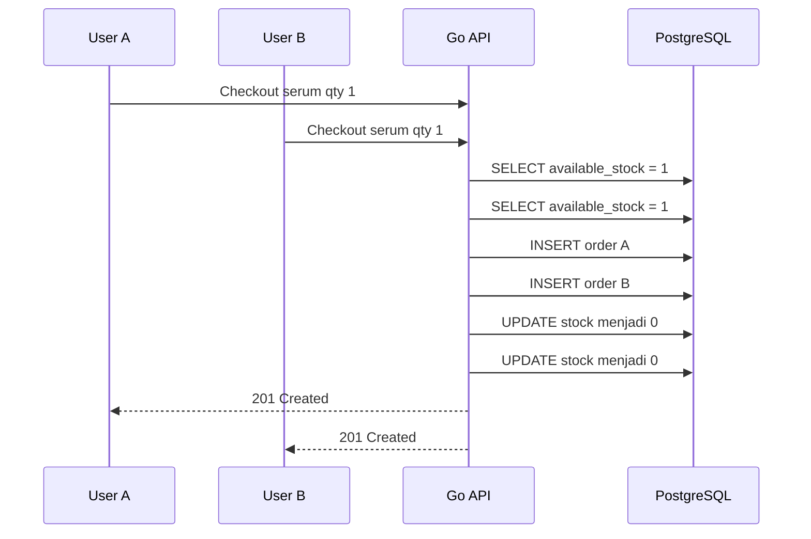
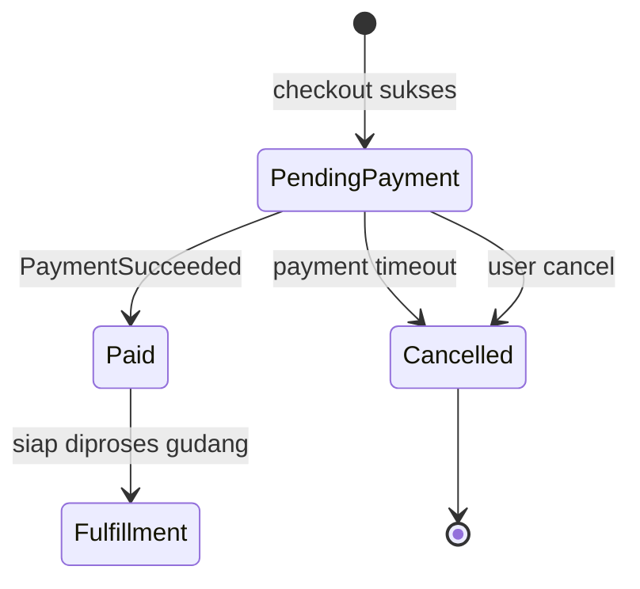
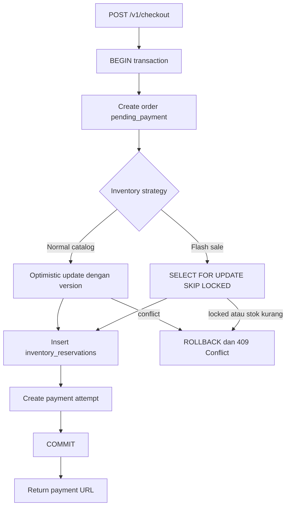

import { Section, Box, Steps, Step, Recap, CardGrid, Card, Chip, Hero, Compare, FileTree, Endpoint, Def } from "@components";

<Hero eyebrow="Roadmap 9 &middot; Scaling" title="Order dan Inventory <em>Konsisten</em><br />di High Traffic">
  <p>Cegah overselling saat ratusan user checkout produk skincare yang stoknya terbatas.</p>
  <Fragment slot="meta">
    <Chip icon="code">Bahasa: <b>Go 1.26</b></Chip>
    <Chip icon="clock">~60 menit baca</Chip>
  </Fragment>
</Hero>

<Section num="01" id="intro" title="Masalah Konsistensi di Checkout" sub="Traffic tinggi membuat bug kecil di inventory menjadi kerugian nyata">

<p class="lead">Di online shop skincare, flash sale serum populer bisa membuat ratusan checkout menabrak stok yang sama dalam detik yang sama.</p>

Di React atau Laravel, kamu mungkin sering berpikir checkout sebagai satu request biasa: validasi cart, hitung total, simpan order, lalu arahkan user ke pembayaran. Di high traffic, cara berpikir itu belum cukup. Dua request bisa membaca stok yang sama, sama-sama merasa aman, lalu sama-sama membuat order.

<Def term="overselling"><p>Overselling adalah kondisi ketika sistem menerima lebih banyak order daripada stok fisik yang benar-benar tersedia, biasanya karena operasi baca stok dan kurangi stok tidak dilindungi secara atomik.</p></Def>

<Def term="race condition"><p>Race condition terjadi ketika hasil akhir bergantung pada urutan eksekusi beberapa operasi concurrent, misalnya dua checkout yang sama-sama membaca stok 1 sebelum salah satunya menulis perubahan.</p></Def>

<Box variant="bridge" icon="🌉" label="Jembatan: dari Laravel transaction ke Go"><p>Di Laravel kamu memakai `DB::transaction()` untuk membungkus beberapa query. Di Go dengan pgx, kita tetap memakai transaksi PostgreSQL, tetapi error handling, context, commit, dan rollback harus ditulis eksplisit supaya alur konsistensi terlihat jelas.</p></Box>

Modul ini fokus ke satu target: ketika stok tersedia 1 dan ada 100 user checkout bersamaan, maksimal hanya 1 order yang berhasil mereservasi stok. Yang lain harus mendapat respons yang jujur, misalnya `409 Conflict` atau pesan stok habis.

Sumber resmi yang relevan: [Go 1.26 release notes](https://go.dev/doc/go1.26), [pgxpool](https://pkg.go.dev/github.com/jackc/pgx/v5/pgxpool), [PostgreSQL SELECT](https://www.postgresql.org/docs/current/sql-select.html), [PostgreSQL explicit locking](https://www.postgresql.org/docs/current/explicit-locking.html), [SQS delay queues](https://docs.aws.amazon.com/AWSSimpleQueueService/latest/SQSDeveloperGuide/sqs-delay-queues.html), dan [Grafana k6 docs](https://grafana.com/docs/k6/latest/).

</Section>

<Section num="02" id="race-condition" title="Race Condition Saat Stok Terakhir" sub="Bug muncul ketika check dan update dipisah tanpa guard atomik">

<p class="lead">Race paling umum adalah read-check-write: baca stok, cek cukup, lalu update di query terpisah.</p>

Contoh buruknya terlihat aman saat diuji manual, tetapi gagal saat request berjalan paralel. Masalahnya bukan Go atau PostgreSQL yang lambat. Masalahnya adalah operasi bisnis tidak dibuat atomik.



<p class="fig-cap"><b>Gambar 1.</b> Dua checkout membaca stok yang sama sebelum update, hasilnya dua order untuk satu barang.</p>

Query seperti ini wajib dihindari pada checkout production.

```sql title="contoh-buruk.sql"
SELECT available_stock
FROM inventories
WHERE product_id = $1;

-- Aplikasi mengecek stok di memory.
-- Kalau cukup, baru update.

UPDATE inventories
SET available_stock = available_stock - $2
WHERE product_id = $1;
```

<Box variant="warn" icon="⚠️" label="Jebakan: cek stok di aplikasi saja tidak cukup"><p>Validasi `if stock >= qty` di Go hanya valid untuk snapshot yang baru dibaca. Saat request lain mengubah database sebelum update kamu, keputusan itu bisa basi.</p></Box>

Solusinya adalah membuat keputusan dan perubahan stok terjadi dalam satu operasi database yang aman, atau mengunci baris inventory selama transaksi checkout berlangsung.

</Section>

<Section num="03" id="model-data" title="Model Data Inventory dan Reservation" sub="Pisahkan stok tersedia, stok tertahan, dan status order">

<p class="lead">Inventory yang scalable tidak hanya punya angka stok, tetapi juga status reservasi yang bisa expired.</p>

Untuk proyek skincare, kita akan memakai tiga konsep utama. `available_stock` adalah stok yang masih bisa direbut checkout baru. `reserved_stock` adalah stok yang sudah dikunci untuk order pending payment. `inventory_reservations` adalah catatan reservasi per order agar bisa di-cancel atau di-consume dengan aman.

<FileTree title="File yang disentuh modul ini" tree={`
internal/
  checkout/
    service.go        # orchestration checkout dalam transaksi
  inventory/
    repository.go     # reserve, consume, release stok
  order/
    repository.go     # create order dan update status
  worker/
    expire_orders.go  # worker atau cron untuk payment timeout
migrations/
  0905_inventory_consistency.sql
loadtest/
  checkout.js         # simulasi concurrent checkout dengan k6
`} />

```sql title="migrations/0905_inventory_consistency.sql"
CREATE TABLE inventories (
    product_id BIGINT PRIMARY KEY REFERENCES products(id),
    available_stock INTEGER NOT NULL CHECK (available_stock >= 0),
    reserved_stock INTEGER NOT NULL DEFAULT 0 CHECK (reserved_stock >= 0),
    version BIGINT NOT NULL DEFAULT 1,
    updated_at TIMESTAMPTZ NOT NULL DEFAULT now()
);

CREATE TABLE inventory_reservations (
    id BIGSERIAL PRIMARY KEY,
    order_id BIGINT NOT NULL REFERENCES orders(id),
    product_id BIGINT NOT NULL REFERENCES products(id),
    qty INTEGER NOT NULL CHECK (qty > 0),
    status TEXT NOT NULL CHECK (status IN ('active', 'consumed', 'expired', 'cancelled')),
    expires_at TIMESTAMPTZ NOT NULL,
    created_at TIMESTAMPTZ NOT NULL DEFAULT now(),
    updated_at TIMESTAMPTZ NOT NULL DEFAULT now(),
    UNIQUE (order_id, product_id)
);

CREATE INDEX idx_inventory_reservations_expiry
ON inventory_reservations (expires_at)
WHERE status = 'active';

ALTER TABLE orders
ADD COLUMN IF NOT EXISTS payment_expires_at TIMESTAMPTZ,
ADD COLUMN IF NOT EXISTS cancel_reason TEXT;
```

<Box variant="tip" icon="💡" label="Kenapa ada reserved_stock?"><p>`available_stock` turun saat checkout dibuat, bukan saat payment sukses. Dengan begitu user lain tidak bisa mengambil stok yang sedang menunggu pembayaran.</p></Box>

<Compare aLabel="JS/PHP sederhana" bLabel="Go + PostgreSQL production" aTone="muted" bTone="violet">
  <Fragment slot="a"><ul><li>Cart dibuat di session atau cache.</li><li>Stok sering dicek saat user klik bayar.</li><li>Race jarang terlihat di local development.</li></ul></Fragment>
  <Fragment slot="b"><ul><li>Stok dikurangi dalam transaksi database.</li><li>Reservasi punya masa berlaku.</li><li>Payment timeout mengembalikan stok secara eksplisit.</li></ul></Fragment>
</Compare>

</Section>

<Section num="04" id="optimistic-locking" title="Optimistic Locking" sub="Cocok ketika konflik jarang, tetapi tetap harus aman">

<p class="lead">Optimistic locking mengasumsikan konflik jarang terjadi, lalu mendeteksi konflik dengan kolom `version` saat update.</p>

Di frontend, konsep ini mirip menyimpan `updatedAt` atau `etag` untuk memastikan data yang kamu edit belum berubah. Di database, kita memakai `version`. Request membaca version, lalu update hanya berhasil jika version masih sama.

<Def term="optimistic locking"><p>Strategi concurrency yang tidak mengunci baris saat membaca, tetapi menolak update jika data sudah berubah sejak dibaca.</p></Def>

SQL intinya seperti ini.

```sql title="sql/reserve_optimistic.sql"
UPDATE inventories
SET
    available_stock = available_stock - $2,
    reserved_stock = reserved_stock + $2,
    version = version + 1,
    updated_at = now()
WHERE product_id = $1
  AND available_stock >= $2
  AND version = $3
RETURNING version;
```

Kalau tidak ada row yang kembali, ada dua kemungkinan: stok tidak cukup, atau version sudah berubah karena request lain menang lebih dulu. Untuk user, dua kondisi ini bisa dipetakan ke pesan yang sama: stok baru saja habis, silakan refresh cart.

```go title="internal/inventory/repository.go"
package inventory

import (
	"context"
	"errors"
	"fmt"
	"time"

	"github.com/jackc/pgx/v5"

	"github.com/kamu/skincare-backend/internal/postgres"
)

var ErrStockConflict = errors.New("inventory conflict or insufficient stock")

type Repository struct{}

type Snapshot struct {
	ProductID      int64
	AvailableStock int
	ReservedStock  int
	Version        int64
}

func (r Repository) GetSnapshot(ctx context.Context, db postgres.DBTX, productID int64) (Snapshot, error) {
	const q = `
SELECT product_id, available_stock, reserved_stock, version
FROM inventories
WHERE product_id = $1`

	var s Snapshot
	err := db.QueryRow(ctx, q, productID).Scan(
		&s.ProductID,
		&s.AvailableStock,
		&s.ReservedStock,
		&s.Version,
	)
	if err != nil {
		return Snapshot{}, fmt.Errorf("get inventory snapshot: %w", err)
	}

	return s, nil
}

func (r Repository) ReserveOptimistic(
	ctx context.Context,
	db postgres.DBTX,
	orderID int64,
	productID int64,
	qty int,
	expectedVersion int64,
	expiresAt time.Time,
) error {
	const updateInventory = `
UPDATE inventories
SET
    available_stock = available_stock - $2,
    reserved_stock = reserved_stock + $2,
    version = version + 1,
    updated_at = now()
WHERE product_id = $1
  AND available_stock >= $2
  AND version = $3
RETURNING version`

	var newVersion int64
	err := db.QueryRow(ctx, updateInventory, productID, qty, expectedVersion).Scan(&newVersion)
	if errors.Is(err, pgx.ErrNoRows) {
		return ErrStockConflict
	}
	if err != nil {
		return fmt.Errorf("reserve inventory optimistically: %w", err)
	}

	const insertReservation = `
INSERT INTO inventory_reservations (order_id, product_id, qty, status, expires_at)
VALUES ($1, $2, $3, 'active', $4)`

	if _, err := db.Exec(ctx, insertReservation, orderID, productID, qty, expiresAt); err != nil {
		return fmt.Errorf("insert inventory reservation: %w", err)
	}

	return nil
}
```

<Box variant="note" icon="📝" label="Catatan pgx"><p>`pgxpool` adalah connection pool concurrency-safe, sedangkan transaksi checkout tetap dijalankan lewat satu `pgx.Tx` agar semua perubahan commit atau rollback bersama.</p></Box>

Optimistic locking cocok untuk katalog normal, misalnya moisturizer dengan stok ratusan dan traffic stabil. Saat konflik terjadi, aplikasi bisa retry sekali atau langsung meminta user refresh cart. Jangan retry tanpa batas karena akan memperparah tekanan ke database.

</Section>

<Section num="05" id="pessimistic-locking" title="Pessimistic Locking" sub="Cocok untuk flash sale dan stok sangat terbatas">

<p class="lead">Pessimistic locking mengunci row inventory selama transaksi, sehingga request lain harus menunggu atau melewati row terkunci.</p>

PostgreSQL mendukung row-level lock dengan `SELECT ... FOR UPDATE`. Varian `SKIP LOCKED` membuat query melewati row yang sedang dikunci. Dokumentasi PostgreSQL menekankan bahwa `SKIP LOCKED` memberi view yang tidak konsisten, jadi tidak cocok untuk laporan umum, tetapi berguna untuk pola seperti queue atau perebutan resource terbatas.

<Def term="pessimistic locking"><p>Strategi concurrency yang mengunci data lebih dulu karena konflik dianggap mungkin terjadi, lalu update dilakukan saat lock masih dipegang oleh transaksi.</p></Def>

```sql title="sql/reserve_pessimistic.sql"
SELECT product_id, available_stock
FROM inventories
WHERE product_id = ANY($1::bigint[])
ORDER BY product_id
FOR UPDATE SKIP LOCKED;
```

`ORDER BY product_id` penting ketika checkout berisi beberapa produk. Semua transaksi mengunci row dalam urutan yang sama, sehingga risiko deadlock turun.

```go title="internal/inventory/pessimistic.go"
package inventory

import (
	"context"
	"fmt"
	"time"

	"github.com/kamu/skincare-backend/internal/postgres"
)

type ReserveItem struct {
	ProductID int64
	Qty       int
}

func (r Repository) ReservePessimistic(
	ctx context.Context,
	db postgres.DBTX,
	orderID int64,
	items []ReserveItem,
	expiresAt time.Time,
) error {
	productIDs := make([]int64, 0, len(items))
	qtyByProduct := make(map[int64]int, len(items))
	for _, item := range items {
		productIDs = append(productIDs, item.ProductID)
		qtyByProduct[item.ProductID] += item.Qty
	}

	const lockRows = `
SELECT product_id, available_stock
FROM inventories
WHERE product_id = ANY($1::bigint[])
ORDER BY product_id
FOR UPDATE SKIP LOCKED`

	rows, err := db.Query(ctx, lockRows, productIDs)
	if err != nil {
		return fmt.Errorf("lock inventory rows: %w", err)
	}
	defer rows.Close()

	lockedStock := make(map[int64]int, len(items))
	for rows.Next() {
		var productID int64
		var availableStock int
		if err := rows.Scan(&productID, &availableStock); err != nil {
			return fmt.Errorf("scan locked inventory row: %w", err)
		}
		lockedStock[productID] = availableStock
	}
	if err := rows.Err(); err != nil {
		return fmt.Errorf("iterate locked inventory rows: %w", err)
	}

	if len(lockedStock) != len(qtyByProduct) {
		return ErrStockConflict
	}

	for productID, qty := range qtyByProduct {
		if lockedStock[productID] < qty {
			return ErrStockConflict
		}

		const updateInventory = `
UPDATE inventories
SET
    available_stock = available_stock - $2,
    reserved_stock = reserved_stock + $2,
    version = version + 1,
    updated_at = now()
WHERE product_id = $1`

		if _, err := db.Exec(ctx, updateInventory, productID, qty); err != nil {
			return fmt.Errorf("update reserved inventory: %w", err)
		}

		const insertReservation = `
INSERT INTO inventory_reservations (order_id, product_id, qty, status, expires_at)
VALUES ($1, $2, $3, 'active', $4)`

		if _, err := db.Exec(ctx, insertReservation, orderID, productID, qty, expiresAt); err != nil {
			return fmt.Errorf("insert inventory reservation: %w", err)
		}
	}

	return nil
}
```

<Box variant="warn" icon="⚠️" label="SKIP LOCKED bukan magic anti-oversell"><p>`SKIP LOCKED` membuat request tidak menunggu lock, tetapi kamu tetap wajib mengecek jumlah row yang terkunci dan jumlah stok. Kalau tidak lengkap, rollback transaksi.</p></Box>

Untuk flash sale, pola ini sering lebih mudah diprediksi: pemenang mendapat lock, request lain gagal cepat atau retry terkontrol. Latency tail bisa lebih baik daripada membuat semua request menunggu lock yang sama.

</Section>

<Section num="06" id="memilih-strategi" title="Memilih Strategi Locking" sub="Optimistic dan pessimistic sama-sama benar jika dipakai pada konteks yang tepat">

<p class="lead">Tidak ada satu locking strategy yang selalu menang. Pilih berdasarkan tingkat konflik, stok, dan pengalaman user.</p>

<CardGrid cols={3}>
  <Card><h4>Optimistic</h4><p>Cocok untuk produk normal dengan stok cukup dan konflik rendah. Query cepat, lock eksplisit minim, tetapi butuh handling conflict.</p></Card>
  <Card><h4>Pessimistic</h4><p>Cocok untuk flash sale, stok tipis, atau produk viral. Lebih ketat, tetapi transaksi harus pendek agar lock tidak menumpuk.</p></Card>
  <Card><h4>Hybrid</h4><p>Gunakan optimistic sebagai default, lalu aktifkan pessimistic untuk campaign tertentu lewat feature flag atau field `sale_mode`.</p></Card>
</CardGrid>

<Compare aLabel="Optimistic locking" bLabel="Pessimistic locking" aTone="blue" bTone="red">
  <Fragment slot="a"><ul><li>Konflik dianggap jarang.</li><li>Gagal saat `version` berubah.</li><li>Baik untuk traffic normal.</li><li>Butuh retry atau pesan stok berubah.</li></ul></Fragment>
  <Fragment slot="b"><ul><li>Konflik dianggap sering.</li><li>Row dikunci selama transaksi.</li><li>Baik untuk flash sale.</li><li>Butuh transaksi sangat pendek.</li></ul></Fragment>
</Compare>

Aturan praktis untuk proyek skincare:

<Steps>
  <Step><b>Produk katalog biasa</b><p>Pakai optimistic locking. Konflik rendah, throughput bagus, dan failure bisa ditangani dengan pesan stok berubah.</p></Step>
  <Step><b>Produk stok rendah</b><p>Pakai optimistic dengan retry satu kali, tetapi jangan retry tanpa batas. Kalau conflict rate naik, pindahkan ke pessimistic.</p></Step>
  <Step><b>Flash sale atau bundle viral</b><p>Pakai pessimistic locking dengan transaksi pendek, `ORDER BY` saat multi item, dan respons cepat ketika lock tidak didapat.</p></Step>
</Steps>

<Box variant="tip" icon="💡" label="Gunakan data, bukan feeling"><p>Catat metric `stock_conflict_total`, `checkout_latency_ms`, dan `reservation_expired_total`. Strategi locking sebaiknya berubah karena data production, bukan karena preferensi pribadi.</p></Box>

</Section>

<Section num="07" id="reservation-expiry" title="Reservation Expiry" sub="Stok yang tidak dibayar harus kembali otomatis">

<p class="lead">Reservasi stok tanpa expiry akan mengunci barang selamanya saat user meninggalkan halaman pembayaran.</p>

Saat checkout berhasil dibuat, order masuk status `pending_payment` dan semua reservation punya `expires_at`, misalnya 30 menit dari waktu checkout. Jika payment tidak sukses sampai batas itu, reservation berubah menjadi `expired` dan stok dikembalikan.

<Box variant="note" icon="📝" label="SQS delay 30 menit"><p>Amazon SQS delay queues dan message timers hanya mendukung delay sampai 15 menit. Untuk expiry 30 menit, gunakan cron scanner berbasis database atau EventBridge Scheduler untuk one-time schedule yang lebih fleksibel.</p></Box>

Cron scanner sederhana lebih mudah untuk modular monolith. Worker berjalan tiap 1 menit, mencari reservation aktif yang sudah expired, mengubah status order, lalu mengembalikan stok dalam satu transaksi.

```sql title="sql/expire_reservations.sql"
WITH expired_reservations AS (
    UPDATE inventory_reservations
    SET
        status = 'expired',
        updated_at = now()
    WHERE status = 'active'
      AND expires_at <= now()
    RETURNING order_id, product_id, qty
), totals AS (
    SELECT product_id, SUM(qty)::INTEGER AS qty
    FROM expired_reservations
    GROUP BY product_id
), expired_orders AS (
    SELECT DISTINCT order_id
    FROM expired_reservations
)
UPDATE inventories AS i
SET
    available_stock = i.available_stock + totals.qty,
    reserved_stock = GREATEST(i.reserved_stock - totals.qty, 0),
    version = i.version + 1,
    updated_at = now()
FROM totals
WHERE i.product_id = totals.product_id;

UPDATE orders
SET
    status = 'cancelled',
    cancel_reason = 'payment_timeout',
    updated_at = now()
WHERE status = 'pending_payment'
  AND payment_expires_at <= now();
```

Versi Go worker-nya menjaga semua operasi di satu transaksi.

```go title="internal/worker/expire_orders.go"
package worker

import (
	"context"
	"fmt"

	"github.com/jackc/pgx/v5/pgxpool"
)

type ExpireOrdersWorker struct {
	pool *pgxpool.Pool
}

func NewExpireOrdersWorker(pool *pgxpool.Pool) ExpireOrdersWorker {
	return ExpireOrdersWorker{pool: pool}
}

func (w ExpireOrdersWorker) RunOnce(ctx context.Context) error {
	tx, err := w.pool.Begin(ctx)
	if err != nil {
		return fmt.Errorf("begin expire orders transaction: %w", err)
	}
	defer tx.Rollback(ctx)

	const releaseExpiredStock = `
WITH expired_reservations AS (
    UPDATE inventory_reservations
    SET
        status = 'expired',
        updated_at = now()
    WHERE status = 'active'
      AND expires_at <= now()
    RETURNING product_id, qty
), totals AS (
    SELECT product_id, SUM(qty)::INTEGER AS qty
    FROM expired_reservations
    GROUP BY product_id
)
UPDATE inventories AS i
SET
    available_stock = i.available_stock + totals.qty,
    reserved_stock = GREATEST(i.reserved_stock - totals.qty, 0),
    version = i.version + 1,
    updated_at = now()
FROM totals
WHERE i.product_id = totals.product_id`

	if _, err := tx.Exec(ctx, releaseExpiredStock); err != nil {
		return fmt.Errorf("release expired stock: %w", err)
	}

	const cancelExpiredOrders = `
UPDATE orders
SET
    status = 'cancelled',
    cancel_reason = 'payment_timeout',
    updated_at = now()
WHERE status = 'pending_payment'
  AND payment_expires_at <= now()`

	if _, err := tx.Exec(ctx, cancelExpiredOrders); err != nil {
		return fmt.Errorf("cancel expired orders: %w", err)
	}

	if err := tx.Commit(ctx); err != nil {
		return fmt.Errorf("commit expire orders transaction: %w", err)
	}

	return nil
}
```

<Box variant="warn" icon="⚠️" label="Jangan release stok dua kali"><p>Semua query release harus memfilter `status = 'active'` dan mengubah status menjadi final. Ini membuat proses expiry aman dijalankan berulang.</p></Box>

</Section>

<Section num="08" id="payment-timeout" title="Payment Timeout" sub="Order dan inventory harus bergerak sebagai satu state machine">

<p class="lead">Payment timeout bukan hanya urusan payment gateway, tetapi juga lifecycle stok yang sedang di-reserve.</p>

Saat payment sukses, reservation tidak dikembalikan ke `available_stock`. Stok tersebut sudah dibeli. Yang dilakukan sistem adalah mengubah reservation menjadi `consumed`, mengurangi `reserved_stock`, lalu mengubah order menjadi `paid`.



<p class="fig-cap"><b>Gambar 2.</b> Order pending payment harus berakhir ke paid atau cancelled, tidak boleh menggantung.</p>

```sql title="sql/consume_reservation.sql"
WITH target_order AS (
    UPDATE orders
    SET
        status = 'paid',
        updated_at = now()
    WHERE id = $1
      AND status = 'pending_payment'
      AND payment_expires_at > now()
    RETURNING id
), consumed AS (
    UPDATE inventory_reservations AS r
    SET
        status = 'consumed',
        updated_at = now()
    FROM target_order
    WHERE r.order_id = target_order.id
      AND r.status = 'active'
    RETURNING r.product_id, r.qty
), totals AS (
    SELECT product_id, SUM(qty)::INTEGER AS qty
    FROM consumed
    GROUP BY product_id
)
UPDATE inventories AS i
SET
    reserved_stock = GREATEST(i.reserved_stock - totals.qty, 0),
    version = i.version + 1,
    updated_at = now()
FROM totals
WHERE i.product_id = totals.product_id;
```

<Box variant="bridge" icon="🌉" label="Jembatan: dari webhook Laravel ke Go worker"><p>Di Laravel, webhook sering langsung update order di controller. Di Go, lebih aman menjadikan webhook tipis: verifikasi signature, simpan event, lalu service idempotent mengubah order dan reservation dalam transaksi.</p></Box>

Untuk timeout, jangan hanya mengandalkan frontend. Browser bisa ditutup, jaringan user bisa putus, dan webhook gateway bisa terlambat. Database tetap harus menjadi sumber kebenaran status order.

</Section>

<Section num="09" id="checkout-flow" title="Checkout Flow yang Konsisten" sub="Semua perubahan inti terjadi dalam transaksi pendek">

<p class="lead">Checkout yang aman membungkus create order, reserve inventory, dan create payment attempt dalam satu transaksi pendek.</p>

Endpoint utama tetap sederhana dari sudut pandang HTTP.

<Endpoint method="POST" path="/v1/checkout" desc="Buat order dari cart dan reserve stok selama 30 menit" />
<Endpoint method="POST" path="/v1/webhooks/payment" desc="Terima event payment, consume reservation, dan ubah order menjadi paid" />



<p class="fig-cap"><b>Gambar 3.</b> Core checkout harus commit cepat, side effect seperti email dan shipping diproses setelah state inti aman.</p>

Contoh service berikut memakai strategi pessimistic untuk campaign flash sale. Untuk katalog normal, ganti pemanggilan `ReservePessimistic` dengan `ReserveOptimistic` setelah membaca snapshot.

```go title="internal/checkout/service.go"
package checkout

import (
	"context"
	"errors"
	"fmt"
	"time"

	"github.com/jackc/pgx/v5/pgxpool"

	"github.com/kamu/skincare-backend/internal/inventory"
	"github.com/kamu/skincare-backend/internal/postgres"
)

var ErrCheckoutConflict = errors.New("some products are no longer available")

type OrderRepository interface {
	CreatePending(ctx context.Context, db postgres.DBTX, input CreateOrderInput) (int64, error)
	AttachPaymentExpiry(ctx context.Context, db postgres.DBTX, orderID int64, expiresAt time.Time) error
}

type InventoryRepository interface {
	ReservePessimistic(ctx context.Context, db postgres.DBTX, orderID int64, items []inventory.ReserveItem, expiresAt time.Time) error
}

type PaymentRepository interface {
	CreateAttempt(ctx context.Context, db postgres.DBTX, orderID int64, expiresAt time.Time) error
}

type Service struct {
	pool        *pgxpool.Pool
	orders      OrderRepository
	inventories InventoryRepository
	payments    PaymentRepository
}

type CreateOrderInput struct {
	CustomerID int64
	Items      []inventory.ReserveItem
}

func (s Service) Checkout(ctx context.Context, input CreateOrderInput) (int64, error) {
	tx, err := s.pool.Begin(ctx)
	if err != nil {
		return 0, fmt.Errorf("begin checkout transaction: %w", err)
	}
	defer tx.Rollback(ctx)

	expiresAt := time.Now().UTC().Add(30 * time.Minute)

	orderID, err := s.orders.CreatePending(ctx, tx, input)
	if err != nil {
		return 0, fmt.Errorf("create pending order: %w", err)
	}

	if err := s.inventories.ReservePessimistic(ctx, tx, orderID, input.Items, expiresAt); err != nil {
		if errors.Is(err, inventory.ErrStockConflict) {
			return 0, ErrCheckoutConflict
		}
		return 0, fmt.Errorf("reserve inventory: %w", err)
	}

	if err := s.orders.AttachPaymentExpiry(ctx, tx, orderID, expiresAt); err != nil {
		return 0, fmt.Errorf("attach payment expiry: %w", err)
	}

	if err := s.payments.CreateAttempt(ctx, tx, orderID, expiresAt); err != nil {
		return 0, fmt.Errorf("create payment attempt: %w", err)
	}

	if err := tx.Commit(ctx); err != nil {
		return 0, fmt.Errorf("commit checkout transaction: %w", err)
	}

	return orderID, nil
}
```

<Box variant="tip" icon="💡" label="Interface kecil untuk transaksi"><p>Repository menerima `postgres.DBTX`, bukan `*pgxpool.Pool`. Dengan begitu service bisa mengirim `pgx.Tx` saat checkout, tetapi repository tetap mudah dites.</p></Box>

Boundary repository menerima interface kecil, sehingga service bisa mengontrol transaksi dan test bisa memberi fake database jika diperlukan.

```go title="internal/postgres/dbtx.go"
package postgres

import (
	"context"

	"github.com/jackc/pgx/v5"
	"github.com/jackc/pgx/v5/pgconn"
)

type DBTX interface {
	Exec(ctx context.Context, sql string, arguments ...any) (pgconn.CommandTag, error)
	Query(ctx context.Context, sql string, args ...any) (pgx.Rows, error)
	QueryRow(ctx context.Context, sql string, args ...any) pgx.Row
}
```

<Box variant="tip" icon="💡" label="Transaksi harus pendek"><p>Jangan panggil payment gateway, email provider, atau API shipping saat transaksi inventory masih memegang lock. Simpan state inti dulu, commit, lalu side effect berjalan lewat event atau worker.</p></Box>

</Section>

<Section num="10" id="load-test" title="Load Test Concurrent Checkout" sub="Buktikan tidak oversell dengan simulasi paralel">

<p class="lead">Konsistensi tidak cukup dibuktikan dengan unit test. Kamu perlu simulasi request concurrent terhadap stok kecil.</p>

Target test: set stok produk menjadi 1, kirim 100 request checkout bersamaan, lalu pastikan hanya 1 yang mendapat `201 Created`. Sisanya harus `409 Conflict`, bukan `500`, bukan order sukses ganda.

<h3>Seed stok rendah</h3>

```sql title="loadtest/seed_flash_sale.sql"
UPDATE inventories
SET
    available_stock = 1,
    reserved_stock = 0,
    version = version + 1,
    updated_at = now()
WHERE product_id = 101;

DELETE FROM inventory_reservations
WHERE product_id = 101;
```

<h3>Opsi cepat dengan hey</h3>

`hey` cocok untuk smoke load test sederhana. Repository `rakyll/hey` mendeskripsikannya sebagai HTTP load generator yang menjalankan sejumlah request pada tingkat concurrency tertentu.

```bash title="Terminal"
go install github.com/rakyll/hey@latest

hey \
  -n 100 \
  -c 100 \
  -m POST \
  -T 'application/json' \
  -H 'Authorization: Bearer test-customer-token' \
  -d '{"items":[{"product_id":101,"qty":1}]}' \
  http://localhost:8080/v1/checkout
```

<h3>Opsi lebih realistis dengan k6</h3>

k6 lebih nyaman untuk skenario bertahap, threshold, dan script yang bisa masuk CI. Simpan file berikut, lalu jalankan `k6 run loadtest/checkout.js`.

```text title="loadtest/checkout.js"
import http from 'k6/http';
import { check } from 'k6';

export const options = {
  vus: 100,
  iterations: 100,
  thresholds: {
    http_req_failed: ['rate<0.99'],
    http_req_duration: ['p(95)<1000'],
  },
};

export default function () {
  const payload = JSON.stringify({
    items: [{ product_id: 101, qty: 1 }],
  });

  const params = {
    headers: {
      'Content-Type': 'application/json',
      Authorization: 'Bearer test-customer-token',
    },
  };

  const res = http.post('http://localhost:8080/v1/checkout', payload, params);

  check(res, {
    'created or conflict': (r) => r.status === 201 || r.status === 409,
    'no server error': (r) => r.status < 500,
  });
}
```

<h3>Verifikasi database setelah test</h3>

```sql title="loadtest/assert_no_oversell.sql"
SELECT available_stock, reserved_stock
FROM inventories
WHERE product_id = 101;

SELECT status, COUNT(*)
FROM orders
WHERE created_at >= now() - interval '5 minutes'
GROUP BY status
ORDER BY status;

SELECT status, COUNT(*)
FROM inventory_reservations
WHERE product_id = 101
  AND created_at >= now() - interval '5 minutes'
GROUP BY status
ORDER BY status;
```

<Box variant="note" icon="📝" label="Interpretasi hasil"><p>Kalau ada lebih dari satu order pending atau paid untuk stok 1, locking kamu bocor. Kalau banyak `500`, error mapping kamu belum production-ready. Kalau latency tinggi, transaksi mungkin terlalu panjang.</p></Box>

</Section>

<Section num="11" id="jebakan-umum" title="Jebakan Umum" sub="Masalah consistency biasanya muncul dari detail kecil">

<p class="lead">Kesalahan paling berbahaya adalah kode yang terlihat benar di local tetapi tidak aman saat concurrent.</p>

<CardGrid cols={2}>
  <Card><h4>Read lalu update tanpa guard</h4><p>Query `SELECT stock`, validasi di Go, lalu `UPDATE stock` tanpa `available_stock >= qty` membuka race condition.</p></Card>
  <Card><h4>Transaksi terlalu panjang</h4><p>Memanggil payment gateway saat row terkunci membuat request lain menunggu dan memperbesar timeout.</p></Card>
  <Card><h4>Lock multi item tanpa urutan</h4><p>Dua checkout dengan item A dan B bisa deadlock jika transaksi mengunci dalam urutan berbeda.</p></Card>
  <Card><h4>Expiry tidak idempotent</h4><p>Worker yang bisa release stok dua kali akan membuat stok tersedia lebih tinggi daripada stok fisik.</p></Card>
  <Card><h4>Retry liar</h4><p>Retry tanpa backoff dan batas akan mengubah conflict kecil menjadi badai query ke database.</p></Card>
  <Card><h4>Status order menggantung</h4><p>Order `pending_payment` tanpa `payment_expires_at` membuat reserved stock tidak pernah kembali.</p></Card>
</CardGrid>

<Box variant="bridge" icon="🌉" label="Jembatan: dari React state ke database state"><p>Di React, stale state biasanya selesai dengan refetch. Di checkout, stale state harus dicegah di database karena uang, stok, dan fulfillment bergantung pada state itu.</p></Box>

Checklist minimal sebelum production:

<Steps>
  <Step><b>Guard di query update</b><p>Pastikan update stok punya kondisi `available_stock >= qty` atau row lock yang sudah diverifikasi.</p></Step>
  <Step><b>Transaksi pendek</b><p>Simpan order dan reservation saja di transaksi inti. Side effect berjalan setelah commit.</p></Step>
  <Step><b>Expiry idempotent</b><p>Worker hanya memproses reservation `active`, lalu mengubahnya ke status final sebelum stok dikembalikan.</p></Step>
  <Step><b>Load test stok kecil</b><p>Simulasikan 100 checkout untuk stok 1 dan cek hasil database, bukan hanya status HTTP.</p></Step>
</Steps>

</Section>

<Section num="12" id="ringkasan" title="Ringkasan & Poin Penting" sub="Konsistensi inventory adalah fondasi scaling checkout">

<p class="lead">Di modul ini, kita mengubah checkout dari flow CRUD biasa menjadi flow konsisten yang tahan traffic tinggi.</p>

<Recap title="Yang Wajib Menempel"><ul><li>Overselling terjadi saat cek stok dan update stok tidak atomik.</li><li>Optimistic locking memakai `version`, cocok untuk konflik rendah dan katalog normal.</li><li>Pessimistic locking memakai `SELECT ... FOR UPDATE SKIP LOCKED`, cocok untuk flash sale dan stok tipis.</li><li>Reservasi stok harus punya expiry, biasanya 30 menit untuk payment pending.</li><li>SQS delay biasa hanya sampai 15 menit, jadi expiry 30 menit lebih aman memakai cron scanner atau EventBridge Scheduler.</li><li>Payment success mengubah reservation menjadi `consumed`, sedangkan payment timeout mengubah reservation menjadi `expired` dan mengembalikan stok.</li><li>Load test dengan k6 atau hey harus membuktikan hanya satu checkout menang saat stok produk tinggal satu.</li></ul></Recap>

Dalam proyek online shop skincare, modul ini membuat checkout siap menghadapi campaign besar. User boleh datang bersamaan, payment boleh terlambat, dan worker boleh berjalan berulang, tetapi database tetap menjaga fakta utama: stok tidak boleh negatif dan order tidak boleh melebihi barang yang tersedia.

Langkah berikutnya di Roadmap 9 adalah membawa pola consistency ini ke skala yang lebih luas: observability khusus untuk conflict rate, tuning connection pool saat flash sale, dan keputusan kapan inventory perlu dipisah menjadi service sendiri.

</Section>
