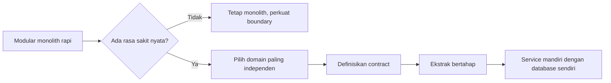
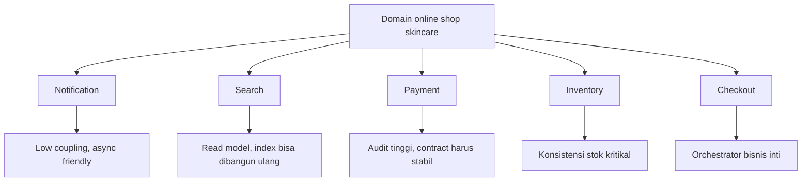
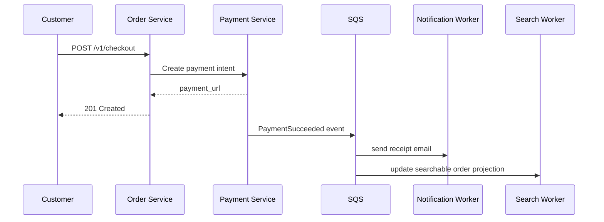
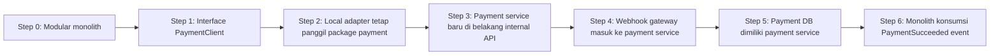
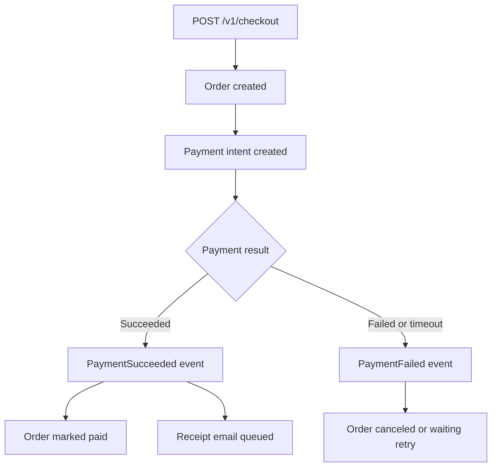

import { Section, Box, Steps, Step, Recap, CardGrid, Card, Chip, Hero, Compare, FileTree, Endpoint, Def } from "@components";

<Hero eyebrow="Roadmap 9 &middot; Advanced Scaling" title="Split ke <em>Microservices</em><br />Tanpa Merusak Bisnis">
  <p>Microservices adalah keputusan organisasi dan operasional, bukan sekadar memecah folder Go menjadi banyak repository.</p>
  <Fragment slot="meta">
    <Chip icon="code">Bahasa: <b>Go 1.26</b></Chip>
    <Chip icon="clock">~60 menit baca</Chip>
  </Fragment>
</Hero>

<Section num="01" id="intro" title="Microservices Bukan Tujuan Awal" sub="Mulai dari modular monolith, pecah hanya ketika rasa sakitnya nyata">

<p class="lead">Di React, kita tidak memecah aplikasi menjadi sepuluh package sebelum tahu state mana yang benar-benar berubah sendiri. Di backend juga begitu.</p>

Pada proyek online shop skincare, modular monolith memberi kita satu deployable Go API dengan modul domain yang jelas: `product`, `cart`, `checkout`, `inventory`, `payment`, `notification`, dan `search`. Struktur ini sudah cukup kuat selama tim masih kecil, traffic masih bisa ditangani, dan perubahan antar domain masih bisa dikoordinasikan dengan cepat.

<Def term="microservice"><p>Microservice adalah layanan kecil yang punya boundary bisnis jelas, dapat dideploy secara independen, dan idealnya memiliki data yang ia kuasai sendiri.</p></Def>

<Box variant="bridge" icon="🌉" label="Jembatan: dari folder modular ke ownership service"><p>Di Laravel, folder `app/Services/PaymentService.php` masih berjalan dalam proses aplikasi yang sama. Di microservices, payment punya runtime, deployment, observability, database, retry, dan error boundary sendiri.</p></Box>

Go cocok untuk service kecil karena binary statis, startup cepat, concurrency bawaan, dan standard library HTTP yang kuat. Tetapi kemampuan Go bukan alasan otomatis untuk memecah sistem. Rilis Go 1.26 tetap menjaga Go 1 compatibility, dan proyek baru cukup memakai `go 1.26` di `go.mod` sesuai dokumentasi Go terbaru.

```text title="Sasaran modul"
Bukan: membuat banyak service supaya terlihat enterprise.
Ya: tahu kapan modul harus punya lifecycle, data, scaling, dan ownership sendiri.
```



<p class="fig-cap"><b>Gambar 1.</b> Microservices adalah langkah evolusi, bukan starting template.</p>

</Section>

<Section num="02" id="jangan-mulai-dari-microservices" title="Kapan Tidak Pakai Microservices" sub="Microservices mahal jika masalahnya belum ada">

<p class="lead">Microservices sering terlihat seperti arsitektur modern, tetapi biaya koordinasinya langsung terasa sejak service kedua lahir.</p>

Jangan mulai dari microservices ketika tim masih kecil, deploy masih mudah, traffic masih bisa ditangani modular monolith, dan bottleneck utama masih berada di query, caching, indexing, atau desain transaksi. Dari modul sebelumnya, kita sudah punya pprof, Redis cache, full-text search, event-driven worker, dan strategi konsistensi inventory. Semua itu biasanya memberi dampak lebih cepat daripada split prematur.

<Compare aLabel="Modular monolith" bLabel="Microservices" aTone="teal" bTone="violet">
  <Fragment slot="a"><ul><li>Satu proses, satu deploy, transaksi database lebih sederhana.</li><li>Boundary domain tetap dijaga lewat package dan interface Go.</li><li>Cocok untuk tim kecil dan produk yang masih sering berubah.</li></ul></Fragment>
  <Fragment slot="b"><ul><li>Banyak proses, banyak deploy pipeline, observability wajib matang.</li><li>Konsistensi data lintas service harus ditangani dengan event, saga, dan idempotency.</li><li>Cocok ketika ownership, scaling, atau cadence deploy sudah berbeda.</li></ul></Fragment>
</Compare>

<Box variant="warn" icon="⚠️" label="Jangan split karena bosan dengan monolith"><p>Monolith yang berantakan kalau dipecah tanpa boundary akan menjadi distributed mess: bug yang sama, tapi sekarang tersebar di jaringan.</p></Box>

<CardGrid cols={3}>
  <Card><h4>Team kecil</h4><p>Satu sampai tiga backend engineer biasanya lebih produktif dengan modular monolith yang ketat.</p></Card>
  <Card><h4>Traffic masih normal</h4><p>Jika bottleneck bisa diselesaikan lewat index, cache, pool tuning, dan async worker, split belum perlu.</p></Card>
  <Card><h4>Domain masih berubah</h4><p>Boundary yang belum stabil akan membuat contract antar service sering pecah.</p></Card>
</CardGrid>

<Def term="distributed monolith"><p>Kumpulan service yang terlihat terpisah, tetapi deploy, database, dan perubahan fitur tetap saling mengunci seperti satu aplikasi besar.</p></Def>

</Section>

<Section num="03" id="sinyal-split" title="Sinyal Modular Monolith Mulai Tidak Cukup" sub="Pecah ketika dependency organisasi dan runtime mulai berbeda">

<p class="lead">Signal split yang sehat bukan “service ini punya banyak file”, tetapi “service ini punya lifecycle bisnis dan operasional yang berbeda”.</p>

Ada tiga sinyal utama: deployment frequency berbeda, scaling requirement berbeda, dan tim yang berbeda. Contohnya, `notification` berubah sering karena template email, provider WhatsApp, dan campaign. `search` butuh index khusus dan mungkin worker sinkronisasi. `payment` butuh audit, webhook idempotent, dan compliance yang lebih ketat.

<CardGrid cols={3}>
  <Card><h4>Deploy cadence berbeda</h4><p>Notification bisa deploy beberapa kali sehari, sementara checkout sebaiknya lebih konservatif karena menyentuh uang dan stok.</p></Card>
  <Card><h4>Scaling berbeda</h4><p>Search read-heavy, worker notification bursty, checkout write-heavy dan sensitif terhadap transaksi.</p></Card>
  <Card><h4>Ownership tim berbeda</h4><p>Ketika satu tim khusus payment bertanggung jawab penuh atas SLA, audit, dan integrasi gateway, boundary mulai masuk akal.</p></Card>
</CardGrid>

<Box variant="bridge" icon="🌉" label="Jembatan: dari React component ownership"><p>Di React, komponen yang sering berubah sendiri bisa diekstrak agar ownership jelas. Di backend, ekstraksi service baru masuk akal jika tim dan operasinya juga bisa mandiri.</p></Box>

```text title="Checklist sinyal split"
[ ] Domain punya alasan deploy sendiri.
[ ] Domain punya kebutuhan scaling sendiri.
[ ] Domain punya owner jelas.
[ ] Domain punya data ownership yang bisa dipisah.
[ ] Contract input dan output sudah stabil.
[ ] Failure domain bisa diisolasi tanpa menghentikan checkout utama.
```

Untuk online shop skincare, kandidat awal yang paling aman biasanya `notification` atau `search`, bukan `checkout` dan `inventory`. Alasannya sederhana: kegagalan email atau reindex search bisa diretry, tetapi kegagalan checkout langsung menyentuh order, payment, dan stok.

</Section>

<Section num="04" id="service-boundary" title="Menentukan Service Boundary" sub="Mulai dari domain yang paling independen">

<p class="lead">Boundary terbaik mengikuti bahasa bisnis, bukan mengikuti tabel database atau layer teknis.</p>

Service boundary adalah garis kepemilikan. Di modular monolith, garis ini tampak sebagai package dan interface. Di microservices, garis yang sama menjadi repository, pipeline, runtime, database, dashboard, alarm, dan on-call. Karena itu kandidat pertama adalah domain dengan coupling rendah dan dampak kegagalan yang bisa ditoleransi.

<FileTree title="Boundary di modular monolith sebelum split" tree={`cmd/
  api/
    main.go                # komposisi dependency
internal/
  checkout/
    service.go             # orchestrate cart, inventory, payment
  payment/
    service.go             # logic payment masih in-process
    repository.go
  notification/
    worker.go              # kandidat split awal
  search/
    indexer.go             # kandidat split awal
  inventory/
    service.go             # high consistency, jangan buru-buru split
go.mod
`} />

<Box variant="tip" icon="💡" label="Boundary kandidat pertama"><p>Pilih domain yang bisa gagal secara terpisah dan dipulihkan lewat retry, seperti notification atau search. Jangan mulai dari inventory kecuali tim sudah matang menangani konsistensi terdistribusi.</p></Box>



<p class="fig-cap"><b>Gambar 2.</b> Boundary yang aman dipilih dari domain yang paling independen lebih dulu.</p>

<Compare aLabel="Boundary buruk" bLabel="Boundary sehat" aTone="red" bTone="teal">
  <Fragment slot="a"><ul><li>`user-service`, `product-service`, dan `order-service` tetap menulis database yang sama.</li><li>Setiap request checkout melakukan chain HTTP panjang dan gagal jika salah satu service lambat.</li><li>Service dipisah berdasarkan layer seperti handler, service, repository.</li></ul></Fragment>
  <Fragment slot="b"><ul><li>Notification menerima event `OrderPaid` dan mengirim email tanpa memblokir checkout.</li><li>Search membangun read model sendiri dari event produk.</li><li>Payment punya contract jelas untuk intent, status, callback, dan rekonsiliasi.</li></ul></Fragment>
</Compare>

</Section>

<Section num="05" id="database-ownership" title="Database Ownership Setelah Split" sub="Service boleh berbagi fakta bisnis, tetapi tidak boleh saling menulis tabel internal">

<p class="lead">Perubahan terbesar dari modular monolith ke microservices bukan HTTP, melainkan kepemilikan data.</p>

AWS Prescriptive Guidance mendokumentasikan pola database-per-service untuk microservices: setiap service menyimpan dan mengambil data dari data store yang ia kuasai sendiri. Dalam praktik proyek skincare, ini berarti `payment_service` tidak boleh menulis tabel `orders` milik checkout secara langsung. Ia menerbitkan event, lalu order service memperbarui state order miliknya.

<Box variant="bridge" icon="🌉" label="Jembatan: dari Eloquent relationship"><p>Di Laravel monolith, `Order::with('payment')` terasa natural karena semua tabel hidup di satu database. Setelah split, join lintas service diganti dengan API composition, event-driven projection, atau read model khusus.</p></Box>

```sql title="database ownership setelah split"
-- order_db, dimiliki order atau checkout service
CREATE TABLE orders (
    id uuid PRIMARY KEY,
    customer_id uuid NOT NULL,
    status text NOT NULL,
    total_amount bigint NOT NULL,
    created_at timestamptz NOT NULL DEFAULT now()
);

-- payment_db, dimiliki payment service
CREATE TABLE payments (
    id uuid PRIMARY KEY,
    order_id uuid NOT NULL,
    gateway text NOT NULL,
    gateway_reference text NOT NULL,
    status text NOT NULL,
    amount bigint NOT NULL,
    created_at timestamptz NOT NULL DEFAULT now()
);

-- outbox di payment_db, dipublish worker payment
CREATE TABLE payment_outbox_events (
    id uuid PRIMARY KEY,
    event_type text NOT NULL,
    aggregate_id uuid NOT NULL,
    payload jsonb NOT NULL,
    published_at timestamptz,
    created_at timestamptz NOT NULL DEFAULT now()
);
```

Jangan salah paham: pada fase transisi, dua service kadang masih membaca database lama lewat view atau adapter. Tetapi target akhir tetap satu owner per data. Shared database mungkin dipakai sementara, namun harus dianggap jembatan migrasi, bukan arsitektur permanen.

<Def term="data ownership"><p>Aturan bahwa satu service menjadi sumber kebenaran untuk data tertentu, termasuk skema, validasi, perubahan state, dan audit trail.</p></Def>

<Box variant="warn" icon="⚠️" label="Jangan biarkan service lain menulis tabelmu"><p>Begitu dua service menulis tabel yang sama, deploy independen hanya ilusi. Perubahan constraint kecil bisa mematahkan service lain tanpa terlihat di compile time.</p></Box>

</Section>

<Section num="06" id="api-contract" title="API Contract Sebelum Dipisah" sub="Pisahkan interface dulu, network belakangan">

<p class="lead">Cara paling aman untuk split di Go adalah membuat seam berbasis interface sebelum ada service baru.</p>

Di Go, interface kecil membuat boundary mudah diuji. Checkout tidak perlu tahu apakah payment masih package lokal, HTTP service, atau worker async. Ia hanya tahu contract: buat payment intent, terima payment ID, dan lanjutkan state order sesuai hasil.

```go title="internal/checkout/payment_contract.go"
package checkout

import (
	"context"
	"errors"
	"time"
)

var ErrPaymentUnavailable = errors.New("payment unavailable")

type PaymentClient interface {
	CreatePaymentIntent(ctx context.Context, req CreatePaymentIntentRequest) (PaymentIntent, error)
}

type CreatePaymentIntentRequest struct {
	OrderID     string
	CustomerID  string
	Amount      int64
	Currency    string
	Description string
}

type PaymentIntent struct {
	ID          string
	RedirectURL string
	ExpiresAt   time.Time
}
```

```go title="internal/checkout/service.go"
package checkout

import (
	"context"
	"fmt"
)

type OrderRepository interface {
	SavePendingOrder(ctx context.Context, order Order) error
}

type Service struct {
	orders   OrderRepository
	payments PaymentClient
}

func NewService(orders OrderRepository, payments PaymentClient) *Service {
	return &Service{orders: orders, payments: payments}
}

func (s *Service) Checkout(ctx context.Context, req CheckoutRequest) (CheckoutResult, error) {
	order := NewPendingOrder(req.CustomerID, req.Items)

	if err := s.orders.SavePendingOrder(ctx, order); err != nil {
		return CheckoutResult{}, fmt.Errorf("save pending order: %w", err)
	}

	intent, err := s.payments.CreatePaymentIntent(ctx, CreatePaymentIntentRequest{
		OrderID:     order.ID,
		CustomerID:  order.CustomerID,
		Amount:      order.TotalAmount,
		Currency:    "IDR",
		Description: "Skincare order " + order.ID,
	})
	if err != nil {
		return CheckoutResult{}, fmt.Errorf("create payment intent: %w", err)
	}

	return CheckoutResult{OrderID: order.ID, PaymentURL: intent.RedirectURL}, nil
}
```

<Endpoint method="POST" path="/internal/v1/payments/intents" desc="Contract internal untuk membuat payment intent dari order yang sudah dibuat" />
<Endpoint method="POST" path="/v1/webhooks/payments" desc="Webhook publik dari payment gateway yang diverifikasi oleh payment service" />
<Endpoint method="GET" path="/internal/v1/payments/{paymentID}" desc="Query status payment saat rekonsiliasi atau support case" />

```json title="contract create payment intent"
{
  "order_id": "ord_01JZ9S8Y1J57V4VCR7R0Z2B8K3",
  "customer_id": "cus_01JZ9S7G9MTS7SPYF9V6ZAYCH2",
  "amount": 349000,
  "currency": "IDR",
  "description": "Skincare order ord_01JZ9S8Y1J57V4VCR7R0Z2B8K3"
}
```

<Box variant="tip" icon="💡" label="Idiom Go untuk boundary"><p>Terima interface di constructor dan kembalikan struct konkret. Handler dan service mudah dites, sementara implementasi payment bisa diganti dari lokal ke HTTP tanpa mengubah checkout.</p></Box>

</Section>

<Section num="07" id="async-communication" title="Async Communication antar Service" sub="Event untuk side effect, bukan chain HTTP panjang">

<p class="lead">Microservices sehat berkomunikasi lewat event untuk side effect yang tidak perlu memblokir request utama.</p>

Direct HTTP call antar service kadang tetap perlu untuk query cepat atau command yang harus langsung diketahui hasilnya. Namun untuk side effect seperti email, sinkronisasi search index, analytics, audit, dan shipping notification, event lebih aman. AWS Prescriptive Guidance juga menempatkan event-driven architecture sebagai pola umum untuk konsistensi lintas microservices, sementara Amazon SQS menyediakan queue, visibility timeout, dan dead-letter queue untuk retry yang terkontrol.

```go title="internal/platform/events/publisher.go"
package events

import (
	"context"
	"encoding/json"
	"time"
)

type Publisher interface {
	Publish(ctx context.Context, event Event) error
}

type Event struct {
	ID            string          `json:"id"`
	Type          string          `json:"type"`
	AggregateID   string          `json:"aggregate_id"`
	CorrelationID string          `json:"correlation_id"`
	OccurredAt    time.Time       `json:"occurred_at"`
	Payload       json.RawMessage `json:"payload"`
}
```

```go title="internal/payment/events.go"
package payment

import (
	"context"
	"encoding/json"
	"fmt"
	"time"

	"github.com/kamu/skincare-backend/internal/platform/events"
)

type EventPublisher interface {
	Publish(ctx context.Context, event events.Event) error
}

type PaymentSucceededPayload struct {
	PaymentID string `json:"payment_id"`
	OrderID   string `json:"order_id"`
	Amount    int64  `json:"amount"`
}

func PublishPaymentSucceeded(ctx context.Context, publisher EventPublisher, payload PaymentSucceededPayload, correlationID string) error {
	body, err := json.Marshal(payload)
	if err != nil {
		return fmt.Errorf("marshal payment succeeded payload: %w", err)
	}

	event := events.Event{
		ID:            NewEventID(),
		Type:          "PaymentSucceeded",
		AggregateID:   payload.PaymentID,
		CorrelationID: correlationID,
		OccurredAt:    time.Now().UTC(),
		Payload:       body,
	}

	if err := publisher.Publish(ctx, event); err != nil {
		return fmt.Errorf("publish payment succeeded: %w", err)
	}

	return nil
}
```



<p class="fig-cap"><b>Gambar 3.</b> Request checkout tetap pendek, side effect berjalan lewat event dan worker.</p>

<Box variant="warn" icon="⚠️" label="At-least-once berarti handler harus idempotent"><p>Queue dapat mengirim pesan lagi jika consumer gagal menghapus pesan sebelum visibility timeout. Consumer event wajib aman dipanggil berulang.</p></Box>

</Section>

<Section num="08" id="strangler-payment" title="Strangler Fig: Ekstrak Payment Service" sub="Pisahkan satu domain per waktu, bukan big bang rewrite">

<p class="lead">Strangler fig pattern memindahkan fungsi lama ke service baru secara bertahap sambil aplikasi tetap melayani pelanggan.</p>

Kita akan memakai payment sebagai contoh karena ia punya boundary bisnis yang jelas, tetapi tetap perlu disiplin tinggi: uang, webhook, idempotency, dan audit. Pada fase awal, checkout tetap berada di modular monolith. Kita hanya menaruh seam interface, lalu mengarahkan implementasi payment dari package lokal ke HTTP client, kemudian memindahkan database payment, lalu memindahkan webhook.



<p class="fig-cap"><b>Gambar 4.</b> Ekstraksi payment service dilakukan bertahap agar checkout tidak berhenti.</p>

<Steps>
  <Step><b>Pasang seam di monolith</b><p>Buat `PaymentClient` interface di package checkout, lalu implementasikan adapter lokal yang memanggil package payment lama.</p></Step>
  <Step><b>Stabilkan contract</b><p>Tulis request dan response JSON internal, status code, error code, idempotency key, dan correlation ID.</p></Step>
  <Step><b>Deploy service baru tanpa traffic</b><p>Payment service berjalan di ECS sendiri, tetapi checkout belum diarahkan ke sana.</p></Step>
  <Step><b>Canary traffic kecil</b><p>Alihkan sebagian order internal ke payment service, monitor latency, error, webhook, dan rekonsiliasi.</p></Step>
  <Step><b>Pindahkan ownership data</b><p>Payment service mulai menulis `payment_db`, lalu menerbitkan event untuk order service.</p></Step>
  <Step><b>Hapus kode lama</b><p>Setelah semua traffic stabil dan audit lengkap, hapus adapter lokal dan tabel lama yang sudah tidak dipakai.</p></Step>
</Steps>

```go title="internal/checkout/payment_http_client.go"
package checkout

import (
	"bytes"
	"context"
	"encoding/json"
	"fmt"
	"net/http"
	"time"
)

type HTTPPaymentClient struct {
	baseURL string
	client  *http.Client
}

func NewHTTPPaymentClient(baseURL string) *HTTPPaymentClient {
	return &HTTPPaymentClient{
		baseURL: baseURL,
		client: &http.Client{
			Timeout: 3 * time.Second,
		},
	}
}

func (c *HTTPPaymentClient) CreatePaymentIntent(ctx context.Context, req CreatePaymentIntentRequest) (PaymentIntent, error) {
	body, err := json.Marshal(req)
	if err != nil {
		return PaymentIntent{}, fmt.Errorf("marshal request: %w", err)
	}

	httpReq, err := http.NewRequestWithContext(ctx, http.MethodPost, c.baseURL+"/internal/v1/payments/intents", bytes.NewReader(body))
	if err != nil {
		return PaymentIntent{}, fmt.Errorf("build request: %w", err)
	}
	httpReq.Header.Set("Content-Type", "application/json")
	httpReq.Header.Set("Idempotency-Key", req.OrderID)

	resp, err := c.client.Do(httpReq)
	if err != nil {
		return PaymentIntent{}, fmt.Errorf("call payment service: %w", err)
	}
	defer resp.Body.Close()

	if resp.StatusCode != http.StatusCreated {
		return PaymentIntent{}, fmt.Errorf("payment service returned status %d", resp.StatusCode)
	}

	var intent PaymentIntent
	if err := json.NewDecoder(resp.Body).Decode(&intent); err != nil {
		return PaymentIntent{}, fmt.Errorf("decode payment response: %w", err)
	}

	return intent, nil
}
```

<Box variant="note" icon="📝" label="Gunakan timeout pendek"><p>HTTP client antar service wajib punya timeout. Tanpa timeout, checkout bisa menggantung karena payment service lambat.</p></Box>

</Section>

<Section num="09" id="hands-on" title="Hands-on: Siapkan Seam untuk Payment" sub="Latihan ringan sebelum benar-benar memecah service">

<p class="lead">Latihan ini belum membuat repository baru. Tujuannya menyiapkan boundary supaya migrasi berikutnya aman.</p>

<FileTree title="File latihan" tree={`internal/
  checkout/
    service.go
    payment_contract.go
    payment_local_client.go
    payment_http_client.go
  payment/
    service.go
    handler.go
    repository.go
cmd/
  api/
    main.go
`} />

<Steps>
  <Step><b>Buat contract di checkout</b><p>Tambahkan `PaymentClient` dan struct request response seperti contoh sebelumnya.</p></Step>
  <Step><b>Buat local adapter</b><p>Adapter ini memanggil service payment lama di proses yang sama, sehingga belum ada network risk.</p></Step>
  <Step><b>Buat HTTP adapter</b><p>Adapter HTTP mengikuti contract yang sama, sehingga checkout tidak perlu berubah saat traffic dialihkan.</p></Step>
  <Step><b>Pilih adapter dari config</b><p>Gunakan env `PAYMENT_MODE=local` untuk dev dan `PAYMENT_MODE=http` untuk canary staging.</p></Step>
  <Step><b>Tulis test service checkout</b><p>Mock `PaymentClient` untuk memastikan checkout tidak bergantung pada implementasi payment.</p></Step>
</Steps>

```go title="internal/checkout/payment_local_client.go"
package checkout

import (
	"context"
	"fmt"

	"github.com/kamu/skincare-backend/internal/payment"
)

type LocalPaymentClient struct {
	service *payment.Service
}

func NewLocalPaymentClient(service *payment.Service) *LocalPaymentClient {
	return &LocalPaymentClient{service: service}
}

func (c *LocalPaymentClient) CreatePaymentIntent(ctx context.Context, req CreatePaymentIntentRequest) (PaymentIntent, error) {
	intent, err := c.service.CreateIntent(ctx, payment.CreateIntentRequest{
		OrderID:     req.OrderID,
		CustomerID:  req.CustomerID,
		Amount:      req.Amount,
		Currency:    req.Currency,
		Description: req.Description,
	})
	if err != nil {
		return PaymentIntent{}, fmt.Errorf("create local payment intent: %w", err)
	}

	return PaymentIntent{
		ID:          intent.ID,
		RedirectURL: intent.RedirectURL,
		ExpiresAt:   intent.ExpiresAt,
	}, nil
}
```

```go title="cmd/api/main.go"
package main

import (
	"log"
	"os"

	"github.com/kamu/skincare-backend/internal/checkout"
	"github.com/kamu/skincare-backend/internal/payment"
)

func buildPaymentClient(paymentService *payment.Service) checkout.PaymentClient {
	mode := os.Getenv("PAYMENT_MODE")
	if mode == "http" {
		return checkout.NewHTTPPaymentClient(os.Getenv("PAYMENT_SERVICE_URL"))
	}

	return checkout.NewLocalPaymentClient(paymentService)
}

func main() {
	paymentService := payment.NewService()
	paymentClient := buildPaymentClient(paymentService)
	checkoutService := checkout.NewService(newOrderRepository(), paymentClient)

	_ = checkoutService
	log.Println("api started")
}
```

```go title="internal/checkout/service_test.go"
package checkout

import (
	"context"
	"testing"
	"time"
)

type fakePaymentClient struct {
	intent PaymentIntent
	err    error
}

func (f fakePaymentClient) CreatePaymentIntent(ctx context.Context, req CreatePaymentIntentRequest) (PaymentIntent, error) {
	return f.intent, f.err
}

func TestCheckoutCreatesPaymentIntent(t *testing.T) {
	payments := fakePaymentClient{
		intent: PaymentIntent{
			ID:          "pay_123",
			RedirectURL: "https://pay.example.test/redirect",
			ExpiresAt:   time.Now().Add(30 * time.Minute),
		},
	}

	service := NewService(fakeOrderRepository{}, payments)

	result, err := service.Checkout(context.Background(), CheckoutRequest{
		CustomerID: "cus_123",
		Items: []CheckoutItem{
			{ProductID: "prd_serum", Quantity: 1},
		},
	})
	if err != nil {
		t.Fatalf("checkout failed: %v", err)
	}

	if result.PaymentURL == "" {
		t.Fatal("expected payment URL")
	}
}
```

```bash title="Terminal"
go test ./internal/checkout
PAYMENT_MODE=local go run ./cmd/api
PAYMENT_MODE=http PAYMENT_SERVICE_URL=http://localhost:9090 go run ./cmd/api
```

<Box variant="tip" icon="💡" label="Latihan ini kecil tapi strategis"><p>Begitu seam tersedia dan test checkout tetap hijau, ekstraksi payment menjadi perubahan konfigurasi dan deployment, bukan rewrite checkout.</p></Box>

</Section>

<Section num="10" id="jebakan-umum" title="Jebakan Umum Saat Split" sub="Masalah microservices biasanya muncul dari boundary yang salah, bukan dari Go">

<p class="lead">Microservices menambah failure mode baru: network, retry, duplikasi event, observability, dan konsistensi yang tidak instan.</p>

<CardGrid cols={2}>
  <Card><h4>Shared database permanen</h4><p>Service terlihat terpisah, tetapi migration tetap saling mengunci. Jadikan shared database hanya fase transisi.</p></Card>
  <Card><h4>Chain HTTP terlalu panjang</h4><p>Checkout memanggil payment, lalu inventory, lalu shipping, lalu notification secara sinkron. Satu service lambat membuat semua lambat.</p></Card>
  <Card><h4>Event tidak idempotent</h4><p>Consumer mengirim email dua kali atau mengubah stok dua kali karena menganggap event hanya datang sekali.</p></Card>
  <Card><h4>Contract tidak versioned</h4><p>Perubahan field JSON mematahkan consumer lama. Pakai backward-compatible change dan observability sebelum menghapus field.</p></Card>
  <Card><h4>Tidak ada correlation ID</h4><p>Satu checkout tersebar ke beberapa log service tanpa benang merah, debugging production menjadi lambat.</p></Card>
  <Card><h4>Observability terlambat</h4><p>Service baru tanpa log JSON, metrics, tracing, DLQ alarm, dan dashboard akan sulit dioperasikan.</p></Card>
</CardGrid>

<Box variant="warn" icon="⚠️" label="Distributed transaction bukan default"><p>Jangan berharap transaksi SQL lintas service seperti transaksi satu database. Untuk flow panjang, gunakan event, saga, kompensasi, dan rekonsiliasi.</p></Box>



<p class="fig-cap"><b>Gambar 5.</b> Flow lintas service membutuhkan state machine, bukan transaksi tunggal yang tersembunyi.</p>

<Compare aLabel="Kesalahan umum" bLabel="Versi aman" aTone="red" bTone="blue">
  <Fragment slot="a"><ul><li>Service baru langsung membaca tabel `orders` dari database monolith.</li><li>Webhook payment memanggil order service sinkron dan gagal jika order service sedang deploy.</li><li>Event tidak punya ID unik, correlation ID, dan schema yang jelas.</li></ul></Fragment>
  <Fragment slot="b"><ul><li>Payment service punya `payment_db`, lalu publish `PaymentSucceeded`.</li><li>Order service memproses event secara idempotent dan bisa retry.</li><li>Semua event membawa ID, aggregate ID, occurred at, payload, dan correlation ID.</li></ul></Fragment>
</Compare>

</Section>

<Section num="11" id="ringkasan" title="Ringkasan & Poin Penting">

<p class="lead">Microservices adalah alat untuk mengelola perbedaan ownership, scaling, dan deployment, bukan hadiah akhir setelah monolith terasa tidak keren.</p>

<Recap title="Yang Wajib Menempel"><ul><li>Tetap pakai modular monolith ketika tim kecil, traffic masih terkendali, dan masalah bisa selesai lewat profiling, cache, index, queue, atau tuning database.</li><li>Signal split yang sehat adalah deployment frequency berbeda, scaling requirement berbeda, dan tim yang benar-benar berbeda.</li><li>Service boundary mengikuti domain bisnis. Notification dan search biasanya lebih aman dipisah lebih dulu daripada checkout dan inventory.</li><li>Setelah split, setiap service harus punya data ownership sendiri. Shared database hanya boleh menjadi fase transisi yang dikontrol.</li><li>Definisikan API contract dan interface Go sebelum memindahkan runtime. Ini membuat migrasi bisa diuji sebelum ada network call.</li><li>Gunakan async communication untuk side effect. Event handler wajib idempotent karena queue bisa mengirim pesan lebih dari sekali.</li><li>Strangler fig pattern membantu memindahkan satu domain per waktu tanpa big bang rewrite.</li></ul></Recap>

<h3>Pemetaan ke proyek skincare</h3>

<ul>
  <li>`notification` menjadi kandidat split awal karena email, WhatsApp, dan campaign bisa diretry tanpa memblokir checkout.</li>
  <li>`search` bisa menjadi service berikutnya karena index dapat dibangun ulang dari event produk dan order.</li>
  <li>`payment` boleh diekstrak setelah contract stabil, webhook idempotent, audit event lengkap, dan ownership data jelas.</li>
  <li>`checkout` dan `inventory` tetap dijaga ketat karena menyentuh uang, stok, dan konsistensi order.</li>
</ul>

<h3>Langkah berikutnya</h3>

Modul berikutnya di jalur advanced bisa memperdalam reliability pattern: circuit breaker, timeout budget, retry policy, idempotency store, tracing lintas service, dan saga untuk order lifecycle yang lebih panjang.

<Box variant="note" icon="📚" label="Rujukan resmi"><p>Gunakan [Go 1.26 release notes](https://go.dev/doc/go1.26), [Go Modules Reference](https://go.dev/ref/mod), [AWS database-per-service pattern](https://docs.aws.amazon.com/prescriptive-guidance/latest/modernization-data-persistence/database-per-service.html), [AWS saga pattern](https://docs.aws.amazon.com/prescriptive-guidance/latest/modernization-data-persistence/saga-pattern.html), [AWS microservices integration guidance](https://docs.aws.amazon.com/prescriptive-guidance/latest/modernization-integrating-microservices/introduction.html), dan [Amazon SQS visibility timeout](https://docs.aws.amazon.com/AWSSimpleQueueService/latest/SQSDeveloperGuide/sqs-visibility-timeout.html) sebagai pembanding saat desain production.</p></Box>

</Section>
