import { Section, Box, Steps, Step, Recap, CardGrid, Card, Chip, Hero, Compare, FileTree, Endpoint, Def, Figure } from "@components";
import GitThreeTreeFig01 from "@figures/GitThreeTreeFig01.astro";
import GitCommitDagFig01 from "@figures/GitCommitDagFig01.astro";
import GitRebaseFig01 from "@figures/GitRebaseFig01.astro";
import GitResetModesFig01 from "@figures/GitResetModesFig01.astro";
import GitDetachedHeadFig01 from "@figures/GitDetachedHeadFig01.astro";

<Hero eyebrow="Course &middot; Git" title="Belajar <em>Git</em><br />Version Control dan Workflow Tim">
  <p>Git bukan sekadar tempat menyimpan kode, melainkan sistem koordinasi kerja tim: histori yang bisa diaudit, cabang untuk bekerja paralel, dan workflow yang menjaga main tetap sehat.</p>
  <Fragment slot="meta">
    <Chip icon="git">Version <b>control</b></Chip>
    <Chip icon="check">Workflow <b>tim</b></Chip>
    <Chip icon="clock">~110 menit baca</Chip>
  </Fragment>
</Hero>


<Section num="01" id="kenapa-git" title="Kenapa Developer Harus Menguasai Git" sub="Sistem koordinasi kerja, bukan sekadar simpan kode">

<p class="lead">Git bukan tempat menyimpan kode, melainkan sistem koordinasi kerja yang menjawab pertanyaan "siapa mengubah apa, kapan, dan kenapa" di sebuah tim.</p>

Banyak orang pertama kali mengenal Git sebagai "tombol simpan ke cloud". Anggapan itu menyesatkan karena membuat Git terasa seperti pengganti Google Drive. Kenyataannya Git adalah **version control system** terdistribusi: setiap perubahan dicatat sebagai titik histori yang punya penulis, waktu, dan pesan, lalu titik-titik itu dirangkai menjadi narasi proyek yang bisa diaudit, ditelusuri, dan diputar mundur kapan saja.

Pada proyek backend skincare `github.com/kamu/skincare-backend`, kamu tidak bekerja sendiri. Ada yang menggarap modul katalog produk, ada yang menggarap checkout, ada yang menambah migrasi database. Tanpa sistem koordinasi, dua orang yang menyentuh file `internal/product/service.go` akan saling menimpa. Git membuat pekerjaan paralel itu aman: tiap orang punya jalur sendiri, lalu hasilnya digabung dengan jejak yang jelas.

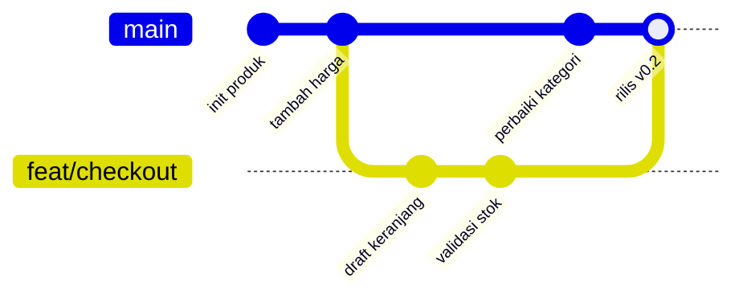

<p class="fig-cap"><b>Kerja paralel di repo bersama.</b> Jalur <code>feat/checkout</code> berkembang sendiri lalu disatukan ke jalur utama tanpa menghapus jejak siapa pun.</p>

Setidaknya ada enam peran yang Git mainkan setiap hari: **version control** (riwayat berversi), **history** (catatan kenapa kode jadi seperti sekarang), **collaboration** (banyak orang satu basis kode), **rollback** (kembali ke versi sehat saat ada bug), **code review** (perubahan ditinjau sebelum masuk), dan **release tracking** (menandai versi mana yang dirilis). Keenamnya saling menopang, dan semuanya hilang begitu kamu mengandalkan salin-tempel folder.

<Box variant="analogy" icon="🎮" label="Save point plus jurnal tim"><p>Git itu seperti save point game yang bisa kamu kunjungi ulang kapan saja, sekaligus jurnal yang mencatat siapa mengubah apa dan alasannya, sehingga seluruh tim membaca cerita yang sama.</p></Box>

<Box variant="bridge" icon="🌉" label="Jembatan: dari ZIP backup ke histori yang bisa diaudit"><p>Kalau dulu kamu menyimpan <code>project-final-v2-fix.zip</code> atau mengandalkan Undo editor yang hanya seumur sesi, Git menggantinya dengan histori penuh yang permanen, bisa dicari, dan bisa dibandingkan antar versi.</p></Box>

Mari rasakan langsung. Tiga perintah berikut membuat repo, menyetujui satu perubahan ke staging, lalu mengabadikannya sebagai commit pertama.

```bash title="Terminal"
mkdir skincare-backend && cd skincare-backend
git init
echo "# Skincare Backend" > README.md
git add README.md
git commit -m "chore: inisialisasi proyek"
```

Setelah `git commit`, kamu sudah memiliki satu titik histori yang permanen. Mulai detik ini, setiap perubahan punya rumah yang aman dan setiap keputusan teknis punya jejak. Itulah fondasi cara tim software bekerja: bukan karena Git menyimpan file, melainkan karena Git mengoordinasikan manusia di sekitar file tersebut.

</Section>

<Section num="02" id="mental-model" title="Mental Model Git" sub="Git menyimpan snapshot, bukan diff; tiga area kerja">

<p class="lead">Kunci memahami Git adalah satu kalimat: tiap commit menyimpan snapshot utuh proyek, bukan daftar perubahan yang menumpuk.</p>

Banyak sistem versi lama berpikir dalam **diff**: mereka menyimpan "baris 10 berubah, baris 22 dihapus" lalu menumpuknya. Git memilih cara berbeda. Saat kamu commit, Git memotret seluruh isi proyek pada momen itu dan menyimpannya sebagai **snapshot**. File yang tidak berubah tidak disalin ulang, melainkan ditunjuk kembali ke isi yang identik. Hasilnya histori terasa seperti rangkaian foto utuh, bukan tumpukan catatan tambal sulam.

Agar snapshot itu hemat dan konsisten, Git bersifat **content-addressable**: setiap potongan isi diberi nama dari **hash** isinya sendiri. Isi file mentah disimpan sebagai **blob**, struktur folder sebagai **tree**, dan satu **commit** menunjuk ke satu tree (snapshot proyek) plus pointer ke **parent** (commit sebelumnya). Karena nama objek berasal dari isinya, isi yang sama otomatis berbagi penyimpanan, dan perubahan sekecil apa pun menghasilkan hash berbeda yang langsung terdeteksi.

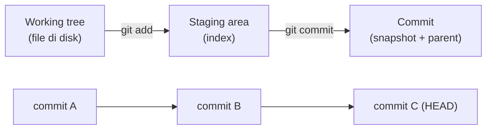

<p class="fig-cap"><b>Dua sudut pandang.</b> Atas: perjalanan satu perubahan dari disk ke commit. Bawah: commit bertaut ke parent membentuk rantai snapshot.</p>

Soal nama objek, Git default memakai **SHA-1** dan sedang dalam transisi resmi ke **SHA-256**. Untuk kerja harian perbedaannya tak terasa; yang penting dipahami adalah idenya: nama = hash dari isi. Itu yang membuat Git bisa memverifikasi integritas histori dan mendeteksi korupsi data.

<Box variant="note" icon="📌" label="Kenapa pindah versi itu murah"><p>Karena commit menyimpan snapshot lengkap plus pointer ke parent, berpindah dari satu versi ke versi lain hanya soal menggeser pointer dan menyusun ulang file, bukan memutar ulang ribuan diff satu per satu.</p></Box>

Git mengatur kerja lewat tiga area: **working tree** (file yang kamu edit di disk), **staging area** alias **index** (ruang tunggu tempat kamu memilih perubahan mana yang akan masuk commit berikutnya), dan **repository** (database objek di dalam `.git` tempat snapshot disimpan permanen). Detail mendalam tiga area ini dibahas di section 04; di sini cukup pahami bahwa staging memberimu kontrol untuk menyusun commit yang rapi, bukan asal melempar semua perubahan sekaligus.

<Box variant="bridge" icon="🌉" label="Jembatan: dari state UI ke state histori"><p>Di frontend kamu terbiasa berpikir state sebagai snapshot tunggal yang berubah lewat aksi; histori Git memakai logika serupa di skala proyek, tiap commit adalah snapshot baru yang ditautkan ke snapshot sebelumnya.</p></Box>

<Box variant="analogy" icon="📷" label="Tiap commit adalah satu foto utuh"><p>Bayangkan kamera yang memotret seluruh proyek tiap kali kamu commit. Kamu tidak menyimpan "apa yang berubah", kamu menyimpan "seperti apa proyek pada momen itu", lengkap dengan tanggal di balik foto yang menunjuk foto sebelumnya.</p></Box>

</Section>

<Section num="03" id="setup-repo" title="Setup Git dan Repository Lokal" sub="Identitas commit, config, dan isi folder .git">

<p class="lead">Sebelum commit pertama yang serius, luangkan lima menit menyetel identitas dan preferensi Git agar setiap jejak yang kamu tinggalkan benar dan konsisten.</p>

Setiap commit mencatat siapa penulisnya. Bila identitas belum diset, commit-mu akan tertempel nama dan email asal yang membuat histori sulit ditelusuri dan riwayat kontribusi berantakan. Karena itu langkah pertama adalah menyetel **user.name** dan **user.email** secara global, lalu menentukan beberapa preferensi yang akan terasa setiap hari.

```bash title="Terminal"
git config --global user.name "Nama Kamu"
git config --global user.email "kamu@contoh.com"
git config --global init.defaultBranch main
git config --global core.editor "code --wait"
git config --global core.autocrlf input
```

Empat baris setelah identitas itu penting dipahami, bukan sekadar disalin. **init.defaultBranch main** menetapkan nama branch awal saat `git init`, mengikuti standar komunitas dan hosting modern yang memakai `main`. **core.editor** menentukan editor yang dibuka saat Git butuh pesan panjang (misalnya saat rebase interaktif); `--wait` memastikan Git menunggu sampai editor ditutup. **core.autocrlf input** mengatur line endings: ia menormalkan akhir baris ke gaya Unix saat menyimpan ke repo, penting di tim lintas sistem operasi agar diff tidak penuh perubahan palsu. Untuk autentikasi ke remote, **credential helper** menyimpan kredensial agar kamu tidak mengetik token berulang.

<Box variant="bridge" icon="🌉" label="Jembatan: dari config tooling ke config Git"><p>Kamu sudah biasa menaruh aturan tim di <code>.eslintrc</code> atau <code>.prettierrc</code> per proyek. Config Git serupa, hanya saja level <code>--global</code> berlaku untuk semua repo di mesinmu, dan config tanpa <code>--global</code> hanya untuk repo saat ini.</p></Box>

Setelah config beres, `git init` mengubah folder biasa menjadi repository dengan membuat subfolder `.git`. Folder inilah otak repo: ia menyimpan seluruh objek (blob, tree, commit), referensi branch, dan konfigurasi lokal.

<FileTree title="Isi folder .git (disederhanakan)" tree={`
.git/
  HEAD
  config
  objects/
  refs/
    heads/
    tags/
`} />

Di dalam repo, setiap file berada di salah satu status lifecycle. File yang belum pernah Git lihat berstatus **untracked**; setelah `git add`, ia menjadi **tracked** dan masuk pengawasan Git. Jalankan `git status` kapan saja untuk membaca peta ini.

```bash title="Terminal"
git init
git status
```

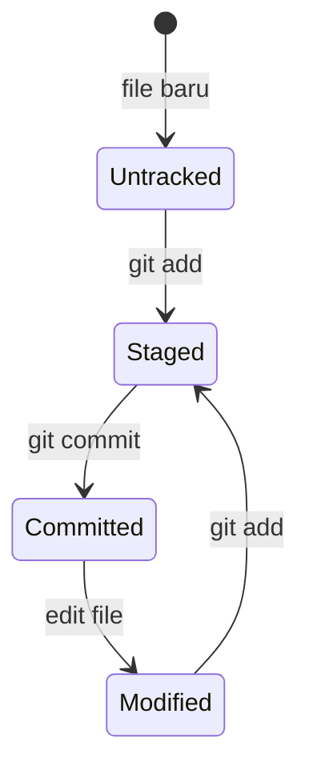

<p class="fig-cap"><b>Lifecycle file.</b> Dari untracked sampai committed, lalu kembali berputar setiap kali file disunting.</p>

<Box variant="tip" icon="💡" label="Konsistensi sejak awal"><p>Set <code>init.defaultBranch main</code> dan pakai <code>user.email</code> yang sama dengan akun hosting-mu di semua proyek, supaya kontribusi tercatat ke identitas yang benar dan branch awal seragam di tiap repo.</p></Box>

<Box variant="note" icon="📌" label=".git adalah otak repo"><p>Seluruh histori lokal hidup di dalam folder <code>.git</code>. Menghapusnya membuat folder kembali jadi direktori biasa dan menghilangkan semua commit yang belum pernah didorong ke remote.</p></Box>

</Section>


<Section num="04" id="tracking-changes" title="Tracking Perubahan" sub="status, add, restore, diff: memilih perubahan dengan sadar">

<p class="lead">Git memisahkan perubahan menjadi tiga kondisi, dan justru di pemisahan itulah letak kendali kamu atas apa yang masuk ke sebuah commit.</p>

Sebuah file yang kamu sentuh hidup di salah satu dari tiga kondisi: **modified** (sudah diubah di working tree tapi belum ditandai), **staged** (sudah dipilih ke staging area, siap dibungkus jadi commit), dan **committed** (sudah tersimpan permanen di repository). Staging area inilah yang sering diremehkan pemula: ia bukan sekadar formalitas sebelum commit, melainkan ruang untuk **menyusun** commit secara sadar, memilih perubahan mana yang layak masuk bersama dan mana yang ditunda.

<Figure><GitThreeTreeFig01 /><Fragment slot="caption"><b>Tiga area Git.</b> git add memindahkan dari working tree ke staging; git commit menyimpan staging ke repository; git restore membatalkan.</Fragment></Figure>

Titik masuknya selalu `git status`. Perintah ini membaca ketiga area dan memberitahu kamu: file mana yang modified tapi belum staged, file mana yang sudah staged, dan file mana yang sama sekali belum dilacak (untracked). Biasakan menjalankannya sebelum dan sesudah `git add`, karena ia adalah kompasmu, bukan sekadar laporan.

```bash title="Terminal"
$ git status
On branch main
Changes to be committed:
  (use "git restore --staged <file>..." to unstage)
	modified:   internal/product/handler.go

Changes not staged for commit:
  (use "git add <file>..." to update what will be committed)
  (use "git restore <file>..." to discard changes in working directory)
	modified:   internal/product/service.go
```

Untuk memindahkan perubahan ke staging, `git add <path>`. Untuk membatalkan, ada dua arah yang sering tertukar. `git restore <file>` membuang perubahan di **working tree** (mengembalikan file ke kondisi terakhir di index, perubahanmu hilang). Sementara `git restore --staged <file>` hanya **meng-unstage**: perubahan tetap ada di working tree, hanya dikeluarkan dari staging. Perhatikan perbedaannya: yang satu membuang isi, yang satu hanya menarik dari antrean commit.

<Box variant="warn" icon="⚠️" label="git restore tanpa --staged itu destruktif"><p>git restore service.go menimpa file dengan versi index dan tidak masuk reflog, jadi perubahan working tree yang belum di-commit benar-benar lenyap. Pastikan kamu memang ingin membuangnya.</p></Box>

Dua perintah `diff` menjawab dua pertanyaan berbeda. `git diff` menunjukkan selisih **working tree vs index**: perubahan yang sudah kamu buat tapi belum di-stage. `git diff --staged` menunjukkan **index vs HEAD**: persis apa yang akan tercatat bila kamu commit sekarang. Membaca keduanya sebelum commit adalah kebiasaan yang memisahkan commit rapi dari commit berantakan.

<Box variant="bridge" icon="🌉" label="Jembatan: dari review di editor ke git diff"><p>Sama seperti kamu memindai diff di tab Source Control sebelum stage, git diff dan git diff --staged adalah versi terminal yang portabel, bisa di-pipe, dan tidak bergantung pada editor mana pun.</p></Box>

Mari praktik. Ubah dua file, stage satu, lalu bandingkan kedua diff sebelum commit.

```bash title="Terminal"
$ git add internal/product/handler.go   # stage satu file saja
$ git diff                              # sisa yang BELUM di-stage (service.go)
$ git diff --staged                     # yang AKAN masuk commit (handler.go)
$ git commit -m "Validate price is positive in product handler"
```

<Box variant="tip" icon="💡" label="Stage potongan demi potongan dengan git add -p"><p>git add -p menampilkan tiap hunk dan bertanya y/n, sehingga satu file yang berisi dua perubahan tak berkaitan bisa dipecah jadi dua commit terpisah. Hindari refleks git add titik yang menyapu semuanya tanpa kamu lihat.</p></Box>

</Section>

<Section num="05" id="commit-baik" title="Commit yang Baik" sub="Atomic, pesan jelas, why over what">

<p class="lead">Commit yang baik bukan tentang menyimpan kode, melainkan menulis catatan yang masih masuk akal saat dibaca enam bulan kemudian oleh orang yang lupa konteksnya, termasuk dirimu sendiri.</p>

Prinsip pertama adalah **atomic**: satu commit memuat satu perubahan logis yang utuh. Bukan "satu file", bukan "satu hari kerja", tapi satu ide yang bisa dijelaskan dalam satu kalimat. Commit atomic membuat `git log` mudah dibaca, `git revert` aman (membatalkan satu commit tidak ikut menghapus hal lain), dan `git bisect` efektif saat memburu bug. Bila kamu menggabungkan perbaikan validasi harga dengan rename variabel di satu commit, dua-duanya jadi sulit dipisah lagi nanti.

<Box variant="bridge" icon="🌉" label="Jembatan: satu issue, satu commit logis"><p>Seperti memecah satu task besar di issue tracker jadi sub-task kecil yang jelas, satu perubahan logis sebaiknya menjadi satu commit terisolasi. Issue memberi batas; commit menjadi jejak teknis dari batas itu.</p></Box>

Prinsip kedua adalah **pesan yang menjelaskan kenapa**. Pesan commit punya dua bagian: **subject** (baris pertama) dan **body** (paragraf setelah baris kosong). Subject ditulis imperatif dan singkat, sekitar maksimal 50 karakter, seolah memberi perintah: "Add", "Fix", "Refactor", bukan "Added" atau "Fixing". Body, yang opsional, menjelaskan **kenapa** perubahan ini perlu, bukan mengulang **apa** yang sudah terbaca dari diff.

<div class="tbl-wrap"><table>
<thead><tr><th>Buruk</th><th>Baik</th><th>Kenapa</th></tr></thead>
<tbody>
<tr><td><code>update</code></td><td><code>Add price validation to product handler</code></td><td>Subjek buruk tak menjelaskan apa pun saat dibaca di log.</td></tr>
<tr><td><code>fix bug</code></td><td><code>Fix negative PriceRupiah passing validation</code></td><td>"Bug" yang mana? Subjek baik menyebut gejala spesifik.</td></tr>
<tr><td><code>wip</code></td><td><code>Refactor product service to accept context</code></td><td>"wip" tidak punya makna di history permanen.</td></tr>
</tbody>
</table></div>

<Box variant="warn" icon="⚠️" label="Hindari pesan tanpa makna"><p>Pesan seperti wip, update, fix bug, atau asdf membuat history jadi kabut. Saat kamu menelusuri kenapa sebuah baris berubah, pesan kosong memaksamu membaca seluruh diff dari nol.</p></Box>

Berikut anatomi pesan commit yang lengkap: subject imperatif singkat, baris kosong, lalu body yang menjawab "kenapa".

```text title="Pesan commit"
Reject negative price at product creation

PriceRupiah disimpan sebagai int64 dalam rupiah penuh, tapi handler
lama menerima nilai negatif tanpa keluhan, lalu lolos sampai ke
database. Validasi di tepi mencegah data harga rusak masuk ke sistem
diskon yang mengandalkan nilai non-negatif.
```

Prinsip ketiga: **pecah perubahan besar jadi beberapa commit logis**. Bila satu sesi kerja menyentuh validasi, lalu rename, lalu perbaikan test, stage dan commit terpisah dengan bantuan `git add -p` agar tiap commit tetap atomic.

```bash title="Terminal"
$ git add -p internal/product/service.go   # pilih hunk validasi saja
$ git commit -m "Reject negative price at product creation"
$ git add -p internal/product/service.go   # sekarang hunk rename
$ git commit -m "Rename priceCents to priceRupiah for clarity"
```

<Box variant="tip" icon="💡" label="Subject imperatif, why di body"><p>Tulis subject seolah melengkapi kalimat "Commit ini akan ...": Add, Fix, Refactor. Simpan alasan dan trade-off di body, karena diff sudah menjawab "apa", yang hilang justru "kenapa".</p></Box>

</Section>

<Section num="06" id="history" title="Membaca History" sub="log, show, diff tanpa rasa takut">

<p class="lead">History bukan museum yang hanya dipajang, melainkan alat investigasi: ia menjawab kenapa sebuah baris ada, kapan sebuah bug masuk, dan apa yang berubah di antara dua rilis.</p>

Pintu utamanya `git log`. Apa adanya ia menampilkan tiap commit beserta hash, author, date, dan pesan, dari yang terbaru ke terlama. Tapi yang membuatnya berguna adalah flag-flagnya. `--oneline` memampatkan tiap commit jadi satu baris. `--graph` menggambar struktur cabang dengan garis ASCII. `--all` menyertakan semua branch, bukan hanya yang sedang aktif. Dikombinasikan, ketiganya memberi peta repositori yang cepat dibaca.

```bash title="Terminal"
$ git log --oneline --graph --all
* 8f3a1c2 (HEAD -> main) Reject negative price at product creation
* a1b9d04 Add price validation to product handler
| * 4c7e8f1 (feat/discount) Add discount engine skeleton
|/
* 2d5a6b3 Initialize skincare-backend module layout
```

<p class="fig-cap"><b>Peta cabang dari satu perintah.</b> Garis menunjukkan feat/discount bercabang dari commit yang sama dengan main.</p>

Secara model, history adalah rantai commit yang tiap simpulnya menunjuk ke induknya. Pada satu branch lurus, rantai itu terlihat seperti ini.

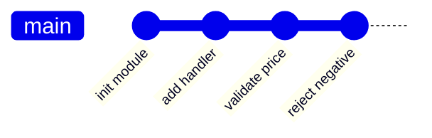

<p class="fig-cap"><b>Rantai commit linear.</b> Tiap commit menyimpan snapshot penuh dan menunjuk ke induknya, sehingga history bisa ditelusuri mundur.</p>

Bila ingin melihat satu commit secara utuh, `git show <hash>` menampilkan metadata sekaligus diff lengkapnya. Untuk membandingkan dua titik mana pun, `git diff a..b` menunjukkan selisih dari commit `a` ke `b`, berguna saat menyiapkan release atau meninjau apa yang berubah sejak tag terakhir.

```bash title="Terminal"
$ git show 8f3a1c2                 # metadata + diff satu commit
$ git diff a1b9d04..8f3a1c2        # selisih antara dua commit
$ git log -p -- internal/product/service.go   # riwayat + diff satu file
$ git log --follow -- internal/product/price.go  # ikut menembus rename file
```

Sering yang kamu butuhkan bukan seluruh history, melainkan **siapa yang menyentuh satu file**. `git log -- path/file` menyaring commit yang mengubah file tersebut, dan `--follow` membuat penelusuran tetap utuh meski file pernah di-rename. Tambahkan `-p` untuk melihat diff tiap perubahannya, sehingga evolusi sebuah file terbaca seperti cerita.

<Box variant="bridge" icon="🌉" label="Jembatan: dari browser history ke timeline proyek"><p>Seperti history browser yang membiarkanmu kembali ke halaman sebelumnya, git log adalah timeline proyek: tiap commit adalah titik yang bisa kamu kunjungi, bandingkan, dan pahami konteksnya.</p></Box>

<Box variant="tip" icon="💡" label="Alias peta cepat"><p>git log --oneline --graph --all adalah perintah yang paling sering kamu butuhkan untuk orientasi. Jadikan alias (mis. git lg) agar peta cabang selalu satu ketikan jauhnya.</p></Box>

<Box variant="note" icon="📝" label="History adalah catatan keputusan"><p>Yang berharga dari history bukan kodenya saja (itu ada di file sekarang), melainkan urutan keputusan: kenapa pendekatan A dipilih lalu diganti B. Itulah sebabnya pesan commit yang menjelaskan "kenapa" membuat history jauh lebih bernilai.</p></Box>

</Section>


<Section num="07" id="branch" title="Branch: Ruang Kerja Paralel" sub="Branch adalah pointer ringan ke commit">

<p class="lead">Branch bukan salinan kode, melainkan pointer ringan yang menunjuk ke satu commit, dan itulah kenapa Git memberanikan kita membuatnya sesering apa pun.</p>

Pada section sebelumnya kita melihat histori sebagai rantai commit yang saling menunjuk ke parent-nya. Branch adalah lapisan di atas rantai itu: sebuah nama yang menyimpan **satu hash commit**. Tidak ada folder baru, tidak ada penggandaan file. Saat kamu menjalankan `git branch feature/login`, Git hanya menulis satu baris berisi hash ke dalam `.git/refs/heads/`. Itu sebabnya membuat branch terasa instan, bahkan pada repo dengan ratusan ribu commit.

Yang membuat branch terasa "hidup" adalah `HEAD`. HEAD adalah pointer ke branch yang sedang aktif, bukan langsung ke commit. Saat kamu commit, Git menambah commit baru lalu menggeser pointer branch yang ditunjuk HEAD untuk menunjuk commit baru itu. Branch lain tidak bergerak. Inilah mekanisme isolasi: pekerjaan di `feature/login` tidak menyentuh `main` sampai kamu memutuskan menggabungkannya.

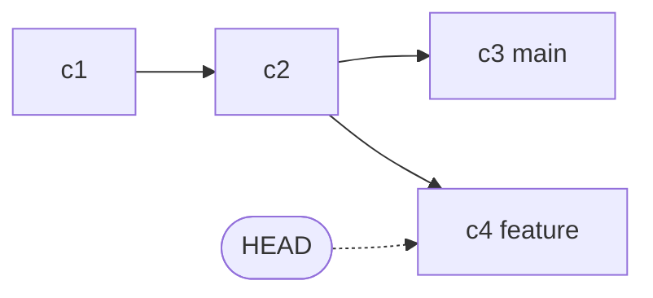

<p class="fig-cap"><b>Branch sebagai pointer.</b> main menunjuk c3, feature menunjuk c4, dan HEAD menandai feature sebagai branch aktif.</p>

<Figure><GitCommitDagFig01 /><Fragment slot="caption"><b>Branch sebagai pointer.</b> main dan feature menunjuk commit berbeda; HEAD menandai branch aktif.</Fragment></Figure>

Di proyek skincare-backend, alur ini sangat praktis. Misalnya `main` memuat kode yang sudah jalan di produksi, sementara kamu sedang menggarap endpoint checkout. Kamu buat branch `feature/checkout`, bekerja bebas di sana, dan `main` tetap utuh siap dirilis kapan saja tanpa terkontaminasi kode setengah jadi.

<Box variant="analogy" icon="🌿" label="Analogi: cabang sungai"><p>Branch seperti cabang sungai yang memisah dari aliran utama, mengalir sendiri sebentar, lalu nanti bisa bertemu kembali ke aliran induk lewat merge.</p></Box>

Untuk berpindah branch, perintah modern adalah `git switch`. Versi lama memakai `git checkout` yang memikul peran ganda (pindah branch sekaligus memulihkan file), sehingga Git memisahnya menjadi `git switch` dan `git restore`. `git checkout` masih ada dan berfungsi, tapi untuk berpindah branch sebaiknya pakai `git switch` agar niat kode lebih jelas.

```bash title="Terminal"
# membuat dan langsung pindah ke branch baru
git switch -c feature/login
# ... edit file, lalu:
git add .
git commit -m "feat: tambah handler login"

# kembali ke main; commit feature/login tidak terbawa ke sini
git switch main
git log --oneline   # commit login tidak terlihat di main
```

<p><code>git switch -c feature/login</code> setara dengan <code>git branch feature/login</code> lalu <code>git switch feature/login</code> dalam satu langkah, jadi kamu langsung berada di ruang kerja baru.</p>

<Box variant="bridge" icon="🌉" label="Jembatan: dari menyalin folder ke branch"><p>Kebiasaan menyalin folder project jadi project-eksperimen lalu bingung mana yang terbaru, digantikan branch resmi: satu repo, banyak garis kerja, dan Git yang menjaga mana yang aktif.</p></Box>

<Box variant="note" icon="📝" label="Branch itu sangat murah"><p>Sebuah ref branch hanya menyimpan satu hash (sekitar 41 byte di disk), jadi jangan ragu membuat branch untuk tiap fitur, percobaan, atau perbaikan kecil.</p></Box>

</Section>

<Section num="08" id="merge" title="Merge: Menggabungkan Branch" sub="Fast-forward versus three-way merge">

<p class="lead">Merge adalah cara Git menyatukan pekerjaan dari satu branch ke branch lain, dan hasilnya bergantung pada apakah base sudah bergerak sejak branch dibuat.</p>

Setelah pekerjaan di `feature/login` selesai dan teruji, kamu ingin perubahannya masuk ke `main`. Caranya: pindah ke branch tujuan, lalu jalankan `git merge`. Git punya dua strategi yang dipilih otomatis tergantung bentuk histori, dan memahami keduanya membuat histori proyekmu lebih mudah dibaca.

Kasus pertama adalah **fast-forward**. Ini terjadi bila `main` tidak menerima commit baru sejak `feature/login` dipisah, sehingga commit `main` masih merupakan leluhur (ancestor) dari ujung feature. Karena tidak ada yang perlu didamaikan, Git cukup menggeser pointer `main` maju ke commit terakhir feature. Tidak ada commit baru yang dibuat; histori tetap satu garis lurus.

Kasus kedua adalah **three-way merge**. Ini terjadi bila kedua branch sama-sama maju: ada commit baru di `main` dan ada commit baru di feature. Git tidak bisa sekadar menggeser pointer karena keduanya menyimpang. Git mengambil tiga titik (ujung kedua branch dan commit leluhur bersama), menggabungkannya, lalu membuat **merge commit** yang istimewa karena punya **dua parent**.

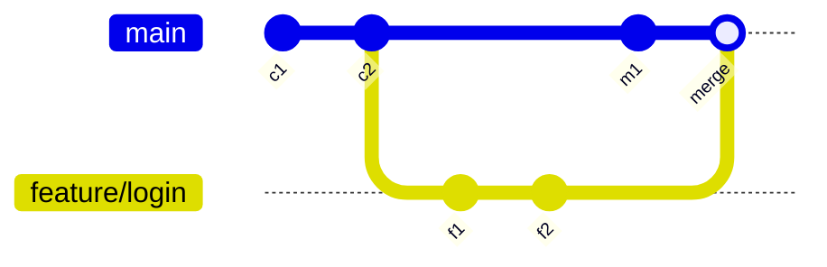

<p class="fig-cap"><b>Three-way merge.</b> Karena main maju dengan m1 dan feature dengan f1, f2, Git membuat merge commit berisi dua parent.</p>

<Box variant="analogy" icon="📄" label="Analogi: menggabungkan dua revisi dokumen"><p>Bayangkan dua orang mengedit salinan dokumen yang sama dari titik awal yang identik. Three-way merge adalah proses menyatukan kedua revisi dengan melihat naskah asli sebagai acuan, bukan menimpa salah satunya.</p></Box>

```bash title="Terminal"
# pindah ke branch tujuan dulu
git switch main

# fast-forward bila main belum bergerak sejak feature dibuat
git merge feature/login
# Updating a1b2c3d..e4f5g6h
# Fast-forward

# memaksa merge commit walau sebenarnya bisa fast-forward
git merge --no-ff feature/login
```

Kapan memilih `--no-ff`? Flag ini memaksa Git membuat merge commit meski fast-forward sebenarnya mungkin. Hasilnya, jejak bahwa serangkaian commit itu berasal dari satu feature branch tetap terlihat sebagai satu gugus di histori. Banyak tim memakai `--no-ff` saat menggabungkan feature ke `main` agar histori bercerita "ini sekelompok perubahan untuk satu fitur", bukan deret commit datar yang sulit dilacak asalnya.

<Box variant="tip" icon="💡" label="--no-ff menjaga jejak feature"><p>Pakai <code>git merge --no-ff</code> untuk feature branch agar grup commit-nya tetap tampak utuh di histori; <code>git log --oneline --graph</code> akan menunjukkan struktur cabangnya dengan jelas.</p></Box>

<Box variant="note" icon="📝" label="Merge bisa memicu konflik"><p>Saat kedua sisi mengubah baris yang sama, three-way merge tidak bisa otomatis dan Git menandainya sebagai conflict. Cara membaca dan menyelesaikannya dibahas tuntas di section 09.</p></Box>

</Section>

<Section num="09" id="conflict" title="Merge Conflict" sub="Saat Git tidak bisa menggabungkan otomatis">

<p class="lead">Merge conflict bukan tanda ada yang rusak, melainkan momen Git jujur bahwa ia tidak punya cukup informasi untuk memilih gabungan yang benar, dan menyerahkan keputusan itu kepadamu.</p>

Konflik muncul ketika dua branch mengubah **baris yang sama** pada file yang sama, atau satu sisi mengubah file sementara sisi lain menghapusnya. Untuk perubahan yang menyentuh baris berbeda, Git menggabungkan otomatis tanpa kamu sadari. Hanya saat dua sisi bertabrakan di baris yang persis sama, Git berhenti, menandai file, dan meminta penyelesaian manual.

<Box variant="bridge" icon="🌉" label="Jembatan: dua orang mengedit paragraf yang sama"><p>Sama seperti dua rekan yang menulis ulang paragraf yang identik di dokumen bersama lalu harus menentukan versi final, dua branch yang mengubah baris yang sama memaksamu memilih atau memadukan keduanya secara sadar.</p></Box>

Saat konflik terjadi, Git menyisipkan **conflict marker** ke dalam file. Ada tiga penanda: kepala `<<<<<<<` menandai awal versi branch saat ini (current), pemisah `=======` membatasi kedua versi, dan ekor `>>>>>>>` menutup versi yang masuk (incoming). Tugasmu mengganti seluruh blok bertanda ini dengan versi final yang benar.

```text title="internal/order/service.go (saat konflik)"
func calcTotal(items []Item) int64 {
<<<<<<< HEAD
	var total PriceRupiah
	for _, it := range items {
		total += it.Price * int64(it.Qty)
	}
=======
	var total int64
	for _, it := range items {
		total += it.Subtotal
	}
>>>>>>> feature/discount
	return int64(total)
}
```

Setelah membaca kedua sisi, kamu menulis ulang blok itu menjadi satu versi yang menggabungkan maksud keduanya, lalu menghapus semua marker. Hasil resolusi bisa berupa gabungan ide dari kedua branch, bukan sekadar memilih salah satu mentah-mentah.

```text title="internal/order/service.go (setelah resolve)"
func calcTotal(items []Item) PriceRupiah {
	var total PriceRupiah
	for _, it := range items {
		total += it.Price*int64(it.Qty) - it.Discount
	}
	return total
}
```

Begitu file beres, kamu menandainya selesai dengan `git add <file>`, lalu menuntaskan merge dengan `git commit`. Bila ternyata situasinya terlalu rumit dan kamu ingin mundur, `git merge --abort` mengembalikan working tree ke kondisi sebelum merge dimulai, seolah merge tak pernah terjadi.

<Steps>
<Step><b>Buat konflik sengaja</b><p>Di main ubah satu baris fungsi, commit. Buat branch dari commit sebelumnya, ubah baris yang sama secara berbeda, commit juga.</p></Step>
<Step><b>Coba merge</b><p>Kembali ke main lalu jalankan <code>git merge nama-branch</code>; Git melaporkan CONFLICT dan menyisipkan marker ke file.</p></Step>
<Step><b>Baca kedua sisi</b><p>Buka file, pahami current (HEAD) dan incoming, lalu tulis ulang blok menjadi versi final tanpa menyisakan marker.</p></Step>
<Step><b>Tandai selesai</b><p>Jalankan <code>git add file</code> untuk menyatakan konflik teratasi, lalu <code>git commit</code> untuk membuat merge commit.</p></Step>
<Step><b>Verifikasi</b><p>Jalankan test dan build (<code>go test ./...</code>) untuk memastikan hasil gabungan benar-benar berjalan, bukan hanya bebas marker.</p></Step>
</Steps>

<Box variant="warn" icon="⚠️" label="Jangan asal pilih satu sisi"><p>Memilih satu sisi tanpa membaca konteks bisa membuang logika penting dari branch lain. Selalu baca kedua versi, dan setelah resolve jalankan test, karena file yang lolos kompilasi belum tentu benar secara logika.</p></Box>

</Section>


<Section num="10" id="remote" title="Remote: Fetch, Pull, Push, Upstream" sub="Menghubungkan repo lokal dengan workspace tim">

<p class="lead">Sampai sini Git masih sepenuhnya lokal, hidup di folder `.git` di laptopmu sendiri. Remote adalah pintu keluarnya ke tim.</p>

Sebuah **remote** hanyalah repo Git lain yang bisa kamu ajak bertukar commit lewat jaringan, entah itu GitHub, GitLab, atau server internal kantor. Repo lokalmu menyimpan daftar remote beserta URL-nya, dan menurut konvensi remote utama bernama `origin`. Lihat daftarnya dengan `git remote -v` (flag `-v` menampilkan URL fetch dan push). Yang penting dipahami, Git itu *terdistribusi*: setiap klona membawa salinan riwayat penuh, dan `origin` bukan "pusat ajaib", ia cuma satu repo yang kebetulan disepakati tim sebagai titik temu bersama.

<Box variant="analogy" icon="🔄" label="Analogi: dua brankas yang saling sinkron"><p>Repo lokal dan remote ibarat dua brankas berisi catatan yang sama. Fetch menyalin halaman baru dari brankas tim ke brankasmu, push menitipkan halamanmu ke brankas tim. Tidak ada yang otomatis menimpa, kamu yang memilih kapan dan apa.</p></Box>

Saat kamu menghubungkan ke remote, Git membuat **remote-tracking branch** seperti `origin/main`. Ini adalah cermin lokal dari posisi `main` di remote pada saat terakhir kamu berkomunikasi dengannya. Penting: `origin/main` tidak diperbarui sendiri, ia hanya bergerak ketika kamu menjalankan `fetch` atau `pull`. Jadi `main` (branch kerjamu) dan `origin/main` (cermin remote) bisa berbeda, dan justru selisih itulah yang ingin kamu pahami sebelum menggabungkan.

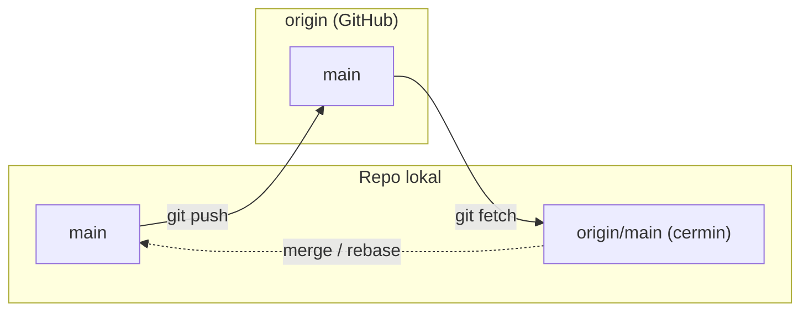

<p class="fig-cap"><b>Fetch lalu push.</b> Fetch memperbarui cermin `origin/main`, push mengirim commit lokal ke remote. Penggabungan ke `main` lokal adalah langkah terpisah yang kamu kendalikan.</p>

Di sinilah `git fetch` dan `git pull` berbeda secara fundamental. **`git fetch`** mengunduh objek dan commit baru dari remote lalu menggerakkan `origin/main`, tetapi **tidak menyentuh branch aktifmu**. Working tree dan `main` lokal tetap apa adanya. **`git pull`** adalah `fetch` yang langsung disusul integrasi ke branch aktif, secara default lewat `merge` (atau `rebase` bila kamu pakai `git pull --rebase`). Karena `pull` menggabungkan tanpa memberimu jeda untuk melihat, fetch dulu lalu lihat selisihnya adalah kebiasaan yang lebih tenang.

<Box variant="tip" icon="💡" label="Fetch dulu, baru putuskan"><p>Biasakan `git fetch` lalu `git log --oneline main..origin/main` untuk melihat commit apa yang akan masuk sebelum menggabungkannya. Kamu tidak pernah dikejutkan oleh perubahan yang tiba-tiba sudah ter-merge.</p></Box>

Untuk push pertama kali sebuah branch, gunakan `git push -u origin main`. Flag `-u` (singkatan `--set-upstream`) menetapkan **upstream**: relasi tetap antara branch lokalmu dan `origin/main`. Setelah upstream tersetel, `git push`, `git pull`, dan `git status` tahu lawan bicaranya tanpa kamu sebutkan lagi, dan `git status` bahkan akan memberitahu "your branch is ahead of origin/main by 2 commits".

```bash title="Terminal"
# hubungkan repo lokal ke remote dan dorong main pertama kali
git remote add origin git@github.com:kamu/skincare-backend.git
git remote -v
git push -u origin main

# lihat update tim tanpa mengubah branch aktif, lalu bandingkan
git fetch origin
git log --oneline main..origin/main      # commit yang ada di remote, belum di lokal
git status                                # ahead/behind terhadap upstream
```

Lalu ada momen yang pasti kamu temui: **push ditolak** dengan pesan `! [rejected] ... (non-fast-forward)`. Artinya remote sudah punya commit yang belum ada di repo lokalmu (rekan setim mendorong duluan), sehingga push-mu akan menghapus jejak mereka. Git menolak demi keselamatan. Penyelesaiannya bukan memaksa, melainkan menarik dulu pekerjaan mereka, menumpuk commit-mu di atasnya, baru mendorong lagi.

<Box variant="warn" icon="⚠️" label="Push ditolak? Jangan paksa"><p>Hindari `git push --force` ke branch bersama, ia menghapus commit rekanmu. Jalankan `git pull --rebase` untuk menumpuk commit-mu di atas milik mereka, selesaikan konflik bila ada, lalu `git push`. Bila benar-benar perlu memaksa, pakai `--force-with-lease` yang membatalkan diri bila remote berubah di luar dugaan.</p></Box>

<Box variant="bridge" icon="🌉" label="Jembatan: dari folder lokal ke workspace bersama"><p>Seperti memindahkan proyek dari folder di laptop ke workspace tim yang dipakai bersama, remote mengubah riwayatmu dari catatan pribadi menjadi sumber yang bisa ditarik, ditinjau, dan dilanjutkan siapa pun di tim.</p></Box>

</Section>

<Section num="11" id="pull-request" title="Pull Request dan Code Review" sub="Tempat review, CI, dan keputusan merge">

<p class="lead">Mendorong branch ke remote baru setengah cerita, pull request adalah tempat branch itu ditinjau, diuji, dan diputuskan layak masuk `main`.</p>

**Pull request** (PR di GitHub) atau **merge request** (MR di GitLab) adalah usulan formal untuk menggabungkan branch-mu ke branch target. Ia jauh lebih dari tombol merge: PR menyatukan judul yang jelas, deskripsi yang menjelaskan *kenapa* perubahan ini ada, reviewer yang ditunjuk, status check dari CI, dan keputusan approval. Inti reviewnya berbasis **diff**, jadi reviewer membaca selisih baris demi baris, bukan menjalankan seluruh aplikasi di kepala mereka. Karena itulah PR menjadi titik kendali mutu sekaligus arsip keputusan: enam bulan kemudian, PR-lah yang menjelaskan mengapa `PriceRupiah` diubah menjadi `int64`.

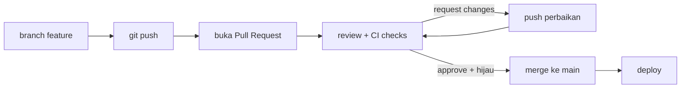

<p class="fig-cap"><b>Siklus pull request.</b> Branch didorong, PR dibuka, review dan CI berputar sampai hijau dan disetujui, baru merge lalu deploy.</p>

Alur code review yang sehat punya ritme khas. Reviewer bisa meninggalkan **comment** biasa untuk diskusi, **suggestion** yang berisi potongan kode siap-terima sekali klik, **request changes** yang memblokir merge sampai diperbaiki, atau **approve** yang memberi lampu hijau. Sebagai penulis, tanggapi setiap komentar, dorong commit perbaikan ke branch yang sama (PR memperbarui dirinya otomatis), dan tandai percakapan selesai. Yang paling menentukan kualitas review bukan ketajaman reviewer, melainkan **ukuran PR**: diff 60 baris diperiksa teliti dalam sepuluh menit, diff 1.500 baris hanya akan dapat "LGTM" yang sebenarnya berarti "saya menyerah membacanya".

<Box variant="tip" icon="💡" label="PR kecil, review cepat dan tajam"><p>Pecah pekerjaan menjadi PR yang fokus pada satu hal, idealnya di bawah beberapa ratus baris diff. PR kecil mendapat review yang lebih cepat, lebih teliti, dan lebih jarang menyembunyikan bug di antara perubahan yang tidak relevan.</p></Box>

Deskripsi PR yang baik menjawab tiga hal sekaligus: apa yang berubah, kenapa, dan bagaimana cara memverifikasinya. Reviewer yang membaca diff tidak otomatis tahu konteks bisnisnya, jadi deskripsilah yang memberi mereka peta.

```markdown title="PR description"
## Apa
Tambah endpoint POST /v1/products untuk membuat produk skincare.

## Kenapa
Tim katalog perlu menambah SKU baru tanpa akses langsung ke database.
Harga disimpan sebagai PriceRupiah int64 (rupiah penuh, bukan float)
agar bebas galat pembulatan.

## Cara verifikasi
- `go test ./internal/product/...` hijau
- curl contoh ada di komentar pertama
```

<Box variant="note" icon="📝" label="Review menyebarkan pengetahuan"><p>Tujuan utama code review bukan mencari kesalahan, melainkan menyebarkan pemahaman: reviewer belajar bagian kode yang tidak ia tulis, penulis dapat sudut pandang baru, dan tim secara perlahan menyepakati gaya bersama. Kesalahan yang tertangkap hanyalah bonus.</p></Box>

<Box variant="bridge" icon="🌉" label="Jembatan: dari serah-terima ke review diff"><p>Bila dulu kamu menyerahkan kerjaan ke QA atau lead lalu menunggu verdict di tiket, PR memindahkan percakapan itu ke konteks kode itu sendiri. Komentar menempel pada baris yang dibahas, sehingga umpan balik menjadi konkret dan langsung bisa ditindaklanjuti.</p></Box>

</Section>

<Section num="12" id="branch-protection" title="Branch Protection dan CODEOWNERS" sub="Melindungi main dengan review, status check, dan owner">

<p class="lead">PR hanya berarti bila aturannya ditegakkan, branch protection memastikan tidak ada perubahan yang menyelinap ke `main` tanpa review dan CI.</p>

Branch penting seperti `main` adalah sumber kebenaran yang biasanya jadi dasar deploy, jadi ia layak dipagari. GitHub menyediakan dua mekanisme: **branch protection rules** klasik dan **rulesets** modern yang lebih luwes. Rulesets bisa banyak aktif bersamaan, punya status on/off, dan dapat dilihat siapa pun yang punya akses baca; menurut [dokumentasi GitHub tentang rulesets](https://docs.github.com/en/repositories/configuring-branches-and-merges-in-your-repository/managing-rulesets/about-rulesets), aturan-aturan ini "layer with protection rules" sehingga ketika tumpang tindih, yang paling restriktif yang menang. Aturan yang paling sering dipakai: wajib pull request sebelum merge dengan jumlah approval tertentu, wajib status check (CI) lulus, blokir force push, dan larang penghapusan branch.

<Box variant="note" icon="📝" label="Guardrail kolaborasi, pakai ruleset modern"><p>Branch protection bukan soal tidak percaya pada tim, melainkan guardrail yang membuat kebiasaan baik menjadi default dan kesalahan fatal menjadi sulit terjadi. Untuk repo baru, mulai dengan ruleset modern GitHub karena lebih ekspresif dan bisa ditumpuk per kebutuhan.</p></Box>

Reviewer tidak harus ditunjuk manual setiap kali. File **CODEOWNERS** memetakan path ke pemilik, sehingga GitHub otomatis meminta review dari tim yang tepat begitu PR menyentuh file di area mereka. File ini dicari di `.github/`, root, lalu `docs/`, dan sintaksnya mengikuti pola gitignore diikuti `@username` atau `@org/team-name`. Menurut [dokumentasi GitHub tentang code owners](https://docs.github.com/en/repositories/managing-your-repositorys-settings-and-features/customizing-your-repository/about-code-owners), bila digabung dengan aturan "require review from Code Owners", satu approval dari salah satu owner sudah cukup.

```text title="CODEOWNERS"
# Owner default untuk semua file
*                   @org/maintainers

# Per area: yang paling spesifik menang
/frontend/          @org/team-fe
/backend/           @org/team-be
/infra/             @org/team-infra

# Pola bisa per ekstensi atau direktori dalam
**/*.sql            @org/team-be
```

<Box variant="bridge" icon="🌉" label="Jembatan: dari akses production yang dibatasi"><p>Seperti production yang hanya bisa disentuh lewat pipeline berizin, bukan SSH langsung sembarangan, branch `main` yang dilindungi hanya bisa berubah lewat PR yang lolos review dan CI. Pintunya sama: jalur yang teruji, bukan jalan pintas.</p></Box>

Menyetel proteksi pada `main` hanya beberapa langkah lewat antarmuka GitHub.

<Steps>
<Step><b>Buka Rulesets</b><p>Di repo, masuk Settings &rarr; Rules &rarr; Rulesets, lalu New branch ruleset dan beri nama deskriptif seperti "protect-main".</p></Step>
<Step><b>Target branch main</b><p>Pada Target branches, tambahkan pola yang mencakup `main` (atau "Default branch"), dan set Enforcement status ke Active.</p></Step>
<Step><b>Wajibkan pull request</b><p>Centang "Require a pull request before merging" dan tetapkan minimal jumlah approval, mis. 1, plus "Require review from Code Owners" bila pakai CODEOWNERS.</p></Step>
<Step><b>Wajibkan status check</b><p>Centang "Require status checks to pass" lalu pilih job CI yang harus hijau, mis. build dan `go test`, agar kode rusak tidak bisa di-merge.</p></Step>
<Step><b>Kunci force push dan deletion</b><p>Aktifkan "Block force pushes" dan "Restrict deletions" supaya riwayat `main` tidak bisa ditimpa atau dihapus, lalu simpan ruleset.</p></Step>
</Steps>

<Box variant="warn" icon="⚠️" label="Tanpa proteksi, satu force push bisa menghapus histori"><p>Bila `main` tidak terlindungi, satu `git push --force` yang keliru bisa menimpa dan menghapus commit seluruh tim secara permanen di remote. Block force pushes adalah pagar paling murah dengan dampak paling besar, nyalakan sejak hari pertama.</p></Box>

</Section>


<Section num="13" id="rebase" title="Rebase: Merapikan Sejarah" sub="Linear history, merge vs rebase, dan interactive rebase">

<p class="lead">Rebase memindahkan commit branch-mu ke atas base terbaru, menulis ulang sejarah agar menjadi garis lurus yang mudah dibaca.</p>

Saat kamu bekerja di branch `feature/checkout`, branch `main` tidak diam. Rekanmu terus merge fitur lain ke sana. Kalau nanti kamu merge balik, sejarah jadi rumit: garis bercabang, merge commit di mana-mana, dan `git log` terlihat seperti peta kereta bawah tanah. Rebase menawarkan jalan lain: alih-alih menyatukan dua cabang dengan merge commit, ia mengangkat commit-commitmu dan menanamnya ulang satu per satu di atas ujung `main` yang terbaru.

Dokumen GitHub menyebut [rebasing sebagai cara "menulis ulang riwayat commit"](https://docs.github.com/en/get-started/using-git/about-git-rebase), yang membuat riwayat lebih bersih namun harus dipakai dengan hati-hati karena commit lama digantikan oleh commit baru dengan hash berbeda.

```bash title="Terminal"
git switch feature/checkout
git fetch origin
git rebase origin/main
```

<Figure><GitRebaseFig01 /><Fragment slot="caption"><b>Rebase memindahkan basis.</b> Commit feature ditulis ulang di atas main terbaru sehingga histori menjadi linear.</Fragment></Figure>

Secara teknis, `git rebase origin/main` melakukan ini: Git mencari commit nenek moyang bersama antara `feature/checkout` dan `origin/main`, "melepas" tiap commit milikmu sejak titik itu, memindahkan HEAD ke ujung `origin/main`, lalu memutar ulang (replay) commit-commitmu satu demi satu. Karena induknya berubah, setiap commit mendapat hash baru. Isinya sama, identitasnya berbeda. Inilah inti dari "menulis ulang sejarah" yang harus kamu pahami benar sebelum melangkah lebih jauh.

<Box variant="analogy" icon="🧶" label="Analogi: mencabut dan menanam ulang"><p>Bayangkan commit-mu sebagai tanaman di pot. Merge menyambung dua pot dengan selang. Rebase mencabut tanamanmu dan menanamnya ulang di tanah `main` yang baru, seolah ia tumbuh di sana sejak awal.</p></Box>

<h3>Merge versus rebase</h3>

Keduanya menggabungkan kerja dari dua branch, tetapi menghasilkan sejarah yang berbeda secara mendasar. Merge jujur apa adanya: ia menyimpan fakta bahwa dua jalur paralel pernah ada lalu bertemu di satu merge commit. Rebase memilih kerapian: ia berpura-pura kerjamu memang dibangun di atas base terbaru, menghasilkan garis lurus tanpa merge commit.

<div class="tbl-wrap"><table><thead><tr><th>Aspek</th><th>Merge</th><th>Rebase</th></tr></thead><tbody><tr><td>Sejarah</td><td>Bercabang, ada merge commit</td><td>Linear, tanpa merge commit</td></tr><tr><td>Hash commit</td><td>Tetap (tidak berubah)</td><td>Ditulis ulang (hash baru)</td></tr><tr><td>Kejujuran riwayat</td><td>Menyimpan jejak paralel</td><td>Menyembunyikan jejak paralel</td></tr><tr><td>Aman untuk branch shared?</td><td>Ya</td><td>Tidak, jangan</td></tr></tbody></table></div>

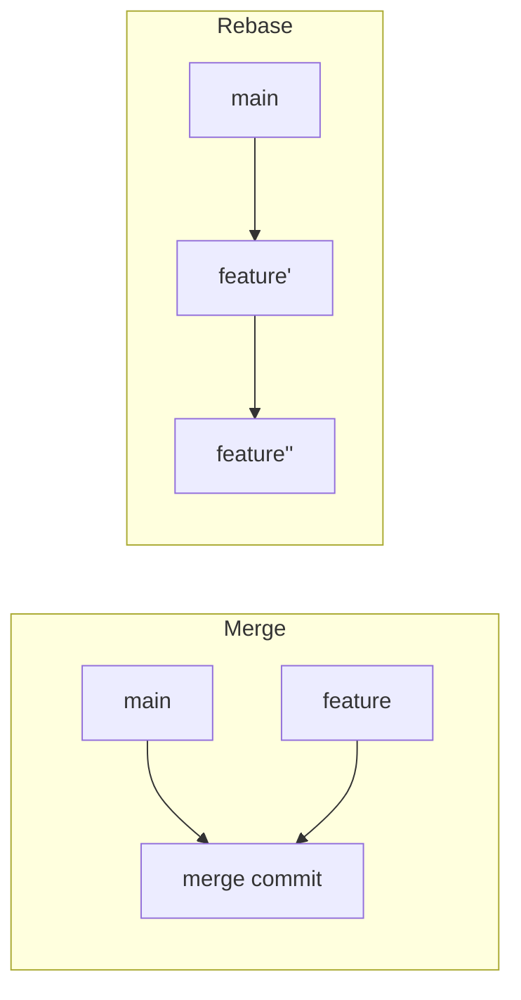

<p class="fig-cap"><b>Dua hasil akhir.</b> Merge menyatu di satu titik; rebase memanjang lurus.</p>

<Box variant="warn" icon="⚠️" label="Jangan rebase branch publik"><p>Bila commit sudah di-push dan dipakai orang lain, rebase menulis ulang hash-nya. Saat rekanmu menarik, Git melihat dua sejarah berbeda dan repo mereka kacau dengan commit ganda. Rebase hanya pada commit yang masih lokal dan belum dibagikan.</p></Box>

<h3>Konflik saat rebase</h3>

Karena rebase memutar ulang commit satu per satu, konflik bisa muncul di commit mana pun di tengah jalan. Saat itu terjadi, rebase berhenti dan menunggu. Pola penyelesaiannya berbeda dari merge: kamu tidak `commit`, melainkan melanjutkan rebase.

<Steps><Step><b>Resolve konflik</b><p>Buka file bertanda, sunting, lalu <code>git add</code> file yang sudah beres.</p></Step><Step><b>Lanjutkan</b><p>Jalankan <code>git rebase --continue</code>, Git memutar commit berikutnya.</p></Step><Step><b>Atau mundur total</b><p>Bila ingin batal, <code>git rebase --abort</code> mengembalikan branch ke kondisi sebelum rebase.</p></Step></Steps>

<h3>Interactive rebase: poles sebelum PR</h3>

`git rebase -i` membuka editor berisi daftar todo: tiap commit satu baris dengan kata kunci di depannya. Di sinilah kamu merapikan riwayat draft sebelum dibaca reviewer. Tiga commit "wip", "fix typo", dan "beneran fix" bisa dilebur jadi satu commit bersih yang menceritakan satu perubahan utuh.

<div class="tbl-wrap"><table><thead><tr><th>Kata kunci</th><th>Arti</th></tr></thead><tbody><tr><td><code>pick</code></td><td>Pakai commit apa adanya</td></tr><tr><td><code>reword</code></td><td>Pakai commit, tapi ubah pesannya</td></tr><tr><td><code>squash</code></td><td>Lebur ke commit di atasnya, gabung kedua pesan</td></tr><tr><td><code>fixup</code></td><td>Lebur ke commit di atasnya, buang pesannya</td></tr><tr><td><code>edit</code></td><td>Berhenti di commit ini untuk diubah</td></tr><tr><td><code>drop</code></td><td>Buang commit sepenuhnya</td></tr></tbody></table></div>

```bash title="Terminal"
git rebase -i HEAD~3
# editor terbuka:
# pick a1b2c3d add product handler
# fixup d4e5f6a fix typo
# fixup 9z8y7x6 wip
# simpan & tutup → tiga commit jadi satu
```

<Box variant="tip" icon="🪄" label="Reorder dengan memindah baris"><p>Mengubah urutan baris di editor todo akan mengubah urutan commit saat replay. Pindahkan commit dokumentasi ke bawah, atau dekatkan fixup ke commit asalnya, lalu simpan.</p></Box>

<Box variant="bridge" icon="🌉" label="Jembatan: seperti menyunting draft"><p>Saat menulis artikel, kamu tidak menerbitkan setiap coretan. Kamu menggabung paragraf, menghapus catatan, lalu publish versi rapi. Interactive rebase adalah penyuntingan akhir itu untuk riwayat commit-mu.</p></Box>

<Recap title="Inti rebase"><ul><li><b>git rebase main</b> memindahkan commit branch ke atas base terbaru, hasilnya linear.</li><li>Konflik diselesaikan lalu <b>git rebase --continue</b>, atau batalkan dengan <b>--abort</b>.</li><li>Rebase menulis ulang hash, jadi <b>jangan</b> pada commit publik yang dipakai orang lain.</li><li><b>git rebase -i</b> dengan squash/fixup/reword merapikan draft commit sebelum PR.</li></ul></Recap>

</Section>

<Section num="14" id="undo" title="Reset, Restore, Revert, dan Stash" sub="Membatalkan perubahan dengan aman">

<p class="lead">Git punya beberapa cara membatalkan perubahan, dan salah memilih bisa menghapus kerja keras secara permanen.</p>

Pertanyaan "bagaimana cara undo di Git?" tidak punya satu jawaban, karena tergantung kamu ingin membatalkan apa: perubahan file yang belum di-commit, staging yang keliru, atau commit yang sudah masuk sejarah. Empat perintah menangani kasus yang berbeda, dan memahami batas masing-masing menyelamatkanmu dari kehilangan data.

<h3>git restore: buang perubahan working tree</h3>

`git restore` menangani file yang sudah kamu ubah tapi belum di-commit. Ada dua arah: mengembalikan isi file ke versi terakhir, atau mengeluarkannya dari staging area.

```bash title="Terminal"
git restore internal/product/service.go   # buang edit, kembali ke HEAD
git restore --staged internal/product/service.go   # unstage, edit tetap ada
```

<Box variant="bridge" icon="🌉" label="Jembatan: undo editor vs undo repo"><p>Ctrl+Z di editor membatalkan ketikan terakhir di satu file. <code>git restore</code> bekerja di level snapshot repo, mengembalikan file ke kondisi commit terakhir sekaligus, bahkan setelah editor ditutup.</p></Box>

<h3>git reset: memindahkan HEAD</h3>

`reset` menggeser pointer HEAD ke commit lain, dan tiga modenya menentukan area mana yang ikut berubah. Inilah perintah yang paling sering disalahpahami, dan `--hard` adalah yang paling berbahaya.

<Figure><GitResetModesFig01 /><Fragment slot="caption"><b>Tiga mode reset.</b> --soft, --mixed, dan --hard berbeda pada area mana yang ikut diubah.</Fragment></Figure>

<div class="tbl-wrap"><table><thead><tr><th>Mode</th><th>HEAD</th><th>Index (staging)</th><th>Working tree</th></tr></thead><tbody><tr><td><code>--soft</code></td><td>Pindah</td><td>Tetap (perubahan tetap staged)</td><td>Tetap</td></tr><tr><td><code>--mixed</code> (default)</td><td>Pindah</td><td>Di-reset (unstage)</td><td>Tetap</td></tr><tr><td><code>--hard</code></td><td>Pindah</td><td>Di-reset</td><td>Ditimpa (perubahan hilang)</td></tr></tbody></table></div>

```bash title="Terminal"
git reset --soft HEAD~1    # batalkan commit terakhir, isinya tetap tersimpan & staged
git reset HEAD~1           # (--mixed) batalkan commit, isi jadi unstaged di working tree
git reset --hard HEAD~1    # batalkan commit DAN buang semua perubahannya
```

`--soft` berguna saat kamu ingin menyusun ulang commit terakhir tanpa kehilangan apa pun. `--mixed` mengembalikan perubahan ke working tree untuk dipilah ulang. `--hard` membuang semuanya tanpa ampun.

<Box variant="warn" icon="⚠️" label="git reset --hard membuang permanen"><p>Mode <code>--hard</code> menimpa working tree dan perubahan yang belum di-commit lenyap. Untuk commit yang sempat ada, <code>git reflog</code> masih merekam pergerakan HEAD dan bisa dipakai memulihkan, tapi file yang belum pernah di-commit sama sekali tidak terselamatkan.</p></Box>

<h3>git revert: undo aman untuk sejarah publik</h3>

`reset` cocok untuk commit lokal, tapi berbahaya bila commit sudah di-push. Untuk membatalkan commit yang sudah dibagikan, pakai `git revert`. Alih-alih menghapus, ia membuat commit baru yang isinya kebalikan dari commit target. Sejarah tetap utuh, hash lama tetap ada, dan rekanmu tidak terganggu.

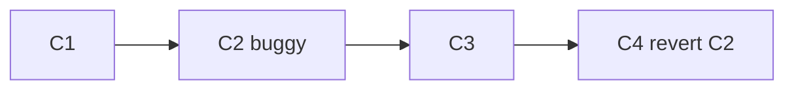

<p class="fig-cap"><b>Revert menambah, bukan menghapus.</b> C4 membalik efek C2 tanpa menyentuh sejarah yang sudah dipush.</p>

```bash title="Terminal"
git revert a1b2c3d   # buat commit baru yang membalik a1b2c3d
```

<Box variant="tip" icon="💡" label="Reset untuk lokal, revert untuk publik"><p>Aturan praktis: commit belum di-push? <code>reset</code> boleh. Commit sudah di-push dan dipakai orang lain? Selalu <code>revert</code>, karena ia tidak menulis ulang sejarah yang sudah dimiliki orang.</p></Box>

<h3>git stash: simpan sementara</h3>

Kadang kamu sedang setengah jalan mengerjakan sesuatu lalu harus pindah branch untuk perbaikan mendesak. `git stash` menyimpan perubahan yang belum di-commit ke tumpukan terpisah, membersihkan working tree, lalu bisa kamu kembalikan nanti.

<Steps><Step><b>Simpan</b><p><code>git stash push -m "wip checkout"</code> menyimpan dan memberi label.</p></Step><Step><b>Pindah & kerjakan</b><p>Working tree bersih, bebas <code>git switch</code> ke branch lain.</p></Step><Step><b>Kembalikan</b><p><code>git stash pop</code> menerapkan lalu menghapus dari tumpukan, atau <code>git stash apply</code> menerapkan tanpa menghapus.</p></Step></Steps>

```bash title="Terminal"
git stash push -m "wip checkout"
git stash list                      # lihat semua stash
git switch hotfix/price-bug
# ... perbaiki, commit ...
git switch feature/checkout
git stash pop                       # lanjutkan kerja sebelumnya
```

<Recap title="Empat alat undo"><ul><li><b>restore</b>: buang edit file (<code>--staged</code> untuk unstage), aman, lingkup file.</li><li><b>reset</b>: geser HEAD; <code>--soft</code> simpan staged, <code>--mixed</code> unstage, <code>--hard</code> buang semua.</li><li><b>revert</b>: commit pembalik, satu-satunya undo aman untuk sejarah publik.</li><li><b>stash</b>: parkir perubahan sementara dengan push/pop/apply/list untuk pindah branch.</li></ul></Recap>

</Section>


<Section num="15" id="tag-hooks-conventions" title="Tag, Gitignore, Hooks, dan Conventional Commits" sub="Release, kebersihan repo, dan automasi pesan">

<p class="lead">Empat alat kebersihan yang membuat repo bisa dirilis dengan rapi dan dijaga tetap bersih tanpa disiplin manual.</p>

Sejauh ini fokus kita pada bagaimana commit mengalir. Section ini melengkapi gambar dengan empat hal di sekelilingnya, menandai titik rilis (tag), menjaga file yang tak layak masuk (`.gitignore`), menjalankan pengecekan otomatis di momen tepat (hooks), dan menyepakati format pesan (Conventional Commits). Keempatnya saling menguatkan, tag dan pesan terstruktur memungkinkan changelog otomatis, hook memaksa pesan itu valid sebelum commit terbentuk.

<h3>Tag: menandai versi rilis</h3>

Tag adalah penanda permanen pada sebuah commit, biasanya untuk versi rilis. Ada dua jenis. Lightweight tag hanya pointer ke commit, seperti branch yang tidak bergerak. Annotated tag adalah objek penuh dengan nama tagger, tanggal, pesan, dan bisa ditandatangani GPG. Untuk rilis publik selalu pakai annotated.

```bash title="Terminal"
git tag -a v1.0.0 -m "Rilis publik pertama skincare-backend"
git tag                       # daftar tag lokal
git show v1.0.0               # lihat objek tag + commit yang ditunjuk
git push origin v1.0.0        # tag tidak ikut push biasa, dorong eksplisit
git push origin --tags        # atau dorong semua tag sekaligus
```

Penomoran versi mengikuti Semantic Versioning, `MAJOR.MINOR.PATCH`. MAJOR naik saat ada perubahan yang memecah kompatibilitas, MINOR saat ada fitur baru yang tetap kompatibel, PATCH saat hanya perbaikan bug. Pemetaan ini bukan kebetulan, ia selaras persis dengan Conventional Commits di bawah.

<Box variant="bridge" icon="🌉" label="Jembatan: dari versi paket ke versi aplikasi"><p>Angka di <code>package.json</code> "version" atau <code>composer.json</code> adalah ide yang sama, tag git menjadikannya titik yang bisa di-checkout, di-rollback, dan dibandingkan kapan saja.</p></Box>

<h3>.gitignore: menjaga repo tetap bersih</h3>

Repo backend tidak perlu menyimpan dependensi, rahasia, atau hasil build. File-file itu besar, berbeda per mesin, atau berbahaya bila bocor. `.gitignore` mendaftar pola yang Git abaikan.

```bash title=".gitignore"
# dependensi & build
node_modules/
/bin/
/tmp/
*.exe

# rahasia (JANGAN pernah commit)
.env
.env.*
!.env.example

# file OS & editor
.DS_Store
Thumbs.db
.idea/
.vscode/
```

Pola membaca seperti ini, `/` di akhir berarti hanya cocok direktori, `/` di awal meng-anchor relatif ke lokasi file `.gitignore`, dan tanpa `/` cocok di level mana pun. Tanda `!` me-re-include file yang tadinya terabaikan, di contoh atas `.env.*` mengabaikan semua varian tapi `.env.example` tetap dilacak agar tim tahu kunci apa yang dibutuhkan. Untuk pola lintas semua proyek (mis. `.DS_Store`), pakai global ignore via `git config --global core.excludesFile ~/.config/git/ignore`.

<Box variant="warn" icon="⚠️" label="Bila .env pernah ter-commit"><p>Menambah <code>.env</code> ke <code>.gitignore</code> tidak menghapus jejaknya dari history, secret-nya tetap ada di commit lama. Rotasi (ganti) semua kredensial yang pernah bocor, lalu bersihkan history. Cara membersihkannya dibahas di section 17.</p></Box>

<h3>Git hooks: automasi di momen tepat</h3>

Hook adalah skrip yang Git jalankan otomatis pada event tertentu. Tiga yang paling berguna di sisi klien, `pre-commit` (sebelum pesan ditulis, untuk lint/format/test cepat), `commit-msg` (validasi format pesan), dan `pre-push` (cek terakhir sebelum objek dikirim ke remote). Bila hook keluar dengan kode non-nol, operasi dibatalkan.

```bash title=".git/hooks/pre-commit"
#!/bin/sh
# format & vet sebelum snapshot commit terbentuk
gofmt -l . | grep . && echo "Jalankan gofmt dulu" && exit 1
go vet ./... || exit 1
exit 0
```

Hook hidup di `.git/hooks/` dan **tidak ikut saat clone**, jadi disiplin tim tidak terjaga sendiri. Karena itu tim memakai manajer hook yang menyimpan konfigurasi di dalam repo dan memasangnya lewat `core.hooksPath`. Pilihan umum, **husky** (ekosistem Node/npm), **lefthook** (ditulis Go, cepat dan paralel, cocok untuk proyek polyglot), dan **pre-commit** (berbasis Python, banyak bahasa).

<Box variant="bridge" icon="🌉" label="Jembatan: dari lint-on-save ke lint-before-commit"><p>Format-on-save di editor hanya menjaga mesinmu. <code>pre-commit</code> hook adalah jaring yang sama tapi di gerbang repo, tak peduli editor atau mesin siapa, commit kotor tidak lolos.</p></Box>

<h3>Conventional Commits: pesan yang bisa diolah mesin</h3>

Conventional Commits 1.0.0 menstandarkan baris pertama pesan menjadi `type(scope): description`. Tipe yang lazim, `feat` (fitur baru), `fix` (perbaikan bug), `docs`, `refactor`, `test`, dan `chore`. Karena formatnya konsisten, alat bisa membaca riwayat untuk menghasilkan changelog dan menentukan versi otomatis.

```text title="Contoh pesan"
feat(cart): tambah endpoint POST /v1/carts/items

Hitung subtotal pakai PriceRupiah int64 agar bebas galat pembulatan.

fix(auth): tolak token kedaluwarsa dengan 401
refactor(order): pisahkan service dari handler
feat(api)!: ubah field harga jadi PriceRupiah, hapus "price_float"

BREAKING CHANGE: respons /v1/products kini memakai price_rupiah.
```

Pemetaan ke SemVer langsung, `fix` menaikkan PATCH, `feat` menaikkan MINOR, dan perubahan yang memecah kompatibilitas (ditandai `!` setelah type atau footer `BREAKING CHANGE:`) menaikkan MAJOR. Gabungkan dengan `commit-msg` hook agar pesan yang tidak sesuai format ditolak sebelum masuk history.

<Box variant="tip" icon="💡" label="Scope sesuai modul"><p>Pakai scope yang mencerminkan domain proyek, <code>cart</code>, <code>order</code>, <code>auth</code>, <code>product</code>. Saat membaca <code>git log --oneline</code> nanti, scope membuat riwayat bisa dipindai per area tanpa membuka diff.</p></Box>

</Section>

<Section num="16" id="workflows" title="Workflow Tim: GitHub Flow sampai Trunk-Based" sub="GitHub Flow, GitLab Flow, Git Flow, Trunk-Based, plus hotfix">

<p class="lead">Workflow bukan aturan baku, ia cara tim menyepakati bagaimana cabang mengalir dari ide ke produksi.</p>

Semua perintah yang sudah kamu kuasai (branch, merge, PR, rebase) adalah huruf. Workflow adalah kalimatnya, kesepakatan kapan membuat branch, ke mana ia merge, dan kapan kode mencapai pengguna. Tidak ada yang "paling benar", yang ada adalah yang paling cocok dengan ukuran tim dan irama deployment. Mari telusuri dari yang paling sederhana.

<h3>GitHub Flow: sesederhana mungkin</h3>

GitHub Flow hanya punya satu cabang abadi, `main`, yang selalu siap deploy. Setiap pekerjaan lahir sebagai branch pendek dari `main`, dibuka sebagai Pull Request untuk review dan CI, lalu di-merge kembali dan langsung di-deploy. Branch berumur jam atau hari, bukan minggu.

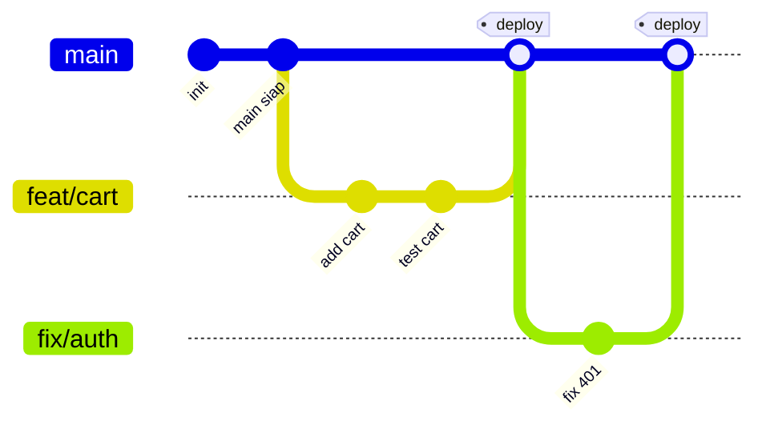

<p class="fig-cap"><b>GitHub Flow.</b> Garis utama lurus, cabang lahir pendek lalu kembali dan langsung dirilis.</p>

<Box variant="bridge" icon="🌉" label="Jembatan: dari task harian ke workflow tim"><p>Satu task di papan kerja (mis. "tambah keranjang") memetakan satu-satu ke satu branch pendek dan satu PR. Workflow tim sebenarnya hanya menumpuk kebiasaan harianmu menjadi konvensi bersama.</p></Box>

<h3>GitLab Flow: menambah environment branch</h3>

Saat deploy tidak instan dan perlu tahap (staging dulu, baru produksi), GitHub Flow kurang. GitLab Flow menambah environment branch. Fitur tetap merge ke `main`, lalu `main` dipromosikan downstream lewat merge request berurutan. Menurut [dokumentasi GitLab](https://docs.gitlab.com/user/project/repository/branches/strategies/), commit hanya mengalir ke hilir setelah teruji di tiap environment.

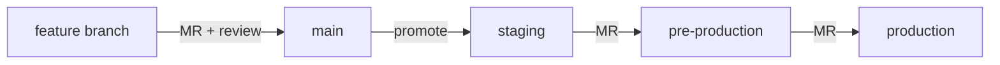

<p class="fig-cap"><b>GitLab Flow dengan environment branch.</b> Kode hanya bergerak ke kanan, tiap panah adalah gerbang yang sudah lolos uji.</p>

<h3>Git Flow: lengkap tapi berat</h3>

Git Flow memakai banyak cabang berumur panjang, `main` (rilis), `develop` (integrasi), plus `feature/*`, `release/*`, dan `hotfix/*`. Cocok untuk produk dengan rilis berversi terjadwal, tapi sering terlalu berat untuk tim kecil yang deploy harian.

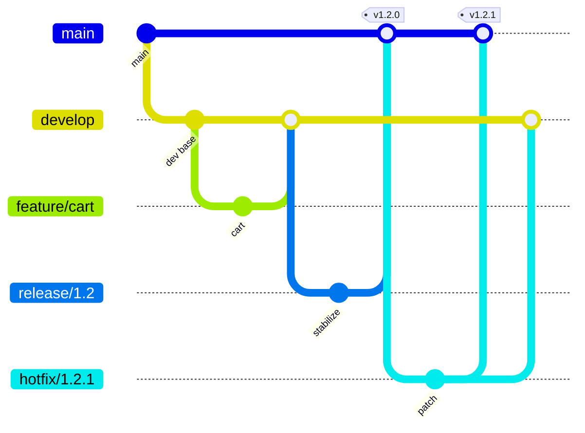

<p class="fig-cap"><b>Git Flow.</b> Dua cabang abadi (main + develop) plus release dan hotfix, perhatikan hotfix di-back-merge ke develop agar perbaikan tidak hilang.</p>

<h3>Trunk-Based dan dua alur khusus</h3>

Trunk-Based Development mendorong integrasi sangat sering ke satu trunk dengan branch berumur sangat pendek (jam, bahkan langsung). Fitur yang belum siap disembunyikan di balik feature flag, bukan ditahan di branch panjang, sehingga konflik besar nyaris tak pernah terjadi. Di luar alur utama, dua pola sering muncul. **Hotfix**, cabang dari tag atau `main` untuk patch darurat, review cepat, tag versi PATCH baru, lalu back-merge agar perbaikan ikut ke cabang pengembangan. **Release branch**, cabang stabilisasi paralel tempat hanya bugfix yang diterima, sementara `main` jalan terus untuk fitur berikutnya, menghasilkan release candidate sebelum tag final.

<Box variant="tip" icon="💡" label="Mulai sederhana"><p>Untuk kebanyakan tim, mulailah dari GitHub Flow atau Trunk-Based. Jangan mengadopsi Git Flow yang kompleks tanpa alasan nyata seperti rilis berversi terjadwal atau dukungan banyak versi sekaligus, kompleksitas itu menambah pajak harian.</p></Box>

<Box variant="note" icon="🧭" label="Hands-on"><p>Latih dua hal, simulasikan satu feature branch dari awal sampai merge ber-PR (GitHub Flow), lalu di papan rancang alur <code>main &rarr; staging &rarr; production</code> untuk skincare-backend dan tentukan gerbang CI apa yang dijaga di tiap promosi.</p></Box>

</Section>

<Section num="17" id="advanced-troubleshoot" title="Topik Lanjutan dan Troubleshooting" sub="Monorepo, submodule, bisect, pitfalls, security, CI/CD">

<p class="lead">Kumpulan kemampuan yang membedakan orang yang panik saat repo kacau dari orang yang tahu di mana commit "hilang" disimpan.</p>

Setelah alur dasar lancar, sisa perjalanan adalah skala dan pemulihan, bagaimana repo besar dikelola, bagaimana melacak bug ke commit penyebabnya, dan apa yang dilakukan saat sesuatu terlihat lenyap. Kabar baiknya, Git jarang benar-benar membuang data, ia hanya menyembunyikannya sampai kamu tahu cara melihatnya.

<h3>Skala: monorepo, submodule, subtree</h3>

Monorepo menampung banyak layanan dalam satu repo. Kuncinya kepemilikan path lewat **CODEOWNERS** (file di `.github/` berisi pola gitignore plus `@tim`), agar PR di area tertentu otomatis meminta review pemilik area. Untuk repo raksasa, `sparse-checkout` dan partial clone membuatmu mengunduh hanya bagian yang dikerjakan. Submodule dan subtree menyematkan repo lain, submodule menyimpan pointer ke commit eksternal, tapi keduanya menambah kompleksitas nyata dan sering lebih baik dihindari kecuali ada kebutuhan kuat. Apa pun pilihannya, PR kecil tetap aturan emas.

<h3>git bisect: berburu commit penyebab bug</h3>

Saat sebuah bug muncul entah kapan, jangan menebak. `git bisect` melakukan pencarian biner di antara commit yang masih baik dan yang sudah rusak, membelah rentang sampai menemukan commit pertama yang merusak.

```bash title="Terminal"
git bisect start
git bisect bad                 # commit sekarang rusak
git bisect good v1.0.0         # versi ini masih sehat
# Git checkout commit di tengah, kamu uji, lalu beri tahu hasilnya:
git bisect good                # atau: git bisect bad
# ulangi sampai Git menunjuk "first bad commit"
git bisect reset               # kembali ke posisi semula
```

<p class="fig-cap"><b>Bisect.</b> 1000 commit ditelusuri hanya dalam ~10 langkah karena tiap jawaban memotong setengah ruang pencarian.</p>

<h3>Pitfalls dan pemulihan lewat reflog</h3>

Jebakan tersering, detached HEAD, stale branch yang tertinggal jauh, commit nyasar di branch salah, dan force push yang menimpa kerja orang. Penyelamatnya satu, `git reflog`, catatan setiap pergerakan HEAD di mesinmu. Bahkan setelah `reset --hard`, commit lama masih tercatat di reflog dan bisa dipulihkan.

<Figure><GitDetachedHeadFig01 /><Fragment slot="caption"><b>Detached HEAD.</b> Saat HEAD menunjuk commit langsung (bukan branch), commit baru mudah hilang tanpa branch yang menahannya.</Fragment></Figure>

```bash title="Terminal"
git reflog                     # contoh: a1b2c3d HEAD@{2}: commit: add cart
git switch -c rescue a1b2c3d   # tahan commit "hilang" dengan branch baru
```

<Box variant="warn" icon="⚠️" label="Detached HEAD & force push"><p>Detached HEAD berarti commit yang tidak dipegang branch mana pun, mudah ter-garbage-collect. Selalu <code>git switch -c &lt;branch&gt;</code> sebelum commit dalam keadaan ini. Dan force push hanya boleh ke branch milikmu sendiri, gunakan <code>--force-with-lease</code> agar batal bila ada commit orang lain yang belum kamu lihat.</p></Box>

<h3>Security dan CI/CD sebagai gerbang</h3>

Hygiene minimal, pastikan `.env` tidak pernah masuk repo, aktifkan secret scanning untuk menangkap kunci yang bocor, pertimbangkan signed commit untuk membuktikan author, dan terapkan least privilege pada akses. Bila secret pernah ter-commit, rotasi (ganti) kuncinya, menghapus dari history saja tidak cukup karena clone lama tetap menyimpannya. CI/CD mengikat semua ini, required status check menjadikan lolosnya test sebagai syarat merge (gerbang), sementara deploy bisa branch-based (merge ke `main` memicu staging) atau tag-based (tag `v*` memicu rilis produksi).

<Box variant="bridge" icon="🌉" label="Jembatan: dari debug aplikasi ke debug repo"><p>Mendebug error runtime, kamu mempersempit ke baris kode penyebab. Mendebug repo sama persis, <code>bisect</code> mempersempit ke commit penyebab, dan <code>reflog</code> adalah stack trace pergerakan HEAD-mu.</p></Box>

<Box variant="note" icon="🧭" label="Hands-on"><p>Latih pemulihan nyata, pakai <code>git bisect</code> untuk melacak satu regression, lalu pindahkan sebuah commit yang nyasar di branch salah dan pulihkan hasil <code>reset --hard</code> yang tak sengaja lewat <code>git reflog</code>.</p></Box>

</Section>

<Section num="18" id="ringkasan" title="Ringkasan dan Workflow Rekomendasi" sub="Dari kerja sendiri ke tim yang aman dan scalable">

<p class="lead">Git yang kamu kuasai sekarang bukan kumpulan perintah, melainkan satu model mental yang konsisten dari snapshot sampai kolaborasi tim.</p>

Mari satukan benangnya. Semua dimulai dari satu ide, Git menyimpan **snapshot**, bukan diff. Dari sana mengalir **tiga area** (working tree, index, repo) yang menjelaskan kenapa `add` dan `commit` terpisah. Di atasnya berdiri commit yang baik (atomik, pesan jelas), lalu **branch dan merge** untuk bekerja paralel, **conflict** yang kamu selesaikan dengan tenang karena paham strukturnya, dan **remote** plus **Pull Request + review** untuk berbagi. **Branch protection** menjadikan kualitas itu wajib, sementara **rebase** dan operasi **undo** (reset, revert, reflog) memberi kendali untuk merapikan dan memulihkan. Workflow tim hanyalah cara menata semua itu untuk banyak orang.

<Recap title="Yang Wajib Menempel">
<ul>
<li>Git menyimpan snapshot, bukan diff, hash menjamin integritas tiap versi.</li>
<li>Tiga area (working tree, index, repo) menjelaskan kenapa staging ada dan berguna.</li>
<li>Commit yang baik bersifat atomik dengan pesan yang menjelaskan "kenapa".</li>
<li>Branch itu murah, merge menyatukan, fast-forward bila linear, merge commit bila bercabang.</li>
<li>Conflict itu normal, selesaikan dengan memahami kedua sisi, bukan menghapus salah satunya.</li>
<li>Remote, PR, dan review adalah tempat kualitas tim benar-benar terjaga.</li>
<li>Branch protection dan required status check menjadikan standar tidak bisa dilewati.</li>
<li>Rebase merapikan history (hanya yang belum dibagikan), revert aman untuk history publik.</li>
<li>reflog adalah jaring pengaman, commit jarang benar-benar hilang.</li>
</ul>
</Recap>

Prinsip akhir yang menyatukan semuanya, **mulai dari yang sederhana, tambah kompleksitas hanya saat tim dan deployment benar-benar membutuhkannya**. Workflow yang berat sebelum waktunya adalah pajak harian tanpa imbalan.

<CardGrid cols={3}>
<Card>
<h4>Tim kecil / solo</h4>
<p>GitHub Flow atau Trunk-Based. Satu <code>main</code> yang selalu siap deploy, branch pendek, PR ringan, CI dasar. Tidak perlu environment branch sampai deployment menuntutnya.</p>
</Card>
<Card>
<h4>Tim sedang tumbuh</h4>
<p>GitHub Flow plus branch protection, required review, dan CODEOWNERS. Tambah staging environment dan deploy branch-based saat rilis mulai perlu tahap.</p>
</Card>
<Card>
<h4>Tim enterprise</h4>
<p>GitLab Flow dengan environment branch atau Git Flow bila ada rilis berversi terjadwal. Rulesets ketat, signed commit, secret scanning, dan deploy tag-based ke produksi.</p>
</Card>
</CardGrid>

Langkah berikutnya bukan lagi membaca, melainkan berkolaborasi nyata, buka PR pertamamu di skincare-backend, minta review, dan biarkan CI menjadi gerbang. Saat alur itu terasa alami, kamu siap menyambungkannya ke pipeline CI/CD penuh, tempat setiap merge ke `main` mengantar kode dengan aman sampai ke pengguna.

</Section>

