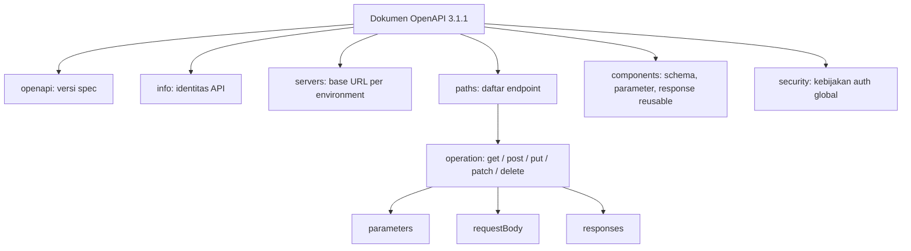
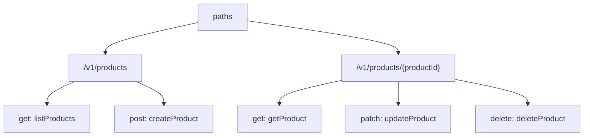
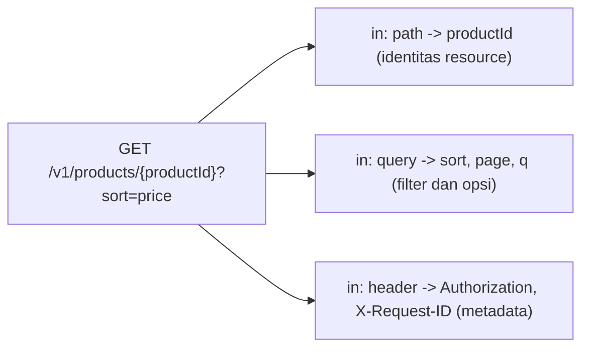
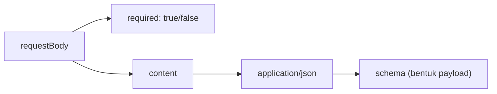
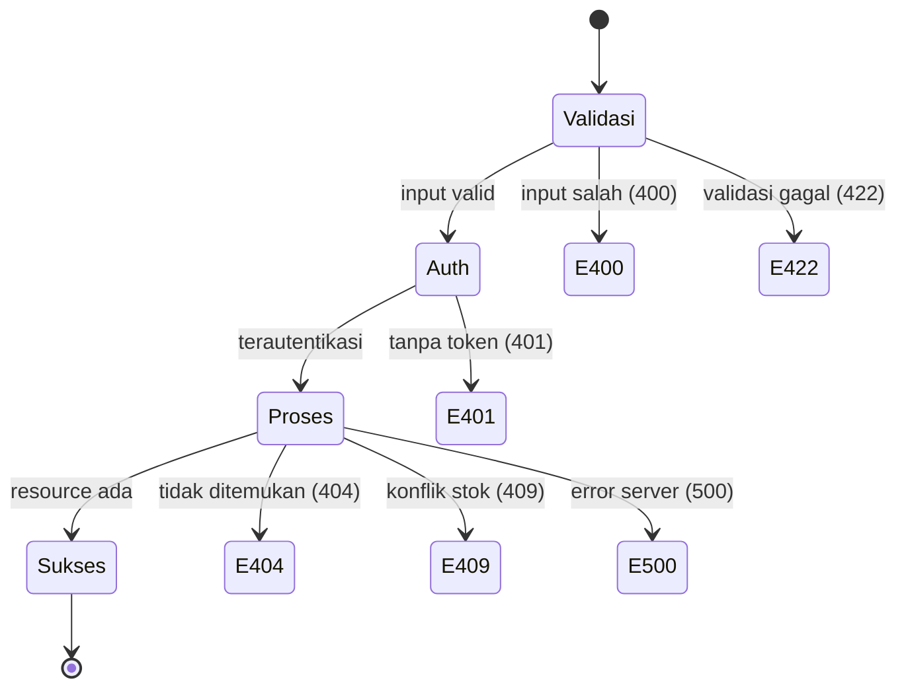
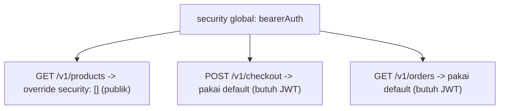
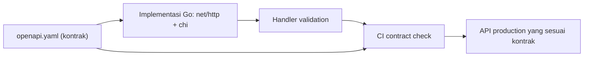

import { Section, Box, Recap, CardGrid, Card, Chip, Hero, Compare, FileTree, Endpoint } from "@components";

<Hero eyebrow="Course &middot; OpenAPI" title="Belajar <em>OpenAPI</em><br />Kontrak HTTP yang Bisa Dieksekusi">
  <p>OpenAPI bukan dokumentasi cantik, melainkan kontrak HTTP formal yang dimengerti manusia dan tooling. Kita rancang kontraknya dulu, lalu implementasi handler Go menyusul.</p>
  <Fragment slot="meta">
    <Chip icon="book">Spec: <b>OpenAPI 3.1.1</b></Chip>
    <Chip icon="package">Default <b>JSON Schema 2020-12</b></Chip>
    <Chip icon="clock">~95 menit baca</Chip>
  </Fragment>
</Hero>

<Section num="01" id="kenapa-openapi" title="Kenapa OpenAPI?" sub="Dari dokumentasi yang cepat basi ke kontrak yang bisa diverifikasi">

<p class="lead">Bayangkan tim backend, frontend, mobile, QA, dan integrasi pihak ketiga semuanya menebak bentuk API dari sumber yang berbeda. Backend baca kode handler, frontend baca screenshot Postman, QA baca pesan Slack. Itulah kekacauan yang OpenAPI selesaikan.</p>

OpenAPI Specification (OAS) adalah format standar yang language-agnostic untuk mendeskripsikan HTTP API. Dengan satu dokumen, manusia dan mesin bisa memahami endpoint apa saja yang tersedia, parameter dan body yang dibutuhkan, serta bentuk response yang dikembalikan, semuanya tanpa membaca source code atau menyadap traffic. Lihat [OpenAPI Specification resmi](https://spec.openapis.org/oas/v3.1.1.html) untuk teks normatifnya.

Bedanya tajam: dokumentasi manusia ditulis untuk dibaca orang, sedangkan spec OpenAPI ditulis untuk dieksekusi tooling. Dari satu file `openapi.yaml` yang sama, tooling bisa membangkitkan dokumentasi interaktif, client TypeScript, mock server, dan test kontrak di CI. Dokumentasi yang ditulis tangan cepat basi karena ia terpisah dari kebenaran. Spec yang diverifikasi di CI tidak bisa berbohong tanpa ketahuan.

<Box variant="bridge" icon="🌉" label="Jembatan: dari TypeScript type dan Laravel API Resource"><p>Di TypeScript kamu menulis `interface Product` agar frontend tahu bentuk data. Di Laravel kamu menulis API Resource agar response konsisten. OpenAPI menaikkan ide itu ke level kontrak HTTP penuh: bukan hanya bentuk data, tetapi juga path, method, status code, header, dan error, dalam satu file yang dipakai semua pihak sekaligus.</p></Box>

Inilah satu `openapi.yaml` paling sederhana untuk daftar produk skincare. Baca pelan-pelan, kita bedah strukturnya di section berikutnya.

```yaml title="api/openapi.yaml"
openapi: 3.1.1
info:
  title: Skincare Shop API
  version: 1.0.0
paths:
  /v1/products:
    get:
      operationId: listProducts
      summary: Daftar produk skincare
      responses:
        "200":
          description: Daftar produk berhasil diambil
          content:
            application/json:
              schema:
                type: array
                items:
                  type: object
                  properties:
                    id:
                      type: integer
                    name:
                      type: string
                    priceRupiah:
                      type: integer
```

Walaupun pendek, file ini sudah berbicara banyak. Ia menyebut versi spec (`3.1.1`), identitas API (`info`), satu endpoint (`GET /v1/products`), nama unik operasi (`operationId`), dan bentuk response sukses (array produk dengan `id`, `name`, `priceRupiah`). Frontend bisa langsung tahu apa yang akan diterima, jauh sebelum handler Go pertama ditulis.

<CardGrid cols={3}>
  <Card><h4>Single source of truth</h4><p>Satu kontrak dipakai backend, frontend, mobile, QA, dan integrasi luar. Tidak ada lagi tebak-tebakan.</p></Card>
  <Card><h4>Machine-readable</h4><p>Tooling membaca spec untuk codegen, mock, dan contract test. Dokumentasi manusia tak bisa dieksekusi.</p></Card>
  <Card><h4>Kontrak dulu, kode menyusul</h4><p>Tim sepakat soal bentuk API sebelum satu handler pun ditulis, jadi paralelisasi kerja jadi mungkin.</p></Card>
</CardGrid>

<Box variant="note" icon="📝" label="Versi yang dipakai course ini"><p>Versi spec OpenAPI terbaru adalah 3.2.0 (rilis 19 September 2025), sebuah feature release yang kompatibel mundur dengan 3.1. Course ini memakai 3.1.1 sebagai default karena dukungan tooling-nya paling luas, sambil tetap menjelaskan posisi 3.2 sebagai langkah berikutnya.</p></Box>

</Section>

<Section num="02" id="mental-model" title="Mental Model dan Struktur Dokumen" sub="Peta besar dari atas ke bawah, plus YAML vs JSON">

<p class="lead">Sebelum mengisi detail, kunci dulu peta besarnya. Dokumen OpenAPI punya beberapa field top-level yang selalu sama, dan memahami fungsinya membuat sisanya terasa mudah.</p>

Sebuah dokumen OpenAPI 3.1 dibaca dari atas ke bawah dengan urutan logis: deklarasi versi, identitas, lokasi server, daftar endpoint, kumpulan komponen yang dipakai ulang, dan kebijakan keamanan global. Begitu kamu hafal kerangka ini, file sepanjang ribuan baris pun tetap bisa kamu navigasi.



<p class="fig-cap"><b>Gambar 1.</b> Peta top-level dokumen OpenAPI. `paths` adalah jantungnya, `components` adalah lemari penyimpanan bersama.</p>

<div class="tbl-wrap">
<table>
<thead><tr><th>Field</th><th>Fungsi</th><th>Wajib?</th></tr></thead>
<tbody>
<tr><td><code>openapi</code></td><td>Menyatakan versi spec, misalnya <code>3.1.1</code>. Menentukan aturan parsing.</td><td>Ya</td></tr>
<tr><td><code>info</code></td><td>Identitas API: title, version, description, kontak, lisensi.</td><td>Ya</td></tr>
<tr><td><code>servers</code></td><td>Daftar base URL tempat API berjalan (local, staging, production).</td><td>Tidak</td></tr>
<tr><td><code>paths</code></td><td>Kumpulan endpoint dan operasi HTTP-nya.</td><td>Salah satu dari paths / components / webhooks</td></tr>
<tr><td><code>components</code></td><td>Objek reusable: schemas, parameters, responses, securitySchemes.</td><td>Tidak</td></tr>
<tr><td><code>security</code></td><td>Kebijakan autentikasi default untuk seluruh operasi.</td><td>Tidak</td></tr>
</tbody>
</table>
</div>

<Box variant="bridge" icon="🌉" label="Jembatan: dari folder routes dan controller"><p>Di Express atau Laravel, struktur API tersebar di folder `routes/` dan `app/Http/Controllers/`. OpenAPI menyatukan peta itu ke satu dokumen. `paths` adalah `routes/api.php` versi deklaratif, dan `components.schemas` adalah kumpulan API Resource atau TypeScript type yang dipakai ulang.</p></Box>

Spec yang sama bisa ditulis dalam YAML atau JSON. Keduanya setara, hanya beda format penulisan. YAML jauh lebih nyaman dibaca manusia karena ringkas dan mendukung komentar, sedangkan JSON lebih cocok saat dihasilkan atau dikonsumsi mesin. Course ini memakai YAML untuk contoh yang dibaca manusia.

<Compare aLabel="YAML" bLabel="JSON" aTone="teal" bTone="muted">
  <Fragment slot="a"><ul><li>Ringkas, indentasi-based, mendukung komentar dengan `#`.</li><li>Nyaman ditulis dan di-review tangan, ideal untuk file `openapi.yaml`.</li><li>Rawan salah indentasi karena struktur ditentukan spasi, bukan kurung.</li></ul></Fragment>
  <Fragment slot="b"><ul><li>Eksplisit dengan kurung kurawal dan kurung siku, tanpa komentar.</li><li>Cocok sebagai output tooling atau payload yang dikirim ke validator.</li><li>Lebih verbose untuk ditulis tangan, tetapi tidak ambigu soal struktur.</li></ul></Fragment>
</Compare>

Potongan yang sama persis, ditulis dalam dua format. Perhatikan bahwa YAML memakai indentasi dua spasi sedangkan JSON memakai kurung eksplisit.

```yaml title="contoh.yaml (YAML)"
info:
  title: Skincare Shop API
  version: 1.0.0
```

```json title="contoh.json (JSON)"
{
  "info": {
    "title": "Skincare Shop API",
    "version": "1.0.0"
  }
}
```

<Box variant="warn" icon="⚠️" label="Jebakan indentasi YAML"><p>YAML memakai spasi, bukan tab, dan satu spasi nyasar bisa mengubah arti dokumen total. Sebuah field yang seharusnya anak dari `info` bisa diam-diam jadi field top-level kalau indentasinya meleset. Selalu pakai dua spasi per level dan aktifkan validator agar kesalahan struktur ketahuan lebih awal.</p></Box>

Inilah skeleton minimal `openapi.yaml` untuk Skincare Shop API yang akan kita isi sepanjang course. Semua field top-level ada, isinya masih kosong, siap diisi bertahap.

```yaml title="api/openapi.yaml (skeleton)"
openapi: 3.1.1
info:
  title: Skincare Shop API
  version: 1.0.0
  description: Kontrak HTTP untuk backend online shop skincare.
servers: []
paths: {}
components:
  schemas: {}
  parameters: {}
  responses: {}
  securitySchemes: {}
```

<Box variant="note" icon="📝" label="Kenapa 3.1.1 jadi default"><p>OpenAPI 3.1.1 dipublikasikan 24 Oktober 2024 sebagai patch release dari 3.1.0. Ia hanya memperbaiki terminologi, penyelarasan JSON Schema, penanganan reference, dan kejelasan dokumentasi, tanpa perubahan breaking. Karena itu aman dipakai sebagai default dengan kompatibilitas tooling yang luas.</p></Box>

</Section>

<Section num="03" id="info-servers" title="Info, Versi, dan Servers" sub="Identitas kontrak dan tempat ia berjalan">

<p class="lead">Object `info` memberi API sebuah identitas, dan `servers` menjelaskan di mana API itu bisa dihubungi. Keduanya beda peran: `info` adalah tentang kontrak, `servers` adalah tentang deployment.</p>

Mulai dari `info`. Ia berisi metadata yang membuat spec terasa seperti produk, bukan file mentah: judul, versi, deskripsi, kontak, dan lisensi. Field `version` di sini adalah versi kontrak API, bukan versi paket atau versi spec OpenAPI. Pakai semantic versioning agar perubahan kontrak punya makna yang jelas.

```yaml title="api/openapi.yaml (info)"
info:
  title: Skincare Shop API
  version: 1.0.0
  description: |
    Kontrak HTTP untuk backend online shop skincare.
    Mencakup katalog, cart, checkout, order, auth, dan admin.
  contact:
    name: Tim Backend Skincare
    email: backend@skincare.example
  license:
    name: Proprietary
```

<Box variant="bridge" icon="🌉" label="Jembatan: dari versioning package frontend"><p>Di frontend kamu menaikkan versi paket di `package.json` saat ada perubahan, dan semver memberi tahu konsumen apakah aman upgrade. `info.version` melakukan hal yang sama untuk kontrak API. Naikkan patch untuk perbaikan tanpa dampak, minor untuk penambahan yang kompatibel, major untuk perubahan breaking.</p></Box>

Sekarang `servers`. Ia adalah daftar base URL tempat API berjalan. Satu kontrak yang sama biasanya berjalan di banyak environment: laptop developer, staging untuk QA, dan production untuk user nyata. Mencatat semuanya membuat client tahu ke mana harus menembak tanpa menebak.

```yaml title="api/openapi.yaml (servers)"
servers:
  - url: http://localhost:8080
    description: Local development
  - url: https://staging-api.skincare.example
    description: Staging untuk QA
  - url: https://api.skincare.example
    description: Production
```

Untuk URL yang sebagian dinamis, OpenAPI menyediakan server variables. Misalnya base URL yang berbeda hanya pada subdomain region. Variable diberi nilai default dan, bila perlu, daftar `enum` nilai yang sah.

```yaml title="api/openapi.yaml (server variables)"
servers:
  - url: https://{region}.api.skincare.example
    description: Production per region
    variables:
      region:
        default: id
        enum:
          - id
          - sg
        description: Kode region deployment
```

<Box variant="bridge" icon="🌉" label="Jembatan: dari VITE_API_URL"><p>Di proyek React kamu menyimpan `VITE_API_URL` di `.env` agar build tahu ke mana memanggil API. `servers` adalah versi terdokumentasi dan ter-review dari ide itu, hidup di dalam kontrak sehingga seluruh tim dan tooling melihat daftar environment yang sama.</p></Box>

<Box variant="tip" icon="💡" label="Pisahkan kontrak dari environment"><p>Kontrak API (path, schema, error) tidak berubah hanya karena pindah dari staging ke production. Yang berubah hanya base URL di `servers`. Menjaga pemisahan ini membuat satu spec bisa dipakai untuk semua environment tanpa duplikasi.</p></Box>

</Section>

<Section num="04" id="paths-operations" title="Paths, Operations, dan operationId" sub="Jantung OpenAPI dan semantik HTTP method">

<p class="lead">`paths` adalah bagian terpenting dokumen. Di sinilah endpoint nyata dideklarasikan: kombinasi path, HTTP method, dan apa yang terjadi saat keduanya dipanggil.</p>

Setiap entri di bawah `paths` adalah sebuah path item, misalnya `/v1/products`. Di dalamnya ada satu atau lebih operation object, satu per HTTP method (`get`, `post`, `put`, `patch`, `delete`). Tiap operation punya `summary`, `description`, `tags`, dan yang penting `operationId`: nama unik yang dipakai tooling dan codegen sebagai identitas operasi.



<p class="fig-cap"><b>Gambar 2.</b> Satu path item bisa punya banyak operation, satu per method. Tiap operation punya operationId unik.</p>

```yaml title="api/openapi.yaml (paths)"
paths:
  /v1/products:
    get:
      operationId: listProducts
      summary: Daftar produk skincare
      tags: [product]
      responses:
        "200":
          description: Daftar produk berhasil diambil
  /v1/products/{productId}:
    get:
      operationId: getProduct
      summary: Detail satu produk
      tags: [product]
      responses:
        "200":
          description: Produk ditemukan
        "404":
          description: Produk tidak ditemukan
```

<Box variant="bridge" icon="🌉" label="Jembatan: dari route name ke operationId"><p>Di Laravel kamu memberi nama route dengan `->name('products.show')` agar bisa dirujuk di seluruh aplikasi. Di Go kamu menamai fungsi handler `GetProduct`. `operationId` memainkan peran yang sama di OpenAPI: ia jadi nama fungsi yang dibangkitkan codegen, jadi pastikan unik dan deskriptif seperti `getProduct`, bukan `get1`.</p></Box>

Memilih method bukan soal selera, melainkan soal semantik HTTP. Method menyatakan niat operasi, dan client serta infrastruktur (cache, proxy, retry) bergantung pada makna itu. Dua sifat penting: safe (tidak mengubah state server) dan idempotent (memanggil berkali-kali memberi efek sama seperti sekali).

<div class="tbl-wrap">
<table>
<thead><tr><th>Method</th><th>Niat</th><th>Safe?</th><th>Idempotent?</th></tr></thead>
<tbody>
<tr><td><code>GET</code></td><td>Membaca resource tanpa efek samping.</td><td>Ya</td><td>Ya</td></tr>
<tr><td><code>POST</code></td><td>Membuat resource baru atau memicu aksi.</td><td>Tidak</td><td>Tidak</td></tr>
<tr><td><code>PUT</code></td><td>Mengganti representasi resource secara penuh.</td><td>Tidak</td><td>Ya</td></tr>
<tr><td><code>PATCH</code></td><td>Mengubah sebagian field resource.</td><td>Tidak</td><td>Tidak (umumnya)</td></tr>
<tr><td><code>DELETE</code></td><td>Menghapus resource.</td><td>Tidak</td><td>Ya</td></tr>
</tbody>
</table>
</div>

<Box variant="bridge" icon="🌉" label="Jembatan: dari mutation React Query"><p>Di React Query kamu memakai `useQuery` untuk baca (GET) dan `useMutation` untuk tulis (POST/PUT/PATCH/DELETE). Pembedaan itu bukan kebetulan; ia mencerminkan safe vs unsafe method. Mendesain spec dengan method yang tepat membuat caching dan retry di frontend bekerja sesuai harapan.</p></Box>

Inilah endpoint katalog skincare dengan method yang sesuai niatnya.

<Endpoint method="GET" path="/v1/products" desc="Daftar produk dengan filter, search, dan pagination" />
<Endpoint method="GET" path="/v1/products/{productId}" desc="Detail satu produk berdasarkan id" />
<Endpoint method="POST" path="/v1/checkout" desc="Ubah keranjang jadi order dalam satu transaksi" />
<Endpoint method="DELETE" path="/v1/orders/{orderId}" desc="Batalkan order yang belum dibayar" />

<Box variant="warn" icon="⚠️" label="Jangan POST untuk segalanya"><p>Godaan terbesar pemula adalah memakai POST untuk semua operasi, termasuk membaca data. Itu membuang manfaat caching GET, membingungkan client soal idempotency, dan membuat spec terbaca seperti RPC, bukan REST. Pakai method yang sesuai niat, bukan POST sebagai jalan pintas.</p></Box>

</Section>

<Section num="05" id="parameter" title="Parameter: Path, Query, dan Header" sub="Tiga lokasi input yang berbeda peran">

<p class="lead">Input ke sebuah operasi bisa datang dari tiga lokasi: path, query string, dan header. Tiap lokasi punya peran khasnya sendiri, dan OpenAPI mendeskripsikan ketiganya lewat parameter object dengan field `in`.</p>



<p class="fig-cap"><b>Gambar 3.</b> Tiga lokasi parameter dan peran masing-masing dalam satu request.</p>

Mulai dari path parameter. Ia merepresentasikan identitas resource dan selalu bagian dari URL, misalnya `productId` di `/v1/products/{productId}`. Path parameter selalu `required`, karena tanpa nilainya path tidak lengkap.

```yaml title="api/openapi.yaml (path parameter)"
/v1/products/{productId}:
  get:
    operationId: getProduct
    parameters:
      - name: productId
        in: path
        required: true
        description: Identitas unik produk
        schema:
          type: integer
          format: int64
          example: 42
```

<Box variant="bridge" icon="🌉" label="Jembatan: dari React Router :id dan Laravel {product}"><p>Di React Router kamu menulis `/products/:id`, di Laravel `/products/{product}`. OpenAPI memakai sintaks `{productId}` yang sama, tetapi menambah deklarasi tipe dan contoh nilai. Jadi bukan hanya "ada parameter di sini", melainkan "parameter ini integer 64-bit dengan contoh 42".</p></Box>

Query parameter cocok untuk hal yang bukan identitas: filter, search, sort, dan pagination. Untuk katalog skincare, query yang lazim adalah `page`, `limit`, `sort`, `q` (kata kunci pencarian), dan `skin_type`. Query parameter umumnya opsional dengan nilai default yang masuk akal.

```yaml title="api/openapi.yaml (query parameter)"
/v1/products:
  get:
    operationId: listProducts
    parameters:
      - name: q
        in: query
        required: false
        description: Kata kunci pencarian nama produk
        schema:
          type: string
          example: serum vitamin c
      - name: skin_type
        in: query
        required: false
        schema:
          type: string
          enum: [oily, dry, combination, sensitive, normal]
          example: oily
      - name: page
        in: query
        schema:
          type: integer
          minimum: 1
          default: 1
      - name: limit
        in: query
        schema:
          type: integer
          minimum: 1
          maximum: 100
          default: 20
```

<Box variant="bridge" icon="🌉" label="Jembatan: dari URLSearchParams"><p>Di frontend kamu menyusun query dengan `new URLSearchParams({ page: '1', skin_type: 'oily' })`. OpenAPI mendeskripsikan sisi kontrak dari string itu: nama parameter, tipe, nilai enum yang sah, dan default. Frontend jadi tahu `skin_type=banana` akan ditolak sebelum mengirimnya.</p></Box>

Request header menyampaikan metadata, bukan data bisnis: kredensial auth, idempotency key, dan trace id. Kunci penting di sini adalah selektif. Dokumentasikan header yang menjadi kontrak (yang harus dikirim atau diperhatikan client), bukan setiap header internal.

```yaml title="api/openapi.yaml (header parameter)"
/v1/checkout:
  post:
    operationId: checkout
    parameters:
      - name: Idempotency-Key
        in: header
        required: true
        description: UUID unik agar checkout tidak terjadi dua kali saat retry
        schema:
          type: string
          format: uuid
          example: 9f1c7e2a-1d4b-4a9e-8a1f-3c2b5d6e7f80
      - name: X-Request-ID
        in: header
        required: false
        description: ID korelasi untuk tracing antar service
        schema:
          type: string
```

<Box variant="bridge" icon="🌉" label="Jembatan: dari Axios interceptor"><p>Di frontend kamu sering memasang `Authorization` lewat Axios interceptor untuk semua request. Di OpenAPI, `Authorization` biasanya tidak ditulis sebagai parameter header biasa, melainkan lewat `securitySchemes` (lihat section Security Schemes). Header lain seperti `Idempotency-Key` tetap didokumentasikan sebagai parameter `in: header`.</p></Box>

<Box variant="tip" icon="💡" label="required, type, enum, example"><p>Untuk tiap parameter, isi empat hal yang membuat kontrak hidup: `required` (wajib atau tidak), `type`/`format` (bentuk data), `enum` (nilai sah bila terbatas), dan `example` (contoh nyata). Example yang baik membuat dokumentasi terasa konkret dan menjadi bahan untuk mock server.</p></Box>

</Section>

<Section num="06" id="request-body" title="Request Body" sub="Mendeskripsikan payload yang dikirim client">

<p class="lead">Saat client membuat resource, memperbarui data, login, atau checkout, ia mengirim payload. Object `requestBody` mendeskripsikan payload itu: apakah wajib, dalam media type apa, dan menautkannya ke schema.</p>

Berbeda dari parameter yang tersebar di path, query, dan header, request body adalah satu kesatuan yang dikirim di body request. Field utamanya: `required` (apakah body wajib ada), `content` (peta media type ke schema), dan di dalamnya media type seperti `application/json`.



<p class="fig-cap"><b>Gambar 4.</b> Anatomi requestBody: dari flag required, ke media type, ke schema payload.</p>

Contoh paling jelas adalah login. Client mengirim email dan password, dan body itu wajib ada. Schema-nya inline dulu untuk kejelasan; di section Components kita pindahkan ke tempat reusable.

```yaml title="api/openapi.yaml (request body login)"
/v1/auth/login:
  post:
    operationId: login
    summary: Login dengan email dan password
    tags: [auth]
    requestBody:
      required: true
      content:
        application/json:
          schema:
            type: object
            required: [email, password]
            properties:
              email:
                type: string
                format: email
                example: dina@skincare.example
              password:
                type: string
                format: password
                minLength: 8
                example: rahasiakuat123
    responses:
      "200":
        description: Login berhasil
```

<Box variant="bridge" icon="🌉" label="Jembatan: dari form state dan Laravel Form Request"><p>Di React kamu menyimpan input form di state lalu mengirimnya sebagai JSON. Di Laravel, Form Request mendefinisikan aturan validasi payload masuk. `requestBody` dengan schema-nya adalah kontrak deklaratif yang menyatukan keduanya: bentuk payload yang frontend kirim sekaligus aturan yang backend validasi.</p></Box>

Checkout lebih kaya. Body-nya berisi daftar item, alamat pengiriman, dan metode pembayaran. Perhatikan bagaimana schema bersarang menggambarkan struktur nyata payload.

```yaml title="api/openapi.yaml (request body checkout)"
/v1/checkout:
  post:
    operationId: checkout
    summary: Ubah keranjang jadi order
    tags: [checkout]
    requestBody:
      required: true
      content:
        application/json:
          schema:
            type: object
            required: [items, shippingAddress, paymentMethod]
            properties:
              items:
                type: array
                minItems: 1
                items:
                  type: object
                  required: [productId, quantity]
                  properties:
                    productId:
                      type: integer
                      format: int64
                    quantity:
                      type: integer
                      minimum: 1
              shippingAddress:
                type: string
                example: Jl. Melati No. 7, Bandung
              paymentMethod:
                type: string
                enum: [bank_transfer, ewallet, cod]
    responses:
      "201":
        description: Order berhasil dibuat
```

<Box variant="tip" icon="💡" label="Body hanya untuk method yang menulis"><p>GET tidak boleh punya request body yang bermakna; ia membaca, bukan mengirim payload. Pakai `requestBody` di POST, PUT, dan PATCH. Untuk DELETE, body jarang diperlukan dan banyak tooling mengabaikannya, jadi sandarkan identitas resource ke path parameter.</p></Box>

</Section>

<Section num="07" id="response-object" title="Response Object: Bukan Hanya Happy Path" sub="Mendeskripsikan semua kemungkinan hasil operasi">

<p class="lead">Kontrak yang baik tidak hanya bilang "kalau sukses, ini bentuknya". Ia juga memprediksi kegagalan: input salah, tidak terautentikasi, resource tidak ada, konflik, validasi gagal, dan error server. Object `responses` mendeskripsikan semua itu.</p>

Tiap entri di `responses` dikunci oleh status code HTTP, dan tiap status punya `description`, opsional `content` (body response), dan opsional `headers`. Menutup semua status yang realistis membuat backend dan frontend punya ekspektasi yang sama sejak awal, bukan saling kaget di production.



<p class="fig-cap"><b>Gambar 5.</b> Satu operasi checkout bisa berakhir di banyak status. Kontrak yang baik menulis semuanya.</p>

<div class="tbl-wrap">
<table>
<thead><tr><th>Status</th><th>Arti</th><th>Kapan di skincare shop</th></tr></thead>
<tbody>
<tr><td><code>200</code></td><td>OK, request berhasil.</td><td>GET produk, GET order.</td></tr>
<tr><td><code>201</code></td><td>Created, resource baru dibuat.</td><td>POST checkout membuat order.</td></tr>
<tr><td><code>400</code></td><td>Bad Request, request tidak terbentuk benar.</td><td>JSON rusak, parameter salah tipe.</td></tr>
<tr><td><code>401</code></td><td>Unauthorized, butuh autentikasi.</td><td>Akses cart tanpa token.</td></tr>
<tr><td><code>404</code></td><td>Not Found, resource tidak ada.</td><td>GET produk dengan id yang tidak ada.</td></tr>
<tr><td><code>409</code></td><td>Conflict, bentrok dengan state saat ini.</td><td>Checkout saat stok habis.</td></tr>
<tr><td><code>422</code></td><td>Unprocessable Entity, validasi semantik gagal.</td><td>Email tidak valid, quantity nol.</td></tr>
<tr><td><code>500</code></td><td>Internal Server Error, kesalahan server.</td><td>Database down saat memproses order.</td></tr>
</tbody>
</table>
</div>

```yaml title="api/openapi.yaml (responses lengkap)"
/v1/checkout:
  post:
    operationId: checkout
    responses:
      "201":
        description: Order berhasil dibuat
        headers:
          Location:
            description: URL order yang baru dibuat
            schema:
              type: string
        content:
          application/json:
            schema:
              type: object
              properties:
                orderId:
                  type: integer
                  format: int64
                status:
                  type: string
                  example: pending_payment
      "401":
        description: Tidak terautentikasi
      "409":
        description: Stok tidak mencukupi
      "422":
        description: Validasi payload gagal
      "500":
        description: Kesalahan server
```

<Box variant="bridge" icon="🌉" label="Jembatan: dari try/catch ke status yang diprediksi"><p>Di frontend kamu menulis `try/catch` lalu menebak error apa yang mungkin muncul. Dengan responses yang lengkap, kamu tidak menebak lagi: spec sudah memberi tahu bahwa checkout bisa mengembalikan 401, 409, 422, atau 500, masing-masing dengan makna jelas, sehingga UI bisa menyiapkan pesan untuk tiap kasus.</p></Box>

<Box variant="warn" icon="⚠️" label="Happy path saja itu jebakan"><p>Spec yang hanya menulis `200` adalah kontrak setengah jadi. Frontend akan menulis penanganan error berdasarkan tebakan, lalu pecah saat backend mengembalikan 409 yang tak terduga. Tuliskan status error yang realistis; itu bagian dari kontrak, bukan tambahan opsional.</p></Box>

</Section>

<Section num="08" id="schema-object" title="Schema Object dan JSON Schema" sub="Mendefinisikan bentuk data dengan presisi">

<p class="lead">Sampai di sini kita banyak menulis `schema` inline tanpa membahas isinya. Saatnya mendalami Schema Object: bagian yang mendefinisikan bentuk data, dari tipe sampai constraint detail seperti panjang minimum dan nilai minimum.</p>

Schema Object menjawab pertanyaan "data ini bentuknya seperti apa": `type`, `properties`, `required`, `nullable`, `enum`, `format`, `items` (untuk array), serta constraint seperti `minLength`, `maxLength`, `minimum`, dan `maximum`. Inilah yang membuat spec bisa memvalidasi payload, bukan sekadar mendeskripsikannya.

<Box variant="note" icon="📝" label="OpenAPI 3.1 dan JSON Schema 2020-12"><p>OpenAPI 3.1 selaras penuh dengan JSON Schema Draft 2020-12. Dialect default-nya adalah `https://spec.openapis.org/oas/3.1/dialect/base`, yaitu JSON Schema 2020-12 plus vocabulary khas OpenAPI. Artinya pengetahuan JSON Schema yang sudah kamu punya langsung berlaku, dan schema-mu konsisten dengan ekosistem JSON modern.</p></Box>

<Box variant="bridge" icon="🌉" label="Jembatan: dari TypeScript interface"><p>Schema OpenAPI adalah saudara deklaratif dari TypeScript interface. Bedanya, schema bisa membawa constraint runtime yang TypeScript tidak bisa: `minLength: 8`, `minimum: 1`, `format: email`. Jadi schema bukan hanya bentuk, tetapi juga aturan validasi yang bisa ditegakkan tooling.</p></Box>

Mari modelkan domain skincare. Pertama `Product`, dengan field id, name, dan referensi ke variant dan harga. Perhatikan constraint pada tiap field.

```yaml title="api/openapi.yaml (schema Product)"
Product:
  type: object
  required: [id, name, slug, priceRupiah, isActive]
  properties:
    id:
      type: integer
      format: int64
      example: 42
    name:
      type: string
      minLength: 1
      maxLength: 200
      example: Serum Vitamin C 20%
    slug:
      type: string
      example: serum-vitamin-c-20
    description:
      type: string
      nullable: true
    priceRupiah:
      type: integer
      format: int64
      minimum: 0
      description: Harga dalam rupiah sebagai bilangan bulat
      example: 149000
    skinTypes:
      type: array
      items:
        type: string
        enum: [oily, dry, combination, sensitive, normal]
    isActive:
      type: boolean
      example: true
```

<Box variant="warn" icon="⚠️" label="Uang bukan float"><p>Harga ditulis sebagai `integer` rupiah (`priceRupiah`), bukan `number` desimal. Float menyimpan uang membawa galat pembulatan yang berbahaya untuk perhitungan total dan pajak. Simpan satuan terkecil sebagai bilangan bulat. Di Go, ini sejalan dengan menyimpan `PriceRupiah int64`.</p></Box>

`ProductVariant` mewakili varian (misalnya ukuran 30ml dan 50ml) yang masing-masing punya harga dan stok sendiri.

```yaml title="api/openapi.yaml (schema ProductVariant)"
ProductVariant:
  type: object
  required: [id, label, priceRupiah, stock]
  properties:
    id:
      type: integer
      format: int64
    label:
      type: string
      example: 30ml
    priceRupiah:
      type: integer
      format: int64
      minimum: 0
    stock:
      type: integer
      minimum: 0
      example: 24
```

Untuk uang yang punya satuan dan mata uang eksplisit, sebuah schema `Money` kecil membuat representasi konsisten lintas API. Ini juga jadi contoh perubahan kontrak yang kita bahas di section Topik Lanjutan.

```yaml title="api/openapi.yaml (schema Money)"
Money:
  type: object
  required: [amount, currency]
  properties:
    amount:
      type: integer
      format: int64
      minimum: 0
      description: Jumlah dalam satuan terkecil (rupiah penuh)
      example: 149000
    currency:
      type: string
      enum: [IDR]
      example: IDR
```

Terakhir, dasar `ErrorResponse` yang akan kita matangkan di section Error Standard.

```yaml title="api/openapi.yaml (schema ErrorResponse dasar)"
ErrorResponse:
  type: object
  required: [code, message]
  properties:
    code:
      type: string
      example: PRODUCT_NOT_FOUND
    message:
      type: string
      example: Produk tidak ditemukan
    requestId:
      type: string
      example: 9f1c7e2a-1d4b-4a9e-8a1f-3c2b5d6e7f80
```

<Box variant="tip" icon="💡" label="required itu daftar nama, bukan flag per field"><p>Berbeda dari sebagian bahasa, `required` di JSON Schema adalah array nama field di level object, bukan atribut pada tiap field. Sebuah field dianggap wajib kalau namanya tercantum di array `required` object induknya. `nullable: true` adalah hal terpisah: ia memperbolehkan nilai `null`, bukan menghilangkan kewajiban.</p></Box>

</Section>

<Section num="09" id="components-reuse" title="Components, $ref, Examples, dan Tags" sub="Empat alat menjaga spec tetap maintainable">

<p class="lead">Begitu spec tumbuh, duplikasi jadi musuh. Schema `Product` yang ditulis ulang di lima tempat akan menyimpang diam-diam. Empat alat ini menjaga spec tetap ramping dan mudah dinavigasi: components, $ref, examples, dan tags.</p>

`components` adalah lemari penyimpanan objek reusable: `schemas`, `parameters`, `responses`, dan `securitySchemes`. Setelah objek diletakkan di sana, ia dirujuk dari mana saja dengan `$ref`, sebuah pointer ke lokasi definisi. Tidak ada lagi salin-tempel.

```yaml title="api/openapi.yaml (components dan $ref)"
paths:
  /v1/products/{productId}:
    get:
      operationId: getProduct
      responses:
        "200":
          description: Produk ditemukan
          content:
            application/json:
              schema:
                $ref: "#/components/schemas/Product"
        "404":
          $ref: "#/components/responses/NotFound"
components:
  schemas:
    Product:
      type: object
      required: [id, name]
      properties:
        id: { type: integer, format: int64 }
        name: { type: string }
  responses:
    NotFound:
      description: Resource tidak ditemukan
      content:
        application/json:
          schema:
            $ref: "#/components/schemas/ErrorResponse"
```

<Box variant="bridge" icon="🌉" label="Jembatan: dari shared types dan Laravel Resource"><p>Di TypeScript kamu mengekspor `interface Product` dari satu file lalu mengimpornya di banyak tempat. Di Laravel, satu API Resource class dipakai ulang di banyak controller. `components` plus `$ref` adalah versi OpenAPI dari pola itu: definisikan sekali, rujuk berkali-kali, ubah di satu tempat.</p></Box>

`examples` membuat spec terasa nyata. Sebuah schema memberi tahu bentuk, tetapi example memberi tahu rupanya. Kamu bisa menaruh satu `example` di schema, atau beberapa `examples` bernama di media type untuk menunjukkan kasus berbeda. Example juga jadi bahan dasar mock server.

```yaml title="api/openapi.yaml (examples bernama)"
content:
  application/json:
    schema:
      $ref: "#/components/schemas/Product"
    examples:
      serum:
        summary: Serum vitamin C
        value:
          id: 42
          name: Serum Vitamin C 20%
          priceRupiah: 149000
      sunscreen:
        summary: Sunscreen SPF 50
        value:
          id: 77
          name: Daily Sunscreen SPF 50 PA++++
          priceRupiah: 99000
```

<Box variant="bridge" icon="🌉" label="Jembatan: dari Storybook mock data"><p>Di Storybook kamu menyiapkan mock data agar komponen bisa dirender tanpa backend. `examples` di OpenAPI memberi peran yang sama untuk seluruh API: data contoh yang nyata, sehingga dokumentasi interaktif dan mock server bisa langsung memamerkan response yang masuk akal.</p></Box>

`tags` mengelompokkan operation per domain agar dokumentasi tidak jadi daftar endpoint mentah yang panjang. Untuk skincare shop, kelompokkan per domain: product, cart, checkout, order, auth, dan admin.

```yaml title="api/openapi.yaml (tags)"
tags:
  - name: product
    description: Katalog produk dan pencarian
  - name: cart
    description: Keranjang belanja
  - name: checkout
    description: Proses checkout jadi order
  - name: order
    description: Riwayat dan status order
  - name: auth
    description: Login, register, dan sesi
  - name: admin
    description: Operasi khusus admin
```

<Box variant="tip" icon="💡" label="Satu operasi, satu tag domain"><p>Beri tiap operation tag domain yang jelas lewat `tags: [product]`. Tooling dokumentasi memakai tag untuk menyusun sidebar, jadi pengelompokan yang rapi langsung terlihat oleh siapa pun yang membuka spec. Hindari tag generik seperti `misc` yang akhirnya menampung segalanya.</p></Box>

</Section>

<Section num="10" id="error-standard" title="Error Response Standard" sub="Satu bentuk error yang konsisten lintas endpoint">

<p class="lead">Bila tiap endpoint mengembalikan error dengan bentuk berbeda, frontend, mobile, dan QA terpaksa menebak. Error standard yang konsisten membuat penanganan error bisa ditulis sekali dan dipakai di mana saja.</p>

Bentuk error yang baik membawa minimal: kode mesin yang stabil (`code`), pesan untuk manusia (`message`), detail validasi per field bila ada (`fields`), dan id request untuk korelasi log (`requestId`). Kode mesin penting karena pesan bisa berubah kata-katanya, tetapi `code` jadi pegangan logika di client.

```yaml title="api/openapi.yaml (ErrorResponse dan ValidationErrorResponse)"
components:
  schemas:
    ErrorResponse:
      type: object
      required: [code, message]
      properties:
        code:
          type: string
          example: PRODUCT_NOT_FOUND
        message:
          type: string
          example: Produk tidak ditemukan
        requestId:
          type: string
          format: uuid
    ValidationErrorResponse:
      type: object
      required: [code, message, fields]
      properties:
        code:
          type: string
          example: VALIDATION_FAILED
        message:
          type: string
          example: Beberapa field tidak valid
        fields:
          type: array
          items:
            type: object
            required: [field, message]
            properties:
              field:
                type: string
                example: email
              message:
                type: string
                example: Format email tidak valid
        requestId:
          type: string
          format: uuid
```

<Box variant="bridge" icon="🌉" label="Jembatan: dari Laravel validation error bag"><p>Laravel mengembalikan error validasi sebagai object `errors` dengan key per field dan array pesan. `ValidationErrorResponse` di atas menstandarkan ide itu ke seluruh API, sehingga frontend bisa menulis satu komponen form error yang berlaku untuk semua endpoint, bukan satu per controller.</p></Box>

Untuk standar industri yang matang, ada RFC 9457 (Problem Details for HTTP APIs). Ia mendefinisikan media type `application/problem+json` dengan field standar `type`, `title`, `status`, `detail`, dan `instance`, plus extension seperti `errors`. RFC ini menggantikan RFC 7807 dan layak jadi acuan saat kamu ingin bentuk error yang interoperable lintas organisasi. Lihat [RFC 9457](https://www.rfc-editor.org/rfc/rfc9457.html) untuk teks lengkapnya.

```yaml title="api/openapi.yaml (Problem Details ala RFC 9457)"
components:
  schemas:
    Problem:
      type: object
      properties:
        type:
          type: string
          format: uri
          example: https://skincare.example/problems/out-of-stock
        title:
          type: string
          example: Stok tidak mencukupi
        status:
          type: integer
          example: 409
        detail:
          type: string
          example: Varian 30ml dari produk 42 sudah habis
        instance:
          type: string
          example: /v1/checkout
```

```http title="Contoh response Problem Details"
HTTP/1.1 409 Conflict
Content-Type: application/problem+json

{
  "type": "https://skincare.example/problems/out-of-stock",
  "title": "Stok tidak mencukupi",
  "status": 409,
  "detail": "Varian 30ml dari produk 42 sudah habis",
  "instance": "/v1/checkout"
}
```

<Box variant="tip" icon="💡" label="Pilih satu, lalu konsisten"><p>Kamu boleh memakai `ErrorResponse` buatan sendiri atau Problem Details RFC 9457. Yang penting bukan mana yang dipilih, melainkan konsistensinya: satu bentuk error untuk seluruh API. Bentuk yang berganti-ganti antar endpoint menghapus semua manfaat standardisasi.</p></Box>

</Section>

<Section num="11" id="security-schemes" title="Security Schemes" sub="Mendokumentasikan autentikasi dengan jelas">

<p class="lead">API nyata punya endpoint publik (daftar produk) dan terproteksi (checkout, order). `components.securitySchemes` mendokumentasikan cara autentikasi, dan field `security` menerapkannya secara global atau per operasi.</p>

OpenAPI mendukung beberapa jenis skema keamanan. Yang paling umum di backend Go: bearer token (JWT) lewat header `Authorization`, API key lewat header khusus, dan OAuth2 untuk alur yang lebih kompleks. Definisikan skemanya sekali di `components.securitySchemes`, lalu rujuk dengan namanya.

```yaml title="api/openapi.yaml (securitySchemes)"
components:
  securitySchemes:
    bearerAuth:
      type: http
      scheme: bearer
      bearerFormat: JWT
      description: JWT pada header Authorization, format "Bearer <token>"
    apiKeyAuth:
      type: apiKey
      in: header
      name: X-API-Key
      description: API key untuk integrasi server ke server
```

<Box variant="bridge" icon="🌉" label="Jembatan: dari middleware auth"><p>Di Go kamu memasang middleware yang memeriksa header `Authorization` sebelum handler jalan; di Laravel kamu memakai middleware `auth:sanctum`. `securitySchemes` adalah deklarasi kontrak dari middleware itu: ia memberi tahu client cara mengirim kredensial, jauh sebelum melihat kode middleware-nya.</p></Box>

Penerapan keamanan bertingkat. `security` di level top-level berlaku untuk semua operasi sebagai default. Operasi tertentu bisa override, termasuk membuat dirinya publik dengan `security: []` (array kosong berarti tidak butuh auth).

```yaml title="api/openapi.yaml (security global dan override)"
security:
  - bearerAuth: []
paths:
  /v1/products:
    get:
      operationId: listProducts
      summary: Daftar produk (publik)
      security: []
      responses:
        "200":
          description: Daftar produk
  /v1/checkout:
    post:
      operationId: checkout
      summary: Checkout (butuh login)
      responses:
        "201":
          description: Order dibuat
        "401":
          description: Tidak terautentikasi
```



<p class="fig-cap"><b>Gambar 6.</b> Security global jadi default; daftar produk override menjadi publik, sedangkan checkout dan order tetap terproteksi.</p>

<Box variant="warn" icon="⚠️" label="Endpoint publik harus override eksplisit"><p>Jika `security` global menuntut JWT dan kamu lupa menambahkan `security: []` pada daftar produk, spec menyatakan endpoint itu butuh auth, padahal niatnya publik. Selalu tandai endpoint publik secara eksplisit agar kontrak cocok dengan implementasi.</p></Box>

</Section>

<Section num="12" id="blueprint-skincare" title="Blueprint: Spec Lengkap Online Shop Skincare" sub="Menyatukan semua konsep jadi satu kontrak utuh">

<p class="lead">Sekarang seluruh konsep berkumpul. Inilah blueprint `openapi.yaml` untuk MVP online shop skincare: katalog, cart, checkout, order, auth, dan admin, dengan tags domain, shared schemas, error standard, security, dan examples.</p>

Sebelum melihat YAML utuh, ini struktur folder tempat spec hidup di proyek Go. Spec berdiri sendiri di `api/`, terpisah dari kode implementasi.

<FileTree title="Posisi openapi.yaml di proyek Go" tree={`
skincare-backend/
  api/
    openapi.yaml       # kontrak API, single source of truth
  cmd/
    api/
      main.go          # entry point server
  internal/
    http/              # handler dan router (implementasi kontrak)
    domain/            # tipe domain: Product, Order, Money
  go.mod               # module github.com/kamu/skincare-backend
`} />

Inilah daftar endpoint MVP, dikelompokkan per domain. Publik vs terproteksi ditandai oleh ada tidaknya kebutuhan auth.

<Endpoint method="GET" path="/v1/products" desc="Publik. Daftar produk dengan filter dan pagination" />
<Endpoint method="GET" path="/v1/products/{productId}" desc="Publik. Detail satu produk" />
<Endpoint method="POST" path="/v1/auth/login" desc="Publik. Login dan terima JWT" />
<Endpoint method="GET" path="/v1/cart" desc="Terproteksi. Isi keranjang user" />
<Endpoint method="POST" path="/v1/checkout" desc="Terproteksi. Ubah keranjang jadi order" />
<Endpoint method="GET" path="/v1/orders/{orderId}" desc="Terproteksi. Status satu order" />
<Endpoint method="POST" path="/v1/admin/products" desc="Admin. Buat produk baru" />

Dan inilah kerangka spec yang menyatukan semuanya. Sengaja dipangkas pada bagian berulang, tetapi strukturnya utuh dan valid sebagai blueprint.

```yaml title="api/openapi.yaml (blueprint MVP)"
openapi: 3.1.1
info:
  title: Skincare Shop API
  version: 1.0.0
  description: Kontrak HTTP untuk backend online shop skincare (MVP).
servers:
  - url: http://localhost:8080
    description: Local development
  - url: https://api.skincare.example
    description: Production
security:
  - bearerAuth: []
tags:
  - name: product
  - name: cart
  - name: checkout
  - name: order
  - name: auth
  - name: admin
paths:
  /v1/products:
    get:
      operationId: listProducts
      summary: Daftar produk
      tags: [product]
      security: []
      parameters:
        - $ref: "#/components/parameters/Page"
        - $ref: "#/components/parameters/Limit"
        - name: skin_type
          in: query
          schema:
            type: string
            enum: [oily, dry, combination, sensitive, normal]
      responses:
        "200":
          description: Daftar produk
          content:
            application/json:
              schema:
                type: array
                items:
                  $ref: "#/components/schemas/Product"
  /v1/products/{productId}:
    get:
      operationId: getProduct
      summary: Detail produk
      tags: [product]
      security: []
      parameters:
        - name: productId
          in: path
          required: true
          schema:
            type: integer
            format: int64
      responses:
        "200":
          description: Produk ditemukan
          content:
            application/json:
              schema:
                $ref: "#/components/schemas/Product"
        "404":
          $ref: "#/components/responses/NotFound"
  /v1/auth/login:
    post:
      operationId: login
      summary: Login
      tags: [auth]
      security: []
      requestBody:
        required: true
        content:
          application/json:
            schema:
              type: object
              required: [email, password]
              properties:
                email: { type: string, format: email }
                password: { type: string, minLength: 8 }
      responses:
        "200":
          description: Login berhasil
        "422":
          $ref: "#/components/responses/ValidationError"
  /v1/checkout:
    post:
      operationId: checkout
      summary: Checkout
      tags: [checkout]
      parameters:
        - name: Idempotency-Key
          in: header
          required: true
          schema:
            type: string
            format: uuid
      requestBody:
        required: true
        content:
          application/json:
            schema:
              $ref: "#/components/schemas/CheckoutRequest"
      responses:
        "201":
          description: Order dibuat
        "401":
          $ref: "#/components/responses/Unauthorized"
        "409":
          $ref: "#/components/responses/Conflict"
components:
  securitySchemes:
    bearerAuth:
      type: http
      scheme: bearer
      bearerFormat: JWT
  parameters:
    Page:
      name: page
      in: query
      schema: { type: integer, minimum: 1, default: 1 }
    Limit:
      name: limit
      in: query
      schema: { type: integer, minimum: 1, maximum: 100, default: 20 }
  responses:
    NotFound:
      description: Resource tidak ditemukan
      content:
        application/json:
          schema:
            $ref: "#/components/schemas/ErrorResponse"
    Unauthorized:
      description: Tidak terautentikasi
      content:
        application/json:
          schema:
            $ref: "#/components/schemas/ErrorResponse"
    Conflict:
      description: Konflik dengan state saat ini
      content:
        application/json:
          schema:
            $ref: "#/components/schemas/ErrorResponse"
    ValidationError:
      description: Validasi gagal
      content:
        application/json:
          schema:
            $ref: "#/components/schemas/ValidationErrorResponse"
  schemas:
    Product:
      type: object
      required: [id, name, priceRupiah, isActive]
      properties:
        id: { type: integer, format: int64 }
        name: { type: string, minLength: 1, maxLength: 200 }
        priceRupiah: { type: integer, format: int64, minimum: 0 }
        isActive: { type: boolean }
    CheckoutRequest:
      type: object
      required: [items, paymentMethod]
      properties:
        items:
          type: array
          minItems: 1
          items:
            type: object
            required: [productId, quantity]
            properties:
              productId: { type: integer, format: int64 }
              quantity: { type: integer, minimum: 1 }
        paymentMethod:
          type: string
          enum: [bank_transfer, ewallet, cod]
    ErrorResponse:
      type: object
      required: [code, message]
      properties:
        code: { type: string }
        message: { type: string }
        requestId: { type: string, format: uuid }
    ValidationErrorResponse:
      type: object
      required: [code, message, fields]
      properties:
        code: { type: string }
        message: { type: string }
        fields:
          type: array
          items:
            type: object
            required: [field, message]
            properties:
              field: { type: string }
              message: { type: string }
```

<Box variant="tip" icon="💡" label="Blueprint dulu, handler kemudian"><p>File ini adalah blueprint yang disepakati tim sebelum satu handler Go ditulis. Frontend bisa mulai dengan mock dari spec ini, QA bisa menyiapkan test, dan backend punya peta jelas endpoint apa yang harus dibangun. Kontrak dulu, implementasi menyusul.</p></Box>

</Section>

<Section num="13" id="topik-lanjutan" title="Topik Lanjutan dan Langkah Berikutnya" sub="Yang sengaja ditunda agar tidak hilang diam-diam">

<p class="lead">Course ini fokus pada menulis kontrak. Ada banyak topik kuat di sekitar OpenAPI yang sengaja ditunda agar fondasi kontrak ini kuat dulu. Berikut peta singkatnya supaya tidak ada yang hilang.</p>

<CardGrid cols={2}>
  <Card><h4>Contract-first vs code-first</h4><p>Menulis spec sebelum kode (design-first) atau menghasilkan spec dari kode. Tradeoff utamanya adalah drift dan alur review.</p></Card>
  <Card><h4>OpenAPI dengan Go</h4><p>Posisi spec dalam arsitektur Go: `api/openapi.yaml`, `internal/http`, `internal/domain`, plus generated stub dan validation middleware.</p></Card>
  <Card><h4>Generate client TypeScript</h4><p>Membangkitkan client dan type TypeScript dari spec agar frontend tidak menebak kontrak.</p></Card>
  <Card><h4>Mock server</h4><p>Menjalankan mock API dari examples agar frontend dan backend bisa kerja paralel.</p></Card>
  <Card><h4>Contract testing</h4><p>Memvalidasi request dan response implementasi terhadap spec di CI, agar docs dan kode tidak menyimpang diam-diam.</p></Card>
  <Card><h4>Linting dan style guide</h4><p>Naming convention, required description, operationId uniqueness, tag policy, dan error response policy yang dijaga di CI.</p></Card>
  <Card><h4>Breaking change dan API review</h4><p>Membedakan perubahan breaking (hapus field, rename, ubah type) dari non-breaking (tambah optional), lalu mereviewnya dengan disiplin.</p></Card>
  <Card><h4>API versioning</h4><p>URL versioning, gambaran header versioning, dan kapan perubahan dianggap breaking, misalnya `/v1/products` versus rencana `/v2/products`.</p></Card>
  <Card><h4>Webhooks</h4><p>Field top-level `webhooks` (didukung sejak OpenAPI 3.1) untuk callback payment gateway, misalnya event `PaymentSucceeded`.</p></Card>
  <Card><h4>Cookie session dan CSRF</h4><p>Cookie auth scheme, header CSRF, dan same-site behavior untuk API berbasis SPA, mirip pola Laravel Sanctum.</p></Card>
</CardGrid>

Dua catatan teknis untuk Go yang sering ditanyakan lebih awal: ada dua pendekatan utama menghubungkan OpenAPI dengan kode Go, masing-masing punya filosofi berbeda.

<Compare aLabel="oapi-codegen (spec-first)" bLabel="swaggo/swag (code-first)" aTone="blue" bTone="teal">
  <Fragment slot="a"><ul><li>Spec adalah sumber kebenaran; kode Go dibangkitkan darinya.</li><li>Membangkitkan client dan server stub Go dari spec OpenAPI 3.</li><li>Install: `go install github.com/oapi-codegen/oapi-codegen/v2/cmd/oapi-codegen@latest`.</li></ul></Fragment>
  <Fragment slot="b"><ul><li>Kode adalah sumber kebenaran; spec dibangkitkan dari anotasi handler.</li><li>Anotasi pada handler diubah jadi spec lewat `swag init`.</li><li>Cocok bila tim lebih nyaman mulai dari kode, dengan risiko drift bila anotasi tertinggal.</li></ul></Fragment>
</Compare>

```bash title="Terminal (instalasi oapi-codegen)"
go install github.com/oapi-codegen/oapi-codegen/v2/cmd/oapi-codegen@latest
```

<Box variant="note" icon="📝" label="Webhooks sejak 3.1, dan ke depan 3.2"><p>Field top-level `webhooks` adalah fitur baru di OpenAPI 3.1.0 untuk mendeskripsikan webhook out-of-band; patch 3.1.1 tidak mengubahnya. Versi 3.2.0 (rilis September 2025) menambah fitur lagi sambil tetap kompatibel mundur dengan 3.1, jadi spec 3.1 tetap berjalan.</p></Box>

<Box variant="tip" icon="💡" label="Kelompok tooling ini layak jadi course tersendiri"><p>Codegen, mock server, contract testing, linting, dan integrasi CI adalah ekosistem yang luas. Semuanya layak menjadi course terpisah OpenAPI Lanjutan di masa depan. Course ini memberimu fondasi kontrak yang kokoh, yang menjadi prasyarat semua itu.</p></Box>

</Section>

<Section num="14" id="ringkasan" title="Ringkasan dan Poin Penting" sub="Benang merah dan jalan ke implementasi">

<p class="lead">Satu benang merah mengikat seluruh course: paths, operations, parameter, request body, responses, schema, components, security, dan examples bukan bagian-bagian terpisah, melainkan satu kontrak yang bisa diverifikasi.</p>

Kita mulai dari motivasi (OpenAPI sebagai kontrak machine-readable, bukan dokumentasi cantik), membangun mental model struktur dokumen, lalu mengisi tiap bagian: identitas dan server, endpoint dan method, tiga lokasi parameter, request body, response yang menutup error, schema yang presisi, components untuk reuse, error standard, dan security. Semuanya berpuncak pada satu blueprint `openapi.yaml` untuk online shop skincare.



<p class="fig-cap"><b>Gambar 7.</b> Dari kontrak ke implementasi: spec memandu handler, dan CI menjaga keduanya selaras.</p>

<Recap title="Yang Wajib Menempel">
<ul>
<li>OpenAPI adalah kontrak HTTP formal yang machine-readable, jadi single source of truth lintas backend, frontend, mobile, QA, dan integrasi luar.</li>
<li>Course memakai OpenAPI 3.1.1 sebagai default; ia selaras penuh dengan JSON Schema 2020-12 dan kompatibel dengan tooling luas.</li>
<li>Struktur dokumen: openapi, info, servers, paths, components, security. `paths` adalah jantungnya, `components` adalah lemari reusable lewat `$ref`.</li>
<li>Pilih HTTP method sesuai semantiknya (safe dan idempotent), jangan POST untuk segalanya.</li>
<li>Parameter punya tiga lokasi: path (identitas), query (filter dan pagination), header (metadata seperti Idempotency-Key).</li>
<li>Response harus menutup error, bukan hanya 200: 201, 400, 401, 404, 409, 422, dan 500.</li>
<li>Uang disimpan sebagai integer rupiah, bukan float. Di Go, `PriceRupiah int64`.</li>
<li>Error standard yang konsisten (atau Problem Details RFC 9457) menghemat tebak-tebakan client.</li>
<li>Security: definisikan `securitySchemes`, terapkan global, override per operasi (`security: []` untuk publik).</li>
</ul>
</Recap>

Langkah berikutnya jelas: dari menulis spec, kamu masuk ke implementasi. Bangun handler dengan `net/http` dan [chi](https://github.com/go-chi/chi), tegakkan validasi sesuai schema, lalu pasang contract check di CI agar kode dan kontrak tidak pernah menyimpang. Untuk mendalami codegen dan integrasi Go, lihat [oapi-codegen](https://github.com/oapi-codegen/oapi-codegen). Dengan kontrak yang kokoh sebagai fondasi, sisa jalur Web Artisan, dari routing sampai deploy ke AWS, berdiri di atas dasar yang sudah disepakati bersama.

</Section>
