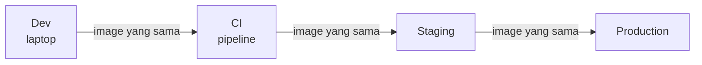
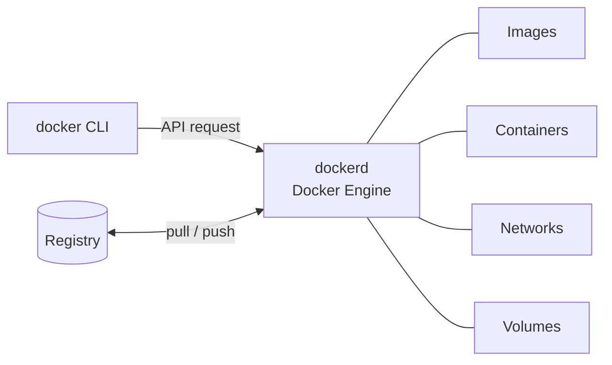
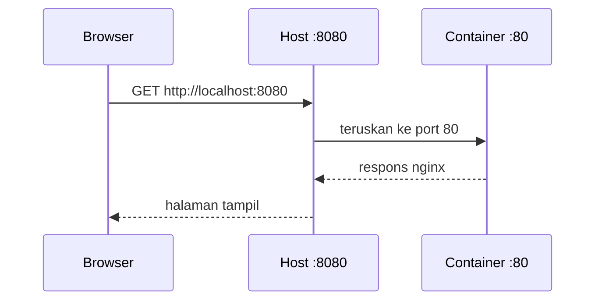

import { Section, Box, Steps, Step, Recap, CardGrid, Card, Chip, Hero, Compare, Figure } from "@components";
import DockerPortMapFig01 from "@figures/DockerPortMapFig01.astro";
import DockerLayersFig01 from "@figures/DockerLayersFig01.astro";

<Hero eyebrow="Chapter 01 &middot; Docker" title="Fondasi &amp; <em>Mental Model</em><br />Docker" sub="Kenapa Docker, tiga kata kunci, container pertama, dan layer yang fana">
  <p>Sebelum menulis satu baris Dockerfile, satu chapter untuk membangun fondasi: kenapa Docker ada, tiga kata kunci yang akan terus muncul, cara menjalankan container pertama, dan apa yang sebenarnya terjadi pada data di dalamnya.</p>
  <Fragment slot="meta">
    <Chip icon="package">Image &amp; <b>container</b></Chip>
    <Chip icon="terminal">Container <b>pertama</b></Chip>
    <Chip icon="clock">~26 menit baca</Chip>
  </Fragment>
</Hero>

Chapter pembuka ini satu busur belajar yang utuh: kita mulai dari **kenapa** Docker layak dikuasai backend developer, lanjut ke **kata kunci** yang menjadi bahasa sehari-hari Docker (image, container, registry), lalu **menjalankan** container pertama, dan menutup dengan memahami **apa yang terjadi pada data** di dalam container. Urutannya sengaja, sebab tanpa model mentalnya, perintah Docker terasa seperti mantra hafalan. Setelah chapter ini, Dockerfile di Chapter 2 akan terbaca logis, bukan magis.

<Section num="01" id="kenapa-docker" title="Kenapa Backend Developer Perlu Docker" sub="Dari &quot;works on my machine&quot; ke runtime yang konsisten">

<p class="lead">Docker mengubah pertanyaan "kok jalan di laptopku tapi mati di server" menjadi tidak relevan, karena yang dikirim bukan kode mentah melainkan seluruh runtime yang sudah jadi.</p>

Setiap backend punya ketergantungan tak kasat mata: versi Go, library sistem, variabel lingkungan, sertifikat CA, hingga timezone. Di laptopmu semuanya pas, di server staging sedikit berbeda, dan binary yang sama tiba-tiba gagal. Inilah inti "works on my machine": runtime tidak pernah benar-benar sama antar mesin. Docker menyelesaikannya dengan membungkus aplikasi beserta seluruh runtime-nya ke dalam satu **image** yang immutable, lalu menjalankan image itu sebagai **container** di mana saja secara identik.

Penting dipahami sejak awal: container **bukan** VM ringan. VM menjalankan kernel dan OS tamu penuh di atas hypervisor, berat dan lambat boot. Container berbagi kernel host, dan isolasi antar proses dicapai lewat fitur kernel Linux: **namespaces** (memberi proses pandangan terpisah atas PID, jaringan, mount, hostname) dan **cgroups** (membatasi CPU dan memori). Jadi container itu cuma proses biasa di host yang "dipagari", bukan sistem operasi tersendiri. Itu sebabnya ia start dalam milidetik dan ringan.

<div class="tbl-wrap"><table><thead><tr><th>Aspek</th><th>Virtual Machine</th><th>Container</th></tr></thead><tbody><tr><td>Isolasi</td><td>OS tamu penuh + kernel sendiri</td><td>Proses terisolasi, berbagi kernel host</td></tr><tr><td>Boot</td><td>Detik sampai menit</td><td>Milidetik</td></tr><tr><td>Ukuran</td><td>Gigabyte</td><td>Megabyte</td></tr><tr><td>Overhead</td><td>Hypervisor</td><td>Nyaris nol</td></tr></tbody></table></div>

<Box variant="analogy" icon="📦" label="Analogi: kontainer pengapalan"><p>Sebelum kontainer standar, barang dimuat manual dan tiap pelabuhan menanganinya beda. Kontainer baja berukuran seragam membuat kapal, truk, dan derek tak peduli isinya, sama seperti image yang jalan identik di laptop maupun server.</p></Box>

<Box variant="bridge" icon="🌉" label="Jembatan: node_modules dan Laravel Sail"><p>Pernah `npm install` menghasilkan dependensi beda antar mesin karena versi Node berbeda, atau pakai Laravel Sail yang sebenarnya Docker? Image membawa runtime Go, library sistem, dan config sekaligus, jadi tidak ada lagi langkah "install dulu di server".</p></Box>

Manfaat utamanya adalah **reproducibility**: image yang sama persis mengalir dari laptop developer ke CI, ke staging, lalu ke production tanpa rebuild ulang yang bisa menghasilkan hasil berbeda. Bonusnya **dependency isolation**: layanan A butuh PostgreSQL 16 dan layanan B butuh 17, keduanya hidup berdampingan tanpa bentrok di host.



<p class="fig-cap"><b>Satu image, banyak tahap.</b> Artefak yang diuji di CI adalah artefak yang berjalan di production.</p>

Di tim nyata, dampak paling cepat terasa saat onboarding. Tanpa Docker, developer baru di proyek `github.com/kamu/skincare-backend` menghabiskan setengah hari memasang versi Go yang pas, PostgreSQL, Redis, dan menyetel `.env` sampai cocok. Dengan Docker, satu perintah `docker compose up` (yang kita rakit di Chapter 4) menyalakan seluruh stack identik di mesin siapa pun, dan "berhasil di laptopku" akhirnya berarti "berhasil di mana saja".

Ayo buktikan dengan satu perintah. Jalankan `docker run hello-world`. Yang terjadi di balik layar: Docker mencari image `hello-world` di cache lokal, tidak menemukannya lalu menarik (pull) dari Docker Hub, membuat container baru dari image itu, menjalankan proses di dalamnya yang mencetak pesan, lalu proses selesai dan container berhenti.

```bash title="Terminal"
docker run hello-world
# Unable to find image 'hello-world:latest' locally
# latest: Pulling from library/hello-world
# Hello from Docker!
```

<Box variant="note" icon="📝" label="Yang baru kamu pelajari"><p>Docker adalah mekanisme packaging plus runtime aplikasi: ia membungkus aplikasi beserta runtime-nya menjadi image, lalu menjalankannya sebagai proses terisolasi yang konsisten di mesin mana pun.</p></Box>

Pertanyaan berikutnya yang wajar muncul: "image" dan "container" tadi sebenarnya apa, dan dari mana mereka datang? Mari kunci tiga kata kuncinya.

</Section>

<Section num="02" id="mental-model" title="Mental Model: Image, Container, Registry" sub="Plus Docker Engine, daemon, dan CLI">

<p class="lead">Tiga kata kunci Docker, image, container, dan registry, akan terus muncul, jadi mari kunci maknanya dulu sebelum menyentuh perintah yang lebih dalam.</p>

Sebuah **image** adalah template yang immutable: ia membekukan sebuah filesystem lengkap berisi dependensi, konfigurasi, dan metadata (perintah default, port, environment). Image tidak pernah berubah setelah dibuat. Sebuah **container** adalah proses yang berjalan dari sebuah image, dengan satu lapisan **writable** miliknya sendiri di atas lapisan image yang read-only. Sebuah **registry** adalah tempat menyimpan dan berbagi image, seperti Docker Hub (`docker.io`), GitHub Container Registry (`ghcr.io`), atau AWS ECR.

<Box variant="bridge" icon="🌉" label="Jembatan: class vs instance"><p>Image itu seperti class atau package npm yang terpasang: definisi diam. Container itu instance dari class tersebut, atau proses `node` yang berjalan dari package itu. Satu definisi, banyak proses hidup.</p></Box>

Image diidentifikasi lewat **tag** dan **digest**. Tag seperti `nginx:1.27` adalah label yang ramah manusia tapi **mutable**, pemiliknya bisa menggeser `1.27` ke build yang berbeda kapan saja. Digest seperti `nginx@sha256:abc...` adalah sidik jari kriptografis dari isi image, **immutable** dan menjamin kamu menarik bit yang persis sama. Untuk deploy yang reproducible, tag dipakai untuk keterbacaan, digest untuk kepastian. Disiplin tag dan digest ini akan kita perdalam di Chapter 5 saat membahas registry dan rollback.

<div class="tbl-wrap"><table><thead><tr><th>Konsep</th><th>Sifat</th><th>Analogi</th></tr></thead><tbody><tr><td>Image</td><td>Template immutable</td><td>Class / package</td></tr><tr><td>Container</td><td>Proses + writable layer</td><td>Instance / proses berjalan</td></tr><tr><td>Registry</td><td>Penyimpanan &amp; distribusi</td><td>npm registry / Packagist</td></tr></tbody></table></div>

Secara arsitektur, perintah `docker` yang kamu ketik berasal dari **Docker CLI**. CLI tidak melakukan pekerjaan berat; ia mengirim permintaan ke **Docker daemon** (`dockerd`), bagian inti dari **Docker Engine**. Daemon inilah yang benar-benar mengelola image, container, network, dan volume, menarik image dari registry, dan menjalankan proses container.

<Box variant="bridge" icon="🌉" label="Jembatan: CLI seperti artisan atau npm script"><p>Sama seperti `php artisan` atau `npm run` hanyalah penyetir yang memerintahkan mesin di belakangnya, `docker` CLI menyetir `dockerd`. Yang melakukan pekerjaan nyata adalah daemon, bukan baris perintahmu.</p></Box>



<p class="fig-cap"><b>Alur perintah Docker.</b> CLI mengirim ke daemon; daemon mengelola objek lokal dan bertukar image dengan registry.</p>

Mari rasakan lifecycle-nya. `docker pull nginx` menarik image dari Docker Hub. `docker images` menampilkan image yang tersimpan lokal. `docker run` membuat lalu menjalankan container dari image. `docker ps` menampilkan container yang sedang berjalan, sementara `docker ps -a` menampilkan semua container termasuk yang sudah berhenti.

```bash title="Terminal"
docker pull nginx          # tarik image ke cache lokal
docker images              # daftar image lokal
docker run -d nginx        # buat & jalankan container (detached)
docker ps                  # container yang sedang jalan
docker ps -a               # semua container, termasuk yang exited
```

<Box variant="note" icon="📝" label="Satu image, banyak container"><p>Dari satu image `nginx` kamu bisa menjalankan puluhan container sekaligus, masing-masing proses terpisah dengan writable layer sendiri. Image tetap satu dan tak berubah.</p></Box>

Sekarang kosakatanya terkunci, saatnya menjalankan container yang benar-benar melayani sesuatu dan belajar mengintipnya.

</Section>

<Section num="03" id="container-pertama" title="Menjalankan Container Pertama" sub="Foreground vs detached, publish port, name, env">

<p class="lead">Sebuah container hidup selama satu proses utamanya berjalan, jadi memahami cara mengikat, menamai, dan mengintip proses itu adalah keterampilan harian seorang backend developer.</p>

Container menjalankan **satu proses utama** (PID 1 di dalamnya). Ketika proses itu keluar, container ikut berhenti. Saat dijalankan **foreground**, terminalmu menempel ke output proses dan tertahan sampai proses selesai. Dengan flag `-d` (**detached**), container berjalan di latar dan terminalmu langsung bebas.

<Box variant="bridge" icon="🌉" label="Jembatan: dari npm run dev"><p>`npm run dev` menahan terminalmu selama server hidup, itu mode foreground. Flag `-d` pada `docker run` seperti menjalankan proses yang sama di background, terminal kembali bisa dipakai sementara container tetap melayani.</p></Box>

Agar container bisa diakses dari host, kamu perlu **publish port** dengan `-p host:container`. Tanpa ini, port yang dibuka di dalam container tidak terjangkau dari mesinmu. Flag lain yang sering dipakai: `--name` memberi nama yang mudah diingat (ganti ID heksadesimal acak), `-e KEY=val` atau `--env-file .env` menyuntikkan environment variable, dan `--rm` otomatis menghapus container saat ia berhenti agar tidak menumpuk.

<Figure><DockerPortMapFig01 /><Fragment slot="caption"><b>Publish port.</b> -p 8080:80 memetakan port 8080 host ke 80 container.</Fragment></Figure>

Mari jalankan server web sungguhan dengan langkah yang bisa kamu ikuti satu per satu.

<Steps>
<Step><b>Jalankan nginx detached</b><p>`docker run -d --name web -p 8080:80 nginx` menyalakan nginx di latar, menamainya `web`, dan memetakan port 80 container ke 8080 host. Buka `http://localhost:8080`, halaman selamat datang nginx muncul.</p></Step>
<Step><b>Intip log proses utama</b><p>`docker logs web` mengalirkan stdout/stderr proses di dalam container, persis output yang akan kamu lihat seandainya menjalankannya foreground.</p></Step>
<Step><b>Hentikan dan bersihkan</b><p>`docker stop web` mengirim sinyal stop ke proses utama, lalu `docker rm web` menghapus container yang sudah berhenti agar tidak menumpuk.</p></Step>
</Steps>

```bash title="Terminal"
docker run -d --name web -p 8080:80 nginx
docker logs web        # intip output proses di dalam container
docker stop web        # hentikan container (kirim sinyal ke proses utama)
docker rm web          # hapus container yang sudah berhenti
```

Karena container berjalan detached, kamu tidak melihat log-nya langsung di terminal. Di situlah `docker logs web` berguna: ia mengalirkan apa pun yang ditulis proses utama ke stdout dan stderr. Pola "tulis ke stdout, baca lewat docker logs" ini akan kita perdalam di Chapter 4 saat mengoperasikan stack penuh.



<p class="fig-cap"><b>Jalur permintaan.</b> Host menerima di 8080 lalu meneruskan ke port 80 di dalam container.</p>

<Box variant="warn" icon="⚠️" label="Jebakan: lupa -p"><p>Tanpa `-p`, proses di dalam container boleh saja mendengarkan di port 80, tetapi port itu tidak terekspos ke host. Browser akan gagal konek, dan banyak pemula mengira aplikasinya rusak padahal hanya kurang publish port.</p></Box>

<Box variant="tip" icon="💡" label="Pakai --rm untuk percobaan singkat"><p>Saat sekadar mencoba sebuah image, tambahkan `--rm` agar container otomatis terhapus begitu berhenti. Kamu terhindar dari menumpuknya container `exited` yang harus dibersihkan manual lewat `docker rm`.</p></Box>

Kamu baru saja membuat lalu menghapus sebuah container. Tapi ke mana perginya file yang ditulis container saat ia berjalan? Jawabannya menentukan cara kita memperlakukan data nanti.

</Section>

<Section num="04" id="filesystem-layer" title="Filesystem Container dan Layer" sub="Layer image immutable plus writable layer container">

<p class="lead">Image Docker bukan satu blok utuh, melainkan tumpukan layer read-only, dan container hanyalah satu lapisan tipis yang bisa ditulis di atasnya.</p>

Setiap instruksi di Dockerfile (`FROM`, `COPY`, `RUN`, ...) menghasilkan satu **layer** baru yang immutable. Layer ini disimpan terpisah, di-hash, dan di-cache. Saat Docker membangun image, ia menumpuk layer-layer itu dari bawah ke atas. Karena immutable, layer yang sama bisa dipakai ulang oleh banyak image yang berbeda, dan tidak pernah berubah setelah dibuat. Konsekuensi cache-nya akan kita manfaatkan saat menulis Dockerfile di Chapter 2.

Ketika kamu menjalankan `docker run`, daemon tidak menyalin seluruh image. Ia hanya menambahkan satu **writable layer** (sering disebut container layer) tepat di atas tumpukan image. Semua tulisan baru, file yang kamu buat, log yang dihasilkan, perubahan konfigurasi, mendarat di layer writable ini, bukan di layer image di bawahnya.

<Figure><DockerLayersFig01 /><Fragment slot="caption"><b>Layer image dan writable layer.</b> Image bersifat immutable; container menambah satu lapisan writable yang hilang saat container dihapus.</Fragment></Figure>

Mekanisme ini disebut **copy-on-write (CoW)**. Selama container hanya membaca file, ia membaca langsung dari layer image yang dibagikan. Begitu container mengubah sebuah file, Docker menyalin file itu ke writable layer lebih dulu, lalu menulis perubahan di salinan tersebut. Layer image asli tidak pernah tersentuh. Inilah kenapa banyak container dari satu image yang sama nyaris tidak memakan disk tambahan: mereka berbagi layer read-only yang sama dan hanya membayar untuk perubahan masing-masing.

<Box variant="analogy" icon="🧊" label="Analogi: lembar transparansi di atas peta"><p>Image adalah peta cetak yang permanen; writable layer adalah lembar transparansi di atasnya tempat kamu mencoret-coret. Buang transparansinya, petanya tetap bersih seperti semula.</p></Box>

Konsekuensi penting: **menghapus container berarti membuang writable layer-nya**, dan semua yang ditulis di sana ikut hilang. Image di bawahnya sama sekali tidak terpengaruh. Ini sengaja: container dirancang sebagai sesuatu yang sekali pakai (ephemeral). Mari buktikan langsung di terminal.

```bash title="Terminal"
docker run -it --name tmp alpine sh
# di dalam container:
mkdir -p /data && echo "halo skincare" > /data/catatan.txt
cat /data/catatan.txt   # -> halo skincare
exit
docker rm tmp                     # buang container + writable layer-nya
docker run -it --name tmp alpine sh
cat /data/catatan.txt   # -> No such file or directory
```

File `/data/catatan.txt` tadi hidup di writable layer container pertama. Saat `docker rm tmp` menghapus container, layer itu lenyap bersama isinya. Container kedua mulai dari layer image `alpine` yang bersih, jadi `/data` kosong lagi. Bedakan ini dari `docker rmi alpine` yang menghapus image-nya: `docker rm` membuang instance, `docker rmi` membuang resepnya.

<div class="tbl-wrap"><table><thead><tr><th>Aksi</th><th>Yang dibuang</th><th>Yang tetap</th></tr></thead><tbody><tr><td><code>docker rm tmp</code></td><td>Writable layer + data di dalamnya</td><td>Layer image (di-cache)</td></tr><tr><td><code>docker rmi alpine</code></td><td>Layer image alpine</td><td>Container lain yang masih jalan</td></tr></tbody></table></div>

<Box variant="warn" icon="⚠️" label="Jangan simpan data penting di filesystem container"><p>Data di writable layer hilang permanen saat container dihapus, di-recreate, atau saat deploy versi baru. Database, file upload produk skincare, dan log audit harus keluar dari container lewat volume, bukan ditulis ke filesystem-nya.</p></Box>

Soal "ke mana datanya pergi kalau bukan ke container" inilah yang memotivasi **volume**, yang kita bahas tuntas di Chapter 3. Untuk sekarang, cukup tanamkan model mentalnya: image = tumpukan layer beku, container = satu lapisan cair di atasnya yang menguap saat container dibuang.

</Section>

<Section num="05" id="ringkasan" title="Ringkasan" sub="Fondasi yang menopang seluruh course">

<p class="lead">Chapter ini menanamkan model mental Docker: apa itu image, container, dan registry, cara menjalankan container, dan kenapa data di dalamnya fana.</p>

Kita mulai dari kenapa Docker menyelesaikan "works on my machine" lewat reproducibility dan isolasi, lalu membedakannya dari VM (proses berbagi kernel, bukan OS penuh). Kita kunci tiga kata kunci, image yang immutable, container sebagai instance berjalan, dan registry sebagai tempat berbagi, plus arsitektur CLI ke daemon. Kita jalankan container pertama dengan publish port dan baca log-nya, lalu menutup dengan memahami layer: image adalah tumpukan layer beku, container adalah satu writable layer cair yang hilang saat dibuang.

<Recap title="Yang Wajib Menempel">
<ul>
<li>Docker mengemas aplikasi plus runtime menjadi image immutable, lalu menjalankannya sebagai container yang konsisten lintas mesin.</li>
<li>Container bukan VM: ia proses host yang dipagari namespaces dan cgroups, berbagi kernel, jadi ringan dan start dalam milidetik.</li>
<li>Image = template immutable (class), container = proses berjalan dengan writable layer (instance), registry = tempat berbagi image.</li>
<li>CLI hanya menyetir; `dockerd` (Docker Engine) yang mengelola image, container, network, dan volume.</li>
<li>Publish port `-p host:container` wajib agar container terjangkau host; tanpa itu, port di dalam container tak terekspos.</li>
<li>Writable layer container fana: `docker rm` membuangnya bersama datanya, sementara image di bawahnya tetap utuh.</li>
</ul>
</Recap>

Dengan model mental ini, langkah berikutnya adalah merakit image sendiri. Di **Chapter 2** kita menulis Dockerfile, memperkecilnya dengan multi-stage build untuk Go, dan memastikan proses di dalam container berhenti dengan rapi lewat ENTRYPOINT yang benar.

</Section>
