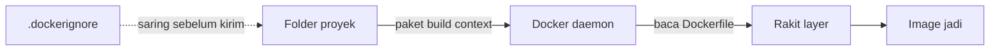
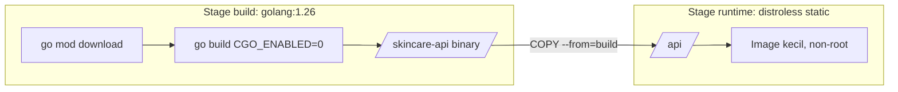
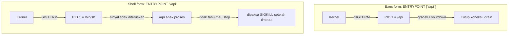

import { Section, Box, Steps, Step, Recap, CardGrid, Card, Chip, Hero, Compare } from "@components";

<Hero eyebrow="Chapter 02 &middot; Docker" title="Membangun <em>Image</em><br />Dockerfile, Multi-stage &amp; Entrypoint" sub="Resep image yang sadar cache, kecil lewat multi-stage, dan sinyal yang benar">
  <p>Setelah memahami apa itu image, kini kita merakitnya sendiri: menulis Dockerfile yang cepat di-cache, memangkasnya dari ratusan MB jadi belasan MB dengan multi-stage, dan memastikan binary Go-mu berhenti dengan rapi saat di-deploy ulang.</p>
  <Fragment slot="meta">
    <Chip icon="package">Dockerfile <b>multi-stage</b></Chip>
    <Chip icon="shield">Image <b>kecil &amp; aman</b></Chip>
    <Chip icon="clock">~25 menit baca</Chip>
  </Fragment>
</Hero>

Di Chapter 1 kita melihat image sebagai tumpukan layer beku. Chapter ini adalah satu busur "rakit image yang benar untuk service Go": mulai dari Dockerfile dasar yang sadar cache, lalu perkecil drastis dengan multi-stage build dan base distroless, dan tutup dengan ENTRYPOINT/CMD yang membuat proses di dalam container berhenti bersih saat orchestrator menghentikannya. Ketiganya membangun satu artefak: image produksi Go yang kecil, aman, dan berperilaku benar.

<Section num="01" id="dockerfile" title="Dockerfile: Resep Image" sub="FROM sampai CMD, build context, dan .dockerignore">

<p class="lead">Dockerfile adalah resep deklaratif: deretan instruksi yang Docker eksekusi dari atas ke bawah untuk merakit sebuah image.</p>

Setiap instruksi menambah satu layer (ingat Chapter 1), dan urutannya bukan sekadar gaya, ia menentukan seberapa sering cache build kamu meleset. Mari kenali instruksi inti lebih dulu, lalu bahas kenapa urutan itu penting.

<div class="tbl-wrap"><table><thead><tr><th>Instruksi</th><th>Fungsi</th></tr></thead><tbody><tr><td><code>FROM</code></td><td>Image dasar tempat semuanya ditumpuk</td></tr><tr><td><code>WORKDIR</code></td><td>Set direktori kerja (dan membuatnya bila perlu)</td></tr><tr><td><code>COPY</code></td><td>Salin file dari build context ke image</td></tr><tr><td><code>RUN</code></td><td>Jalankan perintah saat build (compile, install)</td></tr><tr><td><code>ENV</code></td><td>Set variabel environment di image</td></tr><tr><td><code>EXPOSE</code></td><td>Dokumentasi port yang didengarkan (tidak membuka port)</td></tr><tr><td><code>CMD</code></td><td>Perintah default saat container dijalankan</td></tr></tbody></table></div>

Saat kamu menjalankan `docker build .`, titik di akhir itu adalah **build context**: seluruh isi folder tersebut di-paket dan dikirim ke daemon Docker sebelum build dimulai. Kalau folder itu berisi `.git`, `node_modules`, atau binary lokal berukuran ratusan MB, semuanya ikut terkirim, build jadi lambat dan ada risiko file rahasia (seperti `.env`) bocor masuk ke image.



<p class="fig-cap"><b>Build context dikirim ke daemon.</b> .dockerignore menyaring file sebelum apa pun dikirim, jadi konteks tetap ramping.</p>

Solusinya `.dockerignore`: daftar pola file yang tidak ikut dikirim sebagai build context. Polanya mirip `.gitignore`, tapi tujuannya berbeda.

<Box variant="bridge" icon="🌉" label="Jembatan: dari .gitignore ke .dockerignore"><p>.gitignore mencegah file masuk riwayat Git; .dockerignore mencegah file masuk build context dan image. Sintaks pola-nya mirip, tapi keduanya independen, kamu tetap perlu .dockerignore sendiri meski sudah punya .gitignore.</p></Box>

```text title=".dockerignore"
.git
node_modules
*.env
.env
dist/
tmp/
skincare-backend          # binary hasil build lokal
Dockerfile
.dockerignore
```

Sekarang resep paling sederhana untuk API Go kita, satu tahap (multi-stage menyusul di section berikutnya). Perhatikan urutan `COPY`-nya.

```dockerfile title="Dockerfile"
FROM golang:1.26
WORKDIR /src
COPY go.mod go.sum ./
RUN go mod download
COPY . .
RUN go build -o /skincare-api ./cmd/server
EXPOSE 8080
CMD ["/skincare-api"]
```

Kenapa `go.mod` dan `go.sum` disalin lebih dulu, terpisah dari `COPY . .`? Karena cache. Docker meng-cache setiap layer berdasarkan input instruksinya. Layer `RUN go mod download` hanya akan di-build ulang bila `go.mod`/`go.sum` berubah. Selama dependency tetap, mengubah satu file handler di `internal/product/` tidak membatalkan cache download dependency, build berikutnya lompat langsung ke `go build`. Kalau kamu menulis `COPY . .` sebelum `go mod download`, perubahan kode apa pun akan membuang cache dependency dan mengunduh ulang semua modul tiap build.

<Box variant="tip" icon="💡" label="Letakkan yang jarang berubah di atas"><p>Susun instruksi dari yang paling stabil (base image, dependency) ke yang paling sering berubah (kode aplikasi). Semakin tinggi sebuah layer di-cache awet, semakin banyak build di bawahnya yang ikut cepat.</p></Box>

<Box variant="note" icon="📝" label="EXPOSE itu dokumentasi"><p>EXPOSE 8080 tidak benar-benar membuka port ke host; ia hanya menandai port yang dipakai container. Yang memetakan port ke host adalah flag -p saat docker run (dibahas di Chapter 1).</p></Box>

Resep di atas berfungsi, tapi ada satu masalah serius: image yang dihasilkan gemuk. Mari perbaiki itu.

</Section>

<Section num="02" id="multistage" title="Multi-stage Build untuk Go" sub="Image kecil: pisahkan tahap compile dan runtime">

<p class="lead">Multi-stage build memisahkan tahap meng-compile dari tahap menjalankan, sehingga toolchain Go yang berat tidak pernah ikut ke image produksi.</p>

Image single-stage tadi berfungsi, tapi gemuk: berbasis `golang:1.26` ia bisa mencapai sekitar satu gigabyte karena membawa compiler Go, git, header C, dan ratusan MB tooling yang hanya berguna saat build, sama sekali tidak dibutuhkan untuk menjalankan binary yang sudah jadi. Membawa semua itu ke produksi berarti image besar (lambat di-pull, lambat deploy) dan permukaan serangan yang luas (makin banyak paket, makin banyak CVE potensial).

Ide multi-stage: pakai satu stage `golang` untuk compile, lalu mulai stage runtime baru dari image super-minimal dan `COPY --from` hanya binary-nya. Semua isi stage build (compiler, source, cache) ditinggal dan tidak ikut ke image akhir. Hasilnya dramatis: image yang tadinya sekitar 1 GB bisa turun ke kisaran belasan MB.

<Box variant="bridge" icon="🌉" label="Jembatan: seperti build frontend lalu serve dist"><p>Di React kamu menjalankan build (Vite, webpack) lalu hanya men-deploy folder dist; Node, dependency dev, dan source map dibuang. Multi-stage Go persis ide yang sama: build dengan toolchain penuh, lalu kirim hanya binary hasilnya ke runtime.</p></Box>



<p class="fig-cap"><b>Dua tahap, satu artifact.</b> Hanya binary yang menyeberang dari stage build ke stage runtime.</p>

Berikut Dockerfile multi-stage untuk skincare-api kita. Modul Go memakai `github.com/kamu/skincare-backend`.

```dockerfile title="Dockerfile"
# --- build ---
FROM golang:1.26 AS build
WORKDIR /src
COPY go.mod go.sum ./
RUN go mod download
COPY . .
RUN CGO_ENABLED=0 GOOS=linux go build -ldflags="-s -w" -o /app/api ./cmd/server

# --- runtime ---
FROM gcr.io/distroless/static-debian12:nonroot
COPY --from=build /app/api /api
USER nonroot:nonroot
EXPOSE 8080
ENTRYPOINT ["/api"]
```

Dua detail krusial di stage build. `CGO_ENABLED=0` mematikan linking ke pustaka C, sehingga Go menghasilkan **binary statis** yang tidak bergantung pada glibc apa pun, syarat agar bisa berjalan di image kosong seperti distroless static atau scratch. Flag `-ldflags="-s -w"` membuang tabel simbol dan info debug, memangkas ukuran binary tanpa mengubah perilakunya.

Untuk runtime kita pakai `gcr.io/distroless/static-debian12` dengan tag `:nonroot`. **Distroless** adalah image yang hanya berisi runtime minimal: tidak ada shell, tidak ada package manager, tidak ada `bin/sh`. Image static distroless sendiri hanya sekitar 2 MB; ditambah binary Go-mu, image akhir tipikalnya berkisar 12 sampai 15 MB, dibanding hampir 1 GB versi single-stage. `USER nonroot:nonroot` membuat proses berjalan sebagai user tak-berhak, sehingga andai ada celah di aplikasi, penyerang tidak otomatis jadi root di dalam container.

<h3>Memilih base image runtime</h3>

Distroless bukan satu-satunya pilihan. Tiga base yang paling sering dipakai untuk biner Go statis berbeda pada satu sumbu: seberapa banyak yang ikut, dan apakah ada shell untuk debugging.

<CardGrid cols={3}>
<Card><h4>scratch (~0 MB)</h4><p>Benar-benar kosong, hanya binary-mu. Terkecil dan paling aman, tapi tanpa CA cert dan timezone, jadi panggilan HTTPS keluar bisa gagal kecuali kamu menyalin cert sendiri.</p></Card>
<Card><h4>distroless static (~2 MB)</h4><p>Kosong tapi sudah berisi CA cert, timezone, user nonroot, dan /tmp. Pilihan default yang sehat untuk biner Go statis di produksi.</p></Card>
<Card><h4>alpine (~6 MB)</h4><p>Distro Linux mini lengkap dengan `/bin/sh` dan apk. Sedikit lebih besar, tapi punya shell untuk `docker exec` saat debugging mendesak.</p></Card>
</CardGrid>

<Box variant="tip" icon="💡" label="Pin base image, lebih kuat lagi pakai digest"><p>Selalu pin tag base image (mis. `golang:1.26`, bukan `golang:latest`) agar build reprodusibel. Untuk jaminan penuh, pin sampai digest: `FROM gcr.io/distroless/static-debian12@sha256:...`. Tag bisa digeser pemiliknya kapan saja; digest adalah byte yang persis sama selamanya.</p></Box>

<Box variant="note" icon="📝" label="Distroless tidak punya shell"><p>Karena tidak ada bin/sh, kamu tidak bisa docker exec lalu masuk ke shell untuk debugging, dan HEALTHCHECK harus exec-form yang memanggil binary-mu langsung, bukan perintah shell. Bila kamu butuh shell ringan, alpine adalah kompromi yang masuk akal.</p></Box>

Mari buktikan pemangkasan ukurannya dengan tanganmu sendiri.

<Steps>
<Step><b>Build image multi-stage</b><p>Jalankan `docker build -t skincare-api:dev .` di folder proyek. BuildKit akan menjalankan stage build, lalu menyalin hanya binary ke stage runtime distroless.</p></Step>
<Step><b>Lihat ukuran akhir</b><p>`docker images skincare-api` menampilkan kolom SIZE; untuk biner Go statis di distroless, angkanya tipikal belasan MB, bukan ratusan.</p></Step>
<Step><b>Bandingkan dengan single-stage</b><p>Build sekali lagi versi single-stage `golang:1.26` di tag berbeda dan bandingkan SIZE-nya; selisihnya yang membuat pull di CI dan deploy ke server jauh lebih cepat.</p></Step>
</Steps>

Image sudah kecil dan aman. Tapi ada satu pertanyaan yang belum dijawab: saat container dijalankan, proses apa yang menjadi PID 1, dan apa ia berhenti dengan benar?

</Section>

<Section num="03" id="cmd-entrypoint" title="CMD vs ENTRYPOINT" sub="Menentukan proses default container dengan benar">

<p class="lead">CMD dan ENTRYPOINT sama-sama menetapkan proses default, tapi keduanya menjawab pertanyaan yang berbeda: "apa yang dijalankan" versus "ini memang program apa".</p>

Sebuah image perlu tahu satu hal saat `docker run` dipanggil tanpa argumen: perintah apa yang menjadi proses pertama di dalam container. Di Go, jawabannya hampir selalu binary tunggal hasil build, misalnya server API skincare. Dua instruksi mengatur ini, dan memilih yang tepat menentukan apakah container kamu mau berhenti dengan rapi saat di-deploy ulang.

<Compare aLabel="CMD" bLabel="ENTRYPOINT" aTone="muted" bTone="violet">
<Fragment slot="a">
<ul>
<li>Memberi <b>perintah default yang mudah ditimpa</b> dari `docker run image arg`.</li>
<li>Cocok untuk image serba-guna: default jalankan server, tapi pengguna bebas mengganti dengan `sh` atau perintah lain.</li>
<li>Argumen di `docker run` <b>mengganti seluruh</b> CMD.</li>
</ul>
</Fragment>
<Fragment slot="b">
<ul>
<li>Menetapkan <b>program yang selalu jalan</b>, container "adalah" binary itu.</li>
<li>Cocok saat image punya satu tujuan jelas: ini server, titik.</li>
<li>Argumen di `docker run` menjadi <b>argumen tambahan</b> untuk ENTRYPOINT, bukan menggantinya.</li>
</ul>
</Fragment>
</Compare>

Pola paling kokoh untuk service Go: pakai ENTRYPOINT untuk binary dan CMD untuk argumen default. ENTRYPOINT mengunci "ini server", sementara CMD memberi flag default yang masih bisa diganti tanpa menyentuh binary-nya.

```dockerfile title="Dockerfile"
ENTRYPOINT ["/api"]
CMD ["--http-addr=:8080"]
```

Dengan kombinasi di atas, `docker run img` menjalankan `/api --http-addr=:8080`. Sementara `docker run img --http-addr=:9090` menjalankan `/api --http-addr=:9090`: binary tetap, hanya argumennya yang ditimpa. Inilah yang membuat satu image bisa dipakai untuk port berbeda tanpa rebuild.

Yang krusial adalah perbedaan exec form dan shell form. Exec form (array JSON, `["/api"]`) menjalankan binary secara langsung sebagai PID 1. Shell form (string, `"/api"`) diam-diam dibungkus menjadi `/bin/sh -c "/api"`, sehingga PID 1 adalah `sh`, dan binary Go kamu hanya anak proses.



<p class="fig-cap"><b>Jalur sinyal SIGTERM.</b> Hanya exec form yang menjadikan binary Go sebagai PID 1, sehingga ia menerima sinyal stop dan bisa shutdown bersih.</p>

Kenapa ini penting di produksi? Saat orchestrator (Compose, Kubernetes, ECS) ingin menghentikan container, misalnya selama rolling deploy versi baru, ia mengirim SIGTERM ke PID 1, menunggu beberapa detik, lalu SIGKILL paksa bila belum mati. Server Go yang baik menangkap SIGTERM untuk menghentikan terima request baru, menyelesaikan request yang sedang jalan, lalu menutup koneksi database. Itu semua hanya terjadi bila SIGTERM benar-benar sampai ke binary kamu, dan itulah yang membedakan deploy mulus tanpa request terputus dari deploy yang memutus transaksi checkout pelanggan di tengah jalan.

```go title="cmd/server/main.go"
ctx, stop := signal.NotifyContext(context.Background(), syscall.SIGINT, syscall.SIGTERM)
defer stop()

go func() {
	if err := srv.ListenAndServe(); err != nil && err != http.ErrServerClosed {
		log.Fatalf("listen: %v", err)
	}
}()

<-ctx.Done() // SIGTERM tiba di sini (hanya jika binary PID 1)
shutdownCtx, cancel := context.WithTimeout(context.Background(), 10*time.Second)
defer cancel()
_ = srv.Shutdown(shutdownCtx)
```

<Box variant="warn" icon="⚠️" label="Shell form membunuh graceful shutdown"><p>Tulis `ENTRYPOINT "/api"` (string) dan PID 1 menjadi `/bin/sh`, bukan binary kamu; `sh` tidak meneruskan SIGTERM, jadi `signal.NotifyContext` di Go tidak pernah terpicu dan container dibunuh paksa setelah timeout, memutus request yang sedang berjalan.</p></Box>

<Box variant="tip" icon="💡" label="Selalu array JSON"><p>Pakai bentuk exec untuk ENTRYPOINT/CMD: `["/api"]`, bukan `/api`. Selain meneruskan sinyal dengan benar, ia juga menghindari binary distroless yang tidak punya `/bin/sh` sama sekali (shell form akan langsung gagal di sana).</p></Box>

<Box variant="bridge" icon="🌉" label="Jembatan: dari npm scripts ke entrypoint"><p>Di proyek Node, `npm start` memetakan ke satu perintah default di package.json; ENTRYPOINT + CMD adalah versi container dari ide itu, tapi dengan konsekuensi sinyal yang nyata, karena proses ini benar-benar menjadi PID 1 di namespace-nya sendiri.</p></Box>

</Section>

<Section num="04" id="ringkasan" title="Ringkasan" sub="Image Go yang kecil, aman, dan berperilaku benar">

<p class="lead">Chapter ini mengubah biner Go menjadi image produksi: resep yang sadar cache, ramping lewat multi-stage, dan berhenti dengan rapi lewat ENTRYPOINT exec-form.</p>

Kita mulai dari Dockerfile sebagai resep berlapis, dengan dua trik kunci: `.dockerignore` menjaga build context ramping dan bebas secret, dan urutan `COPY go.mod go.sum` sebelum `COPY . .` menjaga cache dependency tetap awet. Lalu multi-stage memisahkan toolchain build dari runtime, memangkas image dari sekitar 1 GB ke belasan MB lewat `CGO_ENABLED=0` plus base distroless static non-root. Terakhir, ENTRYPOINT exec-form memastikan binary Go menjadi PID 1, sehingga SIGTERM sampai dan graceful shutdown bekerja saat deploy ulang.

<Recap title="Yang Wajib Menempel">
<ul>
<li>Tiap instruksi Dockerfile menambah layer; urutkan dari yang jarang berubah ke yang sering agar cache awet.</li>
<li>`COPY go.mod go.sum` lalu `go mod download` sebelum `COPY . .` mencegah download ulang dependency tiap kali kode berubah.</li>
<li>`.dockerignore` menyaring build context: cegah `.env`, `.git`, dan binary lokal bocor ke image.</li>
<li>Multi-stage + `CGO_ENABLED=0` menghasilkan biner statis yang muat di distroless static (~2 MB), image akhir belasan MB, bukan ratusan.</li>
<li>Pin tag base image, idealnya sampai digest `@sha256:`, agar build benar-benar reproducible.</li>
<li>Pakai ENTRYPOINT exec-form (`["/api"]`) agar binary jadi PID 1 dan SIGTERM memicu graceful shutdown; shell form mematikannya.</li>
</ul>
</Recap>

Image sudah jadi dan berperilaku benar. Tapi image yang sama harus bisa jalan beda config di tiap lingkungan, menyambung ke service lain, dan menyimpan data yang bertahan. Itu fokus **Chapter 3**: environment variable, networking, dan volume.

</Section>
