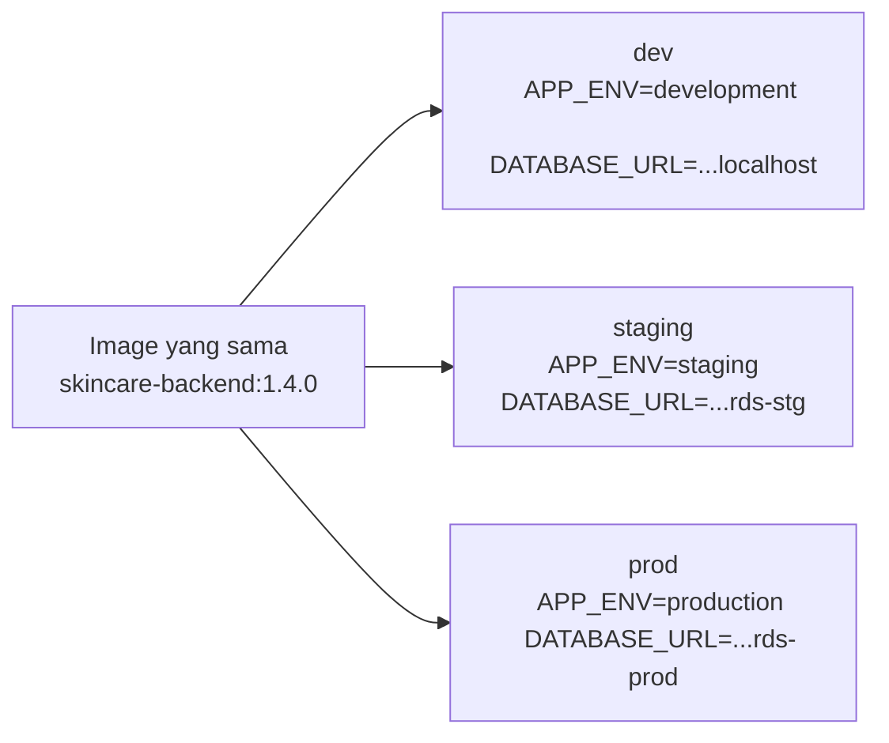
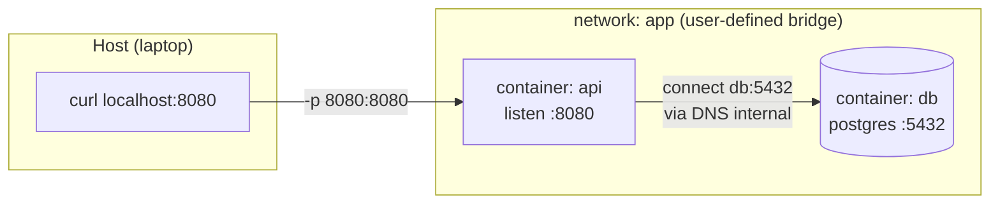

import { Section, Box, Steps, Step, Recap, Chip, Hero, Figure } from "@components";
import DockerVolumeBindFig01 from "@figures/DockerVolumeBindFig01.astro";

<Hero eyebrow="Chapter 03 &middot; Docker" title="Konfigurasi, <em>Jaringan</em> &amp; Data Persisten" sub="Satu image, banyak environment; DNS antar container; data yang bertahan">
  <p>Image sudah jadi, kini kita siapkan tiga primitif runtime sebelum merangkainya jadi stack: config lewat environment, komunikasi antar container lewat DNS internal, dan data yang hidup lebih lama dari container lewat volume.</p>
  <Fragment slot="meta">
    <Chip icon="bolt">Config <b>via env</b></Chip>
    <Chip icon="server">DNS <b>antar service</b></Chip>
    <Chip icon="database">Data <b>persisten</b></Chip>
  </Fragment>
</Hero>

Di Chapter 2 kita merakit satu image yang baik. Image itu immutable, jadi pertanyaan berikutnya: bagaimana satu image yang sama bisa jalan di laptop, staging, dan produksi dengan konfigurasi berbeda, bicara ke database di container lain, dan menyimpan data yang tidak ikut menguap saat container dibuang? Chapter ini menjawabnya lewat tiga primitif runtime, config, jaringan, dan volume, yang nanti dirangkai menjadi satu stack di Chapter 4.

<Section num="01" id="env-config" title="Environment Variables dan Config" sub="Config lewat env, secret tidak di-bake ke image">

<p class="lead">Satu image yang sama harus bisa berjalan di laptop, staging, dan produksi; yang membedakan hanyalah environment variable yang disuntikkan saat runtime.</p>

Prinsip ini berasal dari twelve-factor app: simpan config di environment, bukan di kode atau di image. Image adalah artefak yang immutable dan bisa dibagikan; begitu kamu memanggang nilai spesifik produksi ke dalamnya, image itu tidak lagi portabel dan, lebih buruk, bisa membocorkan rahasia. Go membuat pola ini nyaman lewat `os.Getenv`, tanpa library tambahan apa pun.

```go title="internal/config/config.go"
package config

import (
	"fmt"
	"os"
)

type Config struct {
	AppEnv      string
	Port        string
	DatabaseURL string
	RedisAddr   string
}

func Load() (Config, error) {
	c := Config{
		AppEnv:    getEnv("APP_ENV", "development"),
		Port:      getEnv("PORT", "8080"),
		RedisAddr: getEnv("REDIS_ADDR", "localhost:6379"),
	}
	c.DatabaseURL = os.Getenv("DATABASE_URL") // wajib, tanpa default
	if c.DatabaseURL == "" {
		return c, fmt.Errorf("DATABASE_URL wajib diisi")
	}
	return c, nil
}

func getEnv(key, fallback string) string {
	if v, ok := os.LookupEnv(key); ok {
		return v
	}
	return fallback
}
```

Perhatikan dua sikap berbeda: nilai non-sensitif seperti `PORT` punya default aman, sedangkan `DATABASE_URL` yang berisi kredensial sengaja tanpa default dan gagal cepat bila kosong. Lebih baik container menolak start daripada diam-diam menyambung ke database yang salah.

Di Dockerfile, `ENV` hanya pantas untuk default non-rahasia, misalnya `ENV PORT=8080`. Saat run, suntikkan nilai nyata lewat `-e` per variabel atau `--env-file` untuk berkas:

```bash title="Terminal"
docker run --rm -p 8080:8080 \
  --env-file .env \
  -e APP_ENV=production \
  ghcr.io/kamu/skincare-backend:1.4.0
```



<p class="fig-cap"><b>Satu artefak, banyak environment.</b> Image dibangun sekali; perbedaan tiap lingkungan murni datang dari env yang disuntikkan saat runtime.</p>

Bagian paling berbahaya adalah secret. Ada tiga cara salah yang sering tidak disadari. Pertama, `COPY .env /app/`: berkas kredensial ikut tersimpan permanen di layer image. Kedua, mengirim secret lewat `--build-arg`: nilai ARG tercatat di metadata image dan terlihat lewat `docker history`. Ketiga, menaruh secret di `ENV` Dockerfile: ia tertulis di setiap layer dan terbaca siapa pun yang menarik image.

<Box variant="warn" icon="⚠️" label="Secret tidak pernah masuk image"><p>Jangan `COPY .env` ke image, jangan kirim kredensial via `ARG`/`--build-arg` (terlihat di `docker history`), dan jangan tulis secret di `ENV` Dockerfile. Secret hanya disuntikkan saat runtime lewat `--env-file`, secret manager, atau orchestrator.</p></Box>

<Box variant="tip" icon="💡" label="Kunci .dockerignore"><p>Pastikan `.env` ada di `.dockerignore` agar tidak pernah ikut ke build context, bahkan saat kamu menulis `COPY . .`. Tanpa baris ini, satu COPY ceroboh cukup untuk membocorkan seluruh kredensial lokalmu ke dalam image.</p></Box>

<Box variant="bridge" icon="🌉" label="Jembatan: dari .env Laravel/Vite"><p>`.env` di Laravel dibaca lewat `env()`/`config()` dan di Vite lewat `import.meta.env`; ide bahwa config datang dari environment identik. Bedanya, di container `.env` bukan dibaca dari berkas yang ikut image, melainkan disuntikkan dari luar ke proses Go yang membacanya via `os.Getenv`.</p></Box>

Config sudah masuk dari luar. Tapi salah satu nilai config yang paling sering keliru adalah alamat database, dan penyebabnya bukan typo melainkan salah paham soal jaringan container.

</Section>

<Section num="02" id="networking" title="Docker Networking Dasar" sub="Bridge network, DNS service, dan jebakan localhost">

<p class="lead">Setiap container hidup di network namespace-nya sendiri, jadi `localhost` di dalam container API menunjuk container itu sendiri, bukan laptop dan bukan container database.</p>

Inilah sumber kebingungan paling umum saat pertama menjalankan beberapa container, dan jebakan nomor satu bagi developer yang baru pindah dari `npm run dev` atau `php artisan serve`. Di laptop, frontend dan backend sama-sama di `localhost`, jadi memanggil `localhost:5432` untuk Postgres terasa alami. Di Docker, tiap container punya stack jaringan terisolasi: `localhost` selalu berarti "diri sendiri". Container API yang mencoba menyambung ke `localhost:5432` sedang mencari Postgres di dalam dirinya sendiri, yang tidak ada di sana.

Solusinya adalah user-defined bridge network. Network bawaan bernama `bridge` tidak menyediakan DNS antar container, jadi container harus saling kenal lewat IP yang berubah-ubah. Begitu kamu membuat network sendiri, Docker mengaktifkan DNS internal: tiap container bisa dipanggil lewat nama service atau nama container-nya.



<p class="fig-cap"><b>Dua container dalam satu network.</b> Host menjangkau `api` lewat port yang di-publish; di dalam network, `api` menjangkau `db` lewat nama service, bukan localhost.</p>

Coba sendiri dengan tiga langkah: buat network, jalankan Postgres dan API di network yang sama, lalu API menyambung ke host bernama `db`.

<Steps>
<Step><b>Buat user-defined network</b><p>`docker network create app` membuat bridge network sendiri yang punya DNS internal antar container.</p></Step>
<Step><b>Jalankan Postgres di network itu</b><p>Lampirkan container `db` ke network `app` dengan `--network app`; namanya akan jadi alamat DNS bagi container lain.</p></Step>
<Step><b>Jalankan API yang menyambung ke `db`</b><p>API di network yang sama menyetel `DATABASE_URL` dengan host `db` (bukan localhost), dan Docker menerjemahkannya ke IP Postgres saat itu juga.</p></Step>
</Steps>

```bash title="Terminal"
docker network create app

docker run -d --name db --network app \
  -e POSTGRES_PASSWORD=secret postgres:17

docker run -d --name api --network app \
  -p 8080:8080 \
  -e DATABASE_URL="postgres://postgres:secret@db:5432/postgres?sslmode=disable" \
  ghcr.io/kamu/skincare-backend:1.4.0
```

Di Go, tidak ada yang istimewa: kode tetap memanggil `DATABASE_URL`. Yang berubah hanya host di dalam URL, dari `localhost` saat dev lokal menjadi `db` (nama container) saat di dalam network Docker. DNS internal Docker menerjemahkan `db` ke IP container Postgres saat itu juga.

Flag `-p 8080:8080` adalah hal terpisah: ia mem-publish port container ke host (`host:container`), supaya browser di laptop bisa menjangkau API. Tanpa `-p`, API tetap saling bicara dengan `db` di dalam network, tapi tidak terjangkau dari luar. Database biasanya justru tidak di-publish: cukup terjangkau API lewat DNS internal, dan tidak terekspos ke jaringan host demi keamanan.

<Box variant="warn" icon="⚠️" label="localhost di container bukan laptopmu"><p>Di dalam container API, `localhost` menunjuk container itu sendiri. Untuk menjangkau service lain pakai nama service/container (`db:5432`); untuk menjangkau proses yang berjalan di host laptop, gunakan `host.docker.internal`, bukan `localhost`.</p></Box>

<Box variant="tip" icon="💡" label="Default bridge tidak punya DNS"><p>Hanya user-defined bridge (`docker network create app`) yang memberi resolusi nama antar container; network `bridge` bawaan tidak. Di Compose (Chapter 4), kamu mendapat user-defined network otomatis, sehingga service saling memanggil lewat namanya tanpa konfigurasi tambahan.</p></Box>

<Box variant="bridge" icon="🌉" label="Jembatan: dari localhost:3000 ke db:5432"><p>Saat dev frontend memanggil `localhost:3000` karena semua proses berbagi satu mesin, di Docker tiap container adalah "mesin" sendiri. Memanggil database menjadi `db:5432` (nama service di network), persis seperti memanggil host yang berbeda di jaringan nyata.</p></Box>

Container sekarang bisa saling bicara. Tapi Postgres tadi menyimpan datanya di writable layer yang, seperti kita lihat di Chapter 1, lenyap saat container dibuang. Itu tidak boleh terjadi pada data.

</Section>

<Section num="03" id="volumes" title="Volumes dan Bind Mounts" sub="Data yang harus bertahan di luar lifecycle container">

<p class="lead">Writable layer sebuah container itu fana, jadi data yang harus hidup lebih lama dari container wajib ditaruh di luar lapisan itu.</p>

Di Chapter 1 kita lihat container menambahkan satu writable layer tipis di atas image yang read-only. Semua tulisan baru, file PostgreSQL, log, upload, mendarat di lapisan itu. Begitu container dihapus dengan `docker rm`, lapisan itu ikut hilang permanen. Untuk stateless API hal ini justru sehat: container boleh dibuang dan dibuat ulang tanpa beban. Tapi database tidak boleh kehilangan datanya hanya karena kita `docker compose down` lalu `up` lagi.

Docker menawarkan dua mekanisme untuk menyimpan data di luar writable layer: **named volume** dan **bind mount**. Keduanya memetakan sebuah path di dalam container ke penyimpanan persisten di host, tapi siapa yang mengelolanya dan untuk apa pemakaiannya berbeda.

<Figure><DockerVolumeBindFig01 /><Fragment slot="caption"><b>Named volume vs bind mount.</b> Volume dikelola Docker dan bertahan; bind mount memetakan folder host ke container.</Fragment></Figure>

<h3>Named volume: dikelola Docker</h3>

Named volume adalah penyimpanan yang Docker buat dan kelola sendiri di area internalnya (di Linux biasanya `/var/lib/docker/volumes`). Kamu cukup menyebut namanya, tidak perlu tahu path fisiknya. Volume ini bertahan walau container dihapus, dan bisa dipasang ulang ke container baru. Inilah pilihan tepat untuk data database.

```bash title="Terminal"
docker volume create pgdata
docker run -d --name db \
  -e POSTGRES_PASSWORD=rahasia \
  -v pgdata:/var/lib/postgresql/data \
  postgres:17
```

<p>Sintaks `-v pgdata:/var/lib/postgresql/data` artinya: pasang named volume bernama `pgdata` ke path data internal PostgreSQL. Hapus container `db`, jalankan ulang dengan flag `-v` yang sama, dan semua tabel produk skincare tetap utuh.</p>

<Box variant="analogy" icon="🧳" label="Analogi: loker bagasi"><p>Named volume seperti loker bagasi berlabel di stasiun, kamu titip barang dengan nomor loker tanpa peduli rak fisiknya, dan bisa ambil lagi kapan pun walau gerbongmu (container) sudah ganti.</p></Box>

<h3>Bind mount: folder host langsung</h3>

Bind mount memetakan folder konkret di mesin host ke path di dalam container. Kamu yang menunjuk path host-nya secara eksplisit. Karena perubahan di host langsung terlihat di container (dan sebaliknya), bind mount ideal untuk development: edit source di editor, container melihat file baru tanpa rebuild image.

```bash title="Terminal"
docker run -d --name api-dev \
  -v "$(pwd)":/src \
  -p 8080:8080 \
  golang:1.26 \
  sh -c "cd /src && go run ./cmd/server"
```

<p>Di sini folder proyek lokal (`$(pwd)`) terhubung ke `/src` di container, cocok dipadukan dengan tool hot reload seperti Air untuk siklus edit-jalan yang cepat di proyek `github.com/kamu/skincare-backend`.</p>

<Box variant="bridge" icon="🌉" label="Jembatan: dari folder proyek lokal ke container"><p>Bayangkan folder proyekmu di laptop dan folder di dalam container sebagai dua jendela yang menatap rak file yang sama; ubah satu sisi, sisi lain langsung ikut, persis seperti volume mount di docker-compose Laravel Sail untuk source aplikasi.</p></Box>

<h3>Kapan memakai yang mana</h3>

<div class="tbl-wrap"><table><thead><tr><th>Aspek</th><th>Named volume</th><th>Bind mount</th></tr></thead><tbody><tr><td>Pengelola</td><td>Docker</td><td>Kamu (path host eksplisit)</td></tr><tr><td>Pemakaian utama</td><td>Data database, state produksi</td><td>Source code dev, file konfigurasi</td></tr><tr><td>Portabilitas</td><td>Tinggi, lepas dari path host</td><td>Terikat struktur folder host</td></tr><tr><td>Kecocokan</td><td>Persistensi jangka panjang</td><td>Iterasi cepat &amp; hot reload</td></tr></tbody></table></div>

<Box variant="warn" icon="⚠️" label="Jebakan: bind mount menutupi folder bawaan image"><p>Bila kamu bind-mount folder proyek ke `/app` padahal image sudah berisi dependensi terinstal di sana (mis. `node_modules` hasil install), mount itu menimpa dan menyembunyikan folder bawaan image sehingga dependensi seolah hilang; solusinya pisahkan path data dari path yang di-mount.</p></Box>

Ketiga primitif ini, config, jaringan, dan volume, masih kita atur satu per satu lewat flag `docker run` yang panjang. Di Chapter 4, Docker Compose menyatukan semuanya ke dalam satu file deklaratif.

</Section>

<Section num="04" id="ringkasan" title="Ringkasan" sub="Tiga primitif runtime yang menopang stack">

<p class="lead">Chapter ini menyiapkan tiga primitif runtime sebelum merangkainya jadi stack: konfigurasi lewat env, komunikasi antar container lewat DNS, dan data persisten lewat volume.</p>

Kita mulai dari config: satu image immutable dijalankan beda di tiap lingkungan murni lewat environment variable, dengan secret yang tidak pernah di-bake ke layer image. Lalu jaringan: setiap container punya network namespace sendiri sehingga `localhost` berarti dirinya sendiri, dan service lain dipanggil lewat nama via DNS user-defined network. Terakhir volume: writable layer fana, jadi data database hidup di named volume, sementara source code dev cocok lewat bind mount.

<Recap title="Yang Wajib Menempel">
<ul>
<li>Config datang dari environment (`-e`, `--env-file`), bukan di-hardcode; satu image jalan di semua lingkungan.</li>
<li>Secret tidak pernah masuk image: bukan lewat `COPY .env`, `ARG`, atau `ENV`, melainkan disuntikkan saat runtime.</li>
<li>Di dalam container, `localhost` adalah container itu sendiri; panggil service lain lewat nama (`db:5432`) via DNS user-defined network.</li>
<li>Default bridge tidak punya DNS antar container; buat network sendiri (atau pakai Compose yang otomatis menyediakannya).</li>
<li>Named volume dikelola Docker dan bertahan, pakai untuk data PostgreSQL; bind mount memetakan folder host, pakai untuk source code dev.</li>
<li>Hati-hati bind mount menutupi folder bawaan image (mis. `node_modules`) sehingga dependensi seolah hilang.</li>
</ul>
</Recap>

Dengan config, jaringan, dan volume di tangan, **Chapter 4** merangkainya: satu `compose.yaml` mendeklarasikan seluruh stack lokal, healthcheck menggerbangi urutan start, dan kita pelajari cara mengoperasikannya lewat log, exec, dan batas resource.

</Section>
