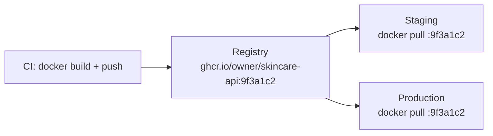

import { Section, Box, Steps, Step, Recap, CardGrid, Card, Chip, Hero, Compare } from "@components";

<Hero eyebrow="Chapter 05 &middot; Docker" title="Registry &amp; <em>Image Produksi</em><br />yang Aman" sub="Tag terlacak, distribusi reproducible, dan image produksi yang dikeraskan">
  <p>Stack jalan mulus di laptop; kini kita kirim ke produksi. Beri tag yang bisa ditelusuri sampai ke commit, distribusikan lewat registry, lalu keraskan image agar kecil, non-root, dipindai, dan tanpa satu pun secret di dalam layer.</p>
  <Fragment slot="meta">
    <Chip icon="package">Tag, <b>digest, registry</b></Chip>
    <Chip icon="shield">Image <b>dikeraskan</b></Chip>
    <Chip icon="clock">~21 menit baca</Chip>
  </Fragment>
</Hero>

Di Chapter 4 stack skincare berjalan rapi di laptop, tapi image-nya masih lokal. Chapter ini adalah busur "mengirim ke produksi" dalam dua langkah yang berpasangan: pertama **distribusi** yang reproducible (tag yang terlacak plus registry), lalu **pengerasan** image produksi (kecil, non-root, dipindai, migrasi terkontrol). Keduanya berbagi satu prinsip yang sudah muncul di Chapter 1: tag itu mutable, hanya digest yang menjamin byte yang sama.

<Section num="01" id="registry" title="Image Tagging, Versioning, dan Registry" sub="Tag yang jelas supaya deploy terlacak dan rollback mudah">

<p class="lead">Image yang sudah dibangun tidak ada gunanya kalau tidak bisa kamu temukan lagi dengan pasti versi mana yang sedang berjalan di production.</p>

Tag adalah alamat manusiawi untuk sebuah image. Tanpa disiplin penamaan, kamu akan terjebak pertanyaan klasik saat insiden: "yang lagi jalan di production itu build yang mana?" Jawaban yang baik bukan "yang terbaru", tapi sebuah identitas yang bisa ditelusuri sampai ke commit Git tertentu. Registry adalah tempat image itu disimpan dan dibagikan, persis seperti registry npm menyimpan paket, hanya saja yang kita simpan adalah artefak runtime yang sudah jadi, bukan sumber.

<Box variant="bridge" icon="🌉" label="Jembatan: dari versi paket npm ke versi artefak image"><p>Di npm kamu kunci versi lewat <code>package-lock.json</code> agar instalasi deterministik; di Docker, tag semver plus digest adalah penguncinya, supaya "yang dideploy" selalu artefak yang sama persis.</p></Box>

<h3>Jebakan tag <code>latest</code></h3>

<code>latest</code> hanyalah label biasa yang menunjuk ke image terakhir yang kamu tag dengan nama itu. Ia tidak berarti "versi paling baru" secara semantik dan tidak deterministik: dua server yang menjalankan <code>docker pull skincare-api:latest</code> pada waktu berbeda bisa mendapat biner yang berbeda. Saat terjadi bug, kamu kehilangan kemampuan rollback karena tidak tahu versi sebelumnya bernama apa.

<Box variant="warn" icon="⚠️" label="Jangan andalkan latest untuk deploy serius"><p>Pin tag semver atau git SHA, dan untuk jaminan penuh referensikan digest <code>image@sha256:...</code>; <code>latest</code> mutable dan membuat deploy tidak reproducible.</p></Box>

<h3>Tiga lapis penamaan</h3>

<div class="tbl-wrap"><table><thead><tr><th>Jenis</th><th>Contoh</th><th>Sifat</th></tr></thead><tbody><tr><td>Semantic tag</td><td><code>skincare-api:1.4.0</code></td><td>Dibaca manusia, mengikuti rilis</td></tr><tr><td>Git SHA tag</td><td><code>skincare-api:9f3a1c2</code></td><td>Telusur balik ke commit persis</td></tr><tr><td>Immutable digest</td><td><code>skincare-api@sha256:ab12...</code></td><td>Tidak bisa berubah, jaminan byte-identik</td></tr></tbody></table></div>

Praktik yang sehat: satu image fisik diberi beberapa tag sekaligus saat build, sehingga satu artefak bisa dirujuk lewat versi semver yang ramah manusia maupun SHA yang presisi.

```bash title="Terminal"
# satu build, beberapa tag menunjuk image fisik yang sama
docker build \
  -t skincare-api:dev \
  -t skincare-api:$(git rev-parse --short HEAD) \
  .

# beri ulang tag image yang sudah ada untuk tujuan registry
docker tag skincare-api:$(git rev-parse --short HEAD) \
  ghcr.io/owner/skincare-api:$(git rev-parse --short HEAD)
```

<Box variant="tip" icon="💡" label="Rollback nyata bersandar pada digest"><p>Saat insiden produksi, "balikkan ke versi kemarin" hanya bisa dilakukan kalau kamu tahu identitas pastinya. Catat digest <code>@sha256:</code> tiap rilis (mis. di catatan deploy); rollback berarti deploy ulang digest lama yang dijamin byte-identik, bukan menebak-nebak tag mana yang dulu dipakai.</p></Box>

<h3>Registry: tempat image tinggal</h3>

Ada beberapa registry umum, semuanya bicara protokol yang sama sehingga alur login, build, tag, push, pull identik; yang berbeda hanya nama host dan cara autentikasinya.

<div class="tbl-wrap"><table><thead><tr><th>Registry</th><th>Host</th><th>Cocok untuk</th></tr></thead><tbody><tr><td>Docker Hub</td><td><code>docker.io</code></td><td>Image publik, base image resmi</td></tr><tr><td>GitHub Container Registry</td><td><code>ghcr.io</code></td><td>Image privat menyatu dengan repo &amp; CI</td></tr><tr><td>AWS ECR</td><td><code>&lt;acct&gt;.dkr.ecr.&lt;region&gt;.amazonaws.com</code></td><td>Deploy di ekosistem AWS</td></tr></tbody></table></div>

```bash title="Terminal"
# login ke ghcr.io (token via stdin, jangan tempel di argumen)
echo "$GHCR_TOKEN" | docker login ghcr.io -u owner --password-stdin

# push tag SHA yang sudah diberi prefix host registry
docker push ghcr.io/owner/skincare-api:$(git rev-parse --short HEAD)

# di sisi lain (CI/staging/prod) tarik versi yang sama persis
docker pull ghcr.io/owner/skincare-api:9f3a1c2
```

<Box variant="tip" icon="💡" label="Login ECR berumur pendek"><p>ECR memberi password sementara, jadi alur login-nya: <code>aws ecr get-login-password --region eu-west-1 | docker login --username AWS --password-stdin &lt;acct&gt;.dkr.ecr.eu-west-1.amazonaws.com</code>, lalu push seperti biasa.</p></Box>

<h3>Build once, run anywhere</h3>

Inti dari registry adalah memisahkan kapan image dibangun dari kapan ia dijalankan. Image dibangun sekali di CI, lalu artefak yang sama persis ditarik oleh staging dan production. Tidak ada lagi "build ulang di server" yang berisiko menghasilkan biner berbeda karena perbedaan lingkungan.



<p class="fig-cap"><b>Satu artefak, banyak target.</b> Staging dan production menarik tag SHA yang sama, sehingga apa yang diuji adalah apa yang dirilis.</p>

Image sudah bisa dibagikan dengan identitas yang jelas. Tapi sebelum di-push ke produksi, image itu harus dikeraskan dulu.

</Section>

<Section num="02" id="security-prod" title="Security Dockerfile dan Image Production" sub="Non-root, base minimal, dev vs prod, migration terkontrol">

<p class="lead">Image production yang baik membawa sesedikit mungkin: satu biner, tanpa shell, tanpa secret, dan berjalan sebagai user biasa.</p>

Setiap hal yang ada di dalam image adalah permukaan serang. Shell, package manager, compiler, dan tool debug semuanya berguna saat mengembangkan, tapi di production mereka hanya menambah cara bagi penyerang untuk bergerak setelah masuk. Prinsipnya sederhana: image production harus kecil, berjalan non-root, dan tidak menyimpan kredensial di dalam layer. Banyak dari ini sudah kita capai di Chapter 2 lewat multi-stage dan distroless; di sini kita rapikan dan tegaskan jadi disiplin produksi.

<Box variant="bridge" icon="🌉" label="Jembatan: dari audit dependensi ke pemindaian image"><p>Sama seperti <code>npm audit</code> memeriksa kerentanan di pohon dependensi JS, <code>docker scout cves</code> atau <code>trivy image</code> memindai kerentanan di image kamu, termasuk paket OS pada base image, bukan cuma kode aplikasi.</p></Box>

<h3>Dockerfile yang diperketat</h3>

Tiga pengetatan penting: pin versi base image (jangan biarkan mengambang), pakai base runtime minimal, dan jalankan sebagai user non-root. Distroless cocok untuk biner Go statis karena hampir kosong, tidak punya shell sama sekali.

```dockerfile title="Dockerfile"
# --- build ---
FROM golang:1.26 AS build
WORKDIR /src
COPY go.mod go.sum ./
RUN go mod download
COPY . .
RUN CGO_ENABLED=0 GOOS=linux go build -ldflags="-s -w" -o /app ./cmd/server

# --- runtime ---
FROM gcr.io/distroless/static-debian12:nonroot
COPY --from=build /app /app
USER nonroot:nonroot
EXPOSE 8080
ENTRYPOINT ["/app"]
```

<Box variant="warn" icon="⚠️" label="Jangan jalankan proses sebagai root"><p>Default container berjalan sebagai root; bila penyerang menembus aplikasi, root di dalam container memperbesar dampaknya. Selalu set <code>USER</code> non-root, lewat tag <code>:nonroot</code> distroless atau <code>adduser</code> pada alpine.</p></Box>

<h3>Dua image untuk dua dunia</h3>

Kesalahan umum adalah mengirim image development ke production. Image dev sengaja gemuk: ada hot reload, bind mount ke kode sumber, dan tool debug. Image production justru kebalikannya, sengaja kurus dan tertutup.

<Compare aLabel="Image development" bLabel="Image production" aTone="muted" bTone="violet">
<Fragment slot="a"><ul><li>Hot reload &amp; rebuild cepat</li><li>Bind mount ke kode sumber host</li><li>Shell, debugger, tool jaringan ikut</li><li>Berjalan root demi kenyamanan</li></ul></Fragment>
<Fragment slot="b"><ul><li>Satu biner statis, tanpa shell</li><li>Base distroless yang dipin</li><li>Permukaan serang minimal</li><li>Berjalan sebagai user non-root</li></ul></Fragment>
</Compare>

<Box variant="warn" icon="⚠️" label="Jangan kirim image dev ke production"><p>Image dev membawa tool dan bind mount yang tidak ada di server, sehingga rawan dan tidak deterministik; bangun image production terpisah lewat multistage.</p></Box>

<h3>Memindai sebelum rilis</h3>

Jadikan pemindaian bagian dari pipeline, bukan ritual sesekali. Pindai image hasil build, dan jangan sertakan secret di dalam layer (suntikkan via environment atau secret manager saat runtime).

```bash title="Terminal"
docker scout cves ghcr.io/owner/skincare-api:9f3a1c2
docker scout quickview ghcr.io/owner/skincare-api:9f3a1c2
trivy image ghcr.io/owner/skincare-api:9f3a1c2
```

Dua tool ini sering dipakai berdampingan, bukan saling menggantikan, karena cakupannya berbeda.

<Compare aLabel="Docker Scout" bLabel="Trivy" aTone="blue" bTone="teal">
<Fragment slot="a"><ul><li>Native di Docker CLI dan Docker Desktop, mulus untuk alur Docker.</li><li>Fokus pada CVE image dan rekomendasi base image.</li><li>Cepat dipakai tanpa pemasangan tambahan.</li></ul></Fragment>
<Fragment slot="b"><ul><li>Cakupan CVE sangat luas, populer di kalangan power-user.</li><li>Bisa memindai IaC, manifest Kubernetes, repo Git, dan secret, bukan cuma image.</li><li>Kontrol lebih granular untuk dipasang di CI.</li></ul></Fragment>
</Compare>

<Box variant="warn" icon="⚠️" label="Pin action CI ke commit SHA, bukan tag"><p>Pelajaran "tag itu mutable" berlaku juga di CI. Pada Maret 2026 tag action <code>aquasecurity/trivy-action</code> sempat di-force-push dalam serangan rantai pasok. Di workflow CI, pin action pihak ketiga ke commit SHA penuh (mis. <code>uses: aquasecurity/trivy-action@&lt;sha&gt;</code>), bukan ke tag versi yang bisa digeser diam-diam.</p></Box>

Mari rangkai langkah-langkahnya jadi satu alur rilis yang bisa kamu jalankan, baik lokal maupun di CI.

<Steps>
<Step><b>Build image produksi bertag SHA</b><p>`docker build -t ghcr.io/owner/skincare-api:$(git rev-parse --short HEAD) .` menghasilkan image multi-stage yang kecil dengan identitas terlacak ke commit.</p></Step>
<Step><b>Pindai sebelum push</b><p>Jalankan `docker scout cves` atau `trivy image` pada tag itu; gagalkan langkah ini di CI bila ada CVE kritikal agar image rawan tidak pernah sampai registry.</p></Step>
<Step><b>Push dan catat digest</b><p>`docker push` mengunggah image, lalu catat digest `@sha256:` yang dikembalikan sebagai identitas rilis untuk deploy dan rollback.</p></Step>
</Steps>

<h3>Migration terkontrol, bukan otomatis tiap startup</h3>

Godaan besar adalah menjalankan migrasi skema saat aplikasi boot. Itu berbahaya: bila kamu menjalankan tiga replika API, ketiganya akan berlomba menjalankan migrasi yang sama, dan satu migrasi gagal bisa menahan seluruh layanan naik. Migrasi sebaiknya menjadi langkah terpisah dan terkontrol, dijalankan satu kali sebelum API yang baru menerima trafik.

<Box variant="bridge" icon="🌉" label="Jembatan: dari php artisan migrate ke tool migrasi Go"><p>Di Laravel migrasi adalah perintah eksplisit (<code>php artisan migrate</code>) yang kamu jalankan sadar, bukan saat tiap request; di Go pakai pola sama dengan tool seperti golang-migrate sebagai job one-off, terpisah dari proses API.</p></Box>

```yaml title="compose.yaml"
services:
  db:
    image: postgres:17
    healthcheck:
      test: ["CMD-SHELL", "pg_isready -U postgres"]
      interval: 5s
      timeout: 3s
      retries: 5
  migrate:
    image: migrate/migrate
    depends_on:
      db:
        condition: service_healthy
    volumes:
      - ./migrations:/m
    command: ["-path", "/m", "-database", "${DATABASE_URL}", "up"]
  api:
    build: .
    depends_on:
      migrate:
        condition: service_completed_successfully
```

<p class="fig-cap"><b>Migrasi sebagai service one-off.</b> Service <code>migrate</code> selesai dulu (exit 0), baru API naik, sehingga skema selalu siap sebelum trafik masuk.</p>

</Section>

<Section num="03" id="ringkasan" title="Ringkasan" sub="Distribusi reproducible plus image produksi yang dikeraskan">

<p class="lead">Chapter ini membawa image dari laptop ke produksi: identitas yang terlacak lewat registry, lalu image yang dikeraskan, dipindai, dan dengan migrasi terkontrol.</p>

Kita mulai dari tagging: `latest` mutable dan merusak rollback, jadi pin semver, SHA, dan referensikan digest untuk jaminan byte-identik. Registry memisahkan kapan image dibangun dari kapan dijalankan, build sekali di CI lalu artefak yang sama ditarik staging dan prod. Lalu pengerasan: image produksi kecil, non-root, dipisah dari image dev, dan dipindai dengan Docker Scout atau Trivy di pipeline, dengan disiplin "pin ke SHA" yang berlaku sampai ke action CI. Terakhir, migrasi adalah job one-off terkontrol, bukan efek samping startup.

<Recap title="Yang Wajib Menempel">
<ul>
<li>Tag adalah identitas terlacak, bukan sekadar "terbaru"; `latest` mutable dan merusak rollback.</li>
<li>Pin semver dan SHA, referensikan digest `@sha256:` untuk deploy reproducible dan rollback yang pasti.</li>
<li>Build sekali di CI, tarik artefak identik di setiap lingkungan; registry memisahkan build dari run.</li>
<li>Image produksi kecil, non-root, tanpa shell, tanpa secret di layer, dan terpisah dari image dev.</li>
<li>Pindai dengan `docker scout` (native) atau `trivy` (lebih luas) di pipeline; pin action CI ke commit SHA, bukan tag.</li>
<li>Migrasi adalah langkah one-off terkontrol via `service_completed_successfully`, bukan dijalankan tiap startup API.</li>
</ul>
</Recap>

Semua kepingan sudah di tangan: image yang baik, runtime yang terkonfigurasi, stack yang dirakit, dan distribusi yang aman. **Chapter 6** menyatukannya dalam satu studi kasus skincare-api yang utuh, membongkar lima pitfall khas, lalu memetakan jalan dari image lokal ke CI/CD dan AWS.

</Section>
