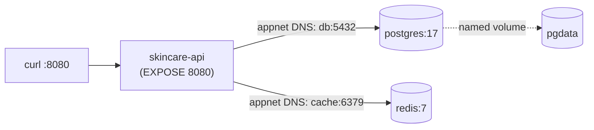
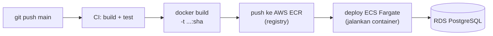

import { Section, Box, Steps, Step, Recap, CardGrid, Card, Chip, Hero } from "@components";

<Hero eyebrow="Chapter 06 &middot; Docker" title="Studi Kasus &amp; <em>Jalan ke Produksi</em> Cloud" sub="Containerize skincare-api end-to-end, lima pitfall khas, dan peta ke CI/CD + AWS">
  <p>Chapter penutup menyatukan semuanya: satu stack skincare-api yang mirip produksi dijalankan dengan satu perintah, lima jebakan khas dibongkar, lalu peta jelas dari image lokal ke CI/CD dan AWS.</p>
  <Fragment slot="meta">
    <Chip icon="rocket">Stack <b>end-to-end</b></Chip>
    <Chip icon="route">Peta ke <b>CI/CD &amp; AWS</b></Chip>
    <Chip icon="clock">~23 menit baca</Chip>
  </Fragment>
</Hero>

Lima chapter sebelumnya memberi kepingan-kepingannya: mental model, image multi-stage, config dan jaringan dan volume, Compose, lalu registry dan pengerasan produksi. Chapter penutup ini merangkainya jadi satu gambar utuh, sebuah studi kasus skincare-api yang realistis, membongkar pitfall yang paling sering menjatuhkan pendatang dari JS/PHP, dan memetakan langkah dewasa berikutnya menuju cloud, sebelum menutup dengan ringkasan keseluruhan course.

<Section num="01" id="studi-kasus" title="Studi Kasus: Containerize Go API Skincare" sub="Stack lengkap plus pitfalls khas developer JS/PHP">

<p class="lead">Saatnya menyatukan semua konsep menjadi satu stack lokal yang realistis: API Go, PostgreSQL, dan Redis, dijalankan dengan satu perintah.</p>

Target kita adalah `skincare-api`, backend online shop skincare yang sudah kamu kenal sepanjang course ini. API ini membaca produk dari PostgreSQL, men-cache hasilnya di Redis, dan mengekspos `GET /healthz` agar Compose tahu kapan container siap melayani. Tujuannya bukan sekadar "bisa jalan", tapi menyusun stack yang mirip produksi: build kecil dengan multi-stage, config lewat env, dan dependency yang digerbangi healthcheck.

<h3>Dockerfile final skincare-api</h3>

Kita pakai pola multi-stage dari Chapter 2: stage `golang:1.26` untuk compile, lalu runtime distroless yang ramping dan non-root. Biner Go statis (`CGO_ENABLED=0`) muat di `distroless/static-debian12` tanpa shell, jadi permukaan serangan tipis.

```dockerfile title="Dockerfile"
# --- build ---
FROM golang:1.26 AS build
WORKDIR /src
COPY go.mod go.sum ./
RUN go mod download
COPY . .
RUN CGO_ENABLED=0 GOOS=linux go build -ldflags="-s -w" -o /app ./cmd/server

# --- runtime ---
FROM gcr.io/distroless/static-debian12:nonroot
COPY --from=build /app /app
USER nonroot:nonroot
EXPOSE 8080
ENTRYPOINT ["/app"]
```

Perhatikan `COPY go.mod go.sum` lebih dulu sebelum `COPY . .`. Itu bukan gaya, melainkan trik cache layer: selama dependency tidak berubah, `go mod download` tidak dijalankan ulang walau kode handler kamu berubah ratusan kali.

<h3>Config env dan health endpoint</h3>

Aplikasi membaca semuanya dari environment, tidak ada nilai hardcode. Health endpoint dibuat ringan, tidak menyentuh database, agar cepat dan tidak ikut menumbangkan API saat DB lambat.

```go title="cmd/server/main.go"
package main

import (
	"net/http"
	"os"

	"github.com/kamu/skincare-backend/internal/server"
)

func main() {
	cfg := server.Config{
		Addr:        ":" + envOr("PORT", "8080"),
		DatabaseURL: os.Getenv("DATABASE_URL"),
		RedisAddr:   os.Getenv("REDIS_ADDR"),
	}
	http.HandleFunc("/healthz", func(w http.ResponseWriter, r *http.Request) {
		w.WriteHeader(http.StatusOK)
		w.Write([]byte(`{"status":"ok"}`))
	})
	server.Run(cfg)
}
```

<Box variant="bridge" icon="🌉" label="Jembatan: dari .env Laravel ke env container"><p>Di Laravel, `.env` dibaca proses PHP saat boot; di sini env disuntik Compose ke proses container, jadi satu image yang sama bisa jalan beda config tanpa rebuild.</p></Box>

<h3>Arsitektur stack final</h3>



<p class="fig-cap"><b>Stack lokal skincare.</b> API bicara ke `db` dan `cache` lewat nama service, bukan IP; data Postgres bertahan di named volume `pgdata`.</p>

<h3>Compose stack final</h3>

```yaml title="compose.yaml"
services:
  api:
    build: .
    ports:
      - "8080:8080"
    environment:
      PORT: "8080"
      DATABASE_URL: "postgres://app:secret@db:5432/skincare?sslmode=disable"
      REDIS_ADDR: "cache:6379"
    depends_on:
      db:
        condition: service_healthy
      cache:
        condition: service_started
  db:
    image: postgres:17
    environment:
      POSTGRES_USER: app
      POSTGRES_PASSWORD: secret
      POSTGRES_DB: skincare
    volumes:
      - pgdata:/var/lib/postgresql/data
    healthcheck:
      test: ["CMD-SHELL", "pg_isready -U app"]
      interval: 5s
      timeout: 3s
      retries: 5
  cache:
    image: redis:7
volumes:
  pgdata:
```

Tidak ada `version:` di atas. Atribut itu sudah usang dan diabaikan Compose modern, malah memunculkan peringatan. Service bernama `db` dan `cache`, persis nama yang dipakai API di `DATABASE_URL` dan `REDIS_ADDR`, karena Compose membuat user-defined network dengan DNS antar service otomatis.

<h3>Lima pitfalls khas dan cara debug</h3>

Inilah lima jebakan yang paling sering menjatuhkan developer yang baru pindah dari `npm run dev` atau `php artisan serve`. Sebagian besar bukan bug Docker, melainkan beda mental model antara "proses di laptop" dan "proses di dalam container", tema yang kita tanam sejak Chapter 1.

<div class="tbl-wrap"><table>
<thead><tr><th>Pitfall</th><th>Gejala</th><th>Sebab</th><th>Solusi</th></tr></thead>
<tbody>
<tr><td>Localhost trap</td><td>API gagal connect DB walau Postgres "jalan"</td><td>Kode pakai `localhost:5432`; di dalam container, localhost = container itu sendiri, bukan host</td><td>Pakai nama service: `db:5432`, andalkan DNS Compose</td></tr>
<tr><td>Stale image</td><td>Perubahan kode tidak muncul setelah `up`</td><td>Lupa rebuild; Compose pakai image lama yang sudah ter-cache</td><td>`docker compose up --build` atau `docker compose build api`</td></tr>
<tr><td>Wrong port mapping</td><td>`curl :8080` connection refused</td><td>App listen `:3000` tapi mapping `8080:8080`, atau urutan host:container terbalik</td><td>Samakan `ports` dengan port app; ingat format `host:container`</td></tr>
<tr><td>Missing env</td><td>App panic atau koneksi kosong saat start</td><td>`DATABASE_URL` tidak diset, `os.Getenv` mengembalikan string kosong</td><td>Definisikan di `environment`/`env_file`; cek `docker compose config`</td></tr>
<tr><td>Volume shadowing</td><td>File yang sudah di-build hilang di container</td><td>Bind mount menimpa direktori berisi artefak image dengan folder host kosong</td><td>Jangan mount over path build; mount hanya source yang memang perlu</td></tr>
</tbody>
</table></div>

<Box variant="warn" icon="⚠️" label="Localhost trap adalah jebakan nomor satu"><p>Di dalam container, `127.0.0.1` menunjuk ke container itu sendiri. Postgres ada di container lain, jadi alamatnya `db:5432`, bukan `localhost:5432`.</p></Box>

<Box variant="tip" icon="💡" label="Debug cepat: config dan logs"><p>Jalankan `docker compose config` untuk melihat env final yang ter-resolve, dan `docker compose logs -f api` untuk membaca alasan crash sebelum menebak-nebak.</p></Box>

<h3>Hands-on: bangun, jalankan, cek health</h3>

<Steps>
<Step><b>Build image API</b><p>Jalankan `docker compose build api` agar Dockerfile multi-stage dieksekusi dan layer dependency masuk cache untuk build berikutnya.</p></Step>
<Step><b>Jalankan seluruh stack</b><p>`docker compose up -d` menyalakan db, cache, lalu api; `depends_on: condition: service_healthy` menahan API sampai `pg_isready` lulus.</p></Step>
<Step><b>Cek health endpoint</b><p>`curl localhost:8080/healthz` harus mengembalikan `{"status":"ok"}`; bila refused, periksa `docker compose ps` dan `logs api`.</p></Step>
</Steps>

<Box variant="analogy" icon="🔗" label="Satu perintah, satu lingkungan"><p>Compose ke stack ini seperti resep dapur: satu file mendeklarasikan bahan (image), takaran (env), dan urutan masak (depends_on), lalu `up` memasaknya identik di laptop siapa pun.</p></Box>

Dengan ini kamu punya backend skincare yang berjalan lokal layaknya produksi mini: build ramping, dependency tergerbang sehat, dan config yang bisa dipindah tanpa menyentuh image. Inilah fondasi yang sama yang nanti diangkat ke cloud.

</Section>

<Section num="02" id="topik-lanjutan" title="Topik Lanjutan dan Peta ke Deploy" sub="Dari image lokal ke CI/CD dan AWS">

<p class="lead">Image yang jalan di laptop adalah setengah cerita; setengah lainnya adalah membawanya ke registry dan menjalankannya di cloud secara otomatis.</p>

Setelah `skincare-api` containerized, langkah dewasa berikutnya adalah menghapus tahap manual. Alih-alih `docker build` lalu `docker push` dari laptop, sebuah CI pipeline melakukannya setiap kali kamu merge ke main: build image, jalankan test, lalu push ke registry. Dari registry, platform orkestrasi menarik image dan menjalankannya. Pola "build sekali, deploy artefak yang sama" ini, yang kita pelajari di Chapter 5, sudah jadi standar tim backend modern. Course ini berhenti di gerbang itu, tapi penting kamu lihat petanya supaya tahu ke mana arah berikutnya.

<h3>Peta pipeline ke AWS</h3>



<p class="fig-cap"><b>Dari commit ke produksi.</b> CI membangun dan menguji, mendorong image ke ECR, lalu ECS Fargate menjalankan container yang sama, terhubung ke database RDS terkelola.</p>

<h3>Potongan-potongan yang akan kamu temui</h3>

Beberapa istilah AWS akan muncul, dan masing-masing memetakan rapi ke konsep yang sudah kamu kuasai. ECR hanyalah registry privat (seperti GHCR, tapi milik AWS). ECS Fargate adalah cara menjalankan container tanpa mengurus server. RDS adalah Postgres terkelola, pengganti container `db` lokalmu. Untuk konteks resmi, lihat [dokumentasi Amazon ECR](https://docs.aws.amazon.com/ecr/) dan [panduan AWS Fargate](https://docs.aws.amazon.com/AmazonECS/latest/developerguide/AWS_Fargate.html).

<Box variant="bridge" icon="🌉" label="Jembatan: dari Vercel/Forge ke ECS"><p>Kalau terbiasa deploy Next.js di Vercel atau Laravel via Forge, ECS Fargate adalah ide serupa untuk container: kamu serahkan artefak (image), platform yang menjalankan dan menskalakannya.</p></Box>

<h3>Akselerasi build: BuildKit dan cache mounts</h3>

BuildKit sudah jadi builder default, jadi kamu otomatis menikmati build paralel dan cache layer. Lebih jauh, cache mount membuat cache modul Go bertahan antar build tanpa masuk ke image final, memangkas waktu `go mod download` di CI.

```dockerfile title="Dockerfile (cache mount)"
RUN --mount=type=cache,target=/go/pkg/mod \
    --mount=type=cache,target=/root/.cache/go-build \
    CGO_ENABLED=0 go build -o /app ./cmd/server
```

<Box variant="tip" icon="💡" label="compose watch untuk loop dev"><p>`docker compose watch` menyinkronkan perubahan source ke container dan me-rebuild saat perlu, mendekati pengalaman hot-reload `npm run dev` tanpa meninggalkan stack Compose.</p></Box>

<h3>Arah lanjutan</h3>

<CardGrid cols={3}>
<Card><h4>CI/CD pipeline</h4><p>Otomatiskan build, test, dan push image bertag digest tiap merge, agar deploy reproducible dan bebas langkah manual dari laptop.</p></Card>
<Card><h4>Registry dan ECR</h4><p>Login ke `ghcr.io` atau ECR, push tag semver, dan referensikan via `image@sha256:` untuk image yang immutable di produksi.</p></Card>
<Card><h4>ECS Fargate dan RDS</h4><p>Jalankan container tanpa server, sambungkan ke Postgres terkelola RDS, dan atur scaling tanpa menyentuh OS host.</p></Card>
</CardGrid>

Untuk runtime, ingat kembali pilihan base image ramping seperti [distroless dari Google](https://github.com/GoogleContainerTools/distroless): image kecil non-root mempercepat pull di CI dan ECS sekaligus mengecilkan permukaan serangan. Referensi perintah dan praktik terbaik lain selalu bisa kamu cek di [docs.docker.com](https://docs.docker.com/).

<Box variant="note" icon="📝" label="Course ini fondasi, deploy AWS di jalur lanjutan"><p>Tujuan course ini menanamkan fondasi container yang kokoh. Detail end-to-end ECR, ECS Fargate, dan RDS dibahas tuntas di jalur deploy lanjutan.</p></Box>

</Section>

<Section num="03" id="ringkasan" title="Ringkasan dan Poin Penting" sub="Checklist Docker untuk backend Go">

<p class="lead">Kamu sekarang bisa mengubah biner Go menjadi container yang ramping, aman, dan reproducible, lalu menjalankannya sebagai bagian dari stack multi-service, dari laptop sampai gerbang cloud.</p>

Mari petakan ulang perjalanan seluruh course. Kita mulai dari membedakan image (cetakan immutable) dan container (instance yang berjalan), lalu menulis Dockerfile yang sadar cache layer. Multi-stage memisahkan toolchain build dari runtime sehingga image akhir hanya berisi biner dan sertifikat. Config masuk lewat env, bukan hardcode. Networking mengandalkan DNS antar service di user-defined network. Volume menjaga data Postgres tetap hidup melewati restart. Compose merangkai semuanya, dengan healthcheck menggerbangi urutan start. Terakhir, tag dan registry membuat image bisa dibagikan, sementara non-root dan scanning menjaga keamanan.

<Recap title="Yang Wajib Menempel">
<ul>
<li>Image adalah cetakan immutable; container adalah instance berjalan dari image, dan registry tempat image dibagikan.</li>
<li>Urutkan Dockerfile dari yang jarang berubah ke yang sering: `COPY go.mod go.sum` lalu `go mod download` sebelum `COPY . .`.</li>
<li>Multi-stage plus `CGO_ENABLED=0` menghasilkan biner statis yang muat di `distroless/static-debian12`, kecil dan tanpa shell.</li>
<li>Config selalu lewat env (`environment`/`env_file`); jangan hardcode kredensial atau alamat ke dalam image.</li>
<li>Di dalam container, `localhost` adalah container itu sendiri; service lain dipanggil lewat nama via DNS user-defined network.</li>
<li>Named volume menjaga data stateful (Postgres) bertahan lintas `docker compose down` dan restart.</li>
<li>Compose plus healthcheck dan `depends_on: condition: service_healthy` memastikan API start setelah DB benar-benar siap.</li>
<li>`docker compose logs`, `exec`, dan flag resource (`--memory`, `--cpus`) adalah alat debug dan pembatas dasar.</li>
<li>Pin tag semver dan referensi digest untuk deploy reproducible; jalankan sebagai non-root dan pindai dengan `docker scout` atau `trivy`.</li>
</ul>
</Recap>

<Box variant="tip" icon="💡" label="Aturan emas image produksi"><p>Image akhir yang baik: kecil, non-root, tanpa shell bila bisa, bertag immutable, dan tidak membawa satu pun secret di dalam layer-nya.</p></Box>

<h3>Tiga arah langkah berikutnya</h3>

<CardGrid cols={3}>
<Card><h4>CI/CD</h4><p>Pindahkan build, test, dan push image ke pipeline otomatis agar setiap merge menghasilkan artefak yang konsisten dan teruji.</p></Card>
<Card><h4>AWS ECR dan ECS</h4><p>Simpan image di registry ECR, lalu jalankan container di ECS Fargate yang tersambung ke Postgres terkelola RDS.</p></Card>
<Card><h4>Observability dan scaling</h4><p>Tambahkan metrik, log terpusat, dan health probe agar container bisa di-scale dan dipantau dengan percaya diri.</p></Card>
</CardGrid>

Dari sini, lanjutkan ke Docker Compose tingkat lanjut untuk environment dev yang lebih kaya, lalu rakit CI pipeline yang membangun dan menguji image setiap commit. Setelah itu, bawa `skincare-api` ke produksi nyata lewat AWS ECR sebagai registry dan ECS Fargate sebagai runtime, dengan RDS sebagai database. Fondasi container yang kamu kuasai di course ini adalah tiket masuk ke seluruh jalur deploy itu.

</Section>
