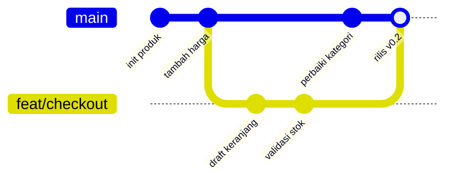
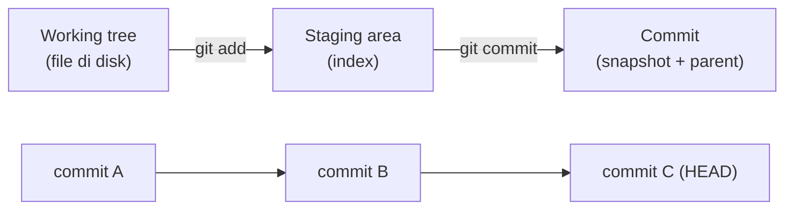
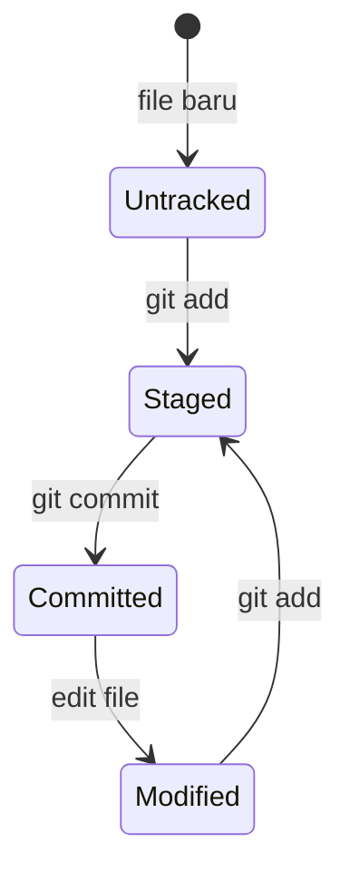

import { Section, Box, Steps, Step, Recap, CardGrid, Card, Chip, Hero, Compare, FileTree } from "@components";

<Hero eyebrow="Chapter 01 &middot; Git" title="Fondasi &amp; <em>Mental Model</em><br />Git" sub="Kenapa Git, snapshot bukan diff, dan repo lokal siap pakai">
  <p>Sebelum menyentuh perintah-perintah pamungkas, satu chapter untuk membangun fondasi yang menentukan: kenapa Git ada, bagaimana ia berpikir, dan bagaimana menyiapkan repo lokal yang benar sejak commit pertama.</p>
  <Fragment slot="meta">
    <Chip icon="git">Snapshot &amp; <b>tiga area</b></Chip>
    <Chip icon="terminal">Setup <b>repo lokal</b></Chip>
    <Chip icon="clock">~20 menit baca</Chip>
  </Fragment>
</Hero>

Chapter pembuka ini adalah satu busur belajar yang utuh: kita mulai dari **kenapa** Git layak dikuasai, lanjut ke **bagaimana** Git menyimpan kerjamu (model snapshot dan tiga area), lalu menutup dengan **menyiapkan** repository lokal pertama yang rapi. Ketiganya berurutan dengan sengaja, sebab tanpa memahami model mentalnya, perintah Git terasa seperti mantra hafalan yang gampang salah. Setelah chapter ini, perintah di chapter berikutnya akan terasa logis, bukan magis.

<Section num="01" id="kenapa-git" title="Kenapa Git Sistem Koordinasi" sub="Sistem koordinasi kerja, bukan sekadar simpan kode">

<p class="lead">Git bukan tempat menyimpan kode, melainkan sistem koordinasi kerja yang menjawab pertanyaan "siapa mengubah apa, kapan, dan kenapa" di sebuah tim.</p>

Banyak orang pertama kali mengenal Git sebagai "tombol simpan ke cloud". Anggapan itu menyesatkan karena membuat Git terasa seperti pengganti Google Drive. Kenyataannya Git adalah **version control system** terdistribusi: setiap perubahan dicatat sebagai titik histori yang punya penulis, waktu, dan pesan, lalu titik-titik itu dirangkai menjadi narasi proyek yang bisa diaudit, ditelusuri, dan diputar mundur kapan saja.

Pada proyek backend skincare `github.com/kamu/skincare-backend`, kamu tidak bekerja sendiri. Ada yang menggarap modul katalog produk, ada yang menggarap checkout, ada yang menambah migrasi database. Tanpa sistem koordinasi, dua orang yang menyentuh file `internal/product/service.go` akan saling menimpa. Git membuat pekerjaan paralel itu aman: tiap orang punya jalur sendiri, lalu hasilnya digabung dengan jejak yang jelas.



<p class="fig-cap"><b>Kerja paralel di repo bersama.</b> Jalur <code>feat/checkout</code> berkembang sendiri lalu disatukan ke jalur utama tanpa menghapus jejak siapa pun.</p>

Setidaknya ada enam peran yang Git mainkan setiap hari. Keenamnya saling menopang, dan semuanya hilang begitu kamu mengandalkan salin-tempel folder.

<CardGrid cols={3}>
<Card><h4>Version control</h4><p>Riwayat berversi: tiap perubahan jadi titik yang bisa dikunjungi ulang.</p></Card>
<Card><h4>History</h4><p>Catatan kenapa kode jadi seperti sekarang, bukan hanya seperti apa.</p></Card>
<Card><h4>Collaboration</h4><p>Banyak orang menggarap satu basis kode tanpa saling menimpa.</p></Card>
<Card><h4>Rollback</h4><p>Kembali ke versi sehat dalam hitungan detik saat bug masuk produksi.</p></Card>
<Card><h4>Code review</h4><p>Perubahan ditinjau sebelum masuk ke jalur utama.</p></Card>
<Card><h4>Release tracking</h4><p>Menandai versi mana yang dirilis, dengan tag yang permanen.</p></Card>
</CardGrid>

<Box variant="analogy" icon="🎮" label="Save point plus jurnal tim"><p>Git itu seperti save point game yang bisa kamu kunjungi ulang kapan saja, sekaligus jurnal yang mencatat siapa mengubah apa dan alasannya, sehingga seluruh tim membaca cerita yang sama.</p></Box>

<Box variant="bridge" icon="🌉" label="Jembatan: dari ZIP backup ke histori yang bisa diaudit"><p>Kalau dulu kamu menyimpan <code>project-final-v2-fix.zip</code> atau mengandalkan Undo editor yang hanya seumur sesi, Git menggantinya dengan histori penuh yang permanen, bisa dicari, dan bisa dibandingkan antar versi.</p></Box>

Mari rasakan langsung. Tiga perintah berikut membuat repo, menyetujui satu perubahan ke staging, lalu mengabadikannya sebagai commit pertama.

```bash title="Terminal"
mkdir skincare-backend && cd skincare-backend
git init
echo "# Skincare Backend" > README.md
git add README.md
git commit -m "chore: inisialisasi proyek"
```

Setelah `git commit`, kamu sudah memiliki satu titik histori yang permanen. Mulai detik ini, setiap perubahan punya rumah yang aman dan setiap keputusan teknis punya jejak. Itulah fondasi cara tim software bekerja: bukan karena Git menyimpan file, melainkan karena Git mengoordinasikan manusia di sekitar file tersebut. Pertanyaan berikutnya yang wajar: bagaimana sebenarnya Git menyimpan titik histori itu di balik layar? Itu yang kita bedah di section berikut.

</Section>

<Section num="02" id="mental-model" title="Mental Model: Snapshot, Bukan Diff" sub="Git menyimpan snapshot utuh; tiga area kerja">

<p class="lead">Kunci memahami Git adalah satu kalimat: tiap commit menyimpan snapshot utuh proyek, bukan daftar perubahan yang menumpuk.</p>

Banyak sistem versi lama berpikir dalam **diff**: mereka menyimpan "baris 10 berubah, baris 22 dihapus" lalu menumpuknya. Git memilih cara berbeda. Saat kamu commit, Git memotret seluruh isi proyek pada momen itu dan menyimpannya sebagai **snapshot**. File yang tidak berubah tidak disalin ulang, melainkan ditunjuk kembali ke isi yang identik. Hasilnya histori terasa seperti rangkaian foto utuh, bukan tumpukan catatan tambal sulam.

<Compare aLabel="VCS lama: berpikir diff" bLabel="Git: berpikir snapshot" aTone="muted" bTone="violet">
  <Fragment slot="a"><ul><li>Menyimpan delta per file lalu menumpuknya.</li><li>Pindah versi = memutar ulang banyak diff berurutan.</li><li>Rekonstruksi versi tua makin lambat seiring riwayat memanjang.</li></ul></Fragment>
  <Fragment slot="b"><ul><li>Tiap commit memotret seluruh proyek; file tak berubah ditunjuk ulang.</li><li>Pindah versi = ganti pointer lalu susun ulang file, murah.</li><li>Nama objek dari hash isi, jadi integritas terverifikasi otomatis.</li></ul></Fragment>
</Compare>

Agar snapshot itu hemat dan konsisten, Git bersifat **content-addressable**: setiap potongan isi diberi nama dari **hash** isinya sendiri. Isi file mentah disimpan sebagai **blob**, struktur folder sebagai **tree**, dan satu **commit** menunjuk ke satu tree (snapshot proyek) plus pointer ke **parent** (commit sebelumnya). Karena nama objek berasal dari isinya, isi yang sama otomatis berbagi penyimpanan, dan perubahan sekecil apa pun menghasilkan hash berbeda yang langsung terdeteksi.



<p class="fig-cap"><b>Dua sudut pandang.</b> Atas: perjalanan satu perubahan dari disk ke commit. Bawah: commit bertaut ke parent membentuk rantai snapshot.</p>

Soal nama objek, Git default memakai **SHA-1** dan sedang dalam transisi resmi ke **SHA-256**. Untuk kerja harian perbedaannya tak terasa; yang penting dipahami adalah idenya: nama sama dengan hash dari isi. Itu yang membuat Git bisa memverifikasi integritas histori dan mendeteksi korupsi data.

<Box variant="note" icon="📌" label="Kenapa pindah versi itu murah"><p>Karena commit menyimpan snapshot lengkap plus pointer ke parent, berpindah dari satu versi ke versi lain hanya soal menggeser pointer dan menyusun ulang file, bukan memutar ulang ribuan diff satu per satu.</p></Box>

Git mengatur kerja lewat tiga area: **working tree** (file yang kamu edit di disk), **staging area** alias **index** (ruang tunggu tempat kamu memilih perubahan mana yang akan masuk commit berikutnya), dan **repository** (database objek di dalam `.git` tempat snapshot disimpan permanen). Detail mendalam tiga area ini dibahas di Chapter 2 saat kita masuk alur kerja harian; di sini cukup pahami bahwa staging memberimu kontrol untuk menyusun commit yang rapi, bukan asal melempar semua perubahan sekaligus.

<Box variant="bridge" icon="🌉" label="Jembatan: dari state UI ke state histori"><p>Di frontend kamu terbiasa berpikir state sebagai snapshot tunggal yang berubah lewat aksi; histori Git memakai logika serupa di skala proyek, tiap commit adalah snapshot baru yang ditautkan ke snapshot sebelumnya.</p></Box>

<Box variant="analogy" icon="📷" label="Tiap commit adalah satu foto utuh"><p>Bayangkan kamera yang memotret seluruh proyek tiap kali kamu commit. Kamu tidak menyimpan "apa yang berubah", kamu menyimpan "seperti apa proyek pada momen itu", lengkap dengan tanggal di balik foto yang menunjuk foto sebelumnya.</p></Box>

</Section>

<Section num="03" id="setup-repo" title="Setup Git dan Repository Lokal" sub="Identitas commit, config, dan isi folder .git">

<p class="lead">Sebelum commit pertama yang serius, luangkan lima menit menyetel identitas dan preferensi Git agar setiap jejak yang kamu tinggalkan benar dan konsisten.</p>

Setiap commit mencatat siapa penulisnya. Bila identitas belum diset, commit-mu akan tertempel nama dan email asal yang membuat histori sulit ditelusuri dan riwayat kontribusi berantakan. Karena itu langkah pertama adalah menyetel **user.name** dan **user.email** secara global, lalu menentukan beberapa preferensi yang akan terasa setiap hari.

<Steps>
<Step><b>Setel identitas global</b><p>Pakai nama dan email yang sama dengan akun hosting (GitHub/GitLab) supaya kontribusi tercatat ke profil yang benar.</p></Step>
<Step><b>Setel preferensi inti</b><p>Default branch <code>main</code>, editor untuk pesan panjang, dan normalisasi line ending lintas OS.</p></Step>
<Step><b>Inisialisasi repo</b><p><code>git init</code> membuat folder <code>.git</code>, lalu <code>git status</code> jadi kompas pertamamu.</p></Step>
</Steps>

```bash title="Terminal"
git config --global user.name "Nama Kamu"
git config --global user.email "kamu@contoh.com"
git config --global init.defaultBranch main
git config --global core.editor "code --wait"
git config --global core.autocrlf input
```

Empat baris setelah identitas itu penting dipahami, bukan sekadar disalin. **init.defaultBranch main** menetapkan nama branch awal saat `git init`, mengikuti standar komunitas dan hosting modern yang memakai `main`. **core.editor** menentukan editor yang dibuka saat Git butuh pesan panjang (misalnya saat rebase interaktif); `--wait` memastikan Git menunggu sampai editor ditutup. **core.autocrlf input** mengatur line endings: ia menormalkan akhir baris ke gaya Unix saat menyimpan ke repo, penting di tim lintas sistem operasi agar diff tidak penuh perubahan palsu. Untuk autentikasi ke remote, **credential helper** menyimpan kredensial agar kamu tidak mengetik token berulang.

<Box variant="bridge" icon="🌉" label="Jembatan: dari config tooling ke config Git"><p>Kamu sudah biasa menaruh aturan tim di <code>.eslintrc</code> atau <code>.prettierrc</code> per proyek. Config Git serupa, hanya saja level <code>--global</code> berlaku untuk semua repo di mesinmu, dan config tanpa <code>--global</code> hanya untuk repo saat ini.</p></Box>

Setelah config beres, `git init` mengubah folder biasa menjadi repository dengan membuat subfolder `.git`. Folder inilah otak repo: ia menyimpan seluruh objek (blob, tree, commit), referensi branch, dan konfigurasi lokal.

<FileTree title="Isi folder .git (disederhanakan)" tree={`
.git/
  HEAD
  config
  objects/
  refs/
    heads/
    tags/
`} />

Di dalam repo, setiap file berada di salah satu status lifecycle. File yang belum pernah Git lihat berstatus **untracked**; setelah `git add`, ia menjadi **tracked** dan masuk pengawasan Git. Jalankan `git status` kapan saja untuk membaca peta ini.

```bash title="Terminal"
git init
git status
```



<p class="fig-cap"><b>Lifecycle file.</b> Dari untracked sampai committed, lalu kembali berputar setiap kali file disunting.</p>

<Box variant="tip" icon="💡" label="Konsistensi sejak awal"><p>Set <code>init.defaultBranch main</code> dan pakai <code>user.email</code> yang sama dengan akun hosting-mu di semua proyek, supaya kontribusi tercatat ke identitas yang benar dan branch awal seragam di tiap repo.</p></Box>

<Box variant="warn" icon="⚠️" label=".git adalah otak repo"><p>Seluruh histori lokal hidup di dalam folder <code>.git</code>. Menghapusnya membuat folder kembali jadi direktori biasa dan menghilangkan semua commit yang belum pernah didorong ke remote.</p></Box>

</Section>

<Section num="04" id="ringkasan" title="Ringkasan" sub="Fondasi yang menopang seluruh chapter berikut">

<p class="lead">Tiga ide chapter ini, kenapa Git, model snapshot, dan repo lokal yang benar, adalah lantai tempat semua perintah lanjutan berdiri.</p>

Kita mulai dari pergeseran cara pikir: Git mengoordinasikan manusia di sekitar kode, bukan sekadar menyimpan file. Lalu kita lihat mesin di baliknya, snapshot content-addressable dengan tiga area kerja yang membuat pindah versi jadi murah dan integritas terjamin. Terakhir, kita siapkan repo lokal dengan identitas dan preferensi yang benar agar setiap jejak yang kamu tinggalkan rapi sejak commit pertama. Di Chapter 2 kita pakai fondasi ini untuk menjalani alur kerja harian: memilih perubahan dengan staging, menulis commit yang baik, dan membaca history.

<Recap title="Yang Wajib Menempel">
<ul>
<li>Git itu sistem koordinasi kerja tim, bukan pengganti penyimpanan cloud.</li>
<li>Tiap commit menyimpan <b>snapshot utuh</b>, bukan tumpukan diff; nama objek berasal dari hash isinya.</li>
<li>Tiga area, working tree, staging (index), dan repository, memberi kendali menyusun commit.</li>
<li>Setel <code>user.name</code>, <code>user.email</code>, dan <code>init.defaultBranch main</code> sebelum commit pertama.</li>
<li>Folder <code>.git</code> adalah otak repo; menghapusnya menghapus histori lokal yang belum didorong.</li>
</ul>
</Recap>

</Section>
