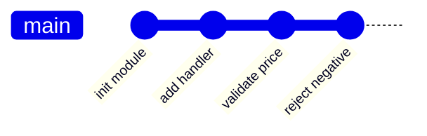

import { Section, Box, Recap, CardGrid, Card, Chip, Hero, Compare, Figure } from "@components";
import GitThreeTreeFig01 from "@figures/GitThreeTreeFig01.astro";

<Hero eyebrow="Chapter 02 &middot; Git" title="Alur Kerja <em>Harian</em><br />Stage, Commit, History" sub="Memilih perubahan, menulis commit baik, membaca history">
  <p>Inti pekerjaan sehari-hari dengan Git adalah satu loop kecil yang berulang: pilih perubahan dengan sadar, bungkus jadi commit yang baik, lalu baca kembali jejaknya saat dibutuhkan.</p>
  <Fragment slot="meta">
    <Chip icon="check">Staging <b>sadar</b></Chip>
    <Chip icon="book">Commit <b>atomic</b></Chip>
    <Chip icon="clock">~22 menit baca</Chip>
  </Fragment>
</Hero>

Di Chapter 1 kita paham Git menyimpan snapshot lewat tiga area. Chapter ini mengubah pemahaman itu menjadi kebiasaan harian yang berputar mulus: **tracking** untuk memilih apa yang masuk, **commit** untuk membungkusnya jadi catatan yang bermakna, dan **history** untuk membacanya kembali. Ketiganya satu lingkaran, makin rapi kamu memilih dan menulis, makin berharga history yang bisa kamu baca berbulan-bulan kemudian.

<Section num="01" id="tracking-changes" title="Tracking Perubahan" sub="status, add, restore, diff: memilih perubahan dengan sadar">

<p class="lead">Git memisahkan perubahan menjadi tiga kondisi, dan justru di pemisahan itulah letak kendali kamu atas apa yang masuk ke sebuah commit.</p>

Sebuah file yang kamu sentuh hidup di salah satu dari tiga kondisi: **modified** (sudah diubah di working tree tapi belum ditandai), **staged** (sudah dipilih ke staging area, siap dibungkus jadi commit), dan **committed** (sudah tersimpan permanen di repository). Staging area inilah yang sering diremehkan pemula: ia bukan sekadar formalitas sebelum commit, melainkan ruang untuk **menyusun** commit secara sadar, memilih perubahan mana yang layak masuk bersama dan mana yang ditunda.

<Figure><GitThreeTreeFig01 /><Fragment slot="caption"><b>Tiga area Git.</b> git add memindahkan dari working tree ke staging; git commit menyimpan staging ke repository; git restore membatalkan.</Fragment></Figure>

Titik masuknya selalu `git status`. Perintah ini membaca ketiga area dan memberitahu kamu: file mana yang modified tapi belum staged, file mana yang sudah staged, dan file mana yang sama sekali belum dilacak (untracked). Biasakan menjalankannya sebelum dan sesudah `git add`, karena ia adalah kompasmu, bukan sekadar laporan.

```bash title="Terminal"
$ git status
On branch main
Changes to be committed:
  (use "git restore --staged <file>..." to unstage)
	modified:   internal/product/handler.go

Changes not staged for commit:
  (use "git add <file>..." to update what will be committed)
  (use "git restore <file>..." to discard changes in working directory)
	modified:   internal/product/service.go
```

Untuk memindahkan perubahan ke staging, `git add <path>`. Untuk membatalkan, ada dua arah yang sering tertukar. `git restore <file>` membuang perubahan di **working tree** (mengembalikan file ke kondisi terakhir di index, perubahanmu hilang). Sementara `git restore --staged <file>` hanya **meng-unstage**: perubahan tetap ada di working tree, hanya dikeluarkan dari staging. Perhatikan perbedaannya: yang satu membuang isi, yang satu hanya menarik dari antrean commit.

<Box variant="warn" icon="⚠️" label="git restore tanpa --staged itu destruktif"><p>git restore service.go menimpa file dengan versi index dan tidak masuk reflog, jadi perubahan working tree yang belum di-commit benar-benar lenyap. Pastikan kamu memang ingin membuangnya.</p></Box>

Dua perintah `diff` menjawab dua pertanyaan berbeda. `git diff` menunjukkan selisih **working tree vs index**: perubahan yang sudah kamu buat tapi belum di-stage. `git diff --staged` menunjukkan **index vs HEAD**: persis apa yang akan tercatat bila kamu commit sekarang. Membaca keduanya sebelum commit adalah kebiasaan yang memisahkan commit rapi dari commit berantakan.

<Box variant="bridge" icon="🌉" label="Jembatan: dari review di editor ke git diff"><p>Sama seperti kamu memindai diff di tab Source Control sebelum stage, git diff dan git diff --staged adalah versi terminal yang portabel, bisa di-pipe, dan tidak bergantung pada editor mana pun.</p></Box>

Mari praktik. Ubah dua file, stage satu, lalu bandingkan kedua diff sebelum commit.

```bash title="Terminal"
$ git add internal/product/handler.go   # stage satu file saja
$ git diff                              # sisa yang BELUM di-stage (service.go)
$ git diff --staged                     # yang AKAN masuk commit (handler.go)
$ git commit -m "Validate price is positive in product handler"
```

Di dunia nyata, kemampuan memilih potongan inilah yang menyelamatkan history. Bayangkan kamu sedang memperbaiki validasi harga, tapi di tengah jalan iseng merapikan nama variabel di fungsi yang sama. Dua hal itu tidak berhubungan, dan menggabungnya jadi satu commit membuat keduanya sulit dipisah nanti. `git add -p` menyelesaikan ini: ia menampilkan tiap hunk dan bertanya y/n, sehingga satu file berisi dua perubahan bisa dipecah jadi dua commit terpisah.

<Compare aLabel="Refleks: git add ." bLabel="Sadar: git add -p" aTone="red" bTone="teal">
  <Fragment slot="a"><ul><li>Menyapu semua perubahan tanpa kamu lihat.</li><li>Perbaikan bug dan rename tak relevan tercampur di satu commit.</li><li>Rentan ikut menstage file rahasia atau setengah jadi.</li></ul></Fragment>
  <Fragment slot="b"><ul><li>Menapis per hunk, kamu memutuskan tiap potongan.</li><li>Tiap commit tetap atomic, satu ide per commit.</li><li>Diff sempat kamu baca ulang sebelum masuk staging.</li></ul></Fragment>
</Compare>

</Section>

<Section num="02" id="commit-baik" title="Commit yang Baik" sub="Atomic, pesan jelas, why over what">

<p class="lead">Commit yang baik bukan tentang menyimpan kode, melainkan menulis catatan yang masih masuk akal saat dibaca enam bulan kemudian oleh orang yang lupa konteksnya, termasuk dirimu sendiri.</p>

Prinsip pertama adalah **atomic**: satu commit memuat satu perubahan logis yang utuh. Bukan "satu file", bukan "satu hari kerja", tapi satu ide yang bisa dijelaskan dalam satu kalimat. Commit atomic membuat `git log` mudah dibaca, `git revert` aman (membatalkan satu commit tidak ikut menghapus hal lain), dan `git bisect` efektif saat memburu bug. Bila kamu menggabungkan perbaikan validasi harga dengan rename variabel di satu commit, dua-duanya jadi sulit dipisah lagi nanti. Inilah kenapa `git add -p` di section sebelumnya penting: ia alat untuk menjaga keatomikan.

<Box variant="bridge" icon="🌉" label="Jembatan: satu issue, satu commit logis"><p>Seperti memecah satu task besar di issue tracker jadi sub-task kecil yang jelas, satu perubahan logis sebaiknya menjadi satu commit terisolasi. Issue memberi batas; commit menjadi jejak teknis dari batas itu.</p></Box>

Prinsip kedua adalah **pesan yang menjelaskan kenapa**. Pesan commit punya dua bagian: **subject** (baris pertama) dan **body** (paragraf setelah baris kosong). Subject ditulis imperatif dan singkat, sekitar maksimal 50 karakter, seolah memberi perintah: "Add", "Fix", "Refactor", bukan "Added" atau "Fixing". Body, yang opsional, dibungkus sekitar 72 karakter per baris dan menjelaskan **kenapa** perubahan ini perlu, bukan mengulang **apa** yang sudah terbaca dari diff. Konvensi 50/72 ini bukan rewel gaya: subject pendek tampil utuh di `git log --oneline`, di daftar PR, dan di antarmuka hosting tanpa terpotong.

<div class="tbl-wrap"><table>
<thead><tr><th>Buruk</th><th>Baik</th><th>Kenapa</th></tr></thead>
<tbody>
<tr><td><code>update</code></td><td><code>Add price validation to product handler</code></td><td>Subjek buruk tak menjelaskan apa pun saat dibaca di log.</td></tr>
<tr><td><code>fix bug</code></td><td><code>Fix negative PriceRupiah passing validation</code></td><td>"Bug" yang mana? Subjek baik menyebut gejala spesifik.</td></tr>
<tr><td><code>wip</code></td><td><code>Refactor product service to accept context</code></td><td>"wip" tidak punya makna di history permanen.</td></tr>
</tbody>
</table></div>

<Box variant="warn" icon="⚠️" label="Hindari pesan tanpa makna"><p>Pesan seperti wip, update, fix bug, atau asdf membuat history jadi kabut. Saat kamu menelusuri kenapa sebuah baris berubah, pesan kosong memaksamu membaca seluruh diff dari nol.</p></Box>

Berikut anatomi pesan commit yang lengkap: subject imperatif singkat, baris kosong, lalu body yang menjawab "kenapa".

```text title="Pesan commit"
Reject negative price at product creation

PriceRupiah disimpan sebagai int64 dalam rupiah penuh, tapi handler
lama menerima nilai negatif tanpa keluhan, lalu lolos sampai ke
database. Validasi di tepi mencegah data harga rusak masuk ke sistem
diskon yang mengandalkan nilai non-negatif.
```

Prinsip ketiga: **pecah perubahan besar jadi beberapa commit logis**. Bila satu sesi kerja menyentuh validasi, lalu rename, lalu perbaikan test, stage dan commit terpisah dengan bantuan `git add -p` agar tiap commit tetap atomic.

```bash title="Terminal"
$ git add -p internal/product/service.go   # pilih hunk validasi saja
$ git commit -m "Reject negative price at product creation"
$ git add -p internal/product/service.go   # sekarang hunk rename
$ git commit -m "Rename priceCents to priceRupiah for clarity"
```

<Box variant="tip" icon="💡" label="Subject imperatif, why di body"><p>Tulis subject seolah melengkapi kalimat "Commit ini akan ...": Add, Fix, Refactor. Simpan alasan dan trade-off di body, karena diff sudah menjawab "apa", yang hilang justru "kenapa".</p></Box>

Format pesan terstruktur ini punya kelanjutan yang kuat. Di Chapter 6 kita lihat bagaimana konvensi `type(scope): description` (Conventional Commits) membuat pesan bisa dibaca mesin untuk menghasilkan changelog dan menentukan versi rilis otomatis. Kebiasaan menulis subject imperatif yang jelas sekarang adalah modal untuk otomasi itu nanti.

</Section>

<Section num="03" id="history" title="Membaca History" sub="log, show, diff tanpa rasa takut">

<p class="lead">History bukan museum yang hanya dipajang, melainkan alat investigasi: ia menjawab kenapa sebuah baris ada, kapan sebuah bug masuk, dan apa yang berubah di antara dua rilis.</p>

Pintu utamanya `git log`. Apa adanya ia menampilkan tiap commit beserta hash, author, date, dan pesan, dari yang terbaru ke terlama. Tapi yang membuatnya berguna adalah flag-flagnya. `--oneline` memampatkan tiap commit jadi satu baris. `--graph` menggambar struktur cabang dengan garis ASCII. `--all` menyertakan semua branch, bukan hanya yang sedang aktif. Dikombinasikan, ketiganya memberi peta repositori yang cepat dibaca.

```bash title="Terminal"
$ git log --oneline --graph --all
* 8f3a1c2 (HEAD -> main) Reject negative price at product creation
* a1b9d04 Add price validation to product handler
| * 4c7e8f1 (feat/discount) Add discount engine skeleton
|/
* 2d5a6b3 Initialize skincare-backend module layout
```

<p class="fig-cap"><b>Peta cabang dari satu perintah.</b> Garis menunjukkan feat/discount bercabang dari commit yang sama dengan main.</p>

Secara model, history adalah rantai commit yang tiap simpulnya menunjuk ke induknya. Pada satu branch lurus, rantai itu terlihat seperti ini.



<p class="fig-cap"><b>Rantai commit linear.</b> Tiap commit menyimpan snapshot penuh dan menunjuk ke induknya, sehingga history bisa ditelusuri mundur.</p>

Beberapa "lensa" history paling sering kamu pakai di kerja nyata, masing-masing menjawab satu pertanyaan investigasi yang berbeda.

<CardGrid cols={2}>
<Card><h4>git show &lt;hash&gt;</h4><p>Lihat satu commit utuh: metadata plus diff lengkapnya. Pertanyaan: "apa persisnya yang commit ini ubah?"</p></Card>
<Card><h4>git diff a..b</h4><p>Selisih dari commit a ke b. Pertanyaan: "apa yang berubah sejak tag rilis terakhir?"</p></Card>
<Card><h4>git log -p -- path/file</h4><p>Riwayat plus diff satu file. Pertanyaan: "bagaimana file ini berevolusi?"</p></Card>
<Card><h4>git log --follow -- file</h4><p>Tetap menelusuri meski file pernah di-rename. Pertanyaan: "siapa dan kapan menyentuh ini, lintas rename?"</p></Card>
</CardGrid>

```bash title="Terminal"
$ git show 8f3a1c2                 # metadata + diff satu commit
$ git diff a1b9d04..8f3a1c2        # selisih antara dua commit
$ git log -p -- internal/product/service.go   # riwayat + diff satu file
$ git log --follow -- internal/product/price.go  # ikut menembus rename file
```

Sering yang kamu butuhkan bukan seluruh history, melainkan **siapa yang menyentuh satu file**. `git log -- path/file` menyaring commit yang mengubah file tersebut, dan `--follow` membuat penelusuran tetap utuh meski file pernah di-rename. Tambahkan `-p` untuk melihat diff tiap perubahannya, sehingga evolusi sebuah file terbaca seperti cerita.

<Box variant="bridge" icon="🌉" label="Jembatan: dari browser history ke timeline proyek"><p>Seperti history browser yang membiarkanmu kembali ke halaman sebelumnya, git log adalah timeline proyek: tiap commit adalah titik yang bisa kamu kunjungi, bandingkan, dan pahami konteksnya.</p></Box>

<Box variant="tip" icon="💡" label="Alias peta cepat"><p>git log --oneline --graph --all adalah perintah yang paling sering kamu butuhkan untuk orientasi. Jadikan alias (mis. git lg) lewat git config agar peta cabang selalu satu ketikan jauhnya.</p></Box>

<Box variant="note" icon="📝" label="History adalah catatan keputusan"><p>Yang berharga dari history bukan kodenya saja (itu ada di file sekarang), melainkan urutan keputusan: kenapa pendekatan A dipilih lalu diganti B. Itulah sebabnya pesan commit yang menjelaskan "kenapa" membuat history jauh lebih bernilai.</p></Box>

</Section>

<Section num="04" id="ringkasan" title="Ringkasan" sub="Loop harian yang menjaga history tetap berharga">

<p class="lead">Tracking, commit, dan history adalah satu lingkaran: kualitas dua yang pertama menentukan nilai yang ketiga.</p>

Kamu kini punya loop harian yang utuh. Staging memberi kendali memilih perubahan dengan sadar, lebih baik `git add -p` ketimbang refleks `git add .`. Commit atomic dengan subject imperatif dan body yang menjelaskan "kenapa" membuat tiap titik history bermakna. Dan `git log`, `git show`, serta `git diff` mengubah history dari arsip pasif menjadi alat investigasi. Di Chapter 3 kita keluar dari satu garis lurus ini: bekerja paralel lewat branch, lalu menyatukannya dengan merge dan menyelesaikan konflik.

<Recap title="Yang Wajib Menempel">
<ul>
<li>Tiga kondisi file, modified, staged, committed, dan staging adalah ruang menyusun commit.</li>
<li><code>git add -p</code> memecah perubahan tak berkaitan; <code>git restore</code> tanpa <code>--staged</code> itu destruktif.</li>
<li>Commit <b>atomic</b>: satu ide per commit, subject imperatif maksimal 50 karakter, body menjawab "kenapa".</li>
<li><code>git log --oneline --graph --all</code> memberi peta; <code>show</code>/<code>diff</code>/<code>log --follow</code> menjawab pertanyaan investigasi spesifik.</li>
<li>Kualitas commit hari ini adalah nilai history yang kamu baca berbulan-bulan kemudian.</li>
</ul>
</Recap>

</Section>
