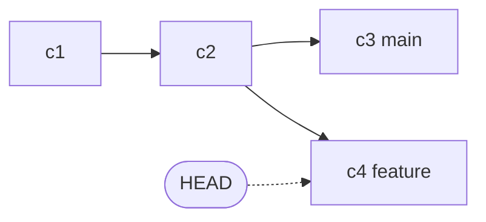
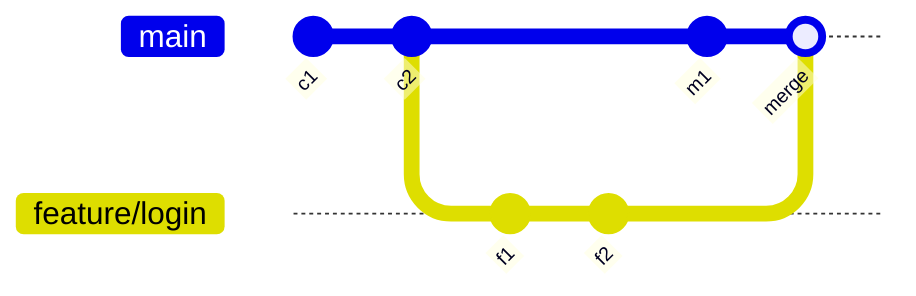

import { Section, Box, Steps, Step, Recap, CardGrid, Card, Chip, Hero, Compare, Figure } from "@components";
import GitCommitDagFig01 from "@figures/GitCommitDagFig01.astro";

<Hero eyebrow="Chapter 03 &middot; Git" title="Branching, Merge<br />&amp; <em>Konflik</em>" sub="Bekerja paralel lalu menyatukannya dengan aman">
  <p>Kekuatan sejati Git muncul saat banyak orang bekerja sekaligus tanpa saling menimpa. Chapter ini adalah satu busur utuh: memisah jalur dengan branch, menyatukannya dengan merge, lalu menyelesaikan konflik yang muncul saat dua jalur bertabrakan.</p>
  <Fragment slot="meta">
    <Chip icon="git">Branch &amp; <b>merge</b></Chip>
    <Chip icon="shield">Resolusi <b>konflik</b></Chip>
    <Chip icon="clock">~22 menit baca</Chip>
  </Fragment>
</Hero>

Sampai Chapter 2, history kita satu garis lurus. Tapi tim nyata tidak bekerja berbaris satu per satu, mereka menggarap beberapa fitur sekaligus. Chapter ini menutup busur "bekerja paralel lalu menyatukan": branch membuka jalur terpisah, merge menjahitnya kembali, dan ketika dua jalur menyentuh baris yang sama, konflik adalah momen Git memintamu memutuskan. Tiga section ini sengaja berurutan karena konflik hanya masuk akal setelah kamu paham bagaimana branch dan merge bekerja.

<Section num="01" id="branch" title="Branch: Ruang Kerja Paralel" sub="Branch adalah pointer ringan ke commit">

<p class="lead">Branch bukan salinan kode, melainkan pointer ringan yang menunjuk ke satu commit, dan itulah kenapa Git memberanikan kita membuatnya sesering apa pun.</p>

Di Chapter 2 kita melihat histori sebagai rantai commit yang saling menunjuk ke parent-nya. Branch adalah lapisan di atas rantai itu: sebuah nama yang menyimpan **satu hash commit**. Tidak ada folder baru, tidak ada penggandaan file. Saat kamu menjalankan `git branch feature/login`, Git hanya menulis satu baris berisi hash ke dalam `.git/refs/heads/`. Itu sebabnya membuat branch terasa instan, bahkan pada repo dengan ratusan ribu commit.

Yang membuat branch terasa "hidup" adalah `HEAD`. HEAD adalah pointer ke branch yang sedang aktif, bukan langsung ke commit. Saat kamu commit, Git menambah commit baru lalu menggeser pointer branch yang ditunjuk HEAD untuk menunjuk commit baru itu. Branch lain tidak bergerak. Inilah mekanisme isolasi: pekerjaan di `feature/login` tidak menyentuh `main` sampai kamu memutuskan menggabungkannya.



<p class="fig-cap"><b>Branch sebagai pointer.</b> main menunjuk c3, feature menunjuk c4, dan HEAD menandai feature sebagai branch aktif.</p>

<Figure><GitCommitDagFig01 /><Fragment slot="caption"><b>Branch sebagai pointer.</b> main dan feature menunjuk commit berbeda; HEAD menandai branch aktif.</Fragment></Figure>

Di proyek skincare-backend, alur ini sangat praktis. Misalnya `main` memuat kode yang sudah jalan di produksi, sementara kamu sedang menggarap endpoint checkout. Kamu buat branch `feature/checkout`, bekerja bebas di sana, dan `main` tetap utuh siap dirilis kapan saja tanpa terkontaminasi kode setengah jadi.

<Box variant="analogy" icon="🌿" label="Analogi: cabang sungai"><p>Branch seperti cabang sungai yang memisah dari aliran utama, mengalir sendiri sebentar, lalu nanti bisa bertemu kembali ke aliran induk lewat merge.</p></Box>

Karena branch sangat murah, tim mengandalkan **konvensi penamaan** agar jalur kerja tetap terbaca. Nama branch yang konsisten membuat `git branch` dan daftar PR di hosting langsung bercerita tentang jenis pekerjaannya.

<CardGrid cols={3}>
<Card><h4>feature/&lt;ringkas&gt;</h4><p>Fitur baru, mis. <code>feature/checkout</code>. Lahir dari main, hidup pendek.</p></Card>
<Card><h4>fix/&lt;gejala&gt;</h4><p>Perbaikan bug, mis. <code>fix/negative-price</code>. Fokus satu masalah.</p></Card>
<Card><h4>hotfix/&lt;versi&gt;</h4><p>Patch darurat dari tag rilis, mis. <code>hotfix/1.2.1</code>. Dibahas di Chapter 6.</p></Card>
</CardGrid>

Untuk berpindah branch, perintah modern adalah `git switch`. Versi lama memakai `git checkout` yang memikul peran ganda (pindah branch sekaligus memulihkan file), sehingga Git memisahnya menjadi `git switch` dan `git restore`. `git checkout` masih ada dan berfungsi, tapi untuk berpindah branch sebaiknya pakai `git switch` agar niat kode lebih jelas.

```bash title="Terminal"
# membuat dan langsung pindah ke branch baru
git switch -c feature/login
# ... edit file, lalu:
git add .
git commit -m "feat: tambah handler login"

# kembali ke main; commit feature/login tidak terbawa ke sini
git switch main
git log --oneline   # commit login tidak terlihat di main
```

<p><code>git switch -c feature/login</code> setara dengan <code>git branch feature/login</code> lalu <code>git switch feature/login</code> dalam satu langkah, jadi kamu langsung berada di ruang kerja baru.</p>

<Box variant="bridge" icon="🌉" label="Jembatan: dari menyalin folder ke branch"><p>Kebiasaan menyalin folder project jadi project-eksperimen lalu bingung mana yang terbaru, digantikan branch resmi: satu repo, banyak garis kerja, dan Git yang menjaga mana yang aktif.</p></Box>

<Box variant="note" icon="📝" label="Branch itu sangat murah"><p>Sebuah ref branch hanya menyimpan satu hash (sekitar 41 byte di disk), jadi jangan ragu membuat branch untuk tiap fitur, percobaan, atau perbaikan kecil. Sebagai imbalannya, jaga umurnya pendek, makin lama branch hidup, makin besar jurang dengan main dan makin sering konflik.</p></Box>

</Section>

<Section num="02" id="merge" title="Merge: Menggabungkan Branch" sub="Fast-forward versus three-way merge">

<p class="lead">Merge adalah cara Git menyatukan pekerjaan dari satu branch ke branch lain, dan hasilnya bergantung pada apakah base sudah bergerak sejak branch dibuat.</p>

Setelah pekerjaan di `feature/login` selesai dan teruji, kamu ingin perubahannya masuk ke `main`. Caranya: pindah ke branch tujuan, lalu jalankan `git merge`. Git punya dua strategi yang dipilih otomatis tergantung bentuk histori, dan memahami keduanya membuat histori proyekmu lebih mudah dibaca.

Kasus pertama adalah **fast-forward**. Ini terjadi bila `main` tidak menerima commit baru sejak `feature/login` dipisah, sehingga commit `main` masih merupakan leluhur (ancestor) dari ujung feature. Karena tidak ada yang perlu didamaikan, Git cukup menggeser pointer `main` maju ke commit terakhir feature. Tidak ada commit baru yang dibuat; histori tetap satu garis lurus.

Kasus kedua adalah **three-way merge**. Ini terjadi bila kedua branch sama-sama maju: ada commit baru di `main` dan ada commit baru di feature. Git tidak bisa sekadar menggeser pointer karena keduanya menyimpang. Git mengambil tiga titik (ujung kedua branch dan commit leluhur bersama), menggabungkannya, lalu membuat **merge commit** yang istimewa karena punya **dua parent**.



<p class="fig-cap"><b>Three-way merge.</b> Karena main maju dengan m1 dan feature dengan f1, f2, Git membuat merge commit berisi dua parent.</p>

<Box variant="analogy" icon="📄" label="Analogi: menggabungkan dua revisi dokumen"><p>Bayangkan dua orang mengedit salinan dokumen yang sama dari titik awal yang identik. Three-way merge adalah proses menyatukan kedua revisi dengan melihat naskah asli sebagai acuan, bukan menimpa salah satunya.</p></Box>

```bash title="Terminal"
# pindah ke branch tujuan dulu
git switch main

# fast-forward bila main belum bergerak sejak feature dibuat
git merge feature/login
# Updating a1b2c3d..e4f5g6h
# Fast-forward

# memaksa merge commit walau sebenarnya bisa fast-forward
git merge --no-ff feature/login
```

Kapan memilih `--no-ff`? Flag ini memaksa Git membuat merge commit meski fast-forward sebenarnya mungkin. Banyak tim memakai ini agar serangkaian commit satu fitur tetap tampak sebagai satu gugus di histori.

<Compare aLabel="Fast-forward (default)" bLabel="--no-ff (merge commit dipaksa)" aTone="muted" bTone="blue">
  <Fragment slot="a"><ul><li>Tanpa merge commit, histori tetap lurus.</li><li>Asal feature tidak menonjol sebagai grup.</li><li>Cocok untuk perbaikan kecil satu commit.</li></ul></Fragment>
  <Fragment slot="b"><ul><li>Selalu membuat merge commit penanda fitur.</li><li><code>git log --graph</code> menunjukkan gugus commit per fitur.</li><li>Banyak tim memakainya saat merge feature ke main.</li></ul></Fragment>
</Compare>

<Box variant="tip" icon="💡" label="--no-ff menjaga jejak feature"><p>Pakai <code>git merge --no-ff</code> untuk feature branch agar grup commit-nya tetap tampak utuh di histori; <code>git log --oneline --graph</code> akan menunjukkan struktur cabangnya dengan jelas.</p></Box>

<Box variant="note" icon="📝" label="Merge bisa memicu konflik"><p>Saat kedua sisi mengubah baris yang sama, three-way merge tidak bisa otomatis dan Git menandainya sebagai conflict. Cara membaca dan menyelesaikannya dibahas tuntas di section berikut.</p></Box>

</Section>

<Section num="03" id="conflict" title="Merge Conflict" sub="Saat Git tidak bisa menggabungkan otomatis">

<p class="lead">Merge conflict bukan tanda ada yang rusak, melainkan momen Git jujur bahwa ia tidak punya cukup informasi untuk memilih gabungan yang benar, dan menyerahkan keputusan itu kepadamu.</p>

Konflik muncul ketika dua branch mengubah **baris yang sama** pada file yang sama, atau satu sisi mengubah file sementara sisi lain menghapusnya. Untuk perubahan yang menyentuh baris berbeda, Git menggabungkan otomatis tanpa kamu sadari. Hanya saat dua sisi bertabrakan di baris yang persis sama, Git berhenti, menandai file, dan meminta penyelesaian manual.

<Box variant="bridge" icon="🌉" label="Jembatan: dua orang mengedit paragraf yang sama"><p>Sama seperti dua rekan yang menulis ulang paragraf yang identik di dokumen bersama lalu harus menentukan versi final, dua branch yang mengubah baris yang sama memaksamu memilih atau memadukan keduanya secara sadar.</p></Box>

Saat konflik terjadi, Git menyisipkan **conflict marker** ke dalam file. Ada tiga penanda: kepala `<<<<<<<` menandai awal versi branch saat ini (current), pemisah `=======` membatasi kedua versi, dan ekor `>>>>>>>` menutup versi yang masuk (incoming). Tugasmu mengganti seluruh blok bertanda ini dengan versi final yang benar.

```text title="internal/order/service.go (saat konflik)"
func calcTotal(items []Item) int64 {
<<<<<<< HEAD
	var total PriceRupiah
	for _, it := range items {
		total += it.Price * int64(it.Qty)
	}
=======
	var total int64
	for _, it := range items {
		total += it.Subtotal
	}
>>>>>>> feature/discount
	return int64(total)
}
```

Setelah membaca kedua sisi, kamu menulis ulang blok itu menjadi satu versi yang menggabungkan maksud keduanya, lalu menghapus semua marker. Hasil resolusi bisa berupa gabungan ide dari kedua branch, bukan sekadar memilih salah satu mentah-mentah.

```text title="internal/order/service.go (setelah resolve)"
func calcTotal(items []Item) PriceRupiah {
	var total PriceRupiah
	for _, it := range items {
		total += it.Price*int64(it.Qty) - it.Discount
	}
	return total
}
```

Begitu file beres, kamu menandainya selesai dengan `git add <file>`, lalu menuntaskan merge dengan `git commit`. Bila ternyata situasinya terlalu rumit dan kamu ingin mundur, `git merge --abort` mengembalikan working tree ke kondisi sebelum merge dimulai, seolah merge tak pernah terjadi.

<Steps>
<Step><b>Buat konflik sengaja</b><p>Di main ubah satu baris fungsi, commit. Buat branch dari commit sebelumnya, ubah baris yang sama secara berbeda, commit juga.</p></Step>
<Step><b>Coba merge</b><p>Kembali ke main lalu jalankan <code>git merge nama-branch</code>; Git melaporkan CONFLICT dan menyisipkan marker ke file.</p></Step>
<Step><b>Baca kedua sisi</b><p>Buka file, pahami current (HEAD) dan incoming, lalu tulis ulang blok menjadi versi final tanpa menyisakan marker.</p></Step>
<Step><b>Tandai selesai</b><p>Jalankan <code>git add file</code> untuk menyatakan konflik teratasi, lalu <code>git commit</code> untuk membuat merge commit.</p></Step>
<Step><b>Verifikasi</b><p>Jalankan test dan build (<code>go test ./...</code>) untuk memastikan hasil gabungan benar-benar berjalan, bukan hanya bebas marker.</p></Step>
</Steps>

<Box variant="warn" icon="⚠️" label="Jangan asal pilih satu sisi"><p>Memilih satu sisi tanpa membaca konteks bisa membuang logika penting dari branch lain. Selalu baca kedua versi, dan setelah resolve jalankan test, karena file yang lolos kompilasi belum tentu benar secara logika.</p></Box>

<Box variant="tip" icon="💡" label="Kurangi konflik dengan integrasi sering"><p>Cara paling ampuh menghindari konflik besar bukan jago resolve, melainkan jarang menumpuknya: tarik perubahan main ke branch-mu secara rutin dan jaga branch tetap pendek. Konflik kecil yang sering jauh lebih murah daripada satu konflik raksasa di akhir.</p></Box>

</Section>

<Section num="04" id="ringkasan" title="Ringkasan" sub="Dari satu garis lurus ke kerja paralel yang aman">

<p class="lead">Branch, merge, dan konflik adalah satu busur: memisah jalur, menyatukannya, dan menengahi saat keduanya bertabrakan.</p>

Kamu kini bisa bekerja paralel tanpa takut. Branch adalah pointer murah yang mengisolasi pekerjaan, jaga umurnya pendek dan namai dengan konvensi. Merge menyatukannya, fast-forward saat linear, merge commit saat menyimpang, dengan `--no-ff` untuk menjaga jejak fitur. Dan konflik bukan kegagalan, melainkan undangan untuk memutuskan dengan membaca kedua sisi lalu memverifikasi dengan test. Sejauh ini semua masih lokal di mesinmu. Di Chapter 4 kita buka pintu ke tim: remote, Pull Request, dan branch protection.

<Recap title="Yang Wajib Menempel">
<ul>
<li>Branch adalah pointer ringan ke satu commit; HEAD menandai branch aktif, isolasi terjadi otomatis.</li>
<li>Pakai <code>git switch</code> untuk berpindah; namai branch dengan konvensi (<code>feature/</code>, <code>fix/</code>) dan jaga umurnya pendek.</li>
<li>Fast-forward saat main belum bergerak; three-way merge membuat merge commit dua parent saat menyimpang.</li>
<li><code>--no-ff</code> menjaga gugus commit fitur tetap terlihat di histori.</li>
<li>Konflik diselesaikan dengan membaca kedua sisi, menghapus marker, lalu <code>git add</code> + test; <code>git merge --abort</code> untuk mundur.</li>
</ul>
</Recap>

</Section>
