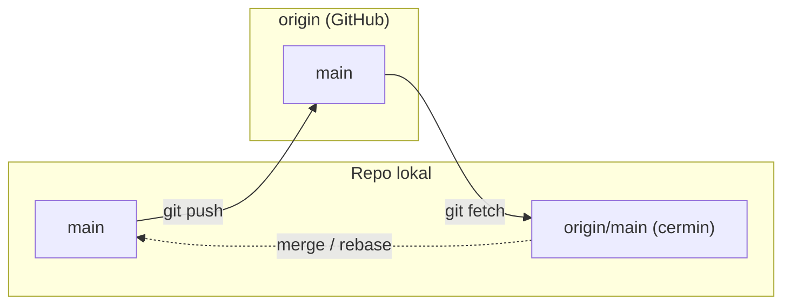
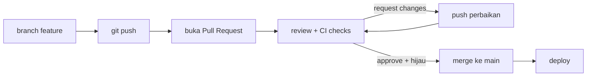

import { Section, Box, Steps, Step, Recap, CardGrid, Card, Chip, Hero, Compare } from "@components";

<Hero eyebrow="Chapter 04 &middot; Git" title="Kolaborasi: Remote,<br />PR &amp; <em>Proteksi</em>" sub="Dari folder lokal ke workspace tim yang terjaga">
  <p>Tiga chapter pertama hidup sepenuhnya di laptopmu. Chapter ini membuka pintu ke tim: menyinkronkan lewat remote, meninjau lewat Pull Request, dan memagari main agar tidak ada yang menyelinap tanpa review dan CI.</p>
  <Fragment slot="meta">
    <Chip icon="server">Remote &amp; <b>upstream</b></Chip>
    <Chip icon="check">PR, review, <b>CI</b></Chip>
    <Chip icon="clock">~24 menit baca</Chip>
  </Fragment>
</Hero>

Semua yang kamu kuasai sejauh ini, commit, branch, merge, terjadi di repo lokal. Chapter ini adalah satu busur "dari pribadi ke bersama": **remote** menghubungkan repomu ke tim, **Pull Request** menjadikannya tempat review dan pengujian, dan **branch protection** memastikan aturan main itu ditegakkan, bukan sekadar disepakati lisan. Ketiganya berurutan, sebab PR tak berarti tanpa remote, dan proteksi tak berarti tanpa PR.

<Section num="01" id="remote" title="Remote: Fetch, Pull, Push, Upstream" sub="Menghubungkan repo lokal dengan workspace tim">

<p class="lead">Sampai sini Git masih sepenuhnya lokal, hidup di folder `.git` di laptopmu sendiri. Remote adalah pintu keluarnya ke tim.</p>

Sebuah **remote** hanyalah repo Git lain yang bisa kamu ajak bertukar commit lewat jaringan, entah itu GitHub, GitLab, atau server internal kantor. Repo lokalmu menyimpan daftar remote beserta URL-nya, dan menurut konvensi remote utama bernama `origin`. Lihat daftarnya dengan `git remote -v` (flag `-v` menampilkan URL fetch dan push). Yang penting dipahami, Git itu *terdistribusi*: setiap klona membawa salinan riwayat penuh, dan `origin` bukan "pusat ajaib", ia cuma satu repo yang kebetulan disepakati tim sebagai titik temu bersama.

<Box variant="analogy" icon="🔄" label="Analogi: dua brankas yang saling sinkron"><p>Repo lokal dan remote ibarat dua brankas berisi catatan yang sama. Fetch menyalin halaman baru dari brankas tim ke brankasmu, push menitipkan halamanmu ke brankas tim. Tidak ada yang otomatis menimpa, kamu yang memilih kapan dan apa.</p></Box>

Saat kamu menghubungkan ke remote, Git membuat **remote-tracking branch** seperti `origin/main`. Ini adalah cermin lokal dari posisi `main` di remote pada saat terakhir kamu berkomunikasi dengannya. Penting: `origin/main` tidak diperbarui sendiri, ia hanya bergerak ketika kamu menjalankan `fetch` atau `pull`. Jadi `main` (branch kerjamu) dan `origin/main` (cermin remote) bisa berbeda, dan justru selisih itulah yang ingin kamu pahami sebelum menggabungkan.



<p class="fig-cap"><b>Fetch lalu push.</b> Fetch memperbarui cermin `origin/main`, push mengirim commit lokal ke remote. Penggabungan ke `main` lokal adalah langkah terpisah yang kamu kendalikan.</p>

Di sinilah `git fetch` dan `git pull` berbeda secara fundamental.

<Compare aLabel="git fetch" bLabel="git pull" aTone="teal" bTone="blue">
  <Fragment slot="a"><ul><li>Mengunduh commit baru dan menggerakkan <code>origin/main</code>.</li><li><b>Tidak menyentuh</b> branch aktif atau working tree.</li><li>Memberi jeda untuk melihat selisih sebelum menggabung.</li></ul></Fragment>
  <Fragment slot="b"><ul><li><code>fetch</code> lalu langsung mengintegrasikan ke branch aktif.</li><li>Default lewat <code>merge</code> (atau <code>rebase</code> dengan <code>--rebase</code>).</li><li>Menggabungkan tanpa jeda, lebih cepat tapi lebih mengejutkan.</li></ul></Fragment>
</Compare>

<Box variant="tip" icon="💡" label="Fetch dulu, baru putuskan"><p>Biasakan `git fetch` lalu `git log --oneline main..origin/main` untuk melihat commit apa yang akan masuk sebelum menggabungkannya. Kamu tidak pernah dikejutkan oleh perubahan yang tiba-tiba sudah ter-merge.</p></Box>

Untuk push pertama kali sebuah branch, gunakan `git push -u origin main`. Flag `-u` (singkatan `--set-upstream`) menetapkan **upstream**: relasi tetap antara branch lokalmu dan `origin/main`. Setelah upstream tersetel, `git push`, `git pull`, dan `git status` tahu lawan bicaranya tanpa kamu sebutkan lagi, dan `git status` bahkan akan memberitahu "your branch is ahead of origin/main by 2 commits".

```bash title="Terminal"
# hubungkan repo lokal ke remote dan dorong main pertama kali
git remote add origin git@github.com:kamu/skincare-backend.git
git remote -v
git push -u origin main

# lihat update tim tanpa mengubah branch aktif, lalu bandingkan
git fetch origin
git log --oneline main..origin/main      # commit yang ada di remote, belum di lokal
git status                                # ahead/behind terhadap upstream
```

Lalu ada momen yang pasti kamu temui: **push ditolak** dengan pesan `! [rejected] ... (non-fast-forward)`. Artinya remote sudah punya commit yang belum ada di repo lokalmu (rekan setim mendorong duluan), sehingga push-mu akan menghapus jejak mereka. Git menolak demi keselamatan. Penyelesaiannya bukan memaksa, melainkan menarik dulu pekerjaan mereka, menumpuk commit-mu di atasnya, baru mendorong lagi.

<Box variant="warn" icon="⚠️" label="Push ditolak? Jangan paksa"><p>Hindari `git push --force` ke branch bersama, ia menghapus commit rekanmu. Jalankan `git pull --rebase` untuk menumpuk commit-mu di atas milik mereka, selesaikan konflik bila ada, lalu `git push`. Bila benar-benar perlu memaksa, pakai `--force-with-lease` yang membatalkan diri bila remote berubah di luar dugaan.</p></Box>

<Box variant="bridge" icon="🌉" label="Jembatan: dari folder lokal ke workspace bersama"><p>Seperti memindahkan proyek dari folder di laptop ke workspace tim yang dipakai bersama, remote mengubah riwayatmu dari catatan pribadi menjadi sumber yang bisa ditarik, ditinjau, dan dilanjutkan siapa pun di tim.</p></Box>

</Section>

<Section num="02" id="pull-request" title="Pull Request dan Code Review" sub="Tempat review, CI, dan keputusan merge">

<p class="lead">Mendorong branch ke remote baru setengah cerita, pull request adalah tempat branch itu ditinjau, diuji, dan diputuskan layak masuk `main`.</p>

**Pull request** (PR di GitHub) atau **merge request** (MR di GitLab) adalah usulan formal untuk menggabungkan branch-mu ke branch target. Ia jauh lebih dari tombol merge: PR menyatukan judul yang jelas, deskripsi yang menjelaskan *kenapa* perubahan ini ada, reviewer yang ditunjuk, status check dari CI, dan keputusan approval. Inti reviewnya berbasis **diff**, jadi reviewer membaca selisih baris demi baris, bukan menjalankan seluruh aplikasi di kepala mereka. Karena itulah PR menjadi titik kendali mutu sekaligus arsip keputusan: enam bulan kemudian, PR-lah yang menjelaskan mengapa `PriceRupiah` diubah menjadi `int64`.



<p class="fig-cap"><b>Siklus pull request.</b> Branch didorong, PR dibuka, review dan CI berputar sampai hijau dan disetujui, baru merge lalu deploy.</p>

Alur code review yang sehat punya ritme khas, dan empat aksi reviewer ini adalah kosakatanya.

<CardGrid cols={2}>
<Card><h4>Comment</h4><p>Diskusi atau pertanyaan biasa, tidak memblokir merge.</p></Card>
<Card><h4>Suggestion</h4><p>Potongan kode siap-terima sekali klik, mempercepat perbaikan kecil.</p></Card>
<Card><h4>Request changes</h4><p>Memblokir merge sampai catatan diperbaiki, sinyal "belum siap".</p></Card>
<Card><h4>Approve</h4><p>Lampu hijau, perubahan dinilai layak masuk.</p></Card>
</CardGrid>

Sebagai penulis, tanggapi setiap komentar, dorong commit perbaikan ke branch yang sama (PR memperbarui dirinya otomatis), dan tandai percakapan selesai. Yang paling menentukan kualitas review bukan ketajaman reviewer, melainkan **ukuran PR**: diff 60 baris diperiksa teliti dalam sepuluh menit, diff 1.500 baris hanya akan dapat "LGTM" yang sebenarnya berarti "saya menyerah membacanya".

<Box variant="tip" icon="💡" label="PR kecil, review cepat dan tajam"><p>Pecah pekerjaan menjadi PR yang fokus pada satu hal, idealnya di bawah beberapa ratus baris diff. PR kecil mendapat review yang lebih cepat, lebih teliti, dan lebih jarang menyembunyikan bug di antara perubahan yang tidak relevan.</p></Box>

Deskripsi PR yang baik menjawab tiga hal sekaligus: apa yang berubah, kenapa, dan bagaimana cara memverifikasinya. Reviewer yang membaca diff tidak otomatis tahu konteks bisnisnya, jadi deskripsilah yang memberi mereka peta.

```markdown title="PR description"
## Apa
Tambah endpoint POST /v1/products untuk membuat produk skincare.

## Kenapa
Tim katalog perlu menambah SKU baru tanpa akses langsung ke database.
Harga disimpan sebagai PriceRupiah int64 (rupiah penuh, bukan float)
agar bebas galat pembulatan.

## Cara verifikasi
- `go test ./internal/product/...` hijau
- curl contoh ada di komentar pertama
```

<Box variant="note" icon="📝" label="Review menyebarkan pengetahuan"><p>Tujuan utama code review bukan mencari kesalahan, melainkan menyebarkan pemahaman: reviewer belajar bagian kode yang tidak ia tulis, penulis dapat sudut pandang baru, dan tim secara perlahan menyepakati gaya bersama. Kesalahan yang tertangkap hanyalah bonus.</p></Box>

<Box variant="bridge" icon="🌉" label="Jembatan: dari serah-terima ke review diff"><p>Bila dulu kamu menyerahkan kerjaan ke QA atau lead lalu menunggu verdict di tiket, PR memindahkan percakapan itu ke konteks kode itu sendiri. Komentar menempel pada baris yang dibahas, sehingga umpan balik menjadi konkret dan langsung bisa ditindaklanjuti.</p></Box>

</Section>

<Section num="03" id="branch-protection" title="Branch Protection dan CODEOWNERS" sub="Melindungi main dengan review, status check, dan owner">

<p class="lead">PR hanya berarti bila aturannya ditegakkan, branch protection memastikan tidak ada perubahan yang menyelinap ke `main` tanpa review dan CI.</p>

Branch penting seperti `main` adalah sumber kebenaran yang biasanya jadi dasar deploy, jadi ia layak dipagari. GitHub menyediakan dua mekanisme: **branch protection rules** klasik dan **rulesets** modern yang lebih luwes. Rulesets bisa banyak aktif bersamaan, punya status on/off, dan dapat dilihat siapa pun yang punya akses baca; menurut [dokumentasi GitHub tentang rulesets](https://docs.github.com/en/repositories/configuring-branches-and-merges-in-your-repository/managing-rulesets/about-rulesets), aturan-aturan ini "layer with protection rules" sehingga ketika tumpang tindih, yang paling restriktif yang menang. Aturan yang paling sering dipakai: wajib pull request sebelum merge dengan jumlah approval tertentu, wajib status check (CI) lulus, blokir force push, dan larang penghapusan branch.

<Box variant="tip" icon="💡" label="Repo baru? Mulai dari Rulesets"><p>GitHub Repository Rules kini sudah generally available dan menjadi alternatif yang direkomendasikan untuk branch protection klasik. Beda kuncinya: hanya satu branch protection rule klasik yang berlaku pada satu waktu, sedangkan beberapa ruleset bisa berlapis sekaligus dan statusnya bisa dilihat developer biasa, sehingga lebih mudah diaudit. Untuk repo baru, mulai dengan ruleset modern.</p></Box>

Reviewer tidak harus ditunjuk manual setiap kali. File **CODEOWNERS** memetakan path ke pemilik, sehingga GitHub otomatis meminta review dari tim yang tepat begitu PR menyentuh file di area mereka. File ini dicari di `.github/`, root, lalu `docs/`, dan sintaksnya mengikuti pola gitignore diikuti `@username` atau `@org/team-name`. Menurut [dokumentasi GitHub tentang code owners](https://docs.github.com/en/repositories/managing-your-repositorys-settings-and-features/customizing-your-repository/about-code-owners), bila digabung dengan aturan "require review from Code Owners", satu approval dari salah satu owner sudah cukup.

```text title="CODEOWNERS"
# Owner default untuk semua file
*                   @org/maintainers

# Per area: yang paling spesifik menang
/frontend/          @org/team-fe
/backend/           @org/team-be
/infra/             @org/team-infra

# Pola bisa per ekstensi atau direktori dalam
**/*.sql            @org/team-be
```

<Box variant="bridge" icon="🌉" label="Jembatan: dari akses production yang dibatasi"><p>Seperti production yang hanya bisa disentuh lewat pipeline berizin, bukan SSH langsung sembarangan, branch `main` yang dilindungi hanya bisa berubah lewat PR yang lolos review dan CI. Pintunya sama: jalur yang teruji, bukan jalan pintas.</p></Box>

Menyetel proteksi pada `main` hanya beberapa langkah lewat antarmuka GitHub.

<Steps>
<Step><b>Buka Rulesets</b><p>Di repo, masuk Settings &rarr; Rules &rarr; Rulesets, lalu New branch ruleset dan beri nama deskriptif seperti "protect-main".</p></Step>
<Step><b>Target branch main</b><p>Pada Target branches, tambahkan pola yang mencakup `main` (atau "Default branch"), dan set Enforcement status ke Active.</p></Step>
<Step><b>Wajibkan pull request</b><p>Centang "Require a pull request before merging" dan tetapkan minimal jumlah approval, mis. 1, plus "Require review from Code Owners" bila pakai CODEOWNERS.</p></Step>
<Step><b>Wajibkan status check</b><p>Centang "Require status checks to pass" lalu pilih job CI yang harus hijau, mis. build dan `go test`, agar kode rusak tidak bisa di-merge.</p></Step>
<Step><b>Kunci force push dan deletion</b><p>Aktifkan "Block force pushes" dan "Restrict deletions" supaya riwayat `main` tidak bisa ditimpa atau dihapus, lalu simpan ruleset.</p></Step>
</Steps>

<Box variant="warn" icon="⚠️" label="Tanpa proteksi, satu force push bisa menghapus histori"><p>Bila `main` tidak terlindungi, satu `git push --force` yang keliru bisa menimpa dan menghapus commit seluruh tim secara permanen di remote. Block force pushes adalah pagar paling murah dengan dampak paling besar, nyalakan sejak hari pertama.</p></Box>

</Section>

<Section num="04" id="ringkasan" title="Ringkasan" sub="Kualitas tim yang ditegakkan, bukan sekadar disepakati">

<p class="lead">Remote membuka jalur ke tim, PR menjadikannya tempat review, dan branch protection mengubah kebiasaan baik jadi default yang dipaksakan.</p>

Repomu kini bukan catatan pribadi lagi. Remote menyinkronkan kerja lewat fetch, pull, push, dan upstream, dengan kebiasaan "fetch dulu, baru putuskan" dan "jangan force ke branch bersama". Pull Request memindahkan review ke konteks kode, dan PR kecil mendapat review yang tajam. Branch protection serta CODEOWNERS memastikan review dan CI tidak bisa dilewati, dengan ruleset modern sebagai pilihan utama. Di Chapter 5 kita kembali ke kemampuan lokal yang kuat: merapikan sejarah dengan rebase dan membatalkan perubahan dengan aman, justru karena kini kamu tahu mana sejarah yang sudah dibagikan dan tak boleh ditulis ulang.

<Recap title="Yang Wajib Menempel">
<ul>
<li>Remote adalah repo lain (konvensi <code>origin</code>); <code>origin/main</code> cuma cermin yang bergerak saat fetch/pull.</li>
<li><code>fetch</code> aman dan tak menyentuh branch aktif; <code>pull</code> langsung mengintegrasikan. Fetch dulu, baru putuskan.</li>
<li>Push ditolak (non-fast-forward) artinya tarik dulu (<code>pull --rebase</code>); jangan <code>--force</code> ke branch bersama, pakai <code>--force-with-lease</code> bila terpaksa.</li>
<li>PR adalah tempat review berbasis diff, CI, dan arsip keputusan; PR kecil = review tajam.</li>
<li>Branch protection / ruleset + CODEOWNERS menegakkan review dan status check; blokir force push sejak hari pertama.</li>
</ul>
</Recap>

</Section>
