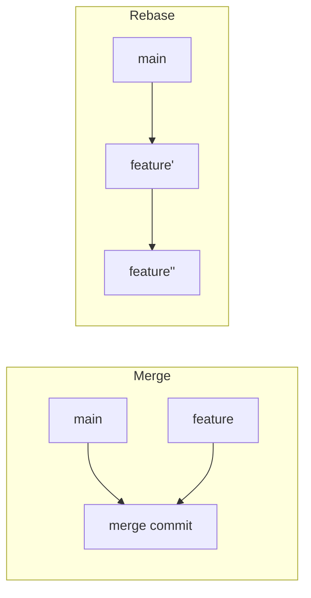
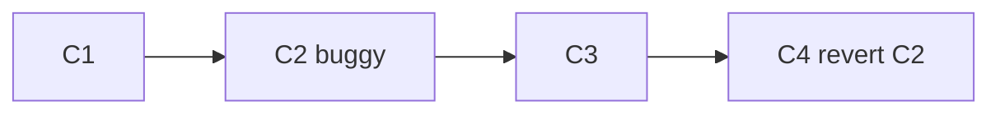

import { Section, Box, Steps, Step, Recap, Chip, Hero, Compare, Figure } from "@components";
import GitRebaseFig01 from "@figures/GitRebaseFig01.astro";
import GitResetModesFig01 from "@figures/GitResetModesFig01.astro";

<Hero eyebrow="Chapter 05 &middot; Git" title="Bedah Sejarah:<br />Rebase &amp; <em>Undo Aman</em>" sub="Merapikan sejarah dan membatalkan tanpa kehilangan data">
  <p>Dua kemampuan yang membuatmu tenang menghadapi history: merapikannya dengan rebase agar enak dibaca, dan membatalkan perubahan dengan alat yang tepat agar tidak ada kerja keras yang hilang.</p>
  <Fragment slot="meta">
    <Chip icon="git">Rebase &amp; <b>interactive</b></Chip>
    <Chip icon="shield">Undo <b>aman</b></Chip>
    <Chip icon="clock">~24 menit baca</Chip>
  </Fragment>
</Hero>

Chapter ini satu busur "bedah sejarah": dua operasi yang sama-sama menyentuh masa lalu repo, tapi dengan tujuan berbeda. **Rebase** menata ulang commit agar history bercerita rapi; **undo** (restore, reset, revert, stash) membatalkan langkah yang keliru. Benang merah keduanya adalah satu aturan emas yang kamu pelajari di Chapter 4: jangan menulis ulang sejarah yang sudah dibagikan. Kuasai itu, dan kamu bisa membongkar-pasang history tanpa takut merusak kerja tim.

<Section num="01" id="rebase" title="Rebase: Merapikan Sejarah" sub="Linear history, merge vs rebase, dan interactive rebase">

<p class="lead">Rebase memindahkan commit branch-mu ke atas base terbaru, menulis ulang sejarah agar menjadi garis lurus yang mudah dibaca.</p>

Saat kamu bekerja di branch `feature/checkout`, branch `main` tidak diam. Rekanmu terus merge fitur lain ke sana. Kalau nanti kamu merge balik, sejarah jadi rumit: garis bercabang, merge commit di mana-mana, dan `git log` terlihat seperti peta kereta bawah tanah. Rebase menawarkan jalan lain: alih-alih menyatukan dua cabang dengan merge commit, ia mengangkat commit-commitmu dan menanamnya ulang satu per satu di atas ujung `main` yang terbaru.

Dokumen GitHub menyebut [rebasing sebagai cara "menulis ulang riwayat commit"](https://docs.github.com/en/get-started/using-git/about-git-rebase), yang membuat riwayat lebih bersih namun harus dipakai dengan hati-hati karena commit lama digantikan oleh commit baru dengan hash berbeda.

```bash title="Terminal"
git switch feature/checkout
git fetch origin
git rebase origin/main
```

<Figure><GitRebaseFig01 /><Fragment slot="caption"><b>Rebase memindahkan basis.</b> Commit feature ditulis ulang di atas main terbaru sehingga histori menjadi linear.</Fragment></Figure>

Secara teknis, `git rebase origin/main` melakukan ini: Git mencari commit nenek moyang bersama antara `feature/checkout` dan `origin/main`, "melepas" tiap commit milikmu sejak titik itu, memindahkan HEAD ke ujung `origin/main`, lalu memutar ulang (replay) commit-commitmu satu demi satu. Karena induknya berubah, setiap commit mendapat hash baru. Isinya sama, identitasnya berbeda. Inilah inti dari "menulis ulang sejarah" yang harus kamu pahami benar sebelum melangkah lebih jauh.

<Box variant="analogy" icon="🧶" label="Analogi: mencabut dan menanam ulang"><p>Bayangkan commit-mu sebagai tanaman di pot. Merge menyambung dua pot dengan selang. Rebase mencabut tanamanmu dan menanamnya ulang di tanah `main` yang baru, seolah ia tumbuh di sana sejak awal.</p></Box>

<h3>Merge versus rebase</h3>

Keduanya menggabungkan kerja dari dua branch, tetapi menghasilkan sejarah yang berbeda secara mendasar. Merge jujur apa adanya: ia menyimpan fakta bahwa dua jalur paralel pernah ada lalu bertemu di satu merge commit. Rebase memilih kerapian: ia berpura-pura kerjamu memang dibangun di atas base terbaru, menghasilkan garis lurus tanpa merge commit.

<div class="tbl-wrap"><table><thead><tr><th>Aspek</th><th>Merge</th><th>Rebase</th></tr></thead><tbody><tr><td>Sejarah</td><td>Bercabang, ada merge commit</td><td>Linear, tanpa merge commit</td></tr><tr><td>Hash commit</td><td>Tetap (tidak berubah)</td><td>Ditulis ulang (hash baru)</td></tr><tr><td>Kejujuran riwayat</td><td>Menyimpan jejak paralel</td><td>Menyembunyikan jejak paralel</td></tr><tr><td>Aman untuk branch shared?</td><td>Ya</td><td>Tidak, jangan</td></tr></tbody></table></div>



<p class="fig-cap"><b>Dua hasil akhir.</b> Merge menyatu di satu titik; rebase memanjang lurus.</p>

<Box variant="warn" icon="⚠️" label="Jangan rebase branch publik"><p>Bila commit sudah di-push dan dipakai orang lain, rebase menulis ulang hash-nya. Saat rekanmu menarik, Git melihat dua sejarah berbeda dan repo mereka kacau dengan commit ganda. Rebase hanya pada commit yang masih lokal dan belum dibagikan. Inilah aturan emas yang menghubungkan chapter ini dengan larangan force push ke branch bersama di Chapter 4.</p></Box>

<Box variant="tip" icon="💡" label="Setel pull.rebase agar history tetap lurus"><p>Banyak tim menyetel <code>git config --global pull.rebase true</code> supaya <code>git pull</code> menumpuk commit lokal di atas perubahan remote alih-alih membuat merge commit "Merge branch main" yang berisik. Tambah <code>git config --global rebase.autoStash true</code> agar Git otomatis memarkir perubahan working tree saat rebase dan mengembalikannya setelah selesai.</p></Box>

<h3>Konflik saat rebase</h3>

Karena rebase memutar ulang commit satu per satu, konflik bisa muncul di commit mana pun di tengah jalan. Saat itu terjadi, rebase berhenti dan menunggu. Pola penyelesaiannya berbeda dari merge: kamu tidak `commit`, melainkan melanjutkan rebase.

<Steps><Step><b>Resolve konflik</b><p>Buka file bertanda, sunting, lalu <code>git add</code> file yang sudah beres.</p></Step><Step><b>Lanjutkan</b><p>Jalankan <code>git rebase --continue</code>, Git memutar commit berikutnya.</p></Step><Step><b>Atau mundur total</b><p>Bila ingin batal, <code>git rebase --abort</code> mengembalikan branch ke kondisi sebelum rebase.</p></Step></Steps>

<h3>Interactive rebase: poles sebelum PR</h3>

Inilah use-case rebase yang paling sering kamu pakai di tim nyata: merapikan branch draft sebelum dibaca reviewer, apalagi di tim yang memakai squash merge. `git rebase -i` membuka editor berisi daftar todo: tiap commit satu baris dengan kata kunci di depannya. Tiga commit "wip", "fix typo", dan "beneran fix" bisa dilebur jadi satu commit bersih yang menceritakan satu perubahan utuh, sehingga history `main` tetap terbaca rapi.

<div class="tbl-wrap"><table><thead><tr><th>Kata kunci</th><th>Arti</th></tr></thead><tbody><tr><td><code>pick</code></td><td>Pakai commit apa adanya</td></tr><tr><td><code>reword</code></td><td>Pakai commit, tapi ubah pesannya</td></tr><tr><td><code>squash</code></td><td>Lebur ke commit di atasnya, gabung kedua pesan</td></tr><tr><td><code>fixup</code></td><td>Lebur ke commit di atasnya, buang pesannya</td></tr><tr><td><code>edit</code></td><td>Berhenti di commit ini untuk diubah</td></tr><tr><td><code>drop</code></td><td>Buang commit sepenuhnya</td></tr></tbody></table></div>

```bash title="Terminal"
git rebase -i HEAD~3
# editor terbuka:
# pick a1b2c3d add product handler
# fixup d4e5f6a fix typo
# fixup 9z8y7x6 wip
# simpan & tutup → tiga commit jadi satu
```

<Box variant="tip" icon="🪄" label="Reorder dengan memindah baris"><p>Mengubah urutan baris di editor todo akan mengubah urutan commit saat replay. Pindahkan commit dokumentasi ke bawah, atau dekatkan fixup ke commit asalnya, lalu simpan.</p></Box>

<Box variant="bridge" icon="🌉" label="Jembatan: seperti menyunting draft"><p>Saat menulis artikel, kamu tidak menerbitkan setiap coretan. Kamu menggabung paragraf, menghapus catatan, lalu publish versi rapi. Interactive rebase adalah penyuntingan akhir itu untuk riwayat commit-mu.</p></Box>

</Section>

<Section num="02" id="undo" title="Reset, Restore, Revert, dan Stash" sub="Membatalkan perubahan dengan aman">

<p class="lead">Git punya beberapa cara membatalkan perubahan, dan salah memilih bisa menghapus kerja keras secara permanen.</p>

Pertanyaan "bagaimana cara undo di Git?" tidak punya satu jawaban, karena tergantung kamu ingin membatalkan apa: perubahan file yang belum di-commit, staging yang keliru, atau commit yang sudah masuk sejarah. Empat perintah menangani kasus yang berbeda, dan memahami batas masing-masing menyelamatkanmu dari kehilangan data.

<h3>git restore: buang perubahan working tree</h3>

`git restore` menangani file yang sudah kamu ubah tapi belum di-commit. Ada dua arah: mengembalikan isi file ke versi terakhir, atau mengeluarkannya dari staging area.

```bash title="Terminal"
git restore internal/product/service.go   # buang edit, kembali ke HEAD
git restore --staged internal/product/service.go   # unstage, edit tetap ada
```

<Box variant="bridge" icon="🌉" label="Jembatan: undo editor vs undo repo"><p>Ctrl+Z di editor membatalkan ketikan terakhir di satu file. <code>git restore</code> bekerja di level snapshot repo, mengembalikan file ke kondisi commit terakhir sekaligus, bahkan setelah editor ditutup.</p></Box>

<h3>git reset: memindahkan HEAD</h3>

`reset` menggeser pointer HEAD ke commit lain, dan tiga modenya menentukan area mana yang ikut berubah. Inilah perintah yang paling sering disalahpahami, dan `--hard` adalah yang paling berbahaya.

<Figure><GitResetModesFig01 /><Fragment slot="caption"><b>Tiga mode reset.</b> --soft, --mixed, dan --hard berbeda pada area mana yang ikut diubah.</Fragment></Figure>

<div class="tbl-wrap"><table><thead><tr><th>Mode</th><th>HEAD</th><th>Index (staging)</th><th>Working tree</th></tr></thead><tbody><tr><td><code>--soft</code></td><td>Pindah</td><td>Tetap (perubahan tetap staged)</td><td>Tetap</td></tr><tr><td><code>--mixed</code> (default)</td><td>Pindah</td><td>Di-reset (unstage)</td><td>Tetap</td></tr><tr><td><code>--hard</code></td><td>Pindah</td><td>Di-reset</td><td>Ditimpa (perubahan hilang)</td></tr></tbody></table></div>

```bash title="Terminal"
git reset --soft HEAD~1    # batalkan commit terakhir, isinya tetap tersimpan & staged
git reset HEAD~1           # (--mixed) batalkan commit, isi jadi unstaged di working tree
git reset --hard HEAD~1    # batalkan commit DAN buang semua perubahannya
```

`--soft` berguna saat kamu ingin menyusun ulang commit terakhir tanpa kehilangan apa pun. `--mixed` mengembalikan perubahan ke working tree untuk dipilah ulang. `--hard` membuang semuanya tanpa ampun.

<Box variant="warn" icon="⚠️" label="git reset --hard membuang permanen"><p>Mode <code>--hard</code> menimpa working tree dan perubahan yang belum di-commit lenyap. Untuk commit yang sempat ada, <code>git reflog</code> masih merekam pergerakan HEAD dan bisa dipakai memulihkan (dibahas di Chapter 7), tapi file yang belum pernah di-commit sama sekali tidak terselamatkan.</p></Box>

<h3>git revert: undo aman untuk sejarah publik</h3>

`reset` cocok untuk commit lokal, tapi berbahaya bila commit sudah di-push. Untuk membatalkan commit yang sudah dibagikan, pakai `git revert`. Alih-alih menghapus, ia membuat commit baru yang isinya kebalikan dari commit target. Sejarah tetap utuh, hash lama tetap ada, dan rekanmu tidak terganggu.



<p class="fig-cap"><b>Revert menambah, bukan menghapus.</b> C4 membalik efek C2 tanpa menyentuh sejarah yang sudah dipush.</p>

```bash title="Terminal"
git revert a1b2c3d   # buat commit baru yang membalik a1b2c3d
```

<Box variant="tip" icon="💡" label="Reset untuk lokal, revert untuk publik"><p>Aturan praktis: commit belum di-push? <code>reset</code> boleh. Commit sudah di-push dan dipakai orang lain? Selalu <code>revert</code>, karena ia tidak menulis ulang sejarah yang sudah dimiliki orang. Ini cerminan aturan emas rebase di section sebelumnya.</p></Box>

<h3>git stash: simpan sementara</h3>

Kadang kamu sedang setengah jalan mengerjakan sesuatu lalu harus pindah branch untuk perbaikan mendesak. `git stash` menyimpan perubahan yang belum di-commit ke tumpukan terpisah, membersihkan working tree, lalu bisa kamu kembalikan nanti.

<Steps><Step><b>Simpan</b><p><code>git stash push -m "wip checkout"</code> menyimpan dan memberi label.</p></Step><Step><b>Pindah & kerjakan</b><p>Working tree bersih, bebas <code>git switch</code> ke branch lain.</p></Step><Step><b>Kembalikan</b><p><code>git stash pop</code> menerapkan lalu menghapus dari tumpukan, atau <code>git stash apply</code> menerapkan tanpa menghapus.</p></Step></Steps>

```bash title="Terminal"
git stash push -m "wip checkout"
git stash list                      # lihat semua stash
git switch hotfix/price-bug
# ... perbaiki, commit ...
git switch feature/checkout
git stash pop                       # lanjutkan kerja sebelumnya
```

</Section>

<Section num="03" id="ringkasan" title="Ringkasan" sub="Membongkar-pasang history tanpa takut">

<p class="lead">Rebase menata sejarah agar rapi, empat alat undo membatalkan langkah keliru, dan satu aturan emas menjaga semuanya tetap aman.</p>

Kamu kini bisa membedah history dengan percaya diri. Rebase memindahkan commit ke base terbaru dan, lewat mode interaktif, melebur draft jadi commit bersih sebelum PR, asal tidak pada sejarah yang sudah dibagikan. Untuk membatalkan, pilih alat sesuai sasaran: `restore` untuk file working tree, `reset` untuk menggeser HEAD (hati-hati `--hard`), `revert` untuk membatalkan commit publik dengan aman, dan `stash` untuk memarkir kerja sementara. Di Chapter 6 kita beralih dari operasi ke konvensi: tag, gitignore, hooks, Conventional Commits, dan workflow tim yang menata semua kemampuan ini untuk banyak orang.

<Recap title="Yang Wajib Menempel">
<ul>
<li><code>git rebase main</code> memindahkan commit branch ke atas base terbaru, hasilnya linear; setiap commit dapat hash baru.</li>
<li>Konflik rebase diselesaikan lalu <code>git rebase --continue</code>, atau batalkan dengan <code>--abort</code>.</li>
<li><b>Aturan emas:</b> jangan rebase (atau reset) commit publik yang sudah dipakai orang lain; pakai <code>revert</code> untuk itu.</li>
<li><code>git rebase -i</code> dengan squash/fixup/reword merapikan draft commit sebelum PR.</li>
<li>Undo: <code>restore</code> (file), <code>reset</code> <code>--soft</code>/<code>--mixed</code>/<code>--hard</code> (geser HEAD), <code>revert</code> (publik aman), <code>stash</code> (parkir sementara).</li>
<li><code>reflog</code> adalah jaring pengaman saat <code>reset --hard</code> tak sengaja, commit jarang benar-benar hilang.</li>
</ul>
</Recap>

</Section>
