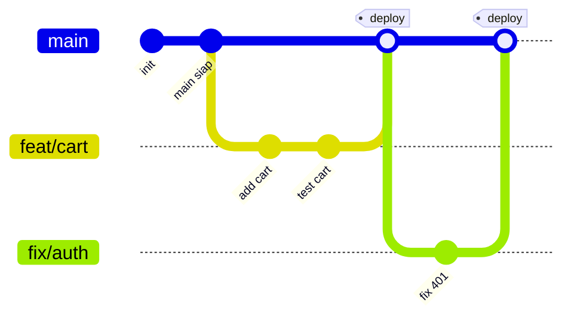
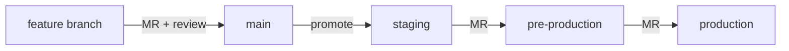
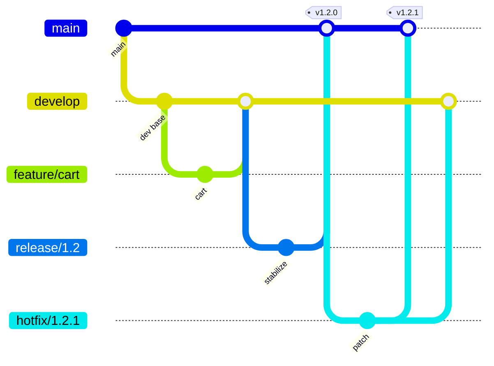

import { Section, Box, Steps, Step, Recap, CardGrid, Card, Chip, Hero, Compare } from "@components";

<Hero eyebrow="Chapter 06 &middot; Git" title="Konvensi, Otomasi<br />&amp; <em>Workflow Tim</em>" sub="Tag, gitignore, hooks, Conventional Commits, dan pola alur tim">
  <p>Perintah Git adalah huruf; konvensi dan workflow adalah kalimatnya. Chapter ini menata semua kemampuan sebelumnya jadi praktik tim: repo yang bersih dan bisa dirilis rapi, lalu pola alur yang cocok dengan ukuran tim dan irama deploy.</p>
  <Fragment slot="meta">
    <Chip icon="package">Tag, hooks, <b>convention</b></Chip>
    <Chip icon="route">Workflow <b>tim</b></Chip>
    <Chip icon="clock">~22 menit baca</Chip>
  </Fragment>
</Hero>

Setelah menguasai operasi inti, dua hal yang membedakan repo amatir dari repo profesional adalah **konvensi** dan **workflow**. Chapter ini satu busur "dari perintah ke kesepakatan": pertama empat alat kebersihan dan otomasi yang membuat repo bisa dirilis rapi, lalu peta workflow tim yang menata kapan branch lahir, ke mana ia merge, dan kapan kode sampai ke pengguna. Keduanya nyambung, konvensi pesan dan tag adalah bahan bakar otomasi rilis yang dipakai workflow.

<Section num="01" id="tag-hooks-conventions" title="Tag, Gitignore, Hooks, Conventional Commits" sub="Release, kebersihan repo, dan automasi pesan">

<p class="lead">Empat alat kebersihan yang membuat repo bisa dirilis dengan rapi dan dijaga tetap bersih tanpa disiplin manual.</p>

Sejauh ini fokus kita pada bagaimana commit mengalir. Section ini melengkapi gambar dengan empat hal di sekelilingnya, menandai titik rilis (tag), menjaga file yang tak layak masuk (`.gitignore`), menjalankan pengecekan otomatis di momen tepat (hooks), dan menyepakati format pesan (Conventional Commits). Keempatnya saling menguatkan, tag dan pesan terstruktur memungkinkan changelog otomatis, hook memaksa pesan itu valid sebelum commit terbentuk.

<h3>Tag: menandai versi rilis</h3>

Tag adalah penanda permanen pada sebuah commit, biasanya untuk versi rilis. Ada dua jenis. Lightweight tag hanya pointer ke commit, seperti branch yang tidak bergerak. Annotated tag adalah objek penuh dengan nama tagger, tanggal, pesan, dan bisa ditandatangani GPG. Untuk rilis publik selalu pakai annotated.

```bash title="Terminal"
git tag -a v1.0.0 -m "Rilis publik pertama skincare-backend"
git tag                       # daftar tag lokal
git show v1.0.0               # lihat objek tag + commit yang ditunjuk
git push origin v1.0.0        # tag tidak ikut push biasa, dorong eksplisit
git push origin --tags        # atau dorong semua tag sekaligus
```

Penomoran versi mengikuti Semantic Versioning, `MAJOR.MINOR.PATCH`. MAJOR naik saat ada perubahan yang memecah kompatibilitas, MINOR saat ada fitur baru yang tetap kompatibel, PATCH saat hanya perbaikan bug. Pemetaan ini bukan kebetulan, ia selaras persis dengan Conventional Commits di bawah.

<Box variant="bridge" icon="🌉" label="Jembatan: dari versi paket ke versi aplikasi"><p>Angka di <code>package.json</code> "version" atau <code>composer.json</code> adalah ide yang sama, tag git menjadikannya titik yang bisa di-checkout, di-rollback, dan dibandingkan kapan saja.</p></Box>

<h3>.gitignore: menjaga repo tetap bersih</h3>

Repo backend tidak perlu menyimpan dependensi, rahasia, atau hasil build. File-file itu besar, berbeda per mesin, atau berbahaya bila bocor. `.gitignore` mendaftar pola yang Git abaikan.

```bash title=".gitignore"
# dependensi & build
node_modules/
/bin/
/tmp/
*.exe

# rahasia (JANGAN pernah commit)
.env
.env.*
!.env.example

# file OS & editor
.DS_Store
Thumbs.db
.idea/
.vscode/
```

Pola membaca seperti ini, `/` di akhir berarti hanya cocok direktori, `/` di awal meng-anchor relatif ke lokasi file `.gitignore`, dan tanpa `/` cocok di level mana pun. Tanda `!` me-re-include file yang tadinya terabaikan, di contoh atas `.env.*` mengabaikan semua varian tapi `.env.example` tetap dilacak agar tim tahu kunci apa yang dibutuhkan. Untuk pola lintas semua proyek (mis. `.DS_Store`), pakai global ignore via `git config --global core.excludesFile ~/.config/git/ignore`.

<Box variant="warn" icon="⚠️" label="Bila .env pernah ter-commit"><p>Menambah <code>.env</code> ke <code>.gitignore</code> tidak menghapus jejaknya dari history, secret-nya tetap ada di commit lama. Rotasi (ganti) semua kredensial yang pernah bocor, lalu bersihkan history. Cara membersihkannya dibahas di Chapter 7.</p></Box>

<h3>Git hooks: automasi di momen tepat</h3>

Hook adalah skrip yang Git jalankan otomatis pada event tertentu. Tiga yang paling berguna di sisi klien, `pre-commit` (sebelum pesan ditulis, untuk lint/format/test cepat), `commit-msg` (validasi format pesan), dan `pre-push` (cek terakhir sebelum objek dikirim ke remote). Bila hook keluar dengan kode non-nol, operasi dibatalkan.

```bash title=".git/hooks/pre-commit"
#!/bin/sh
# format & vet sebelum snapshot commit terbentuk
gofmt -l . | grep . && echo "Jalankan gofmt dulu" && exit 1
go vet ./... || exit 1
exit 0
```

Hook hidup di `.git/hooks/` dan **tidak ikut saat clone**, jadi disiplin tim tidak terjaga sendiri. Karena itu tim memakai manajer hook yang menyimpan konfigurasi di dalam repo dan memasangnya lewat `core.hooksPath`. Tiga pilihan yang dominan, dengan karakter yang berbeda:

<CardGrid cols={3}>
<Card><h4>lefthook</h4><p>Ditulis Go, satu binary tanpa runtime Node. Menjalankan hook paralel, jadi cepat untuk repo besar dan ideal untuk proyek polyglot termasuk Go.</p></Card>
<Card><h4>husky + lint-staged</h4><p>Standar di ekosistem Node/npm: husky memasang hook, lint-staged menjalankan linter hanya pada file yang di-stage. Wajar dipakai bila proyek sudah berbasis Node.</p></Card>
<Card><h4>pre-commit</h4><p>Berbasis Python, punya katalog hook siap pakai paling luas dan isolasi environment, bisa menjalankan hook dalam bahasa yang tidak terpasang di mesin developer.</p></Card>
</CardGrid>

<Box variant="tip" icon="💡" label="Proyek Go polyglot? lefthook dulu"><p>Untuk backend Go (apalagi yang juga punya frontend Node), lefthook sering jadi pilihan terkuat: tanpa dependensi Node, eksekusi paralel, dan konfigurasi tunggal yang ikut ter-commit sehingga semua kontributor memakai hook yang sama. Bila proyek sudah penuh tooling npm, husky + lint-staged tetap pilihan standar yang nyaman.</p></Box>

<Box variant="bridge" icon="🌉" label="Jembatan: dari lint-on-save ke lint-before-commit"><p>Format-on-save di editor hanya menjaga mesinmu. <code>pre-commit</code> hook adalah jaring yang sama tapi di gerbang repo, tak peduli editor atau mesin siapa, commit kotor tidak lolos.</p></Box>

<h3>Conventional Commits: pesan yang bisa diolah mesin</h3>

Conventional Commits 1.0.0 menstandarkan baris pertama pesan menjadi `type(scope): description`. Tipe yang lazim, `feat` (fitur baru), `fix` (perbaikan bug), `docs`, `refactor`, `test`, dan `chore`. Karena formatnya konsisten, alat bisa membaca riwayat untuk menghasilkan changelog dan menentukan versi otomatis.

```text title="Contoh pesan"
feat(cart): tambah endpoint POST /v1/carts/items

Hitung subtotal pakai PriceRupiah int64 agar bebas galat pembulatan.

fix(auth): tolak token kedaluwarsa dengan 401
refactor(order): pisahkan service dari handler
feat(api)!: ubah field harga jadi PriceRupiah, hapus "price_float"

BREAKING CHANGE: respons /v1/products kini memakai price_rupiah.
```

Pemetaan ke SemVer langsung, `fix` menaikkan PATCH, `feat` menaikkan MINOR, dan perubahan yang memecah kompatibilitas (ditandai `!` setelah type atau footer `BREAKING CHANGE:`) menaikkan MAJOR. Tipe lain seperti `docs`, `style`, `build`, `ci`, dan `chore` tidak mengubah versi kecuali memuat BREAKING CHANGE, dan daftar tipe ini distandarkan oleh konfigurasi populer `@commitlint/config-conventional` (berbasis konvensi Angular).

<Box variant="tip" icon="💡" label="Konvensi pesan jadi otomasi rilis"><p>Begitu pesan konsisten, rantai otomasi terbuka: <code>commitlint</code> dengan <code>commit-msg</code> hook menolak pesan yang tidak sesuai format, lalu <code>semantic-release</code> atau <code>release-please</code> membaca riwayat untuk menentukan versi berikutnya, membuat tag, dan menyusun CHANGELOG otomatis. Inilah yang menyambungkan kebiasaan menulis subject imperatif di Chapter 2 dengan rilis tanpa kerja manual.</p></Box>

<Box variant="tip" icon="💡" label="Scope sesuai modul"><p>Pakai scope yang mencerminkan domain proyek, <code>cart</code>, <code>order</code>, <code>auth</code>, <code>product</code>. Saat membaca <code>git log --oneline</code> nanti, scope membuat riwayat bisa dipindai per area tanpa membuka diff.</p></Box>

</Section>

<Section num="02" id="workflows" title="Workflow Tim: GitHub Flow sampai Trunk-Based" sub="GitHub Flow, GitLab Flow, Git Flow, Trunk-Based, plus hotfix">

<p class="lead">Workflow bukan aturan baku, ia cara tim menyepakati bagaimana cabang mengalir dari ide ke produksi.</p>

Semua perintah yang sudah kamu kuasai (branch, merge, PR, rebase) adalah huruf. Workflow adalah kalimatnya, kesepakatan kapan membuat branch, ke mana ia merge, dan kapan kode mencapai pengguna. Tidak ada yang "paling benar", yang ada adalah yang paling cocok dengan ukuran tim dan irama deployment. Mari telusuri dari yang paling sederhana.

<h3>GitHub Flow: sesederhana mungkin</h3>

GitHub Flow hanya punya satu cabang abadi, `main`, yang selalu siap deploy. Setiap pekerjaan lahir sebagai branch pendek dari `main`, dibuka sebagai Pull Request untuk review dan CI, lalu di-merge kembali dan langsung di-deploy. Branch berumur jam atau hari, bukan minggu.



<p class="fig-cap"><b>GitHub Flow.</b> Garis utama lurus, cabang lahir pendek lalu kembali dan langsung dirilis.</p>

<Box variant="bridge" icon="🌉" label="Jembatan: dari task harian ke workflow tim"><p>Satu task di papan kerja (mis. "tambah keranjang") memetakan satu-satu ke satu branch pendek dan satu PR. Workflow tim sebenarnya hanya menumpuk kebiasaan harianmu menjadi konvensi bersama.</p></Box>

<h3>GitLab Flow: menambah environment branch</h3>

Saat deploy tidak instan dan perlu tahap (staging dulu, baru produksi), GitHub Flow kurang. GitLab Flow menambah environment branch. Fitur tetap merge ke `main`, lalu `main` dipromosikan downstream lewat merge request berurutan. Menurut [dokumentasi GitLab](https://docs.gitlab.com/user/project/repository/branches/strategies/), commit hanya mengalir ke hilir setelah teruji di tiap environment.



<p class="fig-cap"><b>GitLab Flow dengan environment branch.</b> Kode hanya bergerak ke kanan, tiap panah adalah gerbang yang sudah lolos uji.</p>

<h3>Git Flow: lengkap tapi berat</h3>

Git Flow memakai banyak cabang berumur panjang, `main` (rilis), `develop` (integrasi), plus `feature/*`, `release/*`, dan `hotfix/*`. Cocok untuk produk dengan rilis berversi terjadwal, tapi sering terlalu berat untuk tim kecil yang deploy harian.



<p class="fig-cap"><b>Git Flow.</b> Dua cabang abadi (main + develop) plus release dan hotfix, perhatikan hotfix di-back-merge ke develop agar perbaikan tidak hilang.</p>

<h3>Trunk-Based dan dua alur khusus</h3>

Trunk-Based Development mendorong integrasi sangat sering ke satu trunk dengan branch berumur sangat pendek (jam, bahkan langsung). Fitur yang belum siap disembunyikan di balik feature flag, bukan ditahan di branch panjang, sehingga konflik besar nyaris tak pernah terjadi. Di luar alur utama, dua pola sering muncul. **Hotfix**, cabang dari tag atau `main` untuk patch darurat, review cepat, tag versi PATCH baru, lalu back-merge agar perbaikan ikut ke cabang pengembangan. **Release branch**, cabang stabilisasi paralel tempat hanya bugfix yang diterima, sementara `main` jalan terus untuk fitur berikutnya, menghasilkan release candidate sebelum tag final.

<Box variant="note" icon="📊" label="Kenapa branch pendek menang"><p>Riset DORA secara konsisten menemukan tim berkinerja elite memakai trunk-based development: branch berumur paling lama satu sampai dua hari. Kuncinya feature flag yang memisahkan deploy dari release, kode tak siap tetap di-merge ke trunk tapi dimatikan flag-nya, sehingga integrasi tetap sering dan konflik besar jarang terjadi.</p></Box>

<Box variant="tip" icon="💡" label="Mulai sederhana"><p>Untuk kebanyakan tim, mulailah dari GitHub Flow atau Trunk-Based. Jangan mengadopsi Git Flow yang kompleks tanpa alasan nyata seperti rilis berversi terjadwal atau dukungan banyak versi sekaligus, kompleksitas itu menambah pajak harian.</p></Box>

<Box variant="note" icon="🧭" label="Hands-on"><p>Latih dua hal, simulasikan satu feature branch dari awal sampai merge ber-PR (GitHub Flow), lalu di papan rancang alur <code>main &rarr; staging &rarr; production</code> untuk skincare-backend dan tentukan gerbang CI apa yang dijaga di tiap promosi.</p></Box>

</Section>

<Section num="03" id="ringkasan" title="Ringkasan" sub="Dari perintah jadi kesepakatan tim">

<p class="lead">Konvensi menjaga repo bersih dan bisa dirilis otomatis; workflow menata alur cabang sesuai ukuran tim.</p>

Kamu kini bisa menata Git untuk dipakai banyak orang. Tag annotated menandai rilis ber-SemVer, `.gitignore` menjaga repo dari file yang tak layak, hooks (lefthook untuk Go polyglot, husky untuk Node, pre-commit untuk katalog luas) menegakkan kualitas di gerbang commit, dan Conventional Commits membuka jalan otomasi changelog plus versi lewat commitlint, semantic-release, atau release-please. Di sisi alur, kamu bisa memilih dari GitHub Flow yang sederhana sampai Trunk-Based yang dipakai tim elite, dengan prinsip mulai sederhana. Chapter 7 menutup course: topik skala dan pemulihan, lalu rangkuman workflow rekomendasi per ukuran tim.

<Recap title="Yang Wajib Menempel">
<ul>
<li>Annotated tag menandai rilis; SemVer <code>MAJOR.MINOR.PATCH</code> selaras dengan Conventional Commits.</li>
<li><code>.gitignore</code> menjaga repo bersih; secret yang pernah ter-commit harus dirotasi, bukan sekadar di-ignore.</li>
<li>Hooks via manajer (lefthook/husky/pre-commit) ikut ter-commit dan dipasang lewat <code>core.hooksPath</code>.</li>
<li>Conventional Commits <code>type(scope): description</code>, <code>feat</code>&rarr;MINOR, <code>fix</code>&rarr;PATCH, <code>!</code>/BREAKING CHANGE&rarr;MAJOR, dan jadi bahan changelog otomatis.</li>
<li>Pilih workflow sesuai tim: GitHub Flow (sederhana), GitLab Flow (environment), Git Flow (rilis terjadwal), Trunk-Based (integrasi sering + feature flag).</li>
</ul>
</Recap>

</Section>
