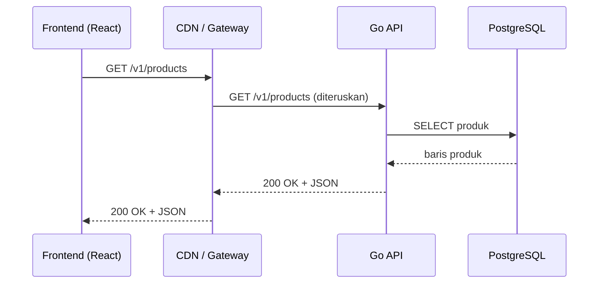
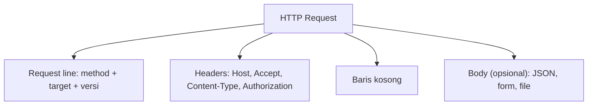
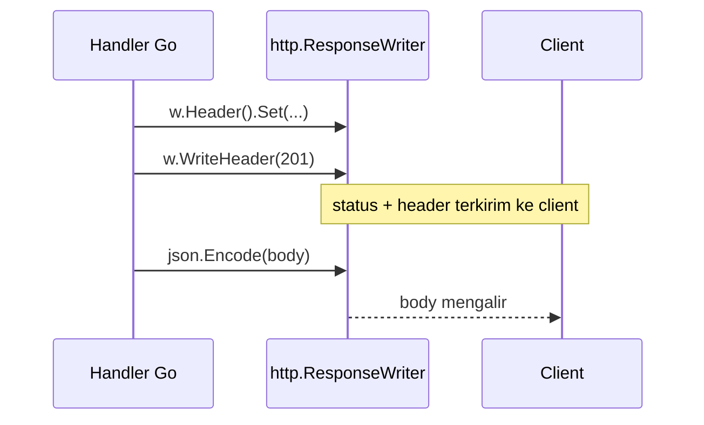
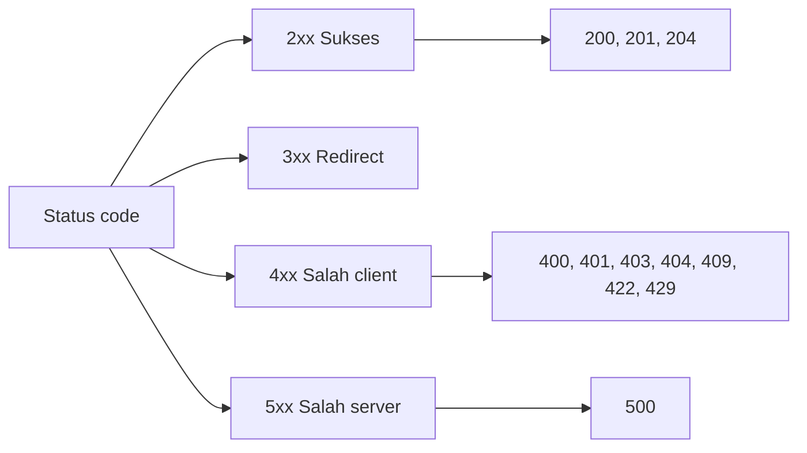
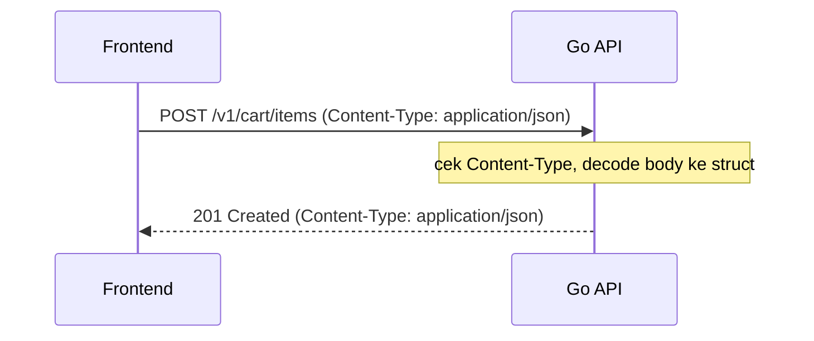
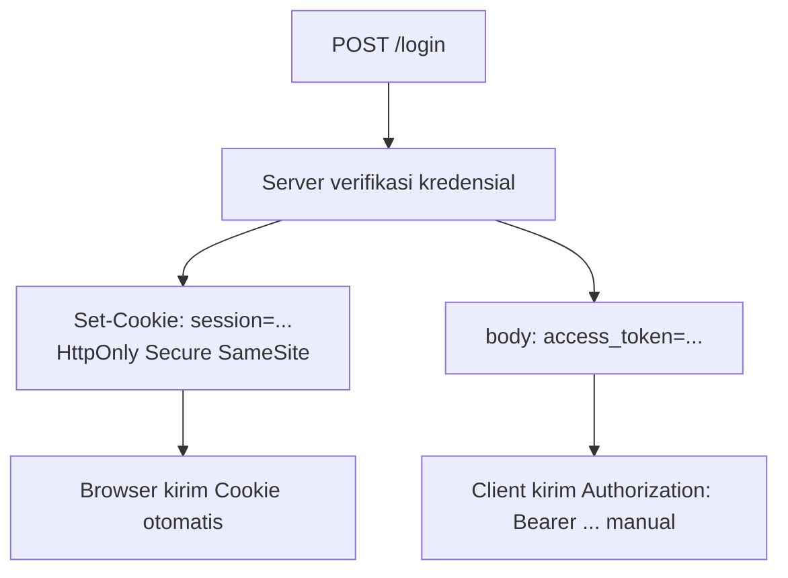
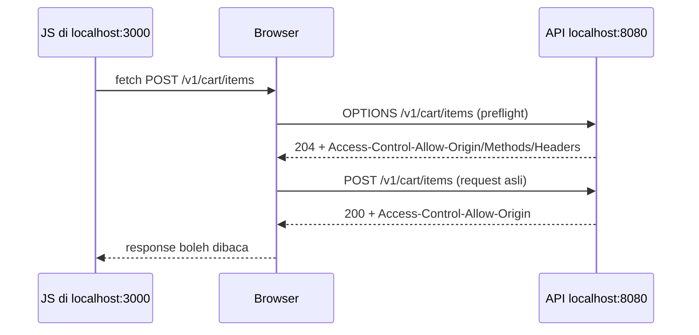
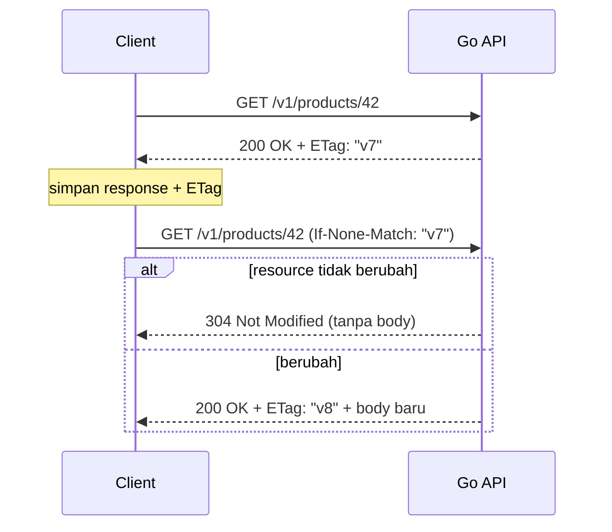
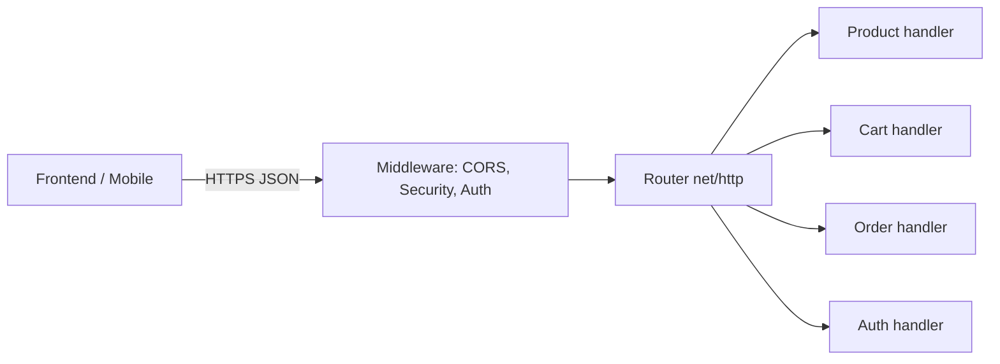
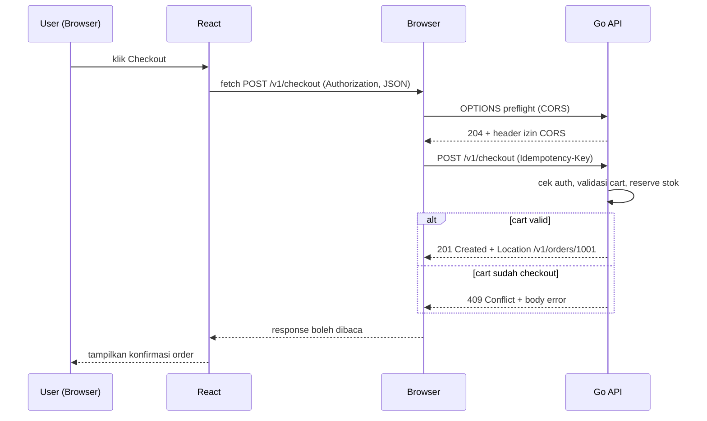

import { Section, Box, Recap, CardGrid, Card, Chip, Hero, Compare, FileTree, Endpoint, Def } from "@components";

<Hero eyebrow="Course &middot; HTTP" title="Belajar <em>HTTP</em><br />Fondasi untuk Backend Developer">
  <p>Sebelum menyentuh router, ORM, atau framework, seorang backend developer perlu paham satu hal lebih dulu: HTTP adalah kontrak komunikasi yang menghubungkan frontend, mobile, gateway, CDN, dan backend kamu.</p>
  <Fragment slot="meta">
    <Chip icon="world">Protokol: <b>HTTP/1.1, 2, 3</b></Chip>
    <Chip icon="code">Contoh: <b>Go net/http</b></Chip>
    <Chip icon="clock">~95 menit baca</Chip>
  </Fragment>
</Hero>

<Section num="01" id="kenapa-http" title="Kenapa Backend Developer Harus Menguasai HTTP" sub="HTTP bukan sekadar pemanggilan fungsi, tetapi pertukaran pesan">

<p class="lead">Saat frontend memanggil `fetch("/v1/products")`, yang sebenarnya terjadi bukan pemanggilan fungsi biasa. Sebuah pesan teks dikirim lewat jaringan, sampai ke server, lalu server membalas dengan pesan teks lain. Pesan-pesan itu adalah HTTP, dan memahami bentuknya adalah fondasi semua pekerjaan backend.</p>

HTTP (HyperText Transfer Protocol) adalah protokol lapisan aplikasi untuk pertukaran data di web. Semantik intinya distandardkan di [RFC 9110](https://www.rfc-editor.org/rfc/rfc9110.html). Banyak developer yang berpindah dari frontend ke backend menganggap API sebagai kotak ajaib: panggil sebuah URL, dapat data. Padahal di baliknya ada protokol dengan aturan ketat soal method, status, header, dan body. Begitu kamu memegang backend, kamu yang menulis sisi server kontrak ini, bukan hanya memakainya.

<Box variant="analogy" icon="📮" label="Analogi: HTTP seperti surat-menyurat formal"><p>Bayangkan request sebagai surat yang kamu kirim ke kantor: ada tujuan (alamat dan jenis layanan), ada kop surat berisi metadata (header), dan ada isi surat (body). Response adalah balasan resmi: ada stempel hasil (status code), kop balasan (header), dan lampiran jawaban (body). Setiap surat berdiri sendiri, tidak ada ingatan otomatis dari surat sebelumnya.</p></Box>

Tiga sifat HTTP yang wajib menempel sejak awal. Pertama, model client-server: satu pihak meminta (client), satu pihak menjawab (server). Kedua, siklus request-response: satu request memicu tepat satu response. Ketiga, stateless: server tidak menyimpan ingatan antar request secara otomatis, jadi tiap request harus membawa sendiri semua yang dibutuhkan (token, identitas, parameter).

<Box variant="warn" icon="⚠️" label="Stateless bukan berarti tanpa state"><p>Stateless artinya protokol-nya tidak mengingat request sebelumnya. State tetap ada, tetapi disimpan eksplisit: di database, di cookie yang dikirim ulang tiap request, atau di token yang dibawa di header. Kalau kamu mengandalkan variabel global di server untuk mengingat siapa yang login, kamu akan kacau begitu ada dua user atau dua instance server.</p></Box>



<p class="fig-cap"><b>Gambar 1.</b> Satu request bisa melewati banyak perantara (CDN, gateway, proxy), tetapi semuanya berbicara dalam bahasa yang sama: HTTP. Tiap perantara membaca dan kadang mengubah pesan yang sama.</p>

Cara tercepat membuat konsep ini nyata adalah mengintip request asli. Di browser, buka DevTools lalu tab Network, klik sebuah request, dan baca panel Headers untuk melihat method, URL, dan header yang dikirim. Di terminal, perintah `curl -v` mencetak request dan response mentah baris demi baris.

```bash title="Terminal"
curl -v https://example.com/
# Baris diawali > adalah request yang dikirim client.
# Baris diawali < adalah response dari server.
```

Di sisi server, sebuah backend HTTP minimal di Go hanya butuh standard library `net/http`. Server di bawah ini menjadi peta untuk semua section berikutnya: kita akan terus kembali ke `http.Request` (sisi baca) dan `http.ResponseWriter` (sisi tulis).

```go title="cmd/api/main.go"
package main

import (
	"fmt"
	"log"
	"net/http"
)

func main() {
	mux := http.NewServeMux()

	// Pola "method path" didukung sejak Go 1.22.
	mux.HandleFunc("GET /healthz", func(w http.ResponseWriter, r *http.Request) {
		fmt.Fprintln(w, "ok")
	})

	log.Println("listening on :8080")
	if err := http.ListenAndServe(":8080", mux); err != nil {
		log.Fatal(err)
	}
}
```

<Box variant="bridge" icon="🌉" label="Jembatan: dari fetch dan route Laravel ke sisi server"><p>Di React kamu menulis `fetch()`; di Laravel kamu mendaftarkan route di `routes/api.php` dan mengembalikan `response()->json()`. Keduanya bekerja di atas HTTP yang sama. Bedanya, sebagai backend developer kamu sekarang berdiri di sisi server: kamu yang menerima `*http.Request` dan menulis ke `http.ResponseWriter`, menentukan sendiri status, header, dan body balasannya.</p></Box>

<Box variant="note" icon="🧭" label="Peta course ini"><p>Section 02 sampai 03 membongkar bentuk request dan response. Section 04 sampai 08 membahas semantik: method, status, header, JSON, dan URL. Section 09 sampai 12 masuk ke auth, CORS, cache, dan keamanan. Section 13 menyatukan semuanya jadi kontrak API nyata, lalu section 14 sampai 15 merangkum topik lanjutan dan langkah berikutnya ke implementasi Go.</p></Box>

</Section>

<Section num="02" id="anatomi-request" title="Anatomi HTTP Request" sub="Method, target, versi, header, dan body dibaca baris demi baris">

<p class="lead">Sebuah HTTP request, kalau dilihat mentah di kabel, hanyalah teks dengan struktur tetap. Begitu kamu bisa membaca strukturnya, tidak ada lagi yang misterius soal apa yang dikirim frontend ke backend.</p>

Request punya empat bagian: request line (method, target, versi), deretan header, satu baris kosong, lalu body opsional. Berikut bentuk mentah sebuah request `POST` yang mengirim JSON.

```http title="Request mentah"
POST /v1/cart/items HTTP/1.1
Host: api.tokoskincare.id
Accept: application/json
Content-Type: application/json
Authorization: Bearer eyJhbGciOi...
Content-Length: 38

{"product_id":42,"qty":2}
```

Baris pertama, `POST /v1/cart/items HTTP/1.1`, adalah request line. `POST` adalah method (niat operasi). `/v1/cart/items` adalah target: path resource, yang bisa diikuti query string. `HTTP/1.1` adalah versi protokol. Sisanya sampai baris kosong adalah header, lalu setelah baris kosong barulah body.

<div class="tbl-wrap">
<table>
<thead>
<tr><th>Header</th><th>Arah</th><th>Fungsi</th></tr>
</thead>
<tbody>
<tr><td><code>Host</code></td><td>request</td><td>Nama host tujuan. Wajib di HTTP/1.1, dipakai server untuk virtual hosting.</td></tr>
<tr><td><code>Accept</code></td><td>request</td><td>Format response yang diharapkan client, misalnya <code>application/json</code>.</td></tr>
<tr><td><code>Content-Type</code></td><td>request</td><td>Format body yang dikirim client. Wajib ada bila request berisi body.</td></tr>
<tr><td><code>Authorization</code></td><td>request</td><td>Kredensial, misalnya <code>Bearer &lt;token&gt;</code> untuk JWT.</td></tr>
<tr><td><code>Content-Length</code></td><td>request</td><td>Panjang body dalam byte, sering diisi otomatis oleh client.</td></tr>
</tbody>
</table>
</div>

Cara membaca bagian-bagian ini secara langsung adalah dengan `curl -v`. Tanda `>` menandai baris request yang dikirim, sehingga kamu bisa mencocokkan tiap bagian dengan teori di atas.

```bash title="Terminal"
curl -v https://api.tokoskincare.id/v1/cart/items \
  -H 'Accept: application/json' \
  -H 'Content-Type: application/json' \
  -H 'Authorization: Bearer TOKEN' \
  -d '{"product_id":42,"qty":2}'
```



<p class="fig-cap"><b>Gambar 2.</b> Empat bagian request. Baris kosong adalah pemisah wajib antara header dan body.</p>

Di sisi server Go, tiap bagian ini muncul sebagai field dari `*http.Request`. Method ada di `r.Method`, target terurai di `r.URL`, dan header ada di `r.Header` (sebuah map case-insensitive yang dibaca dengan `r.Header.Get`).

```go title="internal/cart/handler.go"
func (h *Handler) AddItem(w http.ResponseWriter, r *http.Request) {
	method := r.Method                       // "POST"
	path := r.URL.Path                        // "/v1/cart/items"
	accept := r.Header.Get("Accept")          // "application/json"
	contentType := r.Header.Get("Content-Type")
	authHeader := r.Header.Get("Authorization")

	log.Printf("%s %s accept=%s ct=%s auth_present=%t",
		method, path, accept, contentType, authHeader != "")

	// Body dibaca dari r.Body (sebuah io.ReadCloser), dibahas di section JSON.
}
```

<Box variant="bridge" icon="🌉" label="Jembatan: dari konfig Axios ke request mentah"><p>Di Axios kamu menulis `axios.post(url, data, { headers })`. Library itu menerjemahkan konfigurasi tersebut menjadi request line, header, dan body persis seperti contoh mentah di atas. Sebagai backend developer kamu menerima hasil terjemahannya di `*http.Request`, bukan objek konfigurasi yang nyaman.</p></Box>

<Box variant="warn" icon="⚠️" label="Header bersifat case-insensitive"><p>Nama header tidak peka huruf besar kecil. `Content-Type`, `content-type`, dan `CONTENT-TYPE` adalah header yang sama. `r.Header.Get` di Go sudah menangani ini secara konsisten, jadi jangan membandingkan nama header dengan perbandingan string mentah yang case-sensitive.</p></Box>

</Section>

<Section num="03" id="anatomi-response" title="Anatomi HTTP Response" sub="Status line, header, dan body sebagai jawaban server">

<p class="lead">Kalau request adalah surat permintaan, response adalah balasan resmi. Strukturnya cermin dari request: status line menggantikan request line, lalu header, baris kosong, dan body.</p>

Baris pertama response disebut status line: versi, status code numerik, dan reason phrase. Berikut response sukses untuk pembuatan resource baru.

```http title="Response mentah"
HTTP/1.1 201 Created
Content-Type: application/json
Location: /v1/cart/items/77

{"id":77,"product_id":42,"qty":2}
```

Tidak semua response punya body, dan itu disengaja. `204 No Content` justru benar bila tidak ada data untuk dikembalikan, misalnya setelah `DELETE` yang berhasil. Mengirim body pada `204` melanggar semantik dan membingungkan client.

<div class="tbl-wrap">
<table>
<thead>
<tr><th>Status</th><th>Arti singkat</th><th>Body?</th></tr>
</thead>
<tbody>
<tr><td><code>200 OK</code></td><td>Sukses umum, ada data dikembalikan</td><td>Ya</td></tr>
<tr><td><code>201 Created</code></td><td>Resource baru dibuat</td><td>Biasanya ya, plus header <code>Location</code></td></tr>
<tr><td><code>204 No Content</code></td><td>Sukses tanpa data balik</td><td>Tidak</td></tr>
<tr><td><code>400 Bad Request</code></td><td>Request rusak atau malformed</td><td>Ya, pesan error</td></tr>
<tr><td><code>404 Not Found</code></td><td>Resource tidak ada</td><td>Ya, pesan error</td></tr>
<tr><td><code>500 Internal Server Error</code></td><td>Bug atau kegagalan di server</td><td>Ya, pesan generik</td></tr>
</tbody>
</table>
</div>

Di Go, menulis response punya urutan idiomatik yang tidak boleh dibalik: set header dulu, panggil `WriteHeader(status)`, baru tulis body. Alasannya teknis. Begitu byte pertama body ditulis, status dan header terlanjur terkirim ke client, sehingga perubahan header setelah itu diabaikan diam-diam.

```go title="internal/cart/handler.go"
func (h *Handler) AddItem(w http.ResponseWriter, r *http.Request) {
	item := CartItem{ID: 77, ProductID: 42, Qty: 2}

	// 1. Set semua header lebih dulu.
	w.Header().Set("Content-Type", "application/json")
	w.Header().Set("Location", "/v1/cart/items/77")

	// 2. Tulis status line.
	w.WriteHeader(http.StatusCreated) // 201

	// 3. Baru tulis body.
	_ = json.NewEncoder(w).Encode(item)
}
```



<p class="fig-cap"><b>Gambar 3.</b> Setelah WriteHeader, header tidak bisa diubah lagi. Karena itu set header harus mendahului WriteHeader, dan WriteHeader mendahului penulisan body.</p>

<Box variant="warn" icon="⚠️" label="Jebakan urutan tulis di Go"><p>Memanggil `w.Write` atau `json.Encode` lebih dulu akan otomatis mengirim status `200 OK`. Bila setelah itu kamu memanggil `w.WriteHeader(400)`, Go mencetak peringatan `superfluous WriteHeader call` dan status tetap 200. Akibatnya client menerima 200 padahal kamu bermaksud error. Selalu set header, lalu WriteHeader, lalu body.</p></Box>

<Box variant="bridge" icon="🌉" label="Jembatan: dari response().json() ke ResponseWriter"><p>Di Express `res.status(201).json(data)` dan di Laravel `response()->json($data, 201)` mengurus urutan header lalu body untuk kamu di balik layar. Di Go urutan itu dibuka apa adanya lewat `http.ResponseWriter`, jadi kamu yang bertanggung jawab memanggilnya dalam urutan yang benar.</p></Box>

</Section>

<Section num="04" id="methods-semantics" title="HTTP Methods dan Semantiknya" sub="Method adalah kontrak niat, bukan dekorasi">

<p class="lead">Method memberi tahu server apa niat operasinya terhadap resource. Memilih method yang benar bukan soal selera, melainkan kontrak yang dipahami browser, proxy, CDN, dan client lain.</p>

Method utama dan niatnya: `GET` membaca, `POST` membuat atau memicu aksi, `PUT` mengganti representasi penuh, `PATCH` mengubah sebagian, `DELETE` menghapus, `HEAD` membaca header saja tanpa body, dan `OPTIONS` menanyakan kemampuan resource (dipakai berat oleh preflight CORS di section 10).

Menurut [RFC 9110](https://www.rfc-editor.org/rfc/rfc9110.html) ada tiga sifat kunci yang melekat pada method. Memahami ketiganya mencegah bug yang sulit dilacak, terutama saat ada retry otomatis dari client atau gateway.

<CardGrid cols={3}>
  <Card><h4>Safe (read-only)</h4><p>Tidak mengubah state server. Aman dipanggil berulang tanpa efek samping: GET, HEAD, OPTIONS.</p></Card>
  <Card><h4>Idempotent</h4><p>Memanggil sekali atau berkali-kali memberi efek akhir yang sama: GET, HEAD, OPTIONS, PUT, DELETE.</p></Card>
  <Card><h4>Cacheable</h4><p>Response boleh disimpan dan dipakai ulang. GET dan HEAD cacheable secara default.</p></Card>
</CardGrid>

Tabel berikut adalah peta yang sering ditanyakan saat interview dan, lebih penting, saat mendesain endpoint. Catat anomali pentingnya: PUT idempotent tetapi PATCH dan POST tidak. Semua method safe otomatis idempotent.

<div class="tbl-wrap">
<table>
<thead>
<tr><th>Method</th><th>Safe</th><th>Idempotent</th><th>Cacheable</th><th>Niat tipikal</th></tr>
</thead>
<tbody>
<tr><td><code>GET</code></td><td>Ya</td><td>Ya</td><td>Ya</td><td>Baca daftar atau detail</td></tr>
<tr><td><code>HEAD</code></td><td>Ya</td><td>Ya</td><td>Ya</td><td>Cek keberadaan atau metadata</td></tr>
<tr><td><code>OPTIONS</code></td><td>Ya</td><td>Ya</td><td>Tidak</td><td>Tanya kemampuan, preflight CORS</td></tr>
<tr><td><code>POST</code></td><td>Tidak</td><td>Tidak</td><td>Hanya bila eksplisit</td><td>Buat resource, picu aksi</td></tr>
<tr><td><code>PUT</code></td><td>Tidak</td><td>Ya</td><td>Tidak</td><td>Ganti representasi penuh</td></tr>
<tr><td><code>PATCH</code></td><td>Tidak</td><td>Tidak</td><td>Tidak</td><td>Ubah sebagian field</td></tr>
<tr><td><code>DELETE</code></td><td>Tidak</td><td>Ya</td><td>Tidak</td><td>Hapus resource</td></tr>
</tbody>
</table>
</div>

<Box variant="note" icon="🔁" label="Kenapa idempotency penting di praktik"><p>Jaringan tidak andal. Client atau gateway sering me-retry request yang timeout. Kalau `DELETE /v1/orders/5` dipanggil dua kali karena retry, hasil akhirnya tetap sama: order 5 terhapus, jadi aman. Tetapi `POST /v1/checkout` yang dipanggil dua kali bisa membuat dua order. Karena POST tidak idempotent, operasi seperti checkout butuh perlindungan tambahan, misalnya idempotency key, yang kita singgung di section 14.</p></Box>

Untuk online shop skincare, pemilihan method memetakan langsung ke aksi pengguna. Hindari godaan menjadikan semua endpoint POST hanya karena ada body.

<Endpoint method="GET" path="/v1/products" desc="Baca daftar produk, safe dan cacheable" />
<Endpoint method="GET" path="/v1/products/{id}" desc="Baca detail satu produk" />
<Endpoint method="POST" path="/v1/cart/items" desc="Tambah item ke cart, tidak idempotent" />
<Endpoint method="PATCH" path="/v1/cart/items/{id}" desc="Ubah qty satu item cart" />
<Endpoint method="DELETE" path="/v1/cart/items/{id}" desc="Hapus item dari cart, idempotent" />
<Endpoint method="POST" path="/v1/checkout" desc="Ubah cart jadi order, butuh perlindungan idempotency" />

<Box variant="bridge" icon="🌉" label="Jembatan: dari action controller dan mutation React Query"><p>Di Laravel `Route::apiResource` memetakan controller ke GET/POST/PUT/PATCH/DELETE sesuai konvensi REST. Di React Query, `useQuery` cocok untuk operasi GET (safe, cacheable) sedangkan `useMutation` untuk POST/PUT/PATCH/DELETE. Konvensi keduanya bukan kebetulan, melainkan mengikuti semantik method HTTP yang sama persis seperti tabel di atas.</p></Box>

<Box variant="warn" icon="⚠️" label="Jangan pakai GET untuk operasi yang mengubah state"><p>`GET /v1/cart/clear` adalah jebakan klasik. Karena GET dianggap safe, browser, prefetcher, atau crawler bisa memanggilnya tanpa diminta user, dan cart pengguna ikut terhapus. Operasi yang mengubah state harus memakai POST, PUT, PATCH, atau DELETE.</p></Box>

</Section>

<Section num="05" id="status-codes" title="Status Code untuk API Backend" sub="Memberi tahu client hasil request dengan tepat">

<p class="lead">Status code adalah cara server memberi tahu client kategori hasil dalam satu angka. Frontend membangun seluruh logika UI di atasnya: kapan menampilkan data, kapan validasi, kapan minta login ulang, kapan menampilkan error server.</p>

Angka pertama menentukan kelas: `2xx` sukses, `3xx` redirect, `4xx` kesalahan client, `5xx` kesalahan server. Garis pemisah `4xx` dan `5xx` penting. `4xx` berarti client yang salah (request kurang baik), `5xx` berarti server yang gagal walau request sudah benar.



<p class="fig-cap"><b>Gambar 4.</b> Empat kelas status. API backend menghabiskan sebagian besar waktunya di 2xx dan 4xx; 5xx idealnya jarang dan selalu jadi alarm.</p>

Untuk API, fokus pada himpunan kode yang sering dipakai. Tabel di bawah mengikuti definisi [RFC 9110 Section 15](https://www.rfc-editor.org/rfc/rfc9110.html).

<div class="tbl-wrap">
<table>
<thead>
<tr><th>Kode</th><th>Nama</th><th>Kapan dipakai</th></tr>
</thead>
<tbody>
<tr><td><code>200</code></td><td>OK</td><td>Baca atau update sukses dengan data balik</td></tr>
<tr><td><code>201</code></td><td>Created</td><td>Resource baru dibuat, sertakan header <code>Location</code></td></tr>
<tr><td><code>204</code></td><td>No Content</td><td>Sukses tanpa body, misalnya DELETE</td></tr>
<tr><td><code>400</code></td><td>Bad Request</td><td>Sintaks request rusak, JSON tidak valid, header wajib hilang</td></tr>
<tr><td><code>401</code></td><td>Unauthorized</td><td>Belum terautentikasi atau token tidak valid</td></tr>
<tr><td><code>403</code></td><td>Forbidden</td><td>Sudah login tetapi tidak punya hak akses</td></tr>
<tr><td><code>404</code></td><td>Not Found</td><td>Resource tidak ditemukan</td></tr>
<tr><td><code>409</code></td><td>Conflict</td><td>Konflik state, misalnya slug produk sudah dipakai</td></tr>
<tr><td><code>422</code></td><td>Unprocessable Content</td><td>Sintaks benar tetapi gagal validasi semantik atau aturan bisnis</td></tr>
<tr><td><code>429</code></td><td>Too Many Requests</td><td>Rate limit terlampaui, biasanya dengan <code>Retry-After</code></td></tr>
<tr><td><code>500</code></td><td>Internal Server Error</td><td>Bug atau kegagalan tak terduga di server</td></tr>
</tbody>
</table>
</div>

Perbedaan `400` dan `422` adalah salah satu yang paling sering keliru. `400` untuk sintaks rusak: body bukan JSON valid, atau header wajib hilang. `422` untuk kasus ketika sintaks benar dan server paham payload, tetapi data melanggar aturan, misalnya `qty` bernilai nol atau `email` tidak berformat email. Konvensi API modern memakai `422` untuk error validasi semantik (lihat [MDN 422](https://developer.mozilla.org/en-US/docs/Web/HTTP/Reference/Status/422)).

<Compare aLabel="400 Bad Request" bLabel="422 Unprocessable Content" aTone="red" bTone="violet">
  <Fragment slot="a"><ul><li>Server tidak bisa memahami request: JSON rusak, tipe salah total.</li><li>Body bukan JSON padahal `Content-Type: application/json`.</li><li>Parameter wajib di query atau path hilang.</li></ul></Fragment>
  <Fragment slot="b"><ul><li>Server paham payload, tetapi nilainya melanggar aturan bisnis.</li><li>`qty: 0`, harga negatif, `email` tidak valid.</li><li>Cocok untuk daftar error per field di form frontend.</li></ul></Fragment>
</Compare>

Gunakan `409 Conflict` untuk konflik state yang bukan salah format, misalnya mencoba membuat produk dengan slug yang sudah ada, atau checkout cart yang sudah pernah di-checkout. Untuk konsistensi, susun matriks status per area sebelum menulis kode.

<div class="tbl-wrap">
<table>
<thead>
<tr><th>Area</th><th>Sukses</th><th>Error tipikal</th></tr>
</thead>
<tbody>
<tr><td>Login</td><td><code>200</code> + token</td><td><code>401</code> kredensial salah, <code>429</code> brute force</td></tr>
<tr><td>Detail produk</td><td><code>200</code></td><td><code>404</code> produk tidak ada</td></tr>
<tr><td>Tambah ke cart</td><td><code>201</code> atau <code>200</code></td><td><code>422</code> qty invalid, <code>404</code> produk tidak ada</td></tr>
<tr><td>Checkout</td><td><code>201</code> order</td><td><code>409</code> cart sudah checkout, <code>422</code> stok kurang</td></tr>
</tbody>
</table>
</div>

Di Go, status ditulis lewat konstanta `http.Status...` agar terbaca jelas, bukan angka mentah.

```go title="internal/cart/handler.go"
func (h *Handler) AddItem(w http.ResponseWriter, r *http.Request) {
	var req AddItemRequest
	if err := json.NewDecoder(r.Body).Decode(&req); err != nil {
		writeError(w, http.StatusBadRequest, "body bukan JSON yang valid")
		return
	}
	if req.Qty <= 0 {
		writeError(w, http.StatusUnprocessableEntity, "qty harus lebih dari 0")
		return
	}

	item, err := h.svc.AddItem(r.Context(), req.ProductID, req.Qty)
	if errors.Is(err, ErrProductNotFound) {
		writeError(w, http.StatusNotFound, "produk tidak ditemukan")
		return
	}
	if err != nil {
		writeError(w, http.StatusInternalServerError, "terjadi kesalahan di server")
		return
	}

	writeJSON(w, http.StatusCreated, item)
}
```

<Box variant="bridge" icon="🌉" label="Jembatan: dari try/catch ke status code"><p>Di frontend kamu menulis `if (res.status === 401) redirectToLogin()` atau menangkap error dari `res.ok`. Backend developer berada di sisi yang menetapkan angka itu. Status code yang konsisten dari server membuat logika `try/catch` dan kondisi UI di frontend jadi sederhana dan dapat diprediksi.</p></Box>

<Box variant="warn" icon="⚠️" label="Jangan membalas 200 untuk error"><p>Pola lama membalas `200 OK` dengan body `{"success": false}` untuk semua kondisi, termasuk error. Ini menyulitkan client, caching, dan monitoring karena mereka mengandalkan status code. Pakai kode yang benar: `4xx` untuk salah client, `5xx` untuk salah server.</p></Box>

</Section>

<Section num="06" id="headers-penting" title="Header yang Penting untuk Backend" sub="Metadata yang mengatur format, auth, cache, redirect, dan tracing">

<p class="lead">Header adalah metadata pesan, terpisah dari body. Mereka mengatur banyak hal di luar isi data: format, autentikasi, cache, redirect, dan penelusuran. Salah set sebagian header hanya bikin tidak rapi; salah set sebagian lain bisa membuka celah keamanan.</p>

<div class="tbl-wrap">
<table>
<thead>
<tr><th>Header</th><th>Peran</th><th>Catatan</th></tr>
</thead>
<tbody>
<tr><td><code>Content-Type</code></td><td>Format body</td><td>Wajib bila ada body, misalnya <code>application/json</code></td></tr>
<tr><td><code>Accept</code></td><td>Format response yang diminta client</td><td>Dasar content negotiation</td></tr>
<tr><td><code>Authorization</code></td><td>Kredensial</td><td><code>Bearer &lt;token&gt;</code>, jangan pernah di-log mentah</td></tr>
<tr><td><code>Cache-Control</code></td><td>Aturan cache</td><td><code>public</code> versus <code>private</code>, <code>max-age</code>, <code>no-store</code></td></tr>
<tr><td><code>ETag</code></td><td>Sidik jari versi resource</td><td>Dasar conditional request dan 304</td></tr>
<tr><td><code>Location</code></td><td>Alamat resource baru atau tujuan redirect</td><td>Dipakai pada 201 dan 3xx</td></tr>
<tr><td><code>Set-Cookie</code></td><td>Server menanam cookie di client</td><td>Atur <code>HttpOnly</code>, <code>Secure</code>, <code>SameSite</code></td></tr>
<tr><td><code>X-Request-ID</code></td><td>Penanda unik per request</td><td>Untuk tracing dan korelasi log</td></tr>
</tbody>
</table>
</div>

Tidak semua header setara. Sebagian wajib (request berisi body tanpa `Content-Type` itu ambigu), sebagian opsional, dan sebagian berbahaya bila salah. `Cache-Control` yang salah bisa membuat data privat tersimpan di cache bersama; `Set-Cookie` tanpa `HttpOnly` membuka cookie ke JavaScript dan rawan dicuri.

<Box variant="warn" icon="⚠️" label="Header berbahaya bila salah set"><p>Tiga contoh yang sering jadi masalah: `Cache-Control: public` pada response berisi data privat (cart, profil) bisa membocorkan data ke cache bersama; `Set-Cookie` tanpa `Secure` mengirim cookie lewat HTTP polos; dan `Authorization` yang ikut tercetak di access log membocorkan token. Perlakukan header ini dengan hati-hati.</p></Box>

Lihat header pada dua flow nyata. Pertama, login yang menanam cookie session. Server membalas dengan `Set-Cookie` berisi atribut keamanan.

```http title="Response login"
HTTP/1.1 200 OK
Content-Type: application/json
Set-Cookie: session=abc123; HttpOnly; Secure; SameSite=Lax; Path=/

{"user":{"id":7,"name":"Tika"}}
```

Kedua, pembuatan resource yang mengembalikan `Location` agar client tahu alamat resource baru tanpa menebak.

```go title="internal/order/handler.go"
func (h *Handler) Create(w http.ResponseWriter, r *http.Request) {
	order, err := h.svc.Checkout(r.Context(), customerID(r))
	if err != nil {
		writeError(w, http.StatusInternalServerError, "checkout gagal")
		return
	}

	w.Header().Set("Content-Type", "application/json")
	w.Header().Set("Location", fmt.Sprintf("/v1/orders/%d", order.ID))
	w.WriteHeader(http.StatusCreated)
	_ = json.NewEncoder(w).Encode(order)
}
```

<Box variant="note" icon="🔎" label="X-Request-ID untuk tracing"><p>Header dengan awalan `X-` adalah konvensi non-standar yang banyak dipakai, salah satunya `X-Request-ID`. Idenya: gateway atau middleware menyuntik satu id unik ke tiap request, lalu id itu ikut di setiap baris log dan diteruskan ke service lain. Saat ada laporan bug, kamu cukup mencari satu id untuk merunut seluruh perjalanan request. Kita bahas lebih dalam di section 14.</p></Box>

<Box variant="bridge" icon="🌉" label="Jembatan: dari interceptor Axios ke header asli"><p>Interceptor Axios atau middleware Laravel sering menambah header `Authorization` atau `X-Request-ID` ke setiap request secara otomatis. Yang benar-benar terkirim tetaplah header HTTP biasa. Memahami header level protokol membuatmu tidak bergantung pada abstraksi library saat harus mendebug request yang aneh.</p></Box>

</Section>

<Section num="07" id="json-content-negotiation" title="JSON dan Content Negotiation" sub="Kontrak payload eksplisit antara client dan server">

<p class="lead">Mayoritas API backend modern bertukar data dalam JSON. Tetapi JSON bukan default ajaib; ia harus dinyatakan eksplisit lewat header agar client dan server sepakat soal format.</p>

Dua header mengatur kesepakatan ini. `Content-Type: application/json` pada request menyatakan body yang dikirim berbentuk JSON. `Accept: application/json` menyatakan client mengharapkan response JSON. Mekanisme server memilih format berdasarkan `Accept` disebut content negotiation. Untuk API yang hanya bicara JSON, negosiasinya sederhana, tetapi tetap baik untuk memvalidasi `Content-Type` request.



<p class="fig-cap"><b>Gambar 5.</b> Kontrak dua arah: request mendeklarasikan format body lewat Content-Type, server mendeklarasikan format response lewat Content-Type response.</p>

Di Go, parsing body JSON memakai `json.NewDecoder(r.Body).Decode(&v)`. Penanganan yang baik tidak berhenti di happy path; ia menangani JSON rusak, body kosong, dan content type yang salah. Secara default decoder mengabaikan field yang tidak dikenal, tetapi `DisallowUnknownFields` membuatnya menolak field asing, berguna untuk kontrak yang ketat.

```go title="internal/cart/handler.go"
type AddItemRequest struct {
	ProductID int64 `json:"product_id"`
	Qty       int   `json:"qty"`
}

func (h *Handler) AddItem(w http.ResponseWriter, r *http.Request) {
	// 1. Tolak content type yang bukan JSON.
	if ct := r.Header.Get("Content-Type"); ct != "" && ct != "application/json" {
		writeError(w, http.StatusUnsupportedMediaType, "Content-Type harus application/json")
		return
	}

	// 2. Decode dengan menolak field asing.
	dec := json.NewDecoder(r.Body)
	dec.DisallowUnknownFields()

	var req AddItemRequest
	if err := dec.Decode(&req); err != nil {
		writeError(w, http.StatusBadRequest, "JSON tidak valid: "+err.Error())
		return
	}

	// 3. Validasi semantik terpisah dari parsing.
	if req.ProductID <= 0 || req.Qty <= 0 {
		writeError(w, http.StatusUnprocessableEntity, "product_id dan qty harus lebih dari 0")
		return
	}

	writeJSON(w, http.StatusCreated, req)
}
```

<Box variant="tip" icon="💡" label="Pisahkan parsing dari validasi"><p>Kegagalan decode (JSON rusak) adalah masalah sintaks, balas `400`. Nilai yang lolos decode tetapi melanggar aturan (qty nol) adalah masalah semantik, balas `422`. Dua jenis kegagalan ini sengaja dipisah karena memberi sinyal berbeda ke client: yang satu bug di pengiriman, yang lain data yang salah.</p></Box>

<Box variant="bridge" icon="🌉" label="Jembatan: dari objek JS ke struct Go"><p>Di JavaScript objek bersifat dinamis: field bisa ada atau tidak, bertipe apa saja. Struct Go bersifat statis: field dan tipenya tetap. `json.Unmarshal` memetakan key JSON ke field struct lewat tag `json:"..."`. Field JSON yang tidak punya pasangan di struct diabaikan secara default. Inilah kontrak eksplisit yang menggantikan kebebasan objek JS.</p></Box>

<Box variant="warn" icon="⚠️" label="Hati-hati unknown field yang diam-diam terbuang"><p>Tanpa `DisallowUnknownFields`, client yang salah ketik nama field, misalnya `quantity` alih-alih `qty`, tidak akan dapat error. Field salah itu diabaikan, `Qty` tetap zero value (0), dan request lolos parsing tetapi berperilaku aneh. Untuk endpoint penting seperti checkout, mengaktifkan `DisallowUnknownFields` membantu menangkap kesalahan kontrak lebih awal.</p></Box>

</Section>

<Section num="08" id="url-path-query" title="URL, Path Param, dan Query Param" sub="Identitas resource versus parameter baca dan filter">

<p class="lead">Satu URL membawa dua jenis informasi yang sering tertukar: identitas resource dan parameter pemfilteran. Memisahkan keduanya dengan benar membuat desain endpoint bersih dan dapat diprediksi.</p>

Path parameter adalah bagian dari identitas resource: `GET /products/42` mengidentifikasi produk dengan id 42. Query parameter adalah opsi baca, filter, atau urutan yang tidak mengubah identitas: `GET /products?skin_type=oily&page=1` tetap menunjuk koleksi produk, hanya menyaringnya. Aturan praktisnya: kalau menghapus parameter mengubah resource apa yang dimaksud, itu path; kalau hanya mengubah cara menyaring atau menampilkan, itu query.

<Compare aLabel="Path param: identitas" bLabel="Query param: filter dan baca" aTone="blue" bTone="teal">
  <Fragment slot="a"><ul><li>`GET /v1/products/42` menunjuk satu produk spesifik.</li><li>`GET /v1/orders/1001` menunjuk satu order.</li><li>Menghapus id mengubah arti URL sepenuhnya.</li></ul></Fragment>
  <Fragment slot="b"><ul><li>`?skin_type=oily` menyaring berdasarkan jenis kulit.</li><li>`?page=2&per_page=20` mengatur pagination.</li><li>`?sort=price_asc` mengatur urutan, tanpa mengubah koleksi.</li></ul></Fragment>
</Compare>

Untuk daftar yang besar, tiga pola query standar muncul berulang: pagination (`page`, `per_page`), filtering (`skin_type`, `category`), dan sorting (`sort`). Nilai query yang mengandung karakter khusus harus di-URL-encode, misalnya spasi menjadi `%20`. Standard library Go menangani encoding dan decoding ini di balik `r.URL.Query`.

<Endpoint method="GET" path="/v1/products/{id}" desc="Identitas: detail satu produk lewat path param" />
<Endpoint method="GET" path="/v1/products?skin_type=oily&page=1&sort=price_asc" desc="Filter: daftar produk tersaring lewat query param" />

Di Go, path value dibaca dengan `r.PathValue("id")` (sejak Go 1.22 di `net/http`, atau `chi.URLParam` bila memakai chi). Query dibaca dengan `r.URL.Query().Get("skin_type")`. Keduanya selalu mengembalikan `string`, jadi nilai numerik perlu di-parse dan divalidasi.

```go title="internal/product/handler.go"
func (h *Handler) GetByID(w http.ResponseWriter, r *http.Request) {
	// Path param: identitas resource.
	id, err := strconv.ParseInt(r.PathValue("id"), 10, 64)
	if err != nil || id <= 0 {
		writeError(w, http.StatusBadRequest, "id produk tidak valid")
		return
	}
	_ = id // lanjut ambil produk dari service
}

func (h *Handler) List(w http.ResponseWriter, r *http.Request) {
	// Query param: filter dan pagination.
	q := r.URL.Query()
	skinType := q.Get("skin_type") // "" bila tidak diisi

	page, err := strconv.Atoi(q.Get("page"))
	if err != nil || page < 1 {
		page = 1 // default aman bila kosong atau invalid
	}

	log.Printf("filter skin_type=%q page=%d", skinType, page)
}
```

<Box variant="bridge" icon="🌉" label="Jembatan: dari React Router params ke path value"><p>Di React Router `useParams()` membaca path param, dan `useSearchParams()` membaca query string. Di Laravel, route model binding menyuntik path param sebagai argumen controller. `r.PathValue` dan `r.URL.Query` di Go adalah padanan level protokolnya, hanya saja kamu yang melakukan parsing dan validasi secara eksplisit.</p></Box>

<Box variant="tip" icon="💡" label="Beri default yang aman untuk query"><p>Query parameter bersifat opsional. `page` yang kosong sebaiknya jatuh ke `1`, bukan menyebabkan error atau `page=0`. Selalu sediakan nilai default yang masuk akal dan batasi `per_page` ke maksimum tertentu (misalnya 100) agar client tidak meminta sepuluh ribu baris sekaligus.</p></Box>

</Section>

<Section num="09" id="cookies-auth" title="Cookie, Session, dan Header Autentikasi" sub="Cookie-based session versus bearer token">

<p class="lead">HTTP stateless, jadi server tidak otomatis tahu siapa pemanggilnya. Identitas harus dibawa di tiap request. Ada dua gaya utama di level HTTP: cookie-based session dan bearer token.</p>

Pada cookie-based session, server menanam cookie lewat `Set-Cookie` setelah login. Browser otomatis mengirim cookie itu kembali di setiap request berikutnya lewat header `Cookie`. Pada bearer token, server mengembalikan token (sering JWT), dan client menyertakannya secara manual di header `Authorization: Bearer <token>` pada tiap request.



<p class="fig-cap"><b>Gambar 6.</b> Dua jalur auth. Cookie dikirim browser otomatis; bearer token dikirim client secara manual di header Authorization.</p>

Keamanan cookie ditentukan oleh atributnya. `HttpOnly` mencegah JavaScript membaca cookie (memitigasi pencurian token via XSS). `Secure` membuat cookie hanya dikirim lewat HTTPS. `SameSite` (`Strict`, `Lax`, atau `None`) membatasi pengiriman cookie pada navigasi lintas situs, yang memitigasi CSRF. Detail atribut ini ada di [MDN Cookies](https://developer.mozilla.org/en-US/docs/Web/HTTP/Guides/Cookies).

<Def term="CSRF (Cross-Site Request Forgery)"><p>Serangan ketika situs jahat memancing browser korban mengirim request ke situs lain tempat korban sudah login, memanfaatkan cookie yang dikirim browser secara otomatis. Atribut `SameSite` pada cookie adalah mitigasi utama di level HTTP.</p></Def>

Di Go, menanam cookie aman memakai `http.SetCookie` dengan atribut yang lengkap, dan membaca bearer token cukup memeriksa prefix header `Authorization`.

```go title="internal/auth/handler.go"
func setSessionCookie(w http.ResponseWriter, token string) {
	http.SetCookie(w, &http.Cookie{
		Name:     "session",
		Value:    token,
		Path:     "/",
		HttpOnly: true,                    // tidak terbaca JavaScript
		Secure:   true,                    // hanya lewat HTTPS
		SameSite: http.SameSiteLaxMode,    // mitigasi CSRF
		MaxAge:   3600,
	})
}

func bearerToken(r *http.Request) (string, bool) {
	const prefix = "Bearer "
	h := r.Header.Get("Authorization")
	if len(h) <= len(prefix) || h[:len(prefix)] != prefix {
		return "", false
	}
	return h[len(prefix):], true
}
```

<Compare aLabel="Cookie session" bLabel="Bearer token" aTone="blue" bTone="violet">
  <Fragment slot="a"><ul><li>Dikirim browser otomatis, nyaman untuk web di domain yang sama.</li><li>Aman dari XSS bila `HttpOnly`, tetapi perlu mitigasi CSRF (`SameSite`).</li><li>Cocok untuk aplikasi web klasik dan SPA satu domain.</li></ul></Fragment>
  <Fragment slot="b"><ul><li>Dikirim manual di header, fleksibel untuk mobile dan lintas domain.</li><li>Bebas CSRF (tidak otomatis dikirim), tetapi rawan bila disimpan di tempat yang terbaca JS.</li><li>Cocok untuk API publik, mobile, dan service-to-service.</li></ul></Fragment>
</Compare>

<Box variant="bridge" icon="🌉" label="Jembatan: dari session Laravel dan login SPA"><p>Login Laravel klasik memakai session cookie yang dikelola framework. SPA yang memanggil API publik lebih sering memakai bearer token. Keduanya hanyalah dua cara membawa identitas di atas HTTP yang stateless. Memahami pilihan ini di level header membuatmu bisa memilih pendekatan, bukan sekadar mengikuti default library.</p></Box>

<Box variant="warn" icon="⚠️" label="Token bukan tempat menyimpan rahasia tanpa proteksi"><p>JWT yang ditandatangani (signed) bisa diverifikasi, tetapi isinya dapat dibaca siapa saja yang memegangnya kecuali dienkripsi. Jangan menaruh data sensitif di payload token. Dan jangan menyimpan bearer token di `localStorage` tanpa sadar risikonya, karena di sana ia terbaca oleh JavaScript dan rawan XSS.</p></Box>

</Section>

<Section num="10" id="cors" title="CORS untuk Frontend dan Backend" sub="Aturan keamanan browser, bukan fitur backend biasa">

<p class="lead">CORS sering disalahpahami sebagai bug backend atau masalah Postman. Sebenarnya CORS adalah aturan keamanan yang ditegakkan oleh browser. Itulah kenapa request yang sama berhasil di `curl` atau Postman, tetapi diblokir di browser.</p>

Browser menerapkan same-origin policy: secara default JavaScript hanya boleh membaca response dari origin yang sama (kombinasi skema, host, dan port). Saat frontend di `http://localhost:3000` memanggil API di `http://localhost:8080`, itu lintas origin, dan browser butuh izin eksplisit dari server lewat header CORS sebelum mengizinkan JavaScript membaca responsnya. Aturan lengkapnya ada di [MDN CORS](https://developer.mozilla.org/en-US/docs/Web/HTTP/Guides/CORS).

Untuk request tertentu (method non-sederhana atau header kustom), browser mengirim preflight lebih dulu: sebuah request `OPTIONS` tanpa kredensial yang menanyakan apakah request asli diizinkan. Hanya bila preflight dijawab dengan header izin yang benar, browser melanjutkan request asli.



<p class="fig-cap"><b>Gambar 7.</b> Preflight OPTIONS berjalan sebelum request asli. Bila header izin tidak cocok, browser memblokir dan JavaScript menerima error CORS, bukan response.</p>

Ada aturan keras soal kredensial: `Access-Control-Allow-Origin: *` (wildcard) TIDAK boleh dipakai bersama kredensial (cookie atau `Authorization`). Bila request membawa kredensial, server harus meng-echo nilai `Origin` yang spesifik dan menambah `Vary: Origin` agar cache tidak tertukar antar origin. Ini didokumentasikan di [MDN CORS credentials](https://developer.mozilla.org/en-US/docs/Web/HTTP/Guides/CORS/Errors/CORSNotSupportingCredentials).

```go title="internal/middleware/cors.go"
func CORS(allowedOrigin string) func(http.Handler) http.Handler {
	return func(next http.Handler) http.Handler {
		return http.HandlerFunc(func(w http.ResponseWriter, r *http.Request) {
			origin := r.Header.Get("Origin")
			if origin == allowedOrigin {
				// Echo origin spesifik, bukan wildcard, karena kita pakai kredensial.
				w.Header().Set("Access-Control-Allow-Origin", origin)
				w.Header().Set("Access-Control-Allow-Credentials", "true")
				w.Header().Add("Vary", "Origin")
			}

			if r.Method == http.MethodOptions {
				// Jawab preflight.
				w.Header().Set("Access-Control-Allow-Methods", "GET, POST, PATCH, DELETE, OPTIONS")
				w.Header().Set("Access-Control-Allow-Headers", "Content-Type, Authorization")
				w.WriteHeader(http.StatusNoContent)
				return
			}

			next.ServeHTTP(w, r)
		})
	}
}
```

<Box variant="warn" icon="⚠️" label="Wildcard plus kredensial selalu gagal"><p>Mengirim `Access-Control-Allow-Origin: *` bersama `Access-Control-Allow-Credentials: true` akan ditolak browser, dan request gagal walau server merespons 200. Bila API kamu memakai cookie atau Authorization, kamu wajib meng-echo origin spesifik. Wildcard hanya cocok untuk API publik tanpa kredensial sama sekali.</p></Box>

<Box variant="tip" icon="🛠️" label="Cara debug error CORS"><p>Saat melihat error CORS merah di console, jangan asal pasang wildcard. Buka DevTools Network, cari request `OPTIONS` preflight, dan periksa response header-nya: apakah `Access-Control-Allow-Origin` cocok dengan origin frontend, apakah method dan header yang dipakai ada di `Allow-Methods` dan `Allow-Headers`. Error CORS hampir selalu soal salah satu header izin yang kurang atau tidak cocok.</p></Box>

<Box variant="bridge" icon="🌉" label="Jembatan: kenapa Postman tidak kena CORS"><p>Postman dan `curl` bukan browser, jadi mereka tidak menerapkan same-origin policy. Inilah sebabnya request berhasil di Postman tetapi gagal di aplikasi React. CORS murni mekanisme browser; backend hanya menyediakan header izin, browser yang menegakkannya.</p></Box>

</Section>

<Section num="11" id="http-caching" title="HTTP Caching untuk API" sub="Mempercepat baca tanpa membocorkan data">

<p class="lead">Caching HTTP bisa membuat API baca jauh lebih cepat dan murah, tetapi cache yang salah bisa menampilkan stok lama atau membocorkan data privat ke pengguna lain. Aturannya distandardkan di [RFC 9111](https://www.rfc-editor.org/rfc/rfc9111.html).</p>

Header `Cache-Control` adalah kemudi utama. `public` membolehkan cache bersama (proxy, CDN) menyimpan response; `private` membatasinya ke cache milik satu pengguna (browser). `max-age=N` menyatakan berapa detik response dianggap segar. `no-store` melarang penyimpanan sama sekali, dipakai untuk data sensitif atau yang harus selalu segar.

<div class="tbl-wrap">
<table>
<thead>
<tr><th>Directive</th><th>Arti</th><th>Cocok untuk</th></tr>
</thead>
<tbody>
<tr><td><code>public, max-age=3600</code></td><td>Boleh di-cache siapa saja selama 1 jam</td><td>Daftar kategori, detail produk</td></tr>
<tr><td><code>private, max-age=60</code></td><td>Hanya cache browser, 1 menit</td><td>Data per-user yang jarang berubah</td></tr>
<tr><td><code>no-store</code></td><td>Tidak boleh disimpan di mana pun</td><td>Cart, inventory, status order</td></tr>
</tbody>
</table>
</div>

Selain durasi, ada validasi. `ETag` adalah sidik jari versi resource. Client menyimpan ETag, lalu pada request berikutnya mengirim `If-None-Match: <etag>`. Bila resource tidak berubah, server membalas `304 Not Modified` tanpa body, dan client memakai ulang salinan yang sudah ada. Ini menghemat bandwidth meski tetap ada satu round-trip. Mekanisme serupa berlaku untuk `Last-Modified` dengan `If-Modified-Since`.



<p class="fig-cap"><b>Gambar 8.</b> Conditional request dengan ETag. Bila tidak berubah, server cukup membalas 304 tanpa mengirim ulang body.</p>

Di Go, set `Cache-Control` dan `ETag` untuk endpoint baca, lalu bandingkan `If-None-Match` untuk membalas 304 bila cocok.

```go title="internal/product/handler.go"
func (h *Handler) GetByID(w http.ResponseWriter, r *http.Request) {
	product, etag := h.svc.GetWithETag(r.Context(), 42)

	w.Header().Set("Cache-Control", "public, max-age=3600")
	w.Header().Set("ETag", etag)

	if match := r.Header.Get("If-None-Match"); match == etag {
		w.WriteHeader(http.StatusNotModified) // 304, tanpa body
		return
	}

	writeJSON(w, http.StatusOK, product)
}
```

Yang paling kritikal adalah memilih endpoint mana yang aman di-cache. Aman: data publik dan jarang berubah seperti detail produk dan daftar kategori. Tidak aman di cache browser, proxy, atau CDN: data yang sering berubah atau per-pengguna seperti cart, inventory (stok real-time), dan status order. Untuk yang tidak aman, pakai `no-store`.

<Box variant="warn" icon="⚠️" label="Cart dan stok jangan pernah public-cache"><p>Membuat `GET /v1/cart` ber-`Cache-Control: public` adalah bencana: cache bersama bisa menyajikan cart milik user A ke user B. Stok yang di-cache lama membuat pelanggan checkout barang yang sebenarnya habis. Untuk data per-user dan real-time, pakai `no-store` atau setidaknya `private` dengan max-age sangat pendek.</p></Box>

<Box variant="bridge" icon="🌉" label="Jembatan: dari cache React Query ke cache HTTP"><p>React Query menyimpan hasil query di memori klien dan punya konsep `staleTime`. Cache HTTP bekerja satu lapis lebih bawah dan lebih luas: di browser, proxy, dan CDN, dikendalikan oleh header dari server. Keduanya bisa berjalan bersama. Memahami cache HTTP membuatmu mengontrol cache di seluruh jalur, bukan hanya di komponen React.</p></Box>

</Section>

<Section num="12" id="https-security-headers" title="HTTPS, TLS, dan Security Headers" sub="Baseline keamanan transport sebelum auth dan payment">

<p class="lead">Sebelum bicara auth dan pembayaran, ada baseline yang harus terpasang: enkripsi transport lewat HTTPS dan beberapa security header. Penting juga memahami apa yang HTTPS lindungi dan apa yang tidak.</p>

HTTPS adalah HTTP yang berjalan di atas TLS (Transport Layer Security). Yang dilindungi adalah transport: kerahasiaan (data tidak bisa dibaca penyadap di jaringan) dan integritas (data tidak bisa diubah diam-diam di jalan), plus autentikasi server lewat sertifikat. Yang tidak dilindungi HTTPS: bug di aplikasi kamu, SQL injection, otorisasi yang lemah, atau data yang bocor setelah sampai di server. HTTPS mengamankan jalur, bukan logika aplikasi.

<Box variant="analogy" icon="🚚" label="Analogi: HTTPS itu truk lapis baja"><p>HTTPS seperti truk lapis baja yang membawa paket dengan aman dari pengirim ke penerima. Tidak ada yang bisa mengintip atau menukar isi paket selama perjalanan. Tetapi truk lapis baja tidak menjamin isi paketnya benar, atau bahwa penerima berhak menerimanya. Kebenaran isi dan hak akses tetap urusan aplikasi.</p></Box>

Di atas HTTPS, beberapa security header memberi instruksi keamanan ke browser. Baseline yang umum diterapkan.

<div class="tbl-wrap">
<table>
<thead>
<tr><th>Header</th><th>Fungsi</th></tr>
</thead>
<tbody>
<tr><td><code>Strict-Transport-Security</code></td><td>HSTS: paksa browser selalu memakai HTTPS untuk domain ini, dengan <code>max-age</code></td></tr>
<tr><td><code>X-Content-Type-Options: nosniff</code></td><td>Larang browser menebak MIME, mencegah eksekusi response sebagai script</td></tr>
<tr><td><code>Content-Security-Policy</code></td><td>Batasi sumber konten (script, style, img) untuk memitigasi XSS</td></tr>
</tbody>
</table>
</div>

`Strict-Transport-Security` membuat browser menolak koneksi HTTP polos ke domain itu setelah kunjungan pertama (lihat [MDN HSTS](https://developer.mozilla.org/en-US/docs/Web/HTTP/Reference/Headers/Strict-Transport-Security)). `X-Content-Type-Options: nosniff` mencegah browser menebak tipe konten dan menjalankan response non-script sebagai JavaScript (lihat [MDN nosniff](https://developer.mozilla.org/en-US/docs/Web/HTTP/Reference/Headers/X-Content-Type-Options)). `Content-Security-Policy` adalah pertahanan kuat terhadap XSS tetapi perlu dikonfigurasi hati-hati sesuai aset aplikasi.

```go title="internal/middleware/security.go"
func SecurityHeaders(next http.Handler) http.Handler {
	return http.HandlerFunc(func(w http.ResponseWriter, r *http.Request) {
		w.Header().Set("Strict-Transport-Security", "max-age=31536000; includeSubDomains")
		w.Header().Set("X-Content-Type-Options", "nosniff")
		w.Header().Set("Content-Security-Policy", "default-src 'self'")
		next.ServeHTTP(w, r)
	})
}
```

<Box variant="tip" icon="🔐" label="Lengkapi cookie dengan Secure di produksi"><p>Begitu HTTPS aktif, pastikan semua cookie sensitif memakai atribut `Secure` agar tidak pernah terkirim lewat HTTP polos. Gabungkan dengan `HttpOnly` dan `SameSite` dari section 09. HTTPS plus cookie ber-`Secure` adalah baseline minimum sebelum menangani login dan payment.</p></Box>

<Box variant="warn" icon="⚠️" label="HSTS itu lengket, uji dulu"><p>Setelah browser menerima HSTS dengan `max-age` panjang, ia akan menolak HTTP polos ke domain itu selama durasi tersebut, sulit dibatalkan. Pakai `max-age` kecil saat menguji, baru naikkan ke setahun setelah yakin seluruh domain dan subdomain benar-benar melayani HTTPS.</p></Box>

</Section>

<Section num="13" id="desain-api-nyata" title="Merancang API HTTP Nyata" sub="Menyatukan semua konsep jadi satu kontrak API online shop">

<p class="lead">Sekarang semua konsep digabung menjadi satu kontrak API yang utuh untuk online shop skincare: resource, method, status, header, body, auth, cache, dan format error yang konsisten. Inilah jembatan dari membaca HTTP ke mengimplementasikannya di Go.</p>

Mulai dari resource design. Resource utama: produk, cart, order, dan auth. Tiap resource mengekspos operasi lewat method yang tepat, bukan semuanya POST.

<Endpoint method="POST" path="/v1/auth/login" desc="Login, balas token, 200 atau 401" />
<Endpoint method="GET" path="/v1/products" desc="Daftar produk dengan filter dan pagination, public-cacheable" />
<Endpoint method="GET" path="/v1/products/{id}" desc="Detail produk, ETag dan Cache-Control" />
<Endpoint method="GET" path="/v1/cart" desc="Isi cart milik user, no-store" />
<Endpoint method="POST" path="/v1/cart/items" desc="Tambah item ke cart, 201 atau 422" />
<Endpoint method="PATCH" path="/v1/cart/items/{id}" desc="Ubah qty item cart" />
<Endpoint method="DELETE" path="/v1/cart/items/{id}" desc="Hapus item dari cart, 204" />
<Endpoint method="POST" path="/v1/checkout" desc="Ubah cart jadi order, 201 atau 409, butuh idempotency" />
<Endpoint method="GET" path="/v1/orders" desc="Riwayat order user, no-store" />
<Endpoint method="GET" path="/v1/orders/{id}" desc="Detail satu order" />

Selanjutnya, petakan halaman frontend ke endpoint. Pemetaan ini membantu memastikan tiap kebutuhan UI punya endpoint yang jelas dengan semantik HTTP yang benar.

<div class="tbl-wrap">
<table>
<thead>
<tr><th>Halaman frontend</th><th>Endpoint</th><th>Catatan HTTP</th></tr>
</thead>
<tbody>
<tr><td>Daftar produk</td><td><code>GET /v1/products?skin_type=oily&amp;page=1</code></td><td>200, public cache, query filter</td></tr>
<tr><td>Detail produk</td><td><code>GET /v1/products/&#123;id&#125;</code></td><td>200 atau 404, ETag</td></tr>
<tr><td>Cart</td><td><code>GET /v1/cart</code>, <code>POST /v1/cart/items</code></td><td>no-store, butuh auth</td></tr>
<tr><td>Checkout</td><td><code>POST /v1/checkout</code></td><td>201 atau 409, idempotency key</td></tr>
<tr><td>Riwayat order</td><td><code>GET /v1/orders</code></td><td>no-store, butuh auth</td></tr>
</tbody>
</table>
</div>

Kunci konsistensi adalah format error yang seragam. Tetapkan satu bentuk error untuk seluruh API agar frontend menanganinya dengan satu jalur kode. Bentuk minimal: kode status di HTTP, plus body berisi pesan dan opsional detail per field untuk 422.

```json title="Format error 422"
{
  "error": {
    "message": "validasi gagal",
    "fields": {
      "qty": "harus lebih dari 0"
    }
  }
}
```

Di Go, kontrak ini diwujudkan dengan helper kecil yang konsisten dipakai di semua handler, plus struct request dan response yang eksplisit. Perhatikan field JSON memakai snake_case sementara struct Go memakai PascalCase lewat tag, dan uang memakai `int64` (`PriceRupiah`), bukan float.

```go title="internal/httpx/respond.go"
package httpx

import (
	"encoding/json"
	"net/http"
)

type ErrorBody struct {
	Message string            `json:"message"`
	Fields  map[string]string `json:"fields,omitempty"`
}

func JSON(w http.ResponseWriter, status int, payload any) {
	w.Header().Set("Content-Type", "application/json")
	w.WriteHeader(status)
	_ = json.NewEncoder(w).Encode(payload)
}

func Error(w http.ResponseWriter, status int, message string, fields map[string]string) {
	JSON(w, status, map[string]any{
		"error": ErrorBody{Message: message, Fields: fields},
	})
}
```

```go title="internal/product/model.go"
package product

type Product struct {
	ID          int64  `json:"id"`
	Name        string `json:"name"`
	Slug        string `json:"slug"`
	Category    string `json:"category"`
	PriceRupiah int64  `json:"price"`
	Stock       int    `json:"stock"`
	Status      string `json:"status"`
}
```

Struktur folder yang menampung semua ini tetap rapi dengan memisahkan per domain plus satu paket helper HTTP bersama.

<FileTree title="Struktur API online shop" tree={`
cmd/
  api/
    main.go          # entry point, wiring router dan middleware
internal/
  httpx/
    respond.go       # helper JSON dan Error konsisten
  middleware/
    cors.go          # header CORS
    security.go      # security header dan HSTS
  auth/
    handler.go       # login, cookie atau bearer token
  product/
    handler.go       # katalog, ETag, cache
    model.go
  cart/
    handler.go       # cart per-user, no-store
  order/
    handler.go       # checkout dan riwayat order
go.mod
`} />



<p class="fig-cap"><b>Gambar 9.</b> Request menembus middleware lintas-cutting (CORS, security, auth) lalu sampai ke handler per domain. Tiap handler menerapkan status, header, dan cache sesuai semantik resource-nya.</p>

<Box variant="bridge" icon="🌉" label="Jembatan: dari konsumsi API ke kepemilikan API"><p>Sebagai frontend developer kamu mengonsumsi kontrak ini lewat React, Product Detail, Cart, dan Checkout. Sekarang kamu yang merancang dan memilikinya: menentukan method, status, header, cache, dan format error. Setelah kontrak ini jelas, implementasi `net/http` dan chi tinggal mengisinya.</p></Box>

</Section>

<Section num="14" id="topik-lanjutan" title="Topik Lanjutan dan Langkah Berikutnya" sub="Versi HTTP, observability, dan apa yang sengaja ditunda">

<p class="lead">Beberapa topik sengaja ditunda agar fondasi tidak kabur, tetapi penting untuk diketahui arahnya. Dua yang utama: versi HTTP (cara byte dikirim) dan observability (cara menelusuri request di produksi).</p>

Semantik HTTP (method, status, header) tetap sama lintas versi. Yang berbeda hanyalah cara byte dikirim di kabel. HTTP/1.1 memakai koneksi yang bisa dipakai ulang (keep-alive) tetapi memproses request relatif berurutan per koneksi. HTTP/2 menambah multiplexing: banyak request berbagi satu koneksi, tetapi masih bisa kena head-of-line blocking di lapisan TCP karena satu paket hilang menahan semua stream. HTTP/3, dipublikasikan sebagai [RFC 9114](https://www.rfc-editor.org/rfc/rfc9114.html) pada 7 Juni 2022, mengganti TCP dengan QUIC (transport berbasis UDP) sehingga paket hilang hanya memengaruhi stream-nya sendiri.

<div class="tbl-wrap">
<table>
<thead>
<tr><th>Versi</th><th>Transport</th><th>Ciri utama</th></tr>
</thead>
<tbody>
<tr><td>HTTP/1.1</td><td>TCP</td><td>Connection reuse (keep-alive), request relatif berurutan</td></tr>
<tr><td>HTTP/2</td><td>TCP</td><td>Multiplexing satu koneksi, masih kena HOL blocking di TCP</td></tr>
<tr><td>HTTP/3</td><td>QUIC (UDP)</td><td>Multiplexing native, tanpa HOL blocking antar-stream</td></tr>
</tbody>
</table>
</div>

Cara cek versi: di DevTools tab Network, tambahkan kolom Protocol (h2 untuk HTTP/2, h3 untuk HTTP/3). Di terminal, `curl --http2 -I https://example.com` memaksa percobaan HTTP/2.

```bash title="Terminal"
curl --http2 -I https://example.com
# Baris pertama menunjukkan versi yang dipakai, mis. HTTP/2 200.
```

<Box variant="note" icon="🧱" label="Jangan campur desain REST dengan versi transport"><p>Pemilihan method, status, dan struktur resource tidak berubah karena kamu beralih dari HTTP/1.1 ke HTTP/2 atau HTTP/3. Desain API kamu tetap sama; yang berubah hanya performa transport. Pisahkan dua keputusan ini di kepala.</p></Box>

Topik kedua adalah observability: kemampuan menelusuri request dari masuk sampai keluar di produksi. Tiga pilar praktisnya: access log terstruktur (method, path, status, latency, user agent, IP), request id per request, dan correlation id untuk menelusuri satu transaksi lintas service. Saat ada bug pada `POST /checkout` atau callback payment, satu id memungkinkan kamu merunut seluruh jejaknya.

```go title="internal/middleware/logger.go"
func AccessLog(next http.Handler) http.Handler {
	return http.HandlerFunc(func(w http.ResponseWriter, r *http.Request) {
		start := time.Now()
		rw := &statusRecorder{ResponseWriter: w, status: http.StatusOK}

		next.ServeHTTP(rw, r)

		// Structured log: field minimal untuk debugging produksi.
		log.Printf("method=%s path=%s status=%d latency_ms=%d request_id=%s",
			r.Method, r.URL.Path, rw.status,
			time.Since(start).Milliseconds(), r.Header.Get("X-Request-ID"))
	})
}
```

<Box variant="bridge" icon="🌉" label="Jembatan: dari console.log ke structured logging"><p>Di frontend kamu terbiasa `console.log` saat debugging. Di backend produksi, log harus terstruktur (key-value) agar bisa dicari dan diagregasi oleh tooling. Bukan sekadar mencetak teks, melainkan mencatat field konsisten (method, path, status, latency, request id) yang bisa dirunut belakangan.</p></Box>

Dua hal lain yang sengaja ditahan sampai masuk implementasi backend Go: idempotency lanjutan (idempotency key untuk `POST /checkout` agar retry tidak membuat order ganda) dan rate limiting (`429 Too Many Requests` dengan header `Retry-After`). Keduanya dibahas lebih dalam saat membangun backend nyata.

<Box variant="tip" icon="🧭" label="Arah belajar berikutnya"><p>Fondasi HTTP ini bermuara ke implementasi server Go: handler `net/http`, router dan middleware (lihat course routing dengan chi), lalu REST API lengkap dengan database, auth, dan deploy. Semantik HTTP yang kamu kuasai di sini akan terbawa di setiap langkah itu.</p></Box>

</Section>

<Section num="15" id="ringkasan" title="Ringkasan dan Poin Penting" sub="Checklist request-response dan satu flow lengkap">

<p class="lead">HTTP adalah fondasi sebelum router, handler, middleware, database, auth, dan deploy. Menutup course ini, mari satukan semuanya jadi checklist yang dipakai berulang dan satu flow checkout yang merekatkan tiap konsep.</p>

Checklist berikut adalah lensa yang bisa kamu tempelkan ke setiap endpoint yang kamu rancang.

<Recap title="Checklist Request-Response"><ul><li>Method: pilih sesuai niat dan sifatnya (safe, idempotent, cacheable), bukan asal POST.</li><li>Status: 2xx sukses, 4xx salah client (400 sintaks, 422 validasi, 401 auth, 404 tidak ada, 409 konflik, 429 rate limit), 5xx salah server.</li><li>Header: Content-Type dan Accept untuk format, Location pada 201, Cache-Control dan ETag untuk cache.</li><li>Body: JSON eksplisit, parsing dipisah dari validasi, 204 berarti tanpa body.</li><li>Auth: cookie session (HttpOnly, Secure, SameSite) atau bearer token; identitas dibawa tiap request.</li><li>CORS: aturan browser; echo origin spesifik bila pakai kredensial, jangan wildcard plus kredensial.</li><li>Cache: detail produk dan kategori boleh public-cache; cart, inventory, dan status order pakai no-store.</li><li>Security: HTTPS sebagai baseline, plus HSTS, nosniff, dan CSP.</li></ul></Recap>

Sekarang telusuri satu flow lengkap: user checkout produk skincare dari browser sampai response API. Tiap langkah menyentuh konsep yang sudah dibahas.



<p class="fig-cap"><b>Gambar 10.</b> Satu flow checkout menyentuh hampir semua konsep course ini: method, status, header, JSON, auth, CORS, dan idempotency.</p>

Perhatikan betapa banyak konsep yang berperan dalam satu aksi tombol. Method `POST` karena checkout tidak idempotent. Preflight `OPTIONS` karena lintas origin dengan header kustom. `Authorization` membawa identitas pada protokol yang stateless. Status `201` dengan `Location` saat sukses, `409` saat konflik state. `Idempotency-Key` melindungi dari order ganda akibat retry.

<CardGrid cols={2}>
  <Card><h4>Kamu sekarang bisa</h4><p>Membaca request dan response mentah, memilih method dan status yang tepat, dan menjelaskan kenapa CORS, cache, atau auth berperilaku seperti itu.</p></Card>
  <Card><h4>Langkah berikutnya</h4><p>Implementasi server Go: handler `net/http`, routing dan middleware dengan chi, lalu REST API lengkap dengan PostgreSQL, auth, dan deploy ke AWS.</p></Card>
</CardGrid>

<Box variant="tip" icon="🚀" label="Dari membaca HTTP ke membangun backend"><p>Course ini memberi peta. Langkah praktisnya: ulangi `curl -v` pada API favoritmu sampai tiap baris terasa familier, lalu bangun server `net/http` kecil yang menerapkan checklist di atas. Begitu HTTP terasa transparan, sisa perjalanan backend, dari router sampai deploy, jadi jauh lebih masuk akal.</p></Box>

</Section>
