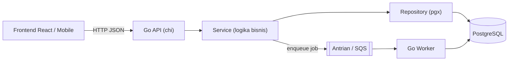

import { Section, Box, Steps, Step, Recap, CardGrid, Card, Chip, Hero, Compare, FileTree, Endpoint, Def } from "@components";

<Hero eyebrow="Roadmap 1 &middot; Fondasi" title="Fondasi <em>Go</em><br />untuk Developer JS &amp; PHP">
  <p>Kamu sudah bisa ngoding. Modul ini tidak mengajarimu apa itu variabel, tapi menjembatani Go dari React/JavaScript dan Laravel/PHP yang sudah kamu kuasai.</p>
  <Fragment slot="meta">
    <Chip icon="code">Bahasa: <b>Go 1.26</b></Chip>
    <Chip icon="clock">~70 menit baca</Chip>
    <Chip icon="rocket">Proyek: <b>Online Shop</b></Chip>
  </Fragment>
</Hero>

<Section num="01" id="intro" title="Kenapa Go, dan Kenapa untukmu?" sub="Bukan karena hype, tapi karena cocok untuk backend yang kamu mau bangun.">

<p class="lead">Bayangkan Go sebagai sepeda gunung: sedikit gigi, rangka kokoh, dan kamu langsung tahu cara kerjanya. Berbeda dari kabin pesawat penuh tombol.</p>

Sebagai developer React, kamu terbiasa dengan ekosistem JavaScript yang kaya tetapi sering kewalahan: ratusan dependency, konfigurasi build yang berlapis, dan perdebatan tanpa akhir soal gaya kode. Go mengambil arah berlawanan. Bahasanya kecil, satu cara penulisan baku (lewat `gofmt`), dan hasil akhirnya satu file biner yang bisa langsung dijalankan di server tanpa runtime tambahan.

Go diciptakan di Google untuk menyelesaikan masalah skala: build lambat, dependency berantakan, dan kode yang sulit dibaca tim besar. Hasilnya bahasa yang sengaja dibuat membosankan dalam arti baik, mudah dibaca orang lain enam bulan kemudian. Untuk backend API, worker, dan layanan jaringan, kombinasi kompilasi cepat, konkurensi murah (goroutine), dan deployment sesederhana menyalin satu biner membuat Go jadi pilihan populer.

<Box variant="analogy" icon="🚲" label="Analogi sepeda gunung"><p>JavaScript modern seperti mobil dengan banyak mode berkendara, fleksibel tapi banyak yang harus diatur. Go seperti sepeda gunung, sedikit komponen, semuanya terlihat, dan kamu jarang tersesat di konfigurasi.</p></Box>

Kenapa ini relevan untukmu secara spesifik? Karena kamu datang dengan dua bekal kuat: pola pikir komponen dan state dari React, serta pola arsitektur berlapis (controller, service, model) dari Laravel. Go akan memakai kedua bekal itu, hanya dengan aturan main yang lebih tegas dan eksplisit.

<Box variant="tip" icon="🧭" label="Cara membaca modul ini"><p>Setiap konsep sulit dijembatani dari JS/PHP dulu (kotak ungu "Jembatan"), baru definisi Go-nya. Jika satu istilah terasa asing, lanjutkan saja, biasanya tersambung di section berikutnya.</p></Box>

</Section>

<Section num="02" id="mindset" title="Cara Berpikir Go vs JS & PHP" sub="Empat pergeseran mental yang paling sering bikin kaget.">

<p class="lead">Sebagian besar frustrasi awal di Go bukan soal sintaks, melainkan empat asumsi dari JS/PHP yang perlu kamu lepaskan.</p>

<h3>1. Dikompilasi jadi satu biner, bukan ditafsirkan</h3>

Node butuh `node` plus `node_modules`; PHP butuh `php-fpm` plus `vendor`. Go mengompilasi semuanya menjadi satu file biner statis yang sudah memuat runtime dan garbage collector di dalamnya. Deploy berarti menyalin satu file lalu menjalankannya.

<Box variant="bridge" icon="🌉" label="Jembatan: dari node/php ke biner tunggal"><p>Di Node kamu kirim source plus `node_modules`; di Go kamu jalankan `go build` dan dapat satu biner. Tidak ada interpreter di server, tidak ada `node_modules` 300 MB. Tapi awas: ada langkah kompilasi, jadi alur edit-refresh instan ala Vite tidak ada secara default (pakai tool seperti `air` untuk hot reload saat dev).</p></Box>

<h3>2. Statis dan tegas saat kompilasi</h3>

TypeScript memberi tipe yang hilang saat runtime; PHP punya tipe opsional. Di Go, tipe itu nyata dan dicek compiler. Lebih dari itu, hal yang di JS/PHP cuma peringatan, di Go bisa jadi error kompilasi. Import yang tidak dipakai dan variabel lokal yang tidak dipakai membuat build gagal, bukan sekadar warning ESLint.

<h3>3. Error itu nilai biasa, bukan exception</h3>

Tidak ada `try/catch` untuk alur normal. Fungsi yang bisa gagal mengembalikan dua nilai: hasil dan `error`. Kamu memeriksanya dengan `if err != nil`. Ini terasa cerewet di awal, tapi membuat jalur kegagalan terlihat jelas di setiap baris.

<h3>4. Satu format baku, tanpa debat</h3>

Tidak ada `.prettierrc`, tidak ada perang tab vs spasi (jawabannya tab). `gofmt` adalah format resmi yang tidak bisa dikonfigurasi. Semua kode Go di dunia terlihat konsisten, jadi membaca kode orang lain terasa familiar.

<Compare aLabel="Kebiasaan JS / PHP" bLabel="Cara Go" aTone="muted" bTone="blue">
  <Fragment slot="a"><ul><li>Tipe opsional atau hilang saat runtime.</li><li>Error lewat `throw` dan `try/catch`.</li><li>Gaya kode diatur Prettier/ESLint per proyek.</li><li>Runtime plus dependency dikirim ke server.</li></ul></Fragment>
  <Fragment slot="b"><ul><li>Tipe statis, dicek compiler.</li><li>Error dikembalikan sebagai nilai `error`.</li><li>`gofmt` baku, sama untuk semua orang.</li><li>Satu biner statis, jalan tanpa runtime.</li></ul></Fragment>
</Compare>

</Section>

<Section num="03" id="setup" title="Pasang Go & Alur Kerja Harian" sub="Lima perintah yang akan kamu pakai setiap hari.">

<p class="lead">Setelah memasang Go, hampir semua pekerjaan harian hanya butuh lima sub-perintah `go`.</p>

Unduh Go versi stabil terbaru dari <a href="https://go.dev/dl/">go.dev/dl</a> (per Februari 2026 seri stabilnya Go 1.26, rilis baru tiap Februari dan Agustus). Sejak Go 1.16, Go Modules aktif secara default, jadi kamu tidak perlu lagi repot dengan `GOPATH` seperti tutorial lama.

<Steps>
  <Step><b>Inisialisasi modul</b><p>`go mod init` membuat `go.mod`, seperti `npm init` membuat `package.json` atau `composer init` membuat `composer.json`.</p></Step>
  <Step><b>Jalankan saat dev</b><p>`go run .` mengompilasi lalu menjalankan paket di folder saat ini, mirip `npm run dev` tetapi sekali jalan.</p></Step>
  <Step><b>Build biner</b><p>`go build ./...` menghasilkan biner siap deploy, tanpa menjalankannya.</p></Step>
  <Step><b>Tes</b><p>`go test ./...` menjalankan semua file `_test.go`. Testing sudah bawaan, tidak perlu Jest atau PHPUnit.</p></Step>
  <Step><b>Rapikan</b><p>`gofmt` (atau `go fmt ./...`) memformat kode; `go vet ./...` menangkap konstruksi mencurigakan, seperti ESLint ringan.</p></Step>
</Steps>

Begini bentuk `go.mod`, berkas yang mendeklarasikan nama modul dan versi Go:

```text title="go.mod"
module github.com/kamu/skincare-backend

go 1.26

require (
	github.com/go-chi/chi/v5 v5.3.0
	github.com/jackc/pgx/v5 v5.10.0
)
```

Lalu sesi terminal pertamamu kira-kira seperti ini:

```bash title="Terminal"
# Buat folder proyek dan inisialisasi modul
mkdir skincare-backend && cd skincare-backend
go mod init github.com/kamu/skincare-backend

# Tambah dependency (mengunduh dan mencatat ke go.mod + go.sum)
go get github.com/go-chi/chi/v5

# Jalankan, lalu rapikan dan periksa
go run .
go fmt ./...
go vet ./...
```

<Box variant="warn" icon="⚠️" label="Jangan tertukar dengan tutorial lama"><p>Banyak tutorial lawas menyuruh menaruh kode di dalam `GOPATH`. Itu sudah usang. Dengan Go Modules, proyekmu bisa di folder mana saja. Juga, `go get` kini hanya untuk mengelola dependency di `go.mod`, bukan memasang tool global, untuk itu pakai `go install nama@versi`.</p></Box>

</Section>

<Section num="04" id="struktur" title="Struktur Proyek: cmd, internal, package" sub="Konvensi resmi yang menggantikan kebiasaan folder Laravel.">

<p class="lead">Di Laravel, struktur folder ditentukan framework. Di Go, kamu yang menata, tetapi ada dua konvensi resmi yang akan menyelamatkanmu: `cmd/` dan `internal/`.</p>

<Def term="package"><p>Satu direktori sama dengan satu package. Semua file `.go` dalam direktori itu berbagi ruang nama yang sama, tanpa perlu saling `import`. Ini berbeda dari satu file sama dengan satu modul ala ES Modules.</p></Def>

Dokumentasi resmi Go merekomendasikan menaruh program (entry point) di dalam `cmd/`, dan kode yang tidak boleh diimpor proyek lain di dalam `internal/`. Aturan `internal/` ini ditegakkan oleh compiler: paket di dalamnya hanya bisa diimpor dari dalam modul yang sama. Inilah pondasi gaya modular monolith yang akan kita pakai untuk online shop.

<FileTree title="Struktur modular monolith (cuplikan)" tree={`
skincare-backend/
  cmd/
    api/
      main.go        # entry point proses API (http server)
    worker/
      main.go        # entry point proses worker (job antrian)
  internal/
    product/         # domain katalog produk
      handler.go     # lapisan HTTP (mirip Controller Laravel)
      service.go     # logika bisnis (mirip Service)
      repository.go  # akses database (mirip Repository/Model)
    order/           # domain pesanan
    payment/         # domain pembayaran
    inventory/       # domain stok
  migrations/        # skema SQL berversi
  go.mod
  go.sum
`} />

<Box variant="bridge" icon="🌉" label="Jembatan: dari folder Laravel ke package Go"><p>Lapisan `handler`, `service`, `repository` di Go memetakan rapi ke Controller, Service, dan Repository/Model di Laravel. Bedanya: visibilitas diatur huruf kapital (huruf besar di awal nama berarti publik/exported), bukan kata kunci `public`/`private`, dan tidak ada autoload PSR-4, melainkan jalur impor penuh seperti `github.com/kamu/skincare-backend/internal/product`.</p></Box>

<Box variant="note" icon="📁" label="Soal folder pkg/"><p>Kamu mungkin melihat folder `pkg/` di banyak repo. Itu konvensi komunitas (`golang-standards/project-layout`), bukan standar resmi go.dev, dan masih diperdebatkan. Untuk modular monolith, `internal/` sudah cukup dan lebih aman.</p></Box>

</Section>

<Section num="05" id="tipe" title="Variabel, Tipe, dan Zero Value" sub="Konsep paling 'Go' yang tidak ada di JS: zero value.">

<p class="lead">Deklarasi variabel Go akan terasa akrab, kecuali satu hal yang akan sering menggigitmu: zero value.</p>

Ada dua cara mendeklarasikan variabel. `var` eksplisit dengan tipe, dan `:=` yang menyimpulkan tipe (hanya di dalam fungsi). Tipe ditulis setelah nama, kebalikan dari TypeScript.

```go title="internal/product/types.go"
package product

// Tipe ditulis SETELAH nama (kebalikan dari TypeScript). Di level package pakai `var`.
var name string = "Serum Niacinamide"

// Tipe kustom: bikin makna lebih jelas, dicek compiler.
type Rupiah int64
type SKU string

var total Rupiah = 298000

// `:=` menyimpulkan tipe otomatis, TAPI hanya boleh DI DALAM fungsi.
func contoh() {
	price := 149000      // disimpulkan jadi int
	inStock := true      // disimpulkan jadi bool
	_ = price
	_ = inStock
}
```

<Def term="zero value"><p>Setiap variabel yang dideklarasikan tanpa nilai awal otomatis berisi zero value tipenya: `0` untuk angka, `""` untuk string, `false` untuk bool, dan `nil` untuk pointer, slice, map, channel, interface, serta fungsi.</p></Def>

<Box variant="bridge" icon="🌉" label="Jembatan: tidak ada undefined di Go"><p>Di JS, properti yang belum diisi bernilai `undefined`. Di Go tidak ada `undefined`. Field `Price` yang tak diisi bernilai `0`, dan `0` itu tidak bisa dibedakan dari harga nol yang disengaja. Untuk menandai "belum diisi" versus "memang nol", pakai pointer (`*int`) atau tipe khusus, persis seperti memodelkan kolom database yang boleh `NULL`.</p></Box>

<Box variant="warn" icon="⚠️" label="Jebakan zero value pada JSON"><p>Saat membaca JSON dari frontend, field angka yang tidak dikirim akan jadi `0`, bukan hilang. Jika `0` adalah nilai sah (misalnya diskon nol), kamu tidak bisa membedakannya dari "tidak dikirim". Gunakan `*int` plus tag `json:"discount,omitempty"` bila perlu membedakannya.</p></Box>

</Section>

<Section num="06" id="error" title="Fungsi & Error sebagai Nilai" sub="Pola if err != nil yang mendefinisikan rasa menulis Go.">

<p class="lead">Inilah pergeseran terbesar dari JS/PHP: tidak ada exception untuk alur normal. Fungsi mengembalikan hasil dan error berdampingan.</p>

Fungsi Go bisa mengembalikan banyak nilai. Konvensinya, nilai terakhir bertipe `error`. Jika `error` itu `nil`, berarti sukses.

```go title="internal/order/service.go"
package order

import (
	"errors"
	"fmt"
)

// Sentinel error: nilai error yang bisa dibandingkan, seperti io.EOF.
var ErrEmptyCart = errors.New("keranjang kosong")

// Mengembalikan (hasil, error). Perhatikan urutan tipe setelah parameter.
func CalculateTotal(items []CartItem) (Rupiah, error) {
	if len(items) == 0 {
		return 0, ErrEmptyCart
	}
	var total Rupiah
	for _, it := range items {
		if it.Qty < 0 {
			// Bungkus error dengan %w supaya bisa di-"unwrap" pemanggil.
			return 0, fmt.Errorf("qty tidak valid untuk %s: %w", it.SKU, ErrInvalidQty)
		}
		total += it.Price * Rupiah(it.Qty)
	}
	return total, nil
}
```

Pemanggil memeriksa error secara eksplisit, lalu memutuskan apakah menangani atau meneruskannya ke atas:

```go title="internal/order/handler.go"
total, err := CalculateTotal(cart.Items)
if err != nil {
	if errors.Is(err, ErrEmptyCart) {
		http.Error(w, "keranjang kosong", http.StatusBadRequest)
		return
	}
	// error tak terduga: catat lalu kembalikan 500 (handler net/http tidak me-return error)
	log.Printf("checkout: hitung total: %v", err)
	http.Error(w, "terjadi kesalahan internal", http.StatusInternalServerError)
	return
}
_ = total // lanjut proses checkout dengan total
```

<Compare aLabel="JS / PHP: try / catch" bLabel="Go: error sebagai nilai" aTone="muted" bTone="violet">
  <Fragment slot="a"><ul><li>`throw` melempar, stack unwind otomatis.</li><li>Satu `catch` menangkap banyak error sekaligus.</li><li>Mudah lupa menangani sampai meledak saat runtime.</li></ul></Fragment>
  <Fragment slot="b"><ul><li>Error dikembalikan, diperiksa `if err != nil`.</li><li>`errors.Is` dan `errors.As` memeriksa jenis error.</li><li>Lupa periksa error ketahuan saat membaca kode.</li></ul></Fragment>
</Compare>

<Box variant="tip" icon="🔗" label="Bungkus dengan %w, periksa dengan errors.Is"><p>`fmt.Errorf("konteks: %w", err)` membungkus error sambil menyimpan rantainya, mirip cause pada exception. Lalu `errors.Is(err, ErrEmptyCart)` memeriksa seluruh rantai itu, menggantikan `err == target` yang rapuh.</p></Box>

<Box variant="warn" icon="⚠️" label="panic bukan try/catch"><p>Go punya `panic`/`recover`, tapi itu untuk kondisi yang benar-benar tak terpulihkan (bug), bukan alur kontrol biasa seperti validasi gagal. Jangan pakai `panic` sebagai pengganti `throw`.</p></Box>

</Section>

<Section num="07" id="struct" title="Struct, Method, dan Receiver" sub="Pemodelan data tanpa class, tanpa inheritance.">

<p class="lead">Go tidak punya class. Kamu memodelkan data dengan `struct`, lalu menempelkan perilaku lewat method dengan receiver.</p>

```go title="internal/product/model.go"
package product

import "time"

// Struct = bentuk data. Tag backtick mengatur (de)serialisasi JSON.
type Product struct {
	ID        int64     `json:"id"`
	SKU       SKU       `json:"sku"`
	Name      string    `json:"name"`
	Price     Rupiah    `json:"price"`
	Active    bool      `json:"active"`
	CreatedAt time.Time `json:"created_at"`
}

// Method dengan VALUE receiver: dapat salinan, tidak mengubah aslinya.
func (p Product) Label() string {
	return string(p.SKU) + " - " + p.Name
}

// Method dengan POINTER receiver: bisa mengubah struct aslinya.
func (p *Product) Deactivate() {
	p.Active = false
}
```

<Box variant="bridge" icon="🌉" label="Jembatan: visibilitas lewat huruf kapital"><p>Tidak ada `public`/`private`. Field `Name` (huruf besar) terlihat dari luar package dan ikut diserialisasi ke JSON; field `name` (huruf kecil) bersifat package-private dan tidak akan pernah muncul di JSON. Ini sering bikin kaget: field huruf kecil "hilang" dari output JSON-mu.</p></Box>

<Def term="pointer vs value receiver"><p>Value receiver `(p Product)` bekerja pada salinan, cocok untuk method yang hanya membaca. Pointer receiver `(p *Product)` bekerja pada aslinya, wajib bila method perlu mengubah field. Aturan praktis: konsisten per tipe, dan pakai pointer bila struct besar atau perlu diubah.</p></Def>

<Box variant="bridge" icon="🌉" label="Jembatan: struct di-copy, objek JS tidak"><p>Di JS, `b = a` membuat `b` menunjuk objek yang sama dengan `a`. Di Go, menyalin atau mengoper struct membuat salinan penuh secara default. Karena itulah pointer penting: untuk berbagi dan mengubah data yang sama, kamu mengoper `*Product`, bukan `Product`.</p></Box>

Tidak ada `extends` atau `super`. Untuk komposisi, Go memakai embedding, dan untuk "konstruktor" konvensinya adalah fungsi pabrik `NewProduct(...)`.

</Section>

<Section num="08" id="proyek" title="Proyek: Backend Online Shop Skincare" sub="Tujuan akhir jalur ini, supaya setiap konsep punya tempat berlabuh.">

<p class="lead">Semua modul Go Artisan membangun satu hal yang sama: backend online shop skincare, dari fondasi Go sampai berjalan di AWS.</p>

Daripada belajar fitur lepas-lepas, kita mengarah ke satu sistem nyata. Frontend (React) dan aplikasi mobile berbicara ke API ini lewat HTTP, dan tugas berat seperti notifikasi diproses worker terpisah.



<p class="fig-cap"><b>Gambar 1.</b> Arsitektur tingkat tinggi: API menangani request cepat, worker memproses tugas lambat di belakang layar.</p>

Sebagian permukaan API yang akan kita rancang dan bangun bertahap:

<Endpoint method="GET" path="/v1/products" desc="Daftar produk dengan filter skin type dan paginasi" />
<Endpoint method="POST" path="/v1/cart/items" desc="Tambah produk ke keranjang" />
<Endpoint method="POST" path="/v1/checkout" desc="Ubah keranjang jadi order (dalam satu transaksi)" />
<Endpoint method="POST" path="/v1/payments/webhook" desc="Callback gateway pembayaran (idempoten, verifikasi tanda tangan)" />

<CardGrid cols={3}>
  <Card><h4>API cepat</h4><p>chi untuk routing, middleware untuk logging, auth, dan request ID.</p></Card>
  <Card><h4>Data konsisten</h4><p>PostgreSQL lewat pgx, checkout dibungkus transaksi agar stok tidak oversell.</p></Card>
  <Card><h4>Tugas async</h4><p>Worker terpisah memproses pembayaran dan notifikasi dari antrian.</p></Card>
</CardGrid>

<Box variant="note" icon="🎯" label="Kenapa satu proyek?"><p>Konsep yang dipelajari dalam konteks nyata jauh lebih melekat. Setiap kali kamu belajar fitur Go baru, kamu akan langsung tahu di mana ia dipakai pada online shop ini.</p></Box>

</Section>

<Section num="09" id="jebakan" title="Jebakan Umum dari Kebiasaan JS/PHP" sub="Hal yang benar di JS/PHP tetapi menggigit di Go.">

<p class="lead">Empat jebakan ini hampir selalu menimpa pendatang dari JS/PHP. Kenali sekarang, hemat berjam-jam debugging nanti.</p>

<h3>Slice berbagi array di belakang layar</h3>

Tidak seperti `Array.prototype.slice()` di JS yang selalu menyalin, mengiris slice di Go menghasilkan view ke array yang sama. Menulis ke hasil irisan bisa diam-diam mengubah slice asal.

```go title="jebakan: aliasing slice"
a := []int{1, 2, 3, 4}
b := a[1:3]   // b berbagi memori dengan a
b[0] = 99     // ini juga mengubah a[1] menjadi 99!
// Selalu reassign hasil append: a = append(a, x)
```

<h3>Menulis ke map nil bikin panic</h3>

Map yang dideklarasikan tanpa `make` bernilai `nil`. Membacanya aman (mengembalikan zero value), tetapi menulisnya membuat program panic saat runtime.

```go title="jebakan: nil map"
var m map[string]int   // nil
_ = m["x"]             // aman, hasilnya 0
m["x"] = 1             // PANIC: assignment to entry in nil map
// Perbaikan: m := make(map[string]int)
```

<CardGrid cols={2}>
  <Card><h4>Import tak terpakai = error</h4><p>Di JS sekadar warning. Di Go, import atau variabel lokal yang tidak dipakai membuat build GAGAL. Compiler memaksamu rapi.</p></Card>
  <Card><h4>Urutan map acak</h4><p>Iterasi `range` atas map sengaja diacak, tidak seperti array asosiatif PHP yang menjaga urutan. Urutkan key sendiri bila perlu deterministik.</p></Card>
</CardGrid>

<Box variant="note" icon="🆕" label="Kabar baik: loop variable sudah diperbaiki"><p>Jebakan klasik "closure di dalam for menangkap nilai terakhir" sudah diperbaiki sejak Go 1.22, asalkan `go.mod`-mu mendeklarasikan `go 1.22` atau lebih baru. Di tutorial lama hal ini masih jadi bug terkenal.</p></Box>

</Section>

<Section num="10" id="ringkasan" title="Ringkasan & Poin Penting" sub="Peta cepat sebelum lanjut ke Roadmap berikutnya.">

<p class="lead">Kamu kini punya kerangka mental Go yang dibangun di atas pengetahuan JS/PHP-mu. Inilah inti yang perlu menempel.</p>

<Recap title="Yang Wajib Menempel">
  <ul>
    <li><b>Go itu kecil dan tegas:</b> dikompilasi jadi satu biner, tipe statis, satu format baku lewat `gofmt`.</li>
    <li><b>Error itu nilai:</b> pola `if err != nil`, bungkus dengan `%w`, periksa dengan `errors.Is`/`errors.As`. Bukan `try/catch`.</li>
    <li><b>Zero value menggantikan undefined:</b> tak ada `undefined`; pakai pointer untuk membedakan "kosong" dari "nol".</li>
    <li><b>Struct bukan class:</b> perilaku lewat method dan receiver; visibilitas lewat huruf kapital; tak ada inheritance.</li>
    <li><b>Struktur proyek:</b> `cmd/` untuk entry point, `internal/` untuk kode privat modul, satu direktori sama dengan satu package.</li>
    <li><b>Jebakan utama:</b> slice berbagi memori, menulis ke map nil panic, import tak terpakai gagal build, urutan map acak.</li>
  </ul>
</Recap>

Berikutnya di jalur ini kita masuk ke <b>Roadmap 1 lanjutan</b> (control flow, slice, map, interface, dan konkurensi dasar), lalu <b>Roadmap 2</b> membangun HTTP API nyata dengan `net/http` dan chi. Setiap langkah tetap dijembatani dari yang sudah kamu kuasai, dan tetap mengarah ke backend online shop yang sama.

<Box variant="tip" icon="✅" label="Latihan kecil sebelum lanjut"><p>Buat satu modul baru, tulis fungsi `CalculateTotal` versimu sendiri yang mengembalikan `(Rupiah, error)`, lalu jalankan `go run .`, `go fmt ./...`, dan `go vet ./...`. Rasakan siklus harian Go.</p></Box>

</Section>
