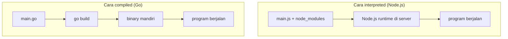
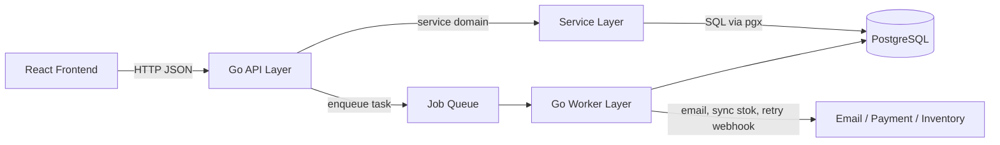
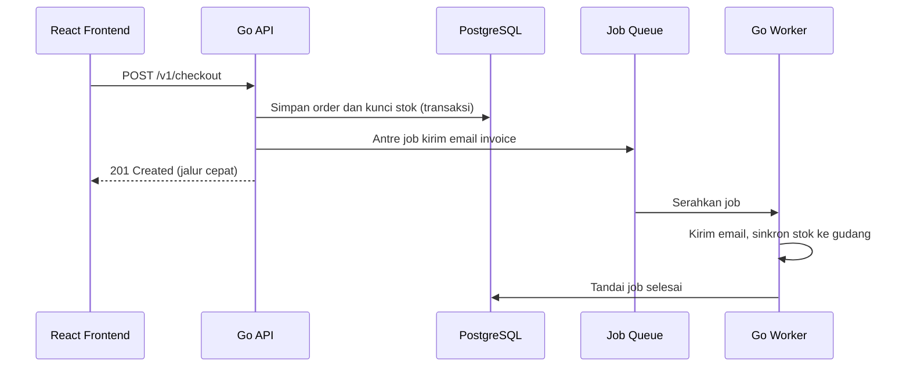

import { Section, Box, Steps, Step, Recap, CardGrid, Card, Chip, Hero, Compare, FileTree, Endpoint, Def } from "@components";

<Hero eyebrow="Roadmap 1 &middot; Fondasi" title="Pengenalan <em>Go</em><br />untuk Backend Developer">
  <p>Di modul pertama ini kita menyamakan pola pikir: Go dipakai bukan karena Node.js atau PHP buruk, tetapi karena trade-off Go sangat cocok untuk backend yang ingin sederhana, cepat, eksplisit, dan mudah dioperasikan.</p>
  <Fragment slot="meta">
    <Chip icon="code">Bahasa: <b>Go 1.26</b></Chip>
    <Chip icon="clock">~60 menit baca</Chip>
    <Chip icon="rocket">Proyek: <b>Online Shop Skincare</b></Chip>
  </Fragment>
</Hero>

<Section num="01" id="intro" title="Kenapa Modul Ini Penting">

<p class="lead">Sebelum menulis endpoint, repository, worker, atau Dockerfile, kamu perlu tahu kenapa Go membentuk cara berpikir backend yang berbeda dari JavaScript dan PHP.</p>

Kalau kamu datang dari React dan TypeScript, kamu sudah terbiasa memikirkan bentuk data, state, API contract, dan runtime JavaScript yang fleksibel. Kalau kamu pernah menyentuh Laravel, kamu mungkin juga terbiasa dengan framework yang sangat produktif, banyak konvensi, dan banyak fitur siap pakai.

Go mengambil jalur lain. Ia tidak mencoba menjadi framework besar. Ia memberi bahasa, standard library yang kuat, toolchain rapi, concurrency bawaan, dan gaya desain yang sengaja dibuat sederhana.

Modul ini sengaja belum menumpahkan sintaks. Kita tidak akan menghafal `for`, `if`, atau cara deklarasi variabel di sini, karena kamu sudah developer berpengalaman. Yang kita bangun dulu adalah model mental: kenapa Go terasa seperti ini, dan kenapa cara berpikirnya cocok untuk backend yang harus hidup lama di produksi.

<Box variant="bridge" icon="🌉" label="Bridge utama: dari TypeScript ke Go"><p>Kamu sudah nyaman dengan TypeScript yang statically typed. Go lebih strict lagi, tidak ada `any` sebagai jalan pintas, tidak ada tipe yang menghilang saat runtime, dan compiler ikut menjaga kontrak sebelum aplikasi dijalankan.</p></Box>

Dalam proyek online shop skincare, pilihan bahasa backend bukan sekadar selera. Kita akan membangun katalog produk, keranjang, checkout, inventory, payment callback, background job, email, audit log, dan deploy ke AWS. Bagian-bagian itu butuh kode yang jelas, mudah dites, mudah dibaca ulang, dan tidak terlalu ajaib.

<Recap title="Target Modul"><ul><li>Memahami Go sebagai bahasa compiled, statically typed, dan opinionated.</li><li>Membandingkan Go dengan Node.js, TypeScript, PHP, dan Laravel secara adil.</li><li>Melihat posisi Go API dan Go Worker di stack backend online shop skincare.</li><li>Menjalankan program Go kecil supaya konsep tidak berhenti di teori.</li></ul></Recap>

</Section>

<Section num="02" id="apa-itu-go" title="Apa Itu Go">

<p class="lead">Go adalah bahasa pemrograman compiled, statically typed, garbage-collected, dengan concurrency built-in dan toolchain yang sengaja dibuat sederhana.</p>

Situs resmi go.dev meringkas posisi Go dalam satu kalimat: "Build simple, secure, scalable systems with Go". Go didukung Google, open-source, mudah dipelajari oleh tim, punya concurrency bawaan, dan standard library yang kuat. Untuk jalur Go Artisan ini, kita memakai Go seri 1.26 sesuai target proyek.

<Box variant="note" icon="📌" label="Soal versi"><p>Go rilis seri mayor baru kira-kira tiap enam bulan (Februari dan Agustus). Seri 1.26 rilis Februari 2026. Di file `go.mod` nanti kita menulis baris `go 1.26` untuk menyatakan versi minimum yang dipakai modul.</p></Box>

<Def term="compiled"><p>Kode Go dikompilasi menjadi binary executable sebelum dijalankan, sehingga hasil build bisa dikirim sebagai satu file aplikasi ke server atau container.</p></Def>

<Def term="statically typed"><p>Tipe data diperiksa saat compile time, bukan baru ketahuan saat request produksi masuk ke endpoint.</p></Def>

<Def term="opinionated"><p>Go punya preferensi kuat soal gaya kode, struktur sederhana, formatting otomatis, dependency management, dan error handling eksplisit.</p></Def>

Ada tiga hal yang akan terasa cepat bagi developer JavaScript dan PHP.

<CardGrid cols={3}>
  <Card><h4>Bahasanya kecil</h4><p>Jumlah konsep inti tidak banyak, jadi kamu lebih cepat masuk ke desain backend dibanding menghafal fitur bahasa.</p></Card>
  <Card><h4>Tooling bawaan</h4><p>`go fmt`, `go test`, `go mod`, dan `go run` adalah bagian dari pengalaman standar, bukan pilihan plugin terpisah.</p></Card>
  <Card><h4>Runtime efisien</h4><p>Go punya garbage collector dan goroutine, tetapi tetap menghasilkan binary yang praktis untuk service backend.</p></Card>
</CardGrid>

<Box variant="bridge" icon="🌉" label="Bridge: dari kelelahan memilih di JS ke permukaan kecil Go"><p>Di ekosistem JavaScript kamu sering memilih dulu: bundler, test runner, linter, formatter, gaya import, dan banyak konvensi tim. Go memangkas pilihan itu dengan menyediakan satu cara standar untuk format, test, dan build, sehingga energi pindah dari konfigurasi ke desain backend.</p></Box>

<Box variant="note" icon="📌" label="Catatan"><p>Go bukan bahasa tanpa runtime sama sekali. Binary Go tetap membawa runtime untuk garbage collector, scheduler goroutine, map, panic, reflection, dan fitur lain yang dibutuhkan program.</p></Box>

Kita tidak memilih Go karena ingin terlihat lebih low-level. Kita memilih Go karena ia memberi cukup kontrol untuk backend serius, tanpa membuat proses development terasa seberat bahasa sistem tradisional.

</Section>

<Section num="03" id="kenapa-go-populer" title="Kenapa Go Populer untuk Backend">

<p class="lead">Go populer di backend karena kombinasi simplicity, performance, concurrency bawaan, compile cepat, dan deployment yang sederhana.</p>

Backend modern sering berisi banyak pekerjaan kecil yang harus stabil: menerima HTTP request, validasi input, bicara ke database, memanggil payment gateway, menulis log, menjalankan worker, dan memantau health check. Go cocok untuk pekerjaan seperti ini karena desain bahasanya mendorong jalur yang eksplisit.

<CardGrid cols={2}>
  <Card><h4>Simplicity</h4><p>Go mengurangi pilihan gaya yang terlalu banyak. Hasilnya, kode antar tim cenderung lebih mirip dan mudah dibaca.</p></Card>
  <Card><h4>Performance</h4><p>Binary Go berjalan efisien untuk HTTP server, worker, CLI, dan tooling infrastruktur tanpa perlu banyak tuning di awal.</p></Card>
  <Card><h4>Concurrency built-in</h4><p>Goroutine dan channel adalah fitur bahasa, bukan library tambahan. Ini berguna untuk worker, fan-out task, timeout, dan pipeline data.</p></Card>
  <Card><h4>Fast compile</h4><p>Go dirancang agar compile terasa cepat, sehingga loop menulis kode, menjalankan test, lalu memperbaiki bug tetap nyaman.</p></Card>
</CardGrid>

Supaya tidak abstrak, berikut perbandingan langsung tiga pilihan yang mungkin pernah kamu pakai, dilihat dari sudut backend service.

| Dimensi | Node.js + TypeScript | PHP + Laravel | Go |
|---|---|---|---|
| Sistem tipe | TS di atas JS, hilang saat runtime | Dinamis, tipe opsional lewat anotasi | Statis, bagian inti bahasa, dicek compiler |
| Bawaan ke server | Source, `node_modules`, dan runtime Node | Source, runtime PHP, dan ekstensi | Satu binary mandiri |
| Concurrency | Event loop satu thread, async dan await | Umumnya per request, antar proses | Goroutine dan channel bawaan |
| Startup proses | Cepat, perlu Node terpasang | Cepat lewat PHP-FPM dan web server | Sangat cepat, cukup jalankan binary |
| Gaya kerja | Banyak pilihan dan konfigurasi | Banyak konvensi dan magic framework | Sedikit cara, eksplisit, satu formatter |

<p class="fig-cap"><b>Tabel 1.</b> Bukan soal mana yang terbaik mutlak, tetapi soal trade-off mana yang paling cocok untuk service backend yang harus dioperasikan jangka panjang.</p>

<h3>Kenapa bukan Node.js?</h3>

Node.js sangat bagus untuk tim yang sudah kuat JavaScript end-to-end, butuh ekosistem npm besar, atau ingin satu bahasa dari frontend sampai backend. Tetapi untuk service backend jangka panjang, Go memberi binary deployment yang lebih sederhana, tipe yang selalu ada saat compile, dan concurrency model yang tidak bergantung pada event loop JavaScript.

<h3>Kenapa bukan PHP atau Laravel?</h3>

Laravel sangat produktif untuk aplikasi web monolitik, admin panel, dan tim yang ingin fitur framework siap pakai. Tetapi Go lebih menarik saat kita ingin service kecil, worker, CLI, dan proses deployment yang dekat dengan container dan cloud-native tooling.

<Box variant="tip" icon="💡" label="Kenapa ini penting untuk online shop"><p>Online shop skincare bukan hanya CRUD produk. Ada checkout, reservation inventory, callback payment, email, notifikasi, sinkronisasi stok, dan background job yang akan lebih mudah dikelola bila kode backend eksplisit dan mudah dites.</p></Box>

<Box variant="warn" icon="⚠️" label="Jangan salah framing"><p>Go bukan pengganti universal untuk Node.js atau Laravel. Pilih Go saat kamu menghargai binary deployment, strict typing, concurrency eksplisit, dan kode backend yang minim magic.</p></Box>

</Section>

<Section num="04" id="compiled-vs-interpreted" title="Compiled vs Interpreted">

<p class="lead">Perbedaan compiled dan interpreted paling terasa di cara aplikasi dijalankan, cara error ditemukan, dan cara kita mengirim aplikasi ke server.</p>

Di Node.js, file JavaScript biasanya dibaca dan dieksekusi oleh runtime Node.js. Di Go, file `.go` dikompilasi lebih dulu menjadi executable. Kamu tetap bisa memakai `go run` saat development, tetapi di balik layar Go tetap melakukan proses compile sebelum menjalankan program.



<p class="fig-cap"><b>Gambar 1.</b> Node membawa source, dependency, dan runtime ke server. Go memadatkan semuanya menjadi satu binary saat build, lalu server cukup menjalankan binary itu.</p>

<Compare aLabel="Node.js: runtime menjalankan source" bLabel="Go: compiler membuat binary" aTone="muted" bTone="violet">
  <Fragment slot="a"><ul><li>Server butuh Node.js runtime.</li><li>Error tertentu baru muncul saat jalur kode dieksekusi.</li><li>Deployment biasanya membawa source, dependency, dan runtime.</li></ul></Fragment>
  <Fragment slot="b"><ul><li>Server menjalankan hasil build berupa binary.</li><li>Banyak kesalahan tipe dan import berhenti di compile time.</li><li>Deployment container bisa sederhana karena binary sudah membawa aplikasi.</li></ul></Fragment>
</Compare>

Contoh paling kecil.

```go title="cmd/hello/main.go"
package main

import "fmt"

func main() {
	fmt.Println("Go Artisan: backend online shop skincare")
}
```

Jalankan dengan mode development.

```bash title="Terminal"
go run ./cmd/hello
```

Build menjadi binary.

```bash title="Terminal"
go build -o bin/skincare ./cmd/hello
./bin/skincare
```

<Box variant="analogy" icon="🧰" label="Analogi"><p>`go run` mirip pesan makanan yang langsung dimasak dan dimakan. `go build` mirip menyiapkan paket makanan rapi yang bisa dikirim ke tempat lain dan dibuka tanpa membawa dapur lengkap.</p></Box>

Untuk backend production, pola `go build` sangat nyaman. Kita bisa build binary di CI, bungkus ke Docker image, lalu jalankan di ECS, EC2, atau service lain. Modul deploy akan membahas detailnya, tetapi pola pikirnya dimulai dari sini.

</Section>

<Section num="05" id="static-typing" title="Static Typing yang Lebih Ketat dari TypeScript">

<p class="lead">TypeScript memberi rasa aman di atas JavaScript, sedangkan Go menjadikan tipe sebagai bagian asli dari bahasa dan proses compile.</p>

TypeScript membantu developer React menghindari bug bentuk data, props, response API, dan union state. Tetapi TypeScript akhirnya dikompilasi menjadi JavaScript, sehingga tipe tidak menjadi bagian dari runtime JavaScript. Go berbeda. Tipe adalah bagian inti bahasa dan compiler akan menolak program yang melanggar kontrak tipe.

<Compare aLabel="TypeScript: tipe di atas JavaScript" bLabel="Go: tipe adalah bahasa itu sendiri" aTone="blue" bTone="violet">
  <Fragment slot="a"><ul><li>`any` bisa mematikan proteksi tipe.</li><li>Tipe hilang setelah transpilasi ke JavaScript.</li><li>Runtime tetap JavaScript dan tetap bisa menerima data liar dari luar.</li></ul></Fragment>
  <Fragment slot="b"><ul><li>Tidak ada `any` sebagai jalan pintas universal.</li><li>Compiler menolak operasi yang tidak cocok secara tipe.</li><li>Data dari luar harus diparse, divalidasi, dan dipetakan ke struct dengan jelas.</li></ul></Fragment>
</Compare>

Contoh kontrak data produk skincare.

```go title="internal/product/product.go"
package product

type Product struct {
	ID          int64
	Name        string
	Brand       string
	SkinType    string
	PriceRupiah int64
	Stock       int
	IsPublished bool
}

func CanBeSold(p Product) bool {
	return p.IsPublished && p.Stock > 0 && p.PriceRupiah > 0
}
```

Kalau kamu mencoba mengisi `PriceRupiah` dengan string di dalam kode Go, compiler akan protes sebelum aplikasi jalan.

```go title="internal/product/broken_example.go"
package product

func BrokenProduct() Product {
	return Product{
		ID:          101,
		Name:        "Hydrating Toner",
		Brand:       "Glow Lab",
		PriceRupiah: "129000", // error: cannot use "129000" (untyped string) as int64
	}
}
```

Kode di atas gagal dikompilasi karena `PriceRupiah` butuh `int64`, bukan `string`. Ini terasa cerewet di awal, tetapi sangat membantu saat proyek mulai punya banyak fitur dan banyak kontributor.

<h3>Tidak ada undefined, yang ada zero value</h3>

Salah satu kebiasaan JavaScript yang perlu dilepas adalah refleks mengecek `undefined` dan `null` di mana-mana. Di Go, setiap variabel yang dideklarasikan selalu punya nilai awal yang pasti sesuai tipenya. Tidak ada keadaan "belum terdefinisi" yang mengambang.

<Def term="zero value"><p>Nilai default otomatis tiap tipe saat dideklarasikan tanpa nilai awal: `0` untuk angka, `""` untuk string, `false` untuk bool, dan `nil` untuk pointer, slice, map, serta interface. Tidak ada `undefined` seperti di JavaScript.</p></Def>

```go title="internal/product/zero_value.go"
package product

func DraftProduct() Product {
	var p Product // semua field langsung terisi zero value

	// p.Name == ""        (string)
	// p.Stock == 0        (int)
	// p.PriceRupiah == 0  (int64)
	// p.IsPublished == false (bool)

	return p
}
```

<Box variant="bridge" icon="🌉" label="Bridge: dari DTO TypeScript ke struct Go"><p>Kalau di TypeScript kamu biasa menulis `type ProductResponse = ...`, di Go kamu akan menulis `type Product struct ...`. Bedanya, struct Go ikut diperiksa compiler saat build backend, bukan hanya membantu editor.</p></Box>

<Box variant="warn" icon="⚠️" label="Jebakan"><p>Static typing tidak menggantikan validasi input. JSON dari user, query parameter, dan webhook payment tetap harus divalidasi karena data dari luar datang sebagai byte dan string yang belum tentu benar.</p></Box>

</Section>

<Section num="06" id="simplicity-first" title="Filosofi Simplicity-First">

<p class="lead">Go sengaja memilih bahasa yang kecil dan pola yang eksplisit supaya program jangka panjang mudah dirawat.</p>

Effective Go menekankan bahwa menulis Go dengan baik berarti memahami properti, idiom, dan konvensi Go. Ini penting karena Go tidak hanya soal sintaks, tetapi juga gaya berpikir: lebih sedikit magic, lebih banyak alur yang terlihat.

Bagi developer React, ini mirip saat tim sepakat memakai pola state management yang jelas, bukan setiap halaman punya arsitektur berbeda. Bagi developer Laravel, ini berbeda dari framework yang menyediakan banyak magic lewat container, facade, model lifecycle, dan convention over configuration.

<CardGrid cols={3}>
  <Card><h4>Formatting satu standar</h4><p>`gofmt` membuat perdebatan gaya indentasi dan spacing hampir hilang.</p></Card>
  <Card><h4>Error eksplisit</h4><p>Fungsi yang bisa gagal biasanya mengembalikan `error`, lalu pemanggil wajib memutuskan responsnya.</p></Card>
  <Card><h4>Import jelas</h4><p>Dependency terlihat dari import dan `go.mod`, bukan terselip dalam global helper atau magic autoload.</p></Card>
</CardGrid>

Contoh gaya eksplisit saat mengambil produk.

```go title="internal/product/service.go"
package product

import "context"

type Repository interface {
	FindByID(ctx context.Context, id int64) (Product, error)
}

type Service struct {
	repo Repository
}

func NewService(repo Repository) *Service {
	return &Service{repo: repo}
}

func (s *Service) Detail(ctx context.Context, id int64) (Product, error) {
	p, err := s.repo.FindByID(ctx, id)
	if err != nil {
		return Product{}, err
	}

	return p, nil
}
```

Perhatikan pola yang akan sering muncul di modul berikutnya: `context.Context` sebagai parameter pertama, dependency lewat interface kecil, constructor mengembalikan struct, dan error dikembalikan sebagai nilai.

<Box variant="bridge" icon="🌉" label="Bridge: dari magic Laravel ke dependency terlihat"><p>Di Laravel, `Service` sering otomatis mendapat dependency lewat container dan type-hint constructor. Di Go tidak ada container ajaib: kita merakit dependency sendiri lewat fungsi seperti `NewService(repo)`. Awalnya terasa manual, tetapi alur dependency jadi gamblang dan mudah ditelusuri.</p></Box>

<Box variant="tip" icon="💡" label="Pola idiomatik yang mulai dibiasakan"><p>Untuk service layer, biasakan menerima interface kecil yang dibutuhkan dan mengembalikan struct konkret. Ini menjaga kode mudah dites tanpa membuat desain terlalu abstrak.</p></Box>

</Section>

<Section num="07" id="use-case-backend" title="Use Case Backend yang Cocok untuk Go">

<p class="lead">Go nyaman dipakai untuk REST API, background job, worker, CLI, dan infrastructure tooling.</p>

Dalam proyek nyata, backend bukan hanya satu web server. Ada API yang menerima request dari frontend, worker yang mengerjakan pekerjaan lambat, CLI untuk maintenance, dan tool kecil untuk migrasi atau seed data. Go bisa mengisi semuanya dengan bahasa dan toolchain yang sama.

<CardGrid cols={2}>
  <Card><h4>REST API</h4><p>Go API menerima request dari React frontend, validasi payload, menjalankan service, lalu mengembalikan JSON.</p></Card>
  <Card><h4>Background job</h4><p>Worker memproses email order confirmation, sinkronisasi stok, cleanup cart lama, dan retry webhook.</p></Card>
  <Card><h4>CLI internal</h4><p>Command kecil bisa dipakai untuk seed kategori skincare, membuat admin pertama, atau menjalankan backfill data.</p></Card>
  <Card><h4>Infrastructure tooling</h4><p>Banyak tool cloud-native memakai Go karena binary mudah didistribusikan dan performanya baik untuk operasi sistem.</p></Card>
</CardGrid>

Untuk REST API, gambaran konkretnya kira-kira seperti ini. Kita belum membangunnya sekarang, tetapi bentuk endpoint inilah yang akan kita kejar di Roadmap 2.

<Endpoint method="GET" path="/v1/products" desc="Daftar produk skincare dengan filter skin type dan paginasi" />
<Endpoint method="POST" path="/v1/cart/items" desc="Tambah produk ke keranjang pembeli" />
<Endpoint method="POST" path="/v1/checkout" desc="Ubah keranjang jadi order dalam satu transaksi" />

<FileTree title="Arah struktur proyek Go Artisan" tree={`
cmd/
  api/
    main.go        # entry point HTTP API
  worker/
    main.go        # entry point background worker
  skincarectl/
    main.go        # CLI internal proyek
internal/
  product/         # fitur katalog produk skincare
  cart/            # fitur keranjang
  checkout/        # fitur checkout dan order
go.mod
`} />

<Box variant="note" icon="📌" label="Belum perlu terlalu dalam"><p>Struktur di atas belum final. Modul arsitektur akan merapikan package, layer, config, dependency injection sederhana, dan batas antar domain.</p></Box>

</Section>

<Section num="08" id="stack-skincare" title="Posisi Go di Stack Online Shop Skincare">

<p class="lead">Di proyek kita, Go akan menjadi API layer dan worker layer yang menghubungkan frontend React, PostgreSQL, payment provider, dan layanan pendukung.</p>

Diagram berikut menunjukkan gambaran awal. Kita belum bicara chi, pgx, Docker, atau AWS secara detail, tetapi kamu sudah bisa melihat kenapa Go cocok berada di pusat backend.



<p class="fig-cap"><b>Gambar 2.</b> Posisi Go API dan Go Worker di stack backend online shop skincare.</p>

Untuk melihat kenapa pembagian API dan worker itu penting, perhatikan satu alur checkout. API mengerjakan bagian yang harus cepat dan pasti, lalu menyerahkan pekerjaan lambat ke worker.



<p class="fig-cap"><b>Gambar 3.</b> API menahan hanya pekerjaan inti checkout. Email dan sinkronisasi stok dikerjakan worker setelah respons dikirim, sehingga pembeli tidak menunggu pekerjaan lambat.</p>

<h3>API layer</h3>

API layer adalah pintu masuk dari frontend. Contohnya `GET /v1/products`, `POST /v1/cart/items`, dan `POST /v1/checkout`. Modul Roadmap 2 akan memakai `net/http` dan chi untuk routing, middleware, dan handler yang rapi. Sejak Go 1.22, `net/http` bahkan sudah bisa routing berbasis method dan path sederhana, lalu chi melengkapi kebutuhan middleware dan grup rute.

<h3>Worker layer</h3>

Worker layer menangani pekerjaan yang tidak harus selesai di dalam request utama. Contohnya mengirim email invoice, sinkronisasi stok ke sistem gudang, membersihkan cart kadaluarsa, dan retry notifikasi payment provider.

<h3>PostgreSQL</h3>

PostgreSQL menjadi sumber data utama. Nanti kita memakai pgx dan `pgxpool` untuk query, transaksi checkout, lock stok, dan repository layer.

<Box variant="bridge" icon="🌉" label="Bridge: dari React mental model"><p>Bayangkan Go API seperti server action yang benar-benar terpisah dan lebih strict. React mengirim intent lewat HTTP, Go memvalidasi, menjalankan aturan bisnis, lalu menyimpan state final ke PostgreSQL.</p></Box>

<Box variant="tip" icon="💡" label="Desain awal"><p>Request checkout sebaiknya tidak mengirim email langsung di path utama. API cukup membuat order dan job, worker mengurus pekerjaan lambat setelah transaksi utama aman.</p></Box>

</Section>

<Section num="09" id="hands-on" title="Hands-on Ringan">

<p class="lead">Sekarang kita buat program Go kecil yang mensimulasikan service katalog produk skincare tanpa framework.</p>

Tujuan hands-on ini bukan membangun API production. Tujuannya hanya melihat bagaimana Go memakai module, package, struct, function, compile, dan run.

<Steps>
  <Step><b>Buat folder proyek</b><p>Kita mulai dengan module Go yang nanti menjadi cikal bakal backend online shop skincare.</p></Step>
  <Step><b>Tulis domain sederhana</b><p>Kita buat struct `Product` dan fungsi kecil untuk mengecek apakah produk bisa dijual.</p></Step>
  <Step><b>Jalankan dengan `go run`</b><p>Kita pakai `go run` untuk development loop cepat.</p></Step>
  <Step><b>Build binary</b><p>Kita pakai `go build` agar kamu merasakan perbedaan source code dan executable.</p></Step>
</Steps>

```bash title="Terminal"
mkdir skincare-backend
cd skincare-backend
go mod init github.com/kamu/skincare-backend
mkdir -p cmd/catalog internal/product
```

```go title="internal/product/product.go"
package product

type Product struct {
	ID          int64
	Name        string
	Brand       string
	SkinType    string
	PriceRupiah int64
	Stock       int
	IsPublished bool
}

func CanBeSold(p Product) bool {
	return p.IsPublished && p.Stock > 0 && p.PriceRupiah > 0
}
```

```go title="cmd/catalog/main.go"
package main

import (
	"fmt"

	"github.com/kamu/skincare-backend/internal/product"
)

func main() {
	toner := product.Product{
		ID:          101,
		Name:        "Hydrating Toner",
		Brand:       "Glow Lab",
		SkinType:    "dry",
		PriceRupiah: 129000,
		Stock:       12,
		IsPublished: true,
	}

	fmt.Printf("%s bisa dijual: %t\n", toner.Name, product.CanBeSold(toner))
}
```

```bash title="Terminal"
go fmt ./...
go run ./cmd/catalog
go build -o bin/catalog ./cmd/catalog
./bin/catalog
```

Output yang diharapkan.

```text title="Terminal"
Hydrating Toner bisa dijual: true
```

<Box variant="warn" icon="⚠️" label="Perhatikan satuan uang"><p>Contoh memakai `PriceRupiah` sebagai integer agar tidak memakai floating point untuk uang. Untuk proyek Indonesia, nama `PriceRupiah` membuat satuan lebih jelas saat membaca domain model.</p></Box>

<Box variant="tip" icon="💡" label="Rasakan loop yang cepat"><p>Ubah `Stock` menjadi `0`, lalu jalankan ulang `go run ./cmd/catalog`. Output berubah menjadi `false`. Loop edit, run, lihat hasil yang cepat inilah salah satu alasan Go nyaman dipakai sehari-hari.</p></Box>

</Section>

<Section num="10" id="jebakan-umum" title="Jebakan Umum dari JS dan PHP">

<p class="lead">Developer JS dan PHP biasanya cepat produktif di Go, tetapi beberapa kebiasaan lama perlu ditahan.</p>

<h3>1. Mencari framework besar terlalu cepat</h3>

Di Laravel, framework adalah pusat gravitasi. Di Go, standard library dan package kecil sering lebih idiomatik. Kita akan memakai chi untuk routing, tetapi tetap menjaga bisnis utama tidak bergantung pada router.

<h3>2. Menganggap compiler sebagai musuh</h3>

Compiler Go memang cerewet. Import tidak dipakai, variabel tidak dipakai, tipe tidak cocok, semua akan dihentikan. Ini bukan penghambat, ini mekanisme menjaga codebase tetap bersih.

<h3>3. Membawa pola `any` ke Go</h3>

Go punya `any` sebagai alias resmi untuk empty interface sejak Go 1.18, tetapi ia bukan alat default untuk melewati desain tipe. Untuk domain online shop, struct yang jelas lebih aman daripada peta bebas yang isinya ditebak saat runtime.

<h3>4. Menyembunyikan error</h3>

Di JavaScript dan PHP, error sering ditangani dengan exception atau framework handler global. Di Go, error adalah nilai. Kalau operasi database gagal, service harus memutuskan apakah error diteruskan, dibungkus, atau diterjemahkan ke response yang tepat.

<h3>5. Membuat abstraction terlalu awal</h3>

Karena terbiasa dengan design pattern, developer sering membuat folder dan interface banyak sebelum ada kebutuhan nyata. Go biasanya lebih suka abstraksi kecil yang muncul dari kebutuhan testing dan boundary yang jelas.

<Recap title="Jebakan yang Harus Diingat"><ul><li>Jangan mencari Laravel versi Go. Cari gaya Go yang sederhana dan eksplisit.</li><li>Jangan melawan compiler. Biarkan compiler menjadi reviewer pertama.</li><li>Jangan memakai `any` untuk domain data yang seharusnya punya bentuk jelas.</li><li>Jangan menelan error. Error adalah bagian dari kontrak fungsi.</li><li>Jangan membuat arsitektur besar sebelum modul sederhana bisa berjalan dan dites.</li></ul></Recap>

</Section>

<Section num="11" id="ringkasan" title="Ringkasan & Poin Penting">

<p class="lead">Modul ini memberi fondasi mental sebelum kita masuk ke sintaks, package, function, pointer, error handling, dan HTTP API.</p>

<Recap title="Yang Wajib Menempel"><ul><li>Go adalah bahasa compiled, statically typed, garbage-collected, dan opinionated, cocok untuk backend yang butuh kejelasan dan deployment sederhana.</li><li>Go dipilih untuk proyek online shop skincare karena cocok untuk API layer dan worker layer, bukan karena Node.js atau Laravel buruk.</li><li>Bridge utama dari TypeScript adalah static typing, tetapi Go lebih strict karena tipe menjadi bagian asli bahasa, diperiksa saat compile, dan tidak punya undefined (yang ada zero value).</li><li>Compiled workflow membuat kita berpikir tentang source code, build artifact, binary, Docker image, dan deployment sejak awal.</li><li>Simplicity-first berarti lebih sedikit magic, error eksplisit, formatting otomatis, package kecil, dan dependency yang terlihat.</li></ul></Recap>

<CardGrid cols={2}>
  <Card><h4>Pemetaan ke proyek</h4><p>Go API akan menangani request dari React frontend, menjalankan service domain, dan menyimpan data utama ke PostgreSQL.</p></Card>
  <Card><h4>Pemetaan ke worker</h4><p>Go Worker akan memproses pekerjaan lambat seperti email, sinkronisasi stok, cleanup cart, dan retry webhook payment.</p></Card>
  <Card><h4>Langkah berikutnya</h4><p>Modul berikutnya, Setup Go dan Developer Workflow, memasang Go di mesinmu lalu mengenalkan `go mod init`, `go run`, `go build`, `go test`, dan `go fmt`.</p></Card>
  <Card><h4>Prinsip belajar</h4><p>Setiap fitur bahasa akan selalu dikaitkan ke kebutuhan backend online shop, bukan dipelajari sebagai sintaks kosong.</p></Card>
</CardGrid>

<Box variant="tip" icon="✅" label="Checklist sebelum lanjut"><p>Pastikan kamu bisa membayangkan kenapa Go memilih binary mandiri, kenapa tipe ada sejak compile, dan kenapa compiler Go sengaja menghentikan kode yang tidak rapi. Detail instalasi dan perintahnya kita kerjakan di modul berikutnya.</p></Box>

</Section>
