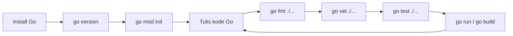
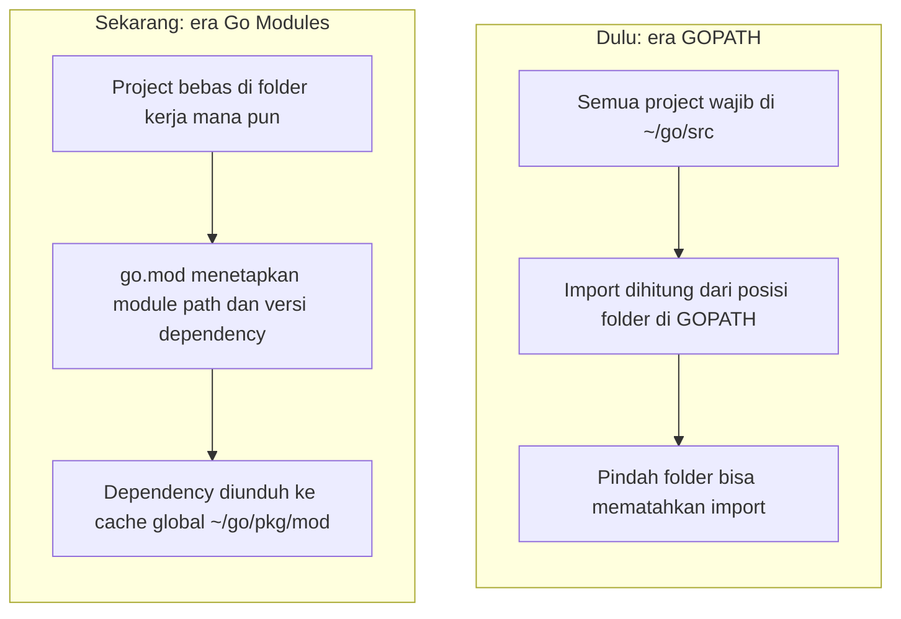
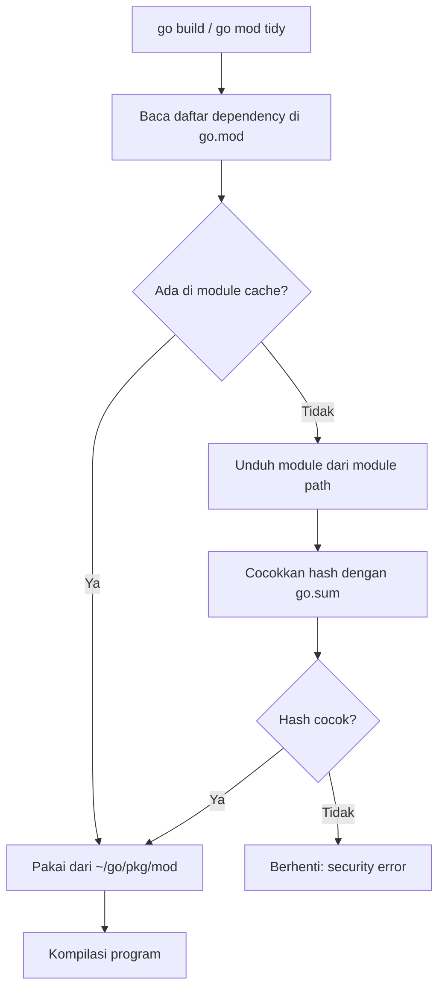
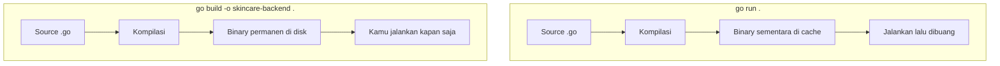

import { Section, Box, Steps, Step, Recap, CardGrid, Card, Chip, Hero, Compare, FileTree, Def } from "@components";

<Hero eyebrow="Roadmap 1 &middot; Fondasi" title="Setup Go dan <em>Developer Workflow</em><br />untuk Backend Skincare">
  <p>Di modul ini kita menyiapkan Go 1.26 dan membangun kebiasaan kerja harian yang akan dipakai sepanjang proyek online shop skincare.</p>
  <Fragment slot="meta">
    <Chip icon="code">Bahasa: <b>Go 1.26</b></Chip>
    <Chip icon="clock">~65 menit baca</Chip>
    <Chip icon="rocket">Proyek: <b>Online Shop Skincare</b></Chip>
  </Fragment>
</Hero>

<Section num="01" id="intro" title="Workflow Pertama di Go" sub="Dari instalasi sampai executable lokal">

<p class="lead">Kalau di Node.js kamu biasa mulai dari `npm init`, `node index.js`, lalu menumpuk script di `package.json`, di Go kamu akan mulai dari `go mod init`, `go run`, `go test`, `go fmt`, `go vet`, dan `go build`.</p>

Tujuan modul ini bukan membuat aplikasi besar dulu. Tujuannya membuat kamu nyaman dengan alat kerja bawaan Go, karena hampir semua proyek Go yang sehat bersandar pada toolchain resmi, bukan tumpukan library tambahan sejak hari pertama.

Di modul sebelumnya kita menyamakan pola pikir. Sekarang kita memasang Go di mesinmu, lalu melatih lingkar kerja yang akan kamu ulang ratusan kali saat membangun katalog, cart, checkout, sampai worker.

<Box variant="bridge" icon="🌉" label="Jembatan: dari npm script ke go command"><p>Di ekosistem JS, banyak workflow disusun lewat script custom di `package.json` yang berbeda tiap tim. Di Go, perintah inti seperti `go run`, `go test`, `go fmt`, `go vet`, dan `go build` sudah menjadi kontrak bersama yang sama di semua proyek.</p></Box>



<p class="fig-cap"><b>Gambar 1.</b> Setelah setup sekali di kiri, kerja harianmu berputar di lingkar tulis kode &rarr; fmt &rarr; vet &rarr; test &rarr; jalankan, lalu kembali menulis kode.</p>

<Def term="toolchain Go"><p>Kumpulan alat resmi yang datang bersama instalasi Go dalam satu paket: compiler, standard library, formatter, test runner, static analyzer, dan command `go` sebagai pintu masuknya.</p></Def>

<CardGrid cols={3}>
  <Card><h4>Ringkas</h4><p>Satu instalasi Go sudah cukup untuk menjalankan, mengetes, memformat, menganalisis, dan membangun binary, tanpa memasang tool terpisah.</p></Card>
  <Card><h4>Konsisten</h4><p>`gofmt` membuat gaya kode seragam di seluruh tim, jadi code review bisa fokus ke desain dan correctness, bukan spasi.</p></Card>
  <Card><h4>Siap produksi</h4><p>`go build` menghasilkan executable untuk service API dan worker yang nanti mudah dikemas ke Docker dan dijalankan di AWS.</p></Card>
</CardGrid>

</Section>

<Section num="02" id="install-go" title="Install Go dan Verifikasi" sub="Gunakan Go 1.26 untuk jalur ini">

<p class="lead">Untuk jalur Go Artisan, gunakan Go 1.26 agar `go.mod`, perintah, dan output kamu konsisten dengan materi dan environment tim.</p>

Sumber resmi yang perlu kamu kenal: [Download and install](https://go.dev/doc/install), [Go 1.26 Release Notes](https://go.dev/doc/go1.26), [How to Write Go Code](https://go.dev/doc/code), [Go Modules Reference](https://go.dev/ref/mod), [Managing Go installations](https://go.dev/doc/manage-install), dan dokumentasi command di [`cmd/go`](https://pkg.go.dev/cmd/go).

<h3>macOS via Homebrew</h3>

```bash title="Terminal"
brew update
brew install go
go version
```

<h3>Windows via winget</h3>

```bash title="PowerShell"
winget install GoLang.Go
go version
```

<h3>Ubuntu atau Debian via apt</h3>

```bash title="Terminal"
sudo apt update
sudo apt install golang-go
go version
```

<Box variant="warn" icon="⚠️" label="Catatan penting untuk apt dan paket distro"><p>Repository distro kadang tertinggal beberapa rilis dari versi resmi. Kalau `go version` tidak menampilkan seri 1.26, pasang lewat installer atau tarball resmi dari `go.dev/dl`.</p></Box>

<h3>Linux manual via tarball resmi</h3>

```bash title="Terminal"
# Unduh arsip Linux terbaru dari https://go.dev/dl/ sesuai CPU kamu.
# Contoh nama file memakai placeholder 1.26.x, ganti dengan patch terbaru.
curl -LO https://go.dev/dl/go1.26.x.linux-amd64.tar.gz
sudo rm -rf /usr/local/go
sudo tar -C /usr/local -xzf go1.26.x.linux-amd64.tar.gz
echo 'export PATH=$PATH:/usr/local/go/bin' >> ~/.profile
source ~/.profile
go version
```

Output yang kita harapkan mirip seperti ini. Angka patch dan arsitektur bisa berbeda sesuai mesinmu.

```bash title="Terminal"
go version go1.26.0 darwin/arm64
```

<Steps>
  <Step><b>Pastikan `go` terbaca</b><p>Jalankan `go version`. Kalau command tidak ditemukan, masalahnya hampir selalu PATH yang belum memuat folder binary Go.</p></Step>
  <Step><b>Cek lokasi Go aktif</b><p>Jalankan `which go` di macOS/Linux untuk melihat binary `go` yang sedang dipakai shell, berguna saat ada lebih dari satu instalasi.</p></Step>
  <Step><b>Cek environment dasar</b><p>Jalankan `go env GOROOT GOPATH GOMODCACHE` untuk melihat lokasi instalasi, folder kerja, dan cache module toolchain.</p></Step>
</Steps>

```bash title="Terminal"
which go
go env GOROOT GOPATH GOMODCACHE
```

<h3>Versi baru tanpa repot: GOTOOLCHAIN</h3>

Sejak Go 1.21, toolchain bisa menyesuaikan diri secara otomatis. Kalau `go.mod` sebuah proyek meminta `go 1.26` sedangkan Go di mesinmu masih lebih lama, command `go` akan mengunduh dan memakai toolchain 1.26 untuk proyek itu, lalu menampilkan pesan bahwa ia berpindah versi.

<Def term="GOTOOLCHAIN"><p>Pengaturan yang menentukan toolchain mana yang dipakai. Nilai default `auto` membuat command `go` otomatis mengunduh toolchain lebih baru saat sebuah proyek memintanya lewat baris `go` di `go.mod`.</p></Def>

```bash title="Terminal"
go env GOTOOLCHAIN
# auto

# Ubah permanen bila perlu, misalnya untuk mengunci di lingkungan tertentu.
go env -w GOTOOLCHAIN=auto
```

<Box variant="bridge" icon="🌉" label="Jembatan: dari nvm dan Volta ke GOTOOLCHAIN"><p>Di Node.js kamu sering memakai `nvm` atau `.nvmrc` agar versi runtime cocok per proyek. Go menyatukan ide itu ke dalam toolchain: baris `go 1.26` di `go.mod` cukup untuk membuat command `go` memakai versi yang benar tanpa version manager terpisah.</p></Box>

<h3>Editor dan gopls</h3>

Bagian dari developer workflow adalah editor yang paham Go. Pasang ekstensi Go resmi (di VS Code) atau plugin Go untuk JetBrains, lalu biarkan ia memakai `gopls`, language server resmi Go. Dari sini kamu dapat autocomplete, go to definition, error inline sebelum compile, dan format otomatis saat menyimpan file.

<Box variant="bridge" icon="🌉" label="Jembatan: dari TypeScript Language Server ke gopls"><p>Pengalaman editor yang kamu nikmati di TypeScript berasal dari language server-nya. Di Go, peran itu dipegang `gopls`, jadi fitur seperti autocomplete dan rename simbol terasa familier, hanya saja diperkuat compiler yang lebih strict.</p></Box>

<Box variant="tip" icon="💡" label="Best practice tim"><p>Tulis versi Go yang dipakai di `go.mod` dan dokumentasikan cara install di README. Dengan begitu CI, laptop tiap developer, dan Docker image berangkat dari asumsi versi yang sama.</p></Box>

</Section>

<Section num="03" id="gopath-vs-modules" title="GOPATH vs Go Modules" sub="Kenapa kamu tidak perlu membuat project di ~/go/src lagi">

<p class="lead">Dulu Go sangat bergantung pada `GOPATH`, sampai project wajib berada di `~/go/src`. Sekarang workflow normal memakai Go Modules, jadi project boleh berada di folder kerja mana pun.</p>

Di ekosistem Node.js, dependency biasanya turun ke `node_modules` di dalam project. Di Go modern, dependency dan versinya dikunci oleh `go.mod`, sementara source module yang diunduh disimpan di module cache global, biasanya `~/go/pkg/mod` atau nilai dari `GOMODCACHE`.



<p class="fig-cap"><b>Gambar 2.</b> Pergeseran dari "lokasi folder menentukan identitas" ke "go.mod menentukan identitas". Inilah alasan tutorial lama yang menyuruhmu pindah ke `~/go/src` sudah tidak relevan.</p>

<Compare aLabel="Node.js / PHP" bLabel="Go Modules" aTone="muted" bTone="violet">
  <Fragment slot="a"><ul><li>`node_modules` atau `vendor/` sering berada di dalam project.</li><li>`package.json` berisi identitas project dan dependency.</li><li>`package-lock.json` atau `composer.lock` membantu reproduksi dependency.</li></ul></Fragment>
  <Fragment slot="b"><ul><li>`go.mod` berada di root module dan menjadi prefix import path.</li><li>Dependency diunduh ke module cache global, bukan otomatis ke folder project.</li><li>`go.sum` menyimpan checksum untuk memverifikasi dependency yang diunduh.</li></ul></Fragment>
</Compare>

<Def term="GOPATH"><p>Folder default Go yang kini berperan sebagai tempat module cache (`pkg/mod`) dan binary tool (`bin`), bukan lagi tempat wajib menyimpan source code project modern.</p></Def>

<Def term="Go Modules"><p>Sistem dependency resmi Go yang membuat project punya `go.mod`, module path, versi dependency, dan aturan resolusi paket yang konsisten lintas mesin.</p></Def>

```bash title="Terminal"
go env GOPATH
# /Users/kamu/go

go env GOMODCACHE
# /Users/kamu/go/pkg/mod
```

<h3>GOPATH belum benar-benar pensiun</h3>

Walau source project tidak lagi tinggal di `GOPATH`, folder itu masih dipakai untuk dua hal penting: cache module di `pkg/mod` dan binary CLI tool di `bin`. Saat nanti kamu memasang tool lewat `go install`, binarynya mendarat di `$GOPATH/bin`, jadi pastikan folder itu ada di `PATH`.

```bash title="Terminal"
# Contoh memasang sebuah CLI tool Go (pola yang akan kamu pakai lagi nanti).
go install example.com/some/tool@latest

# Binary tool berada di sini, tambahkan ke PATH bila belum terbaca.
echo "$(go env GOPATH)/bin"
```

<Box variant="bridge" icon="🌉" label="Jembatan: mirip node_modules, tapi global"><p>Bayangkan `~/go/pkg/mod` sebagai cache bersama lintas project, kira-kira seperti cache global npm atau pnpm store. Bedanya, project Go tetap dikendalikan oleh `go.mod`, bukan oleh isi cache global.</p></Box>

<Box variant="warn" icon="⚠️" label="Jangan commit cache"><p>Jangan commit `~/go/pkg/mod`, isi `GOMODCACHE`, atau build cache. Yang kamu commit adalah source code, `go.mod`, dan `go.sum` ketika sudah ada dependency eksternal.</p></Box>

</Section>

<Section num="04" id="go-mod-init" title="go mod init dan Identitas Proyek" sub="Nama module adalah alamat import jangka panjang">

<p class="lead">Perintah `go mod init` membuat file `go.mod` dan menetapkan module path sebagai prefix import untuk semua package di dalam project.</p>

Untuk proyek kita, gunakan module path yang meniru alamat repository Git. Kamu belum harus push ke GitHub hari ini, tetapi memakai pola ini sejak awal membuat import internal rapi saat project membesar.

```bash title="Terminal"
mkdir skincare-backend
cd skincare-backend
go mod init github.com/kamu/skincare-backend
```

Output umum:

```bash title="Terminal"
go: creating new go.mod: module github.com/kamu/skincare-backend
```

```text title="go.mod"
module github.com/kamu/skincare-backend

go 1.26
```

Baris `go 1.26` bukan sekadar catatan. Ia menyatakan versi Go minimum untuk membangun module ini, dan lewat GOTOOLCHAIN tadi, ia ikut menentukan toolchain yang dipakai pada mesin yang versinya lebih lama.

<Def term="module path"><p>String identitas module di baris pertama `go.mod` yang sekaligus menjadi prefix import. Package `internal/product` di module ini diimpor sebagai `github.com/kamu/skincare-backend/internal/product`.</p></Def>

<Box variant="bridge" icon="🌉" label="Jembatan: nama paket npm vs module path Go"><p>Nama paket npm seperti `lodash` hanyalah label di registry. Module path Go justru menyatu dengan lokasinya: `go get github.com/go-chi/chi/v5` benar-benar mengunduh dari alamat itu. Maka pilih module path sesuai tempat repository akan tinggal, bukan nama acak.</p></Box>

<Steps>
  <Step><b>Buat folder project</b><p>`skincare-backend` menjadi root module, mirip root project React atau Laravel.</p></Step>
  <Step><b>Inisialisasi module</b><p>`go mod init github.com/kamu/skincare-backend` menulis `go.mod` di root beserta baris versi `go`.</p></Step>
  <Step><b>Commit sejak awal</b><p>Commit `go.mod` agar identitas module tercatat di version control sejak commit pertama.</p></Step>
</Steps>

<Box variant="warn" icon="⚠️" label="Jangan asal ganti module path"><p>Mengganti module path di tengah jalan bisa mematahkan import di banyak file sekaligus. Tentukan nama sedekat mungkin dengan nama repository production agar tidak perlu diubah lagi.</p></Box>

</Section>

<Section num="05" id="go-mod-sum" title="go.mod dan go.sum" sub="Mirip package.json + lockfile, tetapi tidak identik">

<p class="lead">`go.mod` menjelaskan module dan dependency yang dibutuhkan. `go.sum` mencatat checksum dependency agar setiap unduhan bisa diverifikasi keasliannya.</p>

Kalau kamu datang dari Node.js, analogi cepatnya: `go.mod` terasa seperti `package.json`, sementara `go.sum` terasa seperti bagian integrity dari lockfile. Tapi hati-hati, `go.sum` bukan lockfile berisi seluruh pohon dependency seperti `package-lock.json`.

<Compare aLabel="package.json + lockfile" bLabel="go.mod + go.sum" aTone="muted" bTone="blue">
  <Fragment slot="a"><ul><li>`package.json` menyimpan metadata dan rentang versi dependency.</li><li>Lockfile menyimpan pohon dependency yang sangat detail dan rata.</li><li>Folder `node_modules` biasanya hidup di project lokal.</li></ul></Fragment>
  <Fragment slot="b"><ul><li>`go.mod` menyimpan module path, versi Go, dan requirement module.</li><li>`go.sum` menyimpan hash untuk memverifikasi modul yang pernah diperlukan.</li><li>Source dependency hidup di module cache global, bukan di project.</li></ul></Fragment>
</Compare>

Reproduksi build di Go tidak datang dari satu lockfile raksasa, melainkan dari kombinasi `go.mod` (versi terpilih lewat algoritma minimal version selection) plus `go.sum` (jaminan isi modul tidak berubah). Hasilnya tetap deterministik, hanya jalannya berbeda.

```text title="go.mod"
module github.com/kamu/skincare-backend

go 1.26
```

Pada awal project tanpa dependency eksternal, `go.sum` belum tentu ada. File itu muncul saat kamu menambahkan module eksternal, misalnya nanti ketika memakai chi untuk router atau pgx untuk PostgreSQL.

```bash title="Terminal"
go mod tidy
ls
```

<h3>Bagaimana dependency diselesaikan dan diverifikasi</h3>

Saat `go build` atau `go mod tidy` butuh sebuah dependency, alurnya kira-kira begini: baca daftar di `go.mod`, cek module cache, unduh bila belum ada, lalu cocokkan hash unduhan dengan `go.sum` sebelum dipakai.



<p class="fig-cap"><b>Gambar 3.</b> `go.sum` adalah gerbang keamanan: bila isi modul yang diunduh tidak cocok dengan hash yang tercatat, Go menolak melanjutkan build.</p>

Tiap modul biasanya punya dua baris di `go.sum`: satu hash untuk isi pohon modul, satu lagi untuk file `go.mod`-nya. Untuk modul yang baru pertama kali kamu pakai, Go juga berkonsultasi ke checksum database publik agar yakin hash itu sama dengan yang dilihat seluruh dunia.

<Def term="checksum database"><p>Log publik dan tahan-rusak berisi hash modul Go, secara default `sum.golang.org` (diatur lewat `GOSUMDB`). Go memakainya untuk memverifikasi modul baru sebelum mencatatnya ke `go.sum`. Modul privat bisa dikecualikan lewat `GOPRIVATE`.</p></Def>

<Box variant="note" icon="📝" label="Apa fungsi go mod tidy"><p>`go mod tidy` menambah dependency yang benar-benar dipakai, menghapus yang tidak dipakai, lalu menyelaraskan `go.mod` dan `go.sum` agar bersih dan konsisten.</p></Box>

<Box variant="warn" icon="⚠️" label="go.sum wajib ikut commit"><p>Kalau project sudah memiliki `go.sum`, commit file itu. Ia membuat tim dan CI memverifikasi dependency yang benar-benar sama, bukan sekadar versi yang mirip.</p></Box>

</Section>

<Section num="06" id="go-run" title="go run untuk Eksekusi Cepat" sub="Mirip node index.js, tetapi tetap dikompilasi">

<p class="lead">`go run` memberi pengalaman secepat menjalankan `node index.js`, tetapi Go tetap mengompilasi program lebih dulu sebelum menjalankannya.</p>

Buat file pertama di root project. Untuk sekarang kita pakai `main.go` sederhana agar fokus ke workflow, bukan arsitektur besar.

```go title="main.go"
package main

import "fmt"

func main() {
	fmt.Println("skincare-backend siap dipakai")
}
```

Jalankan program:

```bash title="Terminal"
go run .
```

Output:

```bash title="Terminal"
skincare-backend siap dipakai
```

Titik pada `go run .` berarti "package di folder ini". Kamu juga bisa menyebut file langsung dengan `go run main.go`, tetapi `go run .` lebih disukai karena ikut menyertakan semua file di package yang sama.

<Def term="package main"><p>Package khusus untuk program executable. Bila package bernama `main` memiliki fungsi `main`, Go bisa mengompilasinya menjadi binary yang dapat dijalankan.</p></Def>

<Box variant="bridge" icon="🌉" label="Jembatan: dari Node runtime ke Go compiler"><p>`node index.js` menyerahkan file ke runtime Node untuk dieksekusi. `go run .` mengompilasi package `main` menjadi binary sementara, menjalankannya, lalu membuangnya. Tetap ada langkah compile, hanya tidak terlihat.</p></Box>

<Box variant="tip" icon="💡" label="Pakai go run untuk feedback cepat"><p>Selama eksplorasi awal, `go run .` cocok untuk memastikan program bisa dikompilasi dan output sesuai harapan tanpa menyimpan binary ke disk.</p></Box>

</Section>

<Section num="07" id="go-build" title="go build dan Binary" sub="Output berupa executable, bukan script yang butuh runtime Node">

<p class="lead">`go build` menghasilkan executable dari package `main`. Untuk contoh murni Go, output ini bisa dijalankan langsung tanpa membawa folder dependency project.</p>

```bash title="Terminal"
go build -o skincare-backend .
./skincare-backend
```

Output:

```bash title="Terminal"
skincare-backend siap dipakai
```

Inilah beda inti `go run` dan `go build`. Keduanya sama-sama mengompilasi, tetapi `go run` membuang binarynya, sedangkan `go build` menaruh binary permanen di disk untuk kamu jalankan kapan saja.



<p class="fig-cap"><b>Gambar 4.</b> `go run` untuk loop development yang cepat, `go build` untuk menghasilkan artifact yang dikirim ke server atau dikemas ke container.</p>

<Box variant="note" icon="📝" label="Nama binary tanpa flag -o"><p>Tanpa `-o`, `go build .` di root module menamai binary sesuai elemen terakhir module path, jadi `github.com/kamu/skincare-backend` menghasilkan file `skincare-backend`. Memakai `-o` membuat nama output eksplisit dan tidak bergantung tebakan.</p></Box>

<Compare aLabel="Node.js" bLabel="Go" aTone="muted" bTone="teal">
  <Fragment slot="a"><ul><li>Kode dijalankan oleh runtime Node di server.</li><li>Deploy membawa source, `package.json`, lockfile, dan dependency production.</li><li>Build frontend menghasilkan asset, tetapi backend Node tetap butuh runtime.</li></ul></Fragment>
  <Fragment slot="b"><ul><li>Service dikompilasi menjadi executable untuk target OS dan arsitektur.</li><li>Deploy bisa membawa binary dan konfigurasi runtime saja.</li><li>Di Docker, binary Go sering membuat image jauh lebih ramping.</li></ul></Fragment>
</Compare>

<h3>Preview cross compile</h3>

Nanti saat masuk Docker dan AWS, kamu akan lebih sering membangun binary untuk Linux. Go bisa melakukannya dari mesin apa pun cukup dengan menyetel `GOOS` dan `GOARCH`, tanpa memasang toolchain khusus per target.

```bash title="Terminal"
GOOS=linux GOARCH=amd64 go build -o skincare-backend-linux .

# Lihat semua target yang didukung toolchain saat ini.
go tool dist list
```

<Box variant="warn" icon="⚠️" label="Binary tetap perlu konteks runtime"><p>Binary mandiri bukan berarti semua masalah deploy hilang. Aplikasi tetap butuh environment variable, koneksi database, strategi migration, dan observability.</p></Box>

</Section>

<Section num="08" id="test-fmt-vet" title="go test, go fmt, dan go vet" sub="Tiga kebiasaan kecil yang menjaga kualitas sejak awal">

<p class="lead">Go membawa testing, formatting, dan static analysis dasar di toolchain resmi, jadi standar kualitas minimum tidak bergantung pada selera tiap project.</p>

<CardGrid cols={3}>
  <Card><h4>`go test`</h4><p>Menjalankan test bawaan Go dari file `*_test.go`, tanpa Jest, PHPUnit, atau library test tambahan.</p></Card>
  <Card><h4>`go fmt`</h4><p>Memformat source dengan gaya standar Go. Tidak ada lagi debat tabs vs spaces di code review.</p></Card>
  <Card><h4>`go vet`</h4><p>Mencari pola yang sangat mungkin salah, misalnya format `Printf` yang tidak cocok dengan argumennya.</p></Card>
</CardGrid>

Buat fungsi kecil agar kita punya sesuatu untuk dites. File ini sudah mulai terasa seperti domain online shop skincare, walau masih sangat sederhana.

```go title="price.go"
package main

// DiscountedPrice mengurangi harga produk dengan nominal diskon, dalam rupiah.
func DiscountedPrice(price, discount int64) int64 {
	return price - discount
}
```

```go title="price_test.go"
package main

import "testing"

func TestDiscountedPrice(t *testing.T) {
	got := DiscountedPrice(120000, 20000)
	want := int64(100000)

	if got != want {
		t.Fatalf("got %d, want %d", got, want)
	}
}
```

Jalankan format, vet, lalu test:

```bash title="Terminal"
go fmt ./...
go vet ./...
go test ./...
```

<Box variant="note" icon="📝" label="go test sudah memanggil go vet"><p>Sebelum menjalankan test, `go test` otomatis menjalankan sebagian pemeriksaan `go vet` berkepercayaan tinggi. Kamu bisa mematikannya dengan `go test -vet=off`, tetapi biasanya tidak perlu.</p></Box>

<Box variant="bridge" icon="🌉" label="Jembatan: dari Jest atau PHPUnit"><p>Di Jest kamu mengatur lokasi test lewat konfigurasi dan convention. Di Go, convention-nya pasti: file `*_test.go` di package yang sama dan fungsi berawalan `TestXxx` dengan parameter `*testing.T`.</p></Box>

<Box variant="tip" icon="💡" label="gofmt biar otomatis"><p>`go fmt ./...` menjalankan `gofmt` pada semua package. Lebih enak lagi, atur editor agar format on save lewat `gopls`, sehingga kamu hampir tidak pernah menjalankannya manual.</p></Box>

<Box variant="warn" icon="⚠️" label="go vet bukan pengganti semua linter"><p>`go vet` fokus pada masalah berkepercayaan tinggi. Untuk aturan style tambahan, nanti kita bisa menambah `golangci-lint`, tetapi bukan di modul fondasi ini.</p></Box>

</Section>

<Section num="09" id="struktur-folder" title="Struktur Folder Minimal" sub="Cukup kecil untuk belajar, cukup rapi untuk tumbuh">

<p class="lead">Di awal, jangan membuat folder terlalu banyak. Namun kita tetap menyiapkan struktur yang tidak akan terasa berantakan saat masuk API, database, dan domain skincare.</p>

<FileTree title="Struktur awal skincare-backend" tree={`skincare-backend/
  go.mod
  go.sum          # muncul setelah ada dependency eksternal
  main.go         # program pertama untuk latihan workflow
  price.go        # contoh fungsi domain kecil
  price_test.go   # contoh unit test bawaan Go
  internal/
    product/
      model.go    # nanti untuk domain katalog produk skincare
  README.md`} />

<Def term="folder internal/"><p>Convention sekaligus aturan compiler Go: package di bawah `internal/` hanya boleh diimpor oleh kode yang berakar di folder induk `internal/` itu. Cocok untuk detail aplikasi yang tidak ingin dipakai project lain.</p></Def>

<Box variant="bridge" icon="🌉" label="Jembatan: dari struktur Laravel"><p>Laravel memberi struktur besar sejak awal lewat `app/Http`, `app/Models`, dan seterusnya. Go lebih minimal, jadi kita menambah folder saat kebutuhan desainnya nyata, bukan karena framework memaksa.</p></Box>

<h3>Contoh file model awal</h3>

```go title="internal/product/model.go"
package product

type Product struct {
	ID          int64
	Name        string
	PriceRupiah int64
}
```

Untuk modul ini, `internal/product/model.go` belum dipakai dari `main.go`. Ia hanya memperlihatkan arah struktur. Perhatikan `PriceRupiah` bertipe `int64`, melanjutkan kebiasaan dari modul sebelumnya untuk tidak memakai floating point pada uang.

<Box variant="warn" icon="⚠️" label="Jangan over-engineer dari hari pertama"><p>Jangan langsung membuat folder `handler`, `service`, `repository`, `config`, dan `platform` kalau belum ada kode yang membutuhkannya. Struktur yang baik lahir dari kebutuhan, bukan dari template kosong.</p></Box>

</Section>

<Section num="10" id="hands-on" title="Hands-on Workflow Harian" sub="Simulasi dari folder kosong sampai binary jalan">

<p class="lead">Bagian ini bisa kamu ikuti dari terminal kosong. Anggap ini ritual pembuka sebelum kita membangun API skincare yang sebenarnya.</p>

<Steps>
  <Step><b>Buat project</b><p>Mulai dari folder baru bernama `skincare-backend`.</p></Step>
  <Step><b>Inisialisasi module</b><p>Gunakan module path yang akan menjadi alamat repository.</p></Step>
  <Step><b>Tulis program dan test kecil</b><p>Buat `main.go`, lalu `price.go` dan `price_test.go` agar `go test` punya sesuatu untuk dijalankan.</p></Step>
  <Step><b>Jalankan ritual kualitas</b><p>Jalankan `go fmt`, `go vet`, `go test`, `go run`, lalu `go build`.</p></Step>
</Steps>

```bash title="Terminal"
mkdir skincare-backend
cd skincare-backend
go mod init github.com/kamu/skincare-backend

cat > main.go <<'EOF'
package main

import "fmt"

func main() {
	fmt.Println("skincare-backend siap dipakai")
}
EOF

cat > price.go <<'EOF'
package main

func DiscountedPrice(price, discount int64) int64 {
	return price - discount
}
EOF

cat > price_test.go <<'EOF'
package main

import "testing"

func TestDiscountedPrice(t *testing.T) {
	if got := DiscountedPrice(120000, 20000); got != 100000 {
		t.Fatalf("got %d, want %d", got, 100000)
	}
}
EOF

go fmt ./...
go vet ./...
go test ./...
go run .
go build -o skincare-backend .
./skincare-backend
```

Setelah itu, cek isi folder:

```bash title="Terminal"
ls -la
```

Hasil minimum yang masuk akal:

```text title="Output"
go.mod
main.go
price.go
price_test.go
skincare-backend
```

<Box variant="tip" icon="💡" label="Kebiasaan yang dipakai sampai production"><p>Urutan `fmt`, `vet`, `test`, lalu `run` atau `build` akan tetap relevan saat project sudah punya chi, pgx, Docker, CI, dan deploy AWS. Hanya skalanya yang membesar.</p></Box>

</Section>

<Section num="11" id="jebakan-umum" title="Jebakan Umum Developer JS/PHP" sub="Hal kecil yang sering membuat setup Go terasa aneh di awal">

<p class="lead">Sebagian kebingungan awal bukan karena Go sulit, tetapi karena mental model dari Node.js, TypeScript, atau Laravel tidak selalu cocok.</p>

<Recap title="Jebakan yang Perlu Dihindari"><ul><li><strong>Mencari `node_modules` di project.</strong> Dependency Go masuk ke module cache global, bukan folder project.</li><li><strong>Membuat project di `~/go/src` karena tutorial lama.</strong> Dengan Go Modules, project bisa berada di folder kerja mana pun.</li><li><strong>Lupa menaruh `$GOPATH/bin` di PATH.</strong> Tool hasil `go install` ada di sana, kalau PATH belum memuatnya, command tool tidak akan terbaca.</li><li><strong>Menganggap `go run` seperti interpreter.</strong> `go run` tetap compile lebih dulu, lalu menjalankan binary sementara.</li><li><strong>Menghapus `go.sum` dari repository.</strong> Kalau file itu sudah muncul, commit untuk menjaga verifikasi dependency.</li><li><strong>Menunda `go fmt` sampai akhir.</strong> Format sejak awal agar diff kecil dan review bersih.</li><li><strong>Menganggap `go vet` sama dengan linter lengkap.</strong> `go vet` penting, tetapi hanya satu lapisan static analysis.</li><li><strong>Mengganti module path sembarangan.</strong> Module path memengaruhi semua import, jadi pilih dengan niat jangka panjang.</li></ul></Recap>

<Box variant="bridge" icon="🌉" label="Jembatan: dari TypeScript strict mode"><p>Kalau TypeScript strict mode membantumu menangkap masalah sebelum runtime, Go membawa ide itu lebih jauh lewat compiler, test runner, formatter, dan vet yang sudah tersedia langsung dari toolchain.</p></Box>

<Box variant="warn" icon="⚠️" label="Jangan belajar Go dari tutorial GOPATH lama"><p>Banyak artikel lama masih meminta kamu menaruh project di `GOPATH/src`. Untuk jalur ini, gunakan Go Modules dan selalu mulai dari `go mod init`.</p></Box>

</Section>

<Section num="12" id="ringkasan" title="Ringkasan & Poin Penting">

<p class="lead">Sekarang kamu sudah punya environment Go dan workflow dasar yang akan menjadi pondasi semua modul berikutnya.</p>

<Recap title="Yang Wajib Menempel"><ul><li>Gunakan Go 1.26 dan deklarasikan `go 1.26` di `go.mod`. Lewat GOTOOLCHAIN, baris itu cukup untuk menyamakan versi toolchain antar mesin.</li><li>`go mod init github.com/kamu/skincare-backend` menetapkan module path yang sekaligus menjadi prefix import dan alamat unduhan.</li><li>`GOPATH` kini berperan untuk module cache dan binary tool, sementara source project modern memakai Go Modules.</li><li>`go.mod` adalah pusat metadata dependency, sedangkan `go.sum` menyimpan checksum yang menolak build bila isi modul berubah.</li><li>`go run .` cepat untuk feedback, `go build` menghasilkan binary permanen yang nanti masuk ke Docker dan AWS.</li><li>`go fmt ./...`, `go vet ./...`, dan `go test ./...` adalah ritual kualitas minimum sebelum commit, dan `go test` sudah ikut menjalankan vet.</li><li>Struktur awal cukup sederhana: `go.mod`, `main.go`, test kecil, dan `internal/` untuk kode aplikasi yang tidak diekspor keluar module.</li></ul></Recap>

<h3>Pemetaan ke proyek online shop skincare</h3>

<CardGrid cols={2}>
  <Card><h4>API layer</h4><p>Binary dari `go build` nanti menjadi service HTTP untuk katalog produk, cart, checkout, order, dan auth.</p></Card>
  <Card><h4>Worker layer</h4><p>Workflow yang sama dipakai untuk worker seperti sinkronisasi stok, email order, dan proses pembayaran async.</p></Card>
</CardGrid>

<h3>Langkah berikutnya</h3>

Di modul berikutnya kita masuk ke fondasi tipe data Go: deklarasi dengan `var` dan `:=`, `const`, tipe dasar seperti `string`, `int`, `bool`, dan `float`, lalu zero value, konversi tipe, dan custom type. Dari sana kamu mulai memodelkan harga, kuantitas, status, dan nama produk skincare dengan aman.

<Box variant="tip" icon="✅" label="Checkpoint sebelum lanjut"><p>Pastikan `go version`, `go run .`, `go test ./...`, `go fmt ./...`, `go vet ./...`, dan `go build -o skincare-backend .` berhasil di laptopmu.</p></Box>

</Section>
