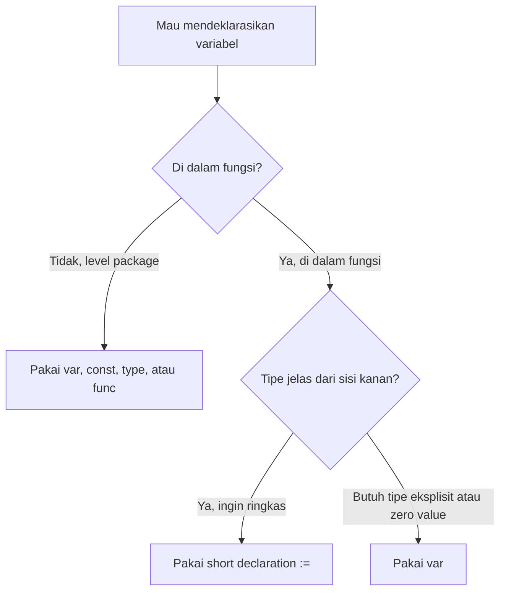
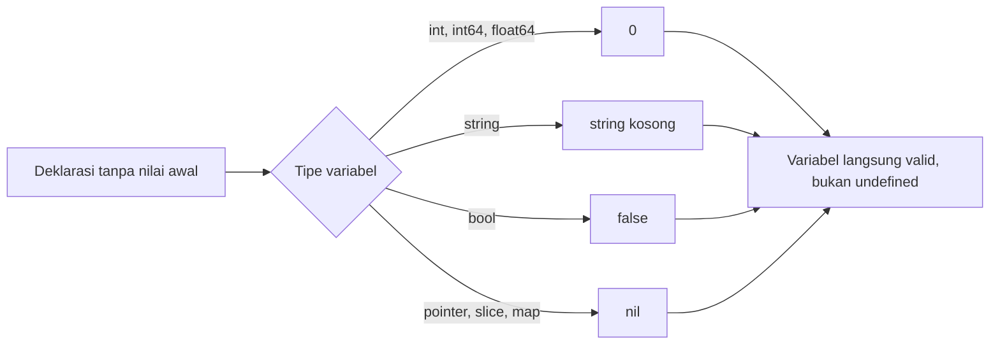
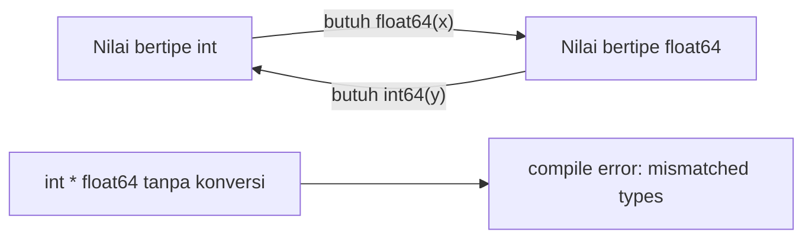
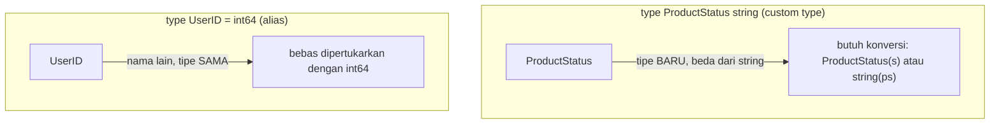
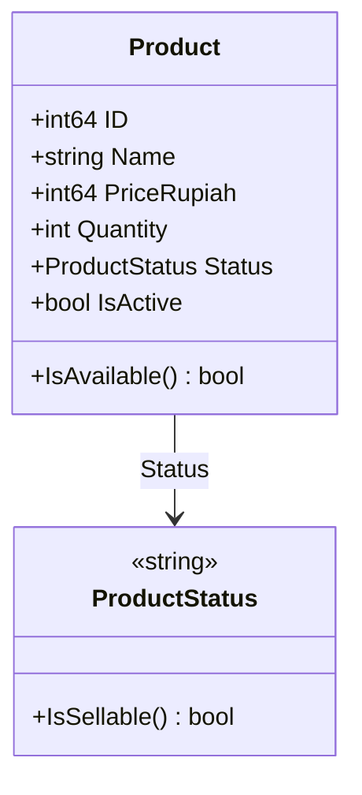

import { Section, Box, Steps, Step, Recap, CardGrid, Card, Chip, Hero, Compare, FileTree, Def } from "@components";

<Hero eyebrow="Roadmap 1 &middot; Fondasi" title="Variabel, Tipe,<br /><em>dan Zero Value</em>">
  <p>Di Go, data tidak sekadar disimpan. Data diberi kontrak tipe yang jelas sejak program dikompilasi, jauh sebelum baris pertama dijalankan.</p>
  <Fragment slot="meta">
    <Chip icon="code">Bahasa: <b>Go 1.26</b></Chip>
    <Chip icon="clock">~70 menit baca</Chip>
    <Chip icon="rocket">Proyek: <b>Online Shop Skincare</b></Chip>
  </Fragment>
</Hero>

<Section num="01" id="intro" title="Kenapa Sistem Tipe Go Terasa Berbeda" sub="Dari fleksibilitas JavaScript menuju kontrak eksplisit Go">

<p class="lead">Kamu sudah mengenal TypeScript sebagai lapisan tipe di atas JavaScript, tetapi Go membawa tipe turun ke level bahasa dan compiler, bukan sekadar bantuan saat menulis kode.</p>

Di JavaScript, sebuah nilai bisa berganti tipe saat program berjalan. Di TypeScript, tipe membantu saat development, tetapi hasil akhirnya tetap JavaScript yang dieksekusi runtime. Di Go, tipe adalah bagian dari bahasa yang diperiksa compiler sebelum program berjalan, sehingga banyak bug ketahuan lebih awal, terutama di backend yang berurusan dengan harga, stok, status produk, dan payload API.

<Box variant="bridge" icon="🌉" label="Jembatan: dari TypeScript ke Go"><p>Anggap Go seperti TypeScript tanpa mode longgar: tidak ada `any` sebagai jalan pintas harian, tidak ada coercion diam-diam, dan nilai kosong pun selalu punya bentuk yang jelas menurut tipenya.</p></Box>

Ada satu perbedaan halus yang penting untuk pembaca dari TypeScript. TypeScript memakai structural typing, jadi dua tipe dengan bentuk sama dianggap kompatibel. Go memakai named typing, jadi `type ProductStatus string` adalah tipe yang benar-benar baru dan tidak otomatis bisa dipertukarkan dengan `string`. Konsekuensi ini akan terasa jelas saat kita membahas custom type.

<Def term="sistem tipe Go"><p>Sekumpulan aturan yang menentukan jenis nilai apa yang boleh disimpan, dikirim ke fungsi, dibandingkan, dikonversi, dan dikembalikan oleh program Go, diperiksa oleh compiler sebelum eksekusi.</p></Def>

Modul ini tidak mengajari variabel dari nol. Fokusnya adalah cara berpikir Go saat kamu memodelkan data backend online shop skincare, lewat `var` dan `:=`, `const`, tipe dasar, zero value, konversi tipe, custom type, dan type alias.

Dokumentasi resmi yang relevan: [Go Specification](https://go.dev/ref/spec), [A Tour of Go: Basic types](https://go.dev/tour/basics/11), [A Tour of Go: Zero values](https://go.dev/tour/basics/12), [Constants (Go Blog)](https://go.dev/blog/constants), dan [Go Modules Reference](https://go.dev/ref/mod).

</Section>

<Section num="02" id="var-dan-short-declaration" title="var dan Short Declaration" sub="Dua cara deklarasi, dua konteks penggunaan">

<p class="lead">Go punya `var` untuk deklarasi yang bisa eksplisit dan `:=` untuk deklarasi ringkas di dalam fungsi.</p>

Di JavaScript kamu terbiasa memakai `let` dan `const`. Di Go, pilihan paling sering adalah `var` atau short declaration `:=`. Keduanya membuat variabel, tetapi aturan tempat pakainya berbeda, dan perbedaan itulah yang sering membuat pendatang baru tersandung.

<Compare aLabel="JavaScript / TypeScript" bLabel="Go" aTone="muted" bTone="violet">
  <Fragment slot="a"><ul><li>`let price = 129000` membuat variabel runtime.</li><li>`const status = "active"` mengunci binding, bukan selalu isi objek.</li><li>Tipe bisa diinfer TypeScript, tetapi runtime tetap JavaScript.</li></ul></Fragment>
  <Fragment slot="b"><ul><li>`var price int = 129000` boleh di level package atau di dalam fungsi.</li><li>`status := "active"` hanya boleh di dalam fungsi.</li><li>Tipe diinfer compiler dan menjadi bagian dari program Go.</li></ul></Fragment>
</Compare>

<h3>Tiga bentuk deklarasi yang perlu kamu kenal</h3>

Go memberi tiga cara menulis variabel: eksplisit dengan tipe, `var` dengan inferensi, dan short declaration. Ketiganya menghasilkan variabel, hanya beda gaya dan tempat.

```go title="cmd/playground/declare.go"
package main

import "fmt"

func main() {
	var price int = 129000 // var eksplisit dengan tipe
	var stock = 12         // var dengan inferensi tipe (int)
	name := "Niacinamide Serum" // short declaration, hanya di dalam fungsi

	fmt.Println(price, stock, name)
}
```

<h3>Aturan praktis</h3>

Gunakan `var` saat kamu butuh deklarasi di level package, ingin menulis tipe secara jelas, atau sengaja memanfaatkan zero value. Gunakan `:=` untuk nilai lokal di dalam fungsi saat tipenya sudah jelas dari sisi kanan.



<p class="fig-cap"><b>Gambar 1.</b> `var` bisa dipakai di mana saja, sedangkan `:=` hanya hidup di dalam fungsi. Saat ragu di level package, jawabannya selalu `var`, `const`, `type`, atau `func`.</p>

```go title="cmd/playground/main.go"
package main

import "fmt"

var appName string = "skincare-backend"
var maxFeaturedProducts int

func main() {
	storeName := "GlowLab"
	isActive := true

	fmt.Println(appName)
	fmt.Println(storeName)
	fmt.Println(isActive)
	fmt.Println(maxFeaturedProducts)
}
```

Perhatikan `maxFeaturedProducts` tidak diberi nilai awal, tetapi Go tetap memberinya nilai aman, yaitu `0` untuk `int`. Kita bahas lebih dalam di section zero value.

<Box variant="warn" icon="⚠️" label="Jebakan: := bukan pengganti var di semua tempat"><p>`:=` hanya boleh dipakai di dalam fungsi. Untuk level package, pakai `var`, `const`, `type`, atau deklarasi fungsi.</p></Box>

```go title="cmd/playground/invalid.go"
package main

productName := "Hydrating Toner" // tidak valid di level package

func main() {}
```

```text title="contoh error compiler"
syntax error: non-declaration statement outside function body
```

<h3>Short declaration harus memperkenalkan minimal satu nama baru</h3>

Di Go, `:=` bukan operator update. Ia mendeklarasikan variabel baru. Bila semua nama di sisi kiri sudah ada dalam scope yang sama, compiler menolak. Namun bila ada minimal satu nama baru, `:=` boleh dipakai walau sebagian nama lama ikut ditugasi ulang.

```go title="cmd/playground/redeclare.go"
package main

import "fmt"

func main() {
	quantity := 2
	quantity = 3 // assignment biasa, bukan deklarasi

	productName, quantity := "Serum", 4 // valid: productName nama baru

	fmt.Println(productName, quantity)
}
```

Baris `productName, quantity := "Serum", 4` valid karena `productName` adalah nama baru, walaupun `quantity` sudah ada. Pola ini sering muncul saat fungsi mengembalikan dua nilai, misalnya `result, err := doSomething()`, lalu `err` dipakai ulang di pemanggilan berikutnya.

</Section>

<Section num="03" id="const-dan-tipe-dasar" title="const dan Tipe Dasar" sub="Konstanta Go bukan object freeze ala JavaScript">

<p class="lead">`const` di Go menyimpan nilai konstan untuk angka, string, rune, dan boolean, bukan object, slice, atau map.</p>

Di JavaScript, `const` berarti binding tidak bisa diarahkan ke nilai lain, tetapi object atau array di dalamnya tetap bisa dimutasi. Di Go, `const` adalah nilai yang sudah pasti pada compile-time untuk jenis nilai tertentu, jadi kamu tidak membuat konstanta slice, map, struct, atau objek kompleks.

<Box variant="bridge" icon="🌉" label="Jembatan: const JS vs const Go"><p>`const` JavaScript mengunci nama variabel, sedangkan `const` Go mendeklarasikan nilai konstan yang sudah diketahui compiler. Karena itu `const` Go cocok untuk status teks, batas angka, kode mata uang, atau flag tetap.</p></Box>

```go title="internal/product/constants.go"
package product

const DefaultPageSize = 20
const MaxPageSize = 100
const CurrencyCode = "IDR"
const IsCatalogPublic = true
```

Tipe dasar yang akan sering kamu pakai di awal proyek skincare adalah `string`, `int`, `int64`, `float64`, dan `bool`.

<CardGrid cols={3}>
  <Card><h4>string</h4><p>Untuk nama produk, slug, SKU, kategori, email, dan status berbasis teks.</p></Card>
  <Card><h4>int</h4><p>Untuk hitungan di memori aplikasi, seperti quantity di cart atau jumlah hasil.</p></Card>
  <Card><h4>int64</h4><p>Untuk ID database, harga dalam rupiah, dan nilai numerik yang butuh ukuran eksplisit.</p></Card>
  <Card><h4>float64</h4><p>Untuk angka yang memang pecahan seperti rating rata-rata, bukan untuk uang.</p></Card>
  <Card><h4>bool</h4><p>Untuk flag seperti aktif, terbit, tersedia, atau alamat default.</p></Card>
  <Card><h4>const</h4><p>Untuk nilai tetap seperti default page size, kode mata uang, atau batas paginasi.</p></Card>
</CardGrid>

```go title="internal/product/basic_types.go"
package product

type Product struct {
	ID          int64
	Name        string
	PriceRupiah int64
	Quantity    int
	IsActive    bool
}
```

<Box variant="warn" icon="⚠️" label="Uang disimpan sebagai integer"><p>Sepanjang proyek ini, harga disimpan sebagai `PriceRupiah int64`, bukan `float64`. Floating point menyimpan `0.1 + 0.2` tidak persis, dan untuk uang itu bisa membuat total checkout meleset satu rupiah. Float kita simpan hanya untuk nilai yang memang pecahan seperti rating.</p></Box>

<h3>Konstanta typed dan untyped</h3>

Ini bagian yang sering membingungkan, padahal sangat berguna. Konstanta tanpa tipe eksplisit, seperti `const DefaultPageSize = 20`, disebut untyped constant. Ia punya default type (di sini `int`), tetapi bisa menyesuaikan diri ke konteks numeric lain tanpa konversi manual selama nilainya muat.

<Def term="untyped constant"><p>Konstanta yang dideklarasikan tanpa tipe, misalnya `const x = 20`. Ia punya default type (int, float64, string, bool, atau rune) tetapi bisa otomatis menyesuaikan diri saat dipakai di konteks tipe lain yang kompatibel.</p></Def>

```go title="cmd/playground/const_kind.go"
package main

import "fmt"

const DefaultPageSize = 20  // untyped int constant
const MaxPageSize int = 100 // typed: selalu int

func main() {
	var limit int = DefaultPageSize     // ok
	var ratio float64 = DefaultPageSize // ok juga, untyped menyesuaikan ke float64

	// var bad float64 = MaxPageSize     // ERROR: butuh float64(MaxPageSize)
	var ok float64 = float64(MaxPageSize)

	fmt.Println(limit, ratio, ok)
}
```

Karena `DefaultPageSize` untyped, ia bisa langsung dipakai sebagai `int` maupun `float64`. Sebaliknya `MaxPageSize` sudah typed `int`, jadi memakainya sebagai `float64` butuh konversi eksplisit. Aturan sederhananya: biarkan konstanta untyped kecuali kamu memang ingin mengunci tipenya.

<Box variant="tip" icon="💡" label="Default biarkan untyped"><p>Untuk angka dan teks tetap seperti `DefaultPageSize` atau `CurrencyCode`, tulis tanpa tipe agar fleksibel. Tambahkan tipe hanya saat kamu sengaja ingin membatasi, misalnya `const MaxRetry uint8 = 3`.</p></Box>

</Section>

<Section num="04" id="zero-value" title="Zero Value, Nilai Awal yang Aman" sub="Konsep penting yang tidak punya padanan langsung di JavaScript">

<p class="lead">Di Go, variabel yang dideklarasikan tanpa nilai selalu mendapat nilai awal sesuai tipenya, jadi tidak pernah ada keadaan undefined.</p>

Di JavaScript, variabel yang belum diisi bernilai `undefined`. Di Go tidak ada `undefined`. Numeric menjadi `0`, `string` menjadi string kosong, `bool` menjadi `false`, sedangkan pointer, slice, dan map menjadi `nil`.

<Box variant="bridge" icon="🌉" label="Jembatan: undefined vs zero value"><p>Di JS, variabel tanpa isi sering berarti `undefined`, sumber klasik bug `cannot read property of undefined`. Di Go, variabel tanpa isi tetap punya nilai valid menurut tipenya, jadi banyak kelas bug itu hilang sejak awal.</p></Box>

<Def term="zero value"><p>Nilai default otomatis yang diberikan Go ketika variabel dideklarasikan tanpa initializer: `0` untuk numeric, `""` untuk string, `false` untuk bool, dan `nil` untuk pointer, slice, dan map.</p></Def>

```go title="cmd/playground/zero_value.go"
package main

import "fmt"

func main() {
	var quantity int
	var productName string
	var price float64
	var isActive bool
	var note *string

	fmt.Printf("quantity: %d\n", quantity)
	fmt.Printf("productName: %q\n", productName)
	fmt.Printf("price: %.2f\n", price)
	fmt.Printf("isActive: %t\n", isActive)
	fmt.Printf("note is nil: %t\n", note == nil)
}
```

```text title="output"
quantity: 0
productName: ""
price: 0.00
isActive: false
note is nil: true
```



<p class="fig-cap"><b>Gambar 2.</b> Zero value membuat setiap variabel Go punya nilai awal yang valid menurut tipenya, sehingga tidak ada keadaan undefined seperti di JavaScript.</p>

Zero value juga berlaku untuk struct. Sebuah `Product{}` kosong langsung bisa dipakai, dan setiap field-nya terisi zero value masing-masing.

```go title="cmd/playground/zero_struct.go"
package main

import "fmt"

type Product struct {
	ID          int64
	Name        string
	PriceRupiah int64
	IsActive    bool
}

func main() {
	var p Product // semua field zero value
	fmt.Printf("%+v\n", p)
	// {ID:0 Name: PriceRupiah:0 IsActive:false}
}
```

<Box variant="warn" icon="⚠️" label="Zero value valid secara tipe, belum tentu valid secara bisnis"><p>`Quantity` bernilai `0` valid sebagai angka, tetapi mungkin tidak sah untuk checkout. `Status` berupa string kosong valid sebagai tipe, tetapi tidak masuk akal sebagai status produk. Karena itu validasi domain tetap diperlukan.</p></Box>

```go title="internal/cart/validation.go"
package cart

import "errors"

var ErrInvalidQuantity = errors.New("quantity must be greater than zero")

func ValidateQuantity(quantity int) error {
	if quantity <= 0 {
		return ErrInvalidQuantity
	}

	return nil
}
```

<Box variant="tip" icon="💡" label="Idiom Go"><p>Zero value sering dimanfaatkan agar struct bisa langsung dipakai setelah deklarasi tanpa constructor. Tetapi aturan bisnis tetap harus memvalidasi apakah nilai itu masuk akal sebelum disimpan atau diproses.</p></Box>

</Section>

<Section num="05" id="konversi-tipe" title="Konversi Tipe Eksplisit" sub="Tidak ada implicit coercion seperti JavaScript">

<p class="lead">Go tidak mengubah tipe numeric secara diam-diam. Setiap perpindahan tipe harus kamu tulis eksplisit, agar pembaca dan compiler sama-sama sadar.</p>

JavaScript sangat permisif. Ekspresi `"10" + 2` menghasilkan string, sementara `"10" - 2` menghasilkan angka. Di backend, perilaku seperti ini berbahaya karena nilai dari request, database, dan kalkulasi bisnis bisa tercampur tanpa sadar. Go memilih pendekatan eksplisit: `int`, `int64`, dan `float64` adalah tipe berbeda, dan kamu harus mengubahnya secara sadar.



<p class="fig-cap"><b>Gambar 3.</b> `int` dan `float64` adalah dua pulau tipe terpisah. Satu-satunya jembatan adalah konversi eksplisit; operasi langsung antar pulau ditolak compiler.</p>

Contoh nyata di toko skincare adalah menghitung rating rata-rata. Total bintang dan jumlah review keduanya `int`, tetapi hasilnya harus pecahan, jadi kita konversi dulu.

```go title="cmd/playground/rating.go"
package main

import "fmt"

func main() {
	totalStars := 22
	reviewCount := 5

	naive := totalStars / reviewCount               // 4, pembagian int membuang sisa
	avg := float64(totalStars) / float64(reviewCount) // 4.4

	fmt.Println(naive)
	fmt.Printf("%.1f\n", avg)
}
```

Kode berikut tidak valid karena `reviewCount` bertipe `int`, sedangkan `avgRating` bertipe `float64`.

```go title="cmd/playground/invalid_conversion.go"
package main

func main() {
	reviewCount := 5
	avgRating := 4.4

	_ = reviewCount * avgRating // tidak valid
}
```

```text title="contoh error compiler"
invalid operation: reviewCount * avgRating (mismatched types int and float64)
```

<Box variant="bridge" icon="🌉" label="Jembatan: coercion JS vs conversion Go"><p>JavaScript sering melakukan coercion implisit yang sulit dilacak. Go memaksa kamu menulis `float64(reviewCount)` agar perubahan tipe terlihat jelas di kode, bukan terjadi diam-diam.</p></Box>

<h3>Harga tetap int64, konversi hanya untuk hitung persen</h3>

Karena uang disimpan `int64`, perhitungan diskon persen harus mampir sebentar ke `float64`, lalu kembali ke `int64`. Di sinilah konversi eksplisit benar-benar terpakai di domain.

```go title="internal/pricing/discount.go"
package pricing

import "math"

// ApplyPercentDiscount memotong harga (rupiah) sebesar persen tertentu.
// Uang tetap int64; float64 hanya dipakai sesaat untuk hitung persen, lalu dibulatkan.
func ApplyPercentDiscount(priceRupiah int64, percent float64) int64 {
	discounted := float64(priceRupiah) * (1 - percent/100)
	return int64(math.Round(discounted))
}
```

<Box variant="warn" icon="⚠️" label="Konversi float ke int memotong, bukan membulatkan"><p>`int64(2.9)` menghasilkan `2`, bukan `3`. Konversi numeric ke integer di Go selalu membuang bagian desimal. Bila kamu memang ingin membulatkan harga diskon, pakai `math.Round` sebelum konversi seperti contoh di atas.</p></Box>

<h3>Konversi numeric ke string butuh package khusus</h3>

Untuk mengubah angka menjadi teks tampilan, pakai package `strconv` atau `fmt`. Jangan memakai `string(65)` untuk membuat teks angka, karena itu mengubah kode karakter menjadi rune.

```go title="cmd/playground/strconv.go"
package main

import (
	"fmt"
	"strconv"
)

func main() {
	productID := int64(42)
	quantity := 3

	idText := strconv.FormatInt(productID, 10)
	qtyText := strconv.Itoa(quantity)

	bad := string(65) // "A", bukan "65": go vet akan memperingatkan ini

	fmt.Println(idText, qtyText, bad)
}
```

<Box variant="bridge" icon="🌉" label="Jembatan: String() / Number() vs strconv"><p>Di JS kamu memakai `String(x)` dan `Number(x)` atau `parseInt`. Di Go, arah angka ke teks memakai `strconv.Itoa` atau `strconv.FormatInt`, sedangkan teks ke angka memakai `strconv.Atoi` atau `strconv.ParseInt`, yang sama-sama mengembalikan error bila format gagal. Pola ini akan sering kamu pakai saat membaca query param di modul API.</p></Box>

</Section>

<Section num="06" id="custom-type-dan-alias" title="Custom Type dan Type Alias" sub="Membedakan domain type dari sekadar tipe bawaan">

<p class="lead">Go memungkinkan kamu membuat tipe baru agar aturan domain lebih ekspresif dan lebih sulit tertukar.</p>

Custom type dibuat dengan bentuk `type Nama TipeDasar`. Hasilnya tipe baru yang berbeda dari tipe dasarnya, walaupun representasi nilainya sama. Alias dibuat dengan bentuk `type Nama = TipeDasar`, dengan tanda sama dengan, dan ia hanya nama lain untuk tipe yang persis sama.



<p class="fig-cap"><b>Gambar 4.</b> Tanpa tanda sama dengan, `type` membuat tipe baru yang butuh konversi. Dengan tanda sama dengan, `type` hanya memberi nama lain untuk tipe yang sama.</p>

```go title="internal/product/status.go"
package product

type ProductStatus string

const (
	ProductStatusDraft      ProductStatus = "draft"
	ProductStatusActive     ProductStatus = "active"
	ProductStatusArchived   ProductStatus = "archived"
	ProductStatusOutOfStock ProductStatus = "out_of_stock"
)

func (s ProductStatus) IsSellable() bool {
	return s == ProductStatusActive
}
```

Custom type seperti `ProductStatus` membuat kode domain lebih jelas. Fungsi yang menerima `ProductStatus` tidak bisa sembarangan diberi `string` lain tanpa konversi eksplisit, sehingga status acak tidak gampang menyelinap masuk.

```go title="internal/product/check.go"
package product

func CanShowInCatalog(status ProductStatus, isActive bool) bool {
	return isActive && status.IsSellable()
}
```

<Box variant="bridge" icon="🌉" label="Jembatan: TS structural vs Go nominal"><p>Di TypeScript, `type UserId = number` hanya alias struktural, jadi `number` apa pun bisa masuk. Di Go, `type UserID int64` tanpa tanda sama dengan membuat tipe nominal yang benar-benar baru, mirip branded type yang harus kamu ciptakan manual di TS. Inilah cara Go mencegah ID pengguna tertukar dengan ID produk.</p></Box>

<h3>Enum rapi dengan iota</h3>

Saat status tidak perlu disimpan sebagai teks, `iota` memberi cara ringkas membuat enum integer berurutan. Cocok untuk konsep berjenjang seperti tier membership pelanggan.

```go title="internal/customer/tier.go"
package customer

type MembershipTier int

const (
	TierBronze   MembershipTier = iota // 0
	TierSilver                         // 1
	TierGold                           // 2
	TierPlatinum                       // 3
)

func (t MembershipTier) FreeShipping() bool {
	return t >= TierGold
}
```

<Box variant="warn" icon="⚠️" label="Hati-hati iota untuk data yang disimpan"><p>Nilai `iota` bergantung pada urutan baris, jadi menyisipkan tier baru di tengah dapat menggeser angka lama dan merusak data yang sudah tersimpan. Untuk enum yang ditulis ke database atau JSON, lebih aman memakai string seperti `ProductStatus` atau menetapkan angka eksplisit.</p></Box>

<h3>Type alias dan kapan memakainya</h3>

Alias tidak membuat tipe baru. Ia berguna saat kamu ingin memberi nama domain tanpa mengubah kompatibilitas tipe dasar, atau saat memindahkan tipe antar package secara bertahap tanpa memecah kode lama sekaligus.

```go title="internal/identity/types.go"
package identity

type UserID = int64
```

<Box variant="tip" icon="💡" label="Kapan pilih custom type vs alias"><p>Pilih custom type untuk konsep domain yang punya aturan sendiri, seperti `ProductStatus`, `OrderStatus`, atau `MembershipTier`. Pilih alias hanya untuk transisi, kompatibilitas, atau memperjelas pembacaan. Di kode aplikasi, custom type jauh lebih sering tepat daripada alias.</p></Box>

<Box variant="warn" icon="⚠️" label="Rapikan format dengan gofmt"><p>Setelah menulis const block atau struct, jalankan `gofmt`. Formatter Go merapikan alignment dan spacing secara otomatis, jadi tidak perlu berdebat soal gaya manual di code review.</p></Box>

</Section>

<Section num="07" id="model-domain-skincare" title="Model Domain Online Shop Skincare" sub="Dari tipe dasar menuju model produk yang nyata">

<p class="lead">Sekarang kita rangkai semua yang dipelajari menjadi model produk skincare yang sederhana tetapi aman.</p>

Untuk online shop skincare, data produk minimal punya ID, nama, harga, stok, status, dan flag aktif. Kita mulai dari model ringan. Nanti, saat masuk roadmap domain dan database, model ini dipisah lebih rapi sesuai layer.

<FileTree title="Struktur latihan variabel dan tipe" tree={`
cmd/
  playground/
    main.go              # menjalankan contoh kecil
internal/
  product/
    product.go           # model produk sederhana
    status.go            # custom type status produk
`} />

```go title="internal/product/status.go"
package product

type ProductStatus string

const (
	ProductStatusDraft      ProductStatus = "draft"
	ProductStatusActive     ProductStatus = "active"
	ProductStatusArchived   ProductStatus = "archived"
	ProductStatusOutOfStock ProductStatus = "out_of_stock"
)

func (s ProductStatus) IsSellable() bool {
	return s == ProductStatusActive
}
```

```go title="internal/product/product.go"
package product

type Product struct {
	ID          int64
	Name        string
	PriceRupiah int64
	Quantity    int
	Status      ProductStatus
	IsActive    bool
}

func (p Product) IsAvailable() bool {
	return p.IsActive && p.Quantity > 0 && p.Status.IsSellable()
}
```



<p class="fig-cap"><b>Gambar 5.</b> Semua konsep modul ini berkumpul: tipe dasar untuk field, custom type `ProductStatus` dengan method-nya sendiri, dan `int64` untuk harga agar uang tetap presisi.</p>

```go title="cmd/playground/main.go"
package main

import (
	"fmt"

	"github.com/kamu/skincare-backend/internal/product"
)

func main() {
	serum := product.Product{
		ID:          1001,
		Name:        "Niacinamide Serum",
		PriceRupiah: 129000,
		Quantity:    12,
		Status:      product.ProductStatusActive,
		IsActive:    true,
	}

	fmt.Println(serum.Name)
	fmt.Println(serum.IsAvailable())
}
```

<Box variant="note" icon="📝" label="Kenapa model ini belum final"><p>Model ini sengaja sederhana agar fokus ke tipe. Di modul berikutnya kita mulai bicara control flow, function, dan validasi yang lebih kaya, lalu memisahkan domain model dari DTO JSON saat masuk struct dan API.</p></Box>

</Section>

<Section num="08" id="hands-on" title="Hands-on Ringan" sub="Latihan kecil untuk menempelkan kebiasaan tipe eksplisit">

<p class="lead">Latihan ini membuat kamu merasakan langsung bedanya deklarasi, zero value, konversi, dan custom type dalam satu project kecil.</p>

<Steps>
  <Step><b>Siapkan folder latihan</b><p>Pakai project `github.com/kamu/skincare-backend`, lalu tambahkan folder `cmd/playground` dan `internal/product`.</p></Step>
  <Step><b>Tulis custom type</b><p>Buat `ProductStatus` agar status produk tidak lagi sekadar string bebas.</p></Step>
  <Step><b>Jalankan contoh</b><p>Pakai `go run ./cmd/playground` untuk melihat output struct produk sederhana.</p></Step>
  <Step><b>Ubah nilai dan amati</b><p>Ganti `Quantity` menjadi `0`, lalu lihat bagaimana `IsAvailable` berubah karena aturan domain, bukan karena tipe.</p></Step>
</Steps>

```bash title="Terminal"
mkdir -p cmd/playground internal/product
go run ./cmd/playground
```

Tambahkan fungsi kecil untuk menghitung subtotal. Karena harga `int64`, konversi yang terpaksa kita lakukan adalah pada `quantity`, bukan pada uangnya.

```go title="internal/product/pricing.go"
package product

func CalculateSubtotal(priceRupiah int64, quantity int) int64 {
	return priceRupiah * int64(quantity)
}
```

Lalu panggil dari `main.go`.

```go title="cmd/playground/main.go"
package main

import (
	"fmt"

	"github.com/kamu/skincare-backend/internal/product"
)

func main() {
	serum := product.Product{
		ID:          1001,
		Name:        "Niacinamide Serum",
		PriceRupiah: 129000,
		Quantity:    2,
		Status:      product.ProductStatusActive,
		IsActive:    true,
	}

	subtotal := product.CalculateSubtotal(serum.PriceRupiah, serum.Quantity)

	fmt.Println(serum.Name)
	fmt.Println(serum.IsAvailable())
	fmt.Println(subtotal) // 258000
}
```

<Box variant="tip" icon="💡" label="Cara belajar efektif"><p>Saat compiler menolak kode, baca pesannya pelan-pelan. Di Go, error compiler sering menjadi guru terbaik untuk memahami tipe, terutama pesan mismatched types yang menunjukkan persis di mana konversi kurang.</p></Box>

</Section>

<Section num="09" id="jebakan-umum" title="Jebakan Umum dari JS dan PHP" sub="Kesalahan kecil yang sering muncul saat pindah ke Go">

<p class="lead">Sebagian besar bug awal di Go muncul karena membawa kebiasaan bahasa dinamis ke bahasa yang lebih eksplisit.</p>

<CardGrid cols={2}>
  <Card><h4>Mengira `:=` bisa di mana saja</h4><p>`:=` hanya berlaku di dalam fungsi. Untuk package-level, pakai `var`, `const`, `type`, atau `func`.</p></Card>
  <Card><h4>Mengira string kosong sama dengan belum ada</h4><p>`""` adalah nilai valid. Bila perlu membedakan belum diisi, pakai desain yang jelas seperti pointer atau tipe nullable saat masuk database.</p></Card>
  <Card><h4>Mengandalkan coercion</h4><p>Go tidak akan mengalikan `int` dengan `float64` tanpa konversi. Ini disengaja agar perubahan tipe terlihat.</p></Card>
  <Card><h4>Lupa pembagian int membuang sisa</h4><p>`22 / 5` menghasilkan `4`, bukan `4.4`. Konversi ke `float64` dulu bila kamu memang butuh hasil pecahan.</p></Card>
  <Card><h4>Memakai float untuk uang</h4><p>Floating point tidak presisi. Simpan harga sebagai `int64` rupiah dan konversi hanya sesaat untuk hitung persen.</p></Card>
  <Card><h4>Status sebagai string bebas</h4><p>Custom type seperti `ProductStatus` membuat domain lebih aman daripada menyebar string literal di banyak tempat.</p></Card>
</CardGrid>

<Box variant="warn" icon="⚠️" label="Jebakan shadowing"><p>`:=` bisa membuat variabel baru di scope dalam dengan nama yang sama. Ini valid, tetapi kadang membuat kamu mengubah variabel yang salah tanpa sadar.</p></Box>

```go title="cmd/playground/shadowing.go"
package main

import "fmt"

func main() {
	status := "active"

	if true {
		status := "draft" // variabel BARU, hanya hidup di dalam blok ini
		fmt.Println(status)
	}

	fmt.Println(status) // status luar tidak berubah
}
```

```text title="output"
draft
active
```

Contoh di atas benar secara sintaks, tetapi bisa menyesatkan. Di service layer nanti, shadowing seperti ini bisa membuat hasil validasi atau assignment terlihat benar padahal nilai di luar blok tidak pernah berubah.

</Section>

<Section num="10" id="ringkasan" title="Ringkasan & Poin Penting">

<p class="lead">Variabel dan tipe adalah fondasi kecil yang menentukan seberapa aman model domain kita saat proyek membesar.</p>

<Recap title="Yang Wajib Menempel">
  <ul>
    <li>`var` bisa dipakai di level package dan fungsi, sedangkan `:=` hanya untuk deklarasi lokal di dalam fungsi.</li>
    <li>`const` Go adalah nilai compile-time untuk string, boolean, rune, dan numeric, bukan object atau array seperti pola JavaScript.</li>
    <li>Konstanta untyped menyesuaikan diri ke konteks tipe, sedangkan konstanta typed mengunci tipenya dan butuh konversi.</li>
    <li>Zero value membuat variabel Go selalu punya nilai awal: numeric `0`, string kosong, bool `false`, dan pointer, slice, map `nil`.</li>
    <li>Go tidak melakukan coercion implisit antar tipe numeric. Konversi seperti `float64(quantity)` harus ditulis eksplisit, dan konversi float ke int memotong desimal.</li>
    <li>Custom type seperti `ProductStatus` dan `MembershipTier` membuat domain lebih aman, sedangkan alias seperti `UserID = int64` hanya memberi nama lain untuk tipe yang sama.</li>
    <li>Uang disimpan sebagai `int64` rupiah, bukan `float64`, agar total tetap presisi.</li>
  </ul>
</Recap>

<h3>Pemetaan ke proyek online shop skincare</h3>

<CardGrid cols={2}>
  <Card><h4>Model domain</h4><p>`Product`, `ProductStatus`, `Quantity`, `PriceRupiah`, dan `IsActive` menjadi fondasi entitas katalog yang akan tumbuh menjadi cart, order, dan inventory.</p></Card>
  <Card><h4>Lapisan berikutnya</h4><p>Tipe yang aman ini menjadi bahan untuk validasi stok, aturan diskon, handler API, query PostgreSQL, dan DTO JSON di modul lanjutan.</p></Card>
</CardGrid>

<Box variant="bridge" icon="🌉" label="Langkah berikutnya"><p>Setelah data punya tipe yang jelas, modul berikutnya membahas control flow: `if`, `switch`, `for`, dan `range`, lalu gaya early return dan guard clause, agar kita bisa mulai menulis aturan bisnis seperti validasi stok dan aturan diskon.</p></Box>

<Box variant="tip" icon="✅" label="Checkpoint sebelum lanjut"><p>Pastikan kamu bisa menjelaskan beda `var` dan `:=`, menyebut zero value tiap tipe dasar, menulis konversi `float64(x)` dan `int64(y)` dengan benar, serta membuat satu custom type berikut method-nya.</p></Box>

</Section>
