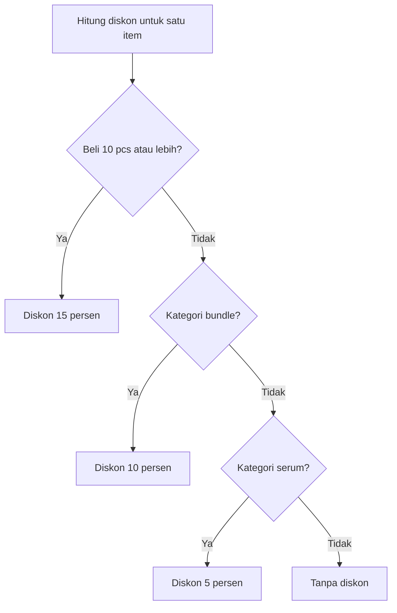
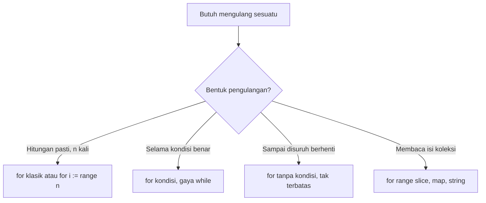
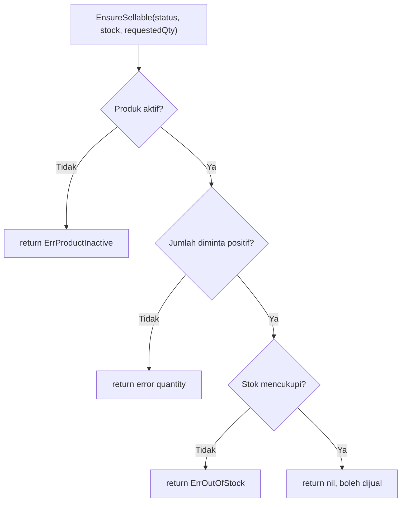
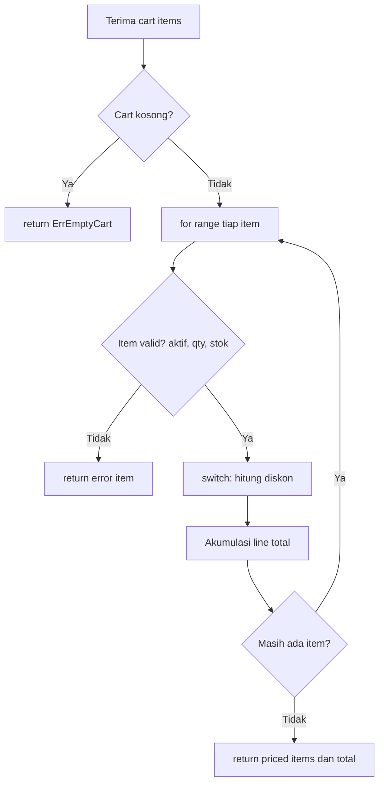
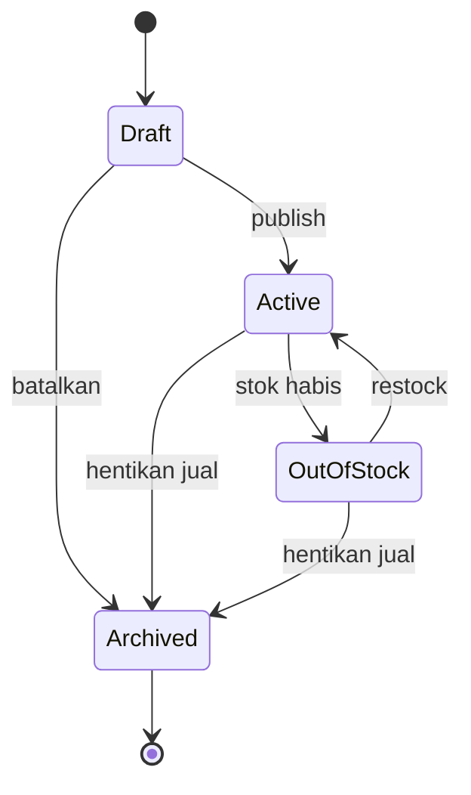

import { Section, Box, Steps, Step, Recap, CardGrid, Card, Chip, Hero, Compare, FileTree, Def } from "@components";

<Hero eyebrow="Roadmap 1 &middot; Fondasi" title="Control Flow <em>di Go</em><br />Keputusan dan Loop yang Idiomatik">
  <p>Di modul ini kamu belajar cara Go mengambil keputusan dan mengulang pekerjaan lewat skenario stok, diskon, dan status produk skincare, dengan gaya kode yang sengaja dibuat datar agar mudah dibaca dan dites.</p>
  <Fragment slot="meta">
    <Chip icon="code">Bahasa: <b>Go 1.26</b></Chip>
    <Chip icon="clock">~70 menit baca</Chip>
    <Chip icon="rocket">Proyek: <b>Online Shop Skincare</b></Chip>
  </Fragment>
</Hero>

<Section num="01" id="intro" title="Control Flow sebagai Bahasa Keputusan Backend" sub="Sintaks yang familier, tetapi dengan aturan yang lebih ketat">

<p class="lead">Control flow adalah cara program memilih jalur eksekusi, mengulang data, dan berhenti lebih cepat saat kondisi bisnis tidak valid.</p>

Kalau kamu datang dari JavaScript, bentuk `if`, `switch`, dan `for` akan langsung terasa familier. Bedanya, Go sengaja menyediakan lebih sedikit variasi. Tidak ada `while`, tidak ada `do while`, tidak ada method `forEach` bawaan di slice, dan tidak ada truthy atau falsy implisit untuk kondisi. Setiap keputusan harus berujung pada ekspresi `bool` yang jelas.

<Box variant="bridge" icon="🌉" label="Jembatan: dari JavaScript ke Go"><p>Di JS kamu bisa menulis `if (items.length)` karena angka dianggap truthy. Di Go, kondisi harus `bool`, jadi tulis eksplisit seperti `if len(items) > 0`. Niat kode jadi tidak bisa ditebak-tebak.</p></Box>

Di backend online shop skincare, control flow muncul hampir di semua tempat: validasi stok, status produk aktif atau tidak, aturan diskon, batas quantity, dan keputusan apakah checkout boleh lanjut. Modul ini membuat kamu nyaman membaca dan menulis pola itu secara idiomatik, lalu menyambungnya ke model `Product` dan `ProductStatus` yang sudah kita bentuk di modul tipe.

<Def term="control flow"><p>Urutan eksekusi program yang dikendalikan oleh kondisi, percabangan, pengulangan, dan `return`. Di Go, semua kondisi wajib bertipe `bool`.</p></Def>

Acuan resmi yang paling penting untuk materi ini adalah [Go Specification tentang Statements](https://go.dev/ref/spec#Statements), lalu gaya penulisan idiomatiknya diperkaya lewat [Effective Go](https://go.dev/doc/effective_go).

</Section>

<Section num="02" id="if-else" title="if dan else Tanpa Ritual Berlebih" sub="Kondisi tetap wajib bool, tetapi tanda kurung tidak dipakai">

<p class="lead">Di Go, `if` terlihat mirip JS, tetapi kondisi tidak dibungkus tanda kurung dan harus selalu bertipe `bool`.</p>

Contoh JS biasanya seperti ini.

```js title="validate-quantity.js"
if (requestedQty <= 0) {
  throw new Error("quantity must be positive");
}
```

Di Go, bentuk idiomatiknya seperti ini.

```go title="internal/checkout/quantity.go"
package checkout

import "fmt"

func ValidateQuantity(requestedQty int) error {
	if requestedQty <= 0 {
		return fmt.Errorf("quantity must be positive: %d", requestedQty)
	}

	return nil
}
```

Perhatikan dua hal. Pertama, tidak ada tanda kurung di sekitar kondisi. Kedua, kondisi harus `bool`, jadi `if requestedQty` tidak valid. Kamu wajib menulis niatnya dengan jelas, misalnya `requestedQty > 0`, `requestedQty == 0`, atau `requestedQty <= 0`.

<Box variant="warn" icon="⚠️" label="Jebakan: tidak ada truthy dan falsy"><p>Nilai `0`, string kosong, slice kosong, dan `nil` tidak otomatis menjadi false. Go memaksa kamu menulis kondisi eksplisit agar aturan bisnis tidak samar.</p></Box>

`else` tetap ada, tetapi sering kali tidak diperlukan kalau cabang sebelumnya sudah `return`. Inilah salah satu gaya yang membuat kode Go cenderung datar dan mudah discan dari atas ke bawah.

```go title="internal/inventory/message.go"
package inventory

func StockMessage(stock int) string {
	if stock <= 0 {
		return "stok habis"
	}

	if stock < 5 {
		return "stok menipis"
	}

	return "stok tersedia"
}
```

<Box variant="tip" icon="💡" label="Idiom Go: return cepat, bukan tumpukan else"><p>Daripada menumpuk `else if`, Go lebih sering memakai return cepat. Cabang yang lebih spesifik selesai dulu, lalu kondisi paling umum berada di bawah sebagai jalur terakhir.</p></Box>

</Section>

<Section num="03" id="if-init-error" title="if dengan Inisialisasi dan Pola Error" sub="Bentuk yang muncul di hampir semua kode Go produksi">

<p class="lead">Go punya bentuk `if` dengan statement pendek sebelum kondisi, sangat cocok untuk nilai sementara seperti `error`.</p>

Spesifikasi Go mengizinkan `if` didahului satu simple statement, dipisah titik koma. Dalam praktik backend, bentuk paling sering adalah memeriksa error dari validasi, query database, parsing input, dan operasi I/O.

```go title="internal/checkout/stock.go"
package checkout

import (
	"errors"
	"fmt"
)

var (
	ErrInvalidQuantity   = errors.New("quantity must be positive")
	ErrInsufficientStock = errors.New("insufficient stock")
)

func ValidateStock(stock, requestedQty int) error {
	if requestedQty <= 0 {
		return fmt.Errorf("%w: %d", ErrInvalidQuantity, requestedQty)
	}

	if requestedQty > stock {
		return fmt.Errorf("%w: requested %d, available %d", ErrInsufficientStock, requestedQty, stock)
	}

	return nil
}

func CanCheckout(stock, requestedQty int) (bool, error) {
	if err := ValidateStock(stock, requestedQty); err != nil {
		return false, err
	}

	return true, nil
}
```

Pada `CanCheckout`, variabel `err` hanya hidup di dalam blok `if` dan cabang terkait. Ini mirip membuat variabel lokal kecil di JS, tetapi scope-nya lebih ketat sehingga nilai sementara tidak bocor ke baris-baris di bawahnya.

<Compare aLabel="JavaScript" bLabel="Go" aTone="muted" bTone="violet">
  <Fragment slot="a"><ul><li>Sering memakai `try/catch` atau penolakan promise.</li><li>Error bisa melompat jauh dari lokasi asalnya.</li><li>Mudah lupa menangani satu cabang gagal.</li></ul></Fragment>
  <Fragment slot="b"><ul><li>Error adalah nilai biasa yang dikembalikan fungsi.</li><li>`if err := ...; err != nil` membuat jalur gagal terlihat eksplisit.</li><li>Compiler ikut mengingatkan kalau error tidak dipakai.</li></ul></Fragment>
</Compare>

<Box variant="bridge" icon="🌉" label="Jembatan: scope seperti blok kecil"><p>Bayangkan `if err := ...; err != nil` seperti membuat `const err = ...` yang hanya hidup untuk blok validasi itu, bukan untuk seluruh fungsi. Begitu blok selesai, `err` lenyap.</p></Box>

Pola ini juga menjaga nama variabel tetap pendek. Nama `err` aman dipakai berulang di banyak `if` karena setiap blok punya scope sendiri. Tanda `%w` pada `fmt.Errorf` membungkus error sentinel agar pemanggil bisa memeriksanya dengan `errors.Is`. Kita bahas lebih dalam di modul function dan error, tetapi pola membungkus error ini akan terus kamu temui.

</Section>

<Section num="04" id="switch" title="switch yang Tidak Jatuh Otomatis" sub="Tidak butuh break di tiap case, dan fallthrough harus eksplisit">

<p class="lead">`switch` di Go cocok untuk status domain, kategori diskon, dan cabang bisnis yang jumlahnya lebih dari dua.</p>

Di JavaScript, `switch` jatuh ke case berikutnya kalau kamu lupa `break`. Di Go, perilaku defaultnya kebalikannya. Setelah satu `case` cocok dan selesai dieksekusi, `switch` langsung berhenti. Kalau kamu benar-benar ingin lanjut ke case berikutnya, kamu harus menulis `fallthrough` secara eksplisit, dan itu jarang dibutuhkan.

```go title="internal/product/status.go"
package product

type ProductStatus string

const (
	ProductStatusDraft      ProductStatus = "draft"
	ProductStatusActive     ProductStatus = "active"
	ProductStatusArchived   ProductStatus = "archived"
	ProductStatusOutOfStock ProductStatus = "out_of_stock"
)

func (s ProductStatus) IsSellable() bool {
	return s == ProductStatusActive
}

func StatusLabel(status ProductStatus) string {
	switch status {
	case ProductStatusDraft:
		return "belum tampil di katalog"
	case ProductStatusActive:
		return "bisa dijual"
	case ProductStatusOutOfStock:
		return "stok habis"
	case ProductStatusArchived:
		return "diarsipkan"
	default:
		return "status tidak dikenal"
	}
}
```

<Box variant="bridge" icon="🌉" label="Jembatan: tanpa break, tanpa lupa break"><p>Bug klasik JS adalah lupa `break` lalu eksekusi bocor ke case berikutnya. Di Go bug itu mustahil terjadi secara default. Kamu justru menulis `fallthrough` hanya bila benar-benar sengaja.</p></Box>

`switch` juga bisa ditulis tanpa ekspresi di belakang kata kunci. Bentuk ini setara dengan memeriksa kondisi dari atas ke bawah, dan sering lebih rapi daripada rantai `if else if` yang panjang. Case pertama yang cocok akan menang.

```go title="internal/product/discount.go"
package product

func DiscountPercent(category string, qty int) int {
	switch {
	case qty >= 10:
		return 15
	case category == "bundle":
		return 10
	case category == "serum":
		return 5
	default:
		return 0
	}
}
```



<p class="fig-cap"><b>Gambar 1.</b> `switch` tanpa ekspresi mengevaluasi case dari atas ke bawah dan berhenti pada yang pertama cocok. Karena itu urutan case adalah keputusan bisnis: promo bulk sengaja dicek lebih dulu agar menang dari promo kategori.</p>

<Box variant="tip" icon="💡" label="Urutan case adalah aturan bisnis"><p>Pada contoh diskon, quantity besar dicek paling awal supaya promo bulk mengalahkan promo kategori. Ini bukan sekadar detail sintaks, ini keputusan domain yang sengaja ditulis lewat urutan.</p></Box>

Beberapa nilai bisa digabung dalam satu `case` dengan koma. Ini lebih jelas daripada `fallthrough` untuk mengelompokkan status yang diperlakukan sama.

```go title="internal/product/risk.go"
package product

func StatusRisk(status ProductStatus) string {
	switch status {
	case ProductStatusDraft, ProductStatusArchived, ProductStatusOutOfStock:
		return "tidak boleh dijual"
	case ProductStatusActive:
		return "boleh dijual"
	default:
		return "perlu review manual"
	}
}
```

`switch` juga menerima statement inisialisasi seperti `if`, misalnya `switch p := classify(x); p {`. Nilai `p` hanya hidup di dalam `switch` itu.

<Box variant="warn" icon="⚠️" label="Jebakan: default jangan jadi tempat menyembunyikan bug"><p>Untuk status domain yang harus ketat, `default` sebaiknya mengembalikan error atau label tidak dikenal, bukan diam-diam menganggap status aman. Anggap `default` sebagai alarm, bukan keset.</p></Box>

</Section>

<Section num="05" id="for-loop" title="for sebagai Satu-satunya Loop" sub="Go menyederhanakan semua pengulangan ke satu kata kunci">

<p class="lead">Di Go, `for` adalah satu-satunya loop. Tidak ada `while`, tidak ada `do while`, semuanya bentuk dari `for`.</p>

Bentuk klasiknya mirip JS, dengan init, kondisi, dan post statement.

```go title="internal/catalog/pagination.go"
package catalog

func PageNumbers(totalPages int) []int {
	pages := make([]int, 0, totalPages)

	for i := 1; i <= totalPages; i++ {
		pages = append(pages, i)
	}

	return pages
}
```

Kalau kamu butuh gaya `while`, tulis `for kondisi`. Ini umum untuk retry, membaca batch, atau memproses queue sampai kosong.

```go title="internal/inventory/retry.go"
package inventory

func RetryAttempts(maxAttempts int) []int {
	attempt := 1
	attempts := []int{}

	for attempt <= maxAttempts {
		attempts = append(attempts, attempt)
		attempt++
	}

	return attempts
}
```

Loop tak terbatas memakai `for` tanpa kondisi. Nanti di roadmap concurrency dan worker, bentuk ini muncul di background worker, consumer queue, dan scheduler.

```go title="internal/worker/loop.go"
package worker

func RunUntilStopped(shouldStop func() bool, process func()) {
	for {
		if shouldStop() {
			return
		}

		process()
	}
}
```

Sejak Go 1.22 ada bentuk ringkas untuk mengulang sebanyak `n` kali: `for i := range n`. Ini menggantikan trik lama membuat slice kosong hanya demi jumlah iterasi.

```go title="cmd/playground/repeat.go"
package main

import "fmt"

func main() {
	for i := range 3 {
		fmt.Println("percobaan ke", i+1)
	}
}
```



<p class="fig-cap"><b>Gambar 2.</b> Satu kata kunci `for`, empat bentuk pemakaian. Memilih bentuk yang tepat membuat niat loop langsung terbaca.</p>

<Box variant="bridge" icon="🌉" label="Jembatan: while JS menjadi for Go"><p>`while (hasMore)` di JS biasanya menjadi `for hasMore` di Go. Kata kuncinya tetap `for`, hanya bentuk kondisinya yang berubah.</p></Box>

<h3>break dan continue, termasuk versi berlabel</h3>

`break` menghentikan loop, `continue` melompat ke iterasi berikutnya. Untuk loop bersarang, Go punya label agar kamu bisa menghentikan atau melanjutkan loop terluar tanpa flag bantu yang ribet.

```go title="internal/order/scan.go"
package order

type Order struct {
	ID    int64
	Items []int // quantity tiap item
}

func FirstInvalidOrderID(orders []Order) int64 {
scan:
	for _, o := range orders {
		for _, qty := range o.Items {
			if qty <= 0 {
				return o.ID
			}

			if qty > 1000 {
				continue scan // item aneh, lompat ke order berikutnya
			}
		}
	}

	return 0
}
```

<Box variant="tip" icon="💡" label="Label dipakai hemat"><p>Label seperti `scan:` berguna untuk loop bersarang, tetapi jangan berlebihan. Kalau logikanya mulai rumit, ekstrak loop dalam menjadi fungsi kecil agar lebih mudah dibaca dan dites.</p></Box>

</Section>

<Section num="06" id="range-slice-map" title="for range untuk Slice dan Map" sub="Pengganti paling dekat untuk forEach, map, dan iterasi object">

<p class="lead">`for range` dipakai untuk membaca elemen slice, array, string, map, channel, integer, dan sejak Go 1.23 juga fungsi iterator.</p>

Untuk slice produk, `range` mengembalikan index dan value. Kalau index tidak dipakai, gunakan blank identifier `_`.

```go title="internal/catalog/list.go"
package catalog

type ProductStatus string

const ProductStatusActive ProductStatus = "active"

type Product struct {
	Name     string
	Status   ProductStatus
	Quantity int
}

func ActiveProductNames(products []Product) []string {
	names := []string{}

	for _, p := range products {
		if p.Status != ProductStatusActive {
			continue
		}

		names = append(names, p.Name)
	}

	return names
}
```

<Compare aLabel="JavaScript: forEach" bLabel="Go: range" aTone="muted" bTone="violet">
  <Fragment slot="a"><ul><li>`products.forEach((p, index) => ...)` memakai callback.</li><li>`return` di dalam callback tidak menghentikan fungsi luar.</li><li>Closure callback bisa menyulitkan saat ada validasi bercabang.</li></ul></Fragment>
  <Fragment slot="b"><ul><li>`for i, p := range products` adalah loop biasa, bukan callback.</li><li>`return`, `break`, dan `continue` bekerja langsung pada fungsi atau loop saat ini.</li><li>Lebih mudah digabung dengan guard clause dan error handling.</li></ul></Fragment>
</Compare>

<Box variant="warn" icon="⚠️" label="Jebakan paling sering: value di range adalah salinan"><p>`for _, p := range products` membuat `p` sebagai SALINAN elemen. Mengubah `p.Quantity` tidak mengubah isi slice. Untuk benar-benar memutasi elemen, akses lewat index: `products[i].Quantity = 0`.</p></Box>

```go title="internal/catalog/mutate.go"
package catalog

func ResetStock(products []Product) {
	// SALAH: p hanya salinan, slice tidak berubah
	for _, p := range products {
		p.Quantity = 0
	}

	// BENAR: ubah lewat index
	for i := range products {
		products[i].Quantity = 0
	}
}
```

Untuk map, `range` mengembalikan key dan value. Ini mirip iterasi object di JS, tetapi urutan iterasi map sengaja diacak dan tidak boleh kamu anggap stabil.

```go title="internal/catalog/report.go"
package catalog

import "fmt"

func CountByStatus(products []Product) map[ProductStatus]int {
	counts := map[ProductStatus]int{}

	for _, p := range products {
		counts[p.Status]++
	}

	return counts
}

func StatusReport(counts map[ProductStatus]int) []string {
	orderedStatuses := []ProductStatus{
		ProductStatusActive,
		"draft",
		"out_of_stock",
		"archived",
	}

	report := []string{}

	for _, status := range orderedStatuses {
		count := counts[status]
		if count == 0 {
			continue
		}

		report = append(report, fmt.Sprintf("%s=%d", status, count))
	}

	return report
}
```

<Box variant="warn" icon="⚠️" label="Jebakan: map bukan list terurut"><p>Jangan kirim response API yang bergantung pada urutan `range` map. Buat slice urutan eksplisit, seperti `orderedStatuses` di atas, kalau output perlu stabil untuk frontend atau test.</p></Box>

<Box variant="bridge" icon="🌉" label="Jembatan: bug closure loop yang sudah hilang"><p>Mungkin kamu pernah dengar bug Go lama: closure di dalam `for` menangkap variabel loop yang sama, sehingga semua goroutine melihat nilai terakhir. Sejak Go 1.22, setiap iterasi membuat variabel loop baru, jadi kelas bug itu hilang. Ini mirip beralih dari `var` ke `let` di loop JavaScript.</p></Box>

Sejak Go 1.23, `range` juga menerima fungsi iterator (`iter.Seq`), dan paket standar `slices` serta `maps` menyediakan helper seperti `slices.Values` dan `maps.Keys`. Kita belum memakainya sekarang, tetapi tahu bahwa `range` bisa melampaui slice dan map akan berguna nanti.

</Section>

<Section num="07" id="early-return" title="Early Return dan Guard Clause" sub="Salah satu rasa paling khas dari kode Go yang rapi">

<p class="lead">Go mendorong jalur gagal ditangani lebih awal, lalu happy path dibiarkan lurus di bagian bawah.</p>

Di React kamu mungkin sering menulis `if (!user) return null`. Ide guard clause itu sama. Di Go, guard clause dipakai untuk error, input invalid, otorisasi gagal, stok habis, atau status produk tidak aktif. Setiap syarat yang gagal keluar lebih dulu.

```go title="internal/checkout/availability.go"
package checkout

import (
	"errors"
	"fmt"

	"github.com/kamu/skincare-backend/internal/product"
)

var (
	ErrProductInactive = errors.New("product is not active")
	ErrOutOfStock      = errors.New("product is out of stock")
)

func EnsureSellable(status product.ProductStatus, stock, requestedQty int) error {
	if !status.IsSellable() {
		return ErrProductInactive
	}

	if requestedQty <= 0 {
		return fmt.Errorf("quantity must be positive: %d", requestedQty)
	}

	if stock == 0 {
		return ErrOutOfStock
	}

	if requestedQty > stock {
		return fmt.Errorf("requested quantity %d exceeds stock %d", requestedQty, stock)
	}

	return nil
}
```



<p class="fig-cap"><b>Gambar 3.</b> Guard clause membuat alur seperti checklist menurun. Setiap syarat gagal keluar cepat, dan satu-satunya jalur yang sampai ke bawah adalah jalur yang benar-benar valid.</p>

Tanpa guard clause, kode biasanya masuk ke piramida `if` bersarang. Pada service backend, piramida seperti ini cepat sulit dibaca karena setiap cabang punya error berbeda.

```go title="internal/checkout/availability_bad.go"
package checkout

import "fmt"

func EnsureSellableNested(status product.ProductStatus, stock, requestedQty int) error {
	if status.IsSellable() {
		if requestedQty > 0 {
			if stock > 0 {
				if requestedQty <= stock {
					return nil
				}

				return fmt.Errorf("requested quantity %d exceeds stock %d", requestedQty, stock)
			}

			return ErrOutOfStock
		}

		return fmt.Errorf("quantity must be positive: %d", requestedQty)
	}

	return ErrProductInactive
}
```

<Box variant="tip" icon="💡" label="Baca dari atas ke bawah"><p>Versi guard clause dan versi bersarang menghasilkan keputusan yang sama, tetapi yang pertama jauh lebih mudah discan. Mata cukup turun lurus, bukan menyusuri indentasi yang makin dalam.</p></Box>

</Section>

<Section num="08" id="domain-stock-discount" title="Skenario Domain: Stok, Diskon, dan Status Produk" sub="Menggabungkan if, switch, for, range, dan early return dalam satu alur">

<p class="lead">Skenario ini meniru service kecil untuk menghitung harga item checkout sebelum disimpan ke database.</p>

Kita rangkai semua yang dipelajari menjadi satu pipeline. Strukturnya mengikuti konvensi proyek: model katalog di `internal/product`, dan logika checkout di `internal/checkout`.

<FileTree title="Struktur latihan control flow" tree={`
internal/
  product/
    product.go     # struct Product + ProductStatus
    status.go      # IsSellable, StatusLabel
    discount.go    # DiscountPercent (switch)
  checkout/
    pricing.go     # PriceCart, validateItem
`} />

Model produk kita perluas sedikit dari modul tipe dengan menambah `Category`, karena aturan diskon bergantung pada kategori. Uang tetap `PriceRupiah int64`, sesuai konvensi proyek agar total checkout selalu presisi.

```go title="internal/product/product.go"
package product

type Product struct {
	ID          int64
	Name        string
	Category    string
	PriceRupiah int64
	Quantity    int // stok tersedia
	Status      ProductStatus
	IsActive    bool
}
```

```go title="internal/checkout/pricing.go"
package checkout

import (
	"errors"
	"fmt"

	"github.com/kamu/skincare-backend/internal/product"
)

type CartItem struct {
	Product product.Product
	Qty     int
}

type PricedItem struct {
	ProductID int64
	Name      string
	Qty       int
	UnitPrice int64
	LineTotal int64
}

var (
	ErrEmptyCart       = errors.New("cart is empty")
	ErrInactiveProduct = errors.New("product is not active")
)

func PriceCart(items []CartItem) ([]PricedItem, int64, error) {
	if len(items) == 0 {
		return nil, 0, ErrEmptyCart
	}

	priced := make([]PricedItem, 0, len(items))
	var total int64

	for _, item := range items {
		if err := validateItem(item); err != nil {
			return nil, 0, err
		}

		percent := product.DiscountPercent(item.Product.Category, item.Qty)
		unitPrice := applyDiscount(item.Product.PriceRupiah, percent)
		lineTotal := unitPrice * int64(item.Qty)

		priced = append(priced, PricedItem{
			ProductID: item.Product.ID,
			Name:      item.Product.Name,
			Qty:       item.Qty,
			UnitPrice: unitPrice,
			LineTotal: lineTotal,
		})

		total += lineTotal
	}

	return priced, total, nil
}

func validateItem(item CartItem) error {
	p := item.Product

	if !p.Status.IsSellable() {
		return fmt.Errorf("%w: %s", ErrInactiveProduct, p.Name)
	}

	if item.Qty <= 0 {
		return fmt.Errorf("quantity for %s must be positive", p.Name)
	}

	if item.Qty > p.Quantity {
		return fmt.Errorf("quantity for %s exceeds stock", p.Name)
	}

	return nil
}

func applyDiscount(priceRupiah int64, percent int) int64 {
	// kalikan dulu baru bagi agar pembulatan rupiah tetap presisi
	return priceRupiah - priceRupiah*int64(percent)/100
}
```

Alur di atas bisa dibaca seperti pipeline sederhana: cek dulu kasus kosong, lalu loop tiap item dengan guard clause, hitung diskon dengan `switch`, dan akumulasi total.



<p class="fig-cap"><b>Gambar 4.</b> Early return membuat jalur gagal keluar cepat, sehingga jalur sukses tetap lurus dari atas ke bawah.</p>

<Box variant="note" icon="📝" label="Kenapa diskon pakai integer"><p>Karena uang `int64`, diskon persen di sini memakai aritmetika integer dengan urutan kalikan dulu baru bagi. Untuk persen yang butuh pembulatan halus, kamu bisa mampir sebentar ke `float64` lalu `math.Round`, seperti dibahas di modul tipe. Keduanya menjaga uang tetap `int64`.</p></Box>

Status produk sendiri sebenarnya membentuk sebuah state machine. Inilah yang dijaga oleh `if`, `switch`, dan guard clause kita: setiap transisi hanya boleh terjadi lewat keputusan yang sah, dan hanya `active` yang lolos `IsSellable`.



<p class="fig-cap"><b>Gambar 5.</b> Daur hidup status produk. Control flow adalah penjaga gerbang transisi ini: hanya `Active` yang boleh dijual, dan perpindahan antar status diputuskan oleh `if` serta `switch` di service.</p>

<CardGrid cols={3}>
  <Card><h4>if</h4><p>Guard untuk cart kosong, status tidak aktif, quantity tidak valid, dan stok kurang.</p></Card>
  <Card><h4>for range</h4><p>Membaca setiap item cart sebagai loop biasa, bukan callback.</p></Card>
  <Card><h4>switch</h4><p>Memilih aturan diskon berdasarkan prioritas bisnis lewat urutan case.</p></Card>
</CardGrid>

</Section>

<Section num="09" id="hands-on" title="Hands-on Ringan" sub="Buat fungsi kecil, jalankan test, lalu ubah aturan bisnisnya">

<p class="lead">Latihan ini kecil, tetapi polanya akan terus kamu pakai sampai roadmap API, database, dan checkout.</p>

<Steps>
  <Step><b>Buat package `internal/product`</b><p>Package ini menyimpan tipe status produk dan validasi stok.</p></Step>
  <Step><b>Tulis fungsi guard clause</b><p>Mulai dari validasi status, lalu quantity, lalu stok.</p></Step>
  <Step><b>Tambahkan test table-driven</b><p>Beberapa kasus sekaligus agar kamu melihat peran `for range` di dalam test.</p></Step>
  <Step><b>Jalankan `go test ./...`</b><p>Pastikan semua cabang bisnis tertutup.</p></Step>
</Steps>

Di latihan ini kita bundel parameter menjadi satu `Product` agar tanda tangan fungsi lebih bersih, lalu memvalidasinya dengan guard clause.

```go title="internal/product/controlflow.go"
package product

import (
	"errors"
	"fmt"
)

type ProductStatus string

const (
	ProductStatusDraft      ProductStatus = "draft"
	ProductStatusActive     ProductStatus = "active"
	ProductStatusArchived   ProductStatus = "archived"
	ProductStatusOutOfStock ProductStatus = "out_of_stock"
)

func (s ProductStatus) IsSellable() bool {
	return s == ProductStatusActive
}

type Product struct {
	Name     string
	Status   ProductStatus
	Quantity int // stok tersedia
}

var (
	ErrProductNotActive  = errors.New("product is not active")
	ErrInvalidQuantity   = errors.New("quantity must be positive")
	ErrInsufficientStock = errors.New("insufficient stock")
)

func ValidateStock(p Product, requestedQty int) error {
	if !p.Status.IsSellable() {
		return fmt.Errorf("%w: %s", ErrProductNotActive, p.Name)
	}

	if requestedQty <= 0 {
		return fmt.Errorf("%w: %d", ErrInvalidQuantity, requestedQty)
	}

	if requestedQty > p.Quantity {
		return fmt.Errorf("%w: requested %d, available %d", ErrInsufficientStock, requestedQty, p.Quantity)
	}

	return nil
}

func CanDisplayInCatalog(status ProductStatus) bool {
	switch status {
	case ProductStatusActive:
		return true
	case ProductStatusDraft, ProductStatusArchived, ProductStatusOutOfStock:
		return false
	default:
		return false
	}
}
```

```go title="internal/product/controlflow_test.go"
package product

import (
	"errors"
	"testing"
)

func TestValidateStock(t *testing.T) {
	active := Product{Name: "Niacinamide Serum", Status: ProductStatusActive, Quantity: 5}
	draft := Product{Name: "Hydrating Toner", Status: ProductStatusDraft, Quantity: 5}

	tests := []struct {
		name        string
		product     Product
		requestedQty int
		wantErr     error
	}{
		{name: "stok valid", product: active, requestedQty: 2, wantErr: nil},
		{name: "produk draft", product: draft, requestedQty: 1, wantErr: ErrProductNotActive},
		{name: "quantity nol", product: active, requestedQty: 0, wantErr: ErrInvalidQuantity},
		{name: "stok kurang", product: active, requestedQty: 9, wantErr: ErrInsufficientStock},
	}

	for _, tt := range tests {
		t.Run(tt.name, func(t *testing.T) {
			err := ValidateStock(tt.product, tt.requestedQty)

			if tt.wantErr == nil {
				if err != nil {
					t.Fatalf("expected nil error, got %v", err)
				}
				return
			}

			if !errors.Is(err, tt.wantErr) {
				t.Fatalf("expected %v, got %v", tt.wantErr, err)
			}
		})
	}
}
```

```bash title="Terminal"
go test ./...
```

<Box variant="note" icon="📝" label="Latihan lanjutan"><p>Ubah aturan agar produk `archived` mengembalikan error berbeda dari `draft`, lalu tambahkan kasus baru ke tabel test tanpa mengubah struktur besar fungsi. Perhatikan betapa `for range` atas tabel membuat penambahan kasus jadi murah.</p></Box>

</Section>

<Section num="10" id="jebakan-umum" title="Jebakan Umum dari JS dan PHP" sub="Kesalahan kecil yang sering muncul saat pindah ke Go">

<p class="lead">Mayoritas bug awal bukan karena sintaks Go sulit, tetapi karena kebiasaan dari JS atau PHP terbawa tanpa sadar.</p>

<CardGrid cols={2}>
  <Card><h4>Mengandalkan truthy atau falsy</h4><p>Go tidak menerima `if stock` atau `if name`. Tulis `stock > 0` dan `name != ""`.</p></Card>
  <Card><h4>Menulis else setelah return</h4><p>Valid, tetapi sering membuat fungsi lebih bersarang. Pilih guard clause untuk error dan validasi awal.</p></Card>
  <Card><h4>Mengubah value hasil range</h4><p>`for _, p := range products` memberi salinan. Untuk memutasi slice, pakai `products[i]` lewat index.</p></Card>
  <Card><h4>Menganggap map punya urutan stabil</h4><p>Jangan membuat test atau response frontend yang bergantung pada urutan iterasi map.</p></Card>
  <Card><h4>Membawa kebiasaan switch JS</h4><p>Go tidak perlu `break` di tiap case. `fallthrough` ada, tetapi harus eksplisit dan jarang cocok untuk domain.</p></Card>
  <Card><h4>Memakai loop saat fungsi kecil lebih jelas</h4><p>Kalau isi loop makin panjang, ekstrak ke fungsi seperti `validateItem` agar guard clause mudah dites.</p></Card>
</CardGrid>

<Box variant="bridge" icon="🌉" label="Jembatan: dari Laravel validation ke Go service"><p>Di Laravel, validasi sering dideklarasikan di request class. Di Go, validasi domain biasanya berupa fungsi eksplisit yang mengembalikan `error`, lalu dipanggil dari service atau handler. Aturan bisnis jadi terlihat sebagai kode, bukan konfigurasi tersembunyi.</p></Box>

</Section>

<Section num="11" id="ringkasan" title="Ringkasan & Poin Penting">

<p class="lead">Control flow adalah fondasi sebelum kita masuk ke function, error, struct, lalu API dengan net/http dan chi.</p>

<Recap title="Yang Wajib Menempel">
  <ul>
    <li>`if` di Go tidak memakai tanda kurung kondisi, dan kondisi harus `bool` eksplisit.</li>
    <li>`if err := ...; err != nil` adalah pola utama untuk operasi yang bisa gagal, dengan scope error yang ketat.</li>
    <li>`switch` tidak butuh `break`, dan `fallthrough` hanya terjadi kalau ditulis. `switch` tanpa ekspresi menang pada case pertama yang cocok.</li>
    <li>`for` adalah satu-satunya loop: bentuk klasik, gaya `while`, tak terbatas, `for i := range n`, dan `for range` koleksi.</li>
    <li>`for range` atas slice memberi salinan value, jadi memutasi elemen butuh akses lewat index. Urutan iterasi map tidak stabil.</li>
    <li>Early return dan guard clause membuat service Go datar, mudah dibaca, dan mudah dites.</li>
  </ul>
</Recap>

<h3>Pemetaan ke proyek online shop skincare</h3>

<CardGrid cols={2}>
  <Card><h4>Validasi katalog dan stok</h4><p>`ValidateStock`, `EnsureSellable`, dan `IsSellable` menjaga produk aktif, stok cukup, dan quantity valid sebelum checkout.</p></Card>
  <Card><h4>Aturan harga dan status</h4><p>`switch` memilih diskon berdasarkan prioritas bisnis, dan menjaga transisi status produk lewat keputusan yang sah.</p></Card>
</CardGrid>

<Box variant="bridge" icon="🌉" label="Langkah berikutnya"><p>Setelah control flow nyaman, modul berikutnya membahas function dan pola error: parameter, multiple return, named return, `errors.New`, `fmt.Errorf`, dan error wrapping. Di sana logika seperti `ValidateStock`, `PriceCart`, dan `ApplyDiscount` akan kita rapikan menjadi fungsi dan package yang bersih.</p></Box>

<Box variant="tip" icon="✅" label="Checkpoint sebelum lanjut"><p>Pastikan kamu bisa menjelaskan kenapa kondisi Go harus `bool`, menulis `if err := ...; err != nil`, membedakan empat bentuk `for`, menjelaskan kenapa value hasil `range` adalah salinan, dan menulis satu fungsi guard clause untuk validasi stok.</p></Box>

</Section>
