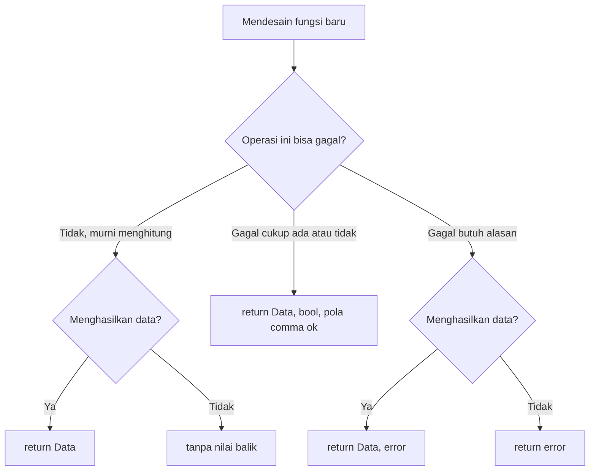
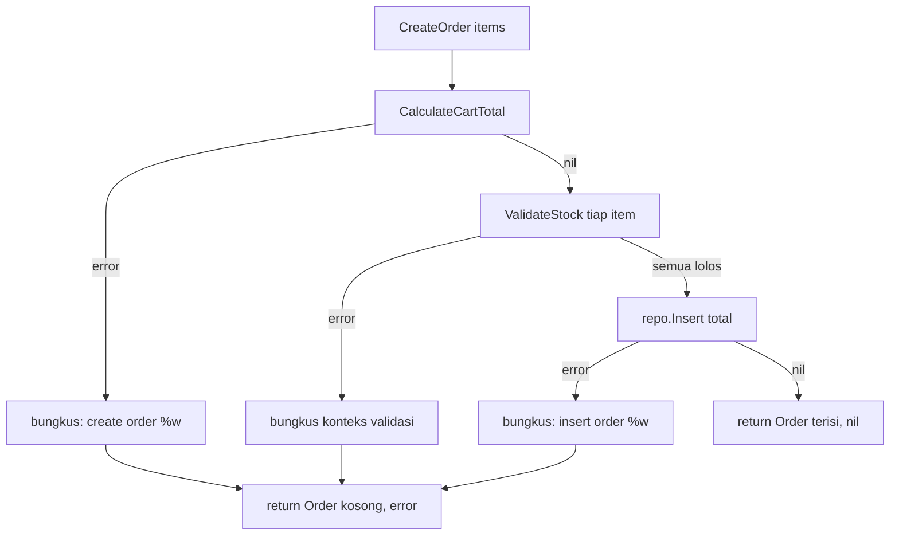
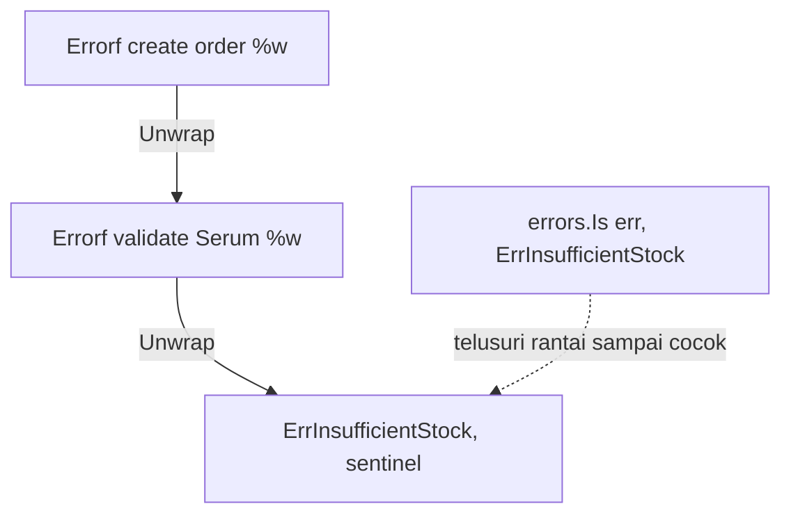
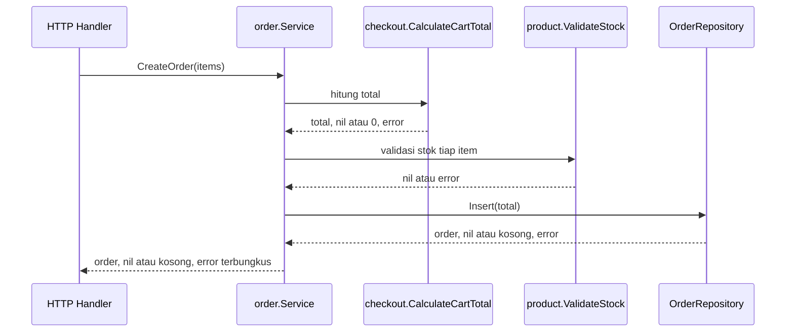
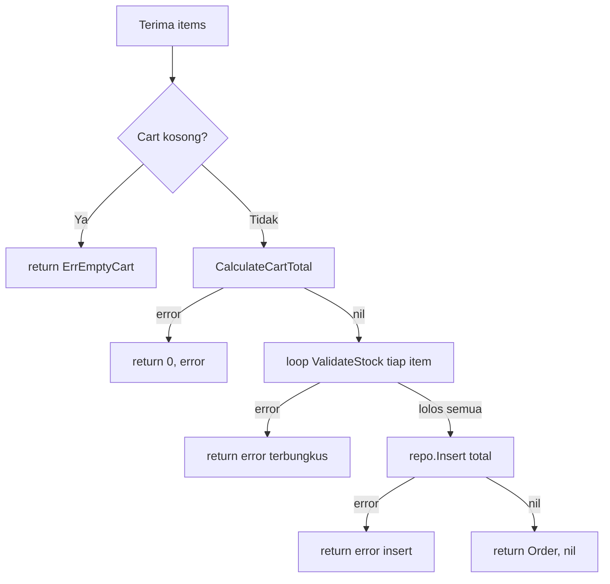

import { Section, Box, Steps, Step, Recap, CardGrid, Card, Chip, Hero, Compare, FileTree, Def } from "@components";

<Hero eyebrow="Roadmap 1 &middot; Fondasi" title="Fungsi dan <em>Error Return</em><br />Pola Pikir Backend Go">
  <p>Di modul ini kita mengubah kebiasaan dari `throw` dan `catch` menjadi fungsi yang jujur mengembalikan hasil dan error, lalu merangkainya menjadi service checkout skincare yang eksplisit dan mudah dites.</p>
  <Fragment slot="meta">
    <Chip icon="code">Bahasa: <b>Go 1.26</b></Chip>
    <Chip icon="clock">~70 menit baca</Chip>
    <Chip icon="rocket">Proyek: <b>Online Shop Skincare</b></Chip>
  </Fragment>
</Hero>

<Section num="01" id="intro" title="Kenapa Fungsi dan Error Terasa Berbeda di Go" sub="Dari throw di JS/PHP ke return eksplisit di Go">

<p class="lead">Kalau kamu terbiasa React, Node.js, atau Laravel, bagian paling asing dari Go biasanya bukan sintaks fungsi, melainkan cara fungsi memberi tahu kegagalan.</p>

Di JavaScript, error biasanya bergerak lewat `throw`, `Promise.reject`, atau `catch`. Di PHP dan Laravel modern, kamu sering melihat exception yang dilempar dari service, validator, model, atau framework. Di Go, pola defaultnya berbeda: fungsi mengembalikan `error` sebagai nilai biasa, lalu pemanggil memutuskan apa yang harus dilakukan.

<Box variant="bridge" icon="🌉" label="Jembatan: throw vs return error, perubahan pola pikir terbesar di Go"><p>Di JS/PHP, error sering meloncat keluar dari fungsi sampai tertangkap di suatu tempat. Di Go, error berjalan lewat return value, sehingga alur sukses dan gagal terlihat berdampingan di tempat yang sama.</p></Box>

Ini membuat kode Go terlihat lebih repetitif di awal, terutama karena `if err != nil` muncul berkali-kali. Namun repetisi itu bukan kebetulan. Go sengaja memilih error handling yang eksplisit supaya service backend mudah dibaca, mudah diuji, dan tidak menyembunyikan kegagalan penting di balik mekanisme exception.

<Def term="error"><p>`error` adalah interface bawaan Go untuk merepresentasikan kegagalan. Nilai `nil` berarti tidak ada error, nilai selain `nil` berarti pemanggil wajib menangani kegagalan itu sebelum memakai hasilnya.</p></Def>

Modul ini melanjutkan langsung dari modul control flow. Guard clause dan early return yang sudah kamu pelajari di sana kini berpasangan dengan return `error`, dan untuk proyek online shop skincare pola ini akan muncul di semua layer: menghitung total cart, mengecek stok, membuat order, memproses payment callback, membaca database, sampai memanggil layanan eksternal.

Acuan resmi yang relevan: [Go tutorial tentang error](https://go.dev/doc/tutorial/handle-errors), [Effective Go](https://go.dev/doc/effective_go), paket [errors](https://pkg.go.dev/errors), dan [fmt.Errorf](https://pkg.go.dev/fmt#Errorf).

</Section>

<Section num="02" id="deklarasi-fungsi" title="Deklarasi Fungsi dan Bentuk Return" sub="Parameter dan return type ditulis eksplisit di signature">

<p class="lead">Fungsi Go dideklarasikan dengan kata kunci `func`, nama fungsi, parameter bertipe, lalu tipe hasil. Yang baru dari JS adalah: bentuk return menjadi bagian dari kontrak yang dibaca compiler.</p>

Bentuk dasarnya seperti ini.

```text title="syntax/function.go"
func NamaFungsi(param tipe) hasilTipe
```

Dibandingkan TypeScript, Go terasa seperti TypeScript yang lebih ketat. Parameter wajib punya tipe, return type selalu jelas di signature, dan compiler menolak jika jalur return tidak sesuai.

<Compare aLabel="TypeScript" bLabel="Go" aTone="muted" bTone="blue">
  <Fragment slot="a"><ul><li>Return type bisa ditulis, tetapi sering diinfer.</li><li>Error sering dilempar, jadi tidak terlihat di signature.</li><li>`Promise&lt;Product&gt;` tidak memberi tahu apakah fungsi bisa gagal tanpa membaca isinya.</li></ul></Fragment>
  <Fragment slot="b"><ul><li>Return type selalu berada di signature fungsi.</li><li>Kemungkinan gagal ikut sebagai return value.</li><li>`(Product, error)` langsung memberi tahu pemanggil bahwa fungsi bisa gagal.</li></ul></Fragment>
</Compare>

Contoh fungsi kecil yang murni menghitung, jadi tidak butuh error. Strukturnya mengikuti konvensi proyek: model katalog di `internal/product`, logika keranjang di `internal/checkout`, dan uang sebagai `int64` lewat field `PriceRupiah`.

```go title="internal/checkout/pricing.go"
package checkout

import "github.com/kamu/skincare-backend/internal/product"

type CartItem struct {
	Product product.Product
	Qty     int
}

// LineTotal murni menghitung, tidak ada cara untuk gagal,
// jadi signature-nya cukup mengembalikan int64 tanpa error.
func LineTotal(item CartItem) int64 {
	return item.Product.PriceRupiah * int64(item.Qty)
}
```

Jangan menambahkan `error` hanya karena fungsi lain punya error. Pertanyaan desain yang lebih baik: apa hasil suksesnya, dan apakah fungsi ini bisa gagal dengan cara yang perlu diketahui pemanggil. Jawaban itu menentukan bentuk return.



<p class="fig-cap"><b>Gambar 1.</b> Bentuk return bukan kebiasaan, melainkan keputusan desain. Tiga pertanyaan ini menentukan apakah fungsi mengembalikan data saja, `(Data, error)`, `error` saja, atau `(Data, bool)`.</p>

<Box variant="tip" icon="💡" label="Tip idiomatik"><p>Tambahkan `error` hanya ketika fungsi memang bisa gagal dengan cara yang perlu diketahui pemanggil. Fungsi murni seperti `LineTotal` lebih jujur tanpa error.</p></Box>

</Section>

<Section num="03" id="multiple-return-values" title="Multiple Return Values" sub="Fondasi pola hasil, error di Go">

<p class="lead">Go bisa mengembalikan lebih dari satu nilai dari fungsi, dan inilah fondasi pola `hasil, error`.</p>

Di JavaScript, satu fungsi hanya mengembalikan satu nilai. Kalau ingin dua nilai, kamu membungkusnya dalam object atau array. Di Go, multiple return values adalah fitur bahasa, bukan trik data structure.

Nilai kedua tidak selalu `error`. Untuk lookup sederhana, `bool` bernama `ok` cukup untuk menyatakan apakah data ada. Pola ini disebut comma ok, dan kamu sudah melihatnya saat mengambil nilai dari map.

```go title="internal/product/catalog.go"
package product

// FindByID mengembalikan (Product, bool): produk dan apakah ia ada.
// Tidak ada alasan kegagalan yang perlu dijelaskan, cukup ada atau tidak.
func FindByID(catalog map[int64]Product, id int64) (Product, bool) {
	p, ok := catalog[id]
	return p, ok
}
```

Namun jika gagal perlu alasan, misalnya cart kosong, quantity tidak valid, database timeout, atau stok tidak cukup, gunakan `error`. Perhatikan urutannya: hasil utama dulu, `error` terakhir.

```go title="internal/checkout/total.go"
package checkout

import "errors"

var ErrEmptyCart = errors.New("cart is empty")

func CalculateCartTotal(items []CartItem) (int64, error) {
	if len(items) == 0 {
		return 0, ErrEmptyCart
	}

	var total int64
	for _, item := range items {
		total += LineTotal(item)
	}

	return total, nil
}
```

Saat sukses, error bernilai `nil`. Saat gagal, hasil utama biasanya dikembalikan sebagai zero value yang aman, misalnya `0`, `""`, atau struct kosong seperti `Order{}`. Kontraknya jelas: kalau `err != nil`, jangan percaya nilai pertama.

<Box variant="note" icon="🧭" label="Kenapa error di posisi terakhir"><p>Dengan error di posisi terakhir, pemanggil bisa membaca `result, err := Fungsi()` lalu langsung memeriksa `err` sebelum menyentuh `result`. Ini konvensi yang dipakai hampir semua paket standar Go.</p></Box>

<Box variant="bridge" icon="🌉" label="Jembatan: tuple destructuring yang dijamin compiler"><p>`result, err := Fungsi()` terasa seperti array destructuring di JS, `const [result, err] = fn()`. Bedanya, di Go jumlah dan tipe nilai dijamin compiler, bukan konvensi yang bisa meleset diam-diam.</p></Box>

</Section>

<Section num="04" id="error-sebagai-nilai" title="Error sebagai Nilai, Bukan Exception" sub="Tidak ada try/catch sebagai pola utama">

<p class="lead">Di Go, error bukan jalur kontrol tersembunyi, melainkan nilai yang ikut keluar dari fungsi dan diperiksa pemanggil.</p>

Pola ini berbeda dari `try/catch`. Go tidak memakai exception untuk error normal seperti cart kosong, stok tidak cukup, produk tidak ditemukan, atau query gagal. Error semacam itu adalah bagian dari kontrak fungsi, bukan kejutan yang melompat ke atas call stack.

<Compare aLabel="JS async / catch" bLabel="Go: if err != nil" aTone="muted" bTone="violet">
  <Fragment slot="a"><ul><li>`throw` bisa muncul dari fungsi yang dipanggil jauh di dalam call stack.</li><li>`catch` biasanya berada di boundary seperti route handler atau middleware.</li><li>Signature fungsi tidak menunjukkan error apa yang mungkin terjadi.</li></ul></Fragment>
  <Fragment slot="b"><ul><li>Error dikembalikan dari fungsi yang gagal, di tempat kejadian.</li><li>Pemanggil langsung memilih: return, wrap, retry, atau fallback.</li><li>Signature `(Order, error)` membuat kemungkinan gagal terlihat sejak awal.</li></ul></Fragment>
</Compare>

Contoh JavaScript yang umum, di mana satu `catch` menelan semua langkah.

```js title="checkout.js"
async function createOrder(items) {
  try {
    const total = await calculateCartTotal(items)
    const order = await orderRepository.insert(total)
    return order
  } catch (error) {
    throw new Error(`create order failed: ${error.message}`)
  }
}
```

Versi Go membuat kegagalan setiap langkah terlihat eksplisit, dan setiap error dibungkus dengan konteks layer saat ini.

```go title="internal/order/service.go"
package order

import (
	"fmt"

	"github.com/kamu/skincare-backend/internal/checkout"
	"github.com/kamu/skincare-backend/internal/product"
)

type Order struct {
	ID    int64
	Total int64
}

type Repository interface {
	Insert(total int64) (Order, error)
}

type Service struct {
	orders Repository
}

func (s Service) CreateOrder(items []checkout.CartItem) (Order, error) {
	total, err := checkout.CalculateCartTotal(items)
	if err != nil {
		return Order{}, fmt.Errorf("create order: %w", err)
	}

	for _, item := range items {
		if err := product.ValidateStock(item.Product, item.Qty); err != nil {
			return Order{}, fmt.Errorf("create order: %w", err)
		}
	}

	order, err := s.orders.Insert(total)
	if err != nil {
		return Order{}, fmt.Errorf("insert order: %w", err)
	}

	return order, nil
}
```

Kalau kamu melihat `return Order{}, err`, baca artinya sebagai: hasil tidak valid, dan alasan gagal ada di `err`. Jangan memakai `Order{}` setelah `err` tidak `nil`.



<p class="fig-cap"><b>Gambar 2.</b> Error return membuat setiap titik gagal menjadi cabang eksplisit. Semua jalur gagal berkumpul ke satu hasil kosong plus error, dan hanya satu jalur lurus yang sampai ke `return order, nil`.</p>

<Box variant="bridge" icon="🌉" label="Jembatan: dari Laravel exception ke Go error"><p>Di Laravel, service sering melempar `ValidationException` atau `ModelNotFoundException` yang ditangkap handler global lalu diubah jadi response. Di Go, fungsi mengembalikan error yang sama informatifnya, tetapi pemanggil yang memutuskan kapan mengubahnya jadi HTTP 404 atau 409. Keputusan itu menjadi kode yang terlihat, bukan konvensi framework tersembunyi.</p></Box>

</Section>

<Section num="05" id="idiom-if-err" title="Idiom if err != nil" sub="Repetitif, tetapi sengaja dibuat jelas">

<p class="lead">Pola `if err != nil` adalah salah satu hal pertama yang harus terasa natural ketika menulis Go.</p>

Kode Go sering terlihat seperti ini, dengan inisialisasi pendek di dalam `if`.

```go title="internal/order/checkout.go"
func (s Service) Checkout(items []checkout.CartItem) (Order, error) {
	if err := checkout.ValidateCart(items); err != nil {
		return Order{}, fmt.Errorf("validate cart: %w", err)
	}

	order, err := s.CreateOrder(items)
	if err != nil {
		return Order{}, fmt.Errorf("checkout: %w", err)
	}

	return order, nil
}
```

`if err := checkout.ValidateCart(items); err != nil` memakai statement inisialisasi sebelum kondisi. Variabel `err` hanya hidup di scope `if` itu. Ini cocok ketika kamu tidak butuh nilai lain dari fungsi tersebut, dan membuat nama `err` aman dipakai berulang karena tiap blok punya scope sendiri.

<Box variant="analogy" icon="🧾" label="Analogi: kasir checkout"><p>Kasir tidak lanjut ke pembayaran kalau stok belum valid. Go juga begitu: periksa error di tiap tahap sebelum melanjutkan ke tahap berikutnya, bukan mengerjakan semua lalu menyesal di akhir.</p></Box>

Kenapa tidak menyembunyikan pola ini di balik helper generik seperti `must()`? Karena error handling bukan noise, melainkan keputusan domain. Untuk cart kosong, kita mungkin balas HTTP 400. Untuk database down, HTTP 500. Untuk payment timeout, kita mungkin simpan status `pending` lalu retry. Setiap `if err != nil` adalah tempat keputusan itu hidup.

<CardGrid cols={3}>
  <Card><h4>Return</h4><p>Dipakai saat fungsi tidak bisa melanjutkan dengan aman, cukup teruskan error ke atas.</p></Card>
  <Card><h4>Wrap</h4><p>Dipakai saat error perlu konteks tambahan dari layer saat ini, lewat `fmt.Errorf` dengan `%w`.</p></Card>
  <Card><h4>Handle</h4><p>Dipakai di boundary seperti handler HTTP, worker, atau CLI, tempat error berubah jadi keputusan akhir.</p></Card>
</CardGrid>

</Section>

<Section num="06" id="membuat-dan-wrap-error" title="Membuat, Membungkus, dan Memeriksa Error" sub="Dari pesan sederhana sampai error yang bisa diinspeksi">

<p class="lead">Go menyediakan paket standar `errors` dan `fmt` untuk membuat, membungkus, dan memeriksa error.</p>

Gunakan `errors.New` untuk error statis yang tidak butuh data dinamis. Nilai seperti ini disebut sentinel error: satu nilai tetap yang bisa dibandingkan pemanggil.

```go title="internal/product/errors.go"
package product

import "errors"

var (
	ErrProductNotFound   = errors.New("product not found")
	ErrProductInactive   = errors.New("product is inactive")
	ErrInvalidQuantity   = errors.New("quantity must be positive")
	ErrInsufficientStock = errors.New("insufficient stock")
)
```

Gunakan `fmt.Errorf` saat pesan error butuh konteks. Untuk membungkus error asal agar masih bisa diperiksa, pakai verb `%w`. Inilah yang membuat error punya rantai: lapisan luar memberi konteks, lapisan dalam menyimpan penyebab asli.

```go title="internal/product/validate.go"
package product

import "fmt"

func ValidateStock(p Product, requestedQty int) error {
	if !p.Status.IsSellable() {
		return fmt.Errorf("validate %q: %w", p.Name, ErrProductInactive)
	}

	if requestedQty <= 0 {
		return fmt.Errorf("validate %q: %w", p.Name, ErrInvalidQuantity)
	}

	if requestedQty > p.Quantity {
		return fmt.Errorf("validate %q: requested %d, stock %d: %w", p.Name, requestedQty, p.Quantity, ErrInsufficientStock)
	}

	return nil
}
```

`errors.Is` dipakai untuk bertanya apakah suatu sentinel ada di dalam rantai. Walaupun error sudah dibungkus dua atau tiga lapis dengan `%w`, `errors.Is` menelusuri rantai itu lewat `Unwrap` sampai menemukan yang cocok. Ini yang membuat handler HTTP bisa memetakan error domain ke status code yang tepat.

```go title="internal/httpapi/error_response.go"
package httpapi

import (
	"errors"
	"net/http"

	"github.com/kamu/skincare-backend/internal/product"
)

func StatusCodeForError(err error) int {
	switch {
	case errors.Is(err, product.ErrProductNotFound):
		return http.StatusNotFound
	case errors.Is(err, product.ErrProductInactive):
		return http.StatusBadRequest
	case errors.Is(err, product.ErrInsufficientStock):
		return http.StatusConflict
	default:
		return http.StatusInternalServerError
	}
}
```



<p class="fig-cap"><b>Gambar 3.</b> Setiap `%w` menambah satu lapis ke rantai error. `errors.Is` menelusuri rantai dari luar ke dalam lewat `Unwrap` sampai menemukan sentinel yang dicari, lalu handler memetakannya ke HTTP 409.</p>

`errors.As` dipakai saat kamu ingin mengambil error bertipe tertentu dari rantai, misalnya untuk membaca data tambahan yang dibawanya. Lebih jarang dipakai di awal, tetapi penting saat error membawa konteks khusus seperti kode dari payment provider.

```go title="internal/payment/errors.go"
package payment

import "errors"

type ProviderError struct {
	Code    string
	Message string
}

func (e ProviderError) Error() string {
	return e.Code + ": " + e.Message
}

func ProviderCode(err error) (string, bool) {
	var providerErr ProviderError
	if errors.As(err, &providerErr) {
		return providerErr.Code, true
	}

	return "", false
}
```

Sejak Go 1.20, kamu juga bisa menggabungkan banyak error sekaligus dengan `errors.Join`, dan `fmt.Errorf` boleh memuat lebih dari satu `%w`. Ini berguna saat kamu ingin memvalidasi seluruh item cart dan melaporkan semua masalah, bukan berhenti di error pertama. `errors.Is` tetap bekerja menembus error gabungan ini.

```go title="internal/checkout/validate_all.go"
package checkout

import (
	"errors"

	"github.com/kamu/skincare-backend/internal/product"
)

// ValidateAllItems mengumpulkan semua error, bukan gagal di item pertama.
// errors.Join mengembalikan nil bila slice errs kosong.
func ValidateAllItems(items []CartItem) error {
	var errs []error
	for _, item := range items {
		if err := product.ValidateStock(item.Product, item.Qty); err != nil {
			errs = append(errs, err)
		}
	}

	return errors.Join(errs...)
}
```

<Box variant="warn" icon="⚠️" label="Jangan wrap dengan %v saat butuh inspeksi"><p>`fmt.Errorf("context: %v", err)` hanya membuat teks baru dan memutus rantai. Gunakan `%w` jika error asal masih harus bisa ditemukan dengan `errors.Is` atau `errors.As`. Pakai `%v` hanya kalau kamu memang sengaja menyembunyikan detail penyebab.</p></Box>

</Section>

<Section num="07" id="domain-online-shop" title="Domain: CalculateCartTotal, ValidateStock, CreateOrder" sub="Tiga fungsi inti checkout yang dirujuk Student Outcome roadmap">

<p class="lead">Sekarang kita satukan pola fungsi dan error return dalam skenario backend yang akan terus kita pakai di roadmap berikutnya.</p>

Checkout punya tiga tahap: hitung total cart, validasi stok tiap item, lalu buat order. Masing-masing tahap adalah fungsi dengan return yang jujur, dan tanggung jawabnya dipisah ke package yang berbeda agar mudah dites dan diganti.

<FileTree title="Struktur paket fungsi dan error" tree={`
internal/
  product/
    product.go     # struct Product + ProductStatus + IsSellable
    errors.go      # sentinel error domain produk
    validate.go    # ValidateStock
  checkout/
    pricing.go     # CartItem, LineTotal
    total.go       # CalculateCartTotal
  order/
    service.go     # Service.CreateOrder + Repository
go.mod             # module github.com/kamu/skincare-backend
`} />

Model produk meneruskan bentuk dari modul tipe dan control flow: uang tetap `PriceRupiah int64`, `Quantity` adalah stok tersedia, dan `Status` menentukan apakah produk boleh dijual.

```go title="internal/product/product.go"
package product

type ProductStatus string

const (
	ProductStatusDraft      ProductStatus = "draft"
	ProductStatusActive     ProductStatus = "active"
	ProductStatusArchived   ProductStatus = "archived"
	ProductStatusOutOfStock ProductStatus = "out_of_stock"
)

func (s ProductStatus) IsSellable() bool {
	return s == ProductStatusActive
}

type Product struct {
	ID          int64
	Name        string
	PriceRupiah int64
	Quantity    int // stok tersedia
	Status      ProductStatus
}
```

`CreateOrder` di package `order` merangkai ketiganya. Ia memanggil `checkout.CalculateCartTotal` dan `product.ValidateStock`, membungkus tiap error dengan konteks, lalu menyerahkan keputusan akhir ke pemanggil.

```go title="internal/order/service.go"
package order

import (
	"fmt"

	"github.com/kamu/skincare-backend/internal/checkout"
	"github.com/kamu/skincare-backend/internal/product"
)

type Order struct {
	ID    int64
	Total int64
}

type Repository interface {
	Insert(total int64) (Order, error)
}

type Service struct {
	orders Repository
}

func (s Service) CreateOrder(items []checkout.CartItem) (Order, error) {
	total, err := checkout.CalculateCartTotal(items)
	if err != nil {
		return Order{}, fmt.Errorf("create order: %w", err)
	}

	for _, item := range items {
		if err := product.ValidateStock(item.Product, item.Qty); err != nil {
			return Order{}, fmt.Errorf("create order: %w", err)
		}
	}

	order, err := s.orders.Insert(total)
	if err != nil {
		return Order{}, fmt.Errorf("insert order: %w", err)
	}

	return order, nil
}
```

Perhatikan tiga desain penting. Pertama, `CalculateCartTotal` mengembalikan `(int64, error)` karena hasilnya hanya boleh dipakai jika cart valid. Kedua, `ValidateStock` hanya mengembalikan `error` karena tidak menghasilkan data baru. Ketiga, `CreateOrder` mengembalikan `(Order, error)` karena ia menghasilkan order baru atau alasan gagal.



<p class="fig-cap"><b>Gambar 4.</b> Service layer mengumpulkan konteks error dari tiap dependensi, lalu boundary HTTP yang memutuskan response akhir lewat `StatusCodeForError`.</p>

Dibaca sebagai pipeline, alur `CreateOrder` adalah deret guard: cek kosong, hitung, validasi, simpan. Setiap langkah yang gagal keluar lebih dulu, sehingga jalur sukses tetap lurus.



<p class="fig-cap"><b>Gambar 5.</b> Pipeline CreateOrder. Early return dari modul control flow kini berpasangan dengan error wrapping, sehingga konteks ikut menumpuk rapi di sepanjang rantai.</p>

<Box variant="tip" icon="✅" label="Aturan praktis desain fungsi"><p>Jika fungsi menghasilkan data dan bisa gagal, pakai `(Data, error)`. Jika hanya validasi atau aksi yang bisa gagal, pakai `error` saja. Jika tidak bisa gagal, jangan tambahkan error sama sekali.</p></Box>

</Section>

<Section num="08" id="named-return-values" title="Named Return Values" sub="Ada, tetapi jangan dijadikan default">

<p class="lead">Go mengizinkan return value diberi nama di signature, tetapi fitur ini perlu dipakai hati-hati.</p>

Contoh named return values dengan `return` kosong.

```go title="internal/checkout/named_return.go"
package checkout

func CalculateCartTotalNamed(items []CartItem) (total int64, err error) {
	if len(items) == 0 {
		err = ErrEmptyCart
		return
	}

	for _, item := range items {
		total += LineTotal(item)
	}

	return
}
```

Kode ini legal, tetapi `return` tanpa nilai memaksa pembaca mencari nilai `total` dan `err` di seluruh body fungsi. Di fungsi pendek masih terbaca. Di service backend dengan banyak cabang error, ini mudah membingungkan.

<Compare aLabel="Named return" bLabel="Explicit return" aTone="muted" bTone="blue">
  <Fragment slot="a"><ul><li>Berguna untuk fungsi sangat pendek atau dokumentasi signature.</li><li>`return` kosong bisa menyembunyikan nilai yang keluar.</li><li>Berisiko membingungkan saat fungsi punya banyak cabang.</li></ul></Fragment>
  <Fragment slot="b"><ul><li>Nilai yang keluar terlihat tepat di baris `return`.</li><li>Lebih mudah dibaca untuk service, repository, dan handler.</li><li>Lebih aman untuk pembaca yang baru masuk ke codebase.</li></ul></Fragment>
</Compare>

Tempat named return benar-benar berguna adalah saat kamu ingin menghias error di satu titik lewat `defer`. Pola ini membungkus semua jalur gagal sekaligus tanpa mengulang `fmt.Errorf` di setiap `return`.

```go title="internal/order/decorate.go"
package order

import (
	"fmt"

	"github.com/kamu/skincare-backend/internal/checkout"
)

func (s Service) CreateOrderDecorated(items []checkout.CartItem) (order Order, err error) {
	defer func() {
		if err != nil {
			err = fmt.Errorf("create order: %w", err)
		}
	}()

	total, err := checkout.CalculateCartTotal(items)
	if err != nil {
		return Order{}, err
	}

	order, err = s.orders.Insert(total)
	return order, err
}
```

<Box variant="note" icon="📌" label="Kapan named return masuk akal"><p>Pakai named return saat memperjelas dokumentasi fungsi pendek, atau saat `defer` perlu membaca dan mengubah nilai error sebelum fungsi benar-benar selesai. Di luar itu, explicit return biasanya lebih jelas.</p></Box>

</Section>

<Section num="09" id="hands-on" title="Hands-on Ringan" sub="Bangun paket kecil untuk checkout">

<p class="lead">Latihan ini membuat mini package agar kamu merasakan pola fungsi dan error return tanpa database dulu.</p>

<Steps>
  <Step><b>Buat package domain</b><p>Buat `internal/product` dan `internal/checkout` agar logika checkout terpisah dari entry point aplikasi.</p></Step>
  <Step><b>Tulis fungsi domain</b><p>Tambahkan `ValidateStock` dan `CalculateCartTotal` dengan return error yang eksplisit dan sentinel error yang bisa diperiksa.</p></Step>
  <Step><b>Tulis test table-driven</b><p>Pastikan error dicek dengan `errors.Is`, bukan membandingkan string error.</p></Step>
  <Step><b>Jalankan test</b><p>Gunakan `go test ./...` seperti alur kerja Go standar.</p></Step>
</Steps>

```go title="internal/checkout/total_test.go"
package checkout

import (
	"errors"
	"testing"

	"github.com/kamu/skincare-backend/internal/product"
)

func activeProduct(price int64, stock int) product.Product {
	return product.Product{
		Name:        "Niacinamide Serum",
		PriceRupiah: price,
		Quantity:    stock,
		Status:      product.ProductStatusActive,
	}
}

func TestCalculateCartTotal(t *testing.T) {
	tests := []struct {
		name      string
		items     []CartItem
		wantTotal int64
		wantErr   error
	}{
		{
			name:    "cart kosong",
			items:   nil,
			wantErr: ErrEmptyCart,
		},
		{
			name:      "satu item dua qty",
			items:     []CartItem{{Product: activeProduct(129000, 10), Qty: 2}},
			wantTotal: 258000,
			wantErr:   nil,
		},
	}

	for _, tt := range tests {
		t.Run(tt.name, func(t *testing.T) {
			total, err := CalculateCartTotal(tt.items)

			if tt.wantErr != nil {
				if !errors.Is(err, tt.wantErr) {
					t.Fatalf("expected %v, got %v", tt.wantErr, err)
				}
				return
			}

			if err != nil {
				t.Fatalf("expected nil error, got %v", err)
			}

			if total != tt.wantTotal {
				t.Fatalf("expected total %d, got %d", tt.wantTotal, total)
			}
		})
	}
}
```

```bash title="Terminal"
go test ./...
```

Ketika test gagal, baca error dari arah domain. Jangan langsung mengubah implementasi agar test hijau. Tanyakan dulu: apakah error domain yang dikembalikan sudah tepat untuk dipetakan ke HTTP response di roadmap berikutnya.

<Box variant="note" icon="📝" label="Latihan lanjutan"><p>Tambahkan `ValidateStock` ke alur, lalu buat satu kasus test produk `draft` yang harus menghasilkan `product.ErrProductInactive`. Perhatikan betapa `for range` atas tabel membuat penambahan kasus jadi murah.</p></Box>

</Section>

<Section num="10" id="jebakan-umum" title="Jebakan Umum dari JS dan PHP" sub="Kesalahan yang sering muncul saat pindah ke Go">

<p class="lead">Sebagian besar bug awal di Go bukan karena sintaks, tetapi karena membawa kebiasaan exception dan dynamic typing terlalu jauh.</p>

<CardGrid cols={2}>
  <Card><h4>Mengabaikan error</h4><p>Jangan menulis `result, _ := Fungsi()` hanya agar compiler diam. Kalau error sengaja diabaikan, alasannya harus sangat jelas.</p></Card>
  <Card><h4>Membandingkan string error</h4><p>Jangan memakai `err.Error() == "insufficient stock"`. Gunakan sentinel dengan `errors.Is` atau typed error dengan `errors.As`.</p></Card>
  <Card><h4>Membungkus tanpa %w</h4><p>`fmt.Errorf("x: %v", err)` memutus rantai inspeksi. Gunakan `%w` saat error asal masih penting bagi pemanggil.</p></Card>
  <Card><h4>Menambahkan error berlebihan</h4><p>Kalau fungsi tidak bisa gagal secara bermakna, return `error` hanya menambah noise pada setiap pemanggil.</p></Card>
  <Card><h4>Panic untuk validasi domain</h4><p>`panic` bukan pengganti error return untuk cart kosong, stok habis, atau input tidak valid.</p></Card>
  <Card><h4>Named return terlalu panjang</h4><p>Semakin panjang fungsi, semakin penting explicit return agar pembaca tahu nilai apa yang keluar.</p></Card>
</CardGrid>

<Box variant="bridge" icon="🌉" label="Jembatan: dari Laravel validation ke Go service"><p>Di Laravel, validasi sering dideklarasikan di request class dan exception-nya ditangkap framework. Di Go, validasi domain berupa fungsi eksplisit seperti `ValidateStock` yang mengembalikan `error`, lalu dipanggil dari service atau handler. Aturan bisnis jadi terlihat sebagai kode, bukan konfigurasi tersembunyi.</p></Box>

<Box variant="warn" icon="🚫" label="Panic bukan throw versi Go"><p>Untuk backend biasa, `panic` diperlakukan sebagai programmer error atau keadaan fatal, bukan alur normal validasi request. Recover dipakai di boundary tertentu, bukan sebagai `try/catch` sehari-hari.</p></Box>

</Section>

<Section num="11" id="ringkasan" title="Ringkasan & Poin Penting">

<p class="lead">Fungsi dan error return adalah fondasi cara Go membuat backend yang eksplisit, mudah dites, dan mudah dioperasikan.</p>

<Recap title="Yang Wajib Menempel">
  <ul>
    <li>Signature fungsi Go menulis parameter dan return type eksplisit, misalnya `func CalculateCartTotal(items []CartItem) (int64, error)`.</li>
    <li>Multiple return values membuat pola `(hasil, error)` natural, bukan object wrapper seperti di JS. Untuk lookup, pola `(Data, bool)` comma ok sudah cukup.</li>
    <li>Error di Go adalah nilai biasa. Nilai `nil` berarti aman, nilai selain `nil` harus ditangani sebelum hasil dipakai.</li>
    <li>`if err != nil` memang repetitif, tetapi membuat tiap keputusan gagal terlihat jelas di service backend.</li>
    <li>`errors.New` untuk sentinel statis, `fmt.Errorf("konteks: %w", err)` untuk konteks tanpa memutus rantai, dan `errors.Join` untuk menggabungkan banyak error.</li>
    <li>`errors.Is` menelusuri rantai untuk sentinel, `errors.As` mengambil error bertipe tertentu beserta datanya.</li>
    <li>Named return values ada, tetapi explicit return biasanya lebih jelas. Tempat terbaiknya adalah menghias error lewat `defer`.</li>
  </ul>
</Recap>

<h3>Pemetaan ke proyek online shop skincare</h3>

<CardGrid cols={2}>
  <Card><h4>Fungsi domain checkout</h4><p>`CalculateCartTotal`, `ValidateStock`, dan `CreateOrder` menjadi tulang punggung alur checkout yang dipakai ulang di roadmap API dan database.</p></Card>
  <Card><h4>Error yang bisa dipetakan</h4><p>Sentinel di `internal/product` plus `%w` membuat handler HTTP memetakan kegagalan ke 400, 404, 409, atau 500 lewat `errors.Is`.</p></Card>
</CardGrid>

<Box variant="bridge" icon="🌉" label="Langkah berikutnya"><p>Setelah fungsi dan error nyaman, modul berikutnya membahas struct dan method: pointer receiver vs value receiver, embedded struct, JSON tag, serta DTO vs domain model. Di sana fungsi seperti `ValidateStock` mulai menjadi perilaku milik tipe seperti `Product`, `Cart`, dan `OrderService`.</p></Box>

<Box variant="tip" icon="✅" label="Checkpoint sebelum lanjut"><p>Pastikan kamu bisa menjelaskan kenapa Go memakai error return alih-alih exception, memilih antara `(Data, error)` dan `error` saja, membungkus error dengan `%w`, membedakan `errors.Is` dari `errors.As`, dan menulis satu fungsi `CalculateCartTotal` lengkap dengan test berbasis `errors.Is`.</p></Box>

</Section>
