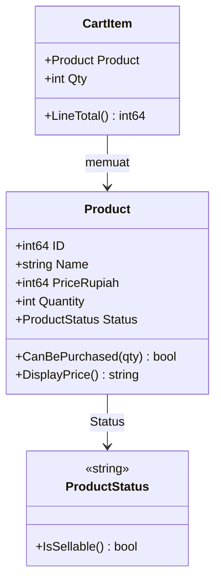
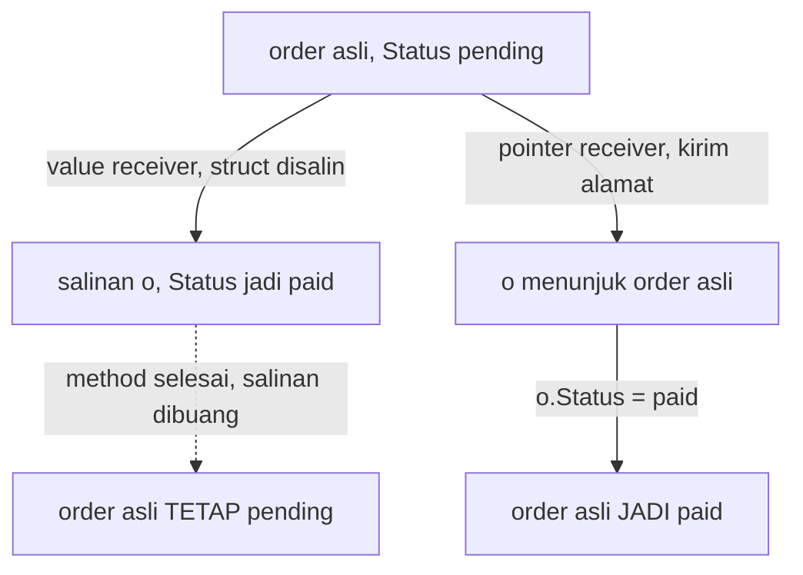
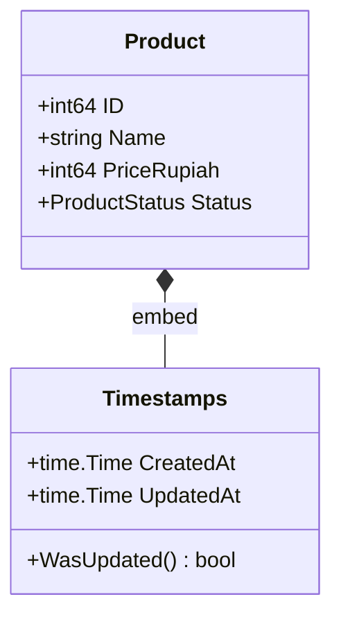
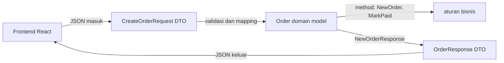
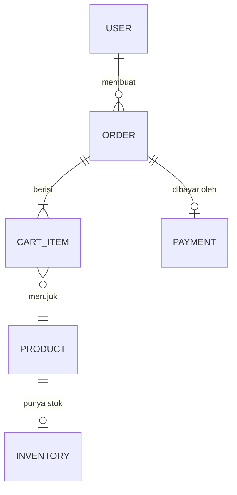
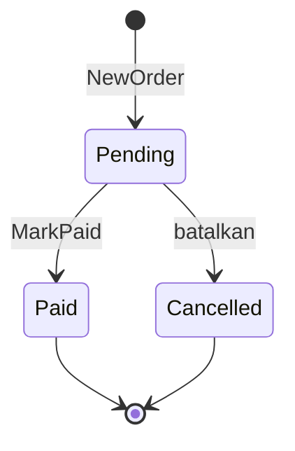

import { Section, Box, Steps, Step, Recap, CardGrid, Card, Chip, Hero, Compare, FileTree, Def } from "@components";

<Hero eyebrow="Roadmap 1 &middot; Fondasi Go" title="Struct dan <em>Method</em><br />Model Domain Backend">
  <p>Di modul ini kita mulai memodelkan entitas online shop skincare dengan cara Go: data eksplisit lewat struct, perilaku lewat method, dan komposisi sebagai pengganti inheritance.</p>
  <Fragment slot="meta">
    <Chip icon="code">Bahasa: <b>Go 1.26</b></Chip>
    <Chip icon="clock">~70 menit baca</Chip>
    <Chip icon="rocket">Proyek: <b>Online Shop Skincare</b></Chip>
  </Fragment>
</Hero>

<Section num="01" id="intro" title="Dari Class ke Struct dan Method" sub="Go tidak punya class, tetapi tetap bisa memodelkan domain dengan rapi.">

<p class="lead">Kalau kamu datang dari TypeScript atau PHP, anggap `struct` sebagai wadah data yang eksplisit, lalu `method` sebagai perilaku yang ditempelkan ke tipe itu.</p>

Di TypeScript kamu mungkin membuat `interface Product` untuk bentuk data dan `class ProductService` untuk perilaku. Di Laravel kamu sering bertemu Model Eloquent yang sekaligus membawa data, query, relasi, dan sebagian behavior. Go memisahkan hal ini lebih tegas: `struct` adalah bentuk data, `method` adalah perilaku pada tipe, sedangkan akses database nanti kita taruh di repository.

<Box variant="bridge" icon="🌉" label="Jembatan: dari class ke struct dan method"><p>Go tidak punya class, constructor magic, inheritance, atau decorator. Go mendorong data yang jelas lewat `struct`, behavior eksplisit lewat `method`, dan reuse lewat embedded struct (composition), bukan pohon pewarisan.</p></Box>

<Def term="struct"><p>`struct` adalah tipe komposit di Go yang mengelompokkan beberapa field bernama ke dalam satu nilai. Ia adalah tipe runtime yang nyata, bukan sekadar anotasi compile-time seperti `interface` TypeScript.</p></Def>

<Def term="method"><p>`method` adalah fungsi yang punya receiver, yaitu parameter khusus sebelum nama method, sehingga fungsi itu menjadi perilaku milik suatu tipe.</p></Def>

Modul ini melanjutkan langsung dari modul fungsi dan error. Di sana `Order` baru kita sketsa seminimal `Order{ID, Total}` karena fokusnya error return. Sekarang kita modelkan entitas inti dengan benar: `User`, `Product`, `CartItem`, `Order`, `Payment`, dan `Inventory`. Inilah bahasa dasar yang dipakai sepanjang roadmap, sebelum masuk ke Web API, PostgreSQL, clean architecture, dan transaksi checkout.

Acuan resmi yang relevan: [Effective Go](https://go.dev/doc/effective_go), [Go Specification tentang Struct types](https://go.dev/ref/spec#Struct_types) dan [Method sets](https://go.dev/ref/spec#Method_sets), serta paket [encoding/json](https://pkg.go.dev/encoding/json).

</Section>

<Section num="02" id="struct-sebagai-model-data" title="Struct sebagai Model Data" sub="Mirip interface TypeScript dari sisi bentuk, tetapi ia hidup sebagai tipe runtime Go.">

<p class="lead">Struct menjawab satu pertanyaan sederhana: field apa saja yang membentuk satu konsep domain?</p>

Bandingkan cara kamu biasanya mendeskripsikan produk di TypeScript dengan cara Go.

<Compare aLabel="TypeScript: interface" bLabel="Go: struct" aTone="muted" bTone="violet">
  <Fragment slot="a"><ul><li>`interface` mendeskripsikan shape hanya untuk type checking.</li><li>Hilang saat runtime karena TypeScript dikompilasi ke JavaScript.</li><li>Method biasanya ditaruh di function atau class terpisah.</li></ul></Fragment>
  <Fragment slot="b"><ul><li>`struct` adalah tipe Go yang benar-benar ada saat program berjalan.</li><li>Setiap field punya tipe konkret dan dicek saat compile.</li><li>Method bisa ditempelkan langsung ke tipe domain.</li></ul></Fragment>
</Compare>

```ts title="product.ts"
export interface Product {
  id: number;
  sku: string;
  name: string;
  priceRupiah: number;
  quantity: number;
  status: "draft" | "active" | "archived" | "out_of_stock";
}
```

Versi Go meneruskan konvensi proyek dari modul tipe dan control flow: uang sebagai `PriceRupiah int64` (bukan float, bukan tipe uang khusus), `Quantity` sebagai stok tersedia, dan `Status` bertipe `ProductStatus`.

```go title="internal/product/product.go"
package product

type ProductStatus string

const (
	ProductStatusDraft      ProductStatus = "draft"
	ProductStatusActive     ProductStatus = "active"
	ProductStatusArchived   ProductStatus = "archived"
	ProductStatusOutOfStock ProductStatus = "out_of_stock"
)

func (s ProductStatus) IsSellable() bool {
	return s == ProductStatusActive
}

type Product struct {
	ID          int64
	SKU         string
	Name        string
	Category    string
	PriceRupiah int64
	Quantity    int // stok tersedia
	Status      ProductStatus
}
```

Perhatikan huruf besar di awal nama field. Di Go, identifier yang diawali huruf besar diekspor dari package, sedangkan yang huruf kecil tidak. Karena `Product` nanti dibaca handler, service, dan repository di package berbeda, field-nya dibuat exported. Aturan ekspor ini kita perdalam di modul packages nanti.

<Box variant="tip" icon="💡" label="Idiom Go"><p>Mulai dari struct kecil yang jelas. Tambahkan method ketika ada aturan domain yang nyata, bukan sekadar getter dan setter otomatis seperti pola class tradisional.</p></Box>

<Box variant="note" icon="🧭" label="Zero value sudah berguna"><p>Tanpa constructor, `var p Product` sudah valid: semua field terisi zero value (`0`, `""`, `nil`). Inilah kenapa di Go kita sering mengembalikan `Product{}` sebagai hasil kosong yang aman saat terjadi error, seperti yang kamu lihat di modul sebelumnya.</p></Box>

</Section>

<Section num="03" id="method-dan-receiver" title="Method dan Receiver" sub="Receiver membuat fungsi terasa seperti perilaku milik tipe, tanpa class.">

<p class="lead">Sintaks method Go adalah `func (p Product) NamaMethod() tipe`. Bagian `p Product` sebelum nama method itulah receiver-nya.</p>

Method berikut menjawab pertanyaan domain: apakah produk boleh tampil di katalog, apakah produk bisa dibeli, dan bagaimana harga ditampilkan.

```go title="internal/product/behavior.go"
package product

import "fmt"

func (p Product) CanBeListed() bool {
	return p.Status == ProductStatusActive
}

func (p Product) CanBePurchased(qty int) bool {
	return p.Status == ProductStatusActive && p.Quantity >= qty
}

func (p Product) DisplayPrice() string {
	return fmt.Sprintf("Rp%d", p.PriceRupiah)
}
```

Dari sisi pemanggilan, method terasa mirip object method di JavaScript atau PHP: `product.CanBePurchased(2)`.

```go title="internal/product/behavior_usage.go"
package product

func examplePurchase() bool {
	p := Product{
		ID:          1,
		SKU:         "SKN-SERUM-NIA-30",
		Name:        "Niacinamide Serum 30ml",
		PriceRupiah: 129000,
		Quantity:    25,
		Status:      ProductStatusActive,
	}

	return p.CanBePurchased(2)
}
```

<Def term="receiver"><p>Receiver adalah parameter di antara `func` dan nama method yang menyatakan tipe pemilik method. `func (p Product) ...` berarti method itu milik tipe `Product`, dan di dalamnya `p` adalah nilai yang method dipanggil padanya.</p></Def>

Method tidak terbatas pada struct. Method bisa didefinisikan pada tipe bernama apa pun yang dideklarasikan di package-mu. Kamu sebenarnya sudah memakai ini sejak modul control flow: `IsSellable` adalah method pada `ProductStatus`, sebuah tipe berbasis `string`, bukan struct.

```go title="internal/product/product.go"
// ProductStatus adalah tipe string, tetapi tetap bisa punya method.
func (s ProductStatus) IsSellable() bool {
	return s == ProductStatusActive
}
```



<p class="fig-cap"><b>Gambar 1.</b> Struct membawa data, method menempel sebagai perilaku milik tipe. `ProductStatus` membuktikan method tidak harus pada struct: tipe berbasis `string` pun boleh punya `IsSellable`.</p>

Method bukan tempat akses database. `product.CanBePurchased(2)` boleh memeriksa state yang sudah ada di struct, tetapi query stok terbaru dari PostgreSQL nanti menjadi tanggung jawab repository atau service.

</Section>

<Section num="04" id="pointer-vs-value-receiver" title="Pointer Receiver vs Value Receiver" sub="Pilihan receiver menentukan apakah method bekerja pada salinan atau nilai asli.">

<p class="lead">Value receiver menerima salinan dari nilai, pointer receiver menerima alamat nilai asli. Perbedaan ini menentukan apakah perubahan di dalam method ikut terlihat oleh pemanggil.</p>

<Compare aLabel="Value receiver `(p Product)`" bLabel="Pointer receiver `(p *Product)`" aTone="teal" bTone="blue">
  <Fragment slot="a"><ul><li>Pakai ketika method hanya membaca data.</li><li>Cocok untuk struct kecil dan perilaku yang terasa immutable.</li><li>Perubahan pada receiver tidak terlihat oleh pemanggil.</li></ul></Fragment>
  <Fragment slot="b"><ul><li>Pakai ketika method perlu mengubah field.</li><li>Cocok untuk struct besar agar tidak menyalin banyak data.</li><li>Perubahan pada receiver terlihat oleh pemanggil.</li></ul></Fragment>
</Compare>

Contoh value receiver pada `CartItem`, karena method hanya menghitung dari data yang sudah ada. Di modul fungsi, `LineTotal` masih berupa fungsi bebas `LineTotal(item)`. Sekarang kita jadikan ia method milik `CartItem`, sehingga terbaca sebagai `item.LineTotal()`.

```go title="internal/checkout/cart.go"
package checkout

import "github.com/kamu/skincare-backend/internal/product"

type CartItem struct {
	Product product.Product
	Qty     int
}

// LineTotal kini menjadi method milik CartItem, bukan fungsi bebas.
// Value receiver sudah cukup karena ia hanya membaca.
func (item CartItem) LineTotal() int64 {
	return item.Product.PriceRupiah * int64(item.Qty)
}
```

Contoh pointer receiver pada `Order`, karena method mengubah status, payment id, dan waktu pembayaran. Inilah `Order` versi lengkap yang menggantikan sketsa minimal dari modul fungsi.

```go title="internal/order/order.go"
package order

import (
	"errors"
	"time"

	"github.com/kamu/skincare-backend/internal/checkout"
)

type OrderStatus string

const (
	OrderStatusPending   OrderStatus = "pending"
	OrderStatusPaid      OrderStatus = "paid"
	OrderStatusCancelled OrderStatus = "cancelled"
)

type Order struct {
	ID        int64
	UserID    int64
	Items     []checkout.CartItem
	Total     int64
	Status    OrderStatus
	PaymentID int64
	PaidAt    *time.Time
	CreatedAt time.Time
}

func (o *Order) MarkPaid(paymentID int64, paidAt time.Time) error {
	if o.Status != OrderStatusPending {
		return errors.New("order must be pending before it can be paid")
	}

	o.Status = OrderStatusPaid
	o.PaymentID = paymentID
	o.PaidAt = &paidAt
	return nil
}
```

Kalau `MarkPaid` memakai value receiver, perubahan status hanya terjadi pada salinan `Order`, lalu hilang begitu method selesai. Pemanggil tidak akan pernah melihat order menjadi paid.

```go title="internal/order/order_bug.go"
package order

import "time"

// MarkPaidWrong adalah versi salah: value receiver membuat semua mutasi
// hanya berlaku pada salinan, lalu dibuang saat method selesai.
func (o Order) MarkPaidWrong(paymentID int64, paidAt time.Time) {
	o.Status = OrderStatusPaid
	o.PaymentID = paymentID
	o.PaidAt = &paidAt
}
```



<p class="fig-cap"><b>Gambar 2.</b> Inti perbedaan receiver. Value receiver bekerja pada salinan yang dibuang, sedangkan pointer receiver bekerja pada alamat order asli sehingga mutasi benar-benar menempel.</p>

<Box variant="warn" icon="⚠️" label="Jebakan copy paling klasik"><p>Method yang harus mengubah `Status`, `Stock`, `Reserved`, atau field lain wajib pakai pointer receiver. Dengan value receiver, compiler tidak protes, kode tetap jalan, tetapi mutasinya diam-diam hilang. Bug ini sulit dilihat karena tidak ada error.</p></Box>

<Box variant="bridge" icon="🌉" label="Jembatan: di JS object selalu by reference, di Go kamu memilih"><p>Di JavaScript, object selalu dilewatkan sebagai referensi, jadi method selalu memutasi yang asli. Di PHP, object juga dilewatkan lewat handle. Di Go, struct adalah value type yang disalin secara default; kamu yang memutuskan kapan memakai pointer. Kuasa itu sekaligus tanggung jawab.</p></Box>

Aturan praktisnya sederhana. Jika satu tipe punya satu saja method yang butuh pointer receiver, buat method lain pada tipe itu juga memakai pointer receiver agar method set-nya konsisten. Konsistensi ini penting saat tipe bertemu interface di modul nanti, karena method dengan pointer receiver hanya masuk method set `*Order`, bukan `Order`.

</Section>

<Section num="05" id="embedded-struct" title="Embedded Struct dan Composition" sub="Terasa seperti extends, tetapi sebenarnya composition.">

<p class="lead">Go tidak punya inheritance. Untuk memakai ulang field atau behavior, Go memakai composition lewat embedded struct.</p>

Di Laravel atau OOP PHP, kamu mungkin membuat `BaseModel` lalu model lain mewarisi field seperti timestamp. Di Go, pola idiomatiknya adalah menyusun (embed) tipe kecil ke dalam tipe lain.

```go title="internal/product/timestamps.go"
package product

import "time"

type Timestamps struct {
	CreatedAt time.Time
	UpdatedAt time.Time
}

func (t Timestamps) WasUpdated() bool {
	return t.UpdatedAt.After(t.CreatedAt)
}
```

Sekarang kita perbarui `product.go` agar `Product` meng-embed `Timestamps`. Embedded field ditulis tanpa nama field, hanya tipenya.

```go title="internal/product/product.go"
package product

type Product struct {
	Timestamps // embedded: field dan method-nya dipromosikan

	ID          int64
	SKU         string
	Name        string
	Category    string
	PriceRupiah int64
	Quantity    int
	Status      ProductStatus
}
```

Karena `Timestamps` di-embed, field `CreatedAt` dan `UpdatedAt` serta method `WasUpdated` dipromosikan ke `Product`. Kamu bisa menulis `product.CreatedAt` dan `product.WasUpdated()` langsung, seolah keduanya milik `Product`.

```go title="internal/product/audit_usage.go"
package product

func recentlyChanged(p Product) bool {
	// CreatedAt dan WasUpdated berasal dari Timestamps, tetapi dipanggil
	// langsung pada Product berkat field dan method promotion.
	return p.WasUpdated() && !p.CreatedAt.IsZero()
}
```



<p class="fig-cap"><b>Gambar 3.</b> Embedded struct adalah komposisi, bukan pewarisan. `Product` tersusun dari `Timestamps`, lalu field dan method `Timestamps` dipromosikan agar nyaman diakses lewat `Product`.</p>

<Box variant="bridge" icon="🌉" label="Jembatan: mirip $timestamps Laravel, tetapi composition"><p>Embedded `Timestamps` terasa seperti trait timestamp atau `BaseModel` di Laravel. Bedanya, ini bukan hierarki parent-child. Go hanya menyusun satu tipe dari tipe lain, lalu mempromosikan anggotanya. Tidak ada `parent::`, tidak ada override, tidak ada is-a relationship.</p></Box>

<Box variant="warn" icon="⚠️" label="Jangan bikin BaseEntity raksasa"><p>Gunakan embedded struct untuk concern kecil yang benar-benar berulang, seperti audit field. Jangan membuat `BaseEntity` besar yang menampung semua hal, karena itu menyeret kembali masalah inheritance yang justru dihindari Go.</p></Box>

</Section>

<Section num="06" id="json-tags" title="JSON Tags dan Batas Serialisasi" sub="Struct tag mengatur nama dan perilaku field saat menjadi JSON.">

<p class="lead">Frontend biasanya memakai `snake_case` atau `camelCase`, sedangkan field exported Go wajib diawali huruf besar. JSON tag adalah jembatannya.</p>

Struct tag ditulis setelah tipe field, di dalam backtick. Paket `encoding/json` membaca key `json`, lalu memakai nama itu saat marshal dan unmarshal.

```go title="internal/httpapi/dto/order_response.go"
package dto

import "time"

type OrderResponse struct {
	ID        int64     `json:"id"`
	UserID    int64     `json:"user_id"`
	Total     int64     `json:"total"`
	Status    string    `json:"status"`
	PaymentID *int64    `json:"payment_id,omitempty"`
	PaidAt    time.Time `json:"paid_at,omitzero"`
	CreatedAt time.Time `json:"created_at"`
}
```

Perhatikan tiga keputusan penting pada tag di atas.

<CardGrid cols={3}>
  <Card><h4>`Total` tanpa omitempty</h4><p>Total `0` adalah nilai bisnis yang sah, jadi field ini harus selalu muncul di JSON, apa pun nilainya.</p></Card>
  <Card><h4>`PaymentID *int64` omitempty</h4><p>Pointer membedakan "belum dibayar" (`nil`) dari nominal `0`. Saat `nil`, `omitempty` menghapusnya dari response.</p></Card>
  <Card><h4>`PaidAt` omitzero</h4><p>`omitzero` (Go 1.24) menghapus `time.Time` yang masih zero. Inilah yang tidak bisa dilakukan `omitempty` pada `time.Time`.</p></Card>
</CardGrid>

Untuk order yang belum dibayar, `PaymentID` masih `nil` dan `PaidAt` masih zero, sehingga keduanya tidak ikut dikirim.

```json title="response-belum-dibayar.json"
{
  "id": 1001,
  "user_id": 7,
  "total": 258000,
  "status": "pending",
  "created_at": "2026-06-06T10:00:00Z"
}
```

Setelah `MarkPaid` dipanggil, kedua field itu terisi dan ikut muncul.

```json title="response-sudah-dibayar.json"
{
  "id": 1001,
  "user_id": 7,
  "total": 258000,
  "status": "paid",
  "payment_id": 5001,
  "paid_at": "2026-06-06T10:03:00Z",
  "created_at": "2026-06-06T10:00:00Z"
}
```

<Box variant="warn" icon="⚠️" label="omitempty tidak menghapus time.Time"><p>`omitempty` hanya menghapus `false`, `0`, pointer `nil`, interface `nil`, dan slice, map, array, atau string kosong. `time.Time` adalah struct, jadi tidak pernah dianggap kosong oleh `omitempty`. Untuk benar-benar menyembunyikan waktu yang masih zero, pakai `omitzero` yang memanggil `IsZero()`. Untuk nominal seperti `stock: 0` atau `total: 0`, jangan pakai keduanya, karena nol justru informasi penting.</p></Box>

<Box variant="note" icon="📌" label="Sekilas encoding/json/v2"><p>Sejak Go 1.25 ada paket eksperimental `encoding/json/v2` di balik `GOEXPERIMENT=jsonv2`, dengan API lebih konsisten dan lebih cepat. Statusnya masih eksperimental dan belum tunduk pada janji kompatibilitas Go 1, jadi untuk proyek ini kita tetap memakai `encoding/json` standar.</p></Box>

</Section>

<Section num="07" id="dto-vs-domain-model" title="DTO vs Domain Model" sub="DTO adalah kontrak keluar masuk API, domain model adalah pusat aturan bisnis.">

<p class="lead">Kesalahan umum backend pemula adalah memakai satu struct yang sama untuk request JSON, response JSON, database row, dan domain entity sekaligus.</p>

<Compare aLabel="DTO" bLabel="Domain model" aTone="muted" bTone="violet">
  <Fragment slot="a"><ul><li>Berada di boundary HTTP, yaitu request dan response.</li><li>Punya JSON tag dan biasanya berisi tipe sederhana.</li><li>Boleh mengikuti kebutuhan dan bentuk yang dipakai frontend.</li></ul></Fragment>
  <Fragment slot="b"><ul><li>Berada di inti aplikasi, dekat aturan bisnis.</li><li>Punya method domain seperti `MarkPaid` dan `Reserve`.</li><li>Tidak harus tunduk pada bentuk JSON frontend.</li></ul></Fragment>
</Compare>

DTO request menampung apa yang dikirim frontend. Bentuknya rata dan sederhana, hanya cukup untuk divalidasi lalu dipetakan ke domain.

```go title="internal/httpapi/dto/create_order.go"
package dto

type CreateOrderRequest struct {
	UserID int64             `json:"user_id"`
	Items  []CreateOrderItem `json:"items"`
}

type CreateOrderItem struct {
	ProductID int64 `json:"product_id"`
	Qty       int   `json:"qty"`
}
```

Domain model adalah `order.Order` dari bagian sebelumnya: ia membawa method dan aturan bisnis, bukan JSON tag. Yang menyatukan keduanya adalah fungsi mapping eksplisit dari domain ke DTO response.

```go title="internal/httpapi/dto/mapping.go"
package dto

import "github.com/kamu/skincare-backend/internal/order"

func NewOrderResponse(o order.Order) OrderResponse {
	resp := OrderResponse{
		ID:        o.ID,
		UserID:    o.UserID,
		Total:     o.Total,
		Status:    string(o.Status),
		CreatedAt: o.CreatedAt,
	}

	if o.PaymentID != 0 {
		paymentID := o.PaymentID
		resp.PaymentID = &paymentID
	}

	if o.PaidAt != nil {
		resp.PaidAt = *o.PaidAt
	}

	return resp
}
```

Mapping ini terlihat seperti kerja ekstra, tetapi justru di sinilah nilainya. Domain bebas berubah tanpa langsung merusak kontrak API, dan API bisa menyesuaikan bentuk untuk frontend tanpa mengotori aturan bisnis. `OrderStatus` yang bertipe `string` di domain pun dengan sengaja dipetakan menjadi `string` biasa di DTO.



<p class="fig-cap"><b>Gambar 4.</b> DTO menjaga kontrak HTTP di kedua ujung, domain model menjaga aturan bisnis di tengah. Dua fungsi mapping adalah pintu masuk dan pintu keluarnya.</p>

<Box variant="bridge" icon="🌉" label="Jembatan: mirip Form Request dan API Resource di Laravel"><p>`CreateOrderRequest` mirip Form Request dari sisi bentuk input, `OrderResponse` mirip API Resource dari sisi bentuk output, sedangkan `order.Order` bukan Eloquent model. Bedanya, di Go mapping antar lapisan ditulis sebagai kode yang terlihat, bukan konvensi framework yang tersembunyi.</p></Box>

</Section>

<Section num="08" id="domain-online-shop" title="Memodelkan Entitas Online Shop Skincare" sub="Menyusun tipe inti yang dipakai sepanjang sisa roadmap.">

<p class="lead">Sekarang kita satukan semuanya menjadi enam entitas inti yang disebut Student Outcome roadmap: `User`, `Product`, `CartItem`, `Order`, `Payment`, dan `Inventory`.</p>

Setiap entitas tinggal di package fiturnya sendiri, melanjutkan struktur yang sudah kita bentuk di modul fungsi dan error.

<FileTree title="Letak entitas domain" tree={`
cmd/
  api/
    main.go              # entry point API
internal/
  user/
    user.go              # akun pelanggan
  product/
    product.go           # Product, ProductStatus, Timestamps
    behavior.go          # CanBePurchased, DisplayPrice
    inventory.go         # Inventory: available vs reserved
  checkout/
    cart.go              # CartItem + LineTotal (method)
  order/
    order.go             # Order, OrderStatus, MarkPaid, NewOrder
  payment/
    payment.go           # Payment dari provider
  httpapi/
    dto/
      order_response.go  # OrderResponse + tag JSON
      create_order.go    # CreateOrderRequest
      mapping.go         # NewOrderResponse
go.mod                   # module github.com/kamu/skincare-backend
`} />

`User` memakai value receiver karena `DisplayName` hanya membaca.

```go title="internal/user/user.go"
package user

import "time"

type User struct {
	ID        int64
	Email     string
	FullName  string
	CreatedAt time.Time
}

func (u User) DisplayName() string {
	if u.FullName != "" {
		return u.FullName
	}

	return u.Email
}
```

`Inventory` memisahkan stok `Available` dari stok `Reserved`, dan memakai pointer receiver pada `Reserve` karena ia memutasi state.

```go title="internal/product/inventory.go"
package product

import "errors"

type Inventory struct {
	ProductID int64
	Available int
	Reserved  int
}

func (i Inventory) CanReserve(qty int) bool {
	return qty > 0 && i.Available >= qty
}

func (i *Inventory) Reserve(qty int) error {
	if !i.CanReserve(qty) {
		return errors.New("insufficient inventory to reserve")
	}

	i.Available -= qty
	i.Reserved += qty
	return nil
}
```

<Box variant="note" icon="🧭" label="Product.Quantity vs Inventory"><p>`Product.Quantity` adalah angka stok ringkas yang sudah kita pakai sejak modul tipe, cukup untuk validasi katalog. `Inventory` adalah model stok yang lebih teliti, memisahkan yang tersedia dari yang sudah dipesan agar checkout tidak oversell. Di roadmap concurrency, `Inventory` inilah yang dijaga saat banyak order terjadi bersamaan.</p></Box>

`Payment` mencatat hasil dari provider pembayaran, dengan nominal tetap dalam rupiah `int64`.

```go title="internal/payment/payment.go"
package payment

import "time"

type Payment struct {
	ID           int64
	OrderID      int64
	AmountRupiah int64
	Provider     string
	ReferenceNo  string
	PaidAt       time.Time
}
```

Karena Go tidak punya constructor, kita memakai fungsi pembuat seperti `NewOrder` untuk menjamin order lahir dalam keadaan valid. Pola ini meneruskan gaya `(Data, error)` dari modul fungsi dan memanggil `item.LineTotal()` yang kini sudah jadi method.

```go title="internal/order/factory.go"
package order

import (
	"errors"
	"time"

	"github.com/kamu/skincare-backend/internal/checkout"
)

func NewOrder(id, userID int64, items []checkout.CartItem, now time.Time) (Order, error) {
	if userID == 0 {
		return Order{}, errors.New("user id is required")
	}

	if len(items) == 0 {
		return Order{}, errors.New("order must contain at least one item")
	}

	var total int64
	for _, item := range items {
		if item.Qty <= 0 {
			return Order{}, errors.New("item quantity must be positive")
		}

		total += item.LineTotal()
	}

	return Order{
		ID:        id,
		UserID:    userID,
		Items:     items,
		Total:     total,
		Status:    OrderStatusPending,
		CreatedAt: now,
	}, nil
}
```

Keenam entitas saling terhubung membentuk peta domain online shop skincare.



<p class="fig-cap"><b>Gambar 5.</b> Peta entitas inti. Satu user bisa punya banyak order, satu order berisi banyak cart item yang merujuk produk, tiap produk punya satu inventory, dan satu order dibayar oleh paling banyak satu payment.</p>

`Order` sendiri bergerak melalui daur hidup status, dan `MarkPaid` adalah transisi terjaga dari `pending` ke `paid`.



<p class="fig-cap"><b>Gambar 6.</b> Daur hidup order. Method pointer receiver seperti `MarkPaid` menjaga agar transisi hanya terjadi dari status yang sah, persis seperti guard clause yang kamu pelajari di modul control flow.</p>

<CardGrid cols={3}>
  <Card><h4>User</h4><p>Akun pelanggan: email, nama, dan pemilik order.</p></Card>
  <Card><h4>Product</h4><p>Item katalog skincare: harga, SKU, stok ringkas, dan status publikasi.</p></Card>
  <Card><h4>CartItem</h4><p>Produk dan jumlah yang dipilih, dengan `LineTotal` sebagai method.</p></Card>
  <Card><h4>Order</h4><p>Hasil checkout: item, total, status, dan jejak pembayaran.</p></Card>
  <Card><h4>Payment</h4><p>Pembayaran dari provider: nominal, reference, dan waktu paid.</p></Card>
  <Card><h4>Inventory</h4><p>Stok tersedia dan reserved agar checkout tidak oversell.</p></Card>
</CardGrid>

</Section>

<Section num="09" id="hands-on" title="Hands-on Ringan" sub="Buat model domain kecil, jalankan test, lalu rasakan efek pointer receiver.">

<p class="lead">Latihan ini tidak butuh database. Kita hanya menguji perilaku struct dan method.</p>

<Steps>
  <Step><b>Buat package fitur</b><p>Letakkan tipe inti di `internal/checkout` dan `internal/order` agar belum tercampur dengan HTTP handler atau repository.</p></Step>
  <Step><b>Tulis struct dan method</b><p>Mulai dari `CartItem.LineTotal` (value receiver) dan `Order.MarkPaid` (pointer receiver), karena keduanya langsung terasa dalam alur checkout.</p></Step>
  <Step><b>Tambahkan test</b><p>Uji method perhitungan dan method mutasi state, lalu jalankan `go test ./...`.</p></Step>
</Steps>

```go title="internal/checkout/cart_test.go"
package checkout

import (
	"testing"

	"github.com/kamu/skincare-backend/internal/product"
)

func TestCartItemLineTotal(t *testing.T) {
	item := CartItem{
		Product: product.Product{
			Name:        "Niacinamide Serum 30ml",
			PriceRupiah: 129000,
			Quantity:    25,
			Status:      product.ProductStatusActive,
		},
		Qty: 2,
	}

	got := item.LineTotal()
	want := int64(258000)

	if got != want {
		t.Fatalf("line total mismatch: got %d want %d", got, want)
	}
}
```

```go title="internal/order/order_test.go"
package order

import (
	"testing"
	"time"
)

func TestOrderMarkPaid(t *testing.T) {
	createdAt := time.Date(2026, 6, 6, 10, 0, 0, 0, time.UTC)
	paidAt := time.Date(2026, 6, 6, 10, 3, 0, 0, time.UTC)

	o := Order{
		ID:        1001,
		UserID:    7,
		Total:     258000,
		Status:    OrderStatusPending,
		CreatedAt: createdAt,
	}

	if err := o.MarkPaid(5001, paidAt); err != nil {
		t.Fatalf("mark paid failed: %v", err)
	}

	if o.Status != OrderStatusPaid {
		t.Fatalf("status mismatch: got %s want %s", o.Status, OrderStatusPaid)
	}

	if o.PaidAt == nil {
		t.Fatal("paid at should be set after MarkPaid")
	}
}
```

```bash title="Terminal"
go test ./...
```

<Box variant="tip" icon="✅" label="Eksperimen receiver"><p>Ubah `func (o *Order) MarkPaid` menjadi `func (o Order) MarkPaid`, lalu jalankan test lagi. Test akan gagal karena status tidak berubah pada order asli. Itulah cara paling cepat merasakan kenapa pointer receiver penting untuk mutasi.</p></Box>

</Section>

<Section num="10" id="jebakan-umum" title="Jebakan Umum dari JS dan PHP" sub="Sebagian bug Go pemula lahir dari membawa kebiasaan class dan object terlalu jauh.">

<p class="lead">Go terasa sederhana, tetapi beberapa aturan kecil sering mengejutkan developer JavaScript dan PHP.</p>

<CardGrid cols={2}>
  <Card><h4>Menganggap struct sebagai class</h4><p>Struct tidak punya constructor otomatis, inheritance, keyword private, decorator, atau magic method. Pakai fungsi seperti `NewOrder` untuk membuat nilai yang valid.</p></Card>
  <Card><h4>Lupa pointer receiver untuk mutasi</h4><p>Value receiver bekerja pada salinan. Jika method harus mengubah `Status`, `Quantity`, atau `Reserved`, pakai pointer receiver agar perubahan menempel.</p></Card>
  <Card><h4>Semua field dibuat exported</h4><p>Huruf besar membuka akses lintas package. Untuk invariant yang harus dijaga ketat, pertimbangkan field unexported plus fungsi pembuat.</p></Card>
  <Card><h4>omitempty dipakai terlalu agresif</h4><p>Nilai bisnis seperti `total: 0` atau `stock: 0` bisa hilang dari response. Pakai `omitempty` hanya untuk field yang benar-benar opsional, dan `omitzero` untuk `time.Time`.</p></Card>
  <Card><h4>Embedded struct dianggap inheritance</h4><p>Embedded struct adalah composition. Jangan membangun pohon tipe panjang seperti OOP klasik.</p></Card>
  <Card><h4>DTO dan domain dicampur</h4><p>Request JSON sering berbeda dari aturan domain. Pisahkan agar API bisa berubah tanpa merusak inti bisnis.</p></Card>
</CardGrid>

<Box variant="warn" icon="🚫" label="Kesalahan arsitektur sejak awal"><p>Jangan menjadikan satu struct domain sebagai tempat query database, validasi HTTP, dan format response sekaligus. Beban itu membuat modul Web API, PostgreSQL, dan clean architecture berikutnya jauh lebih sulit dipisahkan.</p></Box>

</Section>

<Section num="11" id="ringkasan" title="Ringkasan & Poin Penting">

<p class="lead">Struct dan method adalah fondasi cara Go memodelkan domain backend tanpa class.</p>

<Recap title="Yang Wajib Menempel">
  <ul>
    <li>`struct` adalah wadah data eksplisit yang hidup saat runtime, bukan anotasi compile-time seperti interface TypeScript.</li>
    <li>`method` adalah fungsi dengan receiver; ia bisa menempel pada struct maupun tipe bernama lain seperti `ProductStatus`.</li>
    <li>Value receiver untuk operasi baca, pointer receiver untuk mutasi, struct besar, dan konsistensi method set.</li>
    <li>Embedded struct adalah composition dengan promosi field dan method, bukan inheritance.</li>
    <li>JSON tag mengatur bentuk API; `omitempty` untuk nilai kosong dasar, `omitzero` untuk `time.Time` dan tipe ber-`IsZero`.</li>
    <li>DTO menjaga kontrak HTTP, domain model menjaga aturan bisnis, dan fungsi mapping menghubungkan keduanya.</li>
    <li>Tanpa constructor, fungsi pembuat seperti `NewOrder` memastikan entitas lahir dalam keadaan valid.</li>
  </ul>
</Recap>

<h3>Pemetaan ke proyek online shop skincare</h3>

<CardGrid cols={2}>
  <Card><h4>Entitas inti siap pakai</h4><p>`User`, `Product`, `CartItem`, `Order`, `Payment`, dan `Inventory` menjadi kosakata domain yang dipakai ulang di roadmap API, database, dan checkout.</p></Card>
  <Card><h4>Batas yang sehat</h4><p>Pemisahan DTO dan domain plus fungsi `NewOrderResponse` membuat kontrak HTTP dan aturan bisnis bisa berkembang sendiri-sendiri.</p></Card>
</CardGrid>

<Box variant="bridge" icon="🌉" label="Langkah berikutnya"><p>Modul berikutnya memperdalam pointer dan dasar memori: apa itu pointer, pass by value vs pass by reference, `nil`, kapan memakai pointer untuk mutasi dan nilai opsional, serta hasil dari repository. Pointer receiver yang kamu pakai di `MarkPaid` dan `Reserve` adalah pintu masuknya.</p></Box>

<Box variant="tip" icon="✅" label="Checkpoint sebelum lanjut"><p>Pastikan kamu bisa menjelaskan beda struct dengan class, memilih antara value dan pointer receiver, menerangkan kenapa embedded struct bukan inheritance, membedakan `omitempty` dari `omitzero`, dan menulis satu fungsi `NewOrder` lengkap dengan test untuk `LineTotal` dan `MarkPaid`.</p></Box>

</Section>
