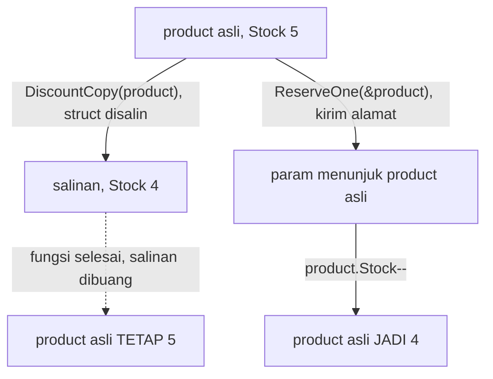
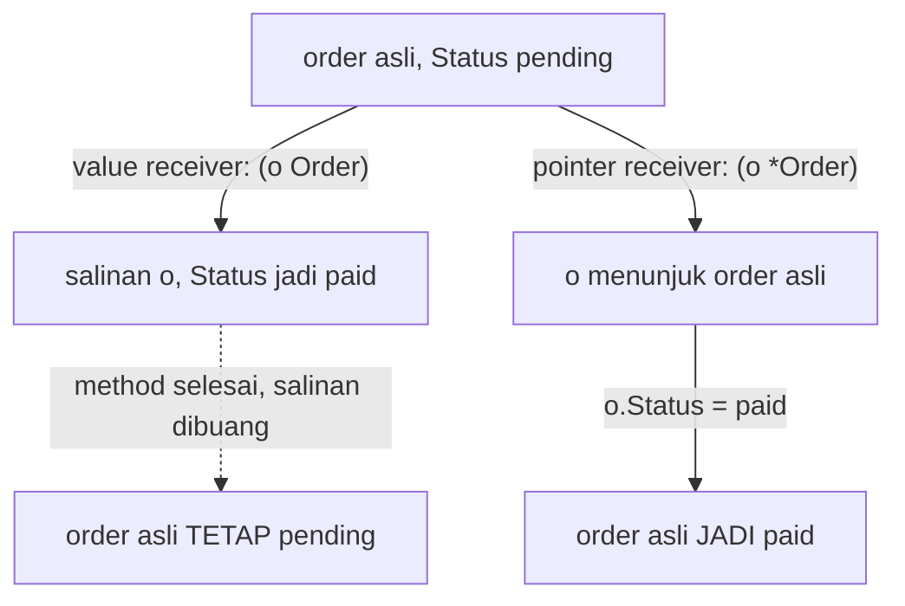
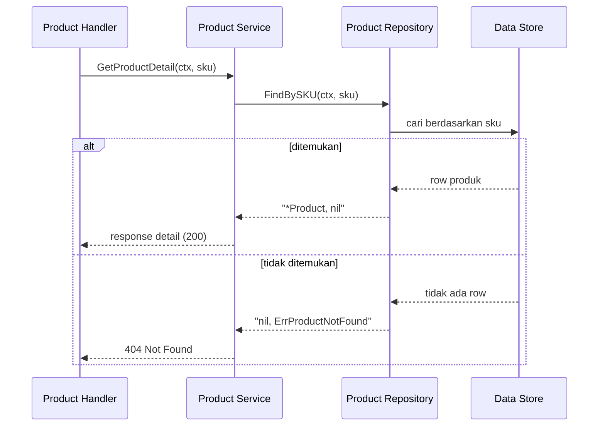
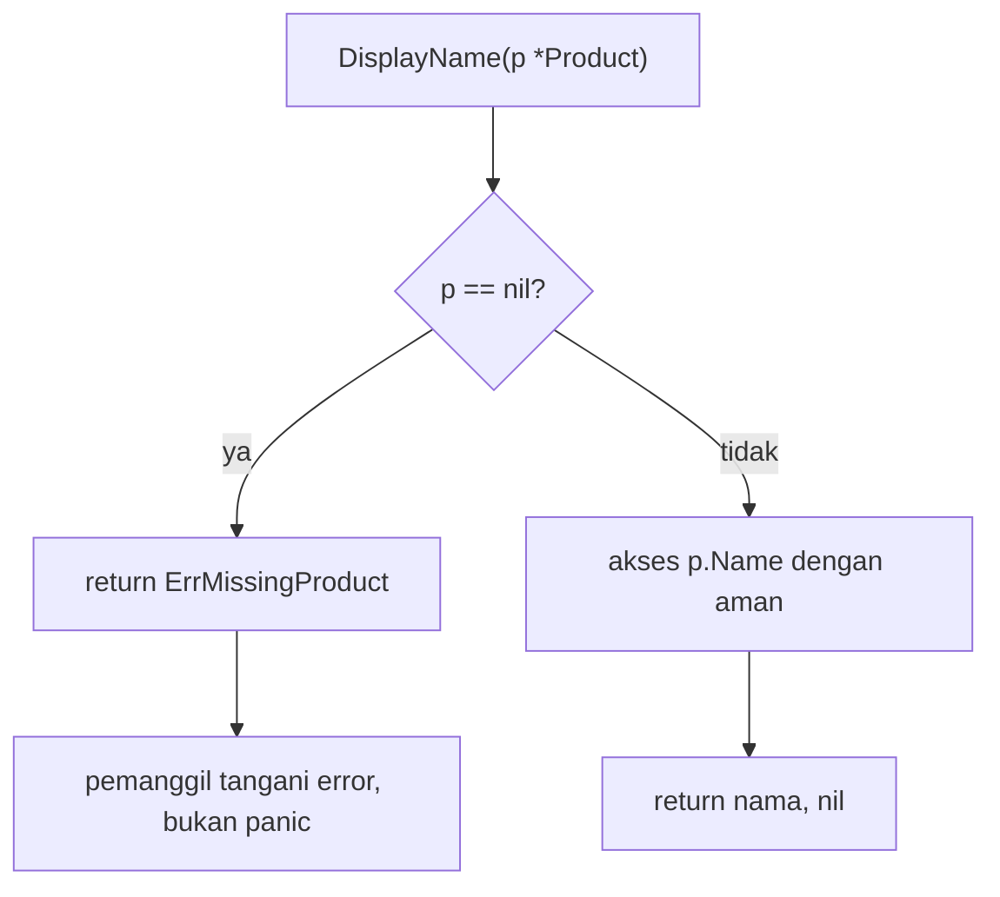

import { Section, Box, Steps, Step, Recap, CardGrid, Card, Chip, Hero, Compare, FileTree, Def, Figure } from "@components";
import PointerFig01 from "@figures/PointerFig01.astro";

<Hero eyebrow="Roadmap 1 &middot; Fondasi Go" title="Pointer dan <em>Dasar Memori</em><br />untuk Backend Go">
  <p>Pointer di Go bukan untuk mengelola memori manual seperti C, melainkan alat untuk mutasi yang jelas, nilai yang bisa tidak ada, dan desain repository yang rapi pada backend online shop skincare.</p>
  <Fragment slot="meta">
    <Chip icon="code">Bahasa: <b>Go 1.26</b></Chip>
    <Chip icon="clock">~65 menit baca</Chip>
    <Chip icon="rocket">Proyek: <b>Online Shop Skincare</b></Chip>
  </Fragment>
</Hero>

<Section num="01" id="intro" title="Kenapa Pointer Perlu Dipahami" sub="Pointer bukan topik akademik, ia sudah muncul diam-diam di struct, method, repository, JSON, dan database kita.">

<p class="lead">Kalau kamu datang dari JavaScript, pointer terasa asing karena object di JS sudah terasa seperti reference secara otomatis, dan kamu jarang memikirkan alamat secara eksplisit.</p>

Di Go, nilai tidak bergerak secara ajaib. Saat kamu mengirim `struct` ke fungsi, Go mengirim salinan nilai itu. Kalau fungsi perlu mengubah data asli, kamu mengirim alamatnya lewat pointer. Ini penting di backend karena banyak operasi memang bersifat mutasi: mengurangi stok, memindahkan stok ke `Reserved`, mengubah status order dari `pending` ke `paid`, atau mengisi `PaymentID` setelah callback payment gateway tiba.

<Box variant="bridge" icon="🌉" label="Jembatan: kamu sudah pakai pointer di modul lalu"><p>Di modul struct, `Order.MarkPaid` dan `Inventory.Reserve` memakai pointer receiver `(o *Order)` dan `(i *Inventory)` agar mutasi menempel. Modul ini membongkar kenapa tanda `*` dan `&` itu wajib ada di sana.</p></Box>

Pointer juga membantu membedakan dua kondisi yang berbeda: field kosong karena memang kosong, atau field tidak ada sama sekali. Di API skincare, `Description` bisa berisi string kosong, tetapi `nil` bisa berarti deskripsi belum diisi oleh admin katalog. Perbedaan kecil ini berguna saat membaca data dari PostgreSQL dan saat membentuk response JSON dengan `omitempty`, persis seperti `PaymentID *int64` yang sudah kamu lihat di DTO order.

<Def term="pointer"><p>Pointer adalah nilai yang menyimpan alamat nilai lain. Dalam Go, `&x` mengambil alamat `x`, sedangkan `*p` membaca atau mengubah nilai yang ditunjuk oleh pointer `p`. Tidak ada aritmetika pointer seperti di C.</p></Def>

<CardGrid cols={3}>
  <Card><h4>Mutasi</h4><p>Method seperti `order.MarkPaid()` butuh mengubah field pada order asli, bukan salinannya.</p></Card>
  <Card><h4>Opsional</h4><p>`*string` atau `*int64` bisa bernilai `nil`, cocok untuk field yang boleh tidak ada.</p></Card>
  <Card><h4>Repository</h4><p>`FindBySKU` sering mengembalikan `*Product` agar hasil yang tidak ditemukan bisa direpresentasikan dengan jelas.</p></Card>
</CardGrid>

Acuan resmi yang relevan: [Effective Go tentang pointer dan allocation](https://go.dev/doc/effective_go#pointers_vs_values), [Go Specification tentang Pointer types](https://go.dev/ref/spec#Pointer_types) dan [Address operators](https://go.dev/ref/spec#Address_operators), serta [Tour of Go: Pointers](https://go.dev/tour/moretypes/1).

</Section>

<Section num="02" id="model-mental" title="Model Mental: Nilai dan Alamat" sub="Anggap nilai sebagai barang di rak gudang, pointer sebagai label yang mencatat nomor rak.">

<p class="lead">Pointer tidak menyimpan produk, ia menyimpan alamat tempat produk berada.</p>

Dalam kode backend, kamu lebih sering membaca pointer lewat tipe seperti `*Product`, bukan melihat alamat memori mentah. Kamu tidak perlu mengatur `malloc`, `free`, atau memikirkan alamat fisik. Go punya garbage collector. Yang perlu kamu pahami hanyalah kapan kamu sedang bekerja dengan salinan nilai dan kapan kamu sedang bekerja lewat alamat nilai asli.

<Box variant="analogy" icon="📦" label="Analogi gudang skincare"><p>Value adalah kardus produk di rak. Pointer adalah secarik kertas bertuliskan nomor rak. Kamu bisa menggandakan kertas itu sebanyak mungkin, tetapi semuanya menunjuk ke kardus yang sama. Ubah isi kardus lewat nomor rak, dan siapa pun yang memegang kertas dengan nomor itu akan melihat perubahannya.</p></Box>

<Figure><PointerFig01 /><Fragment slot="caption"><b>Gambar 1.</b> Variabel `product` menyimpan nilai struct, sedangkan `p` menyimpan alamat ke nilai itu. Saat `p.Stock` diubah, nilai asli ikut berubah karena `p` berisi alamat yang sama.</Fragment></Figure>

Tiga istilah ini perlu menempel sebelum lanjut.

<CardGrid cols={3}>
  <Card><h4>Value</h4><p>Data sebenarnya, misalnya `Product&#123;Name: "Serum"&#125;` di dalam variabel `product`.</p></Card>
  <Card><h4>Address</h4><p>Lokasi value, diambil dengan `&product`. Inilah yang disimpan oleh pointer.</p></Card>
  <Card><h4>Dereference</h4><p>Mengakses value dari pointer dengan `*p`. Untuk field struct, Go membuatnya lebih ringkas.</p></Card>
</CardGrid>

```go title="cmd/playground/main.go"
package main

import "fmt"

type Product struct {
	SKU   string
	Name  string
	Stock int
}

func main() {
	product := Product{SKU: "SERUM-001", Name: "Brightening Serum", Stock: 12}
	p := &product

	fmt.Println(product.Name)
	fmt.Println(p.Name)      // Go otomatis membaca (*p).Name untuk field struct.
	fmt.Println((*p).Name)   // Bentuk eksplisit, hasilnya sama.

	p.Stock = 10
	fmt.Println(product.Stock) // 10, karena p menunjuk ke product yang sama.
}
```

<Box variant="note" icon="🧭" label="Catatan istilah"><p>Go membuat akses pointer ke field struct terasa natural. `p.Name` boleh dipakai meski `p` adalah `*Product`, karena compiler tahu maksudnya `(*p).Name`. Gula sintaks ini hanya berlaku untuk field dan method, bukan untuk dereference nilai biasa.</p></Box>

</Section>

<Section num="03" id="pass-by-value" title="Go Selalu Pass by Value" sub="Setiap argumen fungsi dikirim sebagai salinan. Pointer juga value, tetapi value itu berisi sebuah alamat.">

<p class="lead">Kesalahan mental paling umum adalah menganggap Go punya pass by reference seperti istilah sehari-hari di JavaScript.</p>

Secara praktis, kamu boleh berkata "fungsi menerima pointer agar bisa mengubah nilai asli". Tetapi secara teknis Go tetap selalu pass by value. Saat kamu mengirim `*Product`, yang disalin adalah alamatnya yang berukuran kecil, bukan seluruh struct `Product`. Karena alamat itu menunjuk ke data asli, perubahan lewat pointer terlihat oleh pemanggil. Tidak ada pengecualian: slice, map, dan channel pun "terasa" seperti reference hanya karena nilainya berupa header kecil yang di dalamnya menyimpan pointer.

<Compare aLabel="JS: object terasa reference" bLabel="Go: struct disalin kecuali pakai pointer" aTone="muted" bTone="violet">
  <Fragment slot="a"><ul><li>Object dikirim sebagai reference value, sehingga mutasi property terlihat di pemanggil.</li><li>Kamu jarang memikirkan alamat object secara eksplisit.</li></ul></Fragment>
  <Fragment slot="b"><ul><li>`struct` disalin penuh bila parameternya bukan pointer.</li><li>Pakai `*Product` bila fungsi harus mengubah `Product` asli.</li></ul></Fragment>
</Compare>

Contoh berikut sengaja kecil. Fokusnya bukan logika stok, tetapi bedanya mengubah salinan dan mengubah nilai asli.

```go title="cmd/playground/pass_by_value.go"
package main

import "fmt"

type Product struct {
	SKU   string
	Stock int
}

// DiscountCopy menerima salinan, perubahan tidak menempel.
func DiscountCopy(product Product) {
	product.Stock--
}

// ReserveOne menerima alamat, perubahan menempel ke product asli.
func ReserveOne(product *Product) {
	product.Stock--
}

func main() {
	product := Product{SKU: "TONER-001", Stock: 5}

	DiscountCopy(product)
	fmt.Println(product.Stock) // 5, karena yang diubah hanya salinan.

	ReserveOne(&product)
	fmt.Println(product.Stock) // 4, karena yang diubah adalah product asli.
}
```



<p class="fig-cap"><b>Gambar 2.</b> Inti pass by value. Kirim struct dan kamu mengubah salinan yang dibuang. Kirim alamat dengan `&` dan kamu mengubah nilai asli. Ini pola yang sama persis dengan value vs pointer receiver di modul struct.</p>

<Box variant="warn" icon="⚠️" label="Jebakan dari JS"><p>Kalau kamu menulis fungsi Go yang menerima `Product`, jangan berharap perubahan field di dalam fungsi terlihat di luar. Compiler tidak protes, kode jalan, tetapi mutasinya diam-diam hilang. Pakai `*Product` bila mutasi memang bagian dari kontrak fungsi.</p></Box>

</Section>

<Section num="04" id="address-dereference" title="Operator & dan *" sub="Dua operator ini cukup untuk membaca hampir semua kode pointer di backend.">

<p class="lead">`&` menjawab pertanyaan di mana nilai ini berada, sedangkan `*` menjawab nilai apa yang ada di alamat itu.</p>

Ada dua makna `*` yang perlu dibedakan. Di deklarasi tipe, `*Product` berarti "pointer ke `Product`". Di ekspresi, `*p` berarti "ambil nilai yang ditunjuk oleh pointer `p`". Sekali kamu membiasakan dua peran ini, sebagian besar kode pointer langsung terbaca.

<CardGrid cols={2}>
  <Card><h4>`&product`</h4><p>Menghasilkan alamat dari variabel `product`. Tipe hasilnya `*Product`.</p></Card>
  <Card><h4>`*productPtr`</h4><p>Mengambil nilai `Product` dari pointer. Inilah yang disebut dereference.</p></Card>
</CardGrid>

```go title="cmd/playground/address.go"
package main

import "fmt"

type Product struct {
	Name string
}

func main() {
	product := Product{Name: "Sunscreen SPF 50"}
	productPtr := &product

	fmt.Printf("type product: %T\n", product)       // main.Product
	fmt.Printf("type productPtr: %T\n", productPtr)  // *main.Product

	value := *productPtr // dereference: ambil salinan Product dari pointer
	fmt.Println(value.Name)

	(*productPtr).Name = "Mineral Sunscreen SPF 50"
	fmt.Println(product.Name) // Mineral Sunscreen SPF 50
}
```

<Box variant="tip" icon="💡" label="Idiom Go"><p>Untuk field struct, tulis `productPtr.Name`, bukan `(*productPtr).Name`, kecuali kamu sedang mengajar atau ingin menekankan proses dereference. Bentuk ringkas itulah yang akan kamu lihat di hampir semua kode produksi.</p></Box>

Ada juga fungsi bawaan `new` yang mengalokasikan dan mengembalikan pointer. `new(Product)` memberi `*Product` ke struct ber-zero value. Sejak Go 1.26, `new` boleh menerima ekspresi nilai awal, misalnya `new(Product&#123;Name: "Serum"&#125;)`, sehingga lebih ringkas. Walau begitu, di kode domain kita lebih sering memakai composite literal `&Product&#123;...&#125;` karena lebih jelas membaca field yang diisi.

```go title="cmd/playground/new_vs_literal.go"
package main

import "fmt"

type Product struct {
	Name  string
	Stock int
}

func main() {
	a := new(Product)               // *Product ber-zero value: &Product{Name:"", Stock:0}
	b := &Product{Name: "Serum"}    // composite literal, lebih idiomatik untuk domain

	a.Stock = 3
	fmt.Println(a.Stock, b.Name)    // 3 Serum
}
```

</Section>

<Section num="05" id="pointer-receiver" title="Pointer Receiver untuk Mutasi" sub="Method dengan value receiver bekerja pada salinan. Method dengan pointer receiver bekerja pada nilai asli.">

<p class="lead">Pada entity backend, method yang mengubah state hampir selalu memakai pointer receiver.</p>

Di modul struct kamu sudah memakai ini, kini kita lihat alasannya dari dekat. `func (o Order) MarkPaid()` menerima salinan order. Kalau method itu mengubah `o.Status`, perubahan hanya terjadi di salinan dan hilang begitu method selesai. Untuk mengubah order asli, receiver harus `*Order`. Perhatikan bahwa di entity ini `PaidAt` dan `PaymentID` sengaja bertipe pointer agar bisa kosong sebelum order dibayar, tema yang kita lanjutkan di bagian berikutnya.

```go title="internal/order/order.go"
package order

import "time"

type Status string

const (
	StatusPending Status = "pending"
	StatusPaid    Status = "paid"
)

type Order struct {
	ID        int64
	UserID    int64
	Status    Status
	PaymentID *int64     // nil sebelum dibayar
	PaidAt    *time.Time // nil sebelum dibayar
}

// MarkPaid mengubah state, jadi receiver wajib *Order.
func (o *Order) MarkPaid(paymentID int64, paidAt time.Time) {
	o.Status = StatusPaid
	o.PaymentID = &paymentID
	o.PaidAt = &paidAt
}

// IsPaid hanya membaca, value receiver sudah cukup.
func (o Order) IsPaid() bool {
	return o.Status == StatusPaid
}
```



<p class="fig-cap"><b>Gambar 3.</b> Value receiver menyalin order lalu membuang salinannya, sehingga mutasi `MarkPaid` lenyap. Pointer receiver memegang alamat order asli, sehingga transisi status benar-benar menempel.</p>

Di contoh ini, `MarkPaid` memakai pointer receiver karena mengubah `Status`, `PaymentID`, dan `PaidAt`. `IsPaid` memakai value receiver karena hanya membaca. Dalam praktik, banyak tim memilih konsisten memakai pointer receiver untuk seluruh method pada entity yang punya satu saja method mutasi, agar method set-nya seragam. Konsistensi ini penting saat tipe bertemu interface di modul berikutnya, karena method dengan pointer receiver hanya masuk method set `*Order`, bukan `Order`.

<Box variant="bridge" icon="🌉" label="Jembatan: berbeda dari state React"><p>Di React kamu tidak boleh mutasi state langsung karena render bergantung pada immutable update. Di Go domain model, mutasi lewat method justru idiomatik selama transisi state jelas dan diuji. Dua dunia ini punya aturan berbeda, jadi jangan bawa refleks "jangan mutasi" dari React ke entity Go.</p></Box>

<Compare aLabel="Value receiver `(o Order)`" bLabel="Pointer receiver `(o *Order)`" aTone="teal" bTone="blue">
  <Fragment slot="a"><ul><li>Cocok untuk method baca pada struct kecil dan terasa immutable.</li><li>Receiver disalin saat method dipanggil.</li><li>Perubahan tidak terlihat oleh pemanggil.</li></ul></Fragment>
  <Fragment slot="b"><ul><li>Wajib bila method harus mengubah receiver asli.</li><li>Lebih efisien untuk struct besar dan membuat niat mutasi jelas.</li><li>Masuk method set `*Order`, penting untuk interface nanti.</li></ul></Fragment>
</Compare>

<Box variant="note" icon="📌" label="Guideline praktis"><p>Jangan pakai pointer hanya demi menghemat beberapa byte. Pakai pointer karena ada mutasi, struct besar, atau nilai yang bisa tidak ada. Mulai dari value, naik ke pointer saat alasannya muncul.</p></Box>

</Section>

<Section num="06" id="optional-nil" title="Nilai Opsional dengan nil" sub="`nil` adalah ketiadaan nilai untuk pointer, slice, map, channel, func, dan interface.">

<p class="lead">Di Go tidak ada `undefined`. Untuk nilai opsional pada scalar atau waktu, pointer sering menjadi cara yang eksplisit.</p>

Kalau field bertipe `string`, zero value-nya adalah string kosong. Tetapi kadang string kosong bukan berarti "tidak ada". Dalam API skincare, `Description` kosong bisa berarti produk memang tidak punya deskripsi pendek, sedangkan `nil` bisa berarti datanya belum diisi oleh admin katalog. Pola ini sama persis dengan `PaidAt *time.Time` dan `PaymentID *int64` pada `Order`: keduanya `nil` sebelum order dibayar, lalu terisi setelah `MarkPaid`.

```go title="internal/product/model.go"
package product

type Product struct {
	ID          int64   `json:"id"`
	SKU         string  `json:"sku"`
	Name        string  `json:"name"`
	PriceRupiah int64   `json:"price_rupiah"`
	Description *string `json:"description,omitempty"` // nil = belum diisi
	ImageURL    *string `json:"image_url,omitempty"`   // nil = tanpa gambar
}

// StringPtr membantu membuat *string dari literal, karena &"teks" tidak valid.
func StringPtr(value string) *string {
	return &value
}
```

Dengan `omitempty`, field pointer yang `nil` hilang dari JSON. Ini berbeda dari string kosong yang tetap punya nilai. Pilihan ini harus sengaja, jangan menjadikan semua field pointer hanya karena takut zero value. `PriceRupiah` tetap `int64` biasa karena harga selalu punya nilai, dan harga `0` pun informasi yang sah.

<Compare aLabel="JS / TypeScript" bLabel="Go" aTone="muted" bTone="violet">
  <Fragment slot="a"><ul><li>`description?: string` bisa tidak ada.</li><li>`description: null` biasanya berarti kosong eksplisit.</li><li>`undefined` dan `null` adalah dua hal berbeda.</li></ul></Fragment>
  <Fragment slot="b"><ul><li>`Description *string` bisa `nil` untuk "tidak ada".</li><li>`Description string` selalu punya value, minimal `""`.</li><li>Tidak ada `undefined`, hanya zero value dan `nil`.</li></ul></Fragment>
</Compare>

<Box variant="warn" icon="⚠️" label="Jangan overuse pointer"><p>`*bool`, `*int`, atau `*string` berguna untuk nilai opsional, tetapi kalau semua field dibuat pointer, kode penuh cek `nil` dan domain model jauh lebih sulit dibaca. Jadikan field pointer hanya saat "tidak ada" benar-benar berbeda artinya dari zero value.</p></Box>

</Section>

<Section num="07" id="repository-result" title="Repository Mengembalikan Pointer" sub="Data yang dicari bisa ada, bisa tidak ada. Pointer membantu merepresentasikan kemungkinan itu.">

<p class="lead">Saat repository mencari satu row, hasilnya tidak selalu ada. `*Product` memberi ruang untuk nilai yang tidak ditemukan.</p>

Nanti saat masuk PostgreSQL dan pgx, pola ini sering muncul. Repository menerima `context.Context`, mencari data berdasarkan key, lalu mengembalikan pointer ke entity atau error. Untuk operasi `FindBySKU`, `Product` value saja kurang ekspresif karena zero value `Product&#123;&#125;` bisa terlihat seperti produk valid padahal sebenarnya tidak ditemukan.

```go title="internal/product/repository.go"
package product

import (
	"context"
	"errors"
)

var ErrProductNotFound = errors.New("product not found")

type Repository interface {
	FindBySKU(ctx context.Context, sku string) (*Product, error)
}

type InMemoryRepository struct {
	products map[string]*Product
}

func NewInMemoryRepository(products map[string]*Product) *InMemoryRepository {
	return &InMemoryRepository{products: products}
}

func (r *InMemoryRepository) FindBySKU(ctx context.Context, sku string) (*Product, error) {
	p, ok := r.products[sku]
	if !ok {
		return nil, ErrProductNotFound
	}

	return p, nil
}
```

Untuk data yang akan dimutasi, simpan `*Product` di map, bukan `Product`. Dengan `map[string]*Product`, pemanggil dan map menunjuk ke struct yang sama, sehingga `Reserve` benar-benar mengubah stok yang tersimpan. Kalau map berisi value (`map[string]Product`), setiap pembacaan mengembalikan salinan, dan mutasi pada hasil pencarian tidak akan menempel di map.



<p class="fig-cap"><b>Gambar 4.</b> Pointer membuat hasil repository bisa mewakili entity yang ditemukan, sementara error menjelaskan kondisi gagal atau tidak ditemukan. Service memetakan `ErrProductNotFound` menjadi HTTP 404.</p>

<Box variant="tip" icon="💡" label="Konvensi yang sehat"><p>Untuk repository, hindari `return nil, nil` saat data tidak ditemukan, karena pemanggil harus menebak artinya. Lebih jelas pakai `ErrProductNotFound`, lalu service memetakannya ke 404 dengan `errors.Is` yang kamu pelajari di modul fungsi dan error.</p></Box>

</Section>

<Section num="08" id="nil-panic" title="Nil Dereference dan Cara Menghindarinya" sub="`nil` berguna, tetapi dereference pointer nil akan panic dan bisa menjatuhkan request.">

<p class="lead">`nil` mirip `null` dari rasa, tetapi Go memaksa kamu berhadapan dengan tipe pointer secara eksplisit.</p>

Pointer yang bernilai `nil` tidak menunjuk ke value apa pun. Kalau kamu mengakses field atau dereference pointer itu, program panic dengan pesan `invalid memory address or nil pointer dereference`. Di backend, panic yang tidak ditangani bisa memutus request dan menghasilkan 500. Maka pola paling aman adalah guard clause sebelum memakai pointer.

```go title="cmd/playground/nil_panic.go"
package main

import "fmt"

type Product struct {
	Name string
}

func main() {
	var product *Product // nil, belum menunjuk ke apa pun

	fmt.Println(product.Name) // panic: invalid memory address or nil pointer dereference
}
```

Versi aman menambahkan guard clause di awal, persis pola yang kamu lihat di control flow.

```go title="internal/product/service.go"
package product

import "errors"

var ErrMissingProduct = errors.New("missing product")

func DisplayName(p *Product) (string, error) {
	if p == nil {
		return "", ErrMissingProduct
	}

	return p.Name, nil
}
```



<p class="fig-cap"><b>Gambar 5.</b> Guard clause memotong jalur menuju nil dereference. Alih-alih panic dan 500, pemanggil menerima error yang bisa dipetakan ke 404 atau 400.</p>

<Box variant="bridge" icon="🌉" label="Jembatan: mirip guard di React"><p>Di React kamu sering menulis `if (!user) return null` sebelum membaca `user.name`. Di Go, pola yang sama muncul sebagai `if p == nil &#123; return ..., err &#125;` sebelum mengakses field. Refleksnya identik, hanya bentuknya yang berbeda.</p></Box>

<Steps>
  <Step><b>Cek pointer sebelum dipakai</b><p>Kalau parameter bertipe `*Product`, tanyakan apakah `nil` valid. Bila ya, guard di awal fungsi sebelum field diakses.</p></Step>
  <Step><b>Jangan sembunyikan not found</b><p>Repository sebaiknya mengembalikan error yang jelas agar service tidak perlu menebak arti `nil`.</p></Step>
  <Step><b>Biarkan panic untuk bug, bukan flow normal</b><p>Produk tidak ditemukan adalah 404, bukan panic. Panic disisakan untuk kondisi yang memang menandakan bug programmer.</p></Step>
</Steps>

</Section>

<Section num="09" id="stack-heap" title="Sekilas Stack, Heap, dan Escape Analysis" sub="Cukup tahu garis besarnya. Go yang memutuskan, bukan kamu.">

<p class="lead">Kamu tidak perlu mengelola alokasi memori manual di Go, tetapi memahami garis besarnya membantu membaca keputusan desain pointer.</p>

Variabel lokal yang hidup singkat biasanya ditaruh di stack, yang cepat dan otomatis dibersihkan saat fungsi selesai. Nilai yang masih dipakai setelah fungsi selesai, misalnya karena alamatnya dikembalikan, ditaruh di heap dan dikelola garbage collector. Proses compiler menentukan ini disebut escape analysis. Yang penting untuk dipahami: mengembalikan `&product` dari sebuah fungsi tetap aman di Go, tidak seperti C, karena compiler otomatis memindahkan nilai itu ke heap.

```go title="internal/product/factory.go"
package product

// Aman di Go: compiler mendeteksi product "escape" lewat return,
// lalu mengalokasikannya di heap. Tidak ada dangling pointer.
func NewActiveProduct(sku, name string, price int64) *Product {
	p := Product{SKU: sku, Name: name, PriceRupiah: price}
	return &p
}
```

<Box variant="note" icon="🧭" label="Jangan over-optimasi"><p>Pemula sering memaksa pointer demi "menghindari salinan". Untuk struct kecil yang hanya dibaca, value justru lebih cepat dan lebih jelas. Pilih pointer karena alasan desain (mutasi, opsional, kontrak repository), bukan karena tebakan performa. Bila perlu, buktikan dengan benchmark dan `go build -gcflags=-m` untuk melihat keputusan escape analysis.</p></Box>

<Box variant="bridge" icon="🌉" label="Jembatan: dari garbage collector JS"><p>Sama seperti V8 di JavaScript, Go punya garbage collector, jadi kamu tidak memanggil `free`. Bedanya, di Go kamu masih memilih secara eksplisit antara value dan pointer, sehingga kamu lebih sadar kapan data disalin dan kapan dibagikan.</p></Box>

</Section>

<Section num="10" id="hands-on" title="Hands-on: Product Repository In-Memory" sub="Kita memakai pointer untuk field opsional, hasil repository, dan mutasi stok dalam satu alur kecil.">

<p class="lead">Latihan ini sengaja belum memakai database agar fokus tetap pada pointer dan mutasi.</p>

<FileTree title="Struktur latihan pointer" tree={`
cmd/
  pointer-demo/
    main.go        # jalankan contoh end-to-end
internal/
  product/
    model.go       # entity Product dan method mutasi
    repository.go  # kontrak dan repository in-memory
    repository_test.go  # uji Reserve dan FindBySKU
go.mod
`} />

<Steps>
  <Step><b>Buat modul kecil</b><p>Gunakan `go mod init`, lalu set versi Go sesuai proyek dengan `go mod edit -go=1.26`.</p></Step>
  <Step><b>Tulis entity Product</b><p>`Description` dibuat `*string` untuk nilai opsional, `Reserve` memakai pointer receiver untuk mutasi stok.</p></Step>
  <Step><b>Tulis repository</b><p>`FindBySKU` mengembalikan `*Product` agar "tidak ditemukan" diwakili `nil` plus error.</p></Step>
  <Step><b>Jalankan dan uji alur</b><p>`main.go` mencari produk, mengurangi stok, lalu mencetak hasilnya. Test memastikan mutasi menempel.</p></Step>
</Steps>

```bash title="Terminal"
mkdir skincare-backend
cd skincare-backend
go mod init github.com/kamu/skincare-backend
go mod edit -go=1.26
mkdir -p cmd/pointer-demo internal/product
go run ./cmd/pointer-demo
go test ./...
```

```go title="internal/product/model.go"
package product

import "errors"

var (
	ErrMissingProduct    = errors.New("missing product")
	ErrInsufficientStock = errors.New("insufficient stock")
)

type Product struct {
	SKU         string
	Name        string
	Description *string // nil = belum diisi
	Stock       int
}

// NewDescription membungkus literal menjadi *string.
func NewDescription(value string) *string {
	return &value
}

// Reserve memakai pointer receiver karena mengubah Stock asli.
func (p *Product) Reserve(quantity int) error {
	if p == nil {
		return ErrMissingProduct
	}
	if quantity <= 0 {
		return errors.New("quantity must be positive")
	}
	if p.Stock < quantity {
		return ErrInsufficientStock
	}

	p.Stock -= quantity
	return nil
}
```

```go title="internal/product/repository.go"
package product

import (
	"context"
	"errors"
)

var ErrProductNotFound = errors.New("product not found")

type Repository interface {
	FindBySKU(ctx context.Context, sku string) (*Product, error)
}

type InMemoryRepository struct {
	products map[string]*Product
}

func NewInMemoryRepository(products map[string]*Product) *InMemoryRepository {
	return &InMemoryRepository{products: products}
}

func (r *InMemoryRepository) FindBySKU(ctx context.Context, sku string) (*Product, error) {
	p, ok := r.products[sku]
	if !ok {
		return nil, ErrProductNotFound
	}

	return p, nil
}
```

```go title="cmd/pointer-demo/main.go"
package main

import (
	"context"
	"fmt"
	"log"

	"github.com/kamu/skincare-backend/internal/product"
)

func main() {
	ctx := context.Background()

	repo := product.NewInMemoryRepository(map[string]*product.Product{
		"SERUM-001": {
			SKU:         "SERUM-001",
			Name:        "Brightening Serum",
			Description: product.NewDescription("Serum ringan untuk pagi dan malam."),
			Stock:       12,
		},
	})

	item, err := repo.FindBySKU(ctx, "SERUM-001")
	if err != nil {
		log.Fatal(err)
	}

	if err := item.Reserve(2); err != nil {
		log.Fatal(err)
	}

	fmt.Printf("%s sisa stok: %d\n", item.Name, item.Stock) // 10
	if item.Description != nil {
		fmt.Println(*item.Description)
	}
}
```

Tulis test kecil untuk membuktikan dua hal: mutasi lewat pointer benar-benar menempel di map, dan "tidak ditemukan" menghasilkan error yang jelas.

```go title="internal/product/repository_test.go"
package product

import (
	"context"
	"errors"
	"testing"
)

func TestReserveMutatesStoredProduct(t *testing.T) {
	repo := NewInMemoryRepository(map[string]*Product{
		"SERUM-001": {SKU: "SERUM-001", Name: "Brightening Serum", Stock: 12},
	})

	item, err := repo.FindBySKU(context.Background(), "SERUM-001")
	if err != nil {
		t.Fatalf("find failed: %v", err)
	}

	if err := item.Reserve(2); err != nil {
		t.Fatalf("reserve failed: %v", err)
	}

	again, _ := repo.FindBySKU(context.Background(), "SERUM-001")
	if again.Stock != 10 {
		t.Fatalf("stock not persisted: got %d want 10", again.Stock)
	}
}

func TestFindBySKUNotFound(t *testing.T) {
	repo := NewInMemoryRepository(map[string]*Product{})

	_, err := repo.FindBySKU(context.Background(), "GHOST-999")
	if !errors.Is(err, ErrProductNotFound) {
		t.Fatalf("expected ErrProductNotFound, got %v", err)
	}
}
```

<Box variant="note" icon="🧪" label="Eksperimen yang menjernihkan"><p>Ganti `map[string]*Product` menjadi `map[string]Product`, lalu jalankan ulang test. `TestReserveMutatesStoredProduct` akan gagal karena `FindBySKU` kini mengembalikan salinan, sehingga `Reserve` mengubah salinan itu, bukan produk di map. Itulah cara tercepat merasakan beda value dan pointer dalam penyimpanan.</p></Box>

</Section>

<Section num="11" id="jebakan-umum" title="Jebakan Umum dari JS dan PHP" sub="Sebagian bug pointer pemula lahir dari membawa kebiasaan reference JS dan object PHP terlalu jauh.">

<p class="lead">Pointer terasa sederhana, tetapi beberapa detail kecil sering mengejutkan developer JavaScript dan PHP.</p>

<CardGrid cols={2}>
  <Card><h4>Mengira Go pass by reference</h4><p>Go selalu pass by value. Yang membuat mutasi terlihat di pemanggil bukan "reference", melainkan pointer yang isinya alamat. Tanpa `*` di receiver atau parameter, mutasi hilang diam-diam.</p></Card>
  <Card><h4>Lupa pointer receiver untuk mutasi</h4><p>`MarkPaid`, `Reserve`, dan teman-temannya wajib pointer receiver. Value receiver mengubah salinan yang langsung dibuang, tanpa error apa pun dari compiler.</p></Card>
  <Card><h4>Dereference pointer nil</h4><p>Membaca field dari `*Product` yang `nil` memicu panic dan 500. Selalu guard `if p == nil` saat `nil` adalah kemungkinan yang sah.</p></Card>
  <Card><h4>Semua field dijadikan pointer</h4><p>`*string`, `*bool`, dan `*int` untuk semua field membuat kode penuh cek `nil`. Pakai pointer hanya saat "tidak ada" berbeda makna dari zero value.</p></Card>
  <Card><h4>Repository balik `nil, nil`</h4><p>Saat tidak ada data, kembalikan `nil, ErrProductNotFound`, bukan `nil, nil`. Pemanggil tidak boleh menebak arti `nil`.</p></Card>
  <Card><h4>Memakai &item lama di range loop</h4><p>Dulu `&item` di dalam `for _, item := range items` berbahaya karena semua pointer menunjuk variabel yang sama. Sejak Go 1.22 variabel loop dibuat per iterasi, jadi pola ini aman selama go.mod menyatakan go1.22 atau lebih.</p></Card>
</CardGrid>

Jebakan terakhir layak dilihat dari dekat karena sangat khas. Sebelum Go 1.22, variabel `item` dibuat sekali lalu dipakai ulang tiap iterasi, sehingga menyimpan `&item` menghasilkan banyak pointer ke satu variabel yang nilainya terus berubah.

```go title="internal/order/collect.go"
package order

import "github.com/kamu/skincare-backend/internal/product"

// Sejak Go 1.22, item adalah variabel baru di tiap iterasi,
// jadi &item menunjuk elemen yang benar, bukan elemen terakhir saja.
func PointersTo(products []product.Product) []*product.Product {
	out := make([]*product.Product, 0, len(products))
	for _, item := range products {
		out = append(out, &item) // aman di go.mod yang menyatakan go1.22+
	}

	return out
}
```

<Box variant="warn" icon="🚫" label="Hati-hati pada modul lama"><p>Perilaku per iterasi hanya berlaku bila `go.mod` menyatakan `go 1.22` atau lebih. Pada modul lama dengan versi bahasa di bawah itu, `&item` masih mengulang variabel yang sama dan menghasilkan slice pointer yang semuanya menunjuk elemen terakhir. Ini sumber bug yang sangat sulit dilacak.</p></Box>

<Box variant="bridge" icon="🌉" label="Jembatan: tidak seperti object PHP"><p>Di PHP object dilewatkan lewat handle, sehingga method selalu memutasi object asli. Di Go, struct adalah value type yang disalin secara default, dan kamu yang memutuskan kapan memakai pointer. Kuasa itu sekaligus tanggung jawab: salah pilih, mutasi senyap hilang.</p></Box>

</Section>

<Section num="12" id="ringkasan" title="Ringkasan & Poin Penting">

<p class="lead">Pointer adalah konsep kecil yang efeknya besar pada desain backend Go.</p>

<Recap title="Yang Wajib Menempel">
  <ul>
    <li>Go selalu mengirim argumen sebagai value. Kirim `Product` dan fungsi menerima salinan; kirim `*Product` dan yang disalin hanyalah alamatnya.</li>
    <li>`&x` mengambil alamat `x`, sedangkan `*p` membaca atau mengubah nilai yang ditunjuk oleh pointer `p`. Tidak ada aritmetika pointer di Go.</li>
    <li>Pointer receiver dipakai saat method perlu mengubah receiver asli, misalnya `Order.MarkPaid` dan `Product.Reserve`.</li>
    <li>`nil` berarti pointer tidak menunjuk ke value apa pun. Selalu guard sebelum mengakses field bila `nil` adalah kemungkinan yang sah, agar tidak panic.</li>
    <li>`*string`, `*int64`, dan `*time.Time` berguna untuk nilai opsional, tetapi jangan menjadikan semua field pointer tanpa alasan domain.</li>
    <li>Repository sering mengembalikan `*Product` agar hasil pencarian satu data bisa "ditemukan" atau "tidak ditemukan" lewat `nil` plus error.</li>
    <li>Escape analysis membuat `return &product` aman tanpa manajemen memori manual. Pilih pointer karena desain, bukan tebakan performa.</li>
  </ul>
</Recap>

Di proyek online shop skincare, pointer muncul di entity domain, DTO response, repository PostgreSQL, transaksi checkout, dan update status payment. Kamu sudah merangkainya dari `MarkPaid`, `Reserve`, `FindBySKU`, hingga field opsional seperti `Description` dan `PaidAt`.

<Box variant="tip" icon="✅" label="Prinsip praktis"><p>Mulai dari value biasa. Naik ke pointer hanya saat ada alasan jelas: mutasi, nilai opsional, struct besar, atau kontrak repository yang perlu mewakili "tidak ditemukan".</p></Box>

<Box variant="bridge" icon="🌉" label="Langkah berikutnya"><p>Modul berikutnya masuk ke slice dan map, koleksi data yang paling sering kamu pakai untuk menyimpan daftar produk, item cart, dan index berbasis SKU. Di sana pointer kembali muncul, terutama saat memilih antara `[]Product` dan `[]*Product`, serta saat memahami kenapa slice dan map "terasa" seperti reference padahal tetap tunduk pada aturan pass by value yang baru saja kamu kuasai.</p></Box>

</Section>
