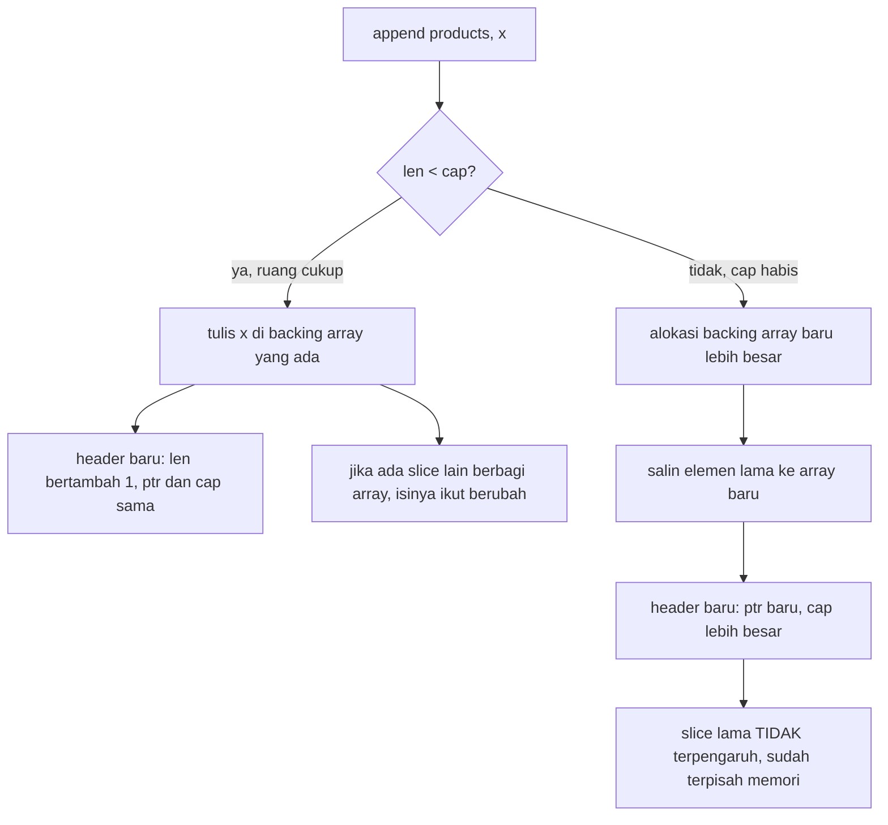
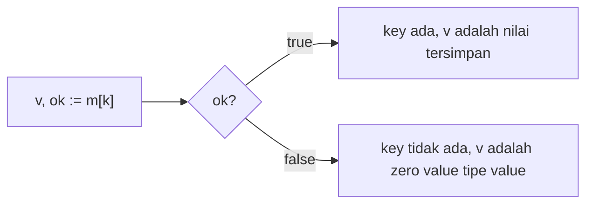
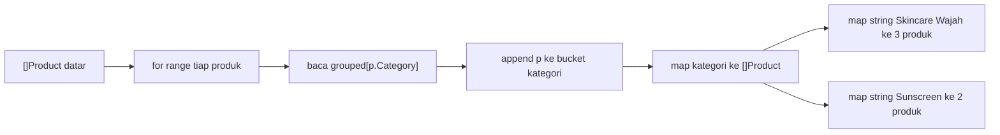
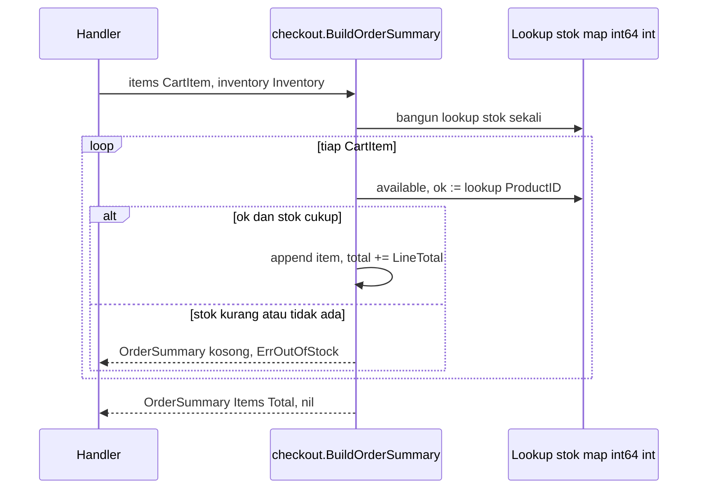

import { Section, Box, Steps, Step, Recap, CardGrid, Card, Chip, Hero, Compare, Def, Figure } from "@components";
import SliceMapBackingArrayFig01 from "@figures/SliceMapBackingArrayFig01.astro";

<Hero eyebrow="Roadmap 1 &middot; Fondasi" title="Slice, Map, dan <em>Koleksi</em><br />Bahan Baku Logic API">
  <p>Koleksi data adalah bahan baku setiap service backend: daftar produk, item cart, order item, dan lookup stok saat checkout. Di modul ini kita kuasai slice dan map cara Go, lengkap dengan backing array, gotcha aliasing, dan stdlib modern yang menggantikan banyak helper buatan tangan.</p>
  <Fragment slot="meta">
    <Chip icon="code">Bahasa: <b>Go 1.26</b></Chip>
    <Chip icon="clock">~70 menit baca</Chip>
    <Chip icon="rocket">Proyek: <b>Online Shop Skincare</b></Chip>
  </Fragment>
</Hero>

<Section num="01" id="intro" title="Koleksi sebagai Bahan Baku Backend" sub="Dari daftar produk dan item cart sampai lookup stok">

<p class="lead">Di React kamu hampir selalu memakai array untuk me-render list dan object atau `Map` untuk lookup. Di Go kebutuhannya sama, tetapi mekanisme memorinya jauh lebih eksplisit, dan justru di situ letak kekuatannya untuk backend.</p>

Di modul struct dan method kita sudah memodelkan entitas inti online shop skincare: `Product`, `CartItem`, `Order`, `Payment`, `Inventory`, dan `User`. Hampir semua entitas itu hidup dalam koleksi. Endpoint katalog mengembalikan banyak `Product`. Cart menampung banyak `CartItem`. Satu `Order` berisi banyak item. Checkout butuh lookup stok per produk. Modul ini fokus pada dua tipe koleksi yang paling sering kamu pakai di Go: `slice` dan `map`.

<Box variant="bridge" icon="🌉" label="Jembatan: dari React list ke Go slice"><p>Kalau di React kamu menulis `products.map(p => <Card .../>)` untuk merender kartu produk, di Go kamu memakai `for range` atas `[]Product` lalu membangun response DTO dengan `append`. Tidak ada method `.map`, `.filter`, atau `.reduce` bawaan di slice; kamu menulis loop yang eksplisit.</p></Box>

Go menyediakan array, slice, dan map sebagai tipe bawaan. Spesifikasi resmi mendefinisikan slice sebagai descriptor untuk segmen berurutan dari sebuah array, dan map sebagai kumpulan elemen tak berurutan dengan tipe key dan value yang sama. Builtin `append`, `len`, `cap`, `make`, `copy`, `delete`, dan (sejak Go 1.21) `clear`, `min`, `max` menjadi alat utamanya. Acuan resmi: [Go specification](https://go.dev/ref/spec#Slice_types), [Go Blog: Go Slices](https://go.dev/blog/slices-intro), [Go Blog: Go maps in action](https://go.dev/blog/maps), dan [builtin package](https://pkg.go.dev/builtin).

<CardGrid cols={3}>
  <Card><h4>Slice</h4><p>Daftar berurutan yang bisa bertambah, seperti `[]Product`, `[]CartItem`, atau `[]Order`. Inilah koleksi default sehari-hari.</p></Card>
  <Card><h4>Map</h4><p>Lookup cepat berbasis key, seperti `map[int64]int` untuk stok per `ProductID` atau `map[string]Product` untuk lookup per SKU.</p></Card>
  <Card><h4>range</h4><p>Loop idiomatik untuk membaca slice dan map tanpa callback tersembunyi, dengan error handling dan early return yang terlihat jelas.</p></Card>
</CardGrid>

</Section>

<Section num="02" id="array-vs-slice" title="Array vs Slice" sub="Array fixed-length value, slice dinamis yang dipakai setiap hari">

<p class="lead">Array Go punya panjang tetap, dan panjang itu adalah bagian dari tipenya. Slice adalah tampilan fleksibel di atas sebuah array, dan inilah yang hampir selalu kamu pakai di kode backend.</p>

Di JavaScript kamu terbiasa dengan `Array` yang bisa bertambah panjang kapan saja. Di Go, `array` seperti `[3]Product` berukuran tetap, dan `[3]Product` adalah tipe yang berbeda dari `[4]Product`. Lebih dari itu, array adalah value type: menyalin array atau melewatkannya ke fungsi akan menyalin seluruh isinya. Karena itu array jarang dipakai sebagai parameter service. Untuk daftar yang bertambah atau hasil query database, gunakan slice seperti `[]Product`.

<Compare aLabel="JavaScript: satu Array untuk semua" bLabel="Go: array vs slice" aTone="muted" bTone="teal">
  <Fragment slot="a"><ul><li>`Array` tunggal yang bisa tumbuh dan menyusut sesuka hati.</li><li>Selalu by reference; melewatkannya tidak menyalin isi.</li><li>Tidak ada konsep panjang yang menjadi bagian tipe.</li></ul></Fragment>
  <Fragment slot="b"><ul><li>`[3]Product` adalah array: panjang tetap, bagian dari tipe.</li><li>Array adalah value; menyalinnya menyalin seluruh elemen.</li><li>`[]Product` adalah slice: dinamis, ringan disalin, default sehari-hari.</li></ul></Fragment>
</Compare>

Kita teruskan model `Product` dari modul sebelumnya. Sesuai konvensi proyek, uang selalu `PriceRupiah int64`, ID selalu `int64`, dan status produk bertipe `ProductStatus`.

```go title="internal/product/product.go"
package product

type ProductStatus string

const (
	ProductStatusDraft      ProductStatus = "draft"
	ProductStatusActive     ProductStatus = "active"
	ProductStatusArchived   ProductStatus = "archived"
	ProductStatusOutOfStock ProductStatus = "out_of_stock"
)

func (s ProductStatus) IsSellable() bool {
	return s == ProductStatusActive
}

type Product struct {
	ID          int64
	SKU         string
	Name        string
	Category    string
	PriceRupiah int64
	Quantity    int
	Status      ProductStatus
}
```

```go title="internal/product/collections.go"
package product

func collectionsExample() {
	// Array: panjang 3 adalah bagian dari tipe, semua elemen ber-zero value.
	var fixed [3]Product
	fixed[0] = Product{ID: 1, Name: "Gentle Cleanser", Status: ProductStatusActive}

	// Slice: bentuk yang kita pakai untuk katalog, response, dan hasil query.
	products := []Product{
		{ID: 1, SKU: "SKN-CLN-01", Name: "Gentle Cleanser", PriceRupiah: 89000, Status: ProductStatusActive},
		{ID: 2, SKU: "SKN-TON-02", Name: "Hydrating Toner", PriceRupiah: 99000, Status: ProductStatusActive},
		{ID: 3, SKU: "SKN-SER-03", Name: "Niacinamide Serum", PriceRupiah: 129000, Status: ProductStatusActive},
	}

	_ = fixed
	_ = products
}
```

<Box variant="warn" icon="⚠️" label="Array disalin, slice berbagi"><p>Melewatkan array ke fungsi menyalin semua elemennya, jadi mutasi di dalam fungsi tidak terlihat oleh pemanggil. Melewatkan slice hanya menyalin header-nya (pointer, len, cap), sehingga mutasi elemen lewat index akan terlihat oleh pemanggil. Ini kebalikan dari intuisi sebagian pendatang dari JS.</p></Box>

<Box variant="tip" icon="💡" label="Rule of thumb"><p>Saat mendesain API, repository, service, atau response JSON, default-kan ke slice. Pakai array hanya saat ukuran benar-benar bagian dari model, misalnya kode OTP enam digit atau buffer berukuran tetap.</p></Box>

</Section>

<Section num="03" id="slice-header" title="Slice Header, len, dan cap" sub="Konsep kecil yang menentukan seluruh perilaku append">

<p class="lead">Slice terlihat seperti daftar, tetapi secara internal ia adalah descriptor kecil berisi tiga field: pointer ke backing array, `len`, dan `cap`. Memahami header ini membuat setiap kejutan `append` menjadi masuk akal.</p>

<Def term="slice header"><p>Struktur runtime tiga field yang menjadi nilai sebuah slice: sebuah pointer ke elemen pertama di backing array, `len` (jumlah elemen yang terlihat), dan `cap` (jumlah elemen dari posisi awal slice sampai akhir backing array). Saat kamu melewatkan slice ke fungsi, yang disalin adalah header ini, bukan elemen-elemennya.</p></Def>

<Def term="backing array"><p>Array nyata di memori yang menyimpan elemen di balik satu atau lebih slice. Beberapa slice bisa menunjuk ke backing array yang sama, sehingga perubahan elemen lewat satu slice dapat terlihat dari slice lain selama mereka masih berbagi backing array yang sama.</p></Def>

<Figure><SliceMapBackingArrayFig01 /><Fragment slot="caption"><b>Gambar 1.</b> Sebuah slice membawa pointer, `len`, dan `cap`. Dua slice (`products` dan `featured := products[:1]`) bisa menunjuk ke backing array yang sama, sehingga keduanya berbagi memori yang persis sama meskipun `len` mereka berbeda.</Fragment></Figure>

`len` adalah jumlah elemen yang sedang terlihat oleh slice. `cap` adalah jumlah elemen yang bisa ditampung dari posisi awal slice sampai ujung backing array. Saat kamu memanggil `append`, Go memakai kapasitas yang tersedia jika masih cukup; jika tidak cukup, Go mengalokasikan backing array baru yang lebih besar dan menyalin elemen lama ke sana.

```go title="internal/product/len_cap.go"
package product

import "fmt"

func lenCapExample() {
	products := make([]Product, 0, 3) // len 0, cap 3

	products = append(products, Product{ID: 1, Name: "Cleanser"})
	products = append(products, Product{ID: 2, Name: "Toner"})

	fmt.Println(len(products)) // 2 elemen terlihat
	fmt.Println(cap(products)) // 3 ruang tersedia, append berikutnya masih in place
}
```

<Box variant="bridge" icon="🌉" label="Jembatan: di JS kamu tak pernah memikirkan cap"><p>Di JavaScript, panjang dan kapasitas array tersembunyi sepenuhnya oleh engine. Di Go, `cap` terlihat dan penting, karena ia menentukan apakah `append` berikutnya menulis di tempat (in place) pada backing array lama atau memicu realokasi ke backing array baru.</p></Box>

<Box variant="note" icon="📝" label="Strategi pertumbuhan cap"><p>Saat realokasi terjadi, Go memilih kapasitas baru yang lebih besar (umumnya berlipat untuk slice kecil, lalu tumbuh lebih landai untuk slice besar). Angka pastinya adalah detail implementasi yang bisa berubah antar versi, jadi jangan menulis kode yang bergantung pada nilai `cap` tertentu setelah `append`. Yang dijamin spesifikasi hanyalah `len` hasil dan bahwa elemen lama terbawa.</p></Box>

</Section>

<Section num="04" id="membuat-slice" title="Membuat Slice: nil, empty, dan make" sub="Tiga bentuk yang semuanya sah tetapi bermakna berbeda">

<p class="lead">Ada beberapa cara membuat slice. Semuanya bisa menerima `append`, tetapi maknanya berbeda saat kamu bicara `nil`, encoding JSON, dan alokasi awal.</p>

Tiga bentuk paling sering terlihat adalah `var s []Product` (nil slice), `s := []Product{}` (empty slice non-nil), dan `make([]Product, 0, n)` (empty slice dengan kapasitas awal). Untuk service logic, ketiganya menerima `append` dengan aman, termasuk nil slice. Perbedaannya muncul saat kamu ingin membedakan "tidak ada data" dari "daftar kosong eksplisit", atau ingin menyiapkan kapasitas untuk mengurangi realokasi.

```go title="internal/product/slice_create.go"
package product

func sliceCreation() {
	var fromZeroValue []Product       // nil slice: len 0, cap 0, == nil bernilai true
	emptyLiteral := []Product{}       // empty slice non-nil: len 0, cap 0, != nil
	withMake := make([]Product, 0)    // sama efektifnya dengan empty literal
	withCapacity := make([]Product, 0, 20) // len 0, cap 20: siap menampung 20 tanpa realokasi

	// Keempatnya, termasuk nil slice, aman untuk append.
	fromZeroValue = append(fromZeroValue, Product{ID: 1, Name: "Cleanser"})
	emptyLiteral = append(emptyLiteral, Product{ID: 2, Name: "Toner"})
	withMake = append(withMake, Product{ID: 3, Name: "Serum"})
	withCapacity = append(withCapacity, Product{ID: 4, Name: "Sunscreen"})

	_, _, _, _ = fromZeroValue, emptyLiteral, withMake, withCapacity
}
```

<div class="tbl-wrap">
<table>
  <thead><tr><th>Bentuk</th><th>Makna praktis</th><th>Kapan dipakai</th></tr></thead>
  <tbody>
    <tr><td><code>var s []Product</code></td><td>nil slice, `len` 0, `cap` 0, `s == nil` true</td><td>Akumulator yang langsung di-`append`, default paling ringan</td></tr>
    <tr><td><code>s := []Product&#123;&#125;</code></td><td>empty slice non-nil</td><td>Response yang harus selalu jadi `[]` saat di-encode JSON</td></tr>
    <tr><td><code>make([]Product, 0, n)</code></td><td>empty slice dengan kapasitas awal `n`</td><td>Saat kamu tahu estimasi jumlah dan ingin menekan realokasi</td></tr>
  </tbody>
</table>
</div>

<Box variant="bridge" icon="🌉" label="Jembatan: nil slice vs null di JS/PHP"><p>Berbeda dari `null` JS atau `null` PHP yang akan meledak saat kamu coba iterasi, nil slice di Go sepenuhnya aman: `len(nil)` adalah 0, `range` atas nil slice tidak pernah jalan, dan `append` ke nil slice bekerja normal. nil slice adalah "daftar kosong yang belum punya backing array", bukan jebakan.</p></Box>

Bedanya baru terasa saat encode JSON. Dengan package `encoding/json`, nil slice menjadi `null`, sedangkan empty slice menjadi `[]`. Untuk API publik, banyak tim memilih selalu mengirim `[]` agar frontend tidak perlu menangani dua bentuk.

```go title="internal/httpapi/dto/product_list.go"
package dto

import "github.com/kamu/skincare-backend/internal/product"

type ProductListResponse struct {
	Items []ProductView `json:"items"`
	Total int           `json:"total"`
}

type ProductView struct {
	ID          int64  `json:"id"`
	SKU         string `json:"sku"`
	Name        string `json:"name"`
	PriceRupiah int64  `json:"price_rupiah"`
}

func NewProductListResponse(products []product.Product) ProductListResponse {
	items := make([]ProductView, 0, len(products)) // selalu non-nil: JSON akan jadi [] bukan null
	for _, p := range products {
		items = append(items, ProductView{
			ID:          p.ID,
			SKU:         p.SKU,
			Name:        p.Name,
			PriceRupiah: p.PriceRupiah,
		})
	}

	return ProductListResponse{Items: items, Total: len(items)}
}
```

<Box variant="tip" icon="💡" label="Pola anti-null untuk response"><p>Mulai akumulator response dengan `make([]T, 0, len(src))`, bukan `var s []T`. Selain menjamin JSON keluar sebagai `[]`, kapasitas awal `len(src)` menghindari realokasi berulang saat `append` di dalam loop. Ini pola yang akan kamu ulang di hampir setiap mapping DTO.</p></Box>

</Section>

<Section num="05" id="append-aliasing" title="append, Aliasing, copy, dan Three-Index" sub="append mengembalikan slice baru, dan sub-slice bisa berbagi memori">

<p class="lead">`append` tidak memutasi variabel slice secara ajaib. Ia mengembalikan slice hasil, dan kamu wajib menyimpan hasilnya. Inilah aturan paling penting sekaligus sumber bug paling halus di Go.</p>

Pola yang benar selalu `products = append(products, p)`. Karena header slice membawa `len` dan `cap`, setelah `append` panjangnya berubah dan kamu harus memakai header baru itu. Memanggil `append(products, p)` tanpa menyimpan hasilnya adalah bug diam-diam.

```go title="internal/checkout/cart.go"
package checkout

import "github.com/kamu/skincare-backend/internal/product"

type CartItem struct {
	Product product.Product
	Qty     int
}

func (item CartItem) LineTotal() int64 {
	return item.Product.PriceRupiah * int64(item.Qty)
}

type Cart struct {
	Items []CartItem
}

func (c *Cart) AddItem(item CartItem) {
	c.Items = append(c.Items, item) // simpan hasil, jangan hanya append(c.Items, item)
}
```

<Box variant="bridge" icon="🌉" label="Jembatan: bukan array.push() yang mutasi di tempat"><p>Di JS, `arr.push(x)` memutasi `arr` di tempat dan kamu mengabaikan return value-nya. Di Go, `append` boleh saja merealokasi backing array, sehingga ia mengembalikan header baru. Pikirkan `append` sebagai fungsi murni yang menghasilkan slice, bukan method yang memutasi.</p></Box>

Gotcha aliasing muncul saat kamu membuat slice dari slice lain. Jika kapasitas sub-slice masih menjangkau backing array asal, `append` akan menulis ke backing array yang sama, dan perubahan itu bocor ke slice lain yang masih menunjuk ke sana.

```go title="internal/product/append_gotcha.go"
package product

func featuredGotcha() []Product {
	products := []Product{
		{ID: 1, Name: "Cleanser"},
		{ID: 2, Name: "Toner"},
		{ID: 3, Name: "Serum"},
	}

	// featured: len 1, tetapi cap 3 (masih menjangkau backing array products).
	featured := products[:1]

	// append menulis ke slot index 1 backing array yang SAMA dengan products.
	featured = append(featured, Product{ID: 99, Name: "Promo Sunscreen"})

	// products[1] sekarang menjadi "Promo Sunscreen", bukan "Toner". Bocor.
	return products
}
```



<p class="fig-cap"><b>Gambar 2.</b> Dua jalur `append`. Selama `len &lt; cap`, penulisan terjadi di backing array yang ada, dan slice lain yang berbagi array bisa ikut berubah. Begitu `cap` habis, Go merealokasi, dan sejak titik itu slice menjadi terpisah memori.</p>

<Box variant="warn" icon="⚠️" label="Jangan anggap append atas sub-slice selalu aman"><p>Jika sub-slice masih punya kapasitas (`cap` lebih besar dari `len`), `append` dapat menimpa elemen di backing array yang juga dipakai slice lain. Bug ini sulit terlihat karena tidak ada error, hanya data yang "tiba-tiba berubah".</p></Box>

Ada dua cara aman. Pertama, salin secara eksplisit saat hasil harus independen. `copy(dst, src)` menyalin sebanyak `min(len(dst), len(src))` elemen dan mengembalikan jumlah yang tersalin.

```go title="internal/product/append_safe.go"
package product

func safeFeatured(products []Product) []Product {
	// make + copy: backing array baru yang independen.
	featured := make([]Product, 1)
	copy(featured, products[:1])

	// Idiom ringkas yang setara: append ke nil dengan spread elemen sumber.
	// featured := append([]Product(nil), products[:1]...)

	featured = append(featured, Product{ID: 99, Name: "Promo Sunscreen"})
	return featured // products tidak terpengaruh
}
```

Kedua, batasi kapasitas sub-slice dengan three-index slicing `a[low:high:max]`. Bentuk ini menyetel `cap` hasil menjadi `max - low`, sehingga `append` berikutnya dijamin merealokasi alih-alih menimpa backing array asal.

<Def term="three-index slice a[low:high:max]"><p>Bentuk slicing dengan tiga indeks. `low` dan `high` menentukan elemen yang terlihat (`len = high - low`), sedangkan `max` membatasi kapasitas (`cap = max - low`). Dengan menyetel `high == max`, `cap` hasil menjadi sama dengan `len`, sehingga `append` pertama pasti mengalokasikan backing array baru dan tidak akan menimpa slice asal.</p></Def>

```go title="internal/product/three_index.go"
package product

func featuredCapped(products []Product) []Product {
	// products[:1:1] => len 1, cap 1. append berikutnya pasti realokasi.
	featured := products[:1:1]
	featured = append(featured, Product{ID: 99, Name: "Promo Sunscreen"})
	return featured // aman: products tidak ikut berubah
}
```

<Box variant="tip" icon="💡" label="Tiga cara, satu tujuan"><p>Untuk koleksi baru yang harus hidup sendiri, pilih salah satu: `make` plus `copy`, idiom `append([]T(nil), src...)`, atau three-index `src[:n:n]`. Untuk memotong slice tanpa khawatir aliasing, three-index adalah cara paling ringkas menyatakan "potongan ini tidak boleh menimpa asalnya".</p></Box>

</Section>

<Section num="06" id="range-transformasi" title="range untuk Membaca dan Mengubah Bentuk" sub="Padanan Go untuk map, filter, dan forEach di JS">

<p class="lead">Go tidak punya method `map`, `filter`, atau `reduce` pada slice. Kamu menulis loop eksplisit dengan `for range`. Bagi developer React ini terasa lebih verbose, tetapi untuk backend justru lebih jujur.</p>

Loop eksplisit membuat validasi, perhitungan total, error handling, dan early return terlihat di satu tempat tanpa callback bertingkat. Inilah transformasi `[]Product` menjadi `[]ProductView` untuk response, padanan langsung dari `products.map(toView)` di React.

<Compare aLabel="JS: Array.map / filter" bLabel="Go: for range + append" aTone="muted" bTone="violet">
  <Fragment slot="a"><ul><li>`map`/`filter` ringkas untuk transformasi kecil.</li><li>Error handling sering masuk callback atau di-throw.</li><li>Early return sulit; biasanya pakai `some`/`every`.</li></ul></Fragment>
  <Fragment slot="b"><ul><li>`for range` membuat alur data terlihat lurus.</li><li>`if err != nil` dan `return` langsung di dalam loop.</li><li>`continue` dan `break` untuk filter dan early stop.</li></ul></Fragment>
</Compare>

```go title="internal/httpapi/dto/product_view.go"
package dto

import "github.com/kamu/skincare-backend/internal/product"

func ToProductViews(products []product.Product) []ProductView {
	views := make([]ProductView, 0, len(products))
	for _, p := range products {
		views = append(views, ProductView{
			ID:          p.ID,
			SKU:         p.SKU,
			Name:        p.Name,
			PriceRupiah: p.PriceRupiah,
		})
	}

	return views
}
```

```text title="Padanan mental JS ke Go"
JS:  const views = products.map(toView)
Go:  views := make([]ProductView, 0, len(products))
     for _, p := range products { views = append(views, toView(p)) }
```

Untuk filter, tetap bangun slice hasil baru. Hindari menghapus elemen dari slice yang sedang kamu iterasi kecuali kamu paham betul konsekuensinya pada index dan backing array.

```go title="internal/product/filter.go"
package product

// FilterSellable mengembalikan hanya produk yang boleh dijual saat ini.
func FilterSellable(products []Product) []Product {
	result := make([]Product, 0, len(products))
	for _, p := range products {
		if !p.Status.IsSellable() {
			continue
		}

		result = append(result, p)
	}

	return result
}
```

<Box variant="warn" icon="⚠️" label="Variabel range adalah salinan elemen"><p>`for _, p := range products` menyalin tiap elemen ke `p`. Mengubah `p.Quantity` di dalam loop tidak mengubah slice asal. Untuk memutasi elemen di tempat, indeks langsung: `for i := range products { products[i].Quantity = 0 }`. Sejak Go 1.22 variabel loop juga di-scope ulang tiap iterasi, sehingga mengambil `&p` di dalam loop tidak lagi menghasilkan pointer yang sama untuk semua iterasi seperti pada Go lama.</p></Box>

<Box variant="note" icon="📝" label="Index dan value"><p>`for i, v := range products` memberi index dan value. Jika index tidak dipakai, gunakan `_`. Jika value tidak dipakai, cukup `for i := range products`. Atas slice, `range` juga aman pada nil slice: loop tidak pernah jalan.</p></Box>

</Section>

<Section num="07" id="map-lookup" title="Map dan Lookup dengan comma-ok" sub="Object atau Map versi Go dengan tipe key dan value yang tegas">

<p class="lead">Map di Go adalah koleksi pasangan key-value dengan tipe yang tegas. Untuk backend, map paling sering dipakai sebagai lookup table di memory: ubah pencarian O(n) di dalam slice menjadi lookup O(1).</p>

Di JavaScript kamu memakai object biasa untuk lookup sederhana atau `Map` ketika key lebih fleksibel. Di Go, map selalu punya tipe key dan tipe value yang pasti, misalnya `map[int64]int`, `map[int64]Product`, atau `map[string]Product`. Bangun lookup dari slice dengan sekali loop.

```go title="internal/inventory/lookup.go"
package inventory

import "github.com/kamu/skincare-backend/internal/product"

// BuildStockLookup mengubah daftar inventory menjadi lookup stok per ProductID.
func BuildStockLookup(items []product.Inventory) map[int64]int {
	lookup := make(map[int64]int, len(items)) // beri hint kapasitas untuk efisiensi
	for _, item := range items {
		lookup[item.ProductID] = item.Available
	}

	return lookup
}
```

Lookup map memakai bentuk comma-ok. Ini penting karena value zero bisa valid: kalau stok sebuah produk adalah 0, kamu tetap harus bisa membedakan "key ada dengan stok 0" dari "key memang tidak ada".

```go title="internal/inventory/check.go"
package inventory

func HasEnoughStock(stockByProductID map[int64]int, productID int64, qty int) bool {
	available, ok := stockByProductID[productID]
	if !ok {
		return false // produk tidak ada dalam lookup
	}

	return available >= qty
}
```

<Box variant="bridge" icon="🌉" label="Jembatan: undefined vs comma-ok"><p>Di JS, akses key yang tidak ada menghasilkan `undefined`, dan kamu sulit membedakannya dari nilai yang memang `undefined`. Di Go, membaca key yang tidak ada mengembalikan zero value dari tipe value (`0`, `""`, `nil`, dst), jadi kamu memakai `v, ok := m[k]` untuk tahu pasti apakah key benar-benar ada.</p></Box>



<p class="fig-cap"><b>Gambar 3.</b> Bentuk comma-ok memisahkan "key ada" dari "value kebetulan zero". Tanpa `ok`, stok 0 dan produk yang tidak terdaftar terlihat identik.</p>

Lookup `map[int64]Product` sangat berguna saat kamu sudah memuat katalog dan ingin mengambil produk by ID berulang kali tanpa men-scan slice setiap saat.

```go title="internal/product/index.go"
package product

func IndexByID(products []Product) map[int64]Product {
	byID := make(map[int64]Product, len(products))
	for _, p := range products {
		byID[p.ID] = p
	}

	return byID
}

func IndexBySKU(products []Product) map[string]Product {
	bySKU := make(map[string]Product, len(products))
	for _, p := range products {
		bySKU[p.SKU] = p
	}

	return bySKU
}
```

<Box variant="warn" icon="⚠️" label="Menulis ke nil map akan panic"><p>nil map bisa dibaca (mengembalikan zero value) tetapi akan panic saat ditulis. Selalu inisialisasi dengan literal `map[K]V{}` atau `make` sebelum assignment. Berbeda dari nil slice yang aman di-`append`, nil map tidak aman ditulisi.</p></Box>

```go title="internal/product/map_init.go"
package product

func mapInit() {
	var broken map[int64]Product // nil map
	_ = broken[1]                // OK: baca nil map mengembalikan zero value
	// broken[1] = Product{}     // PANIC: assignment to entry in nil map

	bySKU := map[string]Product{}      // literal, siap ditulis
	byID := make(map[int64]Product)    // make, siap ditulis

	bySKU["SKN-CLN-01"] = Product{ID: 1, Name: "Gentle Cleanser"}
	byID[1] = Product{ID: 1, Name: "Gentle Cleanser"}
	delete(byID, 1) // delete aman bahkan jika key tidak ada
}
```

<Box variant="note" icon="📝" label="Urutan iterasi map sengaja acak"><p>Iterasi `range` atas map tidak punya urutan yang dijamin, dan urutannya sengaja diacak antar run. Ini desain Go agar kamu tidak diam-diam bergantung pada urutan tertentu. Kalau butuh output berurutan, kumpulkan key ke slice lalu urutkan, seperti yang kita lihat di bagian stdlib berikutnya.</p></Box>

</Section>

<Section num="08" id="grouping-data" title="Grouping Data per Kategori" sub="Dari daftar datar menjadi map kategori ke daftar produk">

<p class="lead">Grouping adalah pola map paling berguna di service backend. Kamu mengubah daftar datar menjadi struktur yang jauh lebih cepat untuk dihitung dan ditampilkan.</p>

Misalnya endpoint katalog ingin menampilkan produk yang dikelompokkan per kategori. Di JS kamu mungkin memakai `reduce` untuk membangun object. Di Go, pakai `map[string][]Product` dan `append` ke bucket masing-masing kategori.

```go title="internal/product/group.go"
package product

// GroupByCategory mengelompokkan produk per kategori untuk tampilan katalog.
func GroupByCategory(products []Product) map[string][]Product {
	grouped := make(map[string][]Product)
	for _, p := range products {
		grouped[p.Category] = append(grouped[p.Category], p)
	}

	return grouped
}
```

Pola ini bekerja mulus berkat dua sifat Go yang sudah kita pelajari. Membaca key map yang belum ada mengembalikan zero value tipe value; untuk `[]Product`, zero value-nya adalah nil slice. Dan nil slice aman untuk `append`. Jadi `grouped[p.Category] = append(grouped[p.Category], p)` bekerja untuk kategori baru maupun kategori yang sudah ada, tanpa pengecekan eksistensi.



<p class="fig-cap"><b>Gambar 4.</b> Grouping mengubah slice produk datar menjadi `map[string][]Product` per kategori. Karena nil slice aman di-`append`, kategori baru terbentuk otomatis tanpa cek eksistensi terlebih dulu.</p>

Pola yang sama berlaku untuk grouping order item. Untuk audit inventory, kita kelompokkan semua item dari banyak order berdasarkan `ProductID`, lalu jumlahkan kuantitas terjual per produk dalam satu lookup.

```go title="internal/order/aggregate.go"
package order

import "github.com/kamu/skincare-backend/internal/checkout"

// SoldQtyByProductID menjumlahkan kuantitas terjual per produk dari banyak cart item.
func SoldQtyByProductID(items []checkout.CartItem) map[int64]int {
	sold := make(map[int64]int)
	for _, item := range items {
		sold[item.Product.ID] += item.Qty // map[int64]int: zero value 0, += aman
	}

	return sold
}
```

<Box variant="tip" icon="💡" label="Kenapa grouping penting"><p>Grouping menghindari loop bersarang yang mahal. Untuk laporan dengan ribuan order item, sekali pass membangun lookup `map` jauh lebih jelas dan cepat daripada mencari produk satu per satu di dalam slice untuk tiap item.</p></Box>

</Section>

<Section num="09" id="stdlib-modern" title="slices, maps, clear, dan min/max" sub="Stdlib modern yang menggantikan banyak helper buatan tangan">

<p class="lead">Sejak Go 1.21, standard library menambahkan package `slices` dan `maps` plus builtin `clear`, `min`, dan `max`. Banyak loop yang dulu kamu tulis sendiri kini punya padanan baku yang teruji dan idiomatik.</p>

Package `slices` membawa fungsi generik seperti `slices.Sort`, `slices.Contains`, `slices.Index`, dan `slices.SortFunc`. Untuk mengurutkan katalog atau mencari produk dalam slice, ini lebih ringkas dan jelas daripada loop manual atau `sort.Slice` versi lama.

```go title="internal/product/sort_search.go"
package product

import (
	"cmp"
	"slices"
)

// SortByPrice mengurutkan produk menaik berdasarkan harga (in place).
func SortByPrice(products []Product) {
	slices.SortFunc(products, func(a, b Product) int {
		return cmp.Compare(a.PriceRupiah, b.PriceRupiah) // -1, 0, +1 menentukan urutan
	})
}

// ContainsSKU mengecek apakah daftar SKU memuat sku tertentu.
func ContainsSKU(skus []string, sku string) bool {
	return slices.Contains(skus, sku)
}

// IndexOfID mencari posisi produk dengan id tertentu, -1 jika tidak ada.
func IndexOfID(ids []int64, id int64) int {
	return slices.Index(ids, id)
}
```

<Box variant="bridge" icon="🌉" label="Jembatan: dari sort.Slice ke slices.SortFunc"><p>Kalau kamu sempat melihat kode Go lama dengan `sort.Slice(s, func(i, j int) bool { ... })`, versi modern `slices.SortFunc(s, func(a, b T) int { ... })` lebih jelas: comparator membandingkan dua elemen langsung dan mengembalikan `int` bertanda, bukan dua index. Hasilnya lebih dekat ke `Array.prototype.sort` yang sudah kamu kenal di JS.</p></Box>

Package `maps` membawa `maps.Keys` dan `maps.Values`. Sejak Go 1.23 keduanya mengembalikan iterator (`iter.Seq`), bukan slice, sehingga bisa langsung dirangkai. Karena urutan iterasi map acak, pola idiomatik untuk key terurut adalah `slices.Sorted(maps.Keys(m))`: `maps.Keys` menghasilkan iterator key, lalu `slices.Sorted` mengumpulkannya ke slice dan mengurutkannya.

```go title="internal/product/sorted_keys.go"
package product

import (
	"maps"
	"slices"
)

// SortedCategoryNames mengembalikan nama kategori secara terurut dan deterministik.
func SortedCategoryNames(grouped map[string][]Product) []string {
	return slices.Sorted(maps.Keys(grouped)) // maps.Keys -> iter.Seq[string], lalu Sorted
}
```

<Compare aLabel="Cara klasik: loop kumpulkan key lalu sort" bLabel="Cara modern: slices.Sorted(maps.Keys)" aTone="muted" bTone="teal">
  <Fragment slot="a"><ul><li>`keys := make([]K, 0, len(m))`</li><li>`for k := range m { keys = append(keys, k) }`</li><li>`slices.Sort(keys)`</li></ul></Fragment>
  <Fragment slot="b"><ul><li>`keys := slices.Sorted(maps.Keys(m))`</li><li>Satu baris, intent jelas, tanpa akumulator manual.</li><li>Tersedia sejak Go 1.23 lewat iterator `iter.Seq`.</li></ul></Fragment>
</Compare>

Builtin `clear` (Go 1.21) berperilaku berbeda untuk map dan slice. Pada map, `clear` menghapus semua entry sehingga `len` menjadi 0. Pada slice, `clear` menyetel semua elemen ke zero value tetapi `len` tetap, karena panjang adalah bagian dari nilai slice.

```go title="internal/inventory/reset.go"
package inventory

func resetExamples(stock map[int64]int, batch []int) {
	clear(stock)    // map: semua entry dihapus, len(stock) menjadi 0
	clear(batch)    // slice: tiap elemen jadi 0, len(batch) TIDAK berubah
	_ = batch
}
```

Builtin `min` dan `max` (Go 1.21) bekerja pada tipe ordered (integer, float, string) dengan jumlah argumen tetap. Praktis untuk membatasi kuantitas atau menghitung total tanpa fungsi helper.

```go title="internal/checkout/clamp.go"
package checkout

// ClampQty membatasi kuantitas pesanan di antara 1 dan stok tersedia.
func ClampQty(requested, available int) int {
	return max(1, min(requested, available))
}
```

<Box variant="note" icon="📌" label="Catatan versi"><p>Package `slices` dan `maps` serta builtin `clear`, `min`, `max` hadir sejak Go 1.21. Iterator (`iter.Seq`) dan bentuk `maps.Keys`/`maps.Values` yang mengembalikan iterator hadir sejak Go 1.23, dan dipakai bersama `slices.Sorted`. Proyek ini memakai Go 1.26, jadi semuanya tersedia. Acuan: [slices](https://pkg.go.dev/slices), [maps](https://pkg.go.dev/maps), dan [Go 1.21 release notes](https://go.dev/doc/go1.21).</p></Box>

</Section>

<Section num="10" id="skenario-checkout" title="Skenario Checkout Skincare" sub="Menyatukan slice dan map dalam satu alur service nyata">

<p class="lead">Sekarang kita sambungkan slice dan map ke alur checkout yang akan terus dipakai di roadmap berikutnya. Inilah tempat lookup map dan loop slice bekerja bersama.</p>

Dalam online shop skincare, checkout menerima `[]CartItem`, memvalidasi tiap item terhadap lookup stok `map[int64]int`, lalu menghitung total. Kombinasi slice untuk daftar dan map untuk lookup adalah tulang punggung service layer pertama kita.

```go title="internal/checkout/service.go"
package checkout

import (
	"errors"

	"github.com/kamu/skincare-backend/internal/product"
)

type OrderSummary struct {
	Items []CartItem
	Total int64
}

var ErrOutOfStock = errors.New("checkout: insufficient stock")

// BuildOrderSummary memvalidasi cart terhadap stok lalu menghitung total.
func BuildOrderSummary(items []CartItem, inventory []product.Inventory) (OrderSummary, error) {
	// 1) Bangun lookup stok per ProductID: O(n) sekali, lalu O(1) per cek.
	stockByID := make(map[int64]int, len(inventory))
	for _, inv := range inventory {
		stockByID[inv.ProductID] = inv.Available
	}

	// 2) Validasi tiap item dengan comma-ok, kumpulkan yang valid, jumlahkan total.
	accepted := make([]CartItem, 0, len(items))
	var total int64

	for _, item := range items {
		available, ok := stockByID[item.Product.ID]
		if !ok || available < item.Qty {
			return OrderSummary{}, ErrOutOfStock
		}

		accepted = append(accepted, item)
		total += item.LineTotal()
	}

	return OrderSummary{Items: accepted, Total: total}, nil
}
```



<p class="fig-cap"><b>Gambar 5.</b> Alur checkout. Lookup stok dibangun sekali sebagai map, lalu tiap cart item divalidasi dengan comma-ok. Begitu satu item gagal, service mengembalikan error eksplisit, persis pola error return dari modul fungsi.</p>

<CardGrid cols={3}>
  <Card><h4>Katalog</h4><p>`[]Product` untuk response daftar, `FilterSellable`, dan `GroupByCategory` per kategori.</p></Card>
  <Card><h4>Cart</h4><p>`[]CartItem` menjaga urutan item, tiap item punya `LineTotal()` sebagai method.</p></Card>
  <Card><h4>Checkout</h4><p>`map[int64]int` untuk validasi stok per `ProductID`, lalu total dihitung lewat slice.</p></Card>
</CardGrid>

<Box variant="bridge" icon="🌉" label="Jembatan: dari Laravel Collection"><p>Laravel punya `Collection` dengan method chain panjang seperti `->filter()->map()->sum()`. Di Go, service logic memakai slice, map, dan fungsi kecil yang eksplisit. Lebih banyak baris, tetapi alur error dan return terbaca lurus tanpa magic, dan setiap langkah mudah dites sendiri.</p></Box>

</Section>

<Section num="11" id="hands-on" title="Hands-on Ringan" sub="Bangun fungsi kecil yang terasa seperti service backend">

<p class="lead">Latihan ini tidak butuh database. Tujuannya membuat kamu nyaman dengan slice, map, grouping, comma-ok, dan total checkout.</p>

<Steps>
  <Step><b>Siapkan tipe domain</b><p>Pakai `product.Product`, `product.Inventory`, dan `checkout.CartItem` dari modul sebelumnya. Tidak perlu mendefinisikan ulang.</p></Step>
  <Step><b>Bangun lookup stok</b><p>Ubah `[]product.Inventory` menjadi `map[int64]int` agar validasi checkout tidak perlu men-scan slice berulang.</p></Step>
  <Step><b>Validasi dan hitung total</b><p>Terima hanya item yang `ProductID`-nya ada dan stoknya cukup, lalu jumlahkan `LineTotal()` menjadi total.</p></Step>
  <Step><b>Tulis test dua jalur</b><p>Uji kasus stok cukup (sukses) dan stok kurang (`ErrOutOfStock`), lalu jalankan `go test ./...`.</p></Step>
</Steps>

```go title="internal/checkout/service_test.go"
package checkout

import (
	"errors"
	"testing"

	"github.com/kamu/skincare-backend/internal/product"
)

func TestBuildOrderSummary(t *testing.T) {
	items := []CartItem{
		{Product: product.Product{ID: 1, Name: "Cleanser", PriceRupiah: 89000}, Qty: 2},
		{Product: product.Product{ID: 2, Name: "Toner", PriceRupiah: 99000}, Qty: 1},
	}

	inventory := []product.Inventory{
		{ProductID: 1, Available: 10},
		{ProductID: 2, Available: 3},
	}

	summary, err := BuildOrderSummary(items, inventory)
	if err != nil {
		t.Fatalf("expected no error, got %v", err)
	}

	if len(summary.Items) != 2 {
		t.Fatalf("expected 2 items, got %d", len(summary.Items))
	}

	// 2*89000 + 1*99000 = 277000
	if summary.Total != 277000 {
		t.Fatalf("expected total 277000, got %d", summary.Total)
	}
}

func TestBuildOrderSummaryOutOfStock(t *testing.T) {
	items := []CartItem{
		{Product: product.Product{ID: 1, Name: "Cleanser", PriceRupiah: 89000}, Qty: 5},
	}

	inventory := []product.Inventory{
		{ProductID: 1, Available: 2}, // stok kurang dari Qty
	}

	_, err := BuildOrderSummary(items, inventory)
	if !errors.Is(err, ErrOutOfStock) {
		t.Fatalf("expected ErrOutOfStock, got %v", err)
	}
}
```

```bash title="Terminal"
go test ./...
```

<Box variant="tip" icon="✅" label="Ukuran latihan yang pas"><p>Jangan langsung membuat generic collection helper. Tulis loop biasa dulu sampai pola slice dan map terasa natural. Setelah nyaman, refactor pencarian ke `slices.Contains` atau `slices.Index` saat memang menyederhanakan.</p></Box>

</Section>

<Section num="12" id="jebakan-umum" title="Jebakan Umum dari JS dan PHP" sub="Hampir semua bug koleksi lahir dari asumsi yang terbawa dari JS">

<p class="lead">Kebanyakan bug slice dan map bukan karena sintaksnya susah, tetapi karena kebiasaan dari JavaScript dan PHP terbawa ke Go tanpa disadari.</p>

<CardGrid cols={2}>
  <Card><h4>Lupa menyimpan hasil append</h4><p>Tulis `items = append(items, x)`, bukan hanya `append(items, x)`. `append` mengembalikan header baru; mengabaikannya membuang hasilnya.</p></Card>
  <Card><h4>Sub-slice berbagi backing array</h4><p>`s[:n]` masih membawa kapasitas asal. Untuk hasil independen, pakai `copy`, `append([]T(nil), s...)`, atau three-index `s[:n:n]`.</p></Card>
  <Card><h4>Menulis ke nil map</h4><p>nil map panic saat ditulis. Selalu `make` atau literal sebelum assignment. nil slice aman di-`append`, nil map tidak.</p></Card>
  <Card><h4>Mengandalkan urutan iterasi map</h4><p>Urutan `range` map sengaja acak. Untuk output berurutan, `slices.Sorted(maps.Keys(m))` lalu iterasi key.</p></Card>
  <Card><h4>Lupa comma-ok di lookup</h4><p>`v := m[k]` tidak membedakan "tidak ada" dari "value zero". Pakai `v, ok := m[k]` saat zero adalah nilai yang sah.</p></Card>
  <Card><h4>Memutasi variabel range</h4><p>Variabel `v` pada `range` adalah salinan. Untuk memutasi elemen di tempat, pakai index: `s[i].Field = ...`.</p></Card>
</CardGrid>

Saat frontend butuh urutan stabil, jangan kirim map. Kumpulkan key ke slice, urutkan, lalu bangun response sebagai slice. Inilah versi modern menggantikan loop manual plus `sort.Slice`.

```go title="internal/product/ordered_response.go"
package product

import (
	"maps"
	"slices"
)

// CategoriesInOrder mengembalikan kategori terurut beserta produknya untuk response.
func CategoriesInOrder(grouped map[string][]Product) []CategoryGroup {
	names := slices.Sorted(maps.Keys(grouped)) // deterministik, bukan urutan acak map
	out := make([]CategoryGroup, 0, len(names))
	for _, name := range names {
		out = append(out, CategoryGroup{Category: name, Products: grouped[name]})
	}

	return out
}

type CategoryGroup struct {
	Category string
	Products []Product
}
```

<Box variant="warn" icon="🚫" label="Map bukan representasi urutan UI"><p>Map unggul untuk lookup, bukan untuk daftar yang harus tampil berurutan. Kalau frontend menampilkan kategori atau produk dalam urutan tertentu, kirim slice yang sudah diurutkan. Map yang di-encode ke JSON pun key-nya tidak dijamin berurutan.</p></Box>

</Section>

<Section num="13" id="ringkasan" title="Ringkasan & Poin Penting">

<p class="lead">Slice dan map adalah fondasi koleksi data Go yang akan terus muncul dari handler API sampai repository dan service checkout.</p>

<Recap title="Yang Wajib Menempel">
  <ul>
    <li>Array Go fixed-length dan value type; slice adalah header (pointer, `len`, `cap`) di atas backing array, dan inilah koleksi default sehari-hari.</li>
    <li>`len` menghitung elemen terlihat, `cap` adalah ruang sampai ujung backing array; `append` memakai `cap` jika cukup, atau merealokasi backing array baru bila habis.</li>
    <li>`append` mengembalikan slice baru, jadi selalu simpan hasilnya; sub-slice bisa berbagi backing array, jadi pakai `copy`, `append([]T(nil), s...)`, atau three-index `s[:n:n]` untuk hasil independen.</li>
    <li>`for range` adalah pola transformasi utama Go yang menggantikan `map`, `filter`, dan `reduce`; variabel range adalah salinan, gunakan index untuk mutasi di tempat.</li>
    <li>Map butuh inisialisasi sebelum ditulis (nil map panic), iterasinya acak, dan comma-ok `v, ok := m[k]` memisahkan "tidak ada" dari "value zero".</li>
    <li>Grouping `map[K][]V` memanfaatkan nil slice yang aman di-`append`; pola ini mengubah daftar datar menjadi lookup per kategori atau per produk.</li>
    <li>Stdlib modern: `slices.Sort/Contains/Index/SortFunc`, `maps.Keys/Values` (iterator sejak Go 1.23), `slices.Sorted(maps.Keys(m))`, serta builtin `clear`, `min`, `max` sejak Go 1.21.</li>
  </ul>
</Recap>

<h3>Pemetaan ke proyek online shop skincare</h3>

<CardGrid cols={2}>
  <Card><h4>Koleksi siap pakai di tiga area</h4><p>Endpoint katalog memakai `[]Product` dengan filter dan grouping, cart memakai `[]CartItem` dengan `LineTotal`, dan checkout memakai `map[int64]int` untuk validasi stok per `ProductID`.</p></Card>
  <Card><h4>Lookup menggantikan loop bersarang</h4><p>Mengubah pencarian O(n) dalam slice menjadi lookup O(1) lewat map adalah pola yang akan kamu ulang di repository, service, dan agregasi laporan.</p></Card>
</CardGrid>

<Box variant="bridge" icon="🌉" label="Langkah berikutnya"><p>Modul berikutnya masuk ke pointer dan dasar memori: apa itu pointer, perbedaan pass by value dan pass by reference, `nil`, serta kapan memakai pointer untuk mutasi dan nilai opsional. Slice header yang menyimpan pointer ke backing array dan pointer receiver `MarkPaid` dari modul struct adalah pintu masuknya. Setelah pointer, kita lanjut ke interface, package, context, lalu concurrency, sebelum Roadmap 2 membangun Web API dengan chi.</p></Box>

<Box variant="tip" icon="✅" label="Checkpoint sebelum lanjut"><p>Pastikan kamu bisa menjelaskan beda array dan slice, menggambar slice header di atas backing array, menjelaskan kenapa `append` atas sub-slice bisa bocor, menulis lookup map dengan comma-ok, melakukan grouping per kategori, dan menyebut padanan stdlib modern untuk sort, search, dan key terurut.</p></Box>

</Section>
