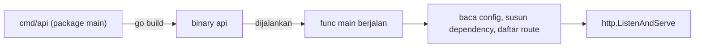
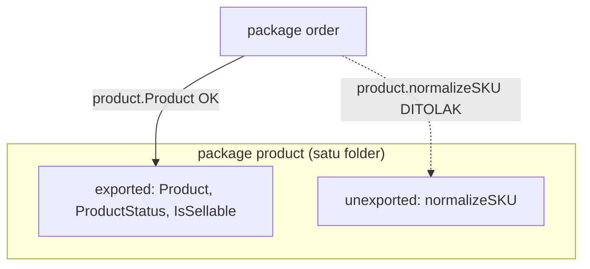
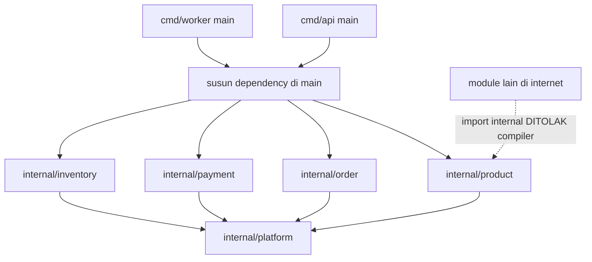
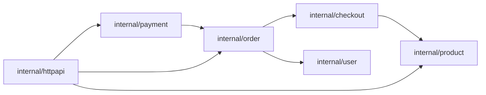
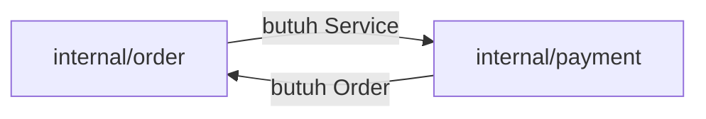
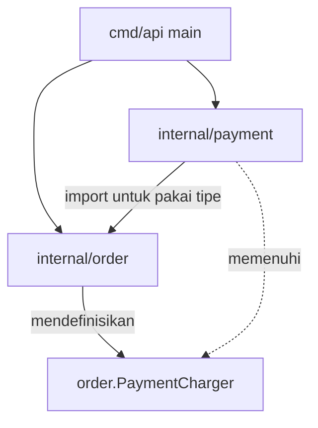

import { Section, Box, Steps, Step, Recap, CardGrid, Card, Chip, Hero, Compare, FileTree, Def } from "@components";

<Hero eyebrow="Roadmap 1 &middot; Fondasi Go" title="Package dan <em>Organisasi</em><br />Proyek Backend Go">
  <p>Di modul ini kita menata semua tipe domain yang sudah dibangun, dari User sampai Inventory, ke dalam package yang punya batas jelas: folder adalah package, kapital adalah akses, dan compiler menolak import yang berputar.</p>
  <Fragment slot="meta">
    <Chip icon="code">Bahasa: <b>Go 1.26</b></Chip>
    <Chip icon="clock">~68 menit baca</Chip>
    <Chip icon="package">Proyek: <b>Online Shop Skincare</b></Chip>
  </Fragment>
</Hero>

<Section num="01" id="intro" title="Kenapa Package adalah Keputusan Desain" sub="Di Go, folder bukan sekadar tempat menaruh file, folder adalah batas package.">

<p class="lead">Di React kamu memecah kode ke component, hook, dan folder feature. Di Laravel kamu punya App\Models, App\Services, dan App\Http\Controllers. Di Go, unit pemecahan utamanya adalah package, dan satu folder selalu satu package.</p>

Sejak modul fungsi dan error, lalu modul struct dan method, kita sudah diam-diam menulis baris seperti `package product` dan `package order` di atas setiap file, plus import seperti `github.com/kamu/skincare-backend/internal/product`. Modul ini akhirnya menjelaskan mesin di balik baris-baris itu: kenapa folder menentukan package, kenapa huruf besar membuka akses, dan kenapa import tertentu ditolak compiler.

Saat backend online shop skincare masih kecil, semua kode bisa saja hidup di satu `main.go`. Tetapi begitu ada katalog produk, checkout, order, payment, inventory, dan worker, satu file berubah menjadi lumpur. Package memberi batas yang jelas: kode mana milik domain produk, kode mana milik order, dan kode mana hanya menjadi entry point aplikasi.

<Box variant="bridge" icon="🌉" label="Jembatan: dari export per file ke package sebagai unit publik"><p>Di JavaScript, unit publiknya adalah file: kamu menulis `export` di `product.ts` lalu `import` di file lain. Di Go, unit publiknya adalah package (satu folder), bukan file. Yang menentukan apa yang terlihat dari luar bukan keyword `export`, melainkan huruf pertama nama dan letak folder relatif terhadap `internal`.</p></Box>

Go sengaja membuat organisasi kode terasa eksplisit, dan aturannya cuma segelintir. Satu direktori adalah satu package. Import dilakukan lewat path package, bukan nama file. Nama yang boleh dipakai dari luar package ditentukan oleh huruf awal. Folder bernama `internal` punya arti khusus yang dipaksakan compiler. Sederhana, tetapi keempat aturan ini sangat membentuk cara kamu mendesain backend.

<Def term="package"><p>`package` adalah unit kompilasi dan unit reuse di Go. Semua file `.go` dalam satu direktori dengan deklarasi `package` yang sama membentuk satu package, dikompilasi bersama, dan saling berbagi nama tanpa import.</p></Def>

<Def term="module"><p>`module` adalah satu pohon package yang dirilis bersama, ditandai oleh file `go.mod`. Baris `module github.com/kamu/skincare-backend` di sana menjadi prefix untuk setiap import path package di dalam proyek.</p></Def>

Acuan resmi yang kita pakai sepanjang modul: panduan resmi [Organizing a Go module](https://go.dev/doc/modules/layout), [Effective Go bagian Names dan Packages](https://go.dev/doc/effective_go#names), [Go Specification tentang exported identifiers](https://go.dev/ref/spec#Exported_identifiers), dan dokumentasi [internal directories pada cmd/go](https://pkg.go.dev/cmd/go#hdr-Internal_Directories).

</Section>

<Section num="02" id="package-main-entry-point" title="package main dan Entry Point" sub="Satu package istimewa yang menghasilkan binary, dipisahkan dari logic aplikasi.">

<p class="lead">Go membedakan package yang menghasilkan program executable dari package yang dipakai sebagai library internal. Pembedanya adalah nama package itu sendiri: `main`.</p>

`package main` adalah package khusus. Kalau sebuah direktori berisi `package main` dan punya `func main()`, direktori itu bisa dikompilasi menjadi program yang bisa dijalankan. Untuk backend kita, `cmd/api/main.go` menjalankan HTTP API, sedangkan `cmd/worker/main.go` menjalankan background worker untuk email, sinkronisasi stok, atau retry payment webhook.

Package biasa, seperti `product`, `order`, `payment`, atau `inventory`, tidak punya `func main()`. Package ini berisi tipe, fungsi, interface, dan aturan domain yang dipakai oleh entry point. Inilah tempat tinggal `Product`, `Order`, `MarkPaid`, dan `Reserve` yang sudah kamu bangun di modul struct dan method.

<Compare aLabel="JS / Laravel: entry point" bLabel="Go: package main" aTone="muted" bTone="violet">
  <Fragment slot="a"><ul><li>Entry point bisa berupa `server.ts`, `index.js`, `artisan`, atau route file.</li><li>Setiap file boleh mengekspor banyak hal lewat `export`.</li><li>Framework sering menyembunyikan proses bootstrap di balik konvensi.</li></ul></Fragment>
  <Fragment slot="b"><ul><li>Program executable wajib berada di package bernama `main` dengan `func main()`.</li><li>Package selain `main` dipakai lewat import path dan nama exported.</li><li>Bootstrap aplikasi ditulis terlihat sebagai kode biasa di `main`.</li></ul></Fragment>
</Compare>

Contoh paling kecil untuk API server, melanjutkan `net/http` yang sudah kamu kenal dari modul sebelumnya.

```go title="cmd/api/main.go"
package main

import (
	"fmt"
	"log"
	"net/http"
)

func main() {
	mux := http.NewServeMux()
	mux.HandleFunc("GET /health", func(w http.ResponseWriter, r *http.Request) {
		fmt.Fprintln(w, "ok")
	})

	log.Println("api listening on :8080")
	if err := http.ListenAndServe(":8080", mux); err != nil {
		log.Fatal(err)
	}
}
```

Kode di atas sengaja masih sederhana. Nanti saat masuk Roadmap 2, router chi, handler, dan dependency akan dipindah ke package internal supaya `main.go` tetap tipis.

<Def term="func main"><p>`func main()` adalah titik mulai program. Ia tidak menerima argumen dan tidak mengembalikan nilai. Saat `func main` selesai, program berhenti. Hanya package `main` yang boleh punyanya, dan setiap binary punya tepat satu.</p></Def>



<p class="fig-cap"><b>Gambar 1.</b> Hanya package `main` dengan `func main` yang bisa dikompilasi menjadi binary. Tugas `main` adalah merangkai, bukan menyimpan aturan bisnis.</p>

<Box variant="tip" icon="💡" label="Idiom: main.go sebaiknya tipis"><p>`main.go` idealnya hanya membaca config, membuat dependency seperti koneksi database dan service, menyusun route, lalu menjalankan server. Aturan domain seperti `NewOrder` atau `MarkPaid` jangan tumbuh di `cmd/api/main.go`; tempatnya di package domain.</p></Box>

<Box variant="note" icon="🧭" label="Satu folder cmd, banyak binary"><p>Setiap subfolder di `cmd` adalah satu program `main` yang berdiri sendiri. `cmd/api` dan `cmd/worker` masing-masing menghasilkan binary terpisah, tetapi keduanya berbagi package domain yang sama di `internal`. Inilah cara Go menjalankan beberapa proses dari satu module.</p></Box>

</Section>

<Section num="03" id="exported-unexported" title="Exported, Unexported, dan Batas API" sub="Kapital bukan gaya penulisan, kapital adalah aturan akses yang dicek compiler.">

<p class="lead">Di Go, huruf pertama sebuah nama menentukan apakah nama itu bisa dipakai dari package lain. Tidak ada keyword public, private, atau protected.</p>

Nama yang diawali huruf besar adalah exported, bisa dipakai dari package lain. Nama yang diawali huruf kecil adalah unexported, hanya bisa dipakai dari package yang sama. Aturan ini berlaku seragam untuk function, type, const, var, method, dan field struct. Spesifikasi Go menyebutnya tepat: sebuah identifier exported jika karakter pertamanya huruf kapital Unicode dan ia dideklarasikan di package block, atau ia adalah nama field atau nama method.

Kamu sebenarnya sudah memanfaatkan aturan ini sejak modul struct. Saat kita menulis `Product.PriceRupiah` dengan huruf besar, itu bukan kebetulan estetika; itu keputusan agar package `order` dan `httpapi` bisa membacanya.

<Compare aLabel="TypeScript / PHP: modifier per anggota" bLabel="Go: kapital per nama" aTone="muted" bTone="blue">
  <Fragment slot="a"><ul><li>`public`, `private`, `protected` melekat ke member class.</li><li>Akses diatur di level class, bukan file atau folder.</li><li>Modifier ditulis eksplisit sebagai keyword.</li></ul></Fragment>
  <Fragment slot="b"><ul><li>Huruf besar = exported, huruf kecil = unexported.</li><li>Akses diatur di level package (folder), bukan tipe.</li><li>Visibilitas terbaca dari nama, tanpa keyword tambahan.</li></ul></Fragment>
</Compare>

<Def term="exported"><p>Nama yang diawali huruf kapital Unicode, seperti `Product` atau `MarkPaid`, terlihat dari package lain lewat qualified identifier seperti `product.Product`. Nama exported adalah API publik package.</p></Def>

<Def term="unexported"><p>Nama yang diawali huruf kecil, seperti `normalizeSKU` atau `total`, hanya terlihat di dalam package yang sama. Inilah cara Go menyembunyikan detail implementasi tanpa keyword `private`.</p></Def>

Contoh nyata di package `product`. Tipe dan field yang dibutuhkan package lain dibuat exported, sedangkan helper internal dibiarkan unexported.

```go title="internal/product/product.go"
package product

type ProductStatus string

const (
	ProductStatusDraft      ProductStatus = "draft"
	ProductStatusActive     ProductStatus = "active"
	ProductStatusArchived   ProductStatus = "archived"
	ProductStatusOutOfStock ProductStatus = "out_of_stock"
)

func (s ProductStatus) IsSellable() bool {
	return s == ProductStatusActive
}

type Product struct {
	ID          int64
	SKU         string
	Name        string
	Category    string
	PriceRupiah int64
	Quantity    int
	Status      ProductStatus
}
```

Helper seperti normalisasi SKU adalah detail internal package `product`. Karena tidak ada package lain yang perlu memanggilnya, ia dibuat unexported.

```go title="internal/product/sku.go"
package product

import "strings"

// normalizeSKU huruf kecil: hanya dipakai di dalam package product.
func normalizeSKU(input string) string {
	return strings.ToUpper(strings.TrimSpace(input))
}
```

Dari package lain, kamu bisa memakai `product.Product`, `product.ProductStatusActive`, dan method `IsSellable`. Tetapi `normalizeSKU` tidak akan terlihat sama sekali; menulis `product.normalizeSKU(...)` dari package `order` adalah compile error.



<p class="fig-cap"><b>Gambar 2.</b> Batas package adalah garis tegas. Nama exported menjadi API yang boleh diseberangi package lain, nama unexported tetap terkurung di dalam folder package-nya.</p>

<Box variant="bridge" icon="🌉" label="Jembatan: mirip public/private, tetapi levelnya beda"><p>Di TypeScript atau PHP, akses melekat ke member class. Di Go, akses melekat ke nama di dalam package, sehingga desain folder langsung menjadi desain boundary. Memindahkan tipe ke folder lain bisa mengubah siapa yang boleh memakainya, sesuatu yang tidak terjadi saat kamu memindahkan class antar file di Laravel.</p></Box>

<h3>Kapan sebuah nama harus exported?</h3>

Ekspor nama hanya kalau package lain benar-benar membutuhkannya. Untuk package `product`, tipe `Product` wajar exported karena `order` perlu membaca produk di dalam cart item. Tetapi helper seperti `normalizeSKU` sebaiknya unexported karena itu detail internal yang bisa berubah kapan saja.

Nama exported adalah kontrak. Begitu banyak package lain bergantung padanya, mengubah nama atau signature menjadi mahal karena merembet ke seluruh pemakai. Karena itu, perlakukan huruf kapital sebagai janji, bukan default.

<Box variant="tip" icon="💡" label="Sembunyikan invariant lewat unexported field"><p>Kalau sebuah field harus selalu dijaga konsisten, buat ia unexported lalu sediakan fungsi pembuat seperti `NewOrder`. Package lain tidak bisa menulis langsung ke field itu, jadi satu-satunya jalan masuk adalah lewat fungsi yang sudah memvalidasi. Ini cara Go menegakkan invariant tanpa getter dan setter ala class.</p></Box>

</Section>

<Section num="04" id="import-path-module-path" title="Import Path dan Module Path" sub="Import menunjuk ke package, bukan ke file, dan path-nya berasal dari go.mod.">

<p class="lead">Di Go, import menunjuk ke package path. Package path dibentuk dari module path di `go.mod` ditambah subdirektori package, bukan dari nama file.</p>

`go.mod` proyek kita mendeklarasikan satu baris module path yang menjadi akar semua import internal. Inilah path yang sudah kita pakai diam-diam sejak modul fungsi.

```text title="go.mod"
module github.com/kamu/skincare-backend

go 1.26
```

Karena module path-nya `github.com/kamu/skincare-backend`, package yang berada di direktori `internal/product` diimpor memakai path module ditambah subdirektori itu.

```go title="internal/checkout/cart.go"
package checkout

import "github.com/kamu/skincare-backend/internal/product"

type CartItem struct {
	Product product.Product
	Qty     int
}

func (item CartItem) LineTotal() int64 {
	return item.Product.PriceRupiah * int64(item.Qty)
}
```

Perhatikan bahwa import tidak menyebut `product.go` atau `cart.go`. Go mengompilasi semua file `.go` dalam satu direktori yang memakai nama package sama menjadi satu package. Kalau direktori `internal/product` berisi `product.go`, `behavior.go`, `inventory.go`, dan `sku.go`, keempatnya menjadi satu package `product` dan saling memakai nama tanpa import antar file.

<Box variant="bridge" icon="🌉" label="Jembatan: import package, bukan import file"><p>Di JavaScript kamu menulis `import { x } from './product'`, menunjuk file tertentu. Di Go kamu menulis `import "github.com/kamu/skincare-backend/internal/product"`, menunjuk folder, lalu memakai `product.Product`. Tidak ada konsep import file individual, dan tidak ada path relatif seperti `../`.</p></Box>

<h3>Package name pendek, import path lengkap</h3>

Effective Go mendorong nama package yang pendek, huruf kecil, satu kata, tanpa underscore atau camelCase. Karena pemakai akan menulis `product.Service` atau `order.NewOrder`, nama di dalam package tidak perlu mengulang nama package.

```go title="internal/product/service.go"
package product

type Service struct {
	repo Repository
}

func NewService(repo Repository) *Service {
	return &Service{repo: repo}
}
```

Dari package lain, tipe itu dibaca sebagai `product.Service`. Karena itu, menulis `ProductService` di dalam package `product` justru menjadi repetitif saat dipakai: `product.ProductService`. Konvensi yang sama berlaku untuk fungsi; `product.New` sudah jelas membuat produk, jadi `product.NewProduct` sering terasa berlebihan kecuali package itu membuat beberapa jenis tipe.

<CardGrid cols={2}>
  <Card><h4>Nama package yang baik</h4><p>`product`, `order`, `payment`, `inventory`, `checkout`, `httpapi`. Pendek, huruf kecil, dan langsung menyebut domain.</p></Card>
  <Card><h4>Nama package yang dihindari</h4><p>`productService`, `order_pkg`, `Models`, `Utils`. Mengandung camelCase, underscore, kapital, atau terlalu generik.</p></Card>
</CardGrid>

<Box variant="warn" icon="⚠️" label="Nama folder dan nama package: jaga tetap sama"><p>Secara teknis nama package boleh berbeda dari nama folder, tetapi untuk proyek aplikasi ikuti konvensi sederhana: folder `product` berisi `package product`. Pengecualian wajar hanya `main` di folder `cmd/api`, dan package test yang diakhiri `_test`. Selain itu, perbedaan nama folder dan package hanya membingungkan pembaca.</p></Box>

</Section>

<Section num="05" id="cmd-dan-internal" title="cmd, internal, dan Aturan Visibilitas" sub="Dua folder konvensi yang membentuk tulang punggung backend Go.">

<p class="lead">Untuk proyek server, panduan resmi Go menyarankan pola yang sama: `cmd` untuk program executable dan `internal` untuk logic aplikasi yang tidak ingin diekspor.</p>

Folder `cmd` berisi entry point binary. Satu subfolder di dalam `cmd` adalah satu program. Dalam proyek skincare, kita punya minimal dua: `cmd/api` untuk HTTP request, dan `cmd/worker` untuk pekerjaan async. Keduanya berbagi package domain yang sama.

Folder `internal` lebih dari sekadar konvensi rapi; ia punya arti khusus yang dipaksakan compiler. Package di dalam `internal` hanya boleh diimpor oleh kode yang berakar di parent dari folder `internal` itu. Untuk module `github.com/kamu/skincare-backend`, ini berarti package di `internal/product` hanya bisa diimpor dari dalam module yang sama. Module lain di internet tidak akan pernah bisa `import "github.com/kamu/skincare-backend/internal/product"`; Go menolaknya saat compile.

<Def term="internal directory"><p>Folder bernama `internal` membatasi visibilitas package di bawahnya hanya ke kode yang berbagi parent dengan folder itu. Aturan ini dicek compiler, bukan sekadar dokumentasi, sehingga `internal` menjadi pagar nyata di sekeliling kode privat module.</p></Def>

<Compare aLabel="Visibilitas exported/unexported" bLabel="Visibilitas internal" aTone="teal" bTone="violet">
  <Fragment slot="a"><ul><li>Mengatur nama mana yang terlihat antar package.</li><li>Bekerja di level identifier (huruf besar/kecil).</li><li>Berlaku untuk semua package, di mana pun letaknya.</li></ul></Fragment>
  <Fragment slot="b"><ul><li>Mengatur package mana yang boleh mengimpor sebuah package.</li><li>Bekerja di level folder (`internal/...`).</li><li>Berlaku hanya untuk module lain di luar pagar.</li></ul></Fragment>
</Compare>

Karena backend kita bukan library publik, hampir semua kode aplikasi pantas hidup di `internal`. Ini membebaskan kita merefactor tipe dan signature kapan saja tanpa khawatir menjadi kontrak publik bagi proyek orang lain. Hanya kalau sebuah package memang sengaja dirancang untuk dipakai proyek luar, ia keluar dari `internal`.

<FileTree title="Tulang punggung cmd dan internal" tree={`
skincare-backend/
  go.mod                 # module github.com/kamu/skincare-backend
  cmd/
    api/
      main.go            # entry point HTTP API
    worker/
      main.go            # entry point background worker
  internal/
    product/             # katalog produk skincare
    order/               # checkout, order lifecycle
    payment/             # status pembayaran dari provider
    inventory/           # stok available vs reserved
    platform/            # config, logger, koneksi database
`} />



<p class="fig-cap"><b>Gambar 3.</b> `cmd` menjalankan aplikasi, package di `internal` menyimpan logic, dan `platform` menjadi fondasi bersama. Garis putus dari module luar menunjukkan pagar `internal` yang dipaksakan compiler.</p>

<Box variant="note" icon="🧭" label="Yang resmi dan yang konvensi komunitas"><p>Struktur `cmd` dan `internal` ada di panduan resmi [go.dev/doc/modules/layout](https://go.dev/doc/modules/layout). Berbeda dengan itu, repo populer `github.com/golang-standards/project-layout` menyatakan sendiri bahwa ia bukan standar resmi tim Go, melainkan kumpulan pola komunitas. Mulai dari panduan resmi yang sederhana, tambahkan folder hanya ketika proyekmu benar-benar membutuhkannya.</p></Box>

<Box variant="tip" icon="💡" label="Mulai tipis, perdalam belakangan"><p>Di Roadmap 1 kita fokus ke fondasi bahasa, jadi struktur sengaja dibuat tipis. Saat masuk Roadmap 4, package domain ini akan diperdalam menjadi modular monolith dengan lapisan handler, service, dan repository yang jelas. Struktur sekarang sudah memberi jalan ke sana tanpa harus dibongkar ulang.</p></Box>

</Section>

<Section num="06" id="struktur-proyek-skincare" title="Struktur Proyek Skincare" sub="Memetakan domain yang sudah kita bangun ke package per fitur.">

<p class="lead">Package sebaiknya mengikuti bahasa domain, bukan jenis file teknis. Untuk online shop skincare, domainnya sudah jelas dari modul-modul sebelumnya: product, checkout, order, payment, dan inventory.</p>

Folder per domain lebih mudah dibaca daripada folder generik `models`, `controllers`, dan `services` yang menumpuk semua domain di satu tempat. Saat kamu ingin mengubah aturan order, kamu cukup membuka `internal/order`, bukan menyusuri tiga folder teknis berbeda. Inilah Student Outcome modul ini: backend yang tertata jadi modul product, order, payment, dan inventory.

<FileTree title="Struktur lengkap proyek skincare-backend" tree={`
skincare-backend/
  go.mod                       # module github.com/kamu/skincare-backend
  cmd/
    api/
      main.go                  # entry point HTTP API
    worker/
      main.go                  # entry point background worker
  internal/
    user/
      user.go                  # User, DisplayName
    product/
      product.go               # Product, ProductStatus, IsSellable
      behavior.go              # CanBePurchased, DisplayPrice
      inventory.go             # Inventory: Available vs Reserved
    checkout/
      cart.go                  # CartItem, LineTotal (method)
    order/
      order.go                 # Order, OrderStatus, MarkPaid
      factory.go               # NewOrder
    payment/
      payment.go               # Payment dari provider
    httpapi/
      router.go                # daftar route (mulai dipakai Roadmap 2)
      dto/
        order_response.go      # OrderResponse + tag JSON
        create_order.go        # CreateOrderRequest
        mapping.go             # NewOrderResponse
    platform/
      config.go                # baca environment
      logger.go                # logger aplikasi
      postgres.go              # koneksi database
`} />

Perhatikan bahwa setiap entitas yang kita bangun di modul struct dan method kini punya rumah yang jelas. `Inventory` tinggal serumah dengan `Product` di `internal/product` karena keduanya bicara stok katalog yang sama. `CartItem` hidup di `internal/checkout`, lalu diimpor oleh `internal/order` saat menyusun order.

```go title="internal/order/order.go"
package order

import (
	"errors"
	"time"

	"github.com/kamu/skincare-backend/internal/checkout"
)

type OrderStatus string

const (
	OrderStatusPending   OrderStatus = "pending"
	OrderStatusPaid      OrderStatus = "paid"
	OrderStatusCancelled OrderStatus = "cancelled"
)

type Order struct {
	ID        int64
	UserID    int64
	Items     []checkout.CartItem
	Total     int64
	Status    OrderStatus
	PaymentID int64
	PaidAt    *time.Time
	CreatedAt time.Time
}

func (o *Order) MarkPaid(paymentID int64, paidAt time.Time) error {
	if o.Status != OrderStatusPending {
		return errors.New("order must be pending before it can be paid")
	}

	o.Status = OrderStatusPaid
	o.PaymentID = paymentID
	o.PaidAt = &paidAt
	return nil
}
```

Garis import antar package domain membentuk peta ketergantungan. Yang sehat adalah arah yang searah, dari yang dekat checkout menuju yang lebih fondasi, tanpa ada panah yang berbalik.



<p class="fig-cap"><b>Gambar 4.</b> Arah import yang sehat selalu searah. `product` adalah leaf package yang tidak bergantung pada siapa pun di domain, sedangkan `httpapi` di atas merakit semuanya. Tidak ada panah yang membentuk lingkaran.</p>

<Box variant="bridge" icon="🌉" label="Jembatan: dari feature folder React"><p>Kalau di React kamu punya `features/product` dan `features/checkout`, di Go pola pikirnya mirip: package `product` menyimpan aturan paling dekat dengan fitur produk, package `checkout` menyimpan aturan keranjang. Bedanya, di Go arah import antar feature dijaga ketat oleh compiler, sehingga ketergantungan yang berantakan langsung ketahuan.</p></Box>

<Box variant="warn" icon="⚠️" label="Jangan dahulukan folder berbasis tipe teknis"><p>Folder `models`, `services`, dan `repositories` terasa akrab bagi developer Laravel, tetapi membuat satu domain tersebar di banyak folder. Untuk backend yang berat di domain seperti ini, mulai dari package per domain. Lapisan teknis seperti handler dan repository nanti tetap bisa hidup sebagai file di dalam package domain, bukan sebagai folder global.</p></Box>

</Section>

<Section num="07" id="circular-dependency" title="Memutus Circular Dependency" sub="Go menolak import yang berputar, dan justru itu menyelamatkan desainmu.">

<p class="lead">Circular dependency terjadi saat package A mengimpor B, lalu B mengimpor A, langsung maupun lewat rantai. Di Go, ini adalah compile error yang tegas.</p>

Di Node.js, circular import kadang tetap berjalan walau hasilnya bisa aneh karena salah satu module belum selesai dievaluasi saat dipakai. Di Go, compiler menghentikannya sejak awal dengan pesan seperti `import cycle not allowed`. Terasa ketat, tetapi sangat membantu: ia memaksa setiap ketergantungan punya arah yang jelas.

Contoh yang sengaja salah. Bayangkan `order` perlu membuat payment, lalu `payment` perlu membaca order untuk mencatat order id.

```go title="internal/order/service.go"
package order

import "github.com/kamu/skincare-backend/internal/payment"

type Service struct {
	payments payment.Service
}
```

```go title="internal/payment/service.go"
package payment

import "github.com/kamu/skincare-backend/internal/order"

type Service struct{}

func (s Service) Charge(o order.Order) error {
	return nil
}
```

Dua package itu saling menarik: `order` butuh `payment`, dan `payment` butuh `order`. Compiler menolaknya.

```text title="Terminal"
import cycle not allowed
package github.com/kamu/skincare-backend/internal/order
	imports github.com/kamu/skincare-backend/internal/payment
	imports github.com/kamu/skincare-backend/internal/order
```



<p class="fig-cap"><b>Gambar 5.</b> Lingkaran import yang ditolak Go. Selama panah membentuk siklus seperti ini, kode tidak akan pernah compile, dan itu sinyal bahwa boundary package perlu dibenahi.</p>

Ada tiga teknik baku untuk memutus siklus. Kita pakai teknik paling idiomatik: jadikan dependency searah dengan membuat package peminta mendefinisikan interface kecil atas kemampuan yang ia butuhkan. Konsep interface ini baru kamu dalami di Chapter 9, dan di sinilah ia membayar dirinya untuk organisasi package.

<CardGrid cols={3}>
  <Card><h4>Invert lewat interface</h4><p>Package peminta mendefinisikan interface kecil. Implementasi konkret dipasang dari luar saat aplikasi dirakit, jadi panah tidak pernah berbalik.</p></Card>
  <Card><h4>Pindahkan tipe bersama</h4><p>Tipe yang dipakai dua package dipindah ke leaf package netral yang tidak mengimpor keduanya, lalu keduanya mengimpor leaf itu.</p></Card>
  <Card><h4>Gabungkan package</h4><p>Kalau dua package terlalu erat dan selalu berubah bersama, kadang mereka memang satu konsep. Menyatukannya menghapus siklus sekaligus.</p></Card>
</CardGrid>

Versi yang sehat: `order` cukup tahu perilaku yang ia butuhkan, yaitu kemampuan men-charge sebuah order, lewat interface lokal. `order` tidak lagi mengimpor `payment`.

```go title="internal/order/payment.go"
package order

import "context"

// ChargeResult adalah tipe milik order, bukan import dari payment.
type ChargeResult struct {
	PaymentID   int64
	ReferenceNo string
}

// PaymentCharger adalah interface kecil yang DIBUTUHKAN order.
// Implementasinya datang dari package payment, tetapi order tidak mengimpornya.
type PaymentCharger interface {
	Charge(ctx context.Context, orderID, amountRupiah int64) (ChargeResult, error)
}

type Service struct {
	charger PaymentCharger
}

func NewService(charger PaymentCharger) *Service {
	return &Service{charger: charger}
}
```

Package `payment` lalu mengimpor `order` untuk mengisi kontrak itu, tetapi panahnya hanya satu arah: `payment` &rarr; `order`. Tidak ada balik.

```go title="internal/payment/gateway.go"
package payment

import (
	"context"

	"github.com/kamu/skincare-backend/internal/order"
)

type Gateway struct {
	provider string
}

func NewGateway(provider string) *Gateway {
	return &Gateway{provider: provider}
}

// Gateway memenuhi order.PaymentCharger tanpa membuat order mengimpor payment.
func (g *Gateway) Charge(ctx context.Context, orderID, amountRupiah int64) (order.ChargeResult, error) {
	return order.ChargeResult{
		PaymentID:   orderID, // disederhanakan untuk contoh
		ReferenceNo: g.provider + "-REF-001",
	}, nil
}
```

Yang menyatukan keduanya adalah composition root di `cmd/api/main.go`. Di sinilah implementasi konkret dipasang ke interface, persis seperti dependency injection manual.

```go title="cmd/api/main.go"
package main

import (
	"github.com/kamu/skincare-backend/internal/order"
	"github.com/kamu/skincare-backend/internal/payment"
)

func main() {
	gateway := payment.NewGateway("midtrans")
	orderService := order.NewService(gateway) // gateway memenuhi order.PaymentCharger
	_ = orderService
}
```



<p class="fig-cap"><b>Gambar 6.</b> Siklus terputus karena `order` hanya mendefinisikan interface yang ia butuhkan. `payment` memenuhinya, dan `cmd/api` menyambungkan keduanya. Semua panah import sekarang searah.</p>

<Box variant="bridge" icon="🌉" label="Jembatan: accept interface, inject dari composition root"><p>Pola ini meneruskan idiom Go yang kamu temui di interface: terima interface, kembalikan struct. `order` menerima `PaymentCharger`, bukan tipe konkret. Di Laravel kamu mendaftarkan binding di service container; di Go kamu merakitnya secara terlihat di `func main`. Tidak ada container ajaib, hanya kode yang bisa kamu baca.</p></Box>

<Box variant="tip" icon="💡" label="Aturan praktis memutus siklus"><p>Kalau dua package saling membutuhkan, hampir selalu ada konsep yang salah tempat. Tanyakan: package mana yang sebenarnya pemilik aturan ini? Biasanya jawabannya membuat satu arah panah jelas, lalu interface kecil di sisi peminta menyelesaikan sisanya.</p></Box>

</Section>

<Section num="08" id="hands-on" title="Hands-on: Pecah Kode Menjadi Package" sub="Dari satu main.go menjadi struktur yang siap tumbuh, plus rasakan pagar internal.">

<p class="lead">Latihan ini memindahkan model dan fungsi pembuat product keluar dari `main.go` ke package `product`, lalu memakainya dari `cmd/api`. Tidak butuh database.</p>

<Steps>
  <Step><b>Inisialisasi module</b><p>Jalankan `go mod init` dengan module path proyek. Path ini menjadi prefix semua import internal.</p></Step>
  <Step><b>Buat struktur folder</b><p>Siapkan `cmd/api` untuk entry point dan `internal/product` untuk package domain.</p></Step>
  <Step><b>Pindahkan model product</b><p>Taruh struct `Product` dan fungsi pembuat `New` di package `product`, bukan di `main`.</p></Step>
  <Step><b>Import lewat path lengkap</b><p>`cmd/api/main.go` mengimpor `product` lewat module path penuh, lalu memakai `product.New`.</p></Step>
</Steps>

```bash title="Terminal"
mkdir -p cmd/api internal/product
go mod init github.com/kamu/skincare-backend
```

Fungsi pembuat meneruskan gaya `(Data, error)` dari modul fungsi dan error. `ErrInvalidPrice` exported agar pemanggil bisa memeriksanya dengan `errors.Is`.

```go title="internal/product/product.go"
package product

import "errors"

var ErrInvalidPrice = errors.New("product price must be greater than zero")

type Product struct {
	ID          int64
	SKU         string
	Name        string
	PriceRupiah int64
}

// New exported: package main memanggilnya untuk membuat product yang valid.
func New(id int64, sku, name string, priceRupiah int64) (Product, error) {
	if priceRupiah <= 0 {
		return Product{}, ErrInvalidPrice
	}

	return Product{
		ID:          id,
		SKU:         normalizeSKU(sku),
		Name:        name,
		PriceRupiah: priceRupiah,
	}, nil
}

// normalizeSKU unexported: detail internal package product.
func normalizeSKU(input string) string {
	return input
}
```

```go title="cmd/api/main.go"
package main

import (
	"fmt"
	"log"

	"github.com/kamu/skincare-backend/internal/product"
)

func main() {
	serum, err := product.New(1, "SKN-SERUM-NIA-30", "Niacinamide Serum 30ml", 129000)
	if err != nil {
		log.Fatal(err)
	}

	fmt.Printf("%s: Rp%d\n", serum.Name, serum.PriceRupiah)
}
```

```bash title="Terminal"
go run ./cmd/api
```

Output yang diharapkan:

```text title="Terminal"
Niacinamide Serum 30ml: Rp129000
```

Sekarang buktikan dua aturan modul ini dengan tangan sendiri.

<Box variant="tip" icon="✅" label="Eksperimen 1: kapital sebagai batas"><p>Ubah `product.New` menjadi `product.new` di `main.go`, lalu jalankan lagi. Compile gagal karena `new` huruf kecil tidak exported. Coba juga panggil `product.normalizeSKU("abc")` dari `main`; ia tidak akan terlihat sama sekali. Inilah bukti bahwa huruf kapital benar-benar menjadi pagar antar package.</p></Box>

<Box variant="tip" icon="✅" label="Eksperimen 2: pagar internal"><p>Bayangkan ada module lain dengan `go.mod` berbeda yang mencoba `import "github.com/kamu/skincare-backend/internal/product"`. Go menolaknya dengan pesan use of internal package not allowed. Folder `internal` menutup pintu dari luar module, sementara dari dalam module semuanya tetap mengalir bebas.</p></Box>

Untuk meyakinkan dirimu bahwa pemecahan ini tidak mengubah perilaku, tambahkan test kecil di dalam package `product`. Test berada di package yang sama sehingga bisa memeriksa hasil fungsi exported tanpa import path.

```go title="internal/product/product_test.go"
package product

import (
	"errors"
	"testing"
)

func TestNewRejectsInvalidPrice(t *testing.T) {
	_, err := New(1, "SKN-001", "Test", 0)
	if !errors.Is(err, ErrInvalidPrice) {
		t.Fatalf("expected ErrInvalidPrice, got %v", err)
	}
}

func TestNewBuildsValidProduct(t *testing.T) {
	p, err := New(1, "SKN-SERUM-NIA-30", "Niacinamide Serum 30ml", 129000)
	if err != nil {
		t.Fatalf("unexpected error: %v", err)
	}

	if p.PriceRupiah != 129000 {
		t.Fatalf("price mismatch: got %d want 129000", p.PriceRupiah)
	}
}
```

```bash title="Terminal"
go test ./...
```

</Section>

<Section num="09" id="jebakan-umum" title="Jebakan Umum dari JS dan PHP" sub="Sebagian masalah organisasi Go lahir dari membawa kebiasaan Node.js dan Laravel mentah-mentah.">

<p class="lead">Aturan package Go sedikit, tetapi beberapa di antaranya berlawanan dengan refleks developer JavaScript dan PHP.</p>

<CardGrid cols={2}>
  <Card><h4>Folder berdasarkan tipe teknis</h4><p>`models`, `services`, dan `controllers` terasa familiar, tetapi domain product dan order jadi tersebar. Untuk backend domain-heavy, mulai dari package per domain agar mudah tumbuh.</p></Card>
  <Card><h4>Semua nama dibuat exported</h4><p>Karena terbiasa `export` di setiap file, developer JS sering mengawali semua nama dengan kapital. Di Go ini memperlebar API package tanpa perlu dan membuat refactor lebih mahal.</p></Card>
  <Card><h4>Mengira import menunjuk file</h4><p>Go tidak mengimpor file dan tidak punya path relatif `../`. Go mengimpor package path dari module path. File hanya unit organisasi di dalam folder package.</p></Card>
  <Card><h4>Package saling import</h4><p>Go menolak circular dependency saat compile. Perlakukan error itu sebagai sinyal desain, bukan gangguan; biasanya satu interface kecil sudah cukup memutusnya.</p></Card>
  <Card><h4>Nama package camelCase atau jamak</h4><p>`orderService` atau `products` melawan konvensi. Pakai satu kata, huruf kecil, dan tunggal: `order`, `product`. Nama tipe di dalamnya yang menambah detail, bukan nama package.</p></Card>
  <Card><h4>Module path asal-asalan</h4><p>Module path sebaiknya bisa menjadi URL repo nyata seperti `github.com/kamu/skincare-backend`. Path acak menyulitkan saat nanti package perlu dipublikasikan atau diimpor lintas module.</p></Card>
</CardGrid>

<Box variant="warn" icon="🚫" label="Jangan buru-buru bikin package utils"><p>`utils` cepat menjadi tempat sampah global yang diimpor semua orang dan akhirnya memicu circular dependency. Mulai dari nama domain yang spesifik. Kalau memang ada konsep lintas domain, beri nama jujur seperti `money`, `clock`, atau letakkan di `platform`, bukan menumpuknya di `utils`.</p></Box>

<Box variant="warn" icon="⚠️" label="Kesalahan arsitektur paling mahal"><p>Jangan menjadikan satu package domain sebagai tempat handler HTTP, query database, dan format response sekaligus, lalu membuat semua package saling mengimpor. Beban itu membuat Roadmap 2 Web API dan modular monolith berikutnya jauh lebih sulit dipisahkan. Jaga arah import searah sejak hari pertama.</p></Box>

<h3>Checklist organisasi awal</h3>

<ul><li>Apakah `cmd/api/main.go` hanya merangkai aplikasi, bukan menyimpan aturan bisnis?</li><li>Apakah package domain bernama pendek dan tunggal, seperti `product`, `order`, `payment`, dan `inventory`?</li><li>Apakah nama exported hanya yang benar-benar dipakai package lain?</li><li>Apakah import memakai module path lengkap dari `go.mod`, bukan path relatif?</li><li>Apakah arah import searah, tanpa ada dua package yang saling mengimpor?</li><li>Apakah logic aplikasi tinggal di `internal` agar bebas direfactor?</li></ul>

</Section>

<Section num="10" id="ringkasan" title="Ringkasan & Poin Penting">

<p class="lead">Package adalah cara Go membuat batas desain yang sederhana, tegas, dan bisa diperiksa compiler, dari nama sampai folder.</p>

<Recap title="Yang Wajib Menempel">
  <ul>
    <li>Satu folder adalah satu package; semua file `.go` di folder itu dengan nama package sama dikompilasi bersama.</li>
    <li>`package main` dengan `func main` menghasilkan binary; package lain seperti `product` dan `order` menyimpan logic yang diimpor.</li>
    <li>Huruf kapital berarti exported, huruf kecil berarti unexported, dan batas ini berlaku di level package.</li>
    <li>Import path berasal dari module path di `go.mod` ditambah subdirektori package, bukan dari nama file dan tanpa path relatif.</li>
    <li>`cmd` cocok untuk entry point seperti API dan worker; `internal` membatasi visibilitas package hanya ke dalam module, dipaksa compiler.</li>
    <li>Circular dependency adalah compile error; putuskan dengan interface kecil di sisi peminta, leaf package bersama, atau penggabungan package.</li>
  </ul>
</Recap>

<h3>Pemetaan ke proyek online shop skincare</h3>

<CardGrid cols={2}>
  <Card><h4>Domain punya rumah</h4><p>`product`, `checkout`, `order`, `payment`, dan `inventory` menjadi package per fitur di `internal`, persis seperti Student Outcome modul ini.</p></Card>
  <Card><h4>Arah import yang sehat</h4><p>`cmd/api` merakit di atas, `product` sebagai leaf di bawah, dan interface kecil memutus setiap potensi siklus antar domain.</p></Card>
</CardGrid>

<Box variant="bridge" icon="🌉" label="Langkah berikutnya"><p>Modul berikutnya masuk ke `context`: cara Go membawa deadline, pembatalan, dan nilai per-request menembus lapisan package yang baru kamu rapikan ini. Setelah itu concurrency menutup Roadmap 1, lalu Roadmap 2 mulai mengisi package `httpapi` dengan router chi, handler, dan response JSON nyata. Struktur yang kamu bangun di modul ini adalah panggung untuk semua itu.</p></Box>

<Box variant="tip" icon="✅" label="Checkpoint sebelum lanjut"><p>Pastikan kamu bisa menjelaskan kenapa folder adalah package, membedakan exported dari unexported dan internal, menyusun import path dari module path, mengenali dan memutus satu circular dependency lewat interface, serta memecah satu `main.go` menjadi `cmd/api` plus package domain dengan test yang lulus.</p></Box>

</Section>
