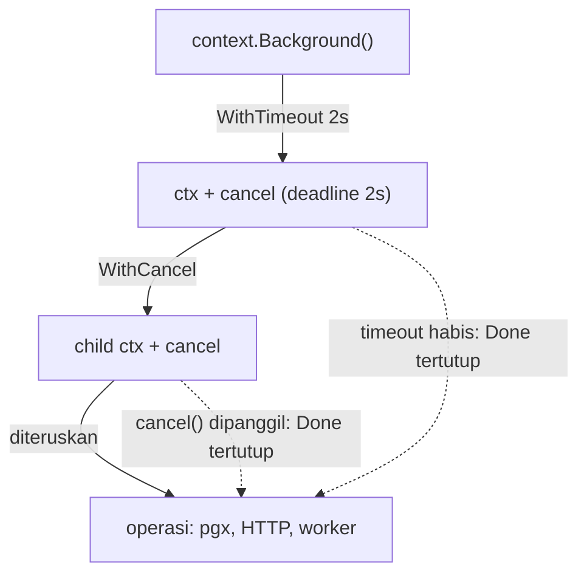
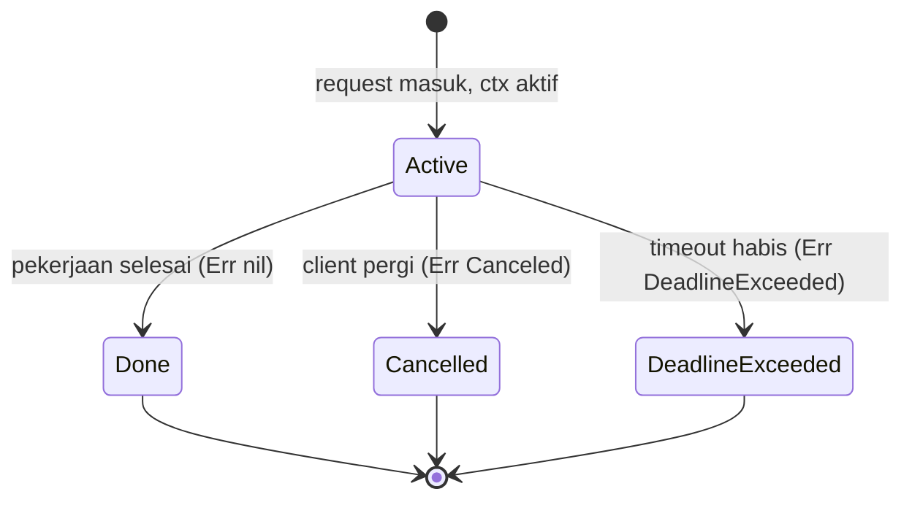
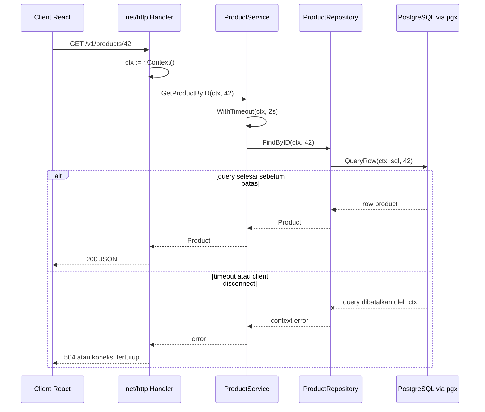
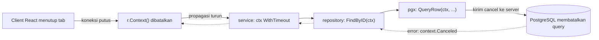

import { Section, Box, Steps, Step, Recap, CardGrid, Card, Chip, Hero, Compare, FileTree, Endpoint, Def } from "@components";

<Hero eyebrow="Roadmap 1 &middot; Fondasi Go" title="Context dan <em>Lifecycle Request</em><br />Timeout dan Cancellation">
  <p>Context adalah jalur sinyal satu request di Go, mengalir dari HTTP handler sampai query PostgreSQL agar pekerjaan yang tidak lagi dibutuhkan bisa berhenti tepat waktu.</p>
  <Fragment slot="meta">
    <Chip icon="code">Bahasa: <b>Go 1.26</b></Chip>
    <Chip icon="clock">~65 menit baca</Chip>
    <Chip icon="rocket">Proyek: <b>Online Shop Skincare</b></Chip>
  </Fragment>
</Hero>

<Section num="01" id="intro" title="Kenapa Context Wajib Ada" sub="Sebelum net/http, chi, dan pgx, kamu perlu cara menghentikan kerja yang sudah sia-sia.">

<p class="lead">Di backend, request yang sudah ditinggalkan client tetap memakan resource kalau tidak ada yang menyuruhnya berhenti. Context adalah jawaban Go untuk itu.</p>

Di React kamu mungkin pernah memakai `AbortController` untuk membatalkan `fetch` ketika komponen unmount, user pindah halaman, atau request terlalu lama. Di Node kamu meneruskan `signal` ke `fetch`, ke driver database, atau ke timer. Di Go, ide besarnya sama, tetapi bentuknya lebih sistematis dan lebih wajib: sinyal pembatalan dibawa lewat `context.Context` dan diteruskan ke setiap layer yang mengerjakan request.

<Box variant="bridge" icon="🌉" label="Jembatan: dari AbortController ke context.Context"><p>Bayangkan satu `AbortSignal` yang tidak berhenti di `fetch`, tetapi ikut lewat handler, service, repository, sampai driver PostgreSQL, dan ikut membatalkan query yang sedang berjalan saat client menutup tab.</p></Box>

Tanpa context, backend bisa tetap mengerjakan query mahal meski client sudah pergi. Untuk online shop skincare yang kita bangun sejak modul struct, ini berarti endpoint katalog membuang koneksi database untuk user yang sudah menutup aplikasi, worker terus menghitung rekomendasi yang tidak akan dibaca, dan satu pool koneksi yang terbatas terisi oleh pekerjaan zombie. Saat trafik naik di waktu flash sale, request liar inilah yang lebih dulu menumbangkan server.

<Endpoint method="GET" path="/v1/products/{id}" desc="Detail produk skincare, dengan context mengalir dari request HTTP sampai QueryRow pgx" />

Di modul sebelumnya kita sudah punya `Product`, `Order`, dan service yang mengembalikan `(Data, error)`. Yang kurang adalah satu hal: cara memberi tahu seluruh rantai pemanggilan bahwa request ini punya batas waktu dan bisa dibatalkan. Itulah yang kita pasang di modul ini.

</Section>

<Section num="02" id="mental-model" title="Mental Model context.Context" sub="Bukan kantong dependency, melainkan pembawa deadline, sinyal cancel, dan value request-scoped kecil.">

<p class="lead">`context.Context` adalah objek immutable yang dibawa melalui call chain. Ketika parent context dibatalkan, semua context turunannya ikut dibatalkan.</p>

Dokumentasi resmi mendeskripsikan package `context` sebagai pembawa deadline, sinyal cancellation, dan nilai request-scoped lintas boundary API dan antar goroutine. Acuan lengkapnya ada di [pkg.go.dev/context](https://pkg.go.dev/context) dan [go.dev/blog/context](https://go.dev/blog/context).

<Def term="context.Context"><p>Interface standar Go untuk membawa deadline, sinyal pembatalan, dan value kecil yang hidup selama satu request, diteruskan sebagai parameter pertama antar fungsi.</p></Def>

<Def term="cancellation"><p>Sinyal bahwa pekerjaan harus berhenti karena client pergi, deadline habis, atau caller memutuskan operasi tidak lagi diperlukan.</p></Def>

<Def term="deadline"><p>Batas waktu absolut kapan context otomatis dibatalkan, biasanya dibuat lewat `context.WithTimeout` (durasi) atau `context.WithDeadline` (waktu pasti).</p></Def>

Bentuk interface-nya kecil, tetapi efek desainnya besar. Empat method ini adalah seluruh kontrak yang dijanjikan `context.Context`.

```go title="Definisi resmi context.Context (paket context)"
type Context interface {
	Deadline() (deadline time.Time, ok bool)
	Done() <-chan struct{}
	Err() error
	Value(key any) any
}
```

Empat method itu memberi empat kemampuan: tahu batas waktu (`Deadline`), mendengar sinyal selesai (`Done`), membaca alasan berhenti (`Err`), dan membaca value request-scoped (`Value`). `Done()` mengembalikan channel yang ditutup saat context dibatalkan, dan `Err()` baru bernilai non-nil setelah `Done()` tertutup, dengan nilai `context.Canceled` atau `context.DeadlineExceeded`.

<Compare aLabel="JS: AbortController" bLabel="Go: context.Context" aTone="muted" bTone="violet">
  <Fragment slot="a"><ul><li>`AbortController` membatalkan satu operasi async seperti `fetch`.</li><li>Signal diteruskan manual ke API yang menerima opsi `signal`.</li><li>Membaca alasan lewat `signal.reason` setelah `abort`.</li></ul></Fragment>
  <Fragment slot="b"><ul><li>`context.Context` diteruskan sebagai parameter pertama ke fungsi yang bekerja untuk request.</li><li>Context mengalir lintas layer: handler, service, repository, pgx, dan goroutine pendukung.</li><li>Membaca alasan lewat `ctx.Err()` atau `context.Cause(ctx)`.</li></ul></Fragment>
</Compare>



<p class="fig-cap"><b>Gambar 1.</b> Context membentuk pohon turunan. Setiap context derived punya parent, dan saat parent berhenti, sinyal Done propagasi turun ke seluruh anak tanpa perlu kode tambahan.</p>

<Box variant="warn" icon="⚠️" label="Jangan jadikan context sebagai kantong dependency"><p>Jangan taruh database pool, logger utama, config, atau service di `context.Value`. Dependency tetap masuk lewat struct dan constructor, seperti `NewService(repo)` yang kamu buat di modul sebelumnya. Context hanya untuk deadline, cancel, dan value request-scoped kecil.</p></Box>

</Section>

<Section num="03" id="background-todo" title="Akar Context: Background dan TODO" sub="Setiap pohon context bermula dari satu akar yang tidak punya parent.">

<p class="lead">Dua context akar yang paling sering kamu lihat adalah `context.Background()` dan `context.TODO()`. Keduanya tidak pernah dibatalkan, tidak punya deadline, dan tidak membawa value.</p>

`context.Background()` adalah akar resmi proses. Pakai di `main`, di test, di inisialisasi worker, atau di titik awal proses yang belum punya request parent. Dari akar inilah kamu menurunkan context lain lewat `WithTimeout`, `WithCancel`, dan teman-temannya.

`context.TODO()` berperilaku identik, tetapi maknanya berbeda untuk pembaca kode. Ia adalah penanda jujur bahwa kamu belum tahu context yang tepat, biasanya saat sedang refactor fungsi lama agar menerima `ctx`. Anggap ini hutang kecil yang menandai tempat yang masih harus dibereskan.

<CardGrid cols={2}>
  <Card><h4>context.Background()</h4><p>Pakai saat kamu memang sedang membangun akar proses: bootstrapping aplikasi, migrasi lokal, atau unit test sederhana.</p></Card>
  <Card><h4>context.TODO()</h4><p>Pakai sebagai penanda sementara saat desain belum selesai. Linter seperti vet dan reviewer langsung tahu bahwa ini titik yang masih perlu context asli.</p></Card>
</CardGrid>

```go title="cmd/api/main.go"
package main

import (
	"context"
	"fmt"
)

func main() {
	ctx := context.Background()

	// Akar tidak pernah dibatalkan, jadi Err() masih nil dan Deadline() kosong.
	deadline, ok := ctx.Deadline()
	fmt.Println(ctx.Err(), deadline, ok) // <nil> 0001-01-01 ... false
}
```

<Box variant="tip" icon="💡" label="Aturan praktis paling penting"><p>Di jalur request HTTP, jangan mulai dari `context.Background()`. Pakai `r.Context()` agar pembatalan dari client ikut terbawa. `Background()` hanya untuk titik awal proses yang benar-benar tidak punya request parent.</p></Box>

</Section>

<Section num="04" id="derived-context" title="Derived Context: WithTimeout dan WithCancel" sub="Membuat context turunan yang bisa selesai lebih cepat dari parent-nya.">

<p class="lead">`context.WithTimeout` dan `context.WithCancel` membuat child context yang membawa tombol stop sendiri, sambil tetap mewarisi pembatalan dari parent.</p>

`context.WithTimeout(parent, durasi)` memberi batas waktu operasi. Ini penting untuk query database, panggilan API eksternal, dan proses bisnis yang tidak boleh menggantung. Fungsi ini mengembalikan `ctx` baru dan sebuah `cancel`; panggil `cancel` dengan `defer` agar timer dan resource internal dilepas walaupun operasi selesai sebelum timeout.

```go title="internal/product/service.go"
package product

import (
	"context"
	"time"
)

type Service struct {
	repo Repository
}

func NewService(repo Repository) *Service {
	return &Service{repo: repo}
}

func (s *Service) GetProductByID(ctx context.Context, id int64) (Product, error) {
	// Batasi operasi ini maksimal 2 detik, apa pun deadline parent.
	ctx, cancel := context.WithTimeout(ctx, 2*time.Second)
	defer cancel()

	return s.repo.FindByID(ctx, id)
}
```

Perhatikan pola `ctx, cancel := context.WithTimeout(ctx, ...)`. Variabel `ctx` di sebelah kiri menimpa `ctx` parameter di dalam scope fungsi ini, jadi semua kode setelah baris itu otomatis memakai context yang lebih ketat. Ini idiom yang akan kamu lihat ribuan kali di kode Go.

`context.WithCancel(parent)` dipakai saat caller ingin tombol stop manual, tanpa deadline waktu. Contohnya, satu request memulai beberapa pekerjaan paralel dan begitu satu hasil sudah cukup, sisanya bisa dibatalkan agar tidak membuang resource.

```go title="internal/recommendation/usecase.go"
package recommendation

import "context"

func PickFastest(ctx context.Context, productID int64) (Result, error) {
	// Buat child yang bisa kita batalkan begitu satu hasil sudah cukup.
	ctx, cancel := context.WithCancel(ctx)
	defer cancel() // jaring pengaman: pasti dipanggil saat fungsi keluar.

	result, err := loadFromCache(ctx, productID)
	if err == nil {
		cancel() // hentikan kandidat lain lebih awal.
		return result, nil
	}

	return loadFromDB(ctx, productID)
}
```

<CardGrid cols={3}>
  <Card><h4>WithCancel</h4><p>Tombol stop manual tanpa batas waktu. Cocok saat caller sendiri yang memutuskan kapan berhenti.</p></Card>
  <Card><h4>WithTimeout</h4><p>Batas waktu relatif: berhenti setelah durasi tertentu sejak sekarang. Paling sering dipakai untuk query dan call eksternal.</p></Card>
  <Card><h4>WithDeadline</h4><p>Batas waktu absolut pada waktu tertentu. Berguna saat seluruh request punya satu tenggat bersama.</p></Card>
</CardGrid>

<Box variant="note" icon="🧭" label="Kenapa defer cancel() tetap dipanggil walau operasi sukses"><p>Bahkan saat operasi selesai sebelum timeout, `cancel` memberi tahu runtime bahwa timer dan hubungan parent-child context boleh dibersihkan sekarang juga. Tanpa `cancel`, context dan timer-nya menggantung sampai parent berhenti, dan `go vet` akan menandainya sebagai potensi kebocoran resource.</p></Box>

<Box variant="warn" icon="⚠️" label="Lupa cancel adalah kebocoran, bukan bug yang terlihat"><p>Melewatkan `defer cancel()` tidak membuat program crash. Ia diam-diam menahan goroutine timer internal sampai parent context selesai. Pada server yang berjalan lama, kebocoran kecil ini menumpuk. Selalu pasang `defer cancel()` tepat setelah membuat derived context.</p></Box>

</Section>

<Section num="05" id="select-done" title="Mendengar Sinyal lewat select dan ctx.Done()" sub="Cara satu operasi yang lama tahu bahwa ia harus berhenti.">

<p class="lead">Context tidak menghentikan kode kamu secara paksa. Kode kamu yang harus mendengar sinyalnya dan memutuskan untuk berhenti, biasanya lewat `select` pada `ctx.Done()`.</p>

`ctx.Done()` mengembalikan channel yang ditutup saat context dibatalkan. Untuk operasi yang berpotensi lama, kamu memakai `select` agar bisa memilih antara hasil pekerjaan dan sinyal berhenti, mana yang lebih dulu datang. Pola ini akan kamu pakai berkali-kali saat masuk modul concurrency berikutnya.

```go title="internal/recommendation/loader.go"
package recommendation

import (
	"context"
	"time"
)

type Result struct {
	ProductID int64
	Score     float64
}

// LoadSlowRecommendation menyimulasikan kerja lama (mis. query atau call eksternal).
func LoadSlowRecommendation(ctx context.Context, productID int64) (Result, error) {
	select {
	case <-time.After(800 * time.Millisecond):
		return Result{ProductID: productID, Score: 0.92}, nil
	case <-ctx.Done():
		// Context berhenti lebih dulu: kembalikan alasannya, jangan hasil.
		return Result{}, ctx.Err()
	}
}
```

Aturan emasnya: setiap loop panjang atau operasi blocking yang kamu tulis sendiri harus punya satu cabang `case <-ctx.Done():`. Tanpa itu, context yang dibatalkan tidak punya efek apa pun pada fungsimu, dan timeout yang kamu pasang di service hanya jadi hiasan.



<p class="fig-cap"><b>Gambar 2.</b> Tiga akhir hidup satu request. Dari Active, request bisa selesai normal, dibatalkan karena client pergi, atau melewati deadline. Dua jalur terakhir mengisi `ctx.Err()` dengan sentinel yang berbeda.</p>

<Box variant="analogy" icon="🧵" label="Analogi benang request"><p>Context seperti benang yang mengikat semua pekerjaan pada satu request. Saat benangnya putus, channel `Done()` tertutup dan setiap orang yang memegang ujung benang itu tahu harus berhenti. Tapi mereka tetap harus melihat ke benangnya. Itulah peran `select` pada `ctx.Done()`.</p></Box>

</Section>

<Section num="06" id="propagasi-layer" title="Propagasi dari Handler ke Repository" sub="Context mengalir lurus dari boundary terluar ke layer terdalam, tidak dibuat ulang di tengah.">

<p class="lead">Aturan idiomatik Go: context selalu menjadi parameter pertama, namanya `ctx`, dan setiap fungsi yang melakukan I/O atau kerja yang bisa lama harus menerimanya.</p>

Konvensi ini membuat call graph mudah dibaca: operasi ini bekerja untuk request mana, punya timeout berapa, dan bisa dibatalkan oleh siapa. Pada proyek skincare, context mengalir dari handler ke service ke repository ke pgx, melanjutkan struktur per-package yang sudah kita bangun.

<FileTree title="Alur context di proyek skincare" tree={`
cmd/
  api/
    main.go                  # wiring net/http server, ctx akar
internal/
  product/
    handler.go               # ambil ctx dari r.Context()
    service.go               # tambah WithTimeout untuk operasi bisnis
    repository.go            # teruskan ctx ke pgx QueryRow
    model.go                 # Product dan ErrNotFound domain
go.mod                       # module github.com/kamu/skincare-backend
`} />



<p class="fig-cap"><b>Gambar 3.</b> Context tidak melakukan query sendiri, tetapi membawa sinyal agar setiap layer tahu kapan harus berhenti. Saat client disconnect, pembatalan menjalar turun sampai pgx menghentikan query yang sedang berjalan.</p>

<Box variant="bridge" icon="🌉" label="Jembatan: mirip Request Laravel, tapi jauh lebih ketat"><p>Di Laravel kamu punya objek Request yang dibawa ke controller dan bisa diakses lewat helper di mana saja. Di Go, context sengaja dibuat kecil dan eksplisit: ia diteruskan sebagai argumen, bukan diambil dari global, dan ia bukan kontainer seluruh state aplikasi. Yang dibawanya cuma deadline, cancel, dan value request-scoped kecil.</p></Box>

</Section>

<Section num="07" id="request-lifecycle" title="Lifecycle Request HTTP" sub="Setiap request server net/http punya context sendiri lewat r.Context().">

<p class="lead">`net/http` sudah menyiapkan context per request. Tugas handler hanya mengambilnya dan meneruskannya, bukan membuat yang baru.</p>

Dokumentasi `net/http` menyebut context request server akan dibatalkan ketika koneksi client tertutup, request dibatalkan pada HTTP/2, atau setelah method `ServeHTTP` selesai. Detailnya ada di [Request.Context](https://pkg.go.dev/net/http#Request.Context). Artinya handler tidak perlu membuat mekanisme cancel sendiri untuk kasus client disconnect; cukup teruskan context yang sudah ada.

```go title="internal/product/handler.go"
package product

import (
	"context"
	"encoding/json"
	"errors"
	"net/http"
	"strconv"
)

type Handler struct {
	service *Service
}

func NewHandler(service *Service) *Handler {
	return &Handler{service: service}
}

func (h *Handler) GetProductByID(w http.ResponseWriter, r *http.Request) {
	ctx := r.Context() // context milik request ini, ikut batal saat client pergi.

	id, err := strconv.ParseInt(r.PathValue("id"), 10, 64)
	if err != nil {
		http.Error(w, "invalid product id", http.StatusBadRequest)
		return
	}

	product, err := h.service.GetProductByID(ctx, id)
	if err != nil {
		switch {
		case errors.Is(err, ErrNotFound):
			http.Error(w, "product not found", http.StatusNotFound)
		case errors.Is(err, context.DeadlineExceeded):
			http.Error(w, "request timeout", http.StatusGatewayTimeout)
		case errors.Is(err, context.Canceled):
			// Client sudah pergi; respons tidak akan terbaca, cukup berhenti diam.
			return
		default:
			http.Error(w, "internal server error", http.StatusInternalServerError)
		}
		return
	}

	w.Header().Set("Content-Type", "application/json")
	_ = json.NewEncoder(w).Encode(product)
}
```

Perhatikan dua sentinel error yang dibedakan. `context.DeadlineExceeded` berarti timeout server, jadi 504 Gateway Timeout masuk akal. `context.Canceled` umumnya berarti client memutus koneksi, sehingga menulis respons pun percuma; kita cukup berhenti. Pengecekan ini memakai `errors.Is`, pola yang sudah kamu pelajari di modul error.

Kode ini sengaja belum memakai chi agar fokus tetap di package standar. Saat masuk Roadmap 2, bentuknya identik: ambil `ctx := r.Context()`, lalu teruskan ke service. Yang berubah hanya cara membaca parameter URL.

<Box variant="warn" icon="⚠️" label="Jangan membuat context baru di handler"><p>`context.Background()` di dalam handler memutus hubungan dengan request asli, sehingga query bisa tetap berjalan saat client sudah disconnect. Selalu mulai dari `r.Context()`, lalu turunkan dengan `WithTimeout` bila perlu batas waktu yang lebih ketat.</p></Box>

</Section>

<Section num="08" id="pgx-query" title="Context di Query pgx" sub="Di sinilah propagasi context benar-benar membayar dirinya sendiri.">

<p class="lead">pgx menerima context pada setiap operasi database: `QueryRow`, `Query`, `Exec`, dan operasi pool. Inilah titik akhir tempat pembatalan request berubah menjadi pembatalan query nyata di PostgreSQL.</p>

pgx adalah driver dan toolkit PostgreSQL untuk Go, sedangkan `pgxpool` menyediakan pool koneksi yang aman dipakai concurrent. Referensinya ada di [github.com/jackc/pgx/v5](https://pkg.go.dev/github.com/jackc/pgx/v5) dan [pgxpool](https://pkg.go.dev/github.com/jackc/pgx/v5/pgxpool). Kita akan memperdalam pgx di Roadmap 2; di sini cukup melihat bagaimana context masuk ke query.

```go title="internal/product/model.go"
package product

import "errors"

var ErrNotFound = errors.New("product not found")

type Product struct {
	ID          int64  `json:"id"`
	SKU         string `json:"sku"`
	Name        string `json:"name"`
	Category    string `json:"category"`
	PriceRupiah int64  `json:"price_rupiah"`
	Quantity    int    `json:"quantity"`
	Status      string `json:"status"`
}
```

```go title="internal/product/repository.go"
package product

import (
	"context"
	"errors"

	"github.com/jackc/pgx/v5"
	"github.com/jackc/pgx/v5/pgxpool"
)

type Repository interface {
	FindByID(ctx context.Context, id int64) (Product, error)
}

type PostgresRepository struct {
	pool *pgxpool.Pool
}

func NewPostgresRepository(pool *pgxpool.Pool) *PostgresRepository {
	return &PostgresRepository{pool: pool}
}

func (r *PostgresRepository) FindByID(ctx context.Context, id int64) (Product, error) {
	const query = `
		select id, sku, name, category, price_rupiah, quantity, status
		from products
		where id = $1 and status = 'active'
	`

	var p Product
	err := r.pool.QueryRow(ctx, query, id).Scan(
		&p.ID,
		&p.SKU,
		&p.Name,
		&p.Category,
		&p.PriceRupiah,
		&p.Quantity,
		&p.Status,
	)
	if err != nil {
		if errors.Is(err, pgx.ErrNoRows) {
			return Product{}, ErrNotFound
		}
		return Product{}, err // bisa termasuk context.DeadlineExceeded / Canceled.
	}

	return p, nil
}
```

Dua detail penting di repository ini. Pertama, repository tidak membuat context baru; ia menerima `ctx` dari service dan menyerahkannya apa adanya ke pgx. Kedua, `QueryRow` menunda error sampai `Scan`, jadi pemeriksaan `pgx.ErrNoRows` dilakukan setelah `Scan`. Kalau context dibatalkan saat query berjalan, pgx mengembalikan error yang membungkus `context.DeadlineExceeded` atau `context.Canceled`, dan PostgreSQL membatalkan statement yang sedang dieksekusi.



<p class="fig-cap"><b>Gambar 4.</b> Inilah titik context membayar dirinya. Saat client putus, satu sinyal pembatalan menjalar dari `r.Context()` sampai ke PostgreSQL, lalu error kembali naik tanpa membuang waktu pada query yang sudah tidak dibutuhkan.</p>

<Box variant="tip" icon="💡" label="Timeout sebaiknya di layer mana?"><p>Untuk operasi bisnis spesifik seperti detail produk, timeout pas diletakkan di service lewat `WithTimeout`. Untuk batas global semua request, nanti kita pakai konfigurasi server (`ReadTimeout`, `WriteTimeout`) dan middleware. Keduanya saling melengkapi: yang spesifik melindungi satu operasi, yang global melindungi seluruh server.</p></Box>

</Section>

<Section num="09" id="withvalue-cause" title="WithValue dan Cancellation Cause" sub="Dua fitur lanjutan: membawa value request-scoped dan tahu alasan sebenarnya context berhenti.">

<p class="lead">`context.WithValue` membawa data request-scoped kecil, dan `context.WithCancelCause` plus `context.Cause` memberi alasan pembatalan yang lebih jelas daripada sekadar canceled.</p>

`context.WithValue(parent, key, val)` menempelkan satu pasang key-value ke context. Pakai ini hanya untuk data yang memang milik satu request dan melewati banyak boundary, seperti request ID untuk korelasi log atau identitas user yang sudah terautentikasi. Jangan pakai untuk parameter fungsi opsional; parameter biasa lebih jelas dan dicek compiler.

Idiom amannya: bungkus key dalam tipe privat agar tidak bentrok dengan key dari package lain, lalu sediakan helper untuk menaruh dan membaca.

```go title="internal/httpapi/reqctx/reqctx.go"
package reqctx

import "context"

// ctxKey adalah tipe privat agar key tidak bentrok antar package.
type ctxKey int

const requestIDKey ctxKey = iota

func WithRequestID(ctx context.Context, id string) context.Context {
	return context.WithValue(ctx, requestIDKey, id)
}

func RequestID(ctx context.Context) (string, bool) {
	id, ok := ctx.Value(requestIDKey).(string)
	return id, ok
}
```

<Box variant="warn" icon="⚠️" label="WithValue bukan dependency injection"><p>Godaan terbesar pendatang Laravel adalah menaruh service container ke dalam context, lalu mengambilnya di mana saja seperti `app()` helper. Jangan. Itu menyembunyikan dependency dari signature fungsi, membuat kode sulit diuji, dan tidak dicek compiler. Pakai `WithValue` hanya untuk request ID, trace ID, atau auth subject.</p></Box>

Fitur kedua adalah cancellation cause. Sejak Go 1.20, `context.WithCancelCause` mengembalikan `cancel` yang menerima error, dan `context.Cause(ctx)` membaca error itu. Ini menjawab pertanyaan yang sering muncul saat debugging: context-nya canceled, tapi kenapa?

```go title="internal/checkout/reserve.go"
package checkout

import (
	"context"
	"errors"
)

var ErrStockGone = errors.New("stock habis selama checkout")

func ReserveWithReason(parent context.Context) error {
	ctx, cancel := context.WithCancelCause(parent)
	defer cancel(nil) // nil = tidak ada cause khusus saat normal.

	if stockHabis() {
		cancel(ErrStockGone) // catat alasan spesifik pembatalan.
		// ctx.Err() tetap context.Canceled, tetapi:
		return context.Cause(ctx) // mengembalikan ErrStockGone.
	}

	return nil
}

func stockHabis() bool { return true }
```

Perhatikan perbedaan halus: `ctx.Err()` tetap mengembalikan `context.Canceled` yang generik, sedangkan `context.Cause(ctx)` mengembalikan error spesifik yang kamu berikan ke `cancel`. Saat deadline yang lewat, `Cause` mengembalikan `context.DeadlineExceeded` secara default, atau cause khusus bila kamu memakai `WithTimeoutCause` (Go 1.21).

<CardGrid cols={2}>
  <Card><h4>WithCancelCause + Cause (Go 1.20)</h4><p>Membatalkan sambil mencatat alasan spesifik. Sangat membantu menelusuri kenapa satu operasi berhenti di log.</p></Card>
  <Card><h4>WithoutCancel (Go 1.21)</h4><p>Membuat context yang melepas pembatalan parent. Pakai untuk kerja background pendek yang harus tetap selesai meski request induk sudah berakhir, misalnya menulis audit log.</p></Card>
</CardGrid>

<Box variant="note" icon="🧭" label="Sekilas WithoutCancel dan AfterFunc (Go 1.21)"><p>`context.WithoutCancel(parent)` menyalin value dari parent tetapi tidak ikut dibatalkan, berguna saat kamu melepas tugas singkat yang harus selesai meski request sudah pulang. `context.AfterFunc(ctx, f)` menjadwalkan `f` berjalan saat context dibatalkan, cara rapi memasang cleanup tanpa menulis goroutine select sendiri. Keduanya alat lanjutan; pakai hanya saat kebutuhannya nyata.</p></Box>

</Section>

<Section num="10" id="hands-on" title="Hands-on: Rasakan Timeout Bekerja" sub="Alur kecil yang bisa kamu jalankan sebelum proyek menyentuh database sungguhan.">

<p class="lead">Latihan ini menyimulasikan query lambat dengan `time.After`, lalu membatalkannya lewat timeout, agar kamu merasakan sendiri kapan `context.DeadlineExceeded` muncul.</p>

<Steps>
  <Step><b>Buat module kecil</b><p>Siapkan folder terpisah agar eksperimen context tidak tercampur dengan kode modul lain.</p></Step>
  <Step><b>Tambahkan service lambat</b><p>Simulasikan query dengan `select` antara `time.After` dan `ctx.Done()`.</p></Step>
  <Step><b>Amati error</b><p>Bandingkan hasil saat timeout lebih pendek dan lebih panjang dari pekerjaan palsu.</p></Step>
</Steps>

```bash title="Terminal"
mkdir context-playground
cd context-playground
go mod init github.com/kamu/context-playground
mkdir -p internal/product
```

```go title="internal/product/service.go"
package product

import (
	"context"
	"time"
)

type Product struct {
	ID   int64
	Name string
}

type Service struct{}

// GetProductByID menyimulasikan query yang butuh 700ms.
func (s Service) GetProductByID(ctx context.Context, id int64) (Product, error) {
	select {
	case <-time.After(700 * time.Millisecond):
		return Product{ID: id, Name: "Hydrating Toner"}, nil
	case <-ctx.Done():
		return Product{}, ctx.Err()
	}
}
```

```go title="main.go"
package main

import (
	"context"
	"errors"
	"fmt"
	"time"

	"github.com/kamu/context-playground/internal/product"
)

func main() {
	// Timeout 300ms lebih pendek dari pekerjaan 700ms, jadi deadline lewat dulu.
	ctx, cancel := context.WithTimeout(context.Background(), 300*time.Millisecond)
	defer cancel()

	svc := product.Service{}
	item, err := svc.GetProductByID(ctx, 42)
	if err != nil {
		if errors.Is(err, context.DeadlineExceeded) {
			fmt.Println("query terlalu lama, dibatalkan oleh deadline")
			return
		}
		fmt.Println("error:", err)
		return
	}

	fmt.Println("produk:", item.Name)
}
```

```bash title="Terminal"
go run .
```

Jalankan dan kamu akan melihat pesan deadline. Sekarang ubah timeout menjadi `1*time.Second`. Kali ini fungsi punya cukup waktu untuk mengembalikan produk, dan output berubah jadi nama produk. Pola yang sama persis akan dipakai saat operasi palsu ini diganti dengan `pool.QueryRow(ctx, ...)` di repository asli.

<Box variant="tip" icon="✅" label="Eksperimen tambahan"><p>Coba hapus cabang `case <-ctx.Done():` dari service. Jalankan dengan timeout 300ms. Fungsi tetap menunggu penuh 700ms walau context sudah lewat deadline, membuktikan bahwa context hanya bekerja kalau kodemu mendengarkannya.</p></Box>

</Section>

<Section num="11" id="jebakan" title="Jebakan Umum dari JS dan PHP" sub="Pendatang React dan Laravel paham ide request lifecycle, tetapi sering salah menempatkan context di Go.">

<p class="lead">Sebagian besar bug context lahir dari kebiasaan lama: memperlakukan context seperti global request Laravel atau seperti satu sinyal sekali pakai di JS.</p>

<CardGrid cols={2}>
  <Card><h4>Membuat Background di tengah request</h4><p>Ini memutus cancellation dari client. Di handler, selalu ambil context dari `r.Context()`, jangan `context.Background()`.</p></Card>
  <Card><h4>Lupa defer cancel()</h4><p>Timeout yang selesai normal pun perlu cancel agar timer dan child context dilepas. Lupa ini adalah kebocoran diam-diam, bukan crash.</p></Card>
  <Card><h4>Menyimpan context di struct</h4><p>Context bukan field service atau repository. Kirim sebagai parameter pertama tiap operasi agar tiap call punya context yang tepat.</p></Card>
  <Card><h4>WithValue untuk semua hal</h4><p>Pakai hanya untuk data request-scoped kecil seperti request ID. Dependency dan parameter opsional tetap lewat constructor dan argumen.</p></Card>
  <Card><h4>Tidak mendengar ctx.Done()</h4><p>Operasi blocking tanpa `select` pada `ctx.Done()` mengabaikan pembatalan. Timeout jadi sekadar hiasan yang tidak menghentikan apa pun.</p></Card>
  <Card><h4>Timeout terlalu agresif</h4><p>Timeout harus realistis terhadap query, indeks, dan SLA endpoint, bukan angka acak yang membuat API rapuh saat database sedikit lambat.</p></Card>
</CardGrid>

Anti-pattern paling klasik adalah menyimpan context di struct, sering ditiru dari kebiasaan menyimpan request sebagai property di controller PHP.

```go title="Anti-pattern: context disimpan di struct"
type ProductService struct {
	ctx  context.Context // JANGAN: context jadi basi dan dipakai lintas request.
	repo Repository
}
```

```go title="Yang benar: context sebagai parameter pertama"
type ProductService struct {
	repo Repository
}

func (s *ProductService) GetProductByID(ctx context.Context, id int64) (Product, error) {
	return s.repo.FindByID(ctx, id)
}
```

<Box variant="bridge" icon="🌉" label="Jembatan: kenapa global request Laravel tidak diterjemahkan langsung"><p>Di Laravel, `request()` selalu menunjuk request yang sedang berjalan karena framework mengelola siklusnya. Di Go, satu server menangani banyak request secara concurrent dengan goroutine, jadi tidak ada satu request global yang benar. Context yang disimpan di struct akan tercampur antar request. Itulah kenapa context wajib dilewatkan eksplisit, bukan diambil dari tempat global.</p></Box>

</Section>

<Section num="12" id="ringkasan" title="Ringkasan & Poin Penting" sub="Context adalah fondasi kecil yang muncul di hampir setiap operasi backend Go.">

<p class="lead">Context mengikat satu request menjadi satu unit yang bisa diberi deadline dan dibatalkan, dari handler sampai ke query database.</p>

<Recap title="Yang Wajib Menempel"><ul><li>`context.Context` membawa deadline, sinyal cancellation, dan value request-scoped kecil lewat empat method: `Deadline`, `Done`, `Err`, `Value`.</li><li>Akar context adalah `context.Background()` (proses) dan `context.TODO()` (penanda sementara), keduanya tidak pernah dibatalkan sendiri.</li><li>Di HTTP handler, mulai dari `r.Context()`, bukan `context.Background()`, agar pembatalan client ikut terbawa.</li><li>Context selalu menjadi parameter pertama dengan nama `ctx`, dan tidak pernah disimpan di struct.</li><li>`WithTimeout`, `WithDeadline`, dan `WithCancel` membuat derived context; selalu pasang `defer cancel()`.</li><li>Operasi lama harus mendengar `ctx.Done()` lewat `select`, atau pembatalan tidak berefek.</li><li>Propagasi mengalir handler &rarr; service &rarr; repository &rarr; pgx, dan di `QueryRow(ctx, ...)` inilah pembatalan membayar dirinya.</li><li>Sentinel `context.Canceled` dan `context.DeadlineExceeded` dibedakan dengan `errors.Is`; `WithCancelCause` plus `context.Cause` memberi alasan spesifik.</li><li>`WithValue` hanya untuk request ID dan sejenisnya, bukan dependency injection.</li></ul></Recap>

Untuk proyek online shop skincare, pola ini akan dipakai di endpoint katalog, checkout, payment callback, inventory reservation, worker email, dan integrasi provider eksternal. Setiap kali ada operasi yang bisa lama, context yang sama mengalir menembus seluruh layer.

<Box variant="bridge" icon="🌉" label="Langkah berikutnya: Concurrency"><p>Modul berikutnya masuk ke concurrency: goroutine, channel, dan `sync`. Di sanalah `select` pada `ctx.Done()`, `WithCancel`, dan propagasi context yang kamu pelajari di sini benar-benar bersinar, saat banyak goroutine mengerjakan satu request dan harus berhenti serempak ketika context dibatalkan. Inventory reservation yang menjaga agar checkout tidak oversell akan menjadi panggung utamanya.</p></Box>

<Box variant="tip" icon="✅" label="Checkpoint sebelum lanjut"><p>Pastikan kamu bisa menjelaskan beda `Background` dan `TODO`, kenapa `defer cancel()` selalu dipasang, kapan memakai `WithTimeout` versus `WithCancel`, kenapa operasi lama butuh `select` pada `ctx.Done()`, dan bisa menulis sendiri alur context dari `r.Context()` sampai `QueryRow(ctx, ...)`.</p></Box>

</Section>
