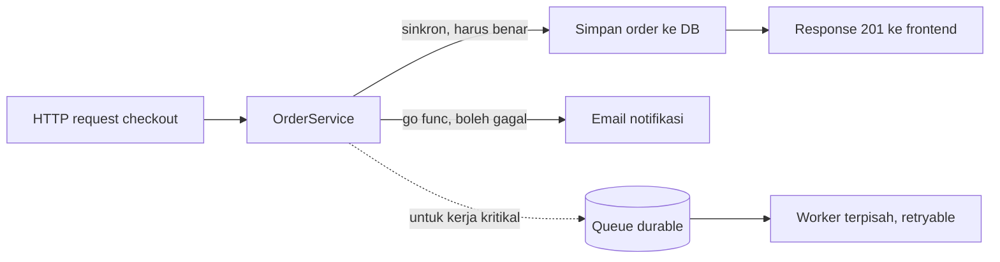
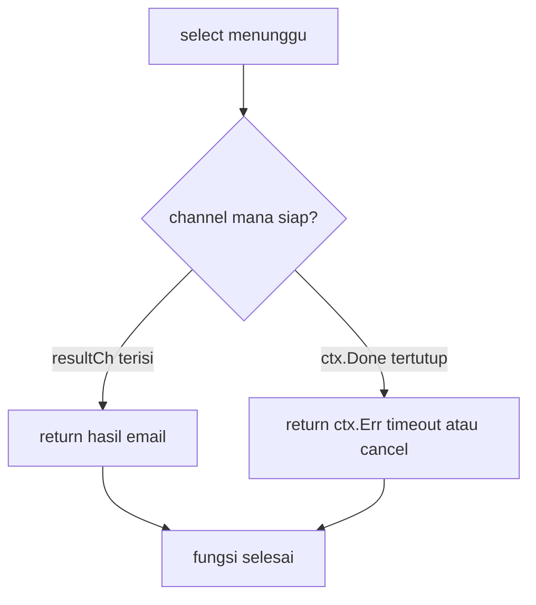
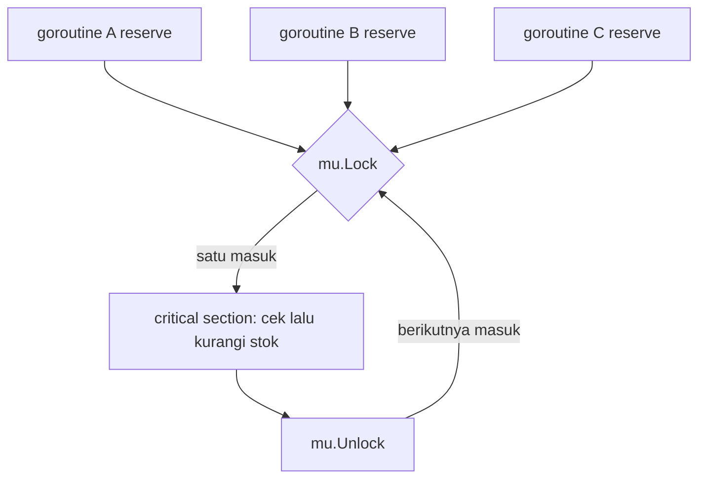
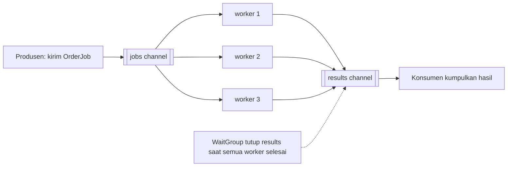
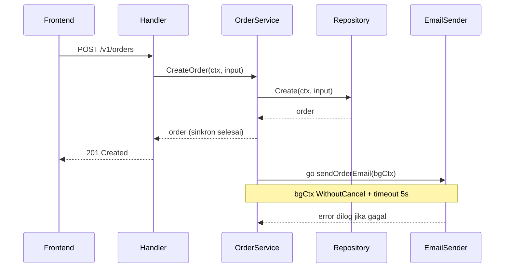

import { Section, Box, Steps, Step, Recap, CardGrid, Card, Chip, Hero, Compare, FileTree, Def } from "@components";

<Hero eyebrow="Roadmap 1 &middot; Go Programming Foundations" title="Concurrency <em>Dasar</em><br />untuk Backend Go" >
  <p>Goroutine dan channel membuat kerja paralel terasa ringan di Go, tetapi backend yang sehat tetap lahir dari desain sinkron yang jelas dan cancellation yang rapi.</p>
  <Fragment slot="meta">
    <Chip icon="code">Bahasa: <b>Go 1.26</b></Chip>
    <Chip icon="clock">~70 menit baca</Chip>
    <Chip icon="rocket">Proyek: <b>Online Shop Skincare</b></Chip>
  </Fragment>
</Hero>

<Section num="01" id="intro" title="Kenapa Concurrency Layak Dipahami" sub="Cukup untuk background job, worker kecil, dan membaca pola backend modern dengan percaya diri">

<p class="lead">Di modul context sebelumnya kamu sudah melihat `ctx.Done()` dan cancellation. Modul ini menjawab pertanyaan yang menyusul: siapa sebenarnya yang sedang dibatalkan, dan bagaimana banyak pekerjaan bisa berjalan bersamaan tanpa saling merusak.</p>

Concurrency muncul di backend setiap kali sebuah request perlu melakukan beberapa hal yang tidak harus saling menunggu. Setelah order skincare berhasil dibuat, API bisa langsung mengembalikan response ke frontend, lalu di belakang layar mengirim email konfirmasi, mencatat audit log, dan menyiapkan reservasi stok. Tanpa concurrency, pelanggan menunggu sampai email terkirim sebelum melihat halaman sukses. Dengan concurrency yang benar, pengalaman terasa instan dan kerja sampingan tetap berjalan.

Namun concurrency bukan tombol ajaib yang membuat semua hal lebih cepat. Dipakai tanpa batas, goroutine bisa bocor, channel bisa deadlock, dan data yang dibaca banyak goroutine bisa rusak karena race condition. Target Roadmap 1 bukan tuning performa tingkat lanjut, melainkan agar kamu paham membaca dan menulis pola dasar dengan aman: `go func()`, channel, `select`, `sync.WaitGroup`, `sync.Mutex`, dan `go test -race`.

<Def term="concurrency"><p>Kemampuan program menyusun banyak pekerjaan yang waktunya tumpang tindih. Pekerjaan belum tentu berjalan persis bersamaan, tetapi progress-nya bisa bergantian. Concurrency adalah soal struktur program.</p></Def>

<Def term="parallelism"><p>Eksekusi pekerjaan benar-benar bersamaan, biasanya di banyak core CPU. Parallelism adalah soal eksekusi fisik. Program concurrent yang baik bisa berjalan paralel saat core tersedia, tanpa kamu mengubah kodenya.</p></Def>

<Box variant="bridge" icon="🌉" label="Jembatan: dari event loop Node ke runtime Go"><p>Di Node.js, banyak I/O async dikelola satu event loop bersifat single-thread. Di Go, kamu menulis kode yang terbaca sinkron, lalu runtime menjadwalkan ribuan goroutine secara ringan di atas sejumlah kecil thread OS dan bisa benar-benar paralel. Tidak ada `async`/`await` yang mewarnai signature fungsi.</p></Box>

<CardGrid cols={3}>
  <Card><h4>Background ringan</h4><p>Email notifikasi setelah order sukses. Bukan bagian transaksi inti, jadi boleh dilepas ke goroutine dengan batas waktu.</p></Card>
  <Card><h4>Fan-out lalu join</h4><p>Beberapa goroutine memproses item, lalu hasilnya dikumpulkan dengan `WaitGroup` sebelum fungsi selesai.</p></Card>
  <Card><h4>Proteksi state</h4><p>Counter metrik atau cache in-memory yang diakses banyak goroutine wajib dilindungi `Mutex` atau dipindah lewat channel.</p></Card>
</CardGrid>

</Section>

<Section num="02" id="goroutine-vs-promise" title="Goroutine vs Promise dan Queue Worker" sub="Model mentalnya berbeda dari Promise JS dan dari queue Laravel">

<p class="lead">Kesalahan awal paling umum adalah menganggap goroutine sama dengan Promise. Keduanya bisa memulai kerja async, tetapi cara hasil dan error mengalir sangat berbeda.</p>

Di JavaScript, `Promise` adalah representasi hasil masa depan. Kamu bisa `await` nilainya, menggabungkannya dengan `Promise.all`, atau menangkap kegagalan dengan `try`/`catch`. Di Go, `go func()` hanya memulai sebuah fungsi di goroutine baru. Ia tidak mengembalikan handle bawaan, tidak punya `.then`, dan error di dalamnya tidak otomatis kembali ke pemanggil. Kalau goroutine perlu mengirim hasil atau error, kamu harus menyediakan jalurnya sendiri, biasanya lewat channel.

<Compare aLabel="JavaScript: Promise" bLabel="Go: goroutine" aTone="muted" bTone="violet">
  <Fragment slot="a"><ul><li>`async function` mengembalikan Promise yang bisa di-`await`.</li><li>`Promise.all` menggabungkan banyak hasil sekaligus.</li><li>Error dilempar dengan `throw` dan ditangkap `catch`.</li><li>Eksekusi tetap di satu event loop.</li></ul></Fragment>
  <Fragment slot="b"><ul><li>`go func()` memulai goroutine lalu pemanggil langsung lanjut.</li><li>Tidak ada nilai balik langsung ke pemanggil.</li><li>Error perlu dikirim lewat channel, disimpan, atau dilog eksplisit.</li><li>Banyak goroutine bisa benar-benar paralel di banyak core.</li></ul></Fragment>
</Compare>

Sisi PHP juga penting. Di Laravel request-response, hampir semua kode berjalan sinkron, dan pekerjaan berat dipindahkan ke queue lewat `dispatch(new SendOrderEmail(...))`. Job itu disimpan di Redis atau database, lalu diproses worker terpisah yang bisa retry dan tahan banting saat proses web restart. Go memang bisa memulai goroutine langsung di dalam proses API, tetapi goroutine itu hidup di memori proses yang sama dan ikut mati saat proses mati.

<Box variant="warn" icon="⚠️" label="Goroutine bukan pengganti queue durable"><p>Untuk pekerjaan penting yang tidak boleh hilang, seperti charge payment, kirim invoice resmi, atau update stok final, jangan andalkan goroutine fire-and-forget. Pakai alur yang bisa retry, idempotent, dan terlacak. Goroutine cocok untuk kerja sampingan ringan yang boleh gagal diam-diam dengan log.</p></Box>



<p class="fig-cap"><b>Gambar 1.</b> Tiga jalur yang sering tercampur. Kerja inti tetap sinkron, kerja sampingan ringan boleh dilepas ke goroutine, dan kerja kritikal sebaiknya lewat queue durable yang punya retry.</p>

</Section>

<Section num="03" id="goroutine" title="Goroutine: Unit Kerja Ringan" sub="Sintaksnya satu kata kunci, konsekuensinya menentukan desain">

<p class="lead">Goroutine dibuat dengan menaruh kata kunci `go` di depan pemanggilan fungsi. Setelah itu pemanggil langsung lanjut tanpa menunggu fungsi tersebut selesai.</p>

Contoh paling sederhana berikut sengaja memakai `time.Sleep` agar urutan output terlihat. Di backend nyata, isi goroutine biasanya I/O seperti HTTP call ke payment gateway, pengiriman email, atau membaca pesan dari queue.

```go title="cmd/playground/main.go"
package main

import (
	"fmt"
	"time"
)

func main() {
	go func() {
		time.Sleep(100 * time.Millisecond)
		fmt.Println("email notifikasi dikirim")
	}()

	fmt.Println("response API dikembalikan")
	time.Sleep(200 * time.Millisecond)
}
```

Output yang mungkin muncul memperlihatkan response keluar lebih dulu, lalu email menyusul.

```text title="Terminal"
response API dikembalikan
email notifikasi dikirim
```

Ada satu pelajaran tersembunyi. Kalau `main` selesai sebelum goroutine sempat berjalan, seluruh program ikut selesai dan email tidak pernah terkirim. Itulah sebabnya contoh memakai `time.Sleep`. Di kode sungguhan kamu hampir tidak pernah memakai sleep untuk sinkronisasi karena durasinya cuma tebakan. Gunakan `sync.WaitGroup`, channel, atau desain worker yang jelas.

<Box variant="tip" icon="💡" label="Aturan praktis goroutine"><p>Pakai goroutine untuk pekerjaan yang benar-benar bisa berjalan terpisah, punya batas waktu, dan punya tempat jelas untuk menangani error. Kalau salah satu tidak ada, kemungkinan besar kamu belum butuh goroutine.</p></Box>

<h3>Goroutine murah, tetapi tidak gratis</h3>

Goroutine dijadwalkan runtime Go, bukan langsung oleh OS. Stack awalnya kecil dan tumbuh sesuai kebutuhan, jadi membuat ribuan goroutine jauh lebih murah daripada membuat ribuan thread OS. Tetapi murah bukan berarti gratis. Setiap goroutine tetap memakai memori, tetap bisa menahan resource, dan tetap bisa bocor jika terblokir selamanya tanpa jalan keluar.

Kontrak email di bawah sengaja menerima `context.Context`. Walaupun goroutine ringan, operasi I/O di dalamnya tetap harus bisa timeout atau dibatalkan. Inilah yang menyambung langsung dengan modul context.

```go title="internal/notification/sender.go"
package notification

import "context"

// EmailSender adalah kontrak pengirim email konfirmasi order.
// ctx wajib agar pengiriman bisa timeout atau dibatalkan.
type EmailSender interface {
	SendOrderCreatedEmail(ctx context.Context, email string, orderID int64) error
}
```

<h3>Goroutine leak: musuh diam-diam</h3>

Goroutine leak terjadi saat sebuah goroutine menunggu selamanya pada operasi yang tidak akan pernah selesai, misalnya menunggu kirim ke channel yang tidak pernah dibaca lagi. Goroutine itu tidak akan pernah dibersihkan garbage collector karena ia masih hidup. Bedanya dengan memory leak biasa, ini juga menahan apa pun yang dipegang goroutine tersebut.

<Box variant="warn" icon="⚠️" label="Selalu sediakan pintu keluar"><p>Setiap goroutine yang berjalan lama wajib punya cara berhenti: channel yang ditutup, `ctx.Done()` yang tertutup, atau kondisi loop yang pasti tercapai. Goroutine tanpa pintu keluar adalah leak yang menunggu waktu.</p></Box>

</Section>

<Section num="04" id="channel" title="Channel: Berbagi Memori dengan Berkomunikasi" sub="Typed, blocking, dan eksplisit, dengan dua mode penting">

<p class="lead">Channel adalah jalur komunikasi typed antar goroutine. Go punya slogan terkenal: jangan berkomunikasi dengan berbagi memori, berbagilah memori dengan berkomunikasi. Channel adalah wujud nyata dari slogan itu.</p>

<Def term="channel"><p>Nilai Go yang mengirim dan menerima data bertipe tertentu antar goroutine. Operasi kirim `ch <- v` dan terima `v := <-ch` bisa blocking sampai sisi lawan siap, sehingga channel sekaligus berperan sebagai alat sinkronisasi.</p></Def>

Kalau kamu pernah memakai `EventEmitter` di Node, channel terasa mirip karena ada sinyal yang mengalir antar bagian program. Bedanya, channel typed, blocking, dan bukan broadcast. Satu nilai yang dikirim diterima tepat satu penerima, bukan disebar ke semua listener.

<Box variant="bridge" icon="🌉" label="Jembatan: EventEmitter vs channel"><p>`EventEmitter` mem-broadcast event ke banyak listener tanpa tahu siapa yang mendengar. Channel lebih seperti pipa typed satu-ke-satu. Pengirim bisa menunggu penerima dan penerima bisa menunggu pengirim, sehingga aliran data sekaligus mengatur urutan kerja.</p></Box>

<h3>Unbuffered vs buffered: sinkronisasi vs decoupling</h3>

Channel unbuffered dibuat dengan `make(chan T)`. Setiap kirim menunggu sampai ada yang menerima pada saat yang sama, jadi ia memaksa dua goroutine bertemu. Channel buffered dibuat dengan `make(chan T, n)`. Kirim hanya menunggu jika buffer penuh, sehingga pengirim dan penerima bisa berjalan agak terpisah.

<Compare aLabel="Unbuffered: make(chan T)" bLabel="Buffered: make(chan T, n)" aTone="teal" bTone="blue">
  <Fragment slot="a"><ul><li>Kirim menunggu penerima siap, dan sebaliknya.</li><li>Memberi jaminan sinkronisasi ketat dan urutan jelas.</li><li>Cocok sebagai sinyal selesai atau serah terima.</li></ul></Fragment>
  <Fragment slot="b"><ul><li>Kirim hanya menunggu jika buffer penuh.</li><li>Memberi decoupling antara produsen dan konsumen.</li><li>Cocok untuk antrian job kecil dengan kapasitas terbatas.</li></ul></Fragment>
</Compare>

Contoh berikut menjalankan pengiriman email di goroutine, lalu menerima hasilnya lewat channel `resultCh`. Perhatikan buffer berukuran 1.

```go title="internal/notification/send_with_result.go"
package notification

import "context"

type OrderEmail struct {
	OrderID int64
	Email   string
}

// SendWithResult menjalankan pengiriman di goroutine, lalu menunggu
// hasilnya atau pembatalan context, mana yang lebih dulu.
func SendWithResult(ctx context.Context, sender EmailSender, order OrderEmail) error {
	resultCh := make(chan error, 1)

	go func() {
		resultCh <- sender.SendOrderCreatedEmail(ctx, order.Email, order.OrderID)
	}()

	select {
	case err := <-resultCh:
		return err
	case <-ctx.Done():
		return ctx.Err()
	}
}
```

Kenapa `resultCh` diberi buffer 1? Jika `ctx` selesai lebih dulu, fungsi `SendWithResult` bisa kembali lewat case `ctx.Done()` sebelum goroutine sempat mengirim error. Pada channel unbuffered, goroutine itu akan menggantung selamanya saat mencoba mengirim ke channel yang sudah tidak dibaca siapa pun. Buffer 1 memberi tempat satu nilai sehingga goroutine bisa mengirim lalu selesai dengan tenang. Inilah pencegahan goroutine leak yang sangat sering dipakai.

<Box variant="warn" icon="⚠️" label="Channel unbuffered bisa jadi sumber leak"><p>Channel unbuffered bagus untuk koordinasi ketat, tetapi jika penerima sudah pergi dan pengirim tetap mencoba mengirim, pengirim akan menggantung. Pada jalur dengan timeout atau cancel, beri buffer kecil pada channel hasil agar goroutine selalu punya tempat menaruh nilainya.</p></Box>

<h3>close, range, dan arah channel</h3>

Pengirim boleh memanggil `close(ch)` untuk menyatakan tidak ada lagi nilai yang akan dikirim. Penerima bisa melakukan `for v := range ch` yang otomatis berhenti saat channel ditutup dan kosong. Aturan penting: hanya pengirim yang menutup channel, dan jangan pernah mengirim ke channel yang sudah ditutup karena itu panic.

```go title="internal/notification/stream.go"
package notification

// fanEmails mengirim semua email ke channel lalu menutupnya.
// Penutupan adalah sinyal "tidak ada lagi pekerjaan".
func fanEmails(emails []OrderEmail) <-chan OrderEmail {
	out := make(chan OrderEmail)

	go func() {
		defer close(out)
		for _, e := range emails {
			out <- e
		}
	}()

	return out
}

// drain menerima sampai channel ditutup; range berhenti otomatis.
func drain(in <-chan OrderEmail) int {
	count := 0
	for range in {
		count++
	}
	return count
}
```

Fungsi `fanEmails` mengembalikan `<-chan OrderEmail`, channel receive-only, sedangkan `drain` menerima `<-chan OrderEmail` yang sama. Arah channel pada parameter dan return membuat kontrak jelas: pemanggil `fanEmails` hanya boleh menerima, tidak bisa diam-diam ikut mengirim. Compiler menjaga desain ini untukmu.

</Section>

<Section num="05" id="select" title="select: Menunggu Hasil, Timeout, atau Cancel" sub="Menunggu beberapa kemungkinan tanpa loop polling manual">

<p class="lead">`select` memilih satu case channel yang sudah siap. Jika beberapa siap sekaligus, salah satu dipilih acak. Inilah cara goroutine menunggu beberapa kemungkinan tanpa loop polling yang boros CPU.</p>

Pola paling umum di backend adalah menunggu salah satu dari dua hal: hasil operasi selesai, atau `ctx.Done()` tertutup karena timeout atau cancellation. Ini adalah versi Go dari niat "tunggu sampai selesai, tetapi jangan lebih dari sekian detik".

```go title="internal/notification/send_with_timeout.go"
package notification

import (
	"context"
	"time"
)

func SendWithTimeout(parent context.Context, sender EmailSender, order OrderEmail) error {
	ctx, cancel := context.WithTimeout(parent, 3*time.Second)
	defer cancel()

	resultCh := make(chan error, 1)

	go func() {
		resultCh <- sender.SendOrderCreatedEmail(ctx, order.Email, order.OrderID)
	}()

	select {
	case err := <-resultCh:
		return err
	case <-ctx.Done():
		return ctx.Err()
	}
}
```

Bedanya dengan JavaScript, kamu tidak memakai `Promise.race([sendEmail(), timeout(3000)])`. Kamu menunggu dua channel: channel hasil dan channel `Done()` dari context. `time.After(d)` juga bisa dipakai sebagai timeout sederhana, tetapi memakai context lebih kaya karena cancellation bisa berasal dari mana saja di rantai request, bukan hanya dari batas waktu lokal.



<p class="fig-cap"><b>Gambar 2.</b> `select` menunggu dua kemungkinan sekaligus. Yang siap lebih dulu menang, dan goroutine tidak pernah menggantung tanpa batas karena selalu ada jalur `ctx.Done()`.</p>

<Box variant="tip" icon="💡" label="Pasangkan select dengan jalur cancel"><p>Untuk operasi I/O, biasakan menaruh `ctx.Done()` sebagai salah satu case `select`. Jika sebuah goroutine bisa menunggu selamanya tanpa case cancel, itu tanda desain concurrency perlu ditinjau ulang.</p></Box>

<h3>default membuat select non-blocking</h3>

Menambahkan case `default` membuat `select` tidak menunggu sama sekali. Jika tidak ada channel siap, `default` langsung jalan. Ini berguna untuk kirim atau terima non-blocking, misalnya mencoba memasukkan job ke antrian dan menolaknya jika penuh.

```go title="internal/notification/try_enqueue.go"
package notification

// TryEnqueueEmail mencoba memasukkan email ke antrian tanpa menunggu.
// Mengembalikan false jika antrian penuh, sehingga pemanggil bisa
// memutuskan untuk log, retry, atau memindahkan ke queue durable.
func TryEnqueueEmail(queue chan<- OrderEmail, email OrderEmail) bool {
	select {
	case queue <- email:
		return true
	default:
		return false
	}
}
```

<Box variant="warn" icon="⚠️" label="Hati-hati select default di dalam loop"><p>Menaruh `select` ber-`default` di dalam loop tanpa jeda menciptakan busy loop yang menghabiskan CPU karena terus berputar tanpa menunggu apa pun. Gunakan `default` untuk percobaan sekali, bukan sebagai pengganti blocking di loop pekerja.</p></Box>

</Section>

<Section num="06" id="waitgroup" title="WaitGroup: Menunggu Fan-out Selesai" sub="Untuk memulai banyak goroutine lalu join kembali sebelum fungsi return">

<p class="lead">`sync.WaitGroup` dipakai saat kamu memulai beberapa goroutine dan fungsi saat ini harus menunggu semuanya selesai sebelum melanjutkan. Ini pola fan-out lalu join.</p>

<Def term="sync.WaitGroup"><p>Primitive sinkronisasi yang menghitung sekumpulan goroutine atau task lalu menunggu sampai hitungannya nol. Cocok untuk fan-out kecil, cleanup, dan proses paralel yang tetap harus berkumpul kembali. `WaitGroup` tidak boleh disalin setelah dipakai pertama kali.</p></Def>

<h3>Pola klasik: Add, Done, Wait</h3>

Pola lama yang akan kamu lihat di hampir semua codebase Go menaikkan counter dengan `Add` sebelum memulai goroutine, menurunkannya dengan `Done` lewat `defer`, lalu menunggu dengan `Wait`.

```go title="internal/notification/batch_send.go"
package notification

import (
	"context"
	"log"
	"sync"
)

// SendBatch mengirim banyak email secara paralel, lalu menunggu
// semuanya selesai sebelum kembali. Error tiap email cukup dilog.
func SendBatch(ctx context.Context, sender EmailSender, emails []OrderEmail) {
	var wg sync.WaitGroup

	for _, email := range emails {
		wg.Add(1)

		go func() {
			defer wg.Done()

			if err := sender.SendOrderCreatedEmail(ctx, email.Email, email.OrderID); err != nil {
				log.Printf("send order email %d: %v", email.OrderID, err)
			}
		}()
	}

	wg.Wait()
}
```

Sejak Go 1.22, variabel loop `for ... range` punya scope per iterasi, sehingga menangkap `email` di dalam goroutine sudah aman tanpa trik `email := email` yang dulu wajib. Ini menyederhanakan banyak kode concurrency lama yang penuh salinan lokal.

<Box variant="warn" icon="⚠️" label="Add sebelum go, Done lewat defer"><p>Panggil `Add` sebelum memulai goroutine, bukan di dalamnya, agar `Wait` tidak keburu lolos saat counter belum naik. Selalu pasang `Done` lewat `defer` supaya counter tetap turun walau ada early return atau panic yang ditangani.</p></Box>

<h3>Pola modern: wg.Go (Go 1.25)</h3>

Sejak Go 1.25, `WaitGroup` punya method `Go` yang menjalankan fungsi di goroutine baru sekaligus mengelola counter secara otomatis. Tidak ada lagi `Add` dan `Done` manual untuk kasus umum. Catatan penting dari dokumentasi: fungsi yang diberikan ke `wg.Go` tidak boleh panic, jadi tangani error di dalamnya atau kirim ke channel lain.

```go title="internal/notification/batch_send_modern.go"
package notification

import (
	"context"
	"log"
	"sync"
)

// SendBatchModern setara dengan SendBatch, memakai wg.Go (Go 1.25+).
// Counter dikelola otomatis, jadi tidak ada Add atau Done manual.
func SendBatchModern(ctx context.Context, sender EmailSender, emails []OrderEmail) {
	var wg sync.WaitGroup

	for _, email := range emails {
		wg.Go(func() {
			if err := sender.SendOrderCreatedEmail(ctx, email.Email, email.OrderID); err != nil {
				log.Printf("send order email %d: %v", email.OrderID, err)
			}
		})
	}

	wg.Wait()
}
```

<Box variant="note" icon="📝" label="Catatan versi"><p>Materi ini memakai Go 1.26. Pahami `Add`/`Done`/`Wait` agar bisa membaca codebase yang ada, lalu pakai `wg.Go` untuk kode baru yang cocok dengan batasannya. Keduanya sah, hanya beda gaya.</p></Box>

<h3>Mengumpulkan error pertama dengan errgroup</h3>

`WaitGroup` tidak punya cara bawaan mengumpulkan error atau membatalkan goroutine lain saat satu gagal. Untuk fan-out yang perlu menghentikan sisanya begitu ada error, ekosistem Go menyediakan `golang.org/x/sync/errgroup`. Ia bagian dari `golang.org/x`, bukan standard library, jadi perlu di-`go get` lebih dulu.

```go title="internal/notification/errgroup_send.go"
package notification

import (
	"context"

	"golang.org/x/sync/errgroup"
)

// SendAllOrFirstError mengirim banyak email dan berhenti pada error
// pertama. errgroup membatalkan context bersama agar goroutine lain ikut
// berhenti, lalu Wait mengembalikan error pertama yang muncul.
func SendAllOrFirstError(ctx context.Context, sender EmailSender, emails []OrderEmail) error {
	g, ctx := errgroup.WithContext(ctx)
	g.SetLimit(4) // batasi maksimal 4 goroutine aktif sekaligus

	for _, email := range emails {
		g.Go(func() error {
			return sender.SendOrderCreatedEmail(ctx, email.Email, email.OrderID)
		})
	}

	return g.Wait()
}
```

<Box variant="tip" icon="💡" label="WaitGroup vs errgroup"><p>Pakai `WaitGroup` saat tiap goroutine cukup menangani error-nya sendiri dan kamu hanya perlu menunggu semua selesai. Pakai `errgroup` saat satu kegagalan harus menghentikan sisa pekerjaan dan kamu ingin error pertama dikembalikan. `SetLimit` sekaligus berfungsi sebagai pengendali jumlah goroutine.</p></Box>

</Section>

<Section num="07" id="mutex" title="Mutex: Melindungi State Bersama" sub="Channel untuk komunikasi, Mutex untuk state yang tetap tinggal di satu tempat">

<p class="lead">`sync.Mutex` adalah lock mutual exclusion. Ia memastikan hanya satu goroutine yang masuk ke critical section pada satu waktu, sehingga write ke data bersama tidak saling menimpa.</p>

<Def term="sync.Mutex"><p>Lock untuk melindungi data yang dibaca atau ditulis beberapa goroutine. Zero value-nya langsung siap pakai, dan seperti `WaitGroup`, ia tidak boleh disalin setelah dipakai. `sync.RWMutex` adalah variannya yang membedakan banyak pembaca dari satu penulis.</p></Def>

Jembatan paling dekat untuk developer Laravel adalah lock di database. Saat satu transaksi memegang `SELECT ... FOR UPDATE`, transaksi lain harus menunggu agar row tidak rusak. `sync.Mutex` melakukan ide serupa di level memori proses, bukan di database.

<Box variant="bridge" icon="🌉" label="Jembatan: seperti lock baris di database"><p>Bayangkan `SELECT ... FOR UPDATE` yang menjaga satu row selama transaksi. `sync.Mutex` menjaga sebuah variabel di memori agar tidak ditulis beberapa goroutine bersamaan. Bedanya, Mutex hanya berlaku dalam satu proses, sedangkan lock database berlaku lintas koneksi.</p></Box>

Contoh berikut menjaga counter stok in-memory untuk satu produk skincare. Banyak goroutine mereservasi stok bersamaan, jadi setiap perubahan dilindungi Mutex agar tidak oversell.

```go title="internal/inventory/counter.go"
package inventory

import (
	"errors"
	"sync"
)

var ErrOutOfStock = errors.New("inventory: out of stock")

// Counter adalah stok in-memory yang aman diakses banyak goroutine.
// mu menjaga field available agar reserve tidak saling menimpa.
type Counter struct {
	mu        sync.Mutex
	available int
}

func NewCounter(available int) *Counter {
	return &Counter{available: available}
}

// Reserve mengurangi stok sebanyak qty secara aman.
func (c *Counter) Reserve(qty int) error {
	c.mu.Lock()
	defer c.mu.Unlock()

	if c.available < qty {
		return ErrOutOfStock
	}

	c.available -= qty
	return nil
}

// Available membaca stok saat ini. Tetap di-lock karena membaca
// bersamaan dengan write lain juga termasuk race.
func (c *Counter) Available() int {
	c.mu.Lock()
	defer c.mu.Unlock()
	return c.available
}
```

`Counter` mengembalikan `*Counter` dan memakai pointer receiver karena Mutex tidak boleh disalin dan method memutasi state. Ini menyambung langsung dengan pelajaran pointer receiver di modul struct dan method. Perhatikan juga `Available` tetap memakai lock saat membaca, karena membaca bersamaan dengan write yang sedang berjalan tetap dihitung sebagai race condition.



<p class="fig-cap"><b>Gambar 3.</b> Mutex menserialkan akses. Banyak goroutine antre di `Lock`, hanya satu masuk critical section pada satu waktu, lalu `Unlock` mempersilakan yang berikutnya. Inilah yang mencegah oversell pada stok bersama.</p>

<Box variant="note" icon="📝" label="Channel atau Mutex, kapan pakai yang mana"><p>Pakai channel untuk memindahkan kepemilikan data, membagi unit kerja, atau menerima hasil async. Pakai Mutex untuk melindungi cache, counter, atau map yang memang harus tinggal di satu tempat. Slogan "berbagi memori dengan berkomunikasi" itu panduan, bukan larangan memakai Mutex. Cache in-memory kecil dengan Mutex sering lebih sederhana daripada memaksa semua akses lewat channel manager.</p></Box>

</Section>

<Section num="08" id="race-condition" title="Race Condition dan go test -race" sub="Bug yang sering tak terlihat sampai traffic nyata datang">

<p class="lead">Race condition terjadi ketika dua goroutine mengakses data yang sama secara bersamaan, minimal satu akses adalah write, dan tidak ada sinkronisasi yang benar di antaranya.</p>

Race condition jahat karena sering terlihat "baik-baik saja" saat development. Timing goroutine di laptop tidak selalu memicu bug. Di production, jumlah request, jumlah core CPU, dan latency I/O membuat timing jauh lebih bervariasi, dan bug yang tadinya tersembunyi tiba-tiba muncul sebagai angka stok yang salah atau total order yang tidak konsisten.

Test berikut sengaja salah. Seribu goroutine menaikkan variabel `total` tanpa Mutex.

```go title="internal/inventory/race_test.go"
package inventory

import (
	"sync"
	"testing"
)

// TestRaceCounter sengaja salah: total dinaikkan banyak goroutine
// tanpa sinkronisasi. Jalankan dengan -race untuk melihat data race.
func TestRaceCounter(t *testing.T) {
	var wg sync.WaitGroup
	total := 0

	for range 1000 {
		wg.Go(func() {
			total++ // RACE: write tanpa lock
		})
	}

	wg.Wait()

	if total != 1000 {
		t.Fatalf("expected 1000, got %d", total)
	}
}
```

Race detector bukan library yang kamu import, melainkan flag pada toolchain. Aktifkan dengan `-race` pada `go test`, `go run`, atau `go build`.

```bash title="Terminal"
go test -race ./...
go run -race ./cmd/playground
```

Saat dijalankan, detector mencetak dua stack trace yang mengakses variabel sama, satu menulis dan satu lagi membaca atau menulis. Penting dipahami, race detector hanya menemukan race pada kode yang benar-benar dieksekusi saat pengujian, jadi coverage tetap menentukan. Aktifkan `-race` di CI dan saat menguji jalur kritikal seperti checkout dan inventory. Karena overhead memori dan waktunya cukup besar, jangan pakai `-race` untuk binary production, cukup untuk pengujian.

<Box variant="tip" icon="💡" label="Membaca laporan race"><p>Cari dua stack trace yang menyentuh alamat sama. Biasanya satu bertanda Write dan satu lagi Read atau Write. Titik temunya menunjukkan variabel mana yang perlu dilindungi Mutex atau dipindahkan lewat channel.</p></Box>

<h3>Perbaikan dengan Mutex</h3>

```go title="internal/inventory/race_fixed_test.go"
package inventory

import (
	"sync"
	"testing"
)

func TestRaceCounterFixed(t *testing.T) {
	var (
		wg    sync.WaitGroup
		mu    sync.Mutex
		total int
	)

	for range 1000 {
		wg.Go(func() {
			mu.Lock()
			total++
			mu.Unlock()
		})
	}

	wg.Wait()

	if total != 1000 {
		t.Fatalf("expected 1000, got %d", total)
	}
}
```

<h3>Alternatif: aggregator lewat channel</h3>

Cara lain menghindari shared write adalah membiarkan setiap goroutine mengirim sinyal ke satu channel, lalu satu goroutine tunggal menjumlahkannya. Tidak ada lagi write bersama ke `total`, jadi tidak ada race.

```go title="internal/inventory/channel_counter_test.go"
package inventory

import (
	"sync"
	"testing"
)

func TestChannelCounter(t *testing.T) {
	var wg sync.WaitGroup
	increments := make(chan int, 1000)

	for range 1000 {
		wg.Go(func() {
			increments <- 1
		})
	}

	// Tutup channel hanya setelah semua pengirim selesai.
	go func() {
		wg.Wait()
		close(increments)
	}()

	total := 0
	for v := range increments {
		total += v
	}

	if total != 1000 {
		t.Fatalf("expected 1000, got %d", total)
	}
}
```

Perhatikan satu detail penting: `close(increments)` dipanggil di goroutine terpisah setelah `wg.Wait()`. Kalau channel ditutup terlalu cepat, pengirim yang belum sempat mengirim akan panic. Kalau tidak ditutup sama sekali, `for range increments` menggantung selamanya. Urutan tutup channel adalah bagian dari desain, bukan formalitas.

<Box variant="warn" icon="⚠️" label="Race bisa lolos dari mata, bukan dari -race"><p>Jangan andalkan "kelihatannya jalan" sebagai bukti aman dari race. Kode yang lolos seratus kali di laptop bisa rusak di production. Bukti yang bisa dipercaya adalah `go test -race` yang bersih pada jalur yang benar-benar diuji.</p></Box>

</Section>

<Section num="09" id="worker-pool" title="Worker Pool dan Background Job Domain" sub="Pola backend paling sering: produsen, channel job, N worker, hasil dikumpulkan">

<p class="lead">Sekarang kita rakit pola yang paling sering dipakai di backend nyata. Worker pool membatasi jumlah goroutine aktif sambil memproses banyak pekerjaan, misalnya mengirim email konfirmasi ke banyak order sekaligus tanpa membanjiri layanan email.</p>

Alurnya: satu produsen memasukkan job ke channel `jobs`, sejumlah tetap worker membaca dari `jobs` dan menulis ke channel `results`, lalu sebuah `WaitGroup` menjaga agar `results` ditutup tepat setelah semua worker selesai. Jumlah worker yang tetap inilah yang mencegah ribuan goroutine lahir sekaligus.



<p class="fig-cap"><b>Gambar 4.</b> Worker pool. Satu channel job dibaca beberapa worker tetap, hasil mengalir ke channel results, dan WaitGroup memastikan results ditutup hanya setelah semua worker berhenti.</p>

Struktur folder eksperimen modul ini meneruskan layout per-fitur yang sudah kita pakai.

<FileTree title="Struktur concurrency dasar" tree={`
cmd/
  playground/
    main.go            # menjalankan demo worker pool lokal
internal/
  order/
    service.go         # membuat order lalu memicu notifikasi background
    repository.go      # kontrak penyimpanan order
  notification/
    sender.go          # kontrak EmailSender
    fake_sender.go     # implementasi palsu untuk demo dan test
    worker_pool.go     # SendEmailPool: produsen, jobs, worker, results
  inventory/
    counter.go         # stok in-memory yang dijaga Mutex
go.mod                 # module github.com/kamu/skincare-backend
`} />

Berikut worker pool email yang lengkap. `SetLimit` di errgroup tadi adalah versi ringkasnya, tetapi menulis pool manual sekali membuat kamu paham apa yang sebenarnya terjadi di balik layar.

```go title="internal/notification/worker_pool.go"
package notification

import (
	"context"
	"sync"
)

type SendResult struct {
	OrderID int64
	Err     error
}

// SendEmailPool memproses banyak email dengan jumlah worker tetap.
// jobs ditutup oleh produsen, results ditutup setelah semua worker
// selesai lewat WaitGroup. ctx memberi pintu keluar untuk cancel.
func SendEmailPool(ctx context.Context, sender EmailSender, emails []OrderEmail, workers int) []SendResult {
	jobs := make(chan OrderEmail)
	results := make(chan SendResult)

	// Produsen: kirim semua job lalu tutup jobs.
	go func() {
		defer close(jobs)
		for _, e := range emails {
			select {
			case jobs <- e:
			case <-ctx.Done():
				return
			}
		}
	}()

	// Worker: baca jobs, kirim hasil ke results.
	var wg sync.WaitGroup
	for range workers {
		wg.Go(func() {
			for e := range jobs {
				err := sender.SendOrderCreatedEmail(ctx, e.Email, e.OrderID)
				select {
				case results <- SendResult{OrderID: e.OrderID, Err: err}:
				case <-ctx.Done():
					return
				}
			}
		})
	}

	// Penutup: tutup results hanya setelah semua worker berhenti.
	go func() {
		wg.Wait()
		close(results)
	}()

	collected := make([]SendResult, 0, len(emails))
	for r := range results {
		collected = append(collected, r)
	}
	return collected
}
```

Tiga jalur cancel di pool ini bukan hiasan. Produsen berhenti mengirim saat `ctx.Done()`, worker berhenti menulis hasil saat `ctx.Done()`, dan penutupan `jobs` membuat `for e := range jobs` di tiap worker berakhir alami. Tanpa ketiganya, sebuah cancel di tengah jalan akan meninggalkan goroutine yang menggantung pada channel yang tidak pernah dibaca lagi.

<h3>Fire-and-forget yang bertanggung jawab</h3>

Untuk satu order tunggal, kita tidak butuh pool. Kita hanya melepas email ke background dengan batas waktu sendiri. Ada satu jebakan halus tentang context yang harus dipahami. Request context biasanya dibatalkan saat client disconnect atau response selesai. Itu benar untuk query database yang harus berhenti saat client pergi. Tetapi untuk email yang boleh lanjut sebentar setelah response sukses, memakai request context langsung membuat email selalu batal terlalu cepat. Solusinya `context.WithoutCancel` (Go 1.21) untuk melepas cancellation request, lalu memasang timeout baru yang pendek agar goroutine tetap punya batas.

```go title="internal/order/service.go"
package order

import (
	"context"
	"log"
	"time"
)

type Repository interface {
	Create(ctx context.Context, input CreateOrderInput) (*Order, error)
}

type EmailSender interface {
	SendOrderCreatedEmail(ctx context.Context, email string, orderID int64) error
}

type Service struct {
	repo   Repository
	email  EmailSender
	logger *log.Logger
}

func NewService(repo Repository, email EmailSender, logger *log.Logger) *Service {
	return &Service{repo: repo, email: email, logger: logger}
}

func (s *Service) CreateOrder(ctx context.Context, input CreateOrderInput) (*Order, error) {
	created, err := s.repo.Create(ctx, input)
	if err != nil {
		return nil, err
	}

	// Lepas cancel request, tetapi tetap pasang batas waktu sendiri.
	bgCtx := context.WithoutCancel(ctx)
	go s.sendOrderEmail(bgCtx, *created)

	return created, nil
}

func (s *Service) sendOrderEmail(parent context.Context, created Order) {
	ctx, cancel := context.WithTimeout(parent, 5*time.Second)
	defer cancel()

	if err := s.email.SendOrderCreatedEmail(ctx, created.CustomerEmail, created.ID); err != nil {
		s.logger.Printf("send order email %d: %v", created.ID, err)
	}
}

type CreateOrderInput struct {
	CustomerID    int64
	CustomerEmail string
	Items         []CreateOrderItem
}

type CreateOrderItem struct {
	ProductID int64
	Quantity  int
}

type Order struct {
	ID            int64
	CustomerID    int64
	CustomerEmail string
}
```



<p class="fig-cap"><b>Gambar 5.</b> Fire-and-forget yang sehat. Order dibuat dan response dikembalikan secara sinkron, lalu email berjalan di goroutine terpisah dengan context yang lepas dari cancel request namun tetap punya timeout sendiri.</p>

<Box variant="warn" icon="⚠️" label="Batasan contoh ini"><p>Goroutine langsung dari handler cocok untuk demo dan kerja ringan. Untuk production, email penting sebaiknya masuk queue durable agar bisa retry, diamati, dan tidak hilang saat proses API mati di tengah pengiriman.</p></Box>

</Section>

<Section num="10" id="hands-on" title="Hands-on: Worker Pool Email" sub="Bangun pool kecil tanpa dependency eksternal, lalu uji dengan -race">

<p class="lead">Latihan ini membuat sender email palsu, menjalankan worker pool, lalu menguji counter stok dengan race detector. Tidak ada database, tidak ada layanan eksternal.</p>

<Steps>
  <Step><b>Siapkan package</b><p>Pakai module Go yang sama dari modul sebelumnya, lalu tambahkan `internal/notification` dan `internal/inventory`.</p></Step>
  <Step><b>Tulis fake sender</b><p>Sender palsu cukup tidur sebentar, lalu menghormati `ctx.Done()` agar bisa dibatalkan.</p></Step>
  <Step><b>Jalankan pool</b><p>Pakai `go run ./cmd/playground` dan amati hasil tiap order mengalir lewat channel results.</p></Step>
  <Step><b>Aktifkan race detector</b><p>Jalankan `go test -race ./...` untuk membuktikan counter stok bebas race.</p></Step>
</Steps>

```go title="internal/notification/fake_sender.go"
package notification

import (
	"context"
	"fmt"
	"time"
)

type FakeSender struct {
	Delay time.Duration
}

func (s FakeSender) SendOrderCreatedEmail(ctx context.Context, email string, orderID int64) error {
	select {
	case <-time.After(s.Delay):
		fmt.Printf("email terkirim ke %s untuk order %d\n", email, orderID)
		return nil
	case <-ctx.Done():
		return ctx.Err()
	}
}
```

```go title="cmd/playground/main.go"
package main

import (
	"context"
	"fmt"
	"time"

	"github.com/kamu/skincare-backend/internal/notification"
)

func main() {
	sender := notification.FakeSender{Delay: 150 * time.Millisecond}

	emails := []notification.OrderEmail{
		{OrderID: 1001, Email: "ayu@example.com"},
		{OrderID: 1002, Email: "budi@example.com"},
		{OrderID: 1003, Email: "citra@example.com"},
		{OrderID: 1004, Email: "dewi@example.com"},
		{OrderID: 1005, Email: "eka@example.com"},
	}

	ctx, cancel := context.WithTimeout(context.Background(), 2*time.Second)
	defer cancel()

	results := notification.SendEmailPool(ctx, sender, emails, 3)

	ok := 0
	for _, r := range results {
		if r.Err != nil {
			fmt.Printf("order %d gagal: %v\n", r.OrderID, r.Err)
			continue
		}
		ok++
	}
	fmt.Printf("selesai: %d dari %d email berhasil\n", ok, len(emails))
}
```

Uji counter stok dengan race detector. Test ini menjalankan banyak reservasi bersamaan dan memastikan stok akhir tepat.

```go title="internal/inventory/counter_test.go"
package inventory

import (
	"errors"
	"sync"
	"testing"
)

func TestCounterReserveConcurrent(t *testing.T) {
	c := NewCounter(100)

	var wg sync.WaitGroup
	for range 150 {
		wg.Go(func() {
			_ = c.Reserve(1)
		})
	}
	wg.Wait()

	if got := c.Available(); got != 0 {
		t.Fatalf("available mismatch: got %d want 0", got)
	}
}

func TestCounterReserveOutOfStock(t *testing.T) {
	c := NewCounter(1)

	if err := c.Reserve(1); err != nil {
		t.Fatalf("first reserve should pass: %v", err)
	}

	if err := c.Reserve(1); !errors.Is(err, ErrOutOfStock) {
		t.Fatalf("expected ErrOutOfStock, got %v", err)
	}
}
```

Jalankan keduanya. Tanpa Mutex di `Counter`, `go test -race` akan melaporkan data race pada field `available`. Dengan Mutex, laporan bersih dan stok akhir konsisten.

```bash title="Terminal"
go run ./cmd/playground
go test -race ./...
```

<Box variant="tip" icon="💡" label="Eksperimen yang menyadarkan"><p>Hapus sementara `mu.Lock()` dan `mu.Unlock()` di `Counter.Reserve`, lalu jalankan `go test -race ./internal/inventory`. Kamu akan melihat laporan data race yang nyata dan kemungkinan stok akhir bukan nol. Kembalikan lock-nya untuk merasakan kontrasnya.</p></Box>

<Box variant="note" icon="📝" label="Bacaan resmi"><p>Untuk pendalaman setelah praktik, buka dokumentasi resmi `sync` dan `context`, artikel Go Data Race Detector, serta paket `golang.org/x/sync/errgroup`. Pakai pkg.go.dev sebagai sumber kebenaran untuk signature dan versi.</p></Box>

</Section>

<Section num="11" id="jebakan-umum" title="Jebakan Umum dari JS dan PHP" sub="Sebagian bug concurrency Go lahir dari membawa kebiasaan event loop dan queue terlalu jauh">

<p class="lead">Concurrency Go terasa ringan, tetapi beberapa asumsi dari JavaScript dan PHP justru menjadi sumber bug yang sulit dilacak.</p>

<CardGrid cols={2}>
  <Card><h4>Mengira goroutine seperti Promise</h4><p>Goroutine tidak mengembalikan nilai dan tidak menyebarkan error ke pemanggil. Sediakan channel hasil, atau pakai `errgroup` bila perlu mengumpulkan error.</p></Card>
  <Card><h4>Fire-and-forget tanpa pintu keluar</h4><p>Goroutine tanpa `ctx.Done()` atau channel yang ditutup bisa menggantung selamanya. Itu goroutine leak, bukan optimasi.</p></Card>
  <Card><h4>Lupa buffer pada channel hasil</h4><p>Pada jalur dengan timeout, channel hasil unbuffered membuat goroutine menggantung saat pemanggil sudah return. Beri buffer 1.</p></Card>
  <Card><h4>Pemakaian goroutine untuk kerja kritikal</h4><p>Payment, invoice, dan update stok final bukan fire-and-forget. Pakai queue durable yang retryable seperti yang biasa kamu lakukan di Laravel.</p></Card>
  <Card><h4>Menutup channel dari sisi penerima</h4><p>Hanya pengirim yang boleh `close`. Mengirim ke channel tertutup adalah panic, dan menutup dari penerima sering memicunya.</p></Card>
  <Card><h4>Mengabaikan race karena terlihat jalan</h4><p>Race condition tidak selalu muncul di laptop. Jadikan `go test -race` kebiasaan, terutama di jalur checkout dan inventory.</p></Card>
</CardGrid>

<Box variant="warn" icon="🚫" label="Concurrency prematur adalah utang teknis"><p>Jangan menambahkan goroutine, channel, dan Mutex hanya karena terlihat canggih. Kalau versi sinkron sudah benar, mudah dibaca, dan cukup cepat, biarkan sinkron. Concurrency menambah jalur eksekusi yang harus diuji, dan setiap jalur tambahan adalah tempat baru untuk bug.</p></Box>

<Box variant="bridge" icon="🌉" label="Jembatan: kapan tetap pakai queue Laravel-style"><p>Aturan ringkasnya, jika hilangnya pekerjaan saat proses restart tidak boleh terjadi, jangan pakai goroutine fire-and-forget. Pakai queue durable. Goroutine adalah alat dalam-proses untuk kerja yang boleh hilang dan boleh diulang dengan murah.</p></Box>

</Section>

<Section num="12" id="ringkasan" title="Ringkasan & Poin Penting" sub="Peta menuju net/http, chi, dan worker di Roadmap berikutnya">

<p class="lead">Concurrency Go kuat justru karena sederhana, tetapi tetap menuntut batas yang jelas, pintu keluar di setiap goroutine, dan alasan bisnis yang kuat sebelum dipakai.</p>

<Recap title="Yang Wajib Menempel">
  <ul><li>Goroutine dibuat dengan `go func()`, ringan tetapi tidak mengembalikan hasil seperti Promise; sediakan channel jika butuh hasil atau error.</li><li>Channel adalah komunikasi typed antar goroutine; unbuffered untuk sinkronisasi ketat, buffered untuk decoupling dan mencegah leak pada jalur timeout.</li><li>Hanya pengirim yang `close` channel, dan `for range ch` berhenti otomatis saat channel ditutup.</li><li>`select` menunggu beberapa channel sekaligus, hampir selalu dipasangkan dengan `ctx.Done()` untuk timeout dan cancel; `default` membuatnya non-blocking.</li><li>`sync.WaitGroup` menunggu fan-out selesai; pahami `Add`/`Done`/`Wait` dan pakai `wg.Go` (Go 1.25) untuk kode baru. Untuk error pertama plus cancellation, pakai `golang.org/x/sync/errgroup`.</li><li>`sync.Mutex` melindungi state bersama seperti counter stok dan cache; ia dan `WaitGroup` tidak boleh disalin.</li><li>Race condition terjadi saat data sama diakses bersamaan tanpa sinkronisasi; deteksi dengan flag `go test -race`, bukan library.</li><li>Jangan pakai goroutine untuk kerja kritikal seperti payment dan invoice; dan jangan tambahkan concurrency saat versi sinkron sudah cukup.</li></ul>
</Recap>

Dalam proyek online shop skincare, concurrency dasar paling relevan untuk tiga area awal. Pertama, notifikasi ringan setelah order dibuat, persis seperti `sendOrderEmail` tadi. Kedua, worker pool yang membaca job dari channel, pondasi worker queue di roadmap berikutnya. Ketiga, melindungi stok in-memory dengan Mutex agar checkout tidak oversell saat banyak order datang bersamaan.

<Box variant="bridge" icon="🌉" label="Langkah berikutnya: Roadmap 2 Web API dengan chi"><p>Roadmap 1 selesai di sini. Selanjutnya kamu masuk ke `net/http` dan router `chi`, tempat server HTTP sudah menjalankan satu goroutine per request di balik layar. Tugasmu bukan menambah goroutine sembarangan di tiap handler, melainkan menulis handler yang context-aware, aman dari race, dan mudah dites. Cancellation yang kamu pelajari di modul context dan concurrency inilah yang akan mengalir dari handler ke service hingga query pgx di Roadmap 3.</p></Box>

<Box variant="tip" icon="✅" label="Checkpoint sebelum lanjut"><p>Pastikan kamu bisa menjelaskan beda goroutine dengan Promise, memilih buffered atau unbuffered channel, menulis `select` dengan jalur `ctx.Done()`, membedakan `WaitGroup` dari `errgroup`, melindungi counter dengan Mutex, dan menjalankan `go test -race` lalu membaca laporannya.</p></Box>

</Section>
