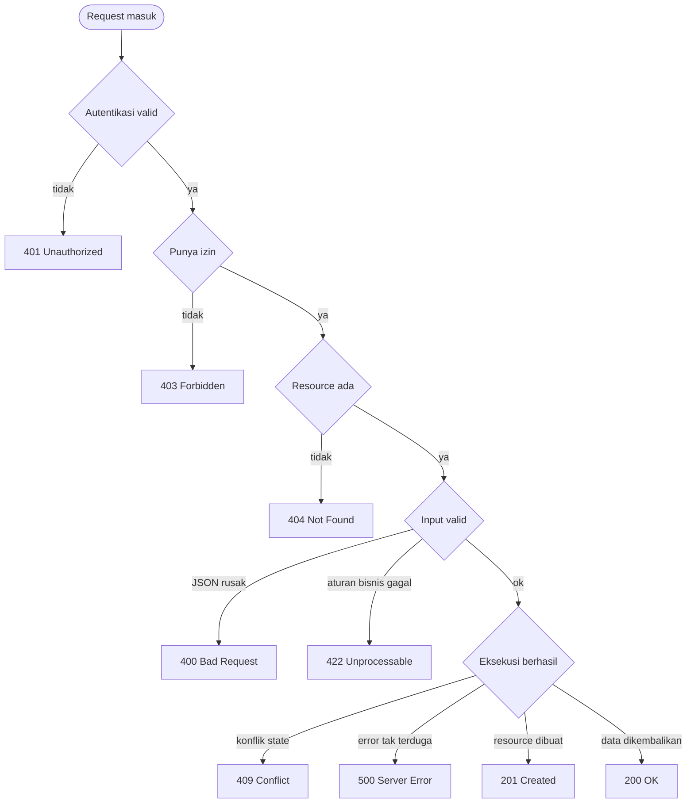
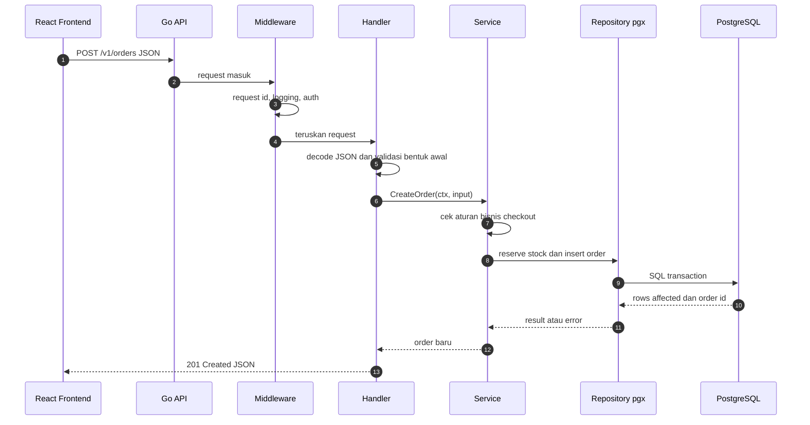

import { Section, Box, Steps, Step, Recap, CardGrid, Card, Chip, Hero, Compare, FileTree, Endpoint, Def } from "@components";

<Hero eyebrow="Roadmap 2 &middot; Web API" title="Fundamental <em>HTTP</em><br />untuk Backend Developer">
  <p>HTTP adalah kontrak komunikasi antara React frontend, Go API, dan sistem lain seperti payment gateway.</p>
  <Fragment slot="meta">
    <Chip icon="code">Bahasa: <b>Go 1.26</b></Chip>
    <Chip icon="route">Roadmap 2</Chip>
    <Chip icon="clock">~65 menit baca</Chip>
  </Fragment>
</Hero>

<Section num="01" id="intro" title="Kenapa HTTP Harus Dikuasai Dulu">

<p class="lead">Sebelum bicara router, middleware, handler, dan framework, backend developer harus paham bahasa yang dipakai client dan server untuk saling bicara.</p>

Kalau kamu datang dari React, kamu mungkin sering menulis `fetch`, `axios.get`, atau mutation di React Query. Di sisi frontend, request terlihat seperti function call ke URL. Di sisi backend Go, request itu bukan function call biasa. Ia adalah pesan HTTP yang membawa method, path, headers, query string, body, dan informasi koneksi.

Kalau kamu datang dari Laravel, kamu sudah mengenal route seperti `Route::get('/products/{id}', ...)`, request object, response JSON, dan middleware. Go juga punya konsep yang sama, tetapi lebih dekat ke protokol dasarnya. Package standar [`net/http`](https://pkg.go.dev/net/http) langsung memberi `http.Request`, `http.ResponseWriter`, `http.Handler`, dan server HTTP tanpa framework besar.

<Box variant="bridge" icon="🌉" label="Jembatan: dari fetch ke handler Go"><p>Di React, `fetch('/v1/products')` mengirim pesan HTTP. Di Go, handler menerima pesan itu sebagai `*http.Request`, lalu menulis balasan lewat `http.ResponseWriter`.</p></Box>

Pada proyek online shop skincare, HTTP menjadi kontrak publik untuk katalog produk, cart, checkout, order history, login, upload bukti pembayaran, dan payment webhook. Jika kontraknya kabur, frontend akan sulit dipakai, error handling berantakan, dan integrasi payment menjadi rapuh.

<Def term="HTTP"><p>HTTP adalah protokol request-response. Client mengirim request berisi niat dan data. Server memprosesnya, lalu mengembalikan response berisi status, metadata, dan body opsional.</p></Def>

</Section>

<Section num="02" id="request-response" title="Request dan Response">

<p class="lead">Setiap interaksi API dimulai dari request dan selesai dengan response.</p>

Request adalah pesan dari client ke server. Client bisa berupa browser, React app, mobile app, cURL, Postman, worker internal, atau payment gateway. Response adalah balasan server yang memberi tahu hasilnya, sukses, gagal karena input, gagal karena hak akses, atau gagal karena server.

```text title="HTTP request sederhana"
GET /v1/products?skin_type=oily&page=1 HTTP/1.1
Host: api.skincare.local
Accept: application/json
Authorization: Bearer eyJhbGciOi...
X-Request-ID: req_7HcP0W
```

```text title="HTTP response sederhana"
HTTP/1.1 200 OK
Content-Type: application/json
X-Request-ID: req_7HcP0W

{
  "data": [
    { "id": "prd_001", "name": "Niacinamide Serum", "price": 129000 }
  ],
  "meta": { "page": 1, "page_size": 20 }
}
```

Di Go, request dibaca dari `*http.Request`. Path ada di `r.URL.Path`, method ada di `r.Method`, query ada di `r.URL.Query()`, header ada di `r.Header`, dan body dibaca dari `r.Body`. Response ditulis ke `http.ResponseWriter`, biasanya dengan status code, header, lalu JSON.

<Compare aLabel="React / JS" bLabel="Go Backend" aTone="muted" bTone="violet">
  <Fragment slot="a"><ul><li>`fetch` menyusun request dan menerima response sebagai object yang bisa dibaca.</li><li>Error jaringan dan HTTP error perlu dibedakan sendiri oleh frontend.</li></ul></Fragment>
  <Fragment slot="b"><ul><li>Handler membaca request dari `*http.Request` dan menulis response secara eksplisit.</li><li>Status code harus dipilih dengan sengaja agar frontend tahu langkah berikutnya.</li></ul></Fragment>
</Compare>

<Box variant="tip" icon="💡" label="Prinsip desain API"><p>Anggap request dan response sebagai kontrak produk. React, mobile, worker, dan payment gateway akan bergantung pada kontrak ini.</p></Box>

</Section>

<Section num="03" id="http-methods" title="HTTP Methods dan Semantiknya">

<p class="lead">HTTP method menjelaskan niat request, bukan sekadar nama teknis.</p>

Di frontend, semua bisa terlihat seperti memanggil URL. Di backend, method adalah bagian penting dari kontrak. `GET /v1/products` dan `POST /v1/products` boleh memakai path yang mirip, tetapi artinya berbeda total.

<CardGrid cols={3}>
  <Card><h4>GET</h4><p>Mengambil data tanpa mengubah state server, misalnya daftar produk atau detail order.</p></Card>
  <Card><h4>POST</h4><p>Membuat resource atau menjalankan aksi yang tidak idempotent, misalnya checkout atau menerima webhook.</p></Card>
  <Card><h4>PUT</h4><p>Mengganti resource secara utuh dan idempotent, cocok untuk update penuh alamat pengiriman.</p></Card>
  <Card><h4>PATCH</h4><p>Mengubah sebagian field, misalnya update quantity satu item cart.</p></Card>
  <Card><h4>DELETE</h4><p>Menghapus resource atau membatalkan hubungan, misalnya hapus item dari cart.</p></Card>
  <Card><h4>OPTIONS</h4><p>Umumnya dipakai browser untuk CORS preflight sebelum request tertentu.</p></Card>
</CardGrid>

<Def term="idempotent"><p>Operasi idempotent memberi hasil akhir yang sama walau request yang sama dikirim berulang. `PUT` biasanya idempotent, `POST /checkout` biasanya tidak.</p></Def>

Contoh semantik pada skincare API:

```text title="Contoh method dan niat"
GET    /v1/products                 # baca daftar produk
GET    /v1/products/prd_001          # baca detail produk
POST   /v1/cart/items                # tambah item baru ke cart
PATCH  /v1/cart/items/item_123       # ubah quantity item cart
DELETE /v1/cart/items/item_123       # hapus item dari cart
POST   /v1/orders                    # buat order dari cart
POST   /v1/payment/webhooks/xendit   # terima event dari payment gateway
```

<Box variant="warn" icon="⚠️" label="Jebakan: semua aksi memakai POST"><p>POST untuk semua endpoint memang cepat di awal, tetapi kontrak API jadi sulit dipahami, cache sulit, observability kabur, dan frontend tidak punya sinyal semantik yang jelas.</p></Box>

</Section>

<Section num="04" id="status-code" title="Status Code yang Wajib Hafal">

<p class="lead">Status code adalah sinyal ringkas untuk client, log, monitoring, dan manusia yang membaca response.</p>

Kamu tidak perlu menghafal semua status code. Untuk backend API sehari-hari, ada sekumpulan kecil yang harus konsisten dipakai. Konsistensi lebih penting daripada variasi yang terlalu kreatif.

<CardGrid cols={3}>
  <Card><h4>200 OK</h4><p>Request berhasil dan response berisi data, misalnya daftar produk atau detail order.</p></Card>
  <Card><h4>201 Created</h4><p>Resource berhasil dibuat, misalnya item cart, order, atau alamat pengiriman baru.</p></Card>
  <Card><h4>400 Bad Request</h4><p>Request tidak valid secara umum, misalnya JSON rusak atau query parameter tidak bisa diparse.</p></Card>
  <Card><h4>401 Unauthorized</h4><p>Client belum terautentikasi atau token tidak valid.</p></Card>
  <Card><h4>403 Forbidden</h4><p>Client sudah dikenal, tetapi tidak punya izin melakukan aksi itu.</p></Card>
  <Card><h4>404 Not Found</h4><p>Resource tidak ditemukan, misalnya product ID tidak ada.</p></Card>
  <Card><h4>409 Conflict</h4><p>Request bentrok dengan state saat ini, misalnya stok habis saat checkout.</p></Card>
  <Card><h4>422 Unprocessable Content</h4><p>JSON valid, tetapi aturan bisnis atau validasi field gagal.</p></Card>
  <Card><h4>500 Internal Server Error</h4><p>Kesalahan tidak terduga di server. Jangan bocorkan detail internal ke client.</p></Card>
</CardGrid>

Diagram berikut membantu memilih status code yang tepat untuk setiap kondisi di Go handler:



<p class="fig-cap"><b>Gambar 1.</b> Pohon keputusan pemilihan status code HTTP di setiap Go handler.</p>

<Compare aLabel="Laravel / PHP" bLabel="Go" aTone="muted" bTone="blue">
  <Fragment slot="a"><ul><li>Framework sering menyediakan helper seperti `response()->json($data, 201)`.</li><li>Exception handler bisa otomatis mengubah exception tertentu menjadi status code.</li></ul></Fragment>
  <Fragment slot="b"><ul><li>Kamu memilih status code secara eksplisit lewat `w.WriteHeader(status)` atau helper milik proyek.</li><li>Error sebagai nilai membuat mapping error ke status code perlu dirancang sendiri.</li></ul></Fragment>
</Compare>

<Box variant="note" icon="🧭" label="401 vs 403"><p>`401` berarti masalah autentikasi. `403` berarti identitas sudah diketahui, tetapi akses ditolak. Jangan membalik keduanya karena frontend biasanya bereaksi berbeda.</p></Box>

</Section>

<Section num="05" id="headers" title="Headers: Metadata untuk API">

<p class="lead">Header adalah metadata request dan response. Ia tidak membawa data domain utama, tetapi sangat penting untuk parsing, keamanan, tracing, dan cache.</p>

Header paling sering kamu sentuh di API backend adalah `Content-Type`, `Authorization`, dan `X-Request-ID`.

<Def term="Content-Type"><p>Header yang memberi tahu media type body. Untuk JSON API, request dan response biasanya memakai `application/json`.</p></Def>

<Def term="Authorization"><p>Header untuk membawa credential, misalnya `Bearer token`. Di Roadmap 7 kita akan menghubungkannya dengan JWT dan session security.</p></Def>

<Def term="X-Request-ID"><p>ID korelasi untuk menelusuri satu request dari client, API, log, database, sampai worker. Sangat berguna saat debugging produksi.</p></Def>

<Def term="Access-Control-Allow-Origin"><p>Header response yang mengizinkan browser dari origin tertentu membaca response. Diperlukan agar React di `localhost:3000` bisa memanggil Go API di `localhost:8080` tanpa diblokir browser. Konfigurasi CORS middleware dibahas di Roadmap 2 Chapter 5.</p></Def>

```text title="Header request checkout"
POST /v1/orders HTTP/1.1
Host: api.skincare.local
Content-Type: application/json
Authorization: Bearer eyJhbGciOi...
X-Request-ID: req_checkout_20260606_0001
```

```text title="Header response checkout"
HTTP/1.1 201 Created
Content-Type: application/json
X-Request-ID: req_checkout_20260606_0001
```

<Box variant="warn" icon="⚠️" label="Jangan simpan rahasia di query string"><p>Token, API key, dan data sensitif jangan dikirim lewat query parameter karena lebih mudah muncul di log, browser history, reverse proxy, dan analytics.</p></Box>

Dalam Go, header adalah map khusus bernama `http.Header`. Ia case-insensitive secara semantik, tetapi tetap gunakan nama standar agar mudah dibaca. Untuk response JSON, set `Content-Type` sebelum menulis body.

```go title="internal/httpjson/response.go"
package httpjson

import (
	"encoding/json"
	"net/http"
)

func WriteJSON(w http.ResponseWriter, status int, payload any) {
	w.Header().Set("Content-Type", "application/json")
	w.WriteHeader(status)
	_ = json.NewEncoder(w).Encode(payload)
}
```

</Section>

<Section num="06" id="body-query-path" title="Body, Query Parameter, dan Path Parameter">

<p class="lead">Tidak semua data request harus masuk ke tempat yang sama. Path, query, header, dan body punya peran berbeda.</p>

Gunakan path parameter untuk identitas resource. Gunakan query parameter untuk filter, sort, search, dan pagination. Gunakan body untuk payload yang kompleks, terutama saat membuat atau mengubah data.

<Compare aLabel="Express / React" bLabel="Go dan chi nanti" aTone="muted" bTone="violet">
  <Fragment slot="a"><ul><li>Express sering menulis `/products/:id` dan membaca `req.params.id`.</li><li>React biasanya menyusun URL dengan template string atau library router.</li></ul></Fragment>
  <Fragment slot="b"><ul><li>chi menulis `/products/{id}` dan membaca dengan `chi.URLParam(r, "id")`.</li><li>`net/http` murni bisa membaca path, tetapi routing param akan lebih nyaman dengan router.</li></ul></Fragment>
</Compare>

```text title="Path, query, dan body"
GET /v1/products/prd_001
# prd_001 adalah path parameter, identitas produk

GET /v1/products?skin_type=oily&sort=price_asc&page=1
# skin_type, sort, dan page adalah query parameter

POST /v1/cart/items
# payload item dikirim di body JSON
```

```json title="request body POST /v1/cart/items"
{
  "product_id": "prd_001",
  "quantity": 2
}
```

<Steps>
  <Step><b>Pilih path untuk resource</b><p>Gunakan noun yang stabil seperti `/v1/products`, `/v1/cart/items`, dan `/v1/orders`.</p></Step>
  <Step><b>Pilih method untuk niat</b><p>`GET` membaca, `POST` membuat atau menjalankan aksi, `PATCH` mengubah sebagian, `DELETE` menghapus.</p></Step>
  <Step><b>Pilih tempat data</b><p>ID di path, filter di query, payload domain di body, metadata teknis di header.</p></Step>
</Steps>

<Box variant="tip" icon="💡" label="Praktik aman"><p>Batasi ukuran body, validasi query parameter, dan jangan percaya path parameter sebelum dicek di service atau repository.</p></Box>

</Section>

<Section num="07" id="json-api" title="Dasar JSON API yang Konsisten">

<p class="lead">JSON API yang baik bukan hanya valid JSON, tetapi juga konsisten dalam bentuk response sukses dan gagal.</p>

Di React, konsistensi response membuat hook lebih sederhana. Di backend Go, konsistensi response membuat handler lebih mudah dites, error lebih mudah dipetakan, dan dokumentasi API lebih mudah ditulis.

```json title="response sukses GET /v1/products/prd_001"
{
  "data": {
    "id": "prd_001",
    "name": "Niacinamide Serum",
    "slug": "niacinamide-serum",
    "price": 129000,
    "stock": 42,
    "skin_types": ["oily", "combination"]
  }
}
```

```json title="response list dengan metadata"
{
  "data": [
    { "id": "prd_001", "name": "Niacinamide Serum", "price": 129000 },
    { "id": "prd_002", "name": "Gentle Cleanser", "price": 99000 }
  ],
  "meta": {
    "page": 1,
    "page_size": 20,
    "total": 84
  }
}
```

```json title="response error validasi"
{
  "error": {
    "code": "VALIDATION_ERROR",
    "message": "quantity must be at least 1",
    "fields": {
      "quantity": "must be greater than 0"
    }
  }
}
```

<Box variant="bridge" icon="🌉" label="Jembatan: dari TypeScript type ke kontrak JSON"><p>Anggap response JSON sebagai type publik yang dipakai frontend. Bedanya, Go tidak tahu type TypeScript kamu, jadi kontrak harus dijaga lewat DTO, test, dan dokumentasi.</p></Box>

Pada modul berikutnya, kita akan mulai menulis helper `writeJSON` dan `readJSON` agar semua handler memakai format yang sama. Jangan biarkan tiap handler menulis bentuk error sendiri-sendiri.

</Section>

<Section num="08" id="endpoint-skincare" title="Endpoint Utama Skincare API">

<p class="lead">Berikut peta awal endpoint yang akan menjadi tulang punggung online shop skincare kita.</p>

<Endpoint method="GET" path="/v1/health" desc="Health check untuk load balancer, deployment, dan monitoring" />
<Endpoint method="GET" path="/v1/products" desc="Daftar produk dengan filter skin type, concern, harga, dan pagination" />
<Endpoint method="GET" path="/v1/products/{id}" desc="Detail produk, termasuk harga, stok ringkas, ingredients, dan rekomendasi pemakaian" />
<Endpoint method="POST" path="/v1/cart/items" desc="Menambahkan produk ke cart customer" />
<Endpoint method="PATCH" path="/v1/cart/items/{id}" desc="Mengubah quantity item cart" />
<Endpoint method="DELETE" path="/v1/cart/items/{id}" desc="Menghapus item dari cart" />
<Endpoint method="POST" path="/v1/orders" desc="Membuat order dari cart dan melakukan reservasi stok" />
<Endpoint method="GET" path="/v1/orders/{id}" desc="Melihat detail order milik customer" />
<Endpoint method="POST" path="/v1/payment/webhooks/xendit" desc="Menerima callback status pembayaran dari payment gateway" />

<Box variant="note" icon="📝" label="Tentang versi API"><p>Prefix `/v1` membuat kontrak lebih aman saat nanti ada perubahan besar. Versi API bukan izin untuk sering breaking change, tetapi pagar untuk evolusi jangka panjang.</p></Box>

Endpoint di atas belum membahas autentikasi, otorisasi, transaksi database, dan validasi penuh. Itu akan datang bertahap. Tujuan chapter ini adalah membaca endpoint sebagai kontrak HTTP yang jelas.

</Section>

<Section num="09" id="alur-request" title="Alur Request dari React ke PostgreSQL">

<p class="lead">Satu request API yang terlihat sederhana biasanya melewati beberapa lapisan sebelum menghasilkan response.</p>



<p class="fig-cap"><b>Gambar 2.</b> Alur request checkout dari React frontend ke Go API sampai PostgreSQL.</p>

Bagian pentingnya adalah setiap lapisan punya tanggung jawab berbeda. Handler memahami HTTP. Service memahami bisnis. Repository memahami database. HTTP status diputuskan di tepi API, tetapi penyebabnya biasanya berasal dari validasi, aturan bisnis, atau database.

<Box variant="tip" icon="💡" label="Mental model backend"><p>Jangan taruh semua logika di handler. Handler sebaiknya menerjemahkan HTTP menjadi input service, lalu menerjemahkan hasil service menjadi HTTP response.</p></Box>

</Section>

<Section num="10" id="hands-on" title="Hands-on Mini API dengan net/http">

<p class="lead">Kita mulai dari `net/http` agar kamu melihat bentuk asli HTTP server Go sebelum chi masuk di chapter berikutnya.</p>

Sejak Go 1.22, `http.ServeMux` mendukung pattern method dan path secara langsung. Ini cukup untuk contoh kecil. Pada proyek besar, kita akan memakai chi karena grouping route, middleware chain, dan path parameter lebih nyaman.

<FileTree title="Struktur mini project" tree={`
cmd/
  api/
    main.go     # server HTTP, handler, dan middleware
go.mod          # module: github.com/kamu/skincare-backend
`} />

```go title="cmd/api/main.go"
package main

import (
	"encoding/json"
	"fmt"
	"log/slog"
	"net/http"
	"time"
)

type productResponse struct {
	ID          string `json:"id"`
	Name        string `json:"name"`
	PriceRupiah int64  `json:"price"`
}

func main() {
	mux := http.NewServeMux()
	mux.HandleFunc("GET /v1/health", healthHandler)
	mux.HandleFunc("GET /v1/products", listProductsHandler)

	srv := &http.Server{
		Addr:              ":8080",
		Handler:           requestID(mux),
		ReadHeaderTimeout: 5 * time.Second,
	}

	slog.Info("api server listening", "addr", srv.Addr)
	if err := srv.ListenAndServe(); err != nil && err != http.ErrServerClosed {
		slog.Error("server stopped", "error", err)
	}
}

func healthHandler(w http.ResponseWriter, r *http.Request) {
	writeJSON(w, http.StatusOK, map[string]string{"status": "ok"})
}

func listProductsHandler(w http.ResponseWriter, r *http.Request) {
	skinType := r.URL.Query().Get("skin_type")
	_ = skinType

	products := []productResponse{
		{ID: "prd_001", Name: "Niacinamide Serum", PriceRupiah: 129000},
		{ID: "prd_002", Name: "Gentle Cleanser", PriceRupiah: 99000},
	}

	writeJSON(w, http.StatusOK, map[string]any{
		"data": products,
		"meta": map[string]any{"page": 1, "page_size": 20},
	})
}

func writeJSON(w http.ResponseWriter, status int, payload any) {
	w.Header().Set("Content-Type", "application/json")
	w.WriteHeader(status)
	if err := json.NewEncoder(w).Encode(payload); err != nil {
		slog.Error("encode response", "error", err)
	}
}

func requestID(next http.Handler) http.Handler {
	return http.HandlerFunc(func(w http.ResponseWriter, r *http.Request) {
		id := r.Header.Get("X-Request-ID")
		if id == "" {
			id = fmt.Sprintf("req_%x", time.Now().UnixNano())
		}
		w.Header().Set("X-Request-ID", id)
		next.ServeHTTP(w, r)
	})
}
```

```bash title="Terminal"
go mod init github.com/kamu/skincare-backend
go run ./cmd/api
```

```bash title="Terminal"
curl -i http://localhost:8080/v1/health
curl -i "http://localhost:8080/v1/products?skin_type=oily&page=1"
```

<Steps>
  <Step><b>Jalankan server</b><p>Gunakan `go run ./cmd/api`, lalu pastikan server mendengar di port `8080`.</p></Step>
  <Step><b>Panggil health check</b><p>Perhatikan status `200`, header `Content-Type`, dan body JSON.</p></Step>
  <Step><b>Panggil daftar produk</b><p>Tambahkan query parameter seperti `skin_type=oily` dan lihat bagaimana Go membacanya lewat `r.URL.Query()`.</p></Step>
</Steps>

<Box variant="warn" icon="⚠️" label="Catatan produksi"><p>Contoh di atas sengaja minimal. Di produksi, request ID harus benar-benar unik (misalnya UUID), log harus membawa request ID di setiap baris, dan graceful shutdown wajib ditambahkan.</p></Box>

</Section>

<Section num="11" id="jebakan-umum" title="Jebakan Umum dari JS dan PHP">

<p class="lead">HTTP terlihat sederhana, tetapi banyak bug backend lahir dari salah menafsirkan detail kecil.</p>

<CardGrid cols={2}>
  <Card><h4>Menganggap 200 untuk semua hal</h4><p>Frontend kehilangan sinyal. Validasi gagal sebaiknya bukan `200`, gunakan `400` atau `422` sesuai konteks.</p></Card>
  <Card><h4>Mencampur auth dan permission</h4><p>Token hilang atau invalid adalah `401`. User valid tetapi tidak boleh akses resource adalah `403`.</p></Card>
  <Card><h4>Menaruh filter kompleks di path</h4><p>Path untuk identitas resource. Filter dan pagination lebih cocok di query parameter.</p></Card>
  <Card><h4>Body GET sebagai kebiasaan</h4><p>Jangan desain `GET` yang butuh body. Banyak client, proxy, dan tooling tidak mengandalkannya.</p></Card>
  <Card><h4>Response error tidak konsisten</h4><p>React akan penuh kondisi khusus jika setiap endpoint mengirim bentuk error yang berbeda.</p></Card>
  <Card><h4>Membocorkan error internal</h4><p>Jangan kirim pesan database mentah ke client. Simpan detail di log, kirim pesan aman ke response.</p></Card>
</CardGrid>

<Box variant="bridge" icon="🌉" label="Jembatan: HTTP error bukan exception"><p>Di JS, `fetch` tidak otomatis throw untuk status `404` atau `500`. Di Go, kamu juga tidak throw. Dua sisi harus sepakat membaca status code dan body error.</p></Box>

<Box variant="note" icon="🧩" label="Kapan pakai 400 atau 422"><p>Gunakan `400` untuk request yang bentuknya tidak bisa dipahami, seperti JSON rusak. Gunakan `422` untuk payload yang bisa dibaca tetapi gagal aturan validasi, seperti quantity `0`.</p></Box>

</Section>

<Section num="12" id="ringkasan" title="Ringkasan & Poin Penting">

<p class="lead">HTTP adalah fondasi semua chapter di Roadmap 2, dari handler `net/http`, routing chi, middleware, validasi, sampai testing API.</p>

<Recap title="Yang Wajib Menempel"><ul><li>Request membawa method, path, query, headers, dan body. Response membawa status code, headers, dan body.</li><li>HTTP method menjelaskan niat. `GET` membaca, `POST` membuat atau menjalankan aksi, `PATCH` mengubah sebagian, `DELETE` menghapus.</li><li>Status code adalah kontrak. Gunakan `200`, `201`, `400`, `401`, `403`, `404`, `409`, `422`, dan `500` secara konsisten.</li><li>`Content-Type`, `Authorization`, `X-Request-ID`, dan `Access-Control-Allow-Origin` adalah header yang wajib akrab untuk API produksi.</li><li>Path parameter untuk identitas, query parameter untuk filter, body untuk payload domain, header untuk metadata teknis.</li><li>JSON response harus konsisten agar frontend React, test, logging, dan dokumentasi API mudah dijaga.</li><li>Dalam proyek skincare, endpoint produk, cart, order, dan payment webhook akan dibangun dari kontrak HTTP ini.</li></ul></Recap>

Langkah berikutnya adalah masuk ke `net/http` lebih serius. Kita akan membedah `http.Handler`, `http.ResponseWriter`, `*http.Request`, helper JSON, timeout server, dan cara menyusun handler yang siap dipindahkan ke chi.

</Section>
