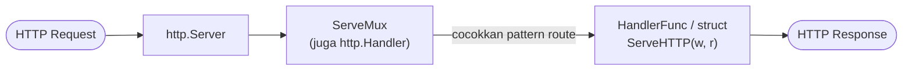
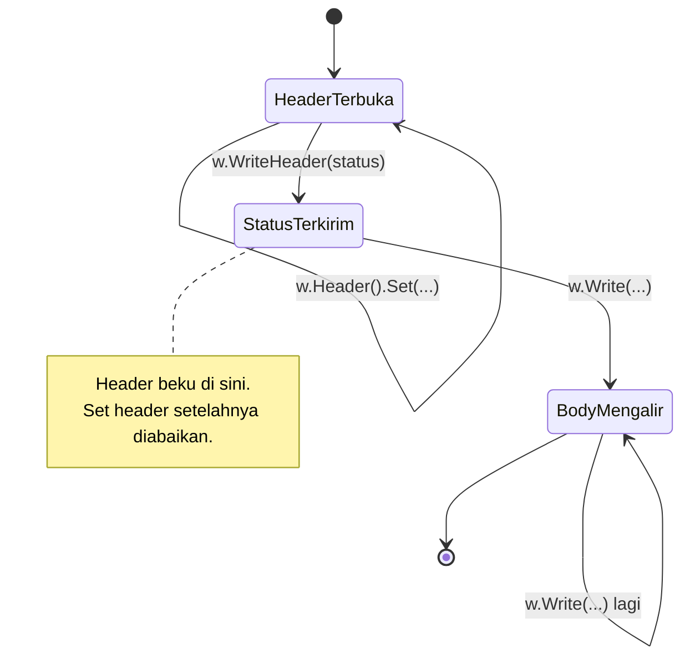
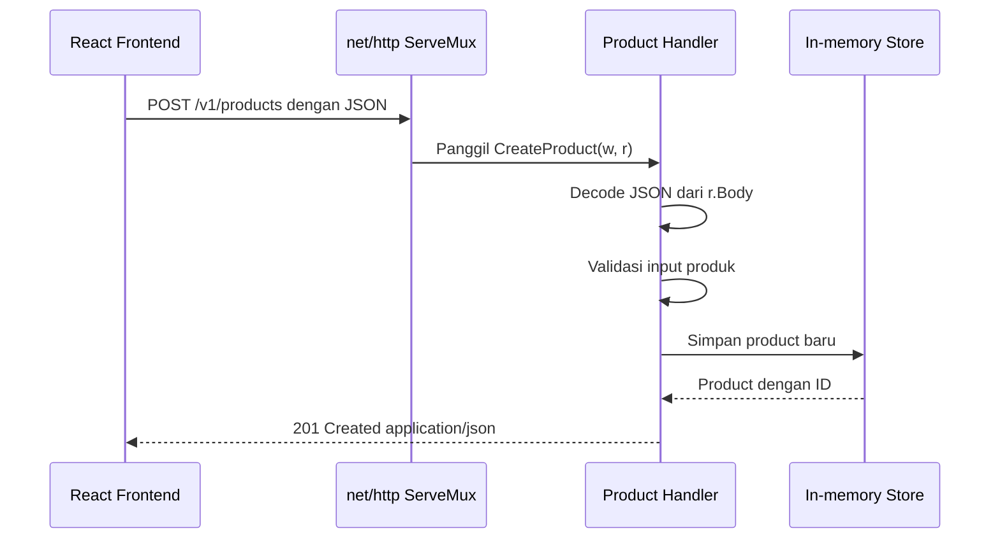

import { Section, Box, Steps, Step, Recap, CardGrid, Card, Chip, Hero, Compare, FileTree, Endpoint, Def } from "@components";

<Hero eyebrow="Roadmap 2 &middot; Web API" title="Membangun HTTP Handler<br /><em>dengan net/http</em>">
  <p>Di modul ini kita membuat API produk skincare memakai standard library dulu, supaya saat masuk chi kamu tahu fondasi yang sedang dibungkus.</p>
  <Fragment slot="meta">
    <Chip icon="code">Bahasa: <b>Go 1.26</b></Chip>
    <Chip icon="route">Roadmap 2</Chip>
    <Chip icon="clock">~60 menit baca</Chip>
  </Fragment>
</Hero>

<Section num="01" id="intro" title="Dari Route Handler ke HTTP Handler" sub="Sebelum chi, pahami kontrak HTTP bawaan Go">

<p class="lead">Kalau kamu pernah menulis Express.js, Laravel controller, atau Next.js route handler, konsep handler di Go punya tujuan yang sama: menerima request, memutuskan respons, lalu mengembalikannya ke client.</p>

Di Express.js kamu biasa menulis fungsi seperti `(req, res) => res.json(data)`. Di Go bentuknya mirip secara mental, tetapi berbeda secara kontrak: handler menerima `http.ResponseWriter` dan `*http.Request`, lalu menulis respons melalui writer.

<Compare aLabel="Express.js route handler" bLabel="Go net/http handler" aTone="muted" bTone="violet">
  <Fragment slot="a"><ul><li>`req` membawa method, path, query, header, dan body.</li><li>`res` punya helper seperti `status()` dan `json()`.</li><li>Framework memberi banyak convenience sejak awal.</li></ul></Fragment>
  <Fragment slot="b"><ul><li>`*http.Request` membawa method, URL, header, body, dan context.</li><li>`http.ResponseWriter` dipakai untuk header, status code, dan body.</li><li>Standard library kecil dan eksplisit, helper perlu kamu buat sendiri.</li></ul></Fragment>
</Compare>

<Box variant="bridge" icon="🌉" label="Jembatan: handler Go bukan controller Laravel"><p>Di Laravel, controller sering langsung punya akses ke request object, validation helper, response helper, middleware group, dan dependency container. Di `net/http`, fondasinya sengaja minimal, sehingga kamu melihat jelas batas antara protokol HTTP, routing, validasi, dan business logic.</p></Box>

Tujuan modul ini bukan membuat arsitektur final. Tujuannya adalah membuat kamu nyaman dengan bahan mentah yang akan dipakai lagi saat memakai chi, handler testing, middleware, context, dan repository PostgreSQL.

</Section>

<Section num="02" id="handler-interface" title="http.Handler dan HandlerFunc" sub="Kontrak paling kecil untuk menerima HTTP request">

<p class="lead">Di Go, server HTTP tidak peduli handler kamu berupa struct, function, atau router besar, selama nilainya memenuhi interface `http.Handler`.</p>

<Def term="http.Handler"><p>Interface dari package `net/http` yang memiliki satu method, yaitu `ServeHTTP(w http.ResponseWriter, r *http.Request)`.</p></Def>

Bentuk sederhananya seperti ini.

```go title="kontrak-handler.go"
type Handler interface {
	ServeHTTP(ResponseWriter, *Request)
}
```

Karena interface Go dipenuhi secara implicit, struct apa pun yang punya method `ServeHTTP` otomatis bisa menjadi handler.

```go title="internal/product/handler_struct.go"
type ProductHandler struct {
	// nanti diisi service atau repository
}

func (h ProductHandler) ServeHTTP(w http.ResponseWriter, r *http.Request) {
	w.WriteHeader(http.StatusOK)
	w.Write([]byte("product handler"))
}
```

Untuk kasus sederhana, kamu tidak perlu membuat struct. `http.HandlerFunc` adalah adapter yang mengubah fungsi biasa menjadi `http.Handler`.

```go title="handlerfunc.go"
func healthHandler(w http.ResponseWriter, r *http.Request) {
	w.WriteHeader(http.StatusOK)
	w.Write([]byte("ok"))
}

mux.HandleFunc("GET /health", healthHandler)
```

<Box variant="tip" icon="💡" label="Idiom praktis"><p>Gunakan function handler untuk endpoint kecil atau modul awal. Gunakan struct handler ketika handler butuh dependency seperti service, logger, validator, atau konfigurasi.</p></Box>

Yang membuat kontrak ini kuat: `http.ServeMux` sendiri juga memenuhi `http.Handler`. Jadi router, middleware, dan handler kamu adalah jenis nilai yang sama, dan bisa saling dibungkus tanpa batas.



<p class="fig-cap"><b>Gambar 1.</b> Semua komponen di rantai ini adalah `http.Handler`, sehingga middleware nanti cukup membungkus handler dan mengembalikan handler lagi.</p>

<CardGrid cols={3}>
  <Card><h4>`http.Handler`</h4><p>Kontrak abstrak. Cocok untuk middleware, router, dan dependency yang bisa dibungkus.</p></Card>
  <Card><h4>`http.HandlerFunc`</h4><p>Convenience untuk fungsi biasa dengan signature handler.</p></Card>
  <Card><h4>`ServeHTTP`</h4><p>Method yang dipanggil server untuk setiap request yang match route.</p></Card>
</CardGrid>

</Section>

<Section num="03" id="request-response" title="Membaca Request dan Menulis Response" sub="Dua objek utama dalam setiap handler">

<p class="lead">Semua handler Go berputar di sekitar dua parameter: `w` untuk menulis respons dan `r` untuk membaca request.</p>

`*http.Request` menyimpan data yang datang dari client. Untuk backend API, bagian yang paling sering kamu baca adalah `r.Method`, `r.URL.Path`, `r.URL.Query()`, `r.Header`, `r.Body`, dan `r.Context()`.

```go title="membaca-request.go"
func debugHandler(w http.ResponseWriter, r *http.Request) {
	method := r.Method
	path := r.URL.Path
	category := r.URL.Query().Get("category")
	requestID := r.Header.Get("X-Request-ID")

	_ = method
	_ = path
	_ = category
	_ = requestID

	w.WriteHeader(http.StatusNoContent)
}
```

`http.ResponseWriter` adalah interface dengan tiga method: `Header()` untuk mengubah header, `WriteHeader(status)` untuk mengirim status code, dan `Write([]byte)` untuk menulis body. Urutan yang aman adalah set header dulu, tulis status code, lalu tulis body.

```go title="menulis-response.go"
func helloHandler(w http.ResponseWriter, r *http.Request) {
	w.Header().Set("Content-Type", "text/plain; charset=utf-8")
	w.WriteHeader(http.StatusOK)
	w.Write([]byte("hello from Go API"))
}
```

Diagram berikut menjelaskan kenapa urutan tadi penting. Begitu status terkirim, header membeku dan tidak bisa diubah lagi.



<p class="fig-cap"><b>Gambar 2.</b> Siklus menulis response. Set semua header sebelum `WriteHeader`, karena setelah status terkirim header tidak berpengaruh lagi.</p>

<Box variant="warn" icon="⚠️" label="Urutan penting"><p>Setelah `WriteHeader` atau `Write` dipanggil, sebagian besar perubahan header tidak akan berpengaruh. Anggap saja respons sudah mulai dikirim ke client.</p></Box>

Dalam proyek online shop skincare, handler produk akan membaca query seperti `category=serum`, header seperti `Authorization`, dan body JSON saat admin membuat produk baru.

<Endpoint method="GET" path="/v1/products?category=serum" desc="Membaca query parameter untuk filter katalog" />
<Endpoint method="POST" path="/v1/products" desc="Membaca request body JSON untuk membuat produk baru" />
<Endpoint method="GET" path="/v1/products/{id}" desc="Membaca path parameter untuk detail produk" />

</Section>

<Section num="04" id="json-api" title="JSON Response dan Request Body" sub="Cara paling umum React frontend bicara dengan Go API">

<p class="lead">React frontend biasanya mengirim dan menerima JSON. Di Go, package `encoding/json` sudah cukup untuk tahap awal.</p>

Untuk respons JSON, set `Content-Type`, status code, lalu pakai `json.NewEncoder(w).Encode(payload)`.

```go title="json-response.go"
type ProductResponse struct {
	ID          int64  `json:"id"`
	Name        string `json:"name"`
	PriceRupiah int64  `json:"price"`
}

func productHandler(w http.ResponseWriter, r *http.Request) {
	product := ProductResponse{
		ID:          1,
		Name:        "Niacinamide Serum",
		PriceRupiah: 189000,
	}

	w.Header().Set("Content-Type", "application/json")
	w.WriteHeader(http.StatusOK)
	json.NewEncoder(w).Encode(product)
}
```

Untuk request JSON, buat struct request, lalu decode dari `r.Body`.

```go title="json-request.go"
type CreateProductRequest struct {
	Name        string `json:"name"`
	Category    string `json:"category"`
	PriceRupiah int64  `json:"price"`
	Stock       int    `json:"stock"`
}

func createProductHandler(w http.ResponseWriter, r *http.Request) {
	var req CreateProductRequest
	if err := json.NewDecoder(r.Body).Decode(&req); err != nil {
		http.Error(w, "invalid JSON", http.StatusBadRequest)
		return
	}

	w.WriteHeader(http.StatusCreated)
}
```

<Box variant="bridge" icon="🌉" label="Jembatan: dari `response.json()` ke `json.Encoder`"><p>Di JavaScript, `response.json()` membaca body response menjadi object. Di Go server, `json.NewEncoder(w).Encode(value)` melakukan kebalikannya: mengubah value Go menjadi JSON lalu menulisnya ke response body.</p></Box>

<Box variant="note" icon="📝" label="Kenapa `price` disimpan sebagai `int64`"><p>Rupiah tidak punya pecahan sen yang dipakai sehari-hari, jadi kita simpan harga sebagai bilangan bulat rupiah (`189000` berarti Rp 189.000). Menghindari `float64` untuk uang adalah praktik standar agar tidak ada galat pembulatan.</p></Box>

Ada dua helper kecil yang hampir selalu kita buat agar handler tidak mengulang boilerplate.

```go title="response.go"
func writeJSON(w http.ResponseWriter, status int, payload any) {
	w.Header().Set("Content-Type", "application/json")
	w.WriteHeader(status)
	if err := json.NewEncoder(w).Encode(payload); err != nil {
		slog.Error("encode response", "error", err)
	}
}

func writeError(w http.ResponseWriter, status int, message string) {
	writeJSON(w, status, map[string]string{"error": message})
}
```

<Box variant="tip" icon="💡" label="Batas body request"><p>Untuk endpoint publik, batasi ukuran `r.Body` dengan `http.MaxBytesReader`. Tanpa batas, client nakal bisa mengirim body sangat besar dan menghabiskan resource server.</p></Box>

```go title="decode-dengan-batas.go"
r.Body = http.MaxBytesReader(w, r.Body, 1<<20) // 1 MB

decoder := json.NewDecoder(r.Body)
decoder.DisallowUnknownFields()
if err := decoder.Decode(&req); err != nil {
	writeError(w, http.StatusBadRequest, "request body tidak valid")
	return
}
```

<Box variant="note" icon="🧩" label="Saat batas terlampaui"><p>Bila body melewati batas, `Decode` mengembalikan error bertipe `*http.MaxBytesError`. Untuk respons yang lebih jujur, kamu bisa memeriksanya dengan `errors.As` lalu membalas `413 Request Entity Too Large`, bukan sekadar `400`.</p></Box>

</Section>

<Section num="05" id="status-code" title="Status Code sebagai Kontrak API" sub="Client React bergantung pada status code yang konsisten">

<p class="lead">Status code bukan kosmetik. Ia adalah kontrak yang membuat frontend, mobile app, worker, dan payment provider tahu hasil request tanpa menebak isi body.</p>

Di Go, status code dikirim dengan `w.WriteHeader(code)`. Bila kamu langsung memanggil `w.Write(...)` tanpa `WriteHeader`, Go akan mengirim `200 OK` secara implicit.

<CardGrid cols={2}>
  <Card><h4>`200 OK`</h4><p>Request sukses dan respons membawa data, misalnya daftar produk.</p></Card>
  <Card><h4>`201 Created`</h4><p>Resource berhasil dibuat, misalnya produk admin atau order checkout.</p></Card>
  <Card><h4>`400 Bad Request`</h4><p>JSON rusak, parameter invalid, atau format request salah.</p></Card>
  <Card><h4>`404 Not Found`</h4><p>Resource tidak ada, misalnya produk dengan ID tertentu tidak ditemukan.</p></Card>
  <Card><h4>`422 Unprocessable Entity`</h4><p>JSON valid, tetapi aturan bisnis gagal, misalnya harga produk 0.</p></Card>
  <Card><h4>`500 Internal Server Error`</h4><p>Error yang tidak bisa dipulihkan di server. Detail internal jangan dibocorkan ke client.</p></Card>
</CardGrid>

```go title="status-code.go"
func createProductHandler(w http.ResponseWriter, r *http.Request) {
	// setelah produk berhasil dibuat
	w.Header().Set("Content-Type", "application/json")
	w.WriteHeader(http.StatusCreated)
	json.NewEncoder(w).Encode(product)
}
```

<Box variant="warn" icon="⚠️" label="Jangan tulis status dua kali"><p>Dalam satu response normal, kamu hanya punya satu status akhir. Setelah `WriteHeader(http.StatusCreated)`, jangan mencoba mengubahnya menjadi `400` di bawahnya.</p></Box>

Pola guard clause dari React sangat cocok di Go. Validasi error lebih baik return lebih awal.

```go title="guard-clause.go"
if err := decoder.Decode(&req); err != nil {
	writeError(w, http.StatusBadRequest, "JSON tidak valid")
	return
}

if req.PriceRupiah <= 0 {
	writeError(w, http.StatusUnprocessableEntity, "harga harus lebih dari 0")
	return
}
```

</Section>

<Section num="06" id="contoh-handler-produk" title="Contoh Lengkap Handler Produk" sub="Satu file lengkap tanpa chi, fokus ke net/http">

<p class="lead">Contoh ini sengaja memakai in-memory store agar perhatian kita tetap pada handler HTTP, bukan database.</p>

<FileTree title="Struktur latihan modul ini" tree={`
skincare-api/
  go.mod
  handler.go        # contoh lengkap modul ini
`} />

```go title="handler.go"
package main

import (
	"encoding/json"
	"errors"
	"log/slog"
	"net/http"
	"os"
	"sort"
	"strconv"
	"strings"
	"sync"
)

type Product struct {
	ID          int64  `json:"id"`
	Name        string `json:"name"`
	Category    string `json:"category"`
	PriceRupiah int64  `json:"price"`
	Stock       int    `json:"stock"`
	Description string `json:"description,omitempty"`
	Status      string `json:"status"`
}

type CreateProductRequest struct {
	Name        string `json:"name"`
	Category    string `json:"category"`
	PriceRupiah int64  `json:"price"`
	Stock       int    `json:"stock"`
	Description string `json:"description"`
}

type ErrorResponse struct {
	Error string `json:"error"`
}

type ProductStore struct {
	mu       sync.RWMutex
	nextID   int64
	products map[int64]Product
}

func main() {
	store := NewProductStore()

	mux := http.NewServeMux()
	mux.HandleFunc("GET /health", healthHandler)
	mux.HandleFunc("GET /v1/products", store.ListProducts)
	mux.HandleFunc("POST /v1/products", store.CreateProduct)
	mux.HandleFunc("GET /v1/products/{id}", store.GetProduct)

	addr := ":8080"
	slog.Info("server listening", "addr", addr)
	if err := http.ListenAndServe(addr, mux); err != nil {
		slog.Error("server stopped", "error", err)
		os.Exit(1)
	}
}

func NewProductStore() *ProductStore {
	return &ProductStore{
		nextID: 4,
		products: map[int64]Product{
			1: {ID: 1, Name: "Hydrating Cleanser", Category: "cleanser", PriceRupiah: 129000, Stock: 40, Status: "active"},
			2: {ID: 2, Name: "Niacinamide Serum", Category: "serum", PriceRupiah: 189000, Stock: 22, Status: "active"},
			3: {ID: 3, Name: "Daily Sunscreen SPF 50", Category: "sunscreen", PriceRupiah: 159000, Stock: 35, Status: "active"},
		},
	}
}

func healthHandler(w http.ResponseWriter, r *http.Request) {
	writeJSON(w, http.StatusOK, map[string]string{"status": "ok"})
}

func (s *ProductStore) ListProducts(w http.ResponseWriter, r *http.Request) {
	category := strings.TrimSpace(r.URL.Query().Get("category"))
	keyword := strings.ToLower(strings.TrimSpace(r.URL.Query().Get("q")))

	s.mu.RLock()
	products := make([]Product, 0, len(s.products))
	for _, product := range s.products {
		if category != "" && product.Category != category {
			continue
		}
		if keyword != "" && !strings.Contains(strings.ToLower(product.Name), keyword) {
			continue
		}
		products = append(products, product)
	}
	s.mu.RUnlock()

	// Iterasi map di Go acak. Urutkan agar urutan list stabil untuk frontend.
	sort.Slice(products, func(i, j int) bool {
		return products[i].ID < products[j].ID
	})

	writeJSON(w, http.StatusOK, products)
}

func (s *ProductStore) GetProduct(w http.ResponseWriter, r *http.Request) {
	id, err := parseID(r.PathValue("id"))
	if err != nil {
		writeError(w, http.StatusBadRequest, "product id harus berupa angka positif")
		return
	}

	s.mu.RLock()
	product, ok := s.products[id]
	s.mu.RUnlock()
	if !ok {
		writeError(w, http.StatusNotFound, "produk tidak ditemukan")
		return
	}

	writeJSON(w, http.StatusOK, product)
}

func (s *ProductStore) CreateProduct(w http.ResponseWriter, r *http.Request) {
	r.Body = http.MaxBytesReader(w, r.Body, 1<<20)

	var req CreateProductRequest
	decoder := json.NewDecoder(r.Body)
	decoder.DisallowUnknownFields()
	if err := decoder.Decode(&req); err != nil {
		writeError(w, http.StatusBadRequest, "request body harus berupa JSON produk yang valid")
		return
	}
	if err := validateCreateProduct(req); err != nil {
		writeError(w, http.StatusUnprocessableEntity, err.Error())
		return
	}

	s.mu.Lock()
	product := Product{
		ID:          s.nextID,
		Name:        strings.TrimSpace(req.Name),
		Category:    strings.TrimSpace(req.Category),
		PriceRupiah: req.PriceRupiah,
		Stock:       req.Stock,
		Description: strings.TrimSpace(req.Description),
		Status:      "active",
	}
	s.products[product.ID] = product
	s.nextID++
	s.mu.Unlock()

	writeJSON(w, http.StatusCreated, product)
}

func validateCreateProduct(req CreateProductRequest) error {
	if strings.TrimSpace(req.Name) == "" {
		return errors.New("nama produk wajib diisi")
	}
	if strings.TrimSpace(req.Category) == "" {
		return errors.New("kategori produk wajib diisi")
	}
	if req.PriceRupiah <= 0 {
		return errors.New("harga produk harus lebih dari 0")
	}
	if req.Stock < 0 {
		return errors.New("stok produk tidak boleh negatif")
	}
	return nil
}

func parseID(raw string) (int64, error) {
	id, err := strconv.ParseInt(raw, 10, 64)
	if err != nil || id <= 0 {
		return 0, errors.New("invalid id")
	}
	return id, nil
}

func writeJSON(w http.ResponseWriter, status int, payload any) {
	w.Header().Set("Content-Type", "application/json")
	w.WriteHeader(status)
	if err := json.NewEncoder(w).Encode(payload); err != nil {
		slog.Error("encode response", "error", err)
	}
}

func writeError(w http.ResponseWriter, status int, message string) {
	writeJSON(w, status, ErrorResponse{Error: message})
}
```

Diagram berikut menunjukkan alur satu request dari React app sampai respons JSON kembali.



<p class="fig-cap"><b>Gambar 3.</b> Alur request di modul ini masih tanpa database. Di Roadmap 3, store akan diganti repository PostgreSQL dengan pgx.</p>

<Box variant="note" icon="📝" label="Tentang `sync.RWMutex` di contoh"><p>Server HTTP Go memproses banyak request secara concurrent. Karena contoh memakai map in-memory yang bisa dibaca dan ditulis beberapa request, kita memakai mutex agar aman. Saat pindah ke PostgreSQL, konsistensi data akan dikelola oleh database dan transaksi.</p></Box>

<Box variant="warn" icon="⚠️" label="Urutan iterasi map tidak dijamin"><p>Berbeda dengan object JavaScript yang menjaga urutan insert, iterasi `map` di Go sengaja diacak. Untuk endpoint list, selalu urutkan hasilnya (di sini dengan `sort.Slice`) supaya frontend menerima urutan yang stabil.</p></Box>

</Section>

<Section num="07" id="servemux-listen" title="ServeMux dan ListenAndServe" sub="Router minimal dan cara menjalankan server">

<p class="lead">`http.ServeMux` adalah router bawaan standard library. Ia menerima pattern route, lalu memilih handler yang sesuai.</p>

Sejak Go 1.22, `ServeMux` mendukung pattern yang lebih ekspresif, termasuk method dan wildcard path. Itu sebabnya contoh kita bisa menulis route seperti ini.

```go title="routes.go"
mux := http.NewServeMux()
mux.HandleFunc("GET /health", healthHandler)
mux.HandleFunc("GET /v1/products", store.ListProducts)
mux.HandleFunc("POST /v1/products", store.CreateProduct)
mux.HandleFunc("GET /v1/products/{id}", store.GetProduct)
```

Nilai wildcard bisa dibaca dengan `r.PathValue("id")`.

```go title="path-value.go"
func (s *ProductStore) GetProduct(w http.ResponseWriter, r *http.Request) {
	idRaw := r.PathValue("id")
	// parse idRaw ke int64
}
```

`http.ListenAndServe` menjalankan server pada address tertentu dan memakai handler yang kamu berikan.

```go title="listen.go"
addr := ":8080"
if err := http.ListenAndServe(addr, mux); err != nil {
	slog.Error("server stopped", "error", err)
	os.Exit(1)
}
```

<Def term="ServeMux"><p>Multiplexer HTTP bawaan Go yang mencocokkan request masuk ke handler berdasarkan pattern route.</p></Def>

<Def term="ListenAndServe"><p>Fungsi yang membuka TCP listener, menerima koneksi HTTP, lalu meneruskan request ke handler.</p></Def>

<Box variant="note" icon="🧭" label="Pattern yang lebih spesifik menang"><p>Bila dua pattern cocok, `ServeMux` memilih yang paling spesifik. `GET /v1/products/{id}` menang atas `GET /v1/products/` untuk path `/v1/products/2`, jadi kamu tidak perlu mengurutkan route secara manual seperti di beberapa router lain.</p></Box>

<Box variant="warn" icon="⚠️" label="Jangan terlalu nyaman dengan `nil` handler"><p>`http.ListenAndServe(":8080", nil)` memakai `http.DefaultServeMux`, yaitu mux global. Untuk proyek serius, buat `http.NewServeMux()` sendiri agar route tidak tersebar lewat global state.</p></Box>

</Section>

<Section num="08" id="kenapa-chi" title="Kenapa Nanti Tetap Pakai chi?" sub="Standard library cukup kuat, tetapi proyek nyata butuh ergonomi lebih">

<p class="lead">Pertanyaan bagus untuk Go modern: kalau `ServeMux` sudah punya method pattern dan wildcard, kenapa masih belajar chi?</p>

Jawabannya bukan karena `net/http` buruk. Justru chi dibangun di atas kontrak `http.Handler`, sehingga kamu tetap memakai fondasi yang sama. chi membantu saat route makin banyak, middleware makin serius, dan struktur API perlu rapi.

<CardGrid cols={2}>
  <Card><h4>Middleware ergonomis</h4><p>Logging, recoverer, timeout, auth, request ID, CORS, dan rate limit lebih mudah dirangkai per group route.</p></Card>
  <Card><h4>Route grouping</h4><p>API versi `/v1`, admin routes, public catalog, cart, checkout, dan webhook bisa dikelompokkan dengan jelas.</p></Card>
  <Card><h4>Integrasi komunitas</h4><p>Banyak middleware dan contoh production yang langsung memakai chi di atas `net/http`.</p></Card>
  <Card><h4>Arsitektur modular</h4><p>Setiap module domain bisa punya function `Routes()` sendiri dan dipasang ke router utama.</p></Card>
</CardGrid>

<Compare aLabel="ServeMux modern" bLabel="chi v5" aTone="blue" bTone="violet">
  <Fragment slot="a"><ul><li>Cukup untuk API kecil dan belajar fondasi.</li><li>Sudah mendukung method pattern dan wildcard path.</li><li>Middleware bisa dibuat, tetapi grouping dan composition lebih manual.</li></ul></Fragment>
  <Fragment slot="b"><ul><li>Cocok untuk API production yang route dan middleware-nya tumbuh.</li><li>Group, mount, middleware stack, dan URL params terasa lebih nyaman.</li><li>Tetap compatible dengan `http.Handler`, `http.HandlerFunc`, dan `httptest`.</li></ul></Fragment>
</Compare>

<Box variant="tip" icon="💡" label="Cara berpikir yang benar"><p>Belajar `net/http` dulu membuat chi terasa seperti alat bantu, bukan sulap. Saat nanti ada bug middleware atau test handler, kamu tahu kontrak aslinya tetap `http.Handler`.</p></Box>

</Section>

<Section num="09" id="hands-on" title="Hands-on: Jalankan API Produk" sub="Latihan cepat sebelum masuk router chi">

<p class="lead">Sekarang jalankan contoh handler produk dan coba request dari terminal.</p>

<Steps>
  <Step><b>Buat folder proyek</b><p>Gunakan module kecil khusus latihan agar tidak bercampur dengan modul lain.</p></Step>
  <Step><b>Salin `handler.go`</b><p>Letakkan file contoh lengkap dari section sebelumnya di root folder latihan.</p></Step>
  <Step><b>Jalankan server</b><p>Pakai `go run .`, lalu biarkan terminal tetap terbuka.</p></Step>
  <Step><b>Coba endpoint</b><p>Pakai `curl` dari terminal lain untuk melihat response JSON dan status code.</p></Step>
</Steps>

```bash title="Terminal"
mkdir skincare-api
cd skincare-api
go mod init github.com/kamu/skincare-backend
# salin handler.go ke folder ini
go run .
```

Coba health check.

```bash title="Terminal"
curl -i http://localhost:8080/health
```

Coba daftar produk dengan filter query.

```bash title="Terminal"
curl -i "http://localhost:8080/v1/products?category=serum"
```

Coba detail produk dengan path parameter.

```bash title="Terminal"
curl -i http://localhost:8080/v1/products/2
```

Coba membuat produk baru.

```bash title="Terminal"
curl -i -X POST http://localhost:8080/v1/products \
  -H "Content-Type: application/json" \
  -d '{"name":"Barrier Repair Moisturizer","category":"moisturizer","price":219000,"stock":18,"description":"Krim pelembap untuk skin barrier"}'
```

<Box variant="note" icon="📝" label="Yang perlu kamu amati"><p>Perhatikan status `201 Created`, header `Content-Type: application/json`, dan body JSON berisi `id` produk baru. Itulah kontrak yang akan dipakai React frontend.</p></Box>

</Section>

<Section num="10" id="jebakan-umum" title="Jebakan Umum dari JS/PHP" sub="Kesalahan kecil yang sering bikin handler Go membingungkan">

<p class="lead">Sebagian bug handler bukan karena Go sulit, tetapi karena kebiasaan dari Express.js atau Laravel terbawa tanpa disesuaikan.</p>

<CardGrid cols={2}>
  <Card><h4>Lupa `return` setelah error</h4><p>Setelah `writeError`, handler tetap lanjut jika tidak `return`. Ini sering membuat response ditulis dua kali.</p></Card>
  <Card><h4>Header ditulis terlambat</h4><p>Set `Content-Type` setelah `WriteHeader` biasanya sudah telat. Tulis header sebelum status dan body.</p></Card>
  <Card><h4>Menganggap JSON otomatis valid</h4><p>`Decode` hanya parsing JSON. Validasi business rule tetap harus kamu tulis sendiri.</p></Card>
  <Card><h4>Membocorkan error internal</h4><p>Jangan kirim pesan error database mentah ke client. Log detail di server, kirim pesan aman ke client.</p></Card>
  <Card><h4>Menggunakan map global tanpa proteksi</h4><p>Server HTTP concurrent. Map yang ditulis banyak request perlu mutex atau diganti database.</p></Card>
  <Card><h4>Mengandalkan `DefaultServeMux`</h4><p>Global mux terasa praktis di awal, tetapi menyulitkan testing dan membuat route tersebar.</p></Card>
  <Card><h4>Iterasi map dianggap terurut</h4><p>Tidak seperti object JS, urutan iterasi `map` Go acak. Urutkan sebelum mengirim list ke client.</p></Card>
  <Card><h4>Lupa membatasi ukuran body</h4><p>Tanpa `http.MaxBytesReader`, satu request besar bisa membebani server. Batasi sejak awal.</p></Card>
</CardGrid>

<Box variant="bridge" icon="🌉" label="Jembatan: Express middleware vs Go middleware"><p>Di Express, middleware adalah function dengan `next()`. Di Go, middleware biasanya function yang menerima `http.Handler` dan mengembalikan `http.Handler`. Kita akan membahas pola ini sebelum masuk chi middleware.</p></Box>

```go title="bentuk-middleware-go.go"
func logging(next http.Handler) http.Handler {
	return http.HandlerFunc(func(w http.ResponseWriter, r *http.Request) {
		slog.Info("request", "method", r.Method, "path", r.URL.Path)
		next.ServeHTTP(w, r)
	})
}
```

</Section>

<Section num="11" id="ringkasan" title="Ringkasan & Poin Penting">

<p class="lead">Sekarang kamu sudah bisa membaca dan menulis HTTP request secara langsung dengan standard library Go.</p>

<Recap title="Yang Wajib Menempel"><ul><li>`http.Handler` adalah kontrak dasar server HTTP Go, dan `http.HandlerFunc` adalah adapter untuk function biasa. `ServeMux` pun memenuhi kontrak yang sama.</li><li>`*http.Request` dipakai untuk membaca method, URL, query, header, body, path value, dan context.</li><li>`http.ResponseWriter` dipakai untuk set header, status code, dan body response, dengan urutan header dulu baru status dan body.</li><li>`json.NewEncoder(w).Encode(...)` adalah cara praktis mengirim respons JSON, sedangkan `json.NewDecoder(r.Body).Decode(&req)` membaca JSON request, dilengkapi `MaxBytesReader` agar body tidak tak terbatas.</li><li>Status code adalah kontrak API, bukan detail kosmetik. Pakai `201` untuk created, `400` untuk request rusak, `422` untuk validasi bisnis, dan `404` untuk resource tidak ada.</li><li>Iterasi `map` Go acak, jadi urutkan output list secara eksplisit agar kontrak ke frontend stabil.</li><li>`ServeMux` modern sudah cukup untuk API kecil, tetapi chi akan membantu route grouping, middleware stack, dan modularisasi API production.</li></ul></Recap>

Untuk proyek online shop skincare, modul ini adalah fondasi endpoint produk. Di modul berikutnya, kita akan mulai merapikan routing dengan chi, lalu lanjut ke middleware, request context, dan akhirnya repository PostgreSQL dengan pgx.

</Section>
